> **Linux Troubleshooting** | Complexity: `[MEDIUM]` | Time: 25-30 min

## Prerequisites

Before starting this module:
- **Required**: [Module 6.1: Systematic Troubleshooting](../module-6.1-systematic-troubleshooting/)
- **Required**: [Module 1.2: Processes & Systemd](/linux/foundations/system-essentials/module-1.2-processes-systemd/)
- **Helpful**: Basic regex knowledge

---

## What You'll Be Able to Do

After this module, you will be able to:
- **Query** logs efficiently with journalctl, grep, awk, and timestamp-based filtering
- **Correlate** events across multiple log sources to build an incident timeline
- **Identify** common error patterns and their root causes from log entries
- **Design** a log aggregation strategy for a multi-service environment

---

## Why This Module Matters

Logs are the first source of truth for debugging. Every application, service, and the kernel itself writes logs. Knowing how to find, read, and analyze logs is fundamental to troubleshooting.

Understanding log analysis helps you:

- **Find error messages** — The exact cause of failures
- **Correlate events** — What happened before the problem?
- **Debug across services** — Trace requests through systems
- **Build monitoring** — Know what to alert on

If you can't read logs effectively, you're debugging blind.

---

## Did You Know?

- **journald stores logs in binary format** — This allows indexing, filtering, and compression. Text logs lose this capability.

- **Log levels have standards** — RFC 5424 defines syslog severity levels: Emergency, Alert, Critical, Error, Warning, Notice, Info, Debug. Applications use these inconsistently.

- **Logs can fill disks** — A misconfigured debug log can fill a disk in minutes. Log rotation exists for a reason.

- **Kubernetes loses pod logs on restart** — Container stdout goes to journald or log files on the node. When pods are deleted, logs go too unless forwarded elsewhere.

---

## Log Sources

### System Logs

```mermaid
graph TD
    classDef category fill:#f9f9f9,stroke:#333,stroke-width:2px;
    classDef item fill:#fff,stroke:#666,stroke-width:1px;

    ROOT[Log Sources]
    
    ROOT --> TRAD[Traditional syslog]
    ROOT --> MOD[Modern journald]
    ROOT --> APP[Application-specific]
    ROOT --> CONT[Container logs]

    TRAD --> T1["/var/log/syslog"]
    TRAD --> T2["/var/log/messages"]
    TRAD --> T3["/var/log/auth.log"]
    TRAD --> T4["/var/log/kern.log"]

    MOD --> M1["journalctl"]
    MOD --> M2["journalctl -u service"]
    MOD --> M3["journalctl _COMM=sshd"]
    MOD --> M4["journalctl -k"]

    APP --> A1["/var/log/nginx/access.log"]
    APP --> A2["/var/log/mysql/error.log"]
    APP --> A3["/var/log/apache2/error.log"]
    APP --> A4["Custom locations"]

    CONT --> C1["docker logs <container>"]
    CONT --> C2["kubectl logs <pod>"]
    CONT --> C3["journalctl CONTAINER_NAME=..."]
    CONT --> C4["Node: /var/log/pods/..."]

    class TRAD,MOD,APP,CONT category;
    class T1,T2,T3,T4,M1,M2,M3,M4,A1,A2,A3,A4,C1,C2,C3,C4 item;
```



### Key Log Files

| Log File | Purpose |
|----------|---------|
| `/var/log/syslog` or `/var/log/messages` | General system logs |
| `/var/log/auth.log` or `/var/log/secure` | Authentication events |
| `/var/log/kern.log` | Kernel messages |
| `/var/log/dmesg` | Boot messages |
| `/var/log/apt/` or `/var/log/dnf.log` | Package manager logs |

---

## journalctl

### Basic Usage

```bash
# All logs
journalctl

# Follow mode (like tail -f)
journalctl -f

# Last 100 lines
journalctl -n 100

# Since boot
journalctl -b

# Previous boot
journalctl -b -1

# No pager (for piping)
journalctl --no-pager
```

### Filtering by Time

> **Pause and predict**: If you need to correlate a database error with a web server error, what is the most reliable piece of information to use across both log sources?

```bash
# Last hour
journalctl --since "1 hour ago"

# Today
journalctl --since today

# Specific time range
journalctl --since "2024-01-15 10:00" --until "2024-01-15 12:00"

# Relative time
journalctl --since "10 minutes ago"
```

### Filtering by Service/Unit

```bash
# Specific service
journalctl -u nginx
journalctl -u sshd

# Multiple services
journalctl -u nginx -u php-fpm

# Kernel messages only
journalctl -k
journalctl --dmesg
```

### Filtering by Priority

```bash
# Errors and above
journalctl -p err

# Warnings and above
journalctl -p warning

# Priority levels:
# 0: emerg, 1: alert, 2: crit, 3: err
# 4: warning, 5: notice, 6: info, 7: debug

# Range
journalctl -p warning..err
```

### Advanced Filtering

```bash
# By process ID
journalctl _PID=1234

# By executable
journalctl _COMM=nginx

# By user
journalctl _UID=1000

# Combine filters
journalctl -u sshd _UID=0 --since "1 hour ago"

# JSON output
journalctl -o json-pretty -n 5
```

---

## Text Log Analysis

### Common Tools

> **Stop and think**: If an application writes hundreds of log lines per second, why might using `grep -C 10` be misleading when trying to find the context of a specific error?

```bash
# View file
less /var/log/syslog
cat /var/log/syslog

# Tail (follow)
tail -f /var/log/syslog
tail -n 100 /var/log/syslog

# Search with grep
grep "error" /var/log/syslog
grep -i "error" /var/log/syslog   # Case insensitive
grep -v "DEBUG" /var/log/app.log  # Exclude

# Multiple patterns
grep -E "error|warning|failed" /var/log/syslog

# Context around matches
grep -B 5 -A 5 "error" /var/log/syslog  # 5 lines before/after
grep -C 3 "error" /var/log/syslog       # 3 lines context

# Count occurrences
grep -c "error" /var/log/syslog
```

### Pattern Extraction

```bash
# Extract IPs
grep -oE '[0-9]+\.[0-9]+\.[0-9]+\.[0-9]+' access.log | sort | uniq -c | sort -rn

# Extract timestamps
grep -oE '[0-9]{4}-[0-9]{2}-[0-9]{2} [0-9]{2}:[0-9]{2}:[0-9]{2}' app.log

# Extract error codes
grep -oE 'HTTP [0-9]{3}' access.log | sort | uniq -c
```

### AWK for Log Processing

```bash
# Print specific columns
awk '{print $1, $4}' access.log

# Sum values
awk '{sum+=$10} END {print sum}' access.log

# Filter and count
awk '$9 == 500 {count++} END {print count}' access.log

# Group by field
awk '{count[$1]++} END {for (ip in count) print ip, count[ip]}' access.log
```

---

## Log Patterns

### Common Error Patterns

```bash
# Connection errors
grep -iE "connection refused|connection reset|timeout" /var/log/syslog

# Permission errors
grep -iE "permission denied|access denied|forbidden" /var/log/syslog

# Resource errors
grep -iE "out of memory|no space|too many open files" /var/log/syslog

# Service failures
grep -iE "failed|error|fatal|critical" /var/log/syslog

# Authentication failures
grep -iE "authentication failure|invalid user|failed password" /var/log/auth.log
```

### Time-Based Analysis

```bash
# Errors per minute
grep "error" app.log | \
  awk '{print $1, $2}' | \
  cut -d: -f1-2 | \
  sort | uniq -c

# First and last occurrence
grep "error" app.log | head -1  # First
grep "error" app.log | tail -1  # Last

# Error rate over time
grep "error" app.log | \
  awk '{print $1}' | \
  sort | uniq -c | \
  awk '{print $2, $1}'
```

### Correlation

```bash
# Find what happened before an error
# (search for 10 lines before the error)
grep -B 10 "FATAL" app.log

# Find related events by timestamp
# 1. Find error timestamp
grep "ERROR" app.log | head -1
# Jan 15 10:23:45 ...

# 2. Search all logs for that time
journalctl --since "10:23:40" --until "10:23:50"

# 3. Check multiple services
journalctl -u nginx -u app -u database --since "10:23:00" --until "10:24:00"
```

---

## Kubernetes Logs

### Pod Logs

> **Pause and predict**: If a pod has crashed and restarted, `kubectl logs pod-name` only shows the logs of the new, running container. Which flag do you need to view the logs of the container that actually crashed?

```bash
# Current pod logs
kubectl logs pod-name

# Previous container (after restart)
kubectl logs pod-name --previous

# Specific container
kubectl logs pod-name -c container-name

# Follow
kubectl logs -f pod-name

# Last 100 lines
kubectl logs --tail=100 pod-name

# Since time
kubectl logs --since=1h pod-name
kubectl logs --since-time="2024-01-15T10:00:00Z" pod-name
```

### Multi-Pod Logs

```bash
# All pods with label
kubectl logs -l app=nginx

# Multiple containers
kubectl logs pod-name --all-containers

# All pods in deployment
kubectl logs deployment/my-deployment
```

### Node-Level Logs

```bash
# Kubelet logs
journalctl -u kubelet

# Container runtime
journalctl -u containerd
journalctl -u docker

# Logs on disk (varies by setup)
ls /var/log/pods/
ls /var/log/containers/
```

---

## Log Management

> **Stop and think**: What happens to the system if `/var/log` fills up completely because logs weren't rotated? How would this affect running services?

### Log Rotation

```bash
# Check logrotate config
cat /etc/logrotate.conf
ls /etc/logrotate.d/

# Example config
cat /etc/logrotate.d/nginx
# /var/log/nginx/*.log {
#     daily
#     missingok
#     rotate 14
#     compress
#     notifempty
#     create 0640 nginx nginx
#     sharedscripts
#     postrotate
#         systemctl reload nginx
#     endscript
# }

# Force rotation
sudo logrotate -f /etc/logrotate.d/nginx

# Debug rotation
sudo logrotate -d /etc/logrotate.conf
```

### journald Configuration

```bash
# Config file
cat /etc/systemd/journald.conf

# Key settings:
# Storage=persistent  # Keep logs across reboots
# Compress=yes
# SystemMaxUse=500M   # Max disk usage
# MaxRetentionSec=1month

# Current disk usage
journalctl --disk-usage

# Clean old logs
sudo journalctl --vacuum-time=7d
sudo journalctl --vacuum-size=500M
```

---

## Common Mistakes

| Mistake | Problem | Solution |
|---------|---------|----------|
| Not checking timestamps | Looking at wrong time period | Always verify log time |
| Case-sensitive search | Missing errors | Use `grep -i` |
| Ignoring previous boot | Problem happened before reboot | `journalctl -b -1` |
| No log forwarding | Logs lost when pod dies | Set up log aggregation |
| Searching too broadly | Too much noise | Filter by service, priority |
| Not checking all logs | Missing correlation | Check multiple sources |

---

## Quiz

### Question 1
A user reports that the web application started throwing 500 errors about 45 minutes ago. You need to quickly isolate the system-level error messages from that specific timeframe to identify the root cause without being overwhelmed by info-level noise. Which command should you run?

<details>
<summary>Show Answer</summary>

```bash
journalctl -p err --since "1 hour ago"
```

Filtering by priority is essential when a system is generating a massive volume of informational logs that can bury the actual problem. By using the `-p err` flag, you instruct `journald` to only display messages with a severity of error (level 3) or higher, immediately cutting through the background noise. The `--since "1 hour ago"` parameter scopes the search down to the exact incident window, ensuring you don't waste time investigating old, unrelated issues. Combining both time and severity filters is the fastest way to surface actionable data during an active outage.

For warnings and errors combined, you can widen the priority slightly:
```bash
journalctl -p warning --since "1 hour ago"
```

</details>

### Question 2
Your Kubernetes node experienced a sudden kernel panic and automatically rebooted. You SSH into the node after it comes back online, but the current logs only show the successful startup sequence. How can you retrieve the logs from right before the crash?

<details>
<summary>Show Answer</summary>

```bash
journalctl -b -1
```

By default, running `journalctl` without arguments shows logs from the current boot, which isn't helpful if you are investigating a crash that just caused a fresh restart. The `-b` flag targets a specific boot session, and appending `-1` explicitly requests the logs from the immediately preceding boot instead of the current one. This allows you to inspect the system's exact state and read the fatal kernel messages (like OOM kills or hardware faults) that were recorded right before the panic occurred. Without this flag, you are entirely blind to the events leading up to the node failure.

To list all available boot sessions and their IDs, you can run:
```bash
journalctl --list-boots
```

</details>

### Question 3
You suspect a newly deployed microservice is occasionally failing to connect to the database. You want to quantify the impact by counting the exact number of times the "database connection timeout" message appears in the application log file. What approaches can you use?

<details>
<summary>Show Answer</summary>

```bash
# Count occurrences
grep -c "database connection timeout" /var/log/app.log

# Group by time
grep "database connection timeout" /var/log/app.log | awk '{print $1}' | sort | uniq -c
```

Counting the raw number of errors helps establish the severity and frequency of an issue rather than just confirming its existence. Using the `-c` flag with `grep` is the most efficient way to get a total count because it avoids printing the matching lines to standard output, simply returning the integer tally. When you need to understand if the errors are a continuous stream or isolated spikes, piping the output to `awk`, `sort`, and `uniq -c` allows you to group the occurrences by timestamp. This time-series approach reveals the pattern of the failures over time, which can point to underlying causes like cron jobs or traffic surges.

</details>

### Question 4
You found a critical "Out of Memory" error in the `/var/log/app.log` file, but the error message itself doesn't specify which transaction caused it. You need to see the log lines immediately preceding and following this error to reconstruct the sequence of events. How can you retrieve this context?

<details>
<summary>Show Answer</summary>

```bash
# 5 lines before and after
grep -C 5 "Out of Memory" /var/log/app.log
```

An isolated error message rarely tells the full story of why a failure occurred, especially in a busy application handling concurrent requests. The context flags in `grep` (`-B` for before, `-A` for after, and `-C` for context in both directions) allow you to see the application's state leading up to the crash, such as the specific user request being processed. By retrieving the preceding lines, you can identify the exact transaction or payload that triggered the "Out of Memory" condition. Alternatively, if you are using `journalctl`, extracting the exact timestamp of the error and querying a narrow time window around it lets you correlate events across multiple system services simultaneously.

</details>

### Question 5
A developer asks for your help because their newly deployed application is failing, but when they run `kubectl logs pod-name`, the output is completely empty. The pod status shows it has been running for 10 minutes. What are the most likely architectural or configurational reasons for this missing log output?

<details>
<summary>Show Answer</summary>

When `kubectl logs` returns nothing, it generally means the container engine isn't capturing the application's standard output or standard error streams. The most common reason is that the application is hardcoded to write its logs directly to a file inside the container's ephemeral filesystem (e.g., `/var/log/app.log`) instead of streaming them to `stdout`. Furthermore, if the pod contains multiple containers (like an Istio sidecar), you might be accidentally querying a sidecar container that hasn't logged anything yet instead of the main application container. Finally, the application framework might be buffering logs in memory before flushing them, or its log level might be set too high to emit any startup messages.

</details>

---

## Hands-On Exercise

### Log Analysis Practice

**Objective**: Use journalctl and traditional log tools to analyze system logs.

**Environment**: Any Linux system with systemd

#### Part 1: journalctl Basics

```bash
# 1. View recent logs
journalctl -n 20

# 2. Check disk usage
journalctl --disk-usage

# 3. List boots
journalctl --list-boots

# 4. Current boot only
journalctl -b -n 50
```

#### Part 2: Filtering

```bash
# 1. Filter by service
journalctl -u sshd -n 20
# Try other services: systemd, NetworkManager, etc.

# 2. Filter by priority
journalctl -p err -n 20
journalctl -p warning..err -n 20

# 3. Filter by time
journalctl --since "30 minutes ago" -n 50
journalctl --since "09:00" --until "10:00"

# 4. Combine filters
journalctl -u sshd -p warning --since today
```

#### Part 3: Text Log Analysis

```bash
# 1. Find a log file to analyze
ls -la /var/log/
LOG_FILE="/var/log/syslog"  # or /var/log/messages

# 2. Basic viewing
tail -20 $LOG_FILE
head -20 $LOG_FILE

# 3. Search for errors
grep -i error $LOG_FILE | tail -10
grep -c -i error $LOG_FILE

# 4. Search with context
grep -C 3 -i error $LOG_FILE | tail -30
```

#### Part 4: Pattern Analysis

```bash
# 1. Find unique error types
grep -i error /var/log/syslog 2>/dev/null | \
  awk '{$1=$2=$3=$4=$5=""; print}' | \
  sort | uniq -c | sort -rn | head -10

# 2. Errors by hour
journalctl -p err --since today --no-pager | \
  awk '{print $3}' | \
  cut -d: -f1 | \
  sort | uniq -c

# 3. Find authentication failures
grep -i "authentication failure\|failed password" /var/log/auth.log 2>/dev/null | tail -10
# Or
journalctl _COMM=sshd | grep -i "failed\|invalid" | tail -10
```

#### Part 5: Correlation Practice

```bash
# 1. Generate an event
logger "TEST: Exercise event at $(date)"

# 2. Find it
journalctl --since "1 minute ago" | grep TEST

# 3. Find related events (same timestamp)
journalctl --since "1 minute ago"

# 4. Export for analysis
journalctl -u sshd --since "1 hour ago" -o json > /tmp/sshd_logs.json
head -5 /tmp/sshd_logs.json
```

#### Part 6: Log Maintenance

```bash
# 1. Check journal size
journalctl --disk-usage

# 2. View rotation config (if exists)
cat /etc/logrotate.d/* 2>/dev/null | head -30

# 3. See what would be cleaned
# (Do not actually clean without understanding)
sudo journalctl --vacuum-time=7d --dry-run 2>/dev/null || \
  echo "dry-run not supported, skip cleanup"
```

### Success Criteria

- [ ] Viewed logs with journalctl using various filters
- [ ] Filtered by service, priority, and time
- [ ] Used grep to search text logs
- [ ] Found patterns and counted occurrences
- [ ] Correlated events across time
- [ ] Checked log maintenance settings

---

## Key Takeaways

1. **journalctl is powerful** — Use filters: `-u`, `-p`, `--since`, field matches

2. **grep with context** — `-B`, `-A`, `-C` show surrounding lines

3. **Time matters** — Always verify you're looking at the right time period

4. **Correlate across services** — Problems often span multiple components

5. **Set up log forwarding** — Ephemeral containers lose logs

---

## What's Next?

In **Module 6.3: Process Debugging**, you'll learn how to trace process behavior with strace, examine /proc, and debug hung or misbehaving processes.

---

## Further Reading

- [journalctl man page](https://www.freedesktop.org/software/systemd/man/journalctl.html)
- [GNU Grep Manual](https://www.gnu.org/software/grep/manual/)
- [AWK One-Liners](https://catonmat.net/awk-one-liners-explained-part-one)
- [Kubernetes Logging Architecture](https://kubernetes.io/docs/concepts/cluster-administration/logging/)