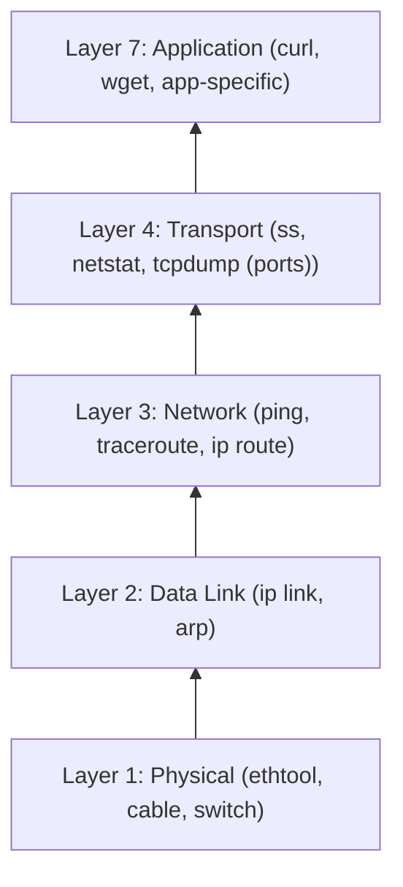
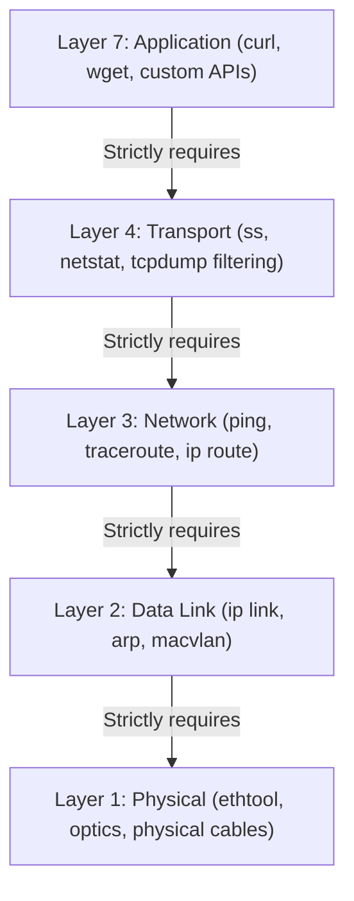

> **Linux Troubleshooting** | Complexity: `[COMPLEX]` | Time: 30-35 min

## Prerequisites

Before starting this module:
- **Required**: [Module 3.1: TCP/IP Essentials](/linux/foundations/networking/module-3.1-tcp-ip-essentials/)
- **Required**: [Module 3.4: iptables & netfilter](/linux/foundations/networking/module-3.4-iptables-netfilter/)
- **Helpful**: [Module 6.1: Systematic Troubleshooting](../module-6.1-systematic-troubleshooting/)

---

## What You'll Be Able to Do

After completing this module, you will be able to:
- **Diagnose** complex network failures using a systematic layer-by-layer methodology spanning physical interfaces to application payloads.
- **Implement** packet capture and filtering strategies using tcpdump to isolate traffic anomalies and protocol violations.
- **Evaluate** socket states and connection queues using socket statistics to identify application bottlenecks and memory leaks.
- **Compare** and contrast routing behaviors across standard Linux network stacks and containerized environments.
- **Debug** Kubernetes-specific networking routing, including service discovery failures, CoreDNS timeouts, and CNI plugin misconfigurations.

---

## Why This Module Matters

On October 4, 2021, Facebook (now Meta) experienced a catastrophic global outage that brought down its flagship app, Instagram, WhatsApp, and Oculus for over six hours. The root cause was not a complex application bug or a malicious cyberattack, but a routine maintenance command that inadvertently withdrew Border Gateway Protocol (BGP) routing paths. This routing failure isolated Facebook's DNS servers from the rest of the internet. Because internal tools also relied on this shared infrastructure, engineers were physically locked out of server rooms and unable to remotely access debugging tools. This single network configuration error cost the company an estimated $100 million in lost revenue.

"The network is down" is the most common blame target for application latency or availability issues. However, the network is rarely a single monolithic entity that simply goes "down." It is a complex hierarchy of hardware, drivers, kernel routing tables, transport protocols, and application logic. Without robust network debugging skills, engineers rely on guesswork, rebooting servers, or tossing tickets over the wall to the network operations center. 

Systematic network debugging empowers you to verify whether the network is actually the problem and to pinpoint the exact failure domain. It allows you to prove your application is functioning correctly by observing packets leaving the host, or conversely, to discover that your local firewall rules are silently dropping inbound traffic. In modern distributed systems and Kubernetes clusters, where microservices communicate constantly over virtual overlay networks, mastering these Linux networking utilities is a non-negotiable requirement for senior operators.

---

## Did You Know?

- On October 4, 2021, a single BGP routing misconfiguration cascaded into a global DNS failure, costing a major social media company an estimated $100 million in downtime.
- The packet analysis tool `tcpdump` was originally authored in 1988 by Van Jacobson, Craig Leres, and Steven McCanne at the Lawrence Berkeley National Laboratory.
- The `ss` command was officially introduced to Linux in 2001 via the `iproute2` package to overcome the severe performance penalties `netstat` faced when parsing massive `/proc` files.
- The maximum transmission unit (MTU) for standard Ethernet frames has remained exactly 1500 bytes since the IEEE 802.3 standard was published in 1983.

---

## Network Debugging Methodology

### Layer-by-Layer Architectural Approach

When confronted with a network failure, haphazardly running commands rarely yields a quick resolution. Senior engineers use the OSI (Open Systems Interconnection) model to strictly isolate problems layer by layer. If Layer 3 (routing) is fundamentally broken, it is impossible for Layer 7 (application APIs) to function. By testing sequentially from the bottom up, you eliminate false positives and drastically reduce your debugging time.



> **Note**: Start at layer 1 and work up. Each layer depends on the layers below it. If layer 3 fails, layer 7 cannot work.

In a modern context, visualizing this dependency chain helps clarify why specific tools map to specific layers. Here is the logical progression of troubleshooting:



### The Quick Connectivity Check Protocol

Before diving into deep packet analysis, you must establish a baseline. This series of commands serves as a triage protocol to identify exactly which layer is currently failing. Run these in sequence whenever a host reports general connectivity loss.

```bash
# 1. Interface up?
ip link show eth0

# 2. IP address assigned?
ip addr show eth0

# 3. Default gateway?
ip route | grep default

# 4. Can reach gateway?
ping -c 3 $(ip route | grep default | awk '{print $3}')

# 5. DNS working?
dig google.com +short

# 6. Can reach internet?
curl -I --max-time 5 https://google.com
```

> **Stop and think**: You execute the triage protocol above. Steps 1 through 4 succeed perfectly, meaning you can ping your local gateway. However, Step 5 (DNS) returns a timeout, but Step 6 (curl) returns a 200 OK if you replace `google.com` with an external IP address. Based on the layer dependencies, where exactly does the failure reside, and what components should you investigate next?

---

## Foundation Layer Diagnostics

### ICMP and Path Tracing

The Internet Control Message Protocol (ICMP) operates alongside IP at Layer 3. It provides vital error reporting and diagnostic capabilities. The `ping` command sends ICMP Echo Requests and waits for Echo Replies. It measures round-trip time and packet loss, serving as the ultimate verification that a path exists between two IP addresses.

```bash
# Basic connectivity
ping -c 4 192.168.1.1

# Continuous until stopped
ping 192.168.1.1

# Set packet size (MTU testing)
ping -s 1472 192.168.1.1  # 1472 + 28 header = 1500

# Flood ping (need root, careful!)
sudo ping -f -c 1000 192.168.1.1

# Set interface
ping -I eth0 192.168.1.1
```

When `ping` fails, or when you experience severe latency, you must visualize the intermediate routers bridging your source to the destination. `traceroute` achieves this by manipulating the Time To Live (TTL) field in IP headers. It sends packets with a TTL of 1, forcing the first router to drop it and return an ICMP Time Exceeded message. It then increments the TTL to 2, mapping the second hop, and so forth until the destination is reached.

```bash
# Trace route to destination
traceroute google.com
# Shows each hop and latency

# Or tracepath (no root needed)
tracepath google.com

# TCP traceroute (bypasses ICMP filters)
traceroute -T -p 443 google.com

# MTU discovery
tracepath -n google.com | grep pmtu
```

### DNS Resolution Forensics

Domain Name System (DNS) is effectively the phonebook of the internet. A vast majority of application-level failures trace back to delayed or entirely broken DNS resolution. The Domain Information Groper (`dig`) tool queries DNS nameservers directly, bypassing the local operating system's resolver cache. This makes it an authoritative tool for verifying external record propagation.

```bash
# Quick lookup
dig google.com +short
# 142.250.185.206

# Full query
dig google.com
# Shows query time, server used, full response

# Specific record types
dig MX google.com
dig TXT google.com
dig NS google.com

# Query specific server
dig @8.8.8.8 google.com

# Reverse lookup
dig -x 8.8.8.8

# Check DNS resolution chain
dig +trace google.com
```

---

## Socket and State Evaluation with `ss`

### Core Socket Inspection

Sockets are the software endpoints that tie an IP address, a protocol, and a port to a specific process ID. The `ss` (Socket Statistics) utility is the modern, highly performant replacement for `netstat`. By querying kernel space directly via Netlink, `ss` can list millions of connections without the high CPU overhead associated with reading from `/proc/net/tcp`.

```bash
# All sockets
ss

# Listening sockets
ss -l

# TCP sockets
ss -t

# UDP sockets
ss -u

# Common combination: listening TCP with process
ss -tlnp
# -t = TCP
# -l = listening
# -n = numeric (no DNS)
# -p = process (needs root for others' processes)
```

### Precision Filtering

Production servers often handle tens of thousands of simultaneous connections. Scrolling through raw output is impossible. The `ss` tool includes a powerful internal filtering engine that allows you to target exact ports, IP ranges, or TCP state machine conditions without piping to `grep`.

```bash
# By state
ss -t state established
ss -t state time-wait
ss -t state close-wait

# By port
ss -tn sport = :22          # Source port 22
ss -tn dport = :443         # Destination port 443
ss -tn '( sport = :22 or dport = :22 )'

# By address
ss -tn dst 192.168.1.0/24

# Complex filters
ss -tn 'dst 192.168.1.1 and dport = :80'
```

### Advanced Connection Analytics

Beyond simply identifying what is listening, `ss` provides profound insights into application health. By grouping socket states, you can detect applications that are leaking memory by failing to close sockets (`CLOSE_WAIT`), or operating systems struggling to recycle ephemeral ports (`TIME_WAIT`). You can also inspect kernel send and receive buffer queues to detect applications that are overwhelmed and unable to process incoming data fast enough.

```bash
# All connections with process info
sudo ss -tunap

# Connection counts by state
ss -tan | awk '{print $1}' | sort | uniq -c

# Many TIME_WAIT? Normal for high traffic
# Many CLOSE_WAIT? App not closing connections properly

# Connections per remote IP
ss -tn | awk '{print $5}' | cut -d: -f1 | sort | uniq -c | sort -rn | head

# Queue sizes (send/recv buffers)
ss -tnm
```

> **Pause and predict**: You are inspecting a heavily trafficked load balancer. You execute `ss -tan | awk '{print $1}' | sort | uniq -c` and observe over 20,000 connections in the `TIME_WAIT` state, but zero in the `CLOSE_WAIT` state. The junior engineer insists this is a critical memory leak that requires rebooting the load balancer. Predict what would actually happen if you rebooted, and explain why the current state is an expected feature of the TCP protocol rather than an application bug.

---

## Packet Level Forensics with `tcpdump`

### Introduction to BPF Filtering

When high-level tools fail to clarify the situation, you must observe the raw bytes transiting the network interfaces. `tcpdump` utilizes the Berkeley Packet Filter (BPF) engine to safely duplicate packets from the kernel network stack into user space. It is unparalleled for proving whether a packet truly arrived at an interface or if it was modified in transit.

```bash
# All traffic on interface
sudo tcpdump -i eth0

# Limit packets
sudo tcpdump -i eth0 -c 100

# Don't resolve names (faster)
sudo tcpdump -i eth0 -n

# Show hex dump
sudo tcpdump -i eth0 -X

# Write to file
sudo tcpdump -i eth0 -w /tmp/capture.pcap

# Read from file
tcpdump -r /tmp/capture.pcap
```

### Constructing Effective Filters

Capturing all traffic on a busy interface will immediately exhaust your disk I/O and obscure the actual data you need. Writing tight, specific BPF expressions is mandatory. You can filter by host IP, strict port numbers, protocols, and even specific bitwise flags within the TCP header.

```bash
# By host
sudo tcpdump -i eth0 host 192.168.1.1

# By port
sudo tcpdump -i eth0 port 80
sudo tcpdump -i eth0 port 80 or port 443

# By protocol
sudo tcpdump -i eth0 tcp
sudo tcpdump -i eth0 udp
sudo tcpdump -i eth0 icmp

# Source or destination
sudo tcpdump -i eth0 src host 192.168.1.1
sudo tcpdump -i eth0 dst port 443

# Complex filters
sudo tcpdump -i eth0 'tcp port 80 and host 192.168.1.1'
sudo tcpdump -i eth0 'tcp[tcpflags] & (tcp-syn) != 0'  # SYN packets only
```

### Payload Inspection and Formatting

While `tcpdump` is primarily a header inspection tool, it can also decode payloads. Adjusting verbosity reveals details like TCP sequence numbers and IP TTL values. Outputting to ASCII allows you to read unencrypted HTTP headers or cleartext protocol commands directly in the terminal, eliminating the need to transfer files to a desktop for Wireshark analysis.

```bash
# Verbose output
sudo tcpdump -v -i eth0
sudo tcpdump -vv -i eth0  # More verbose

# ASCII output
sudo tcpdump -A -i eth0 port 80  # See HTTP headers

# Line buffered (for piping)
sudo tcpdump -l -i eth0 | grep pattern

# Snapshot length
sudo tcpdump -s 96 -i eth0  # Capture only headers
sudo tcpdump -s 0 -i eth0   # Capture full packets
```

### Identifying Common Protocol Signatures

Network analysts frequently search for specific packet signatures to quickly diagnose issues. By targeting the exact byte offsets where HTTP verbs or TCP flags reside, you can filter gigabytes of data down to a handful of relevant interactions. For example, isolating TCP connection establishments or specific HTTP GET requests can immediately highlight application anomalies.

```bash
# See TCP handshakes
sudo tcpdump -i eth0 'tcp[tcpflags] & (tcp-syn|tcp-fin) != 0'

# See HTTP requests
sudo tcpdump -i eth0 -A 'tcp port 80 and tcp[32:4] = 0x47455420'  # GET
sudo tcpdump -i eth0 -A 'tcp port 80 and tcp[32:4] = 0x504f5354'  # POST

# See DNS queries
sudo tcpdump -i eth0 udp port 53

# Capture for Wireshark
sudo tcpdump -i eth0 -w capture.pcap -s 0 port 443
# Then open capture.pcap in Wireshark
```

---

## War Stories: Debugging Common Symptoms

### Diagnosing "Connection Refused"

A "Connection Refused" error means that the network path is completely functional, and your packets successfully reached the destination host. However, the host operating system actively rejected the connection by returning a TCP RST (Reset) packet. This almost always signifies an application-layer problem, not a routing issue.

```bash
# Means: TCP connection reached host, but nothing listening

# 1. Check if service is listening
ss -tlnp | grep :80

# 2. Check if on correct interface
ss -tlnp | grep :80
# 127.0.0.1:80 = only localhost
# 0.0.0.0:80 = all interfaces
# :::80 = all IPv6

# 3. Check firewall
sudo iptables -L -n | grep 80

# 4. Check service status
systemctl status nginx
```

### Diagnosing "Connection Timed Out"

A "Connection Timed Out" error is drastically different. It indicates that the client sent a TCP SYN packet but never received any response at all. The packet was swallowed by a black hole somewhere along the path. This implies that intermediate routers are dropping the traffic, a firewall is configured to silently DROP rather than REJECT, or the target host is completely powered off.

```bash
# Means: No response at all (firewall, routing, or host down)

# 1. Can you reach the host at all?
ping target_host

# 2. What happens to packets?
traceroute target_host

# 3. Is it just that port?
nc -zv target_host 22  # Try SSH
nc -zv target_host 80  # Try HTTP

# 4. Check routing
ip route get target_ip

# 5. Capture and see what's happening
sudo tcpdump -i eth0 host target_host
```

### Diagnosing "No Route to Host"

"No Route to Host" occurs extremely early in the networking sequence. It means that the local Linux kernel looked at its internal routing tables and could not find a valid interface or gateway capable of forwarding the packet toward the requested destination IP. This usually points to a missing default gateway or a downed local interface.

```bash
# Means: Kernel doesn't know how to reach this network

# 1. Check routing table
ip route
ip route get target_ip

# 2. Is default route present?
ip route | grep default

# 3. Is gateway reachable?
ping $(ip route | grep default | awk '{print $3}')

# 4. Check interface is up
ip link show
ip addr show
```

### Isolating DNS Infrastructure Issues

When an application logs errors about being unable to resolve a hostname, the failure might reside in the local configuration or at the upstream provider. Testing the local resolver configuration against known external resolvers quickly delineates where the breakdown is occurring.

```bash
# 1. Is DNS configured?
cat /etc/resolv.conf

# 2. Can reach DNS server?
ping $(grep nameserver /etc/resolv.conf | head -1 | awk '{print $2}')

# 3. Does query work?
dig @8.8.8.8 google.com  # Use known-good DNS
dig google.com           # Use configured DNS

# 4. Check for NXDOMAIN vs timeout
dig nonexistent.google.com  # NXDOMAIN is normal
dig google.com              # Timeout means DNS issue

# 5. Slow DNS?
dig google.com | grep "Query time"
# >100ms is slow
```

---

## Kubernetes Context: Navigating Overlay Networks

### Pod-to-Pod Connectivity

Kubernetes fundamentally alters traditional Linux networking by wrapping traffic in overlay protocols like VXLAN or utilizing BGP routing via Container Network Interfaces (CNI). When debugging pod networking, you must verify connectivity from within the isolated network namespace of the container itself, as the host node's routing tables will differ significantly.

```bash
# Get pod IP
kubectl get pod my-pod -o wide

# Check connectivity from another pod
kubectl exec other-pod -- curl my-pod-ip:8080
kubectl exec other-pod -- ping my-pod-ip

# DNS resolution
kubectl exec my-pod -- nslookup kubernetes
kubectl exec my-pod -- nslookup my-service

# Check service endpoints
kubectl get endpoints my-service
```

### Analyzing Service Abstractions

Kubernetes Services provide stable virtual IP addresses that load balance across dynamic pod IPs. If a Service is unreachable, the underlying pods might be failing their readiness probes, resulting in empty endpoint lists. Testing from an ephemeral debug container inside the cluster allows you to validate the internal cluster DNS and routing mechanisms cleanly.

```bash
# Does service exist?
kubectl get svc my-service

# Does it have endpoints?
kubectl get endpoints my-service
# Empty = no pods matching selector

# Test from inside cluster
kubectl run debug --rm -it --image=alpine -- sh
# Inside: wget -qO- my-service:80

# Check DNS
kubectl exec my-pod -- nslookup my-service.default.svc.cluster.local
```

### Node-Level Traffic Interception

Ultimately, all Kubernetes overlay traffic physically traverses the host node's network interfaces. By dropping down to the node level, you can use `iptables` to analyze the NAT rules generated by `kube-proxy`, inspect the CNI plugin configuration directories, or deploy `tcpdump` on the physical interface to prove that encapsulated packets are successfully leaving the server.

```bash
# On node, check CNI
ls /etc/cni/net.d/

# Check kube-proxy
iptables -t nat -L KUBE-SERVICES -n | head -20

# Check node can reach pod network
ip route | grep -E "10.244|10.96"

# tcpdump on node
sudo tcpdump -i any host <pod-ip>
```

---

## Common Mistakes

| Mistake | Why | Fix |
|---------|---------|----------|
| Running `tcpdump` without a filter | Massive capture volumes will instantly overwhelm terminal output and fill the storage disk | Always define a host, port, or protocol filter before execution |
| Forgetting the `-n` parameter | DNS lookups for every captured IP address will severely block and slow down packet display | Always append `-n` to ensure fast, numeric output |
| Blaming the network layer first | The missing network response is frequently caused by a silent application crash or panic | Verify that traffic actually enters the machine with `tcpdump` |
| Ignoring local node firewalls | Strict `iptables` or `nftables` configurations might silently drop traffic before the application sees it | Check active rules utilizing `iptables -L -n` |
| Monitoring the wrong interface | Traffic might be flowing over an unexpected bonded NIC, tunnel, or Docker bridge | Verify the exact routing interface using `ip route get` |
| Not verifying DNS resolution | Everything seems generally slow or completely unreachable despite valid routing | Run a quick `dig` test against the target domain before assuming packet loss |
| Mistaking `TIME_WAIT` for failure | It is a mandatory TCP state designed to handle delayed packets gracefully during teardown | Do not artificially kill them unless ephemeral ports are fully exhausted |
| Overlooking asymmetric routing | In complex environments, return packets take a different path and are dropped by stateful firewalls | Capture traffic simultaneously on both endpoints to confirm bidirectional flow |

---

## Quiz

### Question 1
You suspect a rogue background service is binding to port 443 on your ingress server, preventing NGINX from starting. Evaluate the best command-line approach to identify the PID holding this port.

<details>
<summary>Show Answer</summary>

The most effective modern approach leverages the `ss` command to directly query the kernel for listening TCP sockets. 

```bash
# Best option
ss -tlnp | grep :443

# Or netstat (older)
netstat -tlnp | grep :443

# Or lsof
lsof -i :443
```

By providing the `-tlnp` flags, you request TCP (`-t`), listening (`-l`), numeric (`-n`), and process ID (`-p`) details. Executing this command as a privileged user reveals exactly which process name and PID currently own the socket bind, allowing you to kill the conflicting application immediately. The legacy `netstat` and `lsof` commands perform similar functions but are generally slower on heavily loaded systems.

</details>

### Question 2
A developer complains they cannot reach their database. They show you two different terminal outputs. In terminal A, `curl` reports "connection refused". In terminal B, `curl` against a different server reports "connection timed out". Diagnose the distinct architectural failures represented by these two errors.

<details>
<summary>Show Answer</summary>

A **Connection refused** error signifies that the network is perfectly healthy, routing is correct, and the target host actively received the packet. The host operating system examined the packet, found no application listening on that specific port, and proactively returned a TCP RST (Reset) packet. This is almost always an application failure or misconfiguration.

Conversely, a **Connection timed out** error indicates a complete lack of response from the destination. The client sent a TCP SYN packet but it vanished entirely. This strongly suggests the host is powered down, a router lacks a valid path, or an intermediate firewall is configured to silently DROP traffic rather than explicitly REJECT it. 

</details>

### Question 3
You are investigating a severe SYN flood attack against your edge load balancers. You need to write a `tcpdump` filter that strictly captures incoming connection initiation attempts without capturing the massive volume of established payload data. Construct the appropriate filter.

<details>
<summary>Show Answer</summary>

You must utilize BPF bitwise operators to isolate packets where only the SYN flag is set in the TCP header. 

```bash
sudo tcpdump -i eth0 'tcp[tcpflags] & tcp-syn != 0'
```

This filter effectively isolates the beginning of the TCP three-way handshake, capturing both the initial SYN from the client and the returning SYN-ACK from the server. By zeroing in on connection initiation, you avoid analyzing established payload packets. If your goal is to exclusively capture the inbound SYN (and explicitly ignore the SYN-ACK response), you can implement a strict equivalence check:

```bash
sudo tcpdump -i eth0 'tcp[tcpflags] == tcp-syn'
```

This precision filtering allows you to monitor connection rates without flooding your disk with payload gigabytes.

</details>

### Question 4
An API Gateway returns a "502 Bad Gateway" error to external clients. The gateway administrator insists the network routing between the proxy and the backend microservice is broken. Outline a systematic methodology to determine if the failure is network connectivity or an application layer crash.

<details>
<summary>Show Answer</summary>

A 502 Bad Gateway implies the proxy successfully routed the request, but the upstream backend returned an invalid response or abruptly closed the socket. You must verify the backend's behavior independently.

```bash
# 1. Check if backend is listening
ss -tlnp | grep :backend_port

# 2. Test connectivity to backend directly
curl http://backend:port/health

# 3. Capture traffic
sudo tcpdump -i any port backend_port

# 4. Check backend logs
journalctl -u backend-service

# 5. Check proxy error logs
tail /var/log/nginx/error.log
```

By bypassing the proxy and testing the backend endpoint directly with `curl`, you isolate the failure domain. If the backend responds correctly to manual requests but `tcpdump` reveals the proxy is sending malformed headers, the issue is proxy configuration. If the backend drops the connection, it is an application-level failure.

</details>

### Question 5
A monitoring alert triggers indicating a server has exhausted its available socket resources. When investigating, you discover thousands of connections stuck in the `TIME_WAIT` state. Evaluate why this is happening and explain the strategy required to identify the root cause.

<details>
<summary>Show Answer</summary>

The `TIME_WAIT` state is a fundamental, required feature of the TCP protocol. It prevents delayed packets from an old connection from corrupting a new, subsequent connection that happens to be assigned the same ephemeral port.

```bash
# Count TIME_WAIT
ss -tan state time-wait | wc -l

# By remote address
ss -tan state time-wait | awk '{print $4}' | cut -d: -f1 | sort | uniq -c | sort -rn

# The process that created the connection is no longer associated
# TIME_WAIT is kernel state, not process state

# To find which application is creating connections:
# 1. Look at ESTABLISHED first
ss -tnp state established | grep ":target_port"

# 2. Monitor in real-time
watch 'ss -tan state time-wait | wc -l'
```

Because the application has already successfully closed the socket from its perspective, the process ID is no longer associated with the `TIME_WAIT` entry. To trace the source, you must analyze the active `ESTABLISHED` connections to see which process is heavily cycling connections. In high-traffic environments, a high `TIME_WAIT` count is completely normal unless ephemeral ports are fully depleted.

</details>

### Question 6
A Kubernetes developer submits a ticket stating their application pod cannot reach an external managed database. You execute a `tcpdump` on the worker node's physical external interface and observe TCP SYN packets leaving the node, but no SYN-ACK packets are returning. However, when you run `tcpdump` on the pod's virtual ethernet (`veth`) interface, you see both the outbound SYN and the inbound SYN-ACK. Diagnose this contradictory packet behavior.

<details>
<summary>Show Answer</summary>

This contradictory behavior is a classic symptom of asymmetric routing or misconfigured Network Address Translation (NAT). The outbound SYN packet leaves the pod, traverses the `veth` interface, and exits the node's physical interface correctly. The external database receives the SYN and sends a SYN-ACK response.

However, the response packet is likely returning to a different physical interface, a different worker node entirely, or is being swallowed by the node's `iptables` before it hits the external interface you are monitoring. The fact that the pod's internal `veth` sees the SYN-ACK proves the database is responding. The failure resides strictly in how the host's kernel networking stack or cloud provider fabric is routing the returning ingress traffic back to the node. 

</details>

### Question 7
You are troubleshooting intermittent latency to an external API. You execute a `traceroute` and notice that hop number 4 returns `* * *` indicating a timeout. However, hops 5 through 12 respond with perfectly normal, low-latency timestamps. A junior administrator concludes that the router at hop 4 is fundamentally broken and actively dropping your packets. Evaluate this conclusion.

<details>
<summary>Show Answer</summary>

The junior administrator's conclusion is incorrect. A router completely dropping packets would sever the path, preventing hops 5 through 12 from ever receiving traffic. The sequence of timeouts strictly at hop 4 indicates a deliberate security or performance policy on that specific intermediate device.

Modern internet backbone routers prioritize forwarding data plane traffic (your actual application packets) as fast as possible using hardware ASICs. Processing ICMP Time Exceeded messages requires punting the packet to the router's control plane CPU. To prevent CPU exhaustion or mitigate reconnaissance attacks, network engineers frequently configure core routers to rate-limit or silently drop ICMP TTL expiration generation. The application packets continue flowing seamlessly through the device.

</details>

---

## Hands-On Exercise

### Network Debugging Practice

**Objective**: Apply systematic network debugging utilities to trace connectivity, analyze socket states, capture raw packets, and diagnose a simulated failure.

**Environment**: Any standard Linux environment or virtual machine with root access.

#### Part 1: Establish Baseline Connectivity

Verify the foundational configuration of your host by interrogating the IP stack and routing tables. Identify your gateway and confirm outbound ICMP routing.

```bash
# 1. Check your network config
ip addr show
ip route

# 2. Test gateway
GATEWAY=$(ip route | grep default | awk '{print $3}')
echo "Gateway: $GATEWAY"
ping -c 3 $GATEWAY

# 3. Test internet
ping -c 3 8.8.8.8

# 4. Test DNS
dig google.com +short
```

<details>
<summary>View Expected Outcome</summary>
You should observe a local IP address assigned to an interface (e.g., eth0 or ens33). The gateway test should return three successful ICMP replies, confirming local subnet routing is functional. The internet and DNS tests validate upstream provider connectivity.
</details>

#### Part 2: Socket Analysis and State Filtering

Explore the active socket table on your system. Filter the output to categorize listening services, active connections, and historical connections.

```bash
# 1. Listening sockets
ss -tlnp

# 2. All connections
ss -tan | head -20

# 3. Count by state
ss -tan | awk 'NR>1 {print $1}' | sort | uniq -c

# 4. Filter to specific port
ss -tn 'dport = :443' | head -10

# 5. Show process info (needs root)
sudo ss -tlnp | grep LISTEN
```

<details>
<summary>View Expected Outcome</summary>
The output will list critical system daemons (like SSHD on port 22). The state aggregation command provides a summarized snapshot of your network health, categorized by ESTABLISHED, LISTEN, and TIME_WAIT statuses.
</details>

#### Part 3: Packet Capture Foundations

Initiate basic packet captures utilizing BPF syntax. Observe the raw bytes generated by ICMP, DNS, and HTTP traffic. 

```bash
# 1. Capture any traffic (brief)
sudo timeout 5 tcpdump -i any -c 20 -n

# 2. Capture ping
# In one terminal:
sudo tcpdump -i any icmp
# In another:
ping -c 3 8.8.8.8

# 3. Capture DNS
sudo tcpdump -i any udp port 53 -c 10 &
dig google.com
# Wait for capture

# 4. Capture HTTP (if you have a web server)
sudo tcpdump -i any tcp port 80 -c 20 -A
```

<details>
<summary>View Expected Outcome</summary>
You will witness the exact correlation between executing a high-level command (like `dig`) and the resulting UDP datagrams traversing port 53. The ASCII output flag (`-A`) will reveal cleartext headers if you execute the HTTP capture against an unencrypted web service.
</details>

#### Part 4: Diagnose Synthetic Connectivity Drops

Execute a triage simulation to prove host reachability, isolate routing failures, and validate external name resolution.

```bash
# Simulate debugging flow

# 1. Check if service reachable
nc -zv google.com 443 && echo "Port 443 reachable"

# 2. Check DNS resolution
dig google.com +short || echo "DNS failed"

# 3. Check routing
ip route get 8.8.8.8

# 4. Traceroute
tracepath -n google.com 2>/dev/null | head -10 || traceroute -n google.com 2>/dev/null | head -10
```

<details>
<summary>View Expected Outcome</summary>
The `nc` (netcat) command will confirm Layer 4 TCP handshakes are succeeding without requiring a full application payload. The route checks and tracepath will map the packet egress path out of your local network environment.
</details>

#### Part 5: Deep DNS Debugging

Interrogate your system's DNS resolver configuration. Validate the upstream nameservers and analyze query latency to identify potential bottlenecks.

```bash
# 1. Check configured DNS
cat /etc/resolv.conf

# 2. Test DNS server
dig @$(grep nameserver /etc/resolv.conf | head -1 | awk '{print $2}') google.com +short

# 3. Query time
dig google.com | grep "Query time"

# 4. Trace resolution
dig +trace google.com | tail -20
```

<details>
<summary>View Expected Outcome</summary>
The configuration output will reveal whether you are relying on a local stub resolver (like `systemd-resolved` at 127.0.0.53) or an external provider. The `+trace` argument provides an invaluable view of the iterative DNS resolution process from the root servers down to the authoritative zone.
</details>

#### Part 6: Create, Intercept, and Debug an Application

Launch a temporary local web service. Connect to it while simultaneously capturing the traffic loopback interface to observe a complete application interaction.

```bash
# Start a simple server (Python 3)
python3 -m http.server 8888 &
SERVER_PID=$!
sleep 2

# 1. Find it listening
ss -tlnp | grep 8888

# 2. Test connection
curl -I http://localhost:8888

# 3. Capture the traffic
sudo timeout 5 tcpdump -i lo port 8888 -n &
sleep 1
curl -s http://localhost:8888 > /dev/null

# 4. Clean up
kill $SERVER_PID 2>/dev/null
```

<details>
<summary>View Expected Outcome</summary>
You will observe the Python process bind to port 8888 via `ss`. The `tcpdump` capture on the loopback (`lo`) interface will intercept the internal kernel traffic, demonstrating that network tools are equally effective for debugging microservices running on the exact same physical host.
</details>

### Success Criteria Checklist

- [ ] Verified physical and virtual network configuration using the `ip` suite.
- [ ] Analyzed and filtered socket states using `ss` to identify application bind points.
- [ ] Successfully captured targeted packets utilizing `tcpdump` and BPF expressions.
- [ ] Tested and traced external DNS resolution latency using `dig`.
- [ ] Traced internet network paths effectively with `traceroute` or `tracepath`.
- [ ] Stood up a local service and successfully intercepted its loopback traffic.

---

## Key Takeaways

1. **Strict Layer-by-Layer Verification** — Never begin debugging an application timeout without first verifying physical links, IP addressing, and routing paths. Follow the OSI model to eliminate foundational variables.
2. **Prefer ss over netstat** — Modern Linux environments require the performance and extensive filtering capabilities of `ss`. Legacy tools cannot handle the connection volumes present in cloud environments.
3. **tcpdump is the Ultimate Truth** — Application logs can be misleading, but wire data cannot lie. Raw packet captures definitively prove whether traffic arrived at an interface or was dropped.
4. **Always Interrogate DNS First** — A vast majority of abstract network failures, latency spikes, and application timeouts are disguised DNS resolution failures. Start your triage with `dig`.
5. **Mandatory Filtering** — Executing an unfiltered packet capture on a production node is dangerous. Always apply precise BPF filters to target specific protocols, ports, and hosts.

---

## What's Next?

In **Module 7.1: Bash Fundamentals**, you'll transition from executing isolated debugging commands to learning core shell scripting. You will discover how to chain these networking utilities together to automate system diagnostics, parse logs programmatically, and streamline your operational triage workflows.

---

## Further Reading

- [Module 3.1: TCP/IP Essentials](/linux/foundations/networking/module-3.1-tcp-ip-essentials/)
- [Module 3.4: iptables & netfilter](/linux/foundations/networking/module-3.4-iptables-netfilter/)
- [Module 6.1: Systematic Troubleshooting](../module-6.1-systematic-troubleshooting/)
- [tcpdump Man Page](https://www.tcpdump.org/manpages/tcpdump.1.html)
- [ss Man Page](https://man7.org/linux/man-pages/man8/ss.8.html)
- [Wireshark User Guide](https://www.wireshark.org/docs/wsug_html/)
- [Kubernetes Debugging Services](https://kubernetes.io/docs/tasks/debug-application-cluster/debug-service/)