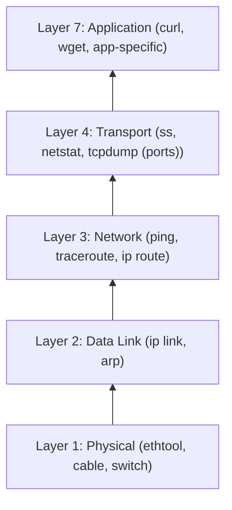
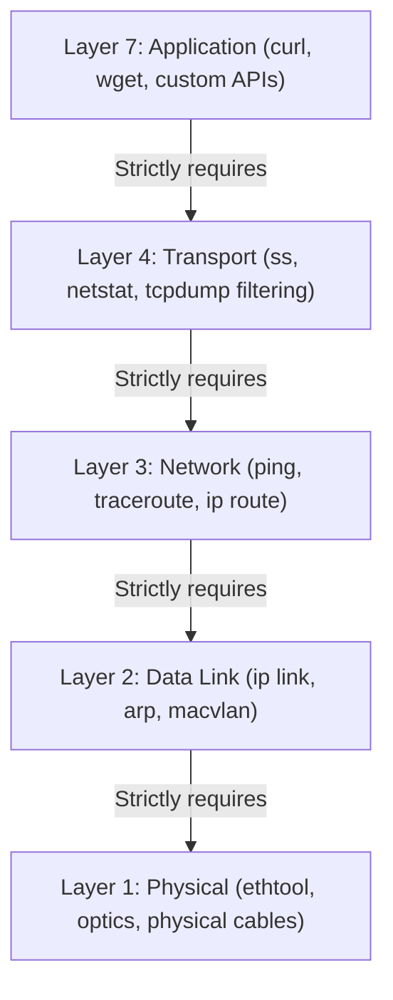

# Module 6.4: Network Debugging

> **Linux Troubleshooting** | Complexity: `[COMPLEX]` | Time: 30-35 min

## Prerequisites

Before starting this module, review these foundations so the commands in this lesson feel like evidence-gathering tools rather than disconnected tricks:
- **Required**: [Module 3.1: TCP/IP Essentials](/linux/foundations/networking/module-3.1-tcp-ip-essentials/)
- **Required**: [Module 3.4: iptables & netfilter](/linux/foundations/networking/module-3.4-iptables-netfilter/)
- **Helpful**: [Module 6.1: Systematic Troubleshooting](../module-6.1-systematic-troubleshooting/)

## Learning Outcomes

After completing this module, you will be able to perform these measurable troubleshooting tasks under incident pressure:
- **Diagnose** complex network failures using a systematic layer-by-layer methodology that separates physical links, addressing, routing, transport behavior, DNS, and application payloads.
- **Implement** packet capture and filtering strategies with `tcpdump` and BPF so you can isolate traffic anomalies without drowning a production node in irrelevant packets.
- **Evaluate** socket states and connection queues with `ss` to distinguish normal TCP lifecycle behavior from application leaks, backlog pressure, and bind conflicts.
- **Compare** Linux host routing with Kubernetes 1.35+ pod, Service, CoreDNS, kube-proxy, and CNI paths when traffic crosses namespaces or overlay networks.
- **Debug** Kubernetes-specific network failures by combining pod-level tests, service endpoint inspection, DNS checks, node routing, and host packet captures.

## Why This Module Matters

On October 4, 2021, Facebook, now Meta, disappeared from much of the internet for more than six hours after a maintenance command withdrew routes that told the world how to reach the company's DNS infrastructure. The business impact was estimated near one hundred million dollars, but the operational pain was more instructive than the financial number. Internal tools depended on the same network fabric, so the engineers who could repair the outage also lost remote access to the systems they needed to inspect.

That incident is memorable because it exposed a truth every operator eventually learns: a network failure is rarely one thing. The phrase "the network is down" hides a stack of dependencies that includes physical links, interface state, ARP or neighbor discovery, local routes, firewall rules, DNS resolution, TCP state machines, TLS handshakes, proxies, and application behavior. When a team treats that whole stack as a vague blob, debugging turns into superstition, and the loudest theory in the room often wins.

This module teaches the opposite habit. You will learn how to prove where traffic stops, how to gather packet evidence without creating a second incident, and how to translate ambiguous symptoms into specific failure domains. The same method works on a single Linux host, an ingress node, a busy database client, or a Kubernetes 1.35+ cluster where packets cross pod namespaces, virtual Ethernet pairs, service NAT rules, and overlay tunnels before they reach the process that actually handles the request.

## Network Debugging Methodology

Network debugging starts with discipline because the stack is layered, stateful, and full of misleading symptoms. A failed `curl` command might be caused by a dead process, a missing route, a DNS timeout, a local firewall rule, an expired certificate, or a perfectly healthy server that is refusing connections because nothing is bound to the requested port. If you begin with a favorite command instead of a question, you can collect impressive output while learning almost nothing.

The reliable approach is to move from the lowest plausible layer upward and stop as soon as evidence contradicts your hypothesis. Physical and link checks answer whether the interface can carry frames. Addressing and routing checks answer whether the kernel knows where to send packets. Transport checks answer whether both endpoints can complete a TCP or UDP exchange. Application checks answer whether the service behind the socket is speaking the protocol the client expects.



The diagram is simple, but the operational consequence is powerful: a higher layer cannot repair a broken lower layer. If a host has no default route, an application retry loop only adds noise. If DNS resolution is timing out, a proxy configuration change may appear to help only because it accidentally reuses a cached address. If a TCP SYN reaches the server and receives a reset, the path worked, and the next useful question is what is listening on that port.

In a modern environment, the same layered thinking must include virtual interfaces and network namespaces. A container can have a valid route inside its namespace while the host route table looks unrelated. A Kubernetes Service can have a stable ClusterIP while its endpoint list is empty. A node can forward overlay traffic correctly while a cloud firewall drops the return path. The method still works, but you must choose the namespace where each question should be asked.



A good first pass is short and repeatable. You are not trying to solve the whole incident with these commands; you are trying to establish the first broken dependency. The sequence below checks interface state, address assignment, default routing, gateway reachability, DNS, and application egress in a way that quickly separates local host problems from upstream provider or resolver problems.

```bash
# 1. Interface up?
ip link show eth0

# 2. IP address assigned?
ip addr show eth0

# 3. Default gateway?
ip route | grep default

# 4. Can reach gateway?
ping -c 3 $(ip route | grep default | awk '{print $3}')

# 5. DNS working?
dig google.com +short

# 6. Can reach internet?
curl -I --max-time 5 https://google.com
```

Pause and predict: steps one through four succeed, so the interface is up, an address exists, a default route exists, and the gateway replies. Step five times out, but a request to a known external IP succeeds. Before reading further, decide whether you would escalate to the network team, the DNS owner, the application owner, or the platform team, and write down which two commands would prove your answer.

The answer should focus on DNS infrastructure or resolver configuration, not generic internet reachability. You already proved local routing and upstream packet forwarding with the gateway and external IP tests. The next evidence should compare the configured resolver with a known resolver, inspect `/etc/resolv.conf`, and measure query latency. That habit matters because DNS failures often masquerade as application timeouts, especially when client libraries report only that a connection attempt failed.

```bash
# 1. Is DNS configured?
cat /etc/resolv.conf

# 2. Can reach DNS server?
ping $(grep nameserver /etc/resolv.conf | head -1 | awk '{print $2}')

# 3. Does query work?
dig @8.8.8.8 google.com  # Use known-good DNS
dig google.com           # Use configured DNS

# 4. Check for NXDOMAIN vs timeout
dig nonexistent.google.com  # NXDOMAIN is normal
dig google.com              # Timeout means DNS issue

# 5. Slow DNS?
dig google.com | grep "Query time"
# >100ms is slow
```

The difference between an NXDOMAIN answer and a timeout is not cosmetic. NXDOMAIN means the resolver answered authoritatively that the name does not exist, so the path to DNS works and the client received a valid response. A timeout means the query vanished, the resolver is unreachable, or an intermediate device is dropping UDP or TCP port 53. Those outcomes send you to very different owners and save time when the incident channel is crowded.

When ICMP is allowed, `ping` gives fast evidence that a route exists and that packets can return. It is not a complete application test because many networks rate-limit or block ICMP, and because a successful ICMP echo says nothing about a TCP port being open. Still, it is useful for packet loss, gross latency, and MTU probing when you understand what the payload size means.

```bash
# Basic connectivity
ping -c 4 192.168.1.1

# Continuous until stopped
ping 192.168.1.1

# Set packet size (MTU testing)
ping -s 1472 192.168.1.1  # 1472 + 28 header = 1500

# Flood ping (need root, careful!)
sudo ping -f -c 1000 192.168.1.1

# Set interface
ping -I eth0 192.168.1.1
```

Path tracing tools extend the same idea by forcing each router along the path to reveal itself, usually through Time To Live expiration behavior. `traceroute` and `tracepath` are valuable when the failure is somewhere beyond your local gateway, but their output must be interpreted carefully. A silent intermediate hop does not automatically mean traffic is broken because routers often forward production packets in hardware while rate-limiting the diagnostic messages generated by their control plane.

```bash
# Trace route to destination
traceroute google.com
# Shows each hop and latency

# Or tracepath (no root needed)
tracepath google.com

# TCP traceroute (bypasses ICMP filters)
traceroute -T -p 443 google.com

# MTU discovery
tracepath -n google.com | grep pmtu
```

The practical rule is to read path traces as evidence of reachability, policy, and direction, not as a perfect map of the internet. If hop four is silent but hops five through twelve respond with normal latency, hop four is forwarding traffic and merely refusing to answer your diagnostic probe. If every hop after a boundary disappears, then you have a stronger reason to investigate routing, firewall policy, or provider reachability at that boundary.

An incident runbook should preserve this sequence because it prevents blame from moving faster than evidence. Start with local link and address state, prove the gateway, test DNS separately from IP reachability, check a real transport port, and only then inspect application behavior. When the order becomes muscle memory, your notes become useful to the next engineer because each observation rules out a specific part of the stack.

There is one more benefit to this method: it makes escalation credible. A network engineer can act quickly when you say the host has a default route, the gateway responds, DNS to the configured resolver times out, and a query to a known public resolver succeeds. A platform engineer can act quickly when you say a Kubernetes Service has no endpoints while the target pod is healthy and labeled differently than the selector expects. Good network debugging is therefore not only about finding the fault; it is about handing the next owner a compact proof instead of a guess.

The method also keeps you from confusing recovery with diagnosis. Restarting a daemon, flushing a firewall table, or replacing a pod can restore service in some cases, and restoration matters during an outage. However, if you take those actions before collecting the smallest useful evidence, you may destroy the state that would explain why the outage happened. A mature workflow captures link, route, socket, DNS, and packet observations first when the risk is acceptable, then uses that record to choose the least disruptive recovery step.

## Socket and State Evaluation with `ss`

Sockets are the operating system's contract between a process and the network stack. A listening socket tells the kernel that a process is ready to accept traffic for a protocol, address, and port. An established socket records an active conversation. A closing socket records where the TCP state machine is in the teardown process. Reading these states is like reading the checkout lanes in a busy store: the line lengths tell you where work is piling up.

The modern Linux tool for this job is `ss`, which comes from the `iproute2` family and queries kernel socket information efficiently through Netlink. Older tools such as `netstat` are still familiar and sometimes available, but they can become painfully slow on hosts with many connections because they parse procfs data. On a production load balancer, that difference can matter during an incident when every command must return quickly and add minimal overhead.

```bash
# All sockets
ss

# Listening sockets
ss -l

# TCP sockets
ss -t

# UDP sockets
ss -u

# Common combination: listening TCP with process
ss -tlnp
# -t = TCP
# -l = listening
# -n = numeric (no DNS)
# -p = process (needs root for others' processes)
```

The most common use is finding who owns a port. If NGINX refuses to start because port 443 is already in use, routing is irrelevant. The kernel will not allow two unrelated processes to bind the same address and port combination unless specific socket options and service designs are involved. `ss -tlnp` shows the listening process, and running it with sufficient privilege reveals the PID so you can inspect the service manager, logs, and configuration.

Production output is too large to scan by eye, so filtering inside `ss` is not a convenience feature; it is how you avoid drawing conclusions from the wrong rows. You can filter by TCP state, source port, destination port, address range, and combinations of those fields. This lets you answer questions such as "which clients are stuck against this backend" or "are we accumulating `CLOSE_WAIT` sockets after the new release."

```bash
# By state
ss -t state established
ss -t state time-wait
ss -t state close-wait

# By port
ss -tn sport = :22          # Source port 22
ss -tn dport = :443         # Destination port 443
ss -tn '( sport = :22 or dport = :22 )'

# By address
ss -tn dst 192.168.1.0/24

# Complex filters
ss -tn 'dst 192.168.1.1 and dport = :80'
```

State counts turn a pile of connections into a diagnosis. Many `ESTABLISHED` sockets can be normal on an active service. Many `TIME_WAIT` sockets can also be normal because TCP keeps recently closed connection identifiers around so delayed packets from an old conversation cannot corrupt a future one. Many `CLOSE_WAIT` sockets are more suspicious because they usually mean the remote side closed the connection and the local application has not closed its file descriptor.

```bash
# All connections with process info
sudo ss -tunap

# Connection counts by state
ss -tan | awk '{print $1}' | sort | uniq -c

# Many TIME_WAIT? Normal for high traffic
# Many CLOSE_WAIT? App not closing connections properly

# Connections per remote IP
ss -tn | awk '{print $5}' | cut -d: -f1 | sort | uniq -c | sort -rn | head

# Queue sizes (send/recv buffers)
ss -tnm
```

Pause and predict: you are inspecting a heavily trafficked load balancer and see more than 20,000 sockets in `TIME_WAIT`, with zero in `CLOSE_WAIT`. A junior engineer wants to reboot the node to clear the table. Predict what would happen after the reboot, what customer risk the reboot creates, and which socket state would change your suspicion toward an application leak.

Rebooting would temporarily clear kernel state, interrupt active work, and then recreate the same pattern as traffic resumes. `TIME_WAIT` is not owned by a still-running process in the way a listening socket is; it is part of TCP's safety mechanism after a connection closes. If ephemeral ports are not exhausted and connection attempts are succeeding, the better investigation is connection churn, keep-alive behavior, backend reuse, and whether a client pool is opening far more short-lived sessions than necessary.

Connection queues are another place where `ss` reveals application pressure before logs do. The receive queue can grow when data has arrived but the application is not reading fast enough. The send queue can grow when the application is writing but the peer or network cannot accept data at the same pace. A listening socket backlog can fill when the application accepts new connections too slowly, which clients may experience as intermittent connect latency or timeouts.

The point is not to memorize every TCP state. The point is to connect each state to an owner and a next question. `LISTEN` points to service binding and process ownership. `SYN-SENT` points to outbound reachability or return traffic. `ESTABLISHED` points to active application behavior. `CLOSE_WAIT` points to local cleanup. `TIME_WAIT` points to connection lifecycle and churn. That mapping keeps the conversation precise when a dashboard says only "socket resources high."

Socket evidence becomes stronger when you compare it with process and deployment timing. If `CLOSE_WAIT` begins rising immediately after a new release, the application likely stopped closing sockets after peers finished sending data. If `SYN-SENT` rises during a provider outage, the local process may be healthy while downstream reachability is broken. If receive queues grow while CPU is saturated, the kernel is receiving traffic but the application cannot keep up. Those distinctions help you avoid changing network policy when the real fix is application backpressure, connection pooling, or capacity.

You should also be careful with aggregate counts because different roles create different normal baselines. A reverse proxy, database pooler, message broker, and batch worker can all show high connection counts for valid reasons. The useful question is whether the state mix changed, whether errors changed with it, and whether the affected sockets share a remote address, port, or process. In practice, pairing `ss` snapshots with timestamps, release events, and one targeted packet capture is far more useful than arguing about whether a raw number is "too high."

## Packet Level Forensics with `tcpdump`

Packet capture is the moment you stop trusting summaries and observe the traffic itself. Logs can be wrong, client libraries can hide errors, proxies can normalize symptoms, and service meshes can wrap one failed exchange in several layers of retries. A packet capture tells you whether a packet reached a particular interface, which direction it moved, which flags were set, and whether a reply came back.

That power comes with risk because a busy interface can produce more data than your terminal, disk, or incident workstation can handle. `tcpdump` uses the Berkeley Packet Filter engine so the kernel can select only the packets that match your expression before copying them to user space. A tight filter is therefore both an accuracy tool and a safety control. It reduces noise, lowers overhead, and protects you from accidentally capturing sensitive payloads you do not need.

```bash
# All traffic on interface
sudo tcpdump -i eth0

# Limit packets
sudo tcpdump -i eth0 -c 100

# Don't resolve names (faster)
sudo tcpdump -i eth0 -n

# Show hex dump
sudo tcpdump -i eth0 -X

# Write to file
sudo tcpdump -i eth0 -w /tmp/capture.pcap

# Read from file
tcpdump -r /tmp/capture.pcap
```

The first production rule is to use `-n` unless you deliberately need name resolution. Without it, `tcpdump` may perform reverse DNS lookups while you are debugging DNS or packet loss, which can make output appear slow for the wrong reason. The second rule is to cap the capture with `-c`, `timeout`, or a narrow filter. A capture that fills a filesystem can turn a network incident into a node incident.

```bash
# By host
sudo tcpdump -i eth0 host 192.168.1.1

# By port
sudo tcpdump -i eth0 port 80
sudo tcpdump -i eth0 port 443

# By protocol
sudo tcpdump -i eth0 tcp
sudo tcpdump -i eth0 udp
sudo tcpdump -i eth0 icmp

# Source or destination
sudo tcpdump -i eth0 src host 192.168.1.1
sudo tcpdump -i eth0 dst port 443

# Complex filters
sudo tcpdump -i eth0 'tcp port 80 and host 192.168.1.1'
sudo tcpdump -i eth0 'tcp[tcpflags] & (tcp-syn) != 0'  # SYN packets only
```

Before running this on a busy host, decide what packet must exist if your hypothesis is true. If the client says a request times out, you might expect outbound SYN packets with no SYN-ACK replies. If the server says clients disconnect immediately, you might expect a completed handshake followed by a reset or early FIN. If DNS is suspected, you might expect UDP or TCP queries to port 53 and either no response or a response from a resolver you did not expect.

Payload inspection is useful when the protocol is cleartext or when headers provide enough context without exposing secrets. `-A` prints ASCII, which can reveal HTTP methods and host headers on unencrypted traffic. Verbose output can expose TTL, flags, checksums, and sequence details. Snapshot length controls how much of each packet is captured, so you can collect headers only for safer triage or full packets when a deeper offline analysis is justified.

```bash
# Verbose output
sudo tcpdump -v -i eth0
sudo tcpdump -vv -i eth0  # More verbose

# ASCII output
sudo tcpdump -A -i eth0 port 80  # See HTTP headers

# Line buffered (for piping)
sudo tcpdump -l -i eth0 | grep pattern

# Snapshot length
sudo tcpdump -s 96 -i eth0  # Capture only headers
sudo tcpdump -s 0 -i eth0   # Capture full packets
```

Byte-level filters are where packet capture becomes surgical. TCP flags live in known header positions, so BPF can isolate SYN packets, FIN packets, or resets without recording every payload byte. HTTP methods can also be matched by their hexadecimal byte patterns on cleartext port 80. You should use these filters when the question is about handshake behavior, connection churn, or a small protocol signature rather than the full contents of every exchange.

```bash
# See TCP handshakes
sudo tcpdump -i eth0 'tcp[tcpflags] & (tcp-syn|tcp-fin) != 0'

# See HTTP requests
sudo tcpdump -i eth0 -A 'tcp port 80 and tcp[32:4] = 0x47455420'  # GET
sudo tcpdump -i eth0 -A 'tcp port 80 and tcp[32:4] = 0x504f5354'  # POST

# See DNS queries
sudo tcpdump -i eth0 udp port 53

# Capture for Wireshark
sudo tcpdump -i eth0 -w capture.pcap -s 0 port 443
# Then open capture.pcap in Wireshark
```

An effective capture plan names the interface, direction, peer, protocol, duration, and expected result. Capturing on `any` is convenient during discovery, but it can hide which interface actually carried the packet. Capturing on a physical NIC, tunnel device, bridge, loopback interface, or pod veth gives stronger evidence. If you suspect asymmetric routing, capture at both endpoints or at both ingress and egress interfaces, because one side of a conversation can look healthy from the wrong vantage point.

The cleanest packet evidence often comes from pairing capture with a single controlled request. Start a capture with a small packet count, run one `curl`, `dig`, `nc`, or application request, then stop. This gives you a compact transcript that can be shared in an incident review without forcing reviewers to search through thousands of unrelated packets. It also reduces the chance that you capture customer payloads unrelated to the failure.

Packet capture is especially useful when two teams have truthful but incomplete observations. The application team may prove that a client sent a request, while the server team proves that no request reached the process. Both can be correct if a firewall drops the packet before the socket, if a proxy terminates and retries the connection, or if return traffic follows a different route. Capturing at the client, the server interface, and a midpoint turns that argument into a path problem with a known missing segment.

The tradeoff is that packet evidence can become too detailed for the decision at hand. During a customer-facing incident, you rarely need to decode every TCP sequence number before acting. You need to know whether traffic leaves, arrives, returns, resets, fragments, or stalls. Save deep offline analysis for cases where the short capture proves the path exists but the protocol still fails, such as malformed TLS negotiation, unexpected HTTP headers, or a suspected MTU issue that only appears with larger payloads.

## Symptom-Driven Linux Diagnosis

Once you know the layers, common error strings become useful clues rather than vague complaints. "Connection refused" means something very different from "connection timed out." "No route to host" occurs before an application handshake can even begin. "Name or service not known" points toward resolution rather than transport. Treat each symptom as a starting hypothesis, then test the layer that would have to be broken for that symptom to appear.

A refused connection is surprisingly good news for the network path. The client sent a TCP SYN, the packet reached the destination host, and the destination actively sent back a reset because no suitable listener accepted the connection. That means routing, return traffic, and basic host reachability worked. Your next question should be whether the service is running, whether it is bound to the expected address, and whether a firewall is rejecting rather than silently dropping.

```bash
# Means: TCP connection reached host, but nothing listening

# 1. Check if service is listening
ss -tlnp | grep :80

# 2. Check if on correct interface
ss -tlnp | grep :80
# 127.0.0.1:80 = only localhost
# 0.0.0.0:80 = all interfaces
# :::80 = all IPv6

# 3. Check firewall
sudo iptables -L -n | grep 80

# 4. Check service status
systemctl status nginx
```

A timeout tells a darker story because the client sent something and received nothing useful before its timer expired. The missing response might be caused by a firewall DROP rule, a dead host, an unavailable route, a cloud security group, a stateful firewall that never saw the outbound leg, or a backend that is overloaded before it can respond. The key distinction is silence: unlike a refusal, a timeout does not prove the destination host processed the packet.

```bash
# Means: No response at all (firewall, routing, or host down)

# 1. Can you reach the host at all?
ping target_host

# 2. What happens to packets?
traceroute target_host

# 3. Is it just that port?
nc -zv target_host 22  # Try SSH
nc -zv target_host 80  # Try HTTP

# 4. Check routing
ip route get target_ip

# 5. Capture and see what's happening
sudo tcpdump -i eth0 host target_host
```

"No route to host" is earlier still. The local kernel tried to choose an egress interface and next hop, then failed or received local neighbor information that made forwarding impossible. This is where `ip route get` is especially useful because it asks the kernel to show the exact route decision it would make for a destination. If the command cannot produce a route, the application never had a chance.

```bash
# Means: Kernel doesn't know how to reach this network

# 1. Check routing table
ip route
ip route get target_ip

# 2. Is default route present?
ip route | grep default

# 3. Is gateway reachable?
ping $(ip route | grep default | awk '{print $3}')

# 4. Check interface is up
ip link show
ip addr show
```

DNS failures deserve their own path because they frequently create misleading application symptoms. A client may report a timeout while spending most of its time waiting for a resolver, or it may report a connection failure after resolving to an unexpected address. Compare configured DNS with a known resolver, check whether the resolver is a local stub such as `127.0.0.53`, and measure query time before you assume packets to the final service are being dropped.

```bash
# Quick lookup
dig google.com +short
# 142.250.185.206

# Full query
dig google.com
# Shows query time, server used, full response

# Specific record types
dig MX google.com
dig TXT google.com
dig NS google.com

# Query specific server
dig @8.8.8.8 google.com

# Reverse lookup
dig -x 8.8.8.8

# Check DNS resolution chain
dig +trace google.com
```

The same symptom can also have different meanings depending on direction. If a server sees inbound SYN packets and sends SYN-ACK responses, but the client never receives them, the problem is in the return path, not in the service bind. If the client sends SYN packets and the server never sees them, the problem is before the server. If both sides see their own outbound packets but not the other's replies, asymmetric routing or stateful policy becomes a serious suspect.

War story: a payments team once chased a supposed database outage because application logs showed intermittent connect timeouts after a network maintenance window. The database was healthy, and the client node showed outbound SYN packets. A packet capture on the database subnet showed SYN-ACK replies leaving through a different firewall than the one that saw the outbound client traffic. The stateful firewall dropped the return path, and the fix was a route policy correction, not a database restart.

When you document symptom-driven work, include both the error string and the packet-level meaning you inferred from it. "Connection refused" should be written as "remote host returned reset, check listener and bind." "Timeout" should be written as "no useful response observed, check drop path and return traffic." "No route" should be written as "local route decision failed." That translation is what lets another engineer audit your reasoning instead of only trusting your conclusion.

```bash
# Minimal backend check during a proxy incident
ss -tlnp | grep :8080
curl -v --max-time 5 http://127.0.0.1:8080/health
sudo timeout 10 tcpdump -i any -n tcp port 8080
```

## Kubernetes Context: Navigating Overlay Networks

Kubernetes does not remove Linux networking; it multiplies the places where Linux networking exists. A pod has its own network namespace, usually connected to the node through a virtual Ethernet pair. Services create stable virtual addresses that are translated to changing pod endpoints. CoreDNS answers cluster names. kube-proxy or an eBPF dataplane programs forwarding behavior. The CNI plugin decides how pod CIDRs are routed, encapsulated, or advertised.

For this module, assume Kubernetes 1.35+ behavior and use the `k` shortcut after defining it once. Define the alias as `alias k=kubectl`; every later `k get`, `k exec`, and `k run` example is a kubectl command using that alias. The shortcut is only a convenience, but using it consistently keeps command examples short enough to read during an incident. The important rule is to run pod-level tests from inside the same network context as the failing workload whenever possible, because the node namespace and pod namespace can make different routing and DNS decisions.

```bash
alias k=kubectl
```

```bash
# Get pod IP
k get pod my-pod -o wide

# Check connectivity from another pod
k exec other-pod -- curl my-pod-ip:8080
k exec other-pod -- ping my-pod-ip

# DNS resolution
k exec my-pod -- nslookup kubernetes
k exec my-pod -- nslookup my-service

# Check service endpoints
k get endpoints my-service
```

Pod-to-pod debugging starts with the destination pod IP because it bypasses the Service abstraction. If direct pod IP traffic works but Service traffic fails, the CNI path is probably not your first suspect. You should inspect the Service selector, EndpointSlice or Endpoints objects, readiness probes, and kube-proxy or dataplane state. If pod IP traffic fails between nodes but works on the same node, then overlay routing, node firewall policy, or CNI health becomes more likely.

Services add a layer of indirection that is useful for applications and dangerous for sloppy debugging. A Service can exist with no endpoints, which means DNS and the ClusterIP may look valid while no backend pod is eligible to receive traffic. A selector typo, a readiness probe failure, or a namespace mismatch can all create this shape. Always ask whether the abstraction has live backends before packet-capturing every node in the cluster.

```bash
# Does service exist?
k get svc my-service

# Does it have endpoints?
k get endpoints my-service
# Empty = no pods matching selector

# Test from inside cluster
k run debug --rm -it --image=alpine -- sh
# Inside: wget -qO- my-service:80

# Check DNS
k exec my-pod -- nslookup my-service.default.svc.cluster.local
```

CoreDNS failures often appear as broad application instability because every service name depends on resolution. A useful split is to test the fully qualified service name, the short service name from the same namespace, and an external name. If external resolution fails but cluster service names work, the CoreDNS upstream path may be broken. If service names fail but pod IP access works, the service discovery layer is your target.

```bash
# CoreDNS and service discovery inspection
k -n kube-system get pods -l k8s-app=kube-dns -o wide
k -n kube-system logs deploy/coredns --tail=50
k get endpoints kubernetes
k exec my-pod -- nslookup kubernetes.default.svc.cluster.local
```

Node-level inspection is still necessary because all pod traffic ultimately crosses host interfaces, bridge devices, tunnel devices, routing tables, nftables or iptables state, and sometimes cloud fabric rules. On kube-proxy clusters, service NAT rules may be visible in the `KUBE-SERVICES` chain. On eBPF-based clusters, the dataplane may not look like classic iptables, so CNI-specific tooling becomes important. The general method remains to locate the namespace and interface where the packet disappears.

```bash
# On node, check CNI
ls /etc/cni/net.d/

# Check kube-proxy
iptables -t nat -L KUBE-SERVICES -n | head -20

# Check node can reach pod network
ip route | grep -E "10.244|10.96"

# tcpdump on node
sudo tcpdump -i any host <pod-ip>
```

Which approach would you choose here and why: a developer says `my-service` is timing out from one namespace, but direct pod IP access from a debug pod on the same node succeeds. You can inspect the Service selector, run a node packet capture, restart CoreDNS, or delete and recreate the deployment. The disciplined answer is to inspect Service and endpoint state first, because the evidence already suggests the underlying pod route is alive.

External egress from pods adds source NAT and cloud firewall policy to the investigation. A pod may send a SYN that leaves through the node's external interface after NAT, but the reply may be blocked by a cloud security rule or return to a different path than the stateful firewall expects. Capturing on the pod veth, the node bridge or overlay device, and the physical interface lets you confirm whether translation and return traffic line up.

When Kubernetes debugging gets confusing, write the path as a sentence before running the next command. For example: "client pod sends DNS query to CoreDNS ClusterIP, kube-proxy translates that to a CoreDNS pod endpoint, CoreDNS asks the upstream resolver, then the answer returns to the client pod." That sentence identifies the objects and namespaces to inspect. Without it, you may stare at node routes while the real failure is an empty endpoint list.

NetworkPolicy and cloud security policy add another decision point. A pod can have valid DNS, a healthy Service, and correct endpoints while policy blocks the connection. In that case, the failure usually appears as a timeout rather than a refusal because the packet is dropped rather than rejected. Check namespace labels, pod labels, egress rules, ingress rules, and any cloud firewall attached to the node or load balancer before concluding that the CNI plugin cannot route.

The strongest Kubernetes evidence combines object state with packet state. Object state tells you whether the control plane intended traffic to have a backend, a policy allowance, and a DNS record. Packet state tells you whether the dataplane actually moved the traffic through the expected interfaces. When those disagree, you have found the class of bug: stale rules, broken reconciliation, policy mismatch, or a dataplane implementation issue.

## Patterns & Anti-Patterns

Reliable network debugging teams use patterns that create shared evidence. The goal is not to make every engineer run the same commands forever; the goal is to make each observation comparable across incidents. If one person says "DNS works" because `dig` returned an address and another says it because an application eventually connected after retries, the team has not actually agreed on a fact.

| Pattern | When to Use | Why It Works | Scaling Consideration |
|---|---|---|---|
| Layered triage before deep capture | Use at the beginning of any ambiguous outage, especially when the report is only "network down" or "service slow." | It prevents higher-layer symptoms from hiding lower-layer failures and gives every escalation a clear evidence trail. | Store the command sequence in runbooks, but let teams adapt interface names, resolver names, and namespace-specific checks. |
| Targeted packet capture | Use when logs and socket state disagree or when you must prove whether packets arrive, leave, or return. | BPF filtering gives a small factual transcript instead of a giant file full of unrelated traffic. | Define retention and privacy rules for pcap files because packet payloads can contain customer data or credentials. |
| Namespace-aware Kubernetes testing | Use whenever a workload fails inside a pod but a node-level test succeeds. | It tests DNS, routes, and policy from the same context as the failing workload rather than from a misleading host namespace. | Standardize a debug image with `curl`, `dig`, `iproute2`, and `tcpdump` where policy allows it. |
| State-first socket analysis | Use when a service is overloaded, leaking connections, or failing to bind a port. | TCP states and queues reveal whether work is waiting in the kernel, the application, or the peer. | Trend state counts over time; one snapshot can be normal while a rising slope reveals a release regression. |

Anti-patterns usually come from urgency. During an outage, rebooting a node feels decisive, restarting CoreDNS feels familiar, and deleting a Service feels faster than reading selectors. Those actions can be appropriate when evidence points to them, but they are harmful when they erase the very state that would explain the failure. Better debugging preserves the evidence long enough to identify the owner and prevent the next recurrence.

| Anti-Pattern | What Goes Wrong | Better Alternative |
|---|---|---|
| Rebooting to clear socket state | The symptom disappears briefly while the root cause remains, and active customer traffic is interrupted. | Capture `ss` state counts, process ownership, and connection churn before considering disruptive recovery. |
| Running unfiltered `tcpdump` in production | The capture can overwhelm the terminal, fill disk, and collect unrelated sensitive payloads. | Use host, port, protocol, count, duration, and snapshot filters that match a written hypothesis. |
| Treating `traceroute` stars as proof of packet loss | Routers often suppress diagnostic replies while forwarding normal traffic successfully. | Interpret later responding hops as evidence that forwarding continues through the silent device. |
| Debugging Kubernetes Services without endpoints | You can waste time in CNI and node captures when no backend pod is eligible for traffic. | Check Service selectors and endpoints before inspecting lower-level dataplane behavior. |

The scaling lesson is that network debugging artifacts should be reproducible. A useful incident note says which namespace ran the command, which interface was captured, which filter was used, how many packets were collected, and what result would have falsified the hypothesis. That note turns a local investigation into organizational learning because another engineer can repeat the exact test when the same symptom returns.

Patterns are also how you keep senior review from becoming a bottleneck. A junior operator who follows a layered triage pattern can gather the first useful facts before waking a specialist. A specialist who receives those facts can skip the obvious checks and focus on the boundary where evidence changed. Over time, the team's runbooks become less about command memorization and more about high-quality questions, which is exactly what complex network incidents demand.

## Decision Framework

Decision frameworks are useful because network failures create pressure to jump sideways. A database timeout leads someone to inspect DNS, another person to restart the app, and another person to check cloud firewalls. All three may be reasonable eventually, but the next action should be chosen by the strongest existing evidence. The framework below maps symptoms to first tests and the result that should change direction.

```text
+---------------------------+--------------------------+---------------------------+
| Symptom                   | First useful question    | Evidence that redirects   |
+---------------------------+--------------------------+---------------------------+
| Name does not resolve     | Which resolver answered? | Known resolver succeeds   |
| Connection refused        | Who owns the port?       | No listener or loopback   |
| Connection timed out      | Did SYN get a reply?     | SYN leaves, no SYN-ACK    |
| No route to host          | What route would kernel  | No default or bad gateway |
| Kubernetes Service fails  | Does it have endpoints?  | Empty endpoints list      |
| Intermittent latency      | Where does queue build?  | Send/receive queue growth |
+---------------------------+--------------------------+---------------------------+
```

Use `ip route get` when you need the kernel's forwarding decision for a specific destination, not a hand-read interpretation of the whole route table. Use `ss` when the question involves listening ports, process ownership, TCP states, or queue pressure. Use `dig` when names, resolver latency, or upstream DNS behavior are in scope. Use `tcpdump` when you need packet-level proof, especially when two systems disagree about whether traffic arrived.

```bash
# Ask the kernel how it would route one destination
ip route get 8.8.8.8

# Confirm a TCP port without sending application payload
nc -zv example.com 443

# Compare configured DNS with a known resolver
dig example.com
dig @8.8.8.8 example.com

# Capture one controlled exchange
sudo timeout 10 tcpdump -i eth0 -n host 198.51.100.10 and port 443
```

For Kubernetes, choose the test that removes the largest abstraction without changing the workload. If a Service name fails, test the Service FQDN, then the ClusterIP, then a pod IP, and inspect endpoints between those steps. If pod IP works but Service fails, the Service layer is implicated. If pod IP fails across nodes but works on the same node, CNI routing or node policy deserves attention. If external egress fails only from pods, compare pod namespace, node NAT, and cloud firewall evidence.

The framework also helps decide when to stop. Once a packet capture proves the destination received a SYN and returned a reset, continuing to debate routes is wasteful. Once `ss` proves no process is listening on the requested address, packet captures become secondary. Once endpoint inspection proves a Service has no backends, the immediate fix is selector, readiness, or deployment health. Good operators change tools when the evidence changes layers.

When the evidence remains ambiguous, prefer the test that changes the least and observes the most. A read-only command such as `ip route get`, `ss`, `dig`, or a bounded packet capture is usually safer than restarting a service. A debug pod is usually safer than changing a production deployment. A capture with a known filter is usually safer than collecting every packet. This bias preserves service state while still moving the investigation forward.

The final decision is whether you are diagnosing, mitigating, or proving recurrence prevention. Diagnosis asks where the failure occurs. Mitigation asks which small action restores service with acceptable risk. Recurrence prevention asks why the system allowed that failure and how monitoring, runbooks, policy, or architecture should change. Mixing those goals causes friction, so say which mode you are in before proposing the next command or operational change.

## Did You Know?

- On October 4, 2021, a routing configuration change contributed to a global outage at Meta properties that lasted more than six hours and affected DNS reachability.
- The original `tcpdump` work dates to 1988 at Lawrence Berkeley National Laboratory, and the tool remains valuable because BPF filtering keeps packet selection close to the kernel.
- The `ss` command is part of the `iproute2` toolkit and avoids many of the scaling problems older `netstat` workflows hit on hosts with large socket tables.
- Standard Ethernet payload MTU is 1500 bytes, which is why `ping -s 1472` is a common IPv4 path MTU probe after adding the 28 bytes of ICMP and IP header overhead.

## Common Mistakes

| Mistake | Why It Happens | How to Fix It |
|---|---|---|
| Running `tcpdump` without a filter | Massive capture volumes will instantly overwhelm terminal output and fill the storage disk. | Always define a host, port, protocol, packet count, or timeout before execution. |
| Forgetting the `-n` parameter | DNS lookups for every captured IP address can block output and confuse DNS-related investigations. | Append `-n` for fast numeric output unless name resolution is the explicit target. |
| Blaming the network layer first | A missing response is often caused by a crashed process, loopback-only bind, or empty Kubernetes endpoint list. | Verify listener state, endpoint state, and packet arrival before escalating routing. |
| Ignoring local node firewalls | Strict `iptables` or `nftables` rules might silently drop traffic before the application sees it. | Check active rules with numeric output and match them against the packet direction. |
| Monitoring the wrong interface | Traffic may flow over a bonded NIC, tunnel, bridge, loopback device, or pod veth rather than the expected physical interface. | Use `ip route get`, namespace context, and interface-specific captures to choose the vantage point. |
| Not verifying DNS resolution | Everything can look slow or unreachable when the client is actually waiting on a resolver. | Compare configured DNS with a known resolver and measure query time with `dig`. |
| Mistaking `TIME_WAIT` for failure | It is a required TCP state that protects future connections from delayed packets after normal teardown. | Investigate only when ephemeral ports are depleted or churn is abnormal; watch for `CLOSE_WAIT` when suspecting leaks. |
| Overlooking asymmetric routing | Return packets may take a different path and be dropped by stateful firewalls or cloud policy. | Capture on both endpoints or both directions and confirm SYN, SYN-ACK, and ACK visibility. |

## Quiz

<details><summary>Question 1: Your ingress server refuses to start NGINX because port 443 is already in use. What do you check first, and why?</summary>

Use `sudo ss -tlnp | grep :443` to identify the process that owns the listening socket. This is a socket ownership problem before it is a routing problem because the kernel is refusing the bind locally. The `-tlnp` flags narrow the view to listening TCP sockets, keep numeric output fast, and include process details when permissions allow. After finding the PID, inspect the service manager and configuration rather than changing firewall rules blindly.

</details>

<details><summary>Question 2: A client reports "connection refused" to one database host and "connection timed out" to another. How do those symptoms send you down different paths?</summary>

"Connection refused" means the destination host actively returned a TCP reset, so routing and return traffic were good enough for the host kernel to respond. You should check whether the database process is listening on the right address and port. "Connection timed out" means the client did not receive a useful response, so the next evidence should be route selection, firewall behavior, host reachability, and a capture that confirms whether SYN packets receive SYN-ACK replies. Treating both messages as the same "network problem" wastes time.

</details>

<details><summary>Question 3: Your edge load balancer is under suspected SYN flood, but payload capture would be too large. Which capture strategy fits the situation?</summary>

Capture only TCP handshake initiation with a BPF flag filter such as `sudo tcpdump -i eth0 -n 'tcp[tcpflags] & (tcp-syn) != 0'`. This targets connection setup instead of established payload data, which keeps the capture small enough for incident use. If you need only inbound first SYN packets, tighten the expression and add source or destination constraints. The reasoning matters: the hypothesis is about connection attempts, not application content.

</details>

<details><summary>Question 4: An API gateway returns 502 responses and the proxy owner blames backend routing. What evidence would separate network failure from backend application failure?</summary>

First test the backend directly from the proxy context with `curl` or `nc`, then inspect `ss` on the backend to verify a listener exists on the expected address. A packet capture on the backend port can show whether the proxy completes a handshake, sends a request, receives a reset, or gets no reply. If traffic arrives and the backend closes or returns invalid data, the issue is at the application or proxy protocol layer. If SYN packets never arrive, then routing or policy deserves deeper investigation.

</details>

<details><summary>Question 5: A server has thousands of `TIME_WAIT` sockets after a traffic spike. When is that normal, and what would make it suspicious?</summary>

`TIME_WAIT` is normal after active TCP close because the kernel keeps connection identifiers around long enough to protect future sessions from delayed packets. It becomes operationally important when ephemeral ports are exhausted, connection attempts fail, or the count grows because clients are opening excessive short-lived connections instead of reusing them. To find the source, inspect active `ESTABLISHED` connections and application connection pooling, because completed `TIME_WAIT` entries usually no longer identify the original process. A large `CLOSE_WAIT` count would be more suspicious for an application cleanup bug.

</details>

<details><summary>Question 6: A Kubernetes Service resolves in DNS but has no reachable backends. What should you inspect before changing CNI settings?</summary>

Inspect the Service selector and the Endpoints or EndpointSlice objects first with `k get svc`, `k get endpoints`, and pod labels. A Service can have a valid name and ClusterIP while selecting zero ready pods, which makes lower-level packet debugging premature. If endpoints are empty, investigate labels, namespace, readiness probes, and pod health. Only move to CNI routing after direct pod IP or cross-node pod tests show that the dataplane itself is failing.

</details>

<details><summary>Question 7: `traceroute` shows one silent middle hop, but later hops answer with normal latency. How should you evaluate the junior engineer's claim that the silent router is dropping traffic?</summary>

The claim is not supported by that evidence because later hops can respond only if traffic continues beyond the silent router. The middle hop is likely rate-limiting or suppressing diagnostic TTL-expired replies while still forwarding normal packets in the data plane. You should focus on end-to-end success, later-hop behavior, and application-specific tests before declaring a routing failure. A true forwarding break would usually cause subsequent hops and the destination to disappear as well.

</details>

## Hands-On Exercise

### Network Debugging Practice

**Objective**: Apply systematic network debugging utilities to trace connectivity, analyze socket states, capture raw packets, and diagnose a simulated failure.

**Environment**: Any standard Linux environment or virtual machine with root access. Install `tcpdump`, `dnsutils` or equivalent `dig` package, `iproute2`, `traceroute` or `tracepath`, `curl`, and `netcat` if your image does not already include them.

#### Part 1: Establish Baseline Connectivity

Verify the foundational configuration of your host by interrogating the IP stack and routing tables. Identify your gateway and confirm outbound ICMP routing before testing DNS or application protocols.

```bash
# 1. Check your network config
ip addr show
ip route

# 2. Test gateway
GATEWAY=$(ip route | grep default | awk '{print $3}')
echo "Gateway: $GATEWAY"
ping -c 3 $GATEWAY

# 3. Test internet
ping -c 3 8.8.8.8

# 4. Test DNS
dig google.com +short
```

<details><summary>View Expected Outcome</summary>

You should observe a local IP address assigned to an interface such as `eth0` or `ens33`. The gateway test should return three successful ICMP replies, confirming local subnet routing is functional. The internet and DNS tests validate upstream provider connectivity and resolver behavior separately, which helps you avoid blaming the wrong layer.

</details>

#### Part 2: Socket Analysis and State Filtering

Explore the active socket table on your system. Filter the output to categorize listening services, active connections, and historical connection state.

```bash
# 1. Listening sockets
ss -tlnp

# 2. All connections
ss -tan | head -20

# 3. Count by state
ss -tan | awk 'NR>1 {print $1}' | sort | uniq -c

# 4. Filter to specific port
ss -tn 'dport = :443' | head -10

# 5. Show process info (needs root)
sudo ss -tlnp | grep LISTEN
```

<details><summary>View Expected Outcome</summary>

The output will list system daemons, local services, and any active client sessions. The state aggregation command gives a summarized snapshot of network behavior, grouped by states such as `ESTABLISHED`, `LISTEN`, and `TIME_WAIT`. If you see many `CLOSE_WAIT` sockets, identify the owning process and inspect whether the application is failing to close connections.

</details>

#### Part 3: Packet Capture Foundations

Initiate basic packet captures using BPF syntax. Observe the raw packets generated by ICMP, DNS, and HTTP traffic while keeping each capture bounded.

```bash
# 1. Capture any traffic (brief)
sudo timeout 5 tcpdump -i any -c 20 -n

# 2. Capture ping
# In one terminal:
sudo tcpdump -i any icmp
# In another:
ping -c 3 8.8.8.8

# 3. Capture DNS
sudo tcpdump -i any udp port 53 -c 10 &
dig google.com
# Wait for capture

# 4. Capture HTTP (if you have a web server)
sudo tcpdump -i any tcp port 80 -c 20 -A
```

<details><summary>View Expected Outcome</summary>

You will see the relationship between a high-level command such as `dig` and the UDP datagrams crossing port 53. The ASCII output flag reveals cleartext headers when you capture unencrypted HTTP traffic. If you do not see expected packets, repeat the test on a more specific interface selected with `ip route get`.

</details>

#### Part 4: Diagnose Synthetic Connectivity Drops

Execute a triage simulation to prove host reachability, isolate routing failures, and validate external name resolution without changing system configuration.

```bash
# Simulate debugging flow

# 1. Check if service reachable
nc -zv google.com 443 && echo "Port 443 reachable"

# 2. Check DNS resolution
dig google.com +short || echo "DNS failed"

# 3. Check routing
ip route get 8.8.8.8

# 4. Traceroute
tracepath -n google.com 2>/dev/null | head -10 || traceroute -n google.com 2>/dev/null | head -10
```

<details><summary>View Expected Outcome</summary>

The `nc` command confirms whether a Layer 4 TCP handshake can complete without requiring a full application payload. The route check shows the kernel's egress decision for a concrete destination. The path trace may include silent hops, but later responding hops indicate that forwarding continues beyond those devices.

</details>

#### Part 5: Deep DNS Debugging

Interrogate your system's DNS resolver configuration. Validate the upstream nameserver and analyze query latency to identify resolver bottlenecks.

```bash
# 1. Check configured DNS
cat /etc/resolv.conf

# 2. Test DNS server
dig @$(grep nameserver /etc/resolv.conf | head -1 | awk '{print $2}') google.com +short

# 3. Query time
dig google.com | grep "Query time"

# 4. Trace resolution
dig +trace google.com | tail -20
```

<details><summary>View Expected Outcome</summary>

The configuration output shows whether you rely on a local stub resolver such as `systemd-resolved` at `127.0.0.53` or an external provider. The `+trace` argument shows iterative DNS resolution from root servers toward the authoritative zone. A timeout points to reachability or resolver failure, while NXDOMAIN is a valid negative answer.

</details>

#### Part 6: Create, Intercept, and Debug an Application

Launch a temporary local web service. Connect to it while capturing loopback traffic so you can observe a complete local application interaction.

```bash
# Start a simple server
.venv/bin/python -m http.server 8888 &
SERVER_PID=$!
sleep 2

# 1. Find it listening
ss -tlnp | grep 8888

# 2. Test connection
curl -I http://localhost:8888

# 3. Capture the traffic
sudo timeout 5 tcpdump -i lo port 8888 -n &
sleep 1
curl -s http://localhost:8888 > /dev/null

# 4. Clean up
kill $SERVER_PID 2>/dev/null
```

<details><summary>View Expected Outcome</summary>

You will see the Python process bind to port `8888` through `ss`. The `tcpdump` capture on loopback shows internal kernel traffic, proving that packet tools are still useful when client and server live on the same host. If `.venv/bin/python` is unavailable, create or activate the local project environment before running this part.

</details>

### Success Criteria Checklist

- [ ] Verified physical and virtual network configuration using the `ip` suite.
- [ ] Analyzed and filtered socket states using `ss` to identify application bind points.
- [ ] Successfully captured targeted packets using `tcpdump` and BPF expressions.
- [ ] Tested and traced external DNS resolution latency using `dig`.
- [ ] Traced internet network paths with `traceroute` or `tracepath`.
- [ ] Stood up a local service and intercepted its loopback traffic.

## Next Module

[Module 7.1: Bash Fundamentals](/linux/shell-scripting/module-7.1-bash-fundamentals/) builds on this module by turning repeatable diagnostic commands into shell scripts that collect evidence consistently during incidents.

## Further Reading

- [Module 3.1: TCP/IP Essentials](/linux/foundations/networking/module-3.1-tcp-ip-essentials/)
- [Module 3.4: iptables & netfilter](/linux/foundations/networking/module-3.4-iptables-netfilter/)
- [Module 6.1: Systematic Troubleshooting](../module-6.1-systematic-troubleshooting/)
- [tcpdump Man Page](https://www.tcpdump.org/manpages/tcpdump.1.html)
- [ss Man Page](https://man7.org/linux/man-pages/man8/ss.8.html)
- [ip Man Page](https://man7.org/linux/man-pages/man8/ip.8.html)
- [ping Man Page](https://man7.org/linux/man-pages/man8/ping.8.html)
- [traceroute Man Page](https://man7.org/linux/man-pages/man8/traceroute.8.html)
- [dig Manual Page](https://bind9.readthedocs.io/en/latest/manpages.html#dig-dns-lookup-utility)
- [Wireshark User Guide](https://www.wireshark.org/docs/wsug_html/)
- [Kubernetes Debugging Services](https://kubernetes.io/docs/tasks/debug/debug-application/debug-service/)
- [Kubernetes DNS for Services and Pods](https://kubernetes.io/docs/concepts/services-networking/dns-pod-service/)
- [Kubernetes Services](https://kubernetes.io/docs/concepts/services-networking/service/)
- [Kubernetes Network Plugins](https://kubernetes.io/docs/concepts/extend-kubernetes/compute-storage-net/network-plugins/)
