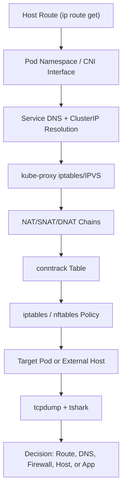
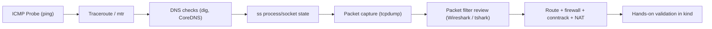

> **Linux Troubleshooting** | Complexity: `[COMPLEX]` | Time: 30-35 min

## Prerequisites

Before starting this module, confirm you already understand the Linux protocol stack and basic Kubernetes networking objects.
- **Required**: [Module 3.1: TCP/IP Essentials](/linux/foundations/networking/module-3.1-tcp-ip-essentials/)
- **Required**: [Module 6.3: Process Debugging](/linux/operations/troubleshooting/module-6.3-process-debugging/)
- **Helpful**: [Module 5.2: CPU & Scheduling](/linux/operations/performance/module-5.2-cpu-scheduling/)

## Learning Outcomes

After completing this module, you will be able to:
- **Trace** ICMP, TCP, UDP, and DNS failures across Linux and Kubernetes layers using a repeatable workflow.
- **Interpret** socket state, route, namespace, and firewall telemetry to locate the exact failure boundary.
- **Operate** `ss`, `tcpdump`, `tshark`, and Wireshark analysis in one incident loop and move from raw packets to root cause.
- **Debug** Kubernetes service, PodIP, and ClusterIP routing with `ip route get`, `ip neigh`, `arp`, and NAT rule inspection.
- **Run** reproducible hands-on investigations for MTU, conntrack saturation, stale NAT, and CoreDNS resolution failures in Linux and kind.

## Why This Module Matters

Network incidents in production usually begin with one symptom and hide multiple causes, so teams often argue about where the fault sits before they prove it. A single user request may traverse kernel routing, overlays, node proxying, firewall state, DNS resolution, and container namespace boundaries before reaching the pod process. If you do not isolate each layer in order, the most likely diagnosis can be wrong even when the command outputs look plausible. This module gives you a fixed sequence to avoid that trap.

The main operational risk is not technical complexity, it is incorrect attribution. If a ticket says "requests are slow", a naive diagnosis might stop at the first visible bottleneck. But many clusters fail for reasons where each layer is correct in isolation and still incorrect as a combined system. A valid service path can carry packets while NodeLocal DNSCache drops upstream fallback quality, then the application retries and appears overloaded. A healthy kube-proxy can forward traffic while stale NAT entries keep sessions pinned to dead endpoints. The difference between a false conclusion and a practical recovery is usually one layer later in the path.

You will also gain an incident workflow for SRE environments where production access windows are short. Your first objective is to prevent blind resets. A reset might restore service, but if it is not guided by evidence, the same failure returns because the root cause is still hidden in packet metadata, route policy, DNS search behavior, or kernel state. The methods here prioritize fast evidence capture, minimal side effects, and explicit ownership handoff.

Most importantly, this module links three planes together in one mental model: operating system behavior, container networking, and platform policy. When these align, you can say, for example, that a `Service` is healthy, endpoints are present, route selection is correct, but packets are dropped by policy before the PodNet namespace. That conclusion is defensible because each claim can be verified with a command, capture, and repeatable criterion.

## End-to-End Signal Flow: ICMP, TCP, UDP, and DNS

Every network diagnosis should begin by splitting the problem into protocol behavior. ICMP tells you whether low-level path handling is reachable. TCP tells you whether stateful handshakes can complete, fail, or reset. UDP tells you whether one-way or stateless behavior is visible under loss and policy. DNS tells you whether naming is producing usable endpoints. If you mix these together, you lose causality. If you separate them, each command has a single hypothesis and a clear pivot when output contradicts that hypothesis.

A practical sequence is to confirm local interface and gateway reachability first, then validate transport by protocol, then validate name resolution independently, then confirm service-plane resolution in Kubernetes. Keep this sequence fixed in notes and runbooks so each incident starts at the same entry point and does not skip evidence. The discipline matters more than knowing any one command, because each command answer should reduce uncertainty by a specific amount.

In Linux and Kubernetes, this sequence often looks like:
1. Confirm local interface state and route to gateway.
2. Confirm host and pod-level path selection.
3. Confirm DNS behavior with known resolvers.
4. Confirm transport handshake state and process ownership.
5. Capture packets with minimal scope.
6. Inspect NAT, conntrack, firewall, and CNI policy where evidence points.

This does not mean all checks happen for every issue. If you already fail step 1, steps 4 through 7 only consume noise. If step 3 succeeds but service access still fails, the network path is likely not your initial issue. The point is to create an evidence graph where each failing branch has a targeted next command.

## Probe Layer 1: ICMP and Transport Path Checks

`ping` validates basic IPv4/IPv6 reachability behavior, local route policy, and coarse packet loss direction. Even though modern networks may deprioritize ICMP, a failed ping still gives useful meaning when interpreted carefully: repeated request timeouts to a known address often indicate local ACL policy, routing asymmetry, or severe path loss. A response with occasional packet loss still may allow application traffic depending on policy and transport behavior, so do not equate partial success with full health automatically.

Use one destination for deterministic interpretation, then widen outward. Start with gateway or known stable peer, then a host in the same failure domain, then a known external destination. Pair size and count controls with `ping` so MTU probes do not get confused with ordinary reachability checks.

```bash
# 1. Interface and gateway baseline
ip -br addr show
ip route | head -n 20
ip route get 8.8.8.8

# 2. Connectivity checks: baseline and repeated loss checks
ping -c 8 8.8.8.8
ping -c 8 -i 0.2 8.8.8.8

# 3. MTU probes
ping -c 3 -M do -s 1472 8.8.8.8
ping -c 3 -M do -s 1430 8.8.8.8
```

For transport-level behavior, use the right tool by protocol. `traceroute` is useful when ICMP responses are available, while `tcptraceroute` can traverse firewalled environments where ICMP TTL-expired replies are reduced. `tracepath` is a useful fallback because it performs MTU probing while still showing hops. `mtr` is most useful for persistent instability because it repeatedly samples jitter, loss, and route over time instead of one snapshot.

```bash
# Layered path checks
traceroute -n 8.8.8.8
tracepath -n 8.8.8.8
sudo mtr -rwzc 50 8.8.8.8
tcptraceroute -n -p 443 8.8.8.8
```

When a hop is silent and later hops respond, that pattern usually indicates control-plane filtering for that hop, not necessarily a forwarding break. Silence does become meaningful when it is correlated with increasing latency and no later-hop responses. In contrast, single-layer silence with progressing responses is often benign for path discovery commands. Always anchor interpretation to destination reachability and transport behavior.

For Kubernetes-specific checks, run the same path commands from both host and workload contexts. If host-level traceroute succeeds but in-pod egress fails, you have already narrowed the problem to namespace policy, CNI route tables, kube-proxy, firewall translation, or DNS in pod context.

```bash
# Compare host and in-pod path behavior
kubectl -n default run net-debug --rm -it --image=nicolaka/netshoot --restart=Never -- \
  ping -c 4 8.8.8.8
```

## UDP and DNS Deep Checks: Resolver, ndots, Search Domains, and CoreDNS

DNS failures are often misread as connectivity failures because applications report generic connection errors. The first mistake is assuming that because ping works, DNS can never be the issue. Many production issues are not route failures but name-resolution behavior changes. A client that resolves a name one second and times out the next can be affected by negative caching, upstream timeout storms, `ndots` behavior, search domain expansion, or local policy changes.

Start by separating the configured resolver behavior from upstream behavior. Always test `/etc/resolv.conf` content first, then query against the configured resolver, then against known public resolvers. Compare result time and response type. A timeout is not the same as `NXDOMAIN`; one indicates response path or service failure, the other indicates a valid negative answer.

```bash
# Resolver behavior by source and target
cat /etc/resolv.conf
dig google.com
dig +short google.com
dig @8.8.8.8 google.com
dig @1.1.1.1 google.com
dig +trace google.com
```

The `ndots` setting and search domains decide how Kubernetes clients expand names before sending queries. A low `ndots` like 2 means names without dots can generate multiple search attempts. A high `ndots` can delay valid short names and create extra DNS load under outage stress. In pods, this can amplify timeout behavior because each extra query competes with connection retries.

When `CoreDNS` underperforms, the symptom pattern in many clusters starts as intermittent service resolution, then spikes in upstream DNS query latency, then application cascade failures. Check both CoreDNS pod health and upstream timeouts before changing application code. A quick sequence is: `kubectl get pods -n kube-system -l k8s-app=kube-dns`, then `kubectl get svc -n kube-system kube-dns`, then inspect logs if query latency appears abnormal.

NodeLocal DNSCache can reduce latency and improve locality by colocating DNS caching on nodes, but stale cache and timeout fallback can produce odd behavior if `ndots` is high and upstream is intermittently slow. The debugging goal is still the same: prove where a query is failing, whether locally or upstream, and prove whether the resolver chain has shifted from one nameserver to another during incidents.

```bash
# Kubernetes DNS layer checks
kubectl get pods -n kube-system -l k8s-app=kube-dns -o wide
kubectl get svc -n kube-system kube-dns -o yaml
kubectl logs -n kube-system -l k8s-app=kube-dns --tail=200
```

## Socket-State Layer: `ss` as the Primary Listener and Transport Lens

The modern replacement for `netstat` in incident workflows is `ss`, because it reads socket state quickly and exposes richer filtering. Use `ss` to confirm whether an endpoint is listening, whether connections are being established, and whether there is queue pressure behind failures. If there is no matching listener, no amount of route tuning can solve a TCP-level service expectation. If listeners are healthy, you move toward network policy, NAT, namespace, or upstream path checks.

```bash
# Replace netstat: all listening sockets
ss -tulnp

# Focus on state families
ss -t state established
ss -t state syn-sent
ss -t state close-wait
ss -t state time-wait

# Filter by process and port
ss -tlnp sport = :80
ss -tlnp dport = :443
ss -tan dst 10.0.0.0/16
```

Connection state signals are most useful when treated as a trend, not a single snapshot. `ESTABLISHED` counts tell you active conversation load, but they do not prove healthy latency. `SYN-SENT` with no `SYN-ACK` progression points toward drops, ACL issues, or backend path failure. `CLOSE_WAIT` growth usually points to application close behavior, while `TIME_WAIT` can be normal if traffic is chattery and short-lived.

Use `ss` with process context where possible and combine with logs. A clean `ss` outcome can still include process readiness issues that only manifest at the application layer, while a socket problem can be seen quickly and isolated before deeper packet inspection.

```bash
# Process-level ownership and queue behavior
ss -tanp
ss -tupm
ss -tuam
```

For Kubernetes incidents, always compare service-level DNS and endpoint readiness with socket-level evidence. If a pod IP is reachable with `ss` at the node and the same destination fails from another pod, the suspicion shifts toward per-node routing, namespace capture perspective, or firewall/NAT behavior rather than process startup.

## Packet Forensics: `tcpdump`, Filters, and Offline Analysis

Packet capture is required when state machines disagree. If routing and socket inspection show healthy paths but clients still fail, capture confirms where bytes stop. `tcpdump` with a strict filter is mandatory in production because unscoped captures become too large and may leak sensitive data. Use host-level filters first, then move to namespace-level captures when needed.

```bash
# Host-scoped base capture patterns
sudo tcpdump -i any -n -c 200 host 203.0.113.20
sudo tcpdump -i any -n -c 200 port 443
sudo tcpdump -i any -n -c 200 proto tcp
sudo tcpdump -i any -n -c 200 'ip proto \\\\(tcp or udp\\\\)'

# Save for later analysis with chain operators
sudo tcpdump -i any -n -w /tmp/net-debug.pcap 'host 203.0.113.20 and (tcp dst port 443 or udp dst port 53)'

# Focus on SYN path and retries
sudo tcpdump -i any -nn -c 120 'tcp[tcpflags] & (tcp-syn) != 0 and tcp[tcpflags] & (tcp-ack) = 0'
```

The `host`, `port`, `proto`, and parenthesized protocol chain pattern in one expression is where many operators lose precision. A precise filter reduces noise and makes packet timing readable. For offline analysis, stop at consistent duration first, then inspect with `tcpdump -r` or protocol-aware tools that can search for sequence, retransmissions, and flags.

```bash
# Offline packet review
tcpdump -r /tmp/net-debug.pcap -nn
tshark -r /tmp/net-debug.pcap -Y "tcp.flags.syn == 1"
tshark -r /tmp/net-debug.pcap -Y "dns.flags.rcode == 0"
tshark -r /tmp/net-debug.pcap -Y "ip.src == 10.42.1.11 && tcp.flags.ack == 1"
```

If payloads are clear-text and safe, `tshark -V -x` and Wireshark can quickly validate TLS handshake timing assumptions, retransmission bursts, duplicate ACK behavior, and packet direction. In TLS-heavy environments, you will likely only see handshake envelopes and timing, which is still useful for proving where handshakes stall. When packet direction is uncertain, capture at both egress interfaces and compare sequence progression.

```bash
# When possible, open this capture in GUI for layered verification
wireshark /tmp/net-debug.pcap
```

## Route, Neighbor, and ARP Truth in Pod and Host Contexts

`ip route get` gives deterministic next-hop and source selection for a destination and is often better than visually parsing full tables under pressure. `ip neigh` and ARP entries indicate whether the kernel currently has neighbor cache resolution for the destination. `arp` provides legacy compatibility and should still be used where scripts or legacy tooling expect it.

```bash
# Destination route and source behavior
ip route get 8.8.8.8
ip route get 10.0.0.25 from 10.0.0.10

# Neighbor cache and ARP checks
ip neigh show
ip neigh show dev cni0
arp -an
```

In Kubernetes, these checks must often be done inside pod namespaces because host routing may look healthy while pod network namespace uses different interface chains. `ip route get` inside namespace and on host can reveal differences caused by CNI, policy routing, and service endpoint forwarding.

```bash
# Inspect host and pod routes in parallel
ip route show table all
POD_PIDS=$(pgrep -f "kubelet\|containerd")
for pid in $POD_PIDS; do
  nsenter -t "$pid" -n ip route get 10.244.0.10
done
```

For deterministic mapping, use `ip netns` where namespaces are visible and labeled.

```bash
# Namespace-oriented checks
ip netns list
ip netns identify $(pgrep -f containerd-shim)
ip netns identify $(cat /proc/1/ns/net 2>/dev/null | awk -F: '{print $1}')
```

The key operational mistake is assuming host route truth applies to pod traffic. In overlay clusters, pod routes can diverge due to bridge forwarding, VXLAN route policy, and endpoint-specific behavior under node churn.

## Firewall, NAT, and Stateful Packet Tracking

Firewall inspection for active dataplanes should begin with policy exports that do not modify state. In older and mixed environments you may see `iptables`; in newer deployments you may see `nftables`. Use the output dumps to map where traffic is dropped, translated, or marked, then correlate with capture and socket evidence.

```bash
# Read-only policy dumps
sudo iptables-save | tee /tmp/iptables.txt
sudo nft list ruleset | tee /tmp/nft.txt
```

For NAT debugging, identify `SNAT` and `DNAT` chains that match service ranges, node subnets, and pod address spaces. A common incident pattern is stale NAT mappings after endpoint churn. Another is `MASQUERADE` chains that no longer match because CNI subnet changes were partially rolled out.

```bash
# Track NAT chain shape
sudo iptables -t nat -L -n --line-numbers | sed -n '1,120p'
sudo iptables -t nat -S
sudo nft list chain ip nat PREROUTING
sudo iptables-save | grep -E "DNAT|SNAT|MASQUERADE"
```

`conntrack` reveals whether state tables are saturated or leaking stale entries. A saturated conntrack table creates intermittent connection drops that often mimic backend instability. Always capture both table size and per-table counters before making policy changes.

```bash
# Table sizing and entry inspection
sysctl net.netfilter.nf_conntrack_max
cat /proc/sys/net/netfilter/nf_conntrack_max
conntrack -L | head -n 40
conntrack -S | head -n 30
```

When table usage approaches capacity, new outbound and inbound connection attempts can fail with misleading application timeouts, while existing flows continue briefly. In Kubernetes this is often visible as `SYN-SENT` accumulation, timeout bursts from one service consumer set, and normal-looking host CPU with high retry rates.

If `conntrack -L` is too large for manual reading, filter by status or destination and reduce scope to one service IP range. A targeted sample is faster during incidents and avoids exhausting control-plane time.

```bash
sudo conntrack -L -p tcp --dport 443 | head -n 200
sudo conntrack -L -s 10.244.0.0/16 | head -n 200
```

## NIC and Kernel Telemetry for Layer-2 and PMTU Signals

MTU and link statistics are often the least expected root cause and the most expensive to debug if you do not check early. For many overlay stacks, host path MTU can be 1500 while overlay links drop to about 1450, which can cause PMTU blackholes if packets with DF bit are not sized correctly.

`ethtool` gives interface health signals from device firmware and driver context, including ring and offload settings. `-i` shows driver identity, `-S` provides extended counters, and `-k` shows offload state. These fields help identify whether packet behavior changed because of driver negotiation and not route policy.

```bash
# Interface identity and link features
ip link
ip -s link show
ethtool -i eth0
ethtool -S eth0 | head -n 40
ethtool -k eth0
```

In path MTU incidents, combine interface features with kernel counters from `/proc/net` files to separate transient drop from saturation.

```bash
# Static kernel interface counters
cat /proc/net/dev
cat /proc/net/snmp | sed -n '1,120p'
cat /proc/net/tcp | head -n 80
```

If you observe retransmission-like behavior with low CPU and consistent routing, check if PMTU discovery is blocked by middleboxes. A practical sign is successful small probes and repeated blackhole patterns for bigger packets. Lowering probe size is a valid validation step only when you preserve evidence with trace + capture to confirm improvement.

```bash
ping -M do -c 3 -s 1450 10.0.0.10
ping -M do -c 3 -s 1400 10.0.0.10
tracepath 10.0.0.10
```

## Kubernetes-Specific Routing: Service IP, Pod IP, ClusterIP, kube-proxy, and CNI Data Planes

Service behavior in Kubernetes is multi-layer by design. A `ClusterIP` may exist, endpoint objects may be empty, and pods may still attempt direct destination IP connections. Your debug rule is simple: test each layer explicitly. First resolve and test the service DNS name, then the ClusterIP, then the endpoint pod IP directly, then observe route selection and translation for the same tuple.

```bash
# Service and pod-level validation
kubectl get svc -n default
kubectl describe svc -n default kubernetes
kubectl get endpoints -n default
kubectl get endpointslices -n default
kubectl get pods -n default -o wide
kubectl exec -n default -it $(kubectl get pod -n default -l app=myapp -o jsonpath='{.items[0].metadata.name}') -- nslookup kubernetes.default || true
```

Avoid short-circuiting this sequence. If service DNS resolves and endpoints are empty, the issue is service selector or endpoint controller state. If endpoints exist and direct pod IP works, but ClusterIP fails, investigate kube-proxy and cluster service routing. If direct pod IP fails, inspect CNI and host-level policy before replacing service definitions.

`kube-proxy` can run in iptables or IPVS mode depending on configuration. In iptables mode, inspection focuses on `KUBE-SVC`, `KUBE-SEP`, and NAT rules created per service. In IPVS mode, virtual service table behavior and scheduler/state differs. Confirm expected mode to avoid inspecting irrelevant rules.

```bash
# Determine kube-proxy operating mode and core service chain
kubectl -n kube-system get ds kube-proxy -o wide
kubectl -n kube-system describe cm kube-proxy | grep -i mode
kubectl -n kube-system get configmap kube-proxy -o yaml
```

For CNI-specific checks, use the specific plugin controls without guessing.

```bash
# Cilium
cilium status
cilium connectivity test --context default

# Calico
calicoctl node status

# Kube-router
kubectl -n kube-system get pods -l k8s-app=kube-router -o wide
kubectl -n kube-system logs -l k8s-app=kube-router --tail=120
```

If one CNI control plane reports healthy state but Service fails for cross-node traffic, inspect policy tables, node-local caches, and namespace-level route visibility. Mixed CNIs in one cluster are unusual and usually unsupported, so most "works on this node, fails on that node" patterns come from node state mismatch rather than pure plugin health.

## Incident Patterns You Can Practice on Live Signals

The following patterns are practical examples that map to common on-call incidents, and each pattern has a likely pivot command chain.

### rp_filter Asymmetry and Return-Path Rejection

`rp_filter` hardens reverse path checks to reject asymmetric packets. In some environments this is beneficial, but in overlay topologies with asymmetric return handling it can silently drop valid packets that appear normal in source traces. If clients can send and requests arrive but replies never return, check reverse path policy on affected interfaces.

```bash
sysctl net.ipv4.conf.all.rp_filter
sysctl net.ipv4.conf.eth0.rp_filter
sysctl net.ipv4.conf.cni0.rp_filter
```

You usually tune only with change control and validation, and only when there is confirmed policy evidence. Start by comparing neighboring nodes and namespaces because mixed `rp_filter` settings can create node-specific failures that look like random flapping.

### Conntrack Table Exhaustion During Burst Traffic

When burst traffic arrives or retry loops expand, conntrack can saturate before CPU or memory alarms. This creates a repeating symptom set of timeouts and partial success while service logs show nothing wrong. The signature is often high `SYN` attempts combined with increasing `conntrack` pressure metrics.

```bash
cat /proc/sys/net/netfilter/nf_conntrack_count
cat /proc/sys/net/netfilter/nf_conntrack_max
conntrack -S
sudo conntrack -L -p tcp | wc -l
```

Short-term mitigation is often to reduce aggressive retry storms and release unused sessions. Long-term, adjust timeouts and sizing with workload-specific measurement, then verify memory impact and retention behavior.

### Kube-Proxy Stale NAT Rules After Endpoint Churn

Endpoint churn can leave stale NAT translations, especially after rolling upgrades or partial cloud controller recovery. Symptoms usually appear as service-level flaps where direct pod paths seem healthy. The key is to compare current service rules to current endpoints and endpoint sets.

```bash
kubectl get endpointslice -n default -l kubernetes.io/service-name=some-service -o wide
sudo iptables-save | grep -E "KUBE-SVC|KUBE-SEP|DNAT|SNAT"
kubectl -n kube-system get pods -l k8s-app=kube-proxy -o wide
```

If stale chains remain in dumps and endpoint sets changed, the fix is to confirm kube-proxy reconciliation and then restart only the control plane pieces needed to re-sync rules, not all networking services blindly.

### CoreDNS Upstream Timeout Cascade

CoreDNS timeout spikes usually create a cascade where applications retry rapidly while cluster-wide outbound traffic grows. The pattern includes mixed `NXDOMAIN` and timeout behavior across namespaces and a visible increase in latency across pods that previously resolved quickly.

```bash
kubectl -n kube-system get pods -l k8s-app=kube-dns -o wide
kubectl -n kube-system top pods -l k8s-app=kube-dns
kubectl -n kube-system logs -l k8s-app=kube-dns --since=10m --tail=240
kubectl -n kube-system get svc -n kube-system kube-dns -o yaml
```

Mitigation during an active incident usually prioritizes stable upstream resolvers and temporary client backoff, but evidence must confirm whether the issue is resource starvation, query recursion depth, or upstream connectivity. If the service has stable endpoints and increased upstream latency, the fix is often upstream provider/path tuning and resolver cache behavior.

## End-to-End Architecture View


```mermaid
flowchart TD
    HostRoute["Host Route (ip route get)"] --> CNI["Pod Namespace / CNI Interface"]
    CNI --> ServiceLayer["Service DNS + ClusterIP Resolution"]
    ServiceLayer --> KubeProxy["kube-proxy iptables/IPVS"]
    KubeProxy --> NAT["NAT/SNAT/DNAT Chains"]
    NAT --> Conn["conntrack Table"]
    Conn --> Firewall["iptables / nftables Policy"]
    Firewall --> Upstream["Target Pod or External Host"]
    Upstream --> HostTrace["tcpdump + tshark"]
    HostTrace --> Decision["Decision: Route, DNS, Firewall, Host, or App"]
```


```mermaid
flowchart LR
    A["ICMP Probe (ping)"] --> B["Traceroute / mtr"]
    B --> C["DNS checks (dig, CoreDNS)"]
    C --> D["ss process/socket state"]
    D --> E["Packet capture (tcpdump)"]
    E --> F["Packet filter review (Wireshark / tshark)"]
    F --> G["Route + firewall + conntrack + NAT"]
    G --> H["Hands-on validation in kind"]
```

The key principle is this sequence maps cleanly to blast radius. You start with the smallest impact commands, then only move deeper where evidence needs more resolution. If each layer verifies correctly except one, that one layer owns most of the incident until you gather a second independent signal.

## Did You Know?

- Overlay deployments often reduce effective data payload size, so probes around 1450 bytes can be normal behavior in clusters where the physical host MTU is 1500.
- `conntrack` counters can be high in healthy high-QPS environments and still be safe if sizing and timeout behavior match node memory and workload churn.
- `ss` remains reliable under high socket counts because it queries kernel state through netlink rather than expensive user-space table parsing.
- `tcpdump` captures are strongest when bounded by precise predicates such as host, port, and protocol, then analyzed later with `tshark` filters.

## Common Mistakes

| Mistake | Why It Happens | How to Fix It |
|---------|----------------|---------------|
| Starting with broad tcpdump capture in production without filtering | Operators want to "see everything" but quickly lose signal | Capture only the relevant 5-tuple or protocol slice with short count and timeout limits |
| Treating DNS timeout and NXDOMAIN as the same symptom | Both interrupt service delivery but require different owners | Differentiate resolver reachability from resolution answer type using multiple resolver queries |
| Ignoring `ss` evidence because application logs look noisy | Logs appear authoritative but may miss handshake failure patterns | Confirm listener presence and socket state before changing deployment, service objects, or DNS settings |
| Assuming host routing behavior equals pod routing behavior | Namespaces and CNI overlays separate network context | Always run equivalent checks in host and pod network namespace and compare route tables |
| Editing service selectors during active DNS failure without endpoint check | Teams chase application-level edits while endpoints may already be empty | Verify endpoints and endpoint slices before touching selectors, readiness, or replica scale |
| Tuning MTU blindly based on a single ping result | Packet size behavior can vary by destination, path, and PMTU policy | Run repeated probes with path-aware tests and verify with tracepath and packet captures |
| Clearing firewall chains during every spike | Immediate restore feels fast but destroys stateful evidence | Preserve captures and route snapshots, then only flush minimally with peer approval and rollback readiness |
| Dismissing `CLOSE_WAIT` as harmless while requests retry | This state is only one signal and can indicate leak risk when rising | Distinguish normal close behavior from accumulation tied to pod lifecycle events |

## Advanced Forensics Playbooks for Linux and kind

This module is practical only when incidents become non-linear, because many outages become non-linear within minutes. A single user report can hide three distinct domains: one host lost route coherence, one namespace had wrong policy, and one DNS fallback path timed out. The first step is to keep each hypothesis explicit and assign a command that can increase or decrease it by a measurable amount. Your incident notes should move from hypothesis statements to measurable observations and then to action criteria.

When incident pressure spikes, the goal is not to prove everything is working, because that is never true in noisy events. The goal is to prove one bound, then quickly move to the next bound. A simple method is to write three columns for each hypothesis: confidence, evidence, and evidence gap. If route checks are stable and socket states are stable but packet traces show retransmits and odd flags, your confidence in transport or MTU policy rises while network path confidence drops. If all path probes are stable and only process sockets show close anomalies, focus the response on application lifecycle and readiness timing.

Start with a baseline timeline in your notes every time you run a command. Include timestamps at the command start, the command scope (host, netns, or workload), and the first unexpected output line. This prevents postmortems from becoming narratives created after the fact. A clean timeline also helps you distinguish correlation from causality. If `mtr` shows rising loss before `kube-proxy` mode mismatch appears, that ordering matters during root cause reasoning and rollback planning.

One repeated failure pattern is pod-to-pod loss in clusters that use host-gateway style paths for some workloads. In those cases, host routing often remains green while pod namespaces can lose overlay forwarding if one node has stale CNI state. The command chain is to run host path checks, then in-pod route and neighbor checks, then capture on pod namespace only. When namespace capture shows dropped handshakes but host capture does not, the boundary is usually between overlay entry and policy enforcement in the pod netns or CNI datapath.

If the namespace capture shows packets leaving but never reaching a pod listener, confirm listener and endpoint truth before touching NAT policy. That means `ss` for local process ownership in the target pod context, `kubectl get endpoints` for service mapping, and `ip route get` in the pod namespace for destination path. If endpoints are correct and listener exists, check kernel state tools because `conntrack` and NAT rules can still drop established flows under timeout, stale state, or resource pressure. This pattern is common after rolling restarts where some kube-proxy objects reconcile slowly.

A durable way to avoid this cycle is to create command bundles that you can reuse across on-call shifts. Bundle one for each suspected plane: host kernel plane, namespace transport plane, and DNS/application plane. Keep these bundles as short as possible and save each output to a shared incident scratch directory if operationally allowed. A small bundle for DNS failures is `dig`, `resolv.conf`, and `CoreDNS` log tailing; for transport, it is `ss`, `tcpdump`, and target endpoint probing; for route and policy, it is `ip route get`, `ip neigh`, and `iptables-save`.

For UDP path failures, operators often forget that some services retry over TCP on fallback while masking upstream UDP loss. Your first evidence should confirm transport expectation from protocol design before widening. For pure DNS service discovery flows, UDP is expected and a high UDP timeout may be normal during rotation. For custom application services that assume TCP only, repeated UDP anomalies may indicate monitoring checks, mTLS bootstrap traffic, or misconfigured clients rather than the service itself. This distinction saves unnecessary kube-proxy rewrites.

When validating MTU and PMTU behavior, avoid one-liners with single packet sizes and assume you found a root cause. Use a sequence that compares normal and bounded probes while inspecting retransmissions, path MTU, and route metadata. If 1500-path tests pass but 1472 tests fail only for specific overlay peers, you can often infer tunnel encapsulation limits or policy that strips ICMP fragment-needed responses. If both sizes fail with similar behavior, route or neighbor policy may be the stronger suspect.

The overlay PMTU failure pattern is especially common where host MTU is 1500 and pod overlay link drops to 1450. In those environments, not all path elements honor PMTU consistently across fragments, and retransmission storms can be interpreted as database or application slowness. The practical fix is to confirm overlay constraints with path probes, verify `tracepath`, then isolate one critical app flow with bounded `tcpdump` around handshake and first data packets. If the path is stable with smaller packets and only larger writes fail, adjust probe behavior and review interface constraints instead of scaling nodes first.

A lot of teams now use `tcptraceroute` only as a connectivity command and miss its value for service-level segmentation. Because it keeps TCP semantics active, it can succeed where ICMP is suppressed by policy. If `tcptraceroute` to port 443 succeeds and `traceroute` is blocked or silent, your next command should not be a random route change. Instead, confirm service listener state, namespace route selection, and any packet filtering applied by CNI policy or host firewall on the exact flow tuple.

`mtr` complements this by showing instability over repeated hops. A one-time `traceroute` snapshot can hide jitter and transient drops. During incident windows, run `mtr` with bounded count and compare against repeated `traceroute` attempts. If both methods show stable latency and route but application still times out, transport queue depth, socket exhaustion, and `conntrack` pressure become the next highest-probability layer. If `mtr` increases loss and a specific hop changes with time, prioritize path policy and MTU checks.

For Service versus PodIP vs ClusterIP confusion, keep one matrix in mind: Service DNS and ClusterIP indicate virtualized load balancing and endpoint selection, while PodIP tests confirm endpoint correctness without service abstraction. PodIP failing after Service DNS and ClusterIP succeed often points to namespace route, endpoint policy, or CNI dataplane mismatch. ClusterIP failure with PodIP working often indicates service translation or kube-proxy path mismatch. If both fail while DNS stays healthy, route and firewall are usually the common plane.

A kube-proxy mode check belongs before rule edits because mode mismatch changes what you inspect. In IPVS mode, service programming and debugging workflows differ significantly from iptables mode, and some packet traces map poorly if you use mode-specific assumptions. Confirm mode via ConfigMap and DaemonSet arguments first, then only inspect matching artifacts. In iptables mode, you expect `KUBE-SVC` and service-specific chains with SNAT/DNAT behavior you can trace. In IPVS mode, you inspect virtual server records and scheduling differently.

When investigating NAT behavior, start with chain-level proof. If direct pod-to-pod or pod-to-service flows fail, list NAT rules and check whether the active tuple appears where expected. If destination port conversions happen before SNAT, you may be observing wrong source path due to stale chain order. If tuples remain absent from `iptables-save` while sockets and routes are healthy, route policy or CNI policy cache may be stale. Avoid broad chain deletion as a first action; snapshot current rules and compare to a known healthy node before changing anything.

`conntrack` saturation is hardest to reason about if you only look at one command once. Track count over time and compare with burst windows. In many incidents, retries inflate session attempts and create an emergency look that looks like application outage. The fix may be shorter-lived session cleanup and backoff enforcement rather than permanent scaling. During live incidents, reduce retry pressure in probes and clients, confirm `conntrack` counters flatten, then restore service traffic for short validation windows. Once counters recover, you can decide whether permanent sizing changes are needed.

DNS incident response should include resolver chain and client library behavior together. Some libraries retry aggressively and add load during DNS turbulence, which can exhaust NodeLocal DNSCache and amplify upstream lag. Use `dig @<resolver> +tries=1 +time=1` style checks to keep tests bounded and reduce additional self-inflicted load. If core DNS pods are healthy yet pods continue timing out, check search domains and `ndots` behavior for clients that repeatedly query short names not resolvable in local suffix policy.

A practical incident handoff summary always contains five sentences and three artifacts: failing hypothesis, failing command output, and rollback-safe next action. This is the same format I recommend for on-call notes, because it keeps the next responder from repeating hypothesis and re-running already-failed commands. Include at least one namespace-level command and one host-level command in that handoff. Include packet capture path and whether it was in pod ns or host ns. Mention MTU and conntrack checks only if they changed state or command outcomes.

In-kind validation is useful because you can simulate node and pod boundary issues in a controlled environment, but still run with production-like namespace discipline. Use one dedicated namespace for debugging, one dedicated namespace for workload traffic, and one dedicated namespace for repeatable traffic capture. This mirrors production scope separation and avoids state leaks between experiments. If a capture from a debug pod reproduces a timeout pattern that host capture cannot see, you now have the boundary statement needed for CNI and policy checks.

The last layer is automation intent. After every incident sequence, add successful command paths to a script or runbook only when command order is stable and side effects are minimal. For example, a successful `tcpdump` filter template with exact host and port selectors can be codified into a one-liner used under escalation playbooks. A deterministic order from interface checks to DNS to `ss` to capture to NAT/conntrack to CNI status often reduces mean-time-to-diagnosis even for engineers new to a specific cluster.

## Quiz

<details><summary>Question 1: Pod-level `ping` succeeds, but the client still gets timeout errors while connecting to a service name. Which layer should you validate first?</summary>

Start with DNS behavior from the pod context, not with service load balancing settings. `ping` only proves a network path for that specific destination and does not confirm application or DNS correctness. Next verify resolver configuration, explicit resolver queries, and upstream fallback behavior so you can distinguish name-resolution failure from endpoint routing failure. If DNS is healthy and returns expected answers, then move to socket and NAT inspection.

</details>

<details><summary>Question 2: `ip route get` shows one source IP on the host and a different source IP from inside a pod namespace for the same destination. What is the strongest interpretation?</summary>

That difference is normal in many containerized hosts and usually indicates namespace-specific policy and interface selection. You should not treat it as an immediate failure until you validate `ss`, CNI paths, and firewall behavior in the same namespace context. The evidence points toward namespace boundary behavior, and a host-only route check is incomplete for pods that depend on overlay interfaces.

</details>

<details><summary>Question 3: A `tcpdump` capture shows repeated SYN packets from a client but no SYN-ACK replies, while `ss` shows the service has a listener. Where is the most likely bottleneck?</summary>

The listener proves local bind and process ownership are present, so the failure is likely in packet forwarding, policy, NAT, or reverse-path filtering between client and server. Focus next on firewall rules, `iptables-save`/`nft` output, and `conntrack` counts for this tuple because those layers control whether SYN packets are accepted and tracked before handshake completion.

</details>

<details><summary>Question 4: `conntrack -S` shows increasing tracking entries with growing drops, and service latency becomes unstable under burst traffic. What should you confirm before changing service replicas?</summary>

Confirm table saturation and retention constraints first by comparing `nf_conntrack_max`, current count, and per-service growth patterns. If saturation correlates with burst periods, add traffic-control steps to reduce retry amplification while you size state tables to observed peak concurrency. Blindly scaling services during conntrack pressure can hide the symptom and preserve the same root cause.

</details>

<details><summary>Question 5: A Kubernetes Service resolves to a ClusterIP and endpoints are present, but direct PodIP tests fail. What is your next high-confidence command chain?</summary>

Check node and namespace route selection and NAT policy for both host and pod view. A successful ClusterIP resolution with failed PodIP often means service object metadata is healthy while dataplane forwarding or policy is failing for direct pod egress paths. Confirm `ip route get`, `ip neigh`, and namespace-based captures before changing service topology.

</details>

<details><summary>Question 6: `tcptraceroute` to port 443 works where ICMP traceroute shows early drops. Which conclusion should you draw?</summary>

Different transport probes can be treated differently by middleboxes. A working TCP trace reduces the chance of complete path loss and shifts the focus toward ICMP filtering or specific load-balancer policies around control-plane probing. You should validate DNS and actual application handshakes before assuming the path is unusable.

</details>

<details><summary>Question 7: `ip neigh` is empty for a destination but `ping` eventually succeeds after retries. What does that indicate about your immediate debug priority?</summary>

It indicates neighbor resolution was either being learned during retries or being resolved by another path policy, so immediate failure may be transient. The next priority is still to capture path packets with bounded filters and check for MTU, drop, or policy-induced delay while continuing retry analysis. Do not force a route rewrite until you confirm repeated `ip neigh` and capture evidence across attempts.

</details>

<details><summary>Question 8: You have `ss` evidence of listeners and queued sockets, but intermittent production failures remain. How do you connect `tcpdump`, `tshark`, and Wireshark without missing packet-time context?</summary>

Keep the incident loop deterministic: capture only a bounded flow on the exact tuple with `tcpdump`, save to pcap, then analyze with `tshark` filters that match observed `ss` state transitions. Compare SYN, retransmits, and teardown markers across both socket and packet views before concluding application failure. Use Wireshark only after the offline slice confirms timing and ownership, then validate the same tuple from pod namespace perspective if host and packet visibility differ. This approach ensures `ss`, `tcpdump`, `tshark`, and Wireshark support each other instead of producing conflicting narratives.

</details>

## Extended Playbook: Policy, Protocol, and Incident Control Plan

When you have enough evidence that a failure is cross-layer, the next step is a minimal control plan. The plan should limit scope to only one hypothesis per validation window and define pass/fail criteria before the next action. In fast incidents this is the difference between targeted recovery and noisy change storms. For example, if packet traces show handshake drops before kube-proxy chains are even consulted, route policy and endpoint checks should pause until you prove stateful NAT is not silently discarding sessions.

A robust control plan starts with a reproducible host baseline check that can be copied from one incident to the next. Keep one script for interface, route, and neighbor truth, and one script for namespace-level protocol traces. In each script, include bounded time and bounded size controls to avoid over-collection and ensure outputs are comparable. If your outputs differ per node or namespace, compare them as evidence lines rather than assuming one command is inherently right.

When MTU and PMTU remain suspect, combine deterministic packet-size tests with route, conntrack, and `tracepath` verification for the same destination. A useful sequence is to check normal payload first, then high payload near tunnel limits, then a reduced payload control. If control packets behave and reduced payload packets remain stable while high payload fails only after overlays, your mitigation sequence is MTU reduction for immediate mitigation and route constraint review for permanent repair. This reduces guesswork and keeps rollback criteria explicit.

For CNI validation, avoid checking plugin status alone. A plugin can report healthy while forwarding still fails for stale host-level translations or node-specific cache drift. Use plugin status as a signal of whether deeper checks are useful, then inspect chain output, route outputs, and namespace captures for data-plane mismatches. If `kube-router`, `cilium`, or `calicoctl` status matches and flow still fails, the issue is frequently in route policy, endpoint cache alignment, or reverse path behavior.

CoreDNS failure simulations should be explicit and bounded, not endless. For suspected upstream timeout cascades, capture query timing in one command slice and compare it against endpoint and service metadata in another. Avoid relying only on one resolver test because some pods cache failures and show stale results during incident windows. If `dig` against the configured resolver times out while a direct resolver responds quickly, the likely boundary is resolver policy; if both time out, you are looking at broader network or upstream path issues.

For conntrack saturation, add a pre-change and post-change comparison window with the same command set. Compare `conntrack -S`, `conntrack -L` filtered by destination, and `ss` state trend under load. If counts fall after traffic-pressure reduction and socket growth stabilizes, you confirmed pressure rather than policy corruption. If counts stay saturated while traffic pressure is low, you likely need to correct cleanup path, timeout settings, or stale service behavior before changing node sizing.

Service versus PodIP testing should be repeated for exactly one traffic mode and one transport expectation before changing any network object. This prevents false positives from mixed protocol paths. Use one service name, one cluster namespace, one destination port, and one client pod for the first pass. If this deterministic pass fails in both service and PodIP directions, move directly to shared firewall and NAT inspection. If one path succeeds and the other fails, avoid changing services until you prove whether kernel path, namespace route, or service abstraction is the boundary.

At the end of every incident, freeze one command bundle as a reusable evidence package with timestamps and owner notes. That package should include at least one packet capture artifact, one socket inspection artifact, one route or namespace artifact, and one NAT or conntrack artifact. In postmortem reviews, that package shortens handoff and preserves the exact decision path your team used during pressure. Without this package, teams often repeat the same command sequence and re-learn the same failure under a new outage.

## Hands-On Practice: Three Linux and kind Investigations

Each lab uses commands with bounded impact and checklists for evidence collection. Run commands in a test cluster or isolated environment, and pause after each step to confirm the diagnostic branch.

### Exercise 1: Route, DNS, and MTU Layer Validation (Linux Host)

```bash
# Baseline route and neighbor truth
ip -br addr
ip route
ip route get 8.8.8.8
ip neigh show
cat /proc/net/dev | sed -n '1,5p'
```

```bash
# End-to-end diagnostics by protocol class
ping -M do -c 6 -s 1472 8.8.8.8
ping -c 6 -s 1400 8.8.8.8
traceroute -n 8.8.8.8
sudo mtr -rwzc 40 8.8.8.8
```

```bash
# DNS and resolver truth
cat /etc/resolv.conf
dig google.com
dig +trace google.com | tail -n 40
```

### Exercise 2: Packet Capture and In-Pod Namespace Analysis (kind)

This exercise requires namespace capture to test behavior where host and pod path diverge. Choose a running pod in your kind cluster and capture from its network namespace.

```bash
kubectl get pods -n default
POD_NAME=$(kubectl get pod -n default -o jsonpath='{.items[0].metadata.name}')
POD_PID=$(kubectl get pod -n default "$POD_NAME" -o jsonpath='{.status.containerStatuses[0].containerID}' | sed 's/://g' | cut -d '/' -f2)
```

```bash
# Capture from inside pod network namespace
PID=$(pgrep -f "$POD_NAME" | head -n 1)
sudo nsenter -t "$PID" -n tcpdump -i any -n -c 120 host 10.0.0.10 and port 443 -w /tmp/pod.pcap
sudo nsenter -t "$PID" -n tshark -r /tmp/pod.pcap -Y "tcp.flags.syn == 1"
```

### Exercise 3: Firewall, NAT, conntrack, and CNI Validation

```bash
# Read-only policy snapshots
sudo iptables-save | tee /tmp/iptables-before.txt
sudo nft list ruleset | tee /tmp/nft-before.txt
sudo iptables -t nat -L -n --line-numbers
conntrack -S | tee /tmp/conntrack.txt
```

```bash
# Kernel data sources and endpoint validation
cat /proc/net/snmp | head -n 8
cat /proc/net/tcp | head -n 40
kubectl get svc -n default
kubectl get endpoints -n default
kubectl -n kube-system get ds kube-proxy -o wide
```

### Exercise 4: K8s Routing Failure Drill Across Service, PodIP, and ClusterIP

```bash
# Service -> PodIP -> ClusterIP path matrix
svc=$(kubectl get svc -n default -o jsonpath='{.items[0].metadata.name}')
kubectl get svc -n default "$svc" -o wide
kubectl get endpoints -n default "$svc"
kubectl get endpointslice -n default -l kubernetes.io/service-name="$svc"
```

```bash
# Validate transport path and socket state
kubectl run --rm -it net-checker --restart=Never --image=nicolaka/netshoot --namespace default -- \
  sh -lc "ss -tnlp | head -n 40 && tcpdump -i any -n -c 40 port 53"
kubectl get pods -n default -l app="$svc" -o wide
```

### Success Criteria Checklist

- [ ] I can interpret why ICMP, TCP, UDP, and DNS checks are run in a fixed sequence.
- [ ] I can run namespace-aware route and neighbor checks and compare host versus pod networking.
- [ ] I can write bounded `tcpdump` filters and capture packets to `/tmp/*.pcap`.
- [ ] I can read `ss` output for listener, state, and queue-pressure signals.
- [ ] I can inspect `iptables-save`, `nft list ruleset`, and identify SNAT/DNAT behavior.
- [ ] I can read `/proc/net/dev`, `/proc/net/snmp`, and `/proc/net/tcp` for directional clues.
- [ ] I can identify conntrack saturation signatures and map them to user-visible timeouts.
- [ ] I can explain the difference between service, pod IP, and ClusterIP behavior in one concrete troubleshooting flow.

## Next Module

Continue to [Module 7.1: Bash Fundamentals](/linux/shell-scripting/module-7.1-bash-fundamentals/) to automate these diagnostics into reusable checks and incident scripts.

## Sources

- https://man7.org/linux/man-pages/man1/ping.1.html
- https://man7.org/linux/man-pages/man8/traceroute.8.html
- https://man7.org/linux/man-pages/man8/mtr.8.html
- https://man7.org/linux/man-pages/man8/ss.8.html
- https://www.tcpdump.org/manpages/tcpdump.1.html
- https://www.tcpdump.org/
- https://www.wireshark.org/docs/wsug_html_chunked/
- https://www.linux.org
- https://man7.org/linux/man-pages/man8/ip-route.8.html
- https://man7.org/linux/man-pages/man8/ip-neighbour.8.html
- https://www.netfilter.org/projects/conntrack-tools/manpage.html
- https://man7.org/linux/man-pages/man8/ethtool.8.html
- https://kubernetes.io/docs/concepts/services-networking/service/
- https://kubernetes.io/docs/concepts/services-networking/dns-pod-service/
- https://coredns.io/manual/toc/
- https://docs.cilium.io/en/stable/operations/troubleshooting/
- https://kubernetes.io/docs/reference/networking/virtual-ips/
