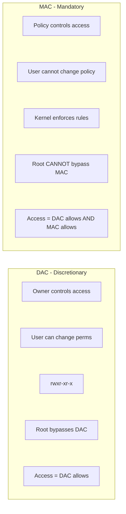
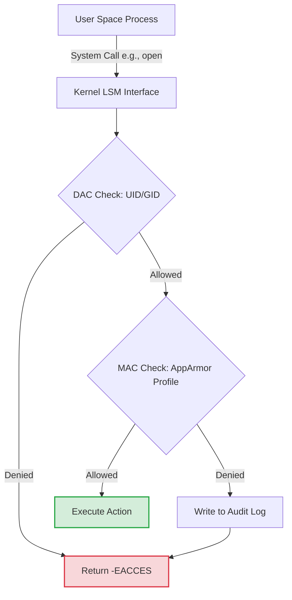

> **Linux Security** | Complexity: `[MEDIUM]` | Time: 30-35 min

## Prerequisites

Before starting this module, ensure you have completed:
- **Required**: [Module 2.3: Capabilities & LSMs](/linux/foundations/container-primitives/module-2.3-capabilities-lsms/)
- **Required**: [Module 1.4: Users & Permissions](/linux/foundations/system-essentials/module-1.4-users-permissions/)
- **Helpful**: Basic understanding of system calls and reverse proxy architecture

---

## What You'll Be Able to Do

After completing this module, you will be able to:
- **Design** custom Mandatory Access Control policies that severely restrict a compromised container's blast radius.
- **Diagnose** silent application failures by tracing kernel-level security denials through audit logs and `dmesg`.
- **Implement** robust AppArmor profiles across a Kubernetes cluster using DaemonSets and Pod SecurityContexts.
- **Evaluate** the structural differences between path-based confinement (AppArmor) and label-based enforcement (SELinux) to choose the right tool for your infrastructure.

---

## Why This Module Matters

In 2019, a massive financial institution suffered a catastrophic data breach exposing over 100 million customer records. The root cause was a Server-Side Request Forgery (SSRF) vulnerability in an open-source web application firewall (WAF) acting as a reverse proxy. Because the WAF process was running with excessive baseline permissions, the attacker was able to force the proxy to query the cloud provider's internal metadata service, extract highly privileged IAM credentials, and seamlessly exfiltrate terabytes of data. The resulting financial impact included an $80 million regulatory fine and a $190 million class-action settlement.

If that reverse proxy had been confined by a strict AppArmor profile, the attack would have failed at the execution phase. Even if the attacker successfully exploited the SSRF vulnerability, the Linux kernel itself would have blocked the proxy process from executing network requests to the metadata IP address, or from invoking tools like `curl` or `wget`. 

AppArmor provides **Mandatory Access Control (MAC)**. While traditional Discretionary Access Control (DAC) permissions can be bypassed if an attacker compromises the root user or modifies file ownership, AppArmor policies are strictly enforced by the kernel's Linux Security Module (LSM) interface. An application cannot bypass its profile, regardless of its internal privilege level. Mastering AppArmor is not just a requirement for the CKS exam; it is a fundamental skill for engineering modern, zero-trust cloud-native environments.

---

## Did You Know?

- **Mainline Kernel Integration:** Linus Torvalds officially merged AppArmor into the mainline Linux kernel in version 2.6.36 (October 2010), ending a multi-year architectural debate over competing security module frameworks.
- **Docker's Silent Shield:** The default Docker AppArmor profile automatically blocks exactly 39 highly privileged mount operations and process tracing system calls, effectively nullifying most standard container escape techniques without user intervention.
- **High-Performance Parsing:** AppArmor policies are compiled into a Deterministic Finite Automaton (DFA) state machine. This allows the kernel to evaluate complex recursive path rules against incoming system calls in under 12 milliseconds, ensuring near-zero performance overhead.
- **Ubuntu's Acquisition:** Canonical acquired the security firm Immunix in 2005 specifically to integrate AppArmor into Ubuntu, officially making it the default MAC system starting with the Ubuntu 7.10 release.

---

## The Philosophy of Containment: DAC vs MAC

To understand AppArmor, we must first understand the limitations of traditional Linux permissions. Discretionary Access Control (DAC) relies on the user identity (UID) and file ownership (`chmod`/`chown`). If a process runs as root (UID 0), it completely bypasses DAC checks. 

Mandatory Access Control (MAC) systems like AppArmor operate independently of DAC. When a process attempts to access a file, the kernel first checks DAC. If DAC allows the action, the kernel then checks MAC. **Both** must allow the action for it to succeed.

Here is the traditional representation of this security model:



Below is the modern architectural flow of how the Linux Kernel processes these requests:



### Profile Modes

AppArmor profiles operate in specific enforcement modes, dictating how the kernel handles a violation:

| Mode | Behavior | Use Case |
|------|----------|----------|
| **Enforce** | Blocks and logs violations | Production environments requiring strict security |
| **Complain** | Logs but allows violations | Testing, development, and building baseline profiles |
| **Unconfined** | No restrictions applied | Disabled state; process relies entirely on DAC |

---

## Interrogating the Kernel

When responding to an incident or auditing a node, your first step is verifying what the kernel is actively enforcing. 

### Checking Status

You can query the active AppArmor state loaded into the kernel using the `aa-status` command. This reads directly from `/sys/kernel/security/apparmor/`.

```bash
# Check if AppArmor is enabled
sudo aa-status

# Sample output:
# apparmor module is loaded.
# 42 profiles are loaded.
# 38 profiles are in enforce mode.
#    /usr/sbin/cups-browsed
#    /usr/bin/evince
#    docker-default
# 4 profiles are in complain mode.
#    /usr/sbin/rsyslogd
# 12 processes have profiles defined.
# 10 processes are in enforce mode.
# 2 processes are in complain mode.

# Check specific process
ps auxZ | grep nginx
```

### Profile Locations

Profiles are stored as plain text files on the disk before being compiled by the parser and loaded into the kernel cache.

```bash
# Profile files
/etc/apparmor.d/           # Main profiles
/etc/apparmor.d/tunables/  # Variables
/etc/apparmor.d/abstractions/  # Reusable includes

# Cache (compiled profiles)
/var/cache/apparmor/
```

---

## Anatomy of an AppArmor Profile

AppArmor profiles are path-based, meaning they restrict access based on the absolute path of files and directories on the filesystem. This contrasts with SELinux, which relies on extended attributes (xattrs) attached to the inodes themselves.

### Basic Structure

A typical profile defines the executable it governs, imports common abstractions, and then strictly whitelists permitted paths and capabilities.

```text
#include <tunables/global>

profile my-app /path/to/executable flags=(attach_disconnected) {
  #include <abstractions/base>

  # File access rules
  /etc/myapp/** r,           # Read config
  /var/log/myapp/** rw,      # Read/write logs
  /var/run/myapp.pid w,      # Write PID file

  # Network access
  network inet tcp,          # TCP allowed
  network inet udp,          # UDP allowed

  # Capabilities
  capability net_bind_service,  # Bind ports < 1024

  # Deny rules (explicit)
  deny /etc/shadow r,        # Cannot read shadow

  # Execute other programs
  /usr/bin/ls ix,            # Inherit this profile
  /usr/bin/id px,            # Use /usr/bin/id's profile
}
```

### Permission Flags

Every path rule ends with a set of permission flags defining the allowed system calls:

| Flag | Meaning |
|------|---------|
| `r` | Read data from the file |
| `w` | Write data to the file |
| `a` | Append data only (cannot overwrite existing content) |
| `x` | Execute the file as a new process |
| `m` | Memory map the file as executable (required for shared libraries) |
| `k` | Lock the file |
| `l` | Create a hard link to the file |

### Execute Modes

When a confined process spawns a child process (e.g., a web server executing a CGI script), AppArmor must know how to govern the child. This is defined by execute transitions:

| Mode | Meaning |
|------|---------|
| `ix` | Inherit current profile: The child process runs under the exact same restrictions as the parent. |
| `px` | Switch to target's profile: The child process transitions to its own dedicated profile. If missing, execution fails gracefully. |
| `Px` | Switch to target's profile (enforce): Strict transition. If the target profile is missing, execution is aggressively blocked. |
| `ux` | Unconfined: The child process escapes AppArmor and runs with no MAC restrictions. |
| `Ux` | Unconfined (enforce): Strict unconfined execution. |

### Glob Patterns

Because writing out every single file path would be impossible, AppArmor utilizes powerful globbing mechanisms. 

```text
/path/to/file     # Exact file
/path/to/dir/     # Directory only
/path/to/dir/*    # Files in directory
/path/to/dir/**   # Files in directory and subdirs
/path/to/dir/file{1,2,3}  # file1, file2, file3
```

> **Stop and think**: If a profile grants an application `/var/www/html/* rw,`, can an attacker who compromises the application overwrite a configuration file located at `/var/www/html/admin/.htaccess`? 
> *Answer*: No. The `*` glob only matches files directly inside the specified directory. It does not recurse into subdirectories. To allow recursive access (or recursive compromise), the profile would need `/**`.

---

## Managing the Profile Lifecycle

Managing AppArmor involves compiling plaintext rules into kernel bytecode. This is handled by the `apparmor_parser` utility.

### Load and Unload Profiles

```bash
# Load a profile (enforce mode)
sudo apparmor_parser -r /etc/apparmor.d/usr.sbin.nginx

# Load in complain mode
sudo apparmor_parser -C /etc/apparmor.d/usr.sbin.nginx

# Remove a profile
sudo apparmor_parser -R /etc/apparmor.d/usr.sbin.nginx

# Reload all profiles
sudo systemctl reload apparmor
```

### Switch Profile Modes

During incident response or application debugging, you may need to temporarily toggle the enforcement mode of a running profile to see if it resolves a service outage.

```bash
# Set to complain mode
sudo aa-complain /path/to/profile
# or
sudo aa-complain /usr/sbin/nginx

# Set to enforce mode
sudo aa-enforce /path/to/profile
# or
sudo aa-enforce /usr/sbin/nginx

# Disable profile (unconfined)
sudo aa-disable /path/to/profile
```

### Automated Profile Generation

Writing profiles from scratch is error-prone. The standard workflow is to utilize generation tools that monitor a process, log the system calls it attempts, and automatically suggest rules based on those observations.

```bash
# Generate profile for a program
sudo aa-genprof /usr/bin/myapp

# Interactive: Run the program, aa-genprof logs events
# Then mark events as allowed/denied to build profile

# Auto-generate from logs
sudo aa-logprof
```

---

## Real-World Scenario: Securing the Nginx Ingress

Let's return to our narrative. We have a highly targeted Nginx reverse proxy. We need a profile that allows it to serve traffic, read its SSL certificates, and write to its logs, but absolutely nothing else. If a remote code execution payload drops into the worker process, it must be trapped.

### The Nginx Profile

```text
#include <tunables/global>

profile nginx /usr/sbin/nginx flags=(attach_disconnected,mediate_deleted) {
  #include <abstractions/base>
  #include <abstractions/nameservice>

  # Capabilities
  capability dac_override,
  capability net_bind_service,
  capability setgid,
  capability setuid,

  # Network
  network inet tcp,
  network inet6 tcp,

  # Binary and libraries
  /usr/sbin/nginx mr,
  /lib/** mr,
  /usr/lib/** mr,

  # Configuration
  /etc/nginx/** r,
  /etc/ssl/** r,

  # Web content
  /var/www/** r,
  /srv/www/** r,

  # Logs
  /var/log/nginx/** rw,

  # Runtime
  /run/nginx.pid rw,
  /run/nginx/ rw,

  # Temp files
  /tmp/** rw,
  /var/lib/nginx/** rw,

  # Workers
  /usr/sbin/nginx ix,

  # Deny sensitive files
  deny /etc/shadow r,
  deny /etc/gshadow r,
}
```

Notice the explicit `deny` rules at the bottom. While AppArmor is default-deny, explicit denies are evaluated first and override any overly broad whitelist globs (like a hypothetical `/** r,` added by mistake).

---

## AppArmor in Containerized Environments

Applying AppArmor to containers requires understanding how the container runtime (like Docker or containerd) interacts with the host kernel.

### The Docker Default Profile

When you launch a standard Docker container, the Docker daemon automatically applies a built-in profile named `docker-default`. 

```bash
# Check container's AppArmor profile
docker inspect <container> | jq '.[0].AppArmorProfile'
# Output: "docker-default"

# Run with custom profile
docker run --security-opt apparmor=my-profile nginx

# Run without AppArmor (dangerous!)
docker run --security-opt apparmor=unconfined nginx
```

If you need to define a custom profile for a highly restricted microservice, it typically looks like this:

```text
#include <tunables/global>

profile my-container-profile flags=(attach_disconnected,mediate_deleted) {
  #include <abstractions/base>

  network inet tcp,
  network inet udp,

  # Container filesystem
  / r,
  /** r,
  /app/** rw,
  /tmp/** rw,

  # Deny dangerous operations
  deny mount,
  deny umount,
  deny ptrace,
  deny /proc/*/mem rw,
  deny /proc/sysrq-trigger rw,

  # Capabilities
  capability chown,
  capability dac_override,
  capability setuid,
  capability setgid,
}
```

### Kubernetes Integration

In Kubernetes v1.30 and above, AppArmor is integrated natively via the `securityContext.appArmorProfile` field (replacing the deprecated beta annotations).

```yaml
apiVersion: v1
kind: Pod
metadata:
  name: my-pod
spec:
  containers:
  - name: my-container
    image: nginx
    securityContext:
      appArmorProfile:
        type: Localhost
        localhostProfile: my-profile
```

A common snippet you will see in production YAML manifests looks exactly like this:

```yaml
    securityContext:
      appArmorProfile:
        type: Localhost
        localhostProfile: <profile-name>
```

### K8s Profile Types

The value you supply in the `type` field defines the profile source:

| Type | Meaning |
|-------|---------|
| `RuntimeDefault` | Uses the underlying Container Runtime's default (e.g., `docker-default` or containerd's equivalent). |
| `Localhost` | Informs the Kubelet to request a specific profile named in `localhostProfile` previously loaded into the host node's kernel. |
| `Unconfined` | Strips all MAC protection. Highly dangerous; essentially runs the container with raw DAC limitations. |

### Distribution in a Cluster

Because Kubernetes `securityContext` instructs the Kubelet to apply a `Localhost` profile, that exact profile **must already exist and be compiled in the kernel of the worker node where the Pod lands.**

```bash
# Profile must exist on the node at /etc/apparmor.d/
# Load it:
sudo apparmor_parser -r /etc/apparmor.d/my-profile

# Or use DaemonSet to deploy profiles to all nodes
```

Here is how you apply it to a restricted Nginx deployment:

```yaml
apiVersion: v1
kind: Pod
metadata:
  name: restricted-nginx
spec:
  containers:
  - name: nginx
    image: nginx:alpine
    ports:
    - containerPort: 80
    securityContext:
      appArmorProfile:
        type: Localhost
        localhostProfile: k8s-nginx
```

> **Pause and predict**: If you deploy the `restricted-nginx` Pod above, but the `k8s-nginx` profile has not been loaded via `apparmor_parser` on the scheduled node, what happens to the Pod?
> *Answer*: The Kubelet will attempt to start the container via the CRI. The CRI will request the kernel to attach the non-existent profile. The kernel will reject it, and the Pod will become permanently stuck in a `CreateContainerConfigError` or `Blocked` state until the profile is loaded on the node.

---

## Auditing, Debugging, and Incident Response

When an application behaves erratically—such as failing to start, silently dropping network connections, or crashing when writing temporary files—AppArmor is a prime suspect.

### Viewing Denials

When the kernel blocks an action, it writes a detailed event to the system audit stream. Depending on your node's logging configuration, you can find these events in several places:

```bash
# Check dmesg
sudo dmesg | grep -i apparmor

# Check audit log
sudo cat /var/log/audit/audit.log | grep apparmor

# Check syslog
sudo grep apparmor /var/log/syslog

# Sample denial:
# audit: type=1400 audit(...): apparmor="DENIED" operation="open"
#   profile="docker-default" name="/etc/shadow" pid=1234
#   comm="cat" requested_mask="r" denied_mask="r"
```

If the `auditd` daemon is not installed, the kernel falls back to the standard kernel ring buffer and syslog, which you can query precisely like this:

```bash
sudo dmesg | grep -i apparmor
sudo grep apparmor /var/log/syslog
```

> **Stop and think**: If `aa-status` shows that 0 profiles are loaded, but your Kubelet is trying to start a pod configured with a specific `Localhost` profile, what will happen?
> *Answer*: The Pod startup will fail with an error such as `CreateContainerError` or `CreateContainerConfigError`. The runtime will check for the profile in the kernel, fail to locate it, and safely abort the container initialization process. You must distribute and load the profile using `apparmor_parser -r` before scheduling the Pod.

### Diagnosing Common Application Failures

You must learn to map application-level symptoms to kernel-level MAC denials:

```bash
# Issue: Container can't write to /app/data
# Check: Profile allows /app/** but not write

# Issue: Network connection refused
# Check: Profile has network rules

# Issue: Exec fails
# Check: Profile has execute permission for binary

# Generate missing rules from logs
sudo aa-logprof
```

If you identify a missing rule via the logs, you don't necessarily have to write it manually. You can trigger the log profiling tool to parse the recent denials and interactively suggest rules to append to your profile:

```bash
sudo aa-logprof
```

If you are dealing with an urgent production outage and cannot immediately determine which rule is missing, you can drop the profile into complain mode to restore service while you analyze the logs:

```bash
sudo aa-complain /etc/apparmor.d/my-profile
```

---

## Common Mistakes

| Mistake | Problem / Why it happens | Fix / Solution |
|---------|--------------------------|----------------|
| **Profile not loaded on node** | Kubelet throws a `CreateContainerError` because the kernel rejects the unknown profile name. | Use a privileged DaemonSet to sync and `apparmor_parser -r` profiles across all nodes before deploying workloads. |
| **Invalid K8s `securityContext`** | The API server rejects the manifest entirely because `appArmorProfile` is strictly typed in Kubernetes v1.30+. | Ensure you are using the correct native fields (`type: Localhost` and `localhostProfile: name`) instead of deprecated annotations. |
| **Using `Unconfined` blindly** | Container runs with zero MAC protection, leaving it highly vulnerable to container escape techniques. | Always use `RuntimeDefault` at a minimum, or write a custom complain-mode profile to build a baseline. |
| **Profile too restrictive** | The application crashes on startup because it cannot access required shared libraries or PID files. | Always deploy new profiles in `complain` mode first, run integration tests, and check audit logs for violations. |
| **Not checking denials** | Application experiences silent failures (e.g., dropping file uploads) while DAC permissions look perfectly fine. | Actively monitor `dmesg` and `/var/log/audit/audit.log` for `apparmor="DENIED"` strings. |
| **Hardcoding exact paths** | Containers might mount volumes at slightly different paths, causing the profile to break across environments. | Utilize AppArmor abstractions (like `#include <abstractions/base>`) and robust globbing (`**`) for dynamic directories. |
| **Missing execute transitions** | A web server successfully receives a request but silently fails when spawning a worker child process. | Ensure binaries have execute permissions defined (e.g., `ix` for inheritance or `px` to transition to a new profile). |
| **Confusing `*` with `**`** | An application is granted `/app/* rw,` but fails when trying to create a file inside `/app/cache/tmp/`. | Use `*` for single-directory matches and `**` for recursive matches encompassing all nested subdirectories. |

---

## Knowledge Check

<details>
<summary><b>Question 1: Scenario - The Silent Logger</b><br>You have deployed a custom AppArmor profile for a Node.js microservice. The service starts correctly and processes HTTP traffic, but developers report that no application logs are appearing in `/var/log/nodejs/`. You verify the directory exists and the user has DAC write permissions. What AppArmor rule configuration is likely causing this, and how do you verify?</summary>

The profile likely lacks the `w` (write) flag for the logging directory path (e.g., it might only have `/var/log/nodejs/** r,` or no rule for that path at all). Because AppArmor operates on a default-deny principle, any access not explicitly permitted by a loaded profile is silently blocked by the kernel. From the application's perspective, this results in an immediate permission denied error during the system call, regardless of the underlying DAC permissions on the folder. You can empirically verify this kernel-level intervention by querying the host's ring buffer with `sudo dmesg | grep -i apparmor`. Look for an audit line containing `DENIED` with `requested_mask="w"` on the specific `/var/log/nodejs/app.log` path.
</details>

<details>
<summary><b>Question 2: Scenario - The Stuck Pod</b><br>You update a Kubernetes Deployment manifest to include an `appArmorProfile` of type `Localhost` with `localhostProfile: strict-backend` in the container's `securityContext`. After applying the YAML, the Pod fails to initialize and gets stuck in a `Blocked` or `CreateContainerError` state. The container image and all secrets are valid. What is the architectural disconnect causing this failure?</summary>

The Kubernetes `securityContext` specification instructs the Kubelet to configure the Container Runtime (such as containerd or CRI-O) to apply a kernel-level AppArmor profile literally named `strict-backend`. However, Kubernetes itself does not automatically distribute or load AppArmor profiles onto worker nodes. If this specific profile has not been physically placed in `/etc/apparmor.d/` and explicitly loaded into the kernel using `apparmor_parser -r` on the exact worker node where the Pod was scheduled, the Container Runtime will fail to apply the policy. Consequently, the runtime returns an error to the Kubelet, causing the Pod lifecycle to permanently stall until the profile is correctly staged on the node.
</details>

<details>
<summary><b>Question 3: Scenario - The Trapped Attacker</b><br>An attacker exploits a Remote Code Execution (RCE) vulnerability in your web application and attempts to execute `/bin/bash` to gain an interactive shell. The exploit executes successfully, but the attacker receives no output and the connection drops immediately. What execute mode in the application's AppArmor profile caused this defensive win?</summary>

The profile likely omitted any execute transition flags (such as `ix` for inherit or `px` for a new profile) for the `/bin/bash` binary, or it explicitly denied execution altogether. In a Mandatory Access Control architecture that is default-deny, if a profile does not explicitly define an execution mode for a target binary, the `execve` system call is unconditionally blocked by the kernel. The attacker's initial RCE payload might execute successfully within the bounds of the existing process, but the kernel instantly intercepts and denies the subsequent attempt to spawn the bash shell. This terminates the attack chain immediately, demonstrating the power of execution confinement.
</details>

<details>
<summary><b>Question 4: Scenario - The Symlink Bypass Attempt</b><br>Your profile explicitly contains the rule `deny /etc/shadow r,` to protect credentials, but broadly allows `/** r,` for application reading. An attacker gains limited file write access, creates a symlink at `/tmp/shadow_link` pointing to `/etc/shadow`, and tries to read the symlink. Does the kernel allow this read? Why or why not?</summary>

No, the kernel will successfully block this read attempt. AppArmor is designed to resolve all symlinks to their canonical, absolute filesystem paths before evaluating them against the compiled DFA state machine in the kernel. When the application attempts to read `/tmp/shadow_link`, the kernel intervenes, resolves the target to its true location at `/etc/shadow`, and evaluates the ruleset. It then hits the explicit `deny /etc/shadow r,` rule and immediately returns a permission denied error, effectively neutralizing the symlink bypass attack and maintaining the integrity of the confinement.
</details>

<details>
<summary><b>Question 5: Scenario - The Empty Profiler</b><br>An application is crashing due to a suspected MAC denial. You log into the server, run `sudo aa-logprof` to automatically generate the missing rules, but the tool outputs "No new events found" and exits. Assuming the application definitely triggered a denial, what is the most likely reason the profiler sees nothing?</summary>

The `aa-logprof` tool relies entirely on parsing historical system audit logs (usually found in `/var/log/audit/audit.log` or syslog) to identify previous denials and suggest new rules. If it outputs 'No new events found', it indicates that the denial events were never written to disk or have already rotated out of the log buffer. The most common architectural reason for this is that the `auditd` daemon is not running on the host, or syslog is configured to drop kernel-level MAC messages. Alternatively, the active AppArmor profile might contain a specific `deny` rule explicitly bundled with the `audit` modifier stripped (e.g., `deny /path w,` without `audit`), which purposefully suppresses log spam for known, harmless denials.
</details>

<details>
<summary><b>Question 6: Scenario - Precision Globbing</b><br>You are writing a profile for a backup agent. It needs to recursively read all files and directories inside `/var/www/html/` to back them up. It also needs to write the final archive strictly to the root of `/backup/`, but it should absolutely NOT be allowed to create subdirectories inside `/backup/`. How do you design the glob patterns for these two distinct requirements?</summary>

You must use the double-asterisk (`**`) globbing pattern for the recursive read requirement, and the single-asterisk (`*`) pattern for the non-recursive write requirement. The correct configuration for reading would be `/var/www/html/** r,`, which explicitly instructs the kernel to allow traversal infinitely deep into all nested subdirectories. Conversely, the correct configuration for writing would be `/backup/* w,`, which strictly allows creating and modifying files directly inside the root of `/backup/`. This structural constraint physically prevents the backup agent from attempting to create or write into any nested folders like `/backup/nested/`, strictly enforcing the required access boundaries.
</details>

---

## Hands-On Exercise: The Confinement Challenge

**Objective**: Create, test, debug, and apply AppArmor profiles using kernel logging tools to diagnose an intentionally broken profile.

**Environment**: An Ubuntu/Debian system with AppArmor enabled.

### Part 1: Establish the Baseline

First, interrogate the kernel to understand the current MAC state of your environment.

```bash
# 1. Verify AppArmor is running
sudo aa-status

# 2. List loaded profiles
sudo aa-status | grep "profiles are loaded"

# 3. Check a running process
ps auxZ | head -10
```

### Part 2: Construct the Vulnerable Target

We will simulate a vulnerable script that attempts to access sensitive system files (which an attacker might target) and writes output to a temporary directory.

```bash
# 1. Create a test script
cat > /tmp/test-app.sh << 'EOF'
#!/bin/bash
echo "Reading /etc/hostname:"
cat /etc/hostname
echo "Reading /etc/shadow:"
cat /etc/shadow 2>&1
echo "Writing to /tmp:"
echo "test" > /tmp/test-output.txt
echo "Done"
EOF
chmod +x /tmp/test-app.sh

# 2. Run without AppArmor
/tmp/test-app.sh
```
*Note: Depending on your current user privileges, the read of `/etc/shadow` may fail via standard DAC, but the script will complete successfully.*

### Part 3: Apply the Kernel Cage

Now, we define a strict profile that intentionally restricts the application, explicitly denying access to shadow files.

```bash
# 3. Create AppArmor profile
sudo tee /etc/apparmor.d/tmp.test-app.sh << 'EOF'
#include <tunables/global>

profile test-app /tmp/test-app.sh {
  #include <abstractions/base>
  #include <abstractions/bash>

  /tmp/test-app.sh r,
  /bin/bash ix,
  /bin/cat ix,
  /usr/bin/cat ix,

  # Allow hostname, deny shadow
  /etc/hostname r,
  deny /etc/shadow r,

  # Allow /tmp writes
  /tmp/** rw,
}
EOF

# 4. Load the profile
sudo apparmor_parser -r /etc/apparmor.d/tmp.test-app.sh

# 5. Test again
/tmp/test-app.sh
# shadow should be denied now

# 6. Check denial in logs
sudo dmesg | tail -5 | grep apparmor
```

### Part 4: The Debugging Workflow (Complain Mode)

When building complex profiles, strict enforcement often breaks applications. We use `complain` mode to observe what *would* have been blocked without actually stopping the process.

```bash
# 1. Set to complain mode
sudo aa-complain /etc/apparmor.d/tmp.test-app.sh

# 2. Run script
/tmp/test-app.sh
# Everything works now

# 3. Check logs for what would have been denied
sudo dmesg | grep "ALLOWED" | tail -5

# 4. Set back to enforce
sudo aa-enforce /etc/apparmor.d/tmp.test-app.sh
```

### Part 5: Container Validation (Docker Default)

If you have Docker installed on your host, you can observe how the runtime automatically applies the default baseline profile to contain malicious behavior.

```bash
# 1. Check default profile
docker run --rm alpine cat /proc/1/attr/current
# Should show: docker-default

# 2. Run unconfined (compare)
docker run --rm --security-opt apparmor=unconfined alpine cat /proc/1/attr/current
# Shows: unconfined

# 3. Test restriction
docker run --rm alpine cat /etc/shadow
# Fails due to docker-default profile

docker run --rm --security-opt apparmor=unconfined alpine cat /etc/shadow
# May work (if root)
```

### Part 6: The Challenge - Fix the Broken Profile

**Scenario:** You have deployed the `test-app` profile, but a developer complains that the script is failing to write an entirely new backup log to `/var/log/test-app.log`. 

Your objective:
1. Modify `/tmp/test-app.sh` to add the line: `echo "backup" > /var/log/test-app.log` (run as root).
2. Execute the script. It will fail with Permission Denied.
3. Use kernel diagnostic tools to identify the missing permission.
4. Update the profile and reload it to fix the application.

<details>
<summary><b>View the Solution Guide</b></summary>

1. Update the script and run it: The script fails to write.
2. Check the kernel logs for the exact denial:
   ```bash
   sudo dmesg | grep DENIED
   ```
   *You will see a denial for `requested_mask="w"` on `name="/var/log/test-app.log"`.*
3. You have two options to fix this:
   - **Manual Edit**: Open `/etc/apparmor.d/tmp.test-app.sh` and add `/var/log/test-app.log w,` before the closing brace.
   - **Automated**: Run `sudo aa-logprof`. The tool will read the denial, prompt you to allow the write access to `/var/log/test-app.log`, and automatically save the profile.
4. Reload the profile into the kernel:
   ```bash
   sudo apparmor_parser -r /etc/apparmor.d/tmp.test-app.sh
   ```
5. Run the script again. It will now succeed!
</details>

### Cleanup

Restore your system to its original state:

```bash
sudo aa-disable /etc/apparmor.d/tmp.test-app.sh
sudo rm /etc/apparmor.d/tmp.test-app.sh
rm /tmp/test-app.sh /tmp/test-output.txt
```

### Success Criteria Checklist

- [x] Verified AppArmor kernel module status and listed loaded profiles.
- [x] Successfully compiled and loaded a custom profile using `apparmor_parser`.
- [x] Toggled between enforce and complain modes to observe application behavior.
- [x] Traced kernel enforcement actions via `dmesg` audit streams.
- [x] Successfully diagnosed and repaired a broken profile using kernel diagnostics.
- [x] Evaluated default container restrictions via Docker execution.

---

## What's Next?

You have mastered path-based mandatory access control. But what happens when you land on a Red Hat or CentOS cluster where AppArmor doesn't exist? In **[Module 4.3: SELinux Contexts](/linux/security/hardening/module-4.3-selinux/)**, you will dive into the alternative MAC ecosystem, learning how to manipulate security labels and boolean toggles to achieve the exact same kernel-level containment.