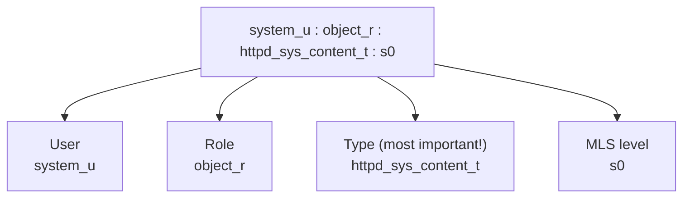
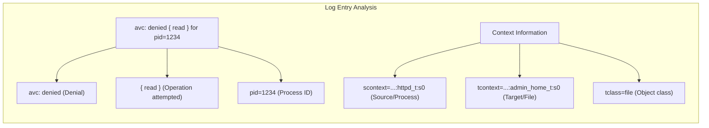
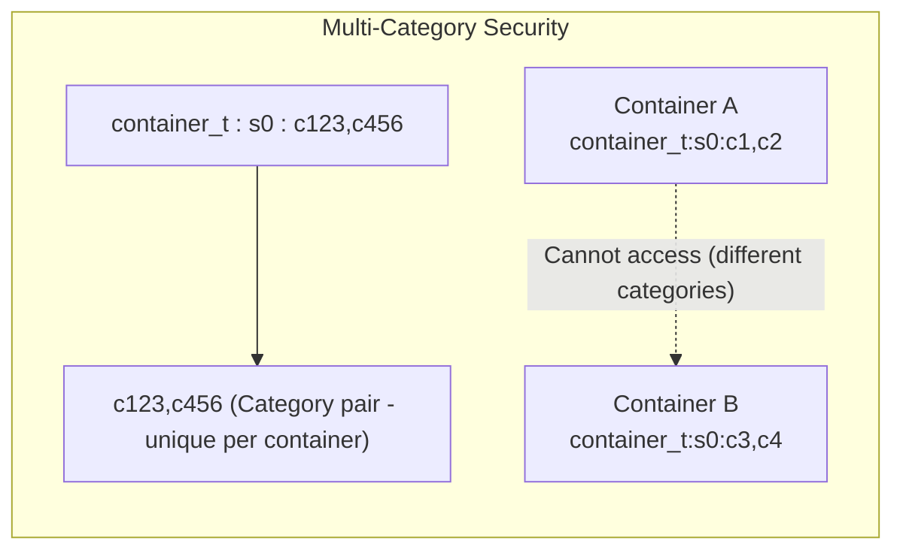

> **Linux Security** | Complexity: `[COMPLEX]` | Time: 35-40 min

## Prerequisites

Before starting this module:
- **Required**: [Module 2.3: Capabilities & LSMs](/linux/foundations/container-primitives/module-2.3-capabilities-lsms/)
- **Helpful**: [Module 4.2: AppArmor Profiles](../module-4.2-apparmor/) for comparison
- **Helpful**: Access to RHEL/CentOS/Fedora/Rocky system

---

## What You'll Be Able to Do

After this module, you will be able to:
- **Explain** SELinux contexts (user:role:type:level) and how they control access
- **Diagnose** "Permission denied" errors caused by SELinux using audit2why and sesearch
- **Configure** SELinux for Kubernetes nodes (container_t, container_file_t contexts)
- **Choose** between enforcing, permissive, and disabled modes and explain the trade-offs

---

## Why This Module Matters

**SELinux (Security-Enhanced Linux)** is the mandatory access control system used by RHEL, CentOS, Fedora, and their derivatives. It's more complex than AppArmor but provides finer-grained control.

Understanding SELinux helps you:

- **Manage RHEL-based Kubernetes nodes** — SELinux is enabled by default
- **Debug "permission denied" errors** — When file permissions look correct
- **Pass CKS exam** — SELinux is tested alongside AppArmor
- **Understand container isolation** — SELinux labels separate containers

When something works on Ubuntu but fails on RHEL with no obvious cause, SELinux is often involved.

> **Stop and think**: You migrate a perfectly functioning Nginx pod from an Ubuntu-based Kubernetes cluster to a new RHEL-based cluster. The pod starts, but Nginx returns 403 Forbidden for files mounted from a hostPath volume, even though the file permissions are `777`. Based on the architectural differences between these distributions, why would DAC (Discretionary Access Control) allow access while the overall system denies it?

---

## Did You Know?

- **SELinux was developed by the NSA** — Released in 2000, it was contributed to the Linux kernel. Despite its origin, it's open source and widely audited.

- **SELinux has over 300,000 rules** in a typical targeted policy. Each rule defines what one type can do to another type.

- **"Just disable SELinux" is terrible advice** — It's a common but dangerous response to SELinux issues. Instead, learn to work with it or use permissive mode for debugging.

- **Multi-Level Security (MLS) is military-grade** — SELinux can implement classified/secret/top-secret style mandatory access controls, though most systems use the simpler "targeted" policy.

---

## SELinux vs AppArmor

| Aspect | SELinux | AppArmor |
|--------|---------|----------|
| Approach | Label-based | Path-based |
| Complexity | Higher | Lower |
| Granularity | Finer | Coarser |
| Distros | RHEL, CentOS, Fedora | Ubuntu, Debian, SUSE |
| Policy | Compiled | Text files |
| Learning curve | Steeper | Gentler |

---

## SELinux Concepts

### Security Labels

Every file, process, and resource has a **security context** (label). The structure is: `user:role:type:level`



> **Pause and predict**: If a process with context `httpd_t` attempts to read a file with context `user_home_t`, but the file's standard Linux permission is `777` (world-readable), what will the SELinux enforcement engine decide and why?

### Type Enforcement (TE)

Most SELinux decisions use **type enforcement**:

```mermaid
flowchart TD
    subgraph Type Enforcement
        direction TB
        Process["Process Context: httpd_t"]
        File["File Context: httpd_sys_content_t"]
        Rule{"Policy rule exists?<br>allow httpd_t httpd_sys_content_t:file read;"}
        Allow["ALLOW"]
        Deny["DENY"]
        
        Process -- "wants to read" --> File
        File --> Rule
        Rule -- "YES" --> Allow
        Rule -- "NO" --> Deny
    end
    
    Note["Access requires: DAC allows AND SELinux policy allows"]
    Type Enforcement ~~~ Note
```

### Common Types

| Type | Purpose |
|------|---------|
| `httpd_t` | Apache/nginx processes |
| `httpd_sys_content_t` | Web content files |
| `container_t` | Container processes |
| `container_file_t` | Container files |
| `sshd_t` | SSH daemon |
| `user_home_t` | User home directories |
| `etc_t` | /etc files |
| `var_log_t` | Log files |

---

## SELinux Modes

### Three Modes

```bash
# Check current mode
getenforce
# Returns: Enforcing, Permissive, or Disabled

# Get detailed status
sestatus
```

| Mode | Behavior |
|------|----------|
| **Enforcing** | Policies enforced, violations denied and logged |
| **Permissive** | Policies not enforced, violations only logged |
| **Disabled** | SELinux completely off |

### Changing Modes

```bash
# Temporarily set to permissive (until reboot)
sudo setenforce 0

# Temporarily set to enforcing
sudo setenforce 1

# Cannot enable if disabled (requires reboot)

# Permanent change: edit /etc/selinux/config
# SELINUX=enforcing|permissive|disabled
```

---

## Viewing Contexts

### File Contexts

```bash
# Show file context
ls -Z /var/www/html/
# -rw-r--r--. root root system_u:object_r:httpd_sys_content_t:s0 index.html

# Just the context
stat -c %C /var/www/html/index.html
```

### Process Contexts

```bash
# Show process contexts
ps -eZ | grep httpd
# system_u:system_r:httpd_t:s0 1234 ? 00:00:01 httpd

# Current shell context
id -Z
# unconfined_u:unconfined_r:unconfined_t:s0
```

### User Contexts

```bash
# Show SELinux user mapping
semanage login -l

# Show SELinux users
semanage user -l
```

---

## Managing File Contexts

### Setting Contexts

```bash
# Change context temporarily (doesn't survive relabel)
chcon -t httpd_sys_content_t /var/www/html/newfile.html

# Change context recursively
chcon -R -t httpd_sys_content_t /var/www/html/

# Restore default context
restorecon -v /var/www/html/newfile.html

# Restore recursively
restorecon -Rv /var/www/html/
```

### Defining Default Contexts

```bash
# View default file contexts
semanage fcontext -l | grep httpd

# Add custom default context
sudo semanage fcontext -a -t httpd_sys_content_t "/srv/web(/.*)?"

# Apply the change
sudo restorecon -Rv /srv/web
```

---

## SELinux Booleans

**Booleans** are on/off switches for policy features:

```bash
# List all booleans
getsebool -a

# List specific boolean
getsebool httpd_can_network_connect
# httpd_can_network_connect --> off

# Set temporarily
sudo setsebool httpd_can_network_connect on

# Set permanently
sudo setsebool -P httpd_can_network_connect on

# Common booleans
getsebool -a | grep httpd
# httpd_can_network_connect
# httpd_can_network_connect_db
# httpd_enable_cgi
# httpd_read_user_content
```

> **Pause and predict**: If an application running under `httpd_t` needs outbound network access but the SELinux policy currently denies it, what is the safest and least intrusive way to grant this access?

### Common Booleans

| Boolean | Purpose |
|---------|---------|
| `httpd_can_network_connect` | Allow httpd to make network connections |
| `httpd_can_network_connect_db` | Allow httpd to connect to databases |
| `container_manage_cgroup` | Allow containers to manage cgroups |
| `container_use_devices` | Allow containers to use devices |

---

## Troubleshooting SELinux

### Finding Denials

```bash
# Check audit log
sudo ausearch -m AVC -ts recent

# Sample denial:
# type=AVC msg=audit(...): avc:  denied  { read } for  pid=1234
#   comm="httpd" name="secret.html" dev="sda1" ino=12345
#   scontext=system_u:system_r:httpd_t:s0
#   tcontext=system_u:object_r:admin_home_t:s0
#   tclass=file permissive=0

# Use audit2why to explain
sudo ausearch -m AVC -ts recent | audit2why

# More readable with sealert (if installed)
sudo sealert -a /var/log/audit/audit.log
```

### Interpreting Denials



### Generate Policy from Denials

```bash
# Generate policy module from audit log
sudo ausearch -m AVC -ts recent | audit2allow -M mypolicy

# Review the generated policy
cat mypolicy.te

# Install the policy
sudo semodule -i mypolicy.pp
```

### Common Fixes

```bash
# Wrong file context → Fix with restorecon
sudo restorecon -Rv /path/to/files

# Need network access → Enable boolean
sudo setsebool -P httpd_can_network_connect on

# Custom location for web content → Add fcontext
sudo semanage fcontext -a -t httpd_sys_content_t "/custom/path(/.*)?"
sudo restorecon -Rv /custom/path

# Last resort → Create custom policy
sudo ausearch -m AVC | audit2allow -M myfix
sudo semodule -i myfix.pp
```

---

## Container SELinux

### Container Types

```bash
# Container processes run as container_t
ps -eZ | grep container
# system_u:system_r:container_t:s0:c123,c456 12345 ? 00:00:00 nginx

# Container files have container_file_t
ls -Z /var/lib/containers/
```

### Multi-Category Security (MCS)

Containers get unique MCS labels for isolation:



### Podman/Docker SELinux

```bash
# Podman with SELinux
podman run --rm -it fedora cat /proc/1/attr/current
# system_u:system_r:container_t:s0:c123,c456

# Volume mount with SELinux
podman run -v /host/path:/container/path:Z fedora ls /container/path
# :z = shared, :Z = private (relabels)
```

### Kubernetes SELinux

```yaml
apiVersion: v1
kind: Pod
spec:
  securityContext:
    seLinuxOptions:
      level: "s0:c123,c456"    # MCS label
      type: "container_t"      # Type (usually automatic)
  containers:
  - name: app
    image: nginx
```

---

## Common Mistakes

| Mistake | Problem | Solution |
|---------|---------|----------|
| Disabling SELinux | No protection | Use permissive mode to debug |
| Using chcon only | Changes lost on relabel | Use semanage fcontext |
| Ignoring booleans | Creating unnecessary policy | Check booleans first |
| Wrong volume labels | Container can't access files | Use :Z or :z mount option |
| Permissive forever | Never enforcing | Fix issues, return to enforcing |
| Not checking audit log | Missing root cause | Always check ausearch/audit2why |

---

## Quiz

### Question 1
Scenario: A developer complains that their web application cannot read a newly created configuration file at `/var/www/html/config.ini`. You use `chcon -t httpd_sys_content_t /var/www/html/config.ini` and the application works. However, after a scheduled weekend system patching and reboot, the application fails with the exact same permission error. What caused the fix to revert, and how should it be resolved permanently?

<details>
<summary>Show Answer</summary>

The `chcon` command changes the SELinux context of a file immediately, but this change is strictly temporary and exists only in the filesystem metadata. When the system was patched or an administrator ran a filesystem relabel operation (like `restorecon`), the temporary context was overwritten by the default policy defined for that directory path. To permanently resolve the issue, you must define the default policy using `semanage fcontext -a -t httpd_sys_content_t "/var/www/html/config.ini"` and then apply it with `restorecon -v /var/www/html/config.ini`. This ensures the correct label survives system reboots and relabeling operations.

</details>

### Question 2
Scenario: You deploy a PHP application on a CentOS server running Apache (`httpd`). The application needs to connect to an external PostgreSQL database to fetch user data. The database credentials are correct, and `curl` from the server can reach the database port, but the PHP application logs show "Permission denied" when attempting the connection. How do you diagnose and resolve this without altering file contexts?

<details>
<summary>Show Answer</summary>

The issue is likely caused by an SELinux Boolean that restricts the `httpd` process from initiating outbound network connections, which is disabled by default for security. You can diagnose this by checking the audit logs (`ausearch -m AVC`) or by checking the specific boolean status with `getsebool httpd_can_network_connect`. To resolve it, run `setsebool -P httpd_can_network_connect on` (or `httpd_can_network_connect_db on`). The `-P` flag ensures the change is written to the permanent policy on disk, meaning the web server will still be able to connect to the database even after the system reboots.

</details>

### Question 3
Scenario: Two different pods, Pod A (a frontend web server) and Pod B (a backend API), are running on the same Fedora-based Kubernetes node. Both container processes run under the exact same SELinux type (`container_t`). A vulnerability in Pod A allows an attacker to execute arbitrary code. Explain the mechanism SELinux uses to ensure the attacker cannot read the mounted files belonging to Pod B, despite both processes having the same `container_t` type.

<details>
<summary>Show Answer</summary>

SELinux achieves this isolation through Multi-Category Security (MCS), which adds a unique category pair to the security context of each container. While both Pod A and Pod B run as `container_t`, the container runtime assigns them distinct MCS labels (e.g., Pod A gets `s0:c1,c2` and Pod B gets `s0:c3,c4`). When Pod A attempts to access files mapped to Pod B, the SELinux policy checks the MCS labels. Because the categories do not match, access is denied, effectively isolating the containers from each other even though they share the same base process type.

</details>

### Question 4
Scenario: You install a third-party monitoring agent on a production node. The agent's systemd service fails to start, and standard file permissions look completely normal. You suspect SELinux is blocking it. Walk through the exact investigative steps you would take to identify the root cause before attempting any fixes.

<details>
<summary>Show Answer</summary>

The first step is to never disable SELinux or set it to permissive mode immediately on a production node. Instead, you should query the audit logs for access vector cache (AVC) denials using `sudo ausearch -m AVC -ts recent`. Piping this output to `audit2why` will translate the cryptic raw log into a human-readable explanation of exactly which process was denied access to which target, and often suggests the reason. Once you understand the specific denial (e.g., the agent process lacks a required network boolean or is trying to read a path with the wrong `fcontext`), you can apply a targeted fix rather than blindly altering security policies.

</details>

### Question 5
Scenario: You are migrating a legacy container deployment script to a new RHEL 9 server. The script uses Podman to launch an analytics container that mounts `/opt/analytics_data` from the host. When the container starts, it immediately crashes with an inability to read the mounted directory. You run `podman run -v /opt/analytics_data:/data:Z analytics-image`. What exactly does the `:Z` flag do, and why might it be dangerous if `/opt/analytics_data` was a shared system directory like `/etc`?

<details>
<summary>Show Answer</summary>

The `:Z` (uppercase Z) flag instructs the container runtime to perform a private volume relabeling, meaning it changes the SELinux context of the host directory to match the specific, unique MCS label of that individual container. This allows the container exclusive access to the files. It would be highly dangerous to use `:Z` on a shared system directory like `/etc` because the relabeling process would change the context of all files within it, instantly breaking the host operating system's ability to read its own configuration files and likely crashing the system. For directories that must be shared among multiple containers or the host, the `:z` (lowercase z) flag should be used to apply a shared label.

</details>

---

## Hands-On Exercise

### Working with SELinux

**Objective**: Understand SELinux contexts, booleans, and troubleshooting.

**Environment**: RHEL, CentOS, Fedora, or Rocky Linux

#### Part 1: Check SELinux Status

```bash
# 1. Check mode
getenforce
sestatus

# 2. View your context
id -Z

# 3. View file contexts
ls -Z /etc/passwd
ls -Z /var/www/html/ 2>/dev/null || ls -Z /var/log/
```

#### Part 2: File Contexts

```bash
# 1. Create test directory
sudo mkdir /srv/testapp

# 2. Check default context
ls -Zd /srv/testapp
# Should show default_t or similar

# 3. Create a file
sudo touch /srv/testapp/index.html
ls -Z /srv/testapp/

# 4. Change context temporarily
sudo chcon -t httpd_sys_content_t /srv/testapp/index.html
ls -Z /srv/testapp/index.html

# 5. Restore default (undoes chcon)
sudo restorecon -v /srv/testapp/index.html
ls -Z /srv/testapp/index.html

# 6. Set permanent context
sudo semanage fcontext -a -t httpd_sys_content_t "/srv/testapp(/.*)?"
sudo restorecon -Rv /srv/testapp
ls -Z /srv/testapp/
```

#### Part 3: Booleans

```bash
# 1. List all booleans
getsebool -a | wc -l

# 2. Find httpd booleans
getsebool -a | grep httpd

# 3. Check specific boolean
getsebool httpd_can_network_connect

# 4. Change it (temporarily)
sudo setsebool httpd_can_network_connect on
getsebool httpd_can_network_connect

# 5. Revert
sudo setsebool httpd_can_network_connect off
```

#### Part 4: Troubleshooting

```bash
# 1. Generate a denial (if httpd installed)
# Try to serve file from wrong context

# 2. Check audit log
sudo ausearch -m AVC -ts recent | tail -20

# 3. If denials exist, analyze
sudo ausearch -m AVC -ts recent | audit2why

# 4. Alternative: use sealert if installed
sudo sealert -a /var/log/audit/audit.log | head -50
```

#### Part 5: Permissive Mode (Careful!)

```bash
# 1. Check current mode
getenforce

# 2. Set permissive temporarily
sudo setenforce 0
getenforce

# 3. Generate would-be denials
# ... run your application ...

# 4. Check what would have been denied
sudo ausearch -m AVC -ts recent

# 5. Return to enforcing
sudo setenforce 1
getenforce
```

#### Cleanup

```bash
sudo semanage fcontext -d "/srv/testapp(/.*)?"
sudo rm -rf /srv/testapp
```

### Success Criteria

- [ ] Checked SELinux status and mode
- [ ] Viewed file and process contexts
- [ ] Changed file context with chcon and restorecon
- [ ] Set permanent context with semanage
- [ ] Listed and modified booleans
- [ ] Analyzed AVC denials

---

## Key Takeaways

1. **Labels are everything** — user:role:type:level controls access

2. **Type enforcement is primary** — Most decisions based on type

3. **Booleans before custom policy** — Check if a switch exists first

4. **semanage for permanent changes** — chcon is temporary

5. **Don't disable, debug** — Permissive mode for troubleshooting

---

## What's Next?

In **Module 4.4: seccomp Profiles**, you'll learn system call filtering—blocking dangerous kernel calls regardless of what LSM is in use.

---

## Further Reading

- [Red Hat SELinux Guide](https://access.redhat.com/documentation/en-us/red_hat_enterprise_linux/8/html/using_selinux/)
- [SELinux Project Wiki](https://selinuxproject.org/page/Main_Page)
- [Fedora SELinux Guide](https://docs.fedoraproject.org/en-US/quick-docs/selinux-getting-started/)
- [Container SELinux](https://www.redhat.com/en/blog/container-security-and-selinux)