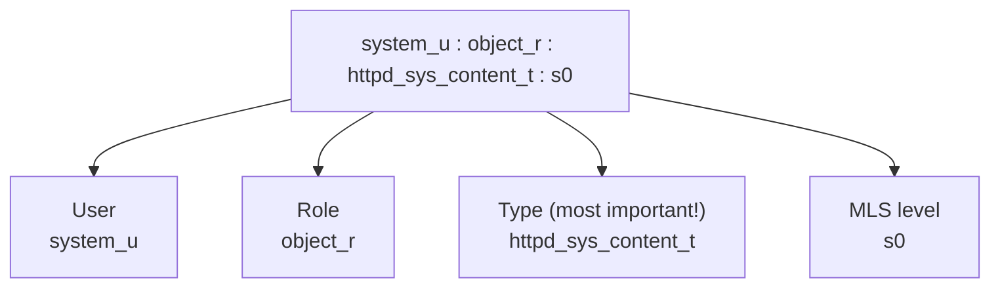
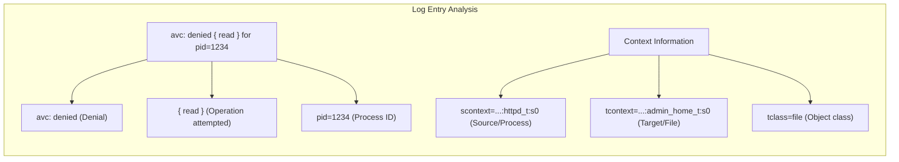
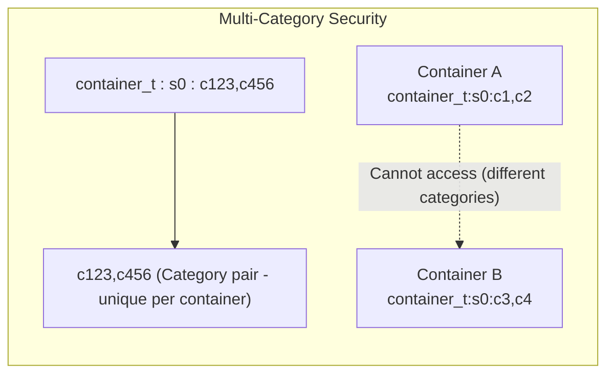

# Module 4.3: SELinux Contexts

> **Linux Security** | Complexity: `[COMPLEX]` | Time: 35-40 min. This is an advanced hardening module focused on practical diagnosis, durable repair, and container-aware SELinux operations.

## Prerequisites

Before starting this module, make sure you can inspect Linux services, read basic audit output, and distinguish file ownership from kernel-enforced policy decisions.
- **Required**: [Module 2.3: Capabilities & LSMs](/linux/foundations/container-primitives/module-2.3-capabilities-lsms/)
- **Helpful**: [Module 4.2: AppArmor Profiles](../module-4.2-apparmor/) for comparison
- **Helpful**: Access to a RHEL, CentOS Stream, Fedora, or Rocky Linux system
- **Helpful**: Basic Kubernetes troubleshooting skills on a Kubernetes 1.35+ cluster

For Kubernetes examples, define `alias k=kubectl` before you run commands, because this course uses `k` as the kubectl shortcut after introducing it once.

## Learning Outcomes

After this module, you will be able to make evidence-based SELinux decisions instead of treating every denial as a reason to weaken host policy.
- Diagnose SELinux context denials using audit logs, audit2why, and sesearch before changing policy.
- Implement persistent file-context fixes with semanage fcontext, restorecon, and safe boolean changes.
- Evaluate enforcing, permissive, and disabled SELinux modes for production systems, lab systems, and incident response.
- Configure Kubernetes and container SELinux labels using container_t, container_file_t, MCS categories, and the `k` kubectl alias.

## Why This Module Matters

At a payment processor, a routine operating-system migration moved a fleet of web nodes from an Ubuntu image to a RHEL-derived image because the security team wanted vendor-supported FIPS and SELinux controls. The application had passed staging, the file permissions on its static assets were world-readable, and the same Nginx container image had served traffic for months. When the first production slice received traffic, customers saw 403 errors for hosted receipts while synthetic checks reported that the pods were healthy, the service endpoints were ready, and the filesystem mode bits looked harmlessly permissive.

The outage did not come from a broken web server. It came from a hidden second authorization system that the team had not modeled: SELinux mandatory access control. Discretionary access control said the Nginx worker could read the mounted files, but SELinux saw a process domain that was not permitted to read the target file type and blocked the request anyway. The emergency rollback cost the team an evening of incident work, but the larger cost was confidence, because every subsequent "permission denied" error on RHEL now carried the suspicion that the visible permissions were only half the story.

This module teaches that missing half. SELinux is not a mysterious daemon that randomly breaks applications; it is a policy engine that compares labels on subjects and objects, then enforces rules even when Unix permissions would allow access. By the end, you will diagnose denials from audit evidence, choose durable context fixes instead of temporary relabels, evaluate when permissive mode is appropriate, and map the same ideas onto container runtimes and Kubernetes 1.35+ nodes where SELinux labels help isolate workloads.

## SELinux Labels, Type Enforcement, and the Second Permission Check

SELinux, short for Security-Enhanced Linux, is the mandatory access control system used by RHEL, CentOS Stream, Fedora, Rocky Linux, and related distributions. Mandatory access control means ordinary users and applications do not get the final word over access just because they own a file or chmod it broadly. The kernel asks the SELinux policy whether the source label may perform a specific operation on the target label, and a denial wins even when the traditional permission bits say yes.

That distinction is the first mental model to internalize. Standard Linux permissions are discretionary because the file owner can grant access with ownership, mode bits, and ACLs. SELinux policy is mandatory because it is centrally authored, loaded into the kernel, and applied consistently to processes, files, sockets, ports, and other labeled resources. When an operation reaches the kernel, the practical rule is simple: discretionary access control must allow the operation, and SELinux policy must also allow it.

AppArmor and SELinux are both Linux Security Modules, but they teach different habits. AppArmor policy is usually path-oriented, so you think about whether a program can read `/srv/app/config.yaml`. SELinux is label-oriented, so you think about whether a process type such as `httpd_t` can read a file type such as `httpd_sys_content_t`. The label approach feels more abstract at first, but it scales well when files move, processes fork, and container runtimes need to isolate many workloads with similar paths.

| Aspect | SELinux | AppArmor |
|--------|---------|----------|
| Approach | Label-based | Path-based |
| Complexity | Higher | Lower |
| Granularity | Finer | Coarser |
| Distros | RHEL, CentOS, Fedora | Ubuntu, Debian, SUSE |
| Policy | Compiled | Text files |
| Learning curve | Steeper | Gentler |

Every labeled resource has a security context with four fields: user, role, type, and level. You will often see this printed as `user:role:type:level`, such as `system_u:object_r:httpd_sys_content_t:s0`. The user and role fields matter for advanced role-based designs, and the level field matters for MLS and container MCS isolation, but most day-to-day troubleshooting revolves around the type field. If you learn to read source type, target type, object class, and requested permission from an audit record, SELinux stops being opaque.



The type field is powerful because SELinux policy is mostly type enforcement. A web server process running as `httpd_t` may read files labeled `httpd_sys_content_t`, but it should not freely read a user's home directory just because the owner set the mode to world-readable. That policy expresses an application boundary in the kernel, not in the application's own code, which is why SELinux remains useful after a process is compromised.

Pause and predict: if a process with context `httpd_t` attempts to read a file with context `user_home_t`, but the file's standard Linux permission is `777`, what should the SELinux enforcement engine decide, and what evidence would you expect to find in the audit log?

```mermaid
flowchart TD
    subgraph Type Enforcement
        direction TB
        Process["Process Context: httpd_t"]
        File["File Context: httpd_sys_content_t"]
        Rule{"Policy rule exists?<br>allow httpd_t httpd_sys_content_t:file read;"}
        Allow["ALLOW"]
        Deny["DENY"]
        
        Process -- "wants to read" --> File
        File --> Rule
        Rule -- "YES" --> Allow
        Rule -- "NO" --> Deny
    end
    
    Note["Access requires: DAC allows AND SELinux policy allows"]
    Type Enforcement ~~~ Note
```

The practical implication is that `chmod 777` is not a serious SELinux troubleshooting step. It can confirm that discretionary permissions are not the blocker, but it cannot authorize a process type that policy does not allow. A better investigation starts by comparing the source context of the process, the target context of the file or socket, and the object class being accessed. That comparison turns "SELinux is blocking me" into a specific question such as "may `httpd_t` read `admin_home_t:file`?"

| Type | Purpose |
|------|---------|
| `httpd_t` | Apache/nginx processes |
| `httpd_sys_content_t` | Web content files |
| `container_t` | Container processes |
| `container_file_t` | Container files |
| `sshd_t` | SSH daemon |
| `user_home_t` | User home directories |
| `etc_t` | /etc files |
| `var_log_t` | Log files |

The table gives you a working vocabulary, not an invitation to memorize every label. In a typical targeted policy there are many thousands of rules and a large set of domains, so the expert move is to inspect the real labels on the host, compare them to policy expectations, and choose the smallest change that restores the intended access. The same discipline applies whether you are debugging Apache on a VM or a pod mounting host storage on a Kubernetes node.

When something works on Ubuntu but fails on RHEL with no obvious cause, SELinux is often involved. That does not mean RHEL is stricter in a vague way; it means the host has an additional policy layer that was absent or differently configured in the previous environment. If your migration checklist only verifies file modes, owners, groups, service accounts, and container security contexts, it can still miss the label that determines whether the kernel allows the operation.

## Modes, Context Inspection, and Durable Label Management

SELinux has three operating modes, and each mode answers a different operational question. Enforcing mode applies policy and logs denials, which is the production security posture you normally want. Permissive mode logs what would have been denied without blocking the operation, which is useful for diagnosis and policy development when you can tolerate temporary exposure. Disabled mode removes SELinux enforcement entirely and should be treated as a major platform decision, because enabling it again requires relabeling and reboot planning.

```bash
# Check current mode
getenforce
# Returns: Enforcing, Permissive, or Disabled

# Get detailed status
sestatus
```

| Mode | Behavior |
|------|----------|
| **Enforcing** | Policies enforced, violations denied and logged |
| **Permissive** | Policies not enforced, violations only logged |
| **Disabled** | SELinux completely off |

Choosing among these modes is not just a technical toggle. In an incident, permissive mode can be a controlled diagnostic tool if you document the time window, collect audit logs, and return to enforcing after a targeted fix. In a regulated production environment, disabled mode may invalidate hardening assumptions and drift from the baseline your auditors expect. In a lab, permissive can teach you how policy would behave without making every mistake fatal, but it should never become the final state you copy into a node image.

```bash
# Temporarily set to permissive (until reboot)
sudo setenforce 0

# Temporarily set to enforcing
sudo setenforce 1

# Cannot enable if disabled (requires reboot)

# Permanent change: edit /etc/selinux/config
# SELINUX=enforcing|permissive|disabled
```

The first command you run in a suspected SELinux issue should usually be observational, not corrective. `getenforce` tells you whether policy is actively blocking operations, `sestatus` tells you the loaded policy and mode, and label-aware commands show you what SELinux thinks the actors are. This habit matters because many teams burn time changing the wrong layer, such as file ownership, when the evidence would have shown a mismatched type in seconds.

```bash
# Show file context
ls -Z /var/www/html/
# -rw-r--r--. root root system_u:object_r:httpd_sys_content_t:s0 index.html

# Just the context
stat -c %C /var/www/html/index.html
```

Process contexts complete the picture. If a web process is not running in the expected domain, the file labels might be perfectly correct and access can still fail. Conversely, if the process domain is right but the target file type belongs to a home directory, admin directory, or default unlabeled area, the fix belongs on the file context side. You are building a source-target-object-class sentence before you reach for a repair command.

```bash
# Show process contexts
ps -eZ | grep httpd
# system_u:system_r:httpd_t:s0 1234 ? 00:00:01 httpd

# Current shell context
id -Z
# unconfined_u:unconfined_r:unconfined_t:s0
```

User mappings are less common in container troubleshooting, but they matter on multi-user systems and hardened administrative hosts. SELinux users are not the same thing as Linux accounts; they are policy identities that constrain which roles and domains a login may enter. If an administrative account behaves differently from another account with similar Unix group membership, SELinux login mapping is one of the places to check before assuming sudoers or PAM is the only difference.

```bash
# Show SELinux user mapping
semanage login -l

# Show SELinux users
semanage user -l
```

File context management has one trap that catches almost everyone: `chcon` changes the current label, but it does not change the policy rule that assigns default labels to paths. That makes it useful for a quick experiment and risky as a production fix. If a later `restorecon`, filesystem relabel, package update, or administrative cleanup applies default contexts again, the `chcon` change can disappear and the incident returns with no obvious application change.

```bash
# Change context temporarily (doesn't survive relabel)
chcon -t httpd_sys_content_t /var/www/html/newfile.html

# Change context recursively
chcon -R -t httpd_sys_content_t /var/www/html/

# Restore default context
restorecon -v /var/www/html/newfile.html

# Restore recursively
restorecon -Rv /var/www/html/
```

The durable pattern is to define the default file context with `semanage fcontext`, then apply that default with `restorecon`. This mirrors how package policies label standard paths, and it gives future administrators a repeatable rule instead of unexplained metadata on a single inode. For custom application directories such as `/srv/web`, this is the difference between an emergency patch and an infrastructure decision that survives reboots, relabels, and replacement files.

```bash
# View default file contexts
semanage fcontext -l | grep httpd

# Add custom default context
sudo semanage fcontext -a -t httpd_sys_content_t "/srv/web(/.*)?"

# Apply the change
sudo restorecon -Rv /srv/web
```

Before running this, what output do you expect from `ls -Zd /srv/web` before and after `restorecon`, and how would that confirm that your fix changed the default labeling rule rather than only the current file metadata?

Booleans are the other common safe repair path. A boolean is a policy switch that allows a vendor-supported optional behavior without writing a new local module. For example, a web server making outbound database connections is common enough that policy exposes a boolean rather than forcing every administrator to generate custom allow rules. Checking booleans before generating policy keeps your change aligned with the distribution's intended support model.

```bash
# List all booleans
getsebool -a

# List specific boolean
getsebool httpd_can_network_connect
# httpd_can_network_connect --> off

# Set temporarily
sudo setsebool httpd_can_network_connect on

# Set permanently
sudo setsebool -P httpd_can_network_connect on

# Common booleans
getsebool -a | grep httpd
# httpd_can_network_connect
# httpd_can_network_connect_db
# httpd_enable_cgi
# httpd_read_user_content
```

| Boolean | Purpose |
|---------|---------|
| `httpd_can_network_connect` | Allow httpd to make network connections |
| `httpd_can_network_connect_db` | Allow httpd to connect to databases |
| `container_manage_cgroup` | Allow containers to manage cgroups |
| `container_use_devices` | Allow containers to use devices |

The `-P` flag on `setsebool` deserves the same respect as `semanage fcontext`. Without it, a boolean change is temporary and can vanish after reboot. With it, you are changing persistent policy state, so you should make the change deliberately, record why the application needs that capability, and avoid broad switches when a narrower one exists. The habit is always to prefer a vendor boolean over a custom allow rule when the boolean matches the operational need.

Pause and predict: if an application running under `httpd_t` needs outbound network access but the SELinux policy currently denies it, what is the safest and least intrusive way to grant this access, and why is that safer than installing a generated policy module from the first denial you see?

## Troubleshooting AVC Denials Without Guesswork

The audit log is where SELinux becomes concrete. A denial record tells you the requested permission, the process, the source context, the target context, and the object class. That is enough to distinguish a wrong file label from a missing boolean, a process running in an unexpected domain, or a real attempted boundary crossing that should stay blocked. The worst troubleshooting pattern is to make three changes and then discover the service works, because you no longer know which change mattered.

```bash
# Check audit log
sudo ausearch -m AVC -ts recent

# Sample denial:
# type=AVC msg=audit(...): avc:  denied  { read } for  pid=1234
#   comm="httpd" name="secret.html" dev="sda1" ino=12345
#   scontext=system_u:system_r:httpd_t:s0
#   tcontext=system_u:object_r:admin_home_t:s0
#   tclass=file permissive=0

# Use audit2why to explain
sudo ausearch -m AVC -ts recent | audit2why

# More readable with sealert (if installed)
sudo sealert -a /var/log/audit/audit.log
```

Read the sample denial like a sentence. The source context says a process in `httpd_t` attempted the operation, the target context says the file was labeled `admin_home_t`, and `tclass=file` says the object was a file rather than a directory, socket, or capability. The requested permission was `read`. If your application was supposed to serve public web content, the likely fix is not "allow httpd to read admin home files"; the likely fix is to place the file under a correctly labeled web content path or add a default context for the custom web path.



`audit2why` is useful because it explains common causes, but it is not a substitute for judgment. It may tell you that a boolean can allow the behavior, that a label is unexpected, or that no obvious boolean exists. That explanation should start a decision, not end it. If the denial is your service trying to read private administrator files, the correct security answer may be to keep the denial and change the deployment design.

`sesearch` adds another angle by asking the loaded policy what rules already exist. When you suspect a type should be allowed to access another type, `sesearch` can show whether an allow rule exists, whether a boolean gates it, and which object permissions are in scope. In practice, `ausearch` tells you what happened, `audit2why` offers a human explanation, and `sesearch` helps confirm whether policy already has a supported path for the behavior.

Generated policy modules are a last resort, not a magic eraser. `audit2allow` can transform denials into local policy, but it cannot know whether the access was legitimate, too broad, or caused by a mislabeled file. Installing the generated output without review can permanently authorize a behavior that only happened because an attacker or misconfigured process touched the wrong path. Treat generated policy as a draft that needs inspection.

```bash
# Generate policy module from audit log
sudo ausearch -m AVC -ts recent | audit2allow -M mypolicy

# Review the generated policy
cat mypolicy.te

# Install the policy
sudo semodule -i mypolicy.pp
```

A reliable troubleshooting loop has five steps. Reproduce the failure narrowly, collect recent AVC denials, identify source and target contexts, choose the smallest supported fix, and verify by returning to enforcing mode if you used permissive mode during investigation. This loop is slower than disabling SELinux once, but it builds evidence and leaves the system in a state another engineer can understand during the next incident.

```bash
# Wrong file context -> Fix with restorecon
sudo restorecon -Rv /path/to/files

# Need network access -> Enable boolean
sudo setsebool -P httpd_can_network_connect on

# Custom location for web content -> Add fcontext
sudo semanage fcontext -a -t httpd_sys_content_t "/custom/path(/.*)?"
sudo restorecon -Rv /custom/path

# Last resort -> Create custom policy
sudo ausearch -m AVC | audit2allow -M myfix
sudo semodule -i myfix.pp
```

Consider a monitoring agent that fails to start after installation. The vendor's quick-start guide might say to set SELinux permissive, but that advice removes the very signal you need. A stronger investigation checks the unit logs, reproduces the start failure, queries recent AVC entries, and asks whether the target path or port matches an existing policy convention. If a boolean or file context rule exists, use it; if no supported rule exists, review a generated module with the same skepticism you would apply to a firewall rule allowing broad outbound traffic.

Which approach would you choose here and why: adding a default context for a custom application directory, enabling a service-specific boolean, or installing a generated local policy module? The answer depends on whether the denial shows mislabeled data, an optional supported capability, or a truly new access pattern that the distribution policy does not already model.

## Worked Example: Turning a Denial into a Durable Fix

Imagine a team that deploys a reporting service onto a RHEL-based application host. The service renders HTML reports under `/srv/reports/public`, and Apache serves that directory through a virtual host. The rollout looks clean until the first user requests a report and receives a 403 response. The file exists, the Apache process is running, and the team has already confirmed that the file owner and mode bits allow reads. This is the exact moment when SELinux troubleshooting should become systematic rather than emotional.

The first useful observation is that two independent permission systems can disagree. If discretionary access control denies the read, SELinux may never be the interesting layer, because the kernel already has enough reason to reject the operation. If discretionary access control allows the read but SELinux denies it, changing Unix permissions cannot fix the policy mismatch. The team therefore checks the ordinary permissions once, then pivots to labels and audit evidence instead of repeatedly broadening mode bits.

They inspect the target path with `ls -Z` and see a type such as `var_t` or `default_t`, not `httpd_sys_content_t`. That single observation already points toward a file-context problem, because Apache's confined domain is designed to read web content types, not arbitrary service data types. They still collect the audit record because evidence should confirm the hypothesis. The AVC record shows `scontext=system_u:system_r:httpd_t:s0`, `tcontext=system_u:object_r:default_t:s0`, `tclass=file`, and a denied `read` permission.

At this point, a weak fix would be to run `chcon -R -t httpd_sys_content_t /srv/reports/public` and close the ticket. The service would probably work, and the team might not notice the weakness until a later relabel restores the default type. A durable fix treats `/srv/reports/public` as part of the application interface and teaches SELinux that this path should default to web content. That means adding a file-context rule for the path pattern and applying it with `restorecon`.

The difference between those two fixes is operational memory. A `chcon` command changes the present state of the filesystem, but it does not explain why the state should exist. A `semanage fcontext` rule records the desired state in the policy's local customizations, so a future administrator can list the rule, review it, and reapply it after replacement files are created. When infrastructure is rebuilt from automation, that distinction determines whether the fix belongs in a shell history or in the host configuration.

Now suppose the audit record looks different. The target file type is correct, but the denied operation is a network connection from `httpd_t` to a database port. A file-context repair would not match the evidence, because the target is not a mislabeled report file. The team checks booleans and finds a documented switch for outbound web server connections. Enabling the narrow boolean persistently is better than generating a policy module because the distribution already anticipated this optional behavior.

This is where SELinux rewards patience. The same user-visible symptom, "permission denied," can mean a wrong file label, a missing service capability, an unexpected process domain, or an access attempt that should remain blocked. The evidence determines the repair class. When teams memorize commands without preserving that decision point, they start applying labels to network problems, booleans to file-placement mistakes, and generated policy to behavior that should be redesigned.

The example also shows why permissive mode should be used carefully. If the reporting service triggers several denials during startup, permissive mode can reveal the full set in one test run. That is useful during onboarding because fixing the first denial may simply expose the next one. However, the team still needs to interpret each denial separately. A cluster of denials is not proof that the service deserves broad access; it may be proof that the package was installed into paths that do not match the platform's policy expectations.

In a Kubernetes version of the same story, the report renderer runs as a pod and mounts `/srv/reports/public` through a hostPath volume. The pod works on a developer workstation but fails on an enforcing RHEL node. The Kubernetes YAML may show an apparently reasonable security context, yet the kernel denial still depends on the node's host path label and the container process label. The team must therefore connect `k get pod -o wide` output to node-level SELinux inspection, rather than assuming the API object alone explains the failure.

The container runtime adds one more possibility: the path may need a container-compatible type or MCS-aware relabeling rather than an Apache web content type. If Apache runs inside the container, the process seen by the host is usually in the container domain, not a host `httpd_t` domain. That changes the source type in the audit record and therefore changes the correct repair. The visible application name is less important than the label the kernel actually checks.

Storage design affects the safest answer. A private directory created only for one container can often be relabeled for that workload, while a shared host directory should be handled with more care. If multiple pods or host services need the same files, an aggressive private relabel may solve one pod and break another consumer. The durable design is to decide ownership and sharing first, then choose labels that reflect that design. SELinux should encode architecture, not compensate for an unclear one.

The final verification step is to prove both behavior and policy posture. The application should serve the report, the audit log should stop producing the same denial, and `getenforce` should show Enforcing if the host is meant to be enforcing. If the team used permissive mode during the investigation, returning to enforcing is part of the fix, not a cleanup detail. The incident is only closed when the security posture matches the intended baseline again.

This worked example maps directly onto the learning outcomes. You diagnosed the denial from audit evidence, selected a persistent file-context or boolean repair, evaluated mode choices during investigation, and translated the same reasoning to containers and Kubernetes nodes. More importantly, you practiced the discipline that makes SELinux manageable: read the labels, read the policy evidence, and make the smallest change that matches the intended access.

## Containers, MCS Categories, and Kubernetes 1.35+ Nodes

Containers make SELinux more important, not less. A container runtime can run many processes with the same base type, such as `container_t`, while using category labels to prevent one container from reading another container's files. That extra category layer is Multi-Category Security, or MCS. It gives the kernel a way to distinguish workloads that otherwise share the same process type and often run from similar images.

```bash
# Container processes run as container_t
ps -eZ | grep container
# system_u:system_r:container_t:s0:c123,c456 12345 ? 00:00:00 nginx

# Container files have container_file_t
ls -Z /var/lib/containers/
```

In the context `container_t:s0:c123,c456`, the base type says this is a container process and the categories say which isolated label set it belongs to. A second container with different categories may also be `container_t`, but that does not mean it can read the first container's private files. The type handles the broad domain, and the MCS pair narrows access within that domain.



Volume relabeling is where container operators most often meet SELinux. With Podman and Docker on SELinux-enabled hosts, a bind mount from the host must have a label compatible with the container. The `:Z` option tells the runtime to relabel the content privately for one container, while `:z` applies a shared label suitable for content shared among multiple containers. Both options are powerful because they change host labels, not only container metadata.

```bash
# Podman with SELinux
podman run --rm -it fedora cat /proc/1/attr/current
# system_u:system_r:container_t:s0:c123,c456

# Volume mount with SELinux
podman run -v /host/path:/container/path:Z fedora ls /container/path
# :z = shared, :Z = private (relabels)
```

The danger is relabeling the wrong path. Using `:Z` on an application data directory created for that container may be correct. Using it on a shared system directory can relabel files the host or other services still need under their original types, creating a much larger outage than the original container failure. Treat relabeling flags like recursive ownership changes: safe on purpose-built directories, risky on broad or shared trees.

Kubernetes exposes SELinux controls through pod and container security contexts, and the runtime normally handles sane defaults for container labels. In Kubernetes 1.35+, you should still know how to read `seLinuxOptions` because hardened clusters, hostPath workloads, and storage integrations may require explicit type or level decisions. In command examples for Kubernetes work, this course uses `k` as the kubectl alias after defining it once.

```bash
alias k=kubectl
k version --client
k get nodes
```

```yaml
apiVersion: v1
kind: Pod
spec:
  securityContext:
    seLinuxOptions:
      level: "s0:c123,c456"    # MCS label
      type: "container_t"      # Type (usually automatic)
  containers:
  - name: app
    image: nginx
```

Explicit SELinux options are not a shortcut around policy. They are a way to request a label that the node, runtime, admission policy, and workload design can support. If a pod fails only on SELinux-enabled nodes when mounting host data, inspect the host path label, the pod's effective label, and the storage plugin behavior before changing pod security settings. The same source-target-object-class reasoning from a single host still applies.

HostPath volumes deserve special caution. A pod that mounts `/var/log` may need read access to files labeled `var_log_t`, while a pod that mounts a custom directory may need that directory labeled as container content. If the deployment works on a permissive test node but fails on an enforcing production node, the problem is not Kubernetes randomness; it is a mismatch between the host path's SELinux type, the container process label, and the policy rules available on that node image.

A practical Kubernetes investigation starts on the node that runs the affected pod. Use `k get pod -o wide` to identify the node, inspect the pod's security context, then move to node-level commands such as `ls -Z`, `ps -eZ`, and `ausearch`. This boundary matters because Kubernetes API objects tell you the intended security context, but SELinux audit records live where the kernel made the decision. Cross-layer diagnosis is the skill that prevents blind YAML changes.

## Patterns & Anti-Patterns

The strongest SELinux pattern is evidence-first repair. Start with labels and audit records, decide whether the access is intended, and then choose a fix that matches the root cause. This keeps the policy model understandable because file context rules fix misplaced data, booleans enable supported optional capabilities, and local policy modules represent genuinely new access patterns. The pattern scales because each change has a reason you can explain during review.

A second pattern is durable labeling for custom paths. Applications often move data from distribution-standard directories to `/srv`, `/opt`, or mounted storage, but the SELinux defaults do not automatically know your architecture. Add a `semanage fcontext` rule for the path pattern, apply it with `restorecon`, and record the rule in provisioning. That approach survives relabeling and avoids the recurring failure cycle caused by one-off `chcon` repairs.

A third pattern is controlled permissive testing. Temporarily moving a domain or host into permissive mode can reveal all would-be denials for a workload, which is useful during onboarding or policy development. The control is the important part: set a time box, collect audit logs, apply targeted fixes, and return to enforcing. Permissive forever is not a diagnostic state; it is a policy bypass with better logging.

| Pattern | When to Use It | Why It Works | Scaling Consideration |
|---------|----------------|--------------|-----------------------|
| Evidence-first repair | Any unexplained permission denial | Ties the fix to an AVC record and actual labels | Requires audit logging on every relevant node |
| Persistent fcontext rules | Custom application directories or mounted data | Keeps labels stable across restorecon and relabeling | Manage rules in configuration management |
| Boolean before custom policy | Supported optional service behavior | Uses vendor-maintained policy switches | Document why the extra capability is required |
| Node-aware Kubernetes diagnosis | Pods fail only on SELinux hosts | Connects API intent to kernel audit evidence | Needs node access or centralized audit collection |

The most common anti-pattern is disabling SELinux to make an outage disappear. Teams fall into it because it produces fast relief and the denied operation immediately starts working. The hidden cost is that the team has destroyed the evidence, removed a defense layer, and trained itself to treat security policy as an obstacle rather than a source of precise diagnosis. The better alternative is permissive mode for a narrow window or a targeted fix while enforcing remains the goal.

Another anti-pattern is pasting `audit2allow` output into production policy without reading it. The generated module may reflect a mislabeled directory, an accidental access attempt, or a compromised process reaching somewhere it should never go. Generated policy is a useful draft when no supported boolean or file context pattern fits, but it should be reviewed like code. If the rule authorizes broad access from a powerful domain, slow down.

A third anti-pattern is relabeling shared host paths for a single container. The `:Z` option can be exactly right for a private application data directory, yet disastrous when applied to a tree the host expects to retain its original labels. The safer alternative is to create workload-specific directories, apply appropriate default contexts, and use shared relabeling only when multiple containers genuinely need the same content. Broad recursive relabeling should feel as risky as broad recursive deletion.

| Anti-Pattern | What Goes Wrong | Better Alternative |
|--------------|-----------------|--------------------|
| Disable SELinux as a fix | Removes enforcement and hides the root cause | Use AVC logs, targeted fixes, and temporary permissive mode only when needed |
| Use `chcon` as the final answer | Context disappears after relabeling | Add `semanage fcontext` rules and apply with `restorecon` |
| Generate policy from every denial | Authorizes accidental or dangerous behavior | Check labels, booleans, and intent before local modules |
| Relabel broad host directories for containers | Breaks host services or other workloads | Use purpose-built mount paths with planned labels |

## Decision Framework

SELinux decisions become manageable when you separate evidence, intent, and repair. Evidence asks what the kernel denied. Intent asks whether the workload should be allowed to do that operation. Repair asks which supported mechanism grants exactly that intended behavior with the least policy expansion. Skipping the intent question is why teams accidentally authorize a web process to read data it should never touch.

```text
+-----------------------------+
| Permission denied observed  |
+--------------+--------------+
               |
               v
+-----------------------------+
| Confirm DAC permissions and |
| collect recent AVC denials  |
+--------------+--------------+
               |
               v
+-----------------------------+
| Do source and target labels |
| match the intended design?  |
+------+----------------------+
       | yes
       v
+-----------------------------+
| Is there a vendor boolean   |
| for this optional behavior? |
+------+----------------------+
       | yes                          no
       v                             v
+------------------------+   +-----------------------------+
| Enable documented      |   | Review custom policy only   |
| boolean persistently   |   | after labels and design fit |
+------------------------+   +-----------------------------+
       ^
       |
       no
       |
+-----------------------------+
| Add persistent fcontext and |
| apply restorecon            |
+-----------------------------+
```

| Situation | First Evidence to Collect | Preferred Fix | Avoid |
|-----------|---------------------------|---------------|-------|
| Custom web directory cannot be read | `ls -Z`, AVC target type, `semanage fcontext -l` | Add default context and run `restorecon` | Recursive `chmod` or permanent `chcon` |
| Web app cannot connect outbound | AVC record, boolean status, policy search | Enable narrow boolean with `setsebool -P` | Broad generated policy module |
| Pod fails on one SELinux-enabled node | Pod security context, host path label, node AVCs | Align storage label and runtime expectation | Assuming Kubernetes YAML alone explains it |
| New agent needs unusual host access | Recent AVCs and vendor policy docs | Review dedicated policy or vendor package guidance | Installing unreviewed `audit2allow` output |

Use enforcing mode when the workload is expected to run under policy, use permissive mode when you need to observe would-be denials during a bounded investigation, and use disabled mode only when the platform has consciously opted out of SELinux. That distinction matters because modes are not merely troubleshooting levels; they define the security contract of the host. A production node that silently remains permissive after a rushed fix is carrying an unreviewed exception.

For Kubernetes, the same framework applies with one extra routing step. Identify the node first, because the denial is a kernel event on a particular host. Then compare the pod's declared security context, the container runtime label, and the host path label. If you cannot reach node audit logs, your diagnosis is incomplete, and the next operational improvement may be centralized audit collection rather than another YAML change.

The framework also helps you communicate during incidents. Instead of telling an incident commander that "SELinux broke the deployment," you can say that `httpd_t` was denied `read` on a file labeled `default_t`, that the file lives under a custom application path, and that the repair is a persistent default context plus `restorecon`. That statement gives operations, security, and application owners the same facts. It also makes the rollback decision clearer because the fix is narrow, explainable, and reversible.

When policy review is required, bring the same structure to the change request. Include the AVC evidence, the intended access, the options you rejected, and the reason the selected fix is the least broad. A reviewer can reason about a boolean or file-context rule when the source, target, class, and permission are explicit. By contrast, a request that says "allow the app to work" forces the reviewer to rediscover your investigation and increases the chance that an overly broad rule will be approved under pressure.

Finally, remember that SELinux decisions are local but platform consequences are shared. A label change on one host path can affect backups, log collectors, sidecars, and future workloads that mount the same directory. A boolean change can expand the capabilities of every process in a domain, not only the one request that triggered the incident. A local policy module can outlive the application that needed it. Treat these repairs as part of the host's security architecture, not as isolated command-line fixes.

Good teams also remove obsolete SELinux customizations. When an application is retired, its file-context rules, local modules, and boolean exceptions should be reviewed with the same discipline used for firewall rules and service accounts. Stale policy is quiet technical debt because it rarely fails tests, but it leaves permissions available for future processes that happen to enter the same domain or reuse the same path.

## Did You Know?

- **SELinux was developed by the NSA**: the project was released to the open source community in 2000 and later integrated into the Linux kernel, where it is widely reviewed and maintained.
- **A targeted SELinux policy can contain hundreds of thousands of rules**: the scale is why experienced operators inspect real labels and policy evidence instead of trying to memorize every possible allow rule.
- **"Just disable SELinux" is dangerous advice**: Red Hat and Fedora guidance emphasize troubleshooting with labels, booleans, audit logs, and permissive mode rather than removing the enforcement layer.
- **MLS and MCS use the level field for different goals**: MLS can represent classified-style levels, while container runtimes commonly use MCS category pairs to isolate workloads sharing `container_t`.

## Common Mistakes

| Mistake | Why It Happens | How to Fix It |
|---------|----------------|---------------|
| Disabling SELinux | It makes the immediate error disappear, so it feels like a fix | Use permissive mode only for bounded diagnosis, collect AVCs, and return to enforcing |
| Using `chcon` only | The command changes current metadata, so the service works until a relabel | Add a `semanage fcontext` rule and apply it with `restorecon` |
| Ignoring booleans | Engineers jump from denial to custom policy without checking vendor switches | Search relevant booleans and use `setsebool -P` when the boolean matches the need |
| Wrong volume labels | Container files are mounted from a host path with an incompatible type or MCS label | Use planned mount directories, inspect labels with `ls -Z`, and relabel deliberately |
| Leaving permissive mode forever | A temporary diagnostic change becomes invisible platform drift | Track the exception, fix the denials, and verify the host is enforcing again |
| Not checking audit logs | Standard permissions look normal, so the team guesses at application causes | Query `ausearch -m AVC -ts recent` and interpret source context, target context, and class |
| Installing generated policy blindly | `audit2allow` output looks authoritative even when the denial was caused by bad labeling | Review the `.te` file, check booleans and labels first, then install only narrow policy |

## Quiz

<details>
<summary>Question 1: A web application can read `/srv/web/index.html` after `chcon -t httpd_sys_content_t`, but the failure returns after a maintenance relabel. What should you change?</summary>

The fix reverted because `chcon` changed only the current file label and did not update the default labeling rule for that path. A relabel or `restorecon` reapplied the policy default, so the file returned to the type SELinux expected for `/srv/web`, not the type the web server needed. Add a persistent rule with `semanage fcontext -a -t httpd_sys_content_t "/srv/web(/.*)?"` and apply it with `restorecon -Rv /srv/web`. This maps directly to the learning outcome about implementing persistent file-context fixes rather than relying on temporary metadata.

</details>

<details>
<summary>Question 2: A PHP application under Apache cannot connect to a remote database, but network routing and credentials are correct. What do you check before generating policy?</summary>

Check recent AVC denials and inspect the relevant `httpd` booleans, especially `httpd_can_network_connect` or a database-specific boolean when available. This scenario is often an optional capability already modeled by vendor policy, so a persistent boolean change may be the smallest correct repair. Generating policy first could authorize more than the application needs and would bypass the distribution's documented switch. The reasoning is to diagnose the denial, then prefer a supported boolean when it fits the intended behavior.

</details>

<details>
<summary>Question 3: Two pods run as `container_t` on the same SELinux-enabled node, yet one cannot read the other's private mounted files. What mechanism explains the denial?</summary>

The isolation comes from MCS categories in the SELinux level field, not only from the base `container_t` type. The runtime assigns different category pairs, such as `s0:c1,c2` and `s0:c3,c4`, so policy can distinguish workloads that share the same broad container domain. When the categories do not match, access to private container content is denied. This is why Kubernetes and container SELinux labels must be evaluated as type plus level, especially on Kubernetes 1.35+ nodes using host-mounted storage.

</details>

<details>
<summary>Question 4: A monitoring agent's systemd unit fails on a hardened host, and Unix permissions look correct. What investigation sequence should you follow?</summary>

Start by confirming SELinux mode with `getenforce` or `sestatus`, then reproduce the failure narrowly and query recent AVC denials with `ausearch -m AVC -ts recent`. Interpret the source context, target context, object class, and requested permission before changing anything. Use `audit2why` for explanation and `sesearch` when you need to confirm whether policy already has a supported rule or boolean. This sequence preserves evidence and prevents you from weakening policy before you know the root cause.

</details>

<details>
<summary>Question 5: A Podman command uses `-v /opt/analytics_data:/data:Z` and fixes a private container mount. Why would the same flag be risky on a shared system directory?</summary>

The uppercase `:Z` flag performs a private relabel for the specific container, including the container's MCS categories. That is appropriate for a purpose-built private data directory because it aligns host content with one container's label. On a shared system directory, it can change labels that the host and other services depend on, causing unrelated failures. A safer design uses a dedicated mount path or a shared label only when the data is intentionally shared among multiple containers.

</details>

<details>
<summary>Question 6: A pod works on a permissive development node but fails on an enforcing production node with a hostPath volume. What evidence do you need from Kubernetes and the node?</summary>

From Kubernetes, identify the scheduled node with `k get pod -o wide` and inspect the pod or container security context, including any `seLinuxOptions`. From the node, inspect the host path label with `ls -Z`, the container process label with `ps -eZ`, and recent AVC denials. The key is to connect the API-level intent to the kernel-level denial on the actual node that made the decision. Without node audit evidence, you are guessing from YAML alone.

</details>

<details>
<summary>Question 7: An audit record shows `httpd_t` denied reading `admin_home_t:file`. Why is a generated allow rule probably the wrong first fix?</summary>

The target type suggests the web server is trying to read content labeled for an administrator home area, which is rarely the intended design for public web content. A generated allow rule would teach policy to permit a suspicious boundary crossing instead of correcting the data placement or label. The better first step is to determine whether the file belongs under a web content path or needs a persistent `httpd_sys_content_t` default context. This answer tests the habit of evaluating intent before repair.

</details>

## Hands-On Exercise

This exercise works best on a RHEL, CentOS Stream, Fedora, or Rocky Linux VM where SELinux is installed. If your host is a Kubernetes node, do not run disruptive relabeling commands against production paths; use the isolated `/srv/testapp` directory shown here. The goal is to see context inspection, temporary changes, persistent default rules, booleans, and audit-driven troubleshooting in one controlled loop.

### Setup

Run the commands from a shell with sudo access. If you also have access to a Kubernetes 1.35+ test cluster, define the `k` alias and use the optional node-awareness checks to connect pod scheduling to node-level SELinux evidence.

```bash
alias k=kubectl
k get nodes
```

### Task 1: Check SELinux Status

```bash
# 1. Check mode
getenforce
sestatus

# 2. View your context
id -Z

# 3. View file contexts
ls -Z /etc/passwd
ls -Z /var/www/html/ 2>/dev/null || ls -Z /var/log/
```

<details>
<summary>Solution notes</summary>

`getenforce` should show whether the host is Enforcing, Permissive, or Disabled. `id -Z` shows the context of your current shell, which is often unconfined on a general-purpose admin host. The `ls -Z` output is the important habit: you are looking beyond owner, group, and mode bits to the SELinux label that the kernel will check during access decisions.

</details>

### Task 2: Compare Temporary and Persistent File Contexts

```bash
# 1. Create test directory
sudo mkdir /srv/testapp

# 2. Check default context
ls -Zd /srv/testapp
# Should show default_t or similar

# 3. Create a file
sudo touch /srv/testapp/index.html
ls -Z /srv/testapp/

# 4. Change context temporarily
sudo chcon -t httpd_sys_content_t /srv/testapp/index.html
ls -Z /srv/testapp/index.html

# 5. Restore default (undoes chcon)
sudo restorecon -v /srv/testapp/index.html
ls -Z /srv/testapp/index.html

# 6. Set permanent context
sudo semanage fcontext -a -t httpd_sys_content_t "/srv/testapp(/.*)?"
sudo restorecon -Rv /srv/testapp
ls -Z /srv/testapp/
```

<details>
<summary>Solution notes</summary>

The temporary `chcon` change proves that a label can be changed immediately, while the `restorecon` step proves that policy defaults still control durable labeling. After adding the `semanage fcontext` rule, `restorecon` should apply `httpd_sys_content_t` because the default rule now matches your intended application path. This is the core distinction between a quick experiment and a production-safe repair.

</details>

### Task 3: Inspect and Change Booleans

```bash
# 1. List all booleans
getsebool -a | wc -l

# 2. Find httpd booleans
getsebool -a | grep httpd

# 3. Check specific boolean
getsebool httpd_can_network_connect

# 4. Change it (temporarily)
sudo setsebool httpd_can_network_connect on
getsebool httpd_can_network_connect

# 5. Revert
sudo setsebool httpd_can_network_connect off
```

<details>
<summary>Solution notes</summary>

This task shows why booleans are a safer first stop than custom policy for common optional behavior. A temporary `setsebool` change is useful for confirmation, but production changes normally need `setsebool -P` so the setting survives reboot. You should still document why the service needs the capability because a boolean expands what a confined domain can do.

</details>

### Task 4: Troubleshoot Recent Denials

```bash
# 1. Generate a denial (if httpd installed)
# Try to serve file from wrong context

# 2. Check audit log
sudo ausearch -m AVC -ts recent | tail -20

# 3. If denials exist, analyze
sudo ausearch -m AVC -ts recent | audit2why

# 4. Alternative: use sealert if installed
sudo sealert -a /var/log/audit/audit.log | head -50
```

<details>
<summary>Solution notes</summary>

Focus on the source context, target context, class, and requested permission before deciding on a fix. If the target is mislabeled application content, prefer a file context repair. If the denial matches an optional capability with a documented boolean, prefer that boolean. If neither path fits, review generated policy carefully instead of installing it directly from the first denial.

</details>

### Task 5: Use Permissive Mode Carefully

```bash
# 1. Check current mode
getenforce

# 2. Set permissive temporarily
sudo setenforce 0
getenforce

# 3. Generate would-be denials
# ... run your application ...

# 4. Check what would have been denied
sudo ausearch -m AVC -ts recent

# 5. Return to enforcing
sudo setenforce 1
getenforce
```

<details>
<summary>Solution notes</summary>

Permissive mode is useful when you need to observe all would-be denials during a controlled test. The success condition is not that the application works while permissive; the success condition is that you collect the evidence needed to make targeted repairs and return the host to enforcing. If the host began in Disabled mode, do not expect `setenforce` to enable SELinux without reboot and relabel planning.

</details>

### Task 6: Optional Kubernetes Node Check

```bash
alias k=kubectl
k get pods -A -o wide
k get pod -n default selinux-demo -o yaml 2>/dev/null || true
```

<details>
<summary>Solution notes</summary>

Use Kubernetes output to identify where a workload is running and whether it requests explicit SELinux options. The SELinux denial itself must still be investigated on the node that runs the pod, because the kernel audit record is local to that host unless your environment forwards audit logs centrally. This task connects the module outcome about configuring Kubernetes labels to the operational reality of node-level evidence.

</details>

### Cleanup

```bash
sudo semanage fcontext -d "/srv/testapp(/.*)?"
sudo rm -rf /srv/testapp
```

### Success Criteria

- [ ] Diagnosed SELinux mode and context state with `getenforce`, `sestatus`, `id -Z`, and `ls -Z`.
- [ ] Implemented a temporary `chcon` change and proved `restorecon` can revert it.
- [ ] Implemented a persistent file-context fix with `semanage fcontext` and `restorecon`.
- [ ] Evaluated and changed an SELinux boolean, then explained temporary versus persistent behavior.
- [ ] Diagnosed recent AVC denials with `ausearch` and `audit2why` before choosing a repair.
- [ ] Configured the `k` kubectl alias and connected Kubernetes pod placement to node-level SELinux evidence.

## Next Module

Next, read [Module 4.4: seccomp Profiles](./module-4.4-seccomp/) to learn how system call filtering blocks dangerous kernel interactions even when the process, file labels, and Linux permissions would otherwise allow execution.

## Sources

- [Red Hat SELinux Guide](https://access.redhat.com/documentation/en-us/red_hat_enterprise_linux/8/html/using_selinux/)
- [SELinux Project Wiki](https://selinuxproject.org/page/Main_Page)
- [Fedora SELinux Guide](https://docs.fedoraproject.org/en-US/quick-docs/selinux-getting-started/)
- [Container SELinux](https://www.redhat.com/en/blog/container-security-and-selinux)
- [Red Hat Enterprise Linux 9: Using SELinux](https://docs.redhat.com/en/documentation/red_hat_enterprise_linux/9/html/using_selinux/)
- [Fedora Quick Docs: Changing SELinux States and Modes](https://docs.fedoraproject.org/en-US/quick-docs/selinux-changing-states-and-modes/)
- [Fedora Quick Docs: Troubleshooting SELinux](https://docs.fedoraproject.org/en-US/quick-docs/selinux-troubleshooting/)
- [Kubernetes Documentation: Configure a Security Context for a Pod or Container](https://kubernetes.io/docs/tasks/configure-pod-container/security-context/)
- [Kubernetes Documentation: Linux Kernel Security Constraints for Pods and Containers](https://kubernetes.io/docs/concepts/security/linux-kernel-security-constraints/)
- [Podman Documentation: Volume Mounts](https://docs.podman.io/en/latest/markdown/podman-run.1.html#volume-v-source-volume-host-dir-container-dir-options)
