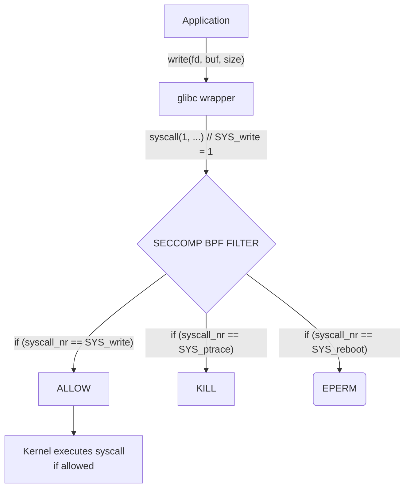

# Module 4.4: seccomp Profiles

> **Linux Security** | Complexity: `[MEDIUM]` | Time: 25-30 min

## Prerequisites

Before starting this module:
- **Required**: [Module 2.3: Capabilities & LSMs](/linux/foundations/container-primitives/module-2.3-capabilities-lsms/)
- **Required**: [Module 1.1: Kernel & Architecture](/linux/foundations/system-essentials/module-1.1-kernel-architecture/) (system calls)
- **Helpful**: Understanding of BPF concepts

The Kubernetes examples in this module target Kubernetes 1.35 or newer. Commands use the short alias `k` for `kubectl`; if your shell does not already define it, run `alias k=kubectl` before the Kubernetes lab commands so the examples copy cleanly.

## Learning Outcomes

After this module, you will be able to:
- **Design** custom seccomp profiles that allow only the system calls a container needs.
- **Apply** `RuntimeDefault` and `Localhost` seccomp profiles to Kubernetes pods through security contexts.
- **Diagnose** seccomp violations by tracing blocked syscalls with `strace`, audit logs, and process status files.
- **Evaluate** when the Docker or containerd default profile is enough, and when a workload needs a narrower custom profile.

## Why This Module Matters

In February 2019, a widely deployed container runtime vulnerability showed why a container boundary must be treated as a collection of kernel contracts, not as a single magic wall. The bug let a malicious container replace the host-side runtime binary and gain code execution as root on the node. Many organizations patched quickly, but the operational lesson lasted longer than the incident response: a compromised container process does not need hundreds of kernel entry points to serve web traffic, parse JSON, or write logs, yet default Linux exposes those entry points unless another layer filters them.

seccomp, short for Secure Computing Mode, exists for that exact gap. AppArmor and SELinux can say which files, sockets, labels, and resources a process may touch, while seccomp says which kernel functions the process may call at all. That difference is not academic. A web server denied access to `/etc/shadow` by AppArmor could still attempt `ptrace`, `bpf`, `unshare`, `mount`, or `keyctl` if those syscalls are available, and several of those calls have a long history of being useful during privilege escalation.

This module teaches seccomp as an operational design tool rather than as a memorized Kubernetes field. You will start from the kernel syscall path, compare default and custom profiles, practice Docker and Kubernetes profile attachment, and learn a debugging workflow for the painful cases where a container returns `Operation not permitted` or dies before it writes a single application log. The goal is not to make every profile tiny; the goal is to make deliberate decisions about syscall attack surface, compatibility, and evidence.

## How seccomp Works

Every useful Linux process eventually crosses from user space into kernel space. A library call such as `write()` may look like an ordinary function call in application code, but glibc eventually places a syscall number and arguments into CPU registers and asks the kernel to perform privileged work. seccomp inserts a filter at that boundary, after the process asks for a syscall and before the kernel performs it, so the filter can allow the request, return an error, log it, notify a tracer, or terminate the offending thread or process.



The important idea in the flow is that seccomp is not checking whether `/tmp/file` is allowed or whether a process label matches an object label. It is deciding whether the kernel should even consider the requested operation. If a profile blocks `ptrace`, the process cannot use `ptrace` against any target, even a target that file permissions or labels might otherwise permit. That makes seccomp a blunt but powerful reduction of kernel attack surface.

> **Stop and think**: If AppArmor is already restricting a container from accessing `/etc/shadow`, what additional security value does blocking the `open` system call via seccomp provide? Consider the difference between restricting *targets* versus restricting *actions*.

The answer is that `open` is broader than one sensitive file, and syscall filtering is often too coarse to replace path-aware controls. Blocking `open` would also break ordinary reads that many programs require, so a real profile usually allows file-opening syscalls while relying on AppArmor, SELinux, read-only mounts, and Linux permissions to constrain targets. The value of seccomp is strongest for operations the workload should never need at all, such as loading kernel modules, changing the system clock, entering namespaces, or tracing unrelated processes.

seccomp filters in modern container environments use BPF programs. That BPF program evaluates a small data structure containing the architecture, syscall number, instruction pointer, and syscall arguments. The profile author normally writes JSON in the container runtime format, while libseccomp and the runtime translate that intent into the kernel filter. This is why a Kubernetes YAML file does not contain BPF instructions directly; it names a runtime default or local profile, and the runtime handles the kernel attachment.

> **Pause and predict**: If a seccomp filter evaluates a syscall and encounters multiple matching rules with different actions, such as one rule that allows the call and another rule that kills it, which outcome should a security-focused runtime prefer, and why?

The conservative answer is that the most restrictive effective action should win when the kernel combines filters, because a process may accumulate filters from multiple layers. In practice, profile authors should avoid ambiguous rule sets and think in terms of a default action plus explicit exceptions. A clean profile is easier to audit, easier to explain during an incident, and less likely to behave differently after a runtime or libseccomp update.

### seccomp Actions

| Action | Effect | Return |
|--------|--------|--------|
| `SCMP_ACT_ALLOW` | Permit syscall | Normal execution |
| `SCMP_ACT_ERRNO` | Deny with error | Error code (e.g., EPERM) |
| `SCMP_ACT_KILL` | Kill thread | SIGSYS |
| `SCMP_ACT_KILL_PROCESS` | Kill process | SIGSYS |
| `SCMP_ACT_TRAP` | Send SIGSYS | Can be handled |
| `SCMP_ACT_LOG` | Allow but log | Normal execution |
| `SCMP_ACT_TRACE` | Notify tracer | For debugging |

These actions create a tradeoff between survivability, debuggability, and attacker feedback. `SCMP_ACT_ERRNO` is excellent during development because the application may report that a specific operation was not permitted, but it can also give an exploit a way to probe the sandbox. `SCMP_ACT_KILL_PROCESS` is harsher and often safer for production containment, yet it can turn a missing allow rule into a confusing crash. `SCMP_ACT_LOG` is useful while discovering syscall behavior, but it is not enforcement by itself.

## seccomp Modes

Linux originally provided a strict seccomp mode that allowed only a tiny set of syscalls: `read`, `write`, `exit`, and `sigreturn`. That mode is still useful for very specialized sandboxes, but it is far too restrictive for normal containers because even trivial programs need memory mapping, signal setup, file metadata, process startup, and runtime loader behavior. A dynamically linked binary often needs dozens of syscalls before its own application logic begins.

Filter mode, usually called seccomp-bpf, is the mode used by Docker, containerd, CRI-O, and Kubernetes. It lets the runtime attach a BPF filter that can allow common syscalls, deny dangerous syscalls, and optionally inspect syscall arguments. Argument filtering matters because some syscalls are safe only in certain forms. For example, `clone` may be routine when it creates a thread, but dangerous when it creates a new namespace with flags that undermine the container boundary.

```bash
# Check if seccomp is enabled
grep SECCOMP /boot/config-$(uname -r)
# CONFIG_SECCOMP=y
# CONFIG_SECCOMP_FILTER=y

# Check process seccomp status
grep Seccomp /proc/$$/status
# Seccomp:        0  (0=disabled, 1=strict, 2=filter)
```

When you run these checks on a host, remember that a shell process may show `Seccomp: 0` even though containers on the same host run with `Seccomp: 2`. The filter is attached per process, not globally. That is a common source of confusion during troubleshooting: the host supports seccomp, the container runtime applies it to container init processes, and ordinary host tools outside that runtime may remain unfiltered.

The `/proc/<pid>/status` file also exposes `Seccomp_filters` on newer kernels, which can help you see whether multiple filters are attached. Multiple filters are common when a runtime, a sandboxing layer, and an application each apply their own restrictions. The kernel evaluates the active filters for every syscall, so extra layers can harden a process but can also make debugging less obvious if you do not know which layer introduced the denial.

There is one more practical consequence of process-level attachment: seccomp is inherited across `fork` and `exec` unless a process deliberately arranges otherwise before filters are locked in. That is why a container runtime can apply a filter to the container's init process and trust ordinary child processes to remain constrained. It is also why a shell inside the container does not become a loophole. If the shell was started under the filtered process tree, its commands inherit the same syscall boundary.

This inheritance model is useful for security, but it complicates diagnostics when an entrypoint script launches several helpers before the main application begins. The denied syscall may come from the shell, the dynamic linker, a language runtime, a certificate helper, or a sidecar bootstrap binary rather than from the source code your team owns. During review, write down which process name appeared in the audit log and which lifecycle phase was running. That small habit prevents teams from adding broad allowances to the application profile when the real issue is an unnecessary wrapper or diagnostic tool.

## Profile Format and Default Profiles

A seccomp profile is a contract between the workload and the kernel. The safest mental model is an allowlist with a default denial, even if the runtime's default profile is written as a broad allowlist plus specific dangerous denials. For a small single-purpose service, you can often narrow the set of allowed calls. For a general-purpose image that runs shell scripts, package managers, language runtimes, and diagnostic tools, a very tight profile may create more operational risk than security value.

```json
{
  "defaultAction": "SCMP_ACT_ERRNO",
  "architectures": [
    "SCMP_ARCH_X86_64",
    "SCMP_ARCH_X86",
    "SCMP_ARCH_AARCH64"
  ],
  "syscalls": [
    {
      "names": [
        "read",
        "write",
        "open",
        "close",
        "stat",
        "fstat",
        "lseek",
        "mmap",
        "mprotect",
        "munmap"
      ],
      "action": "SCMP_ACT_ALLOW"
    },
    {
      "names": ["ptrace"],
      "action": "SCMP_ACT_ERRNO",
      "args": [],
      "errnoRet": 1
    }
  ]
}
```

The `defaultAction` is the profile's posture. `SCMP_ACT_ERRNO` means any syscall not matched by an allow rule returns an error, while a default allow profile depends on explicit deny rules and is easier to miss during review. The architecture list prevents a syscall name from being interpreted incorrectly across CPU families, because syscall numbers differ by architecture. The `syscalls` list is where the human intent lives, and it should be grouped by workload behavior rather than copied blindly from a blog post.

### Profile Structure

| Field | Purpose |
|-------|---------|
| `defaultAction` | What to do if no rule matches |
| `architectures` | CPU architectures to support |
| `syscalls` | List of rules |
| `syscalls[].names` | System call names |
| `syscalls[].action` | What to do |
| `syscalls[].args` | Argument conditions |

Docker's default profile is a pragmatic baseline rather than a proof that every allowed syscall is necessary for your application. It blocks syscalls that are usually unnecessary or dangerous in containers, including kernel module loading, raw kernel introspection, time changes, namespace transitions, and several memory or process inspection features. That default has to support a broad universe of images, so it cannot be as narrow as a profile for one static Go service or one constrained batch worker.

```bash
# Syscalls blocked by Docker default profile:
# - acct            - kernel accounting
# - add_key         - kernel keyring
# - bpf             - BPF programs
# - clock_adjtime   - adjust system clock
# - clock_settime   - set system clock
# - clone           - with dangerous flags
# - create_module   - load kernel modules
# - delete_module   - unload kernel modules
# - finit_module    - load kernel modules
# - get_kernel_syms - kernel symbols
# - init_module     - load kernel modules
# - ioperm          - I/O port permissions
# - iopl            - I/O privilege level
# - kcmp            - compare kernel objects
# - kexec_load      - load new kernel
# - keyctl          - kernel keyring
# - lookup_dcookie  - kernel profiling
# - mount           - mount filesystems
# - move_pages      - move memory pages
# - open_by_handle_at - bypass permissions
# - perf_event_open - kernel profiling
# - pivot_root      - change root filesystem
# - process_vm_*    - access other process memory
# - ptrace          - debug other processes
# - query_module    - query kernel modules
# - reboot          - reboot system
# - request_key     - kernel keyring
# - set_mempolicy   - NUMA policy
# - setns           - enter namespaces
# - settimeofday    - set system time
# - swapoff/swapon  - swap management
# - sysfs           - deprecated
# - umount          - unmount filesystems
# - unshare         - create namespaces
# - userfaultfd     - page fault handling
```

The list is worth reading as an attacker would read it. If a compromised process can call `mount`, it may combine that with capabilities or writable host paths to expose sensitive files. If it can call `ptrace` or `process_vm_writev`, it may inspect or modify another process. If it can call `bpf` or `perf_event_open`, it may reach complex kernel subsystems that have historically produced serious vulnerabilities. A default profile removes many of those easy moves before the attacker discovers whether the workload also has a capability mistake.

```bash
# Docker
docker inspect <container> | jq '.[0].HostConfig.SecurityOpt'

# See if seccomp is active in container
docker exec <container> grep Seccomp /proc/1/status
# Seccomp:        2  (filter mode)
```

Checking the active profile is part of any serious hardening review. An image can be perfectly built, an admission policy can be well intentioned, and a cluster can still run a workload unconfined because a pod override or runtime configuration changed the final security options. The process status check tells you whether the kernel sees a filter. Runtime inspection tells you which profile the runtime intended to apply. You often need both views when the symptom is a denial, a crash, or a scanner finding.

A good profile review reads the default list through both compatibility and exploitability. Compatibility asks whether removing a syscall would break normal startup, networking, logging, or shutdown. Exploitability asks what an attacker gains if that syscall stays available after remote code execution. The interesting cases are not the obviously dangerous calls, because few web services need to reboot the node or load a kernel module. The interesting cases are calls such as `clone`, `socket`, `ioctl`, and `prlimit64`, where common runtimes may need some behavior while attackers may want other modes.

For example, a Node.js service, a JVM service, and a static Go service can all expose the same HTTP endpoint while using different syscalls during startup and steady state. The JVM may allocate memory, create threads, inspect resource limits, and set signal handlers in ways that a static binary does not. If you copy the Go service profile into the JVM deployment, the result may be a fragile production outage. If you copy the broad JVM profile into the Go service, the result may be unnecessary attack surface. The profile should follow the workload, not the port number.

Another useful review question is whether a syscall is needed by the production process or only by a diagnostic habit. Images that include shells, package managers, network tools, and process inspection tools often require more syscalls during troubleshooting than during normal service. That does not mean every diagnostic path belongs in the production profile. Many teams keep production profiles narrow and use a separate, controlled debug workflow when they need richer tools, because the ability to troubleshoot should not silently expand the attack surface available to an exploited service.

## Container and Kubernetes seccomp

Docker exposes seccomp directly through `--security-opt`. Running with no explicit option usually applies the runtime default. Passing a profile path attaches a custom JSON profile. Passing `seccomp=unconfined` disables syscall filtering for that container, and it should be treated as a temporary debugging exception with a ticket, owner, and expiration rather than as a permanent application requirement.

```bash
# Use default profile (automatic)
docker run nginx

# Custom profile
docker run --security-opt seccomp=/path/to/profile.json nginx

# Disable seccomp (dangerous!)
docker run --security-opt seccomp=unconfined nginx
```

The operational trap is that `unconfined` often appears during emergency debugging and then survives because the application starts working. That does not prove the profile was wrong in principle; it proves some syscall or argument pattern was not accounted for. A better path is to reproduce with logging, identify the denied syscall, decide whether the syscall is legitimate, and either update the profile or fix the application behavior that reached for an unnecessary kernel feature.

> **Stop and think**: Kubernetes provides a `RuntimeDefault` seccomp profile. In a highly locked-down environment, why might relying solely on `RuntimeDefault` be insufficient for a container that only runs a simple static Go web server?

`RuntimeDefault` is a baseline shared across many workloads, so it allows more than a small static service usually needs. A Go HTTP server that accepts TCP connections, reads configuration, writes logs, and exits cleanly does not normally need namespace creation, kernel module loading, tracing other processes, or privileged clock changes. If the service is exposed to untrusted input, narrowing the profile reduces what an exploit can do after it reaches code execution.

```yaml
apiVersion: v1
kind: Pod
metadata:
  name: secure-pod
spec:
  securityContext:
    seccompProfile:
      type: RuntimeDefault    # Use container runtime's default
  containers:
  - name: app
    image: nginx
    securityContext:
      seccompProfile:
        type: Localhost
        localhostProfile: profiles/my-profile.json
```

In Kubernetes, seccomp can be set at the pod level or the container level. A container-level profile overrides the pod-level profile for that container, which lets you keep a safe default while giving one sidecar or one init container a different profile when it has a real need. That flexibility is useful, but it also means reviewers must inspect both levels before they conclude that a pod is protected by the runtime default.

### Profile Types in Kubernetes

| Type | Description |
|------|-------------|
| `RuntimeDefault` | Container runtime's default profile |
| `Localhost` | Custom profile on node |
| `Unconfined` | No seccomp (dangerous) |

`RuntimeDefault` is the normal starting point for Kubernetes 1.35 clusters because it delegates the profile to the node's configured container runtime. `Localhost` is the custom-profile option, and it requires the profile file to exist on every node where the pod may be scheduled. `Unconfined` should be rare because it removes this layer entirely. In regulated environments, admission control often rejects `Unconfined` and may require `RuntimeDefault` or an approved `Localhost` path.

```bash
# Kubernetes looks for profiles at:
/var/lib/kubelet/seccomp/profiles/

# Example
/var/lib/kubelet/seccomp/profiles/my-profile.json

# Reference in pod:
seccompProfile:
  type: Localhost
  localhostProfile: profiles/my-profile.json
```

The `Localhost` name is slightly misleading because it means local to the node's kubelet directory, not local to your laptop and not packaged inside the container image. That has deployment consequences. If a DaemonSet, image-baking step, configuration management run, or node bootstrap script does not place the JSON file consistently, pods may fail only on a subset of nodes. For production, treat seccomp profile distribution like any other node-level dependency.

Kubernetes scheduling makes that node dependency visible. A pod that references `profiles/api-strict.json` does not carry the profile with it when the scheduler picks a node. The kubelet on the selected node must find the file under its configured seccomp root, and the container runtime must be able to load it. If a rolling node replacement introduces fresh workers without the profile, the same manifest can move from healthy to failing without any application image change. That is why custom seccomp profiles belong in the node lifecycle, not in a one-time manual SSH session.

Admission policy can reduce confusion by setting expectations before workloads reach the kubelet. A namespace policy might require `RuntimeDefault` for ordinary pods and allow only specific `Localhost` paths for approved teams. That policy does not distribute the files or prove the profile is correct, but it prevents the easiest failure: a manifest that accidentally disables seccomp. In mature clusters, seccomp policy, capability policy, privilege settings, and host path restrictions are reviewed together because they describe the same workload boundary from different angles.

```bash
# Apply a Kubernetes manifest that uses seccompProfile.
k apply -f secure-pod.yaml

# Inspect the resolved pod configuration.
k get pod secure-pod -o yaml | sed -n '/seccompProfile:/,+4p'

# Check the process status from inside the container when the image has grep.
k exec secure-pod -- grep Seccomp /proc/1/status
```

These commands intentionally verify both the declared Kubernetes object and the process-level result. The object tells you what you asked Kubernetes to run. The process status tells you whether the kernel actually attached a filter to the container init process. During a real incident, that distinction can save hours because a manifest review alone cannot reveal a missing local profile file or a runtime configuration problem on one node.

## Creating Custom Profiles

Custom profiles should start from observed workload behavior, not from a desire to make the shortest possible syscall list. The first draft is usually an audit or logging profile that lets the application run while recording the syscalls it actually uses under representative traffic. The second draft converts that evidence into an allowlist and then tests failure paths, startup paths, health checks, signal handling, TLS reloads, and administrative operations. The final profile is a maintained artifact with ownership, versioning, and rollback instructions.

```json
{
  "defaultAction": "SCMP_ACT_LOG",
  "syscalls": []
}
```

An audit mode profile is helpful because it shifts the first question from "What do I think this program needs?" to "What did this program really ask the kernel to do?" That evidence is still incomplete if the test workload is incomplete. A profile built from a single startup run may miss reload behavior, DNS fallback, certificate rotation, thread pool growth, log shipping, or an error path that calls a different library routine.

```bash
# Run with audit profile
docker run --security-opt seccomp=/path/to/audit-profile.json myapp

# Check audit log
sudo dmesg | grep seccomp
# Or
sudo ausearch -m SECCOMP

# Use tools like strace to see syscalls
strace -f -c myapp
```

`strace -f -c` is a useful companion because it summarizes syscalls across child processes and threads. It is not a perfect replacement for runtime audit logs, since instrumentation changes timing and may not match the container runtime environment, but it gives you a quick inventory. Use it to identify candidates, then validate under the same runtime and profile mechanism you will use in production.

```json
{
  "defaultAction": "SCMP_ACT_ERRNO",
  "architectures": ["SCMP_ARCH_X86_64"],
  "syscalls": [
    {
      "names": [
        "accept", "accept4", "access", "bind", "brk",
        "chdir", "chmod", "chown", "close", "connect",
        "dup", "dup2", "dup3", "epoll_create", "epoll_ctl",
        "epoll_wait", "execve", "exit", "exit_group",
        "fcntl", "fstat", "futex", "getcwd", "getdents",
        "getegid", "geteuid", "getgid", "getpid", "getppid",
        "getuid", "ioctl", "listen", "lseek", "mmap",
        "mprotect", "munmap", "nanosleep", "open", "openat",
        "pipe", "poll", "read", "readlink", "recvfrom",
        "recvmsg", "rename", "rt_sigaction", "rt_sigprocmask",
        "sendto", "set_tid_address", "setsockopt", "socket",
        "stat", "statfs", "unlink", "write", "writev"
      ],
      "action": "SCMP_ACT_ALLOW"
    }
  ]
}
```

This restrictive example is intentionally recognizable as a starting point, not a universal answer. It allows common file, memory, socket, signal, and event-loop calls for a simple network service, but it may break language runtimes or utilities that need newer syscalls such as `newfstatat`, `pread64`, `pselect6`, `getrandom`, `prlimit64`, or `rseq`. The correct response to a breakage is not automatic expansion; the correct response is to ask whether the syscall matches the workload's legitimate behavior and threat model.

```json
{
  "syscalls": [
    {
      "names": ["socket"],
      "action": "SCMP_ACT_ALLOW",
      "args": [
        {
          "index": 0,
          "value": 2,
          "valueTwo": 0,
          "op": "SCMP_CMP_EQ"
        }
      ],
      "comment": "Only allow AF_INET sockets"
    }
  ]
}
```

Argument filtering is where seccomp becomes more precise. The example permits `socket` only when argument zero equals `2`, which corresponds to `AF_INET` on Linux, so a process can create IPv4 sockets without receiving blanket permission for every socket family. This technique is powerful for syscalls with dangerous modes, but it is also easier to get wrong because the meaning of each argument depends on the syscall, architecture, and constants used by the kernel headers.

Before running this in a shared environment, predict which workloads would fail if only `AF_INET` sockets were permitted. A service that uses Unix domain sockets for local metrics, IPv6 sockets for dual-stack networking, or netlink sockets for certain system interactions would behave differently from a simple IPv4-only web server. That prediction step matters because a profile is a compatibility promise, and compatibility promises should be tested before production traffic depends on them.

A practical custom-profile workflow usually produces three artifacts. The first artifact is the raw evidence: audit logs, `strace` summaries, runtime events, and notes about the traffic or lifecycle path that generated them. The second artifact is the reviewed profile with comments or accompanying documentation explaining why non-obvious syscalls are allowed. The third artifact is a regression test that runs the workload under the profile after application, base image, kernel, or runtime upgrades. Without the third artifact, a profile that was correct last quarter can become stale without warning.

Worked example: imagine a small webhook receiver that accepts HTTPS requests, validates JSON, writes structured logs, and exits gracefully on `SIGTERM`. Its steady-state behavior should include network accept calls, reads and writes, file metadata for certificates or configuration, memory mapping, futexes for runtime synchronization, and signal handling. It should not need to mount filesystems, enter namespaces, change kernel time, inspect other process memory, or load BPF programs. That distinction gives you a review checklist before you ever look at a trace.

Now imagine the same service image includes a shell entrypoint that runs `apk add curl` at startup. The trace suddenly includes package-manager behavior, DNS behavior, certificate bundle writes, process creation, file renames, and possibly syscalls unrelated to serving webhooks. The profile author has a design choice: widen the profile to support mutable startup behavior, or fix the image so package installation happens at build time. The more secure and reproducible answer is usually to remove the startup mutation, because seccomp has revealed a supply-chain and operability smell.

## Debugging seccomp Violations

The fastest debugging path starts by separating three failure classes. A process killed with `SIGSYS` often means the profile used a kill action. A process returning `Operation not permitted` often means `SCMP_ACT_ERRNO` returned `EPERM`. A Kubernetes pod stuck in `CreateContainerError` with a localhost profile may mean the profile file was not present on the selected node. Each class points to a different layer, so start with the symptom before editing the profile.

```bash
# Check dmesg for seccomp kills
sudo dmesg | grep -i seccomp

# Example output:
# audit: type=1326 audit(...): avc:  denied  { sys_admin }
#   for  pid=1234 comm="myapp" syscall=157 compat=0
#   syscall=157 → look up in syscall table

# Look up syscall number
ausyscall 157
# or check /usr/include/asm/unistd_64.h

# Use strace to see what syscalls app makes
strace -f -o /tmp/strace.log myapp
grep -E "^[0-9]" /tmp/strace.log | awk '{print $2}' | sort | uniq -c | sort -rn
```

Audit events usually report the numeric syscall because that is what the kernel sees. You must translate the number in the context of the architecture, since `157` on one architecture is not a portable teaching fact for every node type. Tools such as `ausyscall` and the kernel headers help with translation, while `comm`, `pid`, and container metadata help you connect the event back to the process that failed.

```bash
# Issue: Process killed immediately
# Cause: Critical syscall blocked (like mmap, brk)
# Fix: Add to allow list

# Issue: "Operation not permitted" but not killed
# Cause: SCMP_ACT_ERRNO returning EPERM
# Fix: Add syscall or check args filter

# Issue: Works without seccomp, fails with
# Debug: Use SCMP_ACT_LOG temporarily
```

Do not treat every denied syscall as a bug in the profile. A denied `mount`, `unshare`, or `ptrace` from a web server should trigger a security review, not a reflexive allow rule. A denied `mmap`, `brk`, `futex`, or `rt_sigaction` during process startup is more likely to be a legitimate runtime need. Good debugging combines syscall literacy with application context, because the same denial can mean either a broken sandbox or a successful block.

```bash
# Test with a simple profile
cat > /tmp/test-seccomp.json << 'EOF'
{
  "defaultAction": "SCMP_ACT_ERRNO",
  "syscalls": [
    {
      "names": ["read", "write", "exit", "exit_group", "rt_sigreturn"],
      "action": "SCMP_ACT_ALLOW"
    }
  ]
}
EOF

# Test
docker run --rm --security-opt seccomp=/tmp/test-seccomp.json alpine echo "hello"
# Should fail (echo needs more syscalls)
```

This deliberately broken test demonstrates why profiles must be validated against real startup behavior. `echo` feels simple, but the container has to start a process, load libraries, set up memory, handle signals, and exit cleanly. Blocking those setup syscalls does not make the workload meaningfully safer; it prevents the workload from existing. The lesson is to narrow the syscall surface around real behavior, not around a mental picture of the application command.

When debugging in Kubernetes, add node context early. Use `k get pod -o wide` to learn where the pod landed, inspect events with `k describe pod`, and then check the node's audit or kernel logs for seccomp messages. If the profile type is `Localhost`, confirm that the exact profile path exists under the kubelet seccomp directory on that node. A profile that works on one node and fails on another is usually a distribution problem, not a JSON syntax mystery.

Be careful with the phrase "seccomp blocked it" during incident review. Sometimes the profile is the immediate mechanism, but the underlying cause is a new application version, a changed base image, a runtime upgrade, or a newly exercised error path. If a denial appears after a deployment, compare the image digest, entrypoint, linked libraries, and runtime version against the last known good run. That comparison often explains why a previously stable profile encountered a syscall it had never seen before.

There is also a security review hiding inside many debugging sessions. If the denied syscall is `openat`, the likely question is which file path the program tried to open and whether another layer should allow it. If the denied syscall is `unshare`, `mount`, `bpf`, or `ptrace`, the likely question is why this process attempted a high-risk operation at all. The profile can block both categories, but the response should differ. Legitimate runtime setup may require a profile update; suspicious behavior may require image analysis, dependency review, or incident response.

## Patterns & Anti-Patterns

The strongest seccomp pattern is `RuntimeDefault` as the minimum cluster baseline. It is easy to apply, compatible with most images, and blocks a meaningful set of high-risk syscalls without requiring every application team to become syscall experts on day one. It scales best when admission policy rejects `Unconfined`, platform documentation explains the default, and exceptions are recorded with a reason rather than hidden in one-off manifests.

A second pattern is custom `Localhost` profiles for small, high-risk, stable services. Public API gateways, webhook receivers, single-purpose static binaries, and security-sensitive control-plane helpers are good candidates because their syscall behavior should be narrow and testable. This pattern scales only if profile distribution is automated across nodes, profile changes go through code review, and each profile has a clear owner who can respond when a runtime or kernel upgrade changes syscall behavior.

A third pattern is staged profile tightening. Start with logging or audit behavior, run realistic test traffic, build a candidate profile, test again with `SCMP_ACT_ERRNO`, and only then consider a harsher production action for violations that should terminate execution. The staged approach works because it treats seccomp as engineering evidence rather than as a static checklist. It also gives application owners a path to explain why a syscall is needed.

The most damaging anti-pattern is disabling seccomp because one profile caused one outage. Teams fall into this because `unconfined` is a fast diagnostic switch, and a production incident rewards the fastest visible recovery. The better alternative is to use `unconfined` only for tightly scoped reproduction, capture the missing syscall evidence, and then return to at least `RuntimeDefault` before the incident is considered resolved.

Another anti-pattern is copying a profile from a different workload without testing. A profile for a static Go service, a Python web app, a JVM service, and a shell-heavy maintenance image may look similar in a short tutorial, but they can differ significantly in runtime startup behavior. The better alternative is to keep a known baseline, generate evidence from the target image, and review every added syscall against the workload's actual responsibilities.

A subtler anti-pattern is treating seccomp as a replacement for capabilities, AppArmor, SELinux, read-only filesystems, or user namespaces. seccomp answers "which syscalls may be invoked," while those other controls answer questions about privileges, labels, paths, identity, and writable state. Defense in depth works because each layer restricts a different dimension. Removing those layers because seccomp exists leaves gaps that syscall filtering cannot express.

## Decision Framework

Use `RuntimeDefault` when the workload is ordinary, the image is not deeply understood yet, or the platform team needs a safe baseline across many teams. This choice is not weak; it blocks many dangerous syscalls and is dramatically better than `Unconfined`. It is also the right first step when the operational risk of a custom profile is higher than the immediate security gain, such as during a rushed migration of many services.

Use a custom `Localhost` profile when the workload is stable, exposed to meaningful risk, and narrow enough that syscall behavior can be tested. A payment-facing API, admission webhook, authentication service, or internet-exposed parser may justify the extra work because successful exploitation would have high impact. The decision should include profile distribution, rollback, observability, and ownership, not only the JSON file itself.

Use `Unconfined` only as a short-lived exception for debugging or for a workload with a documented incompatibility that the organization consciously accepts. Even then, the exception should be paired with compensating controls such as reduced capabilities, strict AppArmor or SELinux policy, read-only filesystems, non-root execution, and network policy. If a team cannot explain why `Unconfined` is required, it is probably not required.

| Workload Situation | Recommended Profile | Operational Tradeoff |
|--------------------|---------------------|----------------------|
| New service with normal runtime behavior | `RuntimeDefault` | Broad compatibility with meaningful baseline protection |
| Stable single-purpose service with strong test coverage | `Localhost` custom profile | Narrower attack surface with profile maintenance cost |
| Debugging an unexplained profile denial | Temporary `SCMP_ACT_LOG` or `SCMP_ACT_ERRNO` profile | More evidence with more attacker feedback during testing |
| Emergency reproduction of suspected seccomp breakage | Short-lived `Unconfined` run in non-production | Fast isolation of the cause with no syscall filtering |
| Highly privileged container that keeps extra capabilities | Custom profile plus other hardening layers | Reduces some escape paths but cannot erase privilege risk |

The decision becomes clearer if you ask three questions in order. First, what kernel operations does the workload truly need for startup, steady state, reload, and shutdown? Second, what would an attacker try after gaining code execution inside this process? Third, what operational mechanism keeps the selected profile present, observable, and reviewed over time? A profile that answers only the first question is a compatibility artifact, not a security design.

When the answers are uncertain, choose the reversible step that improves the baseline without pretending to finish the hard work. Moving from `Unconfined` to `RuntimeDefault` is usually a strong first move because it removes many dangerous syscalls with low compatibility risk. Moving from `RuntimeDefault` to a custom profile is a stronger security move only when you can support the operational burden. The worst decision is a custom profile nobody owns, because the first production breakage will push the team back to `Unconfined` and leave everyone more skeptical of hardening work.

Profile strictness should also follow exposure and privilege. A private batch job that processes trusted internal data and runs with no extra capabilities may not justify weeks of custom tuning. An internet-facing parser that accepts arbitrary uploads and still needs a writable filesystem or extra capability deserves more attention. That is not because seccomp is less valuable for the batch job, but because security engineering time is finite. Use risk to decide where custom profiles produce the most meaningful reduction in blast radius.

Finally, review seccomp together with runtime observability. If the only way to learn about a denial is to SSH to a node and run `dmesg`, your response will be slow and uneven. Forward audit events where appropriate, document the translation process for syscall numbers, and include profile names in deployment metadata or runbooks. A profile that cannot be observed becomes folklore after the original author leaves, and folklore is a weak foundation for production security.

## Did You Know?

- **Linux has over 300 system calls** — seccomp can filter any of them. Most applications use fewer than 100.
- **seccomp-bpf uses Berkeley Packet Filter** — The same technology used for network packet filtering is used to filter syscalls. It's incredibly efficient.
- **Chrome was an early seccomp adopter** — Google implemented seccomp in Chrome's sandbox in 2012 to protect against renderer exploits.
- **A seccomp violation is fatal by default** — Unlike AppArmor (returns error), seccomp typically kills the process. This makes debugging harder but security tighter.

## Common Mistakes

| Mistake | Why It Happens | How to Fix It |
|---------|----------------|---------------|
| Disabling seccomp after one failure | `Unconfined` makes the symptom disappear, so the root cause is never investigated | Use `RuntimeDefault` at minimum, reproduce with logging, and add only justified syscalls |
| Building a profile from startup only | The test misses reloads, health checks, DNS behavior, signal handling, and error paths | Exercise the full lifecycle before converting audit evidence into an allowlist |
| Missing architecture entries | Teams test on x86 nodes and later schedule the workload on ARM nodes | Include every target architecture and test on each node family you support |
| Treating audit logs as an allowlist | A noisy trace records what happened, not what should be allowed forever | Review each syscall against workload intent and remove suspicious or unnecessary entries |
| Using `SCMP_ACT_KILL` during first debugging | The process dies before application logs explain the denied operation | Start with `SCMP_ACT_ERRNO` or `SCMP_ACT_LOG` in staging, then choose production actions deliberately |
| Forgetting Kubernetes profile distribution | `Localhost` profiles are node files, not objects stored inside the pod spec | Install profiles through node bootstrap, DaemonSet, or image-baking automation |
| Assuming seccomp replaces AppArmor or SELinux | Syscall filtering cannot express path labels, file targets, or object-level policy | Keep capabilities, LSM policy, read-only mounts, and seccomp working together |
| Allowing broad syscalls without argument review | Calls such as `clone` and `socket` have safe and dangerous modes | Use argument filters where practical and document why broad allowance is needed |

## Quiz

<details><summary>Your legacy vendor container crashes immediately in staging, and the active profile uses `SCMP_ACT_KILL_PROCESS` as the default action. How would you diagnose the seccomp violation without permanently weakening production security?</summary>

Start by reproducing in staging with a temporary profile that uses `SCMP_ACT_ERRNO` or `SCMP_ACT_LOG`, because a kill action may terminate the process before it writes application logs. Check host audit output with `sudo dmesg | grep -i seccomp` or `sudo ausearch -m SECCOMP`, translate the numeric syscall with `ausyscall`, and compare the result with `strace` evidence from the same workload path. If the syscall is legitimate, add the narrowest rule that supports it; if it is suspicious, investigate why the application reached for it. Production should return to `RuntimeDefault` or the reviewed custom profile, not remain unconfined.

</details>

<details><summary>Your colleague says AppArmor already prevents a web server from reading sensitive files, so seccomp is redundant. How do you evaluate that claim?</summary>

The claim misses the difference between target-based controls and action-based controls. AppArmor can deny access to specific paths or resources after a syscall is invoked, while seccomp can remove entire kernel entry points such as `ptrace`, `bpf`, `unshare`, or `mount` from the process. A compromised web server may try kernel attack surface that has nothing to do with reading protected files. The strongest design keeps both layers, because they constrain different parts of the attack.

</details>

<details><summary>You placed `api-strict.json` on every worker node and need Kubernetes 1.35 pods to use it instead of the runtime default. Which security context fields matter, and what should you verify after applying the manifest?</summary>

Use `seccompProfile.type: Localhost` and set `seccompProfile.localhostProfile` to the relative path under the kubelet seccomp directory, such as `profiles/api-strict.json`. You can place the setting at the pod level or override it at the container level when one container needs a different profile. After `k apply -f`, inspect the pod YAML and check `/proc/1/status` inside the container when possible to confirm `Seccomp: 2`. If the pod fails only on some nodes, verify that the profile file exists on those nodes.

</details>

<details><summary>Your API container still requires `CAP_SYS_ADMIN` for a legitimate legacy operation. Which syscalls deserve special attention in the seccomp profile, and why?</summary>

With `CAP_SYS_ADMIN`, syscalls such as `mount`, `unshare`, and `setns` become especially dangerous because they can support namespace manipulation or host filesystem exposure. The profile should block those calls unless the legitimate operation specifically requires them, and that exception should be documented with compensating controls. You should also review related kernel-surface calls such as `bpf`, `perf_event_open`, and `ptrace`. seccomp cannot make a highly privileged container low risk, but it can remove several common escape building blocks.

</details>

<details><summary>A custom profile built from one startup trace passes smoke tests, but production pods fail during certificate reload. What went wrong in the profile design process?</summary>

The profile was built from incomplete behavior evidence. Startup traces do not necessarily cover reload paths, signal handling, DNS changes, filesystem watches, new thread creation, or error handling. The fix is to return to audit or logging mode in staging, exercise the full lifecycle, and review the additional syscalls against the reload design. A mature seccomp workflow treats profiles as tested artifacts that evolve with application behavior.

</details>

<details><summary>A node upgrade moves some pods to ARM workers, and only those pods fail with the custom profile. How should you debug and prevent this class of seccomp failure?</summary>

First confirm whether the profile includes the architecture used by the failing nodes, because syscall numbers and architecture identifiers are not interchangeable. Check the runtime error, the pod events, and host audit logs on an affected ARM worker rather than relying on successful x86 results. Prevent the issue by listing every supported architecture in the profile and running profile tests on each node family used by the cluster. Multi-architecture images need multi-architecture seccomp validation.

</details>

<details><summary>Your scanner flags a pod using `Unconfined`, but the owning team says it is required because `RuntimeDefault` broke a diagnostic sidecar. What response balances security and operations?</summary>

Treat `Unconfined` as an exception that needs evidence, scope, and an expiration date. Ask the team to reproduce the failure with logging or `SCMP_ACT_ERRNO`, identify the denied syscall, and decide whether a narrower `Localhost` profile can support the sidecar. Meanwhile, keep other controls tight: drop unnecessary capabilities, run as non-root, enforce read-only filesystems where possible, and apply AppArmor or SELinux policy. The end state should be a justified profile, not a permanent absence of syscall filtering.

</details>

## Hands-On Exercise

### Working with seccomp

**Objective**: Understand seccomp profiles and testing.

**Environment**: Linux with Docker installed

This exercise starts with observation, then moves toward a deliberately restrictive profile. Run it on a disposable lab host or VM, not on a shared production node, because you will create temporary profiles under `/tmp` and inspect kernel logs. If Docker is unavailable in your environment, read the commands carefully and reproduce the Kubernetes inspection portions in a cluster where you are allowed to run test pods.

#### Part 1: Check seccomp Status

```bash
# 1. Kernel support
grep SECCOMP /boot/config-$(uname -r)

# 2. Your process
grep Seccomp /proc/$$/status

# 3. Container process
docker run --rm alpine grep Seccomp /proc/1/status
```

The expected contrast is that your host shell may show seccomp disabled while the container process shows filter mode. That is a useful reminder that seccomp is attached to processes, not merely enabled for an entire machine. If the container also shows disabled mode, inspect the runtime configuration before continuing.

#### Part 2: Test Default Profile

```bash
# 1. Run with default seccomp
docker run --rm alpine sh -c 'grep Seccomp /proc/1/status'
# Should show: Seccomp: 2

# 2. Try to run unconfined
docker run --rm --security-opt seccomp=unconfined alpine grep Seccomp /proc/1/status
# Should show: Seccomp: 0

# 3. Test a blocked syscall
# reboot should fail silently
docker run --rm alpine reboot
# No effect (blocked by default profile)
```

Compare the default and unconfined runs before moving on. The default profile should attach a filter, while the unconfined run should remove it. The `reboot` test is intentionally blunt: a container should not be allowed to reboot the host, and the default profile blocks the relevant path even when the command exists inside the image.

#### Part 3: Create Custom Profile

```bash
# 1. Create a restrictive profile
cat > /tmp/restrictive.json << 'EOF'
{
  "defaultAction": "SCMP_ACT_ERRNO",
  "architectures": ["SCMP_ARCH_X86_64", "SCMP_ARCH_AARCH64"],
  "syscalls": [
    {
      "names": [
        "read", "write", "open", "openat", "close",
        "stat", "fstat", "lstat", "mmap", "mprotect",
        "munmap", "brk", "exit_group", "arch_prctl",
        "access", "getuid", "getgid", "geteuid", "getegid",
        "execve", "fcntl", "dup2", "pipe", "rt_sigaction",
        "rt_sigprocmask", "rt_sigreturn", "clone", "wait4",
        "futex", "set_tid_address", "set_robust_list"
      ],
      "action": "SCMP_ACT_ALLOW"
    }
  ]
}
EOF

# 2. Test ls (should work)
docker run --rm --security-opt seccomp=/tmp/restrictive.json alpine ls /

# 3. Test something more complex (might fail)
docker run --rm --security-opt seccomp=/tmp/restrictive.json alpine ping -c 1 127.0.0.1
# May fail due to missing syscalls
```

This profile is intentionally tight enough to teach the debugging workflow. If `ls` fails on your distribution, use the failure as evidence rather than as a surprise, because the base image and runtime may need additional syscalls. If `ping` fails, identify whether the missing behavior relates to sockets, privileges, name resolution, or another runtime setup path.

#### Part 4: Audit Mode

```bash
# 1. Create audit profile
cat > /tmp/audit.json << 'EOF'
{
  "defaultAction": "SCMP_ACT_LOG",
  "syscalls": []
}
EOF

# 2. Run with audit
docker run --rm --security-opt seccomp=/tmp/audit.json alpine ls /

# 3. Check what was logged
sudo dmesg | grep seccomp | tail -20
```

Audit mode should show why profile design is empirical. A tiny command still performs setup work that the shell hides from you, and the kernel sees all of it. Capture the output, translate the syscall numbers if necessary, and separate routine runtime behavior from calls that would be suspicious in your own service.

#### Part 5: Debug Blocked Syscalls

```bash
# 1. Create overly restrictive profile
cat > /tmp/broken.json << 'EOF'
{
  "defaultAction": "SCMP_ACT_ERRNO",
  "syscalls": [
    {
      "names": ["exit_group"],
      "action": "SCMP_ACT_ALLOW"
    }
  ]
}
EOF

# 2. Try to run (will fail)
docker run --rm --security-opt seccomp=/tmp/broken.json alpine echo hello 2>&1
# Error or no output

# 3. Check what failed
sudo dmesg | grep seccomp | tail -10
```

The broken profile is a controlled failure. Your job is to observe how the runtime reports the denial, where the kernel records it, and how much information the application itself receives. That distinction is the same one you will use during a production incident, except the real profile will be larger and the denied syscall may be buried inside a runtime, library, or error path.

### Solutions

<details><summary>Part 1 solution</summary>

Kernel support should show both `CONFIG_SECCOMP=y` and `CONFIG_SECCOMP_FILTER=y` on a host capable of running container seccomp filters. Your current shell may show `Seccomp: 0`, while a Docker container should usually show `Seccomp: 2`. If the container shows disabled mode without `seccomp=unconfined`, inspect Docker or containerd configuration before trusting later results.

</details>

<details><summary>Part 2 solution</summary>

The default run should report filter mode, and the unconfined run should report disabled mode. The `reboot` command should not reboot the host because the default profile blocks dangerous system-level operations. If the command fails with an ordinary permission error, that is still useful: multiple layers may be preventing the action, and seccomp is one of them.

</details>

<details><summary>Part 3 solution</summary>

`ls /` may succeed because the profile includes enough file, memory, and process-exit syscalls for that simple command on many systems. `ping` may fail because it needs additional socket behavior or privileges that the profile does not allow. The correct next step is to inspect the denial and decide whether the workload you actually care about should ever need the missing syscall.

</details>

<details><summary>Part 4 solution</summary>

The audit profile allows syscalls but logs them, so it should not be treated as enforcement. Use the output to build a candidate list, then review that list instead of accepting it blindly. A syscall seen during testing may still be unnecessary for the final production behavior, especially if the test included diagnostic tools or shell wrappers.

</details>

<details><summary>Part 5 solution</summary>

The broken profile allows only `exit_group`, so even a simple `echo` cannot perform ordinary startup and output operations. Kernel logs should show seccomp-related denials if your host audit path records them. Translate the denied syscall numbers, then compare them with what a minimally functional process needs before updating the profile.

</details>

### Success Criteria

- [ ] Verified seccomp is enabled
- [ ] Compared default vs unconfined profiles
- [ ] Created and tested custom profile
- [ ] Used audit mode to see syscalls
- [ ] Debugged a blocked syscall
- [ ] Applied the `k` alias convention for Kubernetes inspection commands

## Next Module

You have completed the Security and Hardening sequence: kernel hardening, AppArmor, SELinux, and seccomp now fit together as layered Linux controls. Next, continue to [Operations and Performance](/linux/operations/) to analyze how hardened systems behave under real workload pressure.

## Sources

- [seccomp man page](https://man7.org/linux/man-pages/man2/seccomp.2.html)
- [seccomp_unotify man page](https://man7.org/linux/man-pages/man2/seccomp_unotify.2.html)
- [prctl man page](https://man7.org/linux/man-pages/man2/prctl.2.html)
- [Docker seccomp profiles](https://docs.docker.com/engine/security/seccomp/)
- [Docker run reference: security options](https://docs.docker.com/reference/cli/docker/container/run/)
- [Kubernetes seccomp tutorial](https://kubernetes.io/docs/tutorials/security/seccomp/)
- [Kubernetes security context documentation](https://kubernetes.io/docs/tasks/configure-pod-container/security-context/)
- [Kubernetes pod security standards](https://kubernetes.io/docs/concepts/security/pod-security-standards/)
- [OCI runtime specification: seccomp](https://github.com/opencontainers/runtime-spec/blob/main/config-linux.md#seccomp)
- [libseccomp project documentation](https://github.com/seccomp/libseccomp)
- [BPF and seccomp](https://lwn.net/Articles/656307/)
