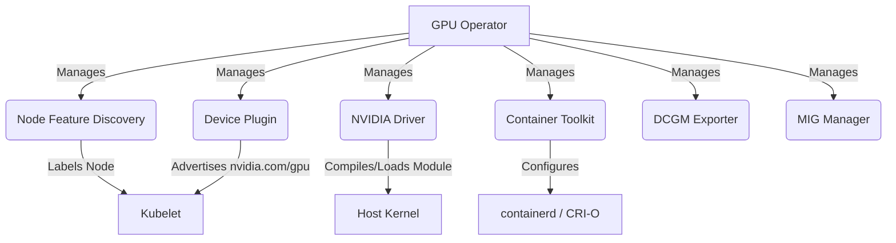

# GPU Nodes & Accelerated Computing

> **Complexity**: `[COMPLEX]`
>
> **Time to Complete**: 75-95 minutes
>
> **Prerequisites**: Kubernetes scheduling, DaemonSets, node labels, taints and tolerations, container runtimes, Prometheus basics
>
> **Track**: On-Premises AI/ML Infrastructure

## Learning Outcomes

By the end of this module, you will be able to:

* Design an on-premises GPU node architecture that connects host drivers, container runtimes, device plugins, operators, monitoring, and Kubernetes scheduling.
* Evaluate accelerator placement strategies for heterogeneous fleets using taints, tolerations, Node Feature Discovery labels, node affinity, MIG, Time-Slicing, and Dynamic Resource Allocation.
* Debug GPU scheduling failures by separating API admission errors, scheduler placement failures, kubelet allocation failures, runtime injection problems, and host driver faults.
* Compare legacy device plugin allocation with Kubernetes Dynamic Resource Allocation and justify when each model is appropriate for senior platform design.
* Implement and validate a GPU Operator Time-Slicing configuration while explaining the operational risks it introduces.

## Why This Module Matters

The platform team at a private AI lab had already bought the expensive part.

The cluster had rows of on-premises GPU servers.

The purchase order was signed.

The data center power work was complete.

The finance team expected a clear utilization story.

Then the training jobs started missing their windows.

The problem was not that the hardware was slow.

The problem was that Kubernetes saw every GPU as a small integer.

A debugging notebook used the same scheduler resource name as a multi-day model training job.

A low-priority inference pod landed on a high-memory training node because the pod requested only `nvidia.com/gpu: 1`.

A node carried four physical accelerators, but one failed silently, and the dashboard kept showing the same installed capacity because the alert watched `Capacity` instead of `Allocatable`.

The visible symptom was a queue of pending jobs.

The deeper cause was that the platform treated accelerators like ordinary CPU.

That mistake is expensive.

A CPU request can be throttled, packed, or overcommitted.

A legacy GPU request is an exclusive integer claim unless you deliberately configure a sharing or partitioning layer.

A container runtime can start a normal web service without special kernel modules.

A GPU workload needs host drivers, runtime hooks or CDI specifications, kubelet registration, health reporting, device injection, scheduling constraints, and telemetry.

Each layer can be correct on its own and still fail as a system if the boundaries are misunderstood.

This module teaches that system boundary.

You will start with the simple model: a device plugin advertises `nvidia.com/gpu` to the kubelet.

Then you will add the operational layers that make the model production-grade: the NVIDIA GPU Operator, Node Feature Discovery, taints, MIG, Time-Slicing, DCGM Exporter, and vendor alternatives.

Finally, you will compare that legacy integer model with Kubernetes Dynamic Resource Allocation, which is stable in Kubernetes v1.35 and gives platform teams a richer way to request devices by attributes rather than by opaque counts.

The goal is not to memorize a chart value.

The goal is to reason from a symptom to the failing layer.

When a pod is pending, you should know whether to inspect scheduler events, node labels, allocatable resources, MIG profiles, runtime configuration, or driver logs.

When a tenant asks for “one GPU,” you should know whether that phrase means one full device, one MIG slice, one time-shared replica, or one DRA claim with specific attributes.

That distinction is what separates a cluster that merely has accelerators from a platform that can safely operate accelerated compute.

## The Foundations of Accelerated Computing

A Kubernetes cluster does not automatically understand every device attached to a server.

The kubelet has native knowledge of CPU, memory, ephemeral storage, and some operating-system-level capacity.

It does not ship with built-in logic for every GPU, FPGA, AI accelerator, SmartNIC, or vendor-specific device that might appear on a PCIe bus.

That design is intentional.

Kubernetes would not scale as an open ecosystem if every hardware vendor had to merge device-specific code into the core scheduler or kubelet.

Instead, Kubernetes exposes extension points.

Hardware vendors and platform teams use those extension points to translate host-level hardware into scheduler-visible resources.

For classic GPU scheduling, the most important extension point is the device plugin framework.

The device plugin runs on each node that owns the hardware.

It discovers devices.

It reports healthy devices.

It registers a resource name with the kubelet.

It participates in allocation when the kubelet prepares a container that requested the resource.

The scheduler does not talk directly to the physical GPU.

The scheduler sees the node status that the kubelet publishes.

That status includes an extended resource such as `nvidia.com/gpu`.

That indirection is powerful because Kubernetes can schedule workloads without learning vendor-specific driver APIs.

It is also dangerous because the abstraction hides details that matter in production.

A request for `nvidia.com/gpu: 1` does not say which model of GPU is required.

It does not say how much VRAM the workload needs.

It does not say whether hardware isolation is required.

It does not say whether the workload can share a device with another tenant.

It only says that the container needs one integer unit of that extended resource.

A senior platform engineer must therefore design the surrounding policy.

The device plugin exposes capacity.

Node Feature Discovery exposes hardware labels.

Taints repel generic workloads.

Affinity steers workloads to the right hardware.

The GPU Operator manages the host software stack.

MIG and Time-Slicing change what “one unit” means.

Dynamic Resource Allocation offers a newer claim-based model for cases where labels and integer counts are too blunt.

Here is the basic mental model.

```text
+----------------------+       +----------------------+       +----------------------+
| Physical GPU Node    |       | Kubelet              |       | Kubernetes API       |
|                      |       |                      |       |                      |
| PCIe GPUs            |-----> | Device Plugin        |-----> | Node Status          |
| Kernel Driver        |       | /var/lib/kubelet/... |       | Capacity             |
| Container Runtime    |       | Health + Allocation  |       | Allocatable          |
+----------------------+       +----------------------+       +----------------------+
                                                                     |
                                                                     v
                                                            +------------------+
                                                            | Scheduler        |
                                                            | Matches Pods to  |
                                                            | nodes with free  |
                                                            | extended resource|
                                                            +------------------+
```

The scheduler makes placement decisions from declared state.

The kubelet makes local admission and container preparation decisions from node-local state.

The device plugin bridges those two worlds.

When a GPU workload fails, you debug by locating the broken bridge.

### Resource Semantics and Capacity Handling

A device plugin resource name must follow the extended resource naming pattern.

The format is `vendor-domain/resource`.

For NVIDIA GPUs, the common resource is `nvidia.com/gpu`.

For AMD GPUs, the common resource is `amd.com/gpu`.

For Intel Gaudi accelerators, the common resource is `habana.ai/gaudi`.

The domain prefix prevents collisions.

Without it, two vendors might both advertise `gpu`, and the scheduler would have no reliable way to distinguish their devices.

Extended resources also have stricter scheduling semantics than CPU.

CPU requests can be fractional.

Memory can be requested in quantities such as `512Mi`.

A legacy extended resource request must be an integer.

The following manifest is valid if a device plugin advertises `nvidia.com/gpu` on at least one node.

```yaml
apiVersion: v1
kind: Pod
metadata:
  name: cuda-vector-add
spec:
  restartPolicy: Never
  containers:
    - name: cuda-vector-add
      image: nvcr.io/nvidia/k8s/cuda-sample:vectoradd-cuda12.5.0
      resources:
        limits:
          nvidia.com/gpu: 1
```

The following manifest is not valid in the legacy model.

```yaml
apiVersion: v1
kind: Pod
metadata:
  name: invalid-fractional-gpu
spec:
  restartPolicy: Never
  containers:
    - name: app
      image: nvcr.io/nvidia/k8s/cuda-sample:vectoradd-cuda12.5.0
      resources:
        limits:
          nvidia.com/gpu: 0.5
```

The API server rejects the fractional extended resource.

This is not a GPU Operator limitation.

It is a Kubernetes extended resource rule.

If a team wants several pods to share a physical device, the platform must expose a different abstraction.

Time-Slicing can advertise multiple replicas for a physical GPU.

MIG can expose hardware-isolated slices on supported GPUs.

DRA can model device requests through ResourceClaims and device attributes.

Those are platform choices, not magic side effects of writing `0.5`.

> **Pause and predict**: A node has four installed GPUs. One physical GPU fails and the device plugin marks it unhealthy. What do you expect `Capacity` and `Allocatable` to show after the kubelet updates node status?

When a managed device becomes unhealthy, the kubelet decreases `Allocatable` for scheduling.

The total `Capacity` remains unchanged.

That behavior surprises many operators.

`Capacity` is the installed or reported physical resource count.

`Allocatable` is the usable count available for new scheduling decisions.

A monitoring rule that only checks `Capacity` can miss a failed device.

A rule that compares `Capacity` and `Allocatable` can detect a node that still has hardware installed but no longer has all of it usable.

A useful diagnostic command is:

```bash
kubectl describe node <gpu-node-name>
```

After you use `kubectl` a few times, many Kubernetes operators define the short alias `k` for speed.

```bash
alias k=kubectl
k describe node <gpu-node-name>
```

This module continues to use `kubectl` in most examples so commands are copyable without depending on your shell aliases.

### Where GPU Requests Fit in Pod Scheduling

A GPU request usually appears under container `resources.limits`.

For extended resources, Kubernetes expects the request and limit to match.

In common GPU manifests, specifying the limit is enough because Kubernetes treats the extended resource as the request as well.

The scheduler then searches for a node where all constraints can be satisfied.

Those constraints include ordinary resources, labels, taints, affinity, topology spread rules, and extended resource availability.

A pod that requests one GPU but lacks a matching toleration will not land on a GPU node if that node is tainted.

A pod that requests one GPU but selects the wrong product label will remain pending even if other GPU nodes are idle.

A pod that requests one GPU and has no product selector can land on any compatible node with one allocatable GPU, even if that wastes a premium accelerator.

The scheduling path is easier to reason about as a sequence.

```text
+-------------------------------+
| Pod submitted                 |
| resources.limits includes GPU |
+---------------+---------------+
                |
                v
+-------------------------------+
| API admission                 |
| Is the resource quantity valid?|
+---------------+---------------+
                |
                v
+-------------------------------+
| Scheduler filtering           |
| Node has allocatable GPU?     |
| Node labels match?            |
| Taints tolerated?             |
+---------------+---------------+
                |
                v
+-------------------------------+
| Kubelet local allocation      |
| Device plugin assigns device  |
| Runtime injects device access |
+---------------+---------------+
                |
                v
+-------------------------------+
| Container starts              |
| Driver and libraries must work|
+-------------------------------+
```

This flow is your first debugging tool.

If the API rejects the manifest, do not inspect driver logs.

If the pod is pending, inspect events and scheduler constraints.

If the pod is scheduled but stuck in `ContainerCreating`, inspect kubelet, device plugin, CDI, runtime, and driver state.

If the container starts but the application cannot see CUDA or ROCm libraries, inspect image compatibility and runtime injection.

## The Device Plugin Framework Deep Dive

The device plugin framework is stable and widely used.

It exists so vendors can integrate special hardware without patching Kubernetes core.

The kubelet exposes a registration service over a UNIX socket.

A device plugin connects to that socket and registers the resource it manages.

The canonical kubelet socket path is under:

```text
/var/lib/kubelet/device-plugins/kubelet.sock
```

The plugin also creates its own socket in the same directory.

The kubelet then calls the plugin to list devices, watch health changes, and allocate devices to containers.

This explains why most device plugins run as privileged DaemonSets.

They need host access.

They need to mount the kubelet device plugin directory.

They often need access to device files under `/dev`.

They may need host PID, host filesystem paths, or driver-specific libraries depending on the vendor.

A simplified DaemonSet mount looks like this.

```yaml
apiVersion: apps/v1
kind: DaemonSet
metadata:
  name: example-device-plugin
  namespace: kube-system
spec:
  selector:
    matchLabels:
      app: example-device-plugin
  template:
    metadata:
      labels:
        app: example-device-plugin
    spec:
      containers:
        - name: plugin
          image: registry.example.com/example-device-plugin:v1.0.0
          securityContext:
            privileged: true
          volumeMounts:
            - name: device-plugin
              mountPath: /var/lib/kubelet/device-plugins
      volumes:
        - name: device-plugin
          hostPath:
            path: /var/lib/kubelet/device-plugins
            type: Directory
```

This example uses a placeholder image, so do not apply it as-is.

The structure is what matters.

The DaemonSet pattern ensures that each hardware node has a local agent.

The hostPath mount gives that local agent access to the kubelet registration socket.

The privileged context gives it enough permission to inspect and prepare host devices.

### Registration and Allocation

The registration flow is small but important.

The plugin tells kubelet three things.

It provides the plugin socket name.

It provides the device plugin API version.

It provides the resource name to advertise.

After registration, the plugin streams device health through `ListAndWatch`.

The kubelet publishes healthy resource counts in node status.

When a container that requests the resource is admitted on the node, the kubelet calls the plugin allocation endpoint.

The plugin responds with the device files, environment variables, mounts, CDI devices, or annotations needed by the container runtime.

That allocation response is local to the node.

The API server does not know the low-level character devices used by the container.

The scheduler does not know the CUDA library path.

The device plugin and runtime handle that local injection.

This is why a pod can be scheduled correctly and still fail to start.

Scheduling only proves that the control plane found a node with allocatable resources.

It does not prove that the runtime could inject the device.

It does not prove that the kernel driver is healthy.

It does not prove that the container image has compatible user-space libraries.

### The Rise of Container Device Interface

Historically, device injection was runtime-specific.

Operators relied on runtime hooks, custom environment variables, bind mounts, and vendor-specific wrapper runtimes.

That worked, but it created fragile coupling between Kubernetes, containerd, CRI-O, and the vendor stack.

The Container Device Interface, usually shortened to CDI, standardizes how devices are described for OCI runtimes.

A CDI specification describes the device, the required device nodes, mounts, hooks, and environment required for access.

The kubelet can pass CDI device references to the runtime rather than relying on a vendor-specific runtime class path.

`DevicePluginCDIDevices` became generally available in Kubernetes v1.31.

For modern GPU operations, CDI matters because it reduces the amount of hand-maintained runtime mutation.

It also makes the same conceptual device injection model work across different runtimes.

This does not eliminate runtime compatibility checks.

It changes where the contract lives.

Instead of asking, “Did my runtime class invoke the right vendor hook?” you ask, “Can my runtime consume the CDI specification and can the operator generate it correctly?”

NVIDIA GPU Operator v26.3 also supports an NRI plugin path when CDI is enabled.

NRI stands for Node Resource Interface.

It lets plugins hook into OCI-compatible runtime lifecycle events.

In the GPU Operator v26.3 documentation, the NRI plugin requires containerd v1.7.30 or newer in the supported v1.7 line, or supported containerd v2.1 and v2.2 lines.

It is not supported with CRI-O.

That one sentence should change your rollout plan.

If staging runs containerd and production runs CRI-O, you do not enable the NRI plugin everywhere.

You enable it only where the runtime compatibility contract is satisfied.

> **Stop and think**: A pod is scheduled to a GPU node, but it stays in `ContainerCreating`. The scheduler already did its job. Which layer would you inspect next: node affinity, runtime injection, or Prometheus scraping?

The next layer is runtime injection and local kubelet allocation.

Node affinity influenced placement before the pod reached the node.

Prometheus scraping is observability after the stack is running.

`ContainerCreating` usually means the kubelet or runtime cannot complete the local preparation step.

Useful commands include:

```bash
kubectl describe pod <pod-name> -n <namespace>
kubectl logs daemonset/nvidia-device-plugin-daemonset -n gpu-operator
kubectl get events -n <namespace> --sort-by=.lastTimestamp
```

On the node, an operator may also inspect kubelet logs and runtime logs through the host logging system.

The exact host commands differ by operating system, but the debugging principle is consistent.

Scheduling and local allocation are different stages.

## Operator-Driven GPU Management

You can deploy a GPU device plugin by hand.

For a small lab, that can be acceptable.

For a production on-premises fleet, hand assembly becomes fragile.

A GPU node needs the correct kernel driver.

It needs a compatible container runtime configuration.

It needs the device plugin.

It needs GPU feature labels.

It needs health checks.

It needs telemetry.

It may need MIG management.

It may need validator pods that catch configuration drift.

The NVIDIA GPU Operator packages those responsibilities into a Kubernetes-native control loop.

The operator watches cluster state and reconciles the node software stack.

When a GPU node joins, Node Feature Discovery and GPU Feature Discovery identify the hardware.

The operator deploys the driver manager, container toolkit, device plugin, DCGM Exporter, MIG Manager, and validators as needed.

This is the difference between “install a driver” and “operate a GPU fleet.”

A one-time install script can make one node work.

A reconciler can keep a fleet aligned as nodes are replaced, rebooted, patched, or drained.

### Architecture Topology



This diagram is worth reading from bottom to top as well as top to bottom.

The operator manages components.

Those components mutate host state.

The host state affects kubelet registration and runtime behavior.

The kubelet publishes allocatable GPU resources.

The scheduler consumes that published state.

A broken host kernel module can therefore appear to the platform as a scheduling problem.

A broken runtime configuration can appear as a pod startup problem.

A missing NFD label can appear as a placement problem.

The operator reduces toil, but it does not remove the need to understand the layers.

### Core Components Analysis

| Component | Function in the Cluster | Practitioner Notes |
| :--- | :--- | :--- |
| **Node Feature Discovery (NFD)** | Detects PCIe devices and kernel features, applying labels like `feature.node.kubernetes.io/pci-10de.present=true`. | The Operator relies on NFD labels to determine which nodes require the GPU stack. |
| **NVIDIA Driver** | Compiles and loads the `nvidia` kernel module via a DaemonSet. | Requires host headers to be present or accessible. Can conflict with pre-installed host drivers such as `nouveau`. |
| **Container Toolkit** | Configures `containerd` or `CRI-O` for NVIDIA device access, or works with CDI/NRI paths in modern deployments. | Runtime compatibility must be validated before enabling advanced injection modes. |
| **Device Plugin** | Registers `nvidia.com/gpu` resources with the kubelet. | Fails if the driver is not loaded or if device discovery cannot see healthy GPUs. |
| **DCGM Exporter** | Exposes GPU metrics such as temperature, power draw, memory usage, and SM utilization in Prometheus format. | High-cardinality metric source. Scrape and label design matter in large clusters. |
| **MIG Manager** | Reconfigures supported GPUs into smaller hardware instances based on configured profiles. | Changing profiles can require draining workloads and coordinating with node maintenance. |

The table is not a list to memorize.

It is a failure map.

If NFD is broken, the operator may not target the node correctly.

If the driver is broken, the device plugin cannot discover usable GPUs.

If the runtime injection path is broken, the pod may be scheduled but unable to start.

If DCGM Exporter is broken, workloads might run while the platform is blind to thermal or utilization signals.

If MIG Manager is misconfigured, allocatable resources may not match tenant expectations.

### Strict Versioning and Runtime Compatibility

GPU operations have a tighter compatibility surface than ordinary stateless workloads.

A web container can usually move from one patched node to another without caring about the host kernel version.

A GPU driver is a kernel module.

The container runtime needs to expose device files and libraries correctly.

The device plugin expects a working driver API.

Monitoring libraries expect compatible management interfaces.

The operator must align these pieces.

NVIDIA GPU Operator uses calendar-style versioning in the form `YY.MM.PP`.

For example, v26.3.0 is a release in that style.

NVIDIA documents a component matrix for each operator release.

For GPU Operator v26.3.0, the matrix includes NVIDIA Container Toolkit 1.19.0 and NVIDIA Kubernetes Device Plugin 0.19.0.

That matrix matters because overriding one component image independently can create unsupported combinations.

The Kubernetes support matrix also matters.

For GPU Operator v26.3, the documented operating system and Kubernetes support includes Kubernetes v1.32 through v1.35 for supported platforms.

A cluster targeting Kubernetes v1.35 fits that current support window, but the operating system, runtime, and driver branch still need to match the vendor matrix.

Runtime compatibility needs the same care.

GPU Operator v26.3 validates containerd and CRI-O on supported operating systems for the core operator workflow.

Advanced NRI plugin support is narrower.

The NRI plugin requires CDI and supported containerd versions.

It is not supported with CRI-O.

A production rollout plan should therefore record runtime family and version as a first-class compatibility item, not as an afterthought.

A practical preflight inventory looks like this.

```bash
kubectl get nodes -o wide
kubectl get nodes -L nvidia.com/gpu.present
kubectl get pods -n gpu-operator
kubectl get clusterpolicy cluster-policy -o yaml
```

The first command shows the container runtime in the `CONTAINER-RUNTIME` column.

The second command shows whether GPU labels are present.

The third command checks operator-managed pods.

The fourth command exposes the operator policy that defines the desired GPU stack.

### The Pre-compiled vs. Dynamic Driver Trade-off

The driver is often the most operationally sensitive part of the stack.

The operator can manage driver installation through containers.

That management path usually falls into two strategies.

The first strategy is dynamic compilation.

The driver container compiles the kernel module on the node.

This can work across a range of kernel versions.

It also means node readiness depends on compiler tooling, kernel headers, package repositories, and exact host/kernel alignment.

If the operating system patches the kernel but does not install matching headers, dynamic compilation fails.

The node may join the cluster but never advertise usable GPU capacity.

The second strategy is pre-compiled drivers.

The platform team builds or obtains a driver container that already contains the module for the exact kernel version.

This makes node boot more deterministic.

It also creates a release engineering responsibility.

Every kernel patch that changes the module interface requires a matching driver artifact.

For on-premises clusters with immutable images or tightly controlled OS updates, pre-compiled drivers are often easier to reason about.

For development clusters where kernel versions vary, dynamic compilation can be more convenient.

The key is to choose deliberately.

Do not discover the strategy during an outage.

tip
For on-premises environments with strict OS lifecycle management, pre-compiled drivers usually provide more predictable node recovery. Dynamic compilation can be acceptable for development and test clusters, but only if matching kernel headers and build dependencies are part of the node image contract.


A simple decision table helps.

| Driver Strategy | Best Fit | Operational Risk | Senior Review Question |
| :--- | :--- | :--- | :--- |
| Dynamic compilation | Dev/test, varied kernels, small fleets | Kernel headers or compiler dependencies missing after OS patch | Can a freshly patched node compile the driver without internet access? |
| Pre-compiled driver | Immutable OS images, regulated change windows, large fleets | Artifact maintenance for each kernel build | Is every approved kernel tied to a tested driver image? |
| Host-installed driver | Existing bare-metal operations team owns drivers | Drift between host lifecycle and Kubernetes operator lifecycle | Who owns rollback when the host driver and operator disagree? |

## Advanced Workload Placement

GPU hardware is too expensive to schedule casually.

A generic CPU workload should not occupy a GPU node just because the node has free CPU.

A small inference workload should not consume a high-memory training accelerator if a cheaper accelerator is available.

A distributed training job should not land across nodes with incompatible interconnect topology.

The first scheduling control is a taint.

A taint repels pods unless they explicitly tolerate it.

For GPU nodes, a common pattern is:

```bash
kubectl taint nodes gpu-node-1 nvidia.com/gpu=present:NoSchedule
```

This says that pods cannot schedule on `gpu-node-1` unless they tolerate the `nvidia.com/gpu` taint.

A GPU workload then declares a matching toleration.

```yaml
apiVersion: v1
kind: Pod
metadata:
  name: gpu-workload
spec:
  restartPolicy: Never
  tolerations:
    - key: "nvidia.com/gpu"
      operator: "Exists"
      effect: "NoSchedule"
  containers:
    - name: cuda-vector-add
      image: nvcr.io/nvidia/k8s/cuda-sample:vectoradd-cuda12.5.0
      resources:
        limits:
          nvidia.com/gpu: 1
```

The toleration allows the pod to enter the hardware zone.

It does not choose the right GPU model.

For that, you need labels and affinity.

### Precise Targeting with Node Feature Discovery

Manual labels rot.

A human might label a node during installation and forget to update it after a hardware replacement.

A node image might be reused across different server models.

An accelerator might be moved between slots.

Node Feature Discovery solves part of this by discovering host features and applying labels automatically.

For GPU fleets, the operator ecosystem can also apply GPU-specific labels such as product names, MIG capability, and GPU count.

An example label might look like this:

```text
nvidia.com/gpu.product=NVIDIA-A100-SXM4-40GB
```

A workload that specifically requires that product can use node affinity.

```yaml
apiVersion: v1
kind: Pod
metadata:
  name: a100-training-job
spec:
  restartPolicy: Never
  tolerations:
    - key: "nvidia.com/gpu"
      operator: "Exists"
      effect: "NoSchedule"
  affinity:
    nodeAffinity:
      requiredDuringSchedulingIgnoredDuringExecution:
        nodeSelectorTerms:
          - matchExpressions:
              - key: nvidia.com/gpu.product
                operator: In
                values:
                  - NVIDIA-A100-SXM4-40GB
  containers:
    - name: trainer
      image: nvcr.io/nvidia/k8s/cuda-sample:vectoradd-cuda12.5.0
      resources:
        limits:
          nvidia.com/gpu: 1
```

The scheduler now needs both conditions.

The node must have one allocatable `nvidia.com/gpu`.

The node must also carry the product label.

This is a simple but powerful distinction.

The resource request asks, “Does the node have a GPU allocation unit?”

The affinity asks, “Is it the kind of GPU I need?”

> **Stop and think**: If a cluster contains both A100 nodes and H100 nodes, and a deployment requests only `nvidia.com/gpu: 1` without node affinity, how does the scheduler decide where to place the pod?

The scheduler does not optimize for accelerator cost or model suitability by default.

It filters nodes that can satisfy the declared constraints.

If both an A100 node and an H100 node have one allocatable `nvidia.com/gpu`, either can be selected.

That may be technically correct and financially wrong.

Cost-aware placement must be expressed through labels, affinity, quotas, admission policy, queueing systems, or a higher-level workload platform.

### Scheduling Controls as Layers

Do not treat placement as one YAML field.

Production placement is layered.

Taints protect the hardware pool.

Tolerations let legitimate workloads enter the pool.

Node labels describe hardware.

Affinity selects required hardware properties.

Resource requests reserve allocatable device units.

Priority classes influence who waits and who preempts.

Quotas control tenant consumption.

Admission policy can reject underspecified manifests.

Queueing systems can enforce fairness for batch training.

A concise placement stack looks like this.

```text
+-------------------------------------------------------------+
| Workload intent                                             |
| "I need an isolated high-memory accelerator for training."   |
+-------------------------+-----------------------------------+
                          |
                          v
+-------------------------------------------------------------+
| Admission policy                                           |
| Reject missing GPU class, tenant, or cost label.            |
+-------------------------+-----------------------------------+
                          |
                          v
+-------------------------------------------------------------+
| Scheduler constraints                                      |
| Toleration + affinity + resource request + priority.        |
+-------------------------+-----------------------------------+
                          |
                          v
+-------------------------------------------------------------+
| Node-local allocation                                      |
| Device plugin, MIG profile, CDI/runtime injection.          |
+-------------------------+-----------------------------------+
                          |
                          v
+-------------------------------------------------------------+
| Runtime and observability                                  |
| Driver, libraries, DCGM metrics, workload logs.             |
+-------------------------------------------------------------+
```

A beginner often asks, “Why is my pod pending?”

A senior engineer asks, “Which layer rejected the workload, and was that rejection intentional?”

## GPU Sharing Strategies

Modern accelerators are powerful enough that one workload often does not need an entire physical device.

That creates a utilization problem.

If every notebook, inference service, and small batch job receives exclusive access to a full data center GPU, the platform wastes money.

However, sharing a GPU is not like sharing CPU.

The isolation boundary matters.

A trusted debugging notebook has different requirements from a regulated tenant workload.

A batch inference job with predictable VRAM usage has different requirements from an experimental training script.

The two most common NVIDIA sharing strategies in Kubernetes are Time-Slicing and MIG.

They solve different problems.

### Time-Slicing as Software Concurrency

Time-Slicing allows multiple pods to share the same physical GPU by advertising multiple schedulable replicas.

The device plugin presents more logical allocation units than physical devices.

If a node has one physical GPU and the Time-Slicing config advertises ten replicas, Kubernetes can schedule up to ten pods that each request `nvidia.com/gpu: 1`.

The Kubernetes API still sees integer resources.

The sharing happens below the scheduler abstraction.

A representative ConfigMap looks like this.

```yaml
apiVersion: v1
kind: ConfigMap
metadata:
  name: time-slicing-config
  namespace: gpu-operator
data:
  any: |-
    version: v1
    flags:
      migStrategy: none
    sharing:
      timeSlicing:
        resources:
        - name: nvidia.com/gpu
          replicas: 4
```

This is useful for trusted workloads with modest and predictable GPU usage.

It is not strong isolation.

Time-Slicing does not provide hardware-level memory isolation between pods.

If one workload consumes most of the physical VRAM, other workloads sharing the same device can fail.

Time-Slicing is therefore a density tool, not a security boundary.

Use it when workloads are controlled by the same team, profiled, and monitored.

Avoid it when tenants are untrusted or when memory isolation is required.

### Multi-Instance GPU as Hardware Partitioning

MIG stands for Multi-Instance GPU.

On supported NVIDIA GPUs, including Ampere and newer data center models, MIG partitions a physical GPU into hardware-isolated instances.

Each instance receives dedicated slices of compute and memory resources.

From the platform perspective, MIG changes the allocatable resource surface.

Instead of advertising only full GPUs, the node can advertise specific MIG profiles.

A mixed MIG strategy can expose multiple profile sizes.

That flexibility is powerful.

It is also operationally heavier.

The scheduler must understand which profile a workload needs.

The platform must manage profile configuration.

Changing MIG layouts can require workload eviction, node drain, or maintenance coordination.

MIG is the right tool when isolation and predictable quality of service matter.

Time-Slicing is the right tool when utilization matters more than isolation.

The difference is not subtle.

It is a platform contract.

| Requirement | Time-Slicing | MIG |
| :--- | :--- | :--- |
| Higher scheduling density | Strong fit | Possible, but profile-dependent |
| Hardware memory isolation | No | Yes |
| Trusted single-team workloads | Good fit | Often more isolation than needed |
| Untrusted multi-tenant workloads | Poor fit | Better fit |
| Simple configuration | Easier | More complex |
| Precise QoS boundary | Weak | Strong |

**War Story: The Mixed MIG Deadlock**

A platform team enabled mixed MIG profiles to support both small inference jobs and larger training jobs on the same node pool.

The design made sense on paper.

Then a driver branch with a known mixed MIG and full-GPU scheduling issue caused workloads to remain pending indefinitely.

The pods were not failing admission.

They were not obviously crashing.

They were stuck because the driver and device allocation path could not safely satisfy the mixed mode.

The fix was not a YAML tweak in the workload.

The fix was upgrading to a driver version where the vendor had resolved the issue and then draining affected nodes in a controlled sequence.

The lesson is direct.

MIG is hardware partitioning, and hardware partitioning is part of the driver lifecycle.

Treat MIG profile changes and driver upgrades as coordinated platform changes.

### Choosing a Sharing Model

A useful decision process starts with the tenant boundary.

If workloads belong to different teams with different trust levels, prefer hardware isolation.

If workloads belong to the same team and are well profiled, Time-Slicing might be acceptable.

If workloads need exact VRAM guarantees, avoid Time-Slicing.

If workloads are short-lived notebooks, Time-Slicing can keep utilization high.

If workloads run multi-day training jobs, reserve full GPUs or carefully sized MIG slices.

If the platform has Kubernetes v1.35 and a DRA-capable device driver, consider whether ResourceClaims can express the requirement better than labels and integer resources.

The question is not “Which feature is best?”

The question is “Which abstraction matches the operational promise we are making?”

A tenant-facing platform promise might be:

```text
Bronze: shared GPU replicas for notebooks and tests.
Silver: MIG-backed isolated slices for inference services.
Gold: full GPUs or DRA-selected devices for training and regulated workloads.
```

That tiering lets the platform match cost, isolation, and complexity.

## GPU Telemetry with DCGM Exporter

Accelerator platforms need observability because the expensive failure modes are often invisible from ordinary pod metrics.

A pod can be Running while GPU utilization is zero.

A node can be Ready while one GPU is unhealthy.

A model can be slow because GPU memory bandwidth is saturated rather than because CPU is throttled.

A thermal problem can reduce performance before workloads fail.

The NVIDIA Data Center GPU Manager, or DCGM, exposes low-level GPU telemetry.

DCGM Exporter publishes that telemetry in Prometheus format.

The GPU Operator can deploy DCGM Exporter as part of the managed stack.

Common metric categories include GPU temperature, power draw, memory usage, memory bandwidth, SM utilization, ECC errors, and per-process usage.

Prometheus can scrape DCGM Exporter through a `ServiceMonitor` when the Prometheus Operator is installed.

```yaml
apiVersion: monitoring.coreos.com/v1
kind: ServiceMonitor
metadata:
  name: dcgm-exporter
  namespace: gpu-operator
spec:
  selector:
    matchLabels:
      app: nvidia-dcgm-exporter
  endpoints:
    - port: metrics
      interval: 15s
```

A short scrape interval gives better visibility during incidents.

It also increases metric volume.

In Time-Slicing environments, process-level metrics can create high cardinality because many pods share the same physical GPU.

High cardinality is not just a storage problem.

It can slow queries, increase Prometheus memory usage, and make dashboards unreliable during the incident where you need them most.

A good GPU dashboard separates at least four questions.

Is the node advertising expected allocatable GPU capacity?

Are assigned workloads actually using the device?

Is the hardware healthy?

Is the platform wasting capacity?

Those questions map to different signals.

`Allocatable` comes from Kubernetes node status.

Pod assignment comes from Kubernetes workload metadata and kubelet pod resources.

Hardware health comes from DCGM and device plugin health reporting.

Waste analysis comes from correlating scheduled GPU requests with actual utilization.

A senior platform team does not stop at “GPU utilization is low.”

It asks whether low utilization is expected idle time, bad placement, data pipeline bottleneck, failed device injection, or an oversized allocation.

## Alternative Ecosystems: AMD ROCm and Intel Gaudi

NVIDIA dominates many Kubernetes GPU examples, but on-premises AI infrastructure is increasingly heterogeneous.

Supply constraints, cost, power efficiency, existing procurement relationships, and workload framework support can all drive a platform toward alternative accelerators.

The Kubernetes pattern remains familiar.

A node needs host drivers.

A device plugin advertises an extended resource.

A runtime integration exposes devices to containers.

A monitoring exporter publishes hardware telemetry.

Labels and scheduling policy steer workloads.

The vendor details change.

### AMD ROCm

AMD ROCm is the software stack for AMD Instinct accelerators.

The Kubernetes resource name is commonly `amd.com/gpu`.

AMD provides a device plugin for exposing GPUs to Kubernetes.

The AMD GPU Operator exists and continues to mature, but many on-premises teams still separate responsibilities.

They may install host drivers through image build pipelines or configuration management.

They may deploy the device plugin through Kubernetes.

They may use `amd_smi_exporter` or similar telemetry components for Prometheus integration.

The main operational challenge is ecosystem alignment.

Application images must be built for ROCm.

Framework versions must match the supported ROCm version.

Not every CUDA-oriented workload has a drop-in ROCm equivalent.

A platform that supports both NVIDIA and AMD should expose that difference clearly to tenants.

A generic “GPU” class is often too vague.

A better platform API says whether a workload requires CUDA, ROCm, a specific memory size, or a specific accelerator generation.

### Intel Gaudi

Intel Gaudi accelerators, originally from Habana Labs, are purpose-built for deep learning workloads.

The Kubernetes resource name is commonly `habana.ai/gaudi`.

Gaudi operations shift some complexity toward the network.

Multi-node training depends heavily on high-performance Ethernet and RoCEv2 designs.

That means the next module, on topology and RDMA fabrics, becomes directly relevant.

For Gaudi clusters, a pod that can see its local device may still underperform if the network fabric is misconfigured.

Lossless networking, Priority Flow Control, ECN, NIC firmware, and topology-aware scheduling become part of the accelerator platform.

This is a recurring lesson.

The accelerator is not the platform.

The platform is the accelerator, host, runtime, scheduler, network, observability, and tenant contract working together.

### Multi-Vendor Platform Design

A multi-vendor accelerator platform should avoid pretending that all accelerators are equivalent.

The scheduler can expose multiple resource names.

Tenants can request the right one.

Admission policy can require workload metadata.

Node labels can describe vendor, model, memory, interconnect, and driver stack.

DRA can eventually help express richer device selection where a DRA-capable driver exists.

A simple vendor comparison helps set expectations.

| Ecosystem | Common Resource Name | Kubernetes Integration Pattern | Senior Design Concern |
| :--- | :--- | :--- | :--- |
| NVIDIA | `nvidia.com/gpu` | GPU Operator, device plugin, CDI, DCGM Exporter, MIG Manager | Driver/runtime matrix, MIG strategy, telemetry cardinality |
| AMD ROCm | `amd.com/gpu` | AMD device plugin, AMD GPU Operator or host-managed drivers, AMD telemetry exporter | ROCm framework compatibility and image supply chain |
| Intel Gaudi | `habana.ai/gaudi` | Habana device plugin and vendor runtime stack | RoCEv2 fabric, scale-out training topology, framework support |

Do not choose a vendor integration only by device price.

Choose by total platform fit.

That includes workload framework support, driver lifecycle, security model, observability, operator maturity, and staff experience.

## Evolution to Dynamic Resource Allocation

The legacy device plugin framework is simple and durable.

It also exposes a limitation that becomes painful in heterogeneous AI clusters.

A workload can request `nvidia.com/gpu: 1`.

That tells Kubernetes the count.

It does not naturally express:

* I need at least 80GB of memory.
* I need a specific tensor core generation.
* I need devices connected through a particular topology.
* I need a hardware-isolated partition.
* I need two devices that satisfy a shared constraint.
* I need the claim to be visible and auditable as a separate object.

Platform teams work around those gaps with node labels, affinity, admission controllers, queueing systems, and naming conventions.

Those workarounds are sometimes enough.

They can also become brittle.

Dynamic Resource Allocation, or DRA, is Kubernetes' newer model for requesting and allocating devices.

DRA is stable in Kubernetes v1.35 and enabled by default.

DRA introduces API objects in the `resource.k8s.io/v1` API group.

The most important concepts are `DeviceClass`, `ResourceClaim`, `ResourceClaimTemplate`, and `ResourceSlice`.

A `DeviceClass` defines a category of devices and how they can be selected.

A `ResourceSlice` is published by a DRA driver to describe available devices attached to nodes.

A `ResourceClaim` asks for access to a device.

A `ResourceClaimTemplate` lets a workload create per-pod claims automatically.

The model is intentionally similar to persistent storage.

With storage, you do not usually ask for “one disk.”

You ask for a PersistentVolumeClaim with size, class, and access properties.

With DRA, the same idea applies to devices.

You can request a device through a claim and use selectors, including Common Expression Language where supported, to match device attributes.

A simplified DRA mental model looks like this.

```text
+---------------------+       +---------------------+
| DRA Driver          |       | Cluster Admin       |
| Publishes           |       | Defines             |
| ResourceSlices      |       | DeviceClasses       |
+----------+----------+       +----------+----------+
           |                             |
           v                             v
+---------------------------------------------------+
| Kubernetes resource.k8s.io/v1 APIs                |
| DeviceClass + ResourceSlice + ResourceClaim       |
+--------------------------+------------------------+
                           |
                           v
+---------------------------------------------------+
| Scheduler allocates matching device and selects   |
| a node that can provide it                        |
+--------------------------+------------------------+
                           |
                           v
+---------------------------------------------------+
| Kubelet and DRA driver prepare device access      |
| for the pod on the selected node                  |
+---------------------------------------------------+
```

DRA does not mean the legacy device plugin model disappears.

Many production platforms will run both models for some time.

The legacy model is proven and widely supported.

DRA is valuable when the platform needs richer device semantics and the vendor driver supports it.

### Legacy Device Plugin vs. DRA

| Design Question | Legacy Device Plugin | Dynamic Resource Allocation |
| :--- | :--- | :--- |
| How does a workload ask for a device? | Integer extended resource such as `nvidia.com/gpu: 1`. | ResourceClaim or ResourceClaimTemplate referencing a DeviceClass. |
| How are device attributes selected? | Usually node labels, affinity, resource names, and admission policy. | Claim selectors and driver-published attributes, including CEL where supported. |
| How visible is allocation intent? | Mostly inside Pod resource requests and node assignment. | Separate ResourceClaim objects make device intent more explicit. |
| How mature is ecosystem support? | Broad and established. | Stable in Kubernetes v1.35, but vendor driver maturity varies. |
| Best fit | Standard GPU scheduling, established operator workflows, simpler fleets. | Heterogeneous fleets, rich device attributes, future-facing platform APIs. |

A senior design rarely says, “DRA is better, so replace everything.”

A better answer is:

Use the legacy model where the vendor operator and tenant requirements are already satisfied.

Use DRA where you need claim-based device selection, richer attributes, or a cleaner platform contract.

Plan migration by workload class, not by ideology.

### DRA Placement Example as a Platform Contract

A DRA-capable GPU platform might expose a `DeviceClass` for high-memory training accelerators.

The exact attributes depend on the DRA driver.

The following example shows the shape of the contract rather than a universal vendor manifest.

```yaml
apiVersion: resource.k8s.io/v1
kind: DeviceClass
metadata:
  name: high-memory-gpu
spec:
  selectors:
    - cel:
        expression: "device.driver == 'gpu.example.com' && device.attributes['gpu.example.com'].memoryGiB >= 80"
```

A workload can then claim a matching device.

```yaml
apiVersion: resource.k8s.io/v1
kind: ResourceClaimTemplate
metadata:
  name: high-memory-gpu-claim
spec:
  spec:
    devices:
      requests:
        - name: gpu
          deviceClassName: high-memory-gpu
```

A pod template can reference that claim template.

```yaml
apiVersion: v1
kind: Pod
metadata:
  name: dra-training-pod
spec:
  restartPolicy: Never
  resourceClaims:
    - name: training-gpu
      resourceClaimTemplateName: high-memory-gpu-claim
  containers:
    - name: trainer
      image: registry.k8s.io/pause:3.10
      resources:
        claims:
          - name: training-gpu
```

These manifests require a DRA-capable driver that publishes matching device data.

Without that driver, the objects do not create working GPU access.

That is the correct mental model.

DRA is not just YAML.

It is an API contract between the workload, scheduler, kubelet, and device driver.

> **Decision prompt**: Your platform has two GPU node pools: older 16GB inference GPUs and newer 80GB training GPUs. Would you start with node affinity on `nvidia.com/gpu.product`, DRA claims, or both?

A pragmatic answer is often both during transition.

Use node affinity and existing device plugin resources for today's supported operator path.

Introduce DRA for workloads that need richer device selection and only where the driver stack is ready.

Admission policy can prevent generic `nvidia.com/gpu: 1` requests from landing on premium training hardware.

Over time, the platform can move tenant-facing APIs toward claims while keeping legacy resources available for simple workloads.

## Worked Example: Debugging a Pending GPU Training Pod

### Problem Scenario

A team submits a training pod to an on-premises cluster.

The pod stays pending for fifteen minutes.

The cluster has GPU nodes.

The team says, “Kubernetes is broken because there are free GPUs.”

You are the platform engineer on call.

You need to identify whether the problem is capacity, taints, affinity, driver health, or a manifest error.

The pod manifest is:

```yaml
apiVersion: v1
kind: Pod
metadata:
  name: image-classifier-train
  namespace: ml-team-a
spec:
  restartPolicy: Never
  affinity:
    nodeAffinity:
      requiredDuringSchedulingIgnoredDuringExecution:
        nodeSelectorTerms:
          - matchExpressions:
              - key: nvidia.com/gpu.product
                operator: In
                values:
                  - NVIDIA-H100-80GB-HBM3
  containers:
    - name: trainer
      image: nvcr.io/nvidia/k8s/cuda-sample:vectoradd-cuda12.5.0
      resources:
        limits:
          nvidia.com/gpu: 1
```

The cluster has a GPU node named `gpu-a100-1`.

`kubectl describe node gpu-a100-1` shows this relevant state:

```text
Taints:             nvidia.com/gpu=present:NoSchedule
Labels:             nvidia.com/gpu.product=NVIDIA-A100-SXM4-40GB
Capacity:
  nvidia.com/gpu:   4
Allocatable:
  nvidia.com/gpu:   4
```

### Step 1: Start with the Pod Events

Do not begin by restarting the operator.

Start with the scheduler's explanation.

```bash
kubectl describe pod image-classifier-train -n ml-team-a
```

The relevant event might read:

```text
Warning  FailedScheduling  default-scheduler  0/6 nodes are available:
1 node(s) had untolerated taint {nvidia.com/gpu: present},
1 node(s) didn't match Pod's node affinity/selector,
4 node(s) didn't have free nvidia.com/gpu.
```

This event already tells you there are multiple constraints.

The pod lacks a toleration for the GPU taint.

The pod requires an H100 product label, but the visible free node is an A100.

Other nodes either lack free GPU capacity or do not match the request.

### Step 2: Separate Intent from Accident

Ask what the workload actually needs.

If the model truly needs 80GB H100 memory, the A100 node is not an acceptable target.

In that case, adding a toleration is necessary but not sufficient.

The correct answer is to wait for H100 capacity or change the workload requirement.

If the product label was copied from another job and the workload can run on A100, the affinity is too narrow.

In this worked example, the team confirms the job can run on A100.

The H100 selector was accidental.

The team also confirms this is a legitimate GPU workload, so it should tolerate the GPU taint.

### Step 3: Fix the Manifest

The corrected manifest adds the toleration and updates the affinity to the available product class.

```yaml
apiVersion: v1
kind: Pod
metadata:
  name: image-classifier-train
  namespace: ml-team-a
spec:
  restartPolicy: Never
  tolerations:
    - key: "nvidia.com/gpu"
      operator: "Exists"
      effect: "NoSchedule"
  affinity:
    nodeAffinity:
      requiredDuringSchedulingIgnoredDuringExecution:
        nodeSelectorTerms:
          - matchExpressions:
              - key: nvidia.com/gpu.product
                operator: In
                values:
                  - NVIDIA-A100-SXM4-40GB
  containers:
    - name: trainer
      image: nvcr.io/nvidia/k8s/cuda-sample:vectoradd-cuda12.5.0
      resources:
        limits:
          nvidia.com/gpu: 1
```

Apply the corrected manifest.

```bash
kubectl apply -f image-classifier-train.yaml
```

### Step 4: Verify Scheduling

Check the pod's node assignment.

```bash
kubectl get pod image-classifier-train -n ml-team-a -o wide
```

If the pod moves from `Pending` to `ContainerCreating`, the scheduler problem is resolved.

If it then fails at container creation, move to local allocation and runtime debugging.

Do not continue changing affinity after the pod is already assigned.

The failure stage has changed.

### Step 5: Verify Device Access

For a real CUDA image that runs to completion, inspect the pod logs.

```bash
kubectl logs image-classifier-train -n ml-team-a
```

A successful CUDA sample should report that the test passed.

If the pod starts but the application cannot see the GPU, inspect runtime injection and driver compatibility.

If the pod never starts, inspect device plugin logs and kubelet events.

```bash
kubectl logs daemonset/nvidia-device-plugin-daemonset -n gpu-operator
kubectl get events -n ml-team-a --sort-by=.lastTimestamp
```

### Step 6: Write the Incident Note

The incident note should not say “GPU scheduling failed.”

It should say:

The pod was pending because it had two unsatisfied scheduler constraints.

It lacked the required toleration for the GPU node taint.

It also selected an H100 product label while available capacity was on an A100 node.

After confirming workload requirements with the tenant, the manifest was corrected to tolerate the GPU taint and select the intended A100 product label.

This distinction prevents the same mistake from returning.

The team can now add admission policy that rejects GPU pods without a hardware class label or toleration.

## Did You Know?

1. Kubernetes Dynamic Resource Allocation is stable in Kubernetes v1.35 and enabled by default, but useful device allocation still depends on a DRA-capable driver publishing device data.
2. The NVIDIA GPU Operator uses calendar-style versioning such as `26.3.0`, which helps operators connect a release to a documented component matrix.
3. `DevicePluginCDIDevices` became generally available in Kubernetes v1.31, allowing device plugins to return CDI device references for runtime injection.
4. In the legacy device plugin model, an unhealthy device decreases node `Allocatable` but does not decrease total node `Capacity`.

## Common Mistakes

| Mistake | Why | Fix |
| :--- | :--- | :--- |
| **Fractional GPU Requests** | Requesting `nvidia.com/gpu: 0.5` treats an extended resource like CPU, but legacy extended resources must be whole integers. | Configure Time-Slicing, MIG, or DRA-backed claims so the platform exposes the right schedulable unit, then request an integer or claim. |
| **Ignoring the `nouveau` Driver** | The open-source host driver can bind to NVIDIA hardware before the NVIDIA driver loads, preventing the expected driver stack from owning the device. | Blacklist `nouveau` in the host image or use an approved node image where the GPU Operator driver path is validated. |
| **Missing Privileged Mounts** | A manually deployed device plugin cannot register with kubelet if it cannot access `/var/lib/kubelet/device-plugins/kubelet.sock`. | Run the plugin through the vendor-supported DaemonSet or verify privileged access and the required hostPath mount. |
| **Capacity vs. Allocatable Confusion** | A failed GPU may leave `Capacity` unchanged while `Allocatable` drops, so capacity-only alerts miss degraded nodes. | Alert on allocatable GPU count and on mismatches between expected hardware inventory and usable resources. |
| **Using Time-Slicing for Untrusted Tenants** | Time-Slicing improves density but does not provide hardware memory isolation, so one workload can disrupt others sharing the device. | Use MIG or full-device allocation for untrusted or regulated workloads that require isolation. |
| **Overfitting Node Affinity** | A copied product label can make pods pending even when suitable GPU capacity exists under a different label. | Treat affinity as a requirement, review workload intent, and use admission policy or templates for common classes. |
| **Enabling NRI on CRI-O** | GPU Operator v26.3 NRI plugin support is documented for supported containerd versions and is not supported with CRI-O. | Gate NRI enablement by runtime inventory; keep CRI-O clusters on supported non-NRI paths. |
| **Letting DCGM Metrics Explode** | Per-process and per-pod GPU metrics can create high Prometheus cardinality in shared GPU environments. | Tune DCGM exporter metrics and scrape intervals around the operational questions the platform actually needs to answer. |

## Quiz

**Question 1**

Your team deploys a GPU notebook service on a node pool protected by the taint `nvidia.com/gpu=present:NoSchedule`.

The pod requests `nvidia.com/gpu: 1`, but it remains pending.

The node has one allocatable GPU.

The pod has no tolerations.

What should you change first, and why?

A) Add a matching toleration, because the scheduler must be allowed to place the pod on tainted GPU nodes.

B) Restart the device plugin, because allocatable GPU capacity should bypass taints.

C) Change the request to `nvidia.com/gpu: 0.5`, because notebooks need only half a device.

D) Remove the taint from every GPU node, because taints are incompatible with extended resources.

<details>
<summary>View Answer</summary>

**Correct Answer: A**.

The pod already requests an integer GPU resource, and the node has allocatable capacity.

The blocking constraint is the taint.

A GPU taint is a deliberate protection mechanism that prevents ordinary workloads from landing on expensive hardware.

Legitimate GPU workloads must tolerate it.

Removing the taint weakens the node pool boundary, and fractional GPU requests are invalid in the legacy extended resource model.

</details>

**Question 2**

A training pod requests `nvidia.com/gpu: 1` and uses node affinity for `nvidia.com/gpu.product=NVIDIA-H100-80GB-HBM3`.

The only free GPU node is labeled `nvidia.com/gpu.product=NVIDIA-A100-SXM4-40GB`.

The pod is pending.

The data science team says the job was tested on A100 and does not require H100.

What is the best fix?

A) Delete the device plugin DaemonSet so the scheduler recalculates GPU capacity.

B) Change the affinity to the correct accepted product class and keep the GPU request.

C) Remove the GPU request and rely only on the product label.

D) Add a ServiceMonitor for DCGM Exporter.

<details>
<summary>View Answer</summary>

**Correct Answer: B**.

The scheduler is honoring the manifest.

The workload requested a product label that the available node does not have.

If the workload can run on A100, the affinity should express that intent.

The GPU request should remain because it reserves the allocatable device unit.

Removing the request would allow placement without reserving a GPU and would not provide device access.

</details>

**Question 3**

After an operating system patch, GPU nodes rejoin the cluster as Ready, but they no longer advertise `nvidia.com/gpu`.

The GPU Operator uses dynamic driver compilation.

The driver pod is in `CrashLoopBackOff`.

What is the most likely investigation path?

A) Check whether matching kernel headers and build dependencies exist for the new kernel.

B) Increase the DCGM Exporter scrape interval.

C) Replace node affinity with DRA claims.

D) Remove all GPU taints from the node pool.

<details>
<summary>View Answer</summary>

**Correct Answer: A**.

Dynamic driver compilation depends on the running kernel and matching build inputs.

If the OS patch changed the kernel but the corresponding headers are missing or incompatible, the driver module cannot compile.

Without a loaded driver, the device plugin cannot discover healthy GPUs, so the node will not advertise the expected resource.

</details>

**Question 4**

A platform team wants to let several trusted developer notebooks share a single physical GPU during office hours.

The workloads are from the same team, memory use is predictable, and strict tenant isolation is not required.

Which approach is most appropriate?

A) Time-Slicing with a clear replica count and monitoring for VRAM pressure.

B) MIG only, because Time-Slicing always provides stronger isolation.

C) A fractional request such as `nvidia.com/gpu: 0.25`.

D) No resource request, because notebooks can discover GPUs automatically.

<details>
<summary>View Answer</summary>

**Correct Answer: A**.

Time-Slicing is useful for trusted, profiled workloads where density is the goal and hardware isolation is not required.

It still needs monitoring because VRAM is not isolated between replicas.

Fractional extended resource requests are invalid in the legacy model.

Running without a GPU request does not reserve the device and can produce unpredictable access.

</details>

**Question 5**

A regulated tenant wants two workloads from different business units to share the same physical accelerator node, but each workload must have hardware-guaranteed memory and compute isolation.

Which design should you recommend?

A) Time-Slicing with more replicas.

B) MIG-backed slices on supported hardware, or full-device allocation if MIG profiles do not match.

C) A lower Prometheus scrape interval.

D) A node selector without a GPU resource request.

<details>
<summary>View Answer</summary>

**Correct Answer: B**.

MIG provides hardware-level partitioning on supported NVIDIA GPUs.

Time-Slicing multiplexes access but does not provide hardware memory isolation.

Monitoring is necessary but does not create isolation.

A node selector chooses a node but does not allocate a device or enforce tenant boundaries.

</details>

**Question 6**

Your cluster runs Kubernetes v1.35 and has a DRA-capable accelerator driver.

A workload needs a device with at least 80GB of memory and a specific accelerator generation.

The old workload template only requests `nvidia.com/gpu: 1`.

What is the strongest reason to consider DRA for this workload class?

A) DRA lets the workload express device attributes through claims rather than relying only on opaque integer counts and node labels.

B) DRA automatically makes every old device plugin obsolete.

C) DRA removes the need for host drivers.

D) DRA allows fractional legacy extended resource requests.

<details>
<summary>View Answer</summary>

**Correct Answer: A**.

DRA is valuable when device attributes matter.

A ResourceClaim can select devices from a DeviceClass using driver-published attributes, including CEL where supported.

The legacy integer request only asks for a count.

DRA does not remove the need for drivers, and it does not make every existing device plugin deployment disappear overnight.

</details>

**Question 7**

A GPU node has four installed GPUs.

One device fails and the device plugin reports it unhealthy.

New pods stop scheduling to that failed device, but your dashboard still shows four GPUs under total capacity.

What alerting improvement should you make?

A) Alert on `Allocatable` GPU count and on differences between expected capacity and allocatable resources.

B) Alert only on total `Capacity`, because it always reflects usable devices.

C) Disable device health reporting so the node remains schedulable.

D) Increase the pod CPU request for GPU workloads.

<details>
<summary>View Answer</summary>

**Correct Answer: A**.

Kubernetes keeps total capacity unchanged when a device is marked unhealthy, but it reduces allocatable count.

New workloads rely on allocatable resources for scheduling.

A capacity-only dashboard can hide degraded nodes.

Alerting should include allocatable GPU resources and inventory-to-usable-resource mismatches.

</details>

**Question 8**

Staging runs containerd v1.7.31.

Production runs CRI-O.

The platform team wants to enable the NVIDIA GPU Operator v26.3 NRI plugin everywhere to simplify runtime injection.

What deployment decision avoids a production compatibility failure?

A) Enable NRI in staging only and keep it disabled on the CRI-O production cluster.

B) Enable NRI globally because all OCI runtimes support the same NRI path.

C) Disable CDI because NRI does not require it.

D) Replace DCGM Exporter with NRI.

<details>
<summary>View Answer</summary>

**Correct Answer: A**.

GPU Operator v26.3 NRI plugin support requires CDI and supported containerd versions.

It is not supported with CRI-O.

A runtime-aware rollout enables the feature only where the compatibility contract is satisfied.

CDI and NRI are runtime integration mechanisms; DCGM Exporter is telemetry and does not replace them.

</details>

## Hands-On Exercise: Configuring Time-Slicing

This lab configures the NVIDIA GPU Operator for Time-Slicing.

You can apply the operator configuration objects on a non-GPU test cluster by disabling driver and toolkit management, but capacity verification requires real NVIDIA GPU hardware.

The purpose is to practice the operator configuration path and the reasoning behind it.

You will create a Time-Slicing ConfigMap, patch the `ClusterPolicy`, and verify the intended state.

### Task 1: Install the NVIDIA GPU Operator

Add the NVIDIA Helm repository and install the operator into its own namespace.

This lab disables driver and toolkit management so the control plane pieces can run in clusters without physical GPUs.

On a real GPU cluster, do not blindly disable those components unless your host image already provides the required driver and runtime integration.

```bash
helm repo add nvidia https://helm.ngc.nvidia.com/nvidia
helm repo update

helm install gpu-operator nvidia/gpu-operator \
  -n gpu-operator --create-namespace \
  --set driver.enabled=false \
  --set toolkit.enabled=false
```

Verify the operator namespace.

```bash
kubectl get pods -n gpu-operator
```

<details>
<summary>Solution Details</summary>

The operator deployment should become Running.

Some hardware-specific operands may not become meaningful on a non-GPU cluster.

That is acceptable for the configuration portion of this lab.

On a real GPU cluster, failed driver, validator, or device plugin pods must be investigated before declaring the stack ready.

</details>

### Task 2: Create the Time-Slicing ConfigMap

Create a ConfigMap that instructs the device plugin to advertise ten replicas for the `nvidia.com/gpu` resource.

This does not create hardware isolation.

It changes the scheduling abstraction.

```bash
cat <<EOF | kubectl apply -f -
apiVersion: v1
kind: ConfigMap
metadata:
  name: time-slicing-config
  namespace: gpu-operator
data:
  any: |-
    version: v1
    flags:
      migStrategy: none
    sharing:
      timeSlicing:
        resources:
        - name: nvidia.com/gpu
          replicas: 10
EOF
```

Verify the ConfigMap.

```bash
kubectl get configmap time-slicing-config -n gpu-operator -o yaml
```

<details>
<summary>Solution Details</summary>

The ConfigMap should contain a key named `any`.

The `ClusterPolicy` patch in the next task references that key as the default configuration.

If the key names do not match, the device plugin will not use the expected Time-Slicing configuration.

</details>

### Task 3: Apply the Configuration via ClusterPolicy

The GPU Operator manages the stack through a `ClusterPolicy`.

Patch the device plugin configuration so it references the Time-Slicing ConfigMap.

```bash
kubectl patch clusterpolicy cluster-policy --type='json' -p='[{
  "op": "replace",
  "path": "/spec/devicePlugin/config",
  "value": {
    "name": "time-slicing-config",
    "default": "any"
  }
}]'
```

Verify the patch.

```bash
kubectl get clusterpolicy cluster-policy -o yaml
```

<details>
<summary>Solution Details</summary>

Inspect the `spec.devicePlugin.config` path.

It should reference `time-slicing-config` and the `any` default.

If the patch fails because the path does not exist in your installed chart version, inspect the current `ClusterPolicy` schema and apply the equivalent supported field for that release.

</details>

### Task 4: Restart the Device Plugin on a GPU Cluster

If you are running on a real GPU cluster, restart the device plugin DaemonSet so it reloads configuration.

```bash
kubectl rollout restart daemonset nvidia-device-plugin-daemonset -n gpu-operator
kubectl rollout status daemonset nvidia-device-plugin-daemonset -n gpu-operator
```

<details>
<summary>Solution Details</summary>

The DaemonSet should roll out successfully.

If it does not, inspect the logs.

```bash
kubectl logs daemonset/nvidia-device-plugin-daemonset -n gpu-operator
```

A parsing error usually indicates malformed ConfigMap content or a mismatch between the `ClusterPolicy` reference and the ConfigMap key.

</details>

### Task 5: Verify Advertised Capacity on a Real GPU Node

On a node with one physical GPU and `replicas: 10`, the advertised logical capacity can show ten `nvidia.com/gpu` units.

Use `kubectl describe node` to inspect the result.

```bash
kubectl describe node <your-gpu-node-name>
```

You can narrow the output with standard shell tools.

```bash
kubectl describe node <your-gpu-node-name> | sed -n '/Capacity:/,/Allocatable:/p'
kubectl describe node <your-gpu-node-name> | sed -n '/Allocatable:/,/System Info:/p'
```

<details>
<summary>Solution Details</summary>

Look for `nvidia.com/gpu: 10` in the relevant resource sections on a single-GPU node configured with ten replicas.

On nodes with multiple physical GPUs, the advertised count depends on the number of physical devices and the replica configuration.

Remember that Time-Slicing changes schedulable units.

It does not create ten isolated physical GPUs.

</details>

### Task 6: Run a Small GPU Workload on a Real GPU Cluster

Apply a CUDA sample pod that requests one logical GPU unit.

```bash
cat <<EOF | kubectl apply -f -
apiVersion: v1
kind: Pod
metadata:
  name: gpu-timeslicing-check
spec:
  restartPolicy: Never
  tolerations:
    - key: "nvidia.com/gpu"
      operator: "Exists"
      effect: "NoSchedule"
  containers:
    - name: cuda-vector-add
      image: nvcr.io/nvidia/k8s/cuda-sample:vectoradd-cuda12.5.0
      resources:
        limits:
          nvidia.com/gpu: 1
EOF
```

Watch the pod.

```bash
kubectl get pod gpu-timeslicing-check -w
```

Inspect the logs after completion.

```bash
kubectl logs gpu-timeslicing-check
```

Clean up the pod.

```bash
kubectl delete pod gpu-timeslicing-check
```

<details>
<summary>Solution Details</summary>

A successful sample should run to completion and report a passing CUDA vector addition test.

If the pod is pending, inspect taints, affinity, and allocatable GPU count.

If it is stuck in `ContainerCreating`, inspect the device plugin, CDI/runtime injection, and driver stack.

If it starts but cannot access CUDA, inspect image compatibility and runtime configuration.

</details>

<details>
<summary>Success Checklist</summary>

- [ ] Operator Helm chart deployed into the `gpu-operator` namespace.
- [ ] Time-Slicing ConfigMap exists in the `gpu-operator` namespace.
- [ ] `ClusterPolicy` references the ConfigMap and the correct default key.
- [ ] Device plugin DaemonSet restarted successfully on a real GPU cluster.
- [ ] Real GPU node advertises the expected logical `nvidia.com/gpu` capacity.
- [ ] Test workload requests an integer GPU unit and either completes successfully or fails at a clearly identified layer.
- [ ] You can explain why Time-Slicing does not provide hardware memory isolation.

</details>

### Troubleshooting

If the capacity does not update, inspect the device plugin logs.

```bash
kubectl logs daemonset/nvidia-device-plugin-daemonset -n gpu-operator
```

If the patch fails, inspect the current `ClusterPolicy`.

```bash
kubectl get clusterpolicy cluster-policy -o yaml
```

If the pod is pending, inspect scheduling events.

```bash
kubectl describe pod gpu-timeslicing-check
kubectl get events --sort-by=.lastTimestamp
```

If the pod is assigned but does not start, inspect runtime and device allocation symptoms.

```bash
kubectl describe pod gpu-timeslicing-check
kubectl logs daemonset/nvidia-device-plugin-daemonset -n gpu-operator
```

If the node reports unexpected `Capacity` and `Allocatable`, remember the distinction.

`Capacity` describes installed or reported total resources.

`Allocatable` describes what new workloads can use.

For unhealthy devices, allocatable can drop while capacity remains stable.
## Next Module

Now that you can reason about GPU node provisioning, device plugin allocation, Time-Slicing, MIG, telemetry, and DRA, continue to **[Module 9.2: Advanced Topology and RDMA Fabrics](/on-premises/ai-ml-infrastructure/module-9.2-advanced-topology-rdma-fabrics/)**. The next module moves from single-node accelerator operations to multi-node training fabrics, covering InfiniBand, RoCEv2, topology-aware placement, and the network constraints that decide whether large AI training jobs scale cleanly or stall under communication overhead.
