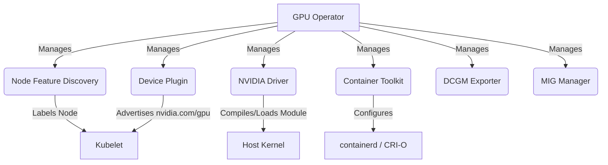

# GPU Nodes & Accelerated Computing

## Learning Outcomes

*   Design and deploy the NVIDIA GPU Operator on bare-metal Kubernetes architectures while validating runtime support constraints for runtimes like containerd and CRI-O.
*   Evaluate GPU resource sharing mechanisms to select between Time-Slicing and Multi-Instance GPU (MIG) topologies based on strict workload isolation requirements.
*   Diagnose complex scheduling deadlocks originating from unfulfilled hardware capacity constraints and host-level driver compilation failures.
*   Implement robust Node Feature Discovery (NFD) labeling pipelines to guarantee precise workload placement across heterogeneous accelerator fleets.
* Compare hardware allocation models by contrasting the legacy integer-based Device Plugin framework with the modern Kubernetes Dynamic Resource Allocation (DRA) standard.
*   Extract and scrape GPU telemetry using the Data Center GPU Manager (DCGM) Exporter.
*   Compare architectural approaches for NVIDIA, AMD ROCm, and Intel Gaudi accelerators in Kubernetes.

## Why This Module Matters

In the rapidly evolving landscape of generative artificial intelligence, infrastructure efficiency directly dictates an organization's financial viability. Consider the real-world operational realities faced by frontier AI research organizations operating massive compute fleets. In late 2023, a prominent autonomous vehicle company experienced a catastrophic capacity crunch that delayed their autonomous driving model training by over three weeks. The root cause was not hardware failure, but a fundamental misunderstanding of Kubernetes extended resource constraints. Hundreds of premium training accelerators were left idle because massive inference workloads and lightweight data processing scripts competed in highly inefficient ways, locking entire devices for trivial tasks. This simple configuration drift cost the company millions in wasted capital expenditure and severely impacted their product timeline.

At the core of this operational challenge is a profound architectural friction between general-purpose orchestrators and highly specialized silicon. In early infrastructure build-outs, many organizations treated top-tier accelerators as monolithic, indivisible resources. Because the default, out-of-the-box Kubernetes scheduling mechanics lacked native understanding of hardware partitioning, massive and minor workloads could not be co-located safely. It was entirely common for a minor, low-priority debugging container to inadvertently bind to and lock an entire premium accelerator. This lack of hardware-level isolation often plunged effective utilization rates well below optimal thresholds during peak operating periods, leaving incredibly expensive compute capacity stranded and operations halted. 

This operational reality underscores a fundamental principle of modern platform engineering: Kubernetes was originally designed for generic compute, and bridging the gap to advanced hardware requires deploying specialized infrastructure components. This ecosystem includes autonomous hardware operators, complex host-level drivers, and deep kernel-level integrations. By mastering advanced scheduling strategies, physical hardware partitioning like Multi-Instance GPU (MIG), and operator-driven lifecycle management, infrastructure engineers can radically maximize accelerator density. This level of technical mastery guarantees strict quality of service boundaries, completely prevents resource starvation, and ensures that massive capital investments generate maximum computational throughput rather than sitting idle due to simple configuration oversights.

## The Foundations of Accelerated Computing

Before diving into complex operational patterns, it is critical to fundamentally understand how the orchestration control plane perceives and interacts with hardware that falls outside of the standard processor and memory paradigms. Kubernetes does not natively understand hardware accelerators out of the box. The default kubelet implementation expertly manages standard, universally understood resources like CPU cores, system memory, and ephemeral storage. However, when you introduce specialized silicon—such as Tensor Core processing units, custom application-specific integrated circuits, or specialized AI processors—the control plane requires a robust translation layer to comprehend this hardware and make it available to the scheduling subsystem.

To expose these specialized hardware components to the global scheduler, the ecosystem relies on a standardized integration architecture. Based on official upstream specifications, Kubernetes GPU scheduling support via device plugins is a stable feature from Kubernetes v1.26. This foundational framework ensures that whether you are operating on localized edge inference nodes or massive centralized training clusters, the underlying API contracts remain consistent, reliable, and entirely deterministic across the fleet. It allows the core Kubernetes project to evolve rapidly without being bottlenecked by third-party hardware release cycles.

Crucially, this architecture is not tied to a single vendor's proprietary ecosystem. Kubernetes GPU support applies to AMD and NVIDIA GPUs, providing a vendor-agnostic foundation for accelerator integration. By utilizing the exact same underlying kubelet interfaces, infrastructure teams can mix and match hardware from different manufacturers within the exact same cluster, provided the appropriate vendor-specific plugins are deployed to the respective worker nodes. This abstraction is what makes Kubernetes a universal control plane for modern AI data centers.

### Resource Semantics and Capacity Handling

When a device plugin successfully registers with the local kubelet, it exposes what the platform formally categorizes as an "extended resource." To maintain strict consistency across the massive global ecosystem of hardware vendors, the control plane enforces rigid naming conventions. Specifically, device plugin resource names must use the vendor-domain/resource format (for example `nvidia.com/gpu`). This namespacing prevents collision between different vendors who might both want to advertise a generic "accelerator" resource.

It is critically important to understand the strict mathematical constraints governing this system. Extended resources requested by extended-resource-aware workloads are integer resources, cannot be overcommitted, and devices cannot be shared across containers. Unlike standard CPU limits, which the Linux Completely Fair Scheduler can smoothly throttle via control groups, or memory limits, which can lead to system swapping or eventual Out of Memory kills, extended resources are strictly binary, indivisible allocations at the API level. If a workload manifest requests one accelerator, it receives exclusive, unfettered access to that entire physical device at the kubelet layer, barring external software multiplexing configurations.

Hardware failures in the field require extremely precise dynamic capacity management to prevent scheduling black holes.

> **Pause and predict**: If a physical GPU node undergoes a hardware failure on one of its four installed GPUs, will the `Capacity` metric reported by `kubectl describe node` drop to three? Predict the exact behavior based on capacity handling rules before reading further.

When a managed device is marked unhealthy, the device plugin should report it and Kubernetes capacity handling decrements allocatable for scheduling, while total capacity remains unchanged. This exact operational nuance is absolutely critical for system observability, alerting, and automated remediation workflows. Alerting systems that solely monitor the total node capacity will completely miss a catastrophic hardware failure because the Capacity metric persistently reflects the physical hardware present at system boot. Workloads will simply fail to schedule if they depend on an inaccurate allocatable count, leaving cluster operators completely blind unless they monitor the `Allocatable` field.

## The Device Plugin Framework Deep Dive

The architecture of a device plugin revolves around a highly specialized agent running directly on the worker node. It is responsible for bridging the massive gap between the host operating system's low-level hardware enumeration (such as scanning the PCI bus) and the kubelet's high-level resource reporting loop. It continuously performs hardware discovery, executes resource allocation, and maintains continuous health monitoring loops over a highly specialized gRPC interface.

To establish secure communication with the control plane agent, a device plugin registers with kubelet via the registration gRPC service at the kubelet socket path under `/var/lib/kubelet/device-plugins/kubelet.sock`. This strict, hardcoded UNIX domain socket path guarantees that only authenticated, highly trusted host-level processes can advertise hardware capacity to the central control plane. During registration, the plugin informs the kubelet about its resource name, the API version it supports, and the specific endpoint where the kubelet can reach it for allocation requests.

To achieve this required level of system access, a device plugin may be deployed as a DaemonSet or other methods, but when deployed as a DaemonSet it must mount `/var/lib/kubelet/device-plugins` with privileged access. Without elevated privileges and highly specific host path mounts, the containerized plugin process simply cannot access the host's kubelet socket or perform the necessary character device injections into workload namespaces. This misconfiguration is a surprisingly common failure mode during manual deployments, resulting in silent failures where nodes incorrectly report zero available accelerators to the cluster scheduler despite hardware being physically present.

### The Rise of Container Device Interface (CDI)

As the container device ecosystem rapidly evolved to support increasingly complex runtime requirements, the upstream community introduced much more advanced injection capabilities. Historically, injecting a device required complex shell scripts to map low-level character devices like `/dev/nvidia0` and manually bind-mount driver libraries directly into the container filesystem, which was fragile and runtime-specific.

To resolve this fragility, `DevicePluginCDIDevices` became available as alpha in v1.28, beta in v1.29, and GA in v1.31, and requires gate enablement on both kubelet and kube-apiserver. This powerful feature allows direct Container Device Interface (CDI) specifications to dynamically, securely, and predictably inject devices into containers across entirely different container runtime implementations without relying on fragile volume mounts. By defining a JSON configuration detailing exactly which nodes, libraries, and hooks are required, CDI standardizes device integration whether you are using containerd, CRI-O, or any other OCI-compliant runtime.

## Operator-Driven GPU Management

Managing the complete, end-to-end lifecycle of accelerated hardware in a massive bare-metal Kubernetes cluster is an exceptionally difficult operational burden. It requires perfectly aligning Linux kernel drivers, container runtime configurations, dynamic device plugins, and monitoring exporters across every single worker node in the fleet. A version mismatch at any layer results in totally unusable hardware and cascaded pod failures that can take hours to manually debug.

The NVIDIA GPU Operator completely automates the deployment, configuration, and continuous management of this required software stack. It effectively ensures that whenever a new hardware node joins the cluster, it is automatically configured and ready to accept accelerated workloads without any manual administrative intervention, turning complex node bootstrapping into a simple DaemonSet rollout.

### Architecture Topology



### Core Components Analysis

| Component | Function in the Cluster | Practitioner Notes |
| :--- | :--- | :--- |
| **Node Feature Discovery (NFD)** | Detects PCIe devices and kernel features, applying labels like `feature.node.kubernetes.io/pci-10de.present=true`. | The Operator relies on NFD labels to determine which nodes require the GPU stack. |
| **NVIDIA Driver** | Compiles and loads the `nvidia` kernel module via a DaemonSet. | Requires host headers to be present or accessible. Can conflict with pre-installed host drivers (nouveau). |
| **Container Toolkit** | Configures `containerd` or `CRI-O` to use the `nvidia-container-runtime`, allowing containers to access GPU devices. | Modifies `/etc/containerd/config.toml`. Requires a runtime restart upon installation. |
| **Device Plugin** | Registers `nvidia.com/gpu` resources with the kubelet. | Fails if the driver is not loaded or the toolkit is misconfigured. |
| **DCGM Exporter** | Exposes GPU metrics (temperature, memory usage, SM utilization) in Prometheus format. | High cardinality metric source. Configure scrape intervals carefully in large clusters. |
| **MIG Manager** | Reconfigures the GPU into smaller instances based on predefined profiles via ConfigMaps. | Requires node drain/reboot if dynamically switching MIG profiles. |

### Strict Versioning and Runtime Compatibility

Maintaining absolute version compatibility across the base Linux kernel, the Kubernetes control plane, and the hardware driver is arguably the most challenging aspect of accelerator operations. The Operator ecosystem employs rigid versioning strategies to manage this complexity and prevent incompatible binary interfaces from destroying node stability.

NVIDIA GPU Operator uses calendar-style versioning `YY.MM.PP`. This predictable format ensures that infrastructure administrators can immediately identify the exact age and lifecycle status of their operational stack. Maintaining support is critical; currently, GPU Operator support status is `26.3.x` supported, `25.10.x` deprecated, and `25.3.x and lower` end-of-support. Operating a production cluster on end-of-support operator versions actively exposes the entire infrastructure to unpatched security vulnerabilities in the highly privileged device mounting logic.

Examining a specific modern release perfectly illustrates the strict component alignment required: NVIDIA GPU Operator v26.3.0 packages NVIDIA Container Toolkit 1.19.0 and NVIDIA Kubernetes Device Plugin 0.19.0. Deploying this exact matrix guarantees interoperability between the control plane and the low-level runtime. Deviating from these packaged versions by overriding individual image tags is highly discouraged and often leads to subtle runtime race conditions.

Kubernetes version support is equally rigid and unforgiving. For GPU Operator v26.3, Kubernetes version support in the OS matrix includes `1.32—1.35` for Ubuntu and other listed platforms. Aligning these orchestrator versions is strictly mandatory, and attempting to force the deployment on unsupported orchestration layers will predictably result in profound cluster failures due to deprecated API endpoints or changing gRPC socket behaviors.

Furthermore, continuous runtime validation is a critical prerequisite for advanced capabilities. GPU Operator v26.3 validates containerd 1.7–2.2 and CRI-O on supported operating systems. As the container ecosystem aggressively evolves, operators are integrating much deeper into low-level runtime capabilities to improve injection efficiency. A prime example of this evolution is that NVIDIA GPU Operator 26.3 added Node Resource Interface (NRI) plugin support with explicit containerd version requirements and CRI-O incompatibility. Specifically, it functions correctly on containerd v1.7.30+, v2.1.x, and v2.2.x. It is completely unsupported on CRI-O, and attempting to force NRI features onto a CRI-O managed node will fatally break workload isolation.

### The Pre-compiled vs. Dynamic Driver Trade-off

When deploying the GPU Operator, you must choose how the driver container behaves:

1.  **Dynamic Compilation**: The operator downloads the driver source and compiles the kernel module on the node at runtime.
    *   *Pro*: Works across kernel updates.
    *   *Con*: Slower node boot times. Requires GCC, Make, and kernel-headers on the host. If the OS upgrades to an unsupported kernel, compilation fails silently in the background, leaving nodes stranded.
2.  **Pre-compiled**: You build a custom container image containing the pre-compiled driver for your exact kernel version.
    *   *Pro*: Fast, deterministic boot times. No host dependencies.
    *   *Con*: High maintenance. You must build and host a new driver image for every OS patch that touches the kernel.

:::tip
For on-premises environments with strict OS lifecycle management (e.g., immutable OS images or controlled patching cycles), pre-compiled drivers provide significantly higher reliability. Dynamic compilation is acceptable for dev/test clusters.
:::

## Advanced Workload Placement

Because accelerated compute nodes are significantly more expensive to lease or purchase than standard CPU nodes, scheduling must be tightly controlled. You must absolutely prevent non-GPU workloads from consuming premium hardware capacity and exhausting node resources needed by machine learning tasks.

### Taints and Tolerations

It is a strict platform engineering best practice to always taint hardware nodes to explicitly repel standard infrastructure workloads. This guarantees that basic web servers, logging agents, or generic batch jobs do not consume instances meant exclusively for deep learning workloads, ensuring maximum Return on Investment (ROI) for your specialized silicon.

```bash
kubectl taint nodes gpu-node-1 nvidia.com/gpu=present:NoSchedule
```

Once a node is properly tainted, any workloads legitimately requiring hardware acceleration must actively tolerate this exact taint, explicitly declaring their intended need to operate in the restricted hardware zone:

```yaml
tolerations:
  - key: "nvidia.com/gpu"
    operator: "Exists"
    effect: "NoSchedule"
```

### Precise Targeting with Node Feature Discovery

Relying on manual labeling for node capabilities is a guaranteed path to operational failure in large fleets. To solve this, Node-feature discovery is positioned as compatible with all Kubernetes supported versions for this workflow. By deploying NFD as a DaemonSet entirely across the cluster, the system automatically audits its own physical hardware layout and reliably bridges the gap between raw bare-metal hardware specifications and the Kubernetes scheduler.

Different GPU SKUs in a cluster can be directed using node labels/affinity and Node/NodeSelector semantics. This capability is absolutely critical when operating a mixed fleet (for example, lightweight hardware for inference alongside massive memory variants for training). Example hardware labels automatically generated by NFD include `nvidia.com/gpu.product=NVIDIA-A100-SXM4-40GB`.

Platform engineers utilize standard `nodeSelector` or `nodeAffinity` blocks to target these dynamic, dynamically generated labels securely:

```yaml
affinity:
  nodeAffinity:
    requiredDuringSchedulingIgnoredDuringExecution:
      nodeSelectorTerms:
      - matchExpressions:
        - key: nvidia.com/gpu.product
          operator: In
          values:
          - NVIDIA-A100-SXM4-40GB
```

> **Stop and think**: If a cluster contains both A100 (40GB) and H100 (80GB) nodes, and a deployment only requests `nvidia.com/gpu: 1` without node affinity, how does the scheduler decide where to place the pod?

Without explicit node affinity defined in the manifest, the default scheduler will blindly evaluate the entire cluster pool and select any node that currently possesses at least one unit of `nvidia.com/gpu` allocatable capacity. This means your extremely lightweight inference container might randomly consume an expensive 80GB node instead of the desired, much cheaper node, resulting in catastrophic financial waste and blocking larger training runs.

## GPU Sharing Strategies

Deploying lightweight models or debugging workloads that do not consume the entire VRAM or computational capacity of a modern enterprise accelerator leads to massive, unacceptable resource waste. Because the base API forces integer requests, specific sharing mechanisms are provided to partition accelerators safely.

### Time-Slicing (Software Concurrency)

Time-slicing is a sophisticated sharing mechanism that fundamentally allows multiple Pods to simultaneously share the exact same physical hardware device. Under this specific configuration, the device plugin is manipulated to intentionally advertise a single physical accelerator as multiple virtual integer resources. The underlying kernel driver then schedules concurrent processes using rapid time-division multiplexing.

To configure Time-Slicing, administrators supply a highly declarative ConfigMap to the device plugin:

```yaml
apiVersion: v1
kind: ConfigMap
metadata:
  name: time-slicing-config
data:
  any: |-
    version: v1
    flags:
      migStrategy: none
    sharing:
      timeSlicing:
        resources:
        - name: nvidia.com/gpu
          replicas: 4
```

While highly effective for increasing scheduling density, Time-Slicing has profound architectural limitations: there is absolutely zero hardware-level memory isolation. If one pod maliciously or accidentally consumes all available VRAM, all other pods sharing that exact slice will instantly crash with fatal Out of Memory errors. This lack of isolation dictates that Time-Slicing should only be used for deeply trusted, well-profiled applications.

### Multi-Instance GPU (MIG)

For environments requiring strict, highly secure, untrusted multi-tenancy, software-based Time-Slicing is grossly insufficient. Multi-Instance GPU (MIG) physically and securely slices the underlying silicon into completely isolated, independent hardware instances with guaranteed quality of service.

NVIDIA MIG support in the latest GPU Operator docs is for NVIDIA Ampere and newer GPUs, with `single` or `mixed` MIG strategy during installation. The single strategy ensures all partitioned instances are exposed equally in size and capability, dramatically simplifying scheduling rules at the cost of rigid sizing. Conversely, the mixed strategy exposes instances with vastly varying size profiles, offering tremendous deployment flexibility at the steep cost of extreme operational complexity.

**War Story: The Mixed MIG Deadlock**
When operating advanced MIG partitions, infrastructure engineers must rigorously and continuously audit kernel driver stability and known release issues. A prime example of this risk in production environments is that NVIDIA GPU Operator v26.3 has a known MIG scheduling issue with mixed MIG+full-GPU workloads on specific 570-series driver builds, and recommends upgrading to 580.65.06+. Without applying this critical, documented driver patch, the kubelet will repeatedly fail to bind devices. Pods will become permanently stuck in `ContainerCreating`, leading to widespread scheduling deadlocks that require forceful node reboots and deep manual intervention to resolve.

### GPU Telemetry with DCGM Exporter

To effectively extract and scrape GPU telemetry, the NVIDIA GPU Operator automatically deploys the Data Center GPU Manager (DCGM) Exporter. The DCGM Exporter reads deep hardware telemetry—such as temperature, power draw, tensor core utilization, and memory bandwidth—directly from the management libraries and exposes them as Prometheus metrics.

By default, Prometheus can scrape these metrics using a `ServiceMonitor` or `PodMonitor` resource if the Prometheus Operator is installed in the cluster. Administrators can configure Prometheus to target the DCGM exporter service:

```yaml
apiVersion: monitoring.coreos.com/v1
kind: ServiceMonitor
metadata:
  name: dcgm-exporter
  namespace: gpu-operator
spec:
  selector:
    matchLabels:
      app: nvidia-dcgm-exporter
  endpoints:
  - port: metrics
    interval: 15s
```

*Architectural Rationale*: Direct hardware scraping ensures that infrastructure teams can correlate pod-level performance with physical silicon utilization, enabling precise chargeback models and identifying stranded capacity before it causes scheduling deadlocks.

## Alternative Ecosystems: AMD ROCm and Intel Gaudi

While NVIDIA dominates the ecosystem, supply chain constraints and pricing have driven adoption of alternatives.

### AMD ROCm

AMD's Radeon Open Compute (ROCm) platform provides the software stack for AMD Instinct accelerators. 
*   **Device Plugin**: AMD maintains the `amdgpu-device-plugin`. It exposes `amd.com/gpu`.
*   **Operator**: The AMD GPU Operator exists but is less historically mature than NVIDIA's. Many teams opt to deploy the kernel drivers via configuration management (Ansible) and only run the device plugin via Kubernetes DaemonSet.
*   **Monitoring**: Requires the `amd_smi_exporter` to bridge telemetry into Prometheus.

### Intel Gaudi

Intel Gaudi accelerators (Habana Labs) are purpose-built for deep learning.
*   **Device Plugin**: Uses the Habana Device Plugin, exposing `habana.ai/gaudi`.
*   **Architecture**: Relies heavily on RDMA over Converged Ethernet (RoCE) for cross-node scale-out. Operational complexity shifts from single-node driver management to ensuring the underlying network fabric supports lossless RoCEv2.

## Evolution to Dynamic Resource Allocation (DRA)

While the legacy Device Plugin framework has served the ecosystem reliably for years, it fundamentally struggles in massively heterogeneous environments where users need to request accelerators based on highly specific physical traits, rather than arbitrary integer counts. The requirement to treat GPUs strictly as identical integers created excessive friction when developers needed specific interconnect speeds, VRAM capacities, or specific physical isolation layouts.

To definitively solve this structural limitation, Kubernetes Dynamic Resource Allocation (DRA) is stable in Kubernetes v1.35 and enabled by default. DRA completely reimagines hardware scheduling from the ground up, moving decisively away from opaque, integer-based resource counts toward a rich, highly declarative claim model.

Under this modern architecture, DRA uses DeviceClasses and ResourceClaims/ResourceClaimTemplates to represent and request devices, with CEL available for selecting device attributes. Administrators define `DeviceClasses` that categorize hardware based on vendor specifications and capabilities. Workloads then submit a `ResourceClaim` requesting a device that perfectly matches a Common Expression Language (CEL) expression (for example, strictly requesting hardware with greater than 40GB of memory and specific tensor core generations).

The control plane evaluates these complex claims entirely independently of the core Pod scheduling cycle. This separation of concerns allows for highly dynamic, context-aware hardware provisioning that gracefully handles the extreme nuances of modern, multi-vendor AI infrastructure without relying on fragile node labels or complex, error-prone node affinity rules.

## Did You Know?

1. Kubernetes Dynamic Resource Allocation (DRA) is stable in Kubernetes v1.35 and enabled by default.
2. The NVIDIA GPU Operator uses calendar-style versioning `YY.MM.PP`.
3. `DevicePluginCDIDevices` became available as alpha in v1.28, beta in v1.29, and GA in v1.31, and requires gate enablement on both kubelet and kube-apiserver.
4. NVIDIA GPU Operator v26.3.0 packages NVIDIA Container Toolkit 1.19.0 and NVIDIA Kubernetes Device Plugin 0.19.0.

## Common Mistakes

| Mistake | Why | Fix |
| :--- | :--- | :--- |
| **Fractional GPU Requests** | Requesting `nvidia.com/gpu: 0.5`. Extended resources must be integers. The API server will reject the request entirely. | Configure Time-Slicing to represent a physical GPU as multiple virtual integer units, then request `1`. |
| **Ignoring the `nouveau` Driver** | The host OS boots with the open-source `nouveau` driver, physically preventing the NVIDIA container driver from binding to the PCIe bus. | Blacklist the `nouveau` module in `/etc/modprobe.d/blacklist.conf` on the host operating system. |
| **Missing Privileged Mounts** | Deploying the device plugin without privileged access prevents it from talking to `/var/lib/kubelet/device-plugins/kubelet.sock`. | Ensure the DaemonSet security context allows privileged execution and host path mounting. |
| **Unpatched 570-series Drivers** | Running mixed MIG configurations on the 570-series driver triggers a known scheduling bug that orphans workloads. | Upgrade the NVIDIA kernel driver to version 580.65.06+ as officially recommended. |
| **NRI on CRI-O Clusters** | Enabling NRI features on clusters running CRI-O. NRI is specifically validated for containerd 1.7.30+ and 2.x variants. | Disable NRI in the Operator Helm chart if you are mandated to use the CRI-O runtime. |
| **Capacity vs Allocatable Confusion** | Assuming hardware failure decreases total `Capacity`. The kubelet only decreases `Allocatable` for unhealthy devices. | Adjust Prometheus alerting rules to monitor the `Allocatable` metric instead of `Capacity`. |
| **Mismatching Kernel Headers** | The dynamic driver container goes into `CrashLoopBackOff` because the OS was patched but the corresponding headers were not installed. | Pin host OS versions strictly, or utilize pre-compiled driver images to bypass runtime compilation. |
| **Unbound Device Plugins During Containerd Restarts** | A node reboot causes a race condition where kubelet starts before NVIDIA toolkit finishes modifying containerd config. | Implement a systemd drop-in for kubelet to wait for `nvidia-container-toolkit`, or configure Operator to manage containerd restarts. |
| **DCGM Exporter Cardinality Explosion** | DCGM exporter tracks metrics per-GPU, per-process, and per-namespace, causing Prometheus cardinality explosion in time-sliced environments. | Tune the DCGM `metrics.csv` configuration map to disable process-level metrics if only node/pod utilization is needed. |

## Hands-On Exercise: Configuring Time-Slicing

This comprehensive interactive lab thoroughly simulates configuring the advanced NVIDIA GPU Operator for Time-Slicing. While you generally need physical hardware to execute accelerated workloads, you can effectively validate the Operator's configuration logic and Custom Resource Definitions (CRDs) on any standard cluster.

### Task 1: Install the NVIDIA GPU Operator

Add the official Helm repository and install the Operator. We will explicitly disable the dynamic driver compilation and toolkit installation phases so the Operator control loops run successfully even if physical hardware is entirely absent on your test cluster.

```bash
helm repo add nvidia https://helm.ngc.nvidia.com/nvidia
helm repo update

helm install gpu-operator nvidia/gpu-operator \
  -n gpu-operator --create-namespace \
  --set driver.enabled=false \
  --set toolkit.enabled=false
```

<details>
<summary>Solution Details</summary>

Verify the Operator pods are running correctly across the deployment footprint:

```bash
kubectl get pods -n gpu-operator
```
Ensure all pods show a status of Running or Completed before proceeding to the next task.
</details>

### Task 2: Create the Time-Slicing ConfigMap

Create a highly declarative configuration that directly instructs the device plugin to split a single physical unit into 10 distinct virtual devices.

```bash
cat <<EOF | kubectl apply -f -
apiVersion: v1
kind: ConfigMap
metadata:
  name: time-slicing-config
  namespace: gpu-operator
data:
  any: |-
    version: v1
    flags:
      migStrategy: none
    sharing:
      timeSlicing:
        resources:
        - name: nvidia.com/gpu
          replicas: 10
EOF
```

<details>
<summary>Solution Details</summary>
The output should confirm the ConfigMap has been created. If you receive an error, ensure your context is correct and that you have sufficient RBAC permissions to create resources in the `gpu-operator` namespace.
</details>

### Task 3: Apply the Configuration via ClusterPolicy

The GPU Operator intelligently uses a global custom resource definition called `ClusterPolicy` to manage the entire stack architecture. We need to patch this resource to actively point to our newly created ConfigMap logic. The specific path we modify is the `spec.devicePlugin.config` parameter.

```bash
kubectl patch clusterpolicy cluster-policy --type='json' -p='[{
  "op": "replace", 
  "path": "/spec/devicePlugin/config", 
  "value": {
    "name": "time-slicing-config",
    "default": "any"
  }
}]'
```

<details>
<summary>Solution Details</summary>
This patch updates the global configuration dynamically. You can verify it took effect by executing `kubectl get clusterpolicy cluster-policy -o yaml` and checking the `spec.devicePlugin.config` path.
</details>

### Task 4: Verification (Requires Physical GPU)

If you are running this specific lab module on a cluster equipped with actual physical hardware, you must forcefully restart the device plugin DaemonSet to immediately pick up the configuration changes:

```bash
kubectl rollout restart daemonset nvidia-device-plugin-daemonset -n gpu-operator
```

<details>
<summary>Solution Details</summary>

Describe the node to view the newly available virtualized capacity allocations:

```bash
kubectl describe node <your-gpu-node> | grep -A 5 "Capacity:"
```
Look for `nvidia.com/gpu: 10` in the allocatable output.
</details>

<details>
<summary>Success Checklist</summary>

- [ ] Operator Helm chart deployed successfully without crash loops.
- [ ] ConfigMap created in the correct `gpu-operator` namespace.
- [ ] ClusterPolicy patched successfully, verified by `kubectl get clusterpolicy cluster-policy -o yaml`.
- [ ] Expected output shows `nvidia.com/gpu: 10` under both the Capacity and Allocatable blocks on the host node.

</details>

**Troubleshooting:**
*   If the capacity does not update, check the device plugin logs for parsing errors: `kubectl logs ds/nvidia-device-plugin-daemonset -n gpu-operator`.
*   Ensure the `default` key in the ClusterPolicy patch matches the key inside your ConfigMap (`any`).

## Quiz

**Question 1**
A developer configures Time-Slicing to divide a physical GPU. The workload requests 1 virtual GPU but dynamically loads a massive dataset into VRAM exceeding the physical hardware fraction. What is the expected behavior?
A) The device plugin dynamically throttles memory allocations.
B) The NVIDIA driver enforces strict memory isolation per virtual replica.
C) The workload is evicted by the kubelet before OOM occurs.
D) The pod will consume the VRAM without restriction, potentially causing immediate Out of Memory (OOM) errors for other workloads sharing the same physical GPU.

<details>
<summary>View Answer</summary>
**Correct Answer: D**. Time-slicing only multiplexes compute time. It provides zero hardware-level memory isolation. If Pod A allocates 40GB, it will consume it, leading to OOM errors for other workloads. This requires teams to enforce memory limits exclusively at the application level when utilizing this sharing strategy.
</details>

**Question 2**
An infrastructure team attempts to optimize resource usage by submitting a pod manifest that requests exactly `nvidia.com/gpu: 0.5`. Why will the Kubernetes API server reject this pod specification?
A) The GPU Operator lacks a configured Time-Slicing ConfigMap to handle multiplexing.
B) Kubernetes extended resources must be requested as whole integer values.
C) The underlying worker node is missing the appropriate NFD labels.
D) The runtime requires a restart to process fractional shares.

<details>
<summary>View Answer</summary>
**Correct Answer: B**. Kubernetes does not allow fractional requests for extended resources like GPUs. To achieve fractional allocation, you must use Time-Slicing or MIG to represent the fraction as an integer `1` of a smaller virtual resource. Attempting to bypass this mathematical constraint will cause the Kubernetes API server to reject the specification completely.
</details>

**Question 3**
Following an OS patch that updated the host kernel, several GPU-accelerated pods enter a CrashLoopBackOff state. The GPU Operator is configured for dynamic driver compilation. What is the most probable root cause?
A) The configured MIG profiles were unexpectedly reset.
B) The updated kernel lacks the required headers, causing the dynamic driver compilation container to fail.
C) The cluster is running an unsupported device plugin.
D) The DCGM exporter is failing to scrape metrics.

<details>
<summary>View Answer</summary>
**Correct Answer: B**. Dynamic driver compilation requires the exact `kernel-headers` and `kernel-devel` packages matching the running kernel. If the OS patched the kernel but the corresponding headers are missing or incompatible, the driver container will fail to compile the module. Without successful compilation, the node cannot communicate with the hardware, rendering the accelerators invisible to the cluster.
</details>

**Question 4**
A platform engineering team must colocate two highly sensitive workloads on the same physical node, requiring absolute, hardware-guaranteed memory and compute isolation. Which sharing mechanism must be configured?
A) Time-Slicing configured with multiple replicas.
B) Multi-Instance GPU (MIG) hardware partitioning.
C) ResourceQuotas strictly scoped to GPU limits.
D) Node Affinity rules coupled with strict network policies.

<details>
<summary>View Answer</summary>
**Correct Answer: B**. MIG provides hardware-level isolation for both memory and compute paths, ensuring strict QoS and security boundaries between tenants sharing the same physical silicon. This physical segregation prevents noisy neighbor problems that typically plague concurrent deep learning workloads. It is the only fully secure method for multi-tenant hardware sharing.
</details>

**Question 5**
A data science team submits a pod manifest that requests `nvidia.com/gpu: 1` but omits any `nodeAffinity` rules. The cluster contains a mix of expensive 80GB H100 nodes and cheaper 16GB T4 nodes. Node Feature Discovery (NFD) is fully operational. What is the scheduling outcome for this workload?
A) The scheduler will read the NFD labels and automatically place the pod on the cheapest available T4 node to save costs.
B) The scheduler will reject the pod because `nodeAffinity` is mandatory in heterogeneous clusters.
C) The scheduler will blindly assign the pod to any node with at least one unit of `nvidia.com/gpu` allocatable capacity, potentially wasting an expensive H100 node.
D) The device plugin will intercept the request and dynamically time-slice an H100 to emulate a T4.

<details>
<summary>View Answer</summary>
**Correct Answer: C**. While NFD automatically discovers and labels node characteristics, the default Kubernetes scheduler does not intelligently optimize for cost or specific architectures without explicit instructions. If a manifest requests a generic `nvidia.com/gpu` without `nodeAffinity`, the scheduler will pick any node with available capacity, often leading to massive resource waste.
</details>

**Question 6**
A developer needs to deploy a workload that strictly requires an accelerator with at least 80GB of VRAM and a specific tensor core architecture. The cluster runs Kubernetes v1.35 with Dynamic Resource Allocation (DRA) enabled. If the developer uses the legacy device plugin framework instead of DRA, what is the operational consequence?
A) The workload will fail to schedule because the legacy framework is deprecated in v1.35.
B) The scheduler will randomly assign any available GPU, potentially placing the workload on an underpowered node and causing an OOM error if strict affinity is not mapped.
C) The legacy framework will automatically fallback to DRA and translate the request into a CEL expression.
D) The kubelet will dynamically partition a smaller GPU using Time-Slicing to meet the 80GB requirement.

<details>
<summary>View Answer</summary>
**Correct Answer: B**. The legacy device plugin framework relies on opaque integer counts (e.g., `nvidia.com/gpu: 1`) and cannot interpret complex hardware constraints without brittle node affinity rules. DRA solves this by allowing developers to submit a ResourceClaim with a CEL expression that strictly mandates the 80GB requirement, guaranteeing correct placement.
</details>

**Question 7**
A physical accelerator on a worker node suffers an unrecoverable hardware failure and is marked unhealthy by the device plugin. How does this failure affect the node's resource metrics reported to the control plane?
A) Both Capacity and Allocatable are decremented.
B) The node is cordoned and counts drop to zero.
C) The overall Capacity metric remains unchanged, but the Allocatable count is decremented.
D) The API server deletes the extended resource definition.

<details>
<summary>View Answer</summary>
**Correct Answer: C**. When an extended resource is marked unhealthy by the device plugin, Kubernetes preserves the overall capacity metric while reducing the allocatable count. This ensures that infrastructure monitoring tools can detect the discrepancy between installed hardware and usable hardware. Workloads will no longer be scheduled onto the broken device because the allocatable pool has shrunk.
</details>

**Question 8**
An infrastructure team plans to upgrade to NVIDIA GPU Operator v26.3.0 to leverage the new Node Resource Interface (NRI) plugin. Their production cluster runs CRI-O, while their staging cluster runs containerd v1.7.31. What is the necessary deployment strategy to avoid workload initialization failures?
A) Enable NRI globally, as v26.3.0 provides universal NRI support across all OCI-compliant runtimes.
B) Enable NRI on the staging cluster, but disable it on the production cluster, because the v26.3.0 NRI plugin is explicitly incompatible with CRI-O.
C) Upgrade the staging cluster to containerd v2.0 before enabling NRI, as v1.7.31 is unsupported.
D) Deploy the legacy Device Plugin framework on staging and NRI on production.

<details>
<summary>View Answer</summary>
**Correct Answer: B**. The NRI plugin support in GPU Operator v26.3 is explicitly validated for containerd (v1.7.30+ and 2.x) and is strictly unsupported on CRI-O. Attempting to enable NRI on the CRI-O production cluster will fatally break workload isolation and initialization.
</details>

## Further Reading

*   [NVIDIA GPU Operator Documentation](https://docs.nvidia.com/datacenter/cloud-native/gpu-operator/latest/index.html)
*   [Kubernetes Device Plugins (Official Docs)](https://kubernetes.io/docs/concepts/extend-kubernetes/compute-storage-net/device-plugins/)
*   [NVIDIA Multi-Instance GPU User Guide](https://docs.nvidia.com/datacenter/tesla/mig-user-guide/index.html)
*   [Improving GPU Utilization in Kubernetes (NVIDIA Blog)](https://developer.nvidia.com/blog/improving-gpu-utilization-in-kubernetes/)
*   [Node Feature Discovery GitHub Repository](https://github.com/kubernetes-sigs/node-feature-discovery)

## Next Module

Now that you have confidently mastered the foundational mechanics of accelerator provisioning, lifecycle management, and hardware partitioning, you are completely ready to explore multi-node scaling architectures. Proceed immediately to **[Module 9.2: Advanced Topology and RDMA Fabrics](./module-9.2-topology-rdma)**. In the upcoming module, you will learn exactly how to network massive fleets of GPUs across physically disparate nodes using InfiniBand and RoCEv2, unlocking the profound bandwidth required to train frontier models that far exceed the VRAM of any single bare-metal machine!