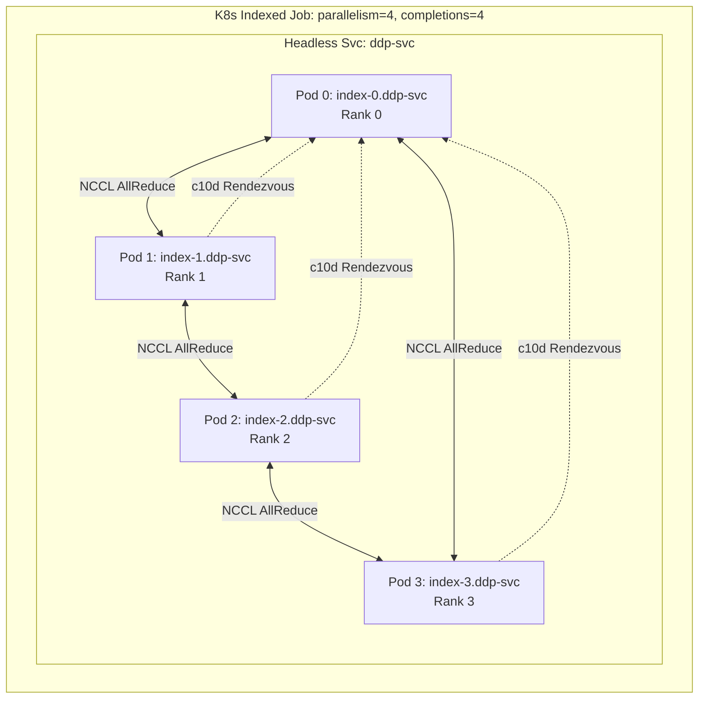
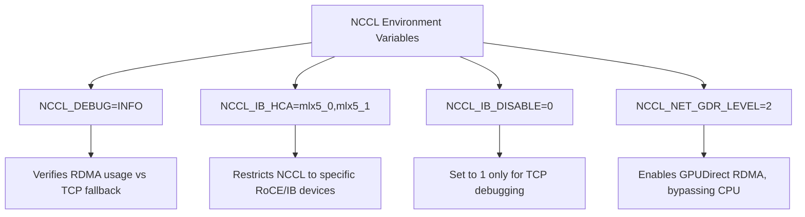

# Private AI Training Infrastructure

**Complexity:** Advanced  
**Time:** 120-150 minutes  
**Prerequisites:** Kubernetes Jobs, Services, device plugins, GPU basics, Linux networking, storage fundamentals, and basic PyTorch familiarity  
**Environment:** Kubernetes 1.35+, a local `kind` cluster for the lab, and production familiarity with GPU nodes, RDMA-capable NICs, and shared storage  

## Learning Outcomes

By the end of this module, you will be able to:

* **Design** a topology-aware Kubernetes scheduling architecture that aligns GPUs, CPUs, memory, and RDMA NICs for distributed training workloads.
* **Implement** PyTorch Distributed Data Parallel workloads using Indexed Jobs, headless Services, deterministic rank assignment, and queue-based admission.
* **Diagnose** NCCL communication failures by comparing TCP fallback, RDMA device exposure, Multus attachments, SR-IOV resources, and fabric-level loss symptoms.
* **Evaluate** whether Kueue, Volcano, or native Kubernetes scheduling is appropriate for a specific private AI training platform.
* **Design** a checkpoint storage path that reduces synchronous training stalls while preserving durable recovery points.

## Why This Module Matters

A platform team builds a private training cluster because sensitive model data cannot leave the company network.

The first pilot looks successful.

Eight GPU nodes join the cluster.

The NVIDIA device plugin exposes GPUs.

A data science team submits a distributed PyTorch job.

Pods begin to start.

Then the platform falls apart in slow motion.

Rank 0 starts first.

Rank 1 cannot resolve the rendezvous address.

Several workers land on nodes attached to the wrong top-of-rack switch.

NCCL fails to initialize RDMA and silently falls back to TCP over the default Kubernetes network.

Half of the pods are running, half are pending, and every allocated GPU is idle because synchronous training cannot begin until every rank joins.

The scheduler did exactly what a general-purpose Kubernetes scheduler normally does.

It placed pods one at a time.

It did not know that a training job is only useful when all workers start together.

It did not know that two GPUs on the same host may have very different paths to the NIC.

It did not know that a pending rank wastes every running rank.

The storage system then adds another failure mode.

Checkpoint writes arrive as synchronized bursts from many workers.

A single checkpoint pauses training for minutes.

When one rank crashes during a checkpoint window, the whole job restarts from stale state.

The bill is not just wasted hardware.

The bill is lost research time, delayed model releases, and a platform that teams stop trusting.

Private AI training infrastructure is therefore not "Kubernetes plus GPUs."

It is a coordinated system of scheduling, networking, topology, storage, and operational feedback.

The hard part is not launching a container that can see a GPU.

The hard part is making hundreds or thousands of GPUs behave like one reliable training machine.

This module builds that mental model from first principles.

You will start with the training process itself.

Then you will map ranks and rendezvous onto Kubernetes primitives.

Then you will add RDMA, topology, gang scheduling, observability, and checkpoint design.

Finally, you will practice the same pattern in a local lab using CPU-backed PyTorch so the scheduling behavior is visible without requiring physical GPUs.

## 1. Start With The Training Shape

Distributed training is strict about coordination.

A web application can usually tolerate partial availability.

If one replica is missing, the load balancer sends traffic to the remaining replicas.

A synchronous training job behaves differently.

If one rank is missing, every other rank may wait.

If one rank is slow, every other rank may idle at the synchronization point.

If one rank crashes, the whole job usually fails or rolls back to a checkpoint.

That difference changes the infrastructure design.

You are not scheduling independent replicas.

You are scheduling a single distributed computation.

Each worker has a role.

Each worker needs a rank.

Each worker needs to discover the others.

Each worker needs a network path that can handle repeated collective communication.

Each worker needs access to checkpoint storage at nearly the same time.

The smallest useful model is four workers training together.

```text
+----------------------+       +----------------------+
| Worker rank 0        |<----->| Worker rank 1        |
| Rendezvous endpoint  |       | Joins rendezvous     |
| GPU + CPU + NIC path |       | GPU + CPU + NIC path |
+----------------------+       +----------------------+
          ^                              ^
          |                              |
          v                              v
+----------------------+       +----------------------+
| Worker rank 2        |<----->| Worker rank 3        |
| Joins rendezvous     |       | Joins rendezvous     |
| GPU + CPU + NIC path |       | GPU + CPU + NIC path |
+----------------------+       +----------------------+
```

That diagram hides several production risks.

The ranks may not start at the same time.

The DNS records may not exist when the first worker tries to resolve them.

The network path may be the wrong one.

The GPU and NIC may sit behind different NUMA domains.

The scheduler may place only some ranks because resources are fragmented.

A production platform must make each of those risks explicit.

### Distributed Data Parallel And Sharded Training

Modern distributed training commonly uses data parallelism, tensor/model parallelism, pipeline parallelism, or combinations of them.

This module focuses on the infrastructure pattern behind synchronous data parallel and sharded data parallel training because it is the foundation most Kubernetes-based training stacks build on.

**Distributed Data Parallel (DDP)** copies the model to every worker.

Each worker processes a different slice of the data.

After the backward pass, workers synchronize gradients.

That synchronization is usually the expensive cross-node communication path.

**Fully Sharded Data Parallel (FSDP)** reduces per-GPU memory pressure by sharding model parameters, gradients, and optimizer state.

The infrastructure implications are similar but more intense.

Workers still need reliable collective communication.

They also become more sensitive to communication latency because model state is repeatedly gathered and sharded.

**Pipeline and tensor parallelism** split work inside the model.

They often require even tighter network expectations because some layers cannot proceed until remote partitions finish.

The exact framework API changes over time.

The infrastructure lesson is more stable:

A training platform must support deterministic rank identity, all-or-nothing startup, high-bandwidth communication, topology alignment, and checkpoint recovery.

### PyTorch DDP And FSDP2

PyTorch training commonly launches distributed workers with `torchrun`.

A typical `torchrun` invocation tells each worker:

* how many nodes exist,
* how many processes run per node,
* which rank this node has,
* where the rendezvous endpoint is,
* which backend to use.

DDP is easy to explain because every worker owns the whole model.

FSDP2 is more efficient for large models because state is sharded.

The infrastructure does not get easier when the framework gets smarter.

The scheduler still must admit the full job.

The network still must carry collectives.

The storage path still must handle checkpoint bursts.

The operator still must prove that the job is using the intended hardware path.

When planning a private AI cluster, separate framework concerns from platform concerns.

Framework teams choose DDP, FSDP2, DeepSpeed, JAX, or another training strategy.

Platform teams provide the reliable substrate.

The substrate must expose the right devices, place pods intelligently, admit jobs as a group, and make failures diagnosable.

### Mapping Training Requirements To Kubernetes

Distributed training frameworks require three basic platform guarantees.

1. **Predictable identity.** Each worker must know its rank.
2. **Predictable discovery.** Workers must resolve each other before training begins.
3. **Predictable admission.** Workers must start as a useful group, not as isolated pods.

Historically, teams used custom training operators such as MPIJob or PyTorchJob.

Those operators are still useful.

However, Kubernetes now provides a strong native building block for simple distributed jobs: Indexed Jobs.

An Indexed Job assigns each pod a stable completion index.

That index maps naturally to a training rank.

A headless Service provides stable DNS.

Together, they give `torchrun` enough information to form a worker group.



The important detail is that `completionMode: Indexed` gives each pod a value in `JOB_COMPLETION_INDEX`.

Rank 0 can be pod index 0.

Rank 1 can be pod index 1.

The rendezvous endpoint can point to rank 0 through the headless Service.

That is a clean Kubernetes-native design.

It is also incomplete by itself.

Indexed Jobs do not solve gang admission.

A plain Indexed Job can still partially start.

A plain Indexed Job does not guarantee that workers are on the right network topology.

A plain Indexed Job does not expose RDMA devices.

A plain Indexed Job does not make checkpoint storage fast.

You should treat Indexed Jobs as the identity layer, not the whole platform.

> **Active learning prompt:** A team tells you their Indexed Job has `parallelism: 16`, but only 10 pods are running and the rest are pending. The running pods consume GPUs while the job waits. Which platform guarantee is missing: identity, discovery, admission, topology, or storage?

The missing guarantee is admission.

The job has identity because each pod can get an index.

It may even have discovery.

But the platform admitted a partial job.

For synchronous training, partial admission is often worse than no admission because it wastes expensive resources.

## 2. Design The Network Before You Schedule The Job

GPU training performance often fails at the network layer first.

Kubernetes overlay networks are excellent for ordinary service traffic.

They are not designed for sustained low-latency GPU collectives.

An overlay network adds encapsulation, host networking overhead, and CPU involvement.

For distributed training, those costs multiply at every synchronization point.

NVIDIA Collective Communications Library, or NCCL, is commonly used for GPU collectives.

NCCL can use multiple transports.

When the RDMA path is healthy, it can use InfiniBand or RoCEv2.

When that path is broken, it may fall back to TCP sockets.

The dangerous failure mode is silent fallback.

The job still runs.

The dashboards still show GPU allocation.

The training loop still progresses.

But throughput collapses.

A platform engineer must therefore ask two questions for every training workload:

* Which network path should this job use?
* How will we prove that the job actually used it?

### InfiniBand And RoCEv2 In Plain Terms

InfiniBand is a purpose-built high-performance fabric.

RoCEv2 carries RDMA over Ethernet.

Both allow remote direct memory access.

The value of RDMA is that data can move between systems with much less CPU and kernel involvement than ordinary TCP.

For GPU training, the strongest design is usually GPUDirect RDMA.

That allows a capable NIC to transfer data directly to or from GPU memory without staging everything through host memory.

This reduces latency and CPU pressure.

It also makes topology alignment more important.

If the NIC is close to one group of GPUs but the scheduler assigns a pod GPUs from a different NUMA domain, traffic crosses additional host interconnects before it reaches the NIC.

The platform still "works."

It just works badly.

### The Kubernetes Problem With RDMA

A normal pod receives a normal network interface from the cluster CNI.

That interface is not the RDMA interface.

You cannot route RDMA traffic through a standard overlay and expect kernel-bypass behavior.

The pod needs access to a secondary interface or device resource that maps to the high-performance fabric.

This is commonly done with:

* Multus CNI for secondary network attachment,
* SR-IOV device plugins for virtual functions,
* the NVIDIA Network Operator for NVIDIA networking stacks,
* switch-level configuration for lossless RoCEv2 or InfiniBand fabric operation.

The pod spec then carries both application intent and hardware intent.

It says "I need GPUs."

It also says "I need the RDMA network attachment."

It may say "I need this SR-IOV resource."

That lets the scheduler and kubelet coordinate compute and network resources.

### Exposing RDMA To Pods

You cannot route RDMA traffic through a standard Kubernetes CNI overlay.

You must attach secondary network interfaces directly to the Pods.

This is accomplished using Multus CNI combined with the SR-IOV Network Device Plugin.

```yaml
# Example Multus NetworkAttachmentDefinition for RoCEv2
apiVersion: k8s.cni.cncf.io/v1
kind: NetworkAttachmentDefinition
metadata:
  name: roce-network
  annotations:
    k8s.v1.cni.cncf.io/resourceName: mellanox.com/cx6_rdma
spec:
  config: '{
    "cniVersion": "0.3.1",
    "name": "roce-network",
    "type": "macvlan",
    "master": "eth1",
    "ipam": {
      "type": "whereabouts",
      "range": "192.168.100.0/24"
    }
  }'
```

This object is only one piece of the design.

The physical NIC must exist.

The host drivers must be installed.

The device plugin must advertise the resource.

The pod must request the resource.

The switch fabric must be configured correctly.

The application must be told to use the intended interface.

If any one of those pieces is wrong, NCCL may avoid the RDMA path.

:::caution
**RoCEv2 Requirements:** RoCEv2 requires a lossless network fabric. You must configure Priority Flow Control (PFC) and Explicit Congestion Notification (ECN) on your Top of Rack (ToR) switches. If packets drop, RoCEv2 falls back to Go-Back-N, causing catastrophic latency spikes that stall training.
:::

InfiniBand has its own operational requirements.

For InfiniBand, the subnet manager matters.

Without a subnet manager such as OpenSM, ports may remain inactive or unusable.

For NVIDIA networking stacks, validate the driver and operator prerequisites before trying to debug training code.

A PyTorch error can be the final symptom of a fabric that was never initialized.

> **Stop and think:** Why is it critical for the NVIDIA Network Operator to have the DOCA driver and OpenSM running before attempting an InfiniBand deployment? Without a subnet manager like OpenSM, the InfiniBand fabric remains uninitialized, and ports will stay in an inactive state, preventing any RDMA communication.

### NCCL Configuration

NCCL behavior is controlled through environment variables passed to the training container.

These variables are not a substitute for correct hardware setup.

They are the control surface you use to verify and constrain NCCL behavior.

| Variable | Recommended Value | Purpose |
| :--- | :--- | :--- |
| `NCCL_DEBUG` | `INFO` | Required for verifying that NCCL is actually using RDMA and not silently falling back to TCP sockets. |
| `NCCL_IB_HCA` | `=mlx5_0,mlx5_1` | Explicitly restricts NCCL to specific InfiniBand/RoCE devices. Prefix with `=` to prevent NCCL from searching for others. |
| `NCCL_IB_DISABLE` | `0` | Set to `1` only to force TCP for debugging network isolation issues. |
| `NCCL_NET_GDR_LEVEL` | `2` | Enables GPUDirect RDMA. Allows the NIC to read/write directly to GPU memory over PCIe, bypassing the CPU entirely. |

To visualize how these variables interact with the stack:



Use `NCCL_DEBUG=INFO` during validation and incident response.

In mature production environments, you may reduce log verbosity for steady-state runs.

Do not remove the ability to re-enable it quickly.

A useful platform pattern is to provide a debug profile.

The default profile sets conservative production values.

The debug profile adds NCCL logging, interface restrictions, and short test jobs that run collectives before a large training run begins.

### What To Check When RDMA Is Suspect

Start with the symptom.

If training is slow but not failing, look for TCP fallback.

If training fails immediately, look for rendezvous, DNS, or interface discovery.

If training progresses but stalls during collectives, inspect fabric loss, MTU, congestion, and topology.

A practical debugging sequence is:

1. Confirm that the pod requested the GPU and RDMA resources.
2. Confirm that the pod received the Multus attachment.
3. Confirm that the expected interface exists inside the container.
4. Confirm that the device plugin advertises healthy devices on the node.
5. Confirm that NCCL logs mention the intended RDMA transport.
6. Confirm that switch counters do not show loss or retransmission symptoms.
7. Confirm that pods are not crossing a poor NUMA or rack topology.

The order matters.

Do not start by tuning NCCL if the pod never received the RDMA interface.

Do not start by changing switch settings if NCCL logs show it is using sockets.

Do not blame PyTorch if DNS resolution fails before the process group forms.

### Worked Example: Diagnosing A Slow AllReduce

A research team reports that a four-node DDP job is running at one third of expected throughput.

The job does not crash.

GPU utilization rises and falls in waves.

The team suspects PyTorch.

You are the platform engineer.

Your task is to decide whether this is a framework problem or an infrastructure problem.

**Step 1: Look for the communication symptom.**

The training logs show long pauses after backward passes.

That points toward gradient synchronization.

In DDP, gradient synchronization commonly uses NCCL AllReduce.

So the first hypothesis is a communication path problem.

**Step 2: Check whether NCCL used RDMA.**

You inspect the worker logs and find lines similar to:

```text
NCCL INFO NET/Socket : Using eth0
```

You do not see the expected `NET/IB` path.

That means the job likely fell back to TCP sockets.

PyTorch is not the first suspect anymore.

The infrastructure did not provide or select the intended RDMA path.

**Step 3: Confirm the pod attachment.**

You check the pod annotations and network interfaces.

```bash
kubectl get pod pytorch-ddp-0 -o jsonpath='{.metadata.annotations.k8s\.v1\.cni\.cncf\.io/network-status}'
kubectl exec pytorch-ddp-0 -- ip link
```

The pod only has the default `eth0`.

It does not have the secondary RoCE interface.

That means NCCL could not use the RDMA path even if the host was configured correctly.

**Step 4: Check the pod resource request.**

You inspect the job template.

The pod requests GPUs but does not request the SR-IOV resource associated with the RoCE NetworkAttachmentDefinition.

The Multus annotation was also missing.

The scheduler placed the pod as a normal GPU workload.

**Step 5: Fix the platform contract.**

You update the workload template so it includes the network attachment annotation and requests the RDMA resource advertised by the device plugin.

You also include NCCL environment variables that restrict the expected interface.

The fix is not "upgrade PyTorch."

The fix is to express the network requirement in Kubernetes.

**Step 6: Re-run a small collective test.**

Before launching the expensive training run, you run a small two-node job.

The logs now show the intended RDMA path.

GPU utilization becomes smoother.

The team can then re-run the larger job with much lower risk.

**Step 7: Capture the lesson as a platform guardrail.**

You add an admission policy or workload template validation rule.

Training jobs in the high-performance queue must request both GPU and RDMA resources.

They must also include the standard NCCL debug profile during preflight.

That turns an incident into a reusable control.

> **Active learning prompt:** In the worked example, what would change if the pod had the secondary RoCE interface but NCCL still used `eth0`? Name two checks you would perform before changing application code.

Good answers include checking `NCCL_IB_HCA`, checking whether the interface names inside the container match the configured values, checking device permissions, checking whether the RDMA devices are visible, and checking whether NCCL was built with the expected transport support.

## 3. Align Hardware Topology With Pod Placement

A GPU node is not a flat box of identical devices.

It has PCIe root complexes.

It has NUMA domains.

It may have NVLink or other GPU interconnects.

It has NICs attached through specific CPU and PCIe paths.

Two GPUs in the same server may have very different communication paths to a NIC.

If a pod asks for four GPUs, the device plugin can expose four GPUs.

That does not automatically mean they are the best four GPUs.

If the pod receives GPUs split across NUMA domains, CPU memory access and NIC paths may cross host interconnects.

The job still starts.

The performance loss may only appear under communication pressure.

This is why topology alignment is an admission problem, not just a monitoring problem.

You want a bad placement to fail early.

A pending pod is visible and recoverable.

A badly placed pod can waste an entire training run.

### What NUMA Means For Training

NUMA stands for Non-Uniform Memory Access.

In a multi-socket server, memory is attached to different CPU sockets.

A CPU can access remote memory, but remote access is slower.

PCIe devices are also attached through particular root complexes.

A GPU may be close to one CPU socket.

A NIC may be close to another.

When training traffic must cross sockets, latency rises and bandwidth falls.

For ordinary batch jobs, that may be acceptable.

For synchronous GPU collectives, it can dominate runtime.

A simplified node might look like this:

```text
+--------------------------------------------------------------------+
| GPU Node                                                           |
|                                                                    |
|  +--------------------------+        +--------------------------+  |
|  | NUMA node 0              |        | NUMA node 1              |  |
|  | CPU cores 0-31           |        | CPU cores 32-63          |  |
|  | Memory bank A            |        | Memory bank B            |  |
|  | GPUs 0,1,2,3             |        | GPUs 4,5,6,7             |  |
|  | NIC mlx5_0               |        | NIC mlx5_1               |  |
|  +--------------------------+        +--------------------------+  |
|              \                                /                    |
|               \                              /                     |
|                +---------- host interconnect +                     |
+--------------------------------------------------------------------+
```

A pod requesting four GPUs can fit neatly in one NUMA domain.

A pod requesting six GPUs cannot.

If the platform permits the six-GPU pod to run on this node, it must cross the interconnect.

If the platform rejects it, the job may wait for a better shape or require a different workload design.

### Kubelet Topology Manager

To enforce NUMA alignment, configure the Topology Manager within the kubelet configuration on GPU nodes.

```yaml
# /var/lib/kubelet/config.yaml
topologyManagerPolicy: single-numa-node
topologyManagerScope: pod
```

Setting `single-numa-node` ensures the kubelet rejects pod admission if it cannot allocate CPUs, memory, GPUs, and SR-IOV NICs from the same NUMA node.

The failure appears as a `TopologyAffinityError`.

That failure is useful.

It tells the platform that the request cannot be satisfied with the required locality.

`topologyManagerScope: pod` matters because training pods often contain init containers or sidecars.

The platform should reason about the pod as a whole.

For the NVIDIA device plugin to report NUMA topology to the kubelet, deploy it with topology reporting enabled in the plugin configuration.

The exact key names depend on the operator and plugin version.

Validate against the operator documentation used in your cluster.

The design principle is stable:

Device plugins must expose topology hints.

The kubelet must enforce them.

Workloads must request resources in a shape that can be admitted.

> **Pause and predict:** If a Kubernetes cluster has nodes with 8 GPUs split evenly across two NUMA domains, and a Pod requests 5 GPUs with a Kubelet policy of `single-numa-node`, will the Pod be scheduled? No, it will be rejected with a TopologyAffinityError, because 5 GPUs cannot be fulfilled by a single 4-GPU NUMA node.

### Scheduler Placement Versus Kubelet Admission

It is easy to confuse scheduler placement with kubelet admission.

The scheduler chooses a node.

The kubelet admits the pod on that node.

Topology Manager runs at kubelet admission time.

That means the scheduler may pick a node that appears to have enough total GPUs, but the kubelet may reject the pod because those GPUs cannot be aligned with CPU, memory, or NIC resources.

This can create frustrating loops if the scheduler does not have enough topology awareness.

For production AI clusters, combine several layers:

* node labels for hardware class,
* taints and tolerations for GPU pools,
* ResourceClasses or workload templates where appropriate,
* topology-aware device plugin configuration,
* kubelet Topology Manager policy,
* batch admission to avoid partial starts,
* observability that records topology admission failures.

Do not rely on one layer to solve every placement problem.

Kubernetes scheduling is intentionally modular.

Private AI platforms need that modularity, but they must wire the modules together deliberately.

### Topology-Aware Design Checklist

Before opening a GPU pool to training teams, answer these questions:

* How many GPUs sit in each NUMA domain?
* Which NIC is closest to each GPU group?
* Which GPU request sizes are valid for a single pod?
* Which request sizes should be rejected and redesigned?
* Does the device plugin expose topology hints?
* Does the kubelet enforce a strict enough policy?
* Can users see why a topology admission failure happened?
* Does the queueing layer avoid admitting jobs that will fragment the pool?

These answers should become platform documentation.

They should also become workload templates.

Most data scientists should not need to know every PCIe path in the server.

They should choose from validated shapes such as `1xGPU`, `4xGPU single NUMA`, or `8xGPU full node`.

The platform should make the correct path the easy path.

## 4. Use Gang Scheduling To Avoid Partial Training Jobs

The default kube-scheduler evaluates pods individually.

That behavior is sensible for many workloads.

It is dangerous for synchronous training.

If a job needs 64 workers and only 40 can start, those 40 workers are not useful.

They hold GPUs.

They may start containers.

They may wait at rendezvous.

They may fail after timeout.

Other jobs may be blocked by the partial allocation.

This is the scheduling version of deadlock.

Gang scheduling solves the problem by admitting a group only when the group can run as a group.

In Kubernetes AI platforms, the common choices are Kueue and Volcano.

Both can solve all-or-nothing admission.

They differ in how deeply they replace or extend Kubernetes scheduling.

### Why Native Jobs Are Not Enough

A Kubernetes Job manages completion.

It does not manage global fairness.

It does not hold a job until all pods can run.

It does not understand that a training worker is useless without the other ranks.

A Job can retry failed pods.

An Indexed Job can assign ranks.

Neither is a complete batch platform.

Without queueing, teams create accidental priority systems.

The first job to grab partial resources may block better-shaped jobs.

A large job can fragment the cluster.

A small job can slip through and delay a larger reserved run.

The platform needs admission control before pod creation becomes resource allocation.

### Kueue

Kueue is a job queueing controller.

It sits above normal Kubernetes scheduling.

Instead of replacing the scheduler, it controls when jobs are admitted.

For native Jobs, Kueue can keep the job suspended until quota and capacity are available.

When the workload is admitted, Kueue allows the job to proceed.

This is a strong fit for modern Kubernetes environments that already use standard Job APIs and want queueing without replacing the scheduling stack.

Kueue works especially well when your platform contract is:

* users submit Jobs,
* queues represent teams or priorities,
* ResourceFlavors represent hardware pools,
* ClusterQueues define quota,
* admission happens before workers start.

Kueue is less focused on deep HPC-style placement than Volcano.

You may still need node labels, topology policies, and device plugin configuration for placement details.

### Volcano

Volcano is a Kubernetes-native batch scheduler.

It runs as a scheduler and introduces batch concepts such as queues, pod groups, and scheduling plugins.

Volcano is often used in HPC and AI workloads that need more explicit gang semantics and advanced scheduling behavior.

It can be a strong fit when:

* the platform already standardizes on Volcano CRDs,
* workloads use Kubeflow operators that integrate with Volcano,
* the team wants scheduler-level batch behavior,
* advanced queueing and pod group semantics are required.

The tradeoff is operational complexity.

A secondary scheduler changes upgrade planning, debugging paths, and failure domains.

Teams must understand which scheduler owns which pods.

The more deeply you customize scheduling, the more carefully you must test cluster upgrades.

### Choosing Between Kueue And Volcano

Use the workload shape to choose.

If your platform mostly runs native Kubernetes Jobs or Indexed Jobs, start with Kueue.

If your platform runs HPC-style workloads with explicit PodGroups and advanced batch scheduling needs, evaluate Volcano.

If you only need autoscaling for stateless inference, use neither as the primary answer.

Inference scaling is a different problem.

KEDA or HPA-style scaling is usually a better starting point for request-driven inference.

Training queueing and inference autoscaling often coexist in the same cluster.

They should not be confused.

```text
+----------------------------+--------------------------+--------------------------+
| Problem                    | Better starting point    | Why                      |
+----------------------------+--------------------------+--------------------------+
| Native Indexed Job training| Kueue                    | Queue admission          |
| HPC-style pod groups       | Volcano                  | Batch scheduler semantics|
| Stateless inference scale  | KEDA or HPA              | Event or metric scaling  |
| NUMA alignment             | Kubelet Topology Manager | Node-local admission     |
| RDMA exposure              | Multus + SR-IOV          | Secondary interfaces     |
+----------------------------+--------------------------+--------------------------+
```

The most common mistake is asking one component to solve the whole system.

Kueue does not configure RoCE.

Volcano does not fix checkpoint storage.

Topology Manager does not provide fairness.

Multus does not provide gang admission.

A private AI platform is the composition.

## 5. Operators, Device Plugins, And Workload APIs

GPU infrastructure usually requires operators.

Operators install drivers, device plugins, monitoring agents, container runtime configuration, and supporting components.

They reduce manual host work.

They do not remove the need to understand the stack.

### NVIDIA GPU Operator

The NVIDIA GPU Operator commonly manages driver installation, container runtime integration, device plugin deployment, GPU feature discovery, and DCGM exporter.

The exact component versions change over time.

For production planning, do not copy a component matrix from a lesson and treat it as permanent truth.

Validate the GPU Operator version, supported Kubernetes versions, CUDA compatibility, driver branch, and device plugin behavior from the live vendor matrix during upgrade planning.

The platform decision is broader than "install the operator."

You must decide:

* whether drivers are managed by the operator or by the base OS image,
* whether GPU nodes are internet-connected or air-gapped,
* how driver upgrades are staged,
* how node drains are coordinated with running training jobs,
* how DCGM metrics are scraped,
* how MIG or full-GPU modes are exposed,
* how topology information reaches the kubelet.

A private AI cluster often has strict change windows.

A driver upgrade can affect every training workload.

Treat operator upgrades like platform releases.

### AMD ROCm Ecosystem

AMD accelerator clusters follow a similar pattern with ROCm components, AMD device plugins, and ROCm-oriented operators.

The resource name differs.

The driver stack differs.

The observability tools differ.

The Kubernetes contract remains familiar:

* nodes expose accelerator resources,
* pods request those resources,
* scheduling and admission control manage placement,
* training frameworks use the accelerator backend,
* observability confirms that the expected hardware path is active.

Mixed accelerator environments require extra care.

Do not hide hardware differences behind a single generic queue unless workloads are truly portable.

Different accelerators may require different images, libraries, drivers, and performance expectations.

Use ResourceFlavors, node labels, or separate queues to make hardware differences explicit.

### Kubeflow Trainer And Training Operators

Training operators can simplify user experience.

They can generate workers, manage launcher pods, integrate with framework-specific conventions, and reduce YAML burden.

Kubeflow Trainer v2 is a modern approach for multiple training runtimes.

Legacy training operators may still exist in clusters for older frameworks.

When adopting a training operator, evaluate it at two levels.

At the user level, ask whether it makes common training jobs easier to submit correctly.

At the platform level, ask whether it integrates cleanly with your queueing, topology, networking, and observability stack.

A training operator that hides too much can make incidents harder.

A good operator should make the right path shorter without obscuring the underlying Kubernetes objects during debugging.

### MLflow, W&B, And Experiment Visibility

Training infrastructure is not only about pods and devices.

Teams also need experiment tracking.

MLflow and Weights & Biases are common options.

In private environments, both storage and network paths matter.

Self-managed experiment tracking must answer:

* Where are metrics stored?
* Where are artifacts stored?
* Is object storage internal?
* Are credentials scoped per team?
* Can runs be correlated with Kubernetes jobs?
* Can failed runs be tied to node, network, or storage incidents?
* Can the platform enforce retention and budget policies?

The strongest platform designs link experiment metadata to infrastructure metadata.

When a run slows down, the team should be able to correlate the run with NCCL logs, GPU metrics, queue wait time, node placement, and checkpoint duration.

## 6. Checkpoint Storage Is Part Of Training Infrastructure

Long-running training jobs fail.

A private cluster must assume failure.

Hardware faults happen.

Nodes reboot.

NICs flap.

ECC errors appear.

A single rank can crash.

A synchronous training job must then recover from a checkpoint or restart from the beginning.

Checkpoint design affects both reliability and throughput.

A checkpoint path that is durable but slow can waste huge amounts of GPU time.

A checkpoint path that is fast but not durable can lose days of progress.

The platform must balance both.

### Why Checkpoint Bursts Hurt

Training checkpoints often arrive in bursts.

Many workers reach the checkpoint boundary at nearly the same time.

Each worker writes model state, optimizer state, metadata, or shard files.

If every worker writes to the same object storage endpoint through a slow path, the storage system becomes the bottleneck.

If Rank 0 aggregates the whole model and writes it alone, Rank 0 can run out of memory or become a single-node bottleneck.

If storage pauses are long, GPUs sit idle.

If checkpoints are too infrequent, failure recovery loses too much progress.

Storage design is therefore an economic decision.

The question is not "can the job write a file?"

The question is "can the job checkpoint often enough to recover without destroying useful GPU time?"

### Checkpoint Design Patterns

A simple pattern writes directly to shared storage.

This is easy to operate.

It may be too slow for large jobs.

A more scalable pattern writes sharded checkpoints.

Each rank writes its own shard.

This avoids Rank 0 aggregation.

It can work well with parallel file systems.

Another pattern writes first to local NVMe and flushes asynchronously.

The training process resumes quickly after the local write.

A background process moves checkpoint data to durable object storage.

This can reduce training stalls but increases operational complexity.

You must monitor flush lag.

You must ensure local disks do not fill.

You must define recovery behavior if a node fails before flush completes.

```text
+---------------------+      fast local write       +----------------------+
| Training worker     |---------------------------->| Node-local NVMe      |
| rank N              |                             | checkpoint shard     |
+---------------------+                             +----------------------+
          |                                                       |
          | resumes training                                      |
          v                                                       v
+---------------------+      async durable copy      +----------------------+
| Next training step  |<-----------------------------| Flush DaemonSet      |
+---------------------+                              | S3 or MinIO target   |
                                                     +----------------------+
```

This pattern can be excellent when engineered carefully.

It is risky when treated as a quick hack.

A checkpoint that exists only on a failed node is not a recovery point.

Your platform must label checkpoint states clearly.

For example:

* `local-written`
* `flush-in-progress`
* `durable`
* `verified`
* `expired`

Users should know which checkpoint is safe for restart.

### Storage Evaluation Questions

Before selecting checkpoint storage, ask:

* What is the model state size?
* How many ranks write at each checkpoint?
* Are checkpoints sharded or aggregated?
* What is the acceptable checkpoint pause?
* What is the acceptable recovery point objective?
* Can the storage system handle synchronized write bursts?
* Can the team observe checkpoint duration per rank?
* Can failed flushes block or alert before local disks fill?
* How are checkpoints cleaned up?
* How are checkpoints protected from cross-team access?

For advanced infrastructure modules, storage should never be an afterthought.

It is part of the training control plane.

## 7. Build An Operational Runbook

A private AI training platform should ship with a runbook before it ships with users.

The runbook should not be a loose collection of commands.

It should map symptoms to likely layers.

That reduces incident time.

It also helps platform engineers avoid blaming the wrong component.

### Symptom-To-Layer Map

```text
+--------------------------------------+--------------------------------+
| Symptom                              | First layer to inspect          |
+--------------------------------------+--------------------------------+
| Pods partially running               | Queue admission or quota        |
| Rank cannot resolve rendezvous       | Headless Service and DNS timing |
| NCCL logs show Socket transport      | RDMA attachment and NCCL config |
| TopologyAffinityError                | NUMA resource shape             |
| Training stalls at checkpoint        | Storage burst path              |
| GPU utilization sawtooth pattern     | Collectives or checkpoint stalls|
| Job waits while GPUs are allocated   | Missing gang scheduling         |
+--------------------------------------+--------------------------------+
```

This map is not exhaustive.

It gives responders a starting path.

A good incident process narrows the layer before changing settings.

### Preflight Tests

Run small tests before expensive jobs.

A preflight should validate:

* GPU visibility,
* RDMA interface visibility,
* NCCL transport selection,
* DNS rendezvous,
* queue admission,
* topology admission,
* checkpoint write path.

A preflight job should finish quickly.

It should be cheap enough to run often.

It should fail loudly when the platform contract is broken.

For example, a two-node NCCL test can confirm that the intended interface is used.

A small Indexed Job can confirm that headless Service DNS works.

A write test can confirm checkpoint path latency.

A queue test can confirm that Kueue or Volcano admits the whole group.

The goal is not to prove model quality.

The goal is to prove platform readiness.

### Air-Gapped And Regulated Environments

Private AI clusters often exist because of data control, compliance, or network isolation.

That changes operations.

Images must be mirrored internally.

Helm charts and manifests must be pinned and stored.

GPU drivers must be staged.

Model artifacts must remain inside approved storage.

Experiment tracking must not call external services unless explicitly approved.

License boundaries matter for proprietary serving and training components.

The platform team should maintain an internal bill of materials.

That bill of materials should include:

* container images,
* operator versions,
* driver versions,
* CUDA or ROCm stack versions,
* firmware expectations,
* switch configuration baselines,
* storage client versions,
* training framework images,
* approved model artifact locations.

The bill of materials makes upgrades auditable.

It also makes rollback possible.

## 8. Design Pattern: A Private Training Platform

The pieces now fit together.

A robust private AI training platform usually has separate pools and control loops.

```text
+--------------------------------------------------------------------------------+
|                              Private AI Platform                                |
+--------------------------------------------------------------------------------+
|                                                                                |
|  User submits training spec                                                     |
|             |                                                                  |
|             v                                                                  |
|  +----------------------+        +----------------------+                       |
|  | Queue admission      |------->| Native Job or        |                       |
|  | Kueue or Volcano     |        | Training Operator    |                       |
|  +----------------------+        +----------------------+                       |
|             |                                |                                 |
|             v                                v                                 |
|  +----------------------+        +----------------------+                       |
|  | Topology-aware GPU   |        | Headless Service     |                       |
|  | node placement       |        | Rank discovery       |                       |
|  +----------------------+        +----------------------+                       |
|             |                                |                                 |
|             v                                v                                 |
|  +----------------------+        +----------------------+                       |
|  | Multus + SR-IOV      |        | NCCL or framework    |                       |
|  | RDMA attachment      |        | collective backend   |                       |
|  +----------------------+        +----------------------+                       |
|             |                                |                                 |
|             v                                v                                 |
|  +----------------------+        +----------------------+                       |
|  | Parallel checkpoint  |        | Metrics, logs,       |                       |
|  | storage path         |        | experiment tracking  |                       |
|  +----------------------+        +----------------------+                       |
|                                                                                |
+--------------------------------------------------------------------------------+
```

Read this diagram from top to bottom.

Queue admission prevents partial jobs.

The workload API creates deterministic workers.

The headless Service supports rendezvous.

Topology-aware placement keeps compute and network paths aligned.

Multus and SR-IOV expose the high-performance fabric.

NCCL uses that fabric for collectives.

Checkpoint storage preserves progress.

Observability ties the run back to infrastructure behavior.

A failure in any box can look like a training problem.

That is why senior platform engineers design for diagnosis, not only for happy-path launch.

## Did You Know?

* **Did You Know?** A synchronous distributed training job can waste every allocated GPU while appearing "partially healthy" if even one required rank is missing.
* **Did You Know?** NCCL can continue running over TCP sockets after RDMA initialization fails, so a successful training start does not prove the high-performance network is being used.
* **Did You Know?** `single-numa-node` topology policy intentionally rejects some pods because a visible pending failure is better than a hidden slow placement.
* **Did You Know?** Sharded checkpointing reduces Rank 0 memory pressure by letting each rank write its own portion of model state instead of aggregating the entire model on one process.

## Common Mistakes & Practitioner Gotchas

Before analyzing the table of common mistakes, consider the most prevalent networking race condition:

### Headless Service Propagation Delay

**Context:** The K8s Indexed job creates Pods instantly. Rank 1 boots, resolves `pod-0.headless-svc`, and gets an NXDOMAIN because CoreDNS hasn't updated its cache yet. The elastic launch agent will crash immediately.

**Fix:** Use an init container with a simple `until nslookup pod-0.headless-svc; do sleep 1; done` bash loop to ensure DNS propagation is complete before the main training container starts.

| Mistake | Why It Happens | How to Fix It |
| :--- | :--- | :--- |
| **NCCL Silent Fallback to TCP** | RDMA initialization fails due to misconfigured VFs or missing drivers. NCCL does not crash; it quietly falls back to TCP over the standard CNI overlay. | Always inject `NCCL_DEBUG=INFO` during validation. Parse for `NCCL INFO NET/IB : Using` versus `NCCL INFO NET/Socket`. |
| **OOMKills During Model Save** | Distributed frameworks frequently aggregate model state to Rank 0 to write a checkpoint. If Rank 0 lacks enough RAM for the aggregated state, the node can fail. | Use sharded checkpointing such as `torch.distributed.checkpoint` so each rank writes its local shard directly to storage. |
| **MTU Mismatches on Secondary Interfaces** | RoCEv2 fabrics often expect jumbo frames, while a default secondary CNI attachment may use a smaller MTU. Fragmentation or mismatch destroys throughput. | Define the MTU in the Multus NetworkAttachmentDefinition and verify that it matches the physical switch configuration. |
| **Using `topologyManagerPolicy: restricted` For Strict Training Shapes** | Administrators assume `restricted` is always safer, but it can admit placements that do not match the strict locality needed for high-performance training. | Use `single-numa-node` for GPU pools that require CPU, memory, GPU, and NIC locality, then document valid request shapes. |
| **Using KEDA For Batch Gang Scheduling** | Engineers confuse event-driven autoscaling with all-or-nothing training admission. KEDA can scale workloads, but it does not queue a distributed job as a gang. | Use Kueue or Volcano for batch admission. Use KEDA or HPA-style scaling for inference workloads driven by request metrics. |
| **Upgrading Training Operators Without Runtime Inventory** | Legacy workloads may rely on framework support or launcher behavior that a newer operator no longer provides. | Inventory framework runtimes, job templates, queue integrations, and rollback paths before upgrading operators. |
| **Assuming Fast Local Checkpoints Are Durable** | Local NVMe writes are fast, but a node failure can destroy unflushed checkpoint data. | Track checkpoint state explicitly and only advertise flushed, verified checkpoints as durable restart points. |

## Quiz

<details>
<summary><b>1. A multi-node PyTorch job starts successfully, but training throughput is far below the platform baseline. Network dashboards show heavy traffic on the default CNI interface and almost no traffic on the RoCEv2 interfaces. What should you check first, and why?</b></summary>

Start by checking whether NCCL fell back to TCP sockets and whether the pod actually received the RDMA attachment. The job can start even when the high-performance path is unused. Inspect `NCCL_DEBUG=INFO` logs for `NET/Socket` versus `NET/IB`, then verify the Multus network status annotation, container interfaces, and SR-IOV resource requests. This aligns the symptom with the network layer before changing PyTorch code.

</details>

<details>
<summary><b>2. Your team submits a 32-rank training job. Twenty ranks start and hold GPUs, while the remaining ranks stay pending. The running ranks eventually time out at rendezvous. Which platform control should you add, and what behavior should it enforce?</b></summary>

Add gang-style admission with Kueue or Volcano. The control should keep the job from starting until the full group can be admitted. For synchronous training, partial startup is wasteful because every rank depends on the others. Kueue can suspend a native Job until quota and capacity exist; Volcano can use batch scheduling concepts such as pod groups.

</details>

<details>
<summary><b>3. A GPU node has 8 GPUs split evenly across two NUMA domains. A researcher requests 6 GPUs in one pod. The kubelet is configured with `topologyManagerPolicy: single-numa-node`. The pod fails with a topology admission error. Should the platform team relax the policy?</b></summary>

Usually no. The failure is protecting the job from a poor placement. A 6-GPU request cannot fit inside one 4-GPU NUMA domain on that node shape. Relaxing the policy may allow the pod to run across host interconnects, creating hidden performance problems. Better options are to redesign the workload request, use full-node shapes, or schedule onto hardware that can satisfy the request locally.

</details>

<details>
<summary><b>4. A team wants to run private training and private inference in the same cluster. They propose using Volcano for both queued training jobs and request-driven inference autoscaling. How would you evaluate that proposal?</b></summary>

Volcano may be appropriate for queued batch training, but it is not the primary tool for request-driven inference autoscaling. Training needs all-or-nothing admission and queue fairness. Inference usually needs scaling based on request depth, latency, or external metrics. Use a batch scheduler or Kueue for training and an autoscaling mechanism such as KEDA or HPA-style scaling for inference metrics.

</details>

<details>
<summary><b>5. A training job writes checkpoints through Rank 0. During larger runs, Rank 0 is OOMKilled during checkpoint creation even though normal training fits in memory. What infrastructure and framework pattern would you recommend?</b></summary>

Recommend sharded checkpointing and storage that supports parallel writes. Rank 0 aggregation can require enough memory to hold large combined model state. Sharded checkpointing lets each rank write its own shard, reducing Rank 0 pressure. For large jobs, pair this with a parallel file system or a carefully monitored local NVMe plus asynchronous flush design.

</details>

<details>
<summary><b>6. A RoCEv2 training fabric shows severe latency spikes during AllReduce. Pods have the right secondary interface, NCCL logs show the intended RDMA device, and there are no application errors. Switch counters show retransmission symptoms during congestion. What layer is most likely responsible?</b></summary>

The fabric configuration is the likely problem. RoCEv2 depends on a lossless Ethernet design. Missing or incorrect Priority Flow Control and Explicit Congestion Notification can cause packet loss and retransmission behavior that stalls collectives. At this point, focus on switch QoS, MTU consistency, congestion handling, and fabric counters rather than pod YAML.

</details>

<details>
<summary><b>7. A platform team wants to hide all hardware details from users by offering one generic `gpu-training` queue across NVIDIA and AMD nodes. What risk should you raise during design review?</b></summary>

A single generic queue can hide incompatible runtime requirements. NVIDIA and AMD workloads may need different images, drivers, libraries, resource names, and performance assumptions. If the queue does not encode hardware differences, jobs may be admitted to nodes they cannot use correctly. Use explicit ResourceFlavors, node labels, validated templates, or separate queues unless workloads are proven portable.

</details>

<details>
<summary><b>8. A job fails at startup because rank 1 cannot resolve the rank 0 rendezvous hostname, but a few seconds later the DNS record exists. How would you make this failure less likely without changing the training framework?</b></summary>

Add startup gating around DNS readiness. For example, use an init container or entrypoint loop that waits until the rank 0 hostname resolves before launching the training process. This handles the race between pod creation and headless Service DNS propagation. Also verify that the Service selector, job name, subdomain, and rendezvous endpoint are consistent.

</details>

## Hands-On Exercise: Gang Scheduling PyTorch DDP With Kueue

This lab simulates a distributed PyTorch training job using standard Kubernetes Indexed Jobs and Kueue.

You will force the job to use the CPU `gloo` backend so it runs entirely in `kind` without physical GPUs.

The goal is not to benchmark training.

The goal is to observe the platform pattern:

* deterministic rank identity,
* headless Service discovery,
* queue-based admission,
* simultaneous worker execution,
* verification through logs.

### Prerequisites

* A `kind` cluster running Kubernetes 1.35+
* `kubectl` installed
* `helm` installed
* Local access to pull the required container images
* Enough local CPU and memory for a small two-worker job

After the first command, this lab uses `k` as a shorthand alias for `kubectl`.

Create it with:

```bash
alias k=kubectl
```

### Step 1: Install Kueue

Install Kueue to manage job admission and gang scheduling.

```bash
VERSION="v0.9.1"
kubectl apply --server-side -f https://github.com/kubernetes-sigs/kueue/releases/download/v0.9.1/manifests.yaml

kubectl rollout status deployment/kueue-controller-manager -n kueue-system
```

Verify the controller is available before continuing.

```bash
k get pods -n kueue-system
```

Success criteria:

- [ ] The `kueue-controller-manager` Deployment reports a successful rollout.
- [ ] The Kueue controller pod is `Running`.
- [ ] `kubectl api-resources | grep kueue` shows Kueue resources.

### Step 2: Configure Cluster Resources

Create a dummy `ResourceFlavor`, a `ClusterQueue`, and a `LocalQueue`.

This lab models a cluster with four CPUs of queue capacity.

That is enough to admit the two-worker job later.

```bash
cat <<EOF | kubectl apply -f -
apiVersion: kueue.x-k8s.io/v1beta1
kind: ResourceFlavor
metadata:
  name: default-flavor
---
apiVersion: kueue.x-k8s.io/v1beta1
kind: ClusterQueue
metadata:
  name: cluster-queue
spec:
  namespaceSelector: {}
  resourceGroups:
  - coveredResources: ["cpu"]
    flavors:
    - name: default-flavor
      resources:
      - name: "cpu"
        nominalQuota: 4
---
apiVersion: kueue.x-k8s.io/v1beta1
kind: LocalQueue
metadata:
  name: user-queue
  namespace: default
spec:
  clusterQueue: cluster-queue
EOF
```

Inspect the queue objects.

```bash
k get resourceflavor
k get clusterqueue
k get localqueue
```

Success criteria:

- [ ] `default-flavor` exists.
- [ ] `cluster-queue` exists.
- [ ] `user-queue` exists in the `default` namespace.
- [ ] The `ClusterQueue` includes CPU quota.

### Step 3: Create The Headless Service

PyTorch workers need a stable DNS name for rendezvous.

The Service is headless because clients need pod DNS records rather than a load-balanced virtual IP.

```bash
cat <<EOF | kubectl apply -f -
apiVersion: v1
kind: Service
metadata:
  name: pytorch-ddp-svc
  namespace: default
spec:
  clusterIP: None
  selector:
    job-name: pytorch-ddp
EOF
```

Check the Service.

```bash
k get svc pytorch-ddp-svc
```

Success criteria:

- [ ] The Service exists.
- [ ] The Service has `CLUSTER-IP` set to `None`.
- [ ] The Service selector is `job-name: pytorch-ddp`.

### Step 4: Deploy The Indexed Job

This job runs `torchrun` for a two-node worker group.

The `kueue.x-k8s.io/queue-name` label tells Kueue which queue should manage admission.

The `completionMode: Indexed` field gives each pod a deterministic index.

The `JOB_COMPLETION_INDEX` value becomes the node rank.

```bash
cat <<EOF | kubectl apply -f -
apiVersion: batch/v1
kind: Job
metadata:
  name: pytorch-ddp
  labels:
    kueue.x-k8s.io/queue-name: user-queue
spec:
  completions: 2
  parallelism: 2
  completionMode: Indexed
  template:
    spec:
      subdomain: pytorch-ddp-svc
      containers:
      - name: worker
        image: pytorch/pytorch:2.2.0-cuda12.1-cudnn8-runtime
        resources:
          requests:
            cpu: "1"
        command:
        - "torchrun"
        - "--nnodes=2"
        - "--nproc_per_node=1"
        - "--node_rank=\$(JOB_COMPLETION_INDEX)"
        - "--rdzv_id=dojo"
        - "--rdzv_backend=c10d"
        - "--rdzv_endpoint=pytorch-ddp-0.pytorch-ddp-svc:29500"
        - "-c"
        - |
          import torch
          import torch.distributed as dist
          dist.init_process_group('gloo')
          print(f'SUCCESS: Rank {dist.get_rank()} of {dist.get_world_size()} initialized.')
          dist.barrier()
      restartPolicy: Never
EOF
```

Watch the job and pods.

```bash
k get workloads
k get jobs
k get pods -l job-name=pytorch-ddp -w
```

Success criteria:

- [ ] Kueue creates or recognizes a Workload for the Job.
- [ ] The Workload is admitted by `cluster-queue`.
- [ ] Two pods are created for the Indexed Job.
- [ ] Both pods transition to `Running` and then `Completed`.

### Step 5: Verify Rank Rendezvous

Check the worker logs.

```bash
kubectl logs -l job-name=pytorch-ddp | grep SUCCESS
```

Expected output:

```text
SUCCESS: Rank 0 of 2 initialized.
SUCCESS: Rank 1 of 2 initialized.
```

Success criteria:

- [ ] The logs show rank 0 initialized.
- [ ] The logs show rank 1 initialized.
- [ ] Both ranks report a world size of 2.
- [ ] The job completes successfully.

### Step 6: Observe The Queue Contract

Inspect the Workload after completion.

```bash
k get workloads
k describe workload "$(k get workload -o name | head -n 1)"
```

Look for admission details that connect the Job to the queue.

Success criteria:

- [ ] The Workload references `user-queue`.
- [ ] The Workload shows admission through `cluster-queue`.
- [ ] CPU requests are accounted for by the queue.
- [ ] The completed Job did not start as unrelated standalone pods.

### Step 7: Create A Capacity Failure On Purpose

Now create a larger job that requests more CPU than the queue allows.

This shows why queue admission matters.

```bash
cat <<EOF | kubectl apply -f -
apiVersion: batch/v1
kind: Job
metadata:
  name: pytorch-ddp-too-large
  labels:
    kueue.x-k8s.io/queue-name: user-queue
spec:
  completions: 6
  parallelism: 6
  completionMode: Indexed
  template:
    spec:
      subdomain: pytorch-ddp-svc
      containers:
      - name: worker
        image: pytorch/pytorch:2.2.0-cuda12.1-cudnn8-runtime
        resources:
          requests:
            cpu: "1"
        command:
        - "bash"
        - "-lc"
        - "echo should-not-start-until-admitted && sleep 30"
      restartPolicy: Never
EOF
```

Inspect the Workload and pods.

```bash
k get workloads
k get pods -l job-name=pytorch-ddp-too-large
```

Success criteria:

- [ ] The oversized job is not admitted while the queue lacks enough quota.
- [ ] The platform does not start a partial set of six workers.
- [ ] You can explain why this is better than starting only some ranks.

### Step 8: Clean Up

Remove the lab resources.

```bash
kubectl delete job pytorch-ddp pytorch-ddp-too-large --ignore-not-found
kubectl delete svc pytorch-ddp-svc --ignore-not-found
kubectl delete localqueue user-queue --ignore-not-found
kubectl delete clusterqueue cluster-queue --ignore-not-found
kubectl delete resourceflavor default-flavor --ignore-not-found
```

Success criteria:

- [ ] Both Jobs are deleted.
- [ ] The headless Service is deleted.
- [ ] The Kueue queue objects created for the lab are deleted.
- [ ] No lab pods remain in the `default` namespace.

### Troubleshooting

**Pods stuck in Pending:**  
Run `k describe workload job-pytorch-ddp` and verify that the `LocalQueue` and `ClusterQueue` have enough CPU quota for the sum of all pod requests.

**Connection refused in logs:**  
Ensure the headless Service name exactly matches the pod `subdomain` and the `--rdzv_endpoint` flag.

**DNS lookup fails:**  
Check the Service selector and pod labels. If startup is racing DNS propagation, add an init container that waits for the rank 0 hostname.

**No Workload appears:**  
Confirm that Kueue is installed, its controller is running, and the Job has the `kueue.x-k8s.io/queue-name` label.

**Image pull is slow or blocked:**  
Use an internally mirrored PyTorch image in private environments and update the Job image field accordingly.

### Lab Reflection

After completing the lab, answer these questions in your notes:

* Which Kubernetes field gave each worker its deterministic rank?
* Which object provided stable rendezvous DNS?
* Which controller prevented the oversized job from starting partially?
* What would need to change for a real GPU and RDMA training job?
* Where would you add NCCL debug settings in the Job template?
* How would you validate that a production job used RDMA rather than TCP?
* How would checkpoint storage change for a long-running model training workload?
## Next Module

Now that you have established a resilient, topology-aware bare-metal cluster with kernel-bypass networking, it is time to move from training infrastructure into model serving.

In the next module, **[Module 9.3: Private LLM Serving](/on-premises/ai-ml-infrastructure/module-9.3-private-llm-serving/)**, you will design optimized inference stacks for private workloads, compare serving runtimes, and operate model endpoints under latency, throughput, and isolation constraints.
