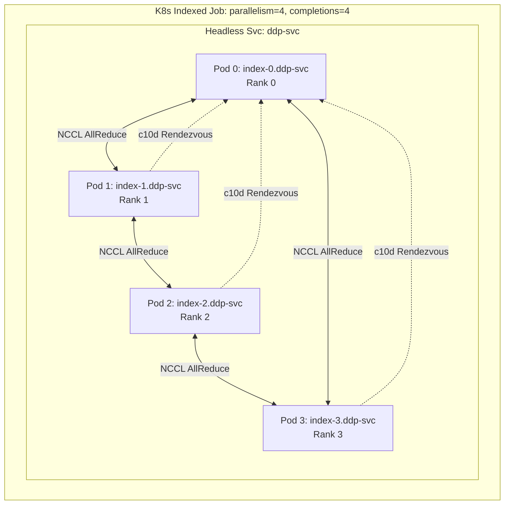
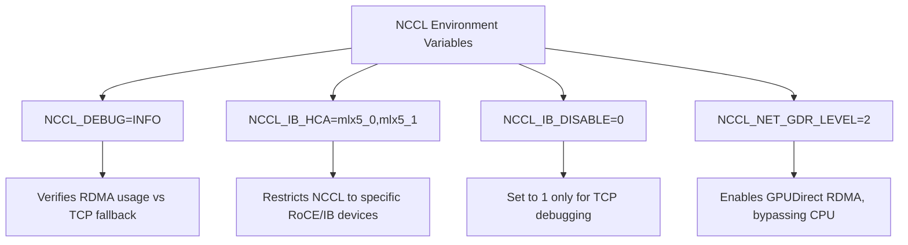

# Private AI Training Infrastructure

In late 2024, a prominent generative AI startup burned over $2.4 million in idle compute over three weeks because their vanilla Kubernetes cluster could not properly handle distributed checkpoint bursts. Every time a node experienced an ECC memory error or a transient network drop, their entire 1,024-GPU training job crashed. When the job attempted to restart, standard Kubernetes scheduling led to fragmentation—pods were distributed randomly across the cluster without regard for network topology or synchronized startup. 

Standard Kubernetes constructs—like TCP over overlay networks, default kube-scheduler behavior, and standard Ephemeral storage—fail spectacularly under the synchronous, high-bandwidth requirements of Large Language Models (LLMs). A distributed training job using PyTorch requires simultaneous execution; if 99 percent of pods are running but 1 percent are pending, the entire cluster idles indefinitely, waiting for the rendezvous.

This module details how to architect and operate a Kubernetes cluster tailored for distributed training paradigms (PyTorch DDP/FSDP, JAX), focusing on kernel-bypass networking (RoCEv2/InfiniBand), gang scheduling, and NUMA-aware topology alignment. You will learn to eliminate these bottlenecks and design a resilient, high-throughput private AI platform.

## Learning Outcomes

* **Design** a topology-aware scheduling architecture to optimize inter-GPU communication across NUMA nodes and network switches.
* **Implement** PyTorch Distributed Data Parallel (DDP) workloads using Kubernetes Indexed Jobs and headless services.
* **Diagnose** NCCL over InfiniBand/RoCEv2 communication failures using Multus, SR-IOV, and RDMA metrics.
* Deploy and tune batch job schedulers (Kueue, Volcano) for fair-share GPU allocation and gang scheduling.
* **Evaluate** high-throughput checkpoint storage mechanisms to minimize synchronous training disruptions.

## Distributed Training Primitives on Kubernetes

Modern distributed training primarily uses synchronous data parallelism or model parallelism. Frameworks like PyTorch and JAX require a static cluster of workers that communicate directly with one another.

### PyTorch 2.11: DDP and FSDP2

As of April 2026, PyTorch 2.11 is the current stable PyTorch release. Understanding the evolution of its parallelism strategies is critical for infrastructure planning.

* **Distributed Data Parallel (DDP):** Copies the entire model to every GPU and splits the dataset across GPUs. Gradients are synchronized across all GPUs via a Ring-AllReduce operation after the backward pass.
* **Fully Sharded Data Parallel (FSDP2):** In PyTorch 2.11, the original FSDP1 (`FullyShardedDataParallel` class) is deprecated. FSDP2 (the `fully_shard` API, utilizing DTensor) is the current recommended distributed training API. Projects like TorchTitan use FSDP2 natively for LLM pretraining. FSDP2 provides approximately 7 percent lower GPU memory usage and approximately 1.5 percent average performance improvement over FSDP1, offering deterministic GPU memory allocation without requiring CPU synchronization.

### Mapping to Kubernetes Constructs

Distributed training frameworks require:
1. **Predictable DNS:** Workers must discover each other before training begins.
2. **Rank Awareness:** Each worker must know its index (Rank 0, Rank 1, etc.) in the global cluster. Rank 0 typically acts as the rendezvous point.
3. **Simultaneous Execution:** All workers must start simultaneously. If Rank 0 starts but Rank 5 is pending, Rank 0 will timeout and crash.

Historically, this was solved using custom operators like Kubeflow's MPIJob or PyTorchJob. In modern Kubernetes (1.34+), this is natively solved using **Indexed Jobs**.



Setting `completionMode: Indexed` ensures each Pod receives a unique index via the `JOB_COMPLETION_INDEX` environment variable. Combined with a Headless Service, Pods receive deterministic hostnames (`pod-0.headless-svc`, `pod-1.headless-svc`), perfectly aligning with PyTorch's `torchrun` elastic launch requirements.

## High-Performance Networking (NCCL and RDMA)

Kubernetes overlay networks (Calico, Cilium, Flannel) introduce CPU overhead and latency that degrade AI training performance. Multi-node GPU communication relies on the NVIDIA Collective Communications Library (NCCL). The current stable version, NCCL 2.29.7, supports both CUDA 12.x and CUDA 13.x.

To achieve line-rate multi-node scaling, NCCL must use Remote Direct Memory Access (RDMA), bypassing the OS kernel entirely. This requires either InfiniBand or RDMA over Converged Ethernet (RoCEv2). 

To provision these advanced interfaces, administrators rely on the NVIDIA Network Operator. The current stable version is v26.1.0 (released February 22, 2025), with v26.4.0-beta.2 in active development. It provides the InfiniBand SR-IOV CNI, RoCE support, and GPUDirect RDMA. Note that InfiniBand deployments using the NVIDIA Network Operator strictly require the NVIDIA DOCA Driver and a running OpenSM subnet manager as prerequisites on the fabric.

### Exposing RDMA to Pods

You cannot route RDMA traffic through a standard Kubernetes CNI overlay. You must attach secondary network interfaces directly to the Pods. This is accomplished using Multus CNI combined with the SR-IOV Network Device Plugin.

```yaml
# Example Multus NetworkAttachmentDefinition for RoCEv2
apiVersion: k8s.cni.cncf.io/v1
kind: NetworkAttachmentDefinition
metadata:
  name: roce-network
  annotations:
    k8s.v1.cni.cncf.io/resourceName: mellanox.com/cx6_rdma
spec:
  config: '{
    "cniVersion": "0.3.1",
    "name": "roce-network",
    "type": "macvlan",
    "master": "eth1",
    "ipam": {
      "type": "whereabouts",
      "range": "192.168.100.0/24"
    }
  }'
```

:::caution
**RoCEv2 Requirements:** RoCEv2 requires a lossless network fabric. You must configure Priority Flow Control (PFC) and Explicit Congestion Notification (ECN) on your Top of Rack (ToR) switches. If packets drop, RoCEv2 falls back to Go-Back-N, causing catastrophic latency spikes that stall training.
:::

> **Stop and think**: Why is it critical for the NVIDIA Network Operator to have the DOCA driver and OpenSM running before attempting an InfiniBand deployment? Without a subnet manager like OpenSM, the InfiniBand fabric remains uninitialized, and ports will stay in an inactive state, preventing any RDMA communication.

### NCCL Configuration

NCCL behavior is controlled via environment variables passed to the Pod. Below is the mapping of critical variables to ensure your application bypasses the standard network stack.

| Variable | Recommended Value | Purpose |
| :--- | :--- | :--- |
| `NCCL_DEBUG` | `INFO` | Required for verifying that NCCL is actually using RDMA and not silently falling back to TCP sockets. |
| `NCCL_IB_HCA` | `=mlx5_0,mlx5_1` | Explicitly restricts NCCL to specific InfiniBand/RoCE devices. Prefix with `=` to prevent NCCL from searching for others. |
| `NCCL_IB_DISABLE` | `0` | Set to `1` only to force TCP for debugging network isolation issues. |
| `NCCL_NET_GDR_LEVEL` | `2` | Enables GPUDirect RDMA. Allows the NIC to read/write directly to GPU memory over PCIe, bypassing the CPU entirely. |

To visualize how these variables interact with the stack:



## GPU Operators, Drivers, and Device Plugins

Managing the underlying hardware drivers on Kubernetes is handled by specialized operators. Despite the Kubernetes Device Manager component graduating to General Availability (GA) in Kubernetes 1.26, the Kubernetes Device Plugin API remains at v1beta1. It is not a stable GA API, but it forms the foundation for both NVIDIA and AMD integrations.

### NVIDIA GPU Operator

As of April 2026, the current stable version of the NVIDIA GPU Operator is v26.3.0, utilizing calendar versioning (YY.MM.PP). This operator supports Kubernetes versions 1.32 through 1.35.

NVIDIA GPU Operator v26.3.0 bundles several critical infrastructure components into a single deployment: the NVIDIA Container Toolkit 1.19.0, Kubernetes Device Plugin 0.19.0, DCGM Exporter v4.5.1–v4.8.0, Node Feature Discovery v0.18.3, DCGM 4.5.2-1, and the NVIDIA Driver Manager v0.10.0. By default, it deploys the NVIDIA driver 580.126.20, while also offering support for the 590.48.01, 570.211.01, and 535.288.01 branches.

> **Documentation Note:** The CUDA version matrix for NVIDIA GPU Operator v26.3.0 is documented in the Component Matrix page, not the release notes. Because this information resides on a separate unverified page, always consult the live Component Matrix to confirm precise CUDA compatibility before upgrading.

### AMD ROCm Ecosystem

For clusters utilizing AMD accelerators, the AMD ROCm current stable production version is 7.2.1 (released March 25, 2026). A technology preview stream (7.10.0–7.12.0) is expected to replace the production stream by mid-2026.

AMD provides a Kubernetes Device Plugin at version 1.3.1 that naturally exposes `amd.com/gpu` resources and provides automated node labeling (including device ID, VRAM, and compute unit counts). Furthermore, AMD provides a ROCm GPU Operator for Kubernetes (`github.com/ROCm/gpu-operator`), which is entirely separate from the device plugin and functions analogously to the NVIDIA GPU Operator.

## Topology-Aware Scheduling

A server with 8 GPUs does not have uniform communication bandwidth between all components. GPUs are connected via high-speed interconnects, but the NICs and CPUs are spread across different NUMA (Non-Uniform Memory Access) nodes and PCIe root complexes. If a Pod requests 4 GPUs, and the kube-scheduler assigns 2 GPUs from NUMA Node 0 and 2 GPUs from NUMA Node 1, data must traverse the UPI/QPI link between CPUs, creating a severe bottleneck.

To enforce NUMA alignment, configure the TopologyManager within the Kubelet configuration on all GPU nodes.

```yaml
# /var/lib/kubelet/config.yaml
topologyManagerPolicy: single-numa-node
topologyManagerScope: pod
```

Setting `single-numa-node` ensures the Kubelet will reject Pod admission (resulting in a TopologyAffinityError) if it cannot allocate CPUs, Memory, GPUs, and SR-IOV NICs from the exact same NUMA node. 

> **Pause and predict**: If a Kubernetes cluster has nodes with 8 GPUs split evenly across two NUMA domains, and a Pod requests 5 GPUs with a Kubelet policy of `single-numa-node`, will the Pod be scheduled? No, it will be rejected with a TopologyAffinityError, because 5 GPUs cannot be fulfilled by a single 4-GPU NUMA node.

For the NVIDIA device plugin to report NUMA topology to the Kubelet, ensure it is deployed with the `config.map` enabling `topology.mode: true`.

## Batch Schedulers and Gang Scheduling

The default kube-scheduler evaluates Pods individually. If a distributed training job requires 64 GPUs, and only 32 are available, the scheduler will place 32 Pods. The PyTorch job will hang indefinitely waiting for the remaining 32 ranks to join. Meanwhile, those 32 GPUs are allocated but idling, wasting compute and blocking other jobs. This necessitates **Gang Scheduling** (All-or-Nothing scheduling).

### Volcano

Volcano is a specialized batch scheduler for Kubernetes, running as a secondary scheduler. The current stable version is v1.14.1, released February 14, 2025, which introduced the AI-Native Unified Scheduling Platform featuring a Sharding Controller for dynamic resource pools. Volcano is CNCF's first and only official container batch scheduling project at the Incubating maturity level, accepted in April 2020 and promoted to Incubating on March 21, 2022.
* **Pros:** Deeply understands complex HPC topologies, advanced queueing, and pod grouping.
* **Cons:** Requires using custom CRDs (`PodGroup`, `Queue`) or Kubeflow MPI-Operators. It replaces standard Kubernetes scheduling logic, which can complicate cluster upgrades.

### Kueue

Kueue is a job queueing controller that sits above the kube-scheduler, rather than replacing it. 
* **Pros:** Native integration with standard K8s Job APIs. It implements gang scheduling by simply keeping the Job suspended (spec.suspend: true) until Kueue verifies that cluster quota and capacity exist for all pods in the job simultaneously. Once quota is acquired, it un-suspends the job.
* **Cons:** Less granular control over exact node-level bin-packing compared to Volcano.

**Architectural Recommendation:** Use Kueue for modern Kubernetes (1.34+) environments operating PyTorch via Indexed Jobs. It maintains standard scheduling mechanics while elegantly solving the gang admission problem.

### AI Observability and Autoscaling

To track experiments across massive scheduled runs, MLflow (current stable version 3.11.1, released April 7, 2026) offers robust AI Observability, budget policies for LLM gateways, and pickle-free model serialization. Alternatively, Weights & Biases (W&B) supports self-managed on-premises deployment via the W&B Kubernetes Operator, including air-gapped environments backed by MySQL 8, Redis, and S3-compatible storage.

For autoscaling inference workloads (not batch training), KEDA (v2.19.0, released February 2, 2025) is a CNCF graduated project with over 70 built-in scalers. However, KEDA has no native built-in GPU scaler; GPU-based autoscaling requires pointing the KEDA Prometheus scaler at DCGM Exporter endpoints.

## AI Training and Inference Workloads

### Kubeflow Trainer v2

Kubeflow Trainer (Training Operator v2) is the current stable standard. Version v2.2.0 was released on March 19, 2026. This v2 architecture natively supports PyTorch DDP, TensorFlow, JAX, XGBoost, DeepSpeed, MLX (Apple Silicon), HuggingFace, MPI, and the Flux Framework. 

Crucially, MXNet and PaddlePaddle are NOT supported runtimes in Kubeflow Trainer v2. They exist only in the legacy Training Operator v1 (final version v1.9.2). This legacy v1.9.2 operator is still included in the Kubeflow manifests bundles (such as v26.03), which requires Kubernetes 1.34 or newer. 

For frameworks requiring complex optimization strategies, DeepSpeed (current stable version 0.18.9, released March 30, 2026) provides zero-redundancy optimizers and Universal Checkpoint support. Note that the DeepSpeed repository has moved from the Microsoft organization to `github.com/deepspeedai/DeepSpeed`.

### MLPerf Benchmarks

To validate your hardware design, consult MLPerf. MLPerf Training v5.1 (published November 12, 2025) uses Llama 3.1 8B (NLP) and Flux.1 (Image Generation) as its benchmark workloads. MLPerf Inference v6.0 (published April 1, 2026) measures text-to-video generation, GPT-OSS 120B, DeepSeek-R1, and YOLOv11 Large.

### Serving with NVIDIA NIM

Once trained, NVIDIA NIM microservices can be self-hosted on private on-premises infrastructure via the NIM Operator for Kubernetes. While NVIDIA Developer Program members can self-host on up to 16 GPUs at no cost, NVIDIA NIM is not open-source software; production deployments require a commercial NVIDIA AI Enterprise license.

### Multi-Tenancy Considerations

For organizations operating multiple isolated teams on massive bare-metal clusters, KubeRay and vCluster are prevalent tools. KubeRay (current stable v1.6.0, released March 19, 2026) manages Ray clusters natively.

> **Project Status Verification:** While widely adopted, claims that KubeRay is an official CNCF sandbox or incubating project could not be independently verified against authoritative CNCF registries. 
> 
> **Capability Warning:** vCluster (Loft) current stable version is v0.33.1 (released March 26, 2025). However, claims that it supports direct GPU resource passthrough from host cluster to virtual clusters remain unverified based on primary release documentation. Validate hardware passthrough capabilities before deploying AI workloads on vCluster.

## Checkpoint Storage

Long-running LLM training jobs fail. Hardware faults, ECC memory errors, or network blips will crash a rank. Because training is synchronous, if one rank crashes, the entire job halts and must be restarted.

State is preserved via frequent checkpointing. Checkpointing 100GB+ of model state from multiple nodes simultaneously creates massive storage I/O bursts.

1. **Avoid standard CSI block storage (EBS/RBD):** Writing a 200GB checkpoint synchronously across 64 nodes to an object store or standard block storage can pause training for 15+ minutes per checkpoint.
2. **Parallel File Systems:** Mount a high-performance distributed file system (Lustre, WEKA, or optimized CephFS) directly into the Pods.
3. **Asynchronous Checkpointing:** Write checkpoints directly to host-local NVMe drives using Kubernetes `HostPath` or local volume provisioners. Run a daemonset on the node that asynchronously flushes these NVMe checkpoints to durable object storage (S3/MinIO) in the background, allowing the GPUs to resume computing immediately.

## Did You Know?

* **Did You Know?** The Volcano batch scheduler was accepted into the CNCF on April 9, 2020, and was successfully promoted to Incubating status on March 21, 2022.
* **Did You Know?** MLPerf Training v5.1, published November 12, 2025, saw an 86 percent increase in multi-node submissions compared to v4.1, reflecting the industry shift toward massive distributed clusters.
* **Did You Know?** Switching from PyTorch FSDP1 to FSDP2 in PyTorch 2.11 provides an average of 7 percent lower GPU memory usage and a 1.5 percent overall performance improvement.
* **Did You Know?** DeepSpeed version 0.18.9 was released on March 30, 2026, introducing Universal Checkpoint support for AutoTP and robust ROCm architecture detection.

## Common Mistakes & Practitioner Gotchas

Before analyzing the table of common mistakes, consider the most prevalent networking race condition:

### 4. Headless Service Propagation Delay
**Context:** The K8s Indexed job creates Pods instantly. Rank 1 boots, resolves `pod-0.headless-svc`, and gets an NXDOMAIN because CoreDNS hasn't updated its cache yet. The elastic launch agent will crash immediately.
**Fix:** Use an init container with a simple `until nslookup pod-0.headless-svc; do sleep 1; done` bash loop to ensure DNS propagation is complete before the main training container starts.

| Mistake | Why It Happens | How to Fix It |
| :--- | :--- | :--- |
| **NCCL Silent Fallback to TCP** | RDMA initialization fails due to misconfigured VFs or missing drivers. NCCL does not crash; it quietly falls back to TCP over the standard CNI overlay. | **Fix:** Always inject `NCCL_DEBUG=INFO` into training pods. Use a sidecar or log aggregator to explicitly parse for `NCCL INFO NET/IB : Using` vs `NCCL INFO NET/Socket`. |
| **OOMKills During Model Save** | **Context:** Distributed frameworks frequently aggregate the model state to Rank 0 to write the checkpoint. If Rank 0 doesn't have enough RAM to hold the entire aggregated state, the node crashes. | **Fix:** Use `torch.distributed.checkpoint` (DCP) for PyTorch to save sharded checkpoints. Every GPU writes its local shard directly to storage, avoiding memory aggregation on Rank 0 entirely. |
| **MTU Mismatches on Secondary Interfaces** | RoCEv2 strictly requires an MTU of 9000 (jumbo frames). Default Macvlan configs often deploy with an MTU of 1500, causing packet fragmentation that destroys RDMA throughput. | Explicitly define the MTU in the Multus NetworkAttachmentDefinition JSON payload to match the physical Top of Rack switch configurations. |
| **Using topologyManagerPolicy: restricted** | Administrators assume `restricted` is safer than `single-numa-node`, but it allows pods to be scheduled across multiple NUMA domains if a single domain is full, causing immense interconnect lag. | Force `single-numa-node` on all GPU nodes. A pending pod waiting for unified capacity is vastly preferable to a running pod that bottlenecks the entire cluster. |
| **Using KEDA for Batch Gang Scheduling** | Engineers mistakenly assume KEDA can hold pods in a pending state until resources are free, based on its popularity for event-driven autoscaling. | Use Kueue or Volcano. KEDA is an event-driven autoscaler for stateless deployments, not a batch queueing system capable of all-or-nothing scheduling. |
| **Upgrading to Kubeflow Trainer v2 for MXNet** | Upgrading blindly to Trainer v2 breaks legacy pipelines because support for legacy frameworks like PaddlePaddle and MXNet was entirely stripped out. | Run the legacy v1.9.2 operator alongside v2 in your Kubernetes 1.34+ cluster if MXNet support is still a strict operational requirement. |
| **Assuming NVIDIA NIM is fully Open Source** | Developers confuse the free developer tier (up to 16 GPUs) with open-source licensing, leading to compliance violations in production environments. | Secure NVIDIA AI Enterprise licensing for all production NIM deployments, as the containers rely on proprietary commercial optimizations. |

## Hands-on Lab: Gang Scheduling PyTorch DDP with Kueue

This lab simulates a distributed PyTorch training job using standard Kubernetes Indexed Jobs and Kueue. We will force the job to use the CPU `gloo` backend so it runs entirely in `kind` without requiring physical GPUs.

### Prerequisites
* `kind` cluster running Kubernetes 1.34+
* `kubectl` and `helm` installed

### Step 1: Install Kueue

Install Kueue to manage our job admission and gang scheduling.

```bash
VERSION="v0.9.1"
kubectl apply --server-side -f https://github.com/kubernetes-sigs/kueue/releases/download/v0.9.1/manifests.yaml

# Wait for Kueue controller to be ready
kubectl rollout status deployment/kueue-controller-manager -n kueue-system
```

### Step 2: Configure Cluster Resources (Kueue)

Create a dummy ResourceFlavor and a ClusterQueue. We will mock capacity for 4 CPUs.

```bash
cat <<EOF | kubectl apply -f -
apiVersion: kueue.x-k8s.io/v1beta1
kind: ResourceFlavor
metadata:
  name: default-flavor
---
apiVersion: kueue.x-k8s.io/v1beta1
kind: ClusterQueue
metadata:
  name: cluster-queue
spec:
  namespaceSelector: {}
  resourceGroups:
  - coveredResources: ["cpu"]
    flavors:
    - name: default-flavor
      resources:
      - name: "cpu"
        nominalQuota: 4
---
apiVersion: kueue.x-k8s.io/v1beta1
kind: LocalQueue
metadata:
  name: user-queue
  namespace: default
spec:
  clusterQueue: cluster-queue
EOF
```

### Step 3: Create Headless Service for Worker Discovery

PyTorch needs a stable DNS entry to resolve all worker IP addresses.

```bash
cat <<EOF | kubectl apply -f -
apiVersion: v1
kind: Service
metadata:
  name: pytorch-ddp-svc
  namespace: default
spec:
  clusterIP: None
  selector:
    job-name: pytorch-ddp
EOF
```

### Step 4: Deploy the Indexed Job

This job runs `torchrun` explicitly configured for a 2-node cluster. Notice the `kueue.x-k8s.io/queue-name` label, which signals Kueue to manage admission.

```bash
cat <<EOF | kubectl apply -f -
apiVersion: batch/v1
kind: Job
metadata:
  name: pytorch-ddp
  labels:
    kueue.x-k8s.io/queue-name: user-queue
spec:
  completions: 2
  parallelism: 2
  completionMode: Indexed
  template:
    spec:
      subdomain: pytorch-ddp-svc
      containers:
      - name: worker
        image: pytorch/pytorch:2.2.0-cuda12.1-cudnn8-runtime
        resources:
          requests:
            cpu: "1"
        command:
        - "torchrun"
        - "--nnodes=2"
        - "--nproc_per_node=1"
        - "--node_rank=\$(JOB_COMPLETION_INDEX)"
        - "--rdzv_id=dojo"
        - "--rdzv_backend=c10d"
        - "--rdzv_endpoint=pytorch-ddp-0.pytorch-ddp-svc:29500"
        - "-c"
        - |
          import torch
          import torch.distributed as dist
          dist.init_process_group('gloo')
          print(f'SUCCESS: Rank {dist.get_rank()} of {dist.get_world_size()} initialized.')
          dist.barrier()
      restartPolicy: Never
EOF
```

### Step 5: Verification

Verify Kueue admitted the job and both pods are running simultaneously (Gang Scheduling).

```bash
kubectl get workloads
# Expected output:
# NAME                QUEUE        ADMITTED BY     AGE
# job-pytorch-ddp...  user-queue   cluster-queue   15s

kubectl get pods -l job-name=pytorch-ddp
# Both pods should transition to Running, then Completed.
```

Check the logs of the secondary worker (Rank 1) to confirm successful rendezvous with Rank 0 over the Kubernetes network:

```bash
kubectl logs -l job-name=pytorch-ddp | grep SUCCESS
# Expected output:
# SUCCESS: Rank 0 of 2 initialized.
# SUCCESS: Rank 1 of 2 initialized.
```

### Troubleshooting
* **Pods stuck in Pending:** Check `kubectl describe workload job-pytorch-ddp`. If Kueue hasn't admitted it, ensure your `LocalQueue` and `ClusterQueue` have enough `nominalQuota` for the sum of all pod requests.
* **Connection Refused in Logs:** Ensure the Headless Service name exactly matches the subdomain in the job template and the `--rdzv_endpoint` flag.

## Quiz

<details>
<summary><b>1. A multi-node PyTorch job starts, but the training immediately drops to a fraction of expected throughput. Network monitoring shows zero traffic on the secondary RoCEv2 interfaces, but heavy traffic on the Calico network. What is the most likely cause?</b></summary>
An RDMA initialization failure caused NCCL to silently fall back to TCP sockets. When RoCEv2 interfaces are misconfigured (e.g., MTU mismatches or missing drivers), NCCL does not crash the training job. Instead, it quietly routes traffic over the primary Kubernetes CNI, which is not designed for line-rate GPU synchronization. You must inject `NCCL_DEBUG=INFO` to monitor for these silent fallbacks and ensure `NET/IB` is actively being utilized.
</details>

<details>
<summary><b>2. You are migrating legacy workloads from Kubeflow Training Operator v1 to Trainer v2.2.0. The pipeline utilizes MXNet for computer vision tasks and PyTorch for NLP. What architectural adjustment must you make?</b></summary>
You must maintain the legacy v1 operator for the MXNet workloads. Kubeflow Trainer v2.2.0 completely dropped support for both MXNet and PaddlePaddle, focusing instead on frameworks like JAX, PyTorch, and DeepSpeed. You can run the final legacy v1.9.2 operator concurrently with v2 on Kubernetes 1.34+ to ensure all workloads continue functioning without disruption.
</details>

<details>
<summary><b>2b. A distributed training framework requires each worker pod to know its exact rank (0, 1, 2) before startup, and Rank 0 must be reachable at a predictable internal DNS address by all other ranks. Standard Deployments generate random pod hashes. Which specific Kubernetes API pattern should you use to satisfy this requirement?</b></summary>
You must use an Indexed Job combined with a Headless Service. The `completionMode: Indexed` field assigns a deterministic `JOB_COMPLETION_INDEX` to each pod, and the Headless Service provides predictable DNS records like `pod-0.headless-svc` for the rendezvous point.
</details>

<details>
<summary><b>3. You have a cluster where multiple data science teams submit PyTorch workloads. Frequently, jobs hang in an incomplete state because Team A's job occupies half the cluster, and Team B's job occupies the other half. Neither has enough GPUs to start their training loops. Which technology directly solves this?</b></summary>
- [x] D) Kueue Gang Scheduling. 
Kueue prevents this deadlock by suspending jobs until the full requested quota is available across the cluster. It ensures an all-or-nothing scheduling paradigm, preventing partial pod deployments from fragmenting the GPU pool and causing mutual starvation.
</details>

<details>
<summary><b>4. You are tasked with upgrading your PyTorch 2.11 training scripts to reduce GPU memory pressure during the backward pass without incurring CPU synchronization overhead. Which parallelism strategy should you implement?</b></summary>
You should transition from FSDP1 to FSDP2 (the `fully_shard` API utilizing DTensor). FSDP1 is officially deprecated in PyTorch 2.11. FSDP2 provides approximately 7 percent lower GPU memory usage and faster overall performance by sharding parameters differently, operating efficiently without the legacy CPU synchronization penalties.
</details>

<details>
<summary><b>5. A GPU node contains 8 GPUs split across two NUMA nodes. The Kubelet topologyManagerPolicy is set to single-numa-node. A researcher submits a Pod requesting 6 GPUs. What is the resulting behavior?</b></summary>
The Kubelet will reject the pod entirely, resulting in a TopologyAffinityError. Because the policy strictly enforces that all requested resources (GPUs, CPUs, Memory, SR-IOV interfaces) must reside on a single NUMA node, and the node only has 4 GPUs per NUMA domain, the 6-GPU request cannot be fulfilled locally without crossing the interconnect. 
</details>

<details>
<summary><b>6. A newly deployed RoCEv2 fabric experiences severe latency spikes during the PyTorch AllReduce phase. Network metrics show no physical link errors, but high rates of Go-Back-N retransmissions. What switch-level configuration is most likely missing?</b></summary>
The Top of Rack (ToR) switches are likely missing Priority Flow Control (PFC) and Explicit Congestion Notification (ECN). RoCEv2 requires a lossless fabric; without these mechanisms, any microburst congestion leads to packet drops and catastrophic Go-Back-N fallback.
</details>

<details>
<summary><b>7. You want to implement an event-driven autoscaler that scales up an inference Deployment when the queue of pending requests in an LLM gateway grows. A junior engineer suggests deploying the Volcano scheduler to handle this. Is this the correct approach?</b></summary>
No, Volcano is the wrong tool for this scenario. Volcano is a batch scheduler designed for queueing and gang-scheduling finite training jobs. For scaling stateless inference Deployments based on event queues or external metrics, you should deploy KEDA (Kubernetes Event-driven Autoscaling) using its Prometheus scaler to evaluate the gateway metrics dynamically.
</details>

## Further Reading

* [Kubernetes Documentation: Indexed Jobs](https://kubernetes.io/docs/concepts/workloads/controllers/job/#completion-mode)
* [Kueue Official Documentation](https://kueue.sigs.k8s.io/docs/concepts/)
* [PyTorch Documentation: torchrun (Elastic Launch)](https://pytorch.org/docs/stable/elastic/run.html)
* [NVIDIA NCCL Documentation: Environment Variables](https://docs.nvidia.com/deeplearning/nccl/user-guide/docs/env.html)
* [Kubelet Topology Manager Options](https://kubernetes.io/docs/tasks/administer-cluster/topology-manager/)

## Next Module

Now that you have established a resilient, topology-aware bare-metal cluster with kernel-bypass networking, it is time to optimize the application layer. In the next module, **[Module 9.3: Advanced Checkpointing and Fault Tolerance](./module-9.3-checkpointing)**, we will dive into asynchronous snapshotting mechanisms using distributed parallel file systems like WEKA and Lustre to eliminate synchronous I/O pauses entirely.