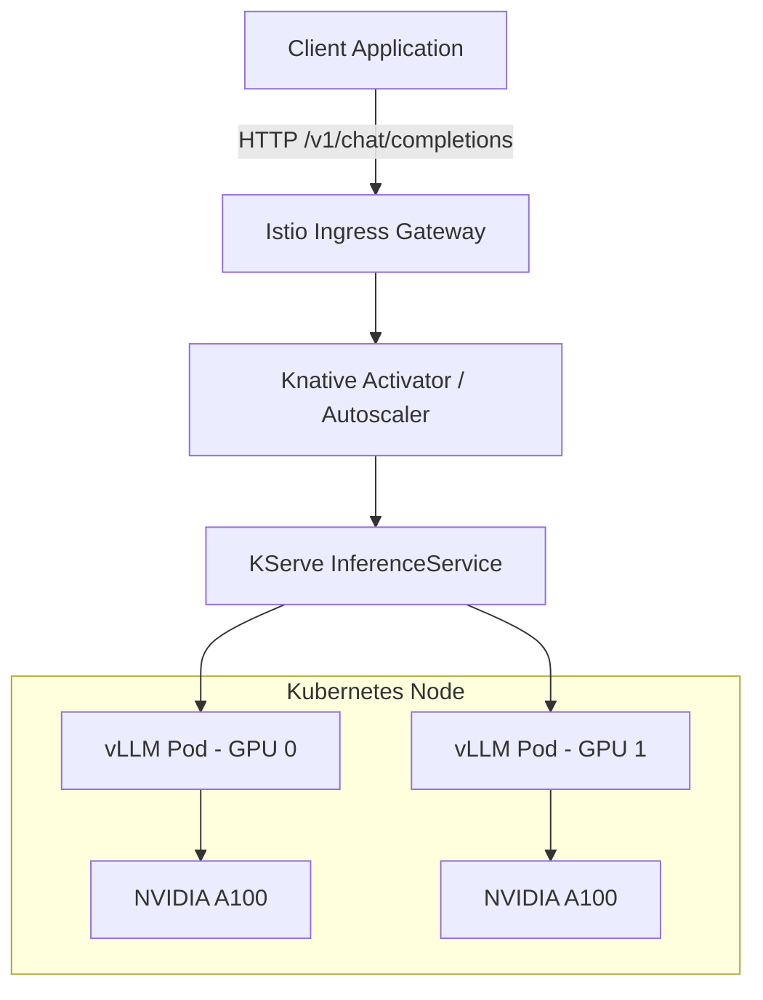

# Private LLM Serving

Operating Large Language Models (LLMs) on bare-metal Kubernetes shifts the operational bottleneck from CPU and network I/O to GPU memory bandwidth and interconnect speed. Private LLM serving requires specialized inference engines capable of managing the KV cache, batching requests dynamically, and handling asynchronous token streaming. 

This module covers the operational primitives for serving open-weights models (Llama 3, Mixtral, Qwen) on proprietary infrastructure using engines like vLLM and Text Generation Inference (TGI), wrapped in orchestrators like KServe.

## Learning Outcomes

* Deploy and configure vLLM and Text Generation Inference (TGI) as containerized workloads on bare-metal Kubernetes.
* Configure continuous batching and PagedAttention to maximize GPU memory utilization and token throughput.
* Compare and implement quantization formats (AWQ, GPTQ, FP8) to fit models into memory-constrained GPU environments.
* Architect autoscaling inference workloads using KServe, Knative, and custom Prometheus metrics (e.g., KV cache usage, queue length).
* Diagnose GPU out-of-memory (OOM) errors and optimize model parallel execution across multiple GPUs using Tensor Parallelism.

## The Physics of LLM Inference

LLM inference consists of two distinct phases. Understanding these phases is critical for tuning deployment manifests.

1. **Prefill Phase (Time to First Token - TTFT):** The model processes the input prompt all at once. This phase is heavily **compute-bound**. The GPU matrix multiplication units (Tensor Cores) are fully saturated.
2. **Decode Phase (Time Per Output Token - TPOT):** The model generates tokens one by one autoregressively. Each new token requires reading the entire model weights and the attention KV cache from GPU High Bandwidth Memory (HBM) into the compute cores. This phase is heavily **memory-bandwidth-bound**.

Because the decode phase underutilizes compute but maxes out memory bandwidth, serving a single request sequentially is highly inefficient. Inference engines group multiple requests together (batching) to read the model weights once and apply them to multiple sequences simultaneously.

### Continuous Batching and PagedAttention

Traditional static batching required all requests in a batch to finish before a new batch could start, leading to wasted cycles when sequence lengths varied. Modern inference relies on **Continuous Batching** (also known as in-flight batching). As soon as one sequence in a batch emits its end-of-sequence (EOS) token, a new prompt from the queue is immediately swapped into the batch.

To support continuous batching without memory fragmentation, engines use **PagedAttention**. Similar to operating system virtual memory, PagedAttention divides the KV cache into fixed-size blocks (pages). 

:::note
When configuring vLLM, the `gpu-memory-utilization` flag (default `0.9`) reserves a block of GPU HBM upfront for the KV cache. If you set this too high on a shared GPU, the PyTorch context initialization will OOM. If you set it too low, your batch sizes will be artificially constrained, tanking throughput.
:::

## Inference Engine Landscape

Selecting the right engine dictates your container configuration, available metrics, and hardware utilization limits.

| Feature / Engine | vLLM | Text Generation Inference (TGI) | Ollama |
| :--- | :--- | :--- | :--- |
| **Primary Use Case** | High-throughput production serving | Production serving (Hugging Face ecosystem) | Local dev, edge, simple low-scale deployments |
| **KV Cache Mgmt** | PagedAttention | PagedAttention | Static / Basic |
| **Quantization** | AWQ, GPTQ, FP8, Marlin | AWQ, GPTQ, EETQ, BitsAndBytes | GGUF |
| **API Format** | OpenAI Compatible API | Custom REST, OpenAI wrapper available | Custom REST, OpenAI compatible API |
| **Multi-GPU** | Tensor Parallelism (Ray/NCCL) | Tensor Parallelism (NCCL) | Limited/Basic |
| **Metrics** | Prometheus endpoint built-in | Prometheus endpoint built-in | None native (requires exporters) |

For bare-metal production, **vLLM** and **TGI** are the standard choices. Ollama is excellent for developer laptops but lacks the granular memory management and telemetry required for scalable cluster operations.

### Multi-GPU Scaling: Tensor Parallelism vs. Pipeline Parallelism

When a model's weights exceed the memory of a single GPU (e.g., a 70B parameter model in FP16 requires ~140GB of VRAM, exceeding an 80GB A100), the model must be split.

* **Tensor Parallelism (TP):** Slices individual matrix operations across multiple GPUs. Requires high-bandwidth interconnects (NVLink) between GPUs. In Kubernetes, this means the GPUs *must* reside on the same physical node. Configured via `--tensor-parallel-size` in vLLM.
* **Pipeline Parallelism (PP):** Slices the model by layers (e.g., layers 1-40 on GPU 1, 41-80 on GPU 2). Can span across nodes via network interfaces, but introduces pipeline bubbles (idle time). Configured via `--pipeline-parallel-size`.

## Quantization Strategies for Bare Metal

If you cannot afford 8xH100 nodes, quantization is your primary lever. It reduces the precision of the model weights, slashing VRAM requirements and increasing memory bandwidth efficiency (which speeds up the decode phase).

1. **FP16 / BF16:** Unquantized baseline. Safe, zero degradation.
2. **AWQ (Activation-aware Weight Quantization):** 4-bit weight quantization. Excellent balance of speed and VRAM reduction with negligible perplexity degradation. **Highly recommended for vLLM.**
3. **GPTQ:** An older 4-bit weight quantization method. Slightly slower decode speeds compared to AWQ on modern kernels.
4. **FP8:** The emerging standard for Hopper (H100) architecture. Requires hardware support but offers the best throughput without the calibration overhead of AWQ/GPTQ.
5. **GGUF:** Used primarily by `llama.cpp` and Ollama. Heavily optimized for CPU and Apple Silicon, but less performant for high-batch GPU serving compared to AWQ/FP8 on vLLM.

:::caution
Do not use `BitsAndBytes` (LLM.int8()) for production serving. It is designed for training (LoRA fine-tuning) and its inference kernels are slow, leading to high latency. Use AWQ or GPTQ pre-quantized models instead.
:::

## Orchestrating with KServe

Running raw Deployments of vLLM works, but managing autoscaling based on hardware metrics and routing traffic to specific model versions becomes complex. **KServe** provides a Kubernetes Custom Resource Definition (CRD) to standardize model serving.

KServe relies on Knative Serving for scale-to-zero and request-based autoscaling, and integrates with Istio for traffic splitting.



### Autoscaling Metrics

CPU and Memory metrics are useless for LLM autoscaling. LLM containers allocate all available VRAM at startup (due to PagedAttention) and often peg the CPU handling the event loop.

You must scale on:
1. **Concurrency/Queue Length:** The number of pending requests waiting in the vLLM scheduler queue. If the queue length exceeds a threshold (e.g., 50), trigger a scale-up.
2. **KV Cache Utilization:** Exposed by vLLM as `vllm:gpu_cache_usage_perc`. If cache usage stays >90%, the node is thrashing and dropping requests; scale up.

KServe abstracts this by hooking into Knative's concurrency metrics.

## Hands-on Lab: Deploying a Quantized Model with vLLM

In this lab, we will deploy a 4-bit AWQ quantized Llama 3 8B model using vLLM on a Kubernetes node with an NVIDIA GPU.

### Prerequisites

* A Kubernetes cluster with the NVIDIA Device Plugin installed and functional.
* At least one node with 1x NVIDIA GPU (T4, A10g, A100, etc.) having a minimum of 16GB VRAM.
* `kubectl` configured.

### Step 1: Create the vLLM Deployment

We will deploy vLLM, instructing it to download the `casperhansen/llama-3-8b-instruct-awq` model directly from the Hugging Face Hub.

Create a file named `vllm-deployment.yaml`:

```yaml
apiVersion: apps/v1
kind: Deployment
metadata:
  name: vllm-llama3-8b
  namespace: default
  labels:
    app: vllm
spec:
  replicas: 1
  selector:
    matchLabels:
      app: vllm
  template:
    metadata:
      labels:
        app: vllm
      annotations:
        prometheus.io/scrape: "true"
        prometheus.io/port: "8000"
        prometheus.io/path: "/metrics"
    spec:
      containers:
      - name: vllm
        image: vllm/vllm-openai:v0.5.0.post1
        command: ["python3", "-m", "vllm.entrypoints.openai.api_server"]
        args:
        - "--model"
        - "casperhansen/llama-3-8b-instruct-awq"
        - "--quantization"
        - "awq"
        - "--gpu-memory-utilization"
        - "0.85"
        - "--max-model-len"
        - "4096"
        - "--port"
        - "8000"
        env:
        - name: HUGGING_FACE_HUB_TOKEN
          valueFrom:
            secretKeyRef:
              name: hf-token-secret
              key: token
              optional: true # Only needed for gated models
        ports:
        - containerPort: 8000
          name: http
        resources:
          limits:
            nvidia.com/gpu: "1"
            memory: "32Gi"
            cpu: "4"
          requests:
            nvidia.com/gpu: "1"
            memory: "16Gi"
            cpu: "2"
        volumeMounts:
        - mountPath: /root/.cache/huggingface
          name: cache-volume
        - mountPath: /dev/shm
          name: dshm
      volumes:
      - name: cache-volume
        emptyDir: {}
      - name: dshm
        emptyDir:
          medium: Memory
          sizeLimit: 2Gi
```

:::tip
**Why `/dev/shm`?**
PyTorch uses shared memory for inter-process communication, especially when using Tensor Parallelism (NCCL). The default Kubernetes Docker/containerd shm size is 64MB, which will cause NCCL to crash under load. Always mount a memory-backed `emptyDir` to `/dev/shm` with at least 2Gi for LLM workloads.
:::

Apply the deployment:

```bash
kubectl apply -f vllm-deployment.yaml
```

### Step 2: Create the Service

Expose the deployment internally within the cluster.

```yaml
# vllm-service.yaml
apiVersion: v1
kind: Service
metadata:
  name: vllm-service
  namespace: default
spec:
  selector:
    app: vllm
  ports:
  - protocol: TCP
    port: 80
    targetPort: 8000
```

```bash
kubectl apply -f vllm-service.yaml
```

### Step 3: Verify the Deployment

Downloading the model weights (approx 5-6GB for a 4-bit 8B model) takes time. Watch the logs to verify the engine starts successfully.

```bash
# Check pod status
kubectl get pods -l app=vllm

# Follow logs
kubectl logs -f deployment/vllm-llama3-8b
```

You are looking for a log line indicating the server is ready, such as:
`INFO 06-12 10:45:12 api_server.py:122] Uvicorn running on http://0.0.0.0:8000`

### Step 4: Test the OpenAI-Compatible Endpoint

Port-forward the service to your local machine:

```bash
kubectl port-forward svc/vllm-service 8080:80
```

In a new terminal, send a request using `curl` formatted exactly like an OpenAI API call:

```bash
curl -X POST http://localhost:8080/v1/chat/completions \
  -H "Content-Type: application/json" \
  -d '{
    "model": "casperhansen/llama-3-8b-instruct-awq",
    "messages": [
      {"role": "system", "content": "You are a Kubernetes expert."},
      {"role": "user", "content": "Explain what a DaemonSet is in one sentence."}
    ],
    "max_tokens": 100,
    "temperature": 0.2
  }'
```

**Expected Output:**
A JSON response containing the generated text within the `choices[0].message.content` field.

### Troubleshooting the Lab

* **Pod stuck in `Pending`:** You likely do not have a node with `nvidia.com/gpu` available, or the NVIDIA device plugin is crashing. Run `kubectl describe pod <pod-name>`.
* **Container restarts with OOMKilled:** The node does not have enough system memory (RAM), OR the GPU VRAM is exhausted during weight loading. Lower `--gpu-memory-utilization` to `0.7` or check `dmesg` on the node.
* **Hugging Face 401 Unauthorized:** If using a gated model (like official Meta Llama weights), you must create a secret `hf-token-secret` containing your Hugging Face access token and ensure you have accepted the license agreement on the Hugging Face website.

## Practitioner Gotchas

### 1. The NCCL Timeout Crash
**Context:** When scaling vLLM across multiple GPUs using `--tensor-parallel-size > 1`, the NVIDIA Collective Communications Library (NCCL) is used to synchronize the GPUs.
**Gotcha:** If a network blip occurs or CPU contention delays a synchronization step, NCCL times out and crashes the entire pod.
**Fix:** Set the environment variable `NCCL_TIMEOUT=120` (or higher) to prevent transient latency spikes from killing the serving container. Ensure `hostIPC: true` is set on the pod spec for multi-GPU communication if not relying solely on shared memory volumes.

### 2. Context Length OOMs
**Context:** You deploy a model with a theoretical context length of 128k tokens. You test it with a 100-token prompt, and it works flawlessly.
**Gotcha:** A user submits an 80k token prompt. The KV cache allocation immediately attempts to reserve massive contiguous blocks of memory, exhausting VRAM and crashing the inference engine.
**Fix:** Hard-cap the maximum context length at the engine level using `--max-model-len`. Do not trust the model's theoretical maximum; calculate what fits in your remaining VRAM after weights are loaded, and clamp the API to that limit.

### 3. Starving the CPU Scheduler
**Context:** GPU inference is fast, but the event loop handling HTTP requests, tokenizing text, and scheduling batches runs on the CPU.
**Gotcha:** If you assign `cpu: 1` to a vLLM pod handling 500 requests/sec, the GPU will idle because the CPU cannot tokenize prompts fast enough to feed it.
**Fix:** Inference is not solely a GPU problem. Provision ample CPU limits (e.g., `cpu: 8` or `cpu: 16` for high-throughput nodes) to ensure the Python event loops and tokenizer libraries can keep the GPU saturated.

### 4. Head-of-Line Blocking with Mixed Workloads
**Context:** You serve both real-time chat requests (short prompts, short output) and background document summarization (massive prompts, long output) on the same vLLM endpoint.
**Gotcha:** The long summarization requests consume all available KV cache blocks. The continuous batching scheduler cannot accept the small chat requests until the summaries finish, causing chat latency to spike from 200ms to 45 seconds.
**Fix:** Segregate workloads. Deploy two separate KServe InferenceServices—one dedicated to low-latency chat, and one configured with high batch sizes and lower priority for background processing.

## Quiz

**1. You are running a 70B parameter model utilizing Tensor Parallelism across 4 GPUs on a single bare-metal node. The pod crashes randomly under heavy load. The logs show NCCL synchronization failures. Which configuration change is the most appropriate first step?**
- A) Switch from Tensor Parallelism to Pipeline Parallelism.
- B) Decrease `--gpu-memory-utilization` to free up VRAM for NCCL.
- C) Ensure an `emptyDir` backed by memory is mounted to `/dev/shm` with sufficient size.
- D) Increase the Knative scale-up concurrency threshold.

<details>
<summary>Answer</summary>
**Correct Answer: C**<br>
NCCL relies heavily on shared memory (`/dev/shm`) for inter-GPU communication on the same node. The default Kubernetes container runtime configuration provides a very small shared memory segment (usually 64MB), which quickly fills up under load, causing NCCL to crash.
</details>

**2. Which metric is the most reliable indicator that your vLLM deployment needs to scale out (add more replicas)?**
- A) The container's CPU utilization exceeds 85%.
- B) `vllm:gpu_cache_usage_perc` is sustained above 95% and the scheduler queue is growing.
- C) The container's Memory (RAM) utilization hits the Kubernetes limit.
- D) The GPU core temperature exceeds 80°C.

<details>
<summary>Answer</summary>
**Correct Answer: B**<br>
LLMs pre-allocate memory, so VRAM usage is static, and CPU usage is not indicative of GPU capacity. The true bottleneck is the KV cache and the queue of pending requests. When the cache is full, vLLM cannot process new requests, causing the queue to grow.
</details>

**3. A platform engineer wants to maximize the token throughput of a deployment running on A100 GPUs, but the model weights are slightly too large to fit in VRAM alongside a reasonably sized KV cache. Which quantization strategy should they adopt for production serving?**
- A) BitsAndBytes (LLM.int8())
- B) AWQ (Activation-aware Weight Quantization)
- C) GGUF
- D) Dynamic FP32 scaling

<details>
<summary>Answer</summary>
**Correct Answer: B**<br>
AWQ provides excellent 4-bit weight quantization optimized for high-throughput GPU serving in vLLM. BitsAndBytes is too slow for production inference, and GGUF is optimized for CPU/Apple Silicon rather than data-center GPUs.
</details>

**4. What is the primary operational advantage of Continuous Batching (PagedAttention) over static batching?**
- A) It allows the model weights to be paged out to system RAM when not in use.
- B) It prevents the need to calculate the attention mechanism during the prefill phase.
- C) It allows new requests to be dynamically inserted into an active batch as soon as another sequence finishes, preventing idle GPU cycles.
- D) It automatically shards the model across multiple nodes without requiring an external orchestrator.

<details>
<summary>Answer</summary>
**Correct Answer: C**<br>
Continuous batching solves the fragmentation and idle-time issues of static batching by dynamically swapping sequences in and out at the token level, drastically increasing overall throughput.
</details>

**5. You configure a vLLM deployment with `--gpu-memory-utilization 0.99`. Upon starting the pod, the container immediately crashes with an `OOMKilled` error before receiving any requests. What is the most likely cause?**
- A) The Kubernetes node ran out of physical CPU cores.
- B) Reserving 99% of VRAM for the KV cache leaves insufficient memory for PyTorch context initialization and CUDA kernels.
- C) The model weights are corrupted in the Hugging Face cache.
- D) The KServe autoscaler attempted to inject an overly large batch immediately upon startup.

<details>
<summary>Answer</summary>
**Correct Answer: B**<br>
The `--gpu-memory-utilization` flag dictates how much total VRAM vLLM will allocate *upfront* for weights and the KV cache. Setting it to 0.99 leaves almost nothing for the PyTorch runtime, NCCL, and CUDA context, resulting in an immediate Out Of Memory crash during initialization.
</details>

## Further Reading

* [vLLM Official Documentation - Architecture and PagedAttention](https://docs.vllm.ai/en/latest/models/engine_args.html)
* [Text Generation Inference (TGI) GitHub Repository](https://github.com/huggingface/text-generation-inference)
* [KServe Documentation - Autoscaling and Knative Integration](https://kserve.github.io/website/latest/modelserving/autoscaling/autoscaling/)
* [Understanding Tensor Parallelism in LLM Inference (Hugging Face Blog)](https://huggingface.co/blog/inference-endpoints-llm)
* [AWQ: Activation-aware Weight Quantization for LLM Compression and Acceleration (Research Paper)](https://arxiv.org/abs/2306.00978)