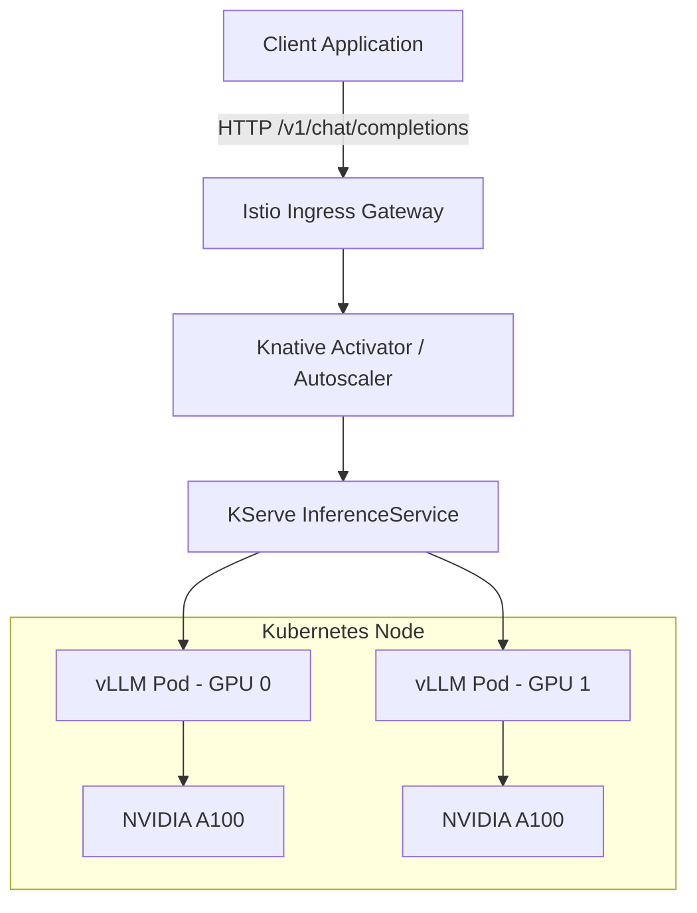

# Private LLM Serving

**Complexity:** Advanced  
**Time:** 90-120 minutes  
**Prerequisites:** Kubernetes workloads, Services, resource requests and limits, GPU scheduling basics, Prometheus metrics, container logs, basic LLM terminology

Private LLM serving means operating large language models on infrastructure your organization controls.

That sounds like a deployment problem.

It is also a capacity-planning problem.

It is also a latency problem.

It is also a security problem.

It is also a cost problem.

A cloud API hides the inference fleet behind one endpoint.

A private deployment puts the fleet in your hands.

The model weights must fit.

The KV cache must fit.

The scheduler must keep the GPU busy.

The API must behave like the application expects.

The platform must expose useful metrics before users notice degraded service.

Operating Large Language Models (LLMs) on bare-metal Kubernetes shifts the operational bottleneck from CPU and network I/O to GPU memory bandwidth and interconnect speed. Private LLM serving requires specialized inference engines capable of managing the KV cache, batching requests dynamically, and handling asynchronous token streaming.

This module teaches the operational primitives for serving open-weights models such as Llama, Mixtral, and Qwen on proprietary infrastructure using engines like vLLM and Text Generation Inference (TGI), wrapped in orchestrators like KServe.

You will start with the physics of inference.

You will then connect those constraints to Kubernetes manifests.

You will compare engine choices.

You will work through a failing deployment.

You will finish by deploying a quantized model, testing the OpenAI-compatible API, and checking the signals that tell you whether the service is healthy.

## Learning Outcomes

By the end of this module, you will be able to:

- **Design** a private LLM serving deployment that matches model size, context length, GPU memory, and expected traffic patterns.
- **Configure** vLLM runtime parameters for KV cache sizing, continuous batching, quantization, and OpenAI-compatible serving on Kubernetes.
- **Compare** vLLM, TGI, Ollama, KServe, and commercial serving options against production constraints such as throughput, observability, and multi-GPU support.
- **Debug** GPU scheduling, startup, NCCL, context-length, and autoscaling failures using Kubernetes events, logs, and serving metrics.
- **Evaluate** when to split workloads, quantize weights, add replicas, or change model parallelism to improve latency and reliability.

## Why This Module Matters

A healthcare company moves its clinical summarization assistant from a public API to an internal Kubernetes platform.

The reason is not fashion.

The assistant processes sensitive notes.

The security team requires private network paths.

The compliance team requires local auditability.

The finance team wants predictable GPU spend.

The clinicians expect the assistant to respond quickly during patient intake.

The platform team deploys an open-weights model on an on-premises GPU node.

The first demo works.

A short prompt returns a good answer.

Then production traffic arrives.

Some users send long transcripts.

Some users ask short chat questions.

Some integrations retry after a slow response.

The GPU memory looks full even when traffic is low.

The pod sometimes starts and sometimes crashes.

The application team asks for autoscaling.

The platform team discovers that CPU and RAM charts do not explain the problem.

The real bottleneck is hidden inside the inference engine.

The KV cache is filling.

The scheduler queue is growing.

The longest requests are blocking short interactive requests.

The model fits only because it was quantized.

The node has enough GPU memory for weights, but not enough headroom for the runtime.

Private LLM serving turns platform engineers into inference operators.

They must reason about memory bandwidth, token flow, request queues, GPU topology, model formats, and Kubernetes orchestration at the same time.

A private endpoint that answers one request is a demo.

A private endpoint that keeps latency predictable under mixed traffic is an infrastructure product.

That is the skill this module builds.

## The Serving Stack at a Glance

A private LLM deployment has more moving parts than a normal stateless web service.

The container does not just run application code.

It loads model weights.

It reserves GPU memory.

It starts an HTTP server.

It tokenizes prompts.

It batches requests.

It streams tokens back to clients.

It exposes engine metrics.

Kubernetes still schedules and restarts the pod, but Kubernetes does not understand token latency by default.

The inference engine is where most serving intelligence lives.

A useful mental model is to separate the stack into five layers.

```text
+-----------------------------------------------------------------------+
|                         Client Applications                           |
|  chat UI | agents | batch jobs | RAG service | internal tools          |
+-----------------------------------+-----------------------------------+
                                    |
                                    v
+-----------------------------------------------------------------------+
|                         API and Routing Layer                         |
|  Gateway API | Ingress | Service | auth proxy | rate limiter           |
+-----------------------------------+-----------------------------------+
                                    |
                                    v
+-----------------------------------------------------------------------+
|                       Model Serving Orchestrator                      |
|  KServe | Knative | raw Deployment | custom controller                |
+-----------------------------------+-----------------------------------+
                                    |
                                    v
+-----------------------------------------------------------------------+
|                         Inference Engine                              |
|  vLLM | TGI | Triton backend | NIM | Ollama for smaller use cases     |
|  batching | KV cache | token streaming | model loading | metrics       |
+-----------------------------------+-----------------------------------+
                                    |
                                    v
+-----------------------------------------------------------------------+
|                         Hardware and Runtime                          |
|  GPU | VRAM | HBM bandwidth | NVLink | NCCL | node CPU | local cache   |
+-----------------------------------------------------------------------+
```

Each layer can fail differently.

A Gateway problem may produce `503` responses.

A Service selector problem may produce no endpoints.

A scheduler problem may leave pods in `Pending`.

A model download problem may produce authorization errors.

A GPU memory problem may crash after the container starts.

A workload-mixing problem may look like random latency spikes.

This is why private LLM serving requires end-to-end reasoning.

You cannot debug it by looking at only one dashboard.

## The Physics of LLM Inference

LLM inference consists of two distinct phases.

Understanding these phases is critical for tuning deployment manifests and explaining why a GPU may be expensive but still slow.

1. **Prefill Phase (Time to First Token - TTFT):** The model processes the input prompt all at once. This phase is heavily **compute-bound**. The GPU matrix multiplication units, especially Tensor Cores on NVIDIA hardware, can be fully saturated.
2. **Decode Phase (Time Per Output Token - TPOT):** The model generates tokens one by one autoregressively. Each new token requires reading model weights and attention state from GPU High Bandwidth Memory (HBM). This phase is heavily **memory-bandwidth-bound**.

The prefill phase answers the question:

"How quickly can the model understand the prompt?"

The decode phase answers the question:

"How quickly can the model emit each next token?"

A short prompt with a long answer stresses decode.

A long document with a short answer stresses prefill and KV cache capacity.

A chatbot with many concurrent users stresses the scheduler.

A summarization system with long context windows stresses memory.

The two phases share hardware but create different bottlenecks.

Because the decode phase underutilizes compute while stressing memory bandwidth, serving one request at a time is inefficient.

The engine reads the same model weights repeatedly for one sequence.

Inference engines improve utilization by grouping multiple requests together.

The engine reads weights once and applies them to many active sequences.

This is why the serving engine matters.

A plain Python loop around `model.generate()` is not enough for production.

### Token Flow

A single request moves through the serving engine in stages.

```text
+----------------+     +----------------+     +-----------------------+
| HTTP Request   | --> | Tokenization   | --> | Prefill Prompt        |
| messages/json  |     | text -> ids    |     | compute attention     |
+----------------+     +----------------+     +-----------------------+
                                                        |
                                                        v
+----------------+     +----------------+     +-----------------------+
| HTTP Stream    | <-- | Detokenization | <-- | Decode Next Tokens    |
| chunks/json    |     | ids -> text    |     | one step at a time    |
+----------------+     +----------------+     +-----------------------+
```

The application sees an API call.

The engine sees token counts, batch slots, KV cache pages, and scheduling decisions.

A platform engineer needs both views.

The API view tells you whether the app contract works.

The engine view tells you whether the deployment can survive load.

### Continuous Batching and PagedAttention

Traditional static batching required all requests in a batch to finish before a new batch could start.

That wastes cycles when sequence lengths vary.

If one request asks for a short answer and another asks for a long answer, the short one finishes early.

In a static batch, the slot may sit idle until the long request finishes.

Modern inference relies on **Continuous Batching**, also known as in-flight batching.

As soon as one sequence emits its end-of-sequence token or reaches its output limit, a new prompt from the queue is swapped into the active batch.

The batch is not a fixed group of requests.

It is a moving set of active sequences.

That moving set keeps memory bandwidth busy.

> **Stop and think:** If continuous batching allows sequences to be swapped out dynamically, how does the engine keep track of the attention state for an incomplete sequence without running out of memory?

To support continuous batching without memory fragmentation, engines use **PagedAttention**.

Similar to operating system virtual memory, PagedAttention divides the KV cache into fixed-size blocks.

Instead of requiring one large contiguous allocation per sequence, the engine can map each sequence to a set of cache pages.

That makes it easier to add, remove, and grow sequences dynamically.

```text
+----------------------+        +--------------------------------------+
| Active Requests      |        | KV Cache Pages in GPU Memory         |
+----------------------+        +--------------------------------------+
| request-a: 280 toks  | -----> | page 01 | page 02 | page 03          |
| request-b: 920 toks  | -----> | page 08 | page 11 | page 12 | page 14|
| request-c: 64 toks   | -----> | page 05                              |
| request-d: 410 toks  | -----> | page 06 | page 07 | page 19          |
+----------------------+        +--------------------------------------+
```

The page mapping matters operationally.

If the cache has enough free pages, the engine admits more work.

If the cache is nearly full, new requests queue.

If the context length is too high for the GPU memory budget, one large request can consume enough pages to harm everyone else.

> **Pause and predict:** If you allocate nearly all GPU memory to the KV cache, what will happen when PyTorch tries to initialize its CUDA context?

:::note
When configuring vLLM, the `gpu-memory-utilization` flag reserves a portion of GPU HBM for model execution and KV cache planning. If you set this too high on a shared or tightly sized GPU, PyTorch, CUDA, and communication libraries may not have enough headroom to initialize. If you set it too low, your batch sizes will be artificially constrained, reducing throughput.
:::

The value is not a moral preference.

It is a capacity tradeoff.

Higher utilization can increase the number of active tokens.

Higher utilization can also make startup fragile.

Lower utilization can leave memory unused.

Lower utilization can also keep the service stable during model load and runtime spikes.

### The Four Numbers That Decide Whether a Model Fits

Before writing a Deployment manifest, estimate four numbers.

First, estimate model weight memory.

Second, estimate KV cache memory.

Third, reserve runtime overhead.

Fourth, confirm the node has enough CPU and system RAM to feed the GPU.

A rough model-weight estimate is:

```text
parameter_count * bytes_per_parameter
```

Examples:

```text
8B model in FP16  ~= 16 GB for weights
8B model in 4-bit ~= 4-6 GB for weights, depending on format and metadata
70B model in FP16 ~= 140 GB for weights
70B model in 4-bit ~= 35-45 GB for weights, depending on format and metadata
```

These are planning numbers, not exact vendor promises.

The exact footprint depends on architecture, quantization format, runtime kernels, and loaded adapters.

The KV cache depends on:

- number of layers
- hidden size
- number of concurrent sequences
- context length
- dtype used for cache
- batching strategy

A useful operational rule is:

If a model barely fits at startup, it may still fail under real prompts.

Startup proves the weights fit.

Serving proves the weights and cache fit together.

### Latency Metrics That Actually Matter

Private LLM serving teams often start with average response time.

Average response time is too blunt.

Use metrics that separate user experience from engine mechanics.

| Metric | What It Means | Why It Matters |
| :--- | :--- | :--- |
| TTFT | Time to first token | Determines how quickly users feel the model responded |
| TPOT | Time per output token | Determines streaming speed after generation starts |
| End-to-end latency | Total request duration | Matters for non-streaming calls and batch jobs |
| Tokens per second | Aggregate generated token throughput | Shows fleet capacity |
| Queue time | Time spent waiting before execution | Reveals saturation before hard failures |
| KV cache usage | Portion of cache pages in use | Predicts admission pressure and OOM risk |
| Error rate | Failed or rejected requests | Reveals overload, auth, routing, or runtime failures |

Do not tune only for maximum tokens per second.

A batch summarization service may value throughput.

An interactive chat service may value low TTFT.

A retrieval-augmented generation service may value consistent tail latency.

The same GPU can be configured differently for each.

## Inference Engine Landscape

Selecting the right engine dictates your container configuration, available metrics, request API, model format, and hardware utilization limits.

| Feature / Engine | vLLM | Text Generation Inference (TGI) | Ollama |
| :--- | :--- | :--- | :--- |
| **Primary Use Case** | High-throughput production serving | Production serving (Hugging Face ecosystem) | Local dev, edge, simple low-scale deployments |
| **KV Cache Mgmt** | PagedAttention | PagedAttention | Static / Basic |
| **Quantization** | AWQ, GPTQ, FP8, Marlin | AWQ, GPTQ, EETQ, BitsAndBytes | GGUF |
| **API Format** | OpenAI Compatible API | Custom REST, OpenAI wrapper available | Custom REST, OpenAI compatible API |
| **Multi-GPU** | Tensor Parallelism (Ray/NCCL) | Tensor Parallelism (NCCL) | Limited/Basic |
| **Metrics** | Prometheus endpoint built-in | Prometheus endpoint built-in | None native (requires exporters) |

For bare-metal production, **vLLM** and **TGI** are common choices.

vLLM is often selected when the platform team wants aggressive continuous batching, OpenAI-compatible serving, and strong throughput on GPU-backed workloads.

TGI is often selected when the team is already deep in the Hugging Face ecosystem and wants a production server with good model-hub integration.

Ollama is useful for local development, small internal tools, or edge-style deployments.

It is usually not the first choice for a high-concurrency shared enterprise endpoint.

Commercial alternatives are also common in enterprise Kubernetes environments.

**NVIDIA NIM** packages optimized inference containers and operational guidance for supported models.

**NVIDIA Triton Inference Server** can serve multiple model backends, including TensorRT-LLM and vLLM-style paths depending on the deployment pattern.

These can be valuable when vendor support, standardized packaging, or integration with NVIDIA tooling matters more than maximum flexibility.

### Decision Matrix

Choose based on the workload, not only the benchmark.

| Constraint | Good Fit | Why |
| :--- | :--- | :--- |
| Many concurrent chat requests | vLLM | Continuous batching and OpenAI-compatible API are strong defaults |
| Hugging Face model lifecycle | TGI | Tight ecosystem integration and production-ready serving patterns |
| Local developer testing | Ollama | Simple model pull and local API experience |
| Enterprise vendor support | NIM or Triton | Packaged runtime and platform support can reduce operational burden |
| Multi-model inference platform | KServe plus selected runtimes | Controller layer can standardize routing and rollout patterns |
| Highest control over manifests | Raw Deployments | Fewer abstractions, but more platform work |

A senior operator should be able to explain why an engine was chosen.

"Everyone uses it" is not enough.

A defensible answer includes model support, metrics, batching, API contract, GPU topology, operational skill, and failure behavior.

### OpenAI-Compatible APIs

Many private deployments expose OpenAI-compatible endpoints.

This is operationally useful.

Applications can switch from a public API to a private endpoint with smaller code changes.

SDKs, proxies, and internal tools often already understand the request format.

A typical chat request looks like this:

```bash
curl -X POST http://127.0.0.1:8080/v1/chat/completions \
  -H "Content-Type: application/json" \
  -d '{
    "model": "casperhansen/llama-3-8b-instruct-awq",
    "messages": [
      {"role": "system", "content": "You answer with concise Kubernetes guidance."},
      {"role": "user", "content": "Explain why a DaemonSet is useful for node agents."}
    ],
    "max_tokens": 120,
    "temperature": 0.2
  }'
```

The API shape hides important internal differences.

Two endpoints may both accept `/v1/chat/completions`.

One may have excellent streaming latency.

One may queue badly under long prompts.

One may expose useful Prometheus metrics.

One may have weak visibility into cache pressure.

Compatibility is the starting point.

Operational behavior is the deciding factor.

## Quantization Strategies for Bare Metal

If you cannot afford large multi-GPU nodes for every model, quantization is one of your primary levers.

Quantization reduces the precision of model weights.

That reduces VRAM requirements.

It can also improve decode speed because less data must be moved through memory.

But quantization is not free.

The wrong format can reduce quality, disable optimized kernels, or slow production inference.

Start with the operational question:

What model quality is required, and what hardware budget is available?

Then choose the lowest precision that meets quality and latency requirements.

1. **FP16 / BF16:** Unquantized baseline. This is safest for quality and easiest to reason about, but it consumes the most VRAM.
2. **AWQ (Activation-aware Weight Quantization):** 4-bit weight quantization. It is widely used for GPU inference and is often a strong fit for vLLM.
3. **GPTQ:** Another 4-bit weight quantization approach. It can be useful when the model distribution provides GPTQ artifacts and the runtime has optimized kernels.
4. **FP8:** Strong option on hardware that supports it well. It can provide high throughput with less memory than FP16 while preserving good quality for many workloads.
5. **GGUF:** Common with `llama.cpp` and Ollama. It is excellent for local and CPU-oriented workflows, but it is not usually the best format for high-batch GPU serving.

:::caution
Do not assume `BitsAndBytes` is the right production serving format just because it is familiar from fine-tuning workflows. Some quantization approaches are convenient for experimentation but use kernels that are not ideal for high-throughput inference. Validate throughput, latency, and quality with the actual serving engine before standardizing on a format.
:::

### Quantization Tradeoff Table

| Format | Typical Memory Reduction | Production Serving Fit | What to Validate |
| :--- | :--- | :--- | :--- |
| FP16/BF16 | None | Highest quality baseline | Whether the model and KV cache fit |
| AWQ | High | Strong GPU serving fit | Model quality on domain prompts |
| GPTQ | High | Good when engine kernels are optimized | Decode speed and compatibility |
| FP8 | Medium to high | Strong on supported accelerators | Hardware support and quality |
| GGUF | Variable | Good local and CPU fit | Whether GPU serving goals still hold |

Quantization should be tested with representative prompts.

A generic benchmark may miss domain failures.

For example, a coding assistant, legal summarizer, and clinical note assistant may react differently to the same quantization level.

A platform team should create a small evaluation set before declaring a quantized model production-ready.

### Active Learning Prompt

Your team has one 24 GB GPU and wants to serve an 8B model for internal chat.

The FP16 weights fit only narrowly, and the team also wants a 4096-token context window.

Which would you try first?

- Keep FP16 and set a low concurrency limit.
- Use AWQ and reserve more VRAM for the KV cache.
- Use a much larger context window and hope most users send short prompts.

Write your choice before reading on.

A practical answer is to test an AWQ model.

The quantized weights free memory for the KV cache.

That improves concurrency and reduces the risk that normal prompts exhaust the cache.

You would still cap context length and benchmark quality.

You would not rely on "most users send short prompts" as a production control.

## Multi-GPU Scaling: Tensor Parallelism vs. Pipeline Parallelism

When a model's weights exceed the memory of a single GPU, the model must be split.

For example, a 70B parameter model in FP16 requires far more VRAM than a single 80 GB GPU can provide once runtime and KV cache overhead are included.

There are two major splitting strategies.

- **Tensor Parallelism (TP):** Slices individual matrix operations across multiple GPUs. It requires high-bandwidth interconnects such as NVLink for good performance. In Kubernetes, this usually means the GPUs must reside on the same physical node. In vLLM, this is configured with `--tensor-parallel-size`.
- **Pipeline Parallelism (PP):** Slices the model by layers. Early layers run on one GPU or node, later layers run on another. It can span across nodes in some systems, but it introduces pipeline bubbles and network sensitivity.

Tensor parallelism is usually the first choice for a multi-GPU node with fast interconnect.

Pipeline parallelism is more complex.

It may be necessary for very large models, but it requires careful measurement.

### GPU Topology Matters

Not all "four GPU" nodes are equal.

A node with NVLink between GPUs behaves differently from a node where GPUs communicate only over PCIe.

A node with two separate CPU sockets may have Non-Uniform Memory Access effects.

A pod asking for multiple GPUs does not automatically guarantee ideal topology.

Kubernetes schedules extended resources.

It does not fully understand every GPU interconnect detail by default.

Use node labels, runtime topology features, or operator-provided metadata when placement matters.

```bash
kubectl describe node <gpu-node-name>
```

Look for allocatable GPU count, device plugin health, and labels added by the GPU operator.

For NVIDIA environments, GPU Feature Discovery can label nodes with useful hardware properties.

Those labels can guide scheduling.

A basic node selector may look like this:

```yaml
nodeSelector:
  nvidia.com/gpu.present: "true"
```

A more production-ready setup often uses labels that distinguish GPU model, memory size, or node pool.

The goal is to avoid scheduling a model onto a node class that cannot run it reliably.

### NCCL and Shared Memory

NCCL is the NVIDIA Collective Communications Library.

Tensor-parallel inference depends on it for communication between GPU workers.

When NCCL fails, the failure may look like a random model crash.

It is often a communication, shared memory, topology, or timeout issue.

The default container shared memory allocation can be too small for multi-GPU inference.

Mounting a memory-backed `emptyDir` to `/dev/shm` gives the workers more room for inter-process communication.

```yaml
volumeMounts:
- mountPath: /dev/shm
  name: dshm
volumes:
- name: dshm
  emptyDir:
    medium: Memory
    sizeLimit: 2Gi
```

For high-throughput multi-GPU workloads, you may need a larger value.

Measure rather than copying one number forever.

## Orchestrating with KServe

Running raw Deployments of vLLM works.

For a single endpoint, it may even be the right first step.

But production teams usually need more than a pod.

They need model rollout patterns.

They need standardized routing.

They need autoscaling integration.

They need traffic splitting.

They need a consistent API for serving different model types.

That is where **KServe** can help.

KServe is built around Kubernetes controllers and CRDs for model serving.

It can integrate with Knative Serving for request-based autoscaling and scale-to-zero patterns.

It can also run in modes that behave more like raw Kubernetes Deployments depending on runtime and feature needs.

For LLM workloads, KServe is useful when the organization wants a standard serving abstraction.

It is not magic.

The runtime still needs enough GPU memory.

The autoscaler still needs meaningful metrics.

The model still needs sane context limits.

The route still needs authentication and traffic management.

> **Stop and think:** How do you autoscale a pod that deliberately consumes nearly all of its GPU memory allocation upon startup?

CPU and memory autoscaling are weak signals for LLM serving.

A vLLM container may allocate a large portion of GPU memory before receiving traffic.

A pod can look "full" while idle.

A CPU spike may indicate tokenization pressure, but not necessarily GPU saturation.

A better autoscaling signal comes from concurrency, queue length, token throughput, and KV cache pressure.

:::caution
KServe multi-node or multi-GPU LLM serving may have runtime-specific limitations depending on the version, deployment mode, and backend. Always validate whether autoscaling, RawDeployment mode, Knative mode, and the selected runtime support your exact topology before promising scale behavior to application teams.
:::



The diagram shows a simplified request path.

In a real platform, you may also have authentication, authorization, request logging, rate limits, a model registry, and observability pipelines.

Do not hide those concerns under "the model endpoint."

They are part of the product.

### Autoscaling Metrics

CPU and Memory metrics are often misleading for LLM autoscaling.

LLM containers may allocate most available VRAM at startup due to model loading and KV cache planning.

CPU can be busy with tokenization or HTTP handling even when the GPU is not saturated.

Scale on signals closer to inference pressure:

1. **Concurrency or Queue Length:** The number of requests waiting in the engine scheduler queue. If the queue grows and stays elevated, users are waiting before inference starts.
2. **KV Cache Utilization:** Exposed by vLLM through metrics such as GPU cache usage. If cache usage stays very high, the engine has limited room for more active tokens.
3. **TTFT Tail Latency:** If p95 or p99 time to first token grows, users feel the service is slow even if total throughput is high.
4. **Request Rejection or Timeout Rate:** If the server starts rejecting requests or clients time out, the fleet is already overloaded.
5. **Tokens per Second per Replica:** If adding traffic does not increase tokens per second, the replica is saturated or bottlenecked elsewhere.

KServe and Knative can help with concurrency-based scaling.

For engine-specific metrics, you may need Prometheus Adapter or a custom autoscaling path.

The key is to use signals that change with actual demand.

### Workload Segmentation

One of the most important senior-level serving decisions is to split workloads.

A single endpoint is simpler for consumers.

It can be worse for latency.

Consider two request classes:

- interactive chat with short prompts and short answers
- batch summarization with long prompts and long answers

If they share one engine, the summarization requests can consume KV cache pages and batch slots.

Interactive users then wait behind long-running work.

This is head-of-line blocking.

A better architecture is often two InferenceServices or Deployments.

```text
+-------------------+        +----------------------------+
| Chat Clients      | -----> | low-latency vLLM endpoint  |
| short prompts     |        | small max tokens           |
| strict TTFT SLO   |        | lower context cap          |
+-------------------+        +----------------------------+

+-------------------+        +----------------------------+
| Batch Jobs        | -----> | throughput vLLM endpoint   |
| long documents    |        | larger context cap         |
| relaxed latency   |        | tuned for batch efficiency |
+-------------------+        +----------------------------+
```

This is not duplication for its own sake.

It is isolation.

Different request shapes deserve different limits.

Different SLOs deserve different serving pools.

Different cost centers may deserve different quotas.

## Worked Example: Debugging a Slow and Unstable vLLM Deployment

Before you build the lab deployment, walk through a failure.

This example shows how to connect symptoms to engine and Kubernetes causes.

### Scenario

A platform team deploys an internal assistant on a single GPU node.

The model is an 8B AWQ model.

The service works during smoke tests.

During a company demo, users report that the first token sometimes takes more than 20 seconds.

A few requests fail with server errors.

The pod does not always restart.

CPU usage is moderate.

Container memory looks high all the time.

The team is unsure whether to add replicas, lower context length, or change the model.

### Input Evidence

The team gathers these observations.

```bash
kubectl get pods -l app=vllm
```

```text
NAME                              READY   STATUS    RESTARTS   AGE
vllm-llama3-8b-6d789c9d6c-x2mps   1/1     Running   0          2h
```

The pod is running.

That rules out a simple crash loop.

Now inspect logs.

```bash
kubectl logs deployment/vllm-llama3-8b --tail=80
```

```text
INFO engine.py: Waiting requests in scheduler queue: 36
INFO metrics.py: GPU KV cache usage: 0.93
INFO engine.py: Avg prompt tokens: 6800
INFO engine.py: Avg generation tokens: 220
WARNING server.py: Request timeout while waiting for scheduling
```

The queue is growing.

KV cache usage is high.

Average prompt length is much larger than the team expected.

Now test a short request manually.

```bash
curl -s -X POST http://127.0.0.1:8080/v1/chat/completions \
  -H "Content-Type: application/json" \
  -d '{
    "model": "casperhansen/llama-3-8b-instruct-awq",
    "messages": [
      {"role": "user", "content": "Say ready in one word."}
    ],
    "max_tokens": 8,
    "temperature": 0
  }'
```

The short request also waits.

That suggests the short request is stuck behind existing work.

It is not a prompt-quality issue.

It is an admission and scheduling issue.

### Step 1: Interpret the Symptom

High container memory is expected.

It does not prove overload.

High KV cache usage plus queue growth is meaningful.

The engine has too many active tokens relative to available cache.

The long prompts are consuming pages.

The short request waits because there is no immediate capacity.

### Step 2: Check Runtime Limits

The manifest shows:

```yaml
args:
- "--gpu-memory-utilization"
- "0.92"
- "--max-model-len"
- "32768"
```

The model can accept long context.

The service probably should not.

For an internal assistant, most chat requests may not need a 32k token cap.

A high context limit allows a few large prompts to consume the cache.

### Step 3: Pick the Least Risky Fix

The team considers three options.

| Option | Effect | Risk |
| :--- | :--- | :--- |
| Add replicas | More total capacity | May be expensive and slow if model loading takes time |
| Lower `--max-model-len` | Prevents large prompts from consuming too much cache | May reject or truncate some workflows |
| Split batch and chat endpoints | Isolates workload classes | Requires routing and product agreement |

The immediate stabilization fix is to lower the chat endpoint context cap.

The durable architecture is to split long summarization from interactive chat.

### Step 4: Apply a Focused Change

For the chat endpoint, change:

```yaml
args:
- "--max-model-len"
- "4096"
```

Then route long document summarization to a separate deployment tuned for throughput.

That second deployment can use a larger context length and a less strict latency SLO.

### Step 5: Verify the Fix

After rollout, check three signals.

```bash
kubectl rollout status deployment/vllm-llama3-8b
```

```bash
kubectl logs deployment/vllm-llama3-8b --tail=80
```

```bash
curl -s -w "\nHTTP %{http_code}\n" -X POST http://127.0.0.1:8080/v1/chat/completions \
  -H "Content-Type: application/json" \
  -d '{
    "model": "casperhansen/llama-3-8b-instruct-awq",
    "messages": [
      {"role": "user", "content": "Say ready in one word."}
    ],
    "max_tokens": 8,
    "temperature": 0
  }'
```

The expected outcome is not "zero GPU memory usage."

The expected outcome is:

- shorter scheduler queue
- lower sustained KV cache pressure
- improved TTFT for short requests
- controlled rejection or routing for oversized prompts

### Lesson

The fix came from matching evidence to inference mechanics.

Kubernetes said the pod was healthy.

The engine metrics said the service was saturated.

The runtime config allowed request shapes that violated the chat SLO.

The correct response was not simply "add more GPU."

It was to control context length and separate workload classes.

## Production Deployment Design

A production-grade private LLM endpoint needs more than a working container.

It needs a deployment contract.

That contract should specify:

- model name and version
- quantization format
- maximum context length
- maximum output tokens
- GPU type and count
- scaling strategy
- request timeout
- authentication path
- logging policy
- metrics and alerts
- rollout and rollback procedure
- cache and model download strategy

### Model Loading and Cache Strategy

Model loading can dominate startup time.

If every pod downloads weights from the internet during rollout, startup becomes slow and fragile.

In private environments, teams often prefer one of these patterns:

| Pattern | Description | Tradeoff |
| :--- | :--- | :--- |
| Hub download at startup | Container downloads model from Hugging Face or internal hub | Simple, but startup depends on network and auth |
| Pre-baked image | Model weights are included in the image | Faster startup, but images become very large |
| Node-local cache | Weights are cached on local disk or persistent volume | Good balance, but requires cache management |
| Internal model registry | Runtime pulls from approved internal storage | Strong governance, but more platform work |

For regulated environments, an internal registry is usually preferred.

It allows approval, scanning, versioning, and reproducibility.

A pod that silently pulls a new model revision is hard to audit.

Pin model revisions where possible.

### Secrets and Access

Some models require license acceptance or access tokens.

Do not place tokens directly in manifests.

Use Kubernetes Secrets.

```bash
kubectl create secret generic hf-token-secret \
  --from-literal=token="$HUGGING_FACE_HUB_TOKEN"
```

Mount or inject the token only into the namespace that needs it.

Restrict who can read the Secret.

Remember that logs may accidentally expose environment variables if scripts print too much.

Model access is part of supply-chain security.

### Resource Requests and Limits

GPU resources are expressed as extended resources.

For NVIDIA GPUs, the common resource key is `nvidia.com/gpu`.

A pod requesting one GPU should include both request and limit.

```yaml
resources:
  limits:
    nvidia.com/gpu: "1"
    memory: "32Gi"
    cpu: "4"
  requests:
    nvidia.com/gpu: "1"
    memory: "16Gi"
    cpu: "2"
```

For extended resources, Kubernetes requires requests and limits to match in many common configurations.

The device plugin advertises available GPUs.

If no GPU is available, the pod stays in `Pending`.

### CPU Is Not Optional

A GPU endpoint still needs CPU.

The CPU handles:

- HTTP request parsing
- tokenization
- scheduling logic
- streaming responses
- metrics export
- background model and cache tasks

If CPU is under-provisioned, the GPU may wait for work.

This looks wasteful and confusing.

A pod can have an expensive GPU and still bottleneck on tokenization.

For high-throughput endpoints, benchmark CPU settings.

Do not assume `cpu: 1` is enough just because the model runs on GPU.

### Health Checks

Be careful with readiness probes.

A simple TCP check may pass before the model is fully loaded.

A heavy generation request as a probe can overload the service.

A good readiness strategy confirms that the server is listening and the model is ready without consuming excessive resources.

Some runtimes provide health endpoints.

Use those when available.

If not, use a lightweight model-list or metadata endpoint.

Avoid making every kubelet probe generate tokens.

## Kubernetes Manifest Walkthrough

The lab uses a raw Deployment first.

This is intentional.

A raw Deployment exposes the mechanics.

Once you understand the mechanics, KServe becomes easier.

### Deployment Shape

A vLLM deployment needs:

- container image
- model identifier
- quantization setting
- GPU memory setting
- context limit
- service port
- GPU resource limit
- Hugging Face token when needed
- cache volume
- shared memory volume
- Prometheus scrape annotations if your monitoring stack uses them

Here is the core pattern.

```yaml
apiVersion: apps/v1
kind: Deployment
metadata:
  name: vllm-llama3-8b
  namespace: default
  labels:
    app: vllm
spec:
  replicas: 1
  selector:
    matchLabels:
      app: vllm
  template:
    metadata:
      labels:
        app: vllm
      annotations:
        prometheus.io/scrape: "true"
        prometheus.io/port: "8000"
        prometheus.io/path: "/metrics"
    spec:
      containers:
      - name: vllm
        image: vllm/vllm-openai:v0.5.0.post1
        command: ["python3", "-m", "vllm.entrypoints.openai.api_server"]
        args:
        - "--model"
        - "casperhansen/llama-3-8b-instruct-awq"
        - "--quantization"
        - "awq"
        - "--gpu-memory-utilization"
        - "0.85"
        - "--max-model-len"
        - "4096"
        - "--port"
        - "8000"
        env:
        - name: HUGGING_FACE_HUB_TOKEN
          valueFrom:
            secretKeyRef:
              name: hf-token-secret
              key: token
              optional: true
        ports:
        - containerPort: 8000
          name: http
        resources:
          limits:
            nvidia.com/gpu: "1"
            memory: "32Gi"
            cpu: "4"
          requests:
            nvidia.com/gpu: "1"
            memory: "16Gi"
            cpu: "2"
        volumeMounts:
        - mountPath: /root/.cache/huggingface
          name: cache-volume
        - mountPath: /dev/shm
          name: dshm
      volumes:
      - name: cache-volume
        emptyDir: {}
      - name: dshm
        emptyDir:
          medium: Memory
          sizeLimit: 2Gi
```

This manifest uses `python3` because it is the command inside the container image.

That is different from repository scripts, where this project requires `.venv/bin/python`.

For Kubernetes manifests, use the runtime command expected by the container image.

### Why Each Argument Exists

| Argument | Purpose | Operational Risk If Wrong |
| :--- | :--- | :--- |
| `--model` | Selects model weights | Wrong model, gated access failure, unexpected memory use |
| `--quantization` | Matches model artifact format | Load failure or slow kernels |
| `--gpu-memory-utilization` | Controls memory planning | Startup OOM or poor throughput |
| `--max-model-len` | Caps context length | Context OOM or rejected valid workloads |
| `--port` | Exposes HTTP server | Service cannot route if mismatched |

The context cap is one of the most important controls.

Do not blindly use a model's maximum advertised context length.

The maximum is a capability.

Your serving endpoint needs a policy.

### Service Shape

The Service gives the cluster a stable name.

```yaml
apiVersion: v1
kind: Service
metadata:
  name: vllm-service
  namespace: default
spec:
  selector:
    app: vllm
  ports:
  - protocol: TCP
    port: 80
    targetPort: 8000
```

If the Service selector does not match the pod labels, the Service will have no endpoints.

That failure looks like networking.

It is actually a label mismatch.

Check it with:

```bash
kubectl get endpoints vllm-service
```

or, on newer clusters:

```bash
kubectl get endpointslices -l kubernetes.io/service-name=vllm-service
```

### KServe Shape

A KServe deployment is more abstract.

The exact spec depends on installed KServe version and runtime.

The concept is:

```yaml
apiVersion: serving.kserve.io/v1beta1
kind: InferenceService
metadata:
  name: private-chat
  namespace: default
spec:
  predictor:
    model:
      modelFormat:
        name: huggingface
      args:
      - --model_name=casperhansen/llama-3-8b-instruct-awq
      resources:
        limits:
          nvidia.com/gpu: "1"
          cpu: "4"
          memory: "32Gi"
        requests:
          nvidia.com/gpu: "1"
          cpu: "2"
          memory: "16Gi"
```

Treat this as a shape, not a universal manifest.

KServe runtimes change over time.

Always confirm the runtime, version, and supported fields in your cluster.

The important lesson is that KServe does not remove inference constraints.

It organizes them.

## Observability and Alerting

A private LLM service needs metrics before it needs heroic debugging.

Start with three dashboards.

First, a Kubernetes dashboard.

This shows pod status, restarts, scheduling failures, CPU, memory, and node health.

Second, a GPU dashboard.

This shows GPU memory, utilization, temperature, power, and device health.

Third, a serving dashboard.

This shows request rate, error rate, TTFT, TPOT, queue length, KV cache usage, and tokens per second.

### Useful Prometheus Signals

vLLM exposes Prometheus metrics from the serving endpoint.

Metric names can vary by version, so inspect `/metrics` in your deployment.

```bash
kubectl port-forward svc/vllm-service 8080:80
```

```bash
curl -s http://127.0.0.1:8080/metrics | head -80
```

Look for metrics related to:

- request success and failure
- prompt tokens
- generation tokens
- time to first token
- time per output token
- scheduler queue
- GPU cache usage
- running requests
- waiting requests

A good alert is tied to user impact.

For example:

- p95 TTFT above the chat SLO for several minutes
- scheduler queue sustained above a threshold
- error rate above the normal baseline
- pod restart loop after rollout
- GPU cache usage high while queue grows

A weak alert is one that fires constantly even when users are happy.

GPU memory usage alone is often a weak alert for LLM serving.

High GPU memory can be normal.

High GPU memory plus queue growth and latency is meaningful.

### Logging

Logs should answer operational questions.

Can the model load?

Did authorization fail?

Is the scheduler queue growing?

Are requests timing out?

Are context limits being hit?

Are CUDA or NCCL errors happening?

Avoid logging raw user prompts unless your privacy and compliance rules explicitly allow it.

For internal assistants, prompts may contain sensitive business data.

A secure serving platform separates operational metadata from prompt content.

## Security and Governance

Private serving does not automatically mean secure serving.

It means the organization controls the environment.

The platform team still needs to design the controls.

### Network Controls

Place the serving endpoint behind an internal Gateway or Ingress.

Require authentication.

Use namespace and NetworkPolicy boundaries where appropriate.

Do not expose the model service directly to every namespace by accident.

A simple internal Service is reachable from many places inside the cluster unless policies restrict it.

### Model Supply Chain

Models are artifacts.

Treat them like dependencies.

Track:

- model source
- license
- revision or digest
- quantization process
- evaluation results
- approval owner
- deployment date
- rollback option

A model name without a pinned revision is not a stable production artifact.

### Data Handling

LLM prompts can contain secrets.

They can contain customer data.

They can contain source code.

They can contain regulated records.

Decide what is logged.

Decide what is stored.

Decide who can query traces.

Decide how long request metadata is retained.

Private infrastructure reduces third-party exposure, but it does not remove internal governance duties.

## Did You Know?

1. LLM serving often becomes memory-bandwidth-bound during decode, so a GPU can show modest compute utilization while still being the limiting resource.
2. A model's advertised maximum context length is not a safe default for production; the serving endpoint should set a context policy based on VRAM, workload, and SLOs.
3. Continuous batching improves throughput by replacing finished sequences with new work instead of waiting for a whole static batch to finish.
4. A healthy Kubernetes pod can still provide poor LLM service when the inference scheduler queue and KV cache are saturated.

## Common Mistakes

| Mistake | Why It Hurts | Better Practice |
| :--- | :--- | :--- |
| Scaling on container memory alone | LLM runtimes may reserve memory at startup, so memory looks high even when idle | Scale on queue length, concurrency, TTFT, and KV cache pressure |
| Setting context length to the model maximum | A few long prompts can consume cache and block short requests | Set endpoint-specific context caps and split workloads |
| Using one endpoint for chat and batch summarization | Long jobs cause head-of-line blocking for interactive users | Use separate serving pools with different limits and SLOs |
| Ignoring CPU requests | Tokenization and scheduling can starve the GPU | Benchmark CPU settings and provision enough cores |
| Forgetting `/dev/shm` for multi-GPU serving | NCCL communication can fail under load | Mount a memory-backed `emptyDir` sized for the workload |
| Treating OpenAI-compatible API as full operational equivalence | Same request format can hide very different latency and metrics behavior | Validate streaming, errors, metrics, and overload behavior |
| Pulling unpinned model revisions at startup | Rollouts become hard to reproduce and audit | Pin model revisions or serve from an approved internal registry |
| Raising `gpu-memory-utilization` without testing startup | Runtime overhead may not fit and the pod may crash | Increase gradually and verify model load plus representative traffic |

## Quiz

**1. Your team deploys a private chat assistant on a single GPU. The pod is `Running`, GPU memory is high, and short chat prompts suddenly wait behind long document prompts. Which change best addresses the root cause while preserving the chat user experience?**

- A) Increase the chat client's HTTP timeout and keep one shared endpoint.
- B) Split chat and document summarization into separate serving deployments with different context and output limits.
- C) Disable streaming so all users receive complete answers at the same time.
- D) Remove the Service and connect clients directly to the pod IP.

<details>
<summary>Answer</summary>

**Correct answer: B**

The symptom is head-of-line blocking caused by mixed request shapes. Long document prompts consume KV cache and active batch capacity, so short chat requests wait even though the pod is technically healthy. Splitting workloads lets the chat deployment enforce lower context and output limits while the batch deployment can optimize for throughput.

</details>

**2. A vLLM pod crashes during startup after you change `--gpu-memory-utilization` from `0.85` to `0.98`. No user traffic has reached the pod. What should you check first?**

- A) Whether the runtime has enough unreserved GPU memory for CUDA, PyTorch, kernels, and model initialization overhead.
- B) Whether the external DNS record points to the Service.
- C) Whether the chat prompt template includes a system message.
- D) Whether the Knative autoscaler has already reached maximum replicas.

<details>
<summary>Answer</summary>

**Correct answer: A**

The failure happens before traffic, so request load and autoscaling are unlikely to be the immediate cause. Reserving too much GPU memory can leave insufficient headroom for runtime initialization. Lower the setting, verify startup, then increase only after testing with representative prompts.

</details>

**3. A platform team wants to serve a 70B model on a node with multiple GPUs connected by high-bandwidth interconnect. The model is too large for one GPU. Which approach should they evaluate first for efficient single-node serving?**

- A) Tensor parallelism with a tensor parallel size matching the intended GPU count.
- B) A Kubernetes Service with more ports.
- C) A larger `/tmp` directory in the container.
- D) More replicas of a pod that still requests only one GPU and loads the full model.

<details>
<summary>Answer</summary>

**Correct answer: A**

Tensor parallelism splits model operations across multiple GPUs and is commonly used when a model cannot fit on one GPU. It depends on fast interconnect and communication libraries such as NCCL. More replicas do not help if each replica still cannot load the model.

</details>

**4. Your observability dashboard shows p95 TTFT increasing, scheduler queue length growing, and KV cache usage staying high. CPU is only moderate. What is the best interpretation?**

- A) The service is probably saturated at the inference scheduler or cache level, even though CPU is not maxed.
- B) Kubernetes must have scheduled the pod onto a CPU-only node.
- C) The model quality has degraded because quantization changed the vocabulary.
- D) The Service selector is broken.

<details>
<summary>Answer</summary>

**Correct answer: A**

TTFT growth plus queue growth indicates requests are waiting before execution. Sustained high KV cache usage means active tokens are consuming the engine's admission capacity. CPU does not need to be maxed for an LLM endpoint to be saturated.

</details>

**5. A developer asks to use a GGUF model artifact because it worked well on their laptop with Ollama. The production target is high-concurrency GPU serving on Kubernetes. What is the most useful response?**

- A) Accept GGUF because every quantized format behaves the same once it is on a GPU.
- B) Reject all quantization and require FP16 for every private model.
- C) Evaluate a GPU-serving-oriented format such as AWQ, GPTQ, or FP8 with the selected engine before choosing the artifact.
- D) Move Kubernetes to a different namespace.

<details>
<summary>Answer</summary>

**Correct answer: C**

GGUF is excellent for local and CPU-oriented workflows, but it is not automatically the best choice for high-throughput GPU serving. The production decision should test a format that the chosen inference engine can serve with optimized kernels while meeting quality requirements.

</details>

**6. A KServe InferenceService wraps a vLLM runtime. The application team asks why the autoscaler should not use normal container memory utilization. What is the best explanation?**

- A) Kubernetes cannot observe any memory metrics for pods that use GPUs.
- B) LLM runtimes often allocate large memory regions at startup, so memory utilization is not a reliable measure of live request pressure.
- C) Autoscaling is impossible for all private LLM workloads.
- D) Container memory only matters for CPU-only models.

<details>
<summary>Answer</summary>

**Correct answer: B**

LLM serving engines may reserve GPU memory for weights and KV cache planning before requests arrive. That makes memory look high even when demand is low. Queue length, concurrency, TTFT, request failures, and KV cache pressure are better indicators of serving load.

</details>

**7. A multi-GPU vLLM pod fails under load with NCCL timeout messages. The model loads successfully, and single-GPU tests worked earlier. Which manifest issue should you investigate early?**

- A) Whether a memory-backed `/dev/shm` volume is mounted and sized appropriately.
- B) Whether the Service uses port `80`.
- C) Whether the pod label is alphabetically first in the namespace.
- D) Whether the model temperature is set to zero.

<details>
<summary>Answer</summary>

**Correct answer: A**

NCCL depends on reliable communication between GPU workers. A small default shared memory allocation can contribute to failures under multi-GPU load. Mounting an appropriately sized memory-backed `emptyDir` at `/dev/shm` is a common production requirement.

</details>

## Hands-On Exercise: Deploy and Validate a Quantized vLLM Endpoint

In this lab, you will deploy a 4-bit AWQ quantized Llama 3 8B model using vLLM on a Kubernetes node with an NVIDIA GPU.

You will also verify the Service, call the OpenAI-compatible endpoint, inspect logs, and reason about common failures.

The lab uses `kubectl`.

After the first command, you may use the alias `k` if your shell already defines it.

If not, continue using `kubectl`.

### Prerequisites

You need:

- A Kubernetes cluster running version 1.35 or newer.
- At least one schedulable NVIDIA GPU node.
- NVIDIA GPU Operator or equivalent GPU driver, device plugin, runtime, and monitoring setup.
- `kubectl` configured for the target cluster.
- Network access to the model source, or an internal mirror containing the same model.
- Permission to create Deployments, Services, Secrets, and port-forwards in the target namespace.

Confirm cluster access:

```bash
kubectl version
```

Confirm GPU capacity:

```bash
kubectl get nodes
```

```bash
kubectl describe nodes | grep -A5 -B2 "nvidia.com/gpu"
```

If your shell has `k` configured as an alias for `kubectl`, you can use it from this point onward.

### Success Criteria

Complete the lab when all of these are true:

- [ ] The GPU node advertises `nvidia.com/gpu` capacity.
- [ ] The vLLM Deployment is created successfully.
- [ ] The vLLM pod reaches `Running` and `Ready`.
- [ ] The Service has at least one endpoint or EndpointSlice backing it.
- [ ] The logs show that the model server is listening on port `8000`.
- [ ] A local port-forward reaches the Service.
- [ ] A chat completion request returns JSON containing a generated assistant message.
- [ ] You can identify one metric or log signal that would help detect overload.

### Step 1: Create an Optional Hugging Face Secret

If your model requires a token, create a Secret.

Skip this step for public models that do not require authentication.

```bash
kubectl create secret generic hf-token-secret \
  --from-literal=token="$HUGGING_FACE_HUB_TOKEN"
```

Verify the Secret exists without printing its value:

```bash
kubectl get secret hf-token-secret
```

### Step 2: Create the vLLM Deployment

Create a file named `vllm-deployment.yaml`.

```yaml
apiVersion: apps/v1
kind: Deployment
metadata:
  name: vllm-llama3-8b
  namespace: default
  labels:
    app: vllm
spec:
  replicas: 1
  selector:
    matchLabels:
      app: vllm
  template:
    metadata:
      labels:
        app: vllm
      annotations:
        prometheus.io/scrape: "true"
        prometheus.io/port: "8000"
        prometheus.io/path: "/metrics"
    spec:
      containers:
      - name: vllm
        image: vllm/vllm-openai:v0.5.0.post1
        command: ["python3", "-m", "vllm.entrypoints.openai.api_server"]
        args:
        - "--model"
        - "casperhansen/llama-3-8b-instruct-awq"
        - "--quantization"
        - "awq"
        - "--gpu-memory-utilization"
        - "0.85"
        - "--max-model-len"
        - "4096"
        - "--port"
        - "8000"
        env:
        - name: HUGGING_FACE_HUB_TOKEN
          valueFrom:
            secretKeyRef:
              name: hf-token-secret
              key: token
              optional: true
        ports:
        - containerPort: 8000
          name: http
        resources:
          limits:
            nvidia.com/gpu: "1"
            memory: "32Gi"
            cpu: "4"
          requests:
            nvidia.com/gpu: "1"
            memory: "16Gi"
            cpu: "2"
        volumeMounts:
        - mountPath: /root/.cache/huggingface
          name: cache-volume
        - mountPath: /dev/shm
          name: dshm
      volumes:
      - name: cache-volume
        emptyDir: {}
      - name: dshm
        emptyDir:
          medium: Memory
          sizeLimit: 2Gi
```

Apply it:

```bash
kubectl apply -f vllm-deployment.yaml
```

Watch rollout status:

```bash
kubectl rollout status deployment/vllm-llama3-8b
```

If the rollout takes time, inspect the pod:

```bash
kubectl get pods -l app=vllm
```

```bash
kubectl describe pod -l app=vllm
```

### Step 3: Create the Service

Create `vllm-service.yaml`.

```yaml
apiVersion: v1
kind: Service
metadata:
  name: vllm-service
  namespace: default
spec:
  selector:
    app: vllm
  ports:
  - protocol: TCP
    port: 80
    targetPort: 8000
```

Apply it:

```bash
kubectl apply -f vllm-service.yaml
```

Verify Service routing:

```bash
kubectl get svc vllm-service
```

```bash
kubectl get endpoints vllm-service
```

If your cluster prefers EndpointSlices, use:

```bash
kubectl get endpointslices -l kubernetes.io/service-name=vllm-service
```

If there are no endpoints, compare the Service selector with the pod labels.

```bash
kubectl get pod -l app=vllm --show-labels
```

### Step 4: Inspect Startup Logs

Downloading model weights can take time.

Check logs:

```bash
kubectl logs -f deployment/vllm-llama3-8b
```

You are looking for evidence that the server started and is listening.

A typical line may indicate that Uvicorn is running on `0.0.0.0:8000`.

If logs show authorization failure, revisit the Secret and model license.

If logs show CUDA out-of-memory during startup, lower `--gpu-memory-utilization` or choose a smaller model.

If logs show unsupported quantization, confirm that the model artifact and engine support the selected format.

### Step 5: Test the OpenAI-Compatible Endpoint

Port-forward the Service:

```bash
kubectl port-forward svc/vllm-service 8080:80
```

In a second terminal, send a chat completion request:

```bash
curl -s -X POST http://127.0.0.1:8080/v1/chat/completions \
  -H "Content-Type: application/json" \
  -d '{
    "model": "casperhansen/llama-3-8b-instruct-awq",
    "messages": [
      {"role": "system", "content": "You are a Kubernetes expert."},
      {"role": "user", "content": "Explain what a DaemonSet is in one sentence."}
    ],
    "max_tokens": 100,
    "temperature": 0.2
  }'
```

Expected result:

The response is JSON.

It contains an assistant message in a field such as `choices[0].message.content`.

The exact wording may vary.

The important validation is that the endpoint accepts the OpenAI-style request and returns generated text.

### Step 6: Inspect Metrics

While the port-forward is still running, request metrics:

```bash
curl -s http://127.0.0.1:8080/metrics | head -80
```

Identify at least one metric related to request activity, token activity, cache usage, or queue state.

Write down which metric you would alert on for early saturation.

Do not choose a metric only because it exists.

Choose one that connects to user impact.

For chat, TTFT and queue length are strong candidates.

For batch summarization, tokens per second and error rate may be more important.

### Step 7: Run a Context-Limit Experiment

Send a request that asks for more output tokens than the smoke test.

```bash
curl -s -X POST http://127.0.0.1:8080/v1/chat/completions \
  -H "Content-Type: application/json" \
  -d '{
    "model": "casperhansen/llama-3-8b-instruct-awq",
    "messages": [
      {"role": "user", "content": "Write a concise checklist for debugging a Kubernetes pod stuck in Pending."}
    ],
    "max_tokens": 300,
    "temperature": 0.2
  }'
```

Observe whether the endpoint still responds promptly.

Now reason about what would happen if many users submitted much longer prompts.

You do not need to overload your cluster.

The goal is to connect request shape to cache pressure.

### Troubleshooting the Lab

**Pod stuck in `Pending`:**

The cluster may not have an available GPU.

Check events:

```bash
kubectl describe pod -l app=vllm
```

Look for messages about insufficient `nvidia.com/gpu`.

Also confirm the device plugin is running.

```bash
kubectl get pods -A | grep -i nvidia
```

**Container restarts with OOMKilled:**

This may be system RAM pressure or GPU initialization failure.

Check pod events and logs.

```bash
kubectl describe pod -l app=vllm
```

```bash
kubectl logs deployment/vllm-llama3-8b --previous
```

Try lowering `--gpu-memory-utilization` to `0.75`.

If the model still fails, use a smaller model or a GPU with more VRAM.

**CUDA out-of-memory during model load:**

The model plus runtime overhead does not fit with current settings.

Reduce GPU memory utilization.

Reduce max model length.

Use a smaller or more aggressively quantized model.

Verify no other workload is using the same GPU if the node is shared.

**Hugging Face unauthorized error:**

For gated models, create the Secret and ensure the account has accepted the model license.

Use an internal model registry when production environments cannot reach public hubs.

**Service does not route:**

Check labels and selectors.

```bash
kubectl get pods --show-labels
```

```bash
kubectl describe svc vllm-service
```

The Service selector must match the pod labels.

**Port-forward works but the request fails:**

Check the endpoint path and model name in the request body.

Some engines require the `model` field to match the loaded model identifier.

Check logs while sending the request.

**NCCL errors in multi-GPU experiments:**

Confirm `/dev/shm` is mounted.

Check GPU topology.

Consider NCCL timeout environment variables only after validating basic shared memory and topology.

## Practitioner Gotchas

### 1. The NCCL Timeout Crash

**Context:** When scaling vLLM across multiple GPUs using `--tensor-parallel-size > 1`, the NVIDIA Collective Communications Library is used to synchronize GPU work.

**Gotcha:** If shared memory is too small, topology is poor, or CPU contention delays synchronization, NCCL can time out and crash the pod.

**Fix:** Mount a memory-backed `emptyDir` to `/dev/shm`, validate GPU topology, and tune NCCL timeout settings only with evidence from logs and load tests.

### 2. Context Length OOMs

**Context:** A model may advertise a very large theoretical context length.

**Gotcha:** A user can submit a prompt large enough to consume a damaging amount of KV cache, even if normal smoke tests work.

**Fix:** Set `--max-model-len` for the endpoint's workload. Do not treat the model maximum as the production policy.

### 3. Starving the CPU Scheduler

**Context:** GPU inference still depends on CPU-side tokenization, request handling, and scheduling.

**Gotcha:** A pod with a powerful GPU and too little CPU can underfeed the GPU.

**Fix:** Benchmark CPU requests and limits. Watch tokenization pressure, event-loop latency, and GPU utilization together.

### 4. Head-of-Line Blocking with Mixed Workloads

**Context:** Real-time chat and background summarization have different request shapes.

**Gotcha:** Long requests can consume batch slots and cache pages, making short requests wait.

**Fix:** Separate workloads by SLO. Use different context limits, output caps, replicas, and routing policies.

### 5. Silent Model Drift

**Context:** A manifest references a model name without a pinned revision.

**Gotcha:** A future rollout may pull different weights or tokenizer files.

**Fix:** Pin revisions or serve approved artifacts from an internal registry.

### 6. Treating the Demo as the Load Test

**Context:** One successful curl request proves the model can answer.

**Gotcha:** It does not prove the endpoint can serve concurrent users, long prompts, or failure recovery.

**Fix:** Test representative prompt lengths, output lengths, concurrency, and rollout scenarios before declaring production readiness.

## Next Module

Next: [Module 9.4: GPU Observability and Cost Control](./module-9.4-gpu-observability-cost-control/)
