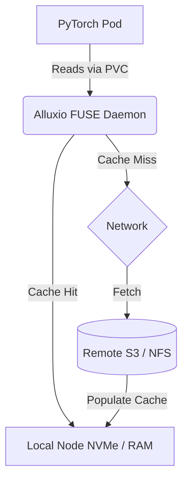

# High-Performance Storage for AI

## Learning Outcomes

* **Calculate** required storage bandwidth and IOPS to prevent GPU starvation during distributed training.
* **Architect** storage tiering topologies utilizing local NVMe, distributed caches, and remote object storage.
* **Implement** data orchestration layers using Fluid and Alluxio to provide data locality for Kubernetes-scheduled AI workloads.
* **Compare** the performance characteristics and operational complexity of NFS-over-RDMA, BeeGFS, and Lustre on bare metal.
* **Diagnose** metadata bottlenecks and POSIX compliance overhead in deep learning data pipelines.
* **Evaluate** the impact of GPUDirect Storage (GDS) and direct memory access mechanisms on cluster-wide CPU utilization.

## Why This Module Matters

In October 2025, a leading autonomous vehicle manufacturer experienced a catastrophic delay in releasing their next-generation perception model. They had just provisioned a new bare-metal Kubernetes cluster with 1,024 NVIDIA H100 GPUs, representing an infrastructure investment of tens of millions of dollars. However, when the distributed PyTorch training job began, GPU utilization hovered around a dismal 15%. The compute units were starving, idling while waiting for data. The financial impact was staggering: with GPU compute time valued at hundreds of dollars per hour, the company was burning through over a hundred thousand dollars a day in idle compute capacity while making minimal progress on their model. 

The culprit was not the network or the compute architecture, but the storage tier. Millions of tiny image files were overwhelming the parallel file system's metadata servers, causing severe `read()` latency. The storage controllers simply could not keep up with the extreme read amplification. As the cluster attempted to concurrently access millions of individual files, the storage metadata layer completely collapsed under the weight of inode lookups and POSIX lock management, leading to cascade failures across the worker nodes.

By re-architecting their pipeline to utilize GPUDirect Storage, local NVMe caching, and serialized dataset formats, they successfully saturated the GPUs and reduced the model training time from an estimated six weeks down to just nine days. This module explores how to architect Kubernetes storage systems to prevent starvation and maximize return on investment. You will learn not only how to deploy these systems, but the fundamental engineering principles that govern data movement at the absolute limits of modern hardware. The difference between a well-architected AI storage tier and a naive one is often the difference between a project's success and its outright cancellation.

## The AI Storage Bottleneck

Training large-scale AI models inverts traditional enterprise storage access patterns. Conventional workloads involve structured databases or predictable block storage where caching algorithms are well understood. Relational databases rely heavily on B-Tree structures that demand rapid, small random reads and writes. Traditional web servers serve large static assets sequentially. Machine learning workloads, however, exhibit extreme, multimodal I/O requirements that stress storage systems across three distinct axes simultaneously. 

If you design a system that solves only one of these axes, the other two will become your new bottlenecks. Let us break down exactly what these workloads are doing to the disks.

### 1. Epoch-based Read Amplification

Training datasets (images, audio, text corpora) are read repeatedly, often in randomized orders, across hundreds of epoch iterations. A single modern GPU can consume data at multiple gigabytes per second. If the storage layer cannot supply data at the rate the GPU computes it, the GPU enters an idle state. In a multi-node cluster, this read amplification multiplies by the number of active workers, creating a massive, sustained draw on storage bandwidth. When a training loop is properly optimized, the GPU spends milliseconds performing matrix multiplications and backpropagation. If the next batch of data is not resident in GPU memory by the time those calculations finish, the GPU halts. When 1,024 GPUs halt simultaneously, the waste of resources is immense.

### 2. Checkpoint Write Spikes

Distributed training jobs periodically synchronize and flush massive state files (model weights and optimizer states) to persistent storage. These checkpoint events generate synchronized, high-bandwidth write spikes. If checkpointing blocks compute, cluster utilization drops dramatically. All distributed ranks are attempting to write large checkpoint files simultaneously, creating a thundering herd that overwhelms the storage controllers. The fix involves staggering writes or using collective communication to aggregate state before writing. Consider a 100-billion parameter model: the weights and optimizer state can easily exceed 400 Gigabytes. If 50 nodes attempt to write this data to a shared NFS server at exactly the same time, the storage network switches drop packets, TCP retransmits spike, and the entire cluster grinds to a halt.

### 3. Metadata Throttling

Computer vision datasets often consist of millions of small files. Reading millions of small files overwhelms the metadata servers of distributed file systems, making inode lookups the bottleneck rather than raw network bandwidth. Each file open request requires a round-trip to the metadata server. When training on a dataset like ImageNet (1.2 million images), the system must perform `stat()`, `open()`, `read()`, and `close()` for every single image.

> **Pause and predict**: If a training script reads 1.2 million individual 50KB JPEG files over NFS, which resource will max out first: the 100Gbps network link, or the NFS server's CPU handling metadata operations?

To understand this bottleneck, consider the difference between throughput and IOPS (Input/Output Operations Per Second). While a 100Gbps network can theoretically transfer 12.5 Gigabytes per second, transferring 12.5GB of 50KB files requires 250,000 separate file operations. Most standard NFS servers cap out at a few thousand IOPS per core. The CPU will reach 100% utilization processing file lock and lookup requests, leaving the massive network pipe operating at less than 5% capacity. This metadata starvation is the silent killer of AI workloads.

## Deep Dive: Why POSIX is the Enemy of Scale

When we interact with file systems in Linux, we expect POSIX compliance. POSIX dictates strict rules about file locking, consistency, and metadata updates (like updating the `atime` or access time every time a file is read). In a distributed environment, POSIX compliance is a massive performance drag.

When thousands of concurrent processes attempt to access files in the same directory, a strictly POSIX-compliant file system must ensure that no two processes are writing to the same file destructively, and it must synchronize directory listings across the entire cluster. This requires distributed lock managers, which introduce severe network latency into every single file operation. For AI workloads, which are overwhelmingly read-only during the training phase, POSIX locks are completely unnecessary overhead. Modern AI storage architectures often abandon POSIX compliance entirely, relying instead on object storage APIs (like S3) or customized, relaxed-consistency file system clients to achieve high throughput.

## NFS-over-RDMA & Advanced Protocols

Standard NFS deployments run over TCP/IP. When a Kubernetes node receives an NFS packet via TCP, the Network Interface Card (NIC) generates a hardware interrupt. The kernel must pause execution, copy the packet from the NIC's ring buffer into kernel memory space, reassemble the TCP stream, evaluate file permissions, and then execute a context switch to copy that data into the application's user-space memory buffer. At 100Gbps, this process requires millions of CPU interrupts per second, effectively consuming entire CPU cores just to manage network traffic.

To resolve this, high-performance clusters utilize RDMA (Remote Direct Memory Access), specifically RoCE v2 (RDMA over Converged Ethernet). NFS-over-RDMA allows the storage server to push data directly across the network and deposit it securely into the memory space of the consuming PyTorch application on the worker node. This completely bypasses the worker node's kernel network stack. CPU interrupts drop to near zero, freeing the node's CPU to focus entirely on data augmentation and feeding the GPUs.

**Gotcha: NFS Read/Write Size Defaults**
If you must mount an NFS share in Kubernetes (even with RDMA) without explicitly setting `rsize` and `wsize` limits, the kernel might default to 128KB or smaller chunks. When transferring massive multi-gigabyte checkpoint files, these tiny chunks cause massive packet fragmentation and command amplification. Always explicitly define `rsize=1048576,wsize=1048576` (1MB) in your StorageClass mount options to maximize throughput and minimize overhead.

## Kubernetes Storage Primitives and CSI Evolution

To build high-performance storage on Kubernetes, one must understand the modern Container Storage Interface (CSI) ecosystem. The CSI was created to decouple storage driver development from the core Kubernetes release cycle, allowing storage vendors to iterate rapidly without waiting for upstream Kubernetes merges.

Historically, storage drivers were compiled directly into the Kubernetes codebase (in-tree). This proved unscalable and bloated the core binaries. Kubernetes storage extensions document both CSI and FlexVolume plugins, with FlexVolume deprecated since Kubernetes 1.23 in favor of CSI. Persistent Volumes remain supported only for CSI (and in-tree migrated forms), and volume snapshots support is CSI-only with in-tree plugins considered deprecated.

Furthermore, Kubernetes 1.31 removed in-tree provider migration unregister feature gates for AWS/AzureDisk/AzureFile/GCE/OpenStack/vSphere providers and removed legacy migration support for several in-tree plugins (including Ceph RBD removal in v1.31). This cements CSI as the sole path forward for high-performance AI storage integrations.

When dealing with AI checkpoints, snapshotting capabilities are critical to save state efficiently. Volume Group Snapshots were introduced as alpha in v1.27, moved to beta in v1.32, and in v1.34 moved to beta2/v1beta2; they are CSI-driver-based. This allows consistent point-in-time snapshots across multiple volumes used by a distributed training job, ensuring that distributed model state remains internally consistent if a snapshot is restored. Without Volume Group Snapshots, restoring a multi-node checkpoint could lead to tearing, where part of the model state is from one epoch and part is from another.

For data safety during isolated training runs, the ReadWriteOncePod access mode graduated to stable in Kubernetes 1.29 and is only supported for CSI volumes. This ensures only a single pod across the entire cluster can read/write to the PVC, preventing corruption of checkpoint files by misconfigured concurrent pods. Prior access modes like ReadWriteOnce only guaranteed node-level exclusivity, which was insufficient to prevent collisions when multiple pods scheduled on the same node attempted to modify the same tensor states.

If you need to duplicate datasets for experimentation, CSI volume cloning in Kubernetes requires CSI drivers and dynamic provisioners; cloned PVCs must be in the same namespace as source.

## Cloud Block Storage vs. Local Node Storage

When architecting cloud-based clusters for AI, block storage performance is a massive factor. Storage in the cloud is virtually limitless, but throughput and IOPS are strictly gated by the provider's billing and hypervisor constraints. 

AWS announced gp3 general-purpose EBS volume limits were increased to 64 TiB, 80,000 IOPS, and 2,000 MiB/s in September 2025. AWS gp3 volumes provide 3,000 baseline IOPS, 125 MiB/s baseline throughput, can be provisioned up to 80,000 IOPS and 2,000 MiB/s, and can range from 1 GiB to 64 TiB. For many mid-tier AI workloads, a heavily provisioned gp3 volume is sufficient for a single node's data cache. Be aware of node attachment limits when designing topologies. Default volume-attach limits remain published per provider: EBS 39, Google PD 16, Azure Disk 16 volumes per node. 

However, distributed multi-node AI often relies on local NVMe drives for extreme performance. Cloud block storage traverses the cloud provider's internal network, introducing latency that can stall GPU memory transfers. Local NVMe operates directly on the PCI-Express bus of the physical host. When you utilize local NVMe, you are capable of achieving millions of IOPS per node, with latencies in the microseconds rather than milliseconds.

### Local Storage Constraints

Kubernetes `hostPath` volumes are intended for single-node testing and should not be used for workloads requiring multi-node portability. Using `hostPath` in production AI clusters leads to scheduling nightmares, security vulnerabilities, and data silos. 

Instead, Kubernetes provides local persistent volumes. As of Kubernetes 1.35, local volumes do not support dynamic provisioning; local storage classes should use `kubernetes.io/no-provisioner` with `WaitForFirstConsumer`.

`WaitForFirstConsumer` delays volume binding/provisioning until a pod is scheduled and allows topology-aware placement constraints. This ensures the pod is scheduled to the exact node where the physical NVMe drive resides.

> **Stop and think**: Why is dynamic provisioning disabled for local volumes in Kubernetes 1.35? Consider the lifecycle of physical hardware versus cloud virtual disks.

You might also consider ephemeral volumes for scratch space. CSI ephemeral volumes are stable since Kubernetes 1.25 and are supported only by a subset of CSI drivers; generic ephemeral volumes are stable since v1.23 and support common PVC operations when the driver supports them. Be warned: Kubernetes local ephemeral storage can lose data on node failure and does not provide durable guarantees, and applications should not assume performance SLAs such as disk IOPS. Never store unique checkpoint data here.

## GPUDirect Storage (GDS)

To truly push the boundaries of data ingestion, we must evaluate the path data takes from the storage medium to the GPU. Standard file I/O involves copying data from the storage NIC, into host CPU memory (bounce buffer), and then over the PCIe bus to GPU memory. This path consumes substantial CPU cycles and memory bandwidth.

NVIDIA GPUDirect Storage (GDS) is documented as a direct DMA path between storage and GPU memory that bypasses CPU bounce buffering, improving bandwidth and lowering CPU utilization/latency. By allowing the NIC or local NVMe controller to write directly to the GPU's memory addresses via PCIe switches, GDS removes the host CPU from the data plane entirely.

In the NVIDIA GPU Operator docs, GPUDirect Storage support added for v22.9.1 with `nvidia-fs` loading, and v23.9.1 onward deploys a GDS version that requires the NVIDIA Open GPU Kernel Module driver. GDS requires specific file systems engineered to support these DMA transfers.

When planning a GDS deployment, you must carefully audit the PCIe topology of your bare-metal servers. If the NIC and the GPU are attached to different CPU sockets (NUMA nodes), the DMA transfer must traverse the inter-socket link, significantly degrading the performance benefits of GDS. Always ensure topology-aware scheduling is enabled so that pods are bound to GPUs and NICs residing on the same NUMA node.

## High-Performance Parallel File Systems

Parallel File Systems (PFS) decouple metadata management from data storage. Clients communicate with a metadata server (MDS) to get file locations, then read/write directly to multiple object storage targets (OSTs) concurrently. This architecture scales throughput linearly by adding more OSTs, making it ideal for the massive sequential reads of AI training.

| Feature | Lustre | BeeGFS | WekaFS (Commercial) |
| :--- | :--- | :--- | :--- |
| **Architecture** | MDS (Metadata) + OST (Object) | Metadata Nodes + Storage Nodes | Distributed, NVMe-native, custom protocol |
| **Complexity** | Extremely High | Moderate | Low (Turnkey, but closed source) |
| **POSIX Support** | Strict | Strict | Strict |
| **Small File Perf** | Poor to Moderate | Good | Excellent |
| **Kubernetes CSI** | `intel/lustre-csi-driver` | `beegfs/beegfs-csi-driver` | `weka/csi-wekafs` |

BeeGFS is heavily adopted in on-premises AI clusters due to its architectural simplicity compared to Lustre. It operates entirely in userspace (FUSE) or via a lightweight kernel module and can run directly on the Kubernetes worker nodes. Lustre, while possessing incredible peak performance, often requires a dedicated team of storage engineers to tune and maintain. WekaFS offers exceptional performance by writing its own specialized network protocols that bypass the standard Linux kernel networking stack entirely.

**Gotcha: BeeGFS Metadata Separation**
When deploying BeeGFS, never place your metadata services (MDS) on the same physical NVMe drives as your object storage targets (OST). AI workloads will generate millions of IOPS for metadata, starving the shared drives of the sequential throughput needed for the actual object data retrieval. Always isolate metadata workloads on dedicated, high-endurance NVMe hardware.

## Data Orchestration and Caching: Fluid and Alluxio

Relying entirely on a centralized PFS for all reads is expensive and limits scalability. As you add hundreds of GPU nodes, upgrading the centralized storage array to keep pace becomes prohibitively expensive. The modern approach utilizes Storage Tiering and Caching. By placing a caching layer physically close to the compute nodes (utilizing local node NVMe), you decouple the compute performance from the remote storage bandwidth.

Fluid is a CNCF open-source data orchestration and abstraction project. It provides a Kubernetes-native interface to manage distributed cache engines like Alluxio. 



Fluid deploys a DaemonSet of cache workers on the Kubernetes nodes. When an AI pod requests a Dataset, Fluid automatically creates a PersistentVolumeClaim (PVC). The pod mounts this PVC, which is backed by a local FUSE mount connected to the local Alluxio worker. 

This architecture entirely mitigates network bottlenecks and metadata strain on remote storage after the first epoch. During the first epoch, the training job experiences cache misses and data is pulled over the network. On all subsequent epochs, the data is served at PCI-Express speeds directly from the local NVMe cache, completely isolating the centralized storage from the punishing read amplification of the training loop.

## Dealing with Metadata and Small Files

If you cannot deploy a caching layer and must read directly from shared storage, you must address the small file problem. Do not store millions of individual `.jpg` files on a file system. Convert the dataset into sequential binary formats:
* TensorFlow: `TFRecord`
* PyTorch: `WebDataset` (tar archives)

By packing 1,000 images into a single tarball, you reduce the metadata operations (stat/open/close) by a factor of 1,000. This transforms millions of random, small I/O requests into a steady stream of large, sequential reads, which is exactly the workload profile that parallel file systems and object stores are optimized to handle. Adopting WebDataset allows your data loader to stream bytes continuously without stopping to negotiate with the metadata server.

## Did You Know?

* Did you know that FlexVolume was deprecated in Kubernetes 1.23 in favor of the Container Storage Interface (CSI)?
* Did you know that AWS announced gp3 general-purpose EBS volume limits were increased to 64 TiB, 80,000 IOPS, and 2,000 MiB/s in September 2025?
* Did you know that the default volume-attach limits per node remain published as 39 for AWS EBS, 16 for Google Persistent Disk, and 16 for Azure Disk?
* Did you know that Volume Group Snapshots moved to beta2 in Kubernetes 1.34, providing critical CSI-driver-based snapshot consistency?

## Common Mistakes

| Mistake | Why it happens | How to fix |
| :--- | :--- | :--- |
| Using `hostPath` for multi-node training | Easy to test on a single node but fails at scale. | Use local storage classes with `WaitForFirstConsumer` instead. |
| Expecting SLA performance from ephemeral storage | Misunderstanding local ephemeral storage docs. | Never assume performance SLAs like disk IOPS on ephemeral volumes. |
| Inode Exhaustion on Local Caches | When utilizing local NVMe for caching (e.g., via TopoLVM or hostPath), engineers size the disks based on gigabytes. However, caching millions of uncompressed images will exhaust the ext4/xfs inode allocation long before space runs out. | Format local NVMe cache drives with a high inode ratio (`mkfs.ext4 -i 8192`) or use WebDataset tarballs. |
| Thundering Herd Checkpoints | 128 GPUs attempting to write a 5GB file simultaneously to shared storage, destroying throughput. | * **Fix**: Implement checkpoint staggering in the training code, or designate a single rank (usually Rank 0) to gather weights over the fast GPU interconnect (NCCL) and write sequentially. |
| Assuming gp3 guarantees 80k IOPS | Missing the "provisioned" keyword in AWS documentation. | Baseline is 3,000 IOPS; you must explicitly provision up to 80,000 IOPS. |
| FUSE Overhead Bottlenecks | Fluid/Alluxio rely on FUSE, causing high kernel-to-userspace context switching overhead. | Bypass FUSE for extreme performance using kernel-space clients or object storage SDKs. |
| Ignoring GDS driver requirements | Relying on outdated deployments of the GPU operator. | Ensure v23.9.1+ is running with the NVIDIA Open GPU Kernel Module driver. |

## Hands-On Exercise: Distributed Caching with Fluid and Alluxio

This lab demonstrates how to decouple an AI workload from slow remote storage by deploying Fluid and configuring an Alluxio cache utilizing local node storage. You will walk through the deployment lifecycle, from helm installation to verifying cache hit rates.

**Lab Note: Production NVMe SSDs vs. Cloud Block Storage**
In this lab, we simulate a cache with a RAM disk or standard disk configuration. In a real-world production environment, you must use physical, bare-metal NVMe SSDs formatted with XFS or ext4 to achieve the extreme IOPS required by Fluid/Alluxio. Standard cloud block storage (like unprovisioned gp3) will quickly bottleneck on backend IOPS, causing the local caching layer to be slower than simply reading from the remote network.

### Prerequisites

* A Kubernetes cluster (1.32+). `kind` or `minikube` is sufficient.
* `kubectl` and `helm` installed.
* At least 4GB of RAM and 10GB of disk space available to the cluster nodes.

### Task 1: Install Fluid

Fluid is deployed via Helm and installs its custom controllers and CRDs into your cluster. The controllers automatically manage the lifecycle of your distributed caches.

```bash
# Add the Fluid Helm repository
helm repo add fluid https://fluid-cloudnative.github.io/charts
helm repo update

# Install Fluid into the fluid-system namespace
helm upgrade --install fluid fluid/fluid \
  --namespace fluid-system \
  --create-namespace \
  --set runtime.alluxio.enabled=true
```

<details>
<summary>Solution & Verification</summary>

Verify the controllers:
```bash
kubectl get pods -n fluid-system
```

Expected Output:
```text
NAME                                         READY   STATUS    RESTARTS   AGE
alluxioruntime-controller-5b9c5f...          1/1     Running   0          2m
csi-nodeplugin-fluid-xxx                     2/2     Running   0          2m
dataset-controller-6d7f8c...                 1/1     Running   0          2m
fluid-webhook-5f8d9b...                      1/1     Running   0          2m
```
</details>

### Task 2: Create a Dataset and Runtime

Create a Dataset pointing to a remote data source and an AlluxioRuntime to cache it. Create a file named `dataset-alluxio.yaml`. Note that the configuration specifies exactly how much local memory or disk to allocate for the caching tier.

```text
apiVersion: data.fluid.io/v1alpha1
kind: Dataset
metadata:
  name: ai-training-data
spec:
  mounts:
    - mountPoint: https://archive.apache.org/dist/spark/
      name: spark
---
apiVersion: data.fluid.io/v1alpha1
kind: AlluxioRuntime
metadata:
  name: ai-training-data
spec:
  replicas: 1
  tieredstore:
    levels:
      - mediumtype: MEM
        path: /dev/shm
        quota: 2Gi
        high: "0.95"
        low: "0.7"
```

<details>
<summary>Solution & Verification</summary>

Apply the configuration:
```bash
kubectl apply -f dataset-alluxio.yaml
```
</details>

### Task 3: Verify the Dataset and Cache

Fluid provisions the Alluxio master and worker pods based on your runtime definition. Ensure the PVC is created automatically by the Fluid controller, abstracting the complexity of volume provisioning.

<details>
<summary>Solution & Verification</summary>

```bash
kubectl get dataset ai-training-data
```

Expected Output:
```text
NAME               UFS TOTAL SIZE   CACHED   CACHE CAPACITY   CACHED PERCENTAGE   PHASE   AGE
ai-training-data   [Calculating]    0.00B    2.00GiB          0.0%                Bound   2m
```

```bash
kubectl get pvc ai-training-data
```

Expected Output:
```text
NAME               STATUS   VOLUME             CAPACITY   ACCESS MODES   STORAGECLASS   AGE
ai-training-data   Bound    ai-training-data   100Pi      ROX            fluid          2m
```
</details>

### Task 4: Preload the Cache (Data Warmup)

To prevent the first epoch of training from suffering high latency, you can preload data into the cache. Create `dataload.yaml` to asynchronously preload the data into the local cache.

```yaml
apiVersion: data.fluid.io/v1alpha1
kind: DataLoad
metadata:
  name: ai-data-warmup
spec:
  dataset:
    name: ai-training-data
    namespace: default
```

<details>
<summary>Solution & Verification</summary>

```bash
kubectl apply -f dataload.yaml
```

```bash
kubectl get dataload ai-data-warmup
```
Wait until the PHASE transitions from Loading to Complete.
</details>

### Task 5: Consume the Cached Data

Now deploy a pod to verify the data is accessible and fast. Create `training-pod.yaml` to deploy a dummy training pod that mounts the PVC.

```yaml
apiVersion: v1
kind: Pod
metadata:
  name: ml-training-job
spec:
  restartPolicy: Never
  containers:
    - name: trainer
      image: ubuntu:22.04
      command: ["/bin/bash", "-c"]
      args: 
        - |
          echo "Starting epoch 1..."
          time cp -r /data/spark/spark-3.4.1 /tmp/
          echo "Starting epoch 2 (Should be instant)..."
          time cp -r /data/spark/spark-3.4.1 /tmp/run2/
          sleep 3600
      volumeMounts:
        - mountPath: /data
          name: training-data-vol
  volumes:
    - name: training-data-vol
      persistentVolumeClaim:
        claimName: ai-training-data
```

<details>
<summary>Solution & Verification</summary>

```bash
kubectl apply -f training-pod.yaml
kubectl logs -f ml-training-job
```
Notice that the filesystem operations within `/data` behave like local I/O, entirely abstracting the remote HTTPS source and accelerating access via the node's local memory/SSD.
</details>

### Troubleshooting the Fluid Lab
If your Dataset stays in the `NotBound` phase for more than a few minutes, check the logs of the `alluxioruntime-controller` pod in the `fluid-system` namespace. The most common cause is a failure to pull the Alluxio worker container images or insufficient memory/CPU limits on the worker nodes preventing the caching engine DaemonSet from starting. Ensure your cluster has at least 4GB of free RAM per node before deploying the runtime.

If a pod fails to mount the PVC, ensure the `csi-nodeplugin-fluid` daemonset is running on the node where the pod was scheduled. The kubelet relies on this CSI plugin to mount the FUSE filesystem.

### Success Checklist
* [ ] Fluid components running in `fluid-system`.
* [ ] Dataset is bound and PVC is generated.
* [ ] Warmup job completed successfully.
* [ ] Training pod logs show Epoch 2 copying significantly faster than Epoch 1.

## Quiz

<details>
<summary>1. A machine learning team reports that their GPU utilization is averaging 35% during training. The worker nodes show high `iowait`, and network traffic to the remote NFS server is peaking at only 2Gbps despite a 100Gbps link. The dataset consists of 14 million individual 50KB JPEG files. What is the primary bottleneck and the most effective architectural fix?

A) The 100Gbps network link is saturated by TCP retransmits; upgrade to RDMA.
B) The NFS metadata server is choking on inode lookups for millions of small files; convert the dataset to sequential tarballs.
C) The local NVMe drives are suffering from write amplification due to caching.
D) The GPUs are overheating and thermal throttling.</summary>

**Correct Answer: B**
The NFS metadata server is choking on inode lookups for millions of small files. The fix is to convert the dataset to sequential tarballs (WebDataset/TFRecord). By packing thousands of images into single sequential archives, metadata operations drop drastically, allowing the massive sequential I/O bandwidth of the link to saturate. Distractor A is incorrect because the network is heavily underutilized. Distractors C and D are unrelated to the high `iowait` and NFS traffic symptoms described.
</details>

<details>
<summary>2. You are designing a storage architecture for a bare-metal Kubernetes cluster. You have dense compute nodes with 4x 7TB NVMe drives each, and a slow centralized Ceph object store. You want to implement an automatic caching layer so the GPUs read from local NVMe after the first epoch. Which Kubernetes-native technology stack provides this capability?

A) NFS-over-RDMA with a strict POSIX locking manager.
B) AWS Elastic Block Store (EBS) with provisioned IOPS.
C) Fluid orchestrating an AlluxioRuntime with local SSD tiering.
D) A hostPath volume mounted directly from the Ceph cluster.</summary>

**Correct Answer: C**
Fluid orchestrating an AlluxioRuntime with local SSD tiering provides this exact capability. Fluid transparently presents the remote Ceph store as a local PVC, caching data locally on the nodes' NVMe drives during the first epoch to bypass remote network limits on subsequent reads. NFS-over-RDMA (A) does not inherently provide local NVMe caching. EBS (B) is a cloud construct, not bare-metal. hostPath (D) does not automatically manage distributed cache eviction or tiering.
</details>

<details>
<summary>3. When configuring an Alluxio cache via Fluid on bare metal, what is the critical performance disadvantage of exposing the cache to the application pod via a PersistentVolumeClaim (PVC)?

A) PVCs restrict the volume size to 1 GiB automatically.
B) The PVC is mounted using FUSE, which introduces kernel-to-userspace context switching overhead.
C) PVCs disable RDMA natively on all nodes.
D) The PVC forces the pod to communicate directly with the metadata server, bypassing the cache.</summary>

**Correct Answer: B**
The PVC is mounted using FUSE, which introduces kernel-to-userspace context switching overhead that limits maximum I/O throughput. FUSE overhead caps bandwidth per node, requiring specialized kernel-space clients or GPUDirect Storage implementations to push beyond those limits. PVCs do not restrict sizes arbitrarily to 1 GiB (A), they do not disable RDMA natively (C), and they securely leverage the cache rather than bypassing it (D).
</details>

<details>
<summary>4. A distributed PyTorch job crashes every 4 hours with an `I/O timeout` error exactly when the cluster attempts to save model checkpoints. The shared storage is a parallel file system. What is the most likely cause of this failure?

A) All distributed ranks are attempting to write large checkpoint files simultaneously, creating a thundering herd.
B) The local ephemeral storage on the worker nodes is losing data upon successful writes.
C) The cluster has exhausted its global IP address space for the snapshot controllers.
D) The CSI driver has forcefully remounted the volume as read-only.</summary>

**Correct Answer: A**
All distributed ranks are attempting to write large checkpoint files simultaneously, creating a thundering herd that overwhelms the storage controllers. The fix is to implement checkpoint staggering in the training code, or designate a single rank to gather weights over the fast GPU interconnect and write sequentially. Ephemeral storage data loss (B) wouldn't result in an I/O timeout during writing. IP address exhaustion (C) and sudden read-only remounts (D) do not cyclically occur exactly during checkpoint intervals.
</details>

<details>
<summary>5. Your AI training jobs are severely bottlenecked by host CPU utilization, as the CPU is fully consumed copying data from the NIC ring buffer to system memory and then over the PCIe bus to the GPU. You have NVIDIA GPUs and RDMA-capable NICs on the same NUMA node. Which technology should you implement to eliminate this host CPU bottleneck?

A) A POSIX-compliant distributed lock manager.
B) Generic ephemeral volumes using hostPath.
C) GPUDirect Storage (GDS) to establish a direct DMA path between the NIC/NVMe and GPU memory.
D) FlexVolume plugins configured with ReadWriteOncePod access modes.</summary>

**Correct Answer: C**
GDS transfers data directly from the NIC/NVMe to GPU memory via DMA, bypassing the host CPU bounce buffers. This completely eliminates CPU bottlenecks and system RAM latency associated with traditional `read()` syscalls, maintaining high bandwidth directly to the GPU. POSIX locks (A) add CPU overhead. Ephemeral volumes (B) and FlexVolume (D) do not alter the DMA path to the GPU and will still utilize the host CPU for memory transfers.
</details>

<details>
<summary>6. You need to provision local NVMe disks on Kubernetes 1.35 nodes for extreme database performance, but you want to ensure pods only bind to volumes physically attached to the node they schedule on. How should you configure the storage class?

A) Use the default dynamic provisioner with immediate volume binding.
B) Use a FlexVolume plugin to dynamically attach the NVMe bus.
C) Enable the `hostPath` storage abstraction via persistent volume claims.
D) Use `kubernetes.io/no-provisioner` with the `WaitForFirstConsumer` volume binding mode.</summary>

**Correct Answer: D**
In Kubernetes 1.35, local volumes do not support dynamic provisioning. The local storage class should use `kubernetes.io/no-provisioner` with the `WaitForFirstConsumer` volume binding mode. This delays volume binding until the pod is scheduled, strictly respecting node topology constraints. Dynamic provisioning (A) is not supported for local volumes. FlexVolume (B) has been deprecated since v1.23. hostPath (C) is heavily discouraged for multi-node scalable workloads.
</details>

<details>
<summary>7. A security audit flags your CSI volume deployment for allowing multiple pods to accidentally write to the same checkpoint PVC, corrupting data. Which access mode resolves this on Kubernetes 1.29+?

A) ReadOnlyMany
B) ReadWriteOncePod
C) ReadWriteMany
D) ReadWriteOnce</summary>

**Correct Answer: B**
The `ReadWriteOncePod` access mode, which graduated to stable in Kubernetes 1.29 and is only supported for CSI volumes, resolves this. It restricts volume access to a single pod, offering tighter security than `ReadWriteOnce` which only restricts access to a single node, allowing multiple pods on that same node to corrupt the data. `ReadOnlyMany` (A) prohibits writing entirely. `ReadWriteMany` (C) enables the exact corruption behavior flagged by the audit.
</details>

## Next Module
Ready to move from storage architectures to advanced scheduling? Check out [Module 9.7: Gang Scheduling and Kueue](../module-9.7-gang-scheduling), where we dive into coordinated pod scheduling to prevent distributed deadlocks in massive AI training runs.

## Further Reading
* [Fluid Official Documentation](https://fluid.io/)
* [Alluxio Kubernetes Deployment Guide](https://docs.alluxio.io/os/user/stable/en/kubernetes/)
* [NVIDIA GPUDirect Storage Overview](https://developer.nvidia.com/gpudirect-storage)
* [WebDataset: High-Performance I/O for Deep Learning](https://github.com/webdataset/webdataset)
* [BeeGFS CSI Driver GitHub Repository](https://github.com/ThinkParQ/beegfs-csi-driver)