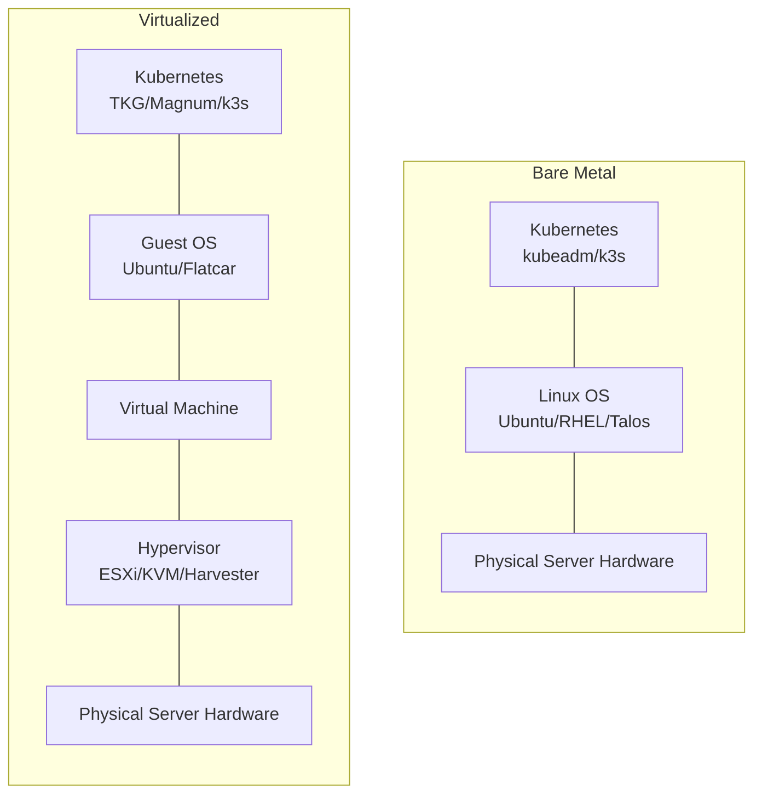
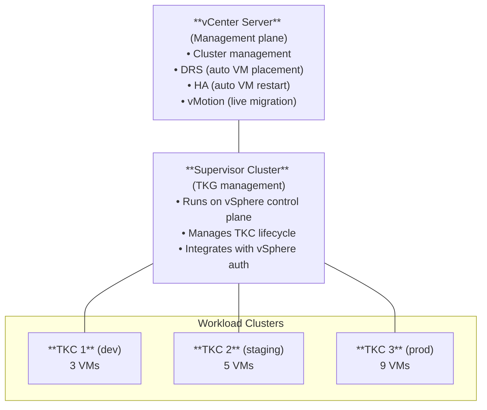
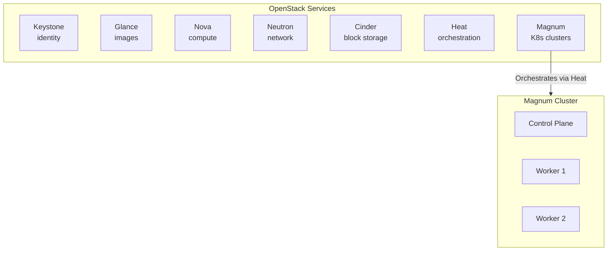
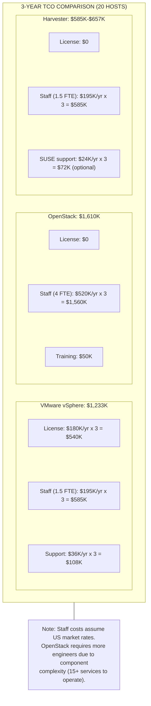

> **Complexity**: `[INTERMEDIATE]` | Time: 45 minutes
>
> **Prerequisites**: [Module 1.1: The Case for On-Premises](../../planning/module-1.1-case-for-on-prem/), [Module 2.4: Declarative Bare Metal](../../provisioning/module-2.4-declarative-bare-metal/)

---

## What You'll Be Able to Do

After completing this module, you will be able to:

1. **Evaluate** VMware vSphere/Tanzu, OpenStack, and Harvester as virtualization platforms for on-premises Kubernetes.
2. **Design a private cloud architecture that balances operational simplicity against licensing costs and staffing requirements.**
3. **Implement** VM-based Kubernetes node provisioning with automated live migration and hardware abstraction.
4. **Compare** storage and networking primitives across hypervisors, explicitly contrasting vSAN, Cinder, and Longhorn.
5. **Diagnose** multi-cluster management failure domains effectively when orchestrating through an overarching management plane.

---

## Why This Module Matters

A mid-size bank ran Kubernetes on bare metal for two years. Their platform team of three engineers spent 40% of their time on hardware lifecycle: firmware updates required draining nodes manually, disk replacements meant SSH sessions and partition recreation, and provisioning a new cluster took two weeks of BIOS configuration, OS installs, and kubeadm bootstrapping. When a massive hardware fault struck their core database servers during Black Friday, the lack of hardware abstraction meant an unrecoverable outage spanning fourteen days while replacement parts were physically shipped and installed. 

They migrated to a private cloud architecture to introduce an abstraction layer. Provisioning a new cluster dropped from two weeks to 45 minutes. When a physical host needed firmware updates, the underlying hypervisor live-migrated the VMs automatically. Disk failures were handled by a distributed storage area network without any Kubernetes disruption. The platform team's hardware toil dropped from 40% to 5% of their time. 

The tradeoff: private clouds introduce complex architectural choices. Adopting an enterprise vendor can cost hundreds of thousands of dollars annually, whereas open-source alternatives require immense internal engineering expertise. This module covers when to virtualize, when to stay on bare metal, and how to choose between the dominant private cloud platforms governing modern on-premises infrastructure.

---

## What You'll Learn

- VMware Cloud Foundation architecture and vSphere integrations
- OpenStack components relevant to Kubernetes (Nova, Cinder, Neutron, Magnum)
- Harvester as a cloud-native HCI alternative powered by KubeVirt
- Storage abstractions utilizing vSphere CSI and OpenStack Cinder
- Emerging bare metal orchestration alternatives like Canonical MAAS and Talos Linux
- Cost comparison frameworks and TCO models for platform decisions

---

## Bare Metal vs Virtualized Kubernetes

> **Pause and predict**: If virtualization adds 5-15% CPU overhead, why do most organizations with more than 10 servers still choose to virtualize their Kubernetes nodes instead of running on bare metal?



**Bare Metal:**
- `+` Maximum performance (no hypervisor tax).
- `+` No virtualization licensing costs.
- `-` Hardware lifecycle is highly manual.
- `-` No live migration (node drain required).

Organizations that stick to bare metal increasingly rely on declarative operating systems to lower overhead. For example, Talos Linux provides no interactive shell or console; all system management is API-driven with mutual TLS (mTLS) authentication. The latest stable release of this OS, Talos Linux version 1.12.6, was released March 19, 2026. For provisioning, Canonical MAAS (Metal as a Service) version 3.7.1 is the latest stable release, published February 13, 2026, allowing automated node bootstrapping.

To keep the footprint small on bare metal, many opt for lightweight Kubernetes distributions. K3s latest release is version 1.35.3+k3s1, supporting Kubernetes version 1.35, while RKE2 latest release is version 1.34.6+rke2r1 (Kubernetes 1.34.6) as of April 2026.

**Virtualized:**
- `+` Live migration for hardware maintenance.
- `+` VM snapshots for rapid disaster rollback.
- `+` Multi-tenancy isolation at the hardware level.
- `-` Compute overhead from the hypervisor.
- `-` Licensing cost or extreme operational cost.

**Decision:** Virtualize unless you need every last CPU cycle (HPC, ML training, real-time systems) or run a very small footprint of physical servers.

---

## VMware Cloud Foundation and vSphere

VMware vSphere remains a dominant enterprise hypervisor. Tanzu Kubernetes Grid (TKG) runs on top of vSphere, utilizing the infrastructure for VM lifecycle, storage (vSAN), and networking.

Broadcom completed its acquisition of VMware on November 22, 2023. Following the Broadcom acquisition, VMware perpetual licenses were discontinued in December 2023 and replaced with subscription-only licensing, which prompted many enterprises to re-evaluate their private cloud roadmaps.

VMware Cloud Foundation (VCF) 9.0 was initially released on June 17, 2025, continuing the platform's evolution into a consolidated, subscription-based ecosystem. Note: While VMware Cloud Foundation 9.0 aggregates multiple components, specific ESXi and vCenter version strings in its Bill of Materials remain unverified, as release notes documentation for vCenter 9.0 and ESX 9.0 could not be fully retrieved during recent audits. Starting with VCF 9.0, vSphere Kubernetes Service (VKS) is installed as a Supervisor Service, decoupling it from vCenter/Supervisor release cycles.

### Architecture



Each TKC (TanzuKubernetesCluster) is an autonomous set of VMs running a full Kubernetes control plane and worker nodes.

### vSphere CSI Driver

The vSphere CSI driver orchestrates VMDK (Virtual Machine Disk) files on vSphere datastores, attaching them dynamically to Kubernetes nodes. 

```yaml
# vSphere StorageClass
apiVersion: storage.k8s.io/v1
kind: StorageClass
metadata:
  name: vsphere-sc
provisioner: csi.vsphere.vmware.com
parameters:
  storagepolicyname: "vSAN Default Storage Policy"
  datastoreurl: "ds:///vmfs/volumes/vsan-datastore/"
reclaimPolicy: Delete
allowVolumeExpansion: true
volumeBindingMode: WaitForFirstConsumer
```

Verify that the CSI driver is running before creating volume claims.

```bash
# Verify vSphere CSI is running
kubectl get pods -n vmware-system-csi
# vsphere-csi-controller-0   Running
# vsphere-csi-node-xxxxx     Running (DaemonSet)

# Create a PVC backed by vSphere storage
kubectl apply -f - <<EOF
apiVersion: v1
kind: PersistentVolumeClaim
metadata:
  name: vsphere-pvc
spec:
  accessModes: ["ReadWriteOnce"]
  storageClassName: vsphere-sc
  resources:
    requests:
      storage: 10Gi
EOF

# The PV is a VMDK on the vSphere datastore
kubectl get pv -o jsonpath='{.items[0].spec.csi.volumeHandle}'
# file:///vmfs/volumes/vsan-datastore/fcd/abc123.vmdk
```

---

## OpenStack + Magnum

OpenStack is the quintessential open-source alternative. OpenStack is governed by the OpenInfra Foundation, which completed joining the Linux Foundation in 2025. 

The project maintains a rigorous, predictable cadence: OpenStack releases twice per year: a spring release (~April, X.1 designation) and a fall release (~October, X.2 designation). The latest OpenStack release is 2026.1 codename Gazpacho, released April 1, 2026. For those maintaining infrastructure, OpenStack 2026.1 Gazpacho is a SLURP (Skip Level Upgrade Release Process) release, allowing direct upgrade from 2025.1 Epoxy without going through 2025.2 Flamingo.

### Architecture



### Magnum Cluster Creation

> **Stop and think**: OpenStack Magnum uses Heat templates under the hood to orchestrate VM creation. How does this compare to Tanzu's approach of using a Supervisor Cluster? What are the implications for debugging when something goes wrong during cluster provisioning?

Magnum operates on cluster templates. You define a blueprint specifying the node flavor, network, and orchestrator.

```bash
# Create a cluster template
openstack coe cluster template create k8s-template \
  --image fedora-coreos-40 \
  --external-network public \
  --master-flavor m1.large \
  --flavor m1.xlarge \
  --docker-volume-size 50 \
  --network-driver flannel \
  --volume-driver cinder \
  --coe kubernetes

# Create a cluster
openstack coe cluster create prod-k8s \
  --cluster-template k8s-template \
  --master-count 3 \
  --node-count 5 \
  --keypair my-key

# Get kubeconfig
openstack coe cluster config prod-k8s --dir ~/.kube/
export KUBECONFIG=~/.kube/config

# Cinder CSI is auto-configured by Magnum
kubectl get sc
# NAME            PROVISIONER                  VOLUMEBINDINGMODE
# cinder-default  cinder.csi.openstack.org     Immediate
```

### OpenStack Cinder CSI

Magnum automatically provisions the Cinder CSI driver, which can be further customized by mapping to specific volume types in your OpenStack deployment.

```yaml
# Cinder StorageClass with SSD backend
apiVersion: storage.k8s.io/v1
kind: StorageClass
metadata:
  name: cinder-ssd
provisioner: cinder.csi.openstack.org
parameters:
  type: "SSD"       # Must match a Cinder volume type
  availability: "nova"
reclaimPolicy: Delete
allowVolumeExpansion: true
```

---

## Harvester, KubeVirt, and HCI Alternatives

Harvester represents a modern Hyper-Converged Infrastructure (HCI) approach, unifying KubeVirt (VM management) and Longhorn (distributed storage) directly onto bare metal. 

Under the hood, Harvester leverages KubeVirt. KubeVirt version 1.8.0 was released March 25, 2026, targeting Kubernetes version 1.35. Prior to KubeVirt version 1.8, KubeVirt was exclusively coupled to KVM as its hypervisor backend, but this release opened architectural pathways via the new Hypervisor Abstraction Layer (HAL). It is worth noting that KubeVirt is a CNCF Incubating project; it has not achieved CNCF Graduated status as of April 2026.

SUSE Virtualization (Harvester) version 1.7.0 was released January 15, 2026; version 1.7.1 is the current latest stable release. Harvester version 1.7.0 upgrades the OS base from SLE Micro 5.5 to SLE Micro 6.1 and adds support for NVIDIA MIG-based GPU partitioning. Many deployments integrate this with Rancher. Rancher Manager version 2.14.0 is the latest release, released March 26, 2026.

### Architecture

```mermaid
flowchart TD
    subgraph Harvester [Harvester Cluster (Kubernetes + KubeVirt)]
        direction LR
        LH[Longhorn<br/>storage]
        KV[KubeVirt<br/>VM management]
        UI[Harvester UI / API]
        RM[Rancher MCM<br/>optional]
    end
    
    subgraph Workloads [Guest K8s Clusters (VMs)]
        direction LR
        GC1[Cluster 1]
        GC2[Cluster 2]
        GC3[Cluster 3]
    end
    
    Harvester --> GC1
    Harvester --> GC2
    Harvester --> GC3
```

### Harvester VM Creation

Because Harvester runs natively as Kubernetes, you provision virtual machines exactly like you would provision pods—via declarative manifests. 

```yaml
# Harvester VirtualMachine CRD (KubeVirt)
apiVersion: kubevirt.io/v1
kind: VirtualMachine
metadata:
  name: k8s-worker-01
  namespace: k8s-prod
spec:
  running: true
  template:
    spec:
      domain:
        cpu:
          cores: 8
        resources:
          requests:
            memory: 16Gi
        devices:
          disks:
            - name: rootdisk
              disk:
                bus: virtio
            - name: datadisk
              disk:
                bus: virtio
      volumes:
        - name: rootdisk
          dataVolume:
            name: k8s-worker-01-root
        - name: datadisk
          dataVolume:
            name: k8s-worker-01-data
```

The DataVolume resource instructs KubeVirt to fetch a cloud image and back it via Longhorn persistent storage.

```yaml
# Data volume backed by Longhorn
apiVersion: cdi.kubevirt.io/v1beta1
kind: DataVolume
metadata:
  name: k8s-worker-01-root
spec:
  source:
    http:
      url: "https://cloud-images.ubuntu.com/jammy/current/jammy-server-cloudimg-amd64.img"
  pvc:
    accessModes: ["ReadWriteOnce"]
    storageClassName: longhorn
    resources:
      requests:
        storage: 50Gi
```

### Additional Enterprise Hypervisors

Beyond Harvester, several other virtualization ecosystems compete in this space:
- **Proxmox:** Proxmox VE 9.1 is the latest stable release, released November 19, 2025; Proxmox VE 9.0 was released August 5, 2025. Proxmox VE is Debian-based and versions receive support for approximately 3 years (aligned with the corresponding Debian release lifecycle).
- **Nutanix:** Nutanix AOS 7.5 is the current latest stable release (base released December 8, 2025); latest patch is 7.5.1.1 released April 7, 2026. Since Nutanix AOS 7.0, all releases follow the Unified NCI Release Model with 15 months of active maintenance and 9 months of security-only support (~24 months total).
- **OpenShift:** For those strictly in the Red Hat ecosystem, Red Hat OpenShift 4.20 is the latest stable release as of April 2026, released October 21, 2025.

---

> **Pause and predict**: Given that Harvester is free and simpler than OpenStack, why would a 200-server deployment still choose OpenStack? What capabilities does OpenStack have at that scale that Harvester lacks?

## Platform Comparison

| Dimension | VMware vSphere | OpenStack | Harvester |
|-----------|---------------|-----------|-----------|
| License cost (20 hosts) | ~$180K/year | $0 | $0 |
| Engineering staff | 1-2 VMware admins | 3-5 OpenStack engineers | 1-2 platform engineers |
| Setup time | 2-3 days | 2-4 weeks | 4-8 hours |
| Live migration | vMotion (mature) | Nova live-migrate (works) | KubeVirt live migration |
| Storage | vSAN, VMFS, NFS | Cinder (pluggable) | Longhorn (built-in) |
| Networking | NSX-T, vSwitch | Neutron (OVS, OVN) | Multus, VLAN |
| K8s integration | TKG (native) | Magnum (separate) | Rancher (native) |
| GPU passthrough | Good (vGPU) | Good (PCI passthrough) | KubeVirt GPU support |
| Maturity | 20+ years | 12+ years | 3+ years |
| Best for | Enterprise, compliance | Large-scale, customization | SMB, edge, new deployments |

### Total Cost of Ownership (3-Year, 20 Hosts)

> **Stop and think**: Before reviewing the TCO breakdown below, which platform do you expect to have the highest 3-year cost: vSphere (due to licensing) or OpenStack (due to staffing)?



---

## When to Virtualize vs Stay on Bare Metal

```bash
# Decision checklist (answer yes/no)

# 1. Do you run > 10 physical servers?
#    Yes -> Virtualize (hardware lifecycle savings outweigh overhead)
#    No  -> Bare metal may be simpler

# 2. Do you need multiple isolated clusters?
#    Yes -> Virtualize (VMs provide hardware-level isolation)
#    No  -> Bare metal with namespaces may suffice

# 3. Is maximum CPU/GPU performance critical?
#    Yes -> Bare metal (no hypervisor tax: 5-15% CPU, 2-5% memory)
#    No  -> Virtualize

# 4. Do you have VMware expertise in-house?
#    Yes -> vSphere + Tanzu (leverage existing skills)
#    No  -> Harvester (lowest learning curve)

# 5. Budget for licensing?
#    Yes -> vSphere (most mature, best enterprise support)
#    No  -> Harvester (free) or OpenStack (free but complex)
```

---

## Did You Know?

- **VMware was acquired by Broadcom in 2023 for $61 billion**, and subsequent licensing changes drove many organizations to evaluate alternatives. Broadcom eliminated perpetual licensing and shifted entirely to subscription frameworks.
- **The "hypervisor tax" is real but often overstated.** Modern CPUs with VT-x/VT-d hardware virtualization extensions reduce the overhead to 2-5% for CPU-bound tasks, ensuring the vast majority of performance is preserved.
- **OpenStack is governed by the OpenInfra Foundation**, which completed joining the Linux Foundation in 2025.
- **KubeVirt is a CNCF Incubating project**; it has not achieved CNCF Graduated status as of April 2026, though extensive adoption continues across enterprise sectors.
- **OpenStack runs some of the largest private clouds in the world.** Walmart operates one of the biggest OpenStack deployments: over 200,000 cores across multiple data centers. CERN runs OpenStack for physics research computing alongside their massive Ceph deployment. The scale ceiling is effectively unlimited.
- **Harvester was built specifically because Rancher Labs needed a VM platform for their Kubernetes customers.** Before Harvester, customers had to choose between expensive VMware licenses or complex OpenStack deployments just to run VMs that would host Kubernetes. Harvester runs KubeVirt on bare metal, eliminating the need for a traditional hypervisor.

---

## Diagnosing Management Plane Failure Domains

When orchestrating multiple Kubernetes clusters through an overarching management plane like vCenter, OpenStack Magnum, or Rancher, the management plane itself becomes a critical failure domain. To effectively diagnose issues:

1. **Verify Management API Health**: If workload clusters cannot scale or provision new storage, first check the management plane APIs. For OpenStack, run `openstack service list` to ensure Nova, Cinder, and Magnum are `up`. For vSphere, verify vCenter services status via VAMI.
2. **Check Cloud Provider Logs**: In the workload cluster, inspect the cloud-controller-manager logs (`kubectl logs -n kube-system -l component=cloud-controller-manager`). Timeouts or 401 Unauthorized errors here indicate the cluster has lost contact with the overarching management plane.
3. **Isolate Infrastructure vs. Kubernetes Failures**: If a node goes NotReady, check the underlying hypervisor. If `virsh list` or vCenter shows the VM as powered off, it's an infrastructure failure domain (e.g., host failure). If the VM is running but NotReady in Kubernetes, it's a guest OS or kubelet failure domain.

---

## Common Mistakes

| Mistake | Problem | Solution |
|---------|---------|----------|
| Running OpenStack without dedicated team | OpenStack has 15+ services, each with its own failure modes | Budget 3-5 FTEs or use a managed OpenStack distribution |
| vSphere without vSAN | VMFS on local disks means no live migration (shared storage required) | Deploy vSAN or connect to external NFS/iSCSI storage |
| Harvester on < 3 nodes | Longhorn needs 3 nodes for replica placement, etcd needs quorum | Minimum 3 nodes for production Harvester |
| Not sizing VMs for K8s | VMs too small for kubelet overhead (~500 MB) + workloads | Minimum 4 vCPU, 8 GB RAM per K8s node VM |
| Ignoring nested virtualization | Running KubeVirt inside VMs requires nested virt support | Enable nested virtualization in hypervisor or avoid KubeVirt-in-VM |
| No storage tiering | All VMs on the same datastore, databases compete with logs | Create separate storage policies for fast (NVMe) and bulk (HDD) |
| Skipping HA for vCenter/Keystone | Management plane outage prevents all VM operations | Deploy vCenter HA or Keystone with Galera + HAProxy |

---

## Quiz

### Question 1
Your company has 30 bare-metal servers, 3 VMware admins, and wants to run 5 Kubernetes clusters (dev, staging, prod, ML, data). Should you use vSphere+Tanzu, OpenStack+Magnum, or Harvester?

<details>
<summary>Answer</summary>

**vSphere + Tanzu.** The decision factors:

1. **Existing expertise**: 3 VMware admins already know vSphere. Switching to OpenStack or Harvester means retraining and a productivity dip during migration.

2. **Scale**: 30 servers is well within vSphere's sweet spot. OpenStack's operational complexity is not justified at this scale. Harvester could work but is less mature.

3. **5 clusters**: Tanzu Kubernetes Grid makes multi-cluster management straightforward with the Supervisor Cluster managing all TKC lifecycle.

4. **Licensing cost**: At 30 hosts, VMware licensing will be ~$270K/year. This is significant but justified by the reduced staffing needs (3 existing admins vs hiring 3-5 OpenStack engineers).

**When the answer would change**:
- If the VMware admins are leaving or the budget is cut: Harvester
- If you are scaling to 100+ hosts: OpenStack becomes more cost-effective
- If these are GPU servers for ML: Bare metal for the ML cluster, vSphere for the rest
</details>

### Question 2
You are running Kubernetes on vSphere. A physical ESXi host needs a firmware update that requires a reboot. What happens to the Kubernetes nodes (VMs) on that host?

<details>
<summary>Answer</summary>

**vSphere DRS and vMotion handle this automatically** if configured correctly:

1. Put the ESXi host into **maintenance mode** (via vCenter)
2. vSphere **live-migrates** (vMotion) all VMs to other ESXi hosts in the cluster
3. VMs continue running during migration -- Kubernetes sees no interruption
4. The ESXi host reboots, applies firmware, and returns to the cluster
5. DRS may migrate some VMs back to rebalance load

**Requirements for this to work**:
- Shared storage (vSAN, NFS, or iSCSI) -- VMs must be accessible from any host
- vMotion network configured between hosts (dedicated VLAN, low latency)
- DRS enabled in at least "partially automated" mode
- Enough capacity on remaining hosts to absorb migrated VMs

**If shared storage is NOT configured**: VMs must be powered off, which means Kubernetes node drain first, then VM shutdown, then firmware update, then VM restart. This is no better than bare metal.
</details>

### Question 3
An organization wants to run Harvester on 3 servers with 64 GB RAM each. How many Kubernetes cluster VMs can they reasonably run?

<details>
<summary>Answer</summary>

**Calculate available resources**:

Total RAM: 3 x 64 GB = 192 GB

Harvester overhead (per node):
- Harvester OS + K8s: ~4 GB
- Longhorn: ~2 GB
- KubeVirt + system: ~2 GB
- Total per node: ~8 GB
- Total overhead: 3 x 8 GB = 24 GB

Available for guest VMs: 192 - 24 = **168 GB**

Minimum K8s node sizing:
- Control plane VM: 4 GB RAM
- Worker VM: 8 GB RAM
- Minimum cluster (1 CP + 2 workers): 20 GB

**Reasonable allocation**:
- Production cluster (3 CP + 3 workers): 3x4 + 3x8 = 36 GB
- Staging cluster (1 CP + 2 workers): 4 + 16 = 20 GB
- Dev cluster (1 CP + 1 worker): 4 + 8 = 12 GB
- Total: 68 GB used, 100 GB remaining for workloads

**Answer**: 3-4 small clusters, or 2 production-sized clusters. Keep 20% RAM headroom for Longhorn rebuilds and VM live migration.
</details>

### Question 4
Why would you choose OpenStack over Harvester for a 200-server deployment, despite OpenStack's higher operational complexity?

<details>
<summary>Answer</summary>

At 200 servers, OpenStack's advantages outweigh its operational cost:

1. **Multi-tenancy**: OpenStack Keystone provides project-level isolation with quotas, RBAC, and billing integration. Harvester's multi-tenancy is based on Kubernetes namespaces, which is less mature for large organizations with many teams.

2. **Networking**: Neutron with OVN/OVS provides sophisticated virtual networking -- routers, floating IPs, security groups, VPN-as-a-service, load-balancer-as-a-service. Harvester's networking is simpler (VLAN-based) and may not meet complex enterprise requirements.

3. **Storage flexibility**: Cinder supports dozens of storage backends (NetApp, Pure Storage, Ceph, LVM). Harvester is locked to Longhorn, which may not meet enterprise storage requirements (e.g., deduplication, thin provisioning at scale).

4. **Ecosystem**: At 200 servers, you likely need bare-metal management (Ironic), DNS (Designate), key management (Barbican), and container registry (Harbor via Kolla). OpenStack has mature projects for each.

5. **Proven scale**: OpenStack is proven at 200+ server scale at Walmart, CERN, and dozens of telecoms. Harvester's largest deployments are typically 10-30 nodes.

**The cost tradeoff**: 4-5 OpenStack engineers at $130K each = $520-650K/year. At 200 servers, this is $2,600-3,250 per server per year -- far less than VMware licensing.
</details>

---

## Hands-On Exercise: Explore Harvester with a Nested Lab

```bash
# Requirements: Linux host with KVM and 32+ GB RAM

# Step 1: Download Harvester ISO
HARVESTER_VERSION="v1.7.1"
wget "https://github.com/harvester/harvester/releases/download/v${HARVESTER_VERSION}/harvester-v${HARVESTER_VERSION}-amd64.iso"

# Step 2: Create a virtual network
sudo virsh net-define /dev/stdin <<EOF
<network>
  <name>harvester</name>
  <forward mode='nat'/>
  <bridge name='virbr-harv' stp='on' delay='0'/>
  <ip address='192.168.200.1' netmask='255.255.255.0'>
    <dhcp>
      <range start='192.168.200.10' end='192.168.200.254'/>
    </dhcp>
  </ip>
</network>
EOF
sudo virsh net-start harvester
sudo virsh net-list --all  # Checkpoint: Verify 'harvester' network is active

# Step 3: Create the first Harvester node
sudo virt-install \
  --name harvester-node1 \
  --ram 16384 --vcpus 4 --cpu host-passthrough \
  --disk size=120,bus=virtio --disk size=50,bus=virtio \
  --cdrom "harvester-v${HARVESTER_VERSION}-amd64.iso" \
  --network network=harvester,model=virtio \
  --graphics vnc,listen=0.0.0.0 --os-variant generic --boot uefi

sudo virsh list --all  # Checkpoint: Verify 'harvester-node1' VM is running

# Step 4: Connect via a VNC client to complete the OS installation, then access UI via IP 192.168.200.10
# Step 5: Create VMs via KubeVirt CRDs for K8s nodes
```

### Success Criteria

- [ ] Harvester ISO downloaded and virtual network created.
- [ ] First Harvester node created and booted into the management plane.
- [ ] Understood the VM creation workflow via KubeVirt CRDs.

---

## Next Module

Continue to [Module 5.2: Multi-Cluster Control Planes](../module-5.2-multi-cluster-control-planes/) to learn how vCluster and Kamaji let you run dozens of Kubernetes control planes on limited physical hardware footprint.