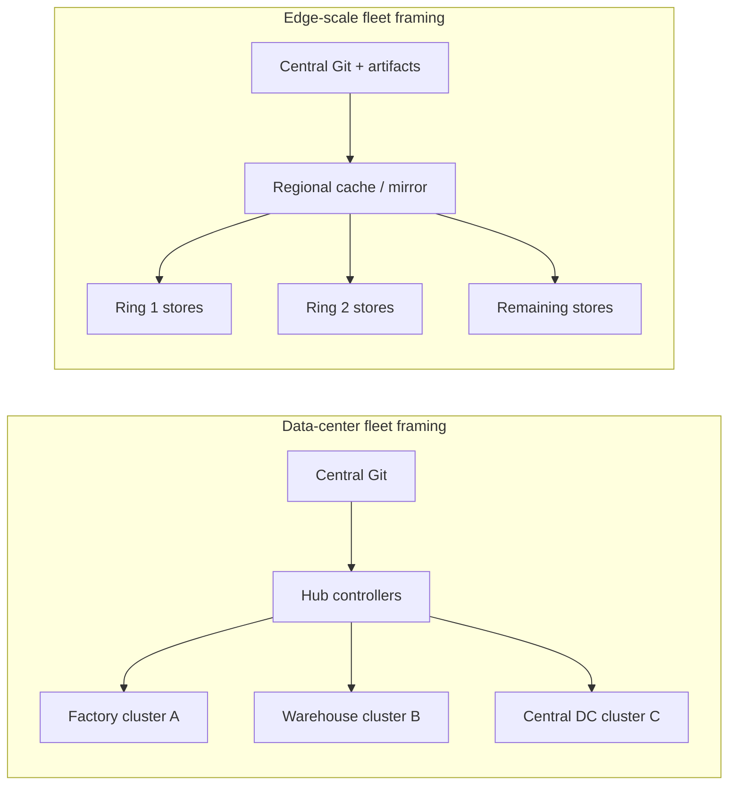
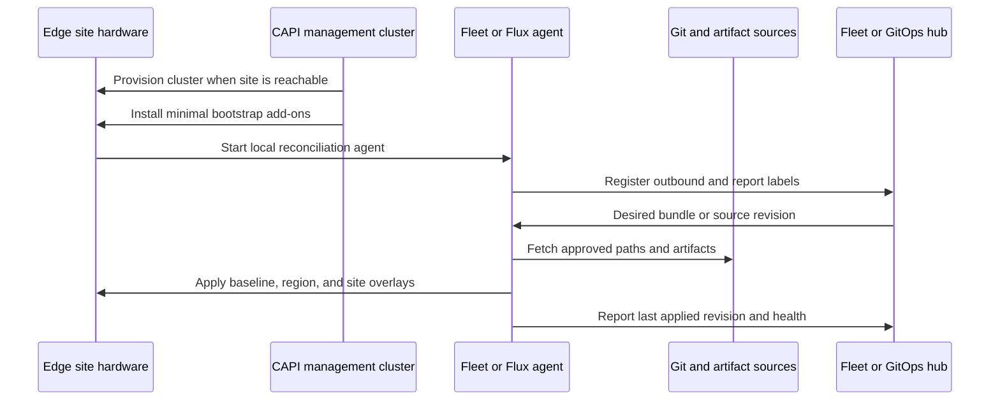

> **Complexity**: `[ADVANCED]` | Time: 60-75 minutes
>
> **Prerequisites**: [Module 5.4: Fleet Management](../module-5.4-fleet-management/), [Module 5.3: Cluster API on Bare Metal](../module-5.3-cluster-api-bare-metal/), [ArgoCD](../../../platform/toolkits/cicd-delivery/gitops-deployments/module-2.1-argocd/), [Flux](../../../platform/toolkits/cicd-delivery/gitops-deployments/module-2.3-flux/), and the [Edge Kubernetes Distros Landscape](../../../platform/toolkits/infrastructure-networking/k8s-distributions/module-14.8-edge-distros-landscape/).

---

## Learning Outcomes

After completing this module, you will be able to:

- **Design** edge fleet GitOps topologies for hundreds to thousands of small Kubernetes clusters without copying the data-center assumptions from normal multi-cluster operations.
- **Compare** Rancher Fleet, Argo CD ApplicationSets, and Flux multi-cluster patterns for intermittent connectivity, bandwidth limits, and per-site overrides.
- **Implement** bandwidth-aware rollout controls using Fleet partitions, ApplicationSet generator inputs, Flux Kustomization chains, sparse checkout, scheduled promotion windows, and local registry mirrors.
- **Operate** disconnected sites by defining last-known-good behavior, offline rollout semantics, reconciliation catch-up, and partial-fleet observability signals.
- **Limit** blast radius with geography-based canaries, ring promotion, cluster labels, maintenance freezes, and declarative Cluster API bootstrap when sites come online.

---

## Why This Module Matters

[Module 5.4: Fleet Management](../module-5.4-fleet-management/) covers the data-center fleet case: dozens of clusters in factories, warehouse racks, and central data centers where the main questions are hub-spoke control loops, policy distribution, and bare-metal day-two operations. This module covers the edge-scale case: hundreds to thousands of small clusters at retail stores, branches, clinics, restaurants, kiosks, or IoT aggregation sites. That is not just "more clusters." It is a different operating model because many sites are bandwidth constrained, intermittently connected, physically distant from operators, and locally customized in ways that cannot be ignored.

The sister module in [cloud enterprise hybrid fleet management](../../../cloud/enterprise-hybrid/module-10.5-fleet-management/) looks at multi-cloud governance, especially Azure Arc and GKE Fleet as enterprise inventory and policy surfaces. This module stays closer to the ground. The central question is not "Which cloud management plane governs all clusters?" The question is "How do we safely move desired state to a thousand small clusters when some stores are offline, some links are metered, and one bad image pull wave can saturate the network before the help desk knows what happened?"

Hypothetical scenario: A retailer ships a point-of-sale sidecar update to every store at 02:00 UTC because the staging cluster passed, the GitOps pull request looked harmless, and the platform team believed that "automated sync" meant "automated safety." Two hundred stores in one geography pull a large image at the same time over shared backhaul links, fail readiness because an environment-specific certificate path differs in that geography, and stay degraded until local cache warmup and manual rollback work through the queue. Nothing about Kubernetes was mysterious. The failure was a fleet design failure: no geography canary, no bandwidth-aware partitioning, no per-site override contract, and no partial-fleet dashboard showing that the blast radius was expanding before the all-stores wave began.

Public retail edge discussions make the scale concrete. CNCF has described retailers operating or planning for hundreds or thousands of stores with local Kubernetes and GitOps, and older Chick-fil-A reporting discussed the plan to run a cluster per restaurant. You do not need to copy those architectures to learn from them. The useful lesson is the multiplication effect: a five-minute manual recovery step becomes more than eighty staff-hours across one thousand sites before retries, failed stores, and time zones are counted. Edge fleet engineering exists to prevent that arithmetic from becoming the platform team's normal life.

This module is deliberately not a replacement for the single-cluster GitOps lessons in the ArgoCD and Flux toolkit modules. Those modules teach how a controller reconciles one cluster well. Here you learn the fleet layer around that controller: cluster selection, rollout rings, offline behavior, repository shape, artifact distribution, override boundaries, and observability when "the fleet" is never fully online at the same time. The strongest edge platforms treat every rollout as a distributed systems event, not as a larger version of `kubectl apply`.

---

## Did You Know

- **Did You Know: Fleet defaults matter.** Rancher Fleet's rollout documentation explains that default partition behavior can allow broad rollout unless you deliberately configure stricter `maxUnavailable`, `maxUnavailablePartitions`, and partition settings for the fleet shape.
- **Did You Know: ApplicationSets generate Applications, not bandwidth.** Argo CD ApplicationSet generators remove manifest copy-paste, but the resulting Applications still need controller capacity, repository-server capacity, cluster credentials, and reachable target APIs.
- **Did You Know: Flux can reduce source artifact size.** Flux `GitRepository.spec.sparseCheckout` can limit which directories are present in the produced artifact, which is useful when edge clusters only need a small slice of a monorepo.
- **Did You Know: Cluster API can bootstrap GitOps.** The Cluster API book documents workload bootstrap patterns where Cluster API installs a GitOps agent, then the agent hydrates workload clusters from Git after the cluster exists.

---

## The Edge Fleet Problem

The edge fleet problem starts when a pattern that worked for one cluster becomes harmful at one thousand sites. A single cluster can tolerate a manual values file, one emergency `kubectl patch`, and a human who remembers that store 142 has a different printer daemon. A thousand clusters cannot. Every implicit exception becomes hidden state. Every large image becomes a network event. Every missing label becomes a rollout that touches the wrong geography. Every offline site becomes a reconciliation question: should it apply the missed update immediately when it returns, hold for the next local maintenance window, or stay on last-known-good until an operator releases it?

Data-center multi-cluster operations often assume strong links between locations, staffed facilities, and a small enough cluster count that operators can read every incident name. Edge fleets break those assumptions. A store may have one small server and a backup LTE link. A clinic may share bandwidth with medical systems that have higher priority than platform updates. A branch may be reachable only through outbound HTTPS. A factory cell may have local network policy exceptions that exist for safety reasons and cannot be normalized away by a central team.

The first design rule is to separate "same desired platform baseline" from "identical rendered manifests." Edge fleets need consistency, but they rarely need byte-for-byte sameness. The baseline might require the same logging agent, admission policy, certificate issuer, and service mesh mode everywhere. The rendered output may still differ by geography, store format, local registry, hardware class, time zone, data residency rule, or disabled peripheral. The fleet layer should make those differences explicit through labels, overlays, values, and promotion rings rather than through untracked changes on each cluster.

| Concern | Module 5.4 data-center fleet | This module edge fleet | Module 10.5 multi-cloud governance |
|---|---|---|---|
| Typical scale | Dozens of clusters in factories and central data centers | Hundreds to thousands of small retail, branch, clinic, or IoT clusters | Dozens to hundreds across Azure, GCP, AWS, and on-prem |
| Network assumption | Hub and spokes usually have planned enterprise connectivity | Sites may be offline, metered, NATed, or constrained to outbound HTTPS | Cloud provider control planes are reachable but identity and policy differ |
| Main risk | Drift, hub failure, policy gaps, bare-metal lifecycle mistakes | Bandwidth storms, missed sites, local overrides, geography-wide blast radius | Cross-cloud governance gaps, provider-specific policy and inventory |
| Best first read | [5.4 Fleet Management](../module-5.4-fleet-management/) | Current module | [10.5 Multi-Cloud Fleet Management](../../../cloud/enterprise-hybrid/module-10.5-fleet-management/) |
| Tool emphasis | OCM, Fleet, ApplicationSets, Karmada, bare-metal management | Fleet, ApplicationSets, Flux, CAPI bootstrap, local mirrors, rollout rings | Azure Arc, GKE Fleet, enterprise policy and inventory |

The second design rule is to make rollout physics visible. At edge scale, the control plane is not the only bottleneck. Git servers, artifact storage, container registries, WAN links, DNS, proxy infrastructure, and human support queues are all part of the rollout path. If a new image is 700 MiB and five hundred stores pull it through the same regional proxy within ten minutes, the incident is not a Kubernetes scheduler problem. It is a release engineering problem that should have been modeled before the merge.

The third design rule is to design for eventual consistency without surrendering safety. A disconnected store should continue running the last successfully applied state. When it reconnects, the agent should report last-seen time, current revision, attempted revision, and whether a blocked ring should still apply. The hub should not treat "offline during rollout" and "online but failed readiness" as the same condition. Those states require different operational responses, and combining them into one red count makes the fleet dashboard noisy but not useful.



The diagram is intentionally simple. In the data-center case, the hub is the obvious center of gravity. In the edge case, the rollout path has more layers because the system must control geography, bandwidth, and offline catch-up. A federated topology with regional Git mirrors, registry mirrors, or regional Fleet shards can reduce dependency on one central controller, but it adds promotion coordination. A hub-and-spoke topology is simpler to reason about, but it must be partitioned carefully so one hub decision does not overwhelm the entire estate.

## Rancher Fleet at Edge Scale

Rancher Fleet is a natural edge-fleet candidate because its model is built around Git repositories, bundles, targets, cluster groups, and downstream agents. A `GitRepo` tells Fleet which repository paths to watch. Fleet renders deployable bundles from those paths. Target selectors map those bundles to clusters or cluster groups. `BundleDeployment` status records whether each target has applied the desired bundle. Downstream agents reconcile locally and report status back upstream, which matches the edge preference for outbound communication and local actuation.

The strongest Fleet design practice is to make cluster labels boring and universal. Labels such as `site-id`, `region`, `country`, `ring`, `store-format`, `network-tier`, `hardware-class`, `maintenance-window`, and `registry-zone` should be assigned during registration, not invented per application. Fleet target selectors and `targetCustomizations` can then express a platform baseline once and apply small changes where needed. If every team creates a different label vocabulary, Fleet still works technically, but the organization loses the ability to reason about blast radius.

Fleet's rollout strategy is central to edge safety. The official rollout docs describe partitions, `maxUnavailable`, `maxUnavailablePartitions`, `autoPartitionSize`, and `maxNew`. Those settings let you deploy by ring, hold progress when too many clusters are not ready, and prevent image pull storms by limiting the number of `BundleDeployments` created at once. Defaults are not a strategy. For a real retail fleet, configure explicit partitions such as `ring=canary`, `region=emea-1`, `region=emea-2`, and `ring=all` so the order mirrors support staffing and network capacity.

Fleet does not turn maintenance windows into a full calendar scheduler by itself. The practical pattern is to combine Fleet controls with release workflow controls: keep risky bundles `paused`, promote by branch or tag during approved local windows, and use scheduled automation to remove the pause or advance a ring only when that geography is allowed to receive change. This distinction matters. If the platform team says "Fleet handles maintenance windows" but actually means "a cron job changes Git or unpauses a bundle," the runbook should say that plainly so incident responders know which control to stop during an emergency freeze.

Bundle rendering is also a scaling cost. Fleet's hub-side Git jobs and bundle compilation are useful because they centralize rendering and produce clear per-target status, but they also concentrate CPU, memory, API writes, and Git traffic on the management side. SUSE's Fleet scaling write-up and Fleet installation docs both discuss scaling and sharding considerations. For edge estates, treat Fleet controllers like production platform services: monitor queue depth, Git job duration, bundle count, `BundleDeployment` count, and shard distribution before adding another thousand sites.

```yaml
defaultNamespace: store-platform

targetCustomizations:
  - name: canary-stores
    clusterSelector:
      matchLabels:
        ring: canary
    helm:
      values:
        image:
          tag: "2026.05.25-canary"
        telemetry:
          sampleRate: "0.50"

  - name: low-bandwidth-sites
    clusterSelector:
      matchLabels:
        network-tier: constrained
    helm:
      values:
        image:
          registry: "registry.edge.local/platform"
        sync:
          maxParallelDownloads: 1

rolloutStrategy:
  maxUnavailable: 5%
  maxUnavailablePartitions: 0
  partitions:
    - name: ring-1-retail-region-1
      maxUnavailable: 0
      clusterSelector:
        matchLabels:
          rollout-ring: retail-region-1
    - name: ring-2-retail-region-2
      maxUnavailable: 2%
      clusterSelector:
        matchLabels:
          rollout-ring: retail-region-2
    - name: all-remaining-stores
      maxUnavailable: 5%
      clusterSelector:
        matchLabels:
          rollout-ring: all
```

Read that example as an operating contract, not as a magic recipe. The first partition allows no failed canaries because the point of a canary is to protect everyone else. Later rings tolerate a small number of unavailable clusters because edge fleets are rarely perfectly green. Low-bandwidth sites use a local registry value so the workload pulls from a nearby mirror rather than from a central registry. That only works if the platform also operates the mirror and validates that images are replicated before the ring opens.

## Argo CD ApplicationSet for Edge

Argo CD ApplicationSet is excellent at generating many Argo CD `Application` resources from a smaller declarative input. The cluster generator reads Argo CD's registered clusters and labels. The list generator uses explicit elements. The Git generator reads directories or files from a repository. At edge scale, these generators can model "one app per store," "one baseline per geography," or "one overlay per site" without creating thousands of hand-written Application manifests.

The caveat is that ApplicationSet solves object generation, not the entire edge operating problem. Standard Argo CD is push-oriented: the application controller applies manifests to target cluster APIs using credentials stored on the Argo CD side. That is comfortable when clusters are reachable and centrally governed. It is fragile when store clusters are behind NAT, offline for part of the day, or reachable only through outbound tunnels. If you keep Argo CD as the fleet engine for edge, budget for sharding, regional Argo CD instances, repo-server capacity, cluster credential rotation, and clear behavior when a cluster is unreachable during a sync wave.

The single-controller bottleneck is a design risk, not a reason to avoid Argo CD everywhere. The Argo CD high availability documentation covers scaling components and controller sharding. For edge fleets, you normally choose one of three patterns: one regional Argo CD instance per geography, one central Argo CD with carefully sharded application controllers and reachable clusters, or Argo CD generating desired state that a pull-based layer applies downstream. Pick the pattern based on network direction and failure domain, not on which UI people prefer.

ApplicationSet per-site overrides should be generated from data that has an owner. A Git generator can read `clusters/store-0142/config.yaml`; a cluster generator can select labels such as `region=emea` and `hardware-class=small`; a list generator can hold a temporary exception during a migration. Do not let arbitrary Helm values creep into ApplicationSet templates without review. That turns the generator into a hidden configuration database, and hidden databases fail exactly when the fleet grows.

```yaml
apiVersion: argoproj.io/v1alpha1
kind: ApplicationSet
metadata:
  name: store-baseline
  namespace: argocd
spec:
  goTemplate: true
  goTemplateOptions: ["missingkey=error"]
  generators:
    - matrix:
        generators:
          - clusters:
              selector:
                matchLabels:
                  fleet-role: edge-store
          - git:
              repoURL: https://github.com/example/edge-fleet-config.git
              revision: main
              files:
                - path: "clusters/{{.name}}/values.yaml"
  template:
    metadata:
      name: "baseline-{{.name}}"
    spec:
      project: edge-stores
      source:
        repoURL: https://github.com/example/store-platform.git
        targetRevision: main
        path: charts/store-baseline
        helm:
          valueFiles:
            - "values.yaml"
            - "../../edge-fleet-config/clusters/{{.name}}/values.yaml"
      destination:
        server: "{{.server}}"
        namespace: store-platform
```

That example is intentionally strict about missing keys. A missing per-site file should fail generation in a visible way rather than silently deploying a default that may be wrong for a store. In production you may separate repository credentials, use multiple sources, or keep values in a different structure. The important point is that the generator input is auditable and the template does not hardcode one-off exceptions inside the controller manifest.

## Flux Multi-Tenant and Multi-Cluster Patterns at Edge

Flux is often strongest when you want pull-based reconciliation close to the workload cluster, clear Kubernetes-native APIs, and strong tenant boundaries. A Flux `GitRepository` produces a source artifact. A Flux `Kustomization` builds and applies a path from that artifact. `dependsOn`, `wait`, `healthChecks`, service-account scoping, and suspend/resume semantics make Flux useful for ordered baseline chains such as namespaces first, CRDs second, policies third, and applications fourth. At edge scale, those chains prevent a returning site from applying application manifests before the local prerequisites exist.

Flux multi-tenancy is important when the edge fleet has several owners. The platform team may own the baseline Kustomizations, the security team may own policy bundles, and regional operations may own site-specific overlays. Flux supports lockdown patterns where controllers reconcile through scoped service accounts and tenants can be restricted to their namespaces and sources. That is not just a security feature. It is a blast-radius feature because a bad regional overlay should not be able to rewrite the global baseline or another geography's configuration.

Flux also has useful bandwidth controls at the source layer. The official GitRepository docs describe `.spec.interval`, shallow clone behavior for branch references, `.spec.sparseCheckout`, suspend behavior, artifact status, and source-controller jitter. Sparse checkout is directly relevant to edge monorepos because a store cluster may need only `clusters/store-0142`, `regions/emea`, and `baseline`, not the whole enterprise platform repository. This is more precise than saying "GitOps is delta-only." Git itself can transfer deltas, but many controllers produce artifacts and may still fetch or package more than the edge site needs unless you design the source object carefully.

Cluster API integration is a practical Flux pattern. Cluster API creates the cluster. A bootstrap add-on such as the Cluster API add-on provider for Helm can install Flux or another GitOps agent. Then the agent hydrates the new workload cluster from Git. This is a good fit for edge sites that appear intermittently because the bootstrap contract is declarative: when the API, network, and credentials are present, controllers move the site toward desired state. When the site is absent, the management plane should show waiting or failed conditions rather than asking a human to remember which shell script did not finish.

```yaml
apiVersion: source.toolkit.fluxcd.io/v1
kind: GitRepository
metadata:
  name: edge-fleet
  namespace: flux-system
spec:
  interval: 30m
  url: https://github.com/example/edge-fleet.git
  ref:
    branch: main
  sparseCheckout:
    - baseline
    - regions/emea
    - clusters/store-0142
---
apiVersion: kustomize.toolkit.fluxcd.io/v1
kind: Kustomization
metadata:
  name: store-0142-baseline
  namespace: flux-system
spec:
  interval: 30m
  retryInterval: 5m
  timeout: 3m
  prune: true
  wait: true
  sourceRef:
    kind: GitRepository
    name: edge-fleet
  path: ./clusters/store-0142
  dependsOn:
    - name: regional-prereqs
```

The interval is deliberately longer than a typical data-center GitOps interval because the example assumes constrained store bandwidth. That does not mean every edge site should reconcile every thirty minutes. It means the interval should be a design parameter tied to network tier, regulatory urgency, and local operating windows. Security policies may reconcile faster than application releases. Image automation may be disabled at stores and handled centrally through signed promotion commits.

## Bandwidth-Aware Sync

Bandwidth-aware sync begins with repository shape. Put global baseline, regional overlays, and per-site overlays in paths that controllers can select without reading unrelated application history. Keep large binaries, rendered chart archives, test fixtures, and screenshots out of the fleet repository. Prefer OCI artifacts or Helm repositories for packaged content when that reduces Git churn. If a controller supports sparse checkout, path filters, or source includes, use those features deliberately and verify the produced artifact size in status.

The second layer is schedule and jitter. A thousand stores reconciling every five minutes on the same minute can become a self-inflicted distributed load test against Git, object storage, proxies, and registries. Flux source-controller supports intervals and controller jitter. Fleet supports polling intervals and rollout partitions. Argo CD supports webhooks and controller scaling patterns. The exact mechanism varies by tool, but the operating rule is the same: avoid synchronized polling and synchronized pulling unless the network has been sized for it.

The third layer is image distribution. Git manifests are usually tiny compared with container images. A safe GitOps rollout can still fail because every store pulls the same large image from a central registry. Use local or regional registry mirrors when images are large, links are metered, or many stores share upstream bandwidth. Pre-warm mirrors before opening a ring. Keep image tags immutable or digest-pinned so mirrors cannot serve different content for the same desired state. Monitor mirror lag as a release gate, not as a best-effort cache.

The fourth layer is release payload discipline. If a point-of-sale update changes one small ConfigMap, do not package it with a base image rebuild that every store must download. If a base image rebuild is required, roll it through a bandwidth ring and observe mirror hit rates before promoting globally. If a site cannot pull within its maintenance window, the release should pause for that partition rather than continuing until support tickets become the only feedback loop.

| Technique | Edge benefit | Tooling notes |
|---|---|---|
| Fleet `paths` and bundle partitioning | Limits what Fleet renders and how many clusters receive updates at once | Use explicit paths and rollout partitions in `fleet.yaml` |
| Flux `sparseCheckout` | Reduces source artifact contents for per-site or per-region reconciliation | Verify `.status.observedSparseCheckout` and artifact size |
| Argo CD Git generator with narrow directories | Avoids hand-written Application lists while keeping overlays organized | Does not remove the need to scale repo-server and application controllers |
| Webhooks plus jittered polling | Reduces synchronized polling against Git servers | Keep polling as a fallback for missed webhook events |
| Regional registry mirrors | Reduces central registry load and WAN transfer | Gate rollout on mirror freshness and digest availability |
| Scheduled promotion windows | Aligns change with staffing, bandwidth, and local business hours | Implement through branch/tag promotion, paused bundles, or controller suspend/resume |

Do not overpromise "delta-only updates" unless you know the exact controller path. Git may transfer packfile deltas; OCI registries may reuse layers; a local mirror may cache blobs; and a controller may still package a fresh artifact for each revision. The honest design statement is: minimize changed bytes, avoid fetching irrelevant paths, reuse image layers, mirror close to the site, and measure transfer volume during rehearsals. If you cannot measure it, you cannot claim the rollout is bandwidth-aware.

## Per-Site Overrides Without Configuration Sprawl

Per-site overrides are unavoidable. Some stores have a local payment terminal integration. Some factories have a safety network segment. Some clinics have country-specific retention rules. The question is whether those differences are first-class configuration or invisible drift. A mature edge fleet treats overrides as typed, reviewed, and bounded data: Helm values for tunable chart settings, Kustomize overlays for manifest patches, labels for selection, and policy exceptions with expiration dates.

A useful overlay hierarchy is `baseline -> region -> site`. The baseline contains the common platform. The region overlay handles data residency, registry endpoint, time zone family, and language-sensitive settings. The site overlay handles hardware class, local peripheral enablement, and a small number of approved exceptions. Avoid a hierarchy such as `baseline -> team -> emergency -> store-copy-final` because nobody can reason about precedence during an incident.

```text
edge-fleet-repo/
  baseline/
    namespaces/
    observability/
    policy/
  regions/
    emea/
      kustomization.yaml
      registry-mirror-patch.yaml
    amer/
      kustomization.yaml
      telemetry-retention-patch.yaml
  clusters/
    store-0142/
      kustomization.yaml
      values.yaml
    store-0917/
      kustomization.yaml
      values.yaml
```

Helm values are best for chart-supported choices: resource requests, feature flags, image registry, local endpoints, and replica counts. Kustomize overlays are best for Kubernetes-native patches: labels, annotations, environment variables, tolerations, namespace names, and generated ConfigMaps. If you find yourself using Kustomize to patch hundreds of chart internals, the chart is not exposing the edge contract you need. If you find yourself writing Helm templates that encode every store by name, you are building a fragile inventory system inside a chart.

Every override needs an owner and a removal path. The owner may be `platform-edge`, `security-emea`, or `store-networking`. The removal path may be "expires after migration," "review every quarter," or "permanent because store hardware differs." Without this metadata, the fleet accumulates historical exceptions that no one is brave enough to delete. That is how per-site configuration drift becomes permanent platform architecture.

## Cluster API and Edge Cluster Lifecycle

Cluster API manages the clusters themselves: machines, control planes, infrastructure references, bootstrap data, upgrades, and lifecycle operations. In an edge fleet, Cluster API is most useful when the site has enough infrastructure API surface to be managed declaratively. That might be Metal3 and BMC access for bare metal, vSphere at a branch, or a local appliance workflow that exposes an API. It is less useful when the site is a sealed box with no reliable management path and replacement is handled by shipping hardware.

The edge pattern is "CAPI births the cluster; GitOps hydrates the cluster." The management cluster owns CAPI objects. The bootstrap process installs the Kubernetes control plane and a small GitOps or fleet agent. Once the agent connects, it applies the platform baseline, regional overlay, and site overlay. This keeps cluster creation and workload configuration separate while still making both declarative. [Module 5.3](../module-5.3-cluster-api-bare-metal/) covers bare-metal CAPI mechanics; here the extra edge question is how long a partially provisioned site can sit offline without creating unsafe assumptions.

Intermittent connectivity changes reconciliation semantics. If a store comes online after two days offline, CAPI may see stale machine status, GitOps may see several missed commits, and observability may show a stale last-seen signal. The platform should not blindly compress all missed changes into one immediate surge. A good design checks the site's current ring, the local maintenance window, the required Kubernetes version, mirror readiness, and whether any skipped commits require manual intervention. Automation can do that, but only if the data model includes those gates.

Cluster API also creates a natural handoff to Fleet. Fleet's cluster registration docs describe manager-initiated registration through a `Cluster` resource that references a kubeconfig secret in the same style used by Cluster API, and agent-initiated registration when the downstream cluster connects outbound with a token. For edge, agent-initiated registration is often safer because the management plane does not need inbound reachability to every store API server. For data-center clusters with direct routing, manager-initiated registration can be simpler.



The key edge property in that sequence is that the site can rejoin after absence. It does not require an operator to remember every missed action. It also does not assume that the hub can reach the store API server at all times. If your design requires direct API reachability for every reconciliation, it may still work in a lab, but it is not an edge-resilient design unless the network team has committed to that reachability as a product dependency.

## Failure Isolation and Rollout Rings

Failure isolation is the discipline of deciding who is allowed to fail together. The worst possible answer is "everyone." Edge fleets need rings because geography, bandwidth, staffing, and customer impact are uneven. A practical retail rollout might begin with five internal lab stores, move to ten stores in one city, then one low-risk region, then one high-volume region during a staffed window, and only then the rest of the fleet. The ring labels should live on clusters, and promotion should be visible in Git or the fleet controller status.

Ring design should account for correlated risk. If all canaries are in one country with excellent fiber, they will not reveal problems in rural stores with LTE backup. If all canaries have the newest hardware, they will not reveal image pull failures on older disks. If all canaries are low-traffic stores, they will not reveal latency issues at peak volume. A useful canary ring includes a small but representative slice of hardware, network tier, geography, and business pattern.

Disconnected operations require a policy for missed rollouts. There are three common policies. "Catch up immediately" is acceptable for low-risk baselines such as documentation ConfigMaps or non-disruptive telemetry changes. "Catch up at next maintenance window" is safer for application updates and node-affecting changes. "Hold until operator review" is appropriate when skipped versions include schema changes, certificate rotations, or Kubernetes minor upgrades. The policy should be encoded through labels, suspended Kustomizations, paused bundles, or promotion branches rather than through tribal knowledge.

Blast-radius limits need hard numbers. A release plan that says "roll out slowly" is not a control. A release plan that says "ring 1 has 10 stores, ring 2 has 50 stores, no more than one partition may be NotReady, and promotion stops if payment success drops by 0.5 percent for fifteen minutes" is a control. Fleet can enforce partition readiness. Argo CD and Flux can expose health and sync state. Your observability system must enforce the business and network gates around those controller states.

```text
retail-region-1  ->  retail-region-2  ->  retail-region-3  ->  all
   10 stores            50 stores            200 stores        remaining
   strict gate          network gate         support gate      aggregate gate
   no failures          mirror warm          staffed window    partial dashboard
```

Rollback should follow the same ring model. Reverting Git globally may be correct when a release is actively harmful everywhere, but many edge incidents are partial. If only `retail-region-2` is failing because of a local certificate bundle, reverting all regions creates unnecessary churn and may trigger more image pulls. Prefer ring-specific rollback commits or selector changes when the blast radius is bounded. Keep the global kill switch for true global hazards.

## Observability for Partial Fleets

Edge observability is not just Prometheus at more locations. The central dashboard must answer fleet-specific questions: Which sites have not been seen recently? Which sites are on the last approved revision? Which sites attempted the new revision and failed? Which sites are offline, and which are online but degraded? Which regions have mirror lag? Which ring is blocked, and what condition blocked it? Without those answers, operators see a wall of red and cannot tell whether they have a release problem, a network problem, or a reporting problem.

Last-seen signals are the minimum viable edge fleet metric. Every site should report agent last heartbeat, last applied revision, last attempted revision, Kubernetes version, node readiness summary, registry mirror used, and current ring. A site that has not been seen for six hours may be normal if the store is closed and on a nightly power schedule. The same signal may be a high-severity incident for a hospital clinic. Alert thresholds must be tied to site class, not copied globally.

Partial-fleet dashboards should show percentages and named exceptions. "972 of 1000 sites healthy" is useful only if the missing 28 are grouped by geography, business criticality, and rollout ring. During a release, the dashboard should separate "not selected yet" from "pending because partition has not opened," "offline during selection," "applying," "ready," and "failed." That vocabulary prevents teams from pressuring operators to chase stores that are not supposed to be updated yet.

Bandwidth observability belongs beside application health. Track Git artifact size, source fetch duration, registry mirror hit ratio, image pull duration, bytes transferred by region, and Fleet or Flux reconcile duration. If those metrics degrade before application readiness fails, you can pause a rollout before customers notice. If you only alert on application pods, the network may already be saturated by the time the first page arrives.

## Decision Framework

Choose Rancher Fleet when you want a fleet-first GitOps engine with bundle status, target selectors, cluster groups, downstream agents, rollout partitions, and a strong fit with Rancher-managed or standalone edge clusters. Be honest about hub-side render and bundle compilation cost. Use sharding, resource limits, explicit partitions, and source hygiene before treating a single management cluster as an infinite control plane.

Choose Argo CD ApplicationSets when your organization already operates Argo CD well, clusters are reachable or grouped behind regional Argo instances, and developers benefit from Argo CD projects, UI, sync waves, and Application health. Be honest about push-model networking, cluster credentials on the hub, controller and repo-server capacity, and the fact that ApplicationSet generation does not by itself implement offline catch-up or bandwidth-aware image rollout.

Choose Flux when pull-based local reconciliation, tenant boundaries, Kustomization dependency chains, and sparse source artifacts matter more than a central UI. Be honest about dashboard needs because Flux is intentionally controller-native; many teams add notification, metrics, or an internal portal to make partial-fleet state visible. Flux is especially strong when each edge cluster can own its local reconcile loop and report status upstream through a separate observability channel.

Use Cluster API when edge cluster lifecycle can be represented declaratively and the management plane can reach the infrastructure API often enough to make reconciliation meaningful. Do not force CAPI into environments where replacement is a logistics process rather than an API operation. In those environments, use immutable images, bootstrap tokens, and agent registration as the primary lifecycle workflow, then let the fleet layer converge after the box appears.

| Requirement | Prefer this pattern | Reason |
|---|---|---|
| Outbound-only store networks | Fleet agent or local Flux agent | The site initiates communication rather than exposing its API server |
| Existing Argo CD platform with reachable regional clusters | Regional ApplicationSet instances | Keeps familiar Argo workflows while limiting failure domains |
| Strong tenant isolation across baseline, security, and regional teams | Flux multi-tenancy with service accounts | Scopes reconciliation permissions and source ownership |
| Declarative cluster birth and add-on bootstrap | Cluster API plus GitOps bootstrap | Separates infrastructure lifecycle from workload hydration |
| Low bandwidth and large images | Regional mirrors plus ring rollout | Reduces central transfer and prevents synchronized pull storms |
| Strict geography blast radius | Label-based partitions and promotion branches | Makes rollout boundaries auditable and reversible |

## Reference Operating Model

An edge fleet needs a small number of durable ownership boundaries. The platform team should own the fleet controller, cluster label schema, baseline repository, promotion workflow, registry mirror contract, and emergency freeze mechanism. Regional operations should own site inventory, maintenance-window data, local network exceptions, and validation of store-specific overrides. Application teams should own application manifests and release notes, but they should not be allowed to bypass fleet rings by pointing directly at store clusters. Security should own policy bundles, exception expiry, signing requirements, and audit evidence that proves which revision each site last applied.

The release process should be written as a state machine rather than a meeting habit. A normal release starts with artifact publication, mirror warmup, configuration validation, canary ring selection, ring 1 promotion, health observation, ring 2 promotion, and broad rollout. A freeze changes the state machine by blocking promotion, not by asking every engineer to remember a Slack message. A rollback changes the selected revision for one ring or the whole fleet, then waits for the same readiness and bandwidth signals used by forward promotion. This makes safety repeatable across time zones and staffing changes.

Inventory quality is the hidden dependency. If the inventory says a store is in `retail-region-1` but the network, registry mirror, and support desk treat it as `retail-region-2`, automation will make a confident wrong decision. Reconcile inventory with observed agent metadata. Compare declared country, time zone, registry zone, Kubernetes version, hardware class, and last-seen network tier against what the site reports. Treat inventory drift as a platform defect because rollout selectors are only as safe as the labels they consume.

Finally, rehearse degraded paths before the first urgent release. Disconnect a lab store during a rollout and confirm the dashboard says offline rather than failed. Delay a mirror sync and confirm promotion blocks. Put a bad value in one site overlay and confirm only that site fails. Overload a canary's image pull path and confirm the next ring remains closed. Edge fleet maturity shows up in these rehearsals because the real incident will combine several small failures at once.

## Common Mistakes at Edge Fleet Scale

| Mistake | Why it fails at the edge | Better pattern |
|---|---|---|
| Treating 5.4 data-center fleet patterns as complete edge guidance | Dozens of reachable clusters do not model store outages, metered links, or local exceptions | Use [5.4](../module-5.4-fleet-management/) for fleet basics, then add edge rings, mirrors, and offline policy |
| Generating one Application per site without controller sizing | ApplicationSet removes YAML copy-paste but can overload Argo CD controllers and repo-server | Shard by geography, use regional instances, or use a pull-based downstream agent |
| Letting every store pull images from the central registry | A normal deployment becomes a registry and WAN load event | Pre-warm regional mirrors and gate rollout on digest availability |
| Hiding site differences as live-cluster patches | The next reconciliation deletes or fights the exception | Put overrides in Helm values, Kustomize overlays, or reviewed policy exceptions |
| Using one global maintenance window | Local business hours, staffing, and bandwidth differ by region | Promote by geography and site class with explicit freeze controls |
| Treating offline and failed sites as one red count | Operators cannot distinguish normal disconnection from broken rollout | Track last-seen, last attempted revision, and health separately |
| Allowing all rings to advance on technical readiness only | Workloads can be ready while business metrics or network transfer is unhealthy | Gate promotion on readiness, error budgets, mirror metrics, and support capacity |

## Knowledge Check

<details>
<summary>1. A team says, "ApplicationSet solved our edge fleet problem because it generates one Argo CD Application per store." What is missing from that claim?</summary>

ApplicationSet solves the generation problem, but the team still needs a network model, controller capacity plan, repository-server scaling plan, cluster credential model, offline behavior, bandwidth controls, and blast-radius policy. At edge scale, generated Applications are only one part of the operating system. The team must also decide whether Argo CD can reach every store API server, whether regional sharding is required, and how a missed or failed store is represented during rollout.

</details>

<details>
<summary>2. Why is "all stores pull the new image at midnight" not a safe rollout plan even if every Kubernetes manifest is correct?</summary>

The image pull path can fail independently of the manifest path. A synchronized pull can saturate WAN links, proxies, registries, or local disks, especially when many sites share upstream bandwidth. A safer plan uses local or regional mirrors, digest verification, pre-warming, partitions, and promotion rings so the platform can observe pull duration and mirror hit rates before opening the next group.

</details>

<details>
<summary>3. A store is offline during ring 2 and reconnects after ring 4 has opened. Should it immediately apply every missed change?</summary>

Not automatically. The correct behavior depends on the rollout policy for the missed changes. Low-risk baseline changes may catch up immediately, application releases may wait for the store's next maintenance window, and schema or certificate changes may require operator review. The important design point is that offline catch-up is a policy decision encoded in labels, suspend state, paused bundles, or promotion branches, not a surprise side effect.

</details>

<details>
<summary>4. When is Rancher Fleet a better edge fit than a central push-only GitOps controller?</summary>

Fleet is often a better fit when downstream clusters should initiate communication, when target selection and bundle status need to be fleet-native, and when rollout partitions should limit how many clusters receive a bundle at once. It is not free of scaling concerns; hub-side Git jobs, bundle rendering, controller resources, and shard strategy still need production capacity planning.

</details>

<details>
<summary>5. What is the difference between a per-site override and configuration drift?</summary>

A per-site override is declared, reviewed, owned, and reconciled from source control or an approved inventory system. Configuration drift is an unmanaged difference between live state and desired state. The same setting can be healthy or dangerous depending on whether it is represented in Helm values, Kustomize overlays, labels, or policy exceptions with an owner and removal path.

</details>

<details>
<summary>6. Why does Cluster API not automatically solve every edge lifecycle problem?</summary>

Cluster API works when the infrastructure lifecycle can be represented through Kubernetes-style APIs and the management plane can reconcile those APIs reliably. Some edge sites are physically disconnected, replaced through shipping workflows, or managed through limited appliance interfaces. In those cases, CAPI may still help with bootstrap in connected windows, but immutable images, registration tokens, and local agents may be the more realistic lifecycle boundary.

</details>

<details>
<summary>7. Which observability signals are most important during an edge fleet rollout?</summary>

Track site last-seen time, current ring, last applied revision, last attempted revision, sync health, registry mirror freshness, image pull duration, source artifact size, and business-level success indicators for the workload. The dashboard should separate offline, pending, applying, ready, and failed states so operators can pause the correct ring instead of chasing every non-green site.

</details>

## Hands-On: Simulate Three Store Clusters with Fleet

This exercise builds a small local model of an edge fleet. You will create one kind management cluster and three kind store clusters, install Fleet on the management cluster, label each store with different ring and geography metadata, and create a bundle configuration that demonstrates selective sync and per-store overrides. The exact remote registration path can vary by Docker networking environment, so the exercise includes a deterministic manifest review path and an optional live registration path.

Prerequisites:

- [ ] `kind`, `kubectl`, and `helm` are installed.
- [ ] Docker or a compatible local container runtime is running.
- [ ] Your workstation can create four small kind clusters.
- [ ] You understand that this is a lab model, not a production Rancher installation.

### Step 1: Create the kind clusters

Create one management cluster and three store clusters. The store names are deliberately geographic so you can practice selectors that do not rely on anonymous cluster numbers.

```bash
mkdir -p edge-fleet-lab

kind create cluster --name edge-hub
kind create cluster --name store-budapest
kind create cluster --name store-prague
kind create cluster --name store-lisbon

kubectl config get-contexts
```

Success criteria:

- [ ] `kind get clusters` lists `edge-hub`, `store-budapest`, `store-prague`, and `store-lisbon`.
- [ ] `kubectl config get-contexts` shows a context for each cluster.
- [ ] You can explain why the hub and store clusters are separate failure domains in the lab.

### Step 2: Install Fleet on the hub

The Fleet quickstart and installation docs install two Helm charts: CRDs first, then controllers. Keep all Fleet management resources on the hub context for this exercise.

```bash
kubectl config use-context kind-edge-hub

helm repo add fleet https://rancher.github.io/fleet-helm-charts/
helm repo update

helm -n cattle-fleet-system install --create-namespace --wait fleet-crd fleet/fleet-crd
helm -n cattle-fleet-system install --create-namespace --wait fleet fleet/fleet

kubectl -n cattle-fleet-system get pods
kubectl get crd | grep fleet.cattle.io
```

Success criteria:

- [ ] Fleet controller pods are running in `cattle-fleet-system`.
- [ ] Fleet CRDs are present.
- [ ] You can describe why Fleet is installed on the hub rather than separately on every store in this lab.

### Step 3: Prepare store labels and registration manifests

Fleet standalone supports manager-initiated registration by creating a `Cluster` resource that references a kubeconfig secret, and agent-initiated registration when the downstream cluster installs an agent with a token. For a local kind lab, manager-initiated registration is easier to inspect, but Docker networking may require adapting the API server address. The important learning goal is the Fleet data model: each store has labels that later drive target selection.

```bash
kubectl create namespace clusters

kind get kubeconfig --name store-budapest --internal > edge-fleet-lab/store-budapest.kubeconfig
kind get kubeconfig --name store-prague --internal > edge-fleet-lab/store-prague.kubeconfig
kind get kubeconfig --name store-lisbon --internal > edge-fleet-lab/store-lisbon.kubeconfig

kubectl -n clusters create secret generic store-budapest-kubeconfig \
  --from-file=value=edge-fleet-lab/store-budapest.kubeconfig
kubectl -n clusters create secret generic store-prague-kubeconfig \
  --from-file=value=edge-fleet-lab/store-prague.kubeconfig
kubectl -n clusters create secret generic store-lisbon-kubeconfig \
  --from-file=value=edge-fleet-lab/store-lisbon.kubeconfig
```

Create three Fleet cluster resources with labels that model geography, ring, and network class.

```bash
cat > edge-fleet-lab/stores.yaml <<'EOF'
apiVersion: fleet.cattle.io/v1alpha1
kind: Cluster
metadata:
  name: store-budapest
  namespace: clusters
  labels:
    fleet-role: edge-store
    region: emea
    country: hu
    rollout-ring: retail-region-1
    network-tier: constrained
spec:
  kubeConfigSecret: store-budapest-kubeconfig
---
apiVersion: fleet.cattle.io/v1alpha1
kind: Cluster
metadata:
  name: store-prague
  namespace: clusters
  labels:
    fleet-role: edge-store
    region: emea
    country: cz
    rollout-ring: retail-region-2
    network-tier: normal
spec:
  kubeConfigSecret: store-prague-kubeconfig
---
apiVersion: fleet.cattle.io/v1alpha1
kind: Cluster
metadata:
  name: store-lisbon
  namespace: clusters
  labels:
    fleet-role: edge-store
    region: emea
    country: pt
    rollout-ring: all
    network-tier: normal
spec:
  kubeConfigSecret: store-lisbon-kubeconfig
EOF

kubectl apply -f edge-fleet-lab/stores.yaml
kubectl -n clusters get clusters.fleet.cattle.io --show-labels
```

Success criteria:

- [ ] Three Fleet `Cluster` resources exist in the `clusters` namespace.
- [ ] Each cluster has a different `rollout-ring` value.
- [ ] You can explain why labels must be assigned during registration in a real edge fleet.

### Step 4: Create a Fleet bundle with selective sync

Create a tiny baseline manifest and a `fleet.yaml` that targets only `retail-region-1` first. The constrained Budapest store also gets a local registry override. In a real repository, these files would live in Git; this lab keeps them local so you can inspect the rendered intent before wiring a remote repo.

```bash
mkdir -p edge-fleet-lab/repo/baseline

cat > edge-fleet-lab/repo/baseline/namespace.yaml <<'EOF'
apiVersion: v1
kind: Namespace
metadata:
  name: store-platform
  labels:
    owner: platform-edge
EOF

cat > edge-fleet-lab/repo/baseline/config.yaml <<'EOF'
apiVersion: v1
kind: ConfigMap
metadata:
  name: store-baseline
  namespace: store-platform
data:
  release: "2026.05.25"
  registry: "registry.central.example/platform"
EOF

cat > edge-fleet-lab/repo/baseline/fleet.yaml <<'EOF'
defaultNamespace: store-platform

targetCustomizations:
  - name: first-edge-ring
    clusterSelector:
      matchLabels:
        rollout-ring: retail-region-1
    yaml:
      overlays:
        - constrained-network

rolloutStrategy:
  maxUnavailable: 0
  maxUnavailablePartitions: 0
  partitions:
    - name: retail-region-1
      maxUnavailable: 0
      clusterSelector:
        matchLabels:
          rollout-ring: retail-region-1
    - name: retail-region-2
      maxUnavailable: 0
      clusterSelector:
        matchLabels:
          rollout-ring: retail-region-2
    - name: all
      maxUnavailable: 1
      clusterSelector:
        matchLabels:
          rollout-ring: all
EOF

mkdir -p edge-fleet-lab/repo/baseline/overlays/constrained-network
cat > edge-fleet-lab/repo/baseline/overlays/constrained-network/config-patch.yaml <<'EOF'
apiVersion: v1
kind: ConfigMap
metadata:
  name: store-baseline
  namespace: store-platform
data:
  registry: "registry.edge.local/platform"
EOF
```

Success criteria:

- [ ] The Fleet bundle has explicit rollout partitions.
- [ ] Only the first ring has the constrained-network overlay in this initial configuration.
- [ ] You can explain how adding `retail-region-2` to the selector changes blast radius.

### Step 5: Register the GitRepo or review the intent

If you push `edge-fleet-lab/repo` to a reachable Git repository, create a `GitRepo` on the hub that points to the `baseline` path and targets the `clusters` namespace. If you do not want to push a lab repository, review the local files and use the status commands to inspect the Fleet cluster model. The concept is the same: GitRepo selects repository paths, Fleet renders bundles, and target labels decide which stores receive them.

```bash
cat > edge-fleet-lab/gitrepo-example.yaml <<'EOF'
apiVersion: fleet.cattle.io/v1alpha1
kind: GitRepo
metadata:
  name: store-baseline
  namespace: clusters
spec:
  repo: https://github.com/YOUR_ORG/edge-fleet-lab.git
  branch: main
  paths:
    - baseline
  targets:
    - name: edge-stores
      clusterSelector:
        matchLabels:
          fleet-role: edge-store
EOF

kubectl -n clusters get clusters.fleet.cattle.io --show-labels
kubectl -n clusters get gitrepos.fleet.cattle.io
kubectl -n clusters get bundles.fleet.cattle.io
```

Success criteria:

- [ ] You can map `GitRepo.spec.paths` to the files Fleet should render.
- [ ] You can map `clusterSelector` to the three store labels.
- [ ] You can explain why the initial rollout should not target all three stores.

### Step 6: Simulate offline catch-up and promotion

You do not need to break Docker networking to learn the operational rule. Mark one store as frozen, promote the first ring in Git, and describe what should happen when a store returns. In a real Fleet deployment, the offline store would remain NotReady or not last-seen until the agent reconnects; the rollout should not proceed to the next partition if the configured readiness threshold is exceeded.

```bash
kubectl -n clusters label clusters.fleet.cattle.io store-budapest maintenance=frozen --overwrite
kubectl -n clusters label clusters.fleet.cattle.io store-prague rollout-ring=retail-region-1 --overwrite
kubectl -n clusters get clusters.fleet.cattle.io --show-labels
```

Success criteria:

- [ ] You can identify which stores are now in the first rollout ring.
- [ ] You can explain how a frozen site should be held out of risky promotion.
- [ ] You can describe what information the hub needs when a previously offline store reconnects.

### Step 7: Clean up

Remove the lab clusters when you are done. This prevents old Fleet CRDs and contexts from confusing later labs.

```bash
kind delete cluster --name edge-hub
kind delete cluster --name store-budapest
kind delete cluster --name store-prague
kind delete cluster --name store-lisbon
rm -rf edge-fleet-lab
```

Final exercise success criteria:

- [ ] You created a hub and three store clusters.
- [ ] You installed Fleet on the hub.
- [ ] You modeled store labels for geography, network tier, and rollout ring.
- [ ] You wrote a Fleet bundle with selective sync and a per-store constrained-network override.
- [ ] You can explain the difference between deterministic lab intent and production remote registration networking.

## Next Module

Continue to [Module 5.5: Active-Active Multi-Site](../module-5.5-active-active-multi-site/) to connect fleet rollout safety with global load balancing, data replication, and cross-site failure recovery.

---

## Sources

- [Fleet Quick Start](https://fleet.rancher.io/quickstart) - Verifies the Helm-based Fleet installation flow and basic GitRepo example used in the lab.
- [Fleet Installation Details](https://fleet.rancher.io/how-tos-for-operators/installation) - Verifies single-cluster and multi-cluster installation modes, controller replicas, and Fleet sharding.
- [Fleet Register Downstream Clusters](https://fleet.rancher.io/how-tos-for-operators/cluster-registration) - Verifies agent-initiated and manager-initiated cluster registration models and kubeconfig-secret registration.
- [Fleet Rollout Strategy](https://fleet.rancher.io/how-tos-for-users/rollout) - Verifies rollout partitions, `maxUnavailable`, `maxUnavailablePartitions`, `maxNew`, and image-pull storm guidance.
- [Fleet fleet.yaml Reference](https://fleet.rancher.io/reference/ref-fleet-yaml) - Verifies target customizations, paused bundle behavior, and rollout strategy fields in `fleet.yaml`.
- [Argo CD ApplicationSet Generators](https://argo-cd.readthedocs.io/en/stable/operator-manual/applicationset/Generators/) - Verifies the generator model and the cluster, list, and Git generator categories.
- [Argo CD Cluster Generator](https://argo-cd.readthedocs.io/en/stable/operator-manual/applicationset/Generators-Cluster/) - Verifies cluster-label selection from Argo CD registered clusters.
- [Argo CD Git Generator](https://argo-cd.readthedocs.io/en/stable/operator-manual/applicationset/Generators-Git/) - Verifies directory and file generation from Git repositories.
- [Argo CD List Generator](https://argo-cd.readthedocs.io/en/stable/operator-manual/applicationset/Generators-List/) - Verifies explicit list-based generator inputs for ApplicationSets.
- [Argo CD High Availability](https://argo-cd.readthedocs.io/en/stable/operator-manual/high_availability/) - Verifies Argo CD component scaling and application-controller sharding considerations.
- [Flux GitRepository](https://fluxcd.io/flux/components/source/gitrepositories/) - Verifies intervals, source artifacts, suspend behavior, shallow branch clone behavior, and `sparseCheckout`.
- [Flux Kustomization](https://fluxcd.io/flux/components/kustomize/kustomizations/) - Verifies Kustomization reconciliation, `dependsOn`, `wait`, `healthChecks`, and drift correction behavior.
- [Flux Multi-Tenancy](https://fluxcd.io/flux/installation/configuration/multitenancy/) - Verifies lockdown and service-account scoping patterns for tenant isolation.
- [Cluster API Introduction](https://cluster-api.sigs.k8s.io/) - Verifies the declarative multi-cluster lifecycle management framing.
- [Cluster API Concepts](https://cluster-api.sigs.k8s.io/user/concepts) - Verifies management cluster and workload cluster concepts.
- [Cluster API Workload Bootstrap Using GitOps](https://main.cluster-api.sigs.k8s.io/tasks/workload-bootstrap-gitops) - Verifies the CAPI plus GitOps-agent bootstrap pattern.
- [CNCF retail edge Kubernetes challenges](https://www.cncf.io/blog/2022/09/08/4-challenges-retailers-face-when-adopting-kubernetes-at-the-edge/) - Verifies public discussion of retailers managing hundreds or thousands of edge stores with GitOps and Kubernetes.
- [SUSE Fleet scaling experiment](https://www.suse.com/c/rancher_blog/scaling-kubernetes-gitops-with-fleet-experiment-results-and-lessons-learnt/) - Verifies public Fleet scaling experiment context and best-practice discussion.
- [Docker Hub registry mirror documentation](https://docs.docker.com/docker-hub/image-library/mirror/) - Verifies registry mirror mechanics used to discuss local or regional image distribution.
