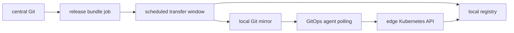
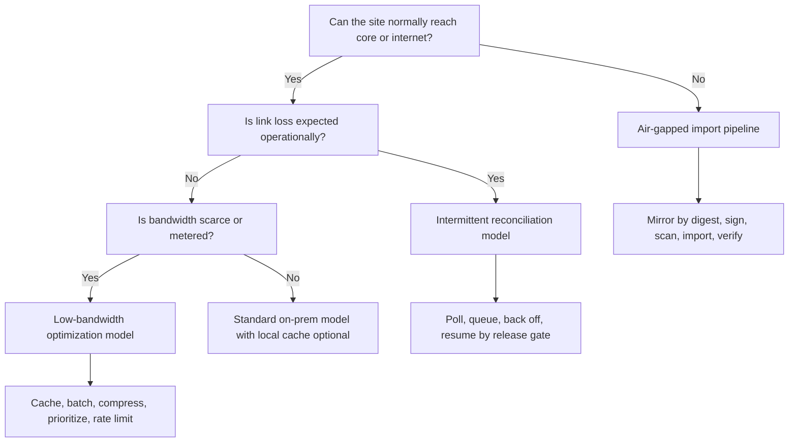

> **Complexity**: `[COMPLEX]`
>
> **Time to Complete**: 55 minutes
>
> **Prerequisites**: Kubernetes basics, [Module 5.10: Edge Fleet Patterns](../module-5.10-edge-fleet-patterns/), and on-prem track foundations from [Planning](../planning/) through [Operations](../operations/)

---

## Learning Outcomes

After completing this module, you will be able to:

- **Compare** air-gapped, intermittent, and low-bandwidth Kubernetes operating modes and select the right synchronization strategy for each site class.
- **Design** disconnected workload supply chains that mirror images, Helm charts, OCI bundles, signatures, and vulnerability metadata into local registries without bypassing approval controls.
- **Implement** webhook-less GitOps, edge-to-core data transfer, OS update, certificate rotation, and telemetry buffering patterns that survive planned and unplanned link loss.
- **Diagnose** failed pulls, stale charts, missing certificates, sync backlog, and telemetry gaps by tracing which local dependency was absent or expired.
- **Evaluate** a restricted k3s and Harbor mirror design against security, cost, rollback, and operability constraints before using it in a real edge fleet.

## Why This Module Matters

Hypothetical scenario: A ship-board Kubernetes deployment leaves port with a working local registry, a small Git server, an internal CA, and a telemetry gateway that can store several days of data. A storm damages the satellite uplink, and the ship operates without reliable connectivity for three weeks. Point-of-sale services, sensor ingestion, and local dashboards keep running because the cluster already has its images, charts, certificates, and operational runbooks inside the disconnected bubble. The only failed maintenance action is a noncritical dashboard update whose image was approved in Git but never imported into the local registry before departure.

That scenario is not really about ships. The same pattern appears in defense facilities, hospitals with strict network segmentation, factories with unreliable carrier links, retail stores behind constrained backhaul, mining sites, telco towers, and regulated enclaves where internet egress is not allowed. Standard Kubernetes tutorials assume the kubelet can reach a registry, Helm can reach a chart repository, cert-manager can reach public ACME, GitOps controllers can receive webhooks, and observability agents can stream to a central backend. Disconnected operations begin when those assumptions become false by design or false under failure.

The lesson is simple but expensive to learn late: Kubernetes is only declarative if the things it declares are locally reachable. A Deployment that references `docker.io/library/nginx` is not self-contained. A HelmRelease that points at a public chart repository is not self-contained. A Certificate that depends on public ACME is not self-contained. A Prometheus remote-write queue with ten minutes of memory buffer is not self-contained. This module teaches the operating model that makes a cluster useful after the cable is cut, the maintenance window closes, or the approval team seals the transfer media.

## 1. Three Connectivity Modes

The first design mistake is using "air-gapped" as a loose synonym for "network is annoying." These modes are different engineering contracts. An air-gapped site has no routable path to the internet or central platform during normal operation, so software enters through a controlled import process. An intermittent site normally has a path, but outages are expected and may last hours or days. A low-bandwidth site is usually connected, but the link is too scarce, expensive, or shared to tolerate chatty controllers, repeated image pulls, or unbounded telemetry streams.

Each mode changes the failure you should optimize for. In a true air gap, the main risk is missing cargo: an image, chart, root certificate, CRD, OS installer, or vulnerability database was not imported before the window closed. In an intermittent environment, the main risk is inconsistent catch-up: sites return at different times and reconcile old work, new work, and expired credentials out of order. In a low-bandwidth environment, the main risk is self-inflicted congestion: a valid rollout saturates the link because hundreds of nodes pull layers, charts, logs, and metrics at once.

```text
CONNECTIVITY MODE DECISION

air-gapped bubble
  no normal route to core or internet
  import by approved bundle, media, diode, or transfer station

intermittent edge
  route exists, but outages are expected
  reconcile by polling, queues, and maintenance windows

low-bandwidth edge
  route exists most of the time
  reduce bytes, deduplicate artifacts, batch telemetry
```

The modes also imply different security boundaries. Air-gapped sites need an explicit import authority that reviews content before it crosses the boundary. Intermittent sites need agent identities that can resume safely without accepting replayed or stale work. Low-bandwidth sites need rate limits and local caches so the security posture does not degrade when operators try to save bytes. A proxy cache that is excellent for low-bandwidth pulls is not a complete air-gap answer unless it is pre-warmed and can serve required content after the upstream disappears.

Pause and predict: A site can reach the central registry for one hour every night, and the carrier bills heavily after a fixed monthly transfer allowance. Is that intermittent, low-bandwidth, or both? The right answer is both, which means the design needs scheduled reconciliation plus byte budgeting. A nightly sync window without deduplication will still fail economically, while a deduplicated mirror without a catch-up policy will still fail operationally.

Think of the disconnected site as a small port with a manifest. The ship does not ask the ocean for spare parts while at sea; it leaves with approved cargo and tracks what was used. Your platform needs the same manifest discipline. The import list should include workload images, base images, init containers, CNI images, CSI images, Helm charts, CRDs, policy bundles, admission controller images, OS update images, CA bundles, revocation data, and telemetry exporter images. If one category is not on the manifest, it will become the category that breaks during maintenance.

Mode classification should be visible in inventory, not buried in architecture slides. Cluster labels such as `connectivity-mode=air-gapped`, `sync-window=weekly`, `registry-zone=west`, and `telemetry-budget=small` let fleet tooling select the right policies. They also help incident responders avoid bad assumptions. A central operator who sees an offline air-gapped site should not page the network team, while the same symptom on a normally connected low-bandwidth site may indicate a carrier or firewall incident that needs action.

Cost is part of the mode decision, not a footnote. Local registries require storage, backups, scanning capacity, and garbage collection windows. Transfer stations require human review time and sometimes specialized hardware. Low-bandwidth sites may spend more on egress, satellite, or cellular overages than on the edge server itself. Telemetry retention costs rise when links fail because logs and spans accumulate locally. A practical design estimates bytes per release, bytes per day of telemetry, and days of autonomy before selecting the toolchain.

## 2. Import Pipeline: Images, Charts, and OCI Bundles

Disconnected Kubernetes starts with artifact closure. The platform team must be able to answer, "What exact bytes does this site need to install, upgrade, recover, and prove compliance?" Container images are the obvious starting point, but they are not enough. Helm charts may reference images by values, subcharts may have their own repository URLs, operators may pull bundle images, admission policies may need signed constraint templates, and scanners may need vulnerability databases. A working import pipeline treats all of these as versioned cargo.

Harbor is a common enterprise registry for this job because it combines projects, robot accounts, proxy cache, replication, retention, scanning, and policy controls. In a low-bandwidth or intermittently connected site, a Harbor proxy cache can reduce repeated upstream pulls: the first request fetches and stores the content, and later requests are served locally when the upstream is unchanged or unreachable. In a true air gap, proxy cache is useful only on the connected side or during a controlled sync window. The disconnected side still needs content pushed or imported before the workload can depend on it.

The upstream `distribution` registry is the simpler building block. It can run as a local registry or pull-through cache and is easier to understand when you want only the OCI Distribution API and storage. Harbor adds governance around that core capability. The tradeoff is operational weight: Harbor brings database, jobservice, Redis, scanner, UI, RBAC, and upgrade procedures. For a single small lab, `registry:3` may be enough. For a regulated estate, Harbor or Quay-like governance is usually worth the additional components because the audit question is not only "Can the node pull?" but also "Who approved the bytes?"

```text
APPROVED IMPORT FLOW

connected staging       transfer boundary        disconnected site
-----------------       -----------------        -----------------
source registries  -->  manifest + scan  -->     local Harbor
Helm repos         -->  sign + checksum  -->     local chart repo
OCI bundles        -->  media / diode    -->     local Git / object store
SBOMs + signatures -->  import record    -->     local policy engine
```

Image mirroring should be digest-first. Tags are human-friendly, but they can move. A release manifest should pin digests for images, chart packages, and OCI artifacts so the import station can prove that the disconnected registry contains the same content that was approved. Tools such as `skopeo`, `crane`, `regctl`, dregsy-style registry sync jobs, and registry-native replication can move image graphs. ORAS expands the same registry pattern to non-image artifacts such as configuration bundles, SBOMs, policy packs, and signed release manifests. The useful rule is that every artifact crossing the boundary gets a digest, a signature or checksum, and an owner.

Helm needs the same discipline. A chart repository is an HTTP endpoint with `index.yaml`, chart packages, and optional provenance files. Offline install works when the chart package, dependencies, values, and images are all local. `helm pull --prov` and `helm verify` can validate provenance when the signing key is present, while OCI-based Helm charts can live in an internal registry. Tools such as `helm-mirror`, Jenkins X `jx gitops helm mirror`, or OpenShift `oc-mirror` can mirror chart repositories, but the durable pattern is independent of the tool: mirror exact versions, keep `.prov` files, rewrite image values deliberately, and test rendering before import.

Vulnerability metadata is part of the same supply chain. An air-gapped registry that scans images once and never imports updated vulnerability databases will slowly become less truthful, even if no workload changes. Some environments import scanner databases as signed artifacts on a schedule, while others run scanning only on the connected side and import signed scan results with the release bundle. Both approaches can work, but the policy must be explicit about freshness. A critical finding discovered after the ship leaves port still needs a local decision path, even if the fix waits for the next transfer window.

Signed bundles are not only a supply-chain security feature. They are also an operations feature because they make it possible to reject an incomplete or wrong bundle before it reaches the disconnected side. A release bundle can include chart packages, rendered manifests, SBOMs, cosign signatures, policy metadata, and a machine-readable import manifest. The transfer station validates signatures and checksums, records the import result, and only then makes the content visible to local GitOps agents. That extra ceremony feels slow until the first failed import is caught before a maintenance window.

Here is a small release manifest shape that keeps the import discussion concrete. It is intentionally not a full product schema, but it captures the fields operators need during a failed pull or failed install. The key idea is that a site should be able to validate local availability before the maintenance window starts, not discover missing content after the kubelet asks for it.

```yaml
apiVersion: platform.example.com/v1alpha1
kind: DisconnectedReleaseManifest
metadata:
  name: store-baseline-2026-05-25
spec:
  kubernetesMinor: "1.35"
  images:
    - source: docker.io/library/nginx:1.27-alpine
      digest: sha256:replace-with-approved-digest
      mirror: registry.edge.local/dockerhub/library/nginx@sha256:replace-with-approved-digest
      owner: platform-web
  charts:
    - name: store-baseline
      version: 2.8.3
      repository: oci://registry.edge.local/charts
      provenance: required
  bundles:
    - name: admission-policies
      mediaType: application/vnd.example.policy.bundle.v1.tar+gzip
      registry: registry.edge.local/platform/admission-policies:2026-05-25
  approvals:
    vulnerabilityScan: passed
    signatureVerification: passed
    importedBy: release-import-operator
```

The cost lens for this pipeline is mostly storage and repeated transfer. A registry that stores every layer forever will eventually become the largest service at the site, especially when teams rebuild images without layer reuse. Retention policies can reduce cost, but aggressive garbage collection can delete content needed for rollback. The practical compromise is to keep the active release, the previous known-good release, and the next staged release at every site, while central archives keep longer history. Record the byte size of every import so release managers notice when a routine patch suddenly becomes a multi-gigabyte transfer.

Garbage collection deserves its own runbook because registry deletion is rarely instant. OCI registries store manifests and blobs, and multiple tags or artifacts may reference the same layers. Harbor retention can remove tags according to policy, but storage is reclaimed only when garbage collection determines that blobs are no longer referenced. In disconnected sites, schedule garbage collection after rollback windows close, not immediately after import. If the registry shares disks with telemetry or Git, an over-full registry can cascade into failed observability and failed reconciliation.

## 3. Webhook-less GitOps and Edge-to-Core Data Sync

GitOps changes shape when the site cannot receive webhooks. Argo CD already polls repositories on a timer and supports webhooks only to reduce detection delay. Flux source-controller reconciles GitRepository objects by interval and can apply jitter so many objects do not fetch at the same instant. Those details matter because disconnected sites should not require an inbound webhook from GitHub, GitLab, or a central event bus. The safer edge pattern is outbound polling from a local GitOps agent against a local Git mirror, with reconciliation intervals tuned to the link budget and maintenance window.

Webhook-less does not mean uncontrolled. For intermittent links, GitOps should have explicit behavior for last-known-good, failed syncs, and catch-up. If a site misses two days of commits, it should not blindly apply every intermediate state if the current approved release supersedes them. Argo CD retry backoff, Flux intervals, suspend flags, and release branches are control surfaces. A strong design asks the agent to converge on an approved revision when the link returns, while a rollout controller decides whether that site is still allowed to advance or must wait for the next local window.

The hardest part is mental: eventual consistency is not an excuse for vague state. Operators need to distinguish "offline and healthy on revision A," "online but blocked from revision B," "online and failing to apply revision B," and "online but missing artifact imports for revision B." Those are separate conditions with separate actions. A single red "OutOfSync" count hides the difference between a ship at sea, a store with a broken local registry, and a site that correctly refused a release because its import manifest was incomplete.



Edge-to-core data sync has a different shape from workload sync. Workload sync moves desired state to the edge; data sync moves observations, transactions, events, or files back to the core. Kafka MirrorMaker 2 can replicate topics between clusters and is useful when the edge runs local Kafka for autonomy, then forwards selected topics when the uplink returns. Apache NiFi and MiNiFi are useful when the edge collects files, device events, or records that need routing, transformation, provenance, and back-pressure. The design question is not "Which tool is best?" but "What delivery guarantee and replay model does this data class need?"

Batching is often better than streaming at constrained sites. A payment authorization event may need near-real-time priority during a link window, while raw debug logs can wait, compress, or be sampled. Sensor data may be summarized locally and shipped as hourly aggregates, while exception records are forwarded first. Kafka topic retention, MirrorMaker task parallelism, NiFi queue back-pressure, and compression settings become business controls because they decide what survives when the link is scarce. Treat the WAN as a shared resource with queues, priorities, and admission policy.

Pause and predict: A factory edge cluster produces 20 GB of machine logs per day, but the uplink can reliably move only 6 GB during the nightly window. Which should you change first: the GitOps interval, the Kafka replication factor, or the log routing policy? The log routing policy is the first lever because the data budget is already impossible. GitOps tuning may reduce control traffic, and Kafka replication affects durability, but neither makes 20 GB fit into a 6 GB window without filtering, aggregation, compression, or tiering.

Intermittent data sync also needs idempotency. A retry after a link flap should not duplicate orders, double-count sensor readings, or replay a command that was meant to run once. Kafka consumers can use keys, offsets, and compacted topics; NiFi flows can use provenance, attributes, deduplication processors, and durable queues; application APIs can use idempotency keys. The platform cannot fix every application semantic, but it can make duplicate delivery an explicit design review topic before teams deploy stateful edge workloads.

## 4. Offline Operating Plane: OS, Certificates, and Telemetry

Workload content is only half the disconnected problem. The cluster also needs an operating plane that can patch nodes, rotate certificates, and preserve observability without internet dependencies. Mutable host updates are especially risky at edge sites because a package manager may need external repositories and a local engineer may not be available to repair a half-updated node. Image-based operating systems such as Talos and Kairos move the update unit from "many packages on a mutable host" to "approved OS image with rollback behavior." That model fits disconnected operations because the OS image can be mirrored, signed, tested, and imported like any other release artifact.

Talos upgrades use an installer image and an A/B scheme that can roll back when boot fails. Talos image cache can preload required container images into installation media or local disk so nodes do not need to fetch everything from the internet during bootstrap. Kairos uses an immutable layout with active, passive, recovery, OEM, state, and persistent partitions, and it can upgrade from Kubernetes or manually using OCI-delivered system images. The common pattern is stronger than either product: build the node image in a connected pipeline, mirror it to the site, roll it through canaries, gate on node health, and preserve a rollback path that does not depend on the broken new image.

Certificate rotation becomes a calendar problem in disconnected sites. Public ACME is usually unavailable because challenges require public DNS or HTTP reachability and trust in an external CA path. Local PKI replaces that with an internal root, online intermediate, and issuance API such as step-ca ACME, Vault PKI, or cert-manager CA/Vault issuers. The root should stay offline, the intermediate should be backed up and monitored, and trust bundles should be distributed to nodes and workloads before leaf certificates depend on them. For air-gapped enclaves, revocation data and intermediate rotation plans must be imported deliberately, not assumed from internet CRL or OCSP reachability.

The dangerous certificate failure is not a dramatic compromise; it is quiet expiry. A site that loses contact with the core for three weeks may return with expired Git server certificates, expired registry certificates, or an expired GitOps agent client certificate. Renewal windows need enough overlap that a missed sync does not immediately strand the site. For short-lived workload certificates, run the issuer inside the disconnected boundary. For externally signed certificates, import renewed intermediates and leaves before the old chain expires. For emergency recovery, document how to reissue registry and Git server certificates using local root material without weakening trust.

Telemetry buffering is the third pillar. Metrics, logs, and traces should degrade by policy, not by accident. OpenTelemetry Collector exporters support sending queues, retry, and persistent storage through file-backed queues. Fluent Bit supports filesystem buffering and storage limits. Prometheus remote write, Loki agents, and tracing collectors all need similar decisions: how much can be stored locally, which streams are dropped first, what is sampled, what is compressed, and how catch-up avoids crushing the link when it returns. Without those limits, telemetry can fill disks and create the outage it was meant to explain.

There is a cost tradeoff hidden in every telemetry buffer. More local retention gives better forensic visibility during partitions, but it consumes SSD endurance, disk capacity, and backup space. Aggressive sampling saves bandwidth, but it may remove the one trace needed to explain a rare failure. A practical policy assigns budgets by signal class: alerting metrics get the highest priority, security logs get durable local retention, application debug logs get sampling or shorter retention, and traces use tail sampling or local aggregation where possible. The platform should alert on buffer fill rate, oldest unsent record age, and export retry count, not only on backend ingestion.

Disconnected telemetry also changes on-call expectations. A central dashboard may show stale data even while the site is healthy, so freshness must be displayed as a first-class signal. Local dashboards should answer whether the edge service is meeting its local SLO, while central dashboards should answer when the last confirmed report arrived and how much backlog remains. That distinction prevents a stale central graph from being mistaken for a local outage. It also lets support teams decide whether to wait for the next sync window or contact local staff.

## 5. Worked Architecture: Restricted k3s Pulls from Harbor

The hands-on lab later uses this architecture in a small form, so it is worth understanding the why before the commands. A restricted k3s cluster should not silently fall back to Docker Hub when the local mirror is missing content. If fallback is allowed, a "successful" test may prove only that the lab laptop had internet access. K3s uses `/etc/rancher/k3s/registries.yaml` to generate containerd registry configuration, and recent K3s releases support disabling the default registry endpoint so mirror misses fail instead of escaping to the upstream. That is the behavior you want when the policy says the cluster pulls only from the local mirror.

Harbor can sit in two roles. On a low-bandwidth connected site, it may be a proxy cache project for Docker Hub, Quay, or another upstream registry. On an air-gapped site, it should be treated as the authoritative local registry populated by a controlled import process. The same Harbor hostname can host both normal projects and proxy cache projects, but the operating meaning differs. A proxy cache project is not where you push application images; it is a cache facade over an upstream. A normal project is where approved imported images live.

```yaml
# /etc/rancher/k3s/registries.yaml
mirrors:
  docker.io:
    endpoint:
      - "https://registry.edge.local/v2/dockerhub"
configs:
  registry.edge.local:
    tls:
      ca_file: /etc/rancher/k3s/registry-ca.pem
```

The remaining restriction is network policy outside Kubernetes. A container runtime mirror configuration is necessary, but a node with unrestricted egress may still reach upstream endpoints in unexpected ways through other tools or future configuration changes. Production designs pair runtime mirror configuration with firewall rules, DNS policy, and egress monitoring. In a lab, you can test the same principle by trying a known missing image and confirming that the failure is local and explicit. In production, you also test packet logs to prove the node did not attempt direct internet pulls.

This architecture intentionally cross-links the neighboring modules instead of replacing them. [Module 5.10: Edge Fleet Patterns](../module-5.10-edge-fleet-patterns/) explains rollout rings, local overrides, and fleet-level GitOps design. [Module 7.7: Self-Hosted Container Registry](../operations/module-7.7-self-hosted-registry/) goes deeper on registry platform operation, storage, scanning, and signing. [Module 6.1: Physical Security & Air-Gapped Environments](../security/module-6.1-air-gapped/) covers the physical and approval side of air-gapped security. This module ties those pieces together around the connectivity axis: what must continue working when the edge cannot depend on the core.

## 6. Verification, Drills, and Day-Two Runbooks

Disconnected operations fail when teams test only the happy path. A site that can install a release while the internet is available has not proven air-gap readiness. A GitOps agent that reconciles after a webhook has not proven webhook-less behavior. A certificate that renews during a normal week has not proven survival through a missed sync window. Verification should deliberately remove the external dependency and observe whether the site continues on local services, fails closed, or fails open. The goal is not to make every failure disappear; it is to make the failure mode predictable and safe.

Start with artifact availability tests. Before a release window, run a local validation job that asks the registry for every digest, the chart repository for every chart package, the Git mirror for the target commit, and the local issuer for the certificate chain. This validation should run from inside the disconnected boundary, not from the connected build system. It should produce a short result that an operator can attach to the change record: all artifacts present, all signatures valid, all rollback artifacts present, and all local endpoints reachable. If that check fails, the release should not depend on operator optimism.

Then test fail-closed behavior. Remove or block upstream registry access and try to deploy an image that is not in the mirror. The correct result is a clear pull failure from the local registry path. If the Pod starts, the cluster still has an escape route. Do the same for Helm charts by disabling access to the public chart repository and rendering from the local source only. Do the same for GitOps by blocking inbound webhooks and confirming the local polling path still notices a mirrored commit. These tests are uncomfortable because they expose accidental convenience paths, which is exactly why they belong in the readiness gate.

Certificate drills should be calendar-based. Pick a nonproduction disconnected site and simulate a missed renewal by pausing the sync process longer than the normal renewal interval, or by using a short-lived internal test certificate. Watch what fails first: the registry, Git server, ingress, webhook service, kubelet serving certificate, or observability endpoint. The drill should end with a documented local recovery path that does not require public ACME or internet package repositories. A local PKI that cannot recover its own registry certificate is not an autonomy mechanism; it is another dependency with a shorter failure timer.

Telemetry drills should measure backlog age, not only data loss. Disconnect the telemetry exporter from the central backend for a planned period and observe queue growth, disk usage, memory pressure, and catch-up rate when the backend returns. If a two-hour outage takes six hours to drain, a two-day outage may never recover before retention expires. That is a capacity planning finding, not a collector bug. Use the measured drain rate to adjust sampling, queue size, compression, or priority rules before the site experiences a real carrier outage.

OS update drills need two gates: forward health and rollback health. A Talos, Kairos, or similar image-based node update should prove that the new image boots, joins, runs critical DaemonSets, reaches the local registry, and reports telemetry. It should also prove that rollback content remains available and that operators know how to trigger rollback without downloading anything new. For mutable OS nodes, the equivalent drill is package mirror availability, reboot success, kernel module compatibility, kubelet restart behavior, and a drift scan after the update. In both models, the update is not complete until the previous known-good path is still visible.

Drill cadence should match site criticality and change rate. A defense enclave that imports monthly may run a full import drill before every import window. A retail store fleet may run automated mirror and fail-closed checks on every release candidate, then run deeper telemetry and certificate drills quarterly. A lab cluster may run the same checks cheaply with smaller artifacts. The important part is that drills are routine enough to catch process drift before a real outage, but not so theatrical that teams avoid running them.

Create a failure matrix for each disconnected site class. Rows should include missing image, missing chart, missing Git commit, expired registry certificate, expired Git certificate, full telemetry disk, unavailable local CA, failed OS image boot, and failed rollback. Columns should record detection signal, local owner, core owner, user impact, immediate mitigation, and permanent fix. This matrix is more useful than a generic architecture diagram during incidents because it maps symptoms to decisions. It also exposes ownerless dependencies before they fail.

Degraded-state SLOs need to be explicit. "The site survives disconnection" is too vague to operate. Better statements say that checkout services keep running for seven days without core connectivity, local dashboards keep two days of metrics, security logs retain ten days locally, noncritical traces may be sampled to 10 percent during backlog, and release promotion pauses automatically when artifact verification fails. These SLOs give product and compliance stakeholders a concrete way to approve tradeoffs. They also prevent engineers from overbuilding unlimited autonomy where the business needs only a shorter local window.

Access control changes when a site is isolated. Local operators may need break-glass permissions to restart services, rotate a registry certificate, or import an emergency bundle. Those permissions should be scoped, logged locally, and synchronized back to the core when connectivity returns. Avoid designing a system where every emergency requires a central identity provider that the site cannot reach. Also avoid giving permanent broad local admin rights simply because the site may disconnect. Break-glass is a controlled workflow, not an excuse to abandon least privilege.

Inventory drift is another day-two risk that disconnected teams underestimate. The central platform may believe a site is on release `2026-05-25`, while the local Git mirror, registry, OS image, and certificate bundle each tell a slightly different story. A returning site should report its local artifact inventory, active Git revision, node OS image, CA bundle version, and oldest telemetry backlog as separate facts. That report gives the hub enough evidence to decide whether to advance, hold, remediate, or re-import content instead of treating reconnection as automatic proof of health.

Runbooks should be organized by missing dependency rather than by tool. "Image missing from local registry" is a better page title than "Harbor troubleshooting" because the same symptom may involve import manifest errors, registry retention, authentication, CA trust, DNS, or containerd mirror configuration. "Git commit missing from local mirror" is different from "GitOps agent failed to apply commit." "Certificate expired inside boundary" is different from "public ACME challenge failed." This symptom-first structure helps responders trace the local dependency chain instead of jumping to the tool they know best.

Finally, disconnected runbooks need ownership and evidence. Someone owns the import manifest. Someone owns Harbor retention. Someone owns local PKI. Someone owns telemetry budgets. Someone owns OS image promotion. During an incident, the question "Who owns this?" wastes time if the disconnected boundary was designed as a pile of tools. During an audit, the question "What proof do you have?" is easier when every import, release, rollback, and certificate rotation leaves a signed record. Good disconnected operations are as much bookkeeping as engineering, because the bookkeeping is what keeps local autonomy from turning into invisible drift.

## Patterns & Anti-Patterns

| Pattern | When to Use | Why It Works |
|---|---|---|
| Digest-pinned release manifest | Any disconnected or regulated site | It gives import, install, rollback, and audit teams a shared list of exact artifacts instead of relying on mutable tags or tribal knowledge. |
| Local first, core later | Intermittent edge sites with local business functions | Workloads keep using local registry, Git, PKI, and telemetry buffers when the uplink fails, then reconcile safely when the core returns. |
| Staged import with canary site | Multi-site disconnected fleets | A small site validates that images, charts, CRDs, certificates, and OS images are complete before the transfer package is promoted broadly. |
| Budgeted telemetry queues | Low-bandwidth and intermittent sites | Metrics, logs, and traces compete by priority and storage budget instead of filling disks or flooding the WAN after an outage. |

| Anti-Pattern | What Goes Wrong | Better Alternative |
|---|---|---|
| Proxy cache treated as air gap | The first pull still depends on upstream, so a missing image appears only when the site is already isolated. | Pre-warm or import approved images by digest, then verify local availability before the window closes. |
| Helm chart mirrored without image closure | `helm install` succeeds at rendering, then Pods fail because chart values still point to public registries. | Render charts during import, extract image references, rewrite values, and test pulls from the local registry. |
| Public ACME in a private enclave | Certificate renewal fails when DNS or HTTP challenges cannot reach public validation services. | Run internal ACME through step-ca or use Vault/cert-manager issuers with local trust distribution. |
| Unlimited telemetry catch-up | A returning site saturates the link, delays workload sync, and may drop fresh alerts behind old debug data. | Use bounded queues, priorities, compression, sampling, and oldest-record alerts. |

## Decision Framework

Use this framework during design reviews before tool names dominate the conversation. First classify the site mode. If there is no normal route across the boundary, design an air-gap import pipeline and do not rely on proxy cache misses reaching upstream. If the route exists but fails often, design polling, queued reconciliation, and catch-up gates. If the route is stable but scarce, design byte budgets, caches, batching, and deduplication. A site can occupy more than one mode, and the stricter requirement should drive the baseline.



Next choose the artifact strategy. Use Harbor proxy cache when upstream access exists and repeated pulls are the problem. Use Harbor replication, registry sync jobs, ORAS bundles, or disk-based transfer when content must be present without upstream access. Use Helm repository mirroring for classic chart repos, OCI charts for registry-native workflows, and signed provenance or cosign-style signatures where your trust policy requires origin proof. Every choice should produce the same final evidence: approved artifact list, local digest, verification result, and rollback availability.

Then choose the operating strategy. For mutable OS fleets, require a local package mirror, maintenance lock, and drift detection because manual node repair is likely. For image-based OS fleets, require image import, staged rollout, health gates, and rollback instructions. For certificates, prefer local issuance when sites can be disconnected longer than the renewal overlap. For telemetry, size buffers from measured ingest rate multiplied by autonomy days, then subtract safety margin for disk pressure and catch-up time. If the math does not fit, reduce volume before buying another collector.

## Did You Know?

- Harbor proxy cache was updated in the 2.1.1 line to better align with Docker Hub rate-limit behavior, including HEAD checks for cached layers.
- K3s documents three air-gap image-loading methods: private registry, manual image deployment, and embedded registry mirror.
- Argo CD polls Git, OCI, and Helm repositories by default; webhooks are an optimization for faster refresh, not a requirement for GitOps.
- CNCF's edge-native principles paper calls out constrained connectivity, resource limits, security, and autonomy as defining edge design pressures.

## Common Mistakes

| Mistake | Why It Happens | How to Fix It |
|---|---|---|
| Calling every constrained site "air-gapped" | Teams use one dramatic term for three different network realities. | Classify sites as air-gapped, intermittent, low-bandwidth, or a combination, then choose controls for each mode. |
| Mirroring images but not charts or CRDs | Image pulls fail visibly, while chart dependencies and CRDs fail later in install workflows. | Build a release manifest that includes images, charts, CRDs, policy bundles, signatures, and scanner data. |
| Allowing registry fallback during tests | Runtime mirror config still lets containerd try the default endpoint. | Use K3s `--disable-default-registry-endpoint` where supported and verify node egress with logs or firewall counters. |
| Rotating certificates only from the core | Connected clusters renew fine, but offline sites miss the window and return with expired trust. | Run local issuance for disconnected boundaries and set renewal overlap longer than the expected outage. |
| Treating telemetry as lossless by default | Agents buffer until disk fills or drop data without telling operators which class was lost. | Define per-signal retention, queue size, sampling, and drop priority, then alert on buffer age and fill rate. |
| Importing unsigned bundles under pressure | Release teams prioritize speed during incidents and bypass normal provenance checks. | Keep an emergency import path that is still signed, logged, peer-reviewed, and limited to a documented break-glass scope. |
| Forgetting rollback content | The forward release is mirrored, but the previous release is garbage-collected before validation completes. | Keep active, previous known-good, and next staged release artifacts at every disconnected site. |

## Quiz

<details><summary>A retail edge site is online most days but loses WAN access during storms, and it pays high overage fees after a monthly data cap. Which operating modes apply, and what two controls should you prioritize?</summary>
Both intermittent and low-bandwidth modes apply. The site needs polling-based reconciliation and local last-known-good behavior for storm outages, but it also needs byte budgeting, image caching, batching, and telemetry prioritization because the link is expensive even when healthy. A proxy cache alone is insufficient because it does not define catch-up behavior after an outage. A GitOps interval alone is insufficient because it does not reduce large image or telemetry transfers.</details>

<details><summary>Your team mirrored all workload images into Harbor, but an offline Helm install still creates Pods that try to pull from `quay.io`. What did the import pipeline miss?</summary>
The pipeline mirrored image blobs but did not close over chart-rendered image references and values. Helm charts can contain default repositories, subcharts, init containers, hooks, and CRDs that reference external images. The fix is to render the chart during import, extract every image reference, rewrite values to the local registry, and verify pulls against the disconnected registry before approving the release.</details>

<details><summary>A GitOps controller at an edge site cannot receive webhooks from the central Git provider. Is GitOps unusable there?</summary>
No. GitOps controllers such as Argo CD and Flux can poll repositories on intervals, and webhooks mainly reduce detection delay. The disconnected design should point the controller at a local Git mirror or reachable internal Git endpoint, tune intervals and jitter to the link budget, and use release gates so returning sites converge to an approved revision. The more important question is how the site behaves when it missed several revisions while offline.</details>

<details><summary>A ship-board cluster returns after three weeks and immediately fails registry pulls because the registry certificate expired during the voyage. What should have been designed differently?</summary>
The certificate plan assumed connected renewal or a renewal window shorter than the expected disconnection period. Disconnected sites should run local issuance for critical internal services, distribute trust bundles inside the boundary, and renew with enough overlap for the longest expected outage. Registry and Git certificates deserve special attention because their expiry can block the very controllers and imports needed for recovery.</details>

<details><summary>A factory buffers all logs locally during a two-day outage, then the uplink returns and production traffic slows down for hours. What is the likely operational flaw?</summary>
Telemetry catch-up was allowed to compete with workload traffic without a budget or priority policy. The site should have bounded queues, compression, sampling, and priority classes so alerting metrics and security logs move before debug logs. Operators should alert on queue age and fill rate before the uplink returns. If daily log volume exceeds available transfer capacity, no retry policy can fix the design without filtering or aggregation.</details>

<details><summary>Your k3s lab succeeds even after you delete the mirrored image from Harbor, and you later discover the node pulled from Docker Hub. What did the test fail to prove?</summary>
The test did not prove that the cluster was restricted to the local mirror. Containerd may have used the default registry endpoint after the mirror miss, so the workload succeeded through internet fallback. Use K3s mirror configuration with default endpoint fallback disabled where supported, block direct egress at the network layer, and test a missing image while watching events and firewall counters.</details>

<details><summary>An air-gapped release import includes the new OS image but not the previous known-good OS image. Why is that risky even if the new image passed staging?</summary>
Disconnected sites need rollback content locally because a failed boot, driver mismatch, or site-specific hardware issue may appear only after deployment. If the previous image was garbage-collected or never imported, rollback depends on reopening the transfer process during an incident. The safer policy keeps active, previous known-good, and next staged OS images at the site until health gates and soak time are complete.</details>

## Hands-On Exercise

In this lab you will design and validate a Harbor-backed restricted k3s pull path. Run it in disposable lab hosts or VMs, not on a production cluster. The commands assume you already have a Harbor instance reachable as `registry.edge.local` with a proxy cache project named `dockerhub` and a normal project named `platform`. Replace hostnames with your lab values, but keep the principle: the k3s nodes should pull only from the local mirror.

### Task 1: Build the approved image list

- [ ] Create `images.txt` with one workload image and one utility image.
- [ ] Record why each image is needed and who owns it.
- [ ] Convert tag references to digest references before production use.

```bash
cat > images.txt <<'EOF'
docker.io/library/nginx:1.27-alpine
docker.io/library/busybox:1.36
EOF

cat > image-owners.tsv <<'EOF'
image	owner	reason
docker.io/library/nginx:1.27-alpine	platform-web	edge ingress smoke test
docker.io/library/busybox:1.36	platform-ops	minimal pull diagnostic
EOF
```

<details><summary>Solution</summary>
The task is complete when both files exist and every image has an owner and reason. In production, add digest resolution with `skopeo inspect`, `crane digest`, or your approved registry tooling so the import process does not depend on mutable tags.</details>

### Task 2: Pre-warm Harbor from the connected side

- [ ] Pull each image through the Harbor proxy cache project.
- [ ] Confirm Harbor shows cached artifacts under the proxy cache project.
- [ ] Document whether the cache is allowed to serve the image when upstream is unreachable.

```bash
while read -r image; do
  name="${image#docker.io/}"
  docker pull "registry.edge.local/dockerhub/${name}"
done < images.txt
```

<details><summary>Solution</summary>
The proxy cache project should show the repositories after the first pull. If this is a true air-gap design, do not stop here. Promote or import the approved content into a normal Harbor project so the disconnected site does not depend on cache refill behavior.</details>

### Task 3: Configure k3s to use only the mirror

- [ ] Install the Harbor CA certificate on every k3s node.
- [ ] Create `/etc/rancher/k3s/registries.yaml` on every node.
- [ ] Start k3s with default registry endpoint fallback disabled if your K3s release supports the flag.

```bash
sudo mkdir -p /etc/rancher/k3s
sudo install -m 0644 registry-ca.pem /etc/rancher/k3s/registry-ca.pem

sudo tee /etc/rancher/k3s/registries.yaml >/dev/null <<'YAML'
mirrors:
  docker.io:
    endpoint:
      - "https://registry.edge.local/v2/dockerhub"
configs:
  registry.edge.local:
    tls:
      ca_file: /etc/rancher/k3s/registry-ca.pem
YAML
```

<details><summary>Solution</summary>
The configuration is in place when every schedulable k3s node has the same `registries.yaml` and trusts the Harbor CA. For a stronger test, add `--disable-default-registry-endpoint` to the k3s service configuration on supported versions and restart during a maintenance window.</details>

### Task 4: Prove a mirrored image can run

- [ ] Deploy a Pod that references Docker Hub by its normal name.
- [ ] Confirm k3s resolves the pull through the configured mirror.
- [ ] Inspect events for pull success without direct internet access.

```bash
kubectl create namespace mirror-lab
kubectl run mirror-nginx \
  --namespace mirror-lab \
  --image docker.io/library/nginx:1.27-alpine \
  --restart Never

kubectl wait --namespace mirror-lab \
  --for=condition=Ready pod/mirror-nginx \
  --timeout=120s

kubectl get events --namespace mirror-lab --sort-by=.lastTimestamp
```

<details><summary>Solution</summary>
The Pod should become Ready, and events should show a successful image pull. To make the proof meaningful, run the test while node egress to public registries is blocked or while using the K3s default-endpoint disable option.</details>

### Task 5: Prove a missing image fails closed

- [ ] Choose an image that is not in Harbor.
- [ ] Attempt to run it from the restricted cluster.
- [ ] Confirm the failure is explicit and does not fall back to the internet.

```bash
kubectl run mirror-miss \
  --namespace mirror-lab \
  --image docker.io/library/redis:7-alpine \
  --restart Never

kubectl describe pod mirror-miss --namespace mirror-lab
kubectl get events --namespace mirror-lab --sort-by=.lastTimestamp
```

<details><summary>Solution</summary>
The expected result is an image pull failure that points at the local mirror path or registry authorization, not a successful Docker Hub pull. If the Pod starts, your cluster is not restricted; revisit K3s fallback behavior and the node firewall policy.</details>

### Task 6: Add the rollback check

- [ ] Keep the previous known-good image available in Harbor.
- [ ] Record both active and rollback image references in a local release manifest.
- [ ] Clean up the lab namespace only after proving both paths.

```bash
cat > local-release-manifest.yaml <<'YAML'
release: mirror-lab
active:
  - docker.io/library/nginx:1.27-alpine
rollback:
  - docker.io/library/nginx:stable-alpine
registry: registry.edge.local
policy: local-mirror-only
YAML

kubectl delete namespace mirror-lab
```

<details><summary>Solution</summary>
The task is complete when the manifest lists both active and rollback artifacts and the cluster has demonstrated fail-closed behavior. A real production manifest should use digests, signatures, and import approval metadata.</details>

### Success Criteria

- [ ] The image list has owners, reasons, and a path to digest pinning.
- [ ] Harbor serves the approved images from the local mirror or imported project.
- [ ] Every k3s node has the same registry mirror and CA configuration.
- [ ] A mirrored image runs without direct upstream registry access.
- [ ] A missing image fails closed instead of pulling from the internet.
- [ ] Rollback content is documented before cleanup.

## Sources

- [K3s Air-Gap Install](https://docs.k3s.io/installation/airgap)
- [K3s Private Registry Configuration](https://docs.k3s.io/installation/private-registry)
- [Harbor Configure Proxy Cache](https://goharbor.io/docs/main/administration/configure-proxy-cache/)
- [CNCF Distribution Registry Configuration](https://distribution.github.io/distribution/about/configuration/)
- [ORAS Introduction](https://oras.land/docs/)
- [ORAS Distributing OCI Layouts](https://oras.land/docs/1.2/how_to_guides/distributing_oci_layouts)
- [Helm Provenance and Integrity](https://docs.helm.sh/docs/topics/provenance/)
- [Helm Chart Repository Guide](https://docs.helm.sh/docs/topics/chart_repository/)
- [Flux Air-Gapped Installation](https://fluxcd.io/flux/installation/configuration/air-gapped/)
- [Flux GitRepository Documentation](https://fluxcd.io/flux/components/source/gitrepositories/)
- [Argo CD Webhook Configuration](https://argo-cd.readthedocs.io/en/latest/operator-manual/webhook/)
- [Argo CD Automated Sync Policy](https://argo-cd.readthedocs.io/en/stable/user-guide/auto_sync/)
- [Apache Kafka Geo-Replication with MirrorMaker](https://kafka.apache.org/35/operations/geo-replication-cross-cluster-data-mirroring/)
- [Apache NiFi MiNiFi Getting Started](https://nifi.apache.org/minifi/getting-started.html)
- [Apache NiFi User Guide](https://nifi.apache.org/docs/nifi-docs/html/user-guide.html)
- [Talos Upgrading Talos Linux](https://www.talos.dev/latest/talos-guides/upgrading-talos/)
- [Talos Image Cache](https://www.talos.dev/v1.10/talos-guides/configuration/image-cache/)
- [Kairos Immutable Architecture](https://kairos.io/docs/architecture/immutable/)
- [cert-manager ACME Issuer](https://cert-manager.io/docs/configuration/acme/)
- [cert-manager CA Issuer](https://cert-manager.io/docs/configuration/ca/)
- [Smallstep step-ca ACME Basics](https://smallstep.com/docs/step-ca/acme-basics/)
- [OpenTelemetry Collector Resiliency](https://opentelemetry.io/docs/collector/resiliency/)
- [Fluent Bit Buffering and Storage](https://docs.fluentbit.io/manual/administration/buffering-and-storage)
- [CNCF Edge Native Application Principles](https://tag-runtime.cncf.io/wgs/iot/whitepapers/edge-native-application-principles/)

## Next Module

Next, continue to [Module 6.1: Physical Security & Air-Gapped Environments](../security/module-6.1-air-gapped/) to connect disconnected operations with the physical controls, transfer procedures, and approval boundaries that protect high-assurance sites.
