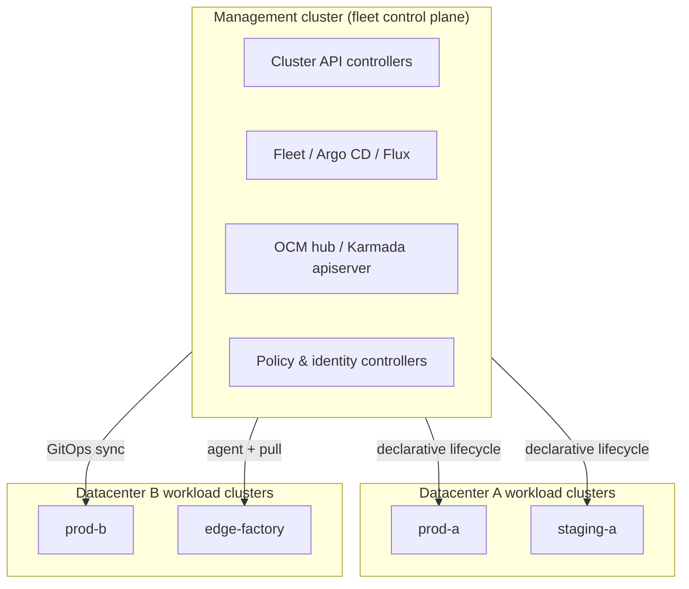
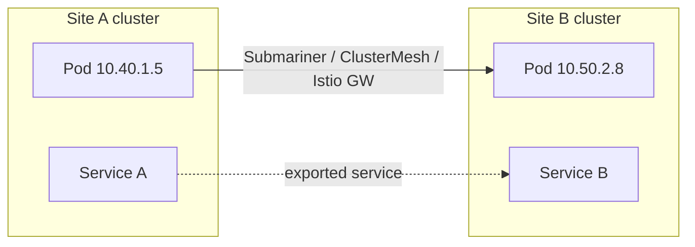

> **Complexity**: `[ADVANCED]` | Time: 55–65 minutes
>
> **Prerequisites**: [Module 5.1: Private Cloud Platforms](../module-5.1-private-cloud/), [Module 1.3: Cluster Topology](../../planning/module-1.3-cluster-topology/)

---

## What You'll Be Able to Do

After completing this module, you will be able to:

1. **Design** a management-cluster architecture that provisions and upgrades workload clusters with Cluster API on private cloud and bare metal.
2. **Compare** fleet GitOps controllers including Rancher Fleet, Argo CD ApplicationSets, Flux multi-cluster reconciliation, Karmada, and Open Cluster Management.
3. **Implement** policy distribution and RBAC federation patterns that keep tenant boundaries intact across on-premises clusters.
4. **Evaluate** multi-cluster networking primitives such as Submariner, Cilium ClusterMesh, and Istio multi-cluster service mesh.
5. **Diagnose** failover, disaster recovery, and observability fan-in failure domains when a hub control plane or spoke agent degrades.

---

## Why This Module Matters

Hypothetical scenario: a regional manufacturer operates twelve Kubernetes clusters across two private data centers. Development, staging, production, and edge factory lines each run on isolated clusters for blast-radius reasons, yet the platform team still receives one change request: deploy the same monitoring agents, ingress controllers, and security policies everywhere before the quarterly audit window closes. Without a deliberate multi-cluster control plane, engineers SSH into twelve API servers, paste twelve slightly different Helm values files, and hope nobody skipped the cluster running on the older minor version.

The first week looks successful because diligent operators finished the rollout manually. The second week exposes the real cost: a hotfix to a PodSecurity admission policy lands on nine clusters but not the three edge sites behind a firewall rule that blocks the CI runner. A certificate expires on a management ingress that only two teams use, and nobody notices until a GitOps sync fails with an opaque TLS error. Meanwhile, leadership asks for a single dashboard that shows aggregate pod crash rates, yet Prometheus in each cluster uses a different `cluster` label convention. The organization has many Kubernetes control planes but no control plane for the fleet.

On-premises multi-cluster operations differ from public-cloud landing zones because you own every failure domain: BMC networks, BGP fabrics, corporate identity systems, air-gapped registries, and change windows that forbid control-plane upgrades during plant shifts. Public-cloud vendors can hide fleet APIs behind managed control planes; on bare metal and private cloud you assemble the stack from Cluster API providers, GitOps controllers, policy engines, service-mesh or overlay networks, and observability pipelines. This module teaches that assembly as an engineering discipline: separate infrastructure lifecycle from application delivery, choose push versus pull reconciliation based on network reality, and treat the management cluster as production-critical infrastructure with its own backup, upgrade, and disaster-recovery plan.

The payoff is operational leverage. When the management plane is healthy, provisioning a new cluster becomes a merge request to a Git repository, not a three-day runbook. When policy distribution is centralized, auditors review one Kyverno bundle instead of twelve forked copies. When observability fan-in is designed upfront, incident response starts from one Thanos or Grafana endpoint instead of twelve browser tabs. The remainder of this module walks through each layer so you can reason about tradeoffs before committing to Rancher Fleet, Open Cluster Management, Karmada, or a combination.

---

## What You'll Learn

- Management versus workload cluster roles and the control-plane-of-control-planes pattern
- Cluster API placement on vSphere, OpenStack, and bare-metal Metal3 providers
- Fleet controllers: Rancher Fleet, Argo CD ApplicationSets, Flux, Karmada, and OCM
- Declarative lifecycle: provision, upgrade, cordon, and decommission clusters safely
- Policy distribution with OCM, Kyverno, and Gatekeeper at fleet scope
- RBAC and identity federation across clusters without shared etcd
- Multi-cluster networking with Submariner, Cilium ClusterMesh, and Istio
- Failover semantics, backup boundaries, and observability fan-in architecture

---

## The Control Plane of Control Planes

Every production Kubernetes cluster already has a control plane: API server, scheduler, controller manager, and etcd (or an equivalent datastore). A **fleet management cluster** adds another layer that does not replace those components but orchestrates them. The fleet cluster runs controllers that speak to downstream API servers, distribute custom resources, or reconcile Git-defined desired state. Workload clusters continue to schedule pods locally; the management cluster schedules *fleet objects* such as `Cluster`, `ManagedCluster`, `ApplicationSet`, or Fleet `GitRepo` resources.



Pause and predict: if the management cluster etcd backup fails but every workload cluster is healthy, which user-facing symptoms appear first? Typical answers include inability to approve new cluster provisioning, stale GitOps status, failed policy placement, and broken CI pipelines that target the hub API—not immediate pod crashes in production applications. That asymmetry is why mature teams monitor the management plane with the same rigor as production workload clusters.

The management cluster should remain **workload-light**. Running customer applications on the same nodes that host fleet controllers invites resource contention during large sync waves or Cluster API machine reconciles. Platform teams commonly dedicate three to five control-plane nodes plus workers sized for controllers only, with taints that repel general scheduling. High availability for etcd (or the datastore backing your chosen fleet tool) is non-negotiable; losing quorum on the hub does not instantly stop running workloads downstream, but it freezes fleet-wide change until recovery.

---

## Cluster API on Private Cloud and Bare Metal

[Cluster API](https://cluster-api.sigs.k8s.io/) (CAPI) is the Kubernetes SIG project that applies declarative reconciliation to clusters themselves. You define a `Cluster` object, an infrastructure-specific cluster resource (for example `VSphereCluster` or `Metal3Cluster`), and machine templates; controllers create VMs or bare-metal hosts, bootstrap kubeadm, and join nodes. On private cloud, the vSphere and OpenStack infrastructure providers translate CAPI objects into VM lifecycle calls your virtualization team already operates. On bare metal, the Metal3 provider drives Ironic-backed provisioning over IPMI or Redfish, which pairs naturally with the PXE and BMC practices from earlier provisioning modules.

CAPI intentionally splits **infrastructure lifecycle** from **application delivery**. After a workload cluster reaches `Ready`, GitOps controllers deploy platform add-ons—CNI, CSI, ingress, monitoring—using the same patterns as single-cluster operations. Mixing application manifests into CAPI cluster templates is tempting for demos but creates tight coupling: upgrading a cluster Kubernetes minor version should not require editing application Helm charts embedded in machine bootstrap secrets.

A minimal management-cluster install uses `clusterctl` to initialize providers:

```bash
# Install clusterctl per the CAPI release support matrix (illustrative pin v1.12.1)
curl -L https://github.com/kubernetes-sigs/cluster-api/releases/download/v1.12.1/clusterctl-linux-amd64 -o clusterctl
chmod +x clusterctl && sudo mv clusterctl /usr/local/bin/

# Initialize core providers (Docker provider useful for local labs)
clusterctl init --infrastructure docker
kubectl get pods -n capi-system
kubectl get pods -n capd-system
```

Production on-premises stacks add CAPV (vSphere), CAPO (OpenStack), or CAPM3 (Metal3) instead of Docker. The `Cluster` object references a `KubeadmControlPlane` for rolling control-plane upgrades and `MachineDeployment` objects for workers—patterns you will deepen in [Module 5.3: Cluster API on Bare Metal](../module-5.3-cluster-api-bare-metal/). For this module, remember that CAPI answers *how nodes exist*; fleet tools answer *what runs on those nodes after they exist*.

| Concern | CAPI responsibility | Fleet tool responsibility |
| :--- | :--- | :--- |
| VM or bare-metal host creation | Infrastructure provider | None |
| Kubernetes version on control plane | `KubeadmControlPlane` rollout | May trigger via GitOps after CAPI completes |
| Platform add-ons (CNI, CSI) | Bootstrap templates optionally | GitOps `Application`, `HelmRelease`, `Bundle` |
| Tenant application workloads | None | GitOps or CD pipelines targeting spoke |

### Worked Example: Designing a Management Cluster on vSphere

Exercise scenario: a platform team must **design** a **management-cluster** **architecture** that **provisions** and **upgrades** **workload** **clusters** on VMware vSphere while keeping factory-edge sites on bare metal. They choose one management cluster in the primary datacenter running CAPI with CAPV for virtualized workload clusters and CAPM3 for metal edge sites. The design document lists three etcd nodes on fast storage, two worker nodes tainted for `fleet=capi`, and outbound Git access to an internal Gitea mirror.

When a developer requests a staging cluster, the flow is: merge request adds a `Cluster` manifest to the `clusters/staging/` directory; CAPI controllers create three control-plane VMs and three workers through vSphere templates; upon `Ready`, Rancher Fleet imports the cluster label `env=staging` and applies the platform bundle (Cilium, Longhorn, ingress-nginx); only then do application pipelines receive kubeconfig credentials via OIDC. Upgrades follow the same Git trail: bump `KubeadmControlPlane.spec.version` on standalone clusters (or `Cluster.spec.topology.version` when using ClusterClass topology), watch rolling VM replacement, then advance Fleet bundle pins after conformance tests pass.

This **design** deliberately keeps CAPM3 edge **clusters** off the same MachineDeployment template as vSphere staging **clusters** because BMC timing, firmware validation, and PXE networks differ from DRS-backed VM creation. Attempting one template for both surfaces would force edge exceptions into manual runbooks—the exact toil the management plane exists to eliminate. Documenting those boundaries in architecture reviews prevents “temporary” SSH steps from becoming permanent operational debt.

---

## Fleet Management Approaches

Fleet controllers solve **configuration drift across many API servers**. They differ in reconciliation model (push versus pull), Kubernetes API surface (CRDs versus Git repositories), and opinionated UX (Rancher UI versus raw YAML). None replaces CAPI; they complement it.

### Rancher Fleet

[Rancher Fleet](https://fleet.rancher.io/) targets operators who want Git-driven bundles applied to cluster groups selected by labels. A `GitRepo` resource on the Fleet controller watches a repository and builds bundles; a **downstream Fleet agent** in each workload cluster **pulls** those bundles by polling the controller—the controller does not initiate connections to spoke API servers. Fleet excels when platform teams already standardize on Rancher for authentication and cluster import, and when spokes can reach the management network (or a mirrored Git/Bundle endpoint) for agent polling.

Fleet bundles support diff comparisons, staged rollouts, and per-cluster customization through `fleet.yaml` overlays. On-premises teams often mirror Git repositories inside the corporate network so Fleet never depends on public GitHub webhooks during air-gapped maintenance windows.

Rancher integration matters for identity: operators authenticate to Rancher with corporate SSO, then receive scoped downstream cluster access without distributing separate kubeconfig files for every site. Fleet leverages those cluster registrations, so label hygiene on imported clusters (`region`, `environment`, `compliance-tier`) becomes the placement language for bundles. When a bundle fails on one cluster, Fleet surfaces per-cluster error states—platform engineers should treat a single red cluster in a fifty-cluster rollout as a blocking incident if that cluster is production.

Bundle design tips for on-premises: pin Helm chart versions explicitly, keep CRD upgrades in separate bundles from application charts, and use `targetCustomizations` for site-specific DNS names or storage classes. Testing bundles against a CAPD Docker cluster in CI catches YAML errors before they touch vSphere production.

### Argo CD ApplicationSets

[Argo CD ApplicationSets](https://argo-cd.readthedocs.io/en/stable/operator-manual/applicationset/) generate one Argo `Application` per target using List, Cluster, Git, Matrix, or Pull Request generators. The Argo CD instance on the management cluster **pushes** manifests to each spoke API server using credentials stored as cluster secrets. ApplicationSets fit teams already invested in Argo CD who need multi-cluster promotion pipelines with familiar UI and RBAC.

The push model requires stable network paths from hub to spoke API servers on port 6443 (or via bastion tunnels). Factory edge clusters behind outbound-only firewalls may be poor candidates unless you deploy Argo CD agents or shift to pull-based alternatives.

ApplicationSet generators differ by data source: the **List** generator iterates a **static** list of parameter sets you define in the ApplicationSet spec; the **Cluster** generator reacts dynamically to clusters registered in Argo CD (new registrations can spawn Applications without editing the list); the **Git** generator reads files or directories from a Git repository; the **Matrix** generator takes the cross-product of two other generators (for example Cluster × Git directory). For on-premises promotion pipelines, combine a Cluster generator with Git paths (`overlays/production`, `overlays/staging`) via Matrix so one ApplicationSet tracks registered clusters and environment overlays. Embed maintenance window annotations on cluster secrets so sync windows respect local change freezes.

Operational caution: Argo CD stores cluster credentials as Kubernetes secrets on the hub. Protect those secrets with encryption at rest, rotate tokens when joining clusters leave the fleet, and audit `argocd cluster list` output during quarterly access reviews. A compromised hub secret equals compromised spoke API access for every registered cluster.

### Flux Multi-Cluster

[Flux](https://fluxcd.io/) traditionally reconciles Git sources **inside** each cluster. Multi-cluster patterns run a management Flux instance that dispatches `KubeConfig` secrets or uses `Cluster` API extension projects to fan out `Kustomization` objects. Flux’s pull-based DNA suits spokes that initiate connections to Git and OCI registries inside the corporate DMZ, reducing inbound firewall rules.

Flux v2’s composable controllers (`source-controller`, `kustomize-controller`, `helm-controller`) let platform teams split infrastructure platform charts from application teams’ repositories while enforcing OCI signing and policy at reconcile time.

Multi-cluster Flux often uses one management cluster to hold `KubeConfig` secrets referenced by `Kustomization` objects with `spec.kubeConfig` pointing at remote clusters—essentially push reconciliation executed by Flux controllers rather than Argo CD. Alternatively, each spoke runs its own Flux instance pulling from a central monorepo path (`clusters/prod-west`, `clusters/edge-12`), preserving pull semantics. The second pattern duplicates controllers but eliminates a single hub credential with access to every apiserver.

For private registries, configure `OCIRepository` sources mirroring upstream charts into Harbor. Flux reconciliation then never depends on internet availability during maintenance—an common on-premises requirement. Combine with cosign verification policies so only signed platform bundles apply during automated syncs.

### Karmada

[Karmada](https://karmada.io/docs/) provides a federated Kubernetes API on the management cluster. You create `PropagationPolicy` objects that schedule resources to member clusters based on placement rules, failover policies, and replica splitting. Karmada’s `karmada-apiserver` presents familiar kinds (`Deployment`, `Service`) while controllers propagate spec to selected clusters—useful when application teams resist learning fleet-specific CRDs but still need active-active or failover semantics across datacenters.

Karmada includes its own cluster registration agent (`karmada-agent`) and supports auto-propagation of native resources plus custom resources when configured. On-premises teams use it for geographically distributed services that need controlled replica distribution without operating a separate CD pipeline per cluster.

Propagation policies can split replicas across datacenters (`replicaScheduling.weightPreference`) or require certain labels on member clusters before scheduling. Failover policies move workloads when cluster health taints appear—pair those policies with realistic health checks that distinguish apiserver unreachable from node pressure. Without that distinction, transient network blips may trigger unnecessary failovers.

Karmada does not replace observability or networking add-ons; it coordinates Kubernetes object placement. Plan ClusterMesh or Submariner separately if propagated Services must reach backends on multiple clusters.

### Open Cluster Management

[Open Cluster Management](https://open-cluster-management.io/) (OCM) uses a **hub-and-spoke** model with `ManagedCluster` registration and the `work` API to deliver manifest bundles. Klusterlet agents on spokes pull work from the hub, which suits restrictive outbound-only networks: factories initiate TLS to the management API instead of exposing every spoke apiserver to CI systems.

OCM integrates deeply with policy (Kubernetes Policy Controller), governance, and observability add-ons in the Red Hat Advanced Cluster Management ecosystem, but the open-source hub/spoke core stands alone. Platform engineers place `Placement` and `ManifestWork` resources to decide which clusters receive configuration—patterns aligned with policy distribution and compliance reporting later in this module.

| Tool | Reconciliation | Best on-premises fit | Primary CRD / object |
| :--- | :--- | :--- | :--- |
| Rancher Fleet | Pull bundles (downstream agents poll controller) | Rancher shops, label-selected clusters, spokes reach controller | `GitRepo`, `Bundle` |
| Argo ApplicationSets | Push Applications | Existing Argo CD, hub reachable to spokes | `ApplicationSet` |
| Flux | Pull per cluster or mgmt dispatch | DMZ-friendly, OCI/Git inside corp net | `GitRepository`, `Kustomization` |
| Karmada | Federated API propagation | Active-active app placement | `PropagationPolicy` |
| OCM | Hub assigns, agent pulls work | Outbound-only edge, governance focus | `ManagedCluster`, `ManifestWork` |

### Decision Framework: Choosing Fleet Controllers

Platform architects rarely pick exactly one tool. A pragmatic on-premises reference **architecture** stacks CAPI for infrastructure, OCM for edge policy and inventory, and Argo CD ApplicationSets for application teams already standardized on Argo. The decision framework below avoids ideology and focuses on constraints you can verify in workshop meetings.

| If your constraint is… | Lean toward… | Why |
| :--- | :--- | :--- |
| Corporate network allows hub→spoke API on 6443 | Argo CD ApplicationSets (push) | Hub applies manifests to spoke API servers directly |
| Edge sites are outbound-only | OCM klusterlet pull | Agents initiate TLS to hub; no inbound firewall holes |
| Application teams want standard `Deployment` YAML without fleet CRDs | Karmada propagation | Federated API preserves familiar objects |
| Air-gapped Git mirrors and bundle diff UX | Rancher Fleet | Git-driven bundles; downstream agents pull from controller |
| Strict OCI artifact signing and Helm drift control | Flux with cluster-specific Kustomize overlays | Composable controllers and native OCI sources |

Stop and think: two teams argue—Team A wants Argo CD because they already run it for single-cluster apps; Team B insists OCM because half the factories cannot expose apiserver endpoints. The resolution is not a coin flip. Split responsibilities: OCM delivers platform policy and inventory on edge **clusters**; Argo CD on the hub continues to **implement** application **distribution** to datacenter **clusters** that permit push. Document network diagrams in the **architecture** review so auditors see why hybrid fleet models are intentional, not accidental drift.

Klusterlet registration uses bootstrap tokens or manual import YAML; after import, the hub shows cluster metadata, version, and addon status. `ManifestWork` objects apply raw manifests or kustomize overlays to selected placements—think of them as auditable batch kubectl applies driven by hub RBAC. For maintenance, `ManagedCluster` availability taints can pause policy propagation to clusters undergoing metal work.

---

## Troubleshooting Hub and Spoke Failures

When fleet operations degrade, classify symptoms before swapping tools. **Hub API unavailable** presents as failed CI pipelines, stuck `ManifestWork` statuses, and Argo CD sync errors referencing authentication—all while workloads on spokes continue running unless they need new secrets from the hub. **Spoke agent disconnected** presents as one cluster drifting while others remain current; OCM shows `ManagedCluster` conditions false, Fleet shows bundle errors for a subset, and Argo CD marks a cluster `Unknown`. **Network partition between sites** may look like agent disconnect but is actually firewall or BGP change; `curl -k` tests from spoke nodes to hub endpoints distinguish TLS issues from routing loss.

**Credential rotation** causes subtle drift: if cluster join tokens expire, agents reconnect only after secret refresh—automate rotation with short-lived credentials and alerts on age. **CRD version skew** between hub bundles and spoke Kubernetes versions surfaces as sync errors referencing unknown fields; maintain a compatibility matrix tying fleet bundle versions to allowed Kubernetes minors.

**API server exhaustion** on the hub during large sync waves is real on undersized management clusters. Rate-limit concurrent ApplicationSet syncs, shard Fleet GitRepos, or schedule upgrades in waves. Horizontal scaling of Argo CD repo-server or Fleet controller deployments helps, but etcd remains the ultimate bottleneck—watch etcd latency during fleet-wide Helm upgrades.

Document escalation: if hub restore exceeds RTO, execute documented break-glass kubeconfigs stored in vault for direct spoke access. Break-glass access should be rare, audited, and sufficient to stabilize workloads until hub recovery completes.

---

## Lifecycle: Provision, Upgrade, and Decommission

Fleet operations span the entire cluster lifetime—not only day-one provisioning.

**Provision**: CAPI (or vendor installers like TKG on vSphere) creates the cluster API endpoint and worker nodes. GitOps registers the new cluster secret, Fleet imports the cluster, or OCM accepts a `ManagedCluster` join. Platform add-ons deploy in waves: CNI before anything else, CSI before stateful sets, ingress before public routes, monitoring before production traffic. Skipping the wave order produces familiar failure modes—Pods stuck `ContainerCreating` because CNI never ready, or Prometheus crash loops because storage class missing.

**Upgrade**: Control-plane upgrades flow through `KubeadmControlPlane` rollouts or vendor supervisors; node upgrades use `MachineDeployment` surge settings. Application compatibility gates (CRD version skew, deprecated API removals) run in CI against a canary cluster before fleet-wide promotion. GitOps controllers should support pause labels on clusters during metal maintenance windows.

**Decommission**: Remove cluster entries from Fleet, Argo cluster secrets, OCM `ManagedCluster`, and Karmada membership before deleting infrastructure. Drain workloads, revoke OIDC clients, delete DNS records, and archive etcd backups per retention policy. Deleting VMs while GitOps still targets the cluster UUID causes orphaned object finalizers on the hub.

```bash
# Cordon and drain a node before hardware maintenance (Kubernetes-level safety)
kubectl cordon worker-7.example.internal
kubectl drain worker-7.example.internal \
  --ignore-daemonsets --delete-emptydir-data --grace-period=300

# After maintenance, uncordon before returning the node to scheduling
kubectl uncordon worker-7.example.internal
```

Document a **cluster class** matrix: which Kubernetes versions, CNI versions, and platform bundles are approved together. Without it, fleet controllers happily deploy charts to clusters that lack required APIs.

### Integrating Cluster API Outputs with Fleet Controllers

The handoff between CAPI and fleet tools is where many implementations stumble. CAPI emits a kubeconfig secret when a workload cluster becomes ready—often named with the cluster name in the management namespace. Fleet and Argo expect cluster registration objects referencing that kubeconfig; OCM uses import commands or `ManagedCluster` auto-import addons; Flux may reference `KubeConfig` secrets via `Kustomization` spec fields.

Automate registration: when CAPI sets the `Cluster` Ready condition, a small controller or CI job creates the Fleet cluster registration, Argo cluster secret, or OCM import manifest. This prevents the common gap where infrastructure exists but platform bundles never attach because nobody ran the manual import step. Store kubeconfig secrets encrypted and rotate them when control-plane certificates renew.

Version skew gates belong in the same automation: if CAPI upgrades a cluster from Kubernetes 1.34 to 1.35, pause Fleet bundles that require deprecated APIs until validation jobs pass. Git tags on platform repositories (`platform-v1.35`) communicate compatible bundle versions to cluster classes. Treat that integration as part of lifecycle **design**, not day-two polish.

Upgrade ordering for production: upgrade management cluster fleet controllers first, then CAPI providers, then workload control planes in waves, then platform bundles, then tenant applications. Reversing the order—application charts before CNI compatibility—creates outages that appear as mysterious DNS failures rather than explicit version errors.

---

## Policy Distribution

Running Kyverno or Gatekeeper in every cluster manually does not scale. Fleet platforms distribute **policy bundles** as part of platform onboarding.

OCM’s policy framework attaches policies to `PlacementRule` or `Placement` decisions so only production clusters receive restrictive Pod Security levels, while labs stay permissive for training. Rancher Fleet bundles can include Kyverno `ClusterPolicy` manifests alongside Helm releases. Argo CD ApplicationSets excel at promoting the same policy kustomize overlay from staging clusters to production clusters after CI validation.

Design policies for **fail-closed** platform safety: require labels, block `latest` tags in production placements, enforce resource quotas via generated policies, and validate ingress TLS settings. Keep application-team policies in separate Git repositories to avoid merge contention with platform engineers.

Sync waves matter: admission policies must exist before workloads that violate them, or CI will flap. Use Argo CD or Fleet sync waves, or controller/CI sequencing—`ManifestWork` has no arbitrary dependency primitive (OCM 1.3 adds kind-ordering only).

To **implement** **policy** **distribution** safely, start from a golden repository structured by blast radius:

```yaml
# Example OCM Policy placement (conceptual)
apiVersion: policy.open-cluster-management.io/v1
kind: Policy
metadata:
  name: require-nonroot
  namespace: policies
spec:
  remediationAction: enforce
---
apiVersion: cluster.open-cluster-management.io/v1beta1
kind: Placement
metadata:
  name: production-clusters
spec:
  predicates:
    - requiredClusterSelector:
        labelSelector:
          matchLabels:
            environment: production
```

Pair policy **distribution** with **RBAC** **federation**: the same IdP group `platform-admins` receives `ClusterRoleBinding` manifests generated for each newly registered cluster, while tenant groups receive namespace-scoped bindings only on **clusters** labeled with their cost center. **Tenant** **boundaries** fail when cluster labels are wrong—treat label accuracy as part of policy **implementation**, not an afterthought.

Kyverno generate rules can stamp standard labels on every namespace, ensuring downstream **policy** engines and cost dashboards agree on ownership. Gatekeeper constraint templates versioned in Git provide admission-time validation that complements Kyverno mutate rules. The **patterns** should be boring and repeatable; exciting one-off kubectl edits are where audits find violations.

---

## RBAC and Identity Federation

Each cluster maintains its own RBAC bindings, but humans should not hold twelve separate kubeconfig files with duplicated group memberships. Common patterns:

**Central OIDC**: Corporate IdP issues tokens; each cluster’s API server trusts the same issuer with different client IDs or audiences. Group claims map to `ClusterRoleBinding` objects generated by GitOps when a cluster joins the fleet.

**Hub impersonation**: OCM and Rancher provide proxy endpoints that honor hub RBAC while executing on spokes—convenient for support engineers if audited.

**Certificate boundaries**: Separate CAs for management versus workload clusters. Compromise of a workload cluster CA must not mint management-cluster admin certificates.

Avoid sharing service account tokens across clusters. Automation should use short-lived credentials scoped per cluster and per namespace.

For **RBAC** **federation**, generate `ClusterRoleBinding` manifests from a template parameterized by cluster name and OIDC group. GitOps commits those bindings when `ManagedCluster` labels match `environment=production`. Separate break-glass cluster-admin roles from daily operator roles; vault-stored credentials should require ticket IDs. Multi-cluster identity also spans corporate LDAP groups mapped differently per business unit—document which groups may access edge versus datacenter **clusters** to preserve **tenant** **boundaries**.

Audit hub proxy sessions if using Rancher or OCM console: record who impersonated which spoke and when. Federation without auditing creates compliance gaps even when technical **RBAC** is correct.

---

## Multi-Cluster Networking Primitives

Applications spanning clusters need L3/L4 connectivity or multi-cluster service discovery—not just GitOps configuration alignment.

**Submariner** ([submariner.io](https://submariner.io/)) connects pod and service CIDRs across clusters with encrypted tunnels, enabling direct pod IP communication where routing allows. **Submariner Lighthouse** adds cross-cluster Kubernetes Service discovery via the Multi-Cluster Services (MCS) API and DNS—exported services resolve across member clusters without requiring full pod routability. It suits on-premises datacenters with controlled BGP or static routes between sites. Operators must ensure CIDR plans never overlap before joining clusters.

**Cilium ClusterMesh** ([docs](https://docs.cilium.io/en/stable/network/clustermesh/clustermesh/)) shares services between independent Cilium data planes using clustermesh APIs. Global services can load-balance backends in multiple clusters when both run Cilium with compatible versions. ClusterMesh assumes mutual TLS trust between etcd-visible identities—plan certificate rotation carefully.

**Istio multi-cluster** ([docs](https://istio.io/latest/docs/setup/install/multicluster/)) provides L7 traffic management, mTLS, and failover via `ServiceEntry` and east-west gateways. It adds operational weight—control planes per cluster or primary-remote topologies—but delivers fine-grained traffic policies for brownfield enterprises already standardized on Istio.



Choose networking based on whether you need pod IP reachability (Submariner gateways), cross-cluster **Service** DNS/discovery (Submariner Lighthouse or Cilium ClusterMesh), or L7 policy with mTLS (Istio). Many teams implement only GitOps federation first, then discover application dependencies that require east-west connectivity—budget time accordingly.

**Submariner** deploys gateway nodes that encapsulate traffic between pod CIDRs. Route Agents program node routing/VXLAN to the active Gateway; underlay prerequisites are gateway reachability, firewall rules, and NAT mapping—not BGP pod-CIDR advertisement on every router. **Lighthouse** publishes `ServiceExport` objects and serves MCS DNS so clients resolve remote cluster Services by name. NAT scenarios use Globalnet when overlapping service CIDRs cannot be renumbered. Latency-sensitive workloads should measure cross-site RTT before assuming pod-to-pod access is free.

**Cilium ClusterMesh** requires mutual trust between cluster etcd-visible identities and compatible Cilium versions. Enable clustermesh-apiserver with proper TLS rotation; stale certificates break service discovery silently while pods still run locally. Global services excel at spreading HTTP backends across datacenters when health checks propagate quickly.

**Istio multi-cluster** patterns split into single-network and multi-network topologies. East-west gateways bridge non-routable networks; primary-remote configurations reduce control-plane count but concentrate failure domains. Mesh upgrades demand coordinated revisions across clusters—schedule Istio upgrades in lockstep with fleet GitOps pause flags.

When **evaluating** these **primitives**, score each against operational headcount: Submariner adds network engineering touchpoints plus Lighthouse for MCS DNS, ClusterMesh adds Cilium expertise for global services, Istio adds L7 policy power with operational weight. Hybrid designs are valid—GitOps on OCM, Lighthouse or ClusterMesh for service discovery, Istio only on clusters needing advanced traffic policy.

---

## Failover and Disaster Recovery Semantics

**Fleet hub failure** does not stop running workloads if spokes are healthy, but it blocks new deployments and may stall policy updates. Maintain etcd backups for the management cluster, documented restore drills, and optionally a warm standby management cluster in a secondary site. RTO for the hub is often measured in hours; RPO depends on etcd snapshot frequency.

**Workload cluster failure** triggers application DR: DNS or global load balancing shifts traffic to surviving clusters if data replication exists. Karmada failover policies can reschedule replicas when a cluster becomes unready. Without replicated stateful data, failover is compute-only.

Clarify **active-active versus active-passive** expectations with application owners. GitOps can keep configurations synchronized, but databases and object stores need their own replication contracts.

Run game days that simulate hub loss during business hours in a non-production fleet: disable management cluster apiserver load balancers, verify spokes continue serving traffic, measure time to restore etcd from backup, and confirm GitOps objects reconcile without manual object surgery. Capture gaps in runbooks when engineers reach for break-glass kubeconfigs because registration metadata was incomplete.

For workload-cluster **failover**, document whether DNS, load balancers, or service mesh traffic policies own user-visible cutover. Platform teams provide healthy clusters and networking paths; application teams confirm state replication RPO meets product requirements. Without that split, **disaster** **recovery** tests devolve into blaming Kubernetes when the database lag was the actual root cause.

Backup scope checklist:

| Asset | Backup target | Restore owner |
| :--- | :--- | :--- |
| Management etcd | Object storage with encryption | Platform SRE |
| CAPI management secrets | Sealed secrets / vault | Platform SRE |
| Workload etcd | Per-cluster Velero or etcd snapshot | Cluster team |
| Git repositories | Corporate Git + DR mirror | DevOps |
| Observability data | Thanos long-term storage | SRE |

---

## Observability Fan-In

Twelve Prometheus instances are unusable for executive dashboards and slow for on-call engineers. **Observability fan-in** centralizes metrics, logs, and traces while preserving per-cluster isolation labels.

Common metrics pattern: Prometheus agents or lightweight scrapers on spokes remote-write to Thanos Receive or Grafana Mimir on the management site or a dedicated observability cluster. Mandatory labels include `cluster`, `environment`, `site`, and `platform_version`. OCM OpenTelemetry Collector addons (`ManagedClusterAddon` for the observability collector, or MultiClusterObservability in RHACM) can deploy collectors consistently.

**HA deduplication differs by backend:** Thanos deduplicates redundant Prometheus replicas at **query time**—the Thanos Querier merges series and drops duplicates using `replica` external labels on scrape targets. Grafana Mimir deduplicates at **ingestion time** via its HA tracker: the distributor keeps samples from only one replica of a HA-paired Prometheus pair, so duplicates never land in long-term storage. Design remote-write labels and HA pairing accordingly when spokes run redundant scrapers.

Logs use Fluent Bit or OpenTelemetry collectors forwarding to Loki with the same label contract. Traces aggregate in Tempo or Jaeger with tenant headers per business unit.

Alert routing should identify **which cluster** fired, not only which metric. On-call runbooks link from `ManagedCluster` name to network topology and escalation paths.

Test fan-in failure modes: if remote-write backs up, spokes must not OOM Prometheus. Use buffering, dropping rules, and cardinality limits on recording rules imported from a golden observability repository.

When you **diagnose** **observability** **fan-in** **failure** **domains**, walk the pipeline in order: scrape targets on the spoke, agent remote-write connectivity, receive path on Thanos or Mimir, query frontend caches, and Grafana datasource credentials. A spoke Prometheus that looks healthy locally may still fail **fan-in** if TLS intercept appliances rewrite certificates on the management network. Hub **control** **plane** degradation also stalls OCM addon upgrades that deploy collectors—symptoms resemble application outages but root cause sits in **fleet** registration.

Runbooks should state explicit **failover** steps: if the primary metrics store is unavailable, spokes buffer or drop with alert `RemoteWriteBehind`; if the hub is lost, spokes continue scraping locally until restore; if a single spoke agent dies, dashboards show a gap for one **cluster** label rather than global blindness. **Disaster** **recovery** drills must restore both etcd and object-storage buckets holding historical blocks, otherwise post-incident timelines lack data even when applications recovered quickly.

---

## Did You Know?

1. Cluster API is a subproject of Kubernetes SIG Cluster Lifecycle—not a CNCF incubating project on its own—and providers ship independently from Kubernetes minor releases.
2. Open Cluster Management’s klusterlet uses a pull model so edge clusters behind outbound-only firewalls can receive `ManifestWork` without exposing their API servers to the corporate CI network.
3. Cilium ClusterMesh requires non-overlapping pod CIDRs, unique cluster names/IDs, and compatible datapath modes across member clusters—a planning constraint that must be enforced before the first cluster is provisioned.
4. Losing management-cluster etcd quorum typically freezes fleet-wide GitOps and policy updates long before workload-cluster applications stop running—making hub monitoring easy to under-prioritize until the first failed upgrade window.

Platform teams that treat the management cluster as “just another dev cluster” usually learn this lesson during the first coordinated Kubernetes minor upgrade across a fleet. Elevate hub SLOs, backup verification, and etcd latency alerts to the same tier as production workload apiserver monitoring on every private cloud and bare-metal site you operate fleet-wide.

---

## Common Mistakes

| Mistake | Problem | Solution |
| :--- | :--- | :--- |
| Running tenant workloads on the management cluster | Fleet syncs starve or CAPI machine rolls evict platform controllers | Taint management workers; keep only fleet/CAPI controllers |
| Hub push GitOps (e.g. Argo) without network path to spokes | Applications never sync; silent drift on edge clusters | Use OCM/Flux/Fleet pull agents or Argo CD cluster agents |
| Skipping CIDR planning before Submariner or ClusterMesh | Overlapping pod CIDRs require painful cluster rebuild | Document IPAM matrix before provisioning cluster zero |
| Embedding application charts inside CAPI bootstrap | Cluster upgrades break unrelated application releases | Separate CAPI templates from GitOps platform repo |
| One kubeconfig shared by all engineers | No audit trail; excessive blast radius on credential leak | OIDC per cluster plus hub proxy with RBAC |
| Upgrading all clusters same day | Correlated failure during deprecated API removal | Canary cluster per minor version; staged Fleet bundles |
| Observability without `cluster` label | Alerts cannot route; Thanos queries aggregate incorrectly | Enforce label injection via scrape config or addon |
| Deleting infrastructure before hub deregistration | Orphaned secrets and finalizers block GitOps objects | Ordered decommission runbook: detach, delete CRs, then VMs |

---

## Quiz

**Question 1:** Your private cloud team provisions clusters with Cluster API on vSphere. Application platform engineers want a single Git repository to deploy ingress and monitoring to every new cluster automatically. Which component owns each concern?

A) CAPI owns ingress Helm releases; Argo CD owns VM creation.
B) CAPI owns VM and Kubernetes node lifecycle; a fleet GitOps tool owns platform add-ons after the cluster API is ready.
C) Rancher Fleet owns etcd backups; CAPI owns application Deployments.
D) ApplicationSets own bare-metal BMC credentials; CAPM3 owns Prometheus rules.

<details>
<summary>View Answer</summary>

**Correct Answer: B**. Cluster API infrastructure providers translate `Cluster` and `Machine` objects into VMs and joined nodes. GitOps controllers—Fleet, Argo CD, Flux, or OCM `ManifestWork`—reconcile platform manifests once the API server is reachable. Option A reverses responsibilities. Option C confuses backup tooling with CAPI. Option D incorrectly assigns application and monitoring ownership to infrastructure providers.

</details>

**Question 2:** Twelve factory-edge clusters can initiate HTTPS outbound to a central management API but cannot receive inbound connections from the corporate network. Which fleet architecture fits best?

A) Argo CD ApplicationSets on the hub pushing to spoke API servers on port 6443.
B) Open Cluster Management with klusterlet agents pulling `ManifestWork` from the hub.
C) Karmada only, without any agents on spokes.
D) Running all workloads on the management cluster to avoid spokes.

<details>
<summary>View Answer</summary>

**Correct Answer: B**. OCM’s agent pull model matches outbound-only edge networks. Option A requires inbound API access from hub to spoke, which the scenario forbids. Option C is incomplete because Karmada still registers member clusters with agents. Option D defeats isolation requirements for edge factories.

</details>

**Question 3:** Platform engineering needs active-active replica placement across datacenters with a federated Kubernetes API surfaced to application teams. Which tool most directly provides that experience?

A) Submariner alone without GitOps.
B) Karmada propagation policies selecting member clusters.
C) A single-cluster autoscaler.
D) etcd snapshot scheduling only.

<details>
<summary>View Answer</summary>

**Correct Answer: B**. Karmada federates familiar workload APIs and propagates resources based on placement and failover policies. Submariner solves networking, not workload API federation. Options C and D do not address multi-cluster scheduling semantics.

</details>

**Question 4:** During a management-cluster etcd corruption event, workload clusters remain healthy. What is the most likely immediate impact?

A) All production pods terminate within seconds.
B) New GitOps syncs and cluster registrations stall while existing workloads continue running.
C) Cilium ClusterMesh automatically rebuilds etcd on spokes.
D) vSphere CSI stops mounting volumes globally.

<details>
<summary>View Answer</summary>

**Correct Answer: B**. Hub datastore loss freezes fleet control loops but does not directly stop kubelet-scheduled pods on spokes. Option A overstates impact. Options C and D reference unrelated components.

</details>

**Question 5:** Application teams need cross-cluster Kubernetes `Service` DNS/discovery. One site runs Cilium with non-overlapping pod CIDRs; another runs Submariner with Lighthouse enabled. Which statement is most accurate?

A) Only Cilium ClusterMesh can export Services across clusters; Submariner provides pod connectivity only.
B) Submariner Lighthouse (MCS DNS) and Cilium ClusterMesh both provide cross-cluster Service discovery; choose based on your CNI and existing Submariner deployment.
C) Deleting NetworkPolicies on both clusters enables cross-cluster DNS.
D) Sharing one kubeconfig file federates Service records automatically.

<details>
<summary>View Answer</summary>

**Correct Answer: B**. Cilium ClusterMesh global services and Submariner Lighthouse (Multi-Cluster Services API with MCS DNS) both address cross-cluster Service discovery. Option A ignores Lighthouse. Options C and D do not provide MCS or ClusterMesh semantics.

</details>

**Question 6:** Auditors require proof that production clusters received the latest Pod Security admission policy but staging clusters may lag one week. Which combination implements that policy distribution design?

A) Manually kubectl apply on each cluster without records.
B) OCM or Fleet placement targeting production labels plus staged Git promotion for staging.
C) Disable admission during audits.
D) Store policies only in a wiki.

<details>
<summary>View Answer</summary>

**Correct Answer: B**. Placement rules and staged Git repos provide evidence and differing schedules. Option A lacks auditable automation. Options C and D fail compliance goals.

</details>

**Question 7:** Platform leadership asks you to **design** a **management-cluster** **architecture** that **upgrades** **workload** **clusters** on vSphere with **Cluster API** while keeping Git history auditable. What is the strongest first deliverable?

A) A Git repository with `Cluster`, `KubeadmControlPlane`, and Fleet bundle manifests plus documented upgrade waves.
B) A spreadsheet of SSH passwords for each apiserver.
C) Deleting CAPI and installing kubectl on each node manually.
D) Running all workloads on the management cluster to reduce cluster count.

<details>
<summary>View Answer</summary>

**Correct Answer: A**. **Design** artifacts should capture declarative **provisions** and **upgrades** through version-controlled manifests. CAPI **clusters** on private cloud map naturally to reviewed YAML. Option B is insecure and non-auditable. Option C abandons declarative lifecycle. Option D collapses isolation boundaries the **architecture** is meant to preserve.

</details>

**Question 8:** On-call reports Thanos **fan-in** stopped while applications run fine. Which **diagnose** path matches **observability** **failure** **domains**?

A) Check remote-write errors on spoke agents, then hub receive endpoints, then object storage retention.
B) Immediately rebuild every workload cluster etcd.
C) Disable all NetworkPolicies cluster-wide.
D) Remove OIDC to simplify kubeconfig access.

<details>
<summary>View Answer</summary>

**Correct Answer: A**. **Observability** pipelines fail independently from workload scheduling; **fan-in** issues usually appear in agent buffers, receive ingress (Thanos Receive or Mimir distributor), or long-term storage—not in application Deployments. Option B risks unnecessary **disaster** scope. Options C and D do not address metrics **recovery** paths.

</details>

---

## Hands-On Exercise: Explore a Local Management Plane

These exercises use kind clusters and public documentation commands so you can practice fleet concepts without a full private cloud lab. Commands assume `kubectl`, `kind`, and `docker` are installed. Together they walk through **design** of a local **management-cluster** **architecture**, **implement** a minimal **policy** **distribution** object, and **diagnose** label contracts for **observability** **fan-in**.

### Exercise 1: Initialize Cluster API on a kind management cluster

```bash
cat > kind-capd.yaml <<'EOF'
kind: Cluster
apiVersion: kind.x-k8s.io/v1alpha4
nodes:
- role: control-plane
  extraMounts:
  - hostPath: /var/run/docker.sock
    containerPath: /var/run/docker.sock
EOF
kind create cluster --name capi-mgmt --config kind-capd.yaml
kubectl cluster-info --context kind-capi-mgmt

curl -L https://github.com/kubernetes-sigs/cluster-api/releases/download/v1.12.1/clusterctl-linux-amd64 -o /tmp/clusterctl
chmod +x /tmp/clusterctl
/tmp/clusterctl init --infrastructure docker

kubectl wait --for=condition=Ready pod -l cluster.x-k8s.io/provider=cluster-api -n capi-system --timeout=180s
kubectl wait --for=condition=Ready pod -l cluster.x-k8s.io/provider=infrastructure-docker -n capd-system --timeout=180s
kubectl get pods -n capi-system
kubectl get pods -n capd-system
```

- [ ] kind management cluster created and API reachable.
- [ ] `clusterctl init` completed without provider pod crash loops.
- [ ] You can explain how this lab **design** maps to **provisions** and **upgrades** of **workload** **clusters** with **Cluster API** on private cloud.

### Exercise 2: Implement a namespaced policy placeholder and inspect fleet CRDs

```bash
kubectl api-resources | grep -E 'cluster.x-k8s.io|fleet.cattle.io|cluster.open-cluster-management.io'
kubectl explain cluster --api-version=cluster.x-k8s.io/v1beta1 | head -20

kubectl create namespace policy-lab --dry-run=client -o yaml | kubectl apply -f -
cat <<'EOF' | kubectl apply -f -
apiVersion: v1
kind: ConfigMap
metadata:
  name: tenant-boundary-contract
  namespace: policy-lab
data:
  policy_distribution: "production-only-kyverno-bundle"
  rbac_federation: "oidc-group-platform-admins"
EOF
kubectl get configmap tenant-boundary-contract -n policy-lab
```

Open the following documentation in a browser and note whether reconciliation is push or pull for each tool:

- Rancher Fleet: https://fleet.rancher.io/
- Open Cluster Management: https://open-cluster-management.io/docs/getting-started/quick-start/

- [ ] CAPI `Cluster` kind explained successfully.
- [ ] Documented push versus pull behavior for Fleet and OCM.
- [ ] Created a **policy** **distribution** placeholder ConfigMap describing **tenant** **boundaries** and **RBAC** **federation** fields.

### Exercise 3: Diagnose label gaps for observability fan-in

```bash
kubectl create namespace observability-drill --dry-run=client -o yaml | kubectl apply -f -
kubectl label namespace observability-drill platform.kubedojo.io/cluster-class=lab --overwrite

cat <<'EOF' | kubectl apply -f -
apiVersion: v1
kind: ConfigMap
metadata:
  name: prometheus-scrape-contract
  namespace: observability-drill
data:
  # platform_version is mandatory for fan-in (see Observability section); one mandatory label is intentionally omitted for this drill
  required_labels: "cluster,environment,site"
EOF

kubectl get configmap prometheus-scrape-contract -n observability-drill -o yaml
```

- [ ] Namespace labeled for cluster-class selection.
- [ ] ConfigMap documents required fan-in labels for future Prometheus agents.
- [ ] You can **diagnose** which missing label would break **observability** **fan-in** queries during a **failover** drill.

---

## Learner Check

You are ready to continue when you can sketch a management cluster and at least two workload clusters on paper, labeling which components handle infrastructure lifecycle (Cluster API), application delivery (Fleet, Argo CD, Flux, Karmada, or OCM), policy distribution, identity, networking, and observability fan-in. Explain push versus pull reconciliation for your own network constraints without looking at notes.

Self-assessment prompts:

- Why should the management cluster stay workload-light?
- Which failure happens first when hub etcd is unavailable but spokes are healthy?
- When would you choose Submariner over Cilium ClusterMesh over Istio multi-cluster?
- How do placement rules help auditors receive stricter policies on production clusters only?

If you can answer those with a concrete on-premises example from your organization’s datacenter or factory edge constraints, proceed to bare-metal Cluster API depth in the next module.

Before moving on, rehearse explaining the control-plane-of-control-planes pattern to a skeptical application developer in three sentences: what the management cluster does, what stays local on workload clusters, and why hub outages differ from application outages. That narrative skill prevents over-promising “single pane of glass” magic while still justifying investment in fleet automation, policy distribution, and observability fan-in for on-premises Kubernetes at scale.

---

## Next Module

Continue to [Module 5.3: Cluster API on Bare Metal](../module-5.3-cluster-api-bare-metal/) for declarative provisioning with Metal3, MachineHealthCheck remediation, and GitOps-driven cluster classes on physical servers.

## Sources

- https://cluster-api.sigs.k8s.io/
- https://cluster-api.sigs.k8s.io/user/quick-start.html
- https://github.com/kubernetes-sigs/cluster-api
- https://karmada.io/docs/
- https://open-cluster-management.io/
- https://open-cluster-management.io/docs/getting-started/quick-start/
- https://fleet.rancher.io/
- https://ranchermanager.docs.rancher.com/integrations-in-rancher/fleet
- https://argo-cd.readthedocs.io/en/stable/operator-manual/applicationset/
- https://fluxcd.io/flux/installation/configuration/multitenancy/
- https://submariner.io/
- https://docs.cilium.io/en/stable/network/clustermesh/clustermesh/
- https://istio.io/latest/docs/setup/install/multicluster/
- https://kubernetes.io/docs/concepts/configuration/organize-cluster-access-kubeconfig/
- [Cluster API documentation](https://cluster-api.sigs.k8s.io/) — Declarative cluster lifecycle API and provider model.
- [Karmada documentation](https://karmada.io/docs/) — Federated propagation and failover policies across member clusters.
- [Open Cluster Management](https://open-cluster-management.io/) — Hub-and-spoke registration and pull-based `ManifestWork` delivery.
