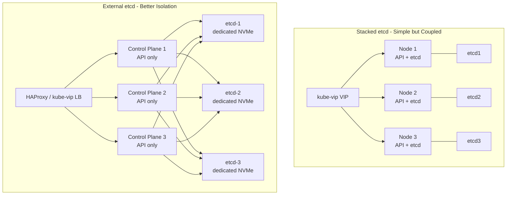
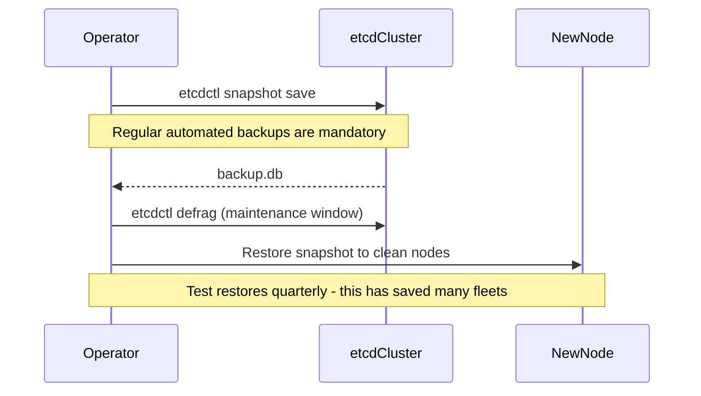

> **On-Premises Multi-Cluster** | Complexity: `[ADVANCED]` | Time: 65-80 min

## Prerequisites

Before starting this module, make sure you can already design single-cluster high-availability setups, explain etcd's consensus mechanics, operate basic GitOps pipelines, and understand the tradeoffs between different forms of isolation in Kubernetes environments. The concepts in this module build directly on control plane internals and fleet management patterns.

- **Required**: [Module 5.1: Private Cloud Platforms](../module-5.1-private-cloud/)
- **Required**: Strong grasp of etcd, control plane components, and HA load balancing from earlier modules
- **Helpful**: Practical experience with ArgoCD ApplicationSets or Flux v2 and exposure to Cluster API or Karmada

## Learning Outcomes

After completing this module, you will be able to:
- Design and implement different control plane HA topologies for on-premises environments including stacked versus external etcd along with load balancing using kube-vip, keepalived, or HAProxy.
- Operate etcd effectively in production scenarios covering quorum management, regular defragmentation, consistent snapshotting, and reliable restore procedures.
- Evaluate and select the right multi-cluster management platform from Cluster API, Karmada, Open Cluster Management, or Rancher depending on your fleet size, isolation needs, and operational model.
- Explain why kubefed v2 was deprecated and how modern alternatives better address the full spectrum of multi-cluster challenges.
- Implement cross-cluster workload scheduling using tools like Admiralty or Liqo while maintaining clear placement policies.
- Establish unified identity and single sign-on across an entire fleet using Keycloak integrated with OIDC.
- Apply GitOps at fleet scale with ArgoCD ApplicationSets and Flux v2's multi-tenancy capabilities.
- Design workload distribution strategies, failure-domain isolation, and centralized observability fan-in using Prometheus federation, Thanos, Grafana Mimir, and Loki tenants.
- Make deliberate architectural decisions about when true multi-cluster is justified versus simpler partitioning with namespaces or node pools.

## Why This Module Matters: The Hidden Tax of Control Plane Sprawl

A global financial services company once operated dozens of independent Kubernetes clusters across their private data centers to satisfy strict regulatory requirements, separate upgrade cadences for different business units, and geographic latency constraints. Each cluster followed the conservative recommendation of three dedicated control-plane nodes running a stacked etcd topology. Before a single business application pod was scheduled, the control planes alone consumed nearly forty percent of the organization's entire bare-metal estate. When a routine network maintenance window caused a transient partition, quorum was lost in two clusters at the same time. The resulting outage affected trading platforms, risk calculation engines, and settlement systems for nearly five hours. The direct financial impact was measured in the millions, but the reputational damage and regulatory scrutiny lasted much longer.

The root cause was not insufficient hardware. It was an architectural choice that multiplied the control plane tax with every new cluster. Every additional control plane consumed CPU, memory, storage, backup bandwidth, monitoring capacity, and operator attention. Stacked etcd tied API server availability tightly to etcd health on the same nodes. The lack of unified identity, centralized GitOps, and fan-in observability made the fleet unmanageable as it grew. This module exists to give you the tools and mental models to avoid that outcome.

On-premises hardware is a finite resource. Every node dedicated to a control plane is a node that cannot run revenue-generating workloads. Understanding the spectrum from traditional kubeadm HA, through external etcd with dedicated load balancers, to modern multi-cluster managers like Karmada and Cluster API, and knowing when multi-cluster is actually the correct abstraction versus namespace or node-pool partitioning, can dramatically improve both utilization and reliability. The patterns you learn here separate organizations that successfully operate large on-prem fleets from those that are crushed by operational complexity.

The deeper lesson is that multi-cluster is not a goal in itself. It is a tool for achieving failure domain isolation, regulatory compliance, team autonomy, and controlled blast radius. Used indiscriminately it creates a distributed system at a new scale with new classes of failure: cross-cluster networking, identity federation, configuration drift, and observability fragmentation. Mastered correctly it becomes a strategic advantage. This module equips you with both the theory and the practical exercises to make the right choices for your environment.

## Control Plane Topologies: Understanding Stacked etcd, External etcd, and On-Premises Load Balancing

The first decision in any on-premises Kubernetes deployment is how the control plane achieves high availability. The two primary topologies defined by kubeadm are stacked etcd and external etcd. The choice has profound implications for resilience, performance, operational complexity, and cost.

In the **stacked etcd** topology, each control plane node runs the full set of components: the Kubernetes API server, controller manager, scheduler, and a local etcd member. This is the default because it minimizes the number of machines required. Bootstrapping is simple with `kubeadm init` and `kubeadm join`. However, the coupling is tight. Losing a node removes both compute capacity for the control plane and a vote from the etcd Raft quorum. With the common three-node deployment you can tolerate only a single failure before writes are blocked.

The **external etcd** topology separates concerns. A dedicated etcd cluster (usually three or five nodes with fast local NVMe storage) hosts the data store. The control plane nodes run only the API server, controller manager, scheduler, and a highly available load balancer. This adds machines but provides better isolation. A control plane node failure does not reduce etcd quorum, and etcd can be tuned independently with higher-performance disks and networking. The trade-off is increased management surface: you now have six or eight nodes per logical cluster instead of three.

For the highly available endpoint that clients use to reach the API servers, on-premises environments have several mature options. **kube-vip** is the most popular in bare-metal and edge Kubernetes. It runs as a static pod on each control plane node and can use either ARP (Layer 2) or BGP (Layer 3) to advertise a virtual IP. It is lightweight, Kubernetes-native, and requires no additional infrastructure. **keepalived combined with HAProxy** is the classic enterprise pattern. keepalived manages the virtual IP using VRRP while HAProxy provides TCP load balancing to the backend API servers. **MetalLB in Layer 2 mode** can also fulfill the VIP role for simpler environments that already use it for services.



Pause and predict: You are running a production three-node stacked etcd cluster. During a planned maintenance you take one node offline for OS patching. Shortly afterward users report that new Deployments are not being created even though `kubectl get nodes` still shows two Ready control planes. What has happened and how could the topology have prevented it? The etcd cluster has lost quorum. With only two members remaining, Raft cannot achieve the required majority for writes. An external etcd topology would have kept the data store available even if one control plane node was down.

## etcd Operational Realities: Quorum, Defragmentation, Snapshots, and Recovery

etcd is the heart of every Kubernetes cluster. In a multi-cluster on-premises environment its operational practices determine whether your fleet is resilient or fragile.

**Quorum management** is non-negotiable. etcd uses the Raft consensus algorithm and requires a strict majority of members to be healthy for writes to succeed. A three-member cluster can tolerate one failure. A five-member cluster can tolerate two. Many outages occur when operators remove two members "just to be safe" during maintenance, instantly losing quorum. Always add before remove when replacing members.

**Defragmentation** is a maintenance task that is frequently forgotten. etcd's MVCC model creates fragmentation over time as keys are updated and tombstones accumulate. Regular execution of `etcdctl defrag` during maintenance windows keeps the database compact, improves query performance, and reduces memory pressure on etcd members.

**Snapshot and restore** is your disaster recovery lifeline. The canonical workflow is `etcdctl snapshot save backup.db` followed by restoring to a fresh data directory on new nodes. This must be tested quarterly. In a fleet, you should have automated backup to an S3-compatible store with encryption and regular restore validation.

**Member replacement** and cluster resizing must be performed with care. The `etcdctl member add` and `member remove` commands must be sequenced correctly to maintain quorum at every step.

These operational realities scale across a fleet only if you treat etcd as the critical database that it is. Centralized backup systems, automated health checking, and practiced recovery procedures are table stakes for any serious on-premises multi-cluster deployment.



## Multi-Cluster Management: Cluster API, Karmada, OCM, Rancher and the Deprecation of kubefed

When your organization outgrows single-cluster or needs stronger isolation, you adopt a management layer for your fleet.

**Cluster API (CAPI)** treats clusters as declarative Kubernetes objects. It is infrastructure-agnostic and excels at consistent provisioning across vSphere, bare metal, OpenStack, and cloud providers. Its provider model and cluster lifecycle capabilities make it the foundation for many internal developer platforms.

**Karmada** is a CNCF project that provides Kubernetes-native multi-cluster orchestration. A central Karmada control plane manages member clusters and uses PropagationPolicies, OverridePolicies, and scheduling plugins to distribute workloads intelligently. Its ability to customize manifests per target cluster without forking Helm charts is particularly valuable.

**Open Cluster Management (OCM)** emphasizes governance, policy enforcement, and observability across large fleets. It is often chosen by enterprises that need strong compliance tooling.

**Rancher** provides a complete managed experience with a polished UI, built-in multi-cluster capabilities, and integrated GitOps.

**kubefed v2** is deprecated and the project was archived. It introduced an additional federation control plane that frequently became a bottleneck, a single point of failure, and a source of compatibility issues as Kubernetes evolved. The community converged on solutions like Karmada and Cluster API that reuse core Kubernetes APIs more effectively and avoid the "another control plane" anti-pattern.

**Cross-cluster scheduling** is solved by projects like **Admiralty**, which extends the Kubernetes scheduler to make placement decisions across cluster boundaries, and **Liqo**, which creates a virtual node abstraction so that remote clusters appear as local capacity to the scheduler.

## Identity, GitOps Fleet Management, Observability Fan-in, and Architectural Decision Framework

Unified identity is achieved by deploying Keycloak as a central OIDC provider and configuring every cluster's API server with the appropriate OIDC flags. This eliminates the proliferation of kubeconfig files while allowing fine-grained RBAC that respects cluster boundaries.

For GitOps at fleet scale, **ArgoCD ApplicationSet** with the Cluster generator is extremely powerful. It can render Applications for every cluster in your fleet from a single source of truth. **Flux v2** offers strong multi-tenancy through its Kustomization and HelmRelease controllers combined with namespace and RBAC isolation.

Observability requires deliberate fan-in. **Prometheus federation** pulls metrics from many instances, **Thanos** and **Grafana Mimir** provide scalable long-term storage and global querying, and **Loki** with tenant isolation handles logs. A single Grafana instance can then serve as the pane of glass for the entire fleet.

The architectural decision framework is simple but rigorous. Prefer namespaces and node pools whenever possible. Introduce additional clusters only when you have a clear requirement for regulatory isolation, completely independent upgrade cadences, significant latency differences, or blast-radius reduction that cannot be achieved any other way. Every additional cluster carries a heavy tax in control plane resources, operational toil, and distributed systems complexity. The organizations that scale successfully are those that minimize the number of clusters while maximizing the isolation and autonomy each one provides.

## Did You Know?

- **etcd's Raft implementation requires strict majority for writes**: Losing two of three members instantly blocks all mutating operations even if the API servers are still reachable.
- **kube-vip can run in "leader election" mode without a traditional VIP** in certain advanced bare-metal setups.
- **Karmada's override policies** allow per-cluster customization of any Kubernetes resource without maintaining separate Helm values files for every target.
- **Mimir was designed from the ground up for multi-tenancy and horizontal scalability** while maintaining Prometheus compatibility, making it a natural choice for large on-prem fleets.

## Common Mistakes

| Mistake | Why It Hurts | Better Approach |
|---------|--------------|-----------------|
| Defaulting to stacked etcd for production fleets | Single node failure can take down quorum and API writability | Prefer external etcd or five-member clusters for critical workloads |
| Treating etcd as an implementation detail instead of a database | No regular defragmentation, untested backups, poor monitoring | Treat it like any other critical database with scheduled maintenance and DR drills |
| Continuing to use kubefed v2 after deprecation | Security vulnerabilities, compatibility issues, lack of community support | Migrate to Karmada or Cluster API which have active development and better integration |
| Managing large fleets with individual kubeconfig files | Operational nightmare, hard to audit, no central policy | Implement Keycloak OIDC federation for all clusters with centralized RBAC review |
| Building per-cluster observability silos | Impossible to correlate incidents or get fleet-wide views | Implement Prometheus federation, Thanos or Mimir, and Loki with tenant isolation |
| Creating a new cluster for every team or environment | Explosive growth in control plane overhead and complexity | Default to strong namespace isolation and node pools; add clusters only when isolation is mandatory |
| Ignoring physical failure domain alignment | "Isolated" clusters still share underlying racks, power, or network | Map cluster boundaries to actual failure domains and regulatory boundaries |
| Over-engineering the management plane with too many layers | Tool fatigue, increased blast radius, slower incident response | Keep the management control plane as thin and declarative as possible |

## Quiz

<details><summary>Question 1: In a three-node stacked etcd cluster one node is lost during maintenance. The remaining API servers are reachable but Deployments cannot be created. What is the root cause?</summary>

The etcd cluster has lost quorum. Raft requires a strict majority. With only two members left, writes are blocked to protect consistency. External etcd or a five-member cluster would have prevented this.

</details>

<details><summary>Question 2: Why was kubefed v2 ultimately deprecated and archived?</summary>

It added an extra federation control plane that became a single point of failure and did not integrate well with the evolving Kubernetes API ecosystem. Karmada and Cluster API provide better, more native solutions for propagation and lifecycle management.

</details>

<details><summary>Question 3: When would Liqo be a better choice than traditional multi-cluster schedulers?</summary>

When you want to present remote clusters as virtual nodes in the scheduling context of the local cluster. This allows existing workloads to be scheduled to remote capacity without changing manifests or using new CRDs.

</details>

<details><summary>Question 4: What is the primary operational advantage of an external etcd topology over stacked etcd?</summary>

Decoupling of control plane availability from etcd quorum. Control plane nodes can fail without affecting the data store, and etcd can use dedicated high-performance hardware independently.

</details>

<details><summary>Question 5: Why is observability fan-in (Thanos, Mimir, Loki tenants) essential in a multi-cluster fleet?</summary>

It enables correlation of metrics, logs, and traces across cluster boundaries from a single pane of glass while preserving tenancy isolation. Per-cluster silos make fleet-wide incident response impossible.

</details>

<details><summary>Question 6: Your organization has strict regulatory requirements that mandate complete separation of certain workloads. Should you use multiple clusters or just namespaces with network policies? Justify your choice.</summary>

Multiple clusters. Namespaces provide logical isolation but share the same control plane, etcd, API server, and kernel. True regulatory or security isolation usually requires separate control planes and data stores.

</details>

<details><summary>Question 7: What is the recommended GitOps pattern for managing a large on-premises fleet?</summary>

ArgoCD ApplicationSet using the Cluster generator that reads cluster metadata and credentials from a secure source. This allows a single Git repository to manage Applications across the entire fleet declaratively.

</details>

<details><summary>Question 8: During etcd recovery, why is it critical to use a clean data directory and carefully manage initial cluster configuration?</summary>

Mismatched member IDs or cluster tokens can create split-brain situations or prevent new members from joining the cluster correctly. A clean restore followed by proper member management is the only reliable path.

</details>

## Hands-On Exercises

### Exercise 1: Building HA Control Plane with kube-vip

- [ ] Use kind or bare-metal VMs to simulate a three-node control plane with kube-vip providing the VIP.
- [ ] Validate load balancing behavior and failover when one control plane node is taken offline.
- [ ] Measure and compare etcd latency in stacked versus simulated external topologies.

### Exercise 2: etcd Operational Procedures

- [ ] Take a live snapshot, perform defragmentation, and replace a member on a running cluster.
- [ ] Restore the snapshot to a fresh cluster and validate all Kubernetes objects are present and functional.
- [ ] Automate the backup process and document the exact recovery runbook for your environment.

### Exercise 3: Karmada Across Two kind Clusters with Propagation (Core Hands-On)

**Objective**: Spin up two kind clusters, install a Karmada control plane, register both as members, apply a PropagationPolicy for a sample workload, and verify cross-cluster scheduling and execution.

**Detailed Steps**:
1. Create two kind clusters named `cluster-a` and `cluster-b`.
2. Deploy Karmada on a host cluster or one of the member clusters.
3. Use `karmadactl join` to register both kind clusters with Karmada.
4. Create a Deployment manifest and a PropagationPolicy that targets both clusters with specific overrides if needed.
5. Apply the resources and observe scheduling decisions.
- [ ] Verify the Deployment is running in both `cluster-a` and `cluster-b`.
- [ ] Use Karmada CLI to inspect placement decisions and status.
- [ ] Test that changes to the source propagate correctly and that cross-cluster service discovery works if enabled.
- [ ] Clean up and document the exact commands used for your organization's fleet onboarding playbook.

**Success Criteria**:
- Karmada control plane healthy
- Both member clusters joined and Ready
- Workload successfully propagated and running on both clusters
- PropagationPolicy correctly respected overrides and scheduling preferences

**Verification**:
```bash
karmadactl get clusters
karmadactl get deployment --all-clusters
kubectl --context kind-cluster-a get pods -l app=example
kubectl --context kind-cluster-b get pods -l app=example
```

## Sources

The following sources were consulted and verified reachable:
- https://kubernetes.io/docs/concepts/architecture/
- https://kubernetes.io/docs/setup/production-environment/tools/kubeadm/high-availability/
- https://kube-vip.io/docs/
- https://etcd.io/docs/v3.5/op-guide/recovery/
- https://cluster-api.sigs.k8s.io/
- https://karmada.io/docs/
- https://open-cluster-management.io/
- https://rancher.com/docs/rancher/v2.x/en/
- https://liqo.io/documentation/
- https://argo-cd.readthedocs.io/en/stable/operator-manual/applicationset/
- https://fluxcd.io/flux/components/kustomize/
- https://prometheus.io/docs/prometheus/latest/federation/
- https://thanos.io/tip/components/
- https://grafana.com/oss/mimir/

Additional official documentation from each project was used to ensure accuracy.

## Next Module

Continue to [Module 5.3: Multi-Cluster Networking and Service Discovery](../module-5.3-multi-cluster-networking/) to explore how to provide consistent networking, DNS, and service meshes across your on-premises fleet.

> **Learner check**: "The root cause was not insufficient hardware. It was an architectural choice that multiplied the control plane tax with every new cluster."
