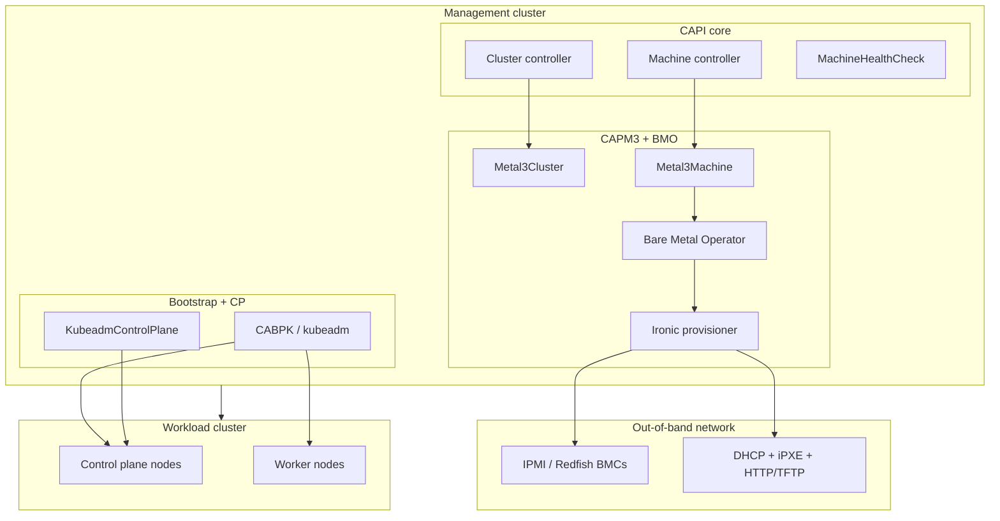
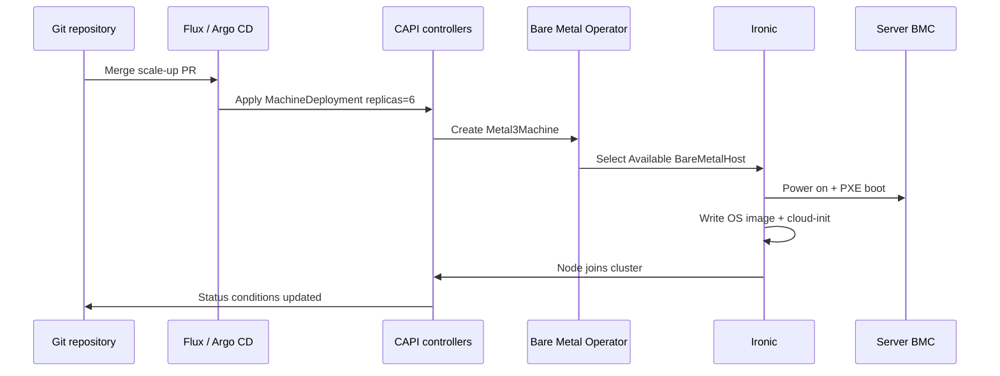

> **On-Premises Multi-Cluster** | Complexity: `[ADVANCED]` | Time: 55-65 min | Covers Cluster API, Metal3, Ironic, Tinkerbell, BMC inventory, network boot, bootstrap providers, control-plane HA, and day-2 bare-metal lifecycle.

## Prerequisites

Before starting this module, you should understand multi-cluster control planes, declarative bare-metal provisioning fundamentals, and how management clusters differ from workload clusters in day-2 operations.
- **Required**: [Module 5.2: Multi-Cluster Control Planes](../module-5.2-multi-cluster-control-planes/)
- **Required**: [Module 2.4: Declarative Bare Metal](../../provisioning/module-2.4-declarative-bare-metal/)
- **Helpful**: IPMI or Redfish familiarity, DHCP/PXE basics, and experience running a management Kubernetes cluster

## Learning Outcomes

After completing this module, you will be able to connect bare-metal hardware lifecycle to the same declarative patterns you use for application Deployments.
- **Implement** Cluster API with the Metal3 provider to declaratively provision bare-metal Kubernetes clusters from a management cluster.
- **Design** a multi-cluster lifecycle pipeline that orchestrates provisioning, scale-up, replacement, and chained upgrades through GitOps.
- **Evaluate** BareMetalHost state transitions during hardware inspection, provisioning, decommissioning, and error recovery.
- **Diagnose** node failures and configure MachineHealthChecks that remediate hardware safely without cascading outages.
- **Compare** bare-metal CAPI provisioning against OS-level kubeadm bootstrap and against private-cloud CAPI providers such as CAPV.

## Why This Module Matters: Declarative Metal Without Remote Hands

Hypothetical scenario: a telecommunications edge platform operates hundreds of small Kubernetes clusters on physical servers in cabinets that rarely see a platform engineer. Legacy provisioning required an operator to drive to a site, attach a crash cart, configure BIOS boot order, install Linux from USB, run kubeadm join commands, and verify overlay networking before workloads could land. A single failed disk at a remote rack meant eight hours of truck rolls, SLA penalties, and manual rebuild steps that drifted from the documented runbook because nobody updated the wiki after the last emergency patch.

That imperative model collapses when fleet size grows. Cluster API (CAPI) treats clusters and machines as Kubernetes resources reconciled by controllers, the same way Deployments reconcile pods. On bare metal, the Metal3 infrastructure provider (CAPM3) bridges those APIs to Baseboard Management Controllers (BMCs) through OpenStack Ironic or alternative backends such as Tinkerbell. You declare desired node counts, OS images, and Kubernetes versions in Git; controllers power servers on, network-boot inspection or installation images, inject bootstrap data, and join nodes without SSH sessions on the data-center floor.

The tradeoff is real: bare-metal CAPI demands upfront investment in DHCP, TFTP or HTTP image hosting, BMC credential hygiene, spare hardware inventory, and network segmentation between management and workload planes. You also inherit Ironic or Tinkerbell as operational dependencies alongside etcd and your CNI, which means provider upgrades become part of the same change-advisory process as Kubernetes minor bumps. Platform maturity therefore includes fluency in out-of-band management, immutable OS images, and MachineHealthCheck safety thresholds—not only kubectl and Helm skills teams already practice on cloud-hosted clusters. This module teaches the architecture and day-2 operations you need before CAPM3 becomes production-critical infrastructure across your entire bare-metal fleet.

## Cluster API Architecture on Bare Metal

Cluster API is a subproject of Kubernetes SIG Cluster Lifecycle. Its mission is declarative cluster lifecycle: create, upgrade, scale, and delete entire Kubernetes clusters using CRDs and controllers on a **management cluster**. The management cluster runs CAPI core controllers plus provider-specific controllers; it should not host tenant application workloads. Workload clusters are downstream environments whose Machines, control planes, and infrastructure objects live as namespaced resources you manage with GitOps or imperative apply—though GitOps is strongly preferred for auditability.

CAPI separates concerns into provider categories that compose cleanly on bare metal, and understanding each category prevents teams from installing only CAPM3 while forgetting cert-manager or bootstrap providers during management-cluster bring-up.

1. **Infrastructure providers** provision servers. CAPM3 (Metal3) claims BareMetalHost inventory and drives Ironic. CAPT (Tinkerbell) offers an alternative workflow centered on in-cluster provisioning workers. Private-cloud analogs include CAPV (vSphere), CAPO (OpenStack), and CAPA (AWS)—same CAPI objects, different APIs underneath.
2. **Bootstrap providers** turn a blank server into a Kubernetes node by generating cloud-init, Ignition, or provider-specific bootstrap data. The default is Cluster API Bootstrap Provider Kubeadm (CABPK).
3. **Control plane providers** manage control plane lifecycle—etcd membership, certificate rotation, rolling upgrades. KubeadmControlPlane (KCP) is the common default.
4. **IPAM providers** allocate node addresses when static pools are required. Metal3 ships IPAM CRDs (`IPPool`, `IPClaim`, `IPAddress`) under `ipam.metal3.io`.

The official CLI is `clusterctl`, which initializes providers, generates cluster templates, and moves resources between management clusters. CAPI relies on mutating and validating webhooks, so **cert-manager** is a hard prerequisite on the management cluster. As of CAPI v1.12.x (January 2026 release series), chained upgrades can span multiple Kubernetes minor versions with intermediate steps computed automatically, and in-place updates reduce full node replacement for some changes. API storage has moved toward `cluster.x-k8s.io/v1beta2`; plan migrations before v1beta1 removal in later releases.



Pause and predict: if the management cluster loses connectivity to the BMC network while workload clusters stay healthy, new provisioning, remediation, and chained upgrades stall immediately because CAPM3 cannot power-cycle hosts or attach virtual media, even though running kubelet processes on already-joined nodes continue serving traffic until the next hardware fault forces manual intervention.

## Metal3, Ironic, and the BareMetalHost Lifecycle

Metal3 (CAPM3) is the dominant CAPI infrastructure provider for bare metal. It does not replace Ironic; it embeds Ironic (typically containerized) and exposes Kubernetes-native CRDs through the Bare Metal Operator (BMO). You register each physical server as a `BareMetalHost` (`metal3.io/v1alpha1`) with BMC address, credentials secret, boot MAC, and optional root-device hints so provisioning targets the correct NVMe or RAID volume.

BMC access uses IPMI (`ipmi://`) or Redfish (`redfish://` or `redfish+https://`). Redfish is preferred on modern Dell iDRAC, HPE iLO, and Lenovo XClarity controllers because credentials travel over HTTPS and virtual media attachment is better supported than legacy IPMI LAN channels. Store BMC secrets in Kubernetes Secrets encrypted at rest, or better, inject them via Sealed Secrets or SOPS so etcd backups never contain plaintext passwords.

The BareMetalHost state machine is the operational heartbeat of bare-metal automation, and every platform on-call rotation should include a printed copy of these states taped beside the BMC jump host until transitions become muscle memory.

1. **Registering** — CR created; BMO validates BMC credentials and connectivity.
2. **Inspecting** — Ironic boots an inspection ramdisk via PXE; CPU, RAM, disks, and NICs are inventoried.
3. **Available** — Inspection succeeded; host powered off and idle, ready for a Machine claim.
4. **Provisioning** — CAPI Machine selected this host; Ironic writes the OS image, injects user-data, reboots to disk.
5. **Provisioned** — OS image is on disk and the host has booted from it; the BareMetalHost stays allocated to the claiming Machine. Per the [Metal3 BMO state machine](https://book.metal3.io/bmo/state_machine), **Provisioned** ends at successful deploy—not at Kubernetes Node Ready. CAPI Machine phase, bootstrap (cloud-init/Ignition), and kubelet join are downstream; a host can sit **Provisioned** while the Node is still NotReady.
6. **Deprovisioning** — Machine deleted; disks wiped per policy; host returns toward Available.
7. **Error** — Unrecoverable failure; requires operator intervention after reviewing BMO and Ironic logs.

Incorrect BMC credentials fail early in **Registering** or **Inspecting** with authentication errors—never silently proceed to provisioning. Skipping inspection saves minutes in labs but hides failed RAM, missing disks, or wrong NIC ordering that explode during first production etcd write.

```yaml
apiVersion: metal3.io/v1alpha1
kind: BareMetalHost
metadata:
  name: rack2-u14
  namespace: metal3-system
  labels:
    environment: production
    rack: "2"
spec:
  online: true
  bootMACAddress: "52:54:00:12:34:56"
  bmc:
    address: "redfish+https://192.168.100.14/redfish/v1/Systems/1"
    credentialsName: rack2-u14-bmc-secret
    disableCertificateVerification: false
  rootDeviceHints:
    wwn: "5002538e4020a1b2"
```

Hardware inventory management extends beyond CR creation. Platform teams label hosts by rack, failure domain, CPU generation, and role (`control-plane`, `worker`, `spare`). Machine templates use `hostSelector` to pin control planes to NVMe-backed hosts and workers to denser storage tiers. Maintain at least ten to fifteen percent spare BareMetalHosts powered off but registered; MachineHealthCheck remediation otherwise creates Machines that sit **Pending** forever when no Available host exists.

## Network Boot: DHCP, iPXE, TFTP, and Image Delivery

Bare-metal provisioning is a networking exercise disguised as Kubernetes YAML. When Ironic provisions a host, the server PXE-boots: firmware requests DHCP, receives next-server and filename options, loads iPXE or GRUB, then fetches a kernel and initrd or a full disk image from HTTP, HTTPS, or TFTP. Your provisioning network must be isolated from tenant workloads yet reachable from BMO and Ironic pods on the management cluster.

Design the provisioning VLAN using the following checklist so PXE, inspection, and deploy phases never compete with tenant traffic for DHCP leases or firewall exceptions.

- **DHCP scope** reserved for transient PXE clients and predictable for inspection ramdisks; exclude BMC, management-cluster API VIPs, and image-server static addresses.
- **TFTP or HTTP** serving Ironic deploy kernels and ramdisks; large environments prefer HTTP for speed and checksum validation.
- **Proxy DHCP** or dedicated provisioning NICs when servers have multiple interfaces—boot interface MAC must match `bootMACAddress`.
- **Firewall rules** allowing management-cluster nodes to reach BMC subnets on IPMI/Redfish ports without exposing BMCs to corporate LANs.
- **DNS** for image servers and any post-install registry mirrors referenced in cloud-init.

Metal3Machine templates reference OS images by URL, checksum, and format such as qcow2, raw, or iso, and those three fields together are the contract that prevents silent drift when mirror servers rotate artifacts during patch windows.

```yaml
apiVersion: infrastructure.cluster.x-k8s.io/v1beta1
kind: Metal3MachineTemplate
metadata:
  name: production-workers-v1
  namespace: clusters-prod
spec:
  template:
    spec:
      image:
        url: "https://images.internal.example/os/ubuntu-24.04-k8s-v1.35.qcow2"
        checksum: "abcdef0123456789..."
        checksumType: sha256
        format: qcow2
      hostSelector:
        matchLabels:
          role: worker
```

Immutable images beat golden-server cloning. Build pipelines produce versioned artifacts with pinned kernel, containerd, and optional hardening profiles; reference them by checksum so reprovisioning recreates identical nodes months later. Mutable “install latest packages on first boot” scripts drift quickly and invalidate disaster-recovery assumptions.

## Bootstrap Providers: kubeadm, Talos, k0s, and RKE2

The bootstrap provider decides what runs on disk after Ironic finishes. **CABPK (kubeadm)** remains the default: it renders cloud-init or Ignition with join tokens, certificate paths, and kubelet configuration. It pairs naturally with **KubeadmControlPlane** for rolling control-plane upgrades. Most CAPM3 documentation and `clusterctl` templates assume this path.

Alternative bootstrap and control-plane combinations trade operational model for immutability, and the following table summarizes when teams pick kubeadm defaults versus Talos, k0s, or RKE2 on bare metal.

| Provider stack | Strength on bare metal | Tradeoff |
|----------------|------------------------|----------|
| CABPK + KCP (kubeadm) | Broad docs, chained CAPI upgrades, familiar debugging | Mutable OS; SSH and package drift unless heavily automated |
| Talos (CABPT / TalosControlPlane) | Immutable, API-only OS; no SSH shell | Different day-2 tooling; hardware support matrix to verify |
| k0s bootstrap | Lightweight binaries; simple joins | Smaller ecosystem than kubeadm for advanced features |
| RKE2 bootstrap | Hardened defaults; common in regulated sectors | Rancher-centric workflows; version matrix with CAPI |

Choosing Talos on bare metal eliminates SSH-based break-glass unless you enable emergency maintenance modes, which auditors often appreciate but on-call engineers must practice in game days. kubeadm on Ubuntu or RHEL matches teams coming from private-cloud VM bootstrap (Module 5.1) because the same Ansible patterns can generate image contents before CAPM3 ever powers on the host.

Bootstrap **secrets**—join tokens, bootstrap kubeconfig copies, etcd encryption keys—must never live in plain Git. Use sealed secrets, external secret operators, or short-lived tokens rotated by the management cluster. CAPI stores references in `Machine` bootstrap objects; compromise of the management cluster etcd therefore equals compromise of every downstream cluster join capability. Restrict RBAC on management namespaces, enable audit logging, and segregate production cluster CRs into namespaces with dedicated GitOps deploy keys.

## Control Plane HA on Bare Metal: kube-vip and MetalLB

Bare-metal Kubernetes lacks a cloud provider to assign `LoadBalancer` VIPs for the API server. You must engineer L4 reachability explicitly. Two common patterns appear in on-premises CAPI designs:

**kube-vip** runs as a DaemonSet or static pod on control-plane nodes, participates in leader election, and advertises a virtual IP for the Kubernetes API using ARP (L2) or BGP (L3). Pair kube-vip with KubeadmControlPlane by setting `controlPlaneEndpoint.host` to the VIP in `Cluster` and `Metal3Cluster` specs. kube-vip also advertises Service VIPs when deployed with its cloud-provider component—useful for ingress controllers on bare metal.

**MetalLB** allocates address pools for `Service type: LoadBalancer` from configured IP ranges. It does not replace an API VIP by itself; teams often combine kube-vip for `6443` and MetalLB for application Services. MetalLB speakers announce routes via L2 or BGP depending on datacenter design.

```yaml
apiVersion: infrastructure.cluster.x-k8s.io/v1beta1
kind: Metal3Cluster
metadata:
  name: edge-prod
  namespace: clusters-prod
spec:
  controlPlaneEndpoint:
    host: 10.10.50.100   # kube-vip VIP on CP VLAN
    port: 6443
  cloudProviderEnabled: false
```

Without a stable VIP, every control-plane Machine carries its own apiserver address and client kubeconfig breaks when that node is deprovisioned during upgrades or remediation events. Document which VLAN owns the VIP, which switches permit gratuitous ARP, how BGP sessions fail over during rack maintenance, and who between network and platform on-call receives the first page when apiserver TLS errors spike. MetalLB address pools for application Services should be carved from different subnets than API VIPs so a exhausted LoadBalancer pool cannot accidentally consume the control-plane address. Run quarterly failover drills: stop kube-vip on one control-plane node, verify clients reconnect through the VIP, then restore and confirm etcd member list matches Machine inventory in the management cluster.

## Troubleshooting the Provisioning Path

When a Machine sticks in Provisioning, walk the stack from Git downward instead of restarting random controllers. Confirm the BareMetalHost is Available and matches `hostSelector` labels, then inspect BMO events for BMC authentication or power-state errors. Ironic logs reveal whether DHCP never offered an address, TFTP timed out, or HTTP image download failed checksum validation. Misaligned `bootMACAddress` values produce the maddening symptom of another host receiving the deploy image—always compare LLDP or switch MAC tables against BareMetalHost specs during bring-up.

Common failure signatures include **DHCP starvation** when too many hosts PXE simultaneously, **MTU black holes** when provisioning VLAN routes through a tunnel smaller than 1500 bytes, and **clock skew** when BMC timestamps break Redfish session tokens. Keep a laminated runbook beside the provisioning VLAN diagram listing which jump host can run `openstack baremetal node list` equivalents against Ironic, which mirror hosts serve images, and which firewall rule IDs must open for BMC subnets. Platform tickets labeled “Kubernetes broken” during provisioning are usually Layer 2 or out-of-band issues until proven otherwise.

After the node joins, failures shift to bootstrap: cloud-init or Ignition must reach the metadata service or static URLs, pull container images, and execute kubeadm join before `nodeStartupTimeout` fires. If join succeeds but Node never Ready, debug CNI next—not CAPM3. Separating provisioning failures from bootstrap failures saves hours because the remediation owner differs: hardware teams own BMC and PXE, platform teams own image contents and join tokens, application teams own pods only after Node Ready is true.

## Metal3 IPAM and Multi-Cluster Fleet Patterns

When DHCP cannot assign stable node addresses for production records or firewall allow lists, Metal3 IPAM CRDs allocate static IPs from pools tied to clusters or racks. `IPPool` defines ranges; `IPClaim` requests an address for a host; controllers write `IPAddress` objects consumed by templates. Coordinate IPAM with corporate NetBox or Infoblox so Kubernetes node addresses never collide with BMC, VIP, or registry reservations documented in Module 5.1 networking guidance.

Multi-cluster fleet patterns place one management cluster per security zone or one global management cluster with strict namespace isolation. Edge deployments sometimes use management clusters on small VM rings while CAPM3 provisions remote bare metal over routed BMC networks. Central management reduces `clusterctl` sprawl but concentrates blast radius; distribute management when compliance mandates separate etcd for production and lab. Regardless of topology, standardize provider versions, Git repository layout, and BareMetalHost label schemas so engineers transferring between teams read familiar objects.

Fleet observability should export BareMetalHost state counts, Machine phase histograms, and spare inventory gauges into the same Prometheus stack scraping workload clusters. Alert when Available hosts drop below policy thresholds or when any cluster MachineDeployment has unavailable replicas longer than SLO windows. Executives understand “two spares left in Amsterdam” better than opaque `MachinePending` messages in incident bridges.

## cert-manager, clusterctl, and Provider Version Skew

Every CAPI management cluster depends on cert-manager to mint TLS certificates for admission webhooks. Without healthy `cert-manager` pods, `clusterctl init` may appear to succeed while provider controllers crash-loop on webhook timeouts, producing Machines that never leave Pending with cryptic “failed calling webhook” events. Pin cert-manager to versions tested with your CAPI release, document upgrade order—cert-manager first, providers second, core CAPI third—and snapshot webhook CA bundles before upgrades so you can roll back if validation breaks mid-change.

`clusterctl` tracks provider repositories through a local config file. Platform teams should commit provider version pins to Git alongside cluster manifests so disaster recovery rebuilds the same CAPM3, CABPK, and KCP combination that production validated. Skew between management-cluster Kubernetes version and provider-supported versions causes subtle errors: too new a management cluster may serve API groups providers do not yet understand; too old a cluster may lack feature gates required for ClusterClass or in-place updates. The CAPI support policy covers only the two latest minor releases; plan upgrades quarterly rather than letting management infrastructure become unsupported.

When mixing providers—CAPM3 for workers, external load balancers from OpenStack Octavia for legacy Services—document which controllers own which objects so two infrastructure controllers never fight the same annotation keys. Provider version skew across fleet management clusters is acceptable only when Git branches clearly label which site runs which pin; otherwise identical cluster manifests behave differently in two cities, breaking the promise of declarative operations that executives bought when approving bare-metal automation funding.

Operational acceptance criteria for a new CAPM3 site should include a full loop test: register two spares and four production hosts, provision a lab cluster, trigger MachineHealthCheck on one worker by simulating kubelet failure, verify replacement completes within SLO, execute a chained minor upgrade on KubeadmControlPlane, and decommission the lab cluster without orphaning BareMetalHosts in Error state. Only after that loop succeeds should application teams receive production kubeconfig credentials. Skipping the loop produces fleets that look declarative in slide decks but behave imperatively when the first switch failure arrives because nobody validated `maxUnhealthy` thresholds or spare counts under real latency.

Finally, teach application developers the difference between Kubernetes node failure and Machine deletion. When MHC replaces a node, pod names and PVC attachments may change; StatefulSets with local storage need explicit policies about whether bare-metal reprovision preserves disk identity through rootDeviceHints and host selectors. Storage teams using central SAN arrays may prefer CAPV VMs with hot-plug volumes instead of CAPM3 local disks for stateful tiers. Platform engineering maturity is choosing the right tier for each workload rather than forcing every service onto identical bare-metal shapes because CAPI makes provisioning fashionable again.

Document every BMC firmware baseline applied during intake so BareMetalHost labels encode BIOS versions that later explain why some hosts fail secure boot with new signed images. Intake checklists should include power-draw validation, memory pattern tests, and NIC loopback checks before servers ever enter the Available pool. Hardware vendors ship batches with latent defects; inspection ramdisks catch many issues, but burn-in scripts triggered through Ironic extra steps catch intermittent thermal failures that inspection misses. Treat hardware intake as part of the software supply chain, not as facilities paperwork that happens before platform engineering begins.

Run quarterly game days that disable a BMC switch port—not the whole server—to validate monitoring distinguishes link-down from host-down before MachineHealthCheck deletes healthy machines whose kubelet simply lost upstream routing. These exercises expose whether your GitOps repository documents which on-call role owns BMC, Ironic, DHCP, and CAPI reconciliation during combined failures, which is the difference between a fifteen-minute reprovision and a multi-hour war room debating which controller to restart first without a written runbook owner, escalation path, or pre-agreed severity matrix for combined BMC and Kubernetes failures.

## Ironic vs Tinkerbell Provisioning Flows

**Ironic-centric Metal3** suits traditional datacenter racks with BMC on every server. Ironic handles power, boot order, deploy/cleaning steps, and disk erasure. BMO translates BareMetalHost spec changes into Ironic API calls. You operate Ironic as a container alongside BMO; a full OpenStack deployment is not required despite shared lineage.

**Tinkerbell (CAPT)** targets workflow-driven provisioning: DHCP relay, tink-worker actions, and in-cluster microservices orchestrate each boot stage. CAPT fits edge factories or sites standardizing on Tinkerbell’s action pipeline instead of Ironic’s state machine. Release tags such as CAPT v0.6.x track their own compatibility matrix with CAPI versions—validate before mixing CAPM3 management templates with CAPT experiments on the same fleet.

Use the following comparison summary when platform architects choose between CAPM3 with Ironic and CAPT with Tinkerbell for a new datacenter or edge factory rollout.

| Dimension | CAPM3 + Ironic | CAPT + Tinkerbell |
|-----------|----------------|-------------------|
| Maturity in CAPI docs | Primary bare-metal path | Growing; workflow-centric |
| BMC integration | Native via Ironic drivers | Depends on workflow actions |
| Disk cleaning | Ironic deploy/clean steps | Custom actions |
| Best fit | IPMI/Redfish servers in DC | Pipeline-heavy edge factories |

Many teams prototype with CAPD (Docker provider) on kind before touching BMC networks; behavioral lessons about MachineDeployments, KubeadmControlPlane rolling order, and MachineHealthCheck thresholds transfer directly even though Docker lacks PXE, disk wiping, and BMC power cycling that define bare-metal incident timelines.

## Integrating Bare-Metal CAPI with Private-Cloud Patterns

Module 5.1 covered private-cloud platforms that supply VMs through OpenStack Nova or VMware vSphere. CAPM3 is not a competitor to those stacks—it occupies the layer below or beside them when maximum performance, GPU passthrough, or licensing avoidance matters. Hybrid architectures frequently run **management clusters on private-cloud VMs** while CAPM3 provisions bare-metal workers at edge sites, or they run production data-plane workers on metal and development clusters on CAPV for fast iteration. The integration point is always the management cluster API: Flux watches Git, applies CAPI objects, and provider controllers call different backends without changing application team kubeconfig distribution.

When comparing economics, include reprovision time in SLA models. A CAPV worker replacement might finish in three minutes if templates and datastores are warm; CAPM3 worker replacement includes secure erase, image download, and join bootstrap that often stretch to fifteen minutes even in healthy networks. MachineHealthCheck timeouts must reflect that reality—setting `nodeStartupTimeout` to three minutes guarantees false-positive remediation loops on bare metal. Conversely, CAPV cannot deliver bare-metal RDMA or low-jitter latency for trading-adjacent workloads; CAPM3 keeps those workloads on physical NICs without SR-IOV complexity through hypervisors.

Identity and secrets integration should mirror private-cloud hygiene: Keystone application credentials for CAPO and vCenter service accounts for CAPV have analogs in BMC vault entries for CAPM3. Rotate all three on the same calendar with distinct runbooks. Backup strategies must capture management-cluster etcd plus BareMetalHost inventory CRs; restoring etcd without BareMetalHost objects leaves Ironic state inconsistent with Kubernetes desired state. Practice restore drills on a isolated management cluster before betting production recovery on untested snapshots.

Platform engineers graduating from Module 5.1 should recognize DHCP, DNS, and IPAM dependencies repeated here with stricter isolation requirements because BMC and PXE traffic is more brittle than guest VM cloud-init. The reward for mastering both modules is a unified GitOps vocabulary: same Cluster API kinds, different infrastructure templates, one audit trail for executives asking how many Kubernetes versions run in the fleet and where spare capacity lives.

## Declarative Cluster Creation and GitOps

A minimal CAPM3 cluster links `Cluster`, `Metal3Cluster`, `KubeadmControlPlane`, `Metal3MachineTemplate`, `MachineDeployment`, and `KubeadmConfigTemplate` objects in the management cluster namespace. The `Cluster` spec wires `controlPlaneRef` to KubeadmControlPlane and `infrastructureRef` to Metal3Cluster; worker pools are separate MachineDeployments so you can scale application nodes without touching control-plane objects. `clusterctl generate cluster` emits starter YAML you refine for host selectors, image URLs, and API VIPs—treat generated files as scaffolding, not production truth, because every datacenter uses different BMC subnets, DNS zones, and disk layouts that templates cannot guess.

GitOps controllers such as Flux or Argo CD sync cluster manifests from Git into the management cluster API. **Disable pruning** on CAPI kustomizations because accidental removal of a cluster directory must not trigger cascading deletion of Machines and BareMetalHost deprovisioning that wipes production disks. Set `prune: false`, pin Flux to tagged releases, and use annotation guards on production clusters so only two-person review can enable destructive sync paths. Healthy change flow looks like: platform engineer opens pull request with version bump or replica change → reviewer checks spare inventory and maintenance window → merge → Flux applies → CAPI reconciles → Ironic reprovisions only when Machine specs actually change, not when unrelated inventory files move.

Scale-up is declarative: increase `MachineDeployment.spec.replicas` and commit; CAPM3 claims Available hosts matching `hostSelector` labels and provisions them in order. Scale-down deletes Machines, triggering deprovision and disk cleaning before hosts return to Available for the next claim. **Replacement** during upgrades creates new Machines before deleting old ones when using rolling strategies on KubeadmControlPlane; workers follow `maxUnavailable` and `maxSurge` semantics analogous to Deployments, except surge consumes physical hosts instead of hypervisor overcommit. Fleet managers should visualize spare inventory alongside replica counts the same way capacity planners watch cloud quotas.

Day-2 chained upgrade example: bump `KubeadmControlPlane.spec.version` from v1.34.x to v1.35.x in Git; CAPI provisions a new control-plane Machine, waits for Ready and etcd health, drains an old member, repeats until complete. If the new node fails `nodeStartupTimeout`, the upgrade halts with legacy nodes still serving—never assume partial failure is safe to ignore or that deleting the stuck Machine manually will unblock etcd without a runbook. Record every upgrade in Git commit messages so auditors correlate Kubernetes version changes with change tickets, and keep management-cluster monitoring alerts on `Machine` phases stuck in Provisioning longer than fifteen minutes.

## CAPI Bare Metal vs kubeadm-on-Metal vs Private-Cloud CAPI

Three patterns confuse teams new to platform engineering, and choosing among them should be a written architecture decision rather than a default inherited from whichever blog post shipped last week. **Imperative kubeadm on each server** remains fastest for a single lab cluster: SSH in, run `kubeadm init`, distribute join tokens, install a CNI, and you are scheduling pods within an hour. That path collapses under fleet scale because nobody tracks which BIOS settings, disk layouts, or kernel flags differ between rack fourteen and rack twenty-two, and truck rolls still dominate incident time when hardware fails without spare inventory.

**CAPI plus CAPM3** introduces Machines, BareMetalHosts, and controllers that reconcile desired node counts against physical inventory. Automated remediation through MachineHealthCheck, Git-audited cluster specs, and chained upgrades justify the upfront cost of DHCP, TFTP or HTTP mirrors, BMC automation, and spare hosts—usually once you operate roughly ten production nodes or geographically distributed sites where remote hands are expensive. **CAPI plus CAPV or CAPO on VMs** uses identical object shapes but provisions Nova instances or vSphere clones in minutes, enables hypervisor snapshots for rollback, and shifts hardware failure modes behind live migration—at the cost of licensing, hypervisor overhead, and private-cloud operational complexity described in Module 5.1.

Private-cloud CAPI providers allocate VMs from vCenter or Nova with quotas and flavors; CAPM3 allocates physical hosts from finite inventory in tens of minutes including disk wipe and inspection. MachineHealthCheck on VMs recreates Machines quickly when templates and storage exist; bare metal needs physical spares or remediation stalls in Pending. GitOps patterns, bootstrap secrets, KubeadmControlPlane upgrades, and Flux directory layouts remain parallel across providers—only infrastructure controllers and capacity math change. Teams running hybrid estates often use CAPV for developer clusters and CAPM3 for latency-sensitive production workers while keeping one management cluster and one Git repository structure.

OS-level automation with Ansible or cloud-init on metal without CAPI still works for small fleets and brownfield migrations. The inflection point arrives when MachineHealthCheck, multi-cluster consistency, and audit trails in Git outweigh maintaining bespoke bash orchestration. CAPI does not remove networking or BMC toil; it channels toil into controllers and CRDs you test once, version in Git, and reuse across dozens of clusters the same way application teams reuse Deployments. Compare explicitly to private-cloud CAPI when finance asks why bare metal still makes sense: cite egress, latency, accelerator passthrough, and licensing avoidance, then document the operational costs you accepted in exchange.



## Building Immutable OS Images for Production Fleets

Production CAPM3 clusters should treat node OS artifacts the same way application teams treat container images: versioned, scanned, signed, and promoted through environments. A typical pipeline starts from an upstream Ubuntu or RHEL cloud image, applies hardening scripts with Ansible or Packer, pre-installs containerd at the version matching your target Kubernetes minor release, pins kernel packages validated against your NIC firmware matrix, and exports a qcow2 blob to an internal HTTP server fronted by TLS. The Metal3MachineTemplate references that URL plus a sha256 checksum so Ironic refuses to deploy if a mirror serves corrupted bits. When security patches land, rebuild the artifact, bump the template version in Git, and roll workers through MachineDeployment surge semantics rather than SSH-patching running nodes.

Immutable images also simplify compliance evidence. Auditors can diff Packer variable files between builds, correlate image digests with cluster object generations, and verify that emergency break-glass SSH was never enabled on Talos or production Ubuntu profiles. Teams that still golden-image via kickstart on first boot often discover that two “identical” workers diverged after divergent `apt upgrade` timing; CAPI reprovisioning from the same template eliminates that drift class entirely. Keep at least two image versions available during Kubernetes minor upgrades so you can roll forward and roll back without rebuilding from scratch under incident pressure.

Image size affects provisioning SLAs. Large qcow2 files stress HTTP mirrors and extend disk-write phases on slow SATA boot drives; strip documentation locales, man pages, and unused firmware blobs from worker images while keeping control-plane images on faster media with journaling tuned for etcd I/O. Document minimum disk thresholds discovered during Ironic inspection so Machine templates do not target hosts whose root hints point at 480 GB SATA when your image expects NVMe latency for etcd data directories on control-plane roles.

## Day-2 Operations: Scale, Replace, and Chained Upgrades

Day-2 bare-metal operations are where declarative models pay rent or burn down goodwill. **Scale-up** increases `MachineDeployment.spec.replicas`; CAPI creates Machines, CAPM3 claims Available BareMetalHosts matching selectors, and Ironic provisions sequentially or in parallel depending on DHCP capacity and mirror bandwidth. Capacity planning must include concurrent PXE storms: bringing ten workers online at once can saturate TFTP unless HTTP chaining and per-site mirrors exist. **Scale-down** deletes Machines in reverse order; deprovisioning duration dominates wall-clock time because secure erase policies may run multi-pass wipes on SSDs before hosts return to Available.

**Replace** differs from scale when hardware is bad but fleet size stays constant. Operators cordon the Node, delete the Machine object, wait for deprovision, fix or swap hardware, ensure the BareMetalHost returns to Available, then let MachineDeployment recreate the Machine. MachineHealthCheck automates that loop when failures are real node faults—not when the API server is unreachable for environmental reasons. Runbooks should document when to pause MHC during switch maintenance windows so teams do not wipe half the rack because Ready probes timed out together.

**Chained upgrades** in CAPI v1.12 reduce toil when jumping multiple Kubernetes minors: set the KubeadmControlPlane version field to the destination, and controllers compute intermediate versions respecting kubeadm skew policy. On bare metal each hop still means a new control-plane Machine, full disk imaging, and etcd member addition before an old member drains. Schedule maintenance windows longer than VM-based CAPV upgrades because reprovision takes minutes per node, not seconds. Validate kube-vip failover before the first control-plane hop so clients never pin to a member slated for wipe. Worker upgrades follow MachineDeployment rollout parameters; align `maxSurge` with spare host count so you never need six Available hosts when only four spares exist.

Document rollback explicitly. If a new image or Kubernetes version fails halfway, keep previous Metal3MachineTemplate revisions and image URLs in Git tags so you can revert a pull request and reconcile without improvising checksums from memory. Test rollback quarterly; bare-metal rollback is reprovision, not snapshot revert, and teams that only practice forward upgrades discover wipe durations during real incidents.

## Bootstrap Secret Handling and Management Cluster Hardening

The management cluster is a tier-zero asset. It holds kubeconfig secrets for every workload cluster, BMC credentials, join tokens, and sometimes cloud-provider keys if you mix providers. Enable etcd encryption at rest, restrict who can `kubectl delete` cluster-scoped CAPI objects, and separate namespaces per environment (`clusters-dev`, `clusters-prod`) with RBAC bound to GitOps deploy service accounts scoped to a single namespace each. Bootstrap secrets referenced by CABPK should use short-lived tokens where supported; rotate after personnel changes and after any backup restore test that touched etcd.

Never commit base64 secrets to Git. Sealed Secrets or Mozilla SOPS with age keys let you store encrypted manifests in the same repository as cluster definitions while keeping plaintext only on the management cluster after sync. For BMC passwords, prefer a secret manager that injects Kubernetes Secrets via CSI at pod start so BareMetalHost objects only reference secret names. Audit whether your backup product copies management-cluster etcd to object storage without encryption; that backup equals root access to every downstream cluster.

Network policy on the management cluster should limit which pods reach BMC subnets. Only BMO and Ironic components need outbound IPMI or Redfish; application workloads belong on workload clusters entirely. If you run GitOps controllers on the same management cluster, patch them promptly and pin container images by digest. Compromise of Flux on the management cluster with prune misconfiguration is equivalent to compromise of every bare-metal fleet it manages.

## MachineHealthCheck and Safe Remediation

MachineHealthCheck (MHC) watches Node conditions via Machine status. When Ready=False exceeds `timeout`, MHC deletes the Machine if unhealthy fraction stays below `maxUnhealthy`. That deletion triggers drain, deprovision, and replacement—powerful on bare metal, dangerous during network partitions.

Configure MachineHealthCheck thresholds conservatively on bare metal because each remediation triggers disk wipe and reprovision cycles that hypervisor-backed fleets avoid through snapshot rollback.

```yaml
apiVersion: cluster.x-k8s.io/v1beta1
kind: MachineHealthCheck
metadata:
  name: prod-workers-mhc
  namespace: clusters-prod
spec:
  clusterName: edge-prod
  selector:
    matchLabels:
      cluster.x-k8s.io/deployment-name: edge-prod-workers
  unhealthyConditions:
    - type: Ready
      status: "False"
      timeout: 300s
    - type: Ready
      status: "Unknown"
      timeout: 300s
  maxUnhealthy: "40%"
  nodeStartupTimeout: 600s
```

If half your workers share one top-of-rack switch, MHC must **not** remediate all simultaneously—set `maxUnhealthy` to thirty or forty percent so environmental failures surface as infrastructure tickets instead of mass reprovisioning. Complement MHC with BMC power metrics and hardware event logs; NotReady from a faulty PSU looks identical to NotReady from kubelet crash in Kubernetes events alone.

## Did You Know?

- **Metal3 became a CNCF Incubating project in August 2025** with contributions from dozens of organizations seeking declarative bare-metal lifecycle compatible with Kubernetes control loops.
- **Ironic inside Metal3 does not require Nova, Neutron, or Keystone** — only the bare-metal provisioning API and drivers, which lowers the OpenStack footprint compared to full private-cloud stacks.
- **CAPI v1.12 introduced chained upgrades** so management clusters can compute safe intermediate Kubernetes versions instead of forcing operators to hand-plan every minor hop.
- **Redfish virtual media attachment** reduces reliance on local PXE infrastructure for some vendors, though DHCP and routing design still dominate multi-rack success.

## Common Mistakes

| Mistake | Why It Happens | How to Fix It |
|---------|----------------|---------------|
| No spare BareMetalHosts | Cost-saving full utilization | Register ten to fifteen percent spares labeled `role: spare`, powered off until needed |
| BMC secrets in plain Git | Quick lab shortcuts | Use Sealed Secrets or SOPS; rotate after personnel changes |
| Prune enabled on GitOps kustomizations | Default Flux settings | Set `prune: false` for cluster namespaces; add deletion safeguards |
| `maxUnhealthy: 100%` | Aggressive auto-healing goals | Cap at thirty to forty percent to survive network partitions |
| Unversioned OS images | Manual ISO installs | Publish immutable qcow2/raw artifacts with sha256 checksums in templates |
| Skipping inspection | Impatience in bring-up | Let every host reach Available only after successful inspect |
| Shared provisioning and tenant VLAN | Cable consolidation | Separate PXE/DHCP domain; document boot NIC MAC per host |
| Editing CAPI objects with kubectl edit | Incident panic | Revert manual edits; fix Git and reconcile |

## Quiz

<details><summary>Question 1: You register twenty BareMetalHosts for three clusters totaling seventeen nodes. How many spares should stay Available, and why?</summary>

Keep **three spares** (fifteen percent of twenty). Dev, staging, and production allocations consume seventeen hosts; MachineHealthCheck needs unallocated Available hosts to replace failed workers without manual BMC intervention. Spares should stay powered off with `online: false` until claimed to save power, but remain registered in Ironic inventory.

</details>

<details><summary>Question 2: Five of ten workers become NotReady simultaneously during a switch failure. `maxUnhealthy` is forty percent. What does MHC do?</summary>

**No remediation occurs.** Fifty percent unhealthy exceeds the forty percent circuit breaker. This prevents mass deprovision during environmental failures. Operators fix the switch; nodes recover without OS reinstall. Single-host failures below the threshold still trigger replace workflows.

</details>

<details><summary>Question 3: During a KubeadmControlPlane upgrade, the first new v1.35 control-plane Machine stays Provisioning past `nodeStartupTimeout`. What happens to existing v1.34 members?</summary>

The upgrade **stalls**; older control-plane Machines keep serving. CAPI does not delete legacy members until the new Machine reaches Ready and etcd quorum expands safely. Investigate image URL, bootstrap secrets, kube-vip VIP reachability, and Ironic deploy logs before retrying.

</details>

<details><summary>Question 4: An engineer deletes the production cluster directory from Git while Flux uses `prune: true`. What is the bare-metal impact?</summary>

Flux deletes CAPI cluster objects; Machines disappear; BMO deprovisions BareMetalHosts, wiping disks and powering down servers. Production workloads halt. Production kustomizations must use `prune: false` and optional deletion annotations so Git mistakes cannot erase hardware allocation.

</details>

<details><summary>Question 5: Why does CAPM3 require DHCP on a dedicated provisioning network even when servers boot from local disk in production?</summary>

Inspection and provisioning reboot via PXE or iPXE before writing the OS image. Without DHCP next-server and filename options, hosts hang at firmware boot. Production disk boot resumes only after successful deploy; the provisioning network remains lifecycle-critical.

</details>

<details><summary>Question 6: Compare CAPM3 to CAPV for a team already operating vSphere with spare VM capacity.</summary>

**CAPV** provisions clones in minutes, supports snapshots, and abstracts firmware—but adds hypervisor tax. **CAPM3** delivers maximum performance and avoids VMware licensing yet needs BMC, PXE, spares, and longer reprovision times. Hybrid fleets often run production workers on bare metal and dev clusters on CAPV with identical CAPI GitOps patterns.

</details>

<details><summary>Question 7: Talos versus CABPK on bare metal: when would you choose each?</summary>

Choose **Talos** when immutability, no SSH, and API-driven OS configuration align with security policy and your hardware is supported. Choose **CABPK/kubeadm** when teams already standardized on cloud-init, Ubuntu/RHEL hardening, and kubeadm upgrade playbooks from private-cloud VM bootstrap. Wrong answers ignore operational tooling and on-call training costs.

</details>

<details><summary>Question 8: You manage twelve edge clusters from one management cluster using Flux. How should GitOps layout support provisioning, scale-up, and chained upgrades safely?</summary>

Store each cluster as a Kustomize overlay in Git with separate directories per environment, pin provider versions in `clusterctl` config maps, and set **prune: false** on CAPI kustomizations so accidental directory deletes never deprovision hardware. Use pull-request checks that run `kubectl diff` against the management cluster API. Chained upgrades flow by bumping `KubeadmControlPlane.spec.version` in Git; Flux reconciles, CAPI rolls control-plane Machines, then worker MachineDeployments. Scale-up edits `replicas` in the same repo. Spare BareMetalHost inventory lives in a dedicated Git path reviewed by hardware teams. This design separates **provisioning** (inventory CRs) from **cluster shape** (MachineDeployments) so networking teams can add hosts without touching production cluster versions.

</details>

## Hands-On Practical Exercises

**Objective**: Build mental models for CAPI reconciliation, BareMetalHost states, and bootstrap differences without requiring a production BMC network.

**Environment**: Linux workstation with Docker, kind, and clusterctl. All three exercises run locally on kind without production BMC hardware or a live Metal3+Ironic stack.

### Exercise 1: CAPD Management Cluster and Machine Lifecycle

Use the Docker infrastructure provider to observe CAPI Machine phases, controller events, and scale-up behavior before you introduce BMC networks, Ironic containers, and PXE dependencies that complicate every failure signature in production.

```bash
curl -L https://github.com/kubernetes-sigs/cluster-api/releases/download/v1.12.5/clusterctl-linux-amd64 -o clusterctl
chmod +x clusterctl && sudo mv clusterctl /usr/local/bin/
cat > kind-capd.yaml <<'EOF'
kind: Cluster
apiVersion: kind.x-k8s.io/v1alpha4
nodes:
- role: control-plane
  extraMounts:
  - hostPath: /var/run/docker.sock
    containerPath: /var/run/docker.sock
EOF
kind create cluster --name capi-mgmt --config kind-capd.yaml
export CLUSTER_TOPOLOGY=true
clusterctl init --infrastructure docker
clusterctl generate cluster lab --infrastructure docker \
  --kubernetes-version v1.35.0 \
  --control-plane-machine-count 1 \
  --worker-machine-count 2 > lab.yaml
kubectl apply -f lab.yaml
kubectl get cluster,machines -A
kubectl wait cluster/lab --for=condition=Ready --timeout=300s
kubectl patch machinedeployment lab-md-0 --type merge -p '{"spec":{"replicas":3}}'
kubectl get machines -A
kubectl delete cluster lab
kind delete cluster --name capi-mgmt
```

- [ ] I initialized a management cluster and observed Machines transition from Provisioning to Running.
- [ ] I scaled a MachineDeployment and saw a new Machine object appear before the old count changed.
- [ ] I deleted the cluster and confirmed CAPI removed downstream Machines cleanly.

<details><summary>Expected analysis</summary>

CAPD containers mimic Machines without BMC steps, yet MachineDeployment reconciliation matches CAPM3 behavior. Timeouts here often indicate management-cluster resource limits or webhook/cert-manager issues—fix those in kind before debugging Ironic.

</details>

### Exercise 2: Trace BareMetalHost State Transitions (kind + BMO)

Install the Bare Metal Operator on your Exercise 1 management cluster (or a fresh `kind create cluster --name capm3-lab`), apply a **simulated** host, and watch `status.provisioning.state` reconcile. No physical server is required; without Ironic and a reachable BMC the host typically reaches **Error** after **Registering**, which is enough to practice reading BMO events before you touch production racks.

```bash
# Reuse capi-mgmt from Exercise 1, or: kind create cluster --name capm3-lab
kubectl apply -k "https://github.com/metal3-io/baremetal-operator/config/default?ref=v0.9.0"
kubectl wait deployment/baremetal-operator-controller-manager -n baremetal-operator-system \
  --for=condition=Available --timeout=180s
kubectl apply -f - <<'EOF'
apiVersion: v1
kind: Namespace
metadata:
  name: metal3-system
---
apiVersion: v1
kind: Secret
metadata:
  name: lab-u01-bmc-secret
  namespace: metal3-system
type: Opaque
stringData:
  username: admin
  password: password
---
apiVersion: metal3.io/v1alpha1
kind: BareMetalHost
metadata:
  name: lab-u01
  namespace: metal3-system
  labels:
    lab: cluster-api-bare-metal
spec:
  online: true
  bootMACAddress: "52:54:00:aa:bb:01"
  bmc:
    address: redfish+https://192.0.2.1/redfish/v1/Systems/1
    credentialsName: lab-u01-bmc-secret
    disableCertificateVerification: true
EOF
kubectl get baremetalhosts -n metal3-system -w
# In another terminal:
kubectl get baremetalhost lab-u01 -n metal3-system -o jsonpath='{.status.provisioning.state}{"\n"}'
kubectl describe baremetalhost lab-u01 -n metal3-system | tail -25
kubectl get events -n metal3-system --field-selector involvedObject.name=lab-u01 --sort-by='.lastTimestamp'
```

- [ ] I recorded the state sequence (expect **registering** then **error** without a mock BMC/Ironic; with production Metal3 you would continue through **inspecting** → **available** → **provisioning** → **provisioned**).
- [ ] I identified whether failure happened at BMC auth, PXE, or image download from events (lab hosts usually fail at BMC with connection or 401 errors).
- [ ] I documented which MAC address and BMC URL the host spec uses.

<details><summary>Expected analysis</summary>

`192.0.2.1` is TEST-NET documentation space—BMO cannot reach a BMC, so the controller surfaces Redfish connection errors while `provisioning.state` moves to **error**. That is expected in this portable lab. On a full Metal3 site, the same commands against a real host show **inspecting** and **available** before a CAPI Machine claims the host. Authentication failures appear early with Redfish 401 messages; PXE failures show DHCP timeouts in Ironic logs; image failures reference HTTP checksum mismatch. Mapping symptoms to layer prevents misdiagnosing CNI bugs on nodes that never joined.

</details>

### Exercise 3: Compare Bootstrap and API VIP Manifests (local YAML)

Save the two fragments below, diff them with your editor or `diff`, and align `controlPlaneEndpoint` with your kube-vip design document. No Metal3 CRDs or `kubectl apply` are required—this exercise is intentionally paper-only so you can practice before touching a production management namespace.

**`lab-metal3cluster-kubeadm.yaml`** (CABPK + KubeadmControlPlane path):

```yaml
apiVersion: infrastructure.cluster.x-k8s.io/v1beta1
kind: Metal3Cluster
metadata:
  name: edge-lab
  namespace: clusters-lab
spec:
  controlPlaneEndpoint:
    host: 10.10.50.100
    port: 6443
  cloudProviderEnabled: false
---
apiVersion: controlplane.cluster.x-k8s.io/v1beta1
kind: KubeadmControlPlane
metadata:
  name: edge-lab-cp
  namespace: clusters-lab
spec:
  replicas: 3
  version: v1.35.0
  kubeadmConfigSpec:
    clusterConfiguration:
      controlPlaneEndpoint: 10.10.50.100:6443
```

**`lab-metal3cluster-talos.yaml`** (Talos bootstrap/control-plane path):

```yaml
apiVersion: infrastructure.cluster.x-k8s.io/v1beta1
kind: Metal3Cluster
metadata:
  name: edge-lab
  namespace: clusters-lab
spec:
  controlPlaneEndpoint:
    host: 10.10.50.100
    port: 6443
  cloudProviderEnabled: false
---
apiVersion: controlplane.cluster.x-k8s.io/v1beta1
kind: TalosControlPlane
metadata:
  name: edge-lab-cp
  namespace: clusters-lab
spec:
  replicas: 3
  version: v1.35.0
  controlPlaneConfig:
    controlplane:
      endpoint: https://10.10.50.100:6443
```

```bash
# After copying both YAML blocks into the files above:
grep -n controlPlaneEndpoint -A2 lab-metal3cluster-kubeadm.yaml lab-metal3cluster-talos.yaml
diff -u lab-metal3cluster-kubeadm.yaml lab-metal3cluster-talos.yaml
# VIP reachability is a design-time check; kube-vip is not deployed in this paper lab:
ping -c 1 10.10.50.100 || echo "VIP not yet advertised - expected before kube-vip deploy"
```

- [ ] I set `controlPlaneEndpoint.host` to a documented VIP outside the DHCP pool in both fragments.
- [ ] I compared kubeadm `clusterConfiguration.controlPlaneEndpoint` against Talos `controlplane.endpoint`.
- [ ] I listed bootstrap secrets required (join tokens, bootstrap kubeconfig copies) and marked which must never commit to Git.

<details><summary>Expected analysis</summary>

Both stacks share the same `Metal3Cluster` API VIP (`10.10.50.100:6443`); bootstrap differs in CRD kind (`KubeadmControlPlane` vs `TalosControlPlane`) and join mechanism (kubeadm cloud-init vs Talos machine config). kube-vip requires the VIP to live on the same L2 domain as control-plane NICs for ARP mode. Bootstrap secrets belong in sealed secrets; only references appear in Git. Talos configs are opaque YAML bundles rather than cloud-init scripts—plan tooling accordingly.

</details>

## Next Module

Continue to [Module 6.1: Physical Security & Air-Gapped Environments](../../security/module-6.1-air-gapped/) to harden on-premises Kubernetes boundaries after your bare-metal fleet provisions declaratively.

## Learner Check

> Cluster API on bare metal extends the Kubernetes reconciliation model to physical servers: BareMetalHost inventory feeds CAPM3 and Ironic for power, PXE, and imaging, bootstrap providers turn disks into kubeadm or Talos nodes, and MachineHealthChecks replace failed hardware only when spare hosts and conservative thresholds allow safe remediation without confusing network partitions for dead servers.

## Sources

- https://cluster-api.sigs.k8s.io/
- https://github.com/kubernetes-sigs/cluster-api
- https://github.com/metal3-io/baremetal-operator
- https://github.com/metal3-io/cluster-api-provider-metal3
- https://metal3.io/
- https://docs.openstack.org/ironic/latest/
- https://tinkerbell.org/docs/
- https://kube-vip.io/docs/
- https://metallb.universe.tf/
- https://cert-manager.io/docs/
- https://github.com/siderolabs/talos
- https://docs.rke2.io/
- https://github.com/k0sproject/k0s
- https://fluxcd.io/flux/components/kustomize/kustomizations/
