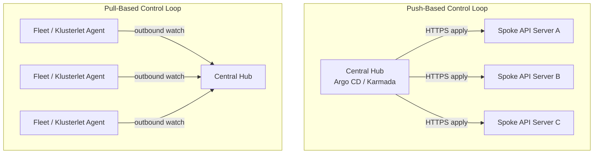
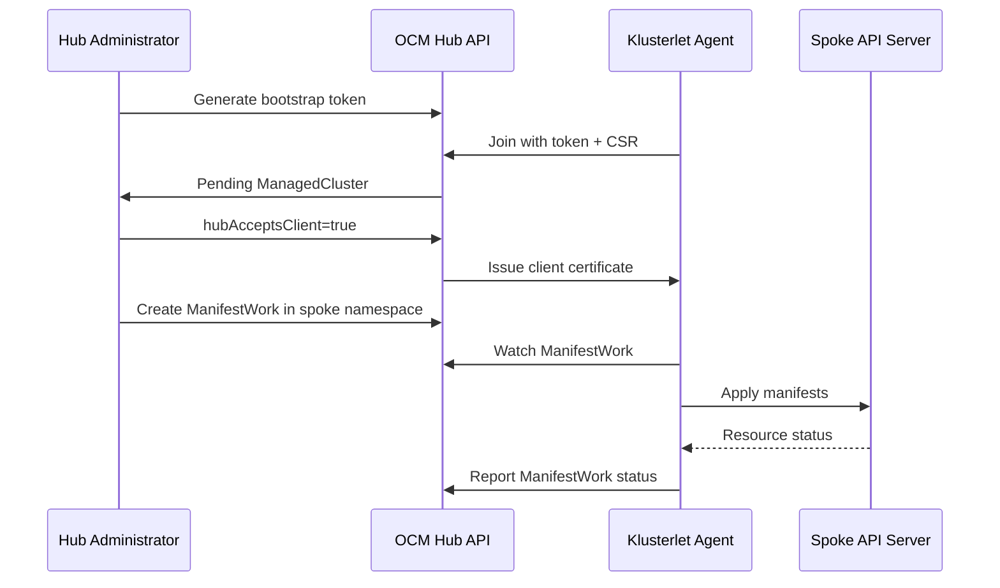
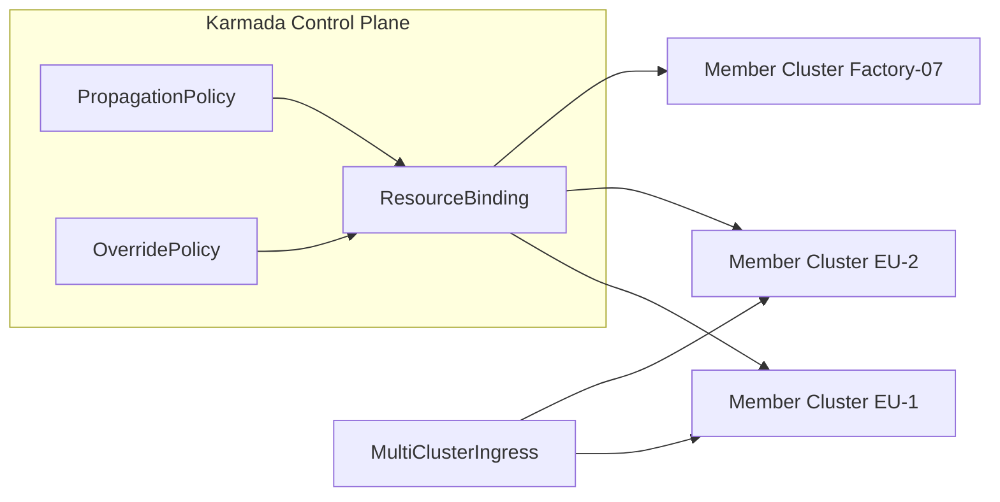

> **Complexity**: `[ADVANCED]` | Time: 45 minutes
>
> **Prerequisites**: [Module 5.2: Multi-Cluster Control Planes](../module-5.2-multi-cluster-control-planes/), [Module 5.3: Cluster API on Bare Metal](../module-5.3-cluster-api-bare-metal/)

---

## What You'll Be Able To Do

After completing this module, you will be able to:

1. **Compare** push-based and pull-based fleet management architectures for on-premises Kubernetes deployments spanning datacenters and edge sites.
2. **Implement** Open Cluster Management hub registration, Placement decisions, and ManifestWork delivery to spoke clusters on bare metal.
3. **Configure** Rancher Fleet GitRepo bundles and Argo CD ApplicationSets for fleet-wide GitOps across many clusters.
4. **Design** disaster recovery bootstrap workflows and safe cluster decommission procedures for fleet-managed bare-metal clusters.
5. **Diagnose** fleet configuration drift, agent disconnections, and observability gaps across distributed management planes.

---

## Why This Module Matters

Hypothetical scenario: a regional manufacturer operated forty-seven bare-metal Kubernetes clusters across factory floors, warehouse edge racks, and two central datacenters. Each cluster was provisioned correctly the first time, yet the platform team spent most of their sprint capacity chasing configuration drift: monitoring agents missing on six clusters, ingress controller versions spanning three minor releases, and sealed secrets that expired silently because nobody owned rotation across sites. When a new compliance rule required Pod Security Admission on every production cluster, engineers opened forty-seven pull requests and still missed three edge locations that had been offline during the change window.

They replaced per-cluster GitOps silos with a fleet management plane that separated *what* should run from *where* it should run. A single Placement rule targeting `region=eu` and `hardware=bare-metal` pushed baseline policies to every matching cluster within minutes of registration, while pull-based agents on edge sites continued working through outbound-only firewalls. Bootstrap of a replacement cluster after hardware failure dropped from two days of manual kubectl to a documented join token flow plus automated ManifestWork delivery. The platform team could finally answer the executive question: *Which clusters are non-compliant right now?*

Fleet management is not the same as cluster provisioning. Cluster API creates machines and control planes; fleet managers register existing clusters and distribute workloads, policies, and observability baselines at scale. On-premises environments amplify the architectural tradeoffs because spoke API servers are often unreachable from a central hub, etcd object size limits bite when you embed large manifests, and day-two operations like decommissioning a factory cluster require explicit orphan policies so workloads are not deleted unexpectedly when connectivity returns. This module teaches you to evaluate Rancher Fleet, Argo CD ApplicationSets, Flux multi-tenancy, Karmada, and Open Cluster Management through the lens of bare-metal constraints, then operate the fleet through bootstrap, disaster recovery, drift detection, and observability.

Treat the management cluster as production infrastructure with the same backup, upgrade, and access controls as a large workload cluster even when it runs few pods. Hub outages stall every spoke baseline rollout even if applications keep running, which means executives perceive fleet failures as platform-wide incidents. Capacity planning, certificate rotation, and etcd defragmentation schedules belong on the platform calendar alongside Kubernetes minor version upgrades for workload clusters. Schedule hub maintenance in maintenance windows advertised to application owners just like any other shared platform dependency. Document hub DNS names agents use so datacenter firewall changes do not silently block outbound reconciliation for entire regions of factory clusters worldwide.

---

## What You'll Learn

- Push versus pull control loops and hub-spoke versus mesh federation topologies
- Rancher Fleet bundles, GitRepo resources, and BundleDeployment lifecycle on edge fleets
- Argo CD ApplicationSets with cluster, list, and matrix generators for multi-cluster GitOps
- Flux multi-tenancy patterns and KustomizeController scoping per cluster or tenant
- Karmada PropagationPolicy, OverridePolicy, and MultiClusterIngress for federated workloads
- Open Cluster Management ManifestWork, Placement, and PlacementDecision reconciliation
- Policy hierarchy, drift detection, and sealed-secret distribution across fleets
- Disaster recovery scenarios, bootstrap of new clusters, and decommission day-two operations
- Observability signals for fleet health, agent status, and bundle compliance

---

## Compare Push and Pull Fleet Architectures

> **Pause and predict**: If your hub cluster sits in a datacenter with strict egress rules but edge clusters only allow outbound HTTPS, which fleet architecture still works without opening inbound firewall holes on every spoke?

Operating dozens or hundreds of on-premises Kubernetes clusters forces an early architectural decision about the direction of the control loop. Push-based systems authenticate from a central management plane to each spoke API server and apply manifests directly. Pull-based systems install an agent on each spoke that connects outbound to the hub, watches for desired state, and applies changes locally. The choice affects security blast radius, network design, latency, and how you survive datacenter partitions.



Push-based fleet management feels immediate because the hub can reconcile on its own schedule without waiting for agents to poll. Argo CD in default mode and Karmada's control plane exemplify this pattern: the management cluster holds credentials for remote clusters and opens client connections to each API server. On flat corporate networks with mutual TLS and network policies already allowing hub-to-spoke apiserver traffic, push works well for ten to fifty clusters operated by a platform team that trusts centralized secret storage.

Pull-based fleet management inverts the connection direction. Rancher Fleet agents and Open Cluster Management Klusterlets initiate outbound connections to the hub, which means retail backrooms, factory VLANs, and air-gapped enclaves with deny-all inbound rules remain viable targets. Compromise of one spoke exposes only that cluster's agent identity rather than a vault containing kubeconfigs for the entire fleet. The tradeoff is agent lifecycle management: you must upgrade agents safely, handle hub outages gracefully, and tune watch intervals to avoid thundering herds when the hub restarts.

Hub-spoke topologies concentrate policy decisions on a dedicated management cluster that does not run customer workloads. Mesh-oriented approaches such as Karmada or multi-hub Argo CD sharding spread reconciliation across several controllers. On bare metal, hub-spoke with a pull agent is the default recommendation for edge-heavy fleets, while push-based ApplicationSets remain attractive when all clusters live in the same datacenter and developers already think in Argo CD Applications.

Engineering teams sometimes attempt to solve fleet problems by installing a separate Argo CD instance in every cluster because the first cluster's GitOps setup worked well. That pattern creates N independent configuration surfaces, N places where Application controller versions drift, and N secrets stores that auditors must review. Centralizing GitOps without a fleet layer also fails when the central instance must hold kubeconfigs for clusters it cannot reach over the network. The fleet management plane exists precisely to unify desired state expression while respecting network and security constraints that differ between datacenter cores and factory edges.

Another common intermediate pattern keeps Cluster API on the hub for node lifecycle while a second controller family distributes add-ons. That separation is healthy when boundaries are documented: CAPI owns Machine, KubeadmControlPlane, and Cluster objects; fleet tools own monitoring agents, ingress classes, Pod Security labels, and tenant RBAC templates. Blurring the boundary leads to double application of the same DaemonSet or fighting controllers that both believe they own a namespace. Run architecture reviews with a single diagram showing CAPI, fleet agents, and application GitOps paths so new engineers know which repository to change for a given symptom.

| Axis | Push (Argo CD, Karmada default) | Pull (Fleet, OCM) |
|------|----------------------------------|-------------------|
| Network | Requires hub reachability to spoke apiserver | Requires spoke egress to hub only |
| Credential blast radius | Central store of cluster credentials | Per-cluster agent identity |
| Actuation latency | Lower when connections are healthy | Bounded by agent sync interval |
| Offline spoke behavior | Hub marks cluster unreachable | Spoke continues last desired state |
| Best fit | Same-site GitOps, developer-centric CD | Edge, factory, regulated enclaves |

---

## Fleet Tool Comparison for On-Premises Operations

Platform teams rarely choose a single tool for every concern. Cluster API provisions infrastructure; fleet managers register clusters and distribute payloads. The table below summarizes how common CNCF and ecosystem projects map to on-premises fleet problems, not as a vendor bake-off but as an orientation for design reviews.

| Tool | Control loop | Primary abstraction | Typical on-prem scale |
|------|--------------|---------------------|------------------------|
| Rancher Fleet | Pull | GitRepo, Bundle, BundleDeployment | Hundreds to thousands of edge clusters |
| Argo CD ApplicationSets | Push (with pull integrations) | ApplicationSet, generators | Tens of clusters on flat L3 networks |
| Flux (multi-tenancy) | Pull | GitRepository, Kustomization per tenant | Shared management cluster, strong tenant isolation |
| Karmada | Push with optional pull agents | PropagationPolicy, ResourceBinding | Multi-datacenter federation, override per cluster |
| Open Cluster Management | Pull | ManagedCluster, ManifestWork, Placement | Bare-metal fleets needing dynamic placement |

Choosing among these tools is rarely exclusive. A mature on-premises program might use Cluster API to birth clusters, register them into OCM for baseline ManifestWorks, delegate application delivery to Argo CD ApplicationSets for developer teams, and reserve Karmada for workloads that truly span clusters simultaneously. The integration cost lives in identity, labels, and ownership boundaries rather than in downloading another controller. Standardize cluster labels at registration time so every downstream generator agrees on `env`, `region`, `hardware`, and `compliance-tier` semantics without translation tables maintained by hand.

Rancher Fleet treats Git as the source of truth. You declare a `GitRepo` custom resource on the management cluster; Fleet clones the repository, renders bundles, and creates `BundleDeployment` objects that agents on each target cluster reconcile. The lifecycle is observable: bundle contents hash, per-cluster deployment status, and drift from Git are visible without SSHing to spokes. Fleet excels when non-Kubernetes engineers can contribute through pull requests while agents tolerate intermittent connectivity at edge sites.

Fleet agents bundle several controllers on each spoke: a fleet-agent deployment watches BundleDeployments, applies manifests, and reports status upstream. Bundle names derive from directory paths and fleet.yaml metadata; conflicting bundle definitions in one repository produce duplicate BundleDeployments that fight over the same namespace. Enforce repository linting that validates fleet.yaml schema and rejects overlapping defaultNamespace values. During upgrades, pause GitRepo reconciliation temporarily if agent versions mismatch hub expectations, then resume after a canary wave confirms compatibility on factory clusters with the oldest hardware.

Argo CD ApplicationSets generate one Argo CD `Application` per cluster from generators. The cluster generator discovers registered clusters and their labels; the list generator enumerates explicit cluster entries; the matrix generator combines two dimensions such as environment times application directory. At fleet scale, matrix generators over a monorepo avoid hand-maintaining hundreds of Application manifests. The push model becomes painful beyond roughly one hundred clusters unless you shard controllers or adopt OCM's pull integration to translate Applications into ManifestWorks.

Flux multi-tenancy installs separate KustomizeController instances or uses `spec.serviceAccountName` scoping so each tenant's Kustomization cannot reconcile another tenant's paths. On a shared management cluster, this pattern gives platform teams a single GitOps engine while isolating blast radius. Pair Flux with Cluster API for cluster birth and with Fleet or OCM when you need cross-cluster placement semantics beyond namespace-scoped Kustomizations.

Karmada schedules Kubernetes resources to member clusters using PropagationPolicy selectors and creates ResourceBinding objects that record which clusters received each resource. OverridePolicy mutates fields per cluster, which solves image mirrors, replica counts, and ingress hostnames that differ between datacenter A and factory floor B. MultiClusterIngress aggregates backends across clusters for north-south traffic patterns that span sites. Karmada fits organizations that want federation semantics closer to a distributed Kubernetes API than pure GitOps.

---

## Implement Open Cluster Management

Open Cluster Management (OCM) is a CNCF Sandbox project built for hub-spoke fleets where spokes initiate trust. The hub runs registration, work, and placement controllers. Each spoke runs a Klusterlet that watches namespaces on the hub tied to that cluster's identity. Workloads and policies are expressed as `ManifestWork` objects in the spoke's namespace on the hub; the Klusterlet pulls them and applies manifests locally, then reports status upstream.

### Registration and trust bootstrap

Bare-metal clusters rarely have cloud IAM to mint short-lived credentials automatically. OCM uses a bootstrap token and certificate signing request flow instead. An administrator generates a join token on the hub. The Klusterlet on the spoke connects with that token, creates a `ManagedCluster` object, and submits a CSR. Until an administrator or automated approver sets `hubAcceptsClient: true`, the spoke remains pending. After approval, the hub issues a client certificate, the Klusterlet drops the bootstrap token, and future communication uses mutual TLS. Production fleets automate approval by validating hardware asset tags in NetBox, TPM attestations, or IP ranges reserved for new clusters.

Certificate rotation on long-lived factory clusters catches teams who forget agent trust stores. Klusterlet certificates expire; hub CAs rotate during security programs. Automate rotation with documented windows and monitor CSR queue depth. If a spoke misses rotation while offline for maintenance, it may fail to reconnect until operators apply a fresh bootstrap token, which is why break-glass join procedures belong in the same binder as server hardware serial numbers.

### ManifestWork delivery

A `ManifestWork` wraps one or more Kubernetes manifests as JSON inside a hub-side custom resource. The Klusterlet applies them to the spoke API server and writes aggregated status back to the hub, including per-resource success or failure messages. Namespace on the hub must match the managed cluster name convention your install chose. Large manifests hit etcd's per-object size limit near 1.5 MiB; platform engineers split heavy charts into multiple ManifestWorks or deploy a lightweight GitOps agent via a small ManifestWork that pulls the rest from Git on the spoke.

### Placement and PlacementDecision

`Placement` defines label selectors, cluster claims, and prioritizer scores to choose targets dynamically. The scheduler writes a `PlacementDecision` listing chosen clusters. OCM splits binding APIs by domain: in the **governance** domain, `PlacementBinding` binds a `Placement` to a `Policy` or `PolicySet` only. In the **work-distribution** domain, `ManifestWorkReplicaSet` fans out `ManifestWork` objects to clusters via `spec.placementRefs` that reference a `Placement`—not through `PlacementBinding`. When a new bare-metal cluster registers with labels `gpu=true` and `region=eu`, the next reconciliation automatically includes it in matching placements without editing application manifests. This dynamic targeting is the core reason many on-premises teams adopt OCM instead of static Argo CD Application lists.

```yaml
apiVersion: cluster.open-cluster-management.io/v1beta1
kind: Placement
metadata:
  name: eu-gpu-clusters
  namespace: fleet-policies
spec:
  predicates:
    - requiredClusterSelector:
        labelSelector:
          matchLabels:
            region: eu
        claimSelector:
          matchExpressions:
            - key: gpu.open-cluster-management.io
              operator: In
              values: ["present"]
---
apiVersion: work.open-cluster-management.io/v1
kind: ManifestWork
metadata:
  name: baseline-monitoring
  namespace: spoke-factory-07
spec:
  workload:
    manifests:
      - apiVersion: v1
        kind: Namespace
        metadata:
          name: monitoring
  deleteOption:
    propagationPolicy: Orphan
```

The `deleteOption` field matters during decommission events. Default behavior may garbage-collect applied resources when a cluster leaves the fleet; `Orphan` preserves critical workloads if an administrator removes the ManagedCluster while the spoke is offline and later reconnects.



Placement prioritizers add scoring when simple label selectors are insufficient. You might prefer clusters with more available CPU capacity, newer Kubernetes versions, or geographic proximity to a data source. ManagedClusterSet and ManagedClusterSetBinding APIs group clusters for progressive rollout: deploy canary ManifestWorks to `region=eu-canary` before promoting the same bundle to `region=eu-all`. Progressive delivery at the fleet layer reduces the blast radius of a bad network policy or CRD upgrade compared with flipping a single boolean that hits every factory at once.

Governance policy propagator components extend OCM with ConfigurationPolicy, PolicyReport, and compliance templates that Kyverno or Gatekeeper consume after ManifestWork installs them. Status aggregation on the hub answers audit questions such as how many clusters lack a required limit range. Pair compliance reports with ticket workflows so failures become tracked work instead of dashboard noise platform engineers ignore until an external auditor arrives.

---

## Configure Rancher Fleet and Argo CD ApplicationSets

### Rancher Fleet GitRepo and bundle lifecycle

Fleet begins when an operator applies a `GitRepo` resource pointing at a branch or tag. Fleet clones the repository on the management cluster, evaluates `fleet.yaml` files that define bundle boundaries, and renders manifests with helm, kustomize, or raw YAML. For each target cluster matching cluster group selectors, Fleet creates a `BundleDeployment` that records desired hash, applied hash, and per-resource errors. Agents on spokes pull BundleDeployments and apply changes. When Git moves forward, Fleet updates bundles, creates new BundleDeployments, and marks outdated deployments modified.

Operators should structure repositories with clear directories per concern: `baseline/` for monitoring and logging agents, `security/` for admission policies, and `apps/` for shared platform services. Cluster labels such as `env=production` and `site=factory-12` drive `targetCustomizations` in `fleet.yaml`, which patch replicas or image registries per environment without forking the entire repository. Bundle drift detection compares live cluster state to the rendered bundle; non-compliant clusters surface in Rancher UI or through Prometheus metrics exported from Fleet controllers.

Fleet agents on spokes watch BundleDeployments and apply rendered manifests locally, which means spoke apiservers never need inbound connections from the management cluster. Bundle hash fields let operators detect partial application when an edge node lacks disk for a large image pull. Rollback in Fleet is Git rollback: revert the merge commit, let Fleet render previous hashes, and agents converge backward unless resources use immutable fields that forbid downgrade. Document rollback playbooks alongside forward rollouts so factory maintenance windows include time to validate bundle readiness on the slowest site.

```yaml
apiVersion: fleet.cattle.io/v1alpha1
kind: GitRepo
metadata:
  name: platform-baseline
  namespace: fleet-default
spec:
  repo: https://github.com/example/platform-fleet.git
  branch: main
  paths:
    - baseline
  targets:
    - name: production-bare-metal
      clusterSelector:
        matchLabels:
          env: production
          hardware: bare-metal
```

### Argo CD ApplicationSets at scale

ApplicationSets reduce copy-paste Application definitions. A matrix generator combining Git directory paths with a cluster generator is the workhorse pattern for monorepos that hold one chart per platform service times every production cluster. Enable `goTemplate: true` with `missingkey=error` so typos fail fast during rendering rather than silently producing empty names.

Registering clusters in Argo CD for ApplicationSets requires secrets or cluster credentials labeled for discovery. On flat networks, platform teams import kubeconfigs generated during cluster bootstrap and label secrets with environment and region metadata ApplicationSet cluster generators consume. Protect those secrets with RBAC tighter than general namespace admin because each secret is effectively cluster-admin for its target. Rotate imported credentials when bootstrap completes and prefer in-cluster manager accounts with limited permissions where push remains necessary.

```yaml
apiVersion: argoproj.io/v1alpha1
kind: ApplicationSet
metadata:
  name: fleet-prometheus
  namespace: argocd
spec:
  goTemplate: true
  goTemplateOptions: ["missingkey=error"]
  generators:
    - matrix:
        generators:
          - git:
              repoURL: https://github.com/example/platform-fleet.git
              revision: main
              directories:
                - path: workloads/prometheus/*
          - clusters:
              selector:
                matchLabels:
                  env: production
  template:
    metadata:
      name: '{{.path.basename}}-{{.name}}'
    spec:
      project: platform
      source:
        repoURL: https://github.com/example/platform-fleet.git
        targetRevision: main
        path: '{{.path.path}}'
      destination:
        server: '{{.server}}'
        namespace: monitoring
```

When push-based Argo CD exhausts memory reconciling hundreds of clusters, consider sharding application-controller StatefulSets by cluster label or integrating OCM's pull model so the hub stores intent while Klusterlets apply without persistent remote watches. Hybrid designs are common: ApplicationSets for developer-facing application delivery, Fleet or OCM for baseline agents and policies that must reach edge clusters behind NAT.

Fleet bundle lifecycle states deserve explicit runbook language. A BundleDeployment transitions from wait to ready when all resources reconcile; modified appears when Git advances before agents finish; err applies when manifest application fails on the spoke. Operators should treat err on baseline bundles as Sev2 because missing monitoring or admission control on edge clusters may violate safety policies without immediately paging application teams. Include bundle name, cluster name, and first failing resource in alert templates so on-call engineers triage without opening three UIs.

ApplicationSet sync policies interact with fleet baselines when both target the same namespace. Establish naming conventions: platform bundles own `kube-system`, `monitoring`, and `security` namespaces while ApplicationSets deploy tenant workloads into `app-*` namespaces. Argo CD sync waves can defer application deployments until Fleet bundles report ready, preventing race conditions where an application rolls out before its ingress class exists. Document sync wave integers in the platform repository README so contributors do not accidentally reorder critical dependencies.

List generators remain valuable when cluster inventory is small and explicit, such as five datacenter clusters with fixed names registered in Argo CD. Cluster generators scale better when registration automation adds secrets labeled `env=production` and ApplicationSets pick them up without editing Git. Matrix generators multiply dimensions; guard against combinatorial explosion when a monorepo contains dozens of directories and hundreds of clusters, which can create thousands of Applications and overwhelm etcd on the management cluster. Use ApplicationSet `syncPolicy` limits and `applyPolicy` settings to batch creations during migrations.

---

## Flux Multi-Tenancy and Karmada Federation

Flux can manage multiple tenants from one management cluster by scoping Kustomizations to service accounts with limited RBAC. Each tenant receives a namespace, GitRepository, and Kustomization triple; the KustomizeController service account can only read paths granted by RoleBindings. This pattern suits internal platform teams selling Kubernetes namespaces-as-a-service while retaining one GitOps pipeline. Combine Flux on the hub with Cluster API ClusterClasses for cluster birth, then register finished clusters into Fleet or OCM for cross-fleet policies Flux should not own.

Multi-tenant Flux also supports source watcher separation so one tenant cannot trigger reconciliation of another tenant's GitRepository through misconfigured dependencies. Document allowed Kustomization `dependsOn` graphs because circular dependencies stall reconciliation silently except for Kubernetes events many teams do not alert on. For bare-metal factory tenants, prefer read-only Git mirrors inside the factory network if upstream Git hosting lives only in the corporate datacenter.

Karmada PropagationPolicy selects member clusters by label, taint, and spread constraints similar to pod scheduling. Resource templates propagate to chosen clusters; OverridePolicy patches fields per cluster name or label selector. MultiClusterIngress publishes a single hostname backed by Service endpoints in multiple clusters, which helps active-passive or active-active designs when paired with external GSLB from Module 5.5. Karmada's push-oriented control plane fits datacenter meshes with stable L3 connectivity; pair it with pull agents when some member clusters are edge-isolated.



When evaluating Karmada against OCM for a bare-metal program, ask whether teams need to propagate arbitrary Kubernetes API objects with federation semantics or primarily deliver curated platform bundles from Git. Karmada excels when application teams submit Deployments and Services expecting the federation layer to choose clusters by policy. OCM excels when platform teams treat spokes as opaque targets identified by labels and deliver ManifestWorks assembled by hub controllers or policy engines. Many enterprises run both metaphors in different business units until consolidation pressure forces a standard; document overlap explicitly to avoid two hubs fighting over the same cluster.

Policy hierarchy matters when three systems can all set Pod Security levels, network policies, and resource quotas. A practical on-premises hierarchy declares organization-wide baselines through OCM or Fleet, allows cluster-local exceptions via OverridePolicy or Fleet targetCustomizations, and lets application teams own Argo CD Applications inside agreed paths. Document precedence in runbooks so on-call engineers know whether deleting a ManifestWork or an Application is safe during incidents.

---

## Policy Distribution, Drift Detection, and Sealed Secrets

Fleet management includes governance, not only application charts. Kyverno and OPA Gatekeeper policies should originate once and fan out through ManifestWork, Fleet bundles, or Karmada PropagationPolicy. OCM's governance policy propagator binds ClusterPolicy templates to Placements and reports compliance status per cluster on the hub, which gives auditors a single dashboard instead of forty-seven separate policy reports.

Drift detection compares live cluster state to declared desired state. GitOps tools detect drift when cluster resources differ from Git; fleet agents add another layer by reporting bundle hash mismatches or ManifestWork not-applied conditions. Run periodic conformance scans with tools like the OCM policy framework or Fleet's non-ready BundleDeployment metrics. Treat manual kubectl edits on managed fields as incidents: either revert or open a Git change that becomes the new truth.

Sealed Secrets and External Secrets Operator solve secret distribution without copying cleartext into Git. SealedSecrets encrypt to a cluster-specific key; for fleets, either distribute sealed blobs per cluster public key through Fleet overlays or prefer External Secrets with a central vault and spoke ClusterSecretStore objects deployed via ManifestWork. Rotation requires orchestration: update vault entries, reconcile ExternalSecrets, and verify agents reload credentials before deleting old sealed objects. Document which clusters share keys versus per-site keys based on compliance boundaries.

Drift detection workflows should combine Git-level diffs with agent-reported status. Argo CD application diff against live clusters catches manual kubectl edits that never merged to Git. Fleet non-ready BundleDeployments catch cases where Git is correct but an agent failed to apply due to resource constraints on a small edge node. OCM ManifestWork status catches API validation errors such as deprecated beta APIs removed on newer Kubernetes versions. Runbooks should specify which tool is authoritative for each namespace class so incident responders do not revert Git changes that were intentionally overridden during a break-glass event.

Network policy baselines distributed through fleet bundles should assume heterogeneous CNIs across bare-metal sites. A policy that references vendor-specific global network policy semantics will fail on clusters running different CNIs unless you standardize CNI through the same fleet channel first. Order rollouts: CNI baseline, then default deny policies, then application-specific rules. Factory clusters with intermittent connectivity may apply policies hours after datacenter clusters; track maximum skew as an SLO so security teams know worst-case exposure windows.

---

## Design Disaster Recovery and Cluster Bootstrap

Disaster recovery for fleet-managed bare-metal clusters spans three layers: hardware and OS, Kubernetes control plane, and fleet registration. Assume Cluster API or kubeadm playbooks recreate nodes and etcd from backups documented in Module 5.3. Fleet layer recovery begins with a fresh cluster that passes hardware validation, joins the hub with a new bootstrap token, and receives baseline ManifestWorks from Placements that match its labels. Keep join tokens and hub endpoints in break-glass documentation stored outside the primary datacenter.

Bootstrap automation should idempotently label new clusters (`region`, `env`, `hardware`, `compliance-tier`) before Placements evaluate them. A common pattern uses a small post-install Job on the hub triggered by ManagedCluster create events that sets labels after CMDB lookup. Without labels, clusters sit joined but receive no policies, which looks healthy yet fails audits. Test bootstrap monthly by building a kind or minikube spoke in CI and verifying full baseline delivery within a defined SLA.

Runbooks should list the minimum viable bundle every new cluster must receive before production traffic: ingress class, monitoring DaemonSet, audit policy, and backup agent. Fleet GitRepos or OCM ManifestWork templates encode that bundle once. Application teams deploy only after platform automation marks the cluster `baseline-ready=true` in labels Placements can select. That gate prevents applications from landing on clusters missing Pod Security or network policy baselines during compressed onboarding windows.

Disaster scenarios include total hub loss, partial hub degradation, and mass edge offline events. Hub loss requires restoring etcd backups for the management cluster or rebuilding from Git-declared GitRepos, ApplicationSets, and Placements. Document whether spoke agents continue enforcing last desired state while offline; pull agents typically do, which is an advantage during hub maintenance. Mass edge offline during a policy rollout may leave half the fleet compliant; use PlacementDecision status and fleet metrics to prioritize sites that reconnect first.

Cold-start bootstrap after total factory loss follows a repeatable checklist: rack and image nodes, install Kubernetes with your standard kubeadm or CAPI flow, join the cluster to the fleet with a pre-authorized bootstrap token, verify labels match Placement selectors, confirm baseline BundleDeployments or ManifestWorks reach ready state, then allow application GitOps to resume. Store bootstrap tokens in a break-glass vault with short TTL and audit logging; long-lived tokens discovered on a laptop become lateral movement paths. Practice the checklist quarterly on a lab spoke so new engineers do not learn join semantics during a real outage.

Multi-site disaster recovery pairs fleet management with Module 5.5 networking concerns. When a datacenter hub fails, standby hubs may promote read-only Git mirrors and accept agent reconnections if DNS or load balancers swing management endpoints. Spokes should tolerate hub endpoint changes through DNS names rather than hard-coded IP addresses burned into agent configuration. Test agent behavior when the hub certificate rotates mid-outage; agents must trust the new CA bundle delivered through a documented out-of-band path such as USB image or serial console in extreme air-gap scenarios.

---

## Diagnose Fleet Drift and Observability Gaps

Observability for fleets starts with agent heartbeat and work application status, not only application golden signals. Monitor Klusterlet or Fleet agent pod restarts, hub API latency, BundleDeployment ready counts, and Argo CD sync failures grouped by cluster. Export hub-side custom resource conditions to Prometheus using kube-state-metrics or vendor exporters. Alert when ManagedCluster `Available` flips false for more than two sync intervals, when BundleDeployment non-ready percentage exceeds a threshold, or when PlacementDecision lists zero clusters despite pending workloads.

Configuration drift manifests as clusters running different ingress controller versions, missing DaemonSets, or stale CRDs. Compare `kubectl get` results from a reference cluster against fleet reports rather than SSHing to every site. For ManifestWork failures, read `.status.resourceStatus` on the hub; messages usually contain the spoke API error verbatim. Agent disconnections during hub upgrades present as CSRs pending approval or certificates near expiry; automate certificate rotation alerts ninety days before NotAfter.

During incident response, capture hub and spoke agent versions in the first five minutes. Version skew between Klusterlet and hub controllers causes subtle status reporting bugs that look like application failures. Fleet agents similarly report modified BundleDeployments when CRD schemas change during hub upgrades. Maintain a compatibility matrix pinned in the platform repository so on-call engineers know whether to pause GitRepo reconciliation before upgrading the management cluster.

Hub API server overload is a fleet-specific failure mode. Thousands of Klusterlets watching ManifestWork namespaces create thundering herds after hub restarts. Mitigate with elevated `--max-requests-inflight`, jittered resync on agents, and sharded hub instances for very large fleets. CRD version skew across Kubernetes versions causes ManifestWorks containing removed API versions to fail on newer spokes while succeeding on older ones; segment Placements by `kube-version` claim and maintain version-specific policy bundles.

Centralized logging for fleet operations should capture hub audit logs, agent reconcile errors, and spoke apiserver audit events for namespaces owned by platform teams. Correlating hub ManifestWork failure timestamps with spoke apiserver 403 errors quickly distinguishes RBAC misconfiguration from invalid manifests. Metrics exporters should expose gauges for `managed_cluster_available`, `bundle_deployment_ready`, and `manifestwork_applied` so Grafana dashboards trend fleet health over weeks rather than showing only point-in-time snapshots during incidents.

Compare observability signals to application golden signals deliberately. A factory cluster may show healthy workload latency while fleet agents are stale, meaning security patches stopped applying weeks ago. Define fleet SLOs such as ninety-nine percent of production clusters reporting applied baseline within twenty-four hours of Git merge. Error budgets consumed by repeated agent crashes should trigger engineering time to fix root causes rather than silently restarting agents without post-incident review.

---

## Day-2 Operations: Decommission and Fleet Status

Decommissioning a bare-metal cluster from a fleet is a deliberate sequence, not a single delete click. Cordon workloads, migrate stateful data, remove the cluster from Placements, set ManifestWork delete policies to Orphan if workloads must survive temporarily, drain agents, revoke certificates, and finally delete the ManagedCluster or Fleet registration. If you delete registration while the spoke is offline with default delete policies, the agent may garbage-collect platform namespaces on reconnect, which surprises teams who thought offline meant frozen.

Change advisory boards should review fleet Git merges with the same rigor as control plane upgrades because one mistaken ClusterRole in a baseline bundle propagates everywhere Placements reach. Require two approvers for directories tagged `security` or `admission` and run automated kubeconform or kyverno validate against rendered manifests in CI before Fleet or OCM ever sees them. Post-merge, watch rollout dashboards until the slowest edge cluster reports ready or until a timeout triggers automatic rollback in Git.

Document fleet status dashboards for executives and auditors: count of registered clusters, percentage with applied baselines, open ManifestWork failures, and policy violations from governance frameworks. Tie these metrics to change management so every Git merge to baseline repos triggers observable rollout progress. Factory teams trust fleet platforms when status is honest about partial failures instead of hiding edge sites that have not synced in weeks.

Hardware refresh cycles interact with fleet membership when servers retire but cluster names persist in CMDB. Rename or delete ManagedCluster objects when physical sites close so Placements do not target ghost entries that cause PlacementDecision gaps. Archive Git directories for decommissioned sites instead of deleting history abruptly; auditors may ask which ingress policy applied at a factory two years ago. Fleet Git history becomes compliance evidence when tagged releases correspond to change tickets.

Capacity planning for hub clusters mirrors control plane sizing for large Kubernetes clusters. Count watch connections, etcd object growth from ManifestWork status, and admission webhook latency when OCM policy controllers enforce compliance. Scale hubs vertically before sharding when etcd latency rises, then split Placements across multiple hub instances only with clear ownership boundaries. Undersized hubs manifest as flaky agent status long before application teams notice workload issues, which makes hub metrics a leading indicator for platform reliability reviews.

---

## Did You Know?

- **Rancher Fleet was designed for RKE2 and K3s edge fleets** before broader Kubernetes support, which explains its pull-agent-first model and tolerance for high-latency links to store backrooms and cell towers.
- **Open Cluster Management originated in Red Hat's multicluster engine work** and became a CNCF Sandbox project; its Placement API inspired several downstream fleet schedulers.
- **Argo CD ApplicationSet is bundled as a core Argo CD controller**, so separate ApplicationSet installs are legacy; fleet designs should target the integrated controller metrics and sharding documentation.
- **Karmada's name derives from "karma" plus "armada"** reflecting its goal of scheduling armies of resources across clusters while allowing per-cluster overrides for real-world heterogeneity.

---

## Common Mistakes

| Mistake | Problem | Solution |
|---------|---------|----------|
| Using push GitOps alone for edge clusters behind NAT | Hub cannot reach spoke API servers; sync stays failing | Adopt pull agents (Fleet, OCM) or VPN hub connectivity with documented break-glass |
| Single giant ManifestWork for entire platform stack | Hub etcd rejects objects over size limit | Split works, or deploy lightweight GitOps bootstrap via ManifestWork |
| Deleting ManagedCluster while spoke offline with default delete policy | Agent removes platform namespaces on reconnect | Set `deleteOption.propagationPolicy: Orphan` for critical works |
| No labels on newly joined clusters | Placements never select them; silent non-compliance | Automate post-join labeling from CMDB before declaring cluster production-ready |
| Storing hundreds of cluster kubeconfigs in one vault path | Compromise exposes entire fleet | Prefer pull agents with per-cluster identities and scoped RBAC |
| Ignoring CRD and Kubernetes version skew in fleet bundles | Policies apply on some clusters and fail on others | Segment Placements by kube-version; test bundles against oldest and newest spokes |
| Running hub control plane on undersized etcd | Fleet watches overload apiserver during upgrades | Size hub etcd and apiserver for fan-in; add sync jitter on agents |
| Manual kubectl edits on fleet-managed fields | Drift reappears or fights with controllers | Revert manual changes; merge fixes through Git and fleet APIs |

---

## Quiz

<details><summary>Question 1: Three hundred bare-metal clusters in retail backrooms allow only outbound HTTPS. Which fleet architecture must you adopt, and why is Cluster API alone insufficient?</summary>

Adopt a **pull-based** architecture using Open Cluster Management Klusterlets or Rancher Fleet agents that connect outbound to the hub. Push-based Argo CD requires the hub to reach each spoke apiserver, which firewalls block. **Cluster API provisions infrastructure** (machines, control planes) but does not continuously reconcile workload and policy payloads across an existing fleet; you still need a fleet manager after CAPI creates clusters. Pull agents also reduce centralized kubeconfig storage compared with storing credentials for three hundred API servers on one hub.

</details>

<details><summary>Question 2: How do you implement dynamic targeting so GPU workloads deploy only to EU bare-metal clusters without naming each cluster in Git?</summary>

Create an Open Cluster Management **Placement** on the hub with label selectors for `region=eu` and cluster claims or labels indicating GPU capacity. Bind **Policy** or **PolicySet** objects to that Placement with **PlacementBinding** (governance domain). Fan out **ManifestWork** payloads with **ManifestWorkReplicaSet** `placementRefs` pointing at the same Placement (work-distribution domain)—not PlacementBinding. The scheduler writes a **PlacementDecision** listing matching ManagedClusters whenever membership changes. Hardcoding cluster names in Argo CD Application lists does not scale and misses newly registered factories that already carry the correct labels.

</details>

<details><summary>Question 3: A ManifestWork apply fails on the hub with a valid YAML file. What is the most likely cause, and how do you fix it?</summary>

The embedded manifests likely exceed **etcd's per-object size limit** (approximately 1.5 MiB) because ManifestWork stores JSON inside one CRD object. Split the payload into multiple ManifestWorks, or deploy a small ManifestWork that installs Flux or Argo CD on the spoke to pull heavy charts from Git locally. Failures at apply time on the hub indicate size or validation issues before the Klusterlet ever pulls the work.

</details>

<details><summary>Question 4: Describe the Rancher Fleet lifecycle from Git commit to spoke reconciliation.</summary>

An operator defines a **GitRepo**; Fleet clones the repository, evaluates **fleet.yaml** bundle boundaries, renders manifests, and creates **BundleDeployment** objects per target cluster. Spoke **agents pull** BundleDeployments, compare desired hash to applied hash, apply resources, and report status. When Git advances, Fleet updates bundle hashes and marks stale BundleDeployments modified until agents converge. Drift is visible when applied hash lags desired hash or resources report errors in BundleDeployment status.

</details>

<details><summary>Question 5: An Argo CD ApplicationSet with cluster generator pushes to two hundred clusters and the application-controller OOMKills. What architectural root cause should you address?</summary>

Push-based reconciliation forces one controller to maintain **active connections and watches** to two hundred remote API servers, exhausting memory and file descriptors. Mitigate by **sharding** application-controller instances, reducing concurrent reconciles, moving baselines to pull-based Fleet or OCM, or adopting OCM pull integration so spokes apply without hub-held remote watches. The ApplicationSet generator is not the root cause; the push connection matrix is.

</details>

<details><summary>Question 6: A spoke cluster shows `hubAcceptsClient: false` on its ManagedCluster. What state is it in, and what must happen before ManifestWorks apply?</summary>

The Klusterlet completed bootstrap and submitted a CSR, but an administrator or automation has **not yet approved** cluster registration. Until `hubAcceptsClient` becomes true and the CSR is approved, the spoke cannot authenticate to pull **ManifestWorks**. Automate approval using CMDB or hardware attestation in production fleets so new bare-metal clusters do not sit idle during onboarding windows.

</details>

<details><summary>Question 7: How should you design sealed secret distribution for fifty factory clusters with different compliance zones?</summary>

Avoid one global SealedSecrets key unless policy allows shared trust domains. Prefer **External Secrets Operator** with zone-scoped ClusterSecretStore objects deployed via ManifestWork, or maintain **per-cluster sealed key overlays** in Fleet targetCustomizations. Document rotation: update vault secrets, reconcile ExternalSecrets, verify pod reload, then revoke old keys. Fleet Git should never contain cleartext credentials.

</details>

<details><summary>Question 8: You must decommission a factory cluster that may be offline for weeks. What delete policy choices prevent surprise garbage collection when it reconnects?</summary>

Set ManifestWork **deleteOption.propagationPolicy to Orphan** for resources that must survive temporary fleet removal, remove the cluster from Placements first, revoke bootstrap credentials, and delete the ManagedCluster only after documenting whether agents should clean platform namespaces. Default delete behavior may **garbage-collect** applied manifests when registration disappears, which destroys monitoring agents if the spoke later reconnects briefly during hardware testing.

</details>

---

## Hands-On Practical Exercises

**Objective**: Build hub-spoke fleet intuition with Open Cluster Management, Fleet GitOps manifests, and ApplicationSet patterns usable in lab environments without production bare-metal allocation.

**Environment**: Linux workstation with Docker, `kind`, `kubectl`, and network access to clone documentation examples. Exercise 1 requires `clusteradm`; install with the upstream install script when needed.

### Exercise 1: Implement an OCM Hub and Spoke with ManifestWork

Create two kind clusters and join the spoke to the hub using the OCM CLI, then deploy nginx via ManifestWork.

```bash
kind create cluster --name fleet-hub
kind create cluster --name fleet-spoke
kubectl config use-context kind-fleet-hub
# Inspect the script at the URL before piping to bash
curl -L https://raw.githubusercontent.com/open-cluster-management-io/clusteradm/main/install.sh | bash
clusteradm init --wait
kubectl get pods -n open-cluster-management
JOIN_CMD="$(clusteradm get token | tail -1)"
HUB_IP="$(docker inspect -f '{{range .NetworkSettings.Networks}}{{.IPAddress}}{{end}}' fleet-hub-control-plane)"
kubectl config use-context kind-fleet-spoke
# clusteradm prints placeholders like <hub-api-server>; never eval that raw string (<...> are shell redirects)
JOIN_READY="$(printf '%s' "$JOIN_CMD" | sed \
  -e "s|<hub-api-server>|${HUB_IP}:6443|g" \
  -e 's|<cluster_name>|fleet-spoke|g')"
eval "$JOIN_READY"
kubectl config use-context kind-fleet-hub
clusteradm accept --clusters fleet-spoke
kubectl get managedclusters
kubectl apply -f - <<EOF
apiVersion: work.open-cluster-management.io/v1
kind: ManifestWork
metadata:
  name: lab-nginx
  namespace: fleet-spoke
spec:
  workload:
    manifests:
      - apiVersion: apps/v1
        kind: Deployment
        metadata:
          name: nginx-fleet-lab
          namespace: default
        spec:
          replicas: 1
          selector:
            matchLabels:
              app: nginx-fleet-lab
          template:
            metadata:
              labels:
                app: nginx-fleet-lab
            spec:
              containers:
                - name: nginx
                  image: nginx:1.27
                  ports:
                    - containerPort: 80
EOF
kubectl config use-context kind-fleet-spoke
kubectl get deploy nginx-fleet-lab
kubectl get pods -l app=nginx-fleet-lab
```

- [ ] Hub and spoke clusters registered with ManagedCluster `Available=True`
- [ ] ManifestWork applied on hub and nginx Deployment running on spoke
- [ ] ManifestWork status on hub shows successful resource apply conditions

<details><summary>Expected analysis</summary>

If join fails, verify the hub API IP reachable from the spoke container network and that CSRs were approved. ManifestWork namespace must match the managed cluster name. nginx:1.27 should pull from Docker Hub in most lab networks; ImagePullBackOff indicates registry access issues unrelated to OCM mechanics.

</details>

### Exercise 2: Configure a Fleet GitRepo Manifest for Baseline Bundles

Read the GitRepo manifest below, then author matching files locally and validate YAML syntax without a cluster or Fleet CRDs installed.

```yaml
# GitRepo — Fleet clones repo paths and renders bundles on the management cluster
apiVersion: fleet.cattle.io/v1alpha1
kind: GitRepo
metadata:
  name: platform-baseline
  namespace: fleet-default
spec:
  repo: https://github.com/rancher/fleet-examples
  branch: master
  paths:
    - multi-cluster/helm
```

```bash
mkdir -p /tmp/fleet-lab/baseline
cat >/tmp/fleet-lab/baseline/fleet.yaml <<'EOF'
defaultNamespace: monitoring
labels:
  fleet: platform-baseline
targetCustomizations:
  - name: production
    clusterSelector:
      matchLabels:
        env: production
    kustomize:
      dir: overlays/production
EOF
cat >/tmp/fleet-lab/gitrepo.yaml <<'EOF'
apiVersion: fleet.cattle.io/v1alpha1
kind: GitRepo
metadata:
  name: platform-baseline
  namespace: fleet-default
spec:
  repo: https://github.com/rancher/fleet-examples
  branch: master
  paths:
    - multi-cluster/helm
EOF
python3 -m pip install --break-system-packages pyyaml  # lab convenience on PEP 668 hosts
python3 -c "import yaml; yaml.safe_load(open('/tmp/fleet-lab/gitrepo.yaml'))" && echo "GitRepo YAML OK"
python3 -c "import yaml; yaml.safe_load(open('/tmp/fleet-lab/baseline/fleet.yaml'))" && echo "fleet.yaml OK"
grep -E 'kind:|repo:|paths:' /tmp/fleet-lab/gitrepo.yaml
grep -E 'targetCustomizations|clusterSelector' /tmp/fleet-lab/baseline/fleet.yaml
```

- [ ] Both YAML files parse cleanly with local `python3` YAML validation (no cluster required)
- [ ] fleet.yaml defines bundle namespace and targetCustomizations with clusterSelector
- [ ] You can state which paths Fleet would clone from the example repository and which clusters `env: production` selects

<details><summary>Expected analysis</summary>

Local YAML parsing confirms structure without Fleet CRDs or API discovery. In production, Fleet controllers reconcile GitRepo into BundleDeployments on matching clusters. Compare your fleet.yaml selectors to labels you will set on bare-metal clusters during bootstrap.

</details>

### Exercise 3: Configure an Argo CD ApplicationSet Matrix Generator

Study the ApplicationSet below, recreate it locally, and validate YAML syntax without Argo CD CRDs or a live cluster.

```yaml
# ApplicationSet — matrix of list × cluster generators
apiVersion: argoproj.io/v1alpha1
kind: ApplicationSet
metadata:
  name: fleet-demo
  namespace: argocd
spec:
  goTemplate: true
  goTemplateOptions: ["missingkey=error"]
  generators:
    - matrix:
        generators:
          - list:
              elements:
                - app: prometheus
                - app: fluent-bit
          - clusters:
              selector:
                matchLabels:
                  env: production
  template:
    metadata:
      name: '{{.app}}-{{.name}}'
    spec:
      project: default
      source:
        repoURL: https://github.com/argoproj/argocd-example-apps
        targetRevision: HEAD
        path: guestbook
      destination:
        server: '{{.server}}'
        namespace: '{{.app}}'
```

```bash
mkdir -p /tmp/appset-lab
cat >/tmp/appset-lab/appset.yaml <<'EOF'
apiVersion: argoproj.io/v1alpha1
kind: ApplicationSet
metadata:
  name: fleet-demo
  namespace: argocd
spec:
  goTemplate: true
  goTemplateOptions: ["missingkey=error"]
  generators:
    - matrix:
        generators:
          - list:
              elements:
                - app: prometheus
                - app: fluent-bit
          - clusters:
              selector:
                matchLabels:
                  env: production
  template:
    metadata:
      name: '{{.app}}-{{.name}}'
    spec:
      project: default
      source:
        repoURL: https://github.com/argoproj/argocd-example-apps
        targetRevision: HEAD
        path: guestbook
      destination:
        server: '{{.server}}'
        namespace: '{{.app}}'
EOF
python3 -m pip install --break-system-packages pyyaml  # lab convenience on PEP 668 hosts
python3 -c "import yaml; yaml.safe_load(open('/tmp/appset-lab/appset.yaml'))" && echo "ApplicationSet YAML OK"
grep -c 'generators:' /tmp/appset-lab/appset.yaml
grep 'matchLabels' /tmp/appset-lab/appset.yaml
```

- [ ] ApplicationSet YAML parses locally with `python3` (no cluster or Argo CD install required)
- [ ] Matrix generator combines list and cluster generators in one spec
- [ ] You can predict Application names for two `env: production` clusters (four Applications total)

<details><summary>Expected analysis</summary>

Local YAML validation avoids kubectl API discovery, which fails without Argo CD CRDs. Full reconciliation requires Argo CD with registered cluster secrets. At fleet scale, replace the list generator with a Git directory generator scanning monorepo paths. Watch application-controller memory when cluster count grows.

</details>

---

## Learner Check

You are ready to continue when you can compare push and pull fleet loops without notes and justify which fits a factory edge network with outbound-only firewalls. You should be able to sketch OCM registration from bootstrap token through CSR approval to ManifestWork delivery, and explain how Placement differs from hardcoded cluster lists in Git.

Configure Rancher Fleet vocabulary from GitRepo through BundleDeployment, and describe how an Argo CD ApplicationSet matrix generator avoids N-times copy-paste Applications. For day-two operations, walk through safe decommission steps including Orphan delete policies, and list three observability signals you would alert on for agent disconnections versus application errors.

If you can diagnose a failing ManifestWork using hub-side status fields, split an oversized work payload, and segment policies by Kubernetes version labels on ManagedClusters, you have the operational depth this module targets for on-premises fleet management.

---

## Next Module

Continue to [Module 5.5: Active-Active Multi-Site](../module-5.5-active-active-multi-site/) to learn how global load balancing, cross-datacenter networking, and state replication interact with fleet-managed clusters spanning multiple physical sites.

---

## Sources

- https://open-cluster-management.io/docs/concepts/
- https://open-cluster-management.io/docs/getting-started/quick-start/
- https://fleet.rancher.io/ref-gitrepo
- https://fleet.rancher.io/ref-bundle
- https://argo-cd.readthedocs.io/en/stable/operator-manual/applicationset/
- https://argo-cd.readthedocs.io/en/stable/operator-manual/cluster-management/
- https://fluxcd.io/flux/components/kustomize/kustomizations/
- https://karmada.io/docs/core-concepts/concepts/
- https://karmada.io/docs/userguide/scheduling/propagation-policy/
- https://kubernetes.io/docs/concepts/cluster-administration/manage-deployment/
- https://kubernetes.io/docs/setup/
- https://github.com/open-cluster-management-io/clusteradm
- https://github.com/rancher/fleet
- https://github.com/argoproj-labs/argocd-agent
