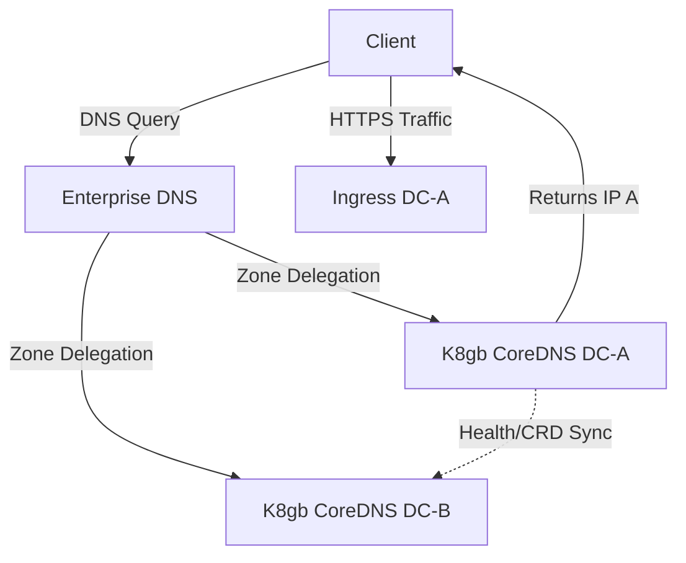

# Active-Active Multi-Site

## Learning Outcomes

*   Configure bare-metal Global Server Load Balancing (GSLB) using DNS zone delegation.
*   Implement BGP Anycast for stateless multi-site traffic distribution.
*   Diagnose split-brain scenarios and implement quorum-based witness sites.
*   Compare synchronous and asynchronous database replication topologies for bare-metal.
*   Deploy and validate a multi-site Distributed SQL architecture using topology spread constraints.

## The Physics of Active-Active

Operating an active-active architecture across physically separated datacenters is bounded by the speed of light. Every architectural decision in a multi-site setup is a negotiation with latency. 

Fiber optic transmission incurs roughly 1 millisecond of latency per 100 kilometers of distance, excluding the processing overhead of switches, routers, and firewalls. When applications run active-active, read and write operations must cross this boundary. 

If Datacenter A (DC-A) and Datacenter B (DC-B) are 500km apart, the absolute minimum Round Trip Time (RTT) is ~10ms. For stateless microservices, 10ms is negligible. For synchronous database replication requiring distributed consensus (e.g., Paxos or Raft) or certification-based replication (e.g., Galera), a single transaction might require multiple round trips, inflating a 2ms local write to a 40ms multi-site write.

:::tip
**The 5ms Rule**
For legacy synchronous replication (like Galera Cluster), keep datacenter RTT under 5ms (typically <50km apart, often called "Campus Area Networks"). For Distributed SQL (CockroachDB, YugabyteDB), RTT can be higher (up to 100ms), but application timeouts and retry budgets must be explicitly tuned to absorb the consensus latency.
:::

## Global Traffic Management (GTM) on Bare Metal

In cloud environments, Global Traffic Management is handled by managed services (Route 53, Cloudflare, Cloud DNS). On bare metal, routing ingress traffic to the optimal datacenter requires managing your own edge routing. There are two primary patterns: DNS-based GSLB and BGP Anycast.

### DNS-based GSLB (K8gb)

DNS-based Global Server Load Balancing delegates a specific subdomain (e.g., `app.global.internal.corp`) to Name Servers running inside your Kubernetes clusters. 

Tools like **K8gb** (Kubernetes Global Balancer) operate as Cloud Native GSLB. They deploy CoreDNS instances that act as authoritative nameservers for your delegated zones. 

1.  An Ingress object is annotated with `k8gb.io/strategy: roundRobin` (or `failover`, `geoip`).
2.  K8gb controllers in DC-A and DC-B communicate via Custom Resource Definitions (CRDs) exchanged over the WAN.
3.  When a client requests `app.global.internal.corp`, the enterprise DNS forwards the query to the K8gb CoreDNS instances.
4.  K8gb returns the A record of the Ingress controller in the healthiest, closest datacenter.



**Failure Mode:** DNS caching. Clients and intermediate ISPs routinely ignore TTLs. If DC-A fails, K8gb removes DC-A's IP from the DNS response, but clients caching the old IP will experience downtime until their local cache expires.

### BGP Anycast

Anycast involves announcing the exact same IP address (a /32 VIP) from multiple datacenters using BGP (Border Gateway Protocol).

The enterprise routers forward client packets to the datacenter with the shortest BGP path. If DC-A goes offline, its Top-of-Rack (ToR) router withdraws the BGP route. The enterprise network converges, and traffic immediately routes to DC-B.

:::caution
**The TCP Reset Gotcha**
Anycast is stateless. If the network topology changes while a TCP connection is established (e.g., a link flaps, changing the shortest path), subsequent packets for that session will be routed to the *other* datacenter. Because the other datacenter's Ingress controller has no TCP state for this connection, it responds with a TCP RST (Reset). Anycast is highly effective for UDP (like DNS) or short-lived stateless HTTP requests, but volatile for long-lived WebSockets or large file transfers.
:::

## Data Replication and Consensus

Stateless compute is trivial to span across sites. State is the hard problem. An active-active database must handle writes at both locations and resolve conflicts without data corruption.

### The Two-Datacenter Trap (Split-Brain)

The most common architectural failure in bare-metal multi-site design is attempting active-active storage across exactly two datacenters. 

If the WAN link between DC-A and DC-B fails, both datacenters remain online but cannot communicate. 
*   If both accept writes, they diverge. When the link returns, resolving conflicting writes (Split-Brain) requires manual, destructive intervention.
*   To prevent this, databases use Quorum (Strict Majority). 
*   Quorum formula: `(N / 2) + 1`. 
*   In a 2-node (or 2-DC) cluster, quorum is 2. If the link fails, neither site can see 2 nodes. Both sites lose quorum. The entire database halts to protect data integrity.

**The Fix: The Witness Site (DC-C)**
Active-active storage requires a minimum of three distinct fault domains. The third site does not need heavy compute; it acts as a "Witness" or tie-breaker. If the WAN fails between DC-A and DC-B, the site that can still communicate with the Witness site achieves quorum (2 out of 3) and remains active.

### Bare Metal Database Comparison

| Feature | Galera (MariaDB) | CockroachDB | YugabyteDB |
| :--- | :--- | :--- | :--- |
| **Architecture** | Synchronous Multi-Master | Distributed SQL (Raft) | Distributed SQL (Raft) |
| **Ideal RTT** | < 5ms | < 50ms | < 50ms |
| **Storage Engine** | InnoDB | Pebble (LSM Tree) | DocDB (RocksDB) |
| **K8s Operator** | MariaDB Operator | CockroachDB Operator | YugabyteDB Operator |
| **Conflict Handling** | Certification (Rollback on conflict) | Raft Consensus (Leader election) | Raft Consensus |
| **Read Scaling** | Local reads (stale possible) | Follower Reads | Follower Reads |

**Production Gotcha: Galera Flow Control**
In an active-active Galera cluster, replication operates at the speed of the slowest node. If a WAN link degrades, or a node in DC-B experiences disk I/O latency, Galera triggers "Flow Control." It pauses writes across the *entire global cluster* (including DC-A) to allow the lagging node to catch up. A localized storage issue in one datacenter causes a global application outage.

## Hands-on Lab

This lab simulates a multi-site active-active database deployment using CockroachDB across a single Kubernetes cluster. We will use node labels and topology spread constraints to simulate Datacenter A, Datacenter B, and a Witness site, demonstrating quorum survival and failure.

### Prerequisites

*   `kind` installed (v0.22.0+)
*   `kubectl` installed
*   `helm` installed (v3.14.0+)

### Step 1: Provision a Topology-Aware Cluster

Create a Kind configuration file that defines 5 worker nodes. We will apply custom labels to simulate three distinct zones.

```yaml
# kind-multisite.yaml
kind: Cluster
apiVersion: kind.x-k8s.io/v1alpha4
nodes:
  - role: control-plane
  - role: worker
  - role: worker
  - role: worker
  - role: worker
  - role: worker
```

Create the cluster:

```bash
kind create cluster --config kind-multisite.yaml --name multisite
```

Label the nodes to simulate two full datacenters and one witness datacenter:

```bash
# Datacenter A (2 nodes)
kubectl label node multisite-worker topology.kubernetes.io/zone=dc-a
kubectl label node multisite-worker2 topology.kubernetes.io/zone=dc-a

# Datacenter B (2 nodes)
kubectl label node multisite-worker3 topology.kubernetes.io/zone=dc-b
kubectl label node multisite-worker4 topology.kubernetes.io/zone=dc-b

# Witness Site (1 node)
kubectl label node multisite-worker5 topology.kubernetes.io/zone=dc-witness
```

Verify the topology:

```bash
kubectl get nodes -L topology.kubernetes.io/zone
```
*Expected Output: Nodes listed with `dc-a`, `dc-b`, and `dc-witness` zones.*

### Step 2: Deploy CockroachDB with Topology Spread

Add the CockroachDB Helm repository:

```bash
helm repo add cockroachdb https://charts.cockroachdb.com
helm repo update
```

Create a custom `values.yaml` to force CockroachDB pods to spread evenly across our simulated zones. This ensures that no single datacenter failure can take down a majority of the database pods.

```yaml
# crdb-values.yaml
statefulset:
  replicas: 5
conf:
  single-node: false
topologySpreadConstraints:
  maxSkew: 1
  topologyKey: topology.kubernetes.io/zone
  whenUnsatisfiable: DoNotSchedule
  labelSelector:
    matchLabels:
      app.kubernetes.io/name: cockroachdb
```

Install CockroachDB:

```bash
helm install crdb cockroachdb/cockroachdb -f crdb-values.yaml --version 14.1.2 --wait
```

### Step 3: Verify the Cluster and Data Insertion

Check that the pods are running and verify their distribution across the zones:

```bash
kubectl get pods -o wide -l app.kubernetes.io/name=cockroachdb
```
*Expected Output: 5 pods running. Look at the `NODE` column to confirm they are scheduled across `multisite-worker` through `multisite-worker5`.*

Initialize the cluster and write some test data:

```bash
# Access the built-in SQL client
kubectl exec -it crdb-cockroachdb-0 -- ./cockroach sql --insecure

# Inside the SQL prompt:
CREATE DATABASE bank;
USE bank;
CREATE TABLE accounts (id INT PRIMARY KEY, balance DECIMAL);
INSERT INTO accounts VALUES (1, 1000.50), (2, 5000.00);
SELECT * FROM accounts;
\q
```

### Step 4: Simulate Datacenter Failure (DC-B goes down)

We will simulate a hard failure of `dc-b` by cordoning the nodes and deleting the pods running on them. 

Identify the nodes in `dc-b` and cordon them so nothing reschedules:

```bash
kubectl cordon multisite-worker3 multisite-worker4
```

Delete the CockroachDB pods running on `dc-b`:

```bash
# Find the pods on dc-b
kubectl get pods -o wide | grep dc-b

# Delete those specific pods (e.g., crdb-cockroachdb-3, crdb-cockroachdb-4)
kubectl delete pod crdb-cockroachdb-3 crdb-cockroachdb-4 --force
```

### Step 5: Verify Quorum Survival

Datacenter B is completely offline. However, DC-A (2 nodes) and the Witness Site (1 node) provide 3 out of 5 nodes. The cluster maintains quorum.

Attempt to read and write data from a surviving pod in DC-A:

```bash
kubectl exec -it crdb-cockroachdb-0 -- ./cockroach sql --insecure

# Inside the SQL prompt:
SELECT * FROM bank.accounts;
INSERT INTO bank.accounts VALUES (3, 250.00);
SELECT * FROM bank.accounts;
\q
```
*Expected Output: The queries execute successfully. The cluster is operating normally despite a full datacenter loss.*

### Step 6: Simulate Quorum Loss (Split-Brain Prevention)

Now, simulate the loss of the Witness site. The cluster now only has DC-A online (2 out of 5 nodes). Quorum is lost.

```bash
kubectl cordon multisite-worker5
kubectl delete pod crdb-cockroachdb-2 --force # Assuming this was on worker5
```

Attempt to read or write data:

```bash
kubectl exec -it crdb-cockroachdb-0 -- ./cockroach sql --insecure

# Inside the SQL prompt:
SELECT * FROM bank.accounts;
```
*Expected Output: The query hangs or returns an error (e.g., `rpc error: code = Unavailable`). The database intentionally halts to prevent split-brain data corruption.*

**Cleanup:**

```bash
kind delete cluster --name multisite
```

## Practitioner Gotchas

1.  **Asymmetric Routing Blackholes:** In bare-metal BGP Anycast setups, packets from a client might enter through DC-A, but the return traffic from the pod might egress out of DC-B. If stateful edge firewalls exist, DC-B's firewall drops the return packets because it never saw the TCP SYN. Ensure stateful firewalls are bypassed for Anycast VIPs, or use Direct Server Return (DSR) topologies carefully.
2.  **Stale DNS TTLs during Failover:** When using DNS GSLB to fail over from DC-A to DC-B, downstream clients (like Java JVMs or ISP DNS resolvers) often ignore your `TTL=30` and cache the dead IP for minutes or hours. Always combine DNS GSLB with localized retry logic in the client application.
3.  **The Replication Queue OOM:** If a WAN link degrades severely (but doesn't fail entirely), asynchronous replication queues build up in RAM. If the application keeps writing at high velocity, the publisher database can exhaust memory and trigger the Linux OOM Killer, turning a network degradation into a hard database crash. Monitor replication lag and set aggressive memory limits on replication buffers.
4.  **Misconfigured Failure Domains:** Deploying a distributed database and setting `topologyKey: kubernetes.io/hostname` instead of a region/zone label. The database thinks 3 nodes in the same rack constitute 3 fault domains. When the rack loses power, quorum is lost instantly. Always align Kubernetes topology keys with actual physical fault domains.

## Quiz

**1. You are running a Galera Cluster synchronously across two datacenters. Datacenter A experiences a severe storage IOPS degradation, causing disk writes to take 500ms. What is the impact on applications writing to Datacenter B?**
*   A) Applications in DC-B will continue writing normally; DC-A will eventually catch up asynchronously.
*   B) Applications in DC-B will experience 500ms write latency because Galera flow control forces the cluster to the speed of the slowest node.
*   C) DC-A will automatically be evicted from the cluster to preserve DC-B's performance.
*   D) Applications in DC-B will experience split-brain until the IOPS degrade resolves.
*   *Correct Answer: B*

**2. Why is an active-active database deployment across exactly two datacenters an anti-pattern?**
*   A) Routing algorithms cannot balance traffic 50/50 without a third node.
*   B) Synchronous replication requires three nodes to compress data payloads.
*   C) In the event of a network partition between the two datacenters, neither can achieve quorum, halting the database to prevent split-brain.
*   D) BGP Anycast only supports odd numbers of origins.
*   *Correct Answer: C*

**3. You are using BGP Anycast to route ingress traffic to two bare-metal datacenters. A core router flaps, causing the BGP shortest-path to shift from DC-A to DC-B. What happens to existing file downloads currently streaming to clients from DC-A?**
*   A) The downloads continue seamlessly because Kube-Proxy syncs connection states between clusters.
*   B) The downloads fail with a TCP Reset (RST) because DC-B receives packets for a TCP session it does not recognize.
*   C) The downloads pause temporarily while DNS propagates the new path.
*   D) The router holds the TCP state in memory and proxies the rest of the stream to DC-A.
*   *Correct Answer: B*

**4. When configuring K8gb for Global Server Load Balancing across bare-metal clusters, how do the K8gb controllers make routing decisions?**
*   A) By hijacking BGP routes from the Top-of-Rack switches.
*   B) By acting as an authoritative DNS Name Server and dynamically returning A records based on cluster health CRDs.
*   C) By deploying an Envoy proxy at the enterprise network edge to inspect HTTP headers.
*   D) By modifying the client's local `/etc/hosts` file via a DaemonSet.
*   *Correct Answer: B*

**5. A team proposes placing a Distributed SQL database (CockroachDB) across DC-A (New York) and DC-B (London) with a RTT of 80ms. What must the application developers do to ensure stability?**
*   A) Nothing, CockroachDB masks all latency from the application layer.
*   B) Configure the application to use UDP for all database writes.
*   C) Implement aggressive client-side connection pooling and increase application timeouts/retries to accommodate the >80ms consensus latency per transaction.
*   D) Switch the database to Galera to enforce local read/write speeds.
*   *Correct Answer: C*

## Further Reading

*   [CockroachDB Multi-Region Capabilities](https://www.cockroachlabs.com/docs/stable/multiregion-overview.html)
*   [K8gb - Cloud Native Kubernetes Global Balancer](https://www.k8gb.io/docs/)
*   [Galera Cluster Flow Control](https://galeracluster.com/library/documentation/flow-control.html)
*   [Kubernetes Topology Spread Constraints](https://kubernetes.io/docs/concepts/scheduling-eviction/topology-spread-constraints/)