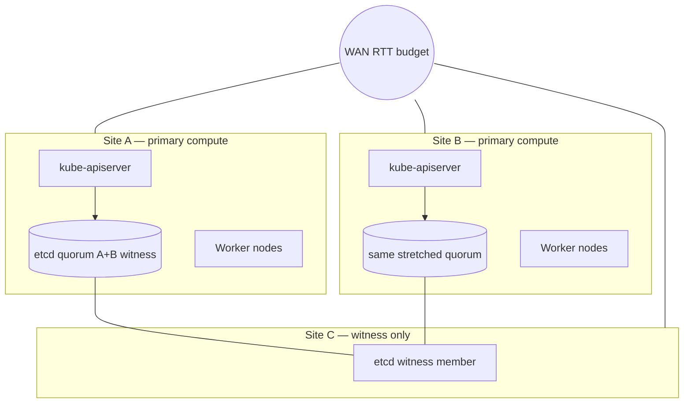
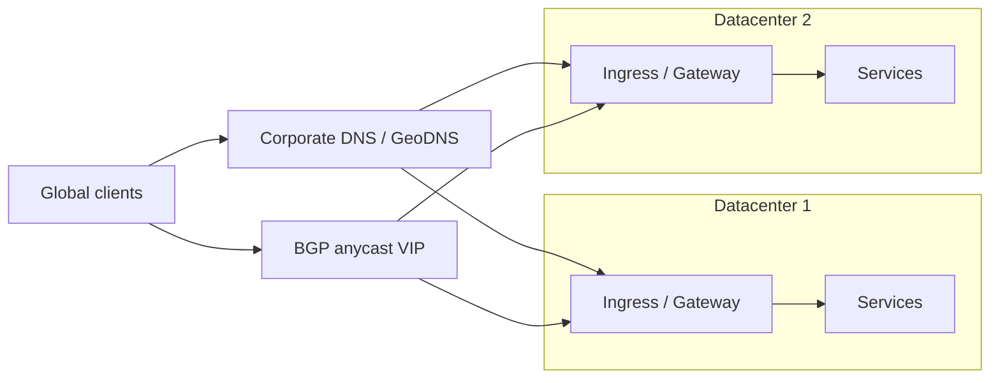
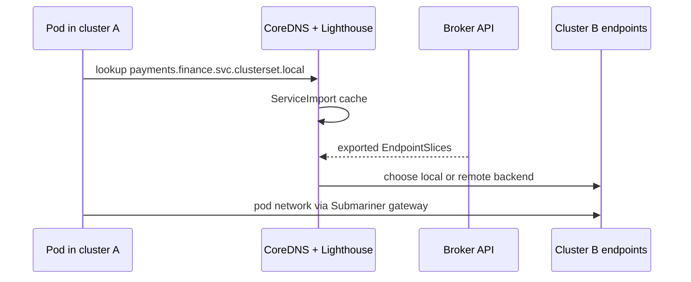

> **On-Premises Multi-Cluster** | Complexity: `[ADVANCED]` | Time: 60–70 minutes
>
> **Prerequisites**: [Module 5.2: Multi-Cluster Control Planes](../module-5.2-multi-cluster-control-planes/), [Module 5.4: Fleet Management](../module-5.4-fleet-management/), [Module 1.3: Cluster Topology](../../planning/module-1.3-cluster-topology/)

---

## What You'll Be Able to Do

After completing this module, you will be able to:

1. **Compare** active-active and active-passive multi-site topologies for latency, failure-domain isolation, and write-conflict risk on bare-metal Kubernetes.
2. **Design** etcd placement, quorum math, and latency budgets for stretched or federated control planes across on-premises datacenters.
3. **Implement** cross-site ingress routing with DNS GSLB, BGP anycast, and on-premises global load balancer equivalents aligned to Kubernetes Service and Ingress objects.
4. **Evaluate** data-layer patterns including multi-master databases, eventual consistency, CRDT-friendly workloads, and explicit conflict resolution when both sites accept writes.
5. **Connect** workload clusters using Cilium ClusterMesh and Submariner Lighthouse service discovery while defining per-site SLOs and cross-site dependency maps for observability.

---

## Why This Module Matters

Hypothetical scenario: a financial services firm runs two production Kubernetes clusters in Frankfurt and London, each sized for full traffic because executives demanded zero RTO for regional outages. Application teams deploy the same Helm chart to both sites, point a global DNS name at both ingress VIPs, and assume the databases “sync in the background.” Six months later, a partial WAN brownout—not a clean partition—lets both sites accept orders while replication lag exceeds four minutes. Reconciliation jobs delete rows that still appear valid to traders in the other city. Incident response spends a weekend in read-only mode because nobody documented which system owns conflict resolution, and etcd on a stretched control plane began electing leaders every ninety seconds when RTT spiked past the configured election timeout.

Active-active multi-site Kubernetes is not “two clusters plus GeoDNS.” It is a coordinated set of decisions about where writes may land, how quorum is preserved when links flap, how packets find healthy backends without breaking TCP state, and how platform engineers prove each site can survive the loss of the other without corrupting shared state. On-premises teams cannot hide behind managed global load balancers or regional managed databases; you own BGP, MTU, firewall rules between sites, and the witness node in a third rack. This module gives you the vocabulary and operational patterns to design that stack deliberately rather than inheriting a split-brain incident from a slide deck.

Fleet management from Module 5.4 keeps platform bundles consistent across sites, but fleet controllers do not solve data-plane conflicts or cross-cluster Service DNS by themselves. You still need ClusterMesh or Lighthouse for pod-to-pod connectivity, external GSLB for north-south clients, and database architectures that match your latency budget. The sections below walk through each layer in the order platform teams typically discover gaps: traffic steering first (because it is visible to executives), then control-plane etcd (because it fails loudly), then application data (because it fails expensively), then multi-cluster networking and observability (because they make the rest debuggable).

---

## Compare Active-Active and Active-Passive Multi-Site Models

> **Pause and predict**: If both datacenters stay online during a network partition, why might active-active application traffic still be safer than active-active database writes?

**Active-passive** designs designate one site as primary for writes (and often for all traffic) while the secondary site warms standby capacity. Failover means promoting DNS or anycast targets, rehearsing runbooks, and accepting that the passive site may lag minutes behind on asynchronous replication. Recovery time improves when automation is mature, but steady-state cost includes idle hardware and operational discipline to avoid “shadow production” drift where the passive cluster runs different chart versions than the primary.

**Active-active** designs intentionally serve production traffic from more than one site simultaneously. Stateless HTTP APIs and read-heavy caches benefit when latency to users in each geography matters: Frankfurt users hit Frankfurt ingress, London users hit London ingress, and both paths reach locally scheduled pods. The moment shared mutable state enters the picture—relational ledgers, inventory counts, session carts—the design must answer which site may write, how conflicts merge, and what happens when replication lag means reads are stale. Active-active compute without active-active data is common and often healthy; active-active data without formal conflict rules is where outages become data-loss incidents.

| Dimension | Active-passive | Active-active (compute) | Active-active (data) |
|-----------|----------------|-------------------------|----------------------|
| Steady-state utilization | Secondary capacity often idle | Both sites carry live traffic | Both sites accept writes |
| Failover | Explicit promotion step | Often automatic via GSLB/anycast | Depends on quorum and conflict policy |
| Latency to regional users | Secondary users may cross WAN | Local ingress and pods | Writes pay WAN RTT to consensus |
| Failure-domain isolation | Clear single writer | Blast radius spans routing + config | Split-brain risk without quorum |
| Operational complexity | DR drills, version parity | Traffic steering + dual observability | Replication tuning + conflict tooling |

Latency budgets start with physics: fiber adds on the order of one millisecond per hundred kilometers of path length before switch hops. A 500 km round trip between cities is rarely below ten milliseconds, and encrypted WAN overlays add more. Stateless microservices tolerate that cost; synchronous database quorum does not unless teams shrink failure domains or move to consensus systems engineered for higher RTT (distributed SQL with tuned timeouts, not legacy synchronous multi-master clusters designed for campus networks).

Write conflicts appear when two sites mutate the same logical row without coordination. Application-level idempotency keys, database constraints, CRDT structures, and “last writer wins” with operational review each trade automation for correctness. Platform engineers should document the chosen strategy in the same repository as Helm values so auditors see it beside PodDisruptionBudgets. If the business cannot articulate acceptable conflict behavior, default to active-passive data with active-active front ends until requirements mature.

Regulated industries sometimes mandate a “primary” legal jurisdiction for data even when traffic is active-active. That constraint does not forbid serving reads from both sites, but it may forbid writing personally identifiable information in the secondary region without contractual basis. Architecture reviews should separate **traffic active-active** from **data residency active-active** because compliance diagrams often show two bubbles while operations still run single-writer databases. Mislabeling the diagram creates audit findings when packet captures show writes landing in the wrong jurisdiction.

Session affinity interacts with active-active ingress. HTTP cookies or TLS session tickets tied to one site break when GeoDNS shifts users mid-session unless sessions are externalized to Redis or similar stores replicated with defined lag. StatefulSets with local volumes are poor candidates for cross-site failover unless storage replication is synchronous and tested—most platform teams instead run stateless Deployments behind global routing and push state outward to databases designed for multi-site semantics.

---

## Design etcd and Multi-Cluster Control Plane Topologies

Kubernetes control planes depend on etcd’s Raft consensus. Stretching one etcd cluster across WAN links is possible but fragile; operating independent clusters per site with federation-style tooling is often safer for application availability even though it complicates API aggregation. The etcd project documents that cross–data center deployments increase consensus latency because a majority of members must acknowledge each write, and recommends tuning heartbeat and election timeouts when RTT is high rather than using default LAN-oriented values.

### Stretched etcd versus federated clusters

A **stretched** cluster places etcd members (and sometimes control plane nodes) in multiple sites so one Kubernetes API remains authoritative. Quorum still requires ⌊n/2⌋+1 healthy members. A five-member etcd cluster tolerates two member failures; with **2+2+1** placement (two members in site A, two in site B, one witness in site C), the side that can still reach the witness keeps quorum (three votes); the halt case is the witness unreachable from both primary sites—or, with only four members split **2+2**, partition yields two versus two with no majority anywhere. Stretching etcd across exactly two equal sites without a witness is the same quorum trap as two-datacenter databases: each side holds half the votes.

A **federated** approach runs independent Kubernetes clusters per site, each with local etcd quorum on fast storage. Fleet tools, GitOps, or multi-cluster ingress distribute workloads; global service discovery uses Cilium ClusterMesh or Submariner Lighthouse rather than one giant API server. Application failover shifts to DNS/GSLB and data replication rather than etcd leader election across cities. The tradeoff is no single `kubectl` context for all pods unless you build one with OCM or similar, but blast radius shrinks: Frankfurt etcd trouble does not London API availability.

| etcd members | Majority needed | Fault tolerance (member loss) |
|--------------|-----------------|-------------------------------|
| 1 | 1 | 0 |
| 3 | 2 | 1 |
| 5 | 3 | 2 |
| 7 | 4 | 3 |

The etcd FAQ notes that clusters larger than seven members rarely help: fault tolerance improves slowly while write performance degrades because more replicas must persist each log entry. For on-premises multi-site control planes when stretch is mandatory, prefer **two members in each of two primary sites plus one witness in a third site (2+2+1)**—any single-site loss leaves three of five members alive (quorum). Never place five members across only two sites: one site must host at least three members, and losing that site leaves two survivors (below the majority of three). Never use two plus two without a tie-breaker. A **3+2 across three sites** pattern (three members in one primary site, two witnesses elsewhere) does **not** survive loss of the three-member site (two of five alive = no quorum); use that layout only when primary-site availability is otherwise guaranteed (for example dedicated HA hardware) and witness sites are bandwidth-limited—not as a default stretch design.

### Latency tolerance and tuning

When RTT between etcd peers rises, leader heartbeats miss deadlines and spurious elections cascade. etcd tuning guidance for WAN links states both rules side by side: **heartbeat interval** should be approximately one round-trip time (RTT) between members; **election timeout** should be at least **10×** the heartbeat interval **and** at least **10×** RTT (when heartbeat ≈ RTT, election timeout ≥ 10× heartbeat is usually sufficient). For cross-region etcd with ~50 ms RTT, plan heartbeat **50–100 ms** and election timeout **500–1000 ms**. Disk latency still matters more than network for many incidents: an etcd member on a noisy SAN can starve the whole cluster even when WAN is healthy. Monitor `etcd_disk_backend_commit_duration_seconds` and `etcd_server_heartbeat_send_failures_total` per site.

Separate **management** etcd (fleet hub) from **workload** etcd per site. Losing Frankfurt workload etcd should not freeze Rancher Fleet or OCM hub reconciliation if those components live in a neutral management site with their own quorum. Document backup and restore per etcd cluster; restoring the wrong snapshot into a multi-member cluster causes cluster ID mismatch warnings documented in etcd operations guides.

When Kubernetes minor upgrades roll through stretched control planes, upgrade etcd members before API server flags change, following vendor runbooks for your distribution. A common failure mode is upgrading kube-apiserver while etcd still runs an older storage schema on a lagging member in the remote site; the API reports version skew errors that look like application bugs. Stage upgrades site-by-site only when etcd remains quorate throughout—if the remote site hosts two of five members, losing that site during maintenance removes forty percent of votes and may be safe, but losing the wrong pair during rolling restarts is not.

Federated clusters still need coordinated **API aggregation** if you expose a single pane of glass. OCM, Karmada, or custom proxies do not merge etcd; they merge visibility. Teach operators which `kubectl` context mutates live objects versus which hub resources fan out ManifestWorks. During incidents, pointing kubectl at the wrong cluster has caused “fixes” applied to standby sites that were not taking traffic, doubling configuration drift.

Witness sites should run etcd on low-latency disks even if they host no application workloads. A witness VM on oversubscribed spinning rust becomes the surprise bottleneck during partitions when its vote decides which majority survives. Witness Kubernetes clusters are optional; bare-metal etcd on three small VMs in a third city is valid. If you colocate witness etcd with a full Kubernetes cluster, taint witness nodes so application pods never contend with etcd IO.

---

## Worked Example: Quorum Math for a Three-Site Stretch Proposal

Exercise scenario: platform leadership proposes **five** etcd members—two in Frankfurt, two in London, one witness in Amsterdam—to survive single-site loss. During a Frankfurt power event, both local members disappear, leaving London (two) plus Amsterdam (one): three of five members remain, so quorum holds and the API should stay available if WAN links stay up. During a Frankfurt–London partition with Amsterdam only reachable from London, London plus Amsterdam still forms three votes; Frankfurt’s pair cannot form majority alone, so Frankfurt stops writes—correct behavior.

If leadership instead proposes **four** members (two per site), partition yields two versus two with no majority anywhere—total API freeze. The extra witness in Amsterdam on the five-member design is not wasted capacity; it is the difference between graceful degradation and full control-plane outage. Document this arithmetic in architecture decision records so future cost-cutting does not remove the witness to “save three VMs.”

---


```mermaid
flowchart TB
    subgraph SiteA["Site A — primary compute"]
        APIA[kube-apiserver]
        EtcdA[(etcd quorum A+B witness)]
        NodesA[Worker nodes]
    end
    subgraph SiteB["Site B — primary compute"]
        APIB[kube-apiserver]
        EtcdB[(same stretched quorum)]
        NodesB[Worker nodes]
    end
    subgraph SiteC["Site C — witness only"]
        W[etcd witness member]
    end
    APIA --> EtcdA
    APIB --> EtcdB
    EtcdA --- W
    EtcdB --- W
    WAN((WAN RTT budget)) --- SiteA
    WAN --- SiteB
    WAN --- SiteC
```

---

## Implement Cross-Site Traffic Routing on Bare Metal

Cloud hyperscalers expose managed global load balancers and anycast frontends. On-premises platforms assemble equivalents from DNS, BGP, hardware ADCs, and Envoy-based ingress fabrics. Kubernetes remains the source of truth for pod endpoints; the global tier steers clients to the right cluster’s ingress or Gateway API implementation.

### DNS-based GSLB and GeoDNS

**GeoDNS** (or latency-based DNS) returns different A or AAAA records depending on the resolver’s vantage point or on health probes. Projects such as [k8gb](https://k8gb.io/) run authoritative DNS inside Kubernetes clusters, exchange health state via CRDs, and delegate subzones from corporate DNS. Strengths include simplicity for HTTP clients and natural integration with existing DNS teams. Weaknesses include caching: resolvers and JVMs ignore low TTLs, so failover still needs client retry logic and health-aware HTTP libraries.

Design checklist for DNS GSLB on-prem: delegate a subdomain (`app.global.corp.example`) to cluster-hosted nameservers; automate health checks from each site’s ingress controllers; keep TTLs realistic (30–120 seconds) without assuming instant global convergence; document manual override records for disaster drills.

### BGP anycast and hardware global load balancing

**BGP anycast** advertises the same VIP prefix from multiple sites; upstream routers deliver packets to the nearest origin. It excels at UDP and short HTTP requests. Long-lived TCP sessions break when routing shifts mid-connection because the new site lacks connection state—ingress controllers respond with TCP RST. WebSockets, large downloads, and TLS session resumption plans must include sticky routing at a layer above anycast or accept forced reconnects.

Hardware **global load balancers** (F5, Citrix, cloud-adjacent appliances) terminate TLS, enforce health probes, and apply geographic policies without teaching BGP to application teams. Pair them with Kubernetes `Service` type LoadBalancer or Gateway API routes published from each site. On-premises equivalents to hyperscaler “global accelerators” are often MPLS WAN optimizers plus centralized ADCs—not identical, but the architecture rhymes: reduce latency to the entry point, then let regional clusters handle east-west traffic.


```mermaid
flowchart LR
    Client[Global clients]
    DNS[Corporate DNS / GeoDNS]
    Anycast[BGP anycast VIP]
    subgraph DC1["Datacenter 1"]
        ING1[Ingress / Gateway]
        SVC1[Services]
    end
    subgraph DC2["Datacenter 2"]
        ING2[Ingress / Gateway]
        SVC2[Services]
    end
    Client --> DNS
    Client --> Anycast
    DNS --> ING1
    DNS --> ING2
    Anycast --> ING1
    Anycast --> ING2
    ING1 --> SVC1
    ING2 --> SVC2
```

Envoy-based ingress controllers can add **global rate limiting** and **active health checks** upstream of clusters, but they do not replace database conflict policies. Treat north-south routing as independent from east-west ClusterMesh connectivity: clients may land in Frankfurt while an internal batch job in London calls `payments.finance.svc.clusterset.local` across clusters.

Corporate DNS teams often resist delegating subzones to Kubernetes-hosted authoritative servers. A compromise keeps the parent zone in IPAM-managed BIND or Infoblox while automation pushes short-TTL records via API when health controllers detect ingress failure. Whether records originate from k8gb or external DNS, the contract is the same: health signal, record change, propagation delay, client retry. Run quarterly drills that fail ingress in one site and measure how long external synthetic monitors flip—compare results to internal kube-probe green dashboards.

Asymmetric routing breaks stateful firewalls: packets enter site A, return path exits site B, and the firewall on B drops replies it never saw originate. Mitigations include symmetric routing design, DSR topologies, or stateless anycast only at layers that do not track connection state. Document which paths are symmetric in the same binder as Cilium and Submariner port lists so network engineers do not “optimize” BGP without platform review.

Hardware ADCs can terminate TLS once and forward plain HTTP to in-cluster ingress, centralizing certificate management. That centralization becomes a shared failure domain—patch ADC firmware during maintenance windows distinct from Kubernetes upgrades. Match cipher suites and minimum TLS versions across sites so clients do not negotiate differently per city.

---

## Evaluate the Active-Active Data Layer

Stateless pods scale horizontally until the datastore argues. On bare metal, teams choose among synchronous multi-master SQL (Galera), distributed SQL (CockroachDB, YugabyteDB), primary/replica with controlled promotion, and application-level CRDT stores for narrow domains (counters, shopping carts with merge semantics).

**Galera** and similar certification-based clusters expect LAN-like RTT (often under five milliseconds). Flow control pauses writes cluster-wide when one node lags—storage trouble in London throttles Frankfurt. **Distributed SQL** systems use Raft ranges and can tolerate higher RTT if applications increase timeouts and limit chatty transactions. They still are not magic: a single-row update still waits for quorum across regions.

**Eventual consistency** and **CRDT-class** workloads fit catalog metadata, feature flags, or social feeds where merge semantics are defined. They fail accounting unless business rules encode compensating transactions. **Conflict resolution** strategies must be explicit: last-write-wins with audit logs, operator merge queues, or immutable event sourcing where conflicts replay from a ordered log.

Kubernetes scheduling interacts with data placement: use `topologySpreadConstraints` and zone labels that mirror physical racks, not merely `kubernetes.io/hostname` when three pods in one rack pretend to be three zones. Operators for CockroachDB, YugabyteDB, and cloud-native caches document zone-aware CRDs—align those with your datacenter labels before production traffic.

**Eventual consistency** fits when the business accepts stale reads with bounded lag and compensating actions. Catalog search indexes, CDN metadata, and feature-flag propagation are typical. **CRDT-class** structures (counters, OR-sets) fit collaborative editing or cart-merge flows where merge is commutative and audited. Neither replaces ledger accounting without careful domain modeling—double-spend prevention still needs a single authoritative writer or blockchain-style ordering.

**Conflict resolution** runbooks should name owners: application on-call versus database on-call versus data governance. Last-write-wins without audit trails fails SOX-style controls. Event sourcing with global ordering (Kafka compacted topics, log-based replication) shifts complexity from databases to stream processors but gives replayable truth. Vitess and similar sharding layers move data between clusters but do not magically create active-active SQL; understand what your chosen operator actually guarantees before marketing “multi-region SQL” to product teams.

Backup boundaries multiply in active-active data: each site may snapshot storage that is only half of the truth. Coordinate backup windows with replication topology so restores do not reintroduce deleted rows. Velero namespace backups without database-consistent hooks are insufficient for financial workloads—use application-native backup hooks or storage snapshots with quiesce.

| Store type | Typical WAN RTT | Split-brain behavior | Kubernetes integration |
|------------|-----------------|----------------------|-------------------------|
| Galera / Group Replication | Low (<5 ms) | Flow control stalls all writers | Operator + StatefulSet |
| Distributed SQL (Raft) | Moderate (tens of ms) | Loses quorum, stops writes | Operator, zone configs |
| Async primary/replica | Any | Risk divergent replicas if promoted wrong | External failover orchestration |
| CRDT / KV (specialized) | Any with app merge | Application-defined | Sidecar or embedded SDK |

---

## Connect Clusters with Cilium ClusterMesh and Submariner Lighthouse

Multi-cluster **networking** solves pod IP reachability and service DNS across sites. **Fleet** tools solve manifest placement; do not confuse the two.

### Cilium ClusterMesh

[Cilium ClusterMesh](https://docs.cilium.io/en/stable/network/clustermesh/clustermesh/) connects independent clusters that each run Cilium. Requirements from upstream documentation include non-overlapping PodCIDRs, node IP connectivity between sites on the configured InternalIP paths, matching datapath modes, unique cluster names (≤32 characters, DNS-like), and numeric cluster IDs (1–255 by default). Enablement deploys `clustermesh-apiserver`, exchanges TLS identities, and exposes the control plane via LoadBalancer, NodePort, or routable ClusterIP depending on your L3 design.

After `cilium clustermesh connect`, pods can reach remote pod IPs and **global services** via ClusterMesh service discovery (see Cilium’s ClusterMesh services documentation). Network policies can reference global identities when enabled. Scaling limits matter: default max connected clusters is 255; raising `maxConnectedClusters` trades off local identity space—upstream warns not to change this on live clusters casually.

On bare metal, open firewall paths between node InternalIPs and the documented ClusterMesh ports before blaming DNS. MTU mismatches across VPN show up as intermittent gRPC failures between clustermesh-apiserver instances long before application teams open tickets.

**Global services** in ClusterMesh expose a logical Service across clusters with backend pods selected by cluster affinity policies documented upstream. Pair global services with network policies that allow only expected remote cluster identities—ClusterMesh expands east-west attack surface if any pod can reach any remote pod CIDR. Identity allocation limits (`maxConnectedClusters`) matter for large fleets: planning fifty connected clusters on the default 255 limit sounds safe until subsidiary acquisitions add overlapping legacy CIDRs that block joins.

Lab validation path: install matching Cilium versions on two non-overlapping PodCIDR clusters, enable ClusterMesh, deploy the same Deployment in both clusters, create a global Service, and curl from a client pod in cluster A to the global VIP. Failure at DNS inside cluster A differs from failure at IP routing—split troubleshooting accordingly.

### Submariner Lighthouse

[Submariner](https://submariner.io/getting-started/) connects clusters with encrypted tunnels between gateway nodes (default UDP 4500, NAT discovery 4490, pod traffic encapsulation 4800). A central **Broker** cluster hosts CRDs exchanged by participating clusters. **Lighthouse** implements Kubernetes [Multi-Cluster Service APIs](https://github.com/kubernetes-sigs/mcs-api): a `ServiceExport` in one cluster becomes `ServiceImport` plus EndpointSlice copies elsewhere, and CoreDNS forwards `*.clusterset.local` queries to the Lighthouse DNS server. Lighthouse prefers local endpoints before round-robin to remote clusters for the same exported Service.

Prerequisites include non-overlapping Pod and Service CIDRs (or Globalnet for overlaps), Kubernetes 1.21+ for service discovery features, and gateway nodes reachable from peer gateways. Submariner complements ClusterMesh: some teams use Submariner when not standardized on Cilium, or when MCS alignment matters for service discovery portability.

Deploy the Broker on a cluster whose API is reachable from every site—often a small management cluster, not a saturated production site. Broker loss does not immediately delete existing tunnels but blocks enrollment and export updates—monitor Broker etcd like production. Gateway nodes should be sized for encapsulation throughput; pinning gateways to dedicated nodes with `submariner.io/gateway-only` style taints (per your Submariner version’s labels) prevents CPU starvation from application pods.

`ServiceExport` is namespaced; RBAC must limit who can export Services that expose cluster IPs globally. A developer exporting `kube-system` metrics to the world is a security incident. Automate export via GitOps with review gates. Lighthouse’s preference for local endpoints means canary deployments in one cluster still receive local traffic first—understand that behavior before expecting proportional cross-site load tests.

When Pod CIDRs overlap because of acquisitions, Submariner **Globalnet** allocates a virtual address space—adds operational moving parts but avoids re-IPing thousands of pods. Re-IP projects often take quarters; Globalnet may be faster time-to-value with documented debugging for NATed addresses.


```mermaid
sequenceDiagram
    participant PodA as Pod in cluster A
    participant DNS as CoreDNS + Lighthouse
    participant Broker as Broker API
    participant ClusterB as Cluster B endpoints
    PodA->>DNS: lookup payments.finance.svc.clusterset.local
    DNS->>DNS: ServiceImport cache
    Broker-->>DNS: exported EndpointSlices
    DNS->>ClusterB: choose local or remote backend
    PodA->>ClusterB: pod network via Submariner gateway
```

---

## Failure Scenarios: Split-Brain, Partitions, and Latency Excursions

**Split-brain** in databases means two sites both believing they are primary writers. Prevention is quorum; symptom is conflicting row versions requiring manual merge. **Split-brain** in etcd means two majorities—rare if membership is configured correctly, catastrophic if bootstrap tokens are reused across clusters (etcd warns about cluster ID mismatch).

**Network partitions** between sites produce one of three outcomes: minority side stops writes (healthy), minority side misconfigured to accept writes (data corruption), or both sides stop (quorum loss). Run game days that partition firewalls deliberately and measure time-to-detection for replication lag alarms.

**Partial site loss**—power loss in one hall, not the whole city—may remove enough etcd members or database replicas to drop quorum while the other site still runs. Capacity math should state whether losing one rack within a site still leaves majority in that site’s failure domain.

**Latency excursions** differ from hard partitions: links stay up but RTT triples. etcd elections flap; Galera flow control engages; application thread pools stall. Alert on trend shifts, not only hard down events. Synthetic cross-site probes (`curl` from node A to node B API health) catch brownouts DNS never sees.

When ingress fails over via GeoDNS while databases lack quorum on the receiving site, users see HTTP 502 storms—coordinate traffic steering with datastore health signals, often via automated withdrawal of unhealthy site records in GSLB controllers.

Game-day scripts should include partial failures: one rack loses power, one ISP path saturates, one etcd member disk goes read-only. Measure mean time to detect for replication lag versus mean time to automate traffic withdrawal. Human runbooks that require “call network team to confirm BGP” are acceptable only if SLAs allow that latency—otherwise automate BGP route withdrawal from health signals.

Split-brain in application configuration—not only databases—happens when two sites read different values from eventually consistent config stores. Fleet GitOps reduces drift for Kubernetes objects but not for VM-based dependencies. Extend configuration sources of truth or accept that active-active Kubernetes atop divergent VM templates will produce mysterious “works in site A only” tickets.

---

## Capacity Reservation and N+1 Site Headroom

Active-active sizing assumes **each** site can carry production if the other disappears—unless the business explicitly accepts degraded mode. If Frankfurt and London each normally take fifty percent of traffic, surviving-site headroom is one hundred percent capacity, not fifty. Memory, CPU, GPU, ingress throughput, NAT table sizes, and etcd IOPs all need that margin.

**N+1 across sites** differs from N+1 within a site: losing one datacenter must not remove more than one quorum member class. Witness nodes should be lightweight but on independent power and WAN paths. **Asymmetric sizing**—one large hub, one small edge—requires GSLB weights that do not send fifty percent of global traffic to the edge site that cannot absorb it.

Document formulas in runbooks:

- **Compute headroom**: `required_peak_per_site = normal_peak / min(active_sites_during_failure)`
- **etcd**: maintain odd member count; never add even members “for redundancy” without recalculating majority
- **Replication lag buffer**: async pipelines need disk and memory for `max_lag_seconds × write_rate`

Chargeback should reflect that active-active doubles steady-state hardware versus active-passive cold standby—finance and engineering should agree before procurement.

Asymmetric sizing example: Site A runs 200 worker nodes, Site B runs 80 for proximity to users near a factory corridor. GeoDNS weighted 50/50 sends half of global traffic to Site B, which catches fire on CPU during marketing events. Weights should reflect **capacity**, not geography alone, unless product accepts shedding traffic. Autoscaling per site helps but cannot outrun database connection limits—pool sizes need per-site caps.

Headroom math for connection-oriented ingress: if each site normally terminates 500k concurrent TLS sessions, surviving-site design requires roughly 500k capacity **after** failover, not 250k. Connection table exhaustion presents as random 502s while CPU looks healthy. Load tests must include failover timing, not steady-state-only peaks.

---

## Observability for Multi-Site Kubernetes

Per-site **SLOs** (availability, latency, error rate) roll up to global objectives with explicit dependency edges. A Frankfurt SLO on checkout may depend on London’s payment shard if databases are not active-active—draw that on a service graph.

**Cross-site dependency mapping** lists: GSLB health probe paths, ClusterMesh/Submariner gateway nodes, WAN RTT probes, etcd member labels per site, replication lag metrics per database, and Fleet/OCM agent connectivity. Use consistent `site`, `cluster`, and `region` labels on Prometheus metrics so Thanos or Grafana Mimir queries aggregate without relabel hacks.

Tracing should propagate cluster identity in resource attributes so Jaeger or Tempo spans from multi-cluster calls do not collapse into one node. Log shipping per site with mirrored indexes prevents total log loss when a site is isolated.

Alerting anti-patterns: paging only global ingress when database quorum loss is the root cause; silencing one site’s alerts during drills without marking the silences in STATUS.md equivalents. Runbooks should link from Grafana panels to firewall ticket templates for cross-site ports.

Build **cross-site dependency maps** as code: a YAML or JSON document listing each global Service, its backing clusters, database primary site, GSLB pool membership, and Fleet bundle version. Render diagrams in CI when the file changes so architecture reviews stay honest. Dependencies hidden in tribal knowledge guarantee incident surprises.

SLO burn rates should be per site and global: Frankfurt can burn error budget while London looks green, masking misconfigured weights. Multi-window, multi-burn-rate alerts from Google SRE practice apply unchanged—only the label cardinality grows. Recording rules that pre-aggregate `sum by (site)(rate(...))` keep dashboards responsive.

For Cilium and Submariner, export controller-specific metrics (ClusterMesh connection count, Submariner gateway RX drops) into the same Prometheus stack as application metrics. Correlate WAN RTT spikes with etcd election counters in one Grafana row during postmortems.

Synthetic probes should traverse the same paths users use: external DNS to ingress TLS to app health, and internal `clusterset.local` queries from a canary Deployment in each cluster. A probe that only hits kubelet `/healthz` on nodes misses GSLB mispointing entirely.

### Integrating Fleet Management with Multi-Site Rollouts

Rancher Fleet, OCM ManifestWorks, and Argo CD ApplicationSets from Module 5.4 distribute Kubernetes manifests, but multi-site programs need **wave policies**: canary one cluster per continent before promoting bundle hashes globally. Label clusters with `site`, `continent`, and `data-plane-role` so Placement and ApplicationSet generators never push database operators to a site that is traffic-drained for maintenance. Pause agents on a site while etcd or Galera recovers, then resume—otherwise controllers reapply Deployments that hammer a fragile datastore.

Version skew gates matter when Site A upgrades to Kubernetes 1.35 while Site B remains on 1.34 during a staged platform window. Fleet bundles referencing removed APIs will fail only in the upgraded site, appearing as partial fleet health. Segment bundles by `kube-version` label selectors or maintain parallel bundle branches merged through CI matrices.

Secrets rotation across sites should not reuse one SealedSecrets key unless policy allows—compromise in a lab site would unravel production. Prefer External Secrets Operator with site-scoped stores, or per-site sealed keys in Fleet `targetCustomizations`. Document which secrets are global (TLS for public DNS names) versus site-local (object storage endpoints in each hall).

### Kubernetes 1.35 and Platform Baseline Notes

This module’s hands-on references align with Kubernetes **1.35** kubeadm install paths from upstream documentation when you build lab nodes outside kind. Production baselines should pin containerd with `SystemdCgroup = true`, disable swap, and match kernel bridging sysctl expectations before joining multi-site clusters—node misconfiguration in one site often surfaces as CNI tunnel flaps that look like ClusterMesh failures.

Ingress and Gateway API objects remain per-cluster unless you adopt multi-cluster Services; global hostnames still terminate at site-local controllers. Coordinate certificate issuance (ACME DNS-01 with global DNS APIs, or corporate PKI) so failover does not serve expired certificates from the passive site’s older secret copy.

---

## Did You Know?

- **Cilium ClusterMesh defaults to KVStoreMesh enabled from v1.16**, reducing full etcd replication load for identity information while still requiring compatible `maxConnectedClusters` settings across members ([ClusterMesh docs](https://docs.cilium.io/en/stable/network/clustermesh/clustermesh/)).
- **Submariner Lighthouse owns the `clusterset.local` zone** and integrates with CoreDNS forwarding so exported Services resolve without manual stub zones in every cluster ([Lighthouse architecture](https://submariner.io/getting-started/architecture/service-discovery/)).
- **etcd recommends at most seven members** and warns that even-sized clusters do not increase fault tolerance versus the next lower odd size ([etcd FAQ](https://etcd.io/docs/v3.6/faq/)).
- **Galera flow control pauses the entire cluster** when any member falls behind, which is why multi-site Galera over WAN is rare in production ([Galera flow control](https://galeracluster.com/library/documentation/flow-control.html)).

---

## Common Mistakes

| Mistake | Problem | Solution |
|---------|---------|----------|
| Two-datacenter etcd or database without witness | WAN partition removes quorum everywhere | Add third failure domain or use active-passive data |
| GeoDNS as the only failover mechanism | Clients cache dead IPs for minutes | Combine low TTL with app retries; add health-checked anycast or ADC |
| Anycast for long-lived TCP without session affinity | Mid-stream RST on route change | Sticky sessions at L7 or accept reconnect semantics |
| Overlapping PodCIDRs between sites | ClusterMesh/Submariner routing conflicts | Plan CIDR matrix; use Globalnet only when required |
| `topology.kubernetes.io/zone` on hostname only | One rack loss kills quorum | Align zone labels with real halls/datacenters |
| Active-active ingress with single-site database | 502 after failover | Match traffic steering to datastore quorum health |
| Ignoring etcd election timeouts on WAN | Flapping leaders and API errors | Tune heartbeat ≈ RTT; election timeout ≥ 10× heartbeat and ≥ 10× RTT |
| No per-site observability labels | Incidents show global graphs hiding one site | Standardize `site`/`cluster` labels before go-live |

### Day-Two Operations Checklist

Before declaring multi-site production ready, platform teams should walk this checklist together with network and database owners. First, confirm non-overlapping Pod, Service, and Node CIDR matrices signed by architecture. Second, validate etcd or per-site control-plane quorum drawings with explicit witness placement. Third, run firewall tests for ClusterMesh or Submariner ports plus WAN RTT baselines recorded in monitoring. Fourth, execute GSLB failover drills measuring external client failure rates, not only in-cluster probes. Fifth, document conflict resolution for each datastore with named on-call roles. Sixth, prove Fleet or OCM bundles can pause per site without global deletion. Seventh, verify backups restore into isolated namespaces without contaminating the peer site. Eighth, review cost models for N+1 site headroom with finance sign-off.

The checklist is tedious by design—active-active rewards teams that treat multi-site as a program, not a one-time Helm install. Revisit the checklist after major acquisitions, CIDR expansions, or Kubernetes minor upgrades because each event invalidates assumptions baked into routing and quorum math.

Post-incident reviews for multi-site outages should capture **time-to-withdraw** traffic from unhealthy sites separately from **time-to-restore** database quorum. Organizations that only measure Kubernetes recovery often reintroduce traffic too early via GSLB automation that keys off pod Ready while writes still fail. Teaching executives that difference prevents premature celebration during bridge calls.

Finally, treat documentation as a control: architecture decision records for CIDR plans, conflict policies, and witness placement should link directly to Grafana dashboard UIDs and Fleet bundle paths. Future you—and auditors—should trace from a diagram to the exact Git commit running in Frankfurt versus London without asking in chat.

Platform engineers mentoring application teams should rehearse one sentence: **global routing is not global consensus**. Until that distinction is understood, developers will keep opening tickets about “Kubernetes being slow across sites” when the database is correctly refusing writes to preserve quorum. Your job is to make the stack honest—route users to healthy compute, measure replication lag openly, and fail traffic steering before data is corrupted.

When leadership asks for “zero downtime everywhere,” translate the request into concrete tiers: RTO for ingress, RTO for stateless workloads, RPO for each datastore class, and maximum acceptable conflict rate for any active-active store. Without those numbers, engineering invents hidden active-passive behavior that audits later classify as misrepresentation. Publish those tiers in the same Git repository as Fleet bundles so reviewers see operational constraints beside chart version bumps during every production promotion and quarterly disaster-recovery drill exercises worldwide.

---

## Quiz

<details><summary>Question 1: Compare active-active and active-passive for a read-heavy API with a single-writer database. Which layer should be active-active first?</summary>

Run **active-active** on stateless ingress and pods in both sites so regional users avoid WAN round trips. Keep the **database active-passive** (single primary writer) until conflict resolution and replication lag controls exist. Active-active data without quorum design risks split-brain; active-passive data with active-active compute is a standard stepping stone. Fleet GitOps can keep deployments symmetric while writes stay centralized.

</details>

<details><summary>Question 2: Design etcd for two equal on-premises datacenters. Why is a five-member cluster spanning only those two sites insufficient during partition?</summary>

Five members need a majority of **three** (⌊5/2⌋+1). Across only two sites, one site must hold **at least three** members. If that three-member site fails, only **two** members survive—below quorum—even though 3/5 is majority in the abstract. The split is **inherently unsafe** regardless of arithmetic: you need a **third site** as tiebreaker (for example **2+2+1**: two in each primary site plus one witness) so any two surviving sites can still reach three votes. Alternatively run independent etcd per cluster with federated Kubernetes. Recalculate majority as ⌊n/2⌋+1 before approving stretch designs.

</details>

<details><summary>Question 3: Implement DNS GSLB failover when DC-East ingress fails. What client-side behavior still breaks failover?</summary>

Resolvers and application runtimes **cache A records** despite low TTL. Java DNS caches, corporate resolvers, and browser caches may target dead IPs until expiry. Implement retry to alternate records, health-checked HTTP clients, and monitoring on GSLB controller health state—not only Kubernetes pod readiness in the failed site.

</details>

<details><summary>Question 4: Evaluate Galera versus distributed SQL for 40 ms WAN RTT between sites.</summary>

Galera **flow control** likely throttles all sites when one replica lags over WAN, because certification expects LAN-like RTT. Distributed SQL (Raft per range) tolerates higher RTT with tuned timeouts but still penalizes multi-round-trip transactions. Neither removes physics; **evaluate** workload transaction patterns and prefer single-site writers if RTT is unpredictable.

</details>

<details><summary>Question 5: Connect services with Submariner Lighthouse. What Kubernetes object must exist before remote clusters resolve `my-svc.default.svc.clusterset.local`?</summary>

Create a **ServiceExport** for the Service in the source cluster. Lighthouse agents export ServiceImport and EndpointSlice objects to the Broker; remote clusters import copies and the Lighthouse DNS server answers `*.svc.clusterset.local` queries (for example `my-svc.default.svc.clusterset.local`) via CoreDNS forwarding. Without export, Services remain local-only despite tunnels being up.

</details>

<details><summary>Question 6: Cilium ClusterMesh connect succeeds but pod pings fail. What prerequisite is most often missed on bare metal?</summary>

**Node IP connectivity** on InternalIP paths and firewall rules for ClusterMesh ports between all nodes—not only gateways—per Cilium documentation. Overlapping PodCIDRs or mismatched datapath modes also break connectivity. Verify with `cilium clustermesh status` and node-to-node probes before debugging application manifests.

</details>

<details><summary>Question 7: During latency excursion (not full partition), why might etcd lose leader while pods stay Running?</summary>

etcd leaders depend on **timely heartbeats and disk fsync**; high RTT or disk latency causes missed elections even when the Kubernetes data plane is healthy. Tune timeouts; fix storage latency. This is why observability must track etcd metrics per site, not only pod Ready counts.

</details>

<details><summary>Question 8: Active-active capacity: normal load is 40k RPS split evenly across two sites. What per-site capacity is required for survive-one-site-loss without degradation?</summary>

Each site needs roughly **40k RPS headroom** (full peak), not 20k, unless the business accepts degraded mode when one site fails. Apply the same logic to CPU, memory, connection tables, and database connection pools. N+1 at the site level differs from within-site replica counts—document both.

</details>

---

## Hands-On Practical Exercises

**Objective**: Build intuition for quorum math, ClusterMesh prerequisites, and Lighthouse DNS export workflows without requiring a full production WAN.

**Environment**: Linux workstation with `bash`, optional `kind`/`kubectl`/`cilium` CLI for Exercise 2. Exercise 1 is calculator-only. Exercise 3 uses local YAML and DNS tools and requires **PyYAML** via the repo virtualenv at `.venv/bin/python` (if running outside the repo, install with `pip install pyyaml`).

### Exercise 1: Design etcd Quorum and Latency Budgets

Compute majority sizes and failure tolerance for proposed member counts, then compare to your WAN RTT budget.

```bash
# Quorum calculator — majority = floor(n/2)+1, tolerance = floor((n-1)/2) for member failures
for n in 1 2 3 4 5 7; do
  majority=$(( n / 2 + 1 ))
  tolerance=$(( (n - 1) / 2 ))
  echo "members=${n} majority=${majority} tolerate_member_loss=${tolerance}"
done
# Example: 80ms WAN RTT — heartbeat ≈ RTT; election-timeout ≥ 10× heartbeat and ≥ 10× RTT
RTT_MS=80
HEARTBEAT_MS=80
ELECTION_MS=800
echo "heartbeat=${HEARTBEAT_MS}ms election=${ELECTION_MS}ms RTT=${RTT_MS}ms ratio=$(( ELECTION_MS / RTT_MS ))"
```

- [ ] I calculated majority and fault tolerance for at least three odd member counts used in **design** reviews.
- [ ] I documented whether my WAN RTT fits etcd tuning: heartbeat ≈ RTT; election timeout ≥ 10× heartbeat and ≥ 10× RTT (for ~50 ms RTT, heartbeat 50–100 ms and election timeout 500–1000 ms).
- [ ] I compared stretched etcd versus federated clusters for my organization’s RTO/RPO statement.

<details><summary>Expected analysis</summary>

Even member counts (2, 4) do not increase tolerated failures versus the next lower odd count but add coordination overhead. If RTT approaches heartbeat intervals, expect flapping leaders—raise timeouts using etcd tuning docs or keep etcd local to each site. Witness members in a third site break two-datacenter ties without full compute stacks.

</details>

### Exercise 2: Validate Cilium ClusterMesh Prerequisites with kind

Create two kind clusters, install Cilium with distinct cluster names/IDs, and inspect ClusterMesh enablement status. Requires Docker and the Cilium CLI.

```bash
cat > kind-cm-a.yaml <<'EOF'
kind: Cluster
apiVersion: kind.x-k8s.io/v1alpha4
networking:
  disableDefaultCNI: true
  podSubnet: "10.244.0.0/16"
  serviceSubnet: "10.96.0.0/12"
nodes:
- role: control-plane
EOF
cat > kind-cm-b.yaml <<'EOF'
kind: Cluster
apiVersion: kind.x-k8s.io/v1alpha4
networking:
  disableDefaultCNI: true
  podSubnet: "10.245.0.0/16"
  serviceSubnet: "10.97.0.0/12"
nodes:
- role: control-plane
EOF
kind create cluster --name cm-a --config kind-cm-a.yaml
kind create cluster --name cm-b --config kind-cm-b.yaml
cilium install --context kind-cm-a --set cluster.name=cm-a --set cluster.id=1
cilium install --context kind-cm-b --set cluster.name=cm-b --set cluster.id=2
cilium clustermesh enable --context kind-cm-a --service-type NodePort
cilium clustermesh enable --context kind-cm-b --service-type NodePort
cilium clustermesh status --context kind-cm-a
cilium clustermesh status --context kind-cm-b
kubectl --context kind-cm-a get pods -n kube-system -l k8s-app=cilium
kubectl --context kind-cm-b get pods -n kube-system -l k8s-app=cilium
```

- [ ] Both clusters run Cilium with unique **cluster.name** and **cluster.id** values.
- [ ] `cilium clustermesh status` shows clustermesh-apiserver deployed or explains missing LoadBalancer in kind.
- [ ] I recorded PodCIDRs for both clusters and confirmed they do not overlap.

<details><summary>Expected analysis</summary>

kind lacks real multi-node WAN; this exercise validates CLI flows and PodCIDR non-overlap, not production latency. Connecting clusters requires routable control-plane endpoints—often NodePort or manual IP wiring beyond kind defaults. Use results to checklist firewall and CIDR documentation before bare-metal rollout.

</details>

### Exercise 3: Implement a ServiceExport Manifest for Lighthouse

Author a ServiceExport and validate YAML locally; optionally apply on a lab cluster with Submariner installed.

```bash
mkdir -p /tmp/lighthouse-lab
cat >/tmp/lighthouse-lab/serviceexport.yaml <<'EOF'
apiVersion: multicluster.x-k8s.io/v1alpha1
kind: ServiceExport
metadata:
  name: payments
  namespace: finance
EOF
.venv/bin/python -c "import yaml; yaml.safe_load(open('/tmp/lighthouse-lab/serviceexport.yaml'))" && echo "ServiceExport YAML OK"
grep -E '^kind:|^  name:' /tmp/lighthouse-lab/serviceexport.yaml
# Optional when Submariner is installed:
# kubectl apply -f /tmp/lighthouse-lab/serviceexport.yaml
# kubectl get serviceexports -A
```

- [ ] ServiceExport YAML parses and names the Service to export.
- [ ] I can explain how Lighthouse publishes **ServiceImport** to the Broker for remote clusters.
- [ ] I documented the `clusterset.local` DNS suffix CoreDNS must forward to Lighthouse.

<details><summary>Expected analysis</summary>

Without Submariner CRDs installed, `kubectl apply` fails API discovery—that is expected in YAML-only labs. Production installs require Broker connectivity and non-overlapping Service CIDRs. Pair exports with infra firewall or security-group rules allowing gateway UDP 4500/4490 and node UDP 4800; keep application NetworkPolicies separate from gateway tunnel ports.

</details>

---

## Next Module

Continue to [Module 5.6: Gardener](../module-5.6-gardener/) for managed Kubernetes lifecycle patterns that complement multi-site fleet operations, or return to [Module 5.4: Fleet Management](../module-5.4-fleet-management/) if you need stronger hub-spoke GitOps before stretching applications globally.

---

## Learner Check

> **Pause and predict**: Your GeoDNS still points half of global users at a site whose database lost quorum ten minutes ago. Which two control planes must you coordinate to stop the bleeding—ingress/GSLB health withdrawal and database promotion or traffic drain—and why does fixing only Kubernetes pod readiness mislead monitors? Ingress and GSLB must stop sending traffic before or as soon as the datastore refuses writes; Kubernetes Ready probes on apps that return 500 from read-only databases can still pass if probes hit `/healthz` that does not touch the database. Per-site SLO dashboards should include replication lag and etcd leader stability, not only HTTP 200 rates from nginx.

---

## Sources

- https://docs.cilium.io/en/stable/network/clustermesh/clustermesh/
- https://docs.cilium.io/en/stable/network/clustermesh/services/
- https://submariner.io/getting-started/
- https://submariner.io/getting-started/architecture/service-discovery/
- https://etcd.io/docs/v3.6/faq/
- https://etcd.io/docs/v3.6/tuning/
- https://kubernetes.io/docs/concepts/scheduling-eviction/topology-spread-constraints/
- https://www.cockroachlabs.com/docs/stable/multiregion-overview
- https://galeracluster.com/library/documentation/flow-control.html
- https://k8gb.io/
- https://kubernetes.io/docs/concepts/services-networking/dns-pod-service/
- https://github.com/submariner-io/lighthouse
- https://kubernetes.io/docs/setup/production-environment/tools/kubeadm/install-kubeadm/
- https://www.envoyproxy.io/docs/envoy/latest/intro/arch_overview/upstream/load_balancing/overview
