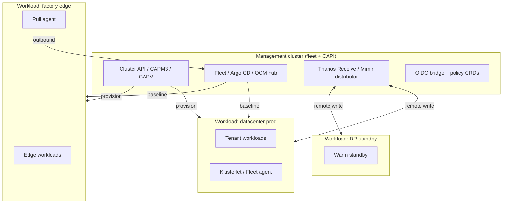
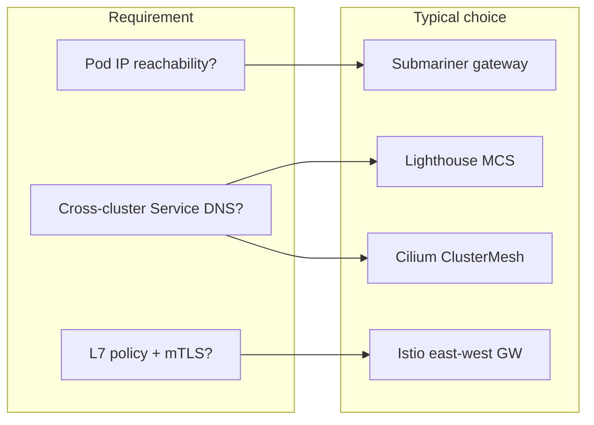

> **Complexity**: `[COMPLEX]` | Time: 65–75 minutes
>
> **Prerequisites**: [Module 5.1: Private Cloud Platforms](../module-5.1-private-cloud/), [Module 5.2: Multi-Cluster Control Planes](../module-5.2-multi-cluster-control-planes/), and at least two of Modules 5.3–5.6 for provisioning and fleet depth.

---

## Learning Outcomes

After completing this module, you will be able to:

1. **Design** a management-cluster-plus-workload-clusters reference architecture with sizing rules, blast-radius boundaries, and capacity ratios for on-premises fleets.
2. **Compare** provisioning paths including Cluster API with Metal3, kubeadm with Ansible, Gardener, and vendor Kubernetes distributions for the same private-cloud constraints.
3. **Evaluate** fleet controllers—Argo CD ApplicationSets, Rancher Fleet, Karmada, and Open Cluster Management—and multi-cluster networking options including Submariner Lighthouse, Cilium ClusterMesh, and Istio multi-cluster.
4. **Implement** cross-cutting platform patterns for federated OIDC, SPIFFE/SPIRE service identity, External Secrets Operator or Sealed Secrets, and Thanos, Mimir, or VictoriaMetrics metrics fan-in.
5. **Coordinate** rolling shoot or cluster upgrades, canary clusters, Velero-backed disaster recovery, and fleet-wide GitOps reconciliation with measurable recovery-time objectives.

---

## Why This Module Matters

Hypothetical scenario: a manufacturing group finishes Modules 5.1 through 5.6 with strong point solutions—OpenStack under some clusters, Metal3 for factory floors, Gardener for a central platform team, Rancher Fleet at the edge, and Argo CD in the datacenter. During a quarterly audit, leadership asks a single question nobody can answer in one diagram: *How does a new bare-metal cluster join the fleet, receive identity, networking, monitoring, secrets, and application baselines, and survive a control-plane upgrade without taking down unrelated sites?*

The honest answer in many organizations is a sequence of tribal runbooks. Cluster API engineers provision nodes; a different team imports clusters into OCM; application developers still deploy through Argo CD; network operators maintain Submariner gateways; security runs Vault with manual policy exceptions; observability uses three Prometheus stacks and a spreadsheet for Thanos endpoints. Each layer works in isolation. Together they fight during incidents because ownership boundaries were never drawn.

This synthesis module is the capstone for the On-Premises Multi-Cluster track. It does not introduce every tool from scratch—that is the job of Modules 5.1–5.6. Instead, it teaches you to assemble those tools into one operational story: a **management cluster** that stays workload-light, **N workload clusters** sized for tenant density, explicit **provisioning** and **fleet** handoffs, shared **identity** and **secrets** contracts, **observability** fan-in that executives can read, and **upgrade** plus **disaster recovery** choreography that limits blast radius. The outcome is a reference architecture you can defend in a design review without pretending on-premises Kubernetes behaves like a hyperscaler control plane.

---

## Reference Architecture: Management Cluster Plus N Workload Clusters

Mature on-premises programs converge on a **control plane of control planes**: one or two highly available management clusters run Cluster API controllers, fleet GitOps, policy engines, and observability receivers, while workload clusters run customer applications and local platform agents. The management cluster is production infrastructure with its own backup, upgrade, and access-control lifecycle—not a lab afterthought.

Sizing the management plane starts from controller count and etcd write rate, not from vCPU totals alone. A fleet of twenty workload clusters with Argo CD ApplicationSets, OCM placement controllers, and Thanos Receive ingesting remote write from every spoke generates sustained API traffic on the hub. Platform teams commonly allocate three to five control-plane nodes with fast etcd storage, plus two to four worker nodes tainted for `fleet=platform` so general workloads cannot starve reconciliation loops. For a five-member management etcd cluster, **quorum is three** (⌊5/2⌋+1)—the cluster tolerates two member failures, not four. When stretching etcd across sites, prefer **2+2+1** (two members in each of two primary sites plus one witness in a third): any single-site loss leaves three of five members and quorum holds. A **3+2** layout across three sites (three members in one primary site, two elsewhere) does **not** survive loss of the three-member site—only two members remain, below quorum—even though three of five sounds like a majority in the abstract.

Workload clusters scale by expected pod density, storage throughput, and GPU or storage-specialized node pools—not by copying management-cluster sizes.

Workload cluster counts follow blast-radius and compliance boundaries more than hardware convenience. A useful rule of thumb for regulated manufacturing is **one production cluster per site or per major application family**, separate staging clusters that mirror production Kubernetes minor versions, and shared lab clusters only for experiments that tolerate noisy neighbors. Edge factory clusters stay small—three control-plane nodes where HA is mandated, otherwise a single control plane with documented break-glass recovery when the business accepts the risk.



**Capacity ratio guidance:** for fleets under fifty workload clusters, plan management cluster resources at roughly **5–10%** of aggregate workload control-plane CPU and **15–25%** of management etcd storage headroom for fleet object growth. Above fifty clusters, shard fleet controllers or add a dedicated observability cluster so metrics ingestion does not contend with Cluster API machine reconciles. Document minimum headroom: keep management nodes at **30%** unallocated CPU and memory during normal operations so sync waves and remote-write spikes do not trigger eviction of controllers.

Pause and predict: if you delete the management cluster VMs while every workload cluster stays healthy, which user-visible systems fail first? Typical answers include inability to provision new clusters, stalled GitOps or ManifestWork delivery, missing centralized metrics dashboards, and broken CI that targets hub APIs—not immediate pod crashes on existing applications. That asymmetry is why management-cluster backups and restore drills belong in the same calendar as workload etcd snapshots.

When you **design** a greenfield fleet, capture explicit **sizing rules** in the architecture document rather than copying a hyperscaler reference. Management etcd volume size should include projected growth from `ManifestWork`, `Application`, and `BundleDeployment` objects—platform teams that plan only for pod counts routinely resize etcd under pressure after the twentieth cluster import. Workload clusters need headroom for peak scheduling bursts: keep at least **20%** unallocated CPU on worker pools that run batch workloads, and isolate storage-heavy nodes with taints so logging or analytics DaemonSets do not evict latency-sensitive application pods. **Blast-radius boundaries** mean a bad platform bundle or CNI upgrade must not touch every cluster in one sync wave; use cluster labels such as `wave=canary`, `wave=production-east`, and `wave=production-west` so fleet controllers promote changes in observable stages.

Document the **capacity ratio** between management and workload planes in the same review deck executives sign. Example: forty workload clusters averaging three control-plane vCPUs each imply roughly one hundred twenty control-plane cores fleet-wide; a management cluster with twelve control-plane cores and eight worker cores often suffices if observability ingestion is sharded elsewhere. Revisit the ratio when remote-write throughput doubles or when ApplicationSet count crosses thresholds that stress hub etcd. Factory edge clusters with intermittent links may need larger local Prometheus retention buffers so brief hub outages do not drop SLI data before remote write resumes.

---

## Provisioning Paths: CAPI, kubeadm, Gardener, and Vendor Distros

**Cluster API on Metal3** fits bare-metal factories and air-gapped racks where Ironic drives PXE, Redfish power cycles, and BareMetalHost inventory. The management cluster holds `Cluster`, `KubeadmControlPlane`, and `MachineDeployment` objects; CAPM3 translates them into physical servers. This path keeps Kubernetes lifecycle in SIG-maintained APIs and pairs naturally with GitOps registration jobs when `Cluster` status becomes `Ready`.

**kubeadm plus Ansible** remains valid when virtualization teams deliver golden VM images and configuration management already owns package versions, sysctl, and containerd settings. Ansible playbooks initialize control planes and join workers; human operators or AWX pipelines gate upgrades. The tradeoff is weaker declarative drift detection compared with CAPI—unless you wrap Ansible in Git with strict idempotency tests—but the learning curve is lower for teams steeped in configuration management.

**Gardener** models Kubernetes-as-a-service with Garden, Seed, and Shoot abstractions: the Garden cluster hosts APIs; Seed clusters run control planes for many Shoots; Shoots are tenant clusters. Gardener excels when a central platform team offers self-service cluster creation with standardized networking, DNS, and maintenance windows—common after Module 5.6. On-premises Gardener landscapes still need underlying IaaS or CAPI providers for nodes; Gardener coordinates upgrades and extensions rather than replacing IPAM or storage engineering.

**Vendor distributions**—VMware Tanzu, Red Hat OpenShift, SUSE Rancher Prime/RKE2—bundle Kubernetes with curated operators, support contracts, and opinionated ingress, registry, and policy stacks. They reduce integration toil when licensing and skills already exist, but they couple upgrade calendars to vendor matrices and may resist mixing with upstream CAPI unless the vendor documents supported integration paths.

| Path | Best on-prem fit | Lifecycle owner | Fleet handoff |
| :--- | :--- | :--- | :--- |
| CAPI + Metal3 | Bare metal, BMC automation | Platform SRE via Git | Kubeconfig secret → OCM/Fleet/Argo import |
| kubeadm + Ansible | VM templates, existing CMDB | Config management team | Manual or CI-driven cluster registration |
| Gardener | Internal KaaS, many tenants | Gardener ops + extension teams | Shoot labels → fleet placements |
| Vendor distro | Enterprise support mandate | Vendor + local ops | Import via vendor UI or supported agents |

Regardless of path, **separate infrastructure lifecycle from application delivery**. CAPI or Gardener answers how nodes and apiservers exist; Argo CD ApplicationSets, Rancher Fleet, Karmada, or OCM answers what platform software and policies land afterward. Blending tenant Helm charts into machine bootstrap secrets creates upgrade coupling that shows up as mysterious failures during Kubernetes minor bumps.

**Compare** paths in workshops with the same non-functional requirements written on the whiteboard: RTO for new cluster delivery, maximum Kubernetes skew allowed, air-gap constraints, and whether tenants may self-service cluster creation. Metal3 plus CAPI wins when BMC automation and hardware inventory already exist; kubeadm plus Ansible wins when virtualization teams refuse another control-plane API; Gardener wins when Shoot count will exceed what manual runbooks can carry; vendor distros win when support contracts and existing VM skills dominate hiring pools. None of these choices removes the need for fleet management afterward—only the birth ceremony changes.

Metal3 integration details matter for synthesis: BareMetalHost objects carry BMC addresses, credentials references, and hardware profiles; CAPM3 coordinates with Ironic for imaging; provisioning timeouts must account for firmware validation slower than cloud APIs. Ansible paths should still emit structured cluster metadata—API endpoint, CA thumbprint, cluster name, region labels—for registration automation even if CAPI is not the provisioner. Gardener Shoots expose standardized labels platform teams map to OCM Placements; treat Shoot creation RBAC as seriously as workload cluster admin because Shoots are full Kubernetes clusters with their own etcd.

---

## Fleet Management: ApplicationSets, Fleet, Karmada, and OCM

Fleet tools solve configuration drift across many API servers. The synthesis question is not which logo wins a slide deck—it is which reconciliation direction, credential model, and object vocabulary match your network and team skills.

**Argo CD ApplicationSets** generate one `Application` per target using **List**, **Cluster**, **Git**, **Matrix**, **Merge**, **SCM Provider**, or **Pull Request** generators documented in the upstream operator manual. The management-cluster Argo CD instance **pushes** manifests to spoke API servers using cluster secrets. ApplicationSets excel when datacenter clusters allow hub-to-spoke connectivity on port 6443, developers already think in Argo projects, and matrix generators can combine Git directory paths with registered cluster labels for promotion pipelines.

**Rancher Fleet** uses `GitRepo` resources that clone repositories, render `fleet.yaml` bundles, and create `BundleDeployment` objects. **Downstream Fleet agents pull** bundle desired state from the controller—spokes do not require inbound connections from the hub. Fleet fits edge-heavy on-premises fleets, especially when Rancher already provides SSO and cluster inventory.

**Karmada** exposes a federated Kubernetes API on the management cluster. **PropagationPolicy** selects member clusters and creates **ResourceBinding** objects that record placement; **OverridePolicy** patches fields per cluster for mirrors, replicas, or ingress hosts. Karmada pushes propagation to member apiservers when connectivity allows; it suits teams that want standard `Deployment` and `Service` objects with federation semantics instead of fleet-specific CRDs.

**Open Cluster Management** registers **ManagedCluster** objects; **Klusterlets pull** **ManifestWork** payloads from hub namespaces. **Placement** plus **PlacementDecision** choose targets dynamically. Governance policies bind through **PlacementBinding** to **Policy** or **PolicySet** objects only. Work distribution uses **ManifestWorkReplicaSet** with `spec.placementRefs` pointing at a **Placement**—not PlacementBinding. Confusing those APIs is a frequent source of “policy applied but workloads never shipped” incidents.

| Constraint | Lean toward | Reason |
| :--- | :--- | :--- |
| Outbound-only factory firewalls | OCM or Fleet pull agents | No inbound apiserver access required |
| Hub can reach all apiservers | Argo CD ApplicationSets | Push sync with familiar UI |
| Federated scheduling of standard apps | Karmada PropagationPolicy | ResourceBinding tracks per-cluster copies |
| Git bundle diff UX for platform baselines | Rancher Fleet GitRepo | Per-cluster BundleDeployment status |

Hybrid fleets are normal: CAPI provisions clusters, OCM delivers baseline ManifestWorks to edge sites, Argo CD ApplicationSets promote application charts to datacenter clusters, and Karmada handles a small set of truly multi-cluster services. Document boundaries in architecture reviews so two hubs do not fight over the same cluster without owners.

**Evaluate** fleet and networking choices together because misaligned combinations fail in production even when each tool passes a proof-of-concept. ApplicationSets plus Submariner Lighthouse suit datacenter meshes where hub push works and MCS DNS is enough for service discovery. Fleet plus ClusterMesh suits edge spokes that pull bundles while datacenter Cilium clusters expose global services for shared APIs. OCM plus Istio suits regulated environments that need pull-based baselines and L7 mTLS for a subset of microservices—accept the operational cost of mesh upgrades across clusters. Write the decision in the architecture record so auditors see intentional pairing rather than accidental overlap.

Argo CD ApplicationSet **generators** deserve explicit runbook coverage: the **List** generator iterates over a static set of items (typically used for stable cluster lists or environments); the **Cluster** generator watches registered cluster secrets; the **Git** generator scans repository directories; the **Matrix** generator multiplies two generator outputs—useful for monorepo platform charts times production clusters. Enable `goTemplate: true` with `missingkey=error` so template typos fail CI instead of creating silently empty Application names. Fleet **GitRepo** paths should separate `baseline/`, `security/`, and `apps/` directories with independent `fleet.yaml` files so a broken application chart does not block monitoring agent rollout. Karmada **PropagationPolicy** `resourceSelectors` must be narrow enough that system namespaces are not accidentally propagated; OCM **ManifestWorkReplicaSet** status fields should feed the same compliance dashboard Kyverno policy reports use.

---

## Multi-Cluster Networking: Submariner Lighthouse, ClusterMesh, and Istio

GitOps alignment does not imply L3/L4 connectivity. Applications that call Services in other clusters need explicit networking choices.

**Submariner** connects pod and service CIDRs with encrypted tunnels between gateway nodes. **Submariner Lighthouse** implements the Multi-Cluster Services (MCS) API: `ServiceExport` and `ServiceImport` objects plus Lighthouse DNS enable cross-cluster Service discovery without full pod routability in every topology. On-premises teams must validate CIDR plans, BGP or static routes to gateway nodes, and Globalnet when service CIDRs cannot be renumbered.

**Cilium ClusterMesh** links independent Cilium data planes with mutual TLS between clustermesh apiservers. **Global services** load-balance backends across clusters when versions align. ClusterMesh assumes operational skill in Cilium certificate rotation; stale clustermesh certificates break discovery while local pods still run.

**Istio multi-cluster** delivers L7 routing, mTLS, and failover through east-west gateways and primary-remote or multi-primary control-plane topologies documented upstream. Istio adds operational weight—coordinated control-plane upgrades across clusters—but fits enterprises already standardized on mesh traffic policy.



Score options against staffing: Submariner adds network engineering for routes and gateways; Lighthouse adds MCS object lifecycle; ClusterMesh adds Cilium expertise; Istio adds mesh SRE capacity. Many programs implement GitOps federation first, then add networking when application dependencies prove cross-cluster Service calls are unavoidable.

**Submariner Lighthouse** publishes `ServiceExport` objects on source clusters. Consuming clusters reconcile `ServiceImport` and MCS DNS records. Install Lighthouse with the broker and gateway components documented in the Submariner quickstart. Validate MCS CRD availability for your Kubernetes 1.35 target before production. **Cilium ClusterMesh** needs mutual TLS between clustermesh apiservers; rotate certificates on a schedule. **Istio** east-west gateways require routable IPs or explicit tunnels on multi-network topologies. Test the protocols factory applications use, not only HTTP health checks.

Firewall change requests should name cluster pairs and gateway nodes. Network teams approve faster when diagrams show pod CIDRs and gateway IPs. Remove temporary permissive rules after debugging; auditors flag them often.

---

## Identity: Per-Cluster RBAC, Federated OIDC, and SPIFFE/SPIRE

Each workload cluster maintains local **RBAC** bindings, but humans should not carry dozens of long-lived kubeconfig files. **Federated OIDC** configures every apiserver to trust the same corporate IdP with per-cluster client IDs or audiences; GitOps generates `ClusterRoleBinding` objects when clusters register, mapping IdP groups to platform roles. Break-glass cluster-admin credentials stay in vault with ticket IDs; daily operators use OIDC groups scoped to namespaces or clusters.

**Hub impersonation** through Rancher or OCM consoles centralizes support access if sessions are audited. Compromise of a hub admin account remains catastrophic—protect hub RBAC, etcd encryption at rest, and certificate boundaries between management and workload CAs.

**SPIFFE/SPIRE** addresses **service identity** across clusters: workloads receive SVIDs tied to SPIFFE IDs instead of sharing static service account tokens copied between clusters. SPIRE servers and agents deploy per cluster or per site; federation between SPIRE servers enables cross-cluster mTLS for service meshes or custom applications. SPIFFE complements OIDC for humans—OIDC authenticates operators; SPIFFE authenticates workloads talking east-west after GitOps has already placed Deployments.

Document which identity layer answers which question: OIDC for kubectl and CI deployers, SPIFFE for pod-to-pod trust, and local RBAC for in-cluster service accounts scoped to one cluster. Mixing layers without documentation produces tickets where teams rotate Kubernetes secrets when the real gap is SPIRE federation not configured on a new factory cluster.

To **implement** **federated OIDC**, configure each workload apiserver with the same issuer URL, distinct client IDs per cluster or audience claims per environment, and GitOps-generated `ClusterRoleBinding` objects keyed off IdP group names. CI pipelines should use OIDC federation from the corporate IdP or short-lived tokens from Vault rather than static kubeconfig files checked into automation repos. **SPIFFE/SPIRE** deployment patterns include one SPIRE server per datacenter with agents on every node, or lighter SPIRE server clusters for factory sites with intermittent hub connectivity. Federate SPIRE servers only when applications must validate SVIDs across sites; otherwise keep trust domains separate to limit compromise blast radius. Pair SPIRE with service meshes or mTLS libraries that consume SVIDs automatically instead of mounting Kubernetes service account tokens into every cross-cluster call path.

Per-cluster **RBAC** remains authoritative for in-cluster operations: even with federation, `RoleBinding` objects are local. Platform teams publish a `platform-baseline-rbac` bundle through Fleet or ManifestWorkReplicaSet that creates consistent `ClusterRole` definitions while binding them to local subjects. Tenant teams receive namespace-scoped roles generated from templates parameterized by cost center and cluster name. Quarterly access reviews should compare IdP group membership to live bindings using automated exporters that query each apiserver or hub inventory APIs.

---

## Secrets Distribution: ESO, Sealed Secrets, and Vault Agent Injector

Fleet-wide configuration cannot store cleartext credentials in Git. Three patterns dominate on-premises:

**External Secrets Operator (ESO)** reads secrets from HashiCorp Vault, cloud KMS analogs, or on-prem secret stores via `ClusterSecretStore` and `ExternalSecret` objects. Platform teams deploy store CRDs through ManifestWork or Fleet bundles, then let application teams reference paths with RBAC enforced at the vault policy layer. Rotation updates vault entries; ESO reconciles Kubernetes Secrets on an interval; workloads restart through rolling updates or Reloader sidecars.

**Sealed Secrets** encrypts Secret manifests to a cluster-specific public key so Git can hold sealed blobs safely. Fleet distribution requires **per-cluster keys** or overlays in Fleet `targetCustomizations`—one sealed blob rarely decrypts everywhere. Rotation means re-sealing with new keys and coordinated rollout.

**Vault Agent Injector** mutates pods to mount dynamic secrets at runtime without persisting them in etcd. It suits high-churn credentials and legacy apps that read files under `/vault/secrets`, but it couples pod startup to vault availability and agent sidecars.

| Pattern | Git-safe | Rotation model | Fleet fit |
| :--- | :--- | :--- | :--- |
| ESO | Yes (references only) | Vault/KV version + reconcile | ManifestWork per spoke store |
| Sealed Secrets | Yes (encrypted) | Re-seal per cluster key | Fleet overlays per site |
| Vault Agent Injector | Partial (roles, not values) | Vault lease renewal | DaemonSet or mutating webhook bundle |

Choose per compliance zone: factories with strict key separation should not share one Sealed Secrets controller key across regions. Prefer ESO when a central vault already exists; prefer Sealed Secrets for air-gapped Git-only promotion with offline key ceremonies.

**Implement** secrets **distribution** as code: deploy `ClusterSecretStore` through OCM ManifestWorkReplicaSet to every production Placement match; store only vault paths in Git; let **External Secrets Operator** materialize Kubernetes Secrets on reconcile intervals. For **Sealed Secrets**, maintain a `sealed-secrets-keys` directory per region in the fleet repository with Fleet `targetCustomizations` selecting the correct key per cluster label. **Vault Agent Injector** fits legacy JVM or binary apps that read file-based credentials—deploy the mutating webhook as a platform bundle with strict namespace selectors so tenant pods cannot request arbitrary vault paths. Rotation runbooks should list order: update vault secret, verify ESO or agent refresh, roll workloads, revoke old version, and confirm no pods mount previous lease IDs in audit logs.

---

## Observability: Thanos, Mimir, and VictoriaMetrics Fan-In

Per-cluster Prometheus without fan-in forces on-call engineers to open twelve browser tabs during incidents. **Observability fan-in** centralizes metrics while preserving mandatory labels: `cluster`, `environment`, `site`, and `platform_version`.

**Thanos** components—sidecar, store, compact, query, and **Receive** for remote write—deduplicate HA Prometheus pairs at **query time**. Prometheus replicas label series with `replica` external labels; the Thanos Querier merges and drops duplicates when querying. Design scrape configs and remote-write relabeling so HA pairs are identifiable.

**Grafana Mimir** (and Cortex heritage) deduplicates at **ingestion**: the distributor’s **HA tracker** accepts samples from only one replica of each HA Prometheus pair, preventing duplicates in long-term storage. Operators must configure remote write and external labels to match Mimir’s HA expectations—different from Thanos’s query-time dedup model.

**VictoriaMetrics** offers single-binary and clustered (`vminsert`, `vmstorage`, `vmselect`) deployments with efficient compression for large on-prem fleets. **vmagent** remote-writes from spokes; **VMAlert** can fan out alerting from centralized storage. Teams choose VictoriaMetrics when operational simplicity and resource efficiency outweigh Thanos’s component modularity.

Standardize alerting routes on fan-in labels so a missing `cluster` label fails CI for new scrape configs. OCM observability add-ons or Fleet bundles can deploy agents consistently, but the label contract is what makes multi-cluster queries trustworthy during failover drills.

**Implement** **metrics fan-in** incrementally: phase one deploys Prometheus or vmagent on every spoke with remote write to a lab receiver; phase two enforces label contracts in CI; phase three routes critical alerts from centralized Alertmanager or VMAlert with `cluster` and `site` routes to regional on-call rotations. **Thanos** Receive rings need hashring planning and object storage for long-term blocks; run compactor and store gateways on infrastructure separate from the management cluster if ingestion exceeds fifteen terabytes annually. **Grafana Mimir** tenants separate environments; configure HA tracker labels before cutting over production remote write. **VictoriaMetrics** clusters split `vminsert` and `vmstorage` when ingestion exceeds single-node limits; use recording rules to downsample factory metrics that spike cardinality with per-pod labels from debugging endpoints.

Logging and tracing fan-in mirror metrics philosophy: cluster label on every span, tail sampling on edge clusters to save bandwidth, and corporate SIEM export from the hub region only. Do not block metrics rollout waiting for perfect tracing—executives still need SLO dashboards when traces are partial. Document which backend owns HA deduplication in runbooks so engineers do not apply Thanos relabel hacks to Mimir distributors during incidents.

---

## Upgrade Coordination: Shoots, Clusters, and Canary Waves

Upgrades span Gardener **Shoots**, CAPI **KubeadmControlPlane** rollouts, vendor supervisor channels, and fleet bundle pins. A safe default **order** is: upgrade management-cluster fleet controllers and observability receivers, upgrade CAPI providers, upgrade workload control planes in waves, upgrade platform bundles (CNI, CSI, ingress, monitoring), then promote tenant applications.

**Canary clusters**—one factory and one datacenter cluster on the new Kubernetes minor—run conformance tests, admission policy checks, and synthetic workloads before fleet-wide promotion. Git tags such as `platform-v1.35` communicate compatible bundle versions to cluster classes. Pause labels on `ManagedCluster` or Argo cluster secrets stop sync during metal maintenance.

**Blast radius limits** include: maximum concurrent control-plane replacements per site, forbidden fleet-wide Helm chart bumps without staged BundleDeployment health, and explicit maintenance windows encoded as Argo CD sync windows or OCM placement taints. Document rollback: Fleet reverts Git; Argo syncs previous revisions; CAPI machine rollouts may require infrastructure rollback if new OS images shipped.

Gardener maintenance windows automate Shoot Kubernetes version bumps with extension coordination; combine Gardener upgrades with fleet pauses so platform bundles do not race extension readiness. For kubeadm fleets, pin package repositories to Kubernetes 1.35 streams and test etcd defragmentation before minor upgrades.

Platform engineers should maintain a version skew matrix in Git. Rows list approved Kubernetes minors; columns list CNI, CSI, ingress, service mesh, and fleet controller versions. CI rejects bundle promotions that violate the matrix. The matrix prevents a common failure mode where Argo CD ships a chart requiring Kubernetes 1.35 APIs while one factory cluster remains on 1.34 because BMC maintenance slipped. Canary clusters must run the target minor plus the newest platform bundle candidate for at least one full business week before broader promotion.

Cordoning and draining remain Kubernetes primitives every fleet relies on during metal work. Fleet controllers do not replace node safety steps; they coordinate what happens after nodes return. Document maximum concurrent drains per cluster class so storage backends are not overwhelmed by simultaneous volume detach storms. Pair node maintenance with paused ApplicationSet sync or frozen ManifestWorkReplicaSet generation so partially upgraded nodes do not receive conflicting DaemonSet versions mid-drain.

Shoot upgrades in Gardener deserve explicit communication templates. Application owners receive maintenance notices with expected API blips, not surprise pager storms. CAPI KubeadmControlPlane rollouts should expose machine counts and pending upgrades in the same dashboard executives view for fleet bundle health. When upgrades fail, rollback strategy must be pre-authorized: revert Git tag, pause placements, and restore etcd snapshot only when Git revert cannot unwind CRD upgrades safely.

---

## Disaster Recovery Across the Fleet

**Velero** backs up namespace-scoped resources and, with compatible CSI snapshots, persistent volumes per cluster. Fleet DR adds **Git as desired-state backup** for everything expressed in GitOps, plus **etcd snapshots** for management and workload control planes. Recovery-time tests must include: restore management hub from backup, re-register spokes or accept restored kubeconfigs, replay GitOps, and verify observability fan-in resumes.

**Fleet-wide GitOps reconciliation** after site loss means a surviving datacenter hub—or restored hub—reapplies ManifestWorks, BundleDeployments, or ApplicationSets to replacement clusters registered with the same labels. **Placement** rules should attach baselines to `region=eu` rather than hostname lists so DR clusters inherit policies automatically.

Game days should measure: time to restore management etcd, time to import ten replacement clusters, time until monitoring shows all spokes green, and time until policy compliance reports match pre-disaster baselines. Application RPO/RTO for databases remains the application team’s contract—Kubernetes only supplies compute and networking paths after data replication exists.

**Velero** schedules should include namespace selectors for platform components and exclude ephemeral CI namespaces. Store backups in object storage with encryption and cross-site replication matching compliance class. Test restores on isolated networks quarterly: restore etcd snapshot into a kind or lab cluster, restore application namespaces with Velero, then verify GitOps re-applies drift correctly. **Fleet-wide GitOps reconciliation** after site loss means replacement clusters register with the same labels as destroyed clusters so Placements rediscover them; keep label keys in CMDB or hardware asset tags so rebuilds do not invent new label schemes. Measure **recovery-time** objectives with wall-clock timers in game-day scripts, not engineer estimates.

**Coordinate** DR with networking: if Submariner gateways or ClusterMesh trust bundles lived only in the lost site, surviving clusters may need temporary single-site mode until gateways rebuild. Maintain offline copies of cluster join bundles, OIDC client secrets metadata (not cleartext secrets), and SPIRE trust bundle files in vault paths replicated across regions. Communication plans matter as much as technology—application owners should know whether DNS failover or GSLB owns user-visible cutover while platform teams restore Kubernetes paths underneath.

Runbooks should list contact trees per scenario: hub etcd loss, single workload cluster loss, vault unavailable, and corporate IdP outage. Each scenario notes which layers keep running and which automations must pause. Post-incident reviews update the synthesis architecture with dates and owners. Without that habit, teams re-learn the same hub-versus-spoke failure asymmetry every year.

---

## Synthesis Workshop: End-to-End Cluster Onboarding

Use this checklist in design reviews when a new on-premises cluster enters the fleet. First, **provision** infrastructure through CAPI, Gardener Shoot, or kubeadm/Ansible and record API endpoint, CA fingerprint, and region labels in the CMDB. Second, **register** the cluster with OCM, Fleet, or Argo CD using automation tied to readiness signals—never manual import as the only path. Third, **implement** platform baselines: CNI, CSI, ingress, monitoring agents, admission policies, and ESO stores via ManifestWorkReplicaSet, BundleDeployment, or ApplicationSet waves. Fourth, configure **federated OIDC** bindings and optional SPIRE agents before tenant workloads land. Fifth, validate **multi-cluster networking** only if applications require cross-cluster Service calls; otherwise defer mesh or Submariner cost. Sixth, confirm **remote write** and mandatory metric labels appear in Thanos, Mimir, or VictoriaMetrics within one hour. Seventh, add the cluster to **upgrade canary** groups last—new clusters should not be the first wave for untested platform bundles.

The checklist exposes gaps quickly. A cluster may exist in vCenter and answer `kubectl get nodes` yet remain absent from fleet inventory—that is a compliance hole. Another cluster may sync GitOps applications while missing fan-in labels—that is an observability blind spot. A third may run Submariner while lacking OIDC bindings—that is an audit finding waiting to happen. Mature platform teams store the checklist beside cluster classes. Merge requests to templates must pass automation gates before human approval.

---

## Day-Two Operations and Governance

On-premises fleets fail in meetings more often than in controllers. Executives ask for a single compliance view; auditors ask who changed firewall rules; application owners ask why their cluster lacks ingress. Governance ties fleet tools to evidence. OCM policy reports, Fleet BundleDeployment health, and Argo CD sync status should feed one dashboard. Export those signals to ticketing when baselines drift. Manual kubectl edits on managed fields should trigger alerts the same way failed sync waves do.

Change management must name owners per layer. Network teams own CIDR plans and BGP sessions for Submariner gateways. Security teams own vault paths and ESO policies. Platform SRE owns CAPI, fleet controllers, and hub etcd backups. Application teams own microservice SLOs and database replication. When ownership is vague, incidents loop in chat without resolution. Run quarterly tabletop exercises that include hub loss, single-site loss, and vault outage scenarios. Record RTO and RPO results in the architecture document executives already approved.

Vendor distro teams should still document how their upgrade channels interact with fleet pauses. OpenShift upgrade graphs may conflict with Argo CD sync windows if nobody coordinates. Tanzu supervisor upgrades may restart nodes during factory maintenance blackouts. RKE2 patch channels may move faster than your Kyverno bundle tests. Map vendor cadence to internal canary labels so platform bundles and Kubernetes minors advance together. Never let tenant application pipelines promote to clusters still running a deprecated ingress class because the platform wave stalled.

Cost governance belongs in synthesis too. Management clusters cost money while running few customer pods. Observability backends cost money while storing metrics nobody queries after thirty days. SPIRE and service meshes add CPU overhead on every node. Chargeback models should include cluster label dimensions platform teams already maintain: `cost-center`, `environment`, and `site`. FinOps questions reveal oversized worker pools and clusters that should have been decommissioned when factories closed.

Training paths should mirror this module’s layers. New hires learn kubectl on one workload cluster first. They graduate to GitOps repositories, then to hub APIs, then to CAPI or Gardener lifecycle. Skipping layers produces operators who run `kubectl delete` on hub namespaces during application incidents. Pair documentation with sandbox management clusters that rebuild weekly from Git. Sandboxes must include fake spokes or kind clusters registered into OCM and Argo CD so exercises stay realistic without touching production BMC credentials.

Finally, treat synthesis as a living document. Every major incident should update the reference architecture with a dated addendum: what broke, which layer owned the fix, and which automation now prevents recurrence. Modules 5.1 through 5.6 gave you tools; this module gives you the story that keeps those tools aligned when staff rotate and vendors change licensing. Revisit the story after each Kubernetes minor upgrade and after each merger that adds new datacenters to the fleet.

Executive summaries should cite measurable outcomes: mean time to register a cluster, percentage of spokes with current BundleDeployment hashes, and percentage of series in Thanos with required labels. Those metrics prove the synthesis architecture works beyond slide diagrams. Without metrics, leadership funds another point tool instead of finishing the hub you already built. Review those metrics monthly with application owners so fleet automation stays funded and prioritized. Tie each metric to an on-call action so dashboards never become wallpaper during quiet quarters when incident volume is low across the entire fleet. Publish a one-page fleet health summary after each review.

---

## Did You Know?

- **Open Cluster Management splits placement binding by API domain**: `PlacementBinding` attaches policies in governance; `ManifestWorkReplicaSet` references `Placement` through `placementRefs` for work distribution—mixing them is a common integration mistake.
- **Thanos and Mimir both solve HA Prometheus duplication differently**: Thanos deduplicates at query time via Querier; Mimir deduplicates at ingestion via the distributor HA tracker.
- **Submariner Lighthouse implements the MCS API** for cross-cluster Service discovery, while Submariner gateways handle pod CIDR connectivity—teams can deploy Lighthouse without full pod routability in some topologies.
- **Gardener Shoots are tenant clusters**, but Seeds run their control planes—an on-prem Gardener landscape still depends on healthy IaaS or CAPI under Seeds, which is why Module 5.6 pairs with this synthesis.

---

## Common Mistakes

| Mistake | Problem | Solution |
| :--- | :--- | :--- |
| Running customer workloads on the management cluster | Controller starvation and etcd write storms during sync waves | Taint management workers; keep hub workload-light |
| Skipping cluster registration after CAPI `Ready` | New clusters exist without monitoring, policy, or GitOps | Automate Fleet/OCM/Argo import when `Cluster` becomes ready |
| Using PlacementBinding for ManifestWork fan-out | Work never schedules to new spokes | Use ManifestWorkReplicaSet `placementRefs` for work domain |
| Assuming GitOps replaces multi-cluster networking | Services unreachable across sites despite synced Deployments | Add Submariner, ClusterMesh, or Istio when apps need cross-cluster calls |
| One Sealed Secrets key for all factories | Compromise or rotation in one zone affects every cluster | Per-zone keys or ESO with scoped ClusterSecretStore objects |
| Treating Thanos and Mimir dedup as identical | Duplicate or missing series in dashboards | Match remote-write labels to backend HA model |
| Fleet-wide upgrade without canary | One bad CNI chart breaks every factory at once | Canary clusters plus paused sync on production labels |
| Hub DR untested while spokes healthy | Incidents stall all new change; apps keep running but blind | Quarterly management-cluster restore drills with RTO targets |

---

## Quiz

<details><summary>Question 1: When you design a management-cluster-plus-workload-clusters architecture, which sizing and blast-radius rules matter most for on-premises fleets?</summary>

Keep the management cluster workload-light with dedicated etcd storage and roughly 5–10% of aggregate workload control-plane CPU for small fleets; use label waves (`canary`, `production-east`) so platform bundles never upgrade every cluster at once; and document capacity ratios so observability ingestion can shard before hub etcd saturates. **Design** reviews should sign these rules before procurement, not after the twentieth cluster import.

</details>

<details><summary>Question 2: A new bare-metal cluster is Ready in Cluster API but has no monitoring agents. What handoff step was most likely skipped?</summary>

Cluster registration into the fleet layer—OCM `ManagedCluster` import, Rancher Fleet cluster labels, or Argo CD cluster secrets—was not automated after CAPI readiness. CAPI provisions infrastructure; fleet tools distribute baselines. Without import, GitOps and ManifestWorks never target the new API server.

</details>

<details><summary>Question 3: Three hundred edge clusters allow only outbound HTTPS. Which fleet tools fit, and why is Argo CD ApplicationSets alone risky?</summary>

Rancher Fleet agents and OCM Klusterlets pull from the hub outbound. Argo CD ApplicationSets default push mode requires hub connectivity to each spoke apiserver on 6443, which factory firewalls often block. Hybrid designs use pull baselines on edge and push ApplicationSets only in datacenters that permit inbound hub access.

</details>

<details><summary>Question 4: How do PropagationPolicy and ResourceBinding relate in Karmada?</summary>

PropagationPolicy selects member clusters and scheduling rules; Karmada controllers create ResourceBinding objects that record which clusters received each resource template. OverridePolicy patches per-cluster fields after binding. This differs from OCM ManifestWork, which wraps JSON manifests for Klusterlet apply.

</details>

<details><summary>Question 5: When should you choose Submariner Lighthouse versus Cilium ClusterMesh?</summary>

Choose Lighthouse when you need MCS-based Service discovery and DNS across clusters with Submariner’s broker/gateway model. Choose ClusterMesh when both clusters run Cilium with compatible versions and you want global services with clustermesh TLS. Istio remains the choice for L7 mTLS and traffic policy. Many fleets need at most one primary east-west mechanism per application tier.

</details>

<details><summary>Question 6: How do you implement federated OIDC, External Secrets Operator, and Thanos fan-in across a new spoke?</summary>

**Implement** federated OIDC with shared issuer configuration and GitOps-generated ClusterRoleBindings; deploy ClusterSecretStore plus ExternalSecret manifests via ManifestWork or Fleet bundles; and configure Prometheus remote write to Thanos Receive with mandatory `cluster`, `environment`, and `site` labels. SPIFFE/SPIRE follows when workloads need cross-cluster mTLS beyond human OIDC access.

</details>

<details><summary>Question 7: Thanos shows duplicate series but Mimir dashboards do not for the same HA Prometheus pair. Why?</summary>

Thanos deduplicates at query time using `replica` labels in Querier. Mimir deduplicates at ingestion with the distributor HA tracker. Misconfigured external labels break Thanos dedup while Mimir may silently accept only one replica—operators must align remote-write config with each backend’s model.

</details>

<details><summary>Question 8: Management cluster etcd is corrupted; workload clusters are healthy. What fails first, and how do canary clusters limit upgrade blast radius?</summary>

New cluster provisioning, fleet sync, centralized policy placement, and metrics fan-in ingestion to the hub fail or show stale status while running application pods on spokes continue until they need hub-driven secrets or bundles. Recovery prioritizes hub etcd restore and agent trust. **Coordinate** upgrades with canary clusters on Kubernetes 1.35, paused GitOps on production labels, and tagged platform bundles so a bad CNI or admission chart cannot hit every site simultaneously.

</details>

---

## Hands-On Exercises

These exercises practice synthesis concepts with `kind`, `kubectl`, Docker (for the Cluster API Docker infrastructure provider), and local YAML validation. Commands use the full `kubectl` name. Exercise 2 requires **PyYAML** via the repo virtualenv at `.venv/bin/python` (if running outside the repo, `pip install pyyaml`). Together they map **management-cluster architecture**, **fleet object contracts**, and **observability label discipline** without requiring a full private cloud lab.

### Exercise 1: Stand up a local management cluster and Cluster API providers

```bash
kind create cluster --name mgmt-synthesis
kubectl cluster-info --context kind-mgmt-synthesis

OS=$(uname | tr '[:upper:]' '[:lower:]')
ARCH=$(uname -m | sed 's/x86_64/amd64/;s/aarch64/arm64/')
curl -sL "https://github.com/kubernetes-sigs/cluster-api/releases/download/v1.12.5/clusterctl-${OS}-${ARCH}" -o /tmp/clusterctl
chmod +x /tmp/clusterctl
/tmp/clusterctl init --infrastructure docker

kubectl wait --for=condition=Ready pod -l cluster.x-k8s.io/provider=cluster-api -n capi-system --timeout=180s
kubectl get pods -n capi-system
kubectl get pods -n capd-system
kubectl api-resources | grep cluster.x-k8s.io
```

- [ ] kind management cluster is reachable with `kubectl cluster-info`.
- [ ] `clusterctl init` completed and CAPI provider pods are Ready.
- [ ] You can explain how this hub would provision workload clusters separately from Fleet or OCM baselines.

<details><summary>Expected analysis</summary>

The lab isolates infrastructure lifecycle on the management cluster. Production would add CAPM3 or CAPV providers instead of Docker. After `Cluster` Ready, automate OCM import or Fleet labels—skipping that step is the most common synthesis gap in real fleets.

</details>

### Exercise 2: Validate fleet YAML contracts for ApplicationSet and PropagationPolicy

```bash
mkdir -p /tmp/fleet-synthesis
cat >/tmp/fleet-synthesis/appset.yaml <<'EOF'
apiVersion: argoproj.io/v1alpha1
kind: ApplicationSet
metadata:
  name: platform-baseline
  namespace: argocd
spec:
  goTemplate: true
  goTemplateOptions: ["missingkey=error"]
  generators:
    - clusters:
        selector:
          matchLabels:
            env: production
  template:
    metadata:
      name: 'baseline-{{.name}}'
    spec:
      project: platform
      source:
        repoURL: https://github.com/argoproj/argocd-example-apps
        targetRevision: HEAD
        path: guestbook
      destination:
        server: '{{.server}}'
        namespace: platform-baseline
EOF
cat >/tmp/fleet-synthesis/propagation.yaml <<'EOF'
apiVersion: policy.karmada.io/v1alpha1
kind: PropagationPolicy
metadata:
  name: web-frontend
spec:
  resourceSelectors:
    - apiVersion: apps/v1
      kind: Deployment
      name: web-frontend
  placement:
    clusterAffinity:
      clusterNames:
        - prod-eu-1
        - prod-eu-2
EOF
.venv/bin/python -c "import yaml; yaml.safe_load(open('/tmp/fleet-synthesis/appset.yaml'))" && echo "ApplicationSet OK"
.venv/bin/python -c "import yaml; yaml.safe_load(open('/tmp/fleet-synthesis/propagation.yaml'))" && echo "PropagationPolicy OK"
grep -E 'generators:|clusterAffinity:' /tmp/fleet-synthesis/appset.yaml /tmp/fleet-synthesis/propagation.yaml
```

- [ ] Both YAML files parse with `.venv/bin/python` validation.
- [ ] ApplicationSet uses a Cluster generator with label selector `env: production`.
- [ ] PropagationPolicy names explicit member clusters under `placement.clusterAffinity`.

<details><summary>Expected analysis</summary>

ApplicationSets push Applications to registered clusters—network must allow hub-to-spoke access. Karmada PropagationPolicy creates a ResourceBinding **in the Karmada control plane** that records placement; the actual propagated resources land in the member clusters. Override policies would patch image mirrors per site. OCM equivalents use Placement plus ManifestWorkReplicaSet instead of PropagationPolicy.

</details>

### Exercise 3: Document observability fan-in labels and verify documentation endpoints

```bash
kubectl create namespace observability-synthesis --dry-run=client -o yaml | kubectl apply -f -
kubectl label namespace observability-synthesis \
  platform.kubedojo.io/cluster=lab-mgmt \
  platform.kubedojo.io/environment=lab \
  platform.kubedojo.io/site=local --overwrite

cat <<'EOF' | kubectl apply -f -
apiVersion: v1
kind: ConfigMap
metadata:
  name: remote-write-contract
  namespace: observability-synthesis
data:
  required_labels: "cluster,environment,site,platform_version"
  backend_notes: "thanos-receive-query-dedup; mimir-distributor-ingest-dedup"
EOF
kubectl get configmap remote-write-contract -n observability-synthesis -o yaml

curl -sI https://thanos.io/tip/thanos/quick-tutorial.md/ | head -3
curl -sI https://grafana.com/docs/mimir/latest/ | head -3
curl -sI https://docs.victoriametrics.com/ | head -3
```

- [ ] Namespace carries `cluster`, `environment`, and `site` labels for fan-in queries.
- [ ] ConfigMap documents required labels and backend deduplication differences.
- [ ] Documentation HEAD requests return HTTP 200 or redirect for Thanos, Mimir, and VictoriaMetrics docs.

<details><summary>Expected analysis</summary>

Fan-in fails in production when scrape configs omit standardized labels—queries cannot slice by site during DR. Thanos and Mimir dedup models differ; VictoriaMetrics fits teams wanting efficient clustered storage. Pair this contract with Velero schedules per workload cluster for recoverable observability config.

</details>

---

## Learner Check

> **Pause and predict**: your fleet provisions clusters successfully, but executives still see empty global dashboards during incidents. Which three layers would you inspect—in order—and why? Start with observability fan-in labels and remote-write paths from spokes to Thanos Receive or Mimir distributors, because missing `cluster` labels break queries even when Prometheus runs locally. Next verify management-cluster registration and fleet agent health so baselines actually deploy metrics agents. Finally confirm network paths allow remote write from factory VLANs; GitOps may be green while metrics never reach the hub.

---

## Next Module

Continue to [Module 5.8: OpenStack on Kubernetes](../module-5.8-openstack-on-kubernetes/) to study architectural inversion where OpenStack control-plane services run as Kubernetes workloads and how that pattern intersects with multi-cluster operations.

---

## Sources

- https://cluster-api.sigs.k8s.io/
- https://github.com/metal3-io/baremetal-operator
- https://kubernetes.io/docs/setup/production-environment/tools/kubeadm/install-kubeadm/
- https://gardener.cloud/
- https://github.com/gardener/gardener
- https://argo-cd.readthedocs.io/en/stable/operator-manual/applicationset/
- https://fleet.rancher.io/
- https://karmada.io/docs/userguide/scheduling/propagation-policy/
- https://open-cluster-management.io/docs/concepts/
- https://submariner.io/getting-started/quickstart/
- https://docs.cilium.io/en/stable/network/clustermesh/clustermesh/
- https://istio.io/latest/docs/setup/install/multicluster/
- https://spiffe.io/docs/latest/spiffe-about/overview/
- https://external-secrets.io/latest/
- https://github.com/bitnami-labs/sealed-secrets
- https://thanos.io/tip/thanos/quick-tutorial.md/
- https://grafana.com/docs/mimir/latest/
- https://docs.victoriametrics.com/
- https://velero.io/docs/
