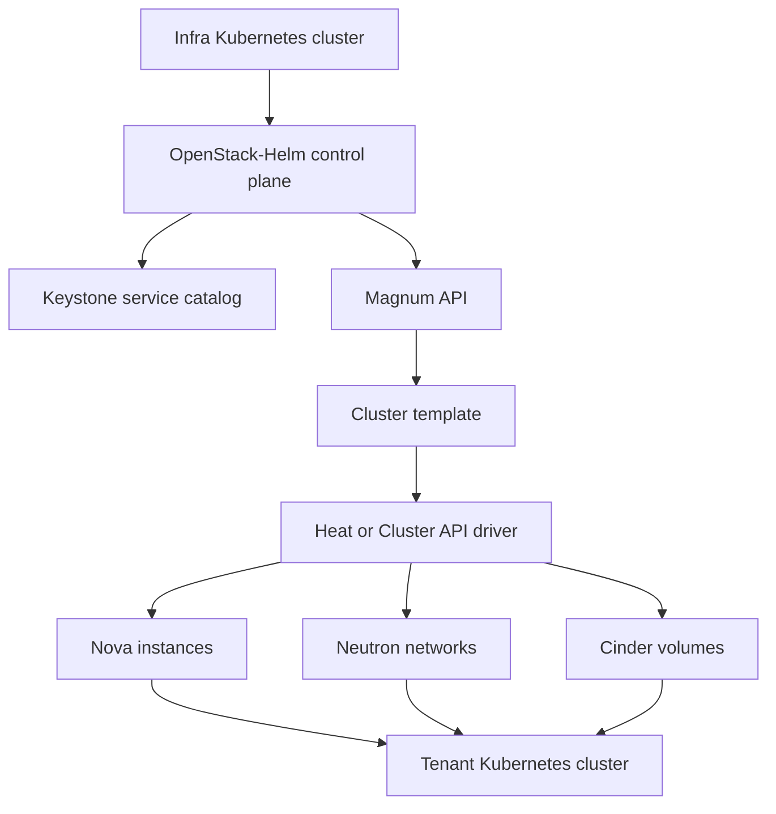
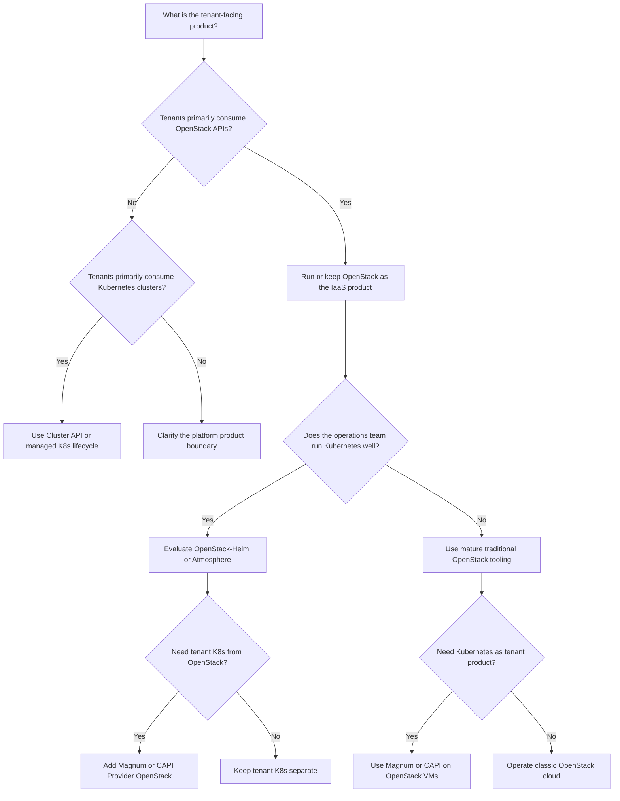

# Module 5.8: OpenStack on Kubernetes — Containerized Private Cloud Control Plane

> **Complexity**: `[COMPLEX]` | Time: 60-70 minutes
>
> **Prerequisites**: K8s basics, basic understanding of IaaS concepts, networking fundamentals helpful, and Module 5.1 Private Cloud Platforms recommended.

For command examples, this module uses `k` as a short alias for `kubectl`. Create it once in your shell with `alias k=kubectl` before running the hands-on work. All Kubernetes examples assume Kubernetes 1.35+ behavior unless a tool-specific command says otherwise.

---

## Learning Outcomes

After completing this module, you will be able to:

1. **Compare** OpenStack-on-Kubernetes and Kubernetes-on-OpenStack architectures and select the right direction for a private-cloud platform.
2. **Design** an OpenStack-Helm control plane that separates infra Kubernetes, OpenStack tenant APIs, storage, networking, identity, and tenant Kubernetes clusters.
3. **Evaluate** Ceph, OVN, Keystone, Magnum, Loci, and Atmosphere as parts of a production OpenStack-on-Kubernetes stack.
4. **Diagnose** common day-2 failures in MariaDB Galera, RabbitMQ, Neutron-OVN, Cinder, Glance, and Helm-managed OpenStack services.
5. **Implement** a minimal lab control plane on kind and inspect the Kubernetes pods, ConfigMaps, StatefulSets, Services, Ingresses, and PersistentVolumeClaims behind OpenStack APIs.

---

## Why This Module Matters

At 03:20 during a holiday sales event, Walmart's private cloud operators cannot treat the platform as a lab curiosity. The retail systems behind stores, supply-chain planning, internal developer platforms, and data services need compute capacity even when public cloud spend controls tighten. OpenStack is not an academic choice in that environment; it is the internal infrastructure product that has scaled beyond a million cores in public case-study material. The surprising part is not that OpenStack still runs at that scale.

The surprising part is that the operational center of gravity around private cloud has moved. For years, the default picture was simple: install OpenStack on bare metal, expose Nova, Neutron, Cinder, Glance, Keystone, and Horizon, then let teams create VMs. If a team wanted Kubernetes, it launched Kubernetes clusters on top of those VMs. OpenStack was the substrate.

Kubernetes was the tenant workload. In practice, that picture is no longer the only serious production design. Operators now run OpenStack's own control plane as Kubernetes workloads, so Keystone becomes pods.

Glance becomes pods. In turn, Nova API, scheduler, conductor, metadata, and placement become pods. Neutron server becomes pods, and Cinder API and scheduler become pods.

MariaDB Galera and RabbitMQ become StatefulSets. Ceph may be operated by Rook. OVN may serve both the infra Kubernetes cluster and OpenStack tenant networking. The architectural direction has inverted.

This module is about that inversion. You will learn why Kubernetes has become a credible lifecycle manager for non-Kubernetes services, how OpenStack-Helm expresses OpenStack as charts, how Loci and Atmosphere package the ecosystem, and when the older direction still wins. The goal is not to declare one architecture universally better. The goal is to recognize which layer should manage which lifecycle, then design a platform that does not confuse operators, tenants, storage teams, and network teams during the first serious incident.

---

## 1. The Architectural Inversion

Traditional OpenStack installations usually start from hosts. Operators install packages or containers onto controller nodes, network nodes, compute nodes, and storage nodes. Puppet, Ansible, Director, TripleO, OpenStack-Ansible, Kolla-Ansible, or vendor tooling lays down configuration files. Systemd units start services.

Journald records logs. Host networking is prepared with bridges, Open vSwitch, OVN, VLANs, provider networks, and sometimes SR-IOV or DPDK. The mental model is host-first. You choose the server role.

Then you place OpenStack services on that role. Then you run orchestration against that estate. Kubernetes changed the operator's expectations. It created a normal language for desired state, rolling updates, probes, pod disruption budgets, service discovery, secrets, config projection, health checks, horizontal scaling, storage claims, and event streams.

Those primitives were built for containers, but they are not limited to web applications. An OpenStack API service is also a long-running process with configuration, credentials, health endpoints, logs, dependencies, and restart behavior. That makes OpenStack a candidate for Kubernetes lifecycle management. The inversion looks like this:

```text
Traditional direction

  +----------------------------------------------------------+
  | OpenStack IaaS                                          |
  | Nova + Neutron + Cinder + Glance + Keystone + Horizon    |
  +-------------------------+--------------------------------+
                            |
                            v
  +----------------------------------------------------------+
  | Tenant Kubernetes clusters on OpenStack VMs              |
  | Magnum, Cluster API Provider OpenStack, or custom IaC    |
  +----------------------------------------------------------+


Inverted direction

  +----------------------------------------------------------+
  | Infra Kubernetes cluster                                 |
  | Helm + controllers + StatefulSets + Services + Ingress   |
  +-------------------------+--------------------------------+
                            |
                            v
  +----------------------------------------------------------+
  | OpenStack control plane as pods                          |
  | Keystone + Glance + Nova + Neutron + Cinder + Horizon    |
  +-------------------------+--------------------------------+
                            |
                            v
  +----------------------------------------------------------+
  | OpenStack tenant APIs                                    |
  | VMs + volumes + networks + images + optional Magnum K8s  |
  +----------------------------------------------------------+
```

This is more than a packaging choice. It changes the operational API. In a classic install, an operator might restart Keystone with `systemctl restart httpd` or re-run an Ansible role that renders Keystone configuration. In OpenStack-Helm, the same operator may inspect a ConfigMap, update chart values, run `helm upgrade`, and watch a Deployment rollout.

The service is still Keystone. The lifecycle manager is different. The same pattern applies across OpenStack services. Nova scheduler is a Kubernetes Deployment.

Nova conductor is a Deployment. Nova compute may be a DaemonSet on hypervisor nodes or managed outside the infra cluster depending on architecture. Neutron server is a Deployment. OVN components may run as StatefulSets or DaemonSets.

MariaDB and RabbitMQ are StatefulSets because identity, persistence, and ordered recovery matter. Memcached is simpler and can be treated as replaceable cache capacity. The reason this became practical is not one single breakthrough. Container images matured.

Helm became a standard packaging format. Kubernetes probes and rollouts became normal operational tools. CSI made storage integration a platform concern rather than a one-off host script. CNI made pod networking pluggable.

Operators became comfortable debugging pods, Services, Ingresses, StatefulSets, and PersistentVolumeClaims. The surrounding CNCF ecosystem made observability, GitOps, policy, and secret delivery composable. OpenStack itself also changed. Its services already had clear API boundaries.

Most control-plane components are stateless or externally stateful. State lives in MariaDB, RabbitMQ, Keystone tokens, image backends, block storage backends, and message queues. That makes many OpenStack services a good fit for Deployment-style lifecycle. The hard parts did not disappear.

They moved. In practice, instead of asking "which controller node owns this systemd unit?", the operator asks "which pod revision, Secret, ConfigMap, chart value, and database migration produced this service behavior?" Instead of logging into three controllers to compare files, the operator compares Helm releases and rendered Kubernetes objects.

Instead of handling every restart by hand, the operator uses Kubernetes rollout primitives. Pause and predict: if a Helm value changes the Keystone database connection string, what do you expect Kubernetes to restart, and what state should remain outside the pod? The right answer is that Keystone pods should roll so they consume the updated configuration, while the database itself remains a separate persistent service. If the database state lives inside ephemeral Keystone containers, the architecture is wrong.

The inversion also creates a naming trap. OpenStack-on-Kubernetes does not mean every OpenStack tenant workload becomes a pod. OpenStack still provides IaaS APIs. Tenants still create VMs, networks, volumes, images, routers, floating IPs, and security groups.

The control plane is containerized. In other words, the cloud product is still OpenStack. The opposite direction still exists and still matters. Kubernetes-on-OpenStack means OpenStack provides VMs and networks, and Kubernetes clusters run on top.

Magnum is OpenStack's Kubernetes-as-a-service project. Cluster API Provider OpenStack is another common route. Both directions can coexist in the same platform. That coexistence is the main architectural lesson.

An infra Kubernetes cluster may run OpenStack's control plane. OpenStack may then expose Magnum. Magnum may create tenant Kubernetes clusters on Nova instances. Those tenant clusters are not the same cluster as the infra Kubernetes cluster.

Treating them as the same failure domain is a serious design mistake. The infra cluster is a platform operations cluster. Tenant clusters are user products. They have different RBAC, upgrades, storage classes, network policies, blast radius, monitoring, and backup rules.

In a mature platform, the phrase "Kubernetes manages OpenStack" and the phrase "OpenStack sells Kubernetes" can both be true. They describe different layers.

---

## 2. OpenStack-Helm Reference Architecture

OpenStack-Helm is the reference project for deploying OpenStack and related infrastructure services onto Kubernetes with Helm charts. The project provides charts for OpenStack services and charts for supporting components. OpenStack charts include Keystone, Glance, Nova, Neutron, Cinder, Heat, Horizon, Barbican, Octavia, Designate, Placement, and related jobs. Infrastructure charts include MariaDB, RabbitMQ, Memcached, Ingress, Ceph adapters, and other dependencies used by the control plane.

Each chart owns a service boundary, and that boundary matters because OpenStack is not a single binary. It is a distributed system of APIs, workers, schedulers, conductors, agents, databases, queues, caches, and storage backends. OpenStack-Helm expresses those boundaries as Kubernetes objects.

An API service usually becomes a Deployment fronted by a Service and Ingress. A database becomes a StatefulSet with persistent volume claims. A bootstrap action becomes a Kubernetes Job. Configuration becomes ConfigMaps and Secrets.

Policy files, paste pipelines, WSGI settings, and oslo.config values are rendered from Helm templates. The reference architecture starts with an infra Kubernetes cluster. That cluster is not a tenant cluster.

It is dedicated to platform services. It should have its own etcd, its own API server, its own CNI, its own storage classes, and its own operational access policy. Tenant Kubernetes clusters created later by Magnum, Cluster API, or Terraform should not run the OpenStack control plane that sells them capacity. That separation prevents a tenant cluster failure from becoming a private cloud control-plane failure.

The physical shape often looks like this:

```text
                     +------------------------------------+
                     | Platform operators                 |
                     | k + helm + openstack client        |
                     +-----------------+------------------+
                                       |
                                       v
+------------------------------------------------------------------+
| Infra Kubernetes cluster                                          |
|                                                                  |
|  +----------------+   +----------------+   +----------------+    |
|  | Keystone pods  |   | Glance pods    |   | Horizon pods   |    |
|  +-------+--------+   +-------+--------+   +-------+--------+    |
|          |                    |                    |             |
|  +-------v--------+   +-------v--------+   +-------v--------+    |
|  | Nova services  |   | Neutron API    |   | Cinder API     |    |
|  +-------+--------+   +-------+--------+   +-------+--------+    |
|          |                    |                    |             |
|  +-------v--------------------v--------------------v--------+    |
|  | MariaDB Galera + RabbitMQ + Memcached + Ingress          |    |
|  +-------+--------------------+--------------------+--------+    |
|          |                    |                    |             |
|  +-------v--------+   +-------v--------+   +-------v--------+    |
|  | Rook/Ceph      |   | OVN-Kubernetes |   | Monitoring     |    |
|  +----------------+   +----------------+   +----------------+    |
+------------------------------------------------------------------+
                                       |
                                       v
+------------------------------------------------------------------+
| OpenStack tenant plane                                            |
| Nova compute hosts + Neutron provider networks + Cinder backends  |
| Optional Magnum-created tenant Kubernetes clusters                |
+------------------------------------------------------------------+
```

The dependency graph is important. Keystone needs database access. Glance needs Keystone for identity and its own storage backend. Cinder needs Keystone, MariaDB, RabbitMQ, and a volume backend.

Nova needs Keystone, Placement, MariaDB, RabbitMQ, Neutron, Glance, and a compute layer. Neutron needs Keystone, MariaDB, RabbitMQ, and the chosen SDN backend. Horizon needs Keystone and service catalog entries. Octavia needs Keystone, Neutron, certificates, images, and amphora or provider-driver resources.

Heat needs Keystone, MariaDB, RabbitMQ, and access to the APIs it orchestrates. Designate needs Keystone, MariaDB, RabbitMQ, and DNS backend integration. Barbican needs Keystone, MariaDB, and a secret backend. This dependency graph shapes installation order and upgrade order.

You do not install Horizon first and expect it to discover a cloud. You build the identity, database, queue, cache, endpoint, image, network, compute, storage, and dashboard layers in an order that lets each service register itself. OpenStack-Helm usually uses Helm hooks and bootstrap jobs for service registration, database sync, endpoint creation, and user creation. Those jobs are as important as the long-running pods.

When a deployment fails, check Jobs and init containers before assuming the service binary is broken. MariaDB runs as a Galera cluster in the Kubernetes world. The Kubernetes object is a StatefulSet because each database member needs stable identity and persistent storage. A PodDisruptionBudget protects quorum during voluntary disruptions.

That does not make Galera magically simple. It means Kubernetes can express the placement and disruption rules. Operators still need a Galera recovery runbook for total cluster outage, split-brain symptoms, failed state snapshot transfer, and stale persistent volumes. RabbitMQ also runs as a StatefulSet because identity and persistent queue metadata matter.

OpenStack services rely heavily on RabbitMQ for RPC and notification paths. If RabbitMQ partitions, Nova, Cinder, Neutron, and Heat can look broken even when their API pods are healthy. Kubernetes may report every RabbitMQ pod as Running while the cluster is logically partitioned. That is why operational probes must include RabbitMQ cluster status, not just pod phase.

Day-2 operations become Kubernetes-native, but the commands still need OpenStack context behind them. A first Keystone inspection should confirm which pods exist, what the Deployment believes, and whether logs show identity, database, endpoint, or policy errors:

```bash
k -n openstack get pods -l application=keystone
k -n openstack logs deploy/keystone-api
k -n openstack describe deploy keystone-api
```

After a Secret or ConfigMap change, restart the affected Deployment deliberately and wait for the rollout instead of deleting random pods. That habit keeps the action auditable and exposes failed replacements quickly:

```bash
k -n openstack rollout restart deploy/keystone-api
k -n openstack rollout status deploy/keystone-api
```

When the question is what Helm actually installed, inspect the release history, values, and rendered manifest before changing the cluster again. Those artifacts connect the live Kubernetes objects back to chart intent:

```bash
helm -n openstack list
helm -n openstack history keystone
helm -n openstack get values keystone
helm -n openstack get manifest keystone | less
```

Those commands are ordinary Kubernetes operations. The content behind them is OpenStack-specific. This is why an OpenStack-on-Kubernetes team needs both skill sets. A pure Kubernetes operator may understand rollouts but miss Nova cell mapping.

A pure OpenStack operator may understand service catalog errors but miss that a pod never mounted a Secret. The strongest teams build shared runbooks that cross both APIs. Service endpoints are published through Kubernetes Services and Ingress. Internally, Keystone, Glance, Cinder, Neutron, Nova, and Horizon communicate through cluster DNS names and Services.

Externally, tenants reach public endpoints through Ingress, load balancers, or provider network addresses. The OpenStack service catalog must match those externally reachable URLs. If the service catalog points tenants to names that only resolve inside the infra cluster, the cloud appears broken from outside even when every pod is healthy. Before running a Helm upgrade, what output do you expect from `openstack endpoint list`, `k -n openstack get ingress`, and `k -n openstack get svc`?

If those three views disagree, the upgrade may be technically successful but tenant-visible behavior may still fail. The upgrade story is one of the main reasons teams look at OpenStack-Helm. In a classic host-based install, upgrades often involve coordinated Ansible or Puppet runs, package repository changes, database migrations, service restarts, compute-service version pinning, and evacuation planning. In OpenStack-Helm, the operator can render chart changes, review diffs, apply `helm upgrade`, and let Kubernetes roll Deployments.

That is a cleaner lifecycle boundary. It is not an automatic guarantee. OpenStack still has database migrations, RPC version compatibility, Nova upgrade levels, Neutron agent compatibility, and storage backend constraints. Helm gives the operator a better tool for applying desired state.

It does not remove the need to read release notes and test the upgrade path. The most useful practical habit is to treat chart rendering as a preflight artifact. Render the chart with your values. Diff the Kubernetes objects.

Check which Deployments, StatefulSets, Jobs, Secrets, and ConfigMaps will change. Then upgrade in a maintenance window that matches the service risk.

```bash
helm template keystone openstack-helm/keystone \
  --namespace openstack \
  --values ./values/keystone-kind.yaml > /tmp/keystone-rendered.yaml

helm upgrade --install keystone openstack-helm/keystone \
  --namespace openstack \
  --values ./values/keystone-kind.yaml

k -n openstack rollout status deploy/keystone-api
```

The command sequence is short, but the engineering judgment around it is the real work. A disciplined operator treats rendered manifests, migration behavior, rollout status, endpoint checks, and rollback limits as one upgrade decision rather than as separate rituals.

---

## 3. Loci, Atmosphere, and the Packaging Layer

OpenStack-Helm describes how to deploy services. Loci describes how to build lightweight OpenStack container images. That distinction matters. The chart is the deployment shape.

The image is the runnable payload. If a team treats images as an afterthought, it may end up with inconsistent Python dependencies, mismatched OpenStack release versions, unexpected package sources, and bloated attack surface. Loci exists to make OpenStack images minimal and repeatable. It builds project-specific container images such as Keystone, Nova, Neutron, Glance, Cinder, Horizon, and supporting services from OpenStack source and base image choices.

The style is close to a distroless mindset: keep the runtime image focused on what the service needs, and avoid turning every container into a full general-purpose host. That design aligns with OpenStack-Helm. Helm charts can reference consistent images. Operators can pin tags.

Security teams can scan smaller images. Release teams can build the same service images for test, staging, and production. Loci does not solve architecture. It solves packaging discipline.

That discipline is valuable because OpenStack services are Python applications with many dependencies. A mismatch between chart expectations and image contents can show up as a missing WSGI entry point, a failed database migration, an oslo.config option error, or a service plugin import failure. When debugging OpenStack-on-Kubernetes, always record both the chart version and image tag.

Atmosphere is a higher-level distribution from VEXXHOST. It combines a production opinion set around Kubernetes, OpenStack-Helm, Loci-built images, Rook or Ceph integration patterns, OVN, and operational automation. The important part is not the brand name. The important part is that a full private cloud is larger than a folder of Helm charts.

A production platform needs host preparation, Kubernetes lifecycle, storage lifecycle, network design, TLS, DNS, secrets, image builds, release compatibility, monitoring, backup, and day-2 procedures. Atmosphere is valuable because it packages those decisions into an opinionated reference architecture that people actually run. OpenStack-Helm standalone gives maximum control. The team owns every chart value, every image tag, every storage integration, every network integration, and every upgrade plan.

That is attractive for platform teams with strong OpenStack and Kubernetes skills. It is painful for teams that mainly want a working private cloud product. Atmosphere narrows the decision space. It gives a more batteries-included path, including a quickstart that expects real infrastructure for the full experience.

That tradeoff is familiar. Kubernetes itself can be installed with kubeadm, Cluster API, Talos, RKE2, kOps, managed cloud services, or vendor distributions. The lower-level tool offers control. The distribution offers an integrated path.

OpenStack-on-Kubernetes has the same spectrum, and the right point on it depends on whether the team values direct control, integrated defaults, vendor support, or reduced local design burden most.

| Choice | Best Fit | Tradeoff |
|---|---|---|
| OpenStack-Helm standalone | Teams that need direct chart control and already understand OpenStack internals | More integration work and more local decisions |
| Loci images with custom charts | Teams standardizing image supply chain separately from deployment tooling | Requires image build, test, and compatibility discipline |
| Atmosphere | Teams wanting a production-shaped OpenStack-on-Kubernetes distribution with Ceph and OVN opinions | Less freedom to invent every integration detail |
| Classic Ansible or director workflow | Teams with mature host-based OpenStack operations | Less Kubernetes-native day-2 lifecycle |

The packaging layer also affects incident response. If a Keystone pod fails after an upgrade, the operator should ask four questions. Which chart version rendered this Deployment? Which image tag is running?

Which ConfigMap and Secret were mounted? Which database migration job ran before the pod restarted? Those questions cross Helm, Kubernetes, image build, and OpenStack release boundaries. That is the cost and power of the inversion.

The platform is more observable through Kubernetes. It is also easier to forget that a pod image still contains a complex OpenStack service with its own release lifecycle.

---

## 4. Storage Backends: Ceph as the Unifying Layer

OpenStack needs storage in several different forms. Cinder needs block volumes. Nova may need ephemeral disk storage for VM instances. Glance needs image storage.

Manila needs shared file systems. Swift traditionally supplies object storage, but Ceph RGW is often used instead in modern private-cloud designs. Kubernetes also needs storage. Pods need PersistentVolumes.

Databases need durable volumes. RabbitMQ needs durable identity. Monitoring systems need time-series storage. The obvious mistake is to build a separate storage platform for every layer.

One SAN for OpenStack volumes. One NFS system for Kubernetes. One object store for images. One shared file store for Manila.

One local disk convention for Nova. That path creates operational silos and inconsistent failure behavior. Ceph is popular in OpenStack-on-Kubernetes designs because it can serve all of those roles from one distributed storage system. RBD provides block devices.

RGW provides S3-compatible object storage. CephFS provides a shared filesystem. The Ceph CSI drivers provide Kubernetes PersistentVolumes. The same cluster can back Cinder, Nova, Glance, Manila, RGW, and Kubernetes storage classes.

The architecture looks like this when Ceph is treated as a shared substrate rather than as a single-purpose backend. Each consumer reaches the same storage system through the interface that matches its workload:

```text
                         +---------------------------+
                         | Ceph cluster              |
                         | MON + MGR + OSD + pools   |
                         +-------------+-------------+
                                       |
       +-------------------------------+-------------------------------+
       |                               |                               |
       v                               v                               v
+--------------+              +----------------+              +----------------+
| OpenStack    |              | OpenStack      |              | Kubernetes     |
| Cinder RBD   |              | Glance images  |              | RBD CSI PVs    |
+------+-------+              +-------+--------+              +-------+--------+
       |                              |                               |
       v                              v                               v
+--------------+              +----------------+              +----------------+
| Nova disks   |              | RGW object API |              | MariaDB PVCs   |
| optional RBD |              | Swift-like use |              | RabbitMQ PVCs  |
+--------------+              +----------------+              +----------------+
```

Rook-Ceph brings Ceph lifecycle into Kubernetes. The Rook operator manages Ceph custom resources, monitors, managers, OSDs, pools, filesystems, object stores, and CSI integration. For an infra Kubernetes cluster, that is attractive because the storage system becomes visible through Kubernetes APIs. Operators can inspect Ceph custom resources with `k`.

They can use Kubernetes scheduling and health primitives around Ceph daemons. They can integrate storage provisioning with Kubernetes StorageClasses. That does not mean every OpenStack-on-Kubernetes platform should run Ceph inside the same infra cluster. Rook is excellent when the team wants Kubernetes-native Ceph lifecycle and can dedicate suitable nodes and disks.

Standalone Ceph is often better when a storage team already operates Ceph as a separate service, when the storage cluster spans non-Kubernetes consumers, or when strict failure-domain separation matters. The choice is not "modern" versus "old". The choice is lifecycle ownership. If Kubernetes owns Ceph lifecycle, Rook is a strong fit.

If a storage organization owns Ceph lifecycle independently, OpenStack-Helm can consume that external Ceph cluster. Ceph pool design is the production detail learners often skip. Do not put every workload in one pool and hope performance isolation appears. Cinder volumes, Glance images, Nova ephemeral disks, RGW buckets, CephFS metadata, and Kubernetes PVCs have different IO patterns.

Cinder may have random writes from databases. Glance image storage is often large sequential reads and writes. Nova ephemeral disks may spike during boot storms. Kubernetes PVCs vary wildly.

RGW has object workload behavior. CephFS metadata can be sensitive to namespace-heavy activity. CRUSH maps and pool rules give you a way to place data across failure domains. A CRUSH rule can target device classes such as SSD or HDD.

It can respect host, rack, room, or site boundaries. It can let you separate latency-sensitive volumes from bulk image storage. Pool quotas and placement groups help prevent one workload family from consuming the entire cluster. Ceph is unified storage.

It is not one magic pool, and treating it that way hides the performance and blast-radius decisions that production clouds must make explicitly. A simple production-shaped pool plan might look like this:

| Use Case | Ceph Interface | Example Pool | Isolation Goal |
|---|---|---|---|
| Cinder volumes | RBD | `volumes` | Tenant block IO and snapshots |
| Nova ephemeral disks | RBD | `vms` | Boot and instance disk churn |
| Glance images | RBD or RGW | `images` | Image upload and boot-read load |
| Object storage | RGW | `objects.rgw.*` | S3-style object workloads |
| Manila shares | CephFS | `cephfs_data`, `cephfs_metadata` | Shared filesystem behavior |
| Kubernetes PVs | RBD CSI | `k8s-pv` | Infra workload persistence |

High-IOPS workloads need explicit tuning. RBD cache settings, BlueStore device layout, WAL and DB devices, network MTU, replication size, erasure coding choices, object size, and client concurrency can all dominate real performance. If a Cinder volume performs badly, do not start by blaming Cinder. Trace the path.

Trace the request from the VM filesystem into QEMU, from QEMU into librbd, from librbd through Ceph monitors and OSDs, and from the OSDs down to the actual disks and networks. That full path is where most storage truth lives.

Disks back through the same path. Kubernetes added another lifecycle layer for the control plane, but the data path still needs storage engineering. Before running a production Cinder benchmark, what do you expect from `ceph -s`, `ceph osd df tree`, `rbd perf image iostat`, and Cinder scheduler logs? If those views disagree, the benchmark is measuring confusion rather than storage capability.

---

## 5. Networking: OVN-Kubernetes and Neutron-OVN Convergence

Networking is where the inversion becomes hardest to reason about. The infra Kubernetes cluster needs pod networking. OpenStack tenants need virtual networks, routers, security groups, provider networks, floating IPs, and external connectivity. Those are different planes.

They may both use OVN. That is useful. It is also a common source of wrong assumptions. OVN-Kubernetes is a Kubernetes CNI implementation.

It uses Open Virtual Network to provide pod networking, Services, NetworkPolicy behavior, and node integration for Kubernetes clusters. In this module, OVN-Kubernetes is responsible for the infra cluster where OpenStack control-plane pods run. Neutron with the OVN ML2 driver is OpenStack's SDN path. It uses Neutron APIs to create logical switches, routers, ports, security groups, provider networks, and floating IP behavior for OpenStack tenants.

In this module, Neutron-OVN is responsible for OpenStack tenant networks. The convergence opportunity is that both systems speak OVN concepts. They can share operational knowledge and sometimes control-plane components. The OVN northbound database stores desired logical network state.

The OVN southbound database stores the physical realization plan. `ovn-northd` translates northbound intent into southbound data. OVS and OVN controllers on nodes program local forwarding. The conceptual model is shared even when the objects belong to different platform layers.

Here is the mental map that keeps those two OVN uses separate. The technology vocabulary overlaps, but the owners, objects, failure domains, and packet paths are different:

```text
+----------------------------+       +------------------------------+
| Infra Kubernetes layer      |       | OpenStack tenant layer        |
| OVN-Kubernetes CNI          |       | Neutron ML2/OVN               |
| Pods, Services, policies    |       | Networks, routers, ports      |
+-------------+--------------+       +---------------+--------------+
              |                                      |
              v                                      v
      +----------------+                    +----------------+
      | OVN northbound |                    | OVN northbound |
      | desired state  |                    | desired state  |
      +-------+--------+                    +-------+--------+
              |                                     |
              v                                     v
      +----------------+                    +----------------+
      | OVN southbound |                    | OVN southbound |
      | physical plan  |                    | physical plan  |
      +-------+--------+                    +-------+--------+
              |                                     |
              v                                     v
      +----------------+                    +----------------+
      | OVS on K8s     |                    | OVS on compute |
      | infra nodes    |                    | and gateways   |
      +----------------+                    +----------------+
```

In small labs, teams often keep the OVN databases separate. That makes boundaries easier. In advanced production designs, teams may consolidate or tightly coordinate OVN operations so one SDN control-plane practice serves both Kubernetes and OpenStack. The benefit is operational convergence.

The risk is blast radius. If one OVN database issue can affect both pod networking and tenant VM networking, the incident scope is larger. Convergence must be designed, not assumed. Neutron-OVN alongside OVN-Kubernetes needs careful interface planning.

The infra cluster CNI chooses its pod CIDRs, service CIDRs, node overlay settings, and gateway behavior. Neutron chooses tenant overlay networks, provider networks, VLAN ranges, Geneve or VXLAN encapsulation, logical router behavior, and external gateway nodes. Provider networks must map to physical NICs and bridges on the right hosts. Tenant overlays must not collide with pod overlays.

Tunnel IDs must stay within expected ranges. Encapsulation ports must not be blocked. MTU must account for overlay overhead. VLAN tags must be reserved and documented.

External network bridging must be deliberate because it is the point where tenant intent meets the physical fabric. A practical Neutron-OVN configuration has these concerns, and every illustrative value needs review against the real network:

```ini
[ml2]
type_drivers = geneve,vlan,flat
tenant_network_types = geneve
mechanism_drivers = ovn
extension_drivers = port_security

[ml2_type_geneve]
vni_ranges = 1001:200000
max_header_size = 38

[ml2_type_vlan]
network_vlan_ranges = physnet1:100:3999

[ovn]
ovn_nb_connection = tcp:ovn-nb.openstack.svc.cluster.local:6641
ovn_sb_connection = tcp:ovn-sb.openstack.svc.cluster.local:6642
ovn_l3_scheduler = leastloaded
enable_distributed_floating_ip = true
```

Those values are illustrative. The real values must match your fabric. If the network team uses VLAN 120 for storage and Neutron is allowed to hand VLAN 120 to tenants, the cloud will create its own outage. If OVN-Kubernetes and Neutron both try to own the same bridge mappings, debugging becomes painful.

If MTU is wrong, small pings pass while real application traffic fragments or stalls. The main gotchas are predictable. VLAN tagging must match switch trunks and Neutron provider network definitions. VXLAN or Geneve encapsulation must fit through firewalls and MTU.

Tunnel ID ranges must not overlap unexpectedly between SDN domains. Gateway nodes must have the right physical connectivity. DVR-style distributed routing changes where traffic exits. Centralized routing is simpler to reason about but can bottleneck.

External network bridges must not accidentally expose infra cluster control-plane traffic to tenant networks. The runbook should include both Kubernetes and OVN views:

```bash
k -n ovn-kubernetes get pods
k -n openstack get pods -l application=neutron
k -n openstack logs deploy/neutron-server
ovn-nbctl show
ovn-sbctl show
openstack network list
openstack subnet list
openstack router list
```

The habit is simple. When pod-to-pod traffic fails, start with the infra cluster CNI. When VM-to-VM or VM-to-external traffic fails, start with Neutron-OVN. When OpenStack control-plane pods cannot reach databases, queues, or service endpoints, investigate Kubernetes networking first.

When Nova instances cannot reach provider networks, investigate Neutron, OVN, bridges, gateways, VLANs, and fabric state. Do not debug every packet as if it belongs to the same plane.

---

## 6. Magnum and the Inverse Pattern

The inversion does not retire Kubernetes-on-OpenStack. It makes the distinction sharper. Magnum is OpenStack's container infrastructure management service. Its purpose is to expose Kubernetes clusters as an OpenStack-managed product.

A tenant uses OpenStack APIs to request a cluster. OpenStack authenticates the tenant through Keystone. Magnum validates the request against a cluster template. The underlying driver provisions infrastructure and bootstraps Kubernetes.

Historically, Magnum commonly used Heat templates. Heat creates Nova instances, Neutron networks, security groups, load balancers, and other resources. Cloud-init and bootstrap scripts configure Kubernetes on those instances. That model fits OpenStack's orchestration heritage.

It also means cluster lifecycle depends heavily on Heat stacks, images, templates, and guest bootstrap behavior. The newer direction is integration with Cluster API. Cluster API expresses Kubernetes cluster lifecycle as Kubernetes custom resources. Cluster API Provider OpenStack knows how to create and manage OpenStack infrastructure for those clusters.

Magnum can become an OpenStack API front door that delegates cluster lifecycle to a CAPI-based management cluster. This is closer to the Kubernetes ecosystem's current lifecycle pattern. The key question is not "Is Magnum old?" The key question is "Who is the customer?"

Magnum is compelling when the customer is an OpenStack tenant. The tenant already has a Keystone project. The tenant already has quotas. The tenant already uses OpenStack networks, images, flavors, volumes, security groups, and billing or chargeback.

The platform wants to offer Kubernetes as another product in the OpenStack catalog. The tenant should not need direct access to the infra Kubernetes cluster. That is the service-provider pattern. Cluster templates are the product definition.

A template can constrain Kubernetes version, image, external network, flavor, master count, node count, volume size, CNI, labels, load balancer settings, and driver-specific options. Templates are how a platform team prevents every tenant from inventing a new cluster shape. If templates are too loose, support becomes chaos. If templates are too rigid, tenants bypass the product.

Magnum is less attractive when the platform team only needs internal Kubernetes clusters on bare metal and does not need OpenStack tenant semantics. In that case, Cluster API with Metal3, bare-metal automation, or another Kubernetes lifecycle manager may be more direct. Use Magnum when OpenStack identity, quota, project isolation, billing, and tenant-facing APIs are the product boundary. Use direct Cluster API when Kubernetes lifecycle is the product and OpenStack is not the tenant interface.

The coexistence diagram looks strange at first because Kubernetes appears twice, once as an operations substrate and once as a tenant product. That layering is common in mature private clouds:



This diagram has two Kubernetes layers. The top layer is the infra cluster that runs OpenStack services. The bottom layer is a tenant cluster created through OpenStack. They should not share administrator credentials.

They should not share upgrade windows by accident. They should not share node pools. They may share identity and observability integrations, but only through designed interfaces. The strongest reason to keep Magnum in the architecture is organizational.

A service provider, university, research lab, telecom, or enterprise private cloud team may already have thousands of OpenStack users. Those users know how to request quotas, networks, floating IPs, and volumes. The platform team can expose Kubernetes without creating a second, unrelated access model. That is still valuable even when the OpenStack control plane itself runs on Kubernetes.

---

## 7. Identity Integration

Identity is the part of the stack that prevents the platform from becoming two clouds with one logo. OpenStack uses Keystone. Keystone authenticates users, projects, domains, roles, service users, application credentials, and federated identities. Every OpenStack service trusts Keystone tokens and policy.

Kubernetes uses its own authentication and authorization path. The API server authenticates users through certificates, bearer tokens, OIDC, webhook authenticators, or other configured methods. Authorization commonly uses RBAC. ServiceAccounts represent in-cluster workload identity.

Running OpenStack on Kubernetes does not automatically unify those identity systems. Keystone service users are not Kubernetes ServiceAccounts. A Keystone project is not a Kubernetes namespace. A Kubernetes RoleBinding is not an OpenStack role assignment.

The platform must choose where identities map and where they remain separate. For operators, one useful pattern is federated login. Users authenticate to an enterprise identity provider. Keystone trusts that provider through federation.

Kubernetes trusts an OIDC issuer that is connected to the same identity source. Dex, Keystone auth integrations, or another OIDC bridge can let the Kubernetes API server accept identities aligned with Keystone users or groups. The user gets one login flow. The authorization rules remain separate and explicit.

That is the important distinction. One login does not mean one permission model. OpenStack policy decides whether a user can create a volume in a project. Kubernetes RBAC decides whether a user can restart a Keystone pod in the infra cluster.

Those should almost never be granted to the same broad audience. Application credentials in Keystone are important for automation. They are long-lived service principals scoped to a user and project. They allow automation to call OpenStack APIs without storing a user's password.

For tenant workloads, application credentials are often better than shared user accounts. For platform services, Keystone service users and Kubernetes Secrets are usually used together. A Cinder service pod may receive a Secret containing credentials it uses to register with Keystone or call another API. That Secret is mounted or injected into the pod by Kubernetes.

The credential itself belongs to Keystone's identity model. Barbican is OpenStack's secret management service. It can store keys, certificates, and secret material for OpenStack workflows. Kubernetes has Secrets, but they are not the same product.

In production, teams often integrate external secret tooling so Kubernetes workloads can consume secrets from a central secret backend. That can include Barbican-backed flows, external-secrets patterns, Vault, cloud KMS equivalents, or enterprise secret stores. The design question is not "Which Secret object is easiest?" The design question is "Which system is authoritative for this class of secret, and how is access audited?"

A clean identity map makes those boundaries explicit before an incident forces the discussion. Use it to decide which system owns each actor, permission, credential, and audit trail:

| Identity Object | Lives In | Typical Use | Do Not Confuse With |
|---|---|---|---|
| Keystone user | OpenStack | Human or service actor for OpenStack APIs | Kubernetes user identity |
| Keystone project | OpenStack | Tenant isolation, quotas, role assignments | Kubernetes namespace |
| Keystone application credential | OpenStack | Automation calling OpenStack APIs | Kubernetes ServiceAccount token |
| Kubernetes ServiceAccount | Kubernetes | Pod identity inside a cluster | Keystone service user |
| Kubernetes RoleBinding | Kubernetes | API authorization in a namespace | OpenStack role assignment |
| Barbican secret | OpenStack | OpenStack-managed secret material | Plain Kubernetes Secret |

Identity mistakes are expensive because they often look like service failures. A Glance upload may fail because the endpoint is wrong. It may also fail because the token scope is wrong. A Magnum cluster create may fail because Heat cannot create a stack.

It may also fail because the trustee or application credential path is misconfigured. A Kubernetes operator may fail to view pods. It may be an RBAC issue, not a pod issue. During incidents, always identify the request identity, token scope, policy file, service account, and API target.

That practice prevents teams from debugging networking when the actual problem is authorization, and it also keeps emergency fixes focused on the policy or token path that actually failed.

---

## 8. OpenStack-on-Kubernetes vs Traditional Install

The central fork is not ideology. It is operating model. OpenStack-Helm is attractive when the team wants Kubernetes-native lifecycle management for OpenStack control-plane services. Traditional installation is attractive when the team already has mature OpenStack operations around host roles, Ansible, Puppet, packages, and vendor-supported workflows.

Both can run production clouds. Both can fail badly when chosen for the wrong team. The decision matrix below is intentionally practical. It focuses on the friction operators feel during upgrades, incidents, scaling, and staff onboarding.

| Dimension | OpenStack-Helm / OpenStack-on-K8s | Traditional Host-Based OpenStack | Main Question |
|---|---|---|---|
| Control-plane lifecycle | Helm releases, Kubernetes rollouts, ConfigMaps, Secrets, Jobs | Ansible, Puppet, packages, containers, systemd | Which lifecycle API does the team trust most? |
| Upgrade mechanics | Render chart, review diff, run `helm upgrade`, watch rollouts and jobs | Coordinate playbooks, package repos, services, migrations | Which upgrade process has stronger local testing? |
| Day-2 restart model | `k rollout restart`, pod replacement, probes | `systemctl`, container restart, playbook re-run | Who owns restart safety and sequencing? |
| Debugging surface | `k logs`, events, pod status, Helm history, OpenStack logs | Journald, host files, service status, Ansible output | Which surface can the on-call team navigate at 03:00? |
| Scaling API services | Increase replicas for stateless APIs where supported | Add controller capacity or service workers | Are bottlenecks stateless APIs, DB, MQ, or backend services? |
| Stateful dependencies | MariaDB and RabbitMQ as StatefulSets | Databases and queues on controller hosts or external clusters | Does Kubernetes own stateful lifecycle? |
| Hardware assumptions | Requires a reliable infra Kubernetes cluster first | Requires prepared controller, network, compute, storage hosts | Which foundation is already mature? |
| Team skill set | Strong Kubernetes, Helm, GitOps, OpenStack internals | Strong OpenStack, Linux, Ansible/Puppet, host networking | Which knowledge is actually on call? |
| Community direction | K8s operator and Helm patterns are growing | Some older director patterns are in maintenance or vendor-specific paths | Which ecosystem path fits the next five years? |
| Failure isolation | Infra cluster failure can affect OpenStack APIs | Controller host failure affects OpenStack APIs | Which failure domain is easier to protect? |

The debugging difference is worth dwelling on. In a traditional install, a Keystone failure might send you to Apache logs, systemd status, package versions, rendered config files, database connectivity, and HAProxy state. In OpenStack-Helm, the same failure might send you to pod logs, Deployment status, ConfigMap mounts, Secret values, Ingress rules, Service endpoints, and Helm release history. The OpenStack problem is similar.

The operational lens changes. Do not underestimate the cost of that lens change. A team that cannot debug Kubernetes should not put the OpenStack control plane on Kubernetes just because it sounds modern. A team that cannot debug OpenStack should not expect Kubernetes to hide OpenStack complexity.

OpenStack-on-Kubernetes requires both. Traditional installs are not automatically simpler. They can accumulate years of host drift, hand patches, snowflake controller nodes, hidden playbook assumptions, and fear around upgrades. OpenStack-Helm can reduce host drift because desired state is rendered as Kubernetes objects.

But charts can drift too. Values files can become a second codebase. Image tags can lag behind chart expectations. Local overrides can make upstream upgrades difficult.

The practical rule is this: Choose OpenStack-Helm when Kubernetes is already the platform control plane your team operates well. Choose traditional installation when your OpenStack host-based operations are mature, supported, and easier for your organization to reason about. Choose Atmosphere or another integrated distribution when you want the Kubernetes-based model but need a production-shaped path rather than assembling every piece from first principles. Choose Magnum or Cluster API Provider OpenStack when the problem is tenant Kubernetes lifecycle on top of OpenStack, not OpenStack control-plane lifecycle.

---

## 9. Production Realities

Large operators keep OpenStack relevant because private cloud solves problems public cloud does not always solve economically or organizationally. CERN is one of the most visible examples in scientific computing. Its OpenStack and Kubernetes fleet supports research workloads at a scale where quota, automation, bare metal, storage, and identity integration matter. CERN has publicly discussed long-running OpenStack operations, Kubernetes integration, repeated upgrades, and a broad service portfolio.

It is also associated with OpenStack-Helm usage in the containerized control-plane movement since 2020. The lesson from CERN is not "copy their exact architecture." The lesson is that OpenStack and Kubernetes can coexist at serious scale when teams invest in lifecycle, automation, and platform boundaries. Walmart is another production signal.

Public OpenInfra material describes Walmart's OpenStack private cloud as exceeding one million cores. That scale changes the discussion. At small scale, OpenStack can look like a complicated way to run a few VMs. At large scale, it becomes a programmable infrastructure product with quota, tenancy, image catalogs, network APIs, automation, and cost control.

The question becomes how to operate the control plane predictably. That is where Kubernetes-native lifecycle becomes attractive. AT&T's Airship and Akraino work helped push the idea that telecom and edge clouds need declarative, Kubernetes-based deployment of cloud infrastructure. Airship's original focus included OpenStack on Kubernetes and lifecycle management for network clouds.

Akraino explored edge blueprints that combined Kubernetes, OpenStack, and related infrastructure. The exact projects and implementations have evolved, but the direction was clear: operators wanted declarative infrastructure platforms, not hand-built controller farms. Production pitfalls cluster around a few areas. The first is storage performance.

Ceph can back many use cases, but it must be engineered. RBD cache settings, BlueStore layout, network design, OSD count, replication, erasure coding, placement groups, and disk classes affect VM performance. High-IOPS Cinder volumes need benchmarks that match real tenant behavior. Do not benchmark only empty volumes on quiet clusters and call the design complete.

The second is Neutron-OVN topology. Gateway nodes need physical network access. Distributed routing changes the failure and inspection points. Centralized routing is easier to observe but can become a choke point.

External bridges must be mapped carefully. Provider networks must match switch configuration. Floating IP behavior must be tested during node maintenance, gateway failure, and OVN database failover. The third is Helm chart drift.

OpenStack releases, chart branches, image tags, and local values must move together. If charts expect one config option and images contain another release, the result may fail at runtime. If local values override half the chart, upstream upgrades become archaeology. Keep a version matrix.

Render charts in CI. Diff manifests before upgrades. Test database migrations before production windows. The fourth is MariaDB Galera recovery.

Kubernetes can restart pods. It cannot decide by itself which Galera node has the authoritative sequence number after a full outage. Operators need a documented recovery path, including how to inspect `grastate.dat`, choose the bootstrap node, avoid accidental split-brain, and verify cluster health after recovery.

The fifth is RabbitMQ partition handling. Message queues can fail logically while pods remain Running. OpenStack services may hang, retry, or accumulate RPC errors. Monitor RabbitMQ cluster status, queue depth, partitions, memory alarms, and connection churn.

Do not stop at `k get pods`. The 2024-2026 trajectory favors Kubernetes-native operations for more parts of the private-cloud stack. The former OpenStack Foundation became the OpenInfra Foundation, reflecting a broader open infrastructure scope that includes Kubernetes-adjacent projects, CI, edge, containers, and cloud infrastructure. Atmosphere continues to present a Kubernetes-powered OpenStack distribution path.

OpenStack-Helm remains an active reference for chart-based OpenStack deployment. Operator patterns for infrastructure services continue to mature. The safe prediction is not that every OpenStack cloud will move onto Kubernetes. The safe prediction is that every serious OpenStack operator must understand the Kubernetes-based option and be able to explain when it wins.

---

## Patterns & Anti-Patterns

### Patterns

| Pattern | When to Use It | Why It Works |
|---|---|---|
| Dedicated infra Kubernetes cluster | OpenStack control-plane services need a protected lifecycle boundary | Keeps platform services separate from tenant clusters and limits accidental blast radius |
| Render-before-upgrade workflow | Any Helm-managed OpenStack service upgrade | Makes object changes reviewable before Kubernetes applies them |
| Ceph as shared storage substrate | Teams need block, object, filesystem, and Kubernetes PV storage from one platform | Cuts down storage silos while still allowing pool-level isolation |
| Separate identity mapping from authorization | Keystone and Kubernetes share login sources | One login can coexist with distinct OpenStack policy and Kubernetes RBAC |
| Version matrix for chart, image, and OpenStack release | Multiple teams build images and operate charts | Prevents chart-image-release mismatch during upgrades |

### Anti-Patterns

| Anti-Pattern | What Goes Wrong | Better Alternative |
|---|---|---|
| Running OpenStack control-plane pods on tenant clusters | Tenant cluster incidents can break the cloud API that tenants need for recovery | Use a dedicated infra cluster with separate RBAC and upgrades |
| Treating `Running` pods as service health | MariaDB, RabbitMQ, OVN, or OpenStack APIs can be logically broken while pods run | Add service-level checks and OpenStack API probes |
| One Ceph pool for every workload | Noisy workloads harm images, volumes, PVs, and object storage together | Use pool design, CRUSH rules, quotas, and device classes |
| Sharing one network plan between pod and VM traffic | Provider networks, overlays, VLANs, and MTU collide | Document separate pod, service, tenant, storage, and external network planes |
| Letting Helm values become undocumented tribal knowledge | Upgrades become risky because nobody knows why overrides exist | Keep values in Git with comments, rendered diffs, and release notes |
| Using Magnum when tenants do not need OpenStack semantics | Adds Heat, Keystone, quota, and image complexity to an internal K8s lifecycle problem | Use direct Cluster API or a bare-metal Kubernetes lifecycle tool |

---

## Decision Framework

Use this framework when your team is deciding how OpenStack and Kubernetes should relate. Start with the product boundary, not the tool. If the product is an OpenStack cloud, OpenStack APIs are the tenant interface. If the product is Kubernetes clusters, Kubernetes lifecycle APIs may be the tenant interface.

If the product is a platform control plane, Kubernetes may be the operator interface even when the tenant product is OpenStack.



The decision questions below turn that rule into an operational comparison. They force the team to name the tenant product, upgrade target, incident surface, and organizational pressure before choosing tooling:

| Question | Prefer OpenStack-on-K8s When | Prefer K8s-on-OpenStack When | Prefer Traditional OpenStack When |
|---|---|---|---|
| Who is the operator? | Kubernetes platform team owns lifecycle | OpenStack team offers Kubernetes to tenants | OpenStack team owns host-based lifecycle |
| What is being upgraded? | OpenStack control-plane services | Tenant Kubernetes clusters | Host-based OpenStack services |
| What is the tenant API? | OpenStack APIs, backed by K8s-managed services | OpenStack APIs plus Magnum cluster APIs | OpenStack APIs |
| What failure domain is acceptable? | Protected infra cluster failure domain | Tenant cluster failures isolated above OpenStack | Controller and service host failure domains |
| Which tool explains incidents fastest? | `k`, Helm, OpenStack CLI, service logs | OpenStack CLI, Heat/CAPI, tenant cluster logs | Ansible/Puppet, systemd, OpenStack CLI |
| What is the organizational pressure? | Standardize operations on Kubernetes | Offer managed K8s through existing OpenStack | Preserve stable supported OpenStack operations |

The most common hybrid answer is: Run OpenStack's control plane on a dedicated infra Kubernetes cluster. Use OpenStack APIs for tenants. Use Magnum or Cluster API Provider OpenStack only when tenants need managed Kubernetes clusters. Run Ceph as the shared storage substrate.

Use OVN carefully across pod and tenant network planes. Keep identity federated but authorization separate. That hybrid is powerful because it uses each platform at the layer where it is strongest. It is also complex.

Complexity is acceptable only when the team has clear ownership boundaries and tested recovery procedures. Without those guardrails, the hybrid architecture becomes an impressive diagram that nobody can operate confidently during a real outage.

---

## Did You Know?

1. OpenStack was launched in 2010, while Kubernetes was announced in 2014; the younger system is now commonly used to manage lifecycle for services from the older cloud platform.
2. OpenStack services are split into many cooperating processes, so moving the control plane onto Kubernetes usually means managing dozens of Deployments, StatefulSets, Jobs, Services, ConfigMaps, and Secrets rather than one monolithic application.
3. A production Ceph cluster normally needs at least 3 monitor nodes for quorum, which is why a laptop lab cannot honestly represent the full storage design.
4. Public OpenInfra material in 2025 described Walmart's OpenStack private cloud as exceeding 1 million cores, a useful reminder that OpenStack remains a serious large-scale infrastructure product.

---

## Common Mistakes

| Mistake | Why It Happens | How to Fix It |
|---|---|---|
| Treating the infra Kubernetes cluster as a tenant cluster | Both clusters speak Kubernetes APIs, so teams blur the boundary | Give infra and tenant clusters separate RBAC, upgrades, monitoring, and node pools |
| Installing Horizon before identity and endpoints are correct | The dashboard feels like the visible product | Build Keystone, service catalog, endpoints, and core APIs first |
| Debugging Cinder volume latency only in Cinder logs | Cinder owns the API, but Ceph owns much of the data path | Trace VM, QEMU, librbd, Ceph OSD, pool, network, and disk behavior |
| Letting Neutron provider VLANs overlap with infra networks | Network ranges are copied from examples without fabric review | Reserve VLANs with the network team and test trunking before tenant use |
| Assuming Helm rollback is a full OpenStack rollback | Database migrations and external state may not reverse cleanly | Test rollback paths and read OpenStack upgrade notes before production upgrades |
| Using Keystone application credentials like shared passwords | Automation needs long-lived access and teams choose the fastest path | Scope credentials tightly, rotate them, and store them through the chosen secret system |
| Checking only pod phase during RabbitMQ incidents | Kubernetes reports process health, not always queue health | Monitor cluster status, partitions, alarms, queues, and OpenStack RPC errors |
| Running a Ceph-backed lab on one laptop and calling it production-ready | The lab demonstrates APIs, not quorum, failure domains, or storage performance | Use the laptop lab for control-plane learning and a multi-node lab for production validation |

---

## Quiz

<details>
<summary>Your team runs OpenStack-Helm on a dedicated infra cluster. After a Keystone values change, tenants receive authentication errors, but the Keystone pods are Running. How do you diagnose the problem?</summary>

Start by comparing the rendered Helm release, Keystone ConfigMaps, Secrets, and Deployment rollout history. Then verify the Keystone endpoint URLs in the OpenStack service catalog and test a scoped token request. Running pods only prove that containers started; they do not prove the service consumed the intended config or can reach MariaDB. Check Keystone logs, database connectivity, and recent bootstrap jobs before restarting unrelated services.

</details>

<details>
<summary>A platform team wants one Ceph cluster to serve Cinder volumes, Glance images, Kubernetes PVCs, and RGW object storage. What design concern should they address before production?</summary>

They need pool and CRUSH design, not just a shared Ceph endpoint. Cinder, Glance, Kubernetes PVCs, and RGW have different IO patterns and failure sensitivity. The team should separate pools, define placement rules, consider device classes, set quotas, and test real workload profiles. A single Ceph cluster can unify operations, but one undifferentiated pool creates avoidable contention.

</details>

<details>
<summary>A network engineer says OVN is already deployed for OVN-Kubernetes, so Neutron-OVN should be easy. What risk should you explain?</summary>

OVN-Kubernetes and Neutron-OVN may use similar technology while serving different network planes. Pod CIDRs, service CIDRs, tenant overlays, provider VLANs, gateway nodes, bridge mappings, and MTU must be planned separately. Sharing operational knowledge is useful, but accidental overlap can break infra pods and tenant VMs at the same time. The team should document ownership and test both pod and VM traffic paths.

</details>

<details>
<summary>An enterprise already has thousands of OpenStack tenants and wants to offer managed Kubernetes clusters. Should it bypass Magnum and give tenants direct access to the infra Kubernetes cluster?</summary>

No. The infra Kubernetes cluster is an operations plane for platform services, not a tenant product surface. Magnum or a Cluster API Provider OpenStack path lets tenants request Kubernetes clusters through OpenStack identity, quota, networks, images, and billing boundaries. Direct tenant access to the infra cluster mixes failure domains and authorization models.

</details>

<details>
<summary>During an OpenStack-Helm upgrade, Nova API rolls successfully, but instance creation fails with scheduler and conductor errors. What should you check next?</summary>

Check RabbitMQ, MariaDB migrations, Nova conductor, scheduler logs, Placement API health, and Nova service version compatibility. An API rollout can succeed while backend coordination fails. Nova depends on RPC, database state, Placement, Neutron, Glance, and compute-service compatibility. The upgrade runbook should treat Nova as a distributed service family, not one Deployment.

</details>

<details>
<summary>A team wants OpenStack-on-Kubernetes because they think Kubernetes will hide OpenStack complexity. How would you evaluate that assumption?</summary>

The assumption is weak. Kubernetes improves lifecycle management, rollout control, health checks, and object visibility, but it does not remove OpenStack concepts such as Keystone policy, Nova cells, Neutron provider networks, Cinder backends, or service catalog endpoints. The team needs both Kubernetes and OpenStack skills. If they lack OpenStack knowledge, an integrated distribution or managed service may be a better starting point.

</details>

<details>
<summary>A lab deployment uses hostpath storage for Cinder and works on kind. What conclusion is valid, and what conclusion is not valid?</summary>

It is valid to conclude that the learner observed OpenStack control-plane structure, Helm releases, service pods, basic identity, image upload, and volume API flow. It is not valid to conclude that the storage design is production-ready. Hostpath does not represent Ceph quorum, replication, CRUSH placement, failure domains, RBD performance, or real attach behavior. The next step is a multi-node lab with Ceph and real network planning.

</details>

---

## Hands-On Exercise

In this exercise you will deploy a minimal OpenStack control-plane shape on a kind cluster and inspect the Kubernetes objects behind the services. A full production OpenStack-on-Kubernetes platform requires real multi-node hardware. Ceph alone needs at least 3 nodes for quorum, and production networking needs real provider networks, gateway planning, MTU validation, and storage devices. This exercise therefore provides two paths.

The minimal path runs on a laptop. It uses kind, OpenStack-Helm charts, MariaDB, RabbitMQ, Memcached, Keystone, Glance, Cinder with a simple hostpath or LVM-style backend, and Horizon. It intentionally skips Ceph and OVN so you can focus on the control-plane structure. The production-realistic path is to study the Atmosphere quickstart and prepare real hosts with storage and networking prerequisites.

Do not confuse the laptop path with a production architecture; it is a controlled learning environment for observing object shapes, API flows, and troubleshooting habits before real hardware enters the design.

### Setup

Install these tools before starting so the exercise can move between Kubernetes, Helm, OpenStack client commands, and simple HTTP checks without stopping for local setup:

```bash
kind version
helm version
k version --client
openstack --version
curl --version
```

Create the `k` alias if you have not already done so, because the lab examples use it consistently and the short form keeps the diagnostic commands readable:

```bash
alias k=kubectl
```

Clone the chart repositories used by OpenStack-Helm so you can compare packaged chart behavior with source examples, values files, and current installation guidance:

```bash
mkdir -p "$HOME/src"
cd "$HOME/src"

git clone https://opendev.org/openstack/openstack-helm.git
git clone https://opendev.org/openstack/openstack-helm-infra.git

helm repo add openstack-helm https://tarballs.opendev.org/openstack/openstack-helm
helm repo add openstack-helm-infra https://tarballs.opendev.org/openstack/openstack-helm-infra
helm repo update
```

Create a working directory for local values; keeping overrides together makes it easier to inspect, repeat, and discard the laptop deployment later:

```bash
mkdir -p "$HOME/openstack-on-k8s-lab/values"
cd "$HOME/openstack-on-k8s-lab"
```

The exact values required by OpenStack-Helm can change between releases. Use the commands below as the learning path, and compare them with the current OpenStack-Helm install guide before running in a serious lab.

### Task 1: Deploy a kind Infra Cluster

The first task creates a dedicated infra Kubernetes cluster. Even on a laptop, keep the language precise: this is the cluster that runs OpenStack services. It is not a tenant cluster. Create a kind configuration with node labels and host port mappings for API access:

```bash
cat > kind-openstack-infra.yaml <<'EOF'
kind: Cluster
apiVersion: kind.x-k8s.io/v1alpha4
name: openstack-infra
nodes:
  - role: control-plane
    labels:
      openstack-control-plane: "enabled"
      openstack-storage: "lab"
    extraPortMappings:
      - containerPort: 30080
        hostPort: 8080
        protocol: TCP
      - containerPort: 30443
        hostPort: 8443
        protocol: TCP
  - role: worker
    labels:
      openstack-control-plane: "enabled"
      openstack-storage: "lab"
  - role: worker
    labels:
      openstack-control-plane: "enabled"
      openstack-storage: "lab"
EOF

kind create cluster --config kind-openstack-infra.yaml
k cluster-info
k get nodes --show-labels
k create namespace openstack
k create namespace osh-infra
```

Install a simple ingress controller suitable for local testing so the lab can expose API endpoints through familiar Kubernetes objects instead of relying only on port-forwarding:

```bash
k apply -f https://raw.githubusercontent.com/kubernetes/ingress-nginx/controller-v1.13.0/deploy/static/provider/kind/deploy.yaml
k -n ingress-nginx rollout status deploy/ingress-nginx-controller
```

<details>
<summary>Solution notes</summary>

You should see a 3-node kind cluster with one control-plane node and two workers. The `openstack` namespace will hold OpenStack services. The `osh-infra` namespace can hold supporting components depending on chart choices. In production, ingress, load balancers, DNS, certificates, and endpoint names require a real design rather than local host ports.

</details>

Use these checks to confirm that the lab has a separate infra cluster foundation before you install OpenStack services on top of it:

- [ ] `k get nodes` shows all kind nodes Ready.
- [ ] The `openstack` namespace exists.
- [ ] The `osh-infra` namespace exists.
- [ ] The ingress controller pod reaches Running state.
- [ ] You can explain why this infra cluster is separate from future tenant Kubernetes clusters.

### Task 2: Install MariaDB, RabbitMQ, and Memcached

OpenStack control-plane services need a database, message queue, and cache before most APIs become useful. In a production OpenStack-Helm design, MariaDB normally runs as a Galera-backed StatefulSet with disruption controls. RabbitMQ also runs as a StatefulSet. Memcached is usually simpler and replaceable.

Create a small values file for laptop scheduling that reduces replicas and resource expectations while preserving the important workload shapes for the supporting services:

```bash
cat > values/infra-kind.yaml <<'EOF'
labels:
  server:
    node_selector_key: openstack-control-plane
    node_selector_value: enabled
pod:
  replicas:
    server: 1
  resources:
    enabled: false
conf:
  galera:
    wsrep_provider_options:
      gmcast.listen_addr: tcp://0.0.0.0:4567
EOF
```

Install the infrastructure charts after the values file is ready, because OpenStack APIs will depend on database, queue, and cache services during bootstrap:

```bash
helm upgrade --install mariadb openstack-helm-infra/mariadb \
  --namespace openstack \
  --values values/infra-kind.yaml

helm upgrade --install rabbitmq openstack-helm-infra/rabbitmq \
  --namespace openstack \
  --values values/infra-kind.yaml

helm upgrade --install memcached openstack-helm-infra/memcached \
  --namespace openstack \
  --values values/infra-kind.yaml

k -n openstack get pods
k -n openstack get statefulsets
k -n openstack get pdb
k -n openstack get svc
```

Inspect the generated objects before moving on, and connect each Kubernetes object type to the persistence or discovery role it serves in the control plane:

```bash
k -n openstack describe statefulset mariadb-server
k -n openstack describe statefulset rabbitmq-rabbitmq
k -n openstack get configmap | sort
k -n openstack get secret | sort
```

<details>
<summary>Solution notes</summary>

The exact object names may vary by chart release. The important observation is the object shape. MariaDB and RabbitMQ should be stateful services with stable identities and persistent storage. Memcached should look more like replaceable cache capacity.

If pods stay Pending, inspect events for storage class or resource pressure issues.

</details>

Use these checks to verify that the infrastructure layer is present and that you can explain why process status is not full service health:

- [ ] MariaDB has a StatefulSet or equivalent stateful workload object.
- [ ] RabbitMQ has a StatefulSet or equivalent stateful workload object.
- [ ] Memcached pods are Running.
- [ ] `k -n openstack get svc` shows service discovery names for the infra components.
- [ ] You can explain why pod phase is not enough to prove Galera or RabbitMQ health.

### Task 3: Deploy Keystone and Obtain a Scoped Token

Keystone is the identity center of the OpenStack cloud. Other services register endpoints and trust Keystone tokens. Deploying Keystone first gives the lab a real OpenStack API to query. Create a minimal values file:

```bash
cat > values/keystone-kind.yaml <<'EOF'
labels:
  api:
    node_selector_key: openstack-control-plane
    node_selector_value: enabled
pod:
  replicas:
    api: 1
  resources:
    enabled: false
network:
  api:
    ingress:
      public: true
      classes:
        namespace: nginx
        cluster: nginx
endpoints:
  identity:
    host_fqdn_override:
      public:
        host: keystone.127.0.0.1.nip.io
EOF
```

Install Keystone after the identity values are in place, then watch both the long-running API Deployment and the bootstrap Jobs that prepare service state:

```bash
helm upgrade --install keystone openstack-helm/keystone \
  --namespace openstack \
  --values values/keystone-kind.yaml

k -n openstack get pods -l application=keystone
k -n openstack get jobs | grep keystone
k -n openstack rollout status deploy/keystone-api
```

Forward the Keystone API locally if ingress is not available, and keep that terminal open while the OpenStack client exercises the identity endpoint:

```bash
k -n openstack port-forward svc/keystone-api 5000:5000
```

In a second terminal, configure OpenStack client variables. Use the passwords and endpoints generated by your chart values or chart secrets. The placeholders below are intentionally not realistic secrets.

```bash
export OS_AUTH_URL=http://127.0.0.1:5000/v3
export OS_IDENTITY_API_VERSION=3
export OS_AUTH_TYPE=password
export OS_USERNAME=admin
export OS_PASSWORD=your-admin-password-here
export OS_PROJECT_NAME=admin
export OS_USER_DOMAIN_NAME=default
export OS_PROJECT_DOMAIN_NAME=default

openstack token issue
openstack project create lab-project
openstack user create --project lab-project --password your-user-password-here lab-user
openstack role add --project lab-project --user lab-user member
```

Inspect how configuration is delivered so you can see the practical difference between an OpenStack config file on a host and a Helm-rendered ConfigMap mounted into a pod:

```bash
k -n openstack logs deploy/keystone-api --tail=80
k -n openstack get configmap -l application=keystone
k -n openstack describe configmap keystone-etc
```

<details>
<summary>Solution notes</summary>

Keystone should expose an identity API, run bootstrap jobs, and store configuration through Kubernetes objects. If `openstack token issue` fails, check endpoint URL, pod logs, database jobs, and the Secret containing the admin password. If the ConfigMap name differs, list ConfigMaps with the Keystone label and inspect the one containing `keystone.conf`.

</details>

Use these checks to prove that identity is reachable through OpenStack APIs and traceable through the Kubernetes objects that delivered its configuration:

- [ ] Keystone API pod reaches Running state.
- [ ] Keystone bootstrap jobs complete.
- [ ] `openstack token issue` returns a scoped token.
- [ ] A project and user are created.
- [ ] You can find Keystone's rendered oslo.config through a Kubernetes ConfigMap.

### Task 4: Deploy Glance and Upload a Cirros Image

Glance provides the image catalog. Nova uses Glance images when booting instances. In production, Glance often stores images in Ceph RBD or object storage. In this laptop lab, use a simple persistent backend so you can observe the API flow.

Create values for Glance that keep the image API small enough for a laptop while still showing storage, ingress, and service configuration:

```bash
cat > values/glance-kind.yaml <<'EOF'
labels:
  api:
    node_selector_key: openstack-control-plane
    node_selector_value: enabled
pod:
  replicas:
    api: 1
  resources:
    enabled: false
storage: pvc
volume:
  class_name: standard
  size: 5Gi
network:
  api:
    ingress:
      public: true
      classes:
        namespace: nginx
        cluster: nginx
endpoints:
  image:
    host_fqdn_override:
      public:
        host: glance.127.0.0.1.nip.io
EOF
```

Install Glance once Keystone is usable, because image service registration, authentication, and endpoint discovery all depend on working identity:

```bash
helm upgrade --install glance openstack-helm/glance \
  --namespace openstack \
  --values values/glance-kind.yaml

k -n openstack rollout status deploy/glance-api
k -n openstack get pvc
k -n openstack get pods -l application=glance
```

Upload Cirros through the OpenStack image API so the lab demonstrates a tenant-facing workflow rather than only a successful pod rollout:

```bash
curl -L -o cirros.img \
  https://download.cirros-cloud.net/0.6.3/cirros-0.6.3-x86_64-disk.img

openstack image create cirros-0.6.3 \
  --disk-format qcow2 \
  --container-format bare \
  --public \
  --file cirros.img

openstack image list
openstack image show cirros-0.6.3
```

Observe Glance from the Kubernetes side after the upload, then relate the API logs, PVC, and endpoint object to the image record you created:

```bash
k -n openstack logs deploy/glance-api --tail=80
k -n openstack describe pvc
k -n openstack get endpoints glance-api
```

<details>
<summary>Solution notes</summary>

The important result is an image visible through the OpenStack image API and a Kubernetes-backed storage claim for the lab backend. If the upload fails with authorization errors, revisit Keystone token scope and service catalog endpoints. If it fails with storage errors, inspect the Glance PVC and pod logs.

</details>

Use these checks to confirm that the image service works as both an OpenStack API and a set of Kubernetes-managed workloads:

- [ ] Glance API pod reaches Running state.
- [ ] A PersistentVolumeClaim exists for the lab image backend.
- [ ] Cirros uploads successfully.
- [ ] `openstack image list` shows the uploaded image.
- [ ] You can connect the Glance API object to its Kubernetes pods and storage claim.

### Task 5: Deploy Cinder and Create a 1 GiB Volume

Cinder provides block storage APIs. In production, Cinder commonly talks to Ceph RBD. In this laptop lab, use a simple backend such as hostpath or LVM-style storage where your chart release supports it. The goal is to observe the Cinder API, scheduler, and volume worker behavior, not to build production storage.

Create values for Cinder that separate API, scheduler, and volume roles, even though the backend is intentionally simplified for a laptop:

```bash
cat > values/cinder-kind.yaml <<'EOF'
labels:
  api:
    node_selector_key: openstack-control-plane
    node_selector_value: enabled
  scheduler:
    node_selector_key: openstack-control-plane
    node_selector_value: enabled
  volume:
    node_selector_key: openstack-storage
    node_selector_value: lab
pod:
  replicas:
    api: 1
    scheduler: 1
    volume: 1
  resources:
    enabled: false
conf:
  cinder:
    DEFAULT:
      enabled_backends: lab
    lab:
      volume_driver: cinder.volume.drivers.lvm.LVMVolumeDriver
      volume_group: cinder-volumes
      target_protocol: iscsi
      target_helper: tgtadm
network:
  api:
    ingress:
      public: true
      classes:
        namespace: nginx
        cluster: nginx
endpoints:
  volume:
    host_fqdn_override:
      public:
        host: cinder.127.0.0.1.nip.io
EOF
```

Install Cinder after Glance and Keystone are working, because block storage requests depend on identity, service registration, scheduling, and backend worker behavior:

```bash
helm upgrade --install cinder openstack-helm/cinder \
  --namespace openstack \
  --values values/cinder-kind.yaml

k -n openstack get pods -l application=cinder
k -n openstack rollout status deploy/cinder-api
k -n openstack rollout status deploy/cinder-scheduler
```

Create a volume through the OpenStack API to exercise the scheduler and backend path instead of stopping at Kubernetes workload readiness:

```bash
openstack volume create --size 1 lab-volume-1
openstack volume list
openstack volume show lab-volume-1
```

Watch the worker and scheduler logs while the request reconciles, because volume failures often appear in backend services rather than at the API edge:

```bash
k -n openstack logs -l application=cinder,component=volume --tail=120
k -n openstack logs -l application=cinder,component=scheduler --tail=120
```

<details>
<summary>Solution notes</summary>

Cinder backends vary more than Keystone or Glance in small labs. If the chart release does not support the exact hostpath or LVM shape shown here, use the release's documented test backend and keep the same diagnostic goal. You should still see the API receive the request, the scheduler choose a backend, and the volume service reconcile the request. In production, replace this with Ceph RBD and test attach, detach, snapshot, clone, and failure behavior.

</details>

Use these checks to verify that Cinder’s service family is visible, functional enough for the lab, and clearly distinct from a production Ceph deployment:

- [ ] Cinder API, scheduler, and volume components are visible as Kubernetes workloads.
- [ ] `openstack volume create --size 1 lab-volume-1` returns a volume record.
- [ ] Cinder logs show scheduling or backend activity for the request.
- [ ] You can explain why this lab backend is not a Ceph production substitute.
- [ ] You can identify where a Ceph RBD backend would fit in the design.

### Task 6: Open Horizon and Confirm Service Health

Horizon is the OpenStack dashboard. It is not the control plane's source of truth, but it is a useful tenant-facing view. Deploy Horizon after Keystone, Glance, and Cinder are reachable. Create values:

```bash
cat > values/horizon-kind.yaml <<'EOF'
labels:
  server:
    node_selector_key: openstack-control-plane
    node_selector_value: enabled
pod:
  replicas:
    server: 1
  resources:
    enabled: false
network:
  node_port:
    enabled: true
    port: 30080
  dashboard:
    ingress:
      public: true
      classes:
        namespace: nginx
        cluster: nginx
endpoints:
  dashboard:
    host_fqdn_override:
      public:
        host: horizon.127.0.0.1.nip.io
EOF
```

Install Horizon only after the underlying APIs are reachable, because the dashboard is a consumer of the service catalog rather than the authority for cloud health:

```bash
helm upgrade --install horizon openstack-helm/horizon \
  --namespace openstack \
  --values values/horizon-kind.yaml

k -n openstack rollout status deploy/horizon
k -n openstack get svc horizon
```

Forward the dashboard if needed so the browser can reach the same tenant-facing service that Kubernetes is managing behind the scenes:

```bash
k -n openstack port-forward svc/horizon 8080:80
```

Open the dashboard and use it as a tenant would, while remembering that any failed view should be traced back to Keystone, Glance, Cinder, or endpoint configuration:

```bash
open http://127.0.0.1:8080
```

Log in as the tenant user created in Task 3. Navigate to project overview, images, and volumes. Confirm that Keystone authentication works, the Cirros image is visible, and the Cinder volume appears. Then inspect the Kubernetes objects one final time:

```bash
k -n openstack get pods
k -n openstack get deploy
k -n openstack get statefulset
k -n openstack get jobs
k -n openstack get pvc
helm -n openstack list
openstack catalog list
```

<details>
<summary>Solution notes</summary>

Horizon proves that a tenant-facing UI can consume the same Keystone-backed service catalog as the CLI. If Horizon login fails, compare the Keystone endpoint configured in Horizon with the working `OS_AUTH_URL` from the CLI. If images or volumes do not appear, verify the user's project scope and the service catalog. Do not debug Horizon first when the API underneath is wrong.

</details>

Use these final checks to tie the tenant experience back to Helm releases, Kubernetes objects, and OpenStack service catalog entries:

- [ ] Horizon pod reaches Running state.
- [ ] You can reach Horizon through port-forward or local ingress.
- [ ] Tenant login succeeds.
- [ ] The uploaded Cirros image is visible.
- [ ] The 1 GiB Cinder volume is visible.
- [ ] `helm -n openstack list` shows the OpenStack releases you installed.
- [ ] You can point to the pods backing Keystone, Glance, Cinder, Horizon, MariaDB, RabbitMQ, and Memcached.
- [ ] You can explain why Atmosphere or a multi-node OpenStack-Helm deployment is the next step for production-realistic learning.

### Exercise Debrief

The lab should leave you with one concrete mental model. OpenStack APIs can be real tenant-facing services while their control-plane processes are Kubernetes workloads. You used OpenStack CLI and Horizon as a tenant would. You used `k` and Helm as a platform operator would.

That dual view is the core skill. When the tenant says "volume create is stuck," the platform operator must translate that into Cinder API, scheduler, volume worker, RabbitMQ, database, backend storage, Kubernetes pod, Secret, ConfigMap, and network checks. OpenStack-on-Kubernetes does not reduce the need for systems thinking. It gives you better objects for expressing and observing the system.

---

## Next Module

Next Module: VMware Tanzu, the final module in the Phase E.2 on-prem expansion series, compares a vendor-integrated Kubernetes platform with the OpenStack-centered private-cloud patterns you studied here.

---

## Sources

- OpenStack-Helm documentation: https://docs.openstack.org/openstack-helm/latest/
- OpenStack-Helm source repository: https://opendev.org/openstack/openstack-helm
- OpenStack-Helm installation guide: https://docs.openstack.org/openstack-helm/latest/install/index.html
- OpenStack-Helm deploy OpenStack guide: https://docs.openstack.org/openstack-helm/latest/install/openstack.html
- Loci source repository: https://github.com/openstack/loci
- Loci project wiki: https://wiki.openstack.org/wiki/LOCI
- Atmosphere documentation: https://vexxhost.github.io/atmosphere/
- Atmosphere quickstart: https://vexxhost.github.io/atmosphere/quick-start.html
- Atmosphere source repository: https://github.com/vexxhost/atmosphere
- Magnum documentation: https://docs.openstack.org/magnum/latest/
- Magnum project wiki: https://wiki.openstack.org/wiki/Magnum
- Rook-Ceph documentation: https://rook.io/docs/rook/latest/
- Ceph documentation: https://docs.ceph.com/en/latest/
- OVN-Kubernetes project: https://ovn-kubernetes.io/
- Neutron OVN admin guide: https://docs.openstack.org/neutron/latest/admin/ovn/
- Keystone federation guide: https://docs.openstack.org/keystone/latest/admin/federation/federated_identity.html
- OpenInfra Foundation projects overview: https://openinfra.dev/projects/
- OpenStack Superuser: https://superuser.openstack.org/
- CERN OpenStack Superuser case study: https://superuser.openinfra.org/articles/cern-openstack-update/
- Walmart OpenStack Superuser coverage: https://superuser.openinfra.org/articles/tag/walmart/
- AT&T Airship overview: https://www.itu.int/hub/2020/04/how-atts-new-airship-cloud-native-platform-will-run-its-5g-core/
