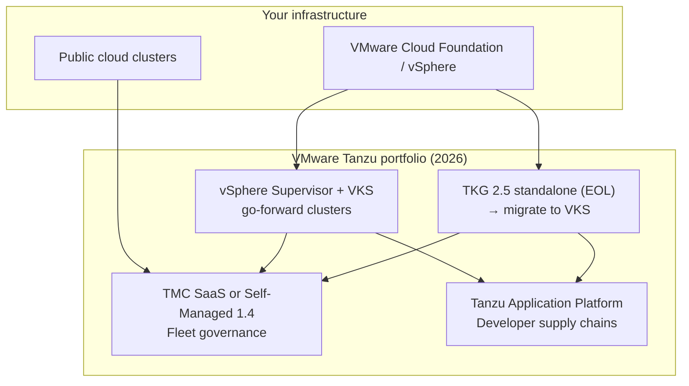
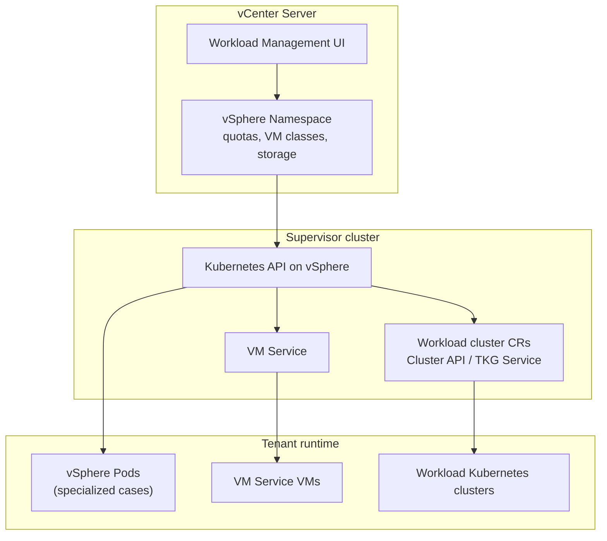

> **Complexity**: `[COMPLEX]` | Time: 55-65 minutes
>
> **Prerequisites**: K8s basics. Basic understanding of VMware vSphere is helpful but not required.

All shell examples use the full `kubectl` command name. Tanzu Kubernetes Grid (TKG) 2.5 standalone is in an end-of-life lifecycle: **2.5.4 is the final enterprise release**, and Broadcom directs new vSphere-integrated Kubernetes work toward **vSphere Kubernetes Service (VKS)** on vSphere Supervisor (formerly TKG Service). vSphere Supervisor and VKS clusters follow the vSphere 8.x and 9.x matrices in TechDocs. Tanzu Mission Control's SaaS offering reached end-of-life on **November 15, 2025**, so where this module says "TMC," read it as the **Self-Managed (TMC-SM)** product unless you are migrating off the retired SaaS. Kubernetes examples assume 1.35+ behavior unless a Tanzu release note pins an older supported minor for management clusters.

---

## Learning Outcomes

After completing this module, you will be able to explain Tanzu as a portfolio decision, trace its cluster lifecycle machinery, and defend when VMware integration is worth the operational and commercial tradeoffs:

1. **Compare** TKG, vSphere with Tanzu, Tanzu Mission Control, and Tanzu Application Platform without treating Tanzu as one product.
2. **Design** a vSphere-integrated Kubernetes platform that separates Supervisor, vSphere Namespaces, VM Service, and workload clusters.
3. **Implement** a TKG management-cluster workflow on vSphere with the Tanzu CLI, and rehearse the same Cluster API lifecycle pattern locally with kind when licensing blocks a full VMware lab.
4. **Diagnose** common Tanzu fleet issues by following Cluster API objects, MachineDeployments, CNI rollout, ingress, backup, and version status.
5. **Evaluate** Tanzu against Rancher, Gardener, OpenShift, vanilla Cluster API, and managed Kubernetes using technical fit, licensing exposure, and day-2 operations.

---

## Why This Module Matters

At renewal time, an infrastructure director at a midsize university receives a VMware quote that changes the platform roadmap overnight. The environment is not exotic. It has vSphere clusters, vSAN, a few NSX-backed segments, hundreds of VMs, several Kubernetes experiments, and a small platform team trying to standardize cluster delivery. The team expected the next decision to be technical: whether to use vSphere with Tanzu, plain TKG, Rancher, or managed Kubernetes for new application teams. Instead, the first decision becomes financial and organizational.

After Broadcom completed the VMware acquisition in November 2023, VMware moved away from perpetual licenses and toward subscription-only offers centered on bundles such as VMware Cloud Foundation. In 2024 and 2025, enterprise customers, universities, and service providers publicly reported steep renewal changes, including price increases in the 300-500% range and, in some cases, higher. Some organizations decided to stay because the operational migration cost was larger than the new subscription cost. Others began active exit programs toward OpenShift, Nutanix, OpenNebula, Proxmox, managed Kubernetes, or open-source Kubernetes platforms. That is the context in which Tanzu must be evaluated in 2026.

It is not enough to ask "Is Tanzu good Kubernetes?" You need to ask which Tanzu component you mean, whether it solves a problem you truly have, whether your vSphere estate makes it cheaper or more expensive, and whether its support model is worth the reduced flexibility. This module teaches Tanzu as an enterprise portfolio, not as a single tool. You will map the products, inspect the architecture, build an open-source TKG-style lab, and practice the decision process a platform team should use before committing to a vendor-integrated Kubernetes stack.

---

## 1. Tanzu Is a Portfolio, Not One Product

The first mistake with Tanzu is semantic. People say "we run Tanzu" as if that statement identifies a single runtime. It does not. Tanzu has been used for cluster lifecycle tooling, vSphere-integrated Kubernetes, SaaS fleet management, developer platform tooling, Cloud Foundry-era products, data services, build services, and packaging layers. For Kubernetes platform decisions, four names matter most.

TKG is Tanzu Kubernetes Grid. vSphere with Tanzu is Kubernetes embedded into vSphere through a Supervisor and vSphere Namespaces. TMC is Tanzu Mission Control, a fleet management overlay. TAP is Tanzu Application Platform, an opinionated developer platform that sits above Kubernetes. Those products can appear together, but they solve different problems.

Treating them as one thing creates bad architecture reviews. One team may say it wants Tanzu because it needs lifecycle-managed Kubernetes clusters. Another may hear "developer platform" and start discussing supply chains. A vSphere administrator may think about enabling Workload Management in vCenter.

A security team may think about centralized policy in TMC. All four people are using the same brand word and describing different systems. Use this map first:

```text
+----------------------+--------------------------+--------------------------+
| Tanzu name           | Primary job              | Mental model             |
+----------------------+--------------------------+--------------------------+
| TKG 2.5 standalone   | Create and upgrade K8s   | Final standalone line;     |
| (EOL; migrate VKS)   | on vSphere (legacy path) | plan move to VKS         |
| vSphere with Tanzu   | Integrate K8s into       | vCenter + Supervisor +   |
|                      | vSphere + VKS clusters   | workload clusters        |
| TMC                  | Manage cluster fleets    | SaaS or Self-Managed 1.4 |
|                      | across locations         | over attached clusters   |
| TAP                  | Standardize developer    | Path from source code to |
|                      | delivery workflows       | running app              |
+----------------------+--------------------------+--------------------------+
```

That table is the minimum vocabulary. TKG answers: "How do we create conformant Kubernetes clusters with a supported component stack?" vSphere with Tanzu answers: "How do we make vSphere itself expose Kubernetes-style consumption?" TMC answers: "How do we govern and observe many clusters from one place?" TAP answers: "How do we give developers a standardized path from source code to production?"



**Migration note:** If your estate still runs **TKG 2.5 standalone** management clusters, plan a deliberate move to **VKS on vSphere Supervisor** rather than treating 2.5.x as a long-term platform line—2.5.4 is the last enterprise standalone release.

They are related, but they are not interchangeable. The older names matter because many enterprises still have them in documents and diagrams. TKGI, formerly Enterprise PKS, was a BOSH and Ops Manager based Kubernetes platform. It came from the Pivotal era and made sense for organizations that already used BOSH. It is not the strategic default for new Kubernetes platform builds in 2026.

If you see TKGI in an estate, treat it as a legacy platform that may require migration planning. TCE, Tanzu Community Edition, was the open-source community on-ramp. VMware retired it in 2022, and the GitHub repository is archived. That matters because there is no direct community-tier replacement that gives learners the full commercial Tanzu experience without VMware or Broadcom access. For this module's lab, you will build a TKG-style stack from open-source components.

That lab does not make your laptop a licensed Tanzu installation. It demonstrates the architecture pattern behind TKG: a management cluster, Cluster API controllers, workload clusters, CNI, ingress, and GitOps. Pause and predict: if a team says "we need Tanzu for multi-cluster governance," which component should you ask about first: TKG, vSphere with Tanzu, TMC, or TAP? The right first question is usually TMC.

If the team needs to create clusters, TKG or vSphere with Tanzu may be involved. If the team already has clusters and wants policy, IAM federation, backup visibility, and fleet inventory, TMC is the more precise term. If the team wants a developer portal and build pipeline, it is really talking about TAP.

### Product Map in Practice

Consider a platform team with three groups of users. The infrastructure team owns vSphere, storage policies, NSX segments, vSAN, host patching, and enterprise support cases. The Kubernetes platform team owns cluster creation, upgrades, ingress, image registries, CNI defaults, backup patterns, and GitOps. The application teams want a simple way to deploy services without learning every detail of containers, image builds, YAML, and promotion workflows. Different Tanzu products map to those users.

vSphere with Tanzu mainly changes the infrastructure team's experience. TKG mainly changes the Kubernetes platform team's lifecycle workflow. TMC mainly changes fleet governance and visibility.

TAP mainly changes the developer experience. The products overlap at the edges, but the primary buyer and operator are different. That is why a one-line "Tanzu evaluation" is usually too vague to be useful.

### Hypothetical scenario: The wrong demo

A manufacturer asked a platform team to evaluate Tanzu after a senior leader saw a polished TAP demo. The demo showed a developer pushing code and watching a supply chain build, scan, and deploy the app. The actual internal problem was different. The organization had twelve manually built Kubernetes clusters on vSphere, inconsistent CNI choices, no shared upgrade model, and no inventory.

TAP looked impressive, but it did not solve the first failure mode. The right first workstream was cluster lifecycle and fleet policy, not application supply chains. After the product map was drawn, the evaluation changed from "buy Tanzu" to "compare TKG plus TMC against Rancher and vanilla Cluster API." The result was a better technical review and a more honest cost discussion.

---

## 2. vSphere with Tanzu: The Central Fork

vSphere with Tanzu is the most important fork in the Tanzu conversation because it changes where Kubernetes lives. In a plain virtualized design, Kubernetes is a tenant workload. You create VMs on vSphere, install Kubernetes inside those VMs, and operate the cluster mostly as a guest system. vSphere provides compute, storage, and networking primitives underneath it. Kubernetes has no special relationship with the hypervisor beyond the CSI and cloud-provider integrations you install.

vSphere with Tanzu is different. It integrates Kubernetes concepts into vSphere itself. A vSphere cluster can be enabled as a Supervisor. The Supervisor exposes Kubernetes APIs that are tied to vCenter, ESXi, storage policies, networking, identity, and resource governance. vSphere Namespaces become the boundary where platform teams allocate resources, permissions, storage policies, and workload placement.

That design is closer to "Kubernetes as a vSphere consumption layer" than "Kubernetes as another VM workload." The Supervisor is not the same thing as a normal application cluster. It is a control plane for provisioning and governing workloads in vSphere. It can host Supervisor Services, vSphere Pods in supported configurations, VM Service resources, and workload cluster definitions.

Most production application workloads should run in workload clusters rather than directly on the Supervisor. That distinction matters for support, isolation, RBAC, add-ons, and upgrade planning. Here is the architecture at a high level:



```text
+------------------------------- vCenter -----------------------------------+
| Workload Management UI, identity, permissions, storage policies            |
|                                                                            |
|  vSphere Namespace: payments-prod                                          |
|  Resource quotas, VM classes, storage classes, network policy boundaries   |
+----------------------------------+-----------------------------------------+
                                   |
                                   v
+---------------------------- Supervisor -----------------------------------+
| Kubernetes API integrated with vSphere                                     |
| Namespace objects map to vSphere Namespaces                                |
| VM Service creates VMs from Kubernetes-style resources                     |
| Workload cluster resources create tenant Kubernetes clusters               |
+----------------------+----------------------+-----------------------------+
                       |                      |
                       v                      v
+----------------------------+     +------------------------------+
| VM Service workloads       |     | Workload Kubernetes clusters |
| Legacy VMs near containers |     | App teams run normal K8s     |
+----------------------------+     +------------------------------+
```

The VM Service is easy to overlook, but it is one of the reasons vSphere with Tanzu exists. Many enterprises do not move from VMs to containers in one clean step. They run legacy services, databases, agents, batch workers, and COTS products that still need VMs. VM Service lets teams request VMs through Kubernetes-style objects while the infrastructure team still controls VM classes, images, storage, placement, and permissions. That can create a single consumption plane for VMs and containers.

It can also confuse teams if they assume "Kubernetes" means every workload is a pod. vSphere Pods deserve a careful note. **vSphere Pods are small-footprint VMs**, each running a **Photon OS-based Linux kernel**, integrated with the Supervisor via **Spherelet**, and requiring **NSX** for networking. They are interesting architecture for specialized isolation cases. They are not the recommended default path for most modern Tanzu application workloads.

In current designs, workload clusters are the normal place for application teams to run Kubernetes workloads. If a design depends heavily on direct vSphere Pods, verify the current support matrix, networking mode, backup story, RBAC model, and add-on limits before treating it as a standard cluster equivalent. Workload clusters are provisioned through Cluster API style machinery under the hood. The user declares a cluster. The platform reconciles virtual machines, control-plane nodes, worker nodes, bootstrap configuration, certificates, and Kubernetes versions.

From the application team's view, the result is a kubeconfig and a Kubernetes cluster. From the vSphere administrator's view, the result is a governed set of VMs, disks, networks, and resource usage inside vCenter. That dual view is the value proposition. It is also the complexity. When a workload cluster fails to create, the problem might be Kubernetes API validation, a vSphere Namespace quota, a content library image, a storage policy, an NSX or Avi load balancer issue, a VM class, a certificate problem, or a Cluster API reconcile loop.

You debug across both worlds. The operator who can only read vCenter tasks will be slow. The operator who can only read Kubernetes events will also be slow. You need both views. Before running this in a real environment, what output would you expect from `kubectl get clusters,machines,machinedeployments -A` after a workload cluster starts provisioning?

You should expect to see declarative cluster objects before the virtual machines are fully healthy. That is a useful clue. Cluster API exposes intent, intermediate state, and errors while vCenter exposes VM-level tasks. The two timelines should eventually converge.

### Practical Example: Debugging a Failed Workload Cluster

Imagine a developer requests a workload cluster in a vSphere Namespace named `analytics-dev`. The cluster object appears, but no worker nodes become Ready. The vSphere team sees VM creation retries. The Kubernetes platform team sees Machine objects stuck in provisioning. A good debug flow crosses both planes:

```bash
kubectl config get-contexts
kubectl config use-context supervisor-context
kubectl get namespaces
kubectl get clusters -A
kubectl get machines -A
kubectl get machinedeployments -A
kubectl describe machine -n analytics-dev analytics-dev-md-0-abc12
kubectl get events -n analytics-dev --sort-by=.lastTimestamp
```

Then you check the vSphere side. You look at the vSphere Namespace quota, VM class, image availability, storage policy, load balancer address pool, and recent vCenter tasks. The failure should not be assigned to "Kubernetes" or "VMware" too early. vSphere with Tanzu intentionally spans both.

### When vSphere Integration Helps

vSphere with Tanzu shines when vSphere is already the enterprise substrate. If your operations team already trusts vCenter, vSAN, NSX, Avi, storage policies, VM templates, DRS, HA, and enterprise support, adding Kubernetes as a governed vSphere service can reduce organizational friction. You do not need to convince every infrastructure team that Kubernetes is a separate island. You can expose Kubernetes in the language of resource pools, namespaces, storage classes, VM classes, and role assignments.

That helps regulated enterprises where platform boundaries matter. It helps shops where Kubernetes workloads must live next to VM workloads. It helps teams that need both VMs and containers in the same operational platform. It helps when your organization already pays for VCF and Tanzu capability is bundled at low incremental cost.

### When vSphere Integration Hurts

The same integration can become a burden in other environments. If your organization is not already committed to vSphere, vSphere with Tanzu is a large prerequisite stack. If your Kubernetes team is cloud-first and uses EKS, GKE, AKS, or open-source Cluster API across providers, vSphere-specific workflows may feel constraining. If cost sensitivity is high, the subscription model may dominate the technical merits.

If the team wants full control over cluster images, add-ons, network plugins, and upgrade windows, the tested compatibility matrix may feel like a guardrail and a constraint at the same time. The honest answer is not "vSphere with Tanzu is good" or "vSphere with Tanzu is bad." The honest answer is that it is a strong fit for VMware-centered enterprises and a weaker fit for teams trying to avoid VMware dependency.

---

## 3. TKG: Cluster API With Enterprise Packaging

Tanzu Kubernetes Grid is VMware's Kubernetes distribution and lifecycle pattern. The simplest useful mental model is this: TKG uses Cluster API concepts to create and operate workload clusters from a management plane. A management cluster runs controllers. Those controllers reconcile workload clusters.

The workload clusters run applications. This is the same basic pattern you saw in earlier Cluster API modules, but VMware packages, tests, documents, supports, and integrates a specific stack. That packaging is the product. It is not hidden magic. The core lifecycle idea comes from open-source Cluster API.

The management cluster has controllers that understand infrastructure providers. On vSphere, the vSphere provider creates VMs and related resources. On AWS, the AWS provider maps intent to EC2, load balancers, networks, and security groups. On Azure, the Azure provider maps intent to Azure resources.

VMware's current emphasis is strongest around vSphere and VCF integration, but the historical TKG story included vSphere, AWS, and Azure. Always verify the exact provider support and version matrix for the product release you are buying or operating. The lifecycle looks like this:

```text
+--------------------+       clusterctl / tanzu        +--------------------+
| Bootstrap machine  | ------------------------------> | Management cluster |
| CLI, config, creds  |                                 | CAPI controllers   |
+--------------------+                                 +---------+----------+
                                                                  |
                                                                  | reconciles
                                                                  v
                                                        +--------------------+
                                                        | Workload cluster   |
                                                        | control plane +    |
                                                        | worker nodes       |
                                                        +--------------------+
```

The `tanzu` CLI wraps much of the user experience. Operators use it to create management clusters, create workload cluster manifests, retrieve credentials, list versions, and trigger lifecycle operations. Under that CLI, you should expect Kubernetes objects. That matters because serious troubleshooting eventually drops below the CLI. You inspect `Cluster`, `Machine`, `MachineSet`, `MachineDeployment`, infrastructure machine templates, kubeadm config templates, secrets, events, and controller logs.

The TKG component stack is mostly open source. Networking has commonly involved Antrea, Calico, or Cilium depending on product version, provider, and design. Ingress can use Contour, which is built on Envoy. Registry capability may involve Harbor. Backup commonly maps to Velero.

Conformance testing can use Sonobuoy. GitOps can be added through Flux CD or another GitOps controller. These are not obscure proprietary components. They are recognizable CNCF-aligned tools packaged into a supported distribution. That is why comparing TKG with "vanilla Cluster API plus Argo CD" is fair.

The difference is not that one has lifecycle primitives and the other does not. Both can use Cluster API. The difference is who owns integration testing, compatibility matrices, upgrade documentation, enterprise support, packaging, and lifecycle opinion. If your team wants maximum control and has the staff to run the stack, open-source Cluster API may be enough. If your team wants a vendor-supported path aligned to vSphere, TKG may be easier to justify.

### Worked Example: Reading a Cluster API Failure

Suppose a TKG workload cluster upgrade stalls after the first worker replacement. The application team sees fewer nodes. The platform team sees the CLI hanging. The useful path is to inspect the declarative lifecycle objects:

```bash
kubectl get clusters -A
kubectl get machinedeployments -A
kubectl get machinesets -A
kubectl get machines -A
kubectl describe machinedeployment -n tkg-workloads prod-md-0
kubectl get events -n tkg-workloads --sort-by=.lastTimestamp
```

If the new Machine exists but no Node joins, look at bootstrap data, VM creation, cloud-init, kubelet logs, network reachability, and image compatibility. If no new Machine appears, look at MachineDeployment conditions, template references, version fields, and admission failures. If Machines are created and deleted repeatedly, suspect provider-level reconciliation failures such as invalid VM classes, IP allocation, storage policy mismatch, or image lookup failure. The point is to debug the controller graph, not the CLI spinner.

### Practical Example: Bootstrap Choices

In a real TKG on vSphere environment, a bootstrap host runs the Tanzu CLI and has access to vCenter, images, networks, and credentials. It creates a management cluster. That management cluster then becomes the control point for workload clusters. In the lab later, kind plays the role of the management cluster.

The Docker infrastructure provider plays the role of vSphere or cloud infrastructure. That substitution is intentionally limited. It does not test vCenter, NSX, vSAN, Avi, storage policy, VM classes, or Broadcom licensing. It does let you see the Cluster API lifecycle objects that make TKG understandable.

---

## 4. TMC: Fleet Management Overlay

Tanzu Mission Control is not a Kubernetes distribution. It is a multi-cluster management layer available in two forms: **TMC SaaS** (cloud-managed control plane hosted by Broadcom) and **TMC Self-Managed 1.4** (installs into a customer-owned Kubernetes cluster in your data center; current supported line is 1.4.x). You register attached or Tanzu-provisioned clusters, then govern them through policy, identity, inventory, backup coordination, and lifecycle features where the cluster type and subscription tier allow.

| Delivery | Control plane location | Typical tradeoff |
|---|---|---|
| TMC SaaS | Broadcom-hosted | No install burden; requires connectivity and acceptable data-residency posture for a hosted control plane |
| TMC Self-Managed 1.4 | Your K8s cluster | Customer operates the management plane; fits air-gapped and regulated environments that cannot depend on SaaS |

Some organizations also run complementary self-hosted fleet layers (Rancher, Open Cluster Management, or GitOps hubs) alongside TMC for VMware-aligned inventory and policy reporting. Choose SaaS versus Self-Managed based on connectivity, data residency, and who will operate the TMC management cluster—not on the assumption that TMC is SaaS-only.

TMC is most useful when your problem is fleet governance. You have too many clusters to manage with ad hoc kubeconfigs. You need centralized inventory. You need consistent policy. You need IAM federation rather than local user drift.

You need visibility into backup and restore posture. You need a shared API and UI for platform operations. That is a different problem from "create one Kubernetes cluster." TMC commonly provides these capabilities:

| Capability | What It Means | Operator Question |
|---|---|---|
| Cluster lifecycle | Create, attach, upgrade, scale, and delete supported clusters | Which clusters are managed versus attached? |
| Policy management | Apply security, image, namespace, network, and quota policies | Where is policy enforced and how is drift handled? |
| IAM federation | Map enterprise identity to fleet access | Which groups can access which clusters? |
| Observability aggregation | See fleet health and status in one place | Which clusters are degraded and why? |
| Backup and restore | Coordinate Velero-backed protection workflows | Where do backups live and who owns storage? |
| Fleet grouping | Organize clusters by environment, team, region, or function | Does grouping match real ownership? |

For an on-prem operator, the most realistic comparison is not just "TMC versus nothing." It is TMC versus Rancher, Karmada, and a GitOps-based open-source assembly. Rancher provides a broad open-source cluster management platform backed by SUSE. It can provision and import clusters, manage access, expose a UI, integrate policy, and serve as a common enterprise control plane. For teams that want a visible, self-hosted, open-source-centered fleet manager, Rancher is often a serious Tanzu alternative.

Karmada solves a different problem. It focuses on multi-cluster orchestration and propagation of Kubernetes resources across clusters. It is useful when the platform wants a Kubernetes-native federation control plane. It is not a direct replacement for all TMC capabilities, especially around enterprise packaging, SaaS inventory, support workflow, and Tanzu-specific lifecycle integration. A GitOps assembly can also cover much of the ground.

Argo CD or Flux CD can define desired state across many clusters. Open Policy Agent Gatekeeper or Kyverno can enforce policy. Velero can provide backup. Prometheus, Thanos, Grafana, Loki, and Alertmanager can provide observability. External Secrets, Sealed Secrets, or SOPS can manage secrets delivery.

Backstage can provide a portal. That assembly can be excellent, but the integration burden is yours. TMC is justified when the organization values a supported fleet control plane more than it values full composition freedom. It is redundant when the team already has a mature platform stack that covers inventory, identity, policy, backup, observability, and GitOps with strong internal ownership.

### Hypothetical scenario: The second fleet manager

A financial services team bought a fleet manager after already building an internal Argo CD, OPA, Prometheus, and Backstage platform. The new tool was technically capable. The problem was overlap. Two systems tried to own access groups. Two systems displayed policy status.

Two systems described cluster ownership. Engineers stopped trusting either dashboard because neither was clearly authoritative. The fix was not more integration. The fix was a decision: one system owned fleet inventory and policy reporting, while the other remained the deployment engine. When evaluating TMC, write down the source of truth for every fleet concern before buying another control plane.

---

## 5. TAP: Developer Platform, Not Cluster Lifecycle

Tanzu Application Platform lives above the cluster layer. It is not primarily about creating Kubernetes clusters. It is about giving developers a repeatable path from source code to a running workload. The platform team defines supply chains. Developers submit higher-level workload intent.

The system builds images, runs tests or scans, creates Kubernetes configuration, and deploys workloads through a controlled path. The key open-source idea behind TAP is supply chain choreography through Cartographer. Cartographer lets a platform team define a chain of Kubernetes resources that turn a developer workload into deployable output. In TAP, that path can include source fetching, Cloud Native Buildpacks, image building, vulnerability scanning, config generation, Knative serving, and GitOps delivery. Instead of every application team writing a custom pipeline, the platform team creates a paved path.

This is useful when developer experience is a major bottleneck. It is less useful when your core problem is cluster creation, vSphere integration, or fleet governance. Do not buy a developer platform to solve an infrastructure lifecycle problem. Do not force a supply-chain platform onto teams that already have a mature internal developer platform unless you are prepared to migrate workflows, templates, policies, and ownership. TAP commonly uses or integrates with these building blocks:

| Component | Role in TAP-style Platform |
|---|---|
| Cartographer | Defines supply chains that coordinate build, test, scan, config, and delivery resources |
| Cloud Native Buildpacks | Builds container images from source without every team writing Dockerfiles |
| Knative Serving | Provides request-driven services and serverless-style workload behavior |
| kpack or build service tooling | Runs buildpacks in Kubernetes-native workflows |
| GitOps controllers | Move generated config toward clusters through declarative delivery |
| App Live View | Gives developers runtime visibility into application behavior |
| Policy and scanning tools | Enforce image, dependency, and vulnerability requirements |

The Backstage comparison is important. Backstage is a developer portal framework. It does not by itself build images, run pipelines, deploy workloads, or enforce supply-chain policy. But many organizations use Backstage as the front door and assemble Argo CD, Tekton, Buildpacks, Kyverno, OPA, Crossplane, and custom templates behind it. That assembly can achieve similar goals to TAP.

The difference is packaging, opinion, support, and cost. TAP gives a more opinionated bundle. Backstage plus Argo CD plus Tekton gives more control and more integration work. Which approach would you choose for a company with twenty application teams, strong internal platform engineers, and a hard requirement to avoid new vendor subscriptions? The open-source assembly is probably the better first design.

Which approach would you choose for a VMware-centered enterprise with hundreds of Spring teams, weak platform integration capacity, and budget already committed to Tanzu? TAP may be a rational fit. The deciding factor is not whether Cartographer or Backstage is cooler. The deciding factor is who will operate the developer experience over the next three years.

### Practical Example: TAP-Like Flow

A TAP-style path usually looks linear to the developer even though several controllers are working behind the scenes. The platform team should make each handoff observable, because opaque build, scan, config, or delivery failures quickly undermine trust in the paved path:

```text
Developer pushes code
        |
        v
Source controller detects Git change
        |
        v
Buildpacks create image
        |
        v
Scanner evaluates image and metadata
        |
        v
Supply chain emits Kubernetes config
        |
        v
GitOps or delivery controller applies workload
        |
        v
Knative or Kubernetes Service exposes app
```

That is a developer platform workflow. It is valuable when dozens or hundreds of teams need consistent delivery without copy-pasted pipelines. It is overkill when three platform engineers simply need to create five Kubernetes clusters.

### Hypothetical scenario: Paved path without ownership

A retailer built a polished internal developer platform with a portal, templates, pipelines, image scanning, and GitOps. The launch went well. Six months later, teams began bypassing the paved path because no one owned template updates, buildpack changes, scan exceptions, or deployment policy changes. The platform looked complete on day one and stale by month six.

TAP does not remove that ownership problem. It can reduce assembly work, but someone still owns supply-chain design, version upgrades, policy exceptions, developer feedback, and incident response. The product can supply machinery. It cannot supply platform product management.

---

## 6. Open-Source DNA and Broadcom Reality

Tanzu's Kubernetes story is built largely from open-source parts. That is not a criticism. It is the central technical fact. Cluster API handles cluster lifecycle patterns. Antrea, Calico, and Cilium cover CNI choices.

Contour uses Envoy for ingress. Harbor provides registry capability. Velero handles backup and restore workflows. Sonobuoy runs conformance and diagnostic checks. Flux CD can provide GitOps.

Cartographer coordinates supply chains. Knative provides serving abstractions. Cloud Native Buildpacks build images from source. The Tanzu bundle provides tested combinations, installation paths, lifecycle tooling, enterprise support, documentation, and integration with VMware infrastructure. That is valuable, but it is not secret sauce.

If your team has the capacity, you can assemble many of the same primitives without Tanzu licensing. The tradeoff is that you own the compatibility matrix. You own upgrade sequencing. You own support escalation across projects. You own integration testing.

You own the platform API your developers and operators consume. That ownership can be empowering for strong platform teams and exhausting for small teams. The Broadcom acquisition changed the commercial evaluation. Broadcom completed the VMware acquisition on November 22, 2023. In December 2023, VMware by Broadcom announced a simplified product lineup and a full transition to subscription licensing.

Perpetual license sales ended. Support and subscription renewals tied to perpetual offers also ended as part of that shift. VMware Cloud Foundation and vSphere Foundation became central packaging vehicles. Standalone purchases and smaller product combinations became harder to use in the same way customers used them before. For Tanzu evaluators, this means you cannot evaluate the technology separately from the bundle.

The price of "Tanzu" may be the price of a larger VMware estate decision. If your company is already paying for VCF and Tanzu capabilities are included with low incremental cost, Tanzu may be financially reasonable. If your company only wants Kubernetes and has no deep vSphere dependency, the bundle may be difficult to justify. Customer-reported pricing impact has been uneven. Some public reports describe increases around 300%.

Other reports cite 500% or 600% complaints in user forums and industry coverage. Some service-provider reports cite much higher increases. The measured engineering response is not to dramatize those numbers. It is to model them. Build a three-year total cost comparison that includes licenses, migration labor, staff skills, support, hardware, downtime risk, and platform feature gaps.

If the subscription increase is smaller than the cost and risk of migration, staying may be rational. If the increase funds a migration and the organization has alternatives, moving may be rational. Avoid vague vendor lock-in language. Be specific. Which APIs would you need to replace?

Which storage integrations would change? Which teams know vSphere but not OpenShift, Rancher, or Gardener? Which applications depend on VM snapshots, backup tools, NSX network behavior, or vCenter automation?

Which compliance documents name VMware controls? Which support SLAs matter during incidents? Those are the questions that turn opinion into engineering analysis.

### When Tanzu Wins

Tanzu can win in existing VMware shops with deep operational expertise. It can win when vSAN and NSX investments are already made. It can win when the enterprise needs VMs and containers in one governed platform.

It can win when procurement already accepts VCF and the incremental cost is low. It can win when support SLAs and one-vendor escalation are more valuable than maximum composability. It can win when the organization wants tested compatibility more than tool-by-tool freedom.

### When Tanzu Loses

Tanzu often loses for net-new Kubernetes adopters with no vSphere dependency. It often loses for cost-sensitive organizations. It often loses for multi-cloud-first strategies where EKS, GKE, AKS, and open-source Cluster API are already standard.

It often loses for open-source-only shops. It often loses when a strong platform engineering team already owns Argo CD, Backstage, Tekton, Velero, Cilium, Cluster API, and policy tooling. In those cases, Tanzu may add cost and process without solving a new problem.

### Concrete Alternatives

| Alternative | Why Teams Pick It | Tradeoff |
|---|---|---|
| Vanilla Cluster API + Argo CD | Same lifecycle foundation, open-source control, GitOps-first | You own integration, testing, upgrades, and support routing |
| Rancher | Full-featured fleet manager, open-source core, SUSE-backed support | Adds its own platform opinions and management plane |
| Gardener | Hyperscaler-grade Kubernetes-as-a-Service, open source | More complex to operate than small teams expect |
| OpenShift | Enterprise platform with strong Red Hat support and integrated developer workflows | Red Hat subscription cost and opinionated architecture |
| EKS, GKE, AKS | Cloud provider owns much of cluster lifecycle | Less control on-prem; cloud dependency and data locality concerns |
| Karmada | Kubernetes-native multi-cluster orchestration | Not a complete fleet management or developer platform by itself |
| Backstage + Argo CD + Tekton | Flexible developer platform assembly | Requires strong platform product ownership |

### Practical Example: A 2026 Evaluation Memo

A useful Tanzu evaluation memo should fit on two pages before attachments. It should start with the product map. It should state which Tanzu products are in scope and which are not. It should list existing VMware dependencies. It should include a three-year cost model.

It should compare at least two non-Tanzu alternatives. It should name the operating team and escalation path. It should state what happens if Broadcom pricing changes again at renewal.

It should include an exit plan even if the recommendation is to stay. That does not make the recommendation negative. It makes the recommendation testable.

### Tanzu vs OpenShift vs Rancher for On-Prem Buyers

Enterprise teams rarely choose Tanzu in isolation. The three platforms below appear together in most on-premises bake-offs because each bundles Kubernetes lifecycle, identity, policy, and developer experience differently.

| Axis | VMware Tanzu (TKG / vSphere with Tanzu) | Red Hat OpenShift | SUSE Rancher |
|---|---|---|---|
| Primary substrate | vSphere and VCF estates | RHEL CoreOS nodes, strong bare-metal and cloud | Any CNCF-conformant cluster you can import or provision |
| Cluster lifecycle | TKG standalone management clusters, Supervisor TKG Service, CAPV | OpenShift installer / IPI / Agent installer | RKE2/K3s provisioning plus Cluster API integrations |
| Fleet governance | TMC SaaS or TMC Self-Managed 1.4 plus optional GitOps | Advanced Cluster Management (ACM) hub-spoke | Rancher Fleet GitRepo bundles (self-hosted) |
| Developer platform | Tanzu Application Platform (optional) | OpenShift Pipelines, Builds, Developer perspective | Backstage / Fleet apps (assemble your own) |
| Licensing model (2026) | VCF / vSphere Foundation subscription bundles | Red Hat OpenShift subscription | Rancher subscription with open-source core |
| Best fit signal | Deep existing VMware operations | Red Hat platform standard, regulated multi-cluster | Open-source-first fleet UI on mixed infrastructure |

None of these rows replaces a proof-of-concept on your network. They tell you which vendor's operating model you are adopting before you debate minor version skew or ingress controller logos.

---

## Patterns & Anti-Patterns

### Patterns

| Pattern | Use When | Why It Works | Scaling Considerations |
|---|---|---|---|
| Product map before demo | Stakeholders use "Tanzu" loosely | Prevents TKG, TMC, TAP, and vSphere with Tanzu from being confused | Repeat the map in architecture reviews and renewal planning |
| Workload clusters for apps | Teams need normal Kubernetes semantics | Keeps the Supervisor focused on platform control and governance | Standardize cluster classes, node pools, CNI, ingress, backup, and upgrades |
| TMC as fleet source of truth | Clusters span teams, regions, and providers | Centralizes policy, identity, inventory, and backup posture | Decide which system owns policy reports to avoid duplicate dashboards |
| Open-source stack rehearsal | Licensing blocks hands-on learning | Cluster API, Calico, Contour, and Argo CD teach the underlying pattern | Document where the lab differs from licensed Tanzu |
| VCF-aligned adoption | The organization already pays for VCF | Tanzu may become a marginal capability rather than a standalone purchase | Verify entitlement, support scope, and version lifecycle in writing |
| Exit plan even when staying | Renewal risk or acquisition changes matter | Makes dependency visible and reduces panic during future pricing changes | Keep alternatives current enough for realistic migration estimates |

### Anti-Patterns

| Anti-Pattern | What Goes Wrong | Better Alternative |
|---|---|---|
| Buying TAP to fix cluster lifecycle | Developers get supply-chain tooling while clusters remain inconsistent | Solve cluster lifecycle with TKG, vSphere with Tanzu, Rancher, Gardener, or Cluster API first |
| Running everything on the Supervisor | Add-ons, RBAC, backup, and workload isolation become difficult | Use workload clusters for application teams |
| Treating TMC and GitOps as the same layer | Two systems claim ownership of desired state | Define one owner for deployment state and one owner for fleet policy if both are used |
| Ignoring licensing until the end | A technically good design fails procurement or renewal review | Model licensing, support, and migration costs from the first architecture decision |
| Assuming open-source components mean zero cost | Integration and day-2 ownership are underestimated | Budget engineering time for compatibility, upgrades, and support triage |
| Using old TKGI or TCE docs for new design | Teams copy legacy patterns into a 2026 platform | Verify current product names, lifecycle status, and supported architecture |
| Comparing Tanzu only to managed Kubernetes | On-prem realities such as vSAN, NSX, VMs, and support are missed | Compare against Rancher, Gardener, OpenShift, Cluster API, and cloud-managed options separately |

---

## Decision Framework

Use this flow before choosing Tanzu, and treat every branch as a prompt for evidence rather than a shortcut to a favorite product. A credible recommendation should show existing infrastructure commitments, staff skills, support expectations, and exit costs before it names the winning platform.

```text
Start
  |
  v
Do you already operate a large VMware vSphere estate?
  |
  +-- no --> Are you required to run on-prem?
  |           |
  |           +-- no --> Prefer EKS, GKE, or AKS unless a platform reason says otherwise
  |           |
  |           +-- yes --> Compare Rancher, Gardener, OpenShift, and vanilla Cluster API first
  |
  +-- yes --> Are you already committed to VCF subscription spend?
              |
              +-- yes --> Evaluate vSphere with Tanzu and TKG as integrated options
              |
              +-- no --> Model VMware subscription impact before any technical winner is declared
                          |
                          v
             Do you need a developer platform or cluster lifecycle?
              |
              +-- developer platform --> Compare TAP with Backstage + Argo CD + Tekton
              |
              +-- cluster lifecycle --> Compare TKG/vSphere with Tanzu with Rancher/Gardener/CAPI
              |
              +-- fleet governance --> Compare TMC with Rancher and GitOps + policy assembly
```

The decision matrix below turns that flow into common operating situations. Use it to test whether Tanzu is solving the real constraint or whether another platform model would give the same Kubernetes outcome with less dependency, cost, or integration work:

| Situation | Tanzu Fit | Better First Alternative |
|---|---|---|
| Existing VCF customer, vSphere-heavy estate, VM and container co-location needed | Strong | Still compare OpenShift if Red Hat is strategic |
| New Kubernetes platform with no VMware dependency | Weak | Managed Kubernetes or vanilla Cluster API |
| Small team wants supported vSphere Kubernetes | Moderate to strong | Rancher on vSphere if open-source access matters |
| Large platform team wants full composition control | Moderate | Cluster API + Argo CD + Cilium/Calico + Velero |
| Developer experience is the bottleneck | TAP may fit | Backstage + Argo CD + Tekton + Buildpacks |
| Fleet policy is the bottleneck | TMC may fit | Rancher, policy-as-code, GitOps inventory |
| Cost-sensitive nonprofit or education environment | Often weak | Proxmox, OpenShift EDU options, Rancher, managed K8s where possible |
| Regulated enterprise values one-vendor support | Often strong | OpenShift if Red Hat support model fits better |

The key question is not "Can Tanzu run Kubernetes?" It can. The key question is "Which operating model do we want to fund?" Tanzu funds a vendor-integrated VMware-centered operating model. Open-source assemblies fund internal platform engineering.

Managed Kubernetes funds cloud-provider lifecycle ownership. OpenShift funds a Red Hat-centered enterprise platform. Rancher funds a SUSE-backed management layer with open-source access. Gardener funds a Kubernetes-as-a-Service model with hosted control planes. Pick the model before picking the tool.

---

## Did You Know?

1. Broadcom completed the VMware acquisition on November 22, 2023, and VMware by Broadcom announced the end of perpetual license sales in December 2023.
2. Tanzu Community Edition was retired in 2022, and its GitHub repository was archived on June 28, 2023.
3. Public customer reports in 2024 described VMware renewal increases around 300%, while other 2024 reports cited complaints around 500% or 600%.
4. Many Tanzu building blocks are open-source projects you can inspect directly, including Cluster API, Antrea, Contour, Harbor, Velero, Sonobuoy, Flux CD, Cartographer, Knative, and Cloud Native Buildpacks.

---

## Common Mistakes

| Mistake | Why It Happens | How to Fix It |
|---|---|---|
| Saying "Tanzu" without naming the product | The brand covers cluster lifecycle, vSphere integration, fleet management, and developer workflows | Start every review with TKG, vSphere with Tanzu, TMC, TAP, or legacy TKGI/TCE called out explicitly |
| Treating the Supervisor as a normal app cluster | It exposes Kubernetes APIs, so teams assume it is a general-purpose cluster | Put application workloads in workload clusters unless current product docs and support say otherwise |
| Evaluating TAP before cluster lifecycle is stable | Developer demos are easier to visualize than day-2 cluster operations | Stabilize cluster creation, upgrades, ingress, CNI, backup, and access first |
| Comparing list prices instead of three-year platform cost | License cost is visible, migration labor and operational risk are harder to estimate | Include subscription, staff time, migration, training, support, downtime risk, and exit costs |
| Assuming TMC replaces GitOps | TMC manages fleet concerns, while GitOps manages desired workload state | Define ownership boundaries between fleet policy and application deployment |
| Copying old TKGI or TCE tutorials | Search results preserve retired or legacy material | Verify current release docs, lifecycle status, and supported paths before following a guide |
| Ignoring vSphere-specific failure domains | Kubernetes engineers may not inspect vCenter tasks, storage policy, image libraries, or load balancer pools | Debug Cluster API objects and vSphere resources together |
| Assuming open-source alternatives are automatically cheaper | Tooling is free, but integration and support are not | Staff the platform like a product if you assemble it yourself |

---

## Quiz

<details>
<summary>Your company already runs VCF, vSAN, NSX, and hundreds of production VMs. Application teams want Kubernetes, but some services must remain VMs. Which Tanzu architecture do you evaluate first and why?</summary>

Start with vSphere with Tanzu plus workload clusters. The VM Service can help expose VM consumption through Kubernetes-style APIs while workload clusters give application teams normal Kubernetes environments. Because the organization already operates the VMware stack, the vSphere integration may reduce organizational friction. You should still model licensing and compare alternatives, but the existing estate makes Tanzu a plausible fit.

</details>

<details>
<summary>A platform team asks for TAP because cluster upgrades are inconsistent across eight clusters. What should you recommend?</summary>

Do not start with TAP. TAP addresses developer delivery workflows, not the core cluster lifecycle problem. The team should evaluate TKG, vSphere with Tanzu, Rancher, Gardener, or vanilla Cluster API depending on infrastructure and support needs. After cluster lifecycle is repeatable, TAP or a Backstage-based assembly can be considered for developer experience.

</details>

<details>
<summary>A workload cluster creation request is accepted, but no nodes join. Which objects and systems do you inspect before blaming Kubernetes?</summary>

Inspect Cluster API resources such as `Cluster`, `MachineDeployment`, `MachineSet`, `Machine`, related templates, and namespace events. Then inspect vSphere-side resources such as VM creation tasks, storage policy, VM class, image availability, namespace quota, and load balancer address pools. vSphere with Tanzu spans Kubernetes and vCenter, so either plane can explain the failure. The fastest debug path correlates both timelines.

</details>

<details>
<summary>Your organization has a mature Backstage portal, Argo CD, Tekton, Cilium, Velero, and Kyverno platform. A vendor proposes TAP. What is the evaluation risk?</summary>

The risk is buying overlap rather than capability. TAP may duplicate existing portal, pipeline, delivery, policy, and build functions. The evaluation should identify which system becomes authoritative for templates, supply chains, policy, and deployment state. If the existing platform is well owned, TAP may add cost without reducing operational burden.

</details>

<details>
<summary>A CIO sees a 300% VMware renewal increase and asks whether Kubernetes should move off Tanzu immediately. How should the platform team respond?</summary>

The team should produce a costed migration and stay-put analysis rather than a reactive answer. Include subscription cost, migration labor, application risk, hardware reuse, training, support, and downtime exposure. If migration cost and risk exceed the subscription increase, staying may be rational. If alternatives are mature and the increase funds the migration, an exit program may be justified.

</details>

<details>
<summary>You need fleet inventory, access policy, and backup posture across thirty clusters, but deployments are already handled by Argo CD. Where might TMC fit?</summary>

TMC may fit as the fleet governance and visibility layer. Argo CD can remain the desired-state deployment engine. The important design decision is ownership: TMC should not compete with Argo CD for application deployment state. Use TMC for cluster grouping, access, policy, lifecycle where supported, and Velero-backed protection if those features justify the subscription.

</details>

<details>
<summary>A team proposes vanilla Cluster API plus Argo CD instead of TKG. What tradeoff should the architecture review make explicit?</summary>

The open-source path can use the same lifecycle foundation and avoid Tanzu licensing. The team then owns integration testing, provider compatibility, upgrades, support routing, documentation, and platform UX. TKG shifts some of that burden to VMware by Broadcom through tested packaging and support. The right choice depends on platform engineering capacity and the value of vendor support.

</details>

---

## Hands-On Practical Exercises

**Objective**: Practice TKG lifecycle mechanics locally with Cluster API, then walk through the supported Tanzu CLI path for a standalone vSphere management cluster when entitlement and lab capacity exist.

**Environment**: Exercise 1 and 2 require Docker, kind, clusterctl, and kubectl on a Linux or macOS workstation. Exercise 3 requires a licensed TKG 2.5.x download, vSphere 7 or 8 with adequate resources, vCenter credentials, OVAs in a content library, and outbound access to Broadcom support portals for the exact build you are entitled to run.

### Exercise 1: Stand up a Cluster API management plane with kind

This exercise mirrors what TKG does internally before CAPV creates VMs: a management cluster hosts Cluster API controllers that reconcile workload cluster intent. The steps follow the [Cluster API quick start](https://cluster-api.sigs.k8s.io/user/quick-start) Docker-provider pattern: the management kind cluster must mount the host Docker socket, and the workload cluster needs a CNI before nodes reach Ready.

```bash
cat > capi-mgmt-kind.yaml <<'EOF'
kind: Cluster
apiVersion: kind.x-k8s.io/v1alpha4
name: capi-mgmt
nodes:
- role: control-plane
  image: kindest/node:v1.35.0
  extraMounts:
  - hostPath: /var/run/docker.sock
    containerPath: /var/run/docker.sock
EOF

kind create cluster --config capi-mgmt-kind.yaml
kubectl cluster-info --context kind-capi-mgmt

clusterctl init --infrastructure docker
kubectl wait --for=condition=Ready pod -l cluster.x-k8s.io/provider=cluster-api -n capi-system --timeout=180s
kubectl get pods -n capi-system
kubectl get pods -n capd-system

clusterctl generate cluster tkg-style \
  --flavor development \
  --kubernetes-version v1.35.0 \
  --control-plane-machine-count=1 \
  --worker-machine-count=1 \
  > tkg-style.yaml

grep -E 'kind: Cluster|kind: MachineDeployment|version:' tkg-style.yaml
kubectl apply -f tkg-style.yaml
kubectl get clusters,machinedeployments,machines

clusterctl get kubeconfig tkg-style > tkg-style.kubeconfig
kubectl --kubeconfig=tkg-style.kubeconfig apply -f https://raw.githubusercontent.com/projectcalico/calico/v3.32.0/manifests/calico.yaml
kubectl --kubeconfig=tkg-style.kubeconfig wait --for=condition=Ready node --all --timeout=300s
kubectl --kubeconfig=tkg-style.kubeconfig get nodes
```

- [ ] kind management cluster is reachable, mounts `/var/run/docker.sock`, and Cluster API provider pods are Ready.
- [ ] Generated manifest contains `Cluster` and `MachineDeployment` objects before Machines finish provisioning.
- [ ] Calico (or another CNI) is applied on the workload cluster and nodes reach Ready (control plane stays NotReady without a CNI).
- [ ] You can explain why management-cluster objects live in a different API server than application workloads.

<details>
<summary>Expected analysis</summary>

Cluster objects should appear while Machines are still provisioning. If reconciliation stalls, inspect `kubectl get events --sort-by=.lastTimestamp` in the management cluster and controller logs under `capi-system` and `capd-system`. If Machines exist but workload nodes stay NotReady, verify the Docker socket mount on the management kind cluster and that a CNI manifest was applied to the workload kubeconfig. This is the same declarative graph TKG surfaces through the Tanzu CLI on vSphere, except CAPV replaces the Docker provider.

</details>

### Exercise 2: Retrieve workload credentials and scale through MachineDeployment

Reuse `tkg-style.kubeconfig` from Exercise 1 (including the Calico install). If you started fresh, fetch kubeconfig and re-apply the CNI before expecting Ready nodes.

```bash
kubectl get kubeadmcontrolplanes
kubectl get machines

clusterctl get kubeconfig tkg-style > tkg-style.kubeconfig
KUBECONFIG=tkg-style.kubeconfig kubectl get nodes

kubectl config use-context kind-capi-mgmt
kubectl scale machinedeployment tkg-style-md-0 --replicas=2
kubectl get machinedeployments,machines

KUBECONFIG=tkg-style.kubeconfig kubectl get nodes
```

- [ ] Workload cluster kubeconfig returns nodes (Ready may take several minutes).
- [ ] Scaling the MachineDeployment from the management context increases Machine count.
- [ ] You can correlate Machines on the management cluster with Nodes on the workload cluster.

<details>
<summary>Expected analysis</summary>

Scaling belongs to the lifecycle plane. Patching node counts inside the workload cluster bypasses the controller graph TKG operators must debug during upgrades. If nodes never register, verify bootstrap secrets and provider logs before deleting the cluster.

</details>

### Exercise 3: Deploy a TKG management cluster on vSphere with the Tanzu CLI

Broadcom documents TKG 2.5.x standalone management clusters for vSphere when Supervisor is unavailable or unsuitable. VMware recommends Supervisor when your estate already runs vSphere with Tanzu; treat this exercise as the standalone path. Install the Tanzu CLI from your entitled TKG bundle, not from archived Community Edition artifacts.

On the bootstrap machine with vCenter access, verify CLI plugins and prepare a vSphere configuration stub. Replace placeholder values before any non-dry-run create.

```bash
tanzu version
tanzu plugin list

mkdir -p ~/.config/tanzu/tkg
cat > /tmp/vsphere-mgmt-stub.yaml <<'EOF'
INFRASTRUCTURE_PROVIDER: vsphere
VSPHERE_SERVER: vcenter.example.com
VSPHERE_USERNAME: admin@example.com
VSPHERE_PASSWORD: replace-me
VSPHERE_DATACENTER: /dc0
VSPHERE_DATASTORE: /dc0/datastore/shared
VSPHERE_FOLDER: /dc0/vm/tkg
VSPHERE_NETWORK: /dc0/network/vm-network
VSPHERE_RESOURCE_POOL: /dc0/host/cluster/Resources/rp-tkg
VSPHERE_TLS_THUMBPRINT: ""
CONTROL_PLANE_MACHINE_COUNT: 1
WORKER_MACHINE_COUNT: 1
DEPLOY_TKG_ON_VSPHERE7: true
EOF

tanzu management-cluster create --file /tmp/vsphere-mgmt-stub.yaml --dry-run | head -40
```

When placeholders are replaced with lab values and OVAs are imported, create the management cluster with the installer UI (recommended for first deploy) or the same file without `--dry-run`:

```bash
tanzu management-cluster create --ui
# or, after validating the YAML:
# tanzu management-cluster create --file /tmp/vsphere-mgmt-stub.yaml
```

After a successful deploy, inspect and retrieve credentials:

```bash
tanzu management-cluster get
tanzu management-cluster kubeconfig get --admin
kubectl get nodes
kubectl get clusters -A
```

- [ ] `tanzu management-cluster create --dry-run` validates vSphere fields without applying changes (or explains missing entitlement).
- [ ] You documented which TKG release and OS image (Ubuntu 22.04 or Photon 5 for TKG 2.5) your lab uses.
- [ ] Post-deploy, management-cluster nodes and Cluster API objects are visible through Tanzu CLI and kubectl.

<details>
<summary>Expected analysis</summary>

TKG creates a temporary kind bootstrap cluster on the workstation, provisions the real management cluster on vSphere, then deletes the bootstrap cluster. Failures often trace to thumbprint mismatches, datastore paths, resource-pool placement, or missing OVAs—not Kubernetes itself. TKG 2.5 management clusters run supported Kubernetes versions documented in the release notes (for example v1.29.x on TKG 2.5.4); do not assume every 1.35 feature from this curriculum module exists on management clusters until you verify the Tanzu Kubernetes release matrix.

</details>

### Cleanup (Exercises 1 and 2)

```bash
kubectl config use-context kind-capi-mgmt
kubectl delete cluster tkg-style --wait=false
kubectl get machines
kind delete cluster --name capi-mgmt
```

---

## Next Module

Continue to [Module 5.10: Edge Fleet Patterns](../module-5.10-edge-fleet-patterns/) to model retail and edge store fleets with selective GitOps rollouts and constrained-network overrides.

## Learner Check

> **Pause and predict**: a platform lead says "we already bought Tanzu" but cannot name whether the estate runs Supervisor workload clusters, a standalone TKG management cluster, or imported clusters in Tanzu Mission Control. Which three questions do you ask first, and why does the answer change your day-two runbook? Ask (1) where cluster lifecycle APIs live—Supervisor namespace, standalone management cluster, or external—(2) which component owns fleet policy versus application GitOps, and (3) which Broadcom bundle entitles upgrades and support. Without those boundaries, incident response mixes vCenter tasks, Cluster API objects, and SaaS inventory that do not share the same source of truth.

You are ready to continue when you can sketch TKG management versus workload clusters, Supervisor versus standalone lifecycle, and where TAP sits relative to cluster creation. You should be able to explain why Tanzu Community Edition is historical context only, and summarize how Broadcom subscription packaging affects a net-new Kubernetes buyer differently from an existing VCF customer.

---

## Sources

- <https://www.broadcom.com/company/news/financial-releases/61541>
- <https://news.broadcom.com/cloud/vmware-by-broadcom-business-transformation>
- <https://blogs.vmware.com/cloud-foundation/2024/01/22/vmware-end-of-availability-of-perpetual-licensing-and-saas-services/>
- <https://techdocs.broadcom.com/us/en/vmware-tanzu/standalone-components/tanzu-kubernetes-grid/2-5/tkg/mgmt-release-notes.html>
- <https://techdocs.broadcom.com/us/en/vmware-tanzu/standalone-components/tanzu-mission-control-self-managed/1-4/tmc-self-managed-documentation/install-and-run-tmc-self-managed.html>
- <https://techdocs.broadcom.com/us/en/vmware-tanzu/standalone-components/tanzu-kubernetes-grid/2-5/tkg/mgmt-deploy-config-vsphere.html>
- <https://cluster-api.sigs.k8s.io/user/quick-start>
- <https://techdocs.broadcom.com/us/en/vmware-tanzu/standalone-components/tanzu-kubernetes-grid/2-5/tkg/mgmt-deploy-ui.html>
- <https://techdocs.broadcom.com/us/en/vmware-tanzu/standalone-components/tanzu-cli/1-2/cli/tanzu-management-cluster.html>
- <https://techdocs.broadcom.com/us/en/vmware-cis/vcf/vcf-9-0-and-later/9-0/vsphere-supervisor-installation-and-configuration.html>
- <https://techdocs.broadcom.com/us/en/vmware-cis/vsphere/vsphere-supervisor/8-0/using-tkg-service-with-vsphere-supervisor/provisioning-tkg-service-clusters/workflow-for-provisioning-tkg-clusters-using-the-tanzu-cli.html>
- <https://techdocs.broadcom.com/us/en/vmware-cis/vsphere/vsphere-supervisor/8-0/using-tkg-service-with-vsphere-supervisor/provisioning-tkg-service-clusters/workflow-for-provisioning-tkg-clusters-using-kubectl.html>
- <https://techdocs.broadcom.com/us/en/vmware-cis/vsphere/vsphere-supervisor/8-0/vsphere-supervisor-services-and-workloads-8-0/deploying-workloads-to-vsphere-pods.html>
- <https://github.com/vmware-tanzu/community-edition>
- <https://github.com/kubernetes-sigs/cluster-api>
- <https://github.com/kubernetes-sigs/cluster-api-provider-vsphere>
- <https://github.com/antrea-io/antrea>
- <https://github.com/projectcontour/contour>
- <https://github.com/velero-io/velero>
- <https://github.com/vmware-tanzu/cartographer>
- <https://buildpacks.io/docs/>
- <https://arstechnica.com/information-technology/2024/10/a-year-after-broadcoms-vmware-buy-customers-eye-exit-strategies/>
- <https://open-cluster-management.io/docs/getting-started/quick-start/>
- <https://fleet.rancher.io/>
