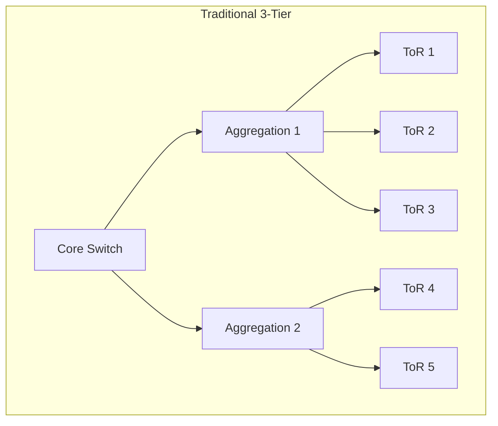
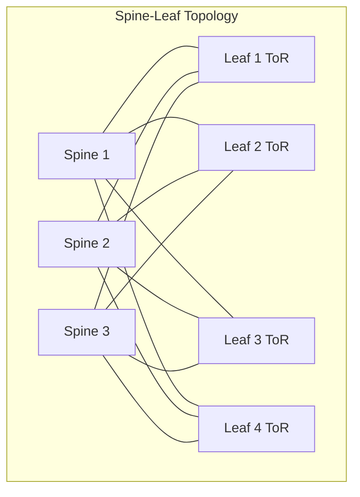
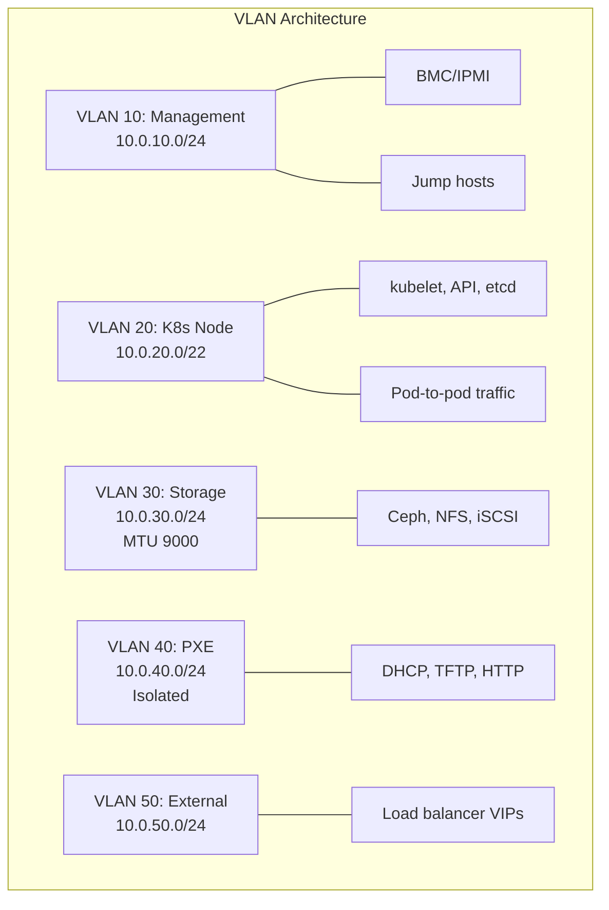
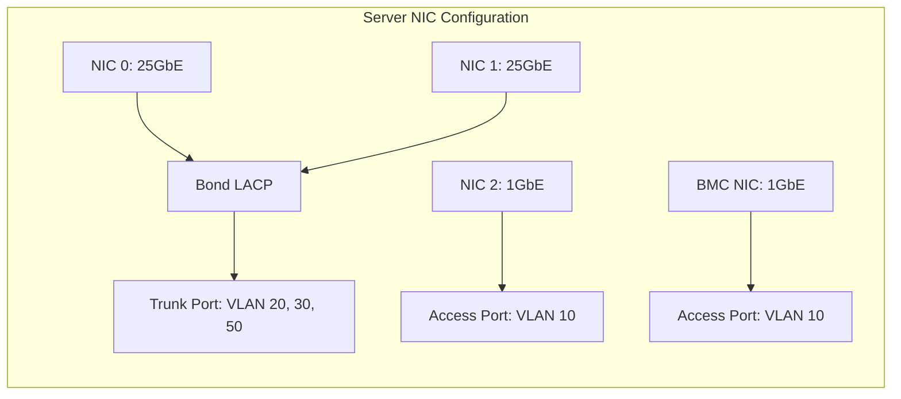
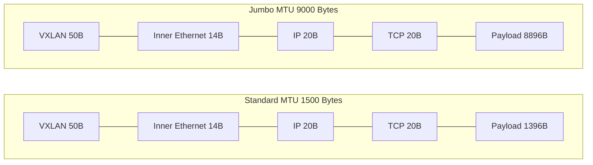
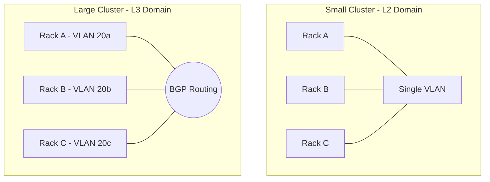
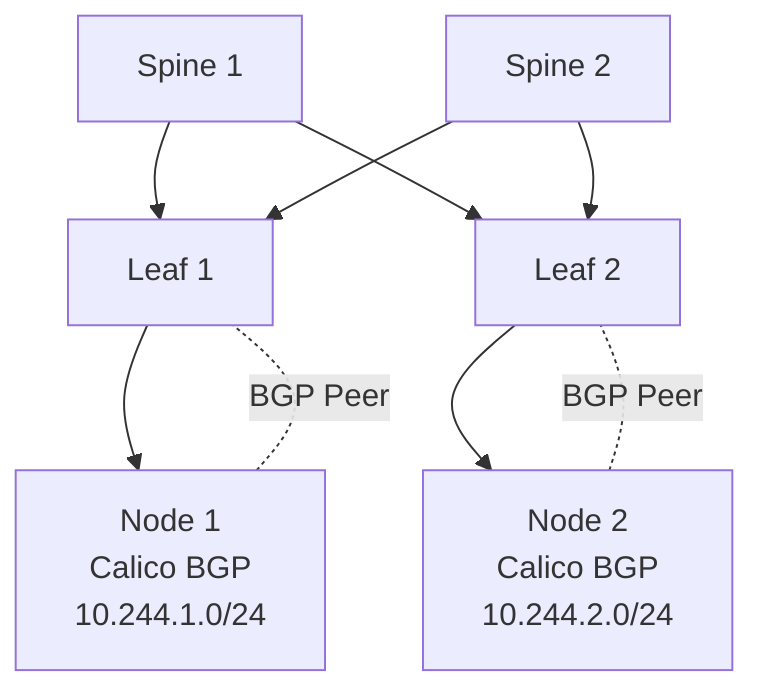

> **Complexity**: `[COMPLEX]` | Time: 60 minutes
>
> **Prerequisites**: [Module 2.1: Datacenter Fundamentals](../provisioning/module-2.1-datacenter-fundamentals/), [Linux: TCP/IP Essentials](../../linux/foundations/networking/module-3.1-tcp-ip-essentials/)

---

## What You'll Be Able to Do

After completing this module, you will be able to:

1. **Design** spine-leaf network topologies that mathematically eliminate east-west traffic bottlenecks by applying non-blocking Clos network principles.
2. **Implement** sophisticated VLAN boundaries, link aggregation, and MTU jumbo frame configurations to optimize hardware performance for Kubernetes overlay networks.
3. **Compare** the performance implications of DPDK, SR-IOV, and next-generation SmartNICs/DPUs when scaling high-throughput datacenter workloads.
4. **Evaluate** the BGP control plane integration between modern Container Network Interfaces (like Calico and Cilium) and the physical Top-of-Rack switches.
5. **Diagnose** complex network congestion issues caused by improper oversubscription ratios, MTU mismatches, and spanning-tree reconvergence events in multi-rack architectures.

---

## Why This Module Matters

On October 4, 2021, Facebook (Meta) suffered a catastrophic global outage that erased billions of dollars in market capitalization and caused an estimated sixty million dollars in lost ad revenue within a span of six hours. The root cause was not a complex software bug, but a routine BGP configuration update that mistakenly withdrew all routing information for the company's authoritative DNS servers. Because the datacenter network could no longer advertise its internal routes to the global internet, Facebook vanished from the web.

Even worse, the datacenter network's design meant that internal systems relied on the same routing infrastructure. Physical access to server rooms was blocked because the electronic badge readers could not reach the authorization databases over the isolated network. Engineers with physical keys had to use angle grinders to access the hardware cages. This incident starkly illustrates a foundational truth: the datacenter network is the absolute bedrock of application availability. 

In public cloud environments, engineers rarely consider switch oversubscription, uplink bandwidth, or BGP route reflection; the cloud provider abstracts these complexities away. However, in bare-metal Kubernetes deployments, the network architecture is entirely your responsibility. A poorly designed Top-of-Rack connection or an incorrect MTU setting can silently drop packets, trigger TCP retransmissions, and degrade a high-performance microservice architecture into an unresponsive bottleneck. You must design for the traffic you will have during peak load, not just the traffic you have on day one.

Consider a media streaming company that deployed a 60-node Kubernetes cluster connected to a single pair of ToR switches. When they deployed a video transcoding pipeline generating 8 Gbps of east-west traffic, their 6:1 oversubscription ratio became a severe bottleneck. Packet drops hit 3%, TCP retransmissions spiked, and video latency jumped from 200ms to 4 seconds, causing buffering and a revenue drop of $12,000/hour. Fixing it required adding spine switches, upgrading to 25GbE server connections, and implementing a proper leaf-spine topology with ECMP (Equal-Cost Multi-Path) routing. The migration took 3 weeks of weekend maintenance windows. Total cost: $85,000 in new hardware plus $40,000 in engineering time. The CTO's postmortem note: "We designed our network for the workload we had, not the workload we would have in 6 months."

> **The Highway Analogy**
>
> A datacenter network is like a highway system. The ToR switches are local roads (one per rack). The spine switches are highways connecting all the local roads. If your local roads are 2-lane but your highway is 8-lane, traffic flows. But if your highway is only 2-lane while every local road feeds 10 lanes of traffic, you get gridlock at the on-ramps. Oversubscription ratio is the ratio of total local road capacity to highway capacity.

---

## The Evolution of Datacenter Topologies

### Why Not Traditional 3-Tier?

The traditional datacenter network (access → aggregation → core) was designed for north-south traffic (client → server). Kubernetes generates massive east-west traffic (pod → pod, pod → service, pod → storage). The aggregation layer inherently becomes a severe bottleneck.

```text
┌─────────────────────────────────────────────────────────────┐
│          TRADITIONAL 3-TIER (avoid for K8s)                  │
│                                                               │
│                    ┌──────────┐                              │
│                    │   Core   │ ← single bottleneck          │
│                    └────┬─────┘                              │
│               ┌─────────┼─────────┐                         │
│          ┌────▼────┐         ┌────▼────┐                    │
│          │  Aggr 1 │         │  Aggr 2 │ ← oversubscribed   │
│          └────┬────┘         └────┬────┘                    │
│        ┌──────┼──────┐     ┌──────┼──────┐                  │
│     ┌──▼──┐ ┌──▼──┐ ┌──▼──┐ ┌──▼──┐ ┌──▼──┐              │
│     │ToR 1│ │ToR 2│ │ToR 3│ │ToR 4│ │ToR 5│              │
│     └─────┘ └─────┘ └─────┘ └─────┘ └─────┘              │
│                                                               │
│  Problem: East-west traffic between ToR 1 and ToR 5        │
│  must traverse aggregation + core = high latency + overload │
│                                                               │
├─────────────────────────────────────────────────────────────┤
│          SPINE-LEAF (recommended for K8s)                    │
│                                                               │
│     ┌──────┐  ┌──────┐  ┌──────┐  ┌──────┐                │
│     │Spine │  │Spine │  │Spine │  │Spine │                │
│     │  1   │  │  2   │  │  3   │  │  4   │                │
│     └──┬───┘  └──┬───┘  └──┬───┘  └──┬───┘                │
│        │ ╲       │ ╲       │ ╲       │ ╲                    │
│        │  ╲      │  ╲      │  ╲      │  ╲                   │
│     ┌──▼──┐╲  ┌──▼──┐╲  ┌──▼──┐╲  ┌──▼──┐                │
│     │Leaf │ ╲ │Leaf │ ╲ │Leaf │ ╲ │Leaf │                │
│     │  1  │  ╲│  2  │  ╲│  3  │  ╲│  4  │                │
│     │(ToR)│   │(ToR)│   │(ToR)│   │(ToR)│                │
│     └─────┘   └─────┘   └─────┘   └─────┘                │
│                                                               │
│  Every leaf connects to EVERY spine (full mesh)             │
│  Any-to-any traffic: max 2 hops (leaf → spine → leaf)      │
│  Equal-cost paths: ECMP load-balances across spines         │
│  Add capacity: add more spines (horizontal scaling)         │
│                                                               │
└─────────────────────────────────────────────────────────────┘
```

A modernized visualization of this architecture flow:





> **Pause and predict**: Looking at the spine-leaf diagram above, count the number of hops a packet takes from a server in rack 1 to a server in rack 4. Now count the hops in the traditional 3-tier topology. Why does this difference matter for Kubernetes east-west traffic?

### Spine-Leaf Architecture

Spine-leaf topology is an application of the Clos network architecture, originally described by Charles Clos in his 1953 Bell System Technical Journal paper 'A Study of Non-Blocking Switching Networks', vol. 32, pp. 406-424. The fundamental genius of a Clos network is that it provides a strictly non-blocking interconnect fabric. By structuring the network in a folded multi-stage array, every input can reach every output without contention, assuming sufficient interconnect links are provisioned. 

- **The term "Top of Rack" is becoming misleading** as many modern deployments use "End of Row" (EoR) or "Middle of Row" (MoR) switch placements. But "ToR" persists as the industry vocabulary regardless of physical placement.

While many vendors suggest that the dominant server-to-ToR link speed in modern hyperscale datacenters is 25 GbE, with ToR-to-spine links at 100 GbE, this remains an unverified generalization. No single authoritative standards body mandates this combination, and the explosive growth of machine learning workloads is rapidly pushing hyperscale environments toward massive 400 GbE and 800 GbE deployments. 

### Spine-Leaf Sizing

| Component | Speed | Ports | Use Case |
|-----------|-------|-------|----------|
| **Leaf (ToR)** | 25GbE down, 100GbE up | 48x 25G + 6x 100G | Per-rack switch |
| **Spine** | 100GbE | 32x 100G | Interconnect fabric |
| **Border leaf** | 100GbE down, 400GbE up | 48x 100G + 8x 400G | WAN/internet uplinks |

```text
Leaf: 48 x 25GbE = 1,200 Gbps downlink
      6 x 100GbE = 600 Gbps uplink

Oversubscription ratio = 1,200 / 600 = 2:1

For Kubernetes east-west heavy workloads:
  Target: 2:1 or better (3:1 acceptable for light workloads)
  Avoid: 5:1+ (will cause drops under load)
```

To support these massive backbone speeds, IEEE standards have continually evolved. 100 Gigabit Ethernet is standardized under IEEE 802.3ba-2010, ratified June 17, 2010. Pushing the boundary further, 800 Gigabit Ethernet is standardized under IEEE 802.3df-2024, approved February 16, 2024. Looking forward, the 1.6 Terabit Ethernet standard (IEEE 802.3dj) targeting 200 Gb/s per lane was originally slated for 2026 but is at risk of schedule slippage due to extreme signal integrity challenges.

---

## Virtualization and Encapsulation

### Overcoming VLAN Limits with VXLAN

IEEE 802.1Q VLAN tagging supports a maximum of 4,094 usable VLAN IDs (a 12-bit field; IDs 0 and 4095 are reserved). In multi-tenant cloud environments, this limitation was catastrophic. To overcome this, VXLAN (Virtual eXtensible LAN) is defined by IETF RFC 7348, published August 2014. VXLAN uses a 24-bit Virtual Network Identifier (VNI), supporting up to 16,777,216 (~16 million) logical network segments. 

To achieve this, VXLAN encapsulates Layer-2 Ethernet frames in UDP/IP packets and uses IANA-assigned UDP destination port 4789. By encapsulating the traffic in UDP, the datacenter's core switches can perform Equal-Cost Multi-Path (ECMP) load balancing by hashing the diverse source ports dynamically generated by the encapsulation engine.

### Modern Overlays: EVPN and GENEVE

While VXLAN provided the data plane encapsulation, it initially lacked a standard control plane, relying instead on inefficient multicast flooding to learn MAC addresses. To solve this, the EVPN (Ethernet VPN) control plane is defined in IETF RFC 7432 (BGP MPLS-Based Ethernet VPN), published February 2015. 

EVPN-VXLAN integration (using EVPN as a control plane over a VXLAN data plane) is specified in RFC 8365, 'A Network Virtualization Overlay Solution Using Ethernet VPN (EVPN)'. This combination allows switches to use BGP to actively share MAC and IP reachability information, completely eliminating broadcast storms. Seeking even more flexibility, GENEVE (Generic Network Virtualization Encapsulation) is defined in IETF RFC 8926, published November 2020. Unlike VXLAN, GENEVE features an extensible option header that allows for the insertion of rich metadata, such as telemetry and security tags.

---

## VLAN Design for Kubernetes

### Recommended VLANs

```text
┌─────────────────────────────────────────────────────────────┐
│              VLAN ARCHITECTURE                               │
│                                                               │
│  VLAN 10: Management                                        │
│  ├── BMC/IPMI interfaces (out-of-band)                     │
│  ├── Jump hosts, monitoring                                 │
│  └── Subnet: 10.0.10.0/24                                  │
│                                                               │
│  VLAN 20: Kubernetes Node Network                           │
│  ├── kubelet, API server, etcd communication                │
│  ├── Pod-to-pod traffic (if using host networking CNI)      │
│  └── Subnet: 10.0.20.0/22 (1,022 hosts)                   │
│                                                               │
│  VLAN 30: Storage Network                                   │
│  ├── Ceph public + cluster networks                         │
│  ├── NFS, iSCSI traffic                                     │
│  └── Subnet: 10.0.30.0/24                                  │
│  └── MTU: 9000 (jumbo frames for storage performance)      │
│                                                               │
│  VLAN 40: PXE / Provisioning                                │
│  ├── DHCP for PXE boot                                      │
│  ├── TFTP/HTTP for OS images                                │
│  └── Subnet: 10.0.40.0/24                                  │
│  └── Isolated: only accessible from provisioning server     │
│                                                               │
│  VLAN 50: External / Ingress                                │
│  ├── Load balancer VIPs (MetalLB)                           │
│  ├── External-facing services                               │
│  └── Subnet: 10.0.50.0/24                                  │
│                                                               │
└─────────────────────────────────────────────────────────────┘
```

A modernized visualization of this segmentation:



> **Stop and think**: You are designing VLANs for a new cluster. A colleague suggests putting storage traffic (Ceph replication) and Kubernetes pod traffic on the same VLAN to simplify the network. What problems would this cause during a Ceph rebalancing event, and how would it affect application latency?

### Server NIC Assignment

To guarantee high availability, physical server interfaces are grouped. Link Aggregation Control Protocol (LACP) is defined in IEEE 802.3ad, added to the IEEE 802.3 standard in March 2000, and later incorporated into IEEE 802.3-2018. 

```text
┌─────────────────────────────────────────────────────────────┐
│              SERVER NIC CONFIGURATION                        │
│                                                               │
│  NIC 0 (25GbE) ─── Bond (LACP) ─── Trunk port             │
│  NIC 1 (25GbE) ─── Bond (LACP) ─── (carries VLAN 20,30,50)│
│                                                               │
│  NIC 2 (1GbE)  ─── Management ──── Access port (VLAN 10)   │
│                                                               │
│  BMC NIC (1GbE) ── IPMI ────────── Access port (VLAN 10)   │
│                                                               │
│  Bond configuration (LACP/802.3ad):                         │
│  ├── Active-active (doubles bandwidth: 50 Gbps)            │
│  ├── Failover if one NIC or cable fails                    │
│  └── Switch must support LACP (most enterprise switches do)│
│                                                               │
│  Linux bond setup:                                           │
│  # /etc/netplan/01-bond.yaml (Ubuntu)                       │
│  network:                                                    │
│    version: 2                                                │
│    bonds:                                                    │
│      bond0:                                                  │
│        interfaces: [eno1, eno2]                             │
│        parameters:                                           │
│          mode: 802.3ad                                       │
│          lacp-rate: fast                                     │
│          transmit-hash-policy: layer3+4                      │
│    vlans:                                                    │
│      vlan20:                                                 │
│        id: 20                                                │
│        link: bond0                                           │
│        addresses: [10.0.20.10/22]                           │
│      vlan30:                                                 │
│        id: 30                                                │
│        link: bond0                                           │
│        addresses: [10.0.30.10/24]                           │
│        mtu: 9000                                             │
│                                                               │
└─────────────────────────────────────────────────────────────┘
```

A modernized visualization of NIC assignment:



---

## MTU Configuration

### Why Jumbo Frames Matter

Default Ethernet MTU is 1500 bytes. Kubernetes overlay networks (VXLAN, Geneve) add significant headers:

```text
┌─────────────────────────────────────────────────────────────┐
│              MTU AND OVERLAY OVERHEAD                        │
│                                                               │
│  Standard MTU (1500 bytes):                                 │
│  ┌──────┬──────────────────────────────┐                    │
│  │ VXLAN│ Inner Ethernet │ IP │ TCP │ Payload              │
│  │  50B │     14B        │20B │20B  │ 1396B                │
│  └──────┴──────────────────────────────┘                    │
│  Overhead: 104 bytes (7% of each packet wasted)             │
│                                                               │
│  Jumbo MTU (9000 bytes):                                    │
│  ┌──────┬──────────────────────────────────────────────┐    │
│  │ VXLAN│ Inner Ethernet │ IP │ TCP │  Payload (8896B)  │   │
│  │  50B │     14B        │20B │20B  │                    │   │
│  └──────┴──────────────────────────────────────────────┘    │
│  Overhead: 104 bytes (1.2% of each packet wasted)           │
│                                                               │
│  With jumbo frames:                                          │
│  ✓ 6x less header overhead per byte of data                │
│  ✓ Fewer packets per data transfer (less CPU interrupt load)│
│  ✓ Critical for storage traffic (Ceph, NFS)                │
│                                                               │
│  IMPORTANT: ALL devices in the path must support jumbo:     │
│  Server NICs, bonds, VLANs, switches, routers               │
│  One device with MTU 1500 = fragmentation = performance drop│
│                                                               │
└─────────────────────────────────────────────────────────────┘
```

A modernized visualization of header overhead:



### MTU Settings by Network

| Network | MTU | Reason |
|---------|-----|--------|
| Management (VLAN 10) | 1500 | Low traffic, no overlay |
| K8s Node (VLAN 20) | 9000 or 1500 | 9000 if CNI uses VXLAN overlay; 1500 if native routing |
| Storage (VLAN 30) | 9000 | Always jumbo for storage performance |
| PXE (VLAN 40) | 1500 | PXE/TFTP doesn't benefit from jumbo |
| External (VLAN 50) | 1500 | Internet-facing, standard MTU |

```bash
# Verify MTU on a path
ping -c 4 -M do -s 8972 10.0.30.1
# -c 4: limit to 4 packets
# -M do: don't fragment
# -s 8972: 8972 + 28 (IP+ICMP header) = 9000
# If this works, the path supports MTU 9000
# If "Message too long", something in the path has a smaller MTU

# Check interface MTU
ip link show bond0
# ... mtu 9000 ...

# Set MTU on Linux
ip link set bond0 mtu 9000
# Or permanently in netplan/interfaces config
```

---

## Hardware Acceleration and SmartNICs

To cope with massive data throughput without saturating the host CPU, the industry relies heavily on hardware acceleration. DPDK (Data Plane Development Kit) version 26.03.0 is the March 2026 release, following the project's YY.MM.patch versioning scheme. DPDK bypasses the Linux kernel networking stack entirely to process packets directly in user space. Alternatively, SR-IOV (Single Root I/O Virtualization) is a PCI-SIG specification that allows a single PCIe Physical Function (PF) to present multiple Virtual Functions (VFs) to the host, enabling near-native network performance for VMs without hypervisor involvement.

For machine learning and AI workloads, Remote Direct Memory Access (RDMA) is absolutely critical. RoCE v2 (RDMA over Converged Ethernet version 2) encapsulates RDMA transport in UDP/IP datagrams, making it routable across L3 networks (unlike RoCE v1 which was L2-only). 

To offload these complex encapsulation and security tasks from the main x86 CPU, specialized Data Processing Units (DPUs) are utilized. The NVIDIA BlueField-3 DPU is a 400 Gb/s infrastructure compute platform with 16 Arm A78 cores, up to 32 GB DDR5, and PCIe Gen5. Similarly, Intel co-developed the Mount Evans IPU (E2000 chip) with Google; it integrates 16 Arm Neoverse N1 cores and 200 Gb/s Ethernet connectivity.

**Comparing Performance Implications:**
- **DPDK**: Yields extremely high packet rates by bypassing the kernel, but consumes expensive x86 CPU cores merely for polling network queues.
- **SR-IOV**: Provides near-line-rate performance with virtually zero x86 CPU overhead by passing physical interfaces directly to pods, but sacrifices SDN flexibility (e.g., live migration and software overlays become difficult).
- **SmartNICs/DPUs**: Fully offload virtual switching, overlay encapsulation, and security to dedicated Arm cores on the NIC. This maintains full SDN flexibility while reclaiming 100% of x86 CPU cores for the actual application workload.

> **Stop and think**: If RoCE v2 utilizes UDP encapsulation for routing across a Layer 3 fabric, how does the network infrastructure guarantee the lossless delivery required by RDMA? What mechanisms must the Top-of-Rack switches implement to prevent UDP packet drops during microbursts?

---

## Modern Switch Operating Systems and SDN

Datacenter switches have evolved from monolithic black boxes into open compute platforms. SONiC (Software for Open Networking in the Cloud) governance was transferred from Microsoft to the Linux Foundation on April 14, 2022. It follows a strict release cadence, as SONiC publishes two major releases per year on a biannual cadence (approximately May and November). 

Open-source routing daemons power these platforms. FRRouting (FRR) 10.6.0 is the latest stable release, published March 26, 2026, with 1,585 commits from 86 developers. For virtual switching at the host level, Open vSwitch (OVS) 3.7.0 is the latest stable release, released February 16, 2026. 

Commercial vendors also maintain massive footprints with highly robust OS branches. Arista EOS 4.35.2F is the version referenced in Arista's current (2026) product documentation. Similarly, Cisco NX-OS 10.5(5)M for the Nexus 9000 series was released March 16, 2026 and is the latest release in the 10.5 maintenance train. 

In the realm of Software-Defined Networking (SDN) and fabric management, VMware NSX (rebranded from VMware NSX-T Data Center) version 4.2.3 is the latest release as of 2026. For multivendor intent-based fabric management, Juniper Apstra 6.x is the current major release line. Finally, OpenFlow 1.5.1 (protocol version 0x06) is the latest publicly available OpenFlow specification published by the Open Networking Foundation (ONF).

---

## L2 vs L3: Where to Route

Use of BGP as the sole routing protocol for large-scale datacenter fabrics is documented in IETF RFC 7938, published August 2015. 

### L2 Domain Boundaries

```text
┌─────────────────────────────────────────────────────────────┐
│           L2 vs L3 DESIGN                                    │
│                                                               │
│  SMALL CLUSTER (< 3 racks):                                │
│  ┌──────────────────────────────────────┐                   │
│  │          L2 Domain (one VLAN)        │                   │
│  │  ┌────┐  ┌────┐  ┌────┐             │                   │
│  │  │Rack│  │Rack│  │Rack│             │                   │
│  │  │ A  │  │ B  │  │ C  │             │                   │
│  │  └────┘  └────┘  └────┘             │                   │
│  │  All nodes in same broadcast domain  │                   │
│  │  Simple: ARP works, no routing needed│                   │
│  └──────────────────────────────────────┘                   │
│                                                               │
│  LARGE CLUSTER (> 5 racks):                                 │
│  ┌──────────┐  ┌──────────┐  ┌──────────┐                  │
│  │ L2: Rack │  │ L2: Rack │  │ L2: Rack │                  │
│  │ A (VLAN  │  │ B (VLAN  │  │ C (VLAN  │                  │
│  │ 20a)     │  │ 20b)     │  │ 20c)     │                  │
│  └────┬─────┘  └────┬─────┘  └────┬─────┘                  │
│       │              │              │                        │
│       └──────── L3 Routing ─────────┘                       │
│              (BGP between leaves)                            │
│                                                               │
│  Each rack gets its own /24 or /25 subnet                   │
│  L3 routing between racks (no broadcast flooding)           │
│  BGP advertises routes between leaf switches                │
│  Scales to thousands of nodes                                │
│                                                               │
└─────────────────────────────────────────────────────────────┘
```

A modernized visualization of L2 vs L3 boundaries:



**Rule of thumb:**
- < 200 nodes, < 3 racks: L2 (single broadcast domain) is fine
- \> 200 nodes or > 5 racks: L3 routing between racks with BGP
- Broadcast storms can propagate across all 8 racks if left as a massive flat L2 domain.

---

## CNI Integration with Datacenter Fabric

> **Pause and predict**: Your cluster uses VXLAN overlay networking (the default for most CNIs). Each packet adds 50 bytes of overhead. At 1 million packets per second (common for microservices), how much bandwidth is wasted on headers alone? Would switching to BGP native routing eliminate this overhead?

By leveraging standard BGP capabilities, modern Container Network Interfaces can seamlessly peer with your ToR switches. Cilium CNI version 1.19 is the latest stable minor release as of early 2026; version 1.20.0-pre.1 is available as a pre-release as of April 1, 2026. Similarly, Calico CNI version 3.31.4 is the latest stable release, released February 20, 2026.

### Calico BGP Mode (No Overlay)

The diagram below shows Calico peering directly with the datacenter ToR switches via BGP. This eliminates the VXLAN encapsulation layer entirely -- pod IPs become first-class citizens in the datacenter routing table, meaning external systems can reach pods without NAT or proxy:

```text
┌─────────────────────────────────────────────────────────────┐
│           CALICO BGP WITH DATACENTER FABRIC                  │
│                                                               │
│  Spine Switches                                              │
│  ┌──────┐  ┌──────┐                                        │
│  │Spine1│  │Spine2│  ← Route reflectors (optional)         │
│  └──┬───┘  └──┬───┘                                        │
│     │╲        │╲                                             │
│  ┌──▼──┐   ┌──▼──┐                                         │
│  │Leaf1│   │Leaf2│  ← BGP peers with Calico                │
│  └──┬──┘   └──┬──┘                                         │
│     │         │                                              │
│  ┌──▼──────┐ ┌──▼──────┐                                    │
│  │ Node 1  │ │ Node 2  │                                    │
│  │         │ │         │                                    │
│  │ Calico  │ │ Calico  │  ← Calico peers with leaf switch  │
│  │ BGP     │ │ BGP     │                                    │
│  │         │ │         │                                    │
│  │ Pod     │ │ Pod     │  ← Pod IPs advertised via BGP     │
│  │10.244.  │ │10.244.  │    to datacenter fabric            │
│  │  1.0/24 │ │  2.0/24 │                                    │
│  └─────────┘ └─────────┘                                    │
│                                                               │
│  Result: Pod IPs are routable on the datacenter network     │
│  No overlay (VXLAN/Geneve) needed = no encapsulation overhead│
│  External services can reach pods directly                  │
│  Leaf switches have routes to pod CIDRs                     │
│                                                               │
└─────────────────────────────────────────────────────────────┘
```

A modernized visualization of Calico BGP peering:



```text
# Calico BGPConfiguration
apiVersion: projectcalico.org/v3
kind: BGPConfiguration
metadata:
  name: default
spec:
  asNumber: 64512
  nodeToNodeMeshEnabled: false  # Disable full mesh, use route reflectors
  serviceClusterIPs:
    - cidr: 10.96.0.0/12

---
# Peer with ToR switch
apiVersion: projectcalico.org/v3
kind: BGPPeer
metadata:
  name: rack-a-tor
spec:
  peerIP: 10.0.20.1  # ToR switch IP
  asNumber: 64501      # ToR AS number
  nodeSelector: "rack == 'rack-a'"
```

### Cilium Native Routing

```yaml
# Cilium with native routing (no overlay)
apiVersion: cilium.io/v2alpha1
kind: CiliumBGPPeeringPolicy
metadata:
  name: rack-a-peering
spec:
  nodeSelector:
    matchLabels:
      rack: rack-a
  virtualRouters:
    - localASN: 64512
      exportPodCIDR: true
      neighbors:
        - peerAddress: "10.0.20.1/32"
          peerASN: 64501
```

---

## Did You Know?

1. Charles Clos published his seminal paper on non-blocking switching networks in the Bell System Technical Journal in March 1953.
2. IETF RFC 7348 formalized the creation of VXLAN in August 2014, breaking through the 4,094 VLAN limit.
3. 800 Gigabit Ethernet was officially approved on February 16, 2024, under IEEE 802.3df-2024.
4. SONiC governance was successfully transferred from Microsoft to the Linux Foundation on April 14, 2022.
5. **Meta's datacenter fabric uses a 4-plane spine-leaf topology** (F4 architecture) with custom switches running FBOSS. Each plane has independent failure domains. Newer designs scale to 16-plane (F16).
6. **Jumbo frames (9000 MTU) were standardized in 1998** but still are not universally supported. Many enterprise firewalls and WAN links silently fragment them, causing performance degradation.
7. **BGP was designed for internet routing between ISPs in 1989** but has been adopted for datacenter use because of its simplicity and scalability, evolving to use EVPN-VXLAN for multi-tenancy.

---

## Common Mistakes

| Mistake | Why | Fix |
|---------|-----|-----|
| Single ToR switch (no redundancy) | Switch failure equals rack offline because there is no secondary path. | Dual ToR with MLAG or MC-LAG. |
| MTU mismatch in path | Causes silent fragmentation and TCP retransmissions across the overlay. | Verify MTU end-to-end with `ping -c 4 -M do -s 8972`. |
| Flat L2 network at scale | Broadcast storms can propagate across all 8 racks, causing ARP floods. | Route between racks at L3 with BGP. |
| Oversubscribed uplinks | Results in packet drops under heavy east-west load. | Target 2:1 or better oversubscription. |
| No separate storage VLAN | Storage traffic competes with pod traffic, saturating the interface. | Dedicated VLAN with jumbo frames for Ceph/NFS. |
| CNI overlay when unnecessary | Adds extra encapsulation overhead, consuming CPU cycles. | Use Calico/Cilium BGP mode on bare metal. |
| Not monitoring switch ports | You don't know about packet drops until users complain. | Implement SNMP/gNMI monitoring on all switch ports. |
| PXE on production VLAN | Creates a severe risk of accidental OS reimaging during reboots. | Isolated PXE VLAN with restricted DHCP. |

---

## Quiz

### Question 1
Your leaf switch has 48x 25GbE downlink ports and 4x 100GbE uplink ports. What is the oversubscription ratio, and is it acceptable for Kubernetes?

<details>
<summary>Answer</summary>

**Oversubscription ratio: 3:1.**

Calculation:
- Total downlink: 48 x 25 Gbps = 1,200 Gbps
- Total uplink: 4 x 100 Gbps = 400 Gbps
- Ratio: 1,200 / 400 = 3:1

**Is it acceptable?** For most Kubernetes workloads, 3:1 is acceptable. Standard microservices with moderate east-west traffic will not saturate the uplinks.

However, for:
- **Storage-heavy workloads** (Ceph, distributed databases): 3:1 may cause congestion during rebalancing. Target 2:1.
- **ML/AI training** (GPU clusters with all-reduce): Very high east-west. Target 1:1 (non-blocking).
- **Video transcoding**: High sustained bandwidth. Target 2:1.

To improve: add 2 more 100GbE uplinks (6x 100G = 600 Gbps, ratio becomes 2:1).
</details>

### Question 2
Your team is deploying a new bare-metal Kubernetes cluster. The storage team insists that external monitoring tools must be able to reach pod IP addresses directly without going through an Ingress controller or NAT. Which networking approach should you configure with your Top-of-Rack switches to satisfy this requirement while minimizing encapsulation overhead?

<details>
<summary>Answer</summary>

**You should configure native routing (BGP).**

**Native routing advantages on bare metal:**

1. **No encapsulation overhead**: VXLAN adds 50 bytes per packet. On a 1500 MTU network, that is 3.3% overhead. With millions of packets per second, this adds up to measurable CPU load and bandwidth waste.

2. **Pod IPs are routable**: External systems (load balancers, monitoring, databases) can reach pods directly without NAT or proxy. This simplifies debugging and architecture.

3. **Existing datacenter fabric integration**: Your ToR switches already run BGP. Calico/Cilium can peer directly with them, making pod CIDRs part of the datacenter routing table.

4. **Better performance**: No encap/decap CPU cost. Packet headers are standard IP — hardware offloading works (TSO, GRO, checksum offload).

5. **Simpler debugging**: `tcpdump` shows real source/destination IPs, not VXLAN-wrapped packets.

**When VXLAN is still needed**: Multi-tenant environments where tenants need overlapping IP ranges, or when the datacenter network team will not allow BGP peering with Kubernetes nodes.
</details>

### Question 3
You are designing the network for a 200-node Kubernetes cluster across 8 racks. Should you use L2 or L3 between racks?

<details>
<summary>Answer</summary>

**L3 (routed) between racks.**

At 200 nodes across 8 racks:
- An L2 domain spanning 8 racks means ~200 nodes in one broadcast domain
- ARP traffic scales with N^2 — 200 nodes = 40,000 potential ARP entries
- Broadcast storms can propagate across all 8 racks
- A spanning-tree reconvergence (if using STP) can cause seconds of network outage

**L3 design:**
- Each rack gets its own /25 subnet (126 hosts per rack)
- Leaf switches route between subnets via BGP
- No broadcast domain spans more than one rack
- Adding more racks = adding more L3 routes, not expanding L2 domain
- Calico/Cilium BGP peers with the leaf switches

**L2 is fine for**: < 3 racks, < 100 nodes (small enough that broadcast is manageable).
</details>

### Question 4
A server's bonded interface shows 50 Gbps capacity (2x 25GbE LACP), but `iperf3` between two servers shows only 24 Gbps. Why?

<details>
<summary>Answer</summary>

**LACP bond bandwidth is per-flow, not aggregate.**

LACP (802.3ad) distributes traffic across links based on a hash of the packet header (source/destination IP and port). A single TCP connection (single flow) can only use one physical link — 25 Gbps maximum.

The 50 Gbps aggregate bandwidth is only achievable with multiple concurrent flows. `iperf3` with a single connection tests single-flow performance.

**To verify aggregate bandwidth:**
```bash
# Run iperf3 with multiple parallel flows
iperf3 -c 10.0.20.20 -P 8  # 8 parallel connections
# This should achieve close to 50 Gbps
```

**Hash policy also matters:**
- `layer2`: Hash on MAC addresses (poor distribution for same-subnet traffic)
- `layer3+4`: Hash on IP + port (much better distribution for K8s traffic)

```bash
# Set the bond hash policy
ip link set bond0 type bond xmit_hash_policy layer3+4
```
</details>

### Question 5
Your machine learning cluster relies on RoCE (RDMA over Converged Ethernet) for low-latency GPU memory transfers. The network team plans to span the cluster across multiple racks connected via Layer 3 spine switches. A junior engineer suggests using RoCE v1 to minimize encapsulation overhead. Why will this design fail to scale across the racks, and what architectural change is required?

<details>
<summary>Answer</summary>

**The design will fail because RoCE v1 is strictly a Layer-2 protocol.**

It relies on MAC addresses and cannot be routed across the Layer-3 boundaries that separate the racks in a modern spine-leaf topology. To scale across multiple racks, you must implement **RoCE v2**, which encapsulates the RDMA transport in UDP/IP datagrams. This UDP encapsulation allows the datacenter's spine switches to route the RDMA traffic across standard L3 networks using ECMP (Equal-Cost Multi-Path) load balancing, freeing the cluster from the constraints of a single broadcast domain.
</details>

### Question 6
A new network engineer configures a Kubernetes cluster using a VXLAN overlay but forgets to adjust the network MTU, leaving all physical switches at the default 1500 bytes. What precise symptom will the application layer experience when transferring large files?

<details>
<summary>Answer</summary>

The application layer will experience severe throughput degradation due to silent IP fragmentation. VXLAN adds 50 bytes of overhead to every packet. If the outer packet exceeds the 1500-byte MTU of the physical switches, the switch must either drop the packet or fragment it into smaller pieces. Fragmentation drastically increases CPU interrupt load on the receiving nodes, leading to high latency, dropped connections, and TCP retransmissions.
</details>

### Question 7
Your organization wants to scale a bare-metal Kubernetes cluster to 500 nodes spanning 15 racks. The security team insists on keeping all nodes in a single VLAN to simplify firewall rules. What network failure mode is this design highly susceptible to?

<details>
<summary>Answer</summary>

The design is highly susceptible to crippling broadcast storms and ARP flooding. In a flat L2 network, broadcast traffic must reach every single node. As the node count grows, the volume of ARP requests scales exponentially. A single spanning-tree reconvergence event or a bridging loop can cause a broadcast storm that paralyzes all 15 racks simultaneously.
</details>

---

## Hands-On Exercise: Design a Network for a K8s Cluster

**Task**: Design the network architecture for a 100-node Kubernetes cluster in 4 racks.

### Requirements
- 100 worker nodes + 3 control plane nodes
- Ceph storage cluster (3 dedicated OSD nodes)
- MetalLB for external load balancing
- Calico CNI with BGP mode
- PXE provisioning capability

### Progressive Tasks

**Task 1: Define the VLAN structure**
Map out the necessary subnets and assignments for management, Kubernetes node traffic, storage, provisioning, and external VIPs.
<details>
<summary>Solution</summary>

```text
VLAN 10: Management (10.0.10.0/24) — BMC, jump hosts
VLAN 20: Kubernetes (10.0.20.0/22) — node communication, pod traffic
VLAN 30: Storage (10.0.30.0/24) — Ceph cluster + public network, MTU 9000
VLAN 40: Provisioning (10.0.40.0/24) — PXE boot, isolated
VLAN 50: External (10.0.50.0/24) — MetalLB VIP range
```
</details>

**Task 2: Design the switching fabric**
Select the appropriate hardware and determine the oversubscription ratio for the Top-of-Rack connectivity.
<details>
<summary>Solution</summary>

```text
Spine: 2x 100GbE switches (32 ports each)
Leaf: 4x 25GbE ToR switches (48 down + 6x 100G up), one per rack
Oversubscription: 48x25=1200 / 6x100=600 = 2:1 ✓
```
</details>

**Task 3: Plan server NIC assignment**
Define how the physical NICs on the servers will be bonded and mapped to the VLANs.
<details>
<summary>Solution</summary>

```text
Per server:
  bond0 (eno1+eno2, LACP, 2x 25GbE): VLAN 20 + 30 + 50 trunk
  eno3 (1GbE): VLAN 10 management
  BMC (1GbE): VLAN 10
```
</details>

**Task 4: Define BGP peering**
Assign Autonomous System (AS) numbers to your spines, leaves, and Kubernetes nodes.
<details>
<summary>Solution</summary>

```text
Leaf AS numbers: 64501 (rack-a), 64502 (rack-b), etc.
Spine AS: 64500
Calico node AS: 64512
Each node peers with its local leaf switch
Leaf switches peer with both spines
```
</details>

**Task 5: Calculate bandwidth**
Verify the total intra-rack and spine bandwidth capacity of your design.
<details>
<summary>Solution</summary>

```text
25 nodes per rack × 25 Gbps = 625 Gbps intra-rack
6 × 100 Gbps = 600 Gbps to spine (effective ~1:1 for connected hosts; 2:1 at full switch capacity)
Total spine bandwidth: 2 × 32 × 100G = 6,400 Gbps
```
</details>

### Success Criteria
- [ ] VLAN design documented with subnets and purposes.
- [ ] Spine-leaf topology sized with oversubscription ratio < 3:1.
- [ ] Server NIC assignment defined (bond + management + BMC).
- [ ] BGP AS numbers assigned correctly.
- [ ] MTU documented per VLAN (9000 explicitly set for storage).
- [ ] PXE VLAN isolated from production.
- [ ] MetalLB VIP range defined on external VLAN.

---

## Next Module

Continue to [Module 3.2: BGP & Routing for Kubernetes](../module-3.2-bgp-routing/) to deep-dive into advanced Route Reflectors, EVPN distribution, and optimizing path selection between your nodes and the physical datacenter fabric.