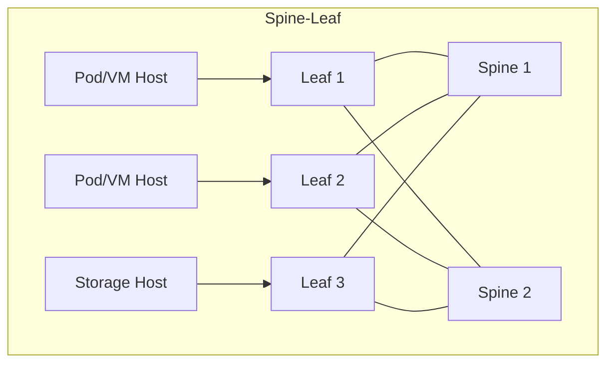

> **Complexity**: `[COMPLEX]` | Time: 90 minutes
>
> **Prerequisites**: [Module 2.1: Datacenter Fundamentals](/on-premises/provisioning/module-2.1-datacenter-fundamentals/), [Linux: TCP/IP Essentials](/linux/foundations/networking/module-3.1-tcp-ip-essentials/)

---

## Learning Outcomes

After this module, you will be able to:

1. **Explain** why three-tier networking underperforms for Kubernetes-heavy east-west traffic.
2. **Design** a spine-leaf or Clos fabric with explicit path diversity and measurable oversubscription limits.
3. **Compare** EBGP and IBGP control-plane models and predict path behavior with ECMP.
4. **Apply** EVPN-VXLAN design decisions for L2-style mobility and routed underlay operation.
5. **Evaluate** QoS and fabric settings needed for RoCEv2, and validate Kubernetes pod routing strategies, MTU policy, and direct BGP advertisement behavior.

## Why This Module Matters

Kubernetes traffic changes the economics of a datacenter network because workload traffic is no longer primarily north-south and the control plane must tolerate frequent workload movement and rapid scaling pulses. A topology that works for relatively static server workloads can become an incident generator once pods are rescheduled across racks and stateful services replicate at scale.

A datacenter architecture for Kubernetes must therefore do four things at once: move east-west traffic predictably, keep route control explicit, preserve deterministic failure behavior, and keep operations simple enough for maintenance windows. If one of these four goals is missing, teams often see good benchmarks in lab conditions and repeated production surprises under stress.

This module gives you the blueprint to design the fabric, not only to pass a single lab. Every major decision in this module links directly to why clusters remain stable during pod churn, why MTU issues only appear under mixed traffic, and why oversubscription that is acceptable for web workloads can collapse analytics and storage replication.

## What You'll Learn

This module covers the full production path from physical architecture to pod routing. You will learn when two-tier, three-tier, or spine-leaf decisions produce hidden failures, what control-plane boundary you should choose, how redundancy models differ (MC-LAG, ESI-LAG, vPC variants), and which fabric choices make Kubernetes rollout deterministic versus chaotic.

## Section 1: Why three-tier architecture degrades modern cluster behavior

Three-tier architecture evolved around centralized gateway patterns where aggregation and core roles provided scaling and policy consistency for mixed enterprise networks. In Kubernetes-heavy datacenters, traffic is both burstier and more lateral, so packets repeatedly traverse points that were never intended to absorb that density.

The failure mode is predictable: congestion concentrates in the middle layers before you can isolate the affected tenants. Maintenance windows that should be simple become larger because traffic redistributes unevenly, route reconvergence takes longer, and operations teams lose confidence in where the fault actually lives.

The practical sign is not only high utilization but asymmetric flow concentration across racks with acceptable CPU but poor tail latency. In that moment, topology is the bottleneck and not application code.

## Section 2: Spine-leaf and folded-Clos fundamentals

A spine-leaf fabric makes every leaf closer to every other leaf through the spine layer, reducing forced traversals. In a well-sized design, most workload traffic requires one additional logical hop through the spine instead of a long staged path.


```mermaid
graph TD
    subgraph "Spine-Leaf"
      L1[Leaf 1] --- S1[Spine 1]
      L1 --- S2[Spine 2]
      L2[Leaf 2] --- S1
      L2 --- S2
      L3[Leaf 3] --- S1
      L3 --- S2
      H1[Pod/VM Host] --> L1
      H2[Pod/VM Host] --> L2
      H3[Storage Host] --> L3
    end
```

Closed form intuition for why this works: if each leaf can forward to multiple equal paths, transient congestion can be distributed, and a single link problem has fewer downstream side effects than in hierarchical trees where one bad bridge or uplink can force many unrelated flows into contention.

## Section 3: ECMP, EBGP, and IBGP under Kubernetes assumptions

ECMP works when equal-path conditions are real and stable. The operational question is not whether you can use ECMP but whether your hash inputs and underlay policy produce predictable forwarding under multi-flow workloads. If you enable ECMP without observing path entropy, you may unintentionally collapse all heavy tenants into one path.

For control-plane design, many teams start with EBGP between leaf and spine and either keep iBGP as controlled reflectors or confine iBGP to constrained role-based domains. EBGP is usually easier to reason about for external policy boundaries, while IBGP can reduce adjacency churn inside a trust domain when route reflectors are strict and tested.

A robust on-prem design usually combines both patterns with explicit prefix filtering, consistent BGP communities, and explicit failover expectations so maintenance behavior is deterministic.

## Section 4: Oversubscription strategy and operational math

Oversubscription is where architecture assumptions become real SLO math. Use this formula:

`Downstream aggregate / Uplink aggregate = Oversubscription ratio`

Example design math for a leaf: at 48x25 GbE down and 6x100 GbE up, oversubscription is 1200/600 = 2:1. At 8:1, path saturation appears earlier and you should only allow it with strong telemetry. At 1:1, routing is resilient but capital intensive. At 4:1, design and operations are often balanced for mixed production.

The key point is that these are not only planning numbers; they are incident risk numbers. If your workloads include AI training, Ceph replication, or storage-heavy microservice meshes, the tolerance for oversubscription is much lower than for mostly bursty web APIs. Choose ratios per workload class and enforce them before rack expansion.

## Section 5: Leaf and TOR design with modern uplink bands

Leaf and TOR design is not just port count and speed; it is failure semantics. Typical clusters begin with 40/100/400GbE uplink planning depending on host density and growth horizon. High-density GPU clusters usually justify larger uplinks sooner, while mixed service fleets can often remain at 100 GbE longer if pod density is lower.

For practical operations, define whether uplinks are symmetric and whether each rack has independent spare capacity when one spine path is drained. If a maintenance action removes one uplink while keeping workloads unchanged, the fabric should still preserve service for a bounded period. If not, your baseline ratio was optimistic.

## Section 6: Layer 2 vs Layer 3 boundary placement in practice

There are two common boundary models for this module's scope.

Leaf-as-L3 places routing decisions close to hosts and is usually easier for Kubernetes rollout because pod routes and rack mobility stay constrained and observable. Core-as-L3 centralizes route policy and can simplify some global controls, but it increases the blast radius of central path behavior mistakes when workloads move quickly.

For clusters with frequent drain events, repeated node rescheduling, and strict incident SLAs, leaf-based routing boundaries are often easier to debug and safer during maintenance. You still keep core functions for filtering, edge routing, and inter-site constraints.

## Section 7: EVPN-VXLAN with routed movement semantics

VXLAN provides scale and tunnel semantics, while EVPN gives control-plane model for endpoint and route advertisement. Together they are a stronger foundation for VM-style and pod-style mobility than older flood-and-learn designs.

For routed fabrics, EVPN route semantics reduce convergence ambiguity by moving endpoint behavior into BGP signaling rather than implicit flooding. This matters when workloads move between rack-facing points because you need to preserve identity and policy without inducing silent learning storms.

## Section 8: Redundancy models: MC-LAG, ESI-LAG, and vendor variants

Dual-homing requires consistency across failure and failure detection models. MC-LAG and ESI-LAG solve the same operational requirement, one logical port channel across two devices, but implementation semantics differ.

In many environments, vPC in Cisco ecosystems is operationally known and strongly integrated with observability. Arista MLAG patterns are commonly chosen where EVPN and automation workflows are already standardized. Juniper multi-chassis designs often pair with explicit EVPN policy and predictable control-plane expectations in similar ways.

The wrong decision is not choosing one model and expecting interoperability to solve process gaps. The right decision is choosing one model, documenting failover behavior, and testing split-brain and peer isolation paths before production.

## Section 9: RoCEv2, AI/storage traffic, and queue behavior

RoCEv2 combines RDMA performance goals with routable transport behavior, which is a major reason it is used for AI and storage paths. The downside is that queue and loss policy now affects performance directly at first-order, so your fabric QoS design is no longer optional.

Plan your queue classes before you add bandwidth, because loss on the wrong class quickly turns a storage or AI burst into long tail latency across dependent services. This is especially important when a pod uses both control and data channels on adjacent ports because contention is correlated.

For most on-prem designs, keep lossless treatment explicit and narrowly scoped. If every class is treated as lossless, you may reduce throughput in ways that are hard to debug.

## Section 10: DSCP, 802.1p, and PFC as a control set

DSCP maps policy intent at L3, while 802.1p helps move that intent into bridge and switch behavior. PFC is a layer-2 pause mechanism and should be reserved for classes that truly require a lossless path.

A safe operational posture is to have exactly two levels of strictness: normal class and critical low-latency class, with explicit mapping and explicit observability on both DSCP and queue counters. That allows you to prove policy in incidents instead of arguing about whether a frame was intended to be protected.

## Section 11: MTU, jumbo frames, and MSS clamping for overlays

Overlay MTU is the most common hidden failure in Kubernetes overlays because one rogue segment can silently reduce throughput, create packet fragmentation, and hide errors as intermittent jitter. A consistent MTU policy must be enforced before broad pod scheduling.

Use explicit commands to verify both unencapsulated and encapsulated paths, then test MSS clamping where host policy does not enforce consistent path MTU negotiation by default.

```bash
ip link set eth0 mtu 1500
ip link show eth0
ping -M do -s 1460 10.0.0.1
ping -M do -s 8972 10.0.50.10
iptables -t mangle -A POSTROUTING -o vxlan0 -p tcp --tcp-flags SYN,RST SYN \
  -j TCPMSS --clamp-mss-to-pmtu
```

If one rack uses 1500 and another uses 9000 without strict policy, pod-to-pod paths can still pass synthetic tests while failing under sustained mixed-size production traffic.

## Section 12: SmartNIC and DPU realities

SmartNIC and DPU offload shifts flow handling out of host CPU and makes high-throughput fabrics viable at lower CPU saturation. NVIDIA BlueField and Intel IPU class platforms are representative examples where this reduction is practical in production.

Offload decisions should target measurable workloads: storage replication, heavy VXLAN encapsulation, and policy-heavy multi-tenant fabrics. Teams that offload everything by default often lose visibility and pay a debugging cost when observability does not keep up with offloaded features.

## Section 13: Kubernetes design decisions on this fabric

Pod network design is either overlay-first or routed-first; many teams choose hybrid models during migration. The right decision depends on MTU confidence, scale, and operational maturity.

For this module, the focus is routed-first with explicit BGP and direct pod routing where possible. A routed approach gives immediate underlay visibility and often better latency profiles for east-west traffic if your pod prefix management and route filters are robust.

Typical per-node or per-rack prefix models are valid, and both are acceptable when aligned to pod CIDR management and failure procedures. The one hard rule is consistent behavior under node and TOR failure.

If pod prefixes are advertised to TOR/BGP neighbors, your change-control docs must include what happens when one neighbor loses adjacency and which path becomes authoritative while recovery happens.

## Did You Know?

- ECMP gives operational value only when path entropy and route filtering are controlled end-to-end.
- EVPN transitions help in VM-to-container style movement because endpoint learning is more deterministic when control-plane signaling is explicit.
- Oversubscription can be technically acceptable but operationally dangerous when workload classes have synchronized bursts and storage coupling.
- A clean FRR lab can validate core routing behavior before first hardware-level rewiring in the rack.

## Common Mistakes

| Mistake | Risk | Fix |
|---|---|---|
| Deploying 8:1 early for mixed workloads | Latency spikes during burst windows | Start at 2:1 or 4:1 and increase only after telemetry-backed validation |
| Enabling many PFC classes | Lossless coupling and queue freeze | Keep lossless scope minimal and prove class behavior before scale |
| Mixing 1500 and 9000 paths without documentation | Fragmentation and intermittent drops | Define a single fabric MTU policy and enforce it in change controls |
| Using one MC-LAG model for all vendors without tests | Operational surprises and split-brain behavior | Match vendor model to runbook and test peer failure playbooks |
| Advertising oversized pod routes without filtering | Route table pressure and policy ambiguity | Add strict route maps or prefix control and aggregate where appropriate |
| Starting with core-centric routing in fast-changing clusters | Slow incident root-cause and longer outages | Use leaf-centric routing boundaries for early scale and frequent changes |

## Quiz

### Question 1
Your cluster with 6 racks sees persistent east-west saturation under load. Why does three-tier often worsen this behavior compared with spine-leaf?

<details>
<summary>Answer</summary>

Three-tier frequently inserts additional forwarding and policy transitions before packets reach a peer rack. This is why three-tier networking underperforms for Kubernetes-heavy east-west traffic. Spine-leaf gives shorter and more symmetric paths, so aggregate bottlenecks and asymmetry appear less often when workloads are highly lateral.
</details>

### Question 2
A spine-leaf design uses 2x2 topology with leaf+spine. Which statement about ECMP is most correct?

<details>
<summary>Answer</summary>

ECMP helps only when equal-cost, policy-consistent paths exist. If hash entropy is low or filtering is inconsistent, several flows can still aggregate onto one physical path despite multiple candidates.
</details>

### Question 3
You need direct-routed pods with TOR peers. Which route model is the usual starting choice for deterministic Kubernetes-on-prem operations?

<details>
<summary>Answer</summary>

Start with per-rack or per-node prefixes and explicit EBGP adjacency at the TOR boundary, combined with strict prefix acceptance and clear fallback behavior during peer changes. This applies EVPN-VXLAN design decisions for L2-style mobility and routed underlay operation by making endpoint movement explicit through BGP-referenced route types.
</details>

### Question 4
Under heavy AI/storage load, pod latency rises while NIC counters show no host saturation. What is the likely fabric-level cause?

<details>
<summary>Answer</summary>

A queue-control issue is likely, usually DSCP/802.1p/PFC misclassification. If the class that needs low loss is not preserved end-to-end, drops and pauses become the first practical bottleneck.
</details>

### Question 5
A rollout adds one new rack at 8:1 oversubscription. Immediately after, MTU errors appear only on replica traffic. What should you verify first?

<details>
<summary>Answer</summary>

Verify end-to-end path MTU consistency and confirm MSS handling on all egress edges for overlay paths, then confirm pod-level QoS and policy coupling for large flows. If one rack path remains at a lower MTU, this pattern matches intermittent fragmentation under real replica traffic sizes.
</details>

### Question 6
You observe intermittent pod connectivity when pod CIDRs are advertised directly from TOR BGP sessions. Which validation order best avoids false confidence?

<details>
<summary>Answer</summary>

Evaluate QoS and pod routing behavior together: first validate DSCP/802.1p intent and MTU policy, then validate that Kubernetes pod routes are consistently exported to the correct TOR peers through direct BGP advertisements. This pairing catches both fabric settings and routing side effects before AI/storage traffic starts to amplify loss.
</details>

### Question 7
You must replace one TOR without dropping traffic. What is the first control-plane condition before maintenance?

<details>
<summary>Answer</summary>

Ensure alternate path state is healthy and pods still have valid route advertisement paths after peer removal. Validate both BGP session behavior and the redundancy model (MC-LAG/ESI/vPC) against a tested maintenance runbook.
</details>

### Question 8
A Kubernetes team reports a RoCEv2 path that is fast once per day but unstable during replication storms. What should you inspect first?

<details>
<summary>Answer</summary>

Inspect PFC class scope, DSCP/802.1p mapping, and RoCEv2 flow behavior under microburst conditions. If all classes are treated as lossless or mappings drift per hop, the path will fail intermittently during high concurrency.
</details>

## Section 15: Practical design and control-plane checks for long-lived clusters

Long-lived on-prem fabrics fail for non-technical reasons first: process drift. The cleanest way to prevent that drift is to lock design primitives into a repeatable lifecycle:

- **Plan**: document spine-leaf ratio, link maps, control-plane AS topology, and pod IP allocation strategy.
- **Build**: validate FRR/BGP or hardware neighbor states with consistent policy before rack-wide scheduling.
- **Operate**: monitor BGP adjacencies, ECMP distribution, QoS counters, and overlay MTU mismatch metrics together.

For Kubernetes specifically, the most successful teams treat network behavior as part of release controls. Changes to L2/L3 boundary, BGP policies, or MTU values are deployed with the same severity as control plane component upgrades because each can affect both packet forwarding and scheduling stability.

A practical acceptance test before production often includes: one TOR maintenance event without workload loss, one pod rescheduling sweep, one replica burst test, and one rollback drill for one route-map change. If any single test changes the operational blast radius significantly, the design remains incomplete even if static checks pass.

Another practical pattern is to run a quarterly "fabric sanity week": freeze host scale for one day and run only controlled network and scheduling events. You compare baseline ECMP flow distribution, queue utilization, and route churn before and after planned changes. This approach makes non-functional regressions visible long before incident reports appear, and it gives the team concrete thresholds for what "acceptable" means during fast scaling windows.

You can also institutionalize route reviews by documenting, for each fabric change, (1) expected ECMP path count, (2) pod prefix advertisement behavior, and (3) failure mode for one peer loss. This avoids the common trap where teams treat underlay design as a static blueprint even while workload topology and node density keep changing. A one-page runbook that keeps these three signals in lockstep with maintenance windows is often enough to prevent repeated re-runs of the same incident.

## Section 16: Physical validation, optics, and management isolation

Even strong logical control planes fail when physical intent drifts. Before commissioning a rack, teams validate cable plants with pair naming discipline, end-to-end continuity checks, and expected latency baselines so the troubleshooting path stays linear when faults appear.

Optic compatibility is equally important. If uplink capacity is mixed between 100G and 400G, confirm transceiver compatibility, supported PAM4/FEC modes, lane rates, and connector types before configuration is considered complete. A simple "it negotiated" signal is insufficient without link budget and signal margin checks, because these parameters influence whether ECMP hash behavior and loss profiles stay consistent under microbursts.

Lights-out management VLAN design is often neglected in purely network-centric planning. Keep BMC and TOR management traffic separate from east-west data lanes, apply strict ACL boundaries, and verify out-of-band reachability under normal and degraded states. In practice this prevents a management-plane incident from being masked as a data-plane failure during scheduled fabric maintenance.

Finally, include a physical-to-logical handoff checklist before every change window. The checklist starts with optics and labels, then moves to BGP and EVPN status, then to pod-level acceptance checks. If all three are clean, you gain confidence that observed incidents after maintenance are likely workload-level and not fabric-level. If not, you have an immediate rollback path because you can pinpoint whether the fault was cable-plane, control-plane, or endpoint route behavior.

## Section 17: Architecture selection matrix for Kubernetes workloads

Most failures happen when teams choose a topology in a vacuum and later discover that a cluster profile does not map to traffic profile. Treat the network as a product decision matrix with two axes: workload pattern and failure expectation.

The first axis is workload pattern. For API-heavy microservices with moderate storage coupling, east-west load still dominates but packet size variance is manageable. For AI and storage-heavy clusters, flow concurrency becomes both denser and more synchronized. For mixed SaaS plus analytics, peaks from both categories overlap unpredictably. Each pattern changes acceptable oversubscription and queue policy and shifts the value of a larger spine count versus larger uplinks.

A useful first pass is to assign a baseline with three questions: (1) Are most flows short and bursty, (2) Is pod-to-pod locality important for strict latency, and (3) Does storage replication require low jitter more than raw throughput during contention. If you answer yes to all, three-tier and aggressive ECMP assumptions are wrong from day one. In those environments, spine-leaf with deterministic BGP policy is usually the safest starting topology.

The second axis is failure expectation. In fast-changing workloads where nodes are drained daily, route control must fail predictably even during partial fabric outages. A design where one misbehaving path silently captures most traffic may still look fine in synthetic tests but breaks under rolling updates. That is why path symmetry, hash consistency, and prefix granularity should be treated as capacity controls, not afterthought settings.

For teams comparing direct-routed pods with overlay-only designs, this axis is often the deciding factor. Direct-routed pods simplify many path diagnostics and can reduce encapsulation overhead, but they require disciplined pod CIDR segmentation, stronger prefix filtering, and stronger on-call runbooks. Overlay-only designs reduce route fanout at first but can accumulate state complexity with many migration events.

One practical matrix-based approach is:

- **Low mobility + moderate scale + strict budget**: smaller leaf uplinks may work if oversubscription is conservative and ECMP policy is tightly constrained.
- **High mobility + high scale + strict SLO**: choose wider uplinks and stricter route policy, including EVPN attributes that keep movement deterministic.
- **AI/storage + burst coupling + strict queueing requirement**: prioritize oversubscription below 4:1, enforce explicit QoS class boundaries, and use fabric-level RoCEv2 checks in every maintenance window.

This matrix is not a formula; it is a review artifact. Teams should revisit it when node count, workload mix, or rack density changes. If you keep using the same matrix entry for three quarters after multiple architecture shifts, you are auditing the past instead of architecture for today.

### L2 boundary vs. L3 boundary, revisited

Leaf-as-L3 is preferred by many operations teams for fast pods and faster fault isolation. The control-plane scope stays close to racks, and route policy can be tested per rack family. In high-turnover Kubernetes environments, this supports narrower blast radius because the failure surface maps to one leaf or one rack.

Core-as-L3 can still be correct when the environment has strong global policy and lower pod churn. It also simplifies external edge integration if your east-west workload is still secondary. The trade is that many operational questions become centralized, which slows root cause assignment during large scaling events.

The key decision point is not philosophical; it is diagnostic. If your team cannot answer “who changed this route and why” quickly when a pod moves, then a centralized edge has too broad a blast radius.

### BGP family decisions: EBGP, IBGP, and practical route reflection

Operationally, EBGP at leaf-spine is useful for boundary control because each leaf can own policies independently and still participate in broad ECMP behavior. EBGP is also easier to reason about when multiple administrative domains meet at spine exits.

IBGP often appears with reduced session counts, especially for larger fabrics with many leaves. That reduction comes with complexity: route reflection and policy consistency become mandatory. A missing reflector policy can show up as route path asymmetry that looks like random packet jitter, especially when pod prefixes are directly advertised.

When teams report stable BGP status during incidents but unstable pod behavior, they are often observing either inconsistent MED settings or implicit differences in import/export policy between neighbors. That is where explicit policy templates and linting before config push become non-negotiable.

You should not decide between EBGP and IBGP purely on table size. You should decide by operational blast radius, automation maturity, and failover expectation. If an on-call engineer cannot mentally validate one full failure domain in under a few minutes, your control model is too abstract for the current team structure.

### Redundancy families and behavior under failure

MC-LAG and ESI-LAG both attempt to provide rack-scale redundancy, but they differ in deployment assumptions and failure observability. In MC-LAG or vPC ecosystems, operations teams usually get broad vendor-integrated tooling and established runbooks. In ESI-LAG, you gain tighter EVPN-native semantics when configured correctly, and behavior under split traffic often maps better into fabric-native policy engines.

The practical question is not whether the pair mode is supported on paper, but whether it can recover from asymmetric failure and still preserve pod routing determinism. Split-brain, stale adjacency, and asymmetric hash behavior are the recurring risk buckets. Your runbook should include explicit outcomes for each failure type and a scriptable path to prove one side is safe before you reopen both uplinks.

For multi-vendor fabrics, mixed redundancy semantics can become the hardest variable to debug. If one platform behaves with immediate deterministic fail-open and another with delayed hold-down, path selection during transition becomes a black box. For that reason, many teams standardize on a single redundancy model per rack tier, even if vendor hardware is mixed elsewhere.

### Spine-count, leaf uplinks, and scale math in practice

Many teams over- or under-build spine count because they focus on peak theoretical throughput and ignore growth shape. For stable east-west behavior, a practical method is:

1. Estimate concurrent active tenant flow count in the busiest 95th percentile window.
2. Convert that into expected active path demand per leaf pair.
3. Validate whether uplink speed + count supports 1:1 or bounded oversubscription under burst replay assumptions.
4. Validate that ECMP distribution across multiple spines remains stable when a link drops.

This step is repeatable and catches many designs before hardware spend. If you cannot sustain expected flow concurrency with 1:1 or 2:1 while preserving queue health, you are optimizing for a peak condition that does not map to operational behavior.

Leaf uplink composition should also follow expected growth geometry. A migration from 48x25 + 2x100 to 2x100 + 1x400 often helps only if telemetry and failure drills confirm the new distribution remains stable before full migration. In some designs, adding one 400GbE uplink can be better than doubling everything because it changes headroom shape for replication bursts without forcing a full rebuild.

### Pod CIDR strategy and tor-facing route policy

For Kubernetes on this fabric, there are two strong approaches: per-node pod CIDR and per-pool pod CIDR. Per-node CIDR is operationally transparent during troubleshooting because you can quickly map one route to one host. Per-pool CIDR scales administrative complexity better when route table size constraints are strict.

Direct BGP advertisement from node or TOR boundaries has two implications. First, route granularity changes your control-plane blast radius. Second, failover behavior depends on where you keep authoritative routes. If a TOR loses adjacency and your failover policy defaults to broad blackholing, pods remain up in status but unreachable in routing.

This is where route-map design and prefix limits are safety controls, not optional config. You should include explicit route-limits and fallback behavior in the first production change after each topology update. In environments where pod churn is high, teams that skip this step often report incidents that look like random node slowness.

### Physical implementation checklist for rollout week

When you move from design to build, sequence matters. Start with deterministic connectivity verification at the lower layer, then routing adjacency, then workload validation. If you invert this order, you may pass each command and still ship ambiguous issues into production.

At the cable layer, validate that each TOR pair uses intended transceiver classes, cable length assumptions, and labeling conventions before any logical policy is set. At the optical layer, run link-margin checks for both idle and loaded states. At the switch layer, validate that the underlay and overlay policies produce exactly the intended ECMP and route advertisements.

Only when these pass do you enable advanced settings such as stricter PFC class mapping or new pod prefix segmentation. If a site adds AI nodes or storage replicas during rollout, repeat the entire sequence in a controlled subset and only then scale out.

### Operational runbook template you can adopt immediately

Keep one template for every change window with four mandatory sections: intent, expected control-plane state, verification commands, and rollback criteria. In intent, write the topology delta and workload rationale in two lines. In expected state, write the target BGP session state, ECMP path expectation, and target pod route behavior for at least one sample workload. In verification, include both underlay metrics and pod-layer checks. In rollback, define clear criteria, not generic statements.

A sample failure drill for this module is:
- remove one leaf-spine link,
- verify alternate forwarding remains valid within a bounded time,
- verify pod-to-pod control and data paths for at least one replicated and one latency-sensitive workload,
- and restore under documented rollback only if all three are confirmed.

This discipline prevents emergency drift. It is especially important when teams run FRR-based topology simulations and then touch physical underlay with the same staff on the same week.

## Section 18: Build plans, migration modes, and observability wiring

Greenfield designs should start with a stable underlay template and then layer Kubernetes assumptions. Begin by selecting spine count, leaf speed envelopes, and expected path width. Then lock host-to-leaf behavior before defining pod overlays or EVPN policy. This sequence reduces rework because the most expensive changes are usually the ones made after IP and route policy are already coupled to existing labels.

For brownfield environments, migration strategy matters as much as final topology. Teams that attempt a single-step replacement from three-tier to leaf-spine usually underestimate control-plane coupling. A lower-risk pattern is to isolate one row of racks, move a few non-critical workloads, and validate both ECMP and pod-routing behavior under real traffic windows before expanding.

Another practical migration choice is staged tunnel overlay migration versus direct underlay migration. If overlays are currently heavily deployed, keep VXLAN and overlay semantics in place while re-homing underlay links and policy boundaries in place. This allows teams to maintain endpoint behavior for one cycle and validates that MTU, MSS, and route filtering are stable before removing legacy assumptions.

In many environments, automation is not optional in this phase. Use consistent templates for FRR or device OS policy and enforce linting for neighbor definitions, prefix length boundaries, and path attributes. Even with manual review, repeated edits across multiple racks tend to diverge; drift is rarely obvious until an incident. Automation catches this in minutes instead of during maintenance windows.

Observability should be connected to both fabric control and Kubernetes scheduling planes. Track at least five signals together: ECMP hash utilization per pair, BGP route churn, packet drop class distribution, MTU-related re-transmit or fragmentation indicators, and pod scheduling latency versus node network utilization. If one metric is absent, the signal set is incomplete and incident triage will often begin from wrong assumptions.

Queue discipline in this environment should be modeled at least as a two-part policy: one path that permits loss and one path that enforces strict behavior for storage and AI workloads. Teams trying to make many classes lossless often pay with global backpressure and avoidable latency coupling. A constrained policy is more predictable and usually easier to automate, especially when Kubernetes replicas stress many hosts simultaneously.

For operational handoff, keep a weekly review in which three teams (network, platform, and application) verify one shared set of assumptions. The network team validates fabric-level behavior, the platform team validates node rescheduling and BGP propagation assumptions, and the application team validates service-level effects. If one team reports no issue but another sees incident signals, the missing link is often documentation rather than hardware.

A practical observability stack for this module combines device telemetry, FRR health checks in containers, and cluster events. The goal is not to collect more dashboards. The goal is to force a single causal path: is a behavior change caused by topology, by route policy, by transport MTU, or by pod scheduling. The team can then remediate at the right layer without spending 30 minutes debating which layer is responsible.

## Section 19: Extended FRR-led design validation sequence

To keep the abstract design ideas testable, use one reproducible simulation sequence in a staging lab before any production cutover. The sequence below is intentionally sequential:

Start with a clean underlay-only baseline: static neighbors between two spines and two leaves, with no EVPN advertisements. Verify no duplicate BGP neighbors and verify route-count expectations. A clean baseline in this first stage lets you identify pure adjacency issues before overlay complexity begins.

In stage two, enable a minimal EVPN-VXLAN configuration and confirm endpoint route imports and exports are explicit. Keep only one tenant context active and confirm endpoint identity mapping with stable route-reflection logic. If one route leaks between contexts, stop and isolate policy first.

In stage three, add a second tenant and scale to multiple /24 prefixes per leaf. The test at this stage is twofold: ensure prefix growth does not cause route churn and verify pod or workload mobility assumptions still map to deterministic exit behavior. If mobility appears to work only in small state and fails under larger growth, your policy model is too narrow.

Stage four introduces controlled failure. Pull one leaf-spine link, then one TOR session, then one host segment. After each failure, capture whether remaining neighbors still produce expected ECMP fanout and whether pod reachability remains within bound. This sequence is where three-tier anti-patterns are often revealed early.

Stage five is QoS pressure. Generate synthetic AI/storage-like bursts and observe queue counters while varying DSCP and PFC combinations. If one class dominates, reduce the number of lossless classes and constrain admission before deployment. If all classes are treated the same, expect longer recovery windows under bursty replication patterns.

Stage six adds MTU stress. Keep one path at smaller MTU and one path at larger MTU and run mixed-size workload probes. Confirm MSS handling and pod-level behavior under long-lived transfers. This stage demonstrates whether the production network can absorb mixed endpoints after cutover.

Stage seven validates management resilience. Run the same sequence once with management plane reachability limited to the out-of-band VLAN and once with normal data-plane dependencies. If one sequence fails while the other passes, operations policy, not data-plane control logic, is likely the first remediation target.

At this point, capture one decision matrix with pass/fail for each stage and keep it versioned with the network change request. This matrix prevents implicit assumptions from entering the next quarter as “that worked before” statements without evidence.

When you move to production, use the same sequence with only a few deltas: replace synthetic traffic with real SLO-critical workloads and replace one rack at a time. The same staging logic remains valid, and it is the difference between controlled adoption and repeated emergency rollback after each topology wave.

For production cutover readiness, make the acceptance condition explicit: no single queue policy, BGP event, or pod-mobility action should produce cascading impact beyond one maintenance window. If a change in any one of those domains breaks two or more of these areas together, pause rollout and treat the change as a design revision, not an operational adjustment. This rule is how teams prevent late-stage regressions from turning into multi-day incidents.

Track the result as a signed-off artifact so the next iteration has a clear baseline and a measurable rollback boundary.

## Section 14: Kubernetes-aligned routing and underlay behavior

Two pod IP allocation patterns dominate on-prem Kubernetes fabrics:

The first pattern allocates pod CIDRs per node and advertises those prefixes as BGP routes from each rack spine/leaf boundary. This is the cleanest model when you want deterministic host-level telemetry because every advertised route maps to a scheduling and failure domain. You can quickly answer “which rack carries this workload?” from route intent alone.

The second pattern advertises larger aggregate prefixes at the TOR boundary and relies more on underlay policies for scale. This reduces route scale pressure and makes large fleets easier to automate, but it can stretch failure semantics because one routing decision may represent many hosts. Both patterns are valid when the maintenance process and IPAM policy are explicit.

In either model, direct-routed pods should begin with one control-plane rule: route export must be symmetric, constrained, and auditable before scale. A direct adjacency between host-facing TOR and upstream BGP speakers is powerful, but it does not replace good prefix filters, route maps, and rollback behavior when a peer drops.

When Kubernetes control-plane components and workloads scale quickly, ECMP behavior must be paired with pod movement policy. If pod remap happens while ECMP hash inputs are weak, you can see micro-convergence even if all interfaces are healthy. Applying EVPN-VXLAN design decisions for L2-style mobility and routed underlay operation is therefore not a pure design exercise: it is an operations exercise in avoiding non-deterministic churn.

Operationally, keep one hard rule: every routing change that affects pod exposure must be test-driven end to end. Run a single maintenance simulation that removes one TOR, observe ECMP and host ARP/neighbor state, and verify that replica and control traffic both retain bounded paths. If your lab and pipeline cannot model that path, your production incidents will define the missing case first.

## Hands-On Exercise: Three practical labs

### Task 1: FRR spine-leaf routing lab in containers

Build a minimal EBGP lab with two spines and two leaves. The purpose is to validate adjacency, route advertisement, and two-path visibility without touching physical devices.

```bash
mkdir -p /tmp/frr-lab && cd /tmp/frr-lab
cat > compose.yaml <<'YAML'
services:
  spine1:
    image: frrouting/frr:v10.6.0
    container_name: spine1
    command: sleep infinity
  spine2:
    image: frrouting/frr:v10.6.0
    container_name: spine2
    command: sleep infinity
  leaf1:
    image: frrouting/frr:v10.6.0
    container_name: leaf1
    command: sleep infinity
  leaf2:
    image: frrouting/frr:v10.6.0
    container_name: leaf2
    command: sleep infinity
YAML

docker compose up -d

docker exec -it leaf1 vtysh -c 'configure terminal' \
  -c 'router bgp 65010' \
  -c 'bgp router-id 10.0.0.11' \
  -c 'neighbor 10.0.0.101 remote-as 65000' \
  -c 'neighbor 10.0.0.102 remote-as 65000'

docker exec -it leaf1 vtysh -c 'show bgp summary'
```

### Task 2: Oversubscription and uplink planning

Compute oversubscription for three models and choose the one with acceptable burst posture for AI/storage mixed traffic while preserving one maintenance-safe path under one-to-three spine failure assumptions.

- Model A: 48x25GbE host-facing, 2x100GbE uplinks.
- Model B: 48x25GbE host-facing, 2x100GbE + 1x400GbE uplinks.
- Model C: 64x40GbE host-facing, 4x100GbE uplinks.

Document chosen ratio, expected worst case burst profile, and the first alert you would add for regression detection.

### Task 3: MTU and QoS validation from a node perspective

Use controlled probes on 1500 and 9000 underlay policies, then test whether DSCP class and PFC mapping remains stable across maintenance and BGP transitions.

### Success Criteria

- [ ] FRR containers report stable neighbors and usable route visibility.
- [ ] Chosen oversubscription model matches burst profile and has explicit maintenance assumptions.
- [ ] MTU policy and QoS verification identifies one class for lossless traffic and one non-lossless class.

## Next Module

Continue to [Module 3.2: BGP & Routing for Kubernetes](../module-3.2-bgp-routing/) to implement production-grade route peering patterns and operationally proven BGP practices.

## Sources

- [Juniper EVPN-VXLAN overview](https://www.juniper.net/documentation/us/en/software/junos/evpn-vxlan/topics/concept/evpn-vxlan-data-center-overview.html)
- [RFC 7348 — VXLAN](https://datatracker.ietf.org/doc/html/rfc7348)
- [RFC 7432 — EVPN](https://datatracker.ietf.org/doc/html/rfc7432)
- [RFC 7938 — BGP data center scaling](https://datatracker.ietf.org/doc/html/rfc7938)
- [Cisco Nexus-9k spine-leaf guidance](https://www.cisco.com/c/en/us/products/collateral/switches/nexus-9000-series-switches/white-paper-c11-738358.html)
- [FRRouting documentation](https://docs.frrouting.org/)
- [RFC 8939 — RoCEv2](https://datatracker.ietf.org/doc/html/rfc8939)
- [OpenFabrics](https://www.openfabrics.org/)
- [SNIA RDMA flow-control content](https://www.snia.org/node/18815)
- [Kubernetes networking concepts](https://kubernetes.io/docs/concepts/cluster-administration/networking/)
- [Linux kernel networking documentation](https://docs.kernel.org/networking/)
- [Broadcom DPU overview](https://www.broadcom.com/products/ethernet-connectivity/network-adapters/p2100g)
- [Juniper VXLAN/EVPN integration](https://www.juniper.net/documentation/us/en/software/junos/evpn/topics/concept/vxlan-evpn-integration-overview.html)
