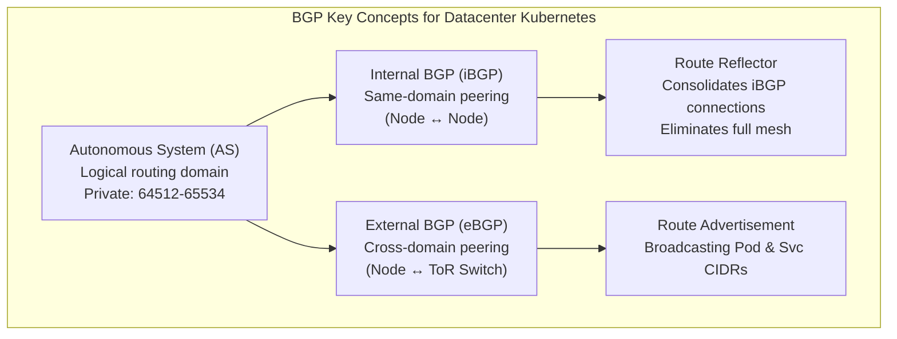
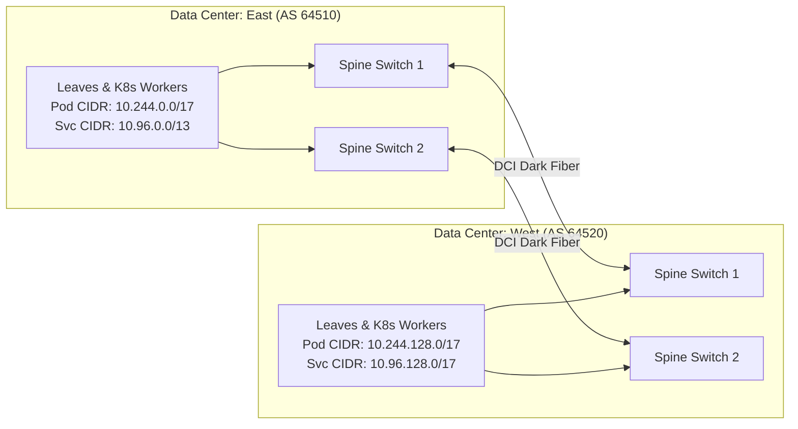

> **Complexity**: `[COMPLEX]` | Time: 60 minutes
>
> **Prerequisites**: [Module 3.1: Datacenter Network Architecture](../module-3.1-datacenter-networking/), [Advanced Networking: BGP Routing](/platform/foundations/advanced-networking/module-1.4-bgp-routing/)

---

## Why This Module Matters

The Facebook 2021 BGP outage (see *Route 53*) <!-- incident-xref: facebook-2021-bgp --> shows that a single routing-control mistake can collapse global reachability, which is why BGP-based cluster designs must keep failure domains explicit and operationally testable.

In a cloud-managed Kubernetes service, pod networking is abstracted away and "just works." AWS VPC CNI assigns ENI IPs directly, GKE leverages Dataplane V2, and Azure CNI plugs seamlessly into the native VNet. However, on bare metal or on-premises infrastructure, there is no underlying magical cloud network. You must architect the integration of your Kubernetes pod networking with the physical datacenter switching fabric. 

BGP (Border Gateway Protocol) is the standard way to do this. It was designed for internet-scale routing between ISPs, but it has been adopted by datacenter networks because it is simple, stable, and scales horizontally. By configuring Kubernetes nodes to dynamically announce their pod IP subnets via BGP directly to datacenter switches, every pod becomes a directly routable entity on the physical network. This architecture completely eliminates the need for software overlays, avoids the computational overhead of VXLAN or IPIP encapsulation, and abolishes complex NAT traversal rules.

---

## What You'll Be Able to Do

After completing this rigorous module, you will be able to:

1. **Implement** native eBGP peering sessions between Kubernetes nodes and Top-of-Rack (ToR) switches to facilitate pure Layer 3 pod routing without encapsulation overhead.
2. **Design** highly available routing topologies utilizing BGP route reflectors to circumvent the limitations of full-mesh architectures in massive bare-metal clusters.
3. **Evaluate** the distinct BGP mechanisms across leading CNI plugins—comparing Calico's BIRD daemon against Cilium's embedded GoBGP implementation—to select the optimal stack.
4. **Diagnose** route advertisement failures, prefix-list mismatches, and session flapping events in sophisticated multi-datacenter environments.

---

## What You'll Learn

- The architectural divide between external BGP (eBGP) and internal BGP (iBGP) in leaf-spine networks.
- Calico BGP peering configurations, integrating the BIRD daemon and confd generation.
- Cilium's evolutionary shift to GoBGP and the transition from v1 to v2 BGP APIs.
- MetalLB's role in advertising LoadBalancer IPs versus CNI pod routing.
- The strategic deployment of route reflectors for scaling beyond one hundred nodes.
- Advanced mechanisms like graceful restart and unnumbered BGP peering.

---

## Section 1: The Core Role of BGP in Kubernetes Networking

Kubernetes core networking spec (CNI) does not include BGP. The foundational specification only mandates that containers must be able to communicate across nodes without Network Address Translation (NAT). Because BGP routing is not implemented in Kubernetes core, it requires sophisticated CNI plugins such as Calico, Cilium, kube-router, or external load-balancer add-ons such as MetalLB to provide this dynamic routing capability.

### Why BGP Conquered the Datacenter

Historically, datacenters relied on complex Layer 2 spanning trees or complex internal routing protocols. Today, BGP has entirely subsumed datacenter networking architectures. 

| Protocol | Best For | Why Not for K8s |
|----------|---------|-----------------|
| **OSPF** | Enterprise campus | Complex, stateful, hard to troubleshoot at scale |
| **IS-IS** | Service provider | Requires all nodes to run IS-IS (complex) |
| **BGP** | Everything | Simple, policy-rich, runs on every datacenter switch |

*BGP won the datacenter because of:*
- **Simplicity**: You define a peer, announce specific networks, and apply strict inbound/outbound prefix filtering.
- **Granular Policy**: Administrators can manipulate local preference, tag communities, and heavily filter routes.
- **Massive Scalability**: Built to manage the entire global internet routing table, BGP handles datacenter loads effortlessly.

When a CNI like Calico operates in pure BGP mode, it provides a pure Layer 3 pod network where pods are directly routable without encapsulation. Calico programs routes directly into the Linux kernel routing tables of the nodes and peers with the physical network infrastructure, entirely avoiding the performance penalties of VXLAN tunneling.

### BGP Key Concepts for Kubernetes 

```text
┌─────────────────────────────────────────────────────────────┐
│               BGP KEY CONCEPTS                               │
│                                                               │
│  AS (Autonomous System):                                    │
│  A group of routers under one administrative domain.        │
│  Each gets a number: 64512-65534 (private range)            │
│                                                               │
│  eBGP (External BGP):                                       │
│  Peering between DIFFERENT AS numbers.                      │
│  Used: K8s node (AS 64512) ↔ ToR switch (AS 64501)         │
│                                                               │
│  iBGP (Internal BGP):                                       │
│  Peering between SAME AS number.                            │
│  Used: Node-to-node mesh within the cluster                 │
│                                                               │
│  Route Advertisement:                                        │
│  "I have these networks: 10.244.1.0/24, 10.244.2.0/24"     │
│  Node tells the switch about its pod CIDR                   │
│                                                               │
│  Route Reflector:                                            │
│  Reduces iBGP mesh: instead of N×N peerings,               │
│  all nodes peer with 2-3 reflectors                         │
│                                                               │
└─────────────────────────────────────────────────────────────┘
```

In native rendering, this topology is visualized as:



When structuring your datacenter, understanding Autonomous System Numbers (ASNs) is paramount. The 16-bit private BGP ASN range is exactly 64512–65534, as defined rigorously by RFC 6996, reserving 1,023 values for private datacenter use (ASN 65535 is explicitly excluded). For massive hyperscale environments, RFC 6996 also defines a 32-bit private BGP ASN range spanning from 4200000000 to 4294967294, unlocking over 94 million private designations.

---

## Section 2: Deep Dive into Calico's BGP Control Plane

Calico remains one of the most widely deployed CNIs for bare-metal Kubernetes architectures. Calico's latest stable open-source release is v3.31.4, released on February 21, 2026. Under the hood, the `calico/node` container critically bundles BIRD (an open-source internet routing daemon) as its primary BGP implementation. 

Calico utilizes a highly dynamic architecture where `confd` monitors the Calico datastore for any BGP configuration changes. When a change occurs, `confd` dynamically regenerates the BIRD configuration files on the fly and immediately signals the BIRD daemon to perform a reload. 

To manage this complex routing, Calico exposes several powerful Kubernetes Custom Resource Definitions (CRDs): `BGPConfiguration` (for global mesh and ASN settings), `BGPPeer` (defining exact peering IP relationships), `BGPFilter` (managing sophisticated route import and export policies), and `CalicoNodeStatus` (exposing real-time BGP session states directly to cluster administrators). Furthermore, Calico extensively supports modern networking requirements, including robust IPv6 and dual-stack (IPv4+IPv6) BGP routing environments.

> **Pause and predict**: With 100 nodes in a full BGP mesh, each node maintains 99 BGP sessions. Calculate the total number of sessions cluster-wide. Now imagine one node restarts -- how many BGP sessions need to reconverge? This is why the first step below is critical.

### Step 1: Mitigating the Full-Mesh Problem

By default, Calico initiates a full iBGP mesh across the cluster. Official Calico documentation explicitly states that full-mesh works great for small and medium-size deployments of say 100 nodes or fewer; however, at significantly larger scales, a full-mesh topology becomes computationally disastrous. 

To resolve this, we first apply a global `BGPConfiguration` to disable the default mesh:

```yaml
# Disable full mesh, use route reflectors instead
apiVersion: projectcalico.org/v3
kind: BGPConfiguration
metadata:
  name: default
spec:
  logSeverityScreen: Info
  nodeToNodeMeshEnabled: false
  asNumber: 64512
  # Advertise service ClusterIPs externally
  serviceClusterIPs:
    - cidr: 10.96.0.0/12
  # Advertise external IPs (LoadBalancer services)
  serviceExternalIPs:
    - cidr: 10.0.50.0/24
```

### Step 2: Implementing BGP Route Reflectors

Next, we establish Route Reflectors. These designated nodes (usually control-plane servers) aggregate routes and reflect them to worker nodes, dropping the peering requirement from O(N²) to O(N).

```bash
# Label nodes as route reflectors
kubectl label node cp-01 route-reflector=true
kubectl label node cp-02 route-reflector=true
kubectl label node cp-03 route-reflector=true

# Set route reflector cluster ID on each
kubectl annotate node cp-01 projectcalico.org/RouteReflectorClusterID=1.0.0.1
kubectl annotate node cp-02 projectcalico.org/RouteReflectorClusterID=1.0.0.1
kubectl annotate node cp-03 projectcalico.org/RouteReflectorClusterID=1.0.0.1
```

We configure the non-reflector nodes to peer strictly with the designated route reflectors. 

```yaml
# Non-RR nodes peer with route reflectors
apiVersion: projectcalico.org/v3
kind: BGPPeer
metadata:
  name: peer-with-route-reflectors
spec:
  nodeSelector: "route-reflector != 'true'"
  peerSelector: route-reflector == 'true'
```

Simultaneously, the route reflectors must form a complete mesh amongst themselves to ensure absolute consistency of the cluster's routing table:

```yaml
# Route reflectors peer with each other
apiVersion: projectcalico.org/v3
kind: BGPPeer
metadata:
  name: rr-mesh
spec:
  nodeSelector: route-reflector == 'true'
  peerSelector: route-reflector == 'true'
```

---

## Section 3: Peering with the Physical Datacenter Network

With internal cluster routing stabilized, the infrastructure must bridge to the physical network. This requires establishing eBGP connections to the datacenter Top-of-Rack (ToR) switches. We use eBGP because the Kubernetes nodes and datacenter switches represent separate administrative domains, minimizing the risk of routing storms propagating upwards into the spine.

### Step 3: Defining ToR Peerings in Calico

```yaml
# Peer all nodes in rack-a with their ToR switch
apiVersion: projectcalico.org/v3
kind: BGPPeer
metadata:
  name: rack-a-tor
spec:
  peerIP: 10.0.20.1
  asNumber: 64501
  nodeSelector: rack == 'rack-a'
```

We deploy a parallel configuration for nodes located in the secondary rack domain:

```yaml
# Rack B ToR
apiVersion: projectcalico.org/v3
kind: BGPPeer
metadata:
  name: rack-b-tor
spec:
  peerIP: 10.0.20.65
  asNumber: 64502
  nodeSelector: rack == 'rack-b'
```

> **Stop and think**: In the ToR switch configuration below, notice the `route-map ACCEPT-K8S` and `prefix-list K8S-PODS`. These restrict which routes the switch will accept from Kubernetes nodes. What would happen if you skipped this filtering and accepted all routes from K8s nodes? (Hint: think about what happens if a misconfigured Calico node advertises a default route.)

### Step 4: Configuring FRRouting on the ToR Switch

The physical network switches must be configured to receive these peering requests. In modern datacenters, FRRouting (FRR) is the industry standard routing daemon. FRRouting's latest release is v10.6.0, released March 26, 2026, bringing advanced features like 16-bit next-hop weights and extensive ECMP (Equal-Cost Multi-Path) integration.

```bash
# /etc/frr/frr.conf on the ToR switch (FRRouting)
router bgp 64501
  bgp router-id 10.0.20.1
  bgp bestpath as-path multipath-relax

  # Peer with all K8s nodes in this rack
  neighbor K8S_NODES peer-group
  neighbor K8S_NODES remote-as 64512
  neighbor 10.0.20.10 peer-group K8S_NODES  # worker-01
  neighbor 10.0.20.11 peer-group K8S_NODES  # worker-02
  neighbor 10.0.20.12 peer-group K8S_NODES  # worker-03

  # Accept pod CIDR routes from K8s nodes
  address-family ipv4 unicast
    neighbor K8S_NODES soft-reconfiguration inbound
    neighbor K8S_NODES route-map ACCEPT-K8S in
    neighbor K8S_NODES route-map ADVERTISE-DEFAULT out
  exit-address-family

  # Peer with spine switches
  neighbor 10.0.20.254 remote-as 64500  # spine-1
  neighbor 10.0.20.253 remote-as 64500  # spine-2

! Route maps
route-map ACCEPT-K8S permit 10
  match ip address prefix-list K8S-PODS
ip prefix-list K8S-PODS seq 10 permit 10.244.0.0/16 le 26
ip prefix-list K8S-PODS seq 20 permit 10.96.0.0/12 le 32
```

### Verifying BGP State

Verification is a mandatory phase of execution. Check the daemon states from both sides of the boundary:

```bash
# On a K8s node (Calico)
calicoctl node status
# Calico process is running.
#
# IPv4 BGP status
# +--------------+-------------------+-------+----------+-------+
# | PEER ADDRESS |     PEER TYPE     | STATE |  SINCE   | INFO  |
# +--------------+-------------------+-------+----------+-------+
# | 10.0.20.1    | node-to-node mesh | up    | 08:15:30 | Est.  |
# | 10.0.20.10   | node-to-node mesh | up    | 08:15:31 | Est.  |
# +--------------+-------------------+-------+----------+-------+

# Check advertised routes
calicoctl get bgpPeer -o wide

# On the ToR switch
show bgp ipv4 unicast summary
# Neighbor        V   AS    MsgRcvd  MsgSent  Up/Down  State
# 10.0.20.10      4  64512    1234     5678   12:34:56 Estab
# 10.0.20.11      4  64512    1234     5678   12:34:56 Estab

show bgp ipv4 unicast
# Network          Next Hop       Metric  Path
# 10.244.1.0/24    10.0.20.10     0       64512 i
# 10.244.2.0/24    10.0.20.11     0       64512 i
# 10.96.0.0/12     10.0.20.10     0       64512 i
```

---

## Section 4: Cilium, MetalLB, and Alternative BGP Architectures

While Calico is foundational, modern platforms increasingly utilize alternative implementations like Cilium or externalizers like MetalLB. 

### The Evolution of Cilium's BGP Control Plane

Cilium's latest stable release is v1.19.2 (released March 23, 2025). The project's approach to BGP has evolved radically. Initially, Cilium 1.10 added BGP strictly via an integration with MetalLB. However, Cilium 1.12 introduced a native BGP control plane based directly on GoBGP, completely replacing the earlier MetalLB integration. Cilium's BGP implementation uses GoBGP as its underlying routing library, cleverly embedded directly inside the `cilium-agent` process rather than running as a separate daemon.

Cilium's BGP Control Plane was labeled Beta through v1.15. While the transition of Cilium's BGP Control Plane to General Availability (GA) is commonly associated with version 1.16, official documentation from that period was often inaccessible or heavily modified, making the exact version of GA promotion unverified. However, it is an established fact that Cilium v1.16 definitively introduced the powerful v2 BGP API array, including `CiliumBGPClusterConfig`, `CiliumBGPPeerConfig`, `CiliumBGPAdvertisement`, and `CiliumBGPNodeConfigOverride`.

Administrators maintaining older setups may still see legacy `CiliumBGPPeeringPolicy` configurations, which served as the v1 API. Be aware that the `CiliumBGPPeeringPolicy` (v1 BGP API) was deprecated in Cilium v1.18 and fully removed in v1.19.

Below is an illustration of legacy Cilium BGP Configuration prior to v1.19 removal:

```yaml
apiVersion: cilium.io/v2alpha1
kind: CiliumBGPPeeringPolicy
metadata:
  name: rack-a
spec:
  nodeSelector:
    matchLabels:
      rack: rack-a
  virtualRouters:
    - localASN: 64512
      exportPodCIDR: true
      serviceSelector:
        matchExpressions:
          - key: somekey
            operator: NotIn
            values: ["never-match"]  # Advertise all services
      neighbors:
        - peerAddress: "10.0.20.1/32"
          peerASN: 64501
          connectRetryTimeSeconds: 30
          holdTimeSeconds: 90
          keepAliveTimeSeconds: 30
          gracefulRestart:
            enabled: true
            restartTimeSeconds: 120
```

Verifying Cilium peering states relies on the native CLI toolset rather than standard network binaries:

```bash
# Verify Cilium BGP status
cilium bgp peers
# Node       Local AS  Peer AS  Peer Address  Session State  Uptime
# worker-01  64512     64501    10.0.20.1     established    4h32m
# worker-02  64512     64501    10.0.20.1     established    4h32m

cilium bgp routes advertised ipv4 unicast
# Prefix            Next Hop    AS Path
# 10.244.1.0/24     10.0.20.10  64512
# 10.96.0.1/32      10.0.20.10  64512
```

### MetalLB: Focused Service Advertising

It is crucial to understand that MetalLB BGP mode advertises LoadBalancer service IPs to upstream routers; pod-to-pod routing via BGP is NOT a MetalLB function. 

MetalLB's latest stable release is v0.15.3. Administratively, MetalLB supports CRD-only configuration as of v0.13.0, entirely deprecating the older ConfigMap-based approaches. It uniquely supports three distinct BGP backends: native (pure-Go), FRR, and FRR-K8s. The native implementation is highly restricted; for instance, MetalLB BFD (Bidirectional Forwarding Detection) support is available only when using the FRR or FRR-K8s backends, not the native backend. 

The FRR-K8s backend was added as experimental in v0.14.0 and remains experimental in v0.15.3, providing a wrapper for FRR to share resources with other cluster components. In terms of configuration stability, MetalLB's `BGPPeer` v1beta1 API is actively deprecated; `v1beta2` is the current recommended version. MetalLB additionally supports advanced mechanisms like BGP community advertisement via a dedicated `Community` CRD (v1beta1) that cleanly maps friendly names to numeric community strings. 

Further advancements in the MetalLB FRR stack include the addition of BGP graceful restart capability in v0.14.6, dynamic ASN negotiation via a `DynamicASN` field on the `BGPPeer` object in v0.14.9, and comprehensive support for unnumbered BGP peering (peering via interfaces without explicitly configured IP addresses) introduced in v0.15.0.

### Kube-Router: The Lightweight Alternative

For environments requiring extreme minimalism, kube-router remains highly relevant. kube-router's latest stable release is v2.8.1, released April 6, 2025. By default, kube-router establishes a heavy footprint by utilizing iBGP with a default cluster ASN of 64512 and aggressively forms a full-mesh peering between all cluster nodes by default.

---

## Section 5: Multi-Site BGP Architecture

Scaling a bare-metal Kubernetes deployment across geographically distributed datacenters demands meticulous BGP topography.

```text
┌─────────────────────────────────────────────────────────────┐
│              MULTI-SITE BGP                                  │
│                                                               │
│  DC-East (AS 64510)              DC-West (AS 64520)         │
│  ┌──────────────────┐           ┌──────────────────┐        │
│  │ Spines           │           │ Spines           │        │
│  │ ┌──────┐┌──────┐ │           │ ┌──────┐┌──────┐ │        │
│  │ │Spine1││Spine2│ │◄── DCI ──►│ │Spine1││Spine2│ │        │
│  │ └──────┘└──────┘ │  (dark    │ └──────┘└──────┘ │        │
│  │                  │  fiber)   │                  │        │
│  │ Leaves + K8s     │           │ Leaves + K8s     │        │
│  │ Pod CIDR:        │           │ Pod CIDR:        │        │
│  │ 10.244.0.0/17    │           │ 10.244.128.0/17  │        │
│  │ Service CIDR:    │           │ Service CIDR:    │        │
│  │ 10.96.0.0/13     │           │ 10.96.128.0/17   │        │
│  └──────────────────┘           └──────────────────┘        │
│                                                               │
│  Key rules:                                                  │
│  1. Non-overlapping pod/service CIDRs per DC                │
│  2. DCI link carries only summarized routes                 │
│  3. etcd stays within one DC (latency constraint)           │
│  4. BGP communities tag routes by origin DC                 │
│  5. Services can be exposed in both DCs via anycast         │
│                                                               │
└─────────────────────────────────────────────────────────────┘
```

Rendered natively in Mermaid:



### Traffic Engineering across Datacenters

To actively control traffic flows between datacenters, administrators employ two key BGP mechanisms:
1. **AS Path Prepending**: By artificially lengthening the AS path (e.g., announcing routes with `64510 64510 64510`) for a specific prefix out of DC-East, you make it less desirable. Upstream routers will prefer the shorter path to DC-West for that service, providing active/standby failover capabilities.
2. **BGP Communities**: By tagging routes with specific BGP community values (e.g., `64510:100` for local-only, `64510:200` for global-export), datacenter spine routers can apply predefined route-maps to filter or alter preferences based purely on the tag rather than managing massive IP prefix lists.

---

## Did You Know?

- **BGP manages over 900,000 routes on the public internet** as of 2024. Your datacenter with a few hundred pod CIDRs is trivially small by comparison. BGP will never be the bottleneck.
- **RFC 6996 reserves exactly 1,023 values** for 16-bit private ASNs and an astounding **94,967,295 ASNs** for 32-bit private usage, guaranteeing you will never exhaust private ASN numbering.
- **Facebook's datacenter network uses eBGP everywhere** — even between switches in the same rack. They eliminated iBGP entirely because eBGP is simpler (no route reflectors needed, clear AS path). This pattern is called "BGP unnumbered" and is increasingly adopted.
- **Route reflectors should be on control plane nodes** because they are the most stable nodes in the cluster. Worker nodes that get drained, rescheduled, or replaced would cause BGP session flaps if they were route reflectors.

---

## Common Mistakes

| Mistake | Problem | Solution |
|---------|---------|----------|
| Full mesh at scale | N^2 BGP sessions (100 nodes = 4,950 sessions) | Use route reflectors with 2-3 RR nodes |
| Wrong AS number | Private range is 64512-65534; using public AS causes conflicts | Always use private AS numbers for internal BGP |
| No graceful restart | BGP session reset during node maintenance = route withdrawal | Enable BFD + graceful restart on all peers |
| Advertising too many routes | Every /32 pod IP advertised = huge routing table | Advertise /24 or /26 per-node aggregates |
| No route filtering on switch | K8s node announces default route → hijacks all traffic | Apply prefix-list to accept only pod/service CIDRs |
| Forgetting service CIDRs | ClusterIP services not reachable from outside | Advertise service CIDR in BGP (Calico serviceClusterIPs) |
| Single route reflector | RR failure = cluster-wide route convergence | Always deploy 2-3 RRs across failure domains |
| Confusing CNI with MetalLB | MetalLB is misconfigured to route pod traffic | Use MetalLB solely for LoadBalancer IP advertisements |

---

## Quiz

### Question 1
Your cluster has 200 nodes. How many BGP sessions exist with full mesh vs route reflectors (3 RRs)?

<details>
<summary>Answer</summary>

**Full mesh**: N × (N-1) / 2 = 200 × 199 / 2 = **19,900 BGP sessions**. Every node peers with every other node. This is unsustainable — each session consumes memory, CPU for keepalives, and causes convergence storms when a node goes down.

**Route reflectors (3 RRs)**:
- 197 non-RR nodes × 3 RR peers = 591 sessions
- 3 RR nodes × 2 RR-to-RR peers = 6 sessions
- 200 nodes × 1 ToR peer each = 200 sessions (eBGP)
- **Total: ~797 sessions** — 25x fewer than full mesh.

This is why route reflectors are essential beyond ~50 nodes.
</details>

### Question 2
A pod on node A (rack 1) needs to reach a pod on node B (rack 3). Trace the packet path with Calico BGP mode (no overlay).

<details>
<summary>Answer</summary>

```text
Pod A (10.244.1.5) → Node A kernel → routing table lookup
  → 10.244.3.0/24 via 10.0.20.130 (learned from BGP via ToR)
  → Packet sent to ToR switch (rack 1, leaf-1)
  → Leaf-1 routing table: 10.244.3.0/24 via spine
  → Packet to Spine switch (ECMP across available spines)
  → Spine routing table: 10.244.3.0/24 via leaf-3
  → Packet to Leaf-3 (ToR, rack 3)
  → Leaf-3 routing table: 10.244.3.0/24 via 10.0.20.130 (node B)
  → Packet to Node B
  → Node B kernel → routing table → veth → Pod B (10.244.3.8)
```

**Total hops**: Node A → Leaf-1 → Spine → Leaf-3 → Node B (4 L3 hops)

**Key advantage**: No encapsulation. The packet carries the real pod IPs the entire way. `tcpdump` on any switch shows source 10.244.1.5, destination 10.244.3.8.
</details>

### Question 3
Your ToR switch shows that a K8s node is advertising a default route (0.0.0.0/0) via BGP. What is the impact and how do you fix it?

<details>
<summary>Answer</summary>

**Impact**: The ToR switch installs the default route pointing to the K8s node. All traffic that doesn't match a more specific route (including internet-bound traffic from other servers in the rack) gets sent to the K8s node. This effectively makes a K8s worker node the default gateway for the rack, which will:
1. Overload the node with non-K8s traffic
2. Black-hole internet traffic (the node is not a router)
3. Potentially cause a routing loop

**Fix on the switch** (immediate):
```text
ip prefix-list K8S-PODS seq 5 deny 0.0.0.0/0
ip prefix-list K8S-PODS seq 10 permit 10.244.0.0/16 le 26
ip prefix-list K8S-PODS seq 20 permit 10.96.0.0/12 le 32
```
This denies the default route and only accepts pod and service CIDRs.

**Fix on Calico** (root cause):
Check if a node has `CALICO_ADVERTISE_CLUSTER_IPS` or a BGP configuration that advertises the default route. Ensure only pod and service CIDRs are in the advertisement configuration.
</details>

### Question 4
When should you use eBGP between K8s nodes and the ToR switch instead of iBGP?

<details>
<summary>Answer</summary>

**Almost always use eBGP** between K8s nodes and ToR switches. This is the industry standard for datacenter BGP.

**Why eBGP:**
- K8s nodes (AS 64512) and ToR switches (AS 64501) are different administrative domains
- eBGP has a TTL of 1 by default (packets don't leak beyond one hop)
- eBGP does not require route reflectors for the switch-to-node peering
- eBGP path selection is simpler (shortest AS path wins)
- Clear boundary between "Kubernetes routing" and "datacenter routing"

**Use iBGP only** for node-to-node peering within the Kubernetes cluster (same AS 64512). This is what Calico's node-to-node mesh does before you replace it with route reflectors.

**Summary:**
- Node ↔ Node: iBGP (AS 64512) via route reflectors
- Node ↔ ToR switch: eBGP (AS 64512 ↔ AS 64501)
- ToR ↔ Spine: eBGP (AS 64501 ↔ AS 64500)
</details>

### Question 5
Your Kubernetes cluster is experiencing slow route convergence when a MetalLB speaker node fails. You want to implement Bidirectional Forwarding Detection (BFD) to achieve sub-second failover. However, after applying the `BFDProfile` CRD, the sessions are not establishing BFD. Given you are using the default MetalLB configuration, what architectural change is required?

<details>
<summary>Answer</summary>

You must migrate MetalLB from its native pure-Go backend to the FRR (or experimental FRR-K8s) backend. The native Go BGP implementation in MetalLB lacks BFD support entirely. Applying a `BFDProfile` requires the underlying routing daemon to support it, which FRRouting provides.
</details>

### Question 6
Your Cilium nodes suddenly drop their BGP advertisements after upgrading from v1.18 to v1.19. Diagnostically, what is the most probable architectural error?

<details>
<summary>Answer</summary>

The architectural error is failing to migrate to the v2 BGP API. Cilium completely deprecated the older `CiliumBGPPeeringPolicy` CRD in v1.18 and fully removed it from the codebase in v1.19. To restore peering, you must architect your clusters using the newer, scalable objects like `CiliumBGPClusterConfig` and `CiliumBGPPeerConfig`.
</details>

### Question 7
A cluster relies heavily on kube-router, but network operators note intense CPU utilization caused by internal routing packet propagation. What architectural design flaw natively causes this in kube-router?

<details>
<summary>Answer</summary>

By default, kube-router rigidly deploys an iBGP full node-to-node mesh utilizing the private ASN 64512. Unlike Calico, where disabling the mesh is standard operational procedure on large deployments, administrators running kube-router in environments significantly larger than a hundred nodes frequently encounter severe convergence storm penalties stemming from this default full-mesh posture.
</details>

### Question 8
You are designing a cluster where IP address management (IPAM) for point-to-point links between nodes and ToR switches is becoming an administrative burden. You decide to use BGP unnumbered peering. However, peering sessions fail to establish when using MetalLB's native backend. How can you resolve this while maintaining BGP service advertisement?

<details>
<summary>Answer</summary>

You must switch MetalLB to use the FRR or FRR-K8s backend and ensure you are running at least v0.15.0. BGP unnumbered relies on IPv6 link-local addresses to establish sessions without explicitly configured IPv4 addresses on the interfaces, a feature supported by FRR but absent in MetalLB's native Go speaker.
</details>

---

## Hands-On Exercise: Configure Calico BGP Peering

**Task**: Set up Calico BGP configuration in a local kind cluster — disable the node-to-node mesh to prepare for ToR peering.

```bash
# Create a kind cluster with Calico
cat <<EOF | kind create cluster --config=-
kind: Cluster
apiVersion: kind.x-k8s.io/v1alpha4
networking:
  disableDefaultCNI: true
  podSubnet: "10.244.0.0/16"
nodes:
  - role: control-plane
  - role: worker
    kubeadmConfigPatches:
      - |
        kind: JoinConfiguration
        nodeRegistration:
          kubeletExtraArgs:
            node-labels: "rack=rack-a"
  - role: worker
    kubeadmConfigPatches:
      - |
        kind: JoinConfiguration
        nodeRegistration:
          kubeletExtraArgs:
            node-labels: "rack=rack-b"
EOF

# Install Calico
kubectl apply -f https://raw.githubusercontent.com/projectcalico/calico/v3.31.4/manifests/calico.yaml

# Wait for Calico to be ready
kubectl wait --for=condition=Ready pods -l k8s-app=calico-node -n kube-system --timeout=120s

# Install calicoctl
kubectl apply -f https://raw.githubusercontent.com/projectcalico/calico/v3.31.4/manifests/calicoctl.yaml

# Wait for calicoctl to be ready
kubectl wait --for=condition=Ready pod/calicoctl -n kube-system --timeout=60s

# Check default BGP configuration
kubectl exec -n kube-system calicoctl -- /calicoctl get bgpConfiguration -o yaml

# Check node BGP status
kubectl exec -n kube-system calicoctl -- /calicoctl node status

# Disable node-to-node mesh and configure BGP
kubectl exec -i -n kube-system calicoctl -- /calicoctl apply -f - <<EOF
apiVersion: projectcalico.org/v3
kind: BGPConfiguration
metadata:
  name: default
spec:
  nodeToNodeMeshEnabled: false
  asNumber: 64512
  serviceClusterIPs:
    - cidr: 10.96.0.0/12
EOF

# Verify BGP peers
kubectl exec -n kube-system calicoctl -- /calicoctl get bgpPeer -o wide
```

### Success Criteria
- [ ] Kind cluster initialized with Calico CNI securely running.
- [ ] Native BGP configuration explicitly applied with the node-to-node mesh disabled.
- [ ] Internal Service CIDR (10.96.0.0/12) accurately configured for upstream network advertisement.
- [ ] The command `calicoctl get bgpConfiguration` visually displays and confirms the expected routing parameters.

---

## Next Module

Continue to [Module 3.3: Load Balancing Without Cloud](../module-3.3-load-balancing/) to learn how MetalLB, kube-vip, and HAProxy replace proprietary cloud load balancers directly on your bare-metal infrastructure.
