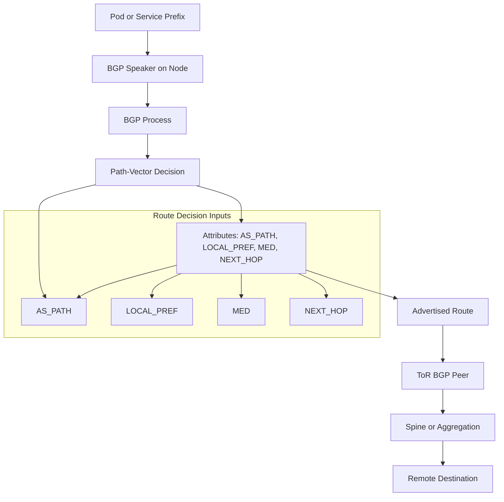
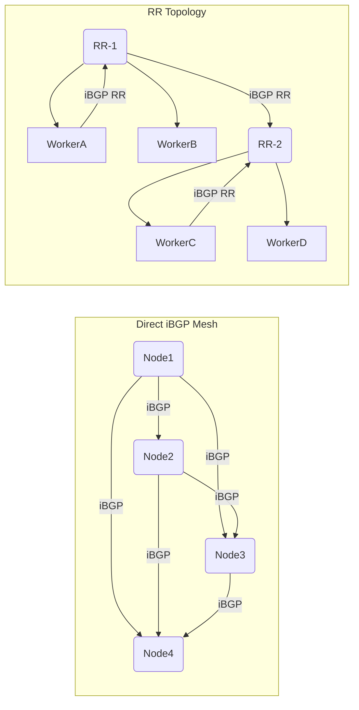
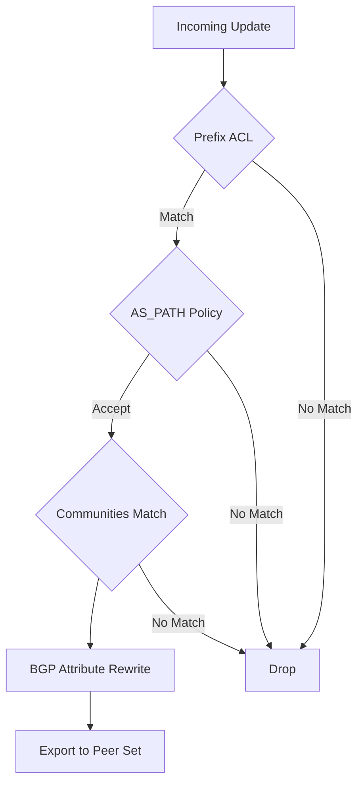
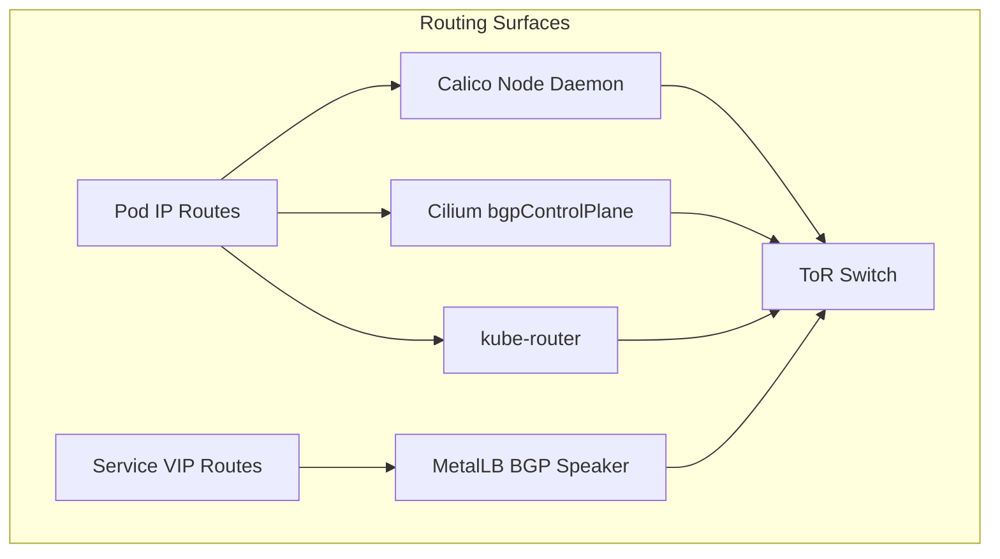

> **Complexity**: `[COMPLEX]` | Time: 75-90 minutes
>
> **Prerequisites**: [Module 3.1: Datacenter Network Architecture](../module-3.1-datacenter-networking/)

## Learning Outcomes

- Explain how BGP path-vector sessions, route attributes, and best path rules drive Kubernetes routing outcomes on bare-metal fabrics.
- Design EBGP/IBGP boundaries, route reflection strategies, and ECMP behavior for scalable Kubernetes-on-prem node fabrics.
- Implement and compare MetalLB, Calico, Cilium, and kube-router integration patterns for pod and Service VIP advertisement with filtering, communities, BFD, and safety guardrails.
- Diagnose and fix production-style incidents such as session flaps, leaked routes, RPKI-related control-plane risk, and kube-proxy/NAT path interactions.

## Why This Module Matters

If you operate Kubernetes outside a cloud VPC, you usually inherit a real network where routing is explicit and durable, not abstracted. In a private datacenter, Kubernetes nodes must participate in enterprise routing rules, not invent a separate cloud service model. That is why BGP is central in on-prem designs. It gives the cluster a predictable exterior graph where each node can advertise the pods or service addresses it actually owns, and every receiving device can run ordinary L3 policy and reachability decisions.

Unlike overlay-heavy patterns, direct BGP integration exposes route changes as first-class control-plane events. If someone adds a new rack, a new node pool, or a new route-map policy, the effects are visible as BGP update messages. You can audit, trace, and roll back intent by comparing desired prefixes, attributes, and neighbor states rather than reverse-engineering opaque encapsulated overlays. The operational result is a stack where troubleshooting can be localized: either the pod endpoint path, or a switch policy, or advertisement policy.

The core challenge is that BGP was originally defined for huge inter-domain routing with a strict set of assumptions. It is designed for independent networks that exchange reachability at Internet scale, while Kubernetes adds rapidly changing pod prefixes, dynamic service objects, and platform-level abstractions such as kube-proxy and CNI datapaths. Running both systems well requires discipline in policy boundaries, attribute design, and operational hygiene.

The objective in this module is not only to “make BGP work.” The objective is to design a robust on-prem routing architecture that behaves predictably under change. You will learn when BGP is the right control plane for pod networking, where it becomes dangerous, and why small misconfigurations can cause large black-hole patterns that look like node failures until you decode session state and attribute propagation.

## Did You Know

- BGP is path-vector, so it exports a path history (AS_PATH) and can avoid loops by preventing its own AS from reappearing in transit.
- Local preference and MED are policy tools that usually stay inside an AS boundary, while MED is most useful for deterministic inbound traffic preference across exit points.
- iBGP generally does not permit arbitrary transit transitivity, which is why route reflectors exist for scaling and for avoiding full-mesh complexity.
- Kubernetes exposes both pod prefix and Service VIP advertisement requirements, and those often belong to different policy domains even in the same BGP design.

## Section 1: BGP Fundamentals for Kubernetes Routing

Border Gateway Protocol is the control plane language that switches and routers use to agree on reachability and path selection. In this context, each BGP speaker has a role, each path carries attributes, and each update is a contract about what is being offered into the IGP-to-BGP boundary. You are not simply “turning on BGP”; you are publishing an external representation of Kubernetes reachability.

The BGP session model has three building blocks: local process readiness, authentication/neighbor policy, and finite state progression. A session starts in `Idle`, then moves through `Connect`, `Active` (connection attempt failed; retry timer pending), `OpenSent`, `OpenConfirm`, `Established`, and can transition back to any lower state on failure. The control loop runs on keepalives and open messages. In stable environments, a session is not just a TCP link; it is a relationship with timer assumptions and trust boundaries.

AS numbers are the first identity surface. Operators use private ASNs in on-prem designs to create an administration boundary. In a common approach, the cluster owns one ASN for all nodes that participate in internal BGP advertisements, while external ToR or border devices use distinct ASNs. This distinction lets you keep policy and leakage controls clear: the border advertises cluster routes in predictable directions, and external peers can apply route import logic for expected AS boundaries.

Path-vector operation matters because BGP does not store arbitrary hops, it stores policies and path history. The `AS_PATH` attribute tracks route ancestry as a sequence of ASNs and is the most visible loop-prevention mechanism in common operation. A route where the receiving AS appears in `AS_PATH` is a likely loop candidate and should be filtered or downgraded. `NEXT_HOP` carries the next router to forward traffic and must remain valid for each segment of the network path. `LOCAL_PREF` helps outbound preference inside one AS so you can express traffic preference without rewriting entire prefix lists. `MED` coordinates tie-breaking preference among external paths, especially when one destination is reachable through multiple neighbors.


```mermaid
flowchart TD
    A["Pod or Service Prefix"]
    B["BGP Speaker on Node"]
    C["BGP Process"]
    D["Path-Vector Decision"]
    E["Attributes: AS_PATH, LOCAL_PREF, MED, NEXT_HOP"]
    F["Advertised Route"]
    G["ToR BGP Peer"]
    H["Spine or Aggregation"]
    I["Remote Destination"]

    A --> B --> C --> D --> E --> F --> G --> H --> I

    subgraph "Route Decision Inputs"
        E1["AS_PATH"]
        E2["LOCAL_PREF"]
        E3["MED"]
        E4["NEXT_HOP"]
        E --> E1
        E --> E2
        E --> E3
        E --> E4
    end

    D --> E1
```

To make this practical, a node advertising pod subnets must decide both *what* to announce and *whether* to announce it to each peer. Advertisement is not global; it is policy-driven. For example, you may choose to announce pod CIDRs only to ToR peers in the same rack while not exporting them to a different uplink domain, while still allowing Service VIP announcements to a top-of-rack border for inbound access. That split can prevent unnecessary route bloat and can reduce blast radius during incidents.

`Hold time` and `keepalive time` are operationally important and often misunderstood. Hold time defines failure detection bound for a session when liveness signals stop. Keepalive should be smaller and typically configured as a fraction of hold time. If MTU mismatch causes packet loss, keepalives can stop arriving even though a TCP session looks established for a short moment. That pattern often appears as intermittent reachability in one path and stable reachability in another, especially with ECMP where one path recovers faster than another.

BGP best path logic is deterministic when you know the ranking order. Locally, a speaker evaluates weight, local preference, local route origination flags, AS_PATH length, origin, MED, eBGP over iBGP preference, egress interface IGP cost, then tie-breakers like router ID. If your design goal is deterministic service advertisement, you should intentionally set or constrain key knobs and document the reasons. Unspecified defaults are acceptable at small scale, but at production scale they create “works today, breaks tomorrow” behavior during edge cases.

This module uses Kubernetes examples in which either pod routes or Service VIP routes are exported from the cluster. In both cases, BGP is a controlled policy channel. The same route that is correct on one failure domain can be catastrophic on another. That is why each route advertisement must include both scope and audience constraints: which prefix set, which peers, what communities, what import/export policy.

## Section 2: EBGP, iBGP, Route Reflection, and Scaling Choices

iBGP and eBGP differ by policy boundary and advertisement semantics. In most on-prem setups, node-to-router peering with ToR switches is eBGP because those peers are outside the cluster AS. This gives a clean failure and policy boundary for leak detection and prefix ownership. Inside the cluster network, iBGP is often used to share cluster-owned prefixes across control and worker nodes in a way that reflects internal intent.

The practical distinction becomes most visible during reconvergence. Full iBGP meshes scale poorly because each additional node adds neighbor state to all others. For a mesh of N nodes, the relationship count is roughly N*(N-1)/2. With 40 nodes, this is nearly 780 peerings, which is operationally expensive and fragile when route churn spikes. This is why route reflectors exist in real fabrics: they centralize iBGP distribution and reduce peering obligations.


```mermaid
flowchart LR
    subgraph "Direct iBGP Mesh"
        N1(Node1)
        N2(Node2)
        N3(Node3)
        N4(Node4)
        N1 --iBGP--> N2
        N1 --iBGP--> N3
        N1 --iBGP--> N4
        N2 --iBGP--> N3
        N2 --iBGP--> N4
        N3 --iBGP--> N4
    end

    subgraph "RR Topology"
        R1(RR-1)
        R2(RR-2)
        R1 --> WorkerA
        R1 --> WorkerB
        R2 --> WorkerC
        R2 --> WorkerD
        R1 --iBGP RR--> R2
        WorkerA --iBGP RR--> R1
        WorkerC --iBGP RR--> R2
    end
```

A route reflector pair or cluster should be chosen with predictable criteria: hardware capacity, failure-domain separation, and peer count. At minimum you want redundancy without shared single points of failure. If all reflectors share one maintenance domain and that domain goes down, all iBGP distribution may freeze even when eBGP links remain healthy. That can make internal cluster pod reachability fail silently until fallback paths are manually activated.

ECMP and equal-cost forwarding are essential for throughput and resiliency, especially when multiple pod or service paths are valid. BGP supports ECMP by advertising equivalent paths with equal preference and letting downstream devices pick among them. In Kubernetes on-prem, this can spread service return traffic, reduce hot spots, and improve resilience when one uplink degrades. But ECMP is useful only if your downstream FIB and kube-proxy behavior align. If kube-proxy NAT tables are coupled with asymmetric pathing and session persistence assumptions, you can see unexpected return-path anomalies.

For EBGP to iBGP translation, `next-hop-self` and route reflector behavior are operationally important. Route reflectors can alter the path visibility semantics if you do not control attribute propagation correctly. Without discipline, a reflected route may carry a next hop that is reachable from one part of the fabric but not from another. That mismatch usually presents as partial reachability and difficult incident triage.

For large fabrics, iBGP confederations can split policy domains while preserving AS-like behavior. Confederations let you keep one visible external AS while internally subdividing ASNs for scale and fault isolation. This can simplify operational ownership, but only if you document sub-AS boundaries and avoid hidden path leakage. Confederations should not be treated as “advanced magic”; they are a policy structuring tool with direct consequences for route filtering and attribution.

Common mistake patterns in this area are almost always one of three: full-mesh saturation, unbounded route reflection, or attribute assumptions. If you have to memorize one principle, use this: design the iBGP graph as topology-independent control intent, not as a copy of the physical rack network. The control graph must be survivable and observable, not merely functional in the golden path test.

## Section 3: Policy Constructs, Communities, BFD, and Filtering

In Kubernetes environments with multiple production tiers, route filtering is mandatory. Route-maps and prefix lists are where you encode what is acceptable at each boundary. A minimal production design typically has inbound filters on ToR neighbors and explicit export filters for what leaves the cluster. Without these controls, a minor pod subnet mistake can leak thousands of more specific prefixes into a wider fabric and force emergency mitigations.

`route-map` blocks and prefix policy are powerful because they connect policy text with concrete behavior. In many configurations, route-maps check prefix families, prefix length, AS_PATH patterns, local preference values, and tag operations. If you advertise everything by default, BGP will do what it does efficiently—but it will also distribute mistakes quickly. A small accidental /24 instead of /32 advertisement can alter large forwarding decisions in a BGP domain.

BGP communities are a compact method for encoding operational meaning. Standard communities from RFC 1997 are 32-bit fields split across vendor and platform usage models, and large communities from RFC 8092 extend this to 96-bit values for clearer intent, large-scale policy separation, and automation-friendly tagging. In practice, you should treat communities as contracts: who set them, where they are preserved, where they are stripped, and what they mean to downstream policy.

The most durable approach is one of two modes: encode environment metadata in communities and import/export by policy, or avoid communities and encode all decisions directly in explicit neighbor filters. Both work, but only one should be used per design domain. If you mix both loosely, future onboarding and audits become ambiguous.


```mermaid
flowchart TB
    A[Incoming Update]
    B{Prefix ACL}
    C{AS_PATH Policy}
    D{Communities Match}
    E[BGP Attribute Rewrite]
    F[Export to Peer Set]
    G[Drop]

    A --> B
    B -->|Match| C
    C -->|Accept| D
    D --> E
    E --> F
    B -->|No Match| G
    C -->|No Match| G
    D -->|No Match| G
```

Fast Failure Detection with BFD adds strictness at the transport layer. BGP itself is relatively conservative for failure detection in its default state, while BFD can reduce black-hole and failover detection time significantly. BFD in a clean design should have timeout values tied to node density, not copy-pasted defaults. If BFD timers are too aggressive, control-plane churn can look like instability. If they are too slow, failover windows get wide and user traffic remains pinned to failed paths longer than necessary.

An advanced but valuable pattern for on-prem clusters is BFD only on critical peer pairs and less aggressive behavior on less critical peers. This avoids one noisy or unstable path dominating operational noise. BFD should be paired with explicit hold-time awareness in the BGP session profile so the two controls do not work against each other.

When designing BFD with Linux and container hosts, align three settings: receive interval, detection multiplier, and control-plane CPU readiness for session handlers. If host CPU starvation introduces scheduling jitter, BFD can flap due to packet delay rather than real path failure. When this happens, you see repeated route withdrawals that are not accompanied by physical outages. The fix is often lower aggressiveness plus host-level scheduling checks, not just route-map edits.

## Section 4: Integrating BGP with Kubernetes Networking

Kubernetes itself does not prescribe BGP, so the integration strategy comes from your chosen platform components. The important point is that each component has different control surfaces and defaults. Your goal is not “choose the most feature-rich plugin”; your goal is to pick predictable behavior for operations, security, and incident handling.

MetalLB BGP mode is the most direct to reason about for external Service VIP exposure. In L2 mode, MetalLB answers ARP or NDP and works like a controlled virtual L2 announcer. In BGP mode, MetalLB creates externalized path announcements to configured peers, which is a better match when you already run a routed underlay. BGP mode reduces broadcast-domain dependence and gives cleaner failover behavior per advertised VIP.

For on-prem cluster services, compare where MetalLB fits with where your CNIs manage pod routing. If your CNI already handles pod reachability and your external exposure pattern needs deterministic service advertisement to Top-of-Rack peers, MetalLB BGP is often a good fit. If you require very fine-grained pod-level external routing in all paths, then CNI-native BGP options become more central.

MetalLB can advertise service VIPs while preserving pod networking via CNI-specific internals. In that model, service advertisements are usually explicit and scoped by namespace, address pool, or service selector policy. When designing security, you should ask whether all VIPs need advertisement, and whether external clients should ever learn service prefixes directly versus through external gateways.

Calico BGP is a mature approach in many on-prem deployments. It can advertise pod CIDRs directly and supports BGP peer resources, route filtering behavior, and deterministic neighbor definitions. Because Calico has strong integrations into Kubernetes objects, teams can model many decisions as CRD-driven policy. But this expressiveness requires version discipline and clear ownership of who changes each object, because routing rules can become a hidden source of blast radius if many teams modify different knobs.

Cilium BGP, especially via the `bgpControlPlane` API, is increasingly popular where operators want integrated Cilium dataplane controls plus BGP announcements from a single operator stack. The API enables `BGPClusterConfig`, neighbor definitions, and advertisement policies. At runtime, Cilium operators must keep close alignment with service model, because Cilium’s eBPF data path and BGP module can expose powerful combinations but also deeper coupling.

Kube-router is often the lightweight option for teams that want kube-proxy replacement behavior with BGP-native routing in a smaller feature footprint. It is useful when operators prefer straightforward installation and explicit service route behavior without a broad extra API surface. The trade-off is less rich policy orchestration than large Calico or Cilium setups, so teams must pair it with stronger external documentation and guardrails.

Speaker-peering model matters a lot more than most teams realize. Two common models are TOR-direct peering and in-band speaker models. TOR-direct places Kubernetes BGP speakers on node NIC-facing peers and keeps route exchange at rack edges. In-band models may run virtualized or centralized peers that share an underlay path with service traffic. TOR-direct gives stronger locality and usually lower fault domains for east-west fabric diagnostics. In-band models simplify placement but can blur topology assumptions during failover.

When you choose pod IP advertisement versus Service VIP advertisement, think in terms of who consumes each route. Pod IP advertisement exposes every pod prefix for direct L3 routing, which is efficient and avoids extra translation steps. Service VIP advertisement exposes stable service addresses suitable for external discovery and client consistency. In many practical deployments, teams run both: pod prefixes for server-to-server trust paths and VIPs for external access, each with different prefix policy.

If both are active, keep strict separation of who receives what. One peer set may receive pod CIDRs while another receives VIP-only routes. That split reduces accidental route exposure and makes policy audits straightforward.

`RPKI` is a control-plane hardening mechanism that adds cryptographic proof-of-origin checks for route announcements. In enterprise on-prem contexts, RPKI does not replace BGP policy; it reduces risk from malicious or accidental origin misadvertisements. A missing or invalid ROA can prevent acceptance in environments that enforce validation, but enforcement must be intentional. If your upstream devices do not all validate consistently, start with monitoring mode before forcing hard drops.


```mermaid
flowchart TD
    subgraph "Routing Surfaces"
        PodCIDR["Pod IP Routes"]
        ServiceVIP["Service VIP Routes"]
        MetalLB["MetalLB BGP Speaker"]
        Calico["Calico Node Daemon"]
        Cilium["Cilium bgpControlPlane"]
        KubeRouter["kube-router"]
        ToR["ToR Switch"]
    end

    PodCIDR --> Calico
    PodCIDR --> Cilium
    PodCIDR --> KubeRouter
    ServiceVIP --> MetalLB
    Calico --> ToR
    Cilium --> ToR
    KubeRouter --> ToR
    MetalLB --> ToR
```

For SR-MPLS and Segment Routing, this module keeps a practical orientation only. The point is this: SR technologies can provide explicit path control and better deterministic packet steering once the underlay is already stable. In BGP-centric on-prem Kubernetes designs, they are optional advanced extensions and not a requirement for initial reliability. If you adopt SR-MPLS later, your first guardrail is still clean BGP advertisement hygiene and strict control over AS and community policy.

## Section 5: Advanced Production Incidents and Corrective Patterns

A common incident in on-prem clusters is session flapping caused by MTU and hold-time mismatch. If the data frame path to peers shrinks near 1500 and BGP keepalives use larger segments in some path scenarios, sessions can alternate between established and down during path switching. This is not usually a single bug in one router; it is usually cross-team mismatch between host MTU, switch MTU, and underlay profile.

The first response should be to isolate whether flapping aligns with a specific peer pair. If one peer fails while others remain stable, focus on that link and inspect interface-level counters. If all peers flap together, inspect global timer strategy, host load, or CPU starvation. This incident pattern should be treated as a signaling problem before route-policy blame. A wrong hold-time can look like route policy instability.

Another frequent failure is leaked prefixes from incorrect export policy. This may happen when a `route-map` or prefix list unintentionally includes default routes or too-wide aggregates. The blast radius often appears as unexpected internet egress through a fabric path that was never intended for tenant traffic. The first command to fix this is not “remove the bad prefix,” it is to compare intended versus applied policy objects across all peers and automation owners.

Prefix bloat happens when hundreds of short-lived pod ranges become visible too quickly and without aggregation control. Even if each prefix is valid, FIB pressure grows and recovery actions slow. Operators should track route churn, advertised prefix counts, and per-peer withdrawal rates. If churn spikes after a deployment, the deployment may be creating too-frequent ephemeral routes, or a label-based advertisement rule may be over-permissive.

IBGP loops are rare when AS boundaries are clean, but they still happen through reflectors and confederation confusion. The classic symptom is route oscillation without obvious physical loss. If an iBGP route is reflected without sufficient origin constraints and no route-target separation, your own advertisements can be imported as inbound again through an unintended path. You can mitigate this with strict client/cluster rules, explicit peer groups, and route reflector client declarations in your design documentation.

`kube-proxy + BGP NAT interactions` is a practical edge case where external service exposure looks correct in route tables but fails at transport return. If kube-proxy rewrites source addresses according to service mode assumptions, and BGP advertisements include suboptimal next-hop policy, return flows can drift into wrong peers. This is particularly visible during source NAT and asymmetric egress paths. The remedy is to inspect both kube-proxy mode and route selection together, not in separate teams.

Another incident pattern is policy drift from “just-in-time” emergency edits. In the middle of an outage, teams change one peer statement or one community mapping without documenting the inverse action. This can pass immediate checks but creates hidden preconditions that fail during later maintenance. A robust mitigation is to freeze routing change controls during incidents except on approved change windows and to run a controlled post-incident plan.

The recovery framework for all these incidents is stable: observe, isolate, narrow to a neighbor pair, confirm attribute state, change one control at a time, and close with route-policy regression tests. This is slower than rushed patching, but it prevents hidden damage, because BGP incidents are rarely isolated to a single node or one component. Most incidents are boundary conditions across routing and Kubernetes service behavior.

## Section 6: Operational Hardening, Automation, and Long-Term Controls

Operational confidence in on-prem BGP grows when intent is expressed as repeatable checks, not tribal memory. A first-class playbook should define what “healthy” means in measurable terms and then define expected deltas during maintenance events. For a cluster-level routing design, start with a control-plane baseline: baseline neighbor count, baseline advertised prefix count by profile, baseline hold-time and keepalive values, baseline withdrawal and announcement ratios. If these values are not baselineable, the first sign of degradation is usually a false sense of stability followed by a sudden failover storm.

A practical pre-production checklist begins at rack design, not YAML. If each rack has identical BGP intent, define role profiles by rack and attach those labels before rollout. The profile should include peer ASN expectations, interface MTU assumptions, preferred BFD mode, route-map templates, and whether service VIP or pod routes are expected for that zone. This prevents one accidental “node default profile” from applying where policy should have been stricter. In each pre-production run, validate both normal and degraded modes: one path removed, one peer removed, and one flapping peer within a bounded window.

Capacity planning for on-prem routing should include control-plane complexity, not only data-plane throughput. Count expected pod CIDRs, expected service VIPs, expected neighbor sessions, and expected update rates during scale events. If rollout windows create hundreds of updates per minute, validate dampening and policy ordering before production. If every session is treated equally, one noisy tenant can trigger a control-plane storm that appears as unrelated infrastructure failure. Define expected churn during blue-green transitions, autoscaling, and node rotation, and alert when churn stays above that envelope.

Route policy should be versioned with rationale, not only numeric knobs. For each policy profile, record why each attribute was chosen. Use `LOCAL_PREF` for explicit trust-domain bias, `MED` for deterministic inter-domain ties, `AS_PATH` filtering for loop controls, and `NEXT_HOP` for practical forwarding correctness. If a policy changes, include a ticket, a review note, and rollback steps in the same change set. Without this, BGP becomes opaque and difficult to debug under pressure.

A robust filter architecture benefits from a matrix with four explicit checks: input from peers, output to peers, tenant scope, and emergency blocklists. In normal operation, output filtering should be conservative and explicit. During incidents, an emergency deny profile can temporarily suppress suspicious prefixes while preserving known-good VIPs for business-critical services. This is safer when every filter has pre-created names and a test plan, because emergency edits are often the least-reviewed and highest-risk operations in a live incident.

In large node fabrics, keep neighbor inventory in source control and automate drift detection with strict baselines. Drift detection should compare intended peer IP, ASN, and hold-time configuration with discovered state each hour. Unexpected changes are still valid if approved, but they should still generate auditable events. If a node advertises into the wrong policy set, convert that peer to hold-only mode first and then confirm intent before restarting sessions.

BFD should be rolled out by sequence, not by default. Start with conservative intervals and stable timers, then observe false-flap behavior for at least one maintenance cycle. After that is clean, tighten one profile at a time in non-production, then in a controlled production segment. At every step, measure false-flap rate and service health in the same window. This avoids accidentally introducing aggressive timers that convert normal delay into recurring outage pulses.

Telemetry must include session state, route churn, and response path observability. Session state reveals protocol health, churn reveals policy instability, and path observability reveals kube-proxy and NAT interactions that hide as success in one layer. A route can look correctly advertised while users still fail because return packets are rewritten into unexpected pathways. You should correlate these dimensions in one incident panel instead of checking each in isolation.

For flapping investigation, do not change hold-time first. Run event correlation across session logs, interface counters, and routing updates. If flaps align with interface renegotiation or MTU mismatch, transport cleanup should happen first. If not, compare BFD and CPU contention before touching peer policy. Many false positives disappear when control-plane load is reduced or scheduled more predictably.

For leak prevention, split ownership and export scope. Keep production-wide prefixes in a constrained export profile and keep sandbox or dev workloads in separate namespaces with explicit exceptions. This is essential when tenant teams can generate broad CIDR advertising through automation. One broad test namespace should never directly leak into the same policy bucket used for production edge routes.

Prefix-bloat control should include explicit thresholds and auto-recovery. For each peer, define expected max-prefix values, expected update rates, and expected route age distributions. If these numbers rise sustainably, treat that as an incident class instead of normal growth. If spikes are controller-induced, revisit reconciliation cadence and reduce churn by batching route updates instead of emitting transient micro-routes.

IBGP loop prevention is a recurring validation test, not a one-time design step. Build a synthetic check that attempts to inject a mirrored loop and verify no reflected path reappears in the same AS path context. If staging passes and production fails, the failure is usually stale reflector state or drift in an import/export rule. Loop tests should run before every major upgrade, because topology and firmware changes silently affect reflection behavior.

kube-proxy and BGP NAT behavior should be tested before each release gate in staging and after each significant networking change. Include NodePort and LoadBalancer path tests that confirm symmetric handling and consistent response path. If service mode changes, rerun the same traffic validation before removing temporary mitigations. This is the quickest way to prevent a stable-looking route design from failing at transport layers.

For RPKI, use a staged rollout. Phase one is monitoring mode and visibility, phase two is staging enforcement, and phase three is controlled production rollout. Full enforcement without ROA coverage or consistent validation policy can become a blackout pattern when external devices disagree on route legitimacy handling. Monitoring first preserves visibility and builds trust before enforcement becomes mandatory.

Before adopting SR-MPLS or Segment Routing in your path steering model, preserve existing controls first. SR-MPLS can improve path intent and segmentation, but it does not replace AS policy and route hygiene. Keep neighbor intent, AS boundaries, and advertisement constraints stable, then add segment labels once each control-plane invariant is still measurable and deterministic.

Rolling upgrades should include pre/post snapshots: route table, neighbor state, advertisement inventory, and service reachability. After any change, compare snapshots for unexpected additions, missing required prefixes, and unexpected withdrawals. Keep one full interval of healthy traffic tests after each cutover before closing the maintenance change. This avoids “green apply” states that still carry hidden data-plane divergence.

Post-incident closure should create recurring tests and reusable templates. Every incident should become one or more codified checks that validate the condition that failed. If a route leak happens, the next patch should include a static assertion. If session flaps recur, add a timer and path health test that fails fast in CI or scheduled observability checks.

Treat manifest templating as part of the safety architecture. Validate generated manifests for deterministic output, explicit defaults, and safe peer values. A one-line typo in ASN, peer IP, or community can create a silent route mismatch that causes partial outages. Deterministic generation and strict defaults reduce this risk and make recovery procedures faster.

As a final operational principle, treat every new BGP feature as an observability contract. New peers, new communities, new path policies, and new FRR versions should each add checks for session health, route shape, and service path integrity. This is not overhead; it is the cost of safe on-prem production where routing is the foundation, not a background system.

## Section 7: Incident Evidence Matrix and Recovery Decision Paths

The fastest way to make incident handling deterministic is to classify a failure before making configuration changes. In BGP-driven Kubernetes networks, the same symptom can come from session control, policy mismatch, export mismatch, or packet path asymmetry. An evidence-first playbook prevents accidental changes by forcing one classification first, then one change. This shortens recovery time because each team follows a shared sequence.

If the failure is `session-level`, check state transitions and neighbor readiness together. Gather BGP session state, keepalive timing, hold-time alignment, and BFD status across both peers. Then check interface health and MTU consistency. If the pattern repeats with fixed intervals, prioritize timer and transport checks over filter edits. If the pattern is isolated to one neighbor, classify as path-specific and do not over-apply changes that impact all upstream links.

If the failure is `policy-level`, compare `AS_PATH`, `LOCAL_PREF`, `MED`, and `NEXT_HOP` at the peer boundary before changing filter rules. If communities are involved, verify they are attached, preserved, and interpreted exactly where intended. A common pattern is a valid path that takes an invalid policy branch because one policy engine strips a community before another engine reads it. In that case the fix is policy-contract correction, not route deletion.

If the failure is `advertisement-level`, inspect what was actually exported and what was expected by each peer role. In many incidents, only one export list becomes too broad after an automation change. Compare export manifests and prefix lists side-by-side. If a pod subnet disappeared unexpectedly, verify namespace selectors and service definitions before changing ToR peers. If a service VIP disappeared, check whether ServiceAdvertisement resources were removed or whether the neighbor ACL was recently constrained.

If the failure is `path-level`, verify end-to-end symmetry and return path behavior. It is possible for a route to exist and for session checks to be green while user traffic fails because return packets follow a path with incompatible NAT expectations. This is where kube-proxy mode, service policy, and upstream ACLs must be interpreted together. Do not change routing policy while this path mismatch is still unverified, because route changes can mask the true path issue.

A practical escalation decision is to freeze route edits for 10 to 15 minutes after evidence capture and before any change unless service impact is critical. This brief freeze helps operators avoid changing two independent variables at once. After that, apply one hypothesis, capture evidence immediately, and only then apply the next hypothesis if the first did not move the signal.

At closeout, create a concise incident note with five items: observed signal, evidence artifact, root hypothesis, exact control action, and preventive control. If the incident involved flaps, also capture accepted timer/hold settings and BFD mode. If the incident involved leaks, include a pre- and post- prefix-list and export-policy snapshot. If the incident involved NAT interactions, include service mode, client source behavior, and return-path observations.

The most durable organizations keep a prebuilt runbook index where each common failure has a first-step command block. The index should map failure classes to ownership and expected recovery owner. This practice prevents runbook drift because everyone edits the same document with the same definitions and expected evidence.

Small deviations in control-plane behavior are normal in real fabric operations, which is why teams should treat each incident as a new calibration input and capture both success criteria and failure patterns in the same postmortem format.

## Common Mistakes

| Mistake | Symptom | Impact | Corrective Pattern |
| --- | --- | --- | --- |
| Advertising all pod CIDRs to all peers | Unexpected route table growth and noisy upstream convergence | Fabric FIB pressure and cross-tenant routing confusion | Scope export policies by peer and tenant domain |
| Building full-mesh iBGP for large clusters | Slow convergence and high CPU on node daemons | Flap amplification and delayed failover | Use route reflectors or confederation-driven hierarchy |
| Omitting BFD on critical eBGP sessions | Slow failure detection and prolonged black holes | Unpredictable client retries and session stale states | Enable selective BFD where path availability is business-critical |
| Using loose community policy | Inconsistent ingress and egress path selection across vendors | Hard-to-debug asymmetry and policy bypass | Normalize community handling per vendor and strip where unsupported |
| Mixing pod CIDR and Service VIP policy in one peer set | Mixed intent and unexpected external route exposure | Security and troubleshooting complexity during incidents | Create separate export profiles and clearly tagged peer groups |
| Leaving default local-pref assumptions intact under failover | Unexpected primary path choice after link changes | Traffic oscillation and client jitter | Set explicit local-preference and MED policy per environment |

## Knowledge Check

<details>
<summary>Why does a full-mesh iBGP topology become operationally fragile in large Kubernetes node counts?</summary>
Because every new node increases the number of peer relationships nonlinearly, and convergence behavior becomes harder to observe and recover during churn.
</details>

<details>
<summary>Which combination best prevents the same BGP announcement from being accidentally accepted from a looped route?</summary>
`AS_PATH` inspection with strict import rules is the primary loop-prevention mechanism inside standard path-vector behavior.
</details>

<details>
<summary>In a mixed Kubernetes routing design, when is Service VIP advertisement preferable to pod CIDR advertisement?</summary>
Use Service VIP advertisement when external consumers need stable addresses and policy boundaries require abstraction from internal pod addressing.
</details>

<details>
<summary>How should communities from RFC 1997 and RFC 8092 be used in practice?</summary>
Treat them as explicit policy tags that are documented end-to-end, rather than loosely appended metadata with no filtering contract.
</details>

<details>
<summary>What is the operational risk of aggressive BFD settings on unstable hosts?</summary>
Aggressive detection can turn scheduler jitter and transient packet delay into repeated false flap events, increasing route churn.
</details>

<details>
<summary>What is the most reliable workflow after identifying a suspected leaked route in an on-prem BGP design?</summary>
Compare intended policy objects against applied peer policy first, then isolate the exact neighbor pair, and then reapply constrained export after a verified correction.
</details>

<details>
<summary>How do route reflectors differ from confederations in scaling role?</summary>
Route reflectors reduce iBGP adjacency explosion in one AS, while confederations subdivide internal policy domains with visible AS-like behavior.
</details>

## Hands-On Practical Exercises

- [ ] Run a local `kind` cluster and deploy MetalLB in BGP mode with one advertised service VIP that depends on a FRR neighbor container.
- [ ] Validate route propagation from MetalLB to FRR with BGP state inspection and end-to-end curl checks against the advertised VIP.
- [ ] Simulate a control-plane change by tightening route-map policy and compare before/after prefix export behavior.
- [ ] Diagnose session flaps, leaked routes, and kube-proxy/NAT interactions in the lab and document which one control change removed them.

```bash
# 1. Start a kind cluster with extra ports for MetalLB and FRR integration.
kind create cluster --name onprem-bgp --config - <<'EOF'
kind: Cluster
apiVersion: kind.x-k8s.io/v1alpha4
name: onprem-bgp
nodes:
  - role: control-plane
  - role: worker
  - role: worker
networking:
  disableDefaultCNI: false
EOF

# 2. Install MetalLB with its namespace.
kubectl apply -f https://raw.githubusercontent.com/metallb/metallb/v0.14.8/config/manifests/metallb-native.yaml

# 3. Create an L2-only-safe, BGP-ready peer IP allocation plan.
kubectl apply -f - <<'EOF'
apiVersion: v1
kind: Namespace
metadata:
  name: lab
---
apiVersion: v1
kind: Namespace
metadata:
  name: frr
EOF

# 4. Define a valid MetalLB BGP peer model for lab topology.
kubectl apply -f - <<'EOF'
apiVersion: metallb.io/v1beta1
kind: BGPPeer
metadata:
  name: lab-peer
  namespace: metallb-system
spec:
  myASN: 64512
  peerASN: 65099
  peerAddress: 172.18.0.254
  holdTime: 30s
  keepaliveTime: 10s
  ebgpMultihop: true
---
apiVersion: metallb.io/v1beta1
kind: BGPAdvertisement
metadata:
  name: lab-bgp-adv
  namespace: metallb-system
spec:
  ipAddressPools:
    - lab-pool
  communities:
    - 64512:100
  peers:
    - lab-peer
EOF

# 5. Define an IPAddressPool for test VIPs and one workload Service.
kubectl apply -f - <<'EOF'
apiVersion: metallb.io/v1beta1
kind: IPAddressPool
metadata:
  name: lab-pool
  namespace: metallb-system
spec:
  addresses:
    - 172.18.0.200-172.18.0.230
---
apiVersion: v1
kind: Service
metadata:
  name: lab-bgp
  namespace: lab
spec:
  selector:
    app: echo
  type: LoadBalancer
  ports:
    - name: web
      port: 80
      targetPort: 8080
EOF

# 6. Run a lightweight application.
kubectl -n lab create deployment echo-server \
  --image=hashicorp/http-echo \
  --replicas=2 \
  -- -listen=:8080 -text=bgp-routing-lab

kubectl -n lab expose deployment echo-server --port=80 --target-port=8080

# 7. Start an FRR container for route validation.
docker run -d --name lab-frr \
  --network kind \
  --privileged \
  -v /tmp/frr:/etc/frr \
  frrouting/frr:v10.0.1
METALLB_SPEAKER_IP=$(kubectl -n metallb-system get pods -l component=speaker -o jsonpath='{.items[0].status.podIP}')
docker exec lab-frr vtysh -c "conf t" -c "router bgp 65099" -c "neighbor $METALLB_SPEAKER_IP remote-as 64512" -c "exit" -c "exit" -c "write memory"

# 8. Verify BGP state and service reachability.
kubectl -n lab get svc lab-bgp
docker exec -i lab-frr vtysh -c "show bgp summary"
VIP=$(kubectl -n lab get svc lab-bgp -o jsonpath='{.status.loadBalancer.ingress[0].ip}')
kubectl -n lab run verifier --rm -i --restart=Never --image=curlimages/curl:8.7.1 -- \
  curl -sS "http://$VIP"
```

## Next Module

*Next module coming soon.*

## Sources

- [RFC 4271 BGP-4](https://datatracker.ietf.org/doc/html/rfc4271)
- [RFC 1997 BGP Communities](https://datatracker.ietf.org/doc/html/rfc1997)
- [RFC 8092 BGP Large Communities](https://datatracker.ietf.org/doc/html/rfc8092)
- [RFC 5880 Bidirectional Forwarding Detection (BFD)](https://datatracker.ietf.org/doc/html/rfc5880)
- [RFC 4456 Route Reflectors](https://datatracker.ietf.org/doc/html/rfc4456)
- [MetalLB Configuration](https://metallb.universe.tf/configuration/)
- [MetalLB BGP Concepts](https://metallb.universe.tf/concepts/bgp/)
- [Cilium BGP Control Plane](https://docs.cilium.io/en/stable/network/bgp-control-plane/)
- [Calico BGP Configuration](https://docs.tigera.io/calico/latest/networking/configuring/bgp)
- [FRR BGP Documentation](https://docs.frrouting.org/en/latest/bgp.html)
- [Kube-router Project](https://www.kube-router.io/)
- [RPKI Overview](https://en.wikipedia.org/wiki/Resource_Public_Key_Infrastructure)
- [Kubernetes Service Traffic Policy](https://kubernetes.io/docs/concepts/services-networking/service-traffic-policy/)
