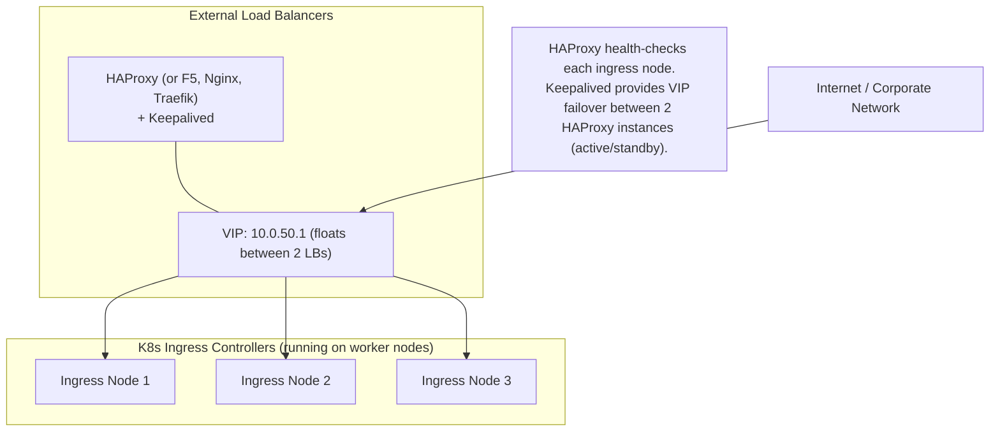
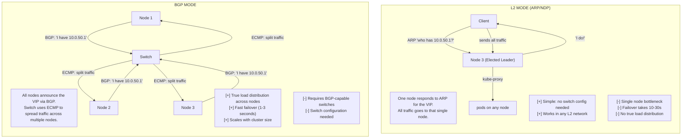
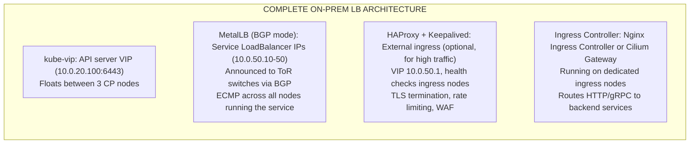

> **Complexity**: `[MEDIUM]` | Time: 60 minutes
>
> **Prerequisites**: [Module 3.2: BGP & Routing](../module-3.2-bgp-routing/), [MetalLB](../../platform/toolkits/infrastructure-networking/networking/module-5.4-metallb/)

---

## Why This Module Matters

In early 2024, a major e-commerce retailer began repatriating their workloads from AWS to their own on-premises datacenters to cut infrastructure costs. Their CI/CD automation seamlessly deployed over 500 microservices into their newly provisioned bare-metal Kubernetes clusters. However, on launch day, not a single external request reached their applications. Engineers stared at dashboards as every single `LoadBalancer` service remained permanently in an `EXTERNAL-IP: <pending>` state. The automated cloud controllers they had relied on for years did not exist in their datacenter, causing a complete traffic blackout and a delayed launch that cost the business hundreds of thousands in projected revenue.

This scenario highlights the single biggest operational gap between cloud and on-premises Kubernetes. Every application that needs external access — APIs, web frontends, gRPC services — needs a load balancing solution. On bare-metal Kubernetes without a cloud-provider integration, Kubernetes delegates external IP allocation entirely to the hosting environment. Without a cloud controller, the service controller creates the object but cannot advance it; the field stays pending indefinitely, and crucially, no error is raised to alert you of the problem.

Historically, organizations bridged this gap by purchasing expensive hardware. An F5 BIG-IP load balancer appliance costs $15,000 to $100,000+ depending on throughput and features. Many organizations continue to use F5 for their on-prem ingress simply because it is familiar. However, modern cloud-native architectures demand software-defined, declarative approaches. In this module, we explore the software-defined alternatives that provide bare-metal load balancing: MetalLB, kube-vip, Cilium's native capabilities, and classic HAProxy combined with Keepalived architectures.

---

## What You'll Be Able to Do

After completing this module, you will be able to:

1. **Design** a high-availability load balancing architecture incorporating VIP failover, health checking, and distributed traffic handling.
2. **Implement** MetalLB in both Layer 2 and BGP modes to assign routable IP addresses to bare-metal services.
3. **Debug** common external traffic failures, distinguishing between ARP cache issues, BGP peering drops, and kube-proxy misconfigurations.
4. **Evaluate** software-defined load balancers (MetalLB, kube-vip, Cilium) against legacy hardware and classic reverse proxies to choose the correct operational model for your datacenter.
5. **Compare** the performance and failover characteristics of ECMP-based routing versus single-node ARP leader election.

---

## What You'll Learn

- Why `type: LoadBalancer` does not work on bare metal by default.
- MetalLB architecture: CRDs, controllers, and speakers.
- The differences between L2 mode, native BGP mode, and FRR-backed BGP mode.
- How kube-vip provides a lightweight alternative for API server HA and service VIPs.
- How Cilium provides native LB IPAM and L2 Announcements.
- How to combine HAProxy and Keepalived to front Kubernetes Ingress controllers.
- Common pitfalls, including IPVS strict ARP requirements.

---

## The LoadBalancer Problem

To understand the core issue, we must visualize what happens when you request a LoadBalancer service in different environments. 

```mermaid
flowchart TD
    subgraph Cloud["ON CLOUD (AWS/GCP/Azure)"]
        direction TB
        A[kubectl create svc loadbalancer] --> B[Cloud Controller]
        B --> C[Creates ALB/NLB/Azure LB automatically]
        C --> D[Assigns external IP]
        D --> E[Routes traffic to node ports]
        E --> F[Health checks, scaling, TLS termination]
        F --> G[Cost: $15-25/month per LB]
    end

    subgraph BareMetal["ON BARE METAL"]
        direction TB
        H[kubectl create svc loadbalancer] --> I["??? (no cloud controller)"]
        I --> J[Service stays 'Pending' forever]
        J --> K[No external IP assigned]
        K --> L[No traffic reaches the service]
    end

    subgraph Solution["SOLUTION"]
        direction TB
        M[Install MetalLB or kube-vip as LB controller] --> N[Assigns IPs from a configured pool]
        N --> O[Announces IPs via L2 ARP or BGP]
        O --> P[Traffic reaches nodes --> kube-proxy --> pods]
    end
```



Without a software mechanism watching for these services and acting on them, the cluster is effectively isolated from inbound network traffic.

> **Pause and predict**: You create a Service of type LoadBalancer on your bare-metal cluster. It stays in "Pending" forever. Before reading further, explain what is missing and why this works automatically on AWS but not on bare metal.

---

## Hardware Proxies and The Pre-MetalLB Era

Before software-defined controllers like MetalLB existed, administrators relied entirely on external load balancers. HAProxy combined with Keepalived (using the VRRP protocol) is a common pre-MetalLB pattern for bare-metal Kubernetes High Availability (HA). 

In this model, Keepalived provides a floating Virtual IP (VIP) via VRRP, while HAProxy load-balances TCP traffic across multiple backend nodes. When one load balancer node fails, VRRP detects the failure within roughly 2 seconds, and the VIP automatically floats to the standby node.

These components can be deployed as standard Linux OS services running directly on the hosts, or they can be deployed as Kubernetes static pods defined in `/etc/kubernetes/manifests`. Deploying them as static pods ensures they are managed by the kubelet and start before the main control plane comes online, resolving the critical chicken-and-egg problem of establishing initial API server access.



Here is a typical HAProxy configuration used to balance both the Kubernetes API server and application ingress. Notice the health checks that ensure traffic is never routed to a dead node. The `check-ssl verify none` option on the API backend tells HAProxy to verify the backend is alive via HTTPS without validating the certificate (since K8s uses self-signed certs for health endpoints):

```bash
# /etc/haproxy/haproxy.cfg
global
    maxconn 50000
    log /dev/log local0

defaults
    mode tcp
    timeout connect 5s
    timeout client 30s
    timeout server 30s

# K8s API server load balancing
frontend k8s-api
    bind *:6443
    default_backend k8s-api-backend

backend k8s-api-backend
    option httpchk GET /healthz
    http-check expect status 200
    server cp-01 10.0.20.10:6443 check check-ssl verify none
    server cp-02 10.0.20.11:6443 check check-ssl verify none
    server cp-03 10.0.20.12:6443 check check-ssl verify none

# HTTP ingress
frontend http-ingress
    bind *:80
    default_backend ingress-http-backend

# HTTPS ingress (TLS passthrough to ingress controller)
frontend https-ingress
    bind *:443
    default_backend ingress-https-backend

backend ingress-http-backend
    balance roundrobin
    option httpchk GET /healthz
    server ingress-01 10.0.20.50:80 check
    server ingress-02 10.0.20.51:80 check
    server ingress-03 10.0.20.52:80 check

backend ingress-https-backend
    balance roundrobin
    server ingress-01 10.0.20.50:443 check port 80
    server ingress-02 10.0.20.51:443 check port 80
    server ingress-03 10.0.20.52:443 check port 80
```

---

## MetalLB: The De Facto Standard

MetalLB is the most widely used software load-balancer implementation for bare-metal Kubernetes. It bridges the bare-metal gap by assigning IP addresses from a predefined pool and announcing them to the local network. 

Despite its widespread adoption—it is bundled with major Kubernetes distributions for on-premise deployments including OpenShift—the project's maturity is formally declared as beta. Maintained by a small group of contributors, MetalLB continues to evolve. For example, its v0.15.3 release, which is the latest stable version, patched security vulnerability CVE-2025-22874 and upgraded its internal routing components.

### Architecture and CRDs

MetalLB deploys two core components to function:
1. A **controller** (deployed as a cluster-wide Deployment) responsible for IP address assignment and pool management.
2. A **speaker** (deployed as a per-node DaemonSet) responsible for advertising those assigned IPs to the local network via routing protocols.

Historically, administrators configured MetalLB via a massive ConfigMap. However, MetalLB has used CRD-based configuration exclusively since v0.13.0; the ConfigMap-based configuration was removed entirely. The primary CRDs include `IPAddressPool`, `L2Advertisement`, `BGPAdvertisement`, and `BGPPeer`. Furthermore, release v0.15.3 added a `ConfigurationState` CRD to expose underlying configuration errors cleanly to administrators. Note that legacy annotations using the `metallb.universe.tf` prefix are deprecated in favor of `metallb.io`.

### Installation

MetalLB supports multiple installation methods to fit various GitOps workflows: plain Kubernetes manifests, Kustomize, and Helm (via the chart repository `metallb.github.io/metallb`). A MetalLB Operator is also available via OperatorHub.

```bash
# Install MetalLB using plain manifests
kubectl apply -f https://raw.githubusercontent.com/metallb/metallb/v0.15.3/config/manifests/metallb-native.yaml

# Wait for MetalLB pods to initialize
kubectl wait --namespace metallb-system \
  --for=condition=Ready pod \
  --selector=app=metallb \
  --timeout=120s
```

**Critical operational detail:** When `kube-proxy` runs in IPVS mode, it binds service IPs to a dummy interface (`kube-ipvs0`). This causes the Linux kernel to answer ARP requests for those IPs on all nodes, conflicting with MetalLB's deliberate ARP announcements. Therefore, when utilizing IPVS, MetalLB strictly requires setting `strictARP: true` in the `kube-proxy` configuration. Standard iptables mode does not bind IPs this way, meaning no conflict arises.

---

## MetalLB Operational Modes

MetalLB supports three distinct operational modes for announcing IPs: Layer 2 mode (native), BGP mode (native), and BGP via an FRR backend. 



### Layer 2 Mode (ARP/NDP)

In L2 mode, MetalLB assigns the VIP to a single elected leader node. All traffic from the network lands on that specific node first, meaning there is no true multi-node load balancing at the network layer. The elected leader responds to ARP (IPv4) or NDP (IPv6) requests for the VIP. Once traffic reaches the leader, `kube-proxy` distributes it across the backend pods.

```yaml
# IP address pool
apiVersion: metallb.io/v1beta1
kind: IPAddressPool
metadata:
  name: external-pool
  namespace: metallb-system
spec:
  addresses:
    - 10.0.50.10-10.0.50.50  # 41 external IPs available
```

```yaml
# L2 advertisement
apiVersion: metallb.io/v1beta1
kind: L2Advertisement
metadata:
  name: external
  namespace: metallb-system
spec:
  ipAddressPools:
    - external-pool
  interfaces:
    - bond0  # Only respond on the production bond
```

> **Stop and think**: L2 mode sends all traffic through a single elected node. For a service handling 500 requests/second, this might be fine. But what if the service handles 50,000 requests/second at 1KB each -- that is 400 Mbps through a single node. At what point does this single-node bottleneck become a problem, and how does BGP mode solve it?

### BGP Mode and FRR

BGP mode eliminates the single-node bottleneck by having every node announce the VIP via BGP. The upstream Top-of-Rack (ToR) switch uses ECMP (Equal-Cost Multi-Path) to distribute traffic across all announcing nodes, giving you true horizontal scaling of ingress bandwidth.

MetalLB offers two BGP implementations: a native Golang implementation and an FRR (Free Range Routing) implementation. The MetalLB FRR mode ships FRR as a sidecar container inside each speaker pod. In version v0.15.3, the bundled FRR version was upgraded to 10.4.1.

FRR mode is heavily preferred for production because:
- **BFD Support:** MetalLB FRR mode supports BFD (Bidirectional Forwarding Detection) for sub-second path failure detection. Standard BGP relies on keepalive timers. The native implementation does not offer BFD support.
- **Dual-Stack:** MetalLB FRR mode supports IPv6 and dual-stack services; the native BGP implementation does not support IPv6 advertisements.

MetalLB's long-term plan is for FRR to become the only BGP implementation, and the native BGP implementation will eventually be deprecated (though it is not formally deprecated yet in the current documentation). Additionally, an advanced experimental mode called FRR-K8s (introduced in v0.14.0) exists. It deploys FRR as a standalone DaemonSet managed by a dedicated operator, fully decoupled from the MetalLB speaker, unlocking complex routing topologies.

```yaml
# IP address pool
apiVersion: metallb.io/v1beta1
kind: IPAddressPool
metadata:
  name: external-pool
  namespace: metallb-system
spec:
  addresses:
    - 10.0.50.10-10.0.50.50
```

```yaml
# BGP advertisement
apiVersion: metallb.io/v1beta1
kind: BGPAdvertisement
metadata:
  name: external-bgp
  namespace: metallb-system
spec:
  ipAddressPools:
    - external-pool
  peers:
    - rack-a-tor
```

```yaml
# BGP peer (ToR switch)
apiVersion: metallb.io/v1beta2
kind: BGPPeer
metadata:
  name: rack-a-tor
  namespace: metallb-system
spec:
  myASN: 64512
  peerASN: 64501
  peerAddress: 10.0.20.1
  nodeSelectors:
    - matchLabels:
        rack: rack-a
```
*(Note: The MetalLB `BGPPeer` `v1beta1` API is deprecated in favor of `v1beta2`.)*

### Testing the LoadBalancer Service

Once configured, your LoadBalancer services will immediately receive routable IPs.

```bash
# Create a test deployment
kubectl create deployment nginx --image=nginx --replicas=3

# Expose as LoadBalancer
kubectl expose deployment nginx --type=LoadBalancer --port=80

# Check external IP assignment
kubectl get svc nginx
# NAME    TYPE           CLUSTER-IP     EXTERNAL-IP   PORT(S)        AGE
# nginx   LoadBalancer   10.96.45.123   10.0.50.10    80:31234/TCP   5s

# Test access
curl "http://10.0.50.10"
# <!DOCTYPE html>...
```

---

## kube-vip: Control Plane HA and Service LB

kube-vip is a CNCF Sandbox project that provides both a control-plane virtual IP (for high-availability etcd and API-server access) and LoadBalancer service IP announcement—handling both functions within one single binary.

Like MetalLB, kube-vip supports ARP (Layer 2) and BGP (Layer 3) advertisement modes for service IPs. While its service IP handling is simpler than MetalLB's, its ability to bootstrap an HA control plane makes it indispensable. As of our latest review, kube-vip's stable release appears to be v1.1.2, though users should verify the current version on their GitHub releases page.

```yaml
# kube-vip as static pod for API server HA
apiVersion: v1
kind: Pod
metadata:
  name: kube-vip
  namespace: kube-system
spec:
  hostNetwork: true
  containers:
    - name: kube-vip
      image: ghcr.io/kube-vip/kube-vip:v0.8.7
      args:
        - manager
      env:
        - name: vip_arp
          value: "true"
        - name: vip_interface
          value: bond0
        - name: address
          value: "10.0.20.100"  # Virtual IP for API server
        - name: port
          value: "6443"
        - name: vip_leaderelection
          value: "true"
        - name: svc_enable
          value: "true"  # Also handle LoadBalancer services
        - name: svc_election
          value: "true"
```

### kube-vip vs MetalLB

| Feature | kube-vip | MetalLB |
|---------|----------|---------|
| API server VIP | Yes (primary use case) | No |
| Service LB | Yes (basic) | Yes (full featured) |
| BGP mode | Yes | Yes |
| L2 mode | Yes (ARP) | Yes (ARP/NDP) |
| ECMP | No | Yes (via BGP) |
| IP pools | Basic | Advanced (per-namespace, auto-assign) |
| Community | Smaller | Larger, CNCF Sandbox |
| Best for | API server HA + simple LB | Production service load balancing |

**Common pattern**: Use kube-vip for API server HA VIP + MetalLB for advanced, production service load balancing.

---

## Cilium Native Load Balancing

For organizations standardizing on Cilium as their Container Network Interface (CNI), deploying a separate tool like MetalLB may introduce unnecessary operational overhead.

**Cilium LB IPAM** (LoadBalancer IP Address Management) was introduced in Cilium 1.13. It allows Cilium to independently assign external IPs to Services of type LoadBalancer from admin-configured IP pools, functioning as an in-cluster IPAM controller without requiring MetalLB. Cilium LB IPAM was slated to graduate from beta to stable, but its final status should be verified in the latest documentation.

Furthermore, **Cilium L2 Announcements** was introduced in Cilium 1.14. This feature enables Cilium to natively respond to ARP (IPv4) and NDP (IPv6) queries for LoadBalancer IPs. The official documentation states that Cilium L2 Announcements is primarily intended for on-premises deployments on flat L2 networks without BGP routing infrastructure (e.g., office or campus networks). As of the reported current Cilium stable release (v1.19.2—though you should independently verify this version), L2 Announcements remains labeled as Beta.

---

## Production Architecture: Putting It All Together

When architecting for a large-scale, resilient datacenter, these various load balancing techniques are often combined to create a multi-layered ingress topology. 



> **Pause and predict**: You need to expose your Kubernetes API server for external kubectl access, route HTTPS traffic to your ingress controller, and provide a VIP that survives node failures. Which combination of kube-vip, MetalLB, and HAProxy would you use for each requirement?

---

## Did You Know?

- **MetalLB was created because no cloud-equivalent existed** for bare metal. It started as a Google side project by David Anderson in 2017 and became a CNCF Sandbox project in 2021. Before MetalLB, the only options were NodePort, HostNetwork, or hardware balancers.
- **F5 BIG-IP costs $15,000-$100,000+ per appliance** depending on throughput and features. MetalLB paired with an Nginx Ingress provides equivalent essential routing functionality for $0 in software cost.
- **L2 mode failover is slow because of ARP caching.** When the MetalLB leader fails, the new leader sends a gratuitous ARP to update the network MAC table. However, older switches and routers often aggressively cache ARP entries for 30-300 seconds, dropping traffic during that window.
- **kube-vip was created by Dan Finneran** specifically to solve the "chicken and egg" problem of API server HA. You need Kubernetes to run a load balancer, but you need a load balancer to reliably access Kubernetes. kube-vip operates as a static pod that launches prior to full cluster functionality.

---

## Common Mistakes

| Mistake | Problem | Solution |
|---------|---------|----------|
| Using L2 mode at scale | Single-node bottleneck, slow failover | Use BGP mode for production |
| IP pool on wrong subnet | MetalLB VIPs unreachable from clients | VIP subnet must be routable from client network |
| No health checks on HAProxy | Traffic sent to dead ingress nodes | Always configure HTTP health checks |
| Overlapping IP pools | Multiple MetalLB instances assign same IP | Coordinate IPAM pools strictly across your datacenter clusters |
| Missing kube-vip for API | No HA for API server endpoint | Deploy kube-vip as static pod on all CP nodes |
| NodePort as permanent solution | Ports 30000-32767, non-standard mapping | Invest in MetalLB, Cilium L2 Announcements, or an external LB |
| Single HAProxy (no Keepalived) | HAProxy failure = total ingress outage | Always pair HAProxy with Keepalived for VIP failover |
| Forgetting strictARP in IPVS | MetalLB conflicts with kube-proxy ARP replies | Set `strictARP: true` in kube-proxy config when using IPVS mode |

---

## Quiz

### Question 1
You deploy MetalLB in L2 mode. Your service gets external IP 10.0.50.10. Only one of your 10 nodes is actually receiving the traffic. Is this normal?

<details>
<summary>Answer</summary>

**Yes, this is normal for L2 mode.** In L2 mode, MetalLB elects a single node as the "leader" for each VIP. That node responds to ARP requests for 10.0.50.10, so all traffic is sent to that one node. The node then uses kube-proxy to distribute traffic to pods across the cluster.

This is the fundamental limitation of L2 mode — it is a single-node bottleneck. If that node can handle the traffic, it works fine. If not, switch to BGP mode where all nodes announce the VIP and the switch uses ECMP to spread traffic. For most services, L2 mode is fine. For high-throughput services (>10 Gbps), use BGP mode.
</details>

### Question 2
Your MetalLB BGP advertisement shows the VIP is announced to the ToR switch, but external clients cannot reach it. What do you check?

<details>
<summary>Answer</summary>

Debug checklist:
1. **Is the VIP subnet routable?** Check that the ToR switch has a route for 10.0.50.0/24 and is advertising it to upstream routers.
2. **Is the switch receiving the BGP route?** On the switch: `show bgp ipv4 unicast 10.0.50.10`. If no route, the BGP session may be down.
3. **Is MetalLB BGP session established?** `kubectl get bgppeer -n metallb-system -o yaml` — check session state.
4. **Is there a firewall blocking the traffic?** Check ACLs on the switch and any intermediate firewalls.
5. **Is kube-proxy running on the nodes?** MetalLB delivers traffic to the node, but kube-proxy forwards it to the pod. If kube-proxy is down, the node accepts the connection but drops it.
6. **Is the service endpoint healthy?** `kubectl get endpoints <svc-name>` — are there pods backing the service?
7. **Is the switch doing ECMP?** If ECMP is not configured, the switch may only send traffic to one next-hop even if multiple nodes announce the VIP.
</details>

### Question 3
Why would you use an external HAProxy instead of just MetalLB for your production ingress?

<details>
<summary>Answer</summary>

MetalLB provides L4 (TCP/UDP) load balancing — it assigns IPs and routes packets to nodes. It does not provide:
1. **TLS termination**: MetalLB passes raw TCP. HAProxy can terminate TLS, offloading certificate management from the ingress controller.
2. **L7 routing**: MetalLB cannot inspect HTTP headers, URLs, or cookies. HAProxy can route based on Host header, path, or other L7 attributes.
3. **Rate limiting / WAF**: MetalLB has no application-layer features. HAProxy can rate limit, block IPs, and integrate with WAF rules.
4. **Connection draining**: HAProxy gracefully drains connections during backend changes. MetalLB's BGP route withdrawal is abrupt.
5. **Centralized monitoring**: HAProxy provides detailed connection metrics, error rates, and response times. MetalLB only provides basic IP assignment metrics.

**Common architecture**: MetalLB assigns a VIP to the ingress controller (Nginx/Envoy). HAProxy sits in front as an additional layer for TLS termination, WAF, and enterprise requirements. For smaller deployments, MetalLB + Nginx Ingress is sufficient.
</details>

### Question 4
Your Kubernetes API server is at 10.0.20.10:6443 (single CP node). What happens if this node fails, and how does kube-vip solve it?

<details>
<summary>Answer</summary>

**Without kube-vip**: If 10.0.20.10 fails, all kubectl commands fail, all controllers lose API access, and no new scheduling occurs. The other CP nodes (10.0.20.11, 10.0.20.12) have working API servers but nothing is pointing at them. You must manually update kubeconfig and all references to the API server endpoint.

**With kube-vip**: A virtual IP (e.g., 10.0.20.100) floats between all CP nodes. kubeconfig points to 10.0.20.100:6443, not any specific node. When 10.0.20.10 fails:
1. kube-vip detects the leader failure (via leader election).
2. Another CP node (e.g., 10.0.20.11) becomes the new VIP holder.
3. It sends a gratuitous ARP: "10.0.20.100 is now at my MAC".
4. Traffic seamlessly moves to the new leader.
5. Failover time: 2-5 seconds.

**This is why kube-vip should be one of the first things deployed** on any on-prem cluster with HA control plane.
</details>

### Question 5
You are planning a bare-metal cluster deployment in an aging branch office. The local network equipment consists of simple, unmanaged Layer 2 switches that do not support BGP peering. You need external IPs for your ingress controller. Which software load balancing approach is the most appropriate?

<details>
<summary>Answer</summary>

**MetalLB in Layer 2 mode or Cilium L2 Announcements.** Since the switches do not support BGP, you cannot use ECMP or routing-based load balancing. Layer 2 mode works on any standard flat network by utilizing ARP/NDP protocols. One node will be elected as the leader and respond to ARP requests for the VIP, acting as the primary ingress point before `kube-proxy` distributes the traffic to backend pods. Cilium L2 Announcements (introduced in 1.14) provides a similar capability if Cilium is already your chosen CNI.
</details>

### Question 6
Your team manages an on-premise cluster utilizing kube-proxy in IPVS mode to handle a massive number of services efficiently. After installing MetalLB, you notice severe packet loss and MAC address flapping on the network switches for your LoadBalancer IPs. What is the likely cause?

<details>
<summary>Answer</summary>

**You forgot to enable `strictARP: true` in your kube-proxy configuration.** In IPVS mode, kube-proxy binds service IPs to a dummy `kube-ipvs0` interface. By default, the Linux kernel will aggressively answer ARP requests for any IP bound to any interface on the machine. This causes all nodes to respond to ARP requests for the MetalLB VIP simultaneously, creating an ARP storm and MAC flapping. Enabling strict ARP ensures the kernel only responds to ARP requests on the exact physical interface where the IP actually lives.
</details>

### Question 7
Your organization requires sub-second failure detection for routing paths leading into your Kubernetes cluster to meet strict SLA requirements. You are currently using MetalLB's native BGP implementation. How should you reconfigure MetalLB to meet this requirement?

<details>
<summary>Answer</summary>

**Switch to MetalLB's FRR mode and configure BFD (Bidirectional Forwarding Detection).** The native Golang BGP implementation in MetalLB does not support BFD. Standard BGP relies on keepalive timers which can take several seconds to detect a dropped peer, leading to transient traffic loss. By switching to the FRR backend, you can pair your BGP sessions with BFD sessions, allowing the network hardware to detect path failures in milliseconds and immediately withdraw the routing advertisements.
</details>

### Question 8
You attempt to deploy an IPv6-only application stack on bare-metal Kubernetes and want to use MetalLB's native BGP implementation to announce the LoadBalancer VIP. Your network engineers report they are not receiving any IPv6 routes from the cluster. Why?

<details>
<summary>Answer</summary>

**MetalLB's native BGP implementation does not support IPv6 advertisements.** To announce IPv6 or dual-stack LoadBalancer VIPs via BGP, you must switch MetalLB to use the FRR backend. The native implementation is older and lacks comprehensive IPv6 routing capabilities, which is one of the primary reasons the project intends to eventually deprecate it entirely in favor of FRR.
</details>

---

## Hands-On Exercise: Deploy MetalLB

Follow these progressive tasks to deploy MetalLB locally and observe how it assigns routable IPs to services.

**Task 1: Bootstrap the Environment**
Create a lightweight local Kubernetes cluster using `kind`. This provisions a local control plane and two worker nodes for testing.

```bash
# Create kind cluster
cat <<EOF | kind create cluster --config=-
kind: Cluster
apiVersion: kind.x-k8s.io/v1alpha4
nodes:
  - role: control-plane
  - role: worker
  - role: worker
EOF
```

**Task 2: Install the Controller and Speaker**
Apply the MetalLB native manifests to deploy the system components. Wait for the controller and speaker DaemonSets to become ready.

```bash
# Install MetalLB
kubectl apply -f https://raw.githubusercontent.com/metallb/metallb/v0.15.3/config/manifests/metallb-native.yaml

# Wait for MetalLB pods
kubectl wait --namespace metallb-system \
  --for=condition=Ready pod --selector=app=metallb --timeout=120s
```

**Task 3: Determine the Routable Subnet**
To ensure the assigned IPs are reachable from your local machine, inspect the local Docker network to find a valid IP range.

```bash
# Get the kind network subnet
docker network inspect kind -f '{{range .IPAM.Config}}{{.Subnet}}{{end}}'
# Example output: 172.18.0.0/16
```

**Task 4: Configure the Address Pool and L2 Mode**
Create the CRDs that instruct MetalLB which IPs it is allowed to use and configure it to operate in Layer 2 mode. Replace the `addresses` field with a subset of the IPs you discovered in Task 3.

```bash
# Configure IP pool (use IPs from the kind network)
kubectl apply -f - <<EOF
apiVersion: metallb.io/v1beta1
kind: IPAddressPool
metadata:
  name: kind-pool
  namespace: metallb-system
spec:
  addresses:
    - 172.18.255.200-172.18.255.250
---
apiVersion: metallb.io/v1beta1
kind: L2Advertisement
metadata:
  name: kind-l2
  namespace: metallb-system
spec:
  ipAddressPools:
    - kind-pool
EOF
```

**Task 5: Deploy and Validate the Application**
Deploy a basic Nginx web server, expose it via a LoadBalancer service, and verify that MetalLB assigns an IP rather than leaving it in a `Pending` state.

```bash
# Deploy a test app
kubectl create deployment web --image=nginx --replicas=3
kubectl expose deployment web --type=LoadBalancer --port=80

# Verify external IP is assigned
kubectl get svc web
# NAME   TYPE           CLUSTER-IP     EXTERNAL-IP      PORT(S)       AGE
# web    LoadBalancer   10.96.x.x      172.18.255.200   80:31234/TCP  5s

# Test access
# On Linux, you can curl the MetalLB IP directly:
curl "http://172.18.255.200"

# On macOS/Windows, the Docker network is not directly reachable from the host.
# Use a container on the kind network instead:
docker run --network kind --rm curlimages/curl "http://172.18.255.200"

# Or exec into a kind node:
docker exec kind-control-plane curl -s "http://172.18.255.200"
# <!DOCTYPE html>...

# Cleanup
kind delete cluster
```

### Success Criteria
- [ ] MetalLB installed and running without crash loops.
- [ ] `IPAddressPool` and `L2Advertisement` CRDs applied successfully.
- [ ] LoadBalancer service gets a real external IP (it is not `Pending`).
- [ ] External IP is reachable via `curl` returning an HTTP 200 response.
- [ ] Multiple replicas are verified to be serving traffic securely.

---

## Next Module

Now that your bare-metal applications can acquire routable IP addresses, they need human-readable domain names and secure TLS endpoints. Continue to [Module 3.4: DNS & Certificate Infrastructure](../module-3.4-dns-certs/) to learn how to run your own internal DNS services and PKI (Public Key Infrastructure) to automatically issue certificates for your on-premises Kubernetes ingress.