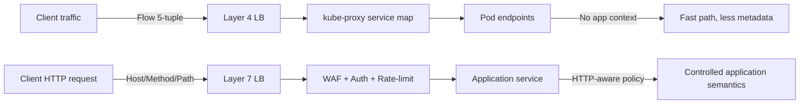
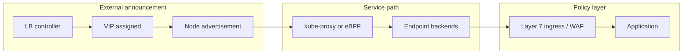
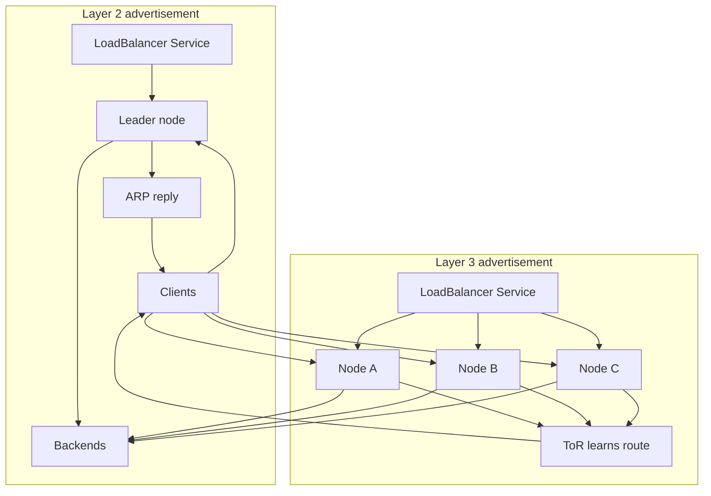
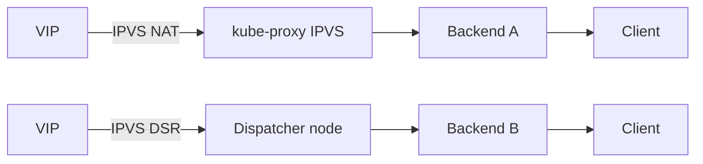

> **Complexity**: `[ADVANCED]` | Time: 120 minutes
>
> **Prerequisites**: [Module 3.2: BGP & Routing](../module-3.2-bgp-routing/), [Datacenter Network Architecture](../module-3.1-datacenter-networking/)

---

## Learning Outcomes

After completing this module, you will be able to:

1. **Differentiate L4 packet steering and L7 proxying** for on-prem Kubernetes services.
2. **Configure and compare MetalLB, kube-vip, keepalived, HAProxy, nginx, Envoy, and Cilium** in bare-metal environments.
3. **Apply session affinity, TLS termination, and WAF integration choices** to preserve both reliability and security.
4. **Operate failover semantics** for VIP ownership across VRRP, MetalLB, and leader-based control designs.
5. **Run three hands-on validations**, including MetalLB L2 with a two-replica `LoadBalancer` service in kind and VIP failover checks.

## Why This Module Matters

When teams move from managed cloud Kubernetes to bare-metal datacenters, service externalization often breaks before application behavior changes. A `LoadBalancer` service that was routable in the cloud can remain unresolved on bare metal because no external controller assigns a VIP by default. This usually appears as a launch blackout where dashboards are healthy, pods are ready, and still nothing reachable from outside.

For on-prem operations, load balancing is a platform control plane that combines address allocation, forwarding method, health semantics, and failover policy. The operator must now coordinate all decisions that were previously hidden behind provider services. That includes whether traffic should be steered at Layer 4 or Layer 7, whether announcements are L2 or BGP, and whether kube-proxy remains in front of workload traffic.

The practical result is that traffic decisions become explicit. A tiny configuration error in advertisement mode or VIP ownership can produce widespread incident pressure even while application metrics look stable. This module builds the mental model to predict these failure modes before a customer does.

## What You'll Learn

- Layer 4 versus Layer 7 decision boundaries for Kubernetes service exposure.
- MetalLB L2 and BGP operation with IP address pools and advertisement CRDs.
- kube-vip in control-plane and service VIP modes.
- keepalived + VRRP election behavior and operational failure modes.
- HAProxy/L7 behavior, nginx alternatives, Envoy xDS basics, and Cilium kube-proxy-free mode.
- Session affinity strategies, SR-IOV data path tradeoffs, and incident recovery workflows.

## Did You Know

- Kubernetes `LoadBalancer` services on bare-metal require an external controller for VIP assignment and announcement.
- L2 load balancing with MetalLB is simple but can become a single-node bottleneck under high connection rates.
- keepalived uses VRRP state machines for deterministic master-backup ownership and can recover VIP ownership quickly.
- L7 components can enforce richer security and policy but require explicit protocol awareness and capacity planning.

## Section 1: Layer 4 and Layer 7 Fundamentals for on-prem Kubernetes

The core distinction is that Layer 4 tools route by transport fields, while Layer 7 tools route by request semantics. In L4, node selection generally depends on connection tuples, service endpoints, and proxy policies. In L7, routing decisions depend on host, path, headers, cookies, and protocol behavior.

Layer 4 is typically faster per request because it avoids deep parsing, but it cannot make decisions on `Accept`, path, or custom header strategy. Layer 7 supports fine-grained routing and security policy and can support complex A/B traffic splits, but it creates additional state and observability requirements. This is why teams often use a layered architecture: L4 for raw traffic distribution and L7 for policy enforcement.

The distinction becomes important with HTTP keep-alive and retries. In Layer 7, a client retry from a TLS-terminated proxy is a request-level event with semantics around method safety and idempotency described in HTTP message handling rules. In Layer 4, the same event might still involve established TCP sessions and appear healthy long after application retries become pathological.


```mermaid
graph LR
    C[Client traffic] -->|Flow 5-tuple| L4[Layer 4 LB]
    L4 --> K[kube-proxy service map]
    K --> P[Pod endpoints]
    C2[Client HTTP request] -->|Host/Method/Path| L7[Layer 7 LB]
    L7 --> W[WAF + Auth + Rate-limit]
    W --> A[Application service]
    P -->|No app context| R1[Fast path, less metadata]
    A -->|HTTP-aware policy| R2[Controlled application semantics]
```

For Layer 4 workflows, health checks are mostly about backend availability and kernel path readiness. For Layer 7 workflows, health checks become a part of protocol behavior and can include custom endpoints, response patterns, or header checks. If one layer says healthy and the other says unhealthy, you should not assume correctness from either alone.

## Section 2: Kubernetes Service Addressing and Forwarding Boundaries

On a cloud platform, `LoadBalancer` often means the provider allocates and advertises external addressing for you. On bare-metal, the service model still exists, but the mechanism that gives it a publicly routable VIP must be provided locally. This is where MetalLB, kube-vip, or keepalived becomes critical.

When a request reaches an on-prem VIP, the next handoff is usually through kube-proxy or an equivalent replacement path. If kube-proxy is present, it maintains service endpoint processing and can be managed by iptables mode or IPVS mode. If kube-proxy-free mode is in place, service processing may happen in eBPF maps and tracing flows must follow different observability paths.

You can think of the stack as three explicit stages: external announcement, service selection, and request interpretation. External announcement decides where the first node receives traffic. Service selection chooses backend endpoint and applies session policy. Request interpretation adds business-aware logic only where protocol parsing occurs. This decomposition is the most durable way to design load-balancing architecture.


```mermaid
flowchart LR
  subgraph "External announcement"
    A[LB controller] --> B[VIP assigned]
    B --> C[Node advertisement]
  end
  subgraph "Service path"
    C --> D[kube-proxy or eBPF]
    D --> E[Endpoint backends]
  end
  subgraph "Policy layer"
    E --> F[Layer 7 ingress / WAF]
    F --> G[Application]
  end
```

## Section 3: MetalLB Fundamentals, Address Pools, and Advertisements

MetalLB is the standard answer for bare-metal `LoadBalancer` automation in many environments. It introduces controllers that watch services and allocates external addresses from a pool you define. The critical resource is `IPAddressPool`, which defines CIDR ranges or explicit blocks. Without careful governance, overlaps can conflict with host and infrastructure allocations.

A MetalLB address configuration typically combines the pool and one of two advertisement modes. The mode drives how external network devices reach the advertised IP.

```yaml
apiVersion: metallb.io/v1beta1
kind: IPAddressPool
metadata:
  name: onprem-addresses
  namespace: metallb-system
spec:
  addresses:
    - 10.90.30.100-10.90.30.170
```

The L2 model uses announcements based on local node ownership. This is straightforward, requires fewer network changes, and is often the fastest path for small to medium footprints. But by design, one node is owner for a given VIP while advertisements are active.

```yaml
apiVersion: metallb.io/v1beta1
kind: L2Advertisement
metadata:
  name: onprem-l2
  namespace: metallb-system
spec:
  ipAddressPools:
    - onprem-addresses
  interfaces:
    - bond0
```

BGP mode uses route advertisement so multiple nodes can announce routes for the same service, allowing distribution over ECMP-capable topologies. It is operationally stronger for larger clusters but requires robust BGP governance and upstream support.

```yaml
apiVersion: metallb.io/v1beta1
kind: BGPAdvertisement
metadata:
  name: onprem-bgp
  namespace: metallb-system
spec:
  ipAddressPools:
    - onprem-addresses
  communities:
    - "65000:80"
```

```yaml
apiVersion: metallb.io/v1beta2
kind: BGPPeer
metadata:
  name: tor-peer
  namespace: metallb-system
spec:
  myASN: 64512
  peerASN: 64501
  peerAddress: 10.90.0.1
  holdTime: 90s
  keepaliveTime: 30s
```

When troubleshooting MetalLB, compare VIP state, address pool exhaustion, and peer health together. A missing address is often a governance issue, while fast flap behavior often indicates network peer churn.

## Section 4: MetalLB in Practice and the L2-to-BGP Decision

An L2-only design is predictable and often easier for first production use, but at high throughput it can create one node receiving ingress for each service VIP. If connection reuse is low and long-lived streams are common, that concentration matters. BGP distributes announcement across multiple speakers and often smooths this behavior when fabric policy allows ECMP.

A practical rule is L2 for small clusters with strict operational simplicity and known growth limits. Choose BGP for wider scale, where load distribution at the network edge is required and the operations team can maintain clean peer configuration.


```mermaid
graph TD
    subgraph L2_Mode[Layer 2 advertisement]
      SVC1[LoadBalancer Service] --> L2Node[Leader node]
      L2Node --> ARP[ARP reply]
      ARP --> Clients
      Clients --> L2Node --> Backends
    end
    subgraph BGP_Mode[Layer 3 advertisement]
      SVC2[LoadBalancer Service] --> N1[Node A]
      SVC2 --> N2[Node B]
      SVC2 --> N3[Node C]
      N1 --> ToR[ToR learns route]
      N2 --> ToR
      N3 --> ToR
      ToR --> Clients
      Clients --> N1 & N2 & N3 --> Backends
    end
```

BGP mode can still fail if upstream switches filter or leak routes unexpectedly. If that happens, all downstream services fail simultaneously even if controllers are correct, so the blast radius becomes wider. For that reason, your runbook must include both MetalLB state checks and switch-side route checks.

## Section 5: kube-vip for Service and Control-plane VIPs

kube-vip is one of the strongest minimal solutions when teams want one binary to manage floating addresses with lower deployment overhead than multiple moving parts. It is commonly used for control-plane VIPs and can also expose service-level VIPs in some topologies.

The daemonset mode works well for dynamic node enrollment because each node runs a local component. The static mode remains useful in constrained bootstrap environments where declarative start-up order matters. In both modes, the same principle applies: leadership and announcement must be deterministic.

```bash
# Example static pod manifest install style from kube-vip docs
# https://kube-vip.io/docs/installation/static/
# Replace flag values for your environment per the docs:
VIP="172.18.255.100"
kube-vip manifest pod \
  --interface eth0 \
  --address "$VIP" \
  --controlplane \
  --services \
  --arp \
  --leaderElection | kubectl apply -f -
```

```bash
# Example daemonset manifest install style from kube-vip docs
# https://kube-vip.io/docs/installation/daemonset/
# Replace flag values for your environment per the docs:
VIP="172.18.255.100"
kube-vip manifest daemonset \
  --interface eth0 \
  --address "$VIP" \
  --inCluster \
  --taint \
  --controlplane \
  --services \
  --arp \
  --leaderElection | kubectl apply -f -
```

A typical control-plane pattern creates a VIP for the API server endpoint. The same mechanism can be extended to service-level use cases with care around annotations and admission constraints. In practice, teams usually keep control-plane and service traffic boundaries explicit in policy.

A known incident pattern occurs when a kube-vip leader is removed and returns quickly enough to cause election churn. In that window, requests can reach a node that is no longer truly leader. The mitigation is to validate heartbeat, leader election timeout, and pod scheduling policies before asserting strict SLO guarantees.

## Section 6: keepalived with VRRP for Master-Backup VIP Ownership

keepalived and VRRP remain a proven construct for deterministic master-backup behavior. VRRP sends periodic advertisements and transitions between master and backup based on priority and health state. This behavior is standard in RFC-defined semantics and can coexist with Kubernetes ingress paths.

From an on-prem design perspective, keepalived gives strong control. It is explicit, predictable, and lightweight for many teams moving from legacy appliances. But operational reliability depends on exact `virtual_router_id`, interface consistency, priority policy, and advertisement timing.

```bash
vrrp_instance K8S_INGRESS {
    state MASTER
    interface eth0
    virtual_router_id 22
    priority 180
    advert_int 1
    virtual_ipaddress {
        10.90.40.10/24
    }
}
```

```bash
vrrp_instance K8S_INGRESS {
    state BACKUP
    interface eth0
    virtual_router_id 22
    priority 140
    advert_int 1
    nopreempt
    virtual_ipaddress {
        10.90.40.10/24
    }
}
```

A split-brain scenario in VRRP often starts with misaligned priorities or wrong advertisement expectations. The cluster appears functional at first, then split packet delivery appears as duplicate MAC ownership. This can trigger intermittent failures even when individual components are healthy.

## Section 7: HAProxy as Bare-Metal L4 and L7 Load Balancer

HAProxy remains mature for high-throughput fronting while offering both transport and HTTP modes. It can be used to front Kubernetes ingress, API servers, and mixed legacy traffic.

```bash
global
    log stdout local0
    maxconn 25000

defaults
    mode tcp
    option  tcplog
    timeout connect 5s
    timeout client 30s
    timeout server 30s

frontend api_tcp
    bind *:6443
    default_backend api_backend

backend api_backend
    balance roundrobin
    option tcp-check
    server cp01 10.90.50.11:6443 check
    server cp02 10.90.50.12:6443 check
    server cp03 10.90.50.13:6443 check

frontend web_http
    bind *:80
    mode http
    default_backend web_backend

backend web_backend
    mode http
    balance leastconn
    option httpchk GET /healthz
    http-check expect status 200
    server web01 10.90.60.11:80 check cookie s1
    server web02 10.90.60.12:80 check cookie s2
    server web03 10.90.60.13:80 check cookie s3
EOF
```

`roundrobin` suits similar capacities and short request cycles, while `leastconn` helps when response times vary significantly. `tcp-check` confirms transport-level readiness, and `httpchk` validates layer semantics where available.

A known incident from production clusters is bursty half-open traffic that saturates `maxconn`. Under that condition, services appear healthy but requests stall at the proxy layer. The fix is not only increasing proxy caps; it is also enforcing client-rate checks, SYN behavior controls, and coherent timeout policies with upstream components.

## Section 8: nginx as TCP Gateway and HTTP Load-Balancer

nginx can play both roles: raw TCP forwarding through `stream` and richer HTTP routing through `http`. This can be useful in mixed infrastructure because one platform can cover both legacy and modern use cases.

```nginx
stream {
    upstream ingress_tcp {
        hash $remote_addr consistent;
        server 10.90.70.11:443 max_fails=3 fail_timeout=4s;
        server 10.90.70.12:443 max_fails=3 fail_timeout=4s;
    }
    server {
        listen 443;
        proxy_pass ingress_tcp;
        proxy_timeout 45s;
    }
}

http {
    upstream web_pool {
        least_conn;
        server 10.90.70.21:80;
        server 10.90.70.22:80;
    }

    server {
        listen 80;
        location / {
            proxy_pass http://web_pool;
        }
    }
}
```

For many teams, nginx is easier to integrate when existing rule logic already exists, but you must map clearly where TLS termination occurs. If TLS is terminated at nginx, downstream services may run plain HTTP internally, so that boundary must be intentional.

## Section 9: Envoy as Control-Plane Driven Ingress and L7 LB

Envoy is core technology in modern service mesh designs because it decouples data plane from control plane through xDS APIs. In this pattern, listeners, routes, clusters, and endpoints can all be updated dynamically without full restart of proxy processes.

`CDS` manages named backend groups, `EDS` manages actual endpoint membership, `LDS` controls listener behavior, and `RDS` controls route tables. This allows deterministic, centralized policy updates, but requires reliable control-plane convergence for high-availability behavior.

```text
Control Plane
  -> ADS stream
  -> Listener (LDS), Route (RDS), Cluster (CDS), Endpoint (EDS)
  -> Envoy data plane
```

In on-prem environments, this is powerful when policy changes are frequent and must remain versioned, audited, and distributed predictably. The operational tradeoff is added complexity of control-plane correctness and monitoring.

## Section 10: Cilium kube-proxy-Free Model and DSR

Cilium can run kube-proxy-free service load balancing with eBPF paths. In this mode, service routing can happen without kube-proxy's classic iptables or IPVS path. This reduces some host CPU overhead and can improve path determinism under load.

Cilium DSR is a kube-proxy-free Service/NodePort datapath behavior, typically controlled by `loadBalancer.mode=dsr` or `loadBalancer.mode=hybrid` in Cilium-managed clusters.

It is not an Envoy/L7 proxy return optimization: traffic is still distributed at the service layer, while response routing in DSR mode can skip the intermediate service node when using this node-local eBPF return path.

```bash
# Conceptual toggle in Cilium-managed clusters
grep -n "kubeProxyReplacement" /etc/cilium/cilium.yaml
```

In practical migration, run canaries and compare latency, drops, and observability coverage before expanding kube-proxy-free mode cluster-wide. The difference is not only performance; it is tooling and incident procedures.

## Section 11: SR-IOV Pass-Through for High-Throughput Ingress Paths

SR-IOV is commonly selected when throughput and latency become limiting factors in the shared Linux data path. By passing virtual functions to workloads or ingress nodes, packet handling can be more direct and predictable than generic virtual interfaces.

Because SR-IOV bypasses some software layers, it can improve latency under heavy L4 load and sustained connection rates. This is attractive for payment, media, and telemetry ingress where microsecond variation matters. The tradeoff is reduced flexibility and more hardware-specific operations.

A careful design uses SR-IOV only for selected edge workloads while preserving standard Kubernetes networking for the rest. Mixed architecture increases complexity but keeps operational blast radius limited.

## Section 12: Session Affinity at Transport and HTTP Layers

Affinity must be intentional, not default. It should preserve user continuity only where state demands it and should be scoped by workload behavior.

`clientIP` groups traffic by source and can reduce user churn, but NAT-heavy environments may create heavy imbalance when many users share one address.
Cookie-based affinity improves control for browser and API clients that support managed cookies. Consistent hash affinity supports shard-aware selection when keys are stable and chosen carefully.

```bash
apiVersion: v1
kind: Service
metadata:
  name: portal-sticky
spec:
  selector:
    app: portal
  type: LoadBalancer
  ports:
    - port: 80
      targetPort: 80
  sessionAffinity: ClientIP
  sessionAffinityConfig:
    clientIP:
      timeoutSeconds: 3600
```

```bash
apiVersion: v1
kind: Service
metadata:
  name: api-cookie
  annotations:
    nginx.ingress.kubernetes.io/affinity: cookie
    nginx.ingress.kubernetes.io/session-cookie-name: APPSTICKY
spec:
  selector:
    app: api
  ports:
    - port: 80
      targetPort: 80
```

When affinity is wrong, the failure mode is usually hotspot concentration. Always measure pod-level concurrency with affinity enabled before rolling to production.

## Section 13: TLS Termination Patterns for Internal and External Boundaries

If termination is external to workloads, policy and inspection are easier because proxies can parse and enforce WAF and header-level checks. If termination is internal, workload containers must manage cert rotation and security policy directly.

LB-terminated TLS is faster for policy deployment and often best for centralized security teams. Pass-through is safer for strict end-to-end compliance boundaries but increases complexity in backend certificate distribution.

```bash
frontend edge_tls
  bind *:443 ssl crt /etc/ssl/private/edge.pem
  default_backend web_pool

backend web_pool
  mode http
  option httplog
  server app01 10.90.80.11:443 check
  server app02 10.90.80.12:443 check
```

```bash
frontend edge_passthrough
  mode tcp
  bind *:443
  default_backend api_tls

backend api_tls
  mode tcp
  server api01 10.90.80.21:8443 check
  server api02 10.90.80.22:8443 check
```

In most on-prem designs, teams begin with LB-terminated TLS for external edges and maintain internal encryption with service mesh or pod-level TLS for east-west paths.

## Section 14: WAF Integration with ModSecurity and Coraza

WAF is useful only if attached where request semantics are visible. Transport-level L4 components cannot inspect HTTP payload policy. For this reason, ModSecurity and Coraza belong to HTTP-aware tiers in most architectures.

```nginx
http {
  server {
    listen 443 ssl;
    modsecurity on;
    modsecurity_rules_file /etc/nginx/modsec/main.conf;
    location / {
      proxy_pass http://web_pool;
    }
  }
}
```

```bash
kubectl create namespace ingress-security
kubectl create configmap modsecurity-rules \
  --from-file=main.conf=./main.conf \
  -n ingress-security
```

A WAF miss or false positive should always be visible in logs with request identifiers and backend context. The most common anti-pattern is enabling broad rules without exception testing.

## Section 15: kube-proxy Position and Replacement Cases

A reliable architecture document must state what happens when load balancing sits before or after kube-proxy equivalent behavior.

In kube-proxy present mode, traffic usually arrives at a node and is processed through service translation before reaching backends.

In kube-proxy-free designs with eBPF replacement, that translation is handled by other data-plane primitives.

```text
Mode A: External VIP -> Node -> kube-proxy map -> Pods
Mode B: External VIP -> eBPF service map -> Pods
```

The observable difference is mostly in troubleshooting commands and packet-flow tracing. In mode A, commands like iptables inspection and IPVS state are central. In mode B, inspect datapath maps and the eBPF service model directly.

When planning replacement, test failover scenarios explicitly. Some teams move only gateway namespaces first while keeping core platform services on kube-proxy.

## Section 16: Real Incident Postmortems and Mitigation Patterns

### Incident: Split-brain from VRRP misconfiguration
The split-brain pattern appears when backups and masters can both assert ownership due to identical priorities or inconsistent interfaces. The network then sees intermittent path ownership and duplicate traffic ownership signatures.

The mitigation is deterministic election parameters, strict advert settings, and pre-production chaos tests that intentionally isolate master health.

### Incident: MetalLB ARP storm during L2 scale stress
An overloaded L2 edge with frequent VIP reassignments can trigger ARP cache churn. Clients may see intermittent failures even when node health appears normal.

The mitigation is to validate flapping signals in announcement state, apply controlled scale, and migrate to BGP for services that require scale and lower churn.

### Incident: kube-vip leader election lag after pod eviction
After control-plane pod eviction, stale state and timing windows can delay re-election. During the window, clients can hit transient path failures.

Mitigation is election timeout tuning, pod anti-affinity, and readiness gating so no single control-plane event is interpreted as healthy service.

### Incident: HAProxy SYN flood and `maxconn` saturation
A proxy under sustained connection storm fills `maxconn` and makes healthy backends appear unreachable at the client layer.

Mitigation is strict network-level rate control, timeout harmonization, and load testing with realistic SYN patterns before enabling broad production traffic.

These events are independent of tool choice. They occur whenever LB control and service path assumptions are not validated under fault conditions.

## Section 17: LVS and IPVS on Bare-Metal Kubernetes

The Linux Virtual Server architecture is historically important for Kubernetes operators that need deterministic service datapaths under load. In many bare-metal stacks, kube-proxy in IPVS mode implements a large part of this behavior, while other stacks move toward kernel-level load balancing without traditional proxy components. The key operational question is mode selection, because NAT and DSR each alter where response traffic returns.

Network Address Translation mode is simple to reason about because endpoint selection and response traffic are centralized through the proxy path. On ingress, LVS NAT rewrites destination from the VIP to the selected backend. On the return leg, source is rewritten so the client still sees the VIP as the responder.

Direct Server Return (DSR) is explicitly asymmetric. Requests are forwarded to real servers without source/NAT rewrite on the backend request leg in the same flow, while responses are sent directly from real servers to the client. This often avoids one hop on return, but requires ARP + loopback tuning (for example `arp_ignore=1`, `arp_announce=2`) so only the selected node effectively owns the VIP response path.


```mermaid
graph LR
    Client[Client]
    VIP[VIP]
    VIP -->|IPVS NAT| Proxy[kube-proxy IPVS]
    Proxy --> BackendA[Backend A]
    BackendA --> Client

    Client2[Client]
    VIP2[VIP]
    VIP2 -->|IPVS DSR| Dispatcher[Dispatcher node]
    Dispatcher --> BackendB[Backend B]
    BackendB --> Client2
```

To choose correctly, teams should first model both request and response paths and then validate where failure control should be enforced. If policy enforcement is needed for every response, NAT keeps all responses in the central policy point and is easier to audit. If maximum throughput and shortest return path matter, DSR can be stronger, but you must prove that return routes and anti-spoof checks remain stable under churn.

In Kubernetes, IPVS often appears in kube-proxy-managed mode. In that model, endpoint state and service reconciliation stay coupled to Kubernetes object state. A service deletion, label drift, or endpoint update changes behavior through standard kube-proxy lifecycle. This makes operations familiar, especially for teams that already operate cluster-level networking diagnostics through kubectl and iptables or ipvsadm tools.

Standalone LVS implementations can look attractive because they remove a layer of abstraction, but they shift responsibility. Service ownership and failover become infrastructure semantics instead of Kubernetes object semantics. If a controller fails or a VIP script misfires, recovery pathways differ from standard kube-proxy behavior. For this reason, explicit ownership boundaries and runbooks matter more than raw throughput claims.

When MetalLB is in L2 mode and kube-proxy remains active, only one node owns VIP reception and the selected node forwards through service mapping. That can be ideal for small clusters. In BGP mode, multiple nodes may advertise, and routing can shift across several edges, but complexity moves into switch policy and path symmetry testing.

With kube-vip or keepalived, the VIP owner and forwarding node can still differ from kube-proxy service mode behavior. This is a major incident edge case because ownership of VIP does not automatically guarantee backend policy behavior. Always validate both ownership and endpoint health before assuming service availability.

When comparing DSR and NAT under heavy operations, use chaos drills as the deciding metric. A practical drill is repeated pod churn under persistent synthetic clients. DSR designs fail loudly when return path assumptions are wrong, while NAT designs often fail more softly through elevated proxy CPU and retransmission behavior. Neither failure style is better until you know your incident handling maturity.

For highly secure traffic, DSR should be paired with an explicitly controlled route and ACL strategy that allows direct return only when policy can still be enforced where required. If ACL controls are still evolving, NAT is often safer as the initial path because all traffic remains within one deterministic proxy frame.

The migration rule is to move incrementally. Start with one service family, document expected metrics, verify return path behavior with tcpdump at edges, and only then scale to additional services. This keeps architectural gains from becoming operational debt.

## Section 18: Practical Design Matrix and Final Trade-off Guidance

A durable on-prem architecture is a trade-off matrix, not a single component selection. The most useful matrix has columns for protocol scope, failover behavior, observability burden, security boundary, and rollback effort.

For protocol scope, classify traffic before selecting a tool. Simple TCP and UDP traffic can be optimized with L4 forwarding. HTTP services requiring host-based routing, cookie semantics, or WAF should route through L7 policy components.

For failover behavior, compare how quickly VIP ownership changes and how endpoints drain. L2 modes are easy but can concentrate. BGP modes distribute better but require networking governance. keepalived and kube-vip differ in election and leader ownership ergonomics, and each should be tested under forced process loss.

For observability burden, count which layer emits the first actionable signal when a service is unhealthy. In L4-heavy designs, this is often endpoint maps and service states. In L7-heavy designs, this is policy logs, retries, and WAF rule outcomes.

For security boundary, define where TLS terminates, where request parsing occurs, and where secret material is managed. If TLS must end at the edge, L7 policy belongs there, and L4 components should delegate. If TLS remains end-to-end, ensure backends can carry certificate operations without service-level coupling.

For rollback effort, define who can quickly restore control-plane access and who owns ingress policy reversion. A cluster with documented rollback triggers and pre-authored patches reduces outage severity more than any single high-throughput datapath.

This matrix approach prevents rushed architectural switches caused by benchmark-only thinking. Throughput and latency numbers matter, but incident readiness and ownership clarity are equally critical in production.

The final exercise for teams should be a full-path drill: announce VIP, drain one backend, force one leader transition, and verify service continuity at both transport and request layers. If you can explain failure source in under five minutes after this drill, the architecture is operationally valid.

## Section 19: Incident Playbooks and Operating Discipline for Bare-Metal LB

Every production failure in load balancing has both a network interpretation and a control interpretation. The network interpretation explains packet movement, ownership, and route symmetry. The control interpretation explains which component owns source of truth for VIP state and whether leadership, advertisement, or endpoint mapping is lagging. Without this split, teams run the right command at the wrong component.

A practical playbook starts with a fast ownership triage matrix.
First, confirm which component owns the VIP.
Second, confirm whether endpoint mappings are valid and synchronized.
Third, confirm whether request policy is being applied where expected.
Fourth, confirm whether transport and request timeouts are aligned. This sequence prevents wasted time on deeper tooling while a simple ownership mismatch persists.

Incident drills should capture both expected and degraded signals. For example, if a keepalived failover happens, you should capture ARP state and route maps at the same time as pod readiness and endpoint events. If a kube-vip leader moves, you should capture election logs plus service readiness and DNS cache impact. If MetalLB changes leader, verify peer routes and ARP caches for stale ownership.

One effective drill is to force one controlled failure and score response time to user-visible stability. This is not a single command runbook but a sequence that includes VIP check, endpoint diff, and policy-layer check. If one control plane component flips leadership while the second remains unchanged, you can quickly identify partial failure.

Another common production pattern is burst load after deployment. Distinguish whether the burst stress hits the L4 plane, the L7 plane, or both. If only L4 is stressed, kube-proxy rules and backend endpoint selection become critical. If L7 is stressed, request parsing overhead, WAF rules, and cookie/session logic become more likely bottlenecks.

For Layer 7 failures, response logs should include request identifiers and backend correlation IDs. Without this, duplicate retries hide the root problem. If retries increase while backend CPU remains moderate, policy and client behavior are probably amplifying load.

For Layer 4 failures, connection tables and SYN state should be checked first.
If a burst of short-lived opens and closes remains unanswered, the proxy may be saturating accept queues. In that case, increase queue budgets only after limiting abusive patterns and confirming network policy boundaries.

When combining L4 and L7, choose one visible source of truth for health. Health for VIP reachability and service endpoint readiness often differs.
For MetalLB and kube-vip, health is primarily announcement and ownership. For Kubernetes services, health is endpoint availability and readiness. For L7 proxies, health is request-level response and routing validity. Document this in runbooks so teams know which signal decides actual user behavior.

The runbook should also classify ownership and rollback for each layer. If VIP ownership is wrong, rollback means restoring announcement order and leader policy. If endpoint maps are wrong, rollback means reverting service selectors and rollout states. If L7 policy is wrong, rollback means route or WAF adjustment. One cause, one rollback path, one owner.

In large clusters, use synthetic clients that validate end-to-end semantics through each layer. A synthetic transaction should verify Layer 4 reachability, session behavior, TLS termination, request policy, and response latency. If synthetic checks stay green while user traffic degrades, the issue may be external clients and connection profile; if synthetic checks fail, platform layer is degraded.

For kube-proxy-free migrations, playbooks should include both modes in parallel during transition windows. Keep one test namespace on classic IPVS path while the rest operate in new path. This reduces unknown unknowns during migration and proves rollback under pressure.

The biggest operator mistake is to treat all LB problems as backend issues. Use the rule "move one layer at a time." Validate ingress, then service endpoint selection, then request policy, then TLS and WAF rules. Reaching deep into the wrong layer increases MTTR and increases the chance of repeated change during incident response.

If you run SR-IOV or pass-through NIC modes, add additional checks for interface binding and MAC changes across restarts. The fastest failures in these environments look like stale queue affinity or wrong VF mappings and can appear as random packet drops despite healthy backends.

For incident communication, every operator should know the user-facing blast radius when each control plane changes.
If VIP ownership flips without endpoint continuity, users may see brief reconnect delays.
If VIP and endpoints stay stable but L7 rules change, errors become request-specific.
If only policy changes, requests with specific headers or cookies may fail first. This clarity reduces panic and improves handoff quality.

At scale, document a cadence for capacity reviews every time throughput or path model changes. A mode that worked at 500 requests per second with L2 and small pods may fail at 20,000 requests per second unless BGP distribution and affinity are adjusted.

Your architecture should specify who approves the next mode after every drill. Most clusters pass drills but still fail in production because approval and rollback owners were not explicit before the migration window.

A mature bare-metal LB team does not rely on one tool, one source, or one command.
It relies on explicit ownership, staged tests, and predictable section-level failures. Build runbooks this way, and the same team can operate MetalLB, kube-vip, and L7 proxies safely even under sustained churn.

## Section 20: Migration, Capacity, and Control Planning for On-Prem LBs

A migration plan should be explicit about not only what changes, but the order of truth for each component. In many teams, the sequence starts with external routing and VIP assignment, then service maps, then request-aware policy. This is safer than introducing all layers at once because each stage has different blast radii.

The first migration step is to define a baseline where one path is stable and measurable. In this baseline, record VIP assignment time, endpoint convergence time, and median request latency under a small but realistic workload. Without these numbers, later improvements become anecdotes.

Next, introduce traffic steering improvements in measured increments.
For example, start with basic L2 MetalLB and confirm endpoint stability.
Then introduce BGP announcement only after upstream route acceptance and path symmetry are proven.
Only after network steering is stable should you add Layer 7 policy for request parsing, because L7 failures tend to appear downstream and can multiply traffic characteristics.

Capacity planning for L4 and L7 should use separate headroom calculations.
L4 planning measures connection concurrency and route dispatch throughput.
L7 planning measures policy parsing cost, request transformations, header rewriting, and WAF behavior. Mixing these budgets is a common source of false confidence.

For TLS planning, separate front-door and internal encryption costs.
Terminating TLS at the edge changes memory and CPU profile of the ingress layer.
Keeping TLS end-to-end shifts cipher and session overhead to workload workloads, and this can become a hidden cost if pod resource limits are unchanged.

When teams add affinity, define thresholds before they add policies. If cookie affinity is enabled without upper concurrency limits, node imbalance may appear only under real traffic diversity. If session duration increases due to retries, backend pods can see more long-lived flows than expected and then look “slow” even when they are not CPU-bound.

Incident readiness for on-prem designs should include one controlled runbook that crosses all layers.
First, fail one backend pod and confirm L4 path continuity.
Second, force a VIP election and confirm Layer 7 policy remains anchored.
Third, drop one SR-IOV assigned interface path and confirm fallback behavior.
Fourth, induce a rule-based deny event in WAF and verify safe rollback.
This sequence should be repeated before each new release wave.

Observability also needs migration planning.
If IPVS mode is used through kube-proxy, add dashboards for service map state.
If kube-vip or keepalived ownership is used, add ownership and announcement counters.
If Envoy or Cilium policy is used, include control-plane config version visibility and route generation lags. These separate views prevent false conclusions.

For teams moving to kube-proxy-free mode, a practical control guardrail is to freeze critical namespaces while a second namespace is in migration. This keeps a production-safe rollback path if endpoint semantics diverge from expected values during scale tests.

The design should explicitly declare when transport ownership can change and when policy ownership is fixed. If a VIP owner changes too quickly, keepalived and kube-vip logs will still show healthy leadership but the ingress policy may still hold stale path rules. If one team owns each layer without synchronized ownership boundaries, post-change validation time increases dramatically.

A mature platform includes postmortem hooks in the runbook.
Each incident should map to one of four layers: VIP ownership, endpoint selection, policy routing, and security enforcement. This keeps remediation clear. When severity rises, responders know whether to look at CRD reconcile state, service maps, ingress policy, or traffic filters.

The final planning outcome is not an architecture diagram alone. It is a maintained sequence of expected states and clear owner actions for each state transition.
If this sequence is documented and rehearsed, on-prem load balancing behavior becomes predictable under pressure instead of fragile under routine change.

As workload patterns evolve, revisit capacity assumptions at the same cadence as kernel and platform upgrades. A test that passed at cluster size N may fail quietly at N plus one-third due to path-length and election timing changes. Keep a quarterly load test where VIP advertisement, endpoint reconciliation, and Layer 7 policy updates are stressed together. In this run, you should measure failover decision latency, policy mismatch windows, and connection recovery under real workloads, then compare results to your accepted error budget. This practice turns load balancing from a static design artifact into an actively maintained control surface.

## Common Mistakes

| Mistake | Problem | Fix |
|---------|---------|-----|
| Assuming `LoadBalancer` works on bare metal without an announcer | Service IP stays pending indefinitely | Install and configure MetalLB or kube-vip in the cluster before relying on external access |
| Using L2 MetalLB everywhere without evaluating scale | Single-node concentration and periodic ARP churn | Use BGP for wider distribution when fabric capacity supports it |
| Keeping duplicate VRRP priorities across nodes | Split-brain and unstable VIP ownership | Enforce deterministic `virtual_router_id` and priority rules |
| Ignoring transport versus HTTP policy boundaries | Traffic passes without request checks | Explicitly define which layer enforces health, auth, and WAF |
| Enabling clientIP affinity in NAT heavy environments | Severe node imbalance and hot shards | Prefer cookie or hash-based strategies with tested key design |
| Configuring kube-proxy-free mode without alternate observability | Missing flow visibility during incidents | Add eBPF visibility and fallback checks before full migration |
| Aligning only one timeout layer in HAProxy | Spurious 5xx under burst despite healthy backends | Harmonize proxy, readiness, and load balancer timeout windows |
| Deploying WAF without exception process | Legitimate traffic blocked in production | Maintain allowlist and rule-testing workflow before enforce mode |

## Quiz

### Question 1
A team needs network-level failover without request parsing and then wants centralized HTTP policy at a second layer. Which architecture best matches this need?

<details>
<summary>Answer</summary>
Use Layer 4 ingress to handle transport-level distribution and route that traffic into a Layer 7 boundary for policy controls. This preserves simple failover at L4 while still enabling HTTP semantics where needed, and limits coupling between transport policy and application policy.
</details>

### Question 2
A `LoadBalancer` service on bare metal is stuck pending even though pods are running. What should you verify first?

<details>
<summary>Answer</summary>
Verify on-prem announcement tooling is present and active, then validate pool and advertisement configuration. On bare metal this usually means checking MetalLB controller state, IPAddressPool availability, and L2 or BGP announcement objects.
</details>

### Question 3
An on-call engineer reports duplicate VIP ownership and intermittent resets in logs. Which technology most likely explains this behavior?

<details>
<summary>Answer</summary>
The most likely class is misconfigured VRRP in keepalived. Duplicate ownership usually means priority, router identifier, or advertisement assumptions are inconsistent across nodes. Correct election settings before changing backend health checks.
</details>

### Question 4
A keepalived setup has two nodes with matching role assumptions and no deterministic failover order. What is the immediate risk?

<details>
<summary>Answer</summary>
Both nodes may assert ownership intermittently, creating split-brain at ARP level and unstable routing for existing client sessions. Assign deterministic priorities and verify preemption behavior under fault simulation.
</details>

### Question 5
Your service under L7 mode is healthy in HAProxy but fails security policy due to bypassed traffic. What is the likely root cause?

<details>
<summary>Answer</summary>
Traffic is likely passing through a path where L7 policy engines are not attached. WAF and ModSecurity only apply where HTTP parsing exists, so keep security checks and request inspection in the Layer 7 layer and avoid bypass through raw TCP paths.
</details>

### Question 6
A two-replica application service behind MetalLB in kind loses one replica. Which result indicates correct failover behavior?

<details>
<summary>Answer</summary>
The VIP remains allocated, and endpoint updates should quickly show one remaining replica. Application traffic should continue, perhaps with reduced capacity, without returning to permanent pending state.
</details>

### Question 7
Your team wants to reduce packet loss under heavy load but keep existing routing semantics. Which option is most likely to help and what is the tradeoff?

<details>
<summary>Answer</summary>
Moving to Cilium DSR or BGP-based MetalLB advertisement can reduce bottlenecks and improve path efficiency for scale, but it increases operational and observability requirements. Validate controls and rollback points before migrating all services.
</details>

### Question 8
Your architecture must preserve source IP, reduce return path hops, and keep failover behavior explicit. What should you evaluate before switching to an IPVS DSR design?

<details>
<summary>Answer</summary>
You should evaluate L2 adjacency, backend routing symmetry, service health signaling, and anti-spoof controls. IPVS DSR can preserve client IP and reduce return latency, but requires careful return path and gateway behavior. If network symmetry cannot be guaranteed, NAT or kube-proxy path should remain until L2 and policy conditions are fully validated.
</details>

## Hands-On Exercise: Bare-Metal LB Validation in a Local Cluster

Complete all three exercises in order.

- [ ] Exercise 1: Deploy MetalLB in L2 mode and verify two-replica VIP failover after deleting one replica.
- [ ] Exercise 2: Run a keepalived VRRP failover test and confirm master/backup ownership is deterministic.
- [ ] Exercise 3: Validate Layer 7 policy with Envoy or HAProxy + WAF and test affinity behavior.
- [ ] Compare L4 packet steering and L7 policy routing in both hands-on exercises and record when each decision layer should own failures.

### Exercise 1: MetalLB L2 Failover with 2 Replicas

```bash
cat <<'EOF' > kind-config.yaml
kind: Cluster
apiVersion: kind.x-k8s.io/v1alpha4
nodes:
  - role: control-plane
  - role: worker
  - role: worker
networking:
  disableDefaultCNI: false
  podSubnet: 10.244.0.0/16
EOF

kind create cluster --name lb-lab --config kind-config.yaml
kubectl apply -f https://raw.githubusercontent.com/metallb/metallb/main/config/manifests/metallb-native.yaml
kubectl wait --namespace metallb-system --for=condition=Available deployment/metallb-controller --timeout=180s
kubectl -n metallb-system rollout status daemonset/speaker --timeout=180s
```

```bash
KIND_SUBNET_CIDR=$(docker network inspect kind -f '{{(index .IPAM.Config 0).Subnet}}')
echo "Kind subnet: ${KIND_SUBNET_CIDR}"
KIND_SUBNET="${KIND_SUBNET_CIDR%/*}"
KIND_MASK="${KIND_SUBNET_CIDR#*/}"
if [ "${KIND_MASK}" -ge 24 ]; then
  KIND_RANGE_PREFIX="$(echo "${KIND_SUBNET}" | awk -F. '{print $1 "." $2 "." $3}')"
else
  KIND_RANGE_PREFIX="$(echo "${KIND_SUBNET}" | awk -F. '{print $1 "." $2 ".255"}')"
fi
LB_POOL_START="${KIND_RANGE_PREFIX}.200"
LB_POOL_END="${KIND_RANGE_PREFIX}.230"

cat <<EOF > /tmp/pool.yaml
apiVersion: metallb.io/v1beta1
kind: IPAddressPool
metadata:
  name: kind-pool
  namespace: metallb-system
spec:
  addresses:
    - ${LB_POOL_START}-${LB_POOL_END}
EOF

cat <<'EOF' > /tmp/l2.yaml
apiVersion: metallb.io/v1beta1
kind: L2Advertisement
metadata:
  name: kind-l2
  namespace: metallb-system
spec:
  ipAddressPools:
    - kind-pool
EOF

kubectl apply -f /tmp/pool.yaml -f /tmp/l2.yaml
```

```bash
cat <<'EOF' > /tmp/demo.yaml
apiVersion: apps/v1
kind: Deployment
metadata:
  name: demo
spec:
  replicas: 2
  selector:
    matchLabels:
      app: demo
  template:
    metadata:
      labels:
        app: demo
    spec:
      containers:
        - name: web
          image: nginx:1.27-alpine
          ports:
            - containerPort: 80
          readinessProbe:
            httpGet:
              path: /
              port: 80
            periodSeconds: 5
            timeoutSeconds: 2
---
apiVersion: v1
kind: Service
metadata:
  name: demo-lb
spec:
  type: LoadBalancer
  selector:
    app: demo
  ports:
    - port: 80
      targetPort: 80
EOF

kubectl apply -f /tmp/demo.yaml
kubectl wait --for=condition=Ready pod -l app=demo --timeout=180s
kubectl wait --for=jsonpath='{.status.loadBalancer.ingress[0].ip}' svc/demo-lb --timeout=60s
VIP=$(kubectl get svc demo-lb -o jsonpath='{.status.loadBalancer.ingress[0].ip}')
echo "Demo VIP: ${VIP}"
curl -sS "http://${VIP}"
```

```bash
kubectl get endpoints demo-lb
POD=$(kubectl get pods -l app=demo -o jsonpath='{.items[0].metadata.name}')
kubectl delete pod "$POD" --grace-period=0 --force
curl -sS "http://${VIP}"
kubectl get endpoints demo-lb
sleep 15
kubectl wait --for=condition=Ready pod -l app=demo --timeout=120s
curl -sS "http://${VIP}"
```

Expected result: MetalLB keeps the VIP assigned after deleting one replica, and the remaining service endpoint continues serving traffic.
You should capture both endpoint snapshots and the two request checks before and after pod deletion; a healthy run returns the nginx body in both `curl` calls while showing one endpoint removed during failover.

### Exercise 2: keepalived Master/Backup Determinism

```bash
# Create a shared docker network for the VRRP pair
docker network rm keepalived-lab >/dev/null 2>&1 || true
docker network create --driver bridge --subnet 172.30.90.0/24 keepalived-lab

cat <<'EOF' > /tmp/keepalived-master.conf
global_defs {
  router_id KEEPALIVED_MASTER
}
vrrp_instance K8S_INGRESS {
  state MASTER
  interface eth0
  virtual_router_id 77
  priority 110
  advert_int 1
  nopreempt
  authentication {
    auth_type PASS
    auth_pass keepalive
  }
  virtual_ipaddress {
    172.30.90.20/24
  }
}
EOF

cat <<'EOF' > /tmp/keepalived-backup.conf
global_defs {
  router_id KEEPALIVED_BACKUP
}
vrrp_instance K8S_INGRESS {
  state BACKUP
  interface eth0
  virtual_router_id 77
  priority 100
  advert_int 1
  nopreempt
  authentication {
    auth_type PASS
    auth_pass keepalive
  }
  virtual_ipaddress {
    172.30.90.20/24
  }
}
EOF

docker run -d --name keepalived-master --network keepalived-lab --ip 172.30.90.11 --cap-add=NET_ADMIN --cap-add=NET_RAW --cap-add=NET_BROADCAST --network-alias keepalived-master \
  -v /tmp/keepalived-master.conf:/etc/keepalived/keepalived.conf:ro \
  alpine:3.21 sh -c "apk add --no-cache keepalived iproute2 >/dev/null && keepalived -f /etc/keepalived/keepalived.conf -n"

docker run -d --name keepalived-backup --network keepalived-lab --ip 172.30.90.12 --cap-add=NET_ADMIN --cap-add=NET_RAW --cap-add=NET_BROADCAST --network-alias keepalived-backup \
  -v /tmp/keepalived-backup.conf:/etc/keepalived/keepalived.conf:ro \
  alpine:3.21 sh -c "apk add --no-cache keepalived iproute2 >/dev/null && keepalived -f /etc/keepalived/keepalived.conf -n"

sleep 8
echo "Initial ownership:"
docker exec keepalived-master ip addr show | grep -n "172.30.90.20" || true
docker exec keepalived-backup ip addr show | grep -n "172.30.90.20" || true

echo "Killing MASTER..."
docker rm -f keepalived-master

sleep 5
echo "Post-failover ownership:"
docker exec keepalived-backup ip addr show | grep -n "172.30.90.20" || true

docker logs --tail 20 keepalived-backup
docker logs --tail 20 keepalived-master || true
docker network rm keepalived-lab >/dev/null 2>&1 || true
```
Expected output:
During steady state, only `keepalived-master` owns `172.30.90.20` on `eth0`.
After `docker rm -f keepalived-master`, ownership should move deterministically so `keepalived-backup` presents `172.30.90.20` on its `eth0` interface.
Backup logs should show the transition into active MASTER role after election, and the failed node should disappear from VIP ownership after teardown.

### Exercise 3: L7 Policy and WAF Smoke Test

```bash
# Example L7 ingress path with affinity and WAF hooks
kubectl apply -f https://raw.githubusercontent.com/kubernetes/ingress-nginx/controller-v1.11.4/deploy/static/provider/cloud/deploy.yaml
kubectl wait -n ingress-nginx --for=condition=Available deployment/ingress-nginx-controller --timeout=120s

cat <<'EOF' > /tmp/waf-ingress.yaml
apiVersion: networking.k8s.io/v1
kind: Ingress
metadata:
  name: demo-ingress
  annotations:
    nginx.ingress.kubernetes.io/enable-modsecurity: "true"
spec:
  rules:
    - host: demo.local
      http:
        paths:
          - path: /
            pathType: Prefix
            backend:
              service:
                name: demo-lb
                port:
                  number: 80
EOF

kubectl apply -f /tmp/waf-ingress.yaml

INGRESS_IP=$(kubectl get svc ingress-nginx-controller -n ingress-nginx -o jsonpath='{.status.loadBalancer.ingress[0].ip}')
if [ -z "${INGRESS_IP}" ]; then
  INGRESS_IP=$(kubectl get nodes -o jsonpath='{.items[0].status.addresses[?(@.type=="InternalIP")].address}')
fi
curl -sS -o /dev/null -w "Normal request status: %{http_code}\n" -H 'Host: demo.local' "http://${INGRESS_IP}/"
curl -sS -o /dev/null -w "Hostile payload status: %{http_code}\n" -G --data-urlencode 'q=<script>alert(1)</script>' -H 'Host: demo.local' "http://${INGRESS_IP}/"
```

Expected outcomes:
A normal request should return HTTP `200` and the demo backend body once ingress resolves `demo.local`.
The hostile payload check should return `403` when a WAF stack is active (`modsecurity` plus policy rules). If no WAF policy is installed, `200` is expected and indicates no WAF enforcement on this ingress path.
If ingress commands cannot reach the service, re-check the ingress IP discovery command, the service backing `demo-ingress`, and whether the path is intentionally limited to host `demo.local`.

## Sources

- <https://metallb.universe.tf/configuration/>
- <https://metallb.universe.tf/concepts/>
- <https://kube-vip.io/docs/installation/static/>
- <https://kube-vip.io/docs/installation/daemonset/>
- <https://docs.haproxy.org/2.8/configuration.html>
- <https://www.keepalived.org/manpage.html>
- <https://datatracker.ietf.org/doc/html/rfc5798>
- <http://www.linuxvirtualserver.org/>
- <https://nginx.org/en/docs/http/load_balancing.html>
- <https://www.envoyproxy.io/docs/envoy/latest/intro/intro.html>
- <https://docs.cilium.io/en/stable/network/kubernetes/kubeproxy-free/>
- <https://kubernetes.io/docs/concepts/services-networking/service/>
- <https://kubernetes.io/docs/reference/networking/virtual-ips/>
- <https://datatracker.ietf.org/doc/html/rfc7230>

## Next Module

Continue to [Module 3.4: DNS and TLS Certificates](../module-3.4-dns-certs/) to continue external ingress and certificate governance topics.
