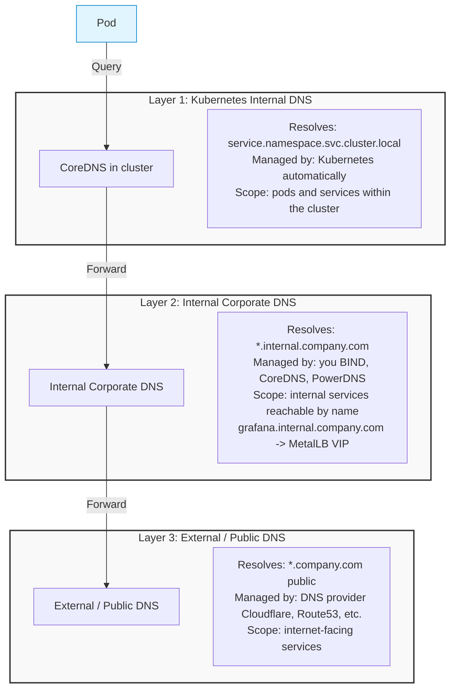
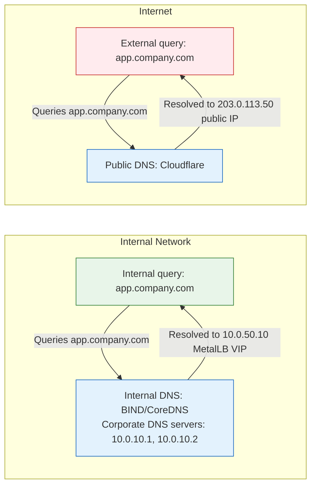

> **Complexity**: `[MEDIUM]` | Time: 45 minutes
>
> **Prerequisites**: [Module 3.3: Load Balancing](../module-3.3-load-balancing/), [CKA: DNS](../../k8s/cka/part3-services-networking/module-3.3-dns/)

## Why This Module Matters

On public cloud platforms like AWS or Google Cloud, fundamental infrastructure services such as DNS and certificate management are heavily abstracted behind managed, automated APIs. Services like Route 53 provide highly available, globally distributed DNS, and AWS Certificate Manager seamlessly provisions, stores, and rotates TLS certificates. These managed services are entirely automatic and deeply integrated into the platform's load balancers, abstracting away the immense complexity of cryptographic operations and recursive DNS resolution. However, on bare metal and on-premises environments, you are solely responsible for building and maintaining this critical infrastructure from the ground up. You must operate your own resilient DNS infrastructure and manage your own private Certificate Authority (CA) with rigorous security standards. If your DNS resolution is incorrectly configured, internal services cannot discover one another, leading to catastrophic cascading failures. If your certificates are misconfigured, expire unexpectedly, or are not trusted by your applications, every network connection is flagged as "untrusted," breaking secure communication and causing widespread outages.

Consider the real-world case of a major regional healthcare company, "HealthData Corp," transitioning their sensitive patient record applications to an on-premises Kubernetes architecture. The engineering team deployed CoreDNS strictly for standard Kubernetes service discovery within the cluster but entirely neglected their external corporate DNS architecture. When their central Prometheus monitoring systems attempted to scrape metrics, they repeatedly failed because they could not resolve `grafana.internal.company.com`. No authoritative DNS server had been configured for the `internal.company.com` zone outside the cluster, resulting in an invisible data black hole during critical production incidents.

The situation compounded disastrously when their continuous integration pipelines began failing. The internal container registry, reachable at `registry.internal.company.com`, was hastily secured using a default, untrusted self-signed certificate that the automated deployment pipeline's tools aggressively rejected. Because there was no properly distributed internal CA trust chain spanning the enterprise networks and Kubernetes nodes, operations ground to a complete halt. It took the frantic engineering teams three weeks of debugging cryptic TLS handshake errors to trace the root causes back to two fundamental omissions: the lack of a proper authoritative DNS zone for internal names, and the absence of a trusted, automated Certificate Authority for internal TLS certificates. This single oversight cost the company hundreds of thousands of dollars in delayed critical deployments and degraded patient service levels, dramatically underscoring why mastering these foundational infrastructure components is absolutely non-negotiable for on-premises Kubernetes engineers.

## What You'll Be Able to Do

After completing this extensive, deep-dive module, you will possess the specialized expertise to:

1. **Design** a resilient, split-horizon DNS architecture that accurately routes both internal cluster traffic and external client queries to the correct IP addresses without unintentional zone leakage.
2. **Implement** a highly available, cryptographically sound private Certificate Authority using robust, industry-standard tools like `cert-manager` and HashiCorp Vault.
3. **Diagnose** complex, multi-layered DNS resolution failures across all three distinct tiers of the on-premises Kubernetes DNS hierarchy using native debugging methodologies.
4. **Evaluate** the technical architecture and strict security trade-offs between simple self-signed certificate hierarchies and advanced, short-lived Public Key Infrastructure (PKI) systems.
5. **Implement** fully automated TLS certificate rotation for diverse Kubernetes workloads to systematically prevent operational outages caused by expired cryptographic trust chains.

## The Anatomy of On-Premises DNS

In an on-premises Kubernetes cluster, Domain Name System (DNS) resolution does not exist as a single, flat architectural layer. Instead, it operates dynamically across multiple distinct tiers, each definitively responsible for a specific, isolated scope of resolution. Grasping this hierarchy is the absolute first, non-negotiable step in troubleshooting any connectivity issue inside or outside the cluster. 

When a Pod is scheduled onto a Kubernetes node, the kubelet injects a meticulously constructed `/etc/resolv.conf` into the container namespace. This configuration fundamentally alters how DNS queries are formulated and processed by the operating system. It typically configures the `nameserver` directive to explicitly point to the virtual ClusterIP of the `kube-dns` service (usually `10.96.0.10`), which is backed by your internal CoreDNS pods. Crucially, it also configures the `search` directive to automatically append local domains like `default.svc.cluster.local` and `svc.cluster.local`. Because it sets the high `ndots:5` option, any domain name query containing fewer than five dots will first systematically attempt to resolve against the local search paths before attempting a global root lookup. Understanding this recursive behavior is vital when debugging why external queries might experience significant latency due to iterative search path lookups. 

Kubernetes DNS-based service discovery is strictly governed by the kubernetes/dns specification. The Kubernetes DNS-Based Service Discovery Specification at [specification.md](https://github.com/kubernetes/dns/blob/master/docs/specification.md) is the authoritative, definitive reference for valid DNS record types, zone layouts, and supported query protocols.

As of kubeadm version 1.<!-- -->21+, the legacy `kube-dns` support was entirely removed from the ecosystem. The official kubeadm version 1.<!-- -->35 documentation explicitly states: 'the only supported cluster DNS application is CoreDNS'. CoreDNS operates as a fast, flexible, cloud-native DNS server written in Go. CoreDNS current stable version is version 1.<!-- -->14.2, delivering significant performance optimizations and advanced plugin support.

### CoreDNS Architecture and Plugins

CoreDNS uses a single `Corefile` as its native configuration format, systematically structured as discrete server blocks populated with executable plugins. A server block strictly defines the DNS zone it serves (for example, `cluster.local` or `.`) and outlines the specific, ordered chain of plugins executed for any queries matching that zone. Crucially, the actual plugin execution order is fundamentally defined by the compiled `plugin.cfg` internal to the binary, not merely by the top-to-bottom order they appear in the `Corefile` text. 

CoreDNS plugins include kubernetes, forward, cache, prometheus, and log as commonly used production plugins. The `kubernetes` plugin specifically translates Kubernetes Service and Pod endpoints into active DNS A/AAAA records. The `prometheus` plugin exposes deep metrics for observability, while the `cache` plugin dramatically reduces load on upstream resolvers by holding records in RAM for their respective Time To Live (TTL) durations. 

The physical architecture of DNS in a self-hosted, bare-metal environment is fundamentally divided into three distinct, highly regulated layers:



> **Pause and predict**: A developer deploys a new service and creates a Kubernetes Service with a MetalLB VIP. Other pods in the cluster can reach it via its ClusterIP. But when they try `curl "https://myservice.internal.company.com"` it fails with "could not resolve host." What is missing from the DNS chain, and at which layer does the resolution break?

### CoreDNS Configuration for Forwarding

To cleanly and securely bridge Layer 1 and Layer 2, you must expertly configure the in-cluster CoreDNS deployment to natively forward queries for your internal, private corporate domain directly to your dedicated corporate DNS servers. This explicit routing table fundamentally prevents sensitive DNS requests for `internal.company.com` from leaking out into the wild to public internet resolvers (like Cloudflare or Google). Such leakage would inevitably result in an `NXDOMAIN` response, breaking your internal systems, and creating unacceptable intelligence leakage mapping your corporate infrastructure.

```yml
# CoreDNS ConfigMap — forward non-cluster queries to corporate DNS
apiVersion: v1
kind: ConfigMap
metadata:
  name: coredns
  namespace: kube-system
data:
  Corefile: |
    .:53 {
        errors
        health {
           lameduck 5s
        }
        ready
        kubernetes cluster.local in-addr.arpa ip6.arpa {
           pods insecure
           fallthrough in-addr.arpa ip6.arpa
           ttl 30
        }
        # Forward internal domains to corporate DNS
        forward internal.company.com 10.0.10.1 10.0.10.2
        # Forward everything else to public DNS
        forward . 8.8.8.8 9.9.9.9
        cache 30
        loop
        reload
        loadbalance
    }
```

By adding the explicit `forward internal.company.com 10.0.10.1 10.0.10.2` block, any single pod attempting to query a legacy corporate service, a virtual machine database, or an internal MetalLB VIP is securely, rapidly, and directly routed to the authoritative internal name servers, drastically minimizing latency and maximizing reliability.

## Managing Split-Horizon DNS

A frequent, highly complex architectural requirement in mature on-premises environments is Split-Horizon DNS. In this advanced configuration, an internal client operating inside the corporate LAN firewall and an external client communicating over the public internet will query the exact same fully qualified domain name (FQDN), but they will receive entirely different IP addresses in response based firmly on their distinct network origin. 

This prevents internal traffic from unnecessarily traversing outbound firewalls just to hit a public IP and be NAT-reflected back into the datacenter. It optimizes bandwidth utilization, hardens the security posture by reducing public footprint, and dramatically cuts latency for local users attempting to access internal reporting or administrative applications.

### Split-Horizon Architecture



When an internal administrative client queries `app.company.com`, the internal DNS server efficiently resolves the FQDN directly to the MetalLB Virtual IP (VIP), systematically ensuring the packet traffic never leaves the physical boundaries of the local area network. Conversely, when an external customer queries the massive public DNS infrastructure, the provider returns the public IP address firmly anchored to your edge firewall or reverse proxy.

### External Authoritative DNS with CoreDNS

While CoreDNS is universally famous as the in-cluster resolver native to Kubernetes, it is a highly capable, standalone general-purpose DNS server fully capable of acting as your Layer 2 primary corporate DNS server. Instead of struggling with legacy BIND syntax across thousands of nodes, you can simply deploy a separate CoreDNS process natively configured to serve the `internal.company.com` zone with ultimate, uncompromising authority.

```yml
# CoreDNS config for internal.company.com zone
.:53 {
    file /etc/coredns/db.internal.company.com internal.company.com
    forward . 8.8.8.8 9.9.9.9  # Forward public queries upstream
    cache 300
    log
}
```

The corresponding BIND-style zone file explicitly defines the specific internal IP addresses mapping directly to your Kubernetes ingress controllers, container registries, Vault clusters, and vital infrastructure endpoints:

```text
; /etc/coredns/db.internal.company.com
$ORIGIN internal.company.com.
$TTL 300

@       IN  SOA   ns1.internal.company.com. admin.company.com. (
              2024010101 ; Serial
              3600       ; Refresh
              900        ; Retry
              604800     ; Expire
              300 )      ; Minimum TTL

        IN  NS    ns1.internal.company.com.
        IN  NS    ns2.internal.company.com.

ns1     IN  A     10.0.10.1
ns2     IN  A     10.0.10.2

; Kubernetes services (MetalLB VIPs)
grafana     IN  A     10.0.50.10
argocd      IN  A     10.0.50.11
registry    IN  A     10.0.50.12
vault       IN  A     10.0.50.13

; Wildcard for ingress
*.apps      IN  A     10.0.50.20

; Infrastructure
api         IN  A     10.0.20.100  ; kube-vip API server VIP
```

Managing this manual zone file over months of active cluster scaling rapidly becomes an operations nightmare. To permanently automate this process, the broader Kubernetes ecosystem provides the `ExternalDNS` operator. ExternalDNS current stable version is v0.21.0. ExternalDNS seamlessly and continually observes the live Kubernetes API for new Ingresses and LoadBalancer Services, mathematically extracting their desired DNS names and automatically synchronizing them to external cloud providers. ExternalDNS supports AWS Route53, Azure DNS, Google Cloud DNS, Cloudflare, and RFC2136 (BIND/PowerDNS) as DNS providers.

### Diagnosing DNS Resolution Failures

When DNS resolution fails in a multi-tiered environment, you must systematically isolate the failure using native debugging methodologies like `dig` and `nslookup`. Always test from the inside out:

1. **Layer 1 (Cluster DNS):** Spawn an ephemeral debugging pod using `kubectl run -it --rm --restart=Never dnsutils --image=infoblox/dnstools`. Run `nslookup kubernetes.default.svc.cluster.local` to verify the local CoreDNS pods are active and responding.
2. **Layer 2 (Corporate DNS):** From the same debugging pod, bypass CoreDNS and query your corporate DNS directly: `dig @10.0.10.1 grafana.internal.company.com`. If this query fails, the issue is either a misconfigured zone on the corporate server or a firewall dropping port 53 UDP traffic between the Kubernetes nodes and the corporate network.
3. **Layer 3 (Public DNS):** Finally, verify external recursive resolution: `dig +short google.com`. If Layer 1 and 2 resolve correctly but external queries fail, the upstream forwarders configured in your corporate DNS are likely unreachable.

## Certificate Infrastructure and cert-manager

DNS efficiently delivers raw traffic to the physical door of your server, but without universally valid, unexpired TLS certificates, modern web browsers, command-line clients, and microservices will outright refuse to communicate securely. On bare metal and on-premises virtualization, there is no magic managed ACM interface to automatically negotiate, mint, and mount your cryptographic certificates.

> **Stop and think**: Your team has been using `curl --insecure` and `kubectl --insecure-skip-tls-verify` everywhere because internal services use self-signed certificates. Beyond the inconvenience, what specific security risks does this create? How does a proper CA chain (shown below) eliminate these risks?

To solve this systemic capability gap dynamically and programmatically, the absolute industry standard operator is `cert-manager`. The cert-manager current stable version is version 1.<!-- -->20.2. The cert-manager v1 API (cert-manager.io/v1) is generally available (GA/stable).

cert-manager provides four core CRDs: Certificate, CertificateRequest, Issuer, ClusterIssuer (all cert-manager.io/v1). A Certificate object strictly ensures a signed X.509 certificate is minted and stored securely inside the cluster. The Kubernetes built-in Secret type kubernetes.io/tls stores TLS certificates with fields tls.crt and tls.key. 

For robust integration with automated certificate authorities via standard protocols, cert-manager ACME integration includes Challenge and Order CRDs under acme.cert-manager.io/v1. It is designed around extreme flexibility. cert-manager supports ACME HTTP-01 challenges, and importantly, cert-manager supports ACME DNS-01 challenges. Furthermore, cert-manager supports Let's Encrypt as an ACME issuer right out of the box.

### Deep Dive: ACME Challenges on Bare Metal

When deploying on bare-metal infrastructure, Automatic Certificate Management Environment (ACME) challenges present profound, unique hurdles compared to cloud hosting. The HTTP-01 protocol involves cert-manager temporarily spinning up a transient pod configured to serve a highly specific cryptographic token at `http://example.com/.well-known/acme-challenge/your-token`. The upstream public ACME server attempts to make an active HTTP request inward across the public internet to this URL. If your ingress controller drops port 80 traffic, or if your enterprise firewall aggressively blocks inbound traffic, this challenge will definitively fail, resulting in un-issued certificates.

DNS-01 challenges completely bypass inbound firewall rules by requiring cert-manager to communicate outwardly via API to create a DNS TXT record containing a specific validation token. This is immensely advantageous for sensitive internal services that should absolutely not be exposed to the public internet under any circumstances. However, the fundamental issue is that Let's Encrypt strictly requires public reachability to perform domain validation. Let's Encrypt relies on the ACME protocol, executing either challenge across the public internet. If your cluster operates on a highly secure, air-gapped internal `.local` domain, Let's Encrypt cannot validate you.

If your cluster is air-gapped, you must use a private ACME server or an internal PKI structure. The step-ca (Smallstep) current stable version is v0.30.2. Step-ca is a highly capable open-source CA. The current stable version, `step-ca v0.30.2`, provides robust ACME server capabilities, expertly allowing completely internal, isolated networks to flawlessly mirror public ACME workflows seamlessly and securely.

### Option 1: cert-manager with Internal CA

The most straightforward approach for an air-gapped or internal network lacking complex hardware security modules is to simply deploy a private Certificate Authority directly inside the cluster. cert-manager supports self-signed certificates as an issuer type. You begin by bootstrapping a root CA, issuing it a long lifecycle, and explicitly instructing cert-manager to generate subordinate certificates trusted against that root material.

```bash
# Install cert-manager
kubectl apply -f https://github.com/cert-manager/cert-manager/releases/latest/download/cert-manager.yaml
```

```yml
---
# Create a self-signed root CA
apiVersion: cert-manager.io/v1
kind: ClusterIssuer
metadata:
  name: selfsigned-issuer
spec:
  selfSigned: {}

---
# Generate a CA certificate
apiVersion: cert-manager.io/v1
kind: Certificate
metadata:
  name: internal-ca
  namespace: cert-manager
spec:
  isCA: true
  commonName: "KubeDojo Internal CA"
  secretName: internal-ca-secret
  duration: 87600h  # 10 years
  renewBefore: 8760h  # Renew 1 year before expiry
  privateKey:
    algorithm: ECDSA
    size: 256
  issuerRef:
    name: selfsigned-issuer
    kind: ClusterIssuer

---
# Create an issuer using the CA
apiVersion: cert-manager.io/v1
kind: ClusterIssuer
metadata:
  name: internal-ca-issuer
spec:
  ca:
    secretName: internal-ca-secret

---
# Issue a certificate for an internal service
apiVersion: cert-manager.io/v1
kind: Certificate
metadata:
  name: grafana-tls
  namespace: monitoring
spec:
  secretName: grafana-tls-secret
  duration: 8760h  # 1 year
  renewBefore: 720h  # Renew 30 days before expiry
  dnsNames:
    - grafana.internal.company.com
    - grafana.monitoring.svc.cluster.local
  issuerRef:
    name: internal-ca-issuer
    kind: ClusterIssuer
```

### Distributing the Internal CA

Establishing the CA mathematically is not nearly enough. The cryptography works, but until clients physically possess the public root key, they will relentlessly throw validation errors. You must securely distribute the bundle to your physical nodes and pod container images so they intrinsically trust the issued certificates. 

The tool of choice for this formidable task is `trust-manager`. trust-manager is a cert-manager sub-project for managing TLS trust bundles in Kubernetes. The trust-manager current stable version is v0.22.0. It seamlessly projects root certificates into hundreds of namespaces, completely automating trust synchronization.

```bash
# Add to system trust store (Ubuntu)
cp root-ca.crt /usr/local/share/ca-certificates/kubedojo-ca.crt
update-ca-certificates

# Add to pods (Kubernetes ConfigMap)
kubectl create configmap internal-ca \
  --from-file=ca.crt=root-ca.crt \
  -n default
```

```yml
# Mount in pods
volumes:
  - name: ca-certs
    configMap:
      name: internal-ca
volumeMounts:
  - name: ca-certs
    mountPath: /etc/ssl/certs/kubedojo-ca.crt
    subPath: ca.crt
```

### Option 2: cert-manager with Vault PKI

For enterprise organizations operating under stringent security and regulatory compliance requirements, storing CA private keys natively in standard, base64-encoded Kubernetes Secrets is a totally unacceptable security violation. HashiCorp Vault is engineered to act as an advanced, highly secure, deeply observable PKI backend. By heavily integrating Vault into your control plane, you gain immaculate, non-repudiable audit logging, immediate certificate revocation list (CRL) synchronization, and robust Hardware Security Module (HSM) backing. 

Crucially, cert-manager supports HashiCorp Vault as an issuer.

```bash
# Enable Vault PKI secrets engine
vault secrets enable pki

# Configure max TTL
vault secrets tune -max-lease-ttl=87600h pki

# Generate root CA
vault write -field=certificate pki/root/generate/internal \
  common_name="KubeDojo Root CA" \
  ttl=87600h > root-ca.crt

# Enable intermediate PKI
vault secrets enable -path=pki_int pki
vault secrets tune -max-lease-ttl=43800h pki_int

# Generate intermediate CA (signed by root)
vault write -format=json pki_int/intermediate/generate/internal \
  common_name="KubeDojo Intermediate CA" | jq -r '.data.csr' > intermediate.csr

vault write -format=json pki/root/sign-intermediate \
  csr=@intermediate.csr format=pem_bundle ttl=43800h \
  | jq -r '.data.certificate' > intermediate.crt

vault write pki_int/intermediate/set-signed certificate=@intermediate.crt

# Create a role for K8s certificates
vault write pki_int/roles/kubernetes \
  allowed_domains="internal.company.com,svc.cluster.local" \
  allow_subdomains=true \
  max_ttl=720h

# Enable Kubernetes auth method in Vault
vault auth enable kubernetes

# Configure Vault to talk to the K8s API
KUBE_IP=$(kubectl get svc kubernetes -o jsonpath='{.spec.clusterIP}')
vault write auth/kubernetes/config \
  kubernetes_host="https://${KUBE_IP}:443"

# Create a policy allowing cert-manager to sign certificates
vault policy write cert-manager - <<POLICY
path "pki_int/sign/kubernetes" {
  capabilities = ["create", "update"]
}
POLICY

# Create a Kubernetes auth role for cert-manager
vault write auth/kubernetes/role/cert-manager \
  bound_service_account_names=cert-manager \
  bound_service_account_namespaces=cert-manager \
  policies=cert-manager \
  ttl=1h
```

```yml
---
# cert-manager Vault issuer
apiVersion: cert-manager.io/v1
kind: ClusterIssuer
metadata:
  name: vault-issuer
spec:
  vault:
    server: https://vault.internal.company.com:8200
    path: pki_int/sign/kubernetes
    auth:
      kubernetes:
        role: cert-manager
        mountPath: /v1/auth/kubernetes
        serviceAccountRef:
          name: cert-manager
```

In large-scale enterprise deployments, integration capabilities are critical. To that end, cert-manager supports Venafi as an issuer for incredibly complex corporate certificate management scenarios. Furthermore, for highly dynamic zero-trust identity environments utilizing SPIRE, you must utilize specialized architectures: SPIFFE integration with cert-manager is via a dedicated csi-driver-spiffe component, not a built-in issuer type.

As you map out your topology, always remember strict scoping mechanics: the cert-manager Issuer resource is namespace-scoped; ClusterIssuer is cluster-scoped.

> **Pause and predict**: You have just created a beautiful internal CA and issued certificates for all your services. A new pod tries to connect to `registry.internal.company.com` over HTTPS and gets "certificate signed by unknown authority." The certificate is valid and the CA signed it correctly. What step did you miss?

## Did You Know?

- **Kubernetes automatically rotates kubelet certificates** when `--rotate-certificates` is enabled. But etcd certificates, API server certificates, and webhook certificates require manual rotation or cert-manager.
- **The default Kubernetes CA certificate expires after exactly 10 years** (kubeadm default configuration). Many organizations will catastrophically hit this strict cryptographic limit on clusters hastily deployed in 2015-2016. When it expires, every component that trusts it breaks simultaneously.
- **Let's Encrypt default certificates are valid for 90 days.** Claims that Let's Encrypt is moving all certificates to 6-day validity are conflicting; official sources confirm the 6-day option is an opt-in alternative, not a mandatory migration. Specifically, Let's Encrypt offers an opt-in 6-day certificate option (shortlived profile) that is generally available.
- **ExternalDNS current stable version is v0.21.0** (as of 2026-04-06). In this release, legacy in-tree providers like DigitalOcean were aggressively pruned to strongly favor modern external webhook providers.
- **Step-ca is a highly capable open-source CA.** The current stable version, `step-ca v0.30.2`, provides uniquely robust ACME server capabilities, beautifully allowing internal networks to securely automate identity rotation locally without reaching out to the broader internet.

## Common Mistakes

| Mistake | Why | Fix |
|---------|---------|----------|
| No internal DNS server | Services only reachable by IP, not name | Run CoreDNS/BIND for internal zone |
| Self-signed certs everywhere | Every tool shows "untrusted", scripts need `--insecure` | Use a proper CA chain, distribute root CA |
| Forgetting cert rotation | Certificates expire, services stop | cert-manager with auto-renewal |
| Corporate DNS not redundant | Single DNS server = SPOF | At least 2 DNS servers, different racks |
| No split-horizon | Internal services resolved to public IPs | Separate internal/external DNS views |
| CA key on a shared server | CA compromise = all certs compromised | Vault + HSM for CA key protection |
| Not trusting CA in pods | Pods can't verify internal services | Mount CA cert via ConfigMap or init container |

## Quiz

### Question 1
A pod needs to reach `grafana.internal.company.com`. Trace the DNS resolution path.

<details>
<summary>Answer</summary>

1. **Pod's DNS resolver** (`/etc/resolv.conf`) points to CoreDNS cluster IP (e.g., 10.96.0.10)

2. **CoreDNS (in-cluster)** receives the query. It checks:
   - Is `grafana.internal.company.com` a Kubernetes service? No (not `*.svc.cluster.local`)
   - Forward rule: `forward internal.company.com 10.0.10.1 10.0.10.2`

3. **Corporate DNS** (10.0.10.1) receives the query. It is authoritative for `internal.company.com`:
   - Looks up zone file: `grafana IN A 10.0.50.10`
   - Returns: 10.0.50.10

4. **Pod** receives the answer and connects to 10.0.50.10 (MetalLB VIP for Grafana)

Total chain: Pod → CoreDNS (cluster) → Corporate DNS → Answer

If the CoreDNS forward rule for `internal.company.com` is missing, the query falls through to the generic forwarder (`. 10.0.10.1`) and still works — but having the explicit forward is clearer and prevents leaking internal names to public DNS if the generic forwarder uses 8.8.8.8.
</details>

### Question 2
Why use Vault PKI instead of a simple self-signed CA for internal certificates?

<details>
<summary>Answer</summary>

**Self-signed CA limitations:**
- CA private key stored in a Kubernetes Secret (accessible to cluster admins)
- No audit trail of which certificates were issued
- No revocation capability (CRL/OCSP)
- Renewing the CA requires manual intervention across all trust stores
- No role-based access control for certificate issuance

**Vault PKI advantages:**
- CA private key protected by Vault (sealed, audit-logged, optionally HSM-backed)
- Full audit trail of every certificate issued
- Short-lived certificates (hours instead of years) — reduces blast radius of compromise
- Role-based access: only cert-manager can issue K8s certs, only CI/CD can issue pipeline certs
- Automatic CRL/OCSP for revocation
- Integrates with cert-manager for automated renewal

**When self-signed CA is fine**: Dev/test environments, small clusters without compliance requirements.

**When Vault is needed**: Production, regulated industries, environments where certificate issuance must be audited.
</details>

### Question 3
Your cert-manager certificate shows `Ready: False` with reason `OrderFailed`. What do you check?

<details>
<summary>Answer</summary>

Debug steps:

```bash
# Check certificate status
kubectl describe certificate grafana-tls -n monitoring

# Check the order
kubectl get orders -n monitoring
kubectl describe order <order-name> -n monitoring

# Check the challenge (if ACME issuer)
kubectl get challenges -n monitoring

# Common causes:
# 1. Issuer not ready
kubectl describe clusterissuer internal-ca-issuer
# Check: Status.Conditions[0].Type == "Ready"

# 2. Secret not found (CA issuer)
kubectl get secret internal-ca-secret -n cert-manager
# If missing: the CA certificate was not created

# 3. DNS name not allowed by issuer
# Check Vault role's allowed_domains or CA issuer constraints

# 4. Vault authentication failed
# Check cert-manager logs
kubectl logs -n cert-manager -l app=cert-manager
```
</details>

### Question 4
You need HTTPS for `*.apps.internal.company.com` (wildcard). How do you set this up with cert-manager?

<details>
<summary>Answer</summary>

```yml
---
apiVersion: cert-manager.io/v1
kind: Certificate
metadata:
  name: wildcard-apps-tls
  namespace: monitoring
spec:
  secretName: wildcard-apps-tls-secret
  duration: 2160h  # 90 days
  renewBefore: 360h  # Renew 15 days before expiry
  dnsNames:
    - "*.apps.internal.company.com"
    - "apps.internal.company.com"  # Also include the bare domain
  issuerRef:
    name: internal-ca-issuer
    kind: ClusterIssuer
```

The wildcard certificate is stored as a Kubernetes Secret and can be referenced by your ingress controller:

```yml
---
apiVersion: networking.k8s.io/v1
kind: Ingress
metadata:
  name: grafana
  namespace: monitoring
spec:
  tls:
    - hosts:
        - grafana.apps.internal.company.com
      secretName: wildcard-apps-tls-secret
  rules:
    - host: grafana.apps.internal.company.com
      http:
        paths:
          - path: /
            pathType: Prefix
            backend:
              service:
                name: grafana
                port:
                  number: 3000
```

**Important**: The wildcard cert secret must be in the same namespace as the Ingress, or use a tool like `reflector` to copy it across namespaces.
</details>

### Question 5
A developer deployed a new Ingress for `dashboard.internal.company.com` but users report `NXDOMAIN`. The internal DNS is managed in Cloudflare. You do not have access to the Cloudflare dashboard to manually create records. How can you automatically provision this record when the Ingress is created?

<details>
<summary>Answer</summary>

You should evaluate and deploy **ExternalDNS**. ExternalDNS acts as a robust bridge between your Kubernetes cluster and an external DNS provider. It actively watches the Kubernetes API for new Services and Ingresses, extracts the desired hostnames, and automatically provisions the matching records in Cloudflare or AWS Route53. This effectively removes the operational overhead of manually editing external zone files every time a developer ships a new ingress rule.
</details>

### Question 6
You are configuring an ACME `ClusterIssuer` using cert-manager, targeting Let's Encrypt. The cluster operates in a completely air-gapped network with no inbound or outbound internet access. What is the fundamental issue with this design?

<details>
<summary>Answer</summary>

The fundamental issue is that Let's Encrypt strictly requires public reachability to perform domain validation. Let's Encrypt relies on the ACME protocol, executing either an HTTP-01 challenge or a DNS-01 challenge. Because the network is completely air-gapped, neither public challenge can be completed. In such isolated environments, you must implement a private ACME server like `step-ca` or utilize a private PKI system like HashiCorp Vault.
</details>

## Hands-On Exercise: Internal DNS and Certificates

In this comprehensive exercise, you will deploy a local Kubernetes cluster, establish a private self-signed Certificate Authority from scratch, and programmatically issue a secure TLS certificate for a simulated internal service mapping. You will trace the architectural flow from certificate request to valid cryptographic issuance.

**Task 1: Bootstrap the Environment**
Begin by spinning up an isolated local environment and installing the core cert-manager operator directly from the canonical release manifests.

<details>
<summary>Solution: Task 1</summary>

```bash
# Create cluster
kind create cluster --name dns-lab

# Install cert-manager
kubectl apply -f https://github.com/cert-manager/cert-manager/releases/latest/download/cert-manager.yaml
kubectl wait --for=condition=Available deployment/cert-manager -n cert-manager --timeout=120s
```
</details>

**Task 2: Establish the Private Root CA**
With cert-manager successfully running, you critically need an internal CA. We will systematically construct a generic self-signed `ClusterIssuer`, use it to generate a pristine root certificate, and map that root certificate to a secondary, authoritative `ClusterIssuer`.

<details>
<summary>Solution: Task 2</summary>

```bash
# Create a self-signed CA
kubectl apply -f - <<EOF
apiVersion: cert-manager.io/v1
kind: ClusterIssuer
metadata:
  name: selfsigned
spec:
  selfSigned: {}
---
apiVersion: cert-manager.io/v1
kind: Certificate
metadata:
  name: lab-ca
  namespace: cert-manager
spec:
  isCA: true
  commonName: "Lab CA"
  secretName: lab-ca-secret
  duration: 87600h
  issuerRef:
    name: selfsigned
    kind: ClusterIssuer
---
apiVersion: cert-manager.io/v1
kind: ClusterIssuer
metadata:
  name: lab-ca-issuer
spec:
  ca:
    secretName: lab-ca-secret
EOF

# Wait for the CA to be ready
kubectl wait --for=condition=Ready certificate/lab-ca -n cert-manager --timeout=60s
```
</details>

**Task 3: Provision a Workload Certificate**
Now that the robust private CA is fully active and trusted within the namespace, securely create a namespace and actively request a valid TLS certificate for a mock target service endpoint, `demo.apps.lab.local`.

<details>
<summary>Solution: Task 3</summary>

```bash
# Issue a certificate for a test service
kubectl create namespace demo
kubectl apply -f - <<EOF
apiVersion: cert-manager.io/v1
kind: Certificate
metadata:
  name: demo-tls
  namespace: demo
spec:
  secretName: demo-tls-secret
  dnsNames:
    - demo.apps.lab.local
  issuerRef:
    name: lab-ca-issuer
    kind: ClusterIssuer
EOF
```
</details>

**Task 4: Validation and Teardown**
Finally, methodically interrogate the resulting objects to explicitly verify the cryptographic chain, examine the generated X.509 text contents using OpenSSL, and safely clean up the sandbox environment.

<details>
<summary>Solution: Task 4</summary>

```bash
# Verify certificate was issued
kubectl get certificate demo-tls -n demo
# NAME       READY   SECRET            AGE
# demo-tls   True    demo-tls-secret   10s

# Inspect the certificate
kubectl get secret demo-tls-secret -n demo -o jsonpath='{.data.tls\.crt}' | \
  base64 -d | openssl x509 -text -noout | head -20

# Cleanup
kind delete cluster --name dns-lab
```
</details>

### Success Criteria
- [ ] cert-manager is successfully installed and verified running.
- [ ] A self-signed CA hierarchy is correctly initialized and visibly reports `Ready`.
- [ ] A valid TLS certificate is securely minted for `demo.apps.lab.local`.
- [ ] The generated certificate dynamically contains the correct DNS Subject Alternative Names (SANs) reflecting the desired local scope.
- [ ] Cryptographic OpenSSL inspection absolutely confirms the certificate is authoritatively signed by the `Lab CA` rather than being an untrusted self-signed stub.

---

## Next Module

Now that your fundamental infrastructure securely routes endpoints over split-horizon DNS and validates identities perfectly via internal PKI, it is definitively time to tackle the most structurally demanding problem in distributed orchestration systems: persistent volume persistence on bare metal. Continue seamlessly to [Module 4.1: Storage Architecture Decisions](../storage/module-4.1-storage-architecture/) to learn exactly how to design, aggressively evaluate, and robustly scale highly available storage arrays meticulously tailored for demanding on-premises stateful workloads.