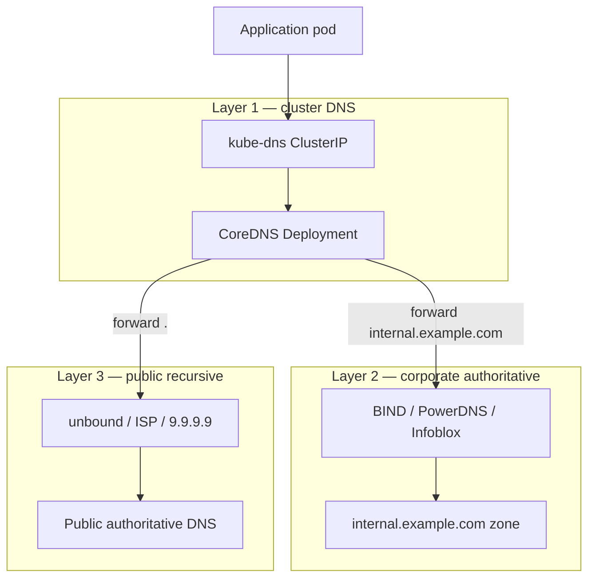
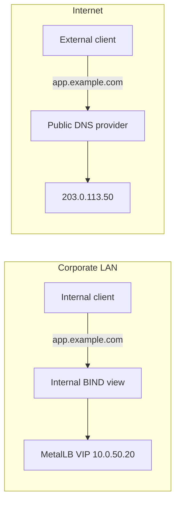

> **Complexity**: `[MEDIUM]` | Time: 75–90 minutes
>
> **Prerequisites**: [Module 3.3: Load Balancing](../module-3.3-load-balancing/), [CKA: DNS](/k8s/cka/part3-services-networking/module-3.3-dns/)

## Learning Outcomes

After completing this module, you will be able to design, configure, implement, evaluate, and operate DNS and TLS infrastructure together for production on-premises Kubernetes clusters:

1. **Design** resilient split-horizon DNS and certificate trust boundaries for on-premises Kubernetes estates that separate cluster, corporate, and public resolution.
2. **Configure** CoreDNS forwarding, corporate authoritative zones with BIND or unbound, and ExternalDNS automation against RFC2136, Infoblox, PowerDNS, or private cloud DNS APIs.
3. **Implement** cert-manager issuers using private ACME from step-ca, HashiCorp Vault PKI, or in-cluster CA hierarchies with trust-manager distribution.
4. **Evaluate** when DNS-01, HTTP-01, SPIRE workload attestation, or manual cfssl and openssl CA workflows fit regulated on-prem constraints and air-gapped networks.
5. **Operate** TLS renewal under cert-manager, OCSP stapling expectations, and expiration alerting so internal services never fail silently on certificate expiry.

## Why This Module Matters

Hypothetical scenario: a platform team finishes a Kubernetes 1.35 kubeadm cluster on bare metal with MetalLB and a working CNI, then declares networking “done.” Within a week, CI pipelines cannot pull from `registry.internal.example.com`, Grafana dashboards show “no data” because Prometheus cannot resolve `metrics.internal.example.com`, and developers paste `curl --insecure` into runbooks because every internal HTTPS endpoint presents an unknown issuer. None of these failures are CNI bugs; they are missing Layer-2 corporate DNS records, missing forward rules in CoreDNS, and missing trust anchors for a private PKI. On public cloud, managed DNS and certificate services hide this work. On-premises, you own recursive resolution, authoritative zones, ACME or internal CA policy, and the operational calendar for rotation.

DNS and TLS are coupled in modern platforms. ExternalDNS creates names that ACME DNS-01 challenges must update. Ingress controllers terminate certificates that cert-manager renews. Service meshes and SPIRE issue identities that still appear as DNS names in observability tools. A single expired intermediate CA or a corporate resolver that returns `NXDOMAIN` for split-horizon names can look like an application outage even when `kubectl get pods` reports every container as Running. Platform engineers who master only CNI and load balancers still get paged for “mysterious” HTTPS failures that are actually trust store or resolver problems. This module teaches the production architecture: three DNS layers, automated record lifecycle, cert-manager as the control plane for X.509, and the operational signals that prevent certificate surprises after TLS 1.3 becomes mandatory in your security baseline.

Regulated estates add constraints: audit trails for every certificate signature, HSM-backed keys, DNS views that segregate manufacturing from corporate IT, and air-gapped enclaves that cannot call public ACME at all. The patterns here map to those constraints without pretending that one certificate issuer fits every namespace. You will see when to centralize with Vault, when to run step-ca beside the cluster, and when a carefully operated in-cluster CA is acceptable for development tiers only.

## Section 1: Three layers of DNS for on-premises Kubernetes

Kubernetes does not replace your corporate DNS; it adds a specialized resolver in front of it. When a pod starts, the kubelet configures `/etc/resolv.conf` with the cluster DNS Service ClusterIP (commonly `10.96.0.10` on kubeadm clusters) and search domains such as `default.svc.cluster.local`, `svc.cluster.local`, and `cluster.local`. The `ndots:5` option means names with fewer than five dots are tried against those search paths first, which explains why short names like `grafana` become `grafana.monitoring.svc.cluster.local` before any external lookup occurs. The authoritative specification for in-cluster names is the Kubernetes DNS-Based Service Discovery document, which defines A/AAAA records for Services, optional pod records, and the `cluster.local` zone layout that CoreDNS implements through its `kubernetes` plugin.


```mermaid
flowchart TD
    subgraph L1["Layer 1 — cluster DNS"]
        CD[CoreDNS Deployment]
        SVC[kube-dns ClusterIP]
    end
    subgraph L2["Layer 2 — corporate authoritative"]
        BIND[BIND / PowerDNS / Infoblox]
        CORP[internal.example.com zone]
    end
    subgraph L3["Layer 3 — public recursive"]
        REC[unbound / ISP / 9.9.9.9]
        PUB[Public authoritative DNS]
    end
    POD[Application pod] --> SVC --> CD
    CD -->|forward internal.example.com| BIND
    BIND --> CORP
    CD -->|forward .| REC
    REC --> PUB
```

Layer 1 answers `*.svc.cluster.local` and reverse zones for pod IPs when enabled. Layer 2 holds the names your employees and legacy VMs already use, such as `vault.internal.example.com` pointing at a MetalLB VIP or hardware load balancer. Layer 3 resolves `github.com` and, when you use public ACME, the names Let’s Encrypt validates. Troubleshooting always moves down the stack: confirm cluster DNS, then corporate authority, then upstream recursion. Skipping a layer produces misleading results, such as `dig @8.8.8.8 internal.example.com` returning `NXDOMAIN` even though internal clients should never ask public resolvers for that zone.

## Section 2: CoreDNS on Kubernetes 1.35

Since Kubernetes 1.13, kubeadm deploys CoreDNS as the cluster DNS application; kube-dns is not supported on modern kubeadm clusters including 1.35. CoreDNS reads a single `Corefile` composed of server blocks, each listing plugins for a zone. Plugin order is determined by the compiled `plugin.cfg` in the binary, not only by the order of lines you write, which matters when combining `forward`, `kubernetes`, `cache`, and `health`. The in-cluster release bundled with Kubernetes 1.35 tracks the CoreDNS project; verify the exact image tag on your nodes with `kubectl -n kube-system get deployment coredns -o jsonpath='{.spec.template.spec.containers[0].image}'` during upgrades.

A production Corefile forwards your corporate suffix to on-prem resolvers and sends everything else to controlled upstreams, never accidentally leaking internal zone names to public DNS:

```yaml
# kube-system ConfigMap coredns — illustrative forward policy
apiVersion: v1
kind: ConfigMap
metadata:
  name: coredns
  namespace: kube-system
data:
  Corefile: |
    .:53 {
        errors
        health {
           lameduck 5s
        }
        ready
        kubernetes cluster.local in-addr.arpa ip6.arpa {
           pods insecure
           fallthrough in-addr.arpa ip6.arpa
           ttl 30
        }
        forward internal.example.com 10.0.10.11 10.0.10.12 {
           max_concurrent 1000
        }
        forward . 10.0.10.11 10.0.10.12
        cache 30
        loop
        reload
        loadbalance
    }
```

The `kubernetes` plugin watches the API and publishes records for Services and Endpoints. Headless Services publish A records per ready endpoint; regular ClusterIP Services publish a single A record for the virtual IP. For observability, enable the `prometheus` plugin in a dedicated server block or port if your security policy allows scraping CoreDNS metrics from your monitoring namespace. When debugging, use `kubectl -n kube-system logs -l k8s-app=kube-dns --tail=50` and increase log verbosity temporarily rather than permanently enabling `log` on high-QPS clusters.

## Section 3: Corporate resolvers — BIND, unbound, and CoreDNS as authority

Many teams run BIND or PowerDNS as authoritative servers for `internal.example.com`, with unbound or BIND in recursive mode at the datacenter edge. unbound excels as a validating recursive resolver on node images or dedicated DNS VMs, while BIND’s zone files remain familiar for manual records and AXFR/IXFR secondaries. You can also run a dedicated CoreDNS deployment outside the cluster with the `file` plugin serving a zone file, which some platform teams prefer over BIND syntax for small fleets. Regardless of daemon, authoritative servers must be redundant across racks, allow TCP and UDP 53 from node subnets and pod CIDRs if pods query corporate DNS directly, and integrate with IPAM so MetalLB pools and static infrastructure addresses receive stable PTR records when reverse zones matter for security tools.

Split-horizon DNS means the same FQDN returns different answers depending on where the query originates. Internal clients resolve `app.example.com` to a private VIP on your LAN, while Internet clients resolve the same name to a public address on your edge firewall or CDN. Without split-horizon, hairpin NAT forces traffic out and back through the perimeter, adds latency, and complicates firewall logging. Kubernetes Ingress hostnames should exist in the internal view at minimum; public views are required only for services that truly face the Internet.


```mermaid
flowchart LR
    subgraph INT["Corporate LAN"]
        IC[Internal client]
        IDNS[Internal BIND view]
        VIP[MetalLB VIP 10.0.50.20]
    end
    subgraph EXT["Internet"]
        EC[External client]
        PDNS[Public DNS provider]
        PUB[203.0.113.50]
    end
    IC -->|app.example.com| IDNS --> VIP
    EC -->|app.example.com| PDNS --> PUB
```

## Section 4: ExternalDNS and private DNS providers

Manual zone edits do not scale when developers create Ingress objects hourly. ExternalDNS watches Services and Ingresses, then creates or updates DNS records through provider plugins. For on-premises, common integrations include RFC2136 dynamic updates against BIND, PowerDNS API, Infoblox WAPI, and webhook providers for proprietary IPAM/DNS appliances. The upstream project documents each provider’s required credentials and record ownership labels; always set `txtOwnerId` or equivalent so two clusters do not fight over the same names. ExternalDNS current release line is v0.21.0; pin manifests to a tagged release rather than floating `latest` images in production.

A minimal RFC2136 deployment needs TSIG keys shared between BIND and ExternalDNS, plus RBAC allowing the controller to read Ingress and Service resources cluster-wide or per namespace depending on your tenancy model. **Do not** put TSIG material in PodSpec `args` or `command`—those values land in etcd and audit logs. Store the key in a Kubernetes Secret and inject it with `env` / `valueFrom.secretKeyRef` (ExternalDNS maps `EXTERNAL_DNS_RFC2136_TSIG_SECRET` to `--rfc2136-tsig-secret`).

When using `--policy=sync`, you must also pass `--rfc2136-tsig-axfr` so ExternalDNS can zone-transfer (AXFR) the zone and detect records to delete; without AXFR, sync silently behaves like upsert-only and stale A/AAAA names persist after Ingress removal. On BIND, grant the TSIG identity `allow-transfer` (and an `axfr-source` ACL if you use views) so AXFR from the cluster egress IPs succeeds.

```yaml
apiVersion: v1
kind: Secret
metadata:
  name: external-dns-rfc2136-tsig
  namespace: external-dns
type: Opaque
stringData:
  rfc2136-tsig-secret: "<provision from Vault or sealed-secrets; never commit real material>"
---
apiVersion: apps/v1
kind: Deployment
metadata:
  name: external-dns
  namespace: external-dns
spec:
  selector:
    matchLabels:
      app: external-dns
  template:
    metadata:
      labels:
        app: external-dns
    spec:
      serviceAccountName: external-dns
      containers:
        - name: external-dns
          image: registry.k8s.io/external-dns/external-dns:v0.21.0
          env:
            - name: EXTERNAL_DNS_RFC2136_TSIG_SECRET
              valueFrom:
                secretKeyRef:
                  name: external-dns-rfc2136-tsig
                  key: rfc2136-tsig-secret
          args:
            - --source=ingress
            - --source=service
            - --provider=rfc2136
            - --rfc2136-host=10.0.10.11
            - --rfc2136-zone=internal.example.com
            - --rfc2136-tsig-secret-alg=hmac-sha256
            - --rfc2136-tsig-keyname=externaldns-key
            - --rfc2136-tsig-axfr
            - --txt-owner-id=k8s-prod-west
            - --policy=sync
```

Route53-compatible appliances and private cloud DNS APIs follow the same pattern: grant least-privilege credentials, restrict zones with domain filters, and test deletions in a lab because `policy=sync` removes records ExternalDNS no longer sees in the cluster API. Pair ExternalDNS with GitOps review of Ingress hostnames so typos do not publish `*.internal.example.com` records to the wrong zone.

## Section 5: cert-manager as the certificate control plane

cert-manager extends Kubernetes with CRDs for `Certificate`, `CertificateRequest`, `Issuer`, and `ClusterIssuer` at `cert-manager.io/v1`, plus ACME `Order` and `Challenge` objects at `acme.cert-manager.io/v1`. A `Certificate` declares desired DNS SANs, key algorithm, and issuer reference; the controller writes a `kubernetes.io/tls` Secret with `tls.crt` and `tls.key`. Install from the official release manifest for v1.20.2:

```bash
kubectl apply -f https://github.com/cert-manager/cert-manager/releases/download/v1.20.2/cert-manager.yaml
kubectl wait --for=condition=Available deployment/cert-manager -n cert-manager --timeout=180s
kubectl wait --for=condition=Available deployment/cert-manager-webhook -n cert-manager --timeout=180s
```

`ClusterIssuer` is cluster-scoped; `Issuer` is namespace-scoped. Use `ClusterIssuer` for shared platforms and `Issuer` when tenants bring their own ACME account or Vault role. Ingress controllers, gateways, and application pods reference the Secret name; cert-manager handles renewal based on `renewBefore`. Webhook certificates for the cert-manager deployment itself should be managed during install or via the same operator to avoid bootstrap chicken-and-egg problems on fresh clusters.

## Section 6: ACME on-premises — public, private, and DNS-01

The ACME protocol (RFC 8555) automates domain validation before a CA signs a certificate. HTTP-01 requires Let’s Encrypt to reach `http://yourname/.well-known/acme-challenge/...` on port 80 from the public Internet, which is awkward behind corporate firewalls unless you expose a dedicated ingress class. DNS-01 requires creating a `_acme-challenge` TXT record; it is the standard choice for wildcards such as `*.apps.internal.example.com` because HTTP-01 cannot validate wildcard names. cert-manager creates temporary solver resources and, with provider configuration, updates your DNS API or RFC2136 zone automatically.

Let’s Encrypt validates only names it can reach publicly. Internal-only zones like `cluster.local` or private RFC1918-only names without public DNS delegation cannot use production Let’s Encrypt unless you publish delegations and meet challenge requirements. For air-gapped or strictly internal networks, run a private ACME server with step-ca (Smallstep certificates v0.30.2) or use Vault PKI and cert-manager’s Vault issuer without ACME at all. step-ca speaks ACME on your LAN; operators distribute the root fingerprint to nodes and trust-manager bundles so pods inherit trust without `curl -k`.

## Section 7: Private CA options — step-ca, Vault, cfssl, openssl

**step-ca** provides a modern ACME and SCEP endpoint with short-lived certificate policies, useful when you want public-ACME ergonomics without public-ACME trust. Bootstrap a CA, configure ACME provisioners, then point cert-manager’s ACME issuer at `https://step-ca.internal.example.com/acme/acme/directory` with your internal CA trust chain in `spec.acme.caBundle` (PEM) and solver configuration for DNS-01 on your internal zone. `spec.acme.privateKeySecretRef` names the Secret that stores the ACME *account* private key—a different purpose than trusting a private ACME server.

**HashiCorp Vault PKI** keeps signing keys off etcd. Enable the PKI secrets engine, generate root and intermediate CAs, define a role with `allowed_domains` and `max_ttl`, then configure Kubernetes auth so cert-manager’s service account can call `pki_int/sign/<role>`. Vault audit devices record every signature, which compliance teams expect, and CRL/OCSP endpoints can be published on corporate HTTP servers for clients that validate revocation.

**cfssl** and **openssl** remain valid for bootstrapping root material, offline ceremonies, or break-glass CAs when Kubernetes is unavailable. Use them to generate the initial root, then import certificates into Kubernetes Secrets for cert-manager `ca` issuers. Avoid long-lived self-signed leaf certificates per application; centralize issuance so SAN lists and key sizes stay consistent.

```yaml
apiVersion: cert-manager.io/v1
kind: ClusterIssuer
metadata:
  name: internal-ca-issuer
spec:
  ca:
    secretName: internal-ca-secret
---
apiVersion: cert-manager.io/v1
kind: Certificate
metadata:
  name: registry-tls
  namespace: registry
spec:
  secretName: registry-tls
  duration: 2160h
  renewBefore: 360h
  dnsNames:
    - registry.internal.example.com
  issuerRef:
    name: internal-ca-issuer
    kind: ClusterIssuer
```

Distribute trust with **trust-manager** (cert-manager subproject): `Bundle` resources project CA certificates into namespaces so Java, Go, and Python runtimes pick up corporate roots without custom init containers on every Deployment.

## Section 8: Workload identity — SPIFFE, SPIRE, and cert-manager

Service-to-service TLS inside the mesh often needs identities bound to workloads, not just DNS names on Ingress. **SPIFFE** defines a standard identity format; **SPIRE** is the reference implementation that attests nodes and pods, then issues SVIDs. Integration with cert-manager typically uses the SPIFFE CSI driver to mount certificates into pods, rather than a native `spec.spire` issuer on `ClusterIssuer`. DNS names still appear in certificates for human debugging, but attestation policies decide which pod receives which SPIFFE ID.

cert-manager **Workload Identity** (where enabled in your distribution) and CSI-based integrations can map Kubernetes service accounts to signed certificates for mTLS backends. Choose SPIRE when you need strong attestation across clusters; choose cert-manager DNS certificates when clients already trust your corporate CA and identities are hostname-driven. Mixed environments are common: Ingress terminates public-facing DNS certificates while east-west traffic uses SPIRE-issued SVIDs inside the CNI.

## Section 9: DNSSEC, DNS-over-HTTPS, and DNS-over-TLS

Corporate recursive resolvers increasingly support DNSSEC validation to detect tampering on upstream paths. Signing your internal authoritative zones is optional and operationally heavy: key ceremonies, ZSK/KSK rollovers, and NSEC/NSEC3 choices affect troubleshooting. Many on-prem Kubernetes teams validate DNSSEC on upstream forwarders but do not sign private zones until compliance mandates it. If you enable DNSSEC signing on `internal.example.com`, coordinate TTL and serial increments with ExternalDNS because dynamic updates must maintain signatures.

DNS-over-HTTPS (DoH) and DNS-over-TLS (DoT) encrypt queries between clients and resolvers. Node-level systemd-resolved or corporate agents may force DoT to `10.0.10.11`, while clusters still use plain DNS to the CoreDNS ClusterIP inside the pod network namespace. Document the trust boundary: pod → CoreDNS is usually plaintext on the overlay, CoreDNS → corporate resolver may be DoT, corporate → Internet may be DoH to a provider. Firewall policies must allow the correct transport; blocking UDP 53 from nodes to corporate DNS breaks CoreDNS forwarding even when DoH works from laptops.

## Section 10: Operating TLS — rotation, stapling, and alerting

TLS 1.3 removes obsolete cipher suites but does not remove expiry. cert-manager renews when `Certificate` status shows time remaining below `renewBefore`; monitor `certmanager_certificate_expiration_timestamp_seconds` and set Prometheus alerts at 30, 14, and 7 days before notAfter. Separate alerts for `Ready=False` on Certificate resources catch stuck ACME orders earlier than expiry metrics.

**OCSP stapling** lets servers attach revocation status during the handshake, reducing client latency and privacy leaks to OCSP responders. Ingress controllers such as NGINX support stapling when the issued certificate chain includes OCSP URLs and the controller can reach the responder; private CAs must publish OCSP or CRL endpoints on reachable corporate HTTP servers if you require revocation checks. Many internal meshes skip stapling but still maintain CRL distribution for compliance audits.

kubeadm clusters ship with a 10-year Kubernetes cluster CA by default; plan rotation before year ten using documented `kubeadm certs renew` flows and component restarts. etcd peer and server certificates, API server serving certs, and webhook certificates each have distinct lifecycles—track them in the same calendar as application certificates. Never scale a Deployment to zero replicas to simulate maintenance; use `kubectl cordon`, `kubectl drain`, and `kubectl uncordon` on nodes when evicting workloads for certificate or DNS maintenance windows.

## Section 11: Systematic troubleshooting playbook

When a pod cannot resolve an internal name, run checks in order without skipping layers. First, `kubectl run -n default dns-test --rm -it --restart=Never --image=busybox:1.36 --command -- nslookup kubernetes.default` confirms cluster DNS. Second, query corporate DNS directly with `kubectl run -n default dns-ext --rm -it --restart=Never --image=nicolaka/netshoot --command -- dig @10.0.10.11 grafana.internal.example.com +short`. Third, inspect CoreDNS ConfigMap forwards and logs for `NXDOMAIN` or `REFUSED`. For TLS failures, `kubectl describe certificate` and `kubectl describe challenge` in the application namespace reveal ACME state; compare `kubectl get secret -o yaml` notAfter dates with ingress hostnames.

NetworkPolicies blocking UDP/TCP 53 from `kube-system` to corporate DNS remain a frequent root cause after security lockdowns. Another pattern is ExternalDNS publishing public view records while internal clients still use split-horizon views without those names. Fix the provider view or add domain filters so each cluster updates the correct zone instance.

## Section 12: Authoritative zone design with BIND and dynamic updates

A minimal internal zone file for BIND 9 documents the records platform teams expect before ExternalDNS automates them. SOA serial discipline matters: automation must increment serials correctly or secondaries serve stale answers during incidents.

```text
; db.internal.example.com — illustrative static baseline
$ORIGIN internal.example.com.
$TTL 300
@   IN SOA ns1.internal.example.com. hostmaster.example.com. (
        2026052401 ; serial (YYYYMMDDnn)
        3600       ; refresh
        900        ; retry
        604800     ; expire
        300 )      ; minimum
    IN NS  ns1.internal.example.com.
    IN NS  ns2.internal.example.com.
ns1 IN A   10.0.10.11
ns2 IN A   10.0.10.12
api IN A   10.0.20.100
registry IN A 10.0.50.12
```

Grant ExternalDNS permission to submit RFC2136 updates only inside `apps.internal.example.com` if you want human-owned records separated from machine-owned names. TSIG keys should rotate on the same calendar as Kubernetes service account tokens, with overlap periods where both old and new keys work. For reverse DNS, create `in-addr.arpa` delegations for pod CIDRs only when security scanners require PTR validation; many clusters skip reverse records for pods entirely and rely on forward names in logs.

## Section 13: unbound as recursive forwarder for nodes and CoreDNS

unbound on dedicated VMs or on each node (via systemd-resolved forwarding) provides DNSSEC validation and aggressive caching before queries hit the Internet. A simple unbound stanza forwards internal zones to BIND and everything else to provider resolvers while validating DNSSEC where possible:

```text
server:
  verbosity: 1
  interface: 0.0.0.0
  access-control: 10.0.0.0/8 allow
  do-ip6: no
forward-zone:
  name: "internal.example.com"
  forward-addr: 10.0.10.11@53
  forward-addr: 10.0.10.12@53
forward-zone:
  name: "."
  forward-addr: 9.9.9.9@53
  forward-addr: 1.1.1.1@53
```

Point CoreDNS `forward .` at unbound rather than directly at public DNS when you want one place to enforce filtering and logging. Document maximum concurrent upstream queries; CoreDNS `forward` plugin supports `max_concurrent` to avoid thundering herds when thousands of pods cold-start simultaneously after a node drain completes.

## Section 14: PowerDNS, Infoblox, and webhook providers

PowerDNS Authoritative with the REST API suits teams that already operate PowerDNS for multi-tenant DNSaaS inside the datacenter. ExternalDNS webhook providers can call PowerDNS or proprietary appliances when an in-tree provider was removed upstream—pin container images to v0.21.0 and read the provider README for required environment variables. Infoblox WAPI integrations require service accounts with limited permissions: record CRUD on specific zones, not grid-wide changes. Test record deletion in a sandbox grid because sync policies remove names quickly when Ingresses disappear during namespace teardown.

Label selectors on ExternalDNS restrict which Services and Ingresses it observes, which is essential when multiple clusters share one grid but own different DNS views. Combine `label-filter` with namespace selectors in Helm values so development clusters cannot publish into production zones. Audit TXT records ExternalDNS creates for ownership; they help operators see which cluster last modified a name when troubleshooting stale pointers after cluster migration.

## Section 15: cert-manager ACME with DNS-01 against private zones

For clusters with outbound Internet but private authoritative DNS, configure a `ClusterIssuer` with ACME DNS-01 solvers matching your provider. The solver creates TXT records at `_acme-challenge.<hostname>`; timing must respect provider propagation delays configured in `spec.acme.solvers[].dns01` provider blocks.

```yaml
apiVersion: cert-manager.io/v1
kind: ClusterIssuer
metadata:
  name: letsencrypt-dns01
spec:
  acme:
    email: platform-team@example.com
    server: https://acme-v02.api.letsencrypt.org/directory
    privateKeySecretRef:
      name: letsencrypt-account-key
    solvers:
      - dns01:
          rfc2136:
            nameserver: 10.0.10.11:53
            tsigKeyName: certmanager-key
            tsigAlgorithm: HMACSHA256
            tsigSecretSecretRef:
              name: rfc2136-tsig
              key: secret
        selector:
          dnsZones:
            - internal.example.com
```

Staged clusters should use the Let’s Encrypt staging directory URL until rate limits and solver configuration are proven. Production cutover requires validating that internal views, not public views, receive TXT records when split-horizon serves both; some teams delegate `_acme-challenge` subzones to a single view to avoid ambiguity.

## Section 16: step-ca private ACME bootstrap sketch

Install step-ca on hardened VMs or as a Kubernetes Deployment with persistent volumes for the CA database. Initialize with `step ca init`, enable the ACME provisioner, and distribute the root fingerprint to nodes via configuration management. cert-manager then uses the ACME issuer pointed at your internal directory URL.

```bash
step ca init --deployment-type=standalone --name "Example Internal CA" \
  --dns step-ca.internal.example.com --address :443 \
  --provisioner acme --acme
step ca certificate platform.step-ca.internal.example.com server.crt server.key \
  --san step-ca.internal.example.com
```

Map the ACME directory URL into a `ClusterIssuer` and mount the root certificate into trust-manager `Bundle` objects so namespaces used by CI runners trust workloads signed by the same CA. Rotate intermediates annually even when roots last longer; short-lived intermediates limit exposure when a signing key leaks.

## Section 17: Vault PKI integration checklist

Before enabling the Vault issuer, complete these steps in order: enable PKI engines, generate root offline if policy requires, sign intermediate online, configure URLs for issuing certificates and CRL distribution points, enable Kubernetes auth, create a policy allowing only `sign/<role>`, bind cert-manager’s service account to that role, and test with a manually invoked `vault write` from a jump host. cert-manager’s Vault issuer references `path: pki_int/sign/kubernetes` and authentication via the pod service account.

Monitor Vault seal status and storage backend latency; unsealed Vault is a hard dependency for issuance. When Vault is unavailable, existing certificates continue working until expiry, which is why `renewBefore` windows must be longer than expected Vault maintenance duration. Export metrics from Vault audit logs into your SIEM so security teams correlate Kubernetes Certificate events with Vault request IDs during investigations.

## Section 18: cfssl and openssl for break-glass ceremonies

cfssl shines when platform engineers need JSON profiles for intermediate CAs with explicit key usages and name constraints. openssl remains the lowest-common-denominator tool on air-gapped jump hosts without container registries. Use openssl to generate a root, create a CSR for an intermediate, sign offline, then load PEM bundles into Kubernetes Secrets for cert-manager `ca` issuers. Document every manual step in runbooks because break-glass actions bypass GitOps audit trails unless you commit generated CSRs and certificates to a secure repository.

Never distribute private keys through chat or ticket systems; use HSM ceremonies or Vault transit engines. After break-glass issuance, migrate workloads back to automated cert-manager Certificates so manual artifacts do not become permanent.

## Section 19: Observability for DNS and certificate health

Export CoreDNS metrics from the `prometheus` plugin and chart request rates, RCODES, and upstream health. Alert on sustained `SERVFAIL` or `REFUSED` spikes correlated with pod restart storms. For cert-manager, scrape the controller metrics Service and alert on `certmanager_certificate_ready_status` not equal to one, on renewal failures, and on ACME rate limit errors parsed from logs.

Build Grafana rows that join DNS failure rates with TLS handshake error rates from ingress controllers; combined spikes often indicate a single root cause such as corporate DNS outage during ACME renewal. Include blackbox probes that resolve and HTTPS-check critical internal names from outside the cluster network path to catch split-horizon drift.

## Section 20: Change management and safe node maintenance

DNS and certificate maintenance intersects node drains. Before upgrading corporate DNS VMs, lower TTLs on records you will change, wait one TTL window, apply changes, then restore normal TTL values. Before rotating the Kubernetes cluster CA, schedule maintenance windows with stakeholders and verify backup etcd snapshots.

When draining nodes for OS patches, use `kubectl cordon NODE`, `kubectl drain NODE --ignore-daemonsets --delete-emptydir-data`, perform work, then `kubectl uncordon NODE`. Do not patch Deployments to `replicas: 0` to evict workloads; that bypasses PodDisruptionBudget semantics and confuses on-call engineers reading Deployment status during incidents. For certificate rotation on Ingress controllers, roll pods sequentially and watch upstream health checks confirm stapled OCSP responses where enabled.

## Section 21: Ingress, Gateway API, and TLS secret wiring

Whether you use the stable Ingress resource or Gateway API HTTPRoute objects, the data plane still references a Kubernetes Secret containing `tls.crt` and `tls.key`. cert-manager populates that Secret when the `Certificate` resource becomes Ready; controllers do not fetch certificates themselves. Annotations such as `cert-manager.io/cluster-issuer` on Ingress are convenient but explicit `Certificate` objects are clearer in GitOps repositories because they show SAN lists, renew windows, and issuer names in one manifest.

Gateway API cross-namespace certificate references require trust boundaries documented in your platform standards: who may request `*.prod.internal.example.com` SANs, and which teams may attach Secrets to Gateways in shared ingress namespaces. Misconfigured references cause routes to serve default fake certificates while `Certificate` status still looks healthy in another namespace. Platform reviews should treat DNS hostnames on Gateways with the same rigor as firewall rules because both steer production traffic.

## Section 22: Multi-cluster DNS ownership and disaster recovery

Organizations running multiple on-prem clusters—factory edge, core datacenter, disaster recovery site—need deterministic DNS ownership per cluster. Duplicate ExternalDNS deployments without `txt-owner-id` separation have deleted each other’s records during failover tests. Document primary and secondary clusters for each zone suffix, and use low TTL only during migration windows. When failing over applications, pre-create critical DNS records in the secondary site’s view before shifting traffic; waiting until pods are healthy leaves a gap where clients cache negative answers.

Backup corporate zone files and Vault PKI mount metadata, not only etcd. Restoring Kubernetes without restoring DNS leaves certificates valid but unreachable. Restoring DNS without Vault policies leaves names pointing at clusters that cannot reissue certs. Tabletop exercises should include losing an entire DNS rack and an entire Vault seal quorum separately.

## Section 23: HTTP-01 when you truly have public ingress

Some on-prem platforms expose a small DMZ cluster with public port 80 for ACME while application clusters stay private. HTTP-01 solvers create temporary Ingress rules or modify existing ones to answer challenge paths. Ensure no WAF blocks `/.well-known/acme-challenge/` and that CDN caches bypass those paths. HTTP-01 is inappropriate for wildcard certificates and for services without public names, which is why most hybrid enterprises standardize on DNS-01 even when HTTP-01 could work for a subset of hosts.

If you operate both patterns, segregate `ClusterIssuer` objects with clear names (`letsencrypt-dns01-internal` versus `letsencrypt-http01-dmz`) so application teams do not attach the wrong issuer to Ingresses in private namespaces. Document rate limits from Let’s Encrypt; staging issuers exist precisely to test automation without consuming production quotas during CI loops.

## Section 24: Workload and node trust stores beyond Linux

Windows nodes and .NET workloads maintain separate root stores; mounting a ConfigMap with `ca.crt` is insufficient if the process uses the Windows certificate store. Java applications need `cacerts` imports or JVM flags pointing at trust bundles. trust-manager targets these cases by syncing bundles to ConfigMaps or Secrets referenced by DaemonSets that update host stores on a schedule. macOS developer laptops accessing internal services need the same root distributed via MDM, not emailed PEM files.

Containers that pin certificates in application code bypass platform rotation entirely. Platform teams should publish standards: applications must trust the corporate bundle path injected by the platform, not embed ten-year-old roots in container images built once. When intermediates rotate, rebuilt images without updated anchors cause outages that cert-manager metrics will not detect because Kubernetes Secrets already renewed successfully.

## Section 25: Capacity planning for DNS QPS and certificate churn

CoreDNS scales horizontally; increase replicas before raising CPU limits on a single pod during large scale-out events. Anti-affinity rules spread DNS pods across failure domains because losing all CoreDNS replicas simultaneously blocks new pod scheduling and health checks. Size corporate DNS for peak QPS from all clusters forwarding to it, not average daily traffic. A single misconfigured logging plugin on BIND can melt CPU under TXT record churn from ACME renewals happening concurrently across dozens of clusters.

Certificate renewal storms hit Vault and step-ca too. Stagger `renewBefore` offsets per namespace or use jitter in automation so ten thousand Certificates do not renew in the same minute. Vault rate limits and storage write throughput become bottlenecks before Kubernetes API limits do. Monitor signing latency percentiles, not only success counts, to catch degradation before orders fail.

## Section 26: Security review checklist for platform sign-off

Before production cutover, confirm: corporate DNS is redundant; CoreDNS forwards only to approved resolvers; ExternalDNS credentials are scoped to dedicated zones; TSIG keys rotate; cert-manager webhook is HA; private keys for cluster issuers live in Vault or HSM where policy requires; trust-manager bundles reach every tenant namespace that calls internal HTTPS; Prometheus alerts fire on Certificate readiness and expiry; runbooks document cordon/drain/uncordon for node maintenance; and break-glass openssl procedures are tested annually.

Penetration testers will attempt zone transfer misconfigurations and weak TSIG secrets. Disable unauthenticated AXFR from the Internet and restrict dynamic updates to cluster egress IPs. Publish DNS change tickets alongside certificate issuance logs so incident responders can correlate new Ingress hostnames with new records within minutes instead of hours.

## Section 27: Integrating IPAM with DNS and MetalLB

MetalLB advertises VIPs on the LAN, but clients still need A records. Some teams extend IPAM systems to push DNS automatically when pools allocate addresses; others rely on ExternalDNS reading Service `status.loadBalancer.ingress` fields after MetalLB publishes them. The anti-pattern is spreadsheet-driven DNS updated weekly while Kubernetes recreates Services daily. Automate or accept drift; halfway manual processes fail during rolling upgrades when VIPs move between pools.

Document which system owns apex domains versus delegated subzones. Kubernetes clusters often receive delegation for `apps.internal.example.com` while network architects retain `internal.example.com` apex records. Confusion at delegation boundaries produces `NXDOMAIN` for valid Ingress hosts because ExternalDNS updated a child zone parents do not serve. Verify parent NS records and glue before granting cluster operators TSIG keys.

## Section 28: Certificate transparency, naming standards, and developer experience

Even private CAs benefit from naming standards: `<service>.<env>.<region>.internal.example.com` beats ad hoc hostnames that collide across teams. Publish a short RFC for developers covering maximum SAN counts, wildcard approval, and how long DNS-01 challenges take during CI. Developer self-service through GitOps pull requests beats ticket queues, but reviews must include security for wildcard requests.

Internal certificate transparency logs are optional but valuable for compliance teams auditing historical issuance. Vault audit devices and cert-manager CertificateRequest objects provide much of the same evidence if retained long enough. Ensure log retention exceeds your slowest audit cycle; losing issuance history makes compromise investigations impossible.

## Section 29: Upgrading CoreDNS and cert-manager safely

Treat DNS and cert-manager upgrades as linked platform changes. Read release notes for CoreDNS plugin behavior changes and Kubernetes version skew tables for cert-manager before bumping images. Roll CoreDNS as a Deployment with surge so at least one replica serves queries during image updates. Roll cert-manager webhook and controller together to avoid version skew that rejects CRD shapes.

After upgrade, run synthetic checks: resolve in-cluster names, resolve corporate names, issue a test Certificate in a sandbox namespace, and revoke or delete test secrets. Keep previous manifests in Git tags so rollback is `kubectl apply` of the prior release file, not improvisation. Kubernetes 1.35 compatibility for cert-manager v1.20.2 is supported on the project release matrix; still verify webhook connectivity on your CNI and network policies.

## Section 30: Putting the stack together for a greenfield site

A sensible greenfield sequence starts with redundant BIND or PowerDNS authoritative servers and unbound forwarders, then kubeadm 1.35 clusters with CoreDNS forwarding to those resolvers, then MetalLB pools registered in IPAM, then ExternalDNS with TSIG into the delegated zone, then cert-manager with step-ca or Vault, then trust-manager bundles, then Ingress or Gateway with explicit Certificate objects, and finally observability alerts on DNS RCODES and certificate expiry. Skipping steps is how teams debug TLS in week three when week one should have established names and trust.

Each layer has distinct owners in mature IT: network architects for zones, platform engineers for cluster add-ons, security for CA policy, application teams for Ingress hostnames. The architecture only works when handoffs are documented. This module equips you to lead those conversations with accurate vocabulary about forwards, issuers, challenges, and trust bundles instead of treating DNS and certificates as afterthoughts bolted onto a working CNI.

When you present designs to leadership, tie metrics to business outcomes: fewer certificate-related incidents per quarter, faster developer onboarding because internal DNS and TLS work on day one, and audit findings closed because Vault or step-ca provides issuance evidence. Technical depth matters only if operators can run the stack daily without heroics; redundancy, monitoring, and documented maintenance win approvals more often than exotic cipher suites.

Platform onboarding checklists should include a DNS and TLS column beside CNI and storage: every new cluster documents forward targets, ExternalDNS owner IDs, default issuers, trust bundle namespaces, and on-call runbook links before production traffic lands. Treat missing entries as release blockers equal to absent monitoring, because the next pager will prove the gap within days. Rehearse one simulated ACME failure and one corporate resolver outage during handover week so new operators have seen failures before they lead incidents alone. Capture timelines, escalation paths, and owners in the same runbook repository you use for CNI and DNS upgrades.

## Did You Know?

- CoreDNS is the only DNS application kubeadm supports for new Kubernetes 1.35 clusters; planning kube-dns migration paths is historical, not forward-looking.
- Let's Encrypt offers an optional short-lived profile with approximately six-day certificates, but the default public issuance period remains ninety days unless you opt in explicitly.
- Wildcard ACME certificates require DNS-01 validation; HTTP-01 cannot prove control of `*.apps.internal.example.com`.
- trust-manager can propagate a corporate root CA to every namespace automatically, which removes hundreds of copy-pasted `ca.crt` ConfigMaps from application charts.

## Common Mistakes

| Mistake | Risk | Fix |
|---------|------|-----|
| No forward rule for corporate zones in CoreDNS | Internal names leak to public DNS or return `NXDOMAIN` | Add explicit `forward internal.example.com` to authoritative resolvers |
| Self-signed per-app certificates without shared CA | Widespread `--insecure` flags and MITM blindness | Issue from one CA via cert-manager; distribute trust with trust-manager |
| Let's Encrypt on air-gapped clusters | Orders stuck forever in `pending` | Use step-ca ACME or Vault PKI issuers |
| ExternalDNS `txt-owner-id` collisions | Clusters delete each other's records | Unique owner ID per cluster and zone filter |
| Storing Vault root keys in etcd Secrets | Cluster-admin equals CA compromise | Keep signing in Vault with HSM and short-lived roles |
| Ignoring `renewBefore` alerts | Friday-night TLS outages | Alert on Certificate `Ready=False` and expiry metrics |
| Using HTTP-01 behind closed port 80 | Failed challenges for public names | Switch to DNS-01 or private ACME |
| Skipping split-horizon internal views | Hairpin NAT and broken east-west paths | Publish VIPs in internal authoritative DNS |

## Quiz

### Question 1
A pod logs `lookup registry.internal.example.com: no such host`, but `kubectl get svc -A` shows the Service is healthy. Which DNS layers should you verify, in order?

<details>
<summary>Answer</summary>

Start at Layer 1: confirm the pod reaches CoreDNS and resolves `kubernetes.default.svc.cluster.local`. Then verify CoreDNS has a `forward` stanza for `internal.example.com` pointing at corporate resolvers, not only upstream public DNS. At Layer 2, query authoritative servers directly with `dig @10.0.10.11 registry.internal.example.com` from a debug pod. If corporate DNS is correct but pods still fail, inspect NetworkPolicies and node resolver configuration. Layer 3 public recursion is irrelevant for a private-only name unless you mistakenly depend on it.
</details>

### Question 2
Your team wants `*.apps.internal.example.com` on Ingress with a single certificate. Which ACME challenge type is required, and why?

<details>
<summary>Answer</summary>

DNS-01 is required for wildcard certificates because HTTP-01 validates only a single hostname path and cannot prove control of all names under a wildcard. cert-manager must create `_acme-challenge` TXT records through your DNS provider or RFC2136 integration. Ensure ExternalDNS or your IPAM workflow does not delete challenge records before the CA validates them.
</details>

### Question 3
ExternalDNS runs with `policy=sync` against BIND, but records for deleted Ingresses remain in the zone file. What configuration gaps cause this behavior?

<details>
<summary>Answer</summary>

The most common gap is `policy=sync` without `--rfc2136-tsig-axfr`: ExternalDNS cannot AXFR the zone, so it never lists existing records and deletion silently does not happen (upstream documents this as upsert-only behavior with no warning). Also check TSIG key mismatch on dynamic updates, wrong zone in `--rfc2136-zone`, BIND `allow-transfer` / `axfr-source` denying AXFR from cluster egress, or `txtOwnerId` changes that make ExternalDNS treat records as owned by another cluster. Review controller logs for `RFC2136` and AXFR errors; confirm the BIND view allows DELETE for the TSIG identity. Domain filters excluding the hostname also leave stale records while Kubernetes events look healthy.
</details>

### Question 4
Compare storing a private CA root in a Kubernetes Secret versus HashiCorp Vault PKI for a regulated environment.

<details>
<summary>Answer</summary>

A root key in etcd-backed Secrets is readable to anyone with cluster-admin or etcd access, lacks granular audit per signature, and couples CA compromise to cluster compromise. Vault PKI keeps keys in Vault with optional HSM wrapping, emits audit logs per `sign` call, supports CRL/OCSP publication, and enforces role-based TTL and domain allow lists. Self-signed bootstrap issuers are acceptable for labs; production regulated workloads should evaluate Vault or offline root with intermediate online signers.
</details>

### Question 5
An air-gapped factory cluster on an isolated VLAN needs automated TLS for `line1.factory.internal` with no default route to the Internet. The platform lead proposes reusing the corporate Let's Encrypt `ClusterIssuer` because it works in the datacenter. Can you use that issuer unchanged, and what architecture should you propose instead?

<details>
<summary>Answer</summary>

No. Let's Encrypt validators must reach your domain over the public Internet for HTTP-01 or DNS-01 against public DNS. Air-gapped networks should run step-ca as a private ACME server on the factory LAN or use cert-manager with a `ca` issuer backed by an offline root. Distribute the factory root CA through trust-manager and node trust stores so workloads verify peers without insecure skips.
</details>

### Question 6
Prometheus fires `CertificateExpiresIn7Days` for `monitoring/grafana-tls`, but browsers and curl still complete TLS handshakes against the Grafana Ingress without errors. What cert-manager API objects and Secret fields should you inspect first to determine whether renewal succeeded or the data plane is serving stale material?

<details>
<summary>Answer</summary>

Inspect the `Certificate` resource for `status.conditions` type `Ready`, then the associated `Order` and `Challenge` objects if using ACME. A Secret may still contain the previous cert while renewal failed. Check cert-manager controller logs for rate limits, DNS solver failures, or Vault auth errors. Fix the issuer before expiry; do not rely on stale Secrets past notAfter.
</details>

### Question 7
Your security architect asks whether SPIRE should replace hostname certificates from cert-manager for all east-west traffic between microservices in three on-prem clusters. What criteria help you decide when SPIRE attestation adds value versus when a corporate CA issued by cert-manager is sufficient?

<details>
<summary>Answer</summary>

SPIRE fits when identities must be attested to specific pods via SPIFFE IDs and policies, especially across clusters or when DNS names are unstable. cert-manager hostname certificates fit when clients already trust a corporate CA and services are reached by stable DNS names on Ingress or ClusterIP. Many platforms use both: cert-manager for north-south Ingress DNS names, SPIRE SVIDs for mesh mTLS inside the cluster.
</details>

## Hands-On Exercise: DNS resolution and cert-manager on kind

These labs use Kubernetes 1.35 on kind, cert-manager v1.20.2, and images compatible with local debugging. Complete all tasks on a workstation with Docker, kind, kubectl, and openssl installed.

### Task 1: Cluster DNS baseline

```bash
kind create cluster --name dns-certs-lab --image kindest/node:v1.35.0
kubectl cluster-info
kubectl -n kube-system get deployment coredns -o wide
kubectl run dns-test --rm -it --restart=Never --image=busybox:1.36 \
  --command -- nslookup kubernetes.default.svc.cluster.local
```

- [ ] kind cluster `dns-certs-lab` reports Ready nodes
- [ ] CoreDNS pods are Running in `kube-system`
- [ ] `nslookup kubernetes.default` succeeds from an ephemeral pod

### Task 2: Install cert-manager and bootstrap a private CA

```bash
kubectl apply -f https://github.com/cert-manager/cert-manager/releases/download/v1.20.2/cert-manager.yaml
kubectl wait --for=condition=Available deployment/cert-manager -n cert-manager --timeout=180s
kubectl apply -f - <<'EOF'
apiVersion: cert-manager.io/v1
kind: ClusterIssuer
metadata:
  name: selfsigned-bootstrap
spec:
  selfSigned: {}
---
apiVersion: cert-manager.io/v1
kind: Certificate
metadata:
  name: lab-root-ca
  namespace: cert-manager
spec:
  isCA: true
  commonName: lab-root-ca
  secretName: lab-root-ca-secret
  duration: 8760h
  issuerRef:
    name: selfsigned-bootstrap
    kind: ClusterIssuer
---
apiVersion: cert-manager.io/v1
kind: ClusterIssuer
metadata:
  name: lab-ca-issuer
spec:
  ca:
    secretName: lab-root-ca-secret
EOF
kubectl wait --for=condition=Ready certificate/lab-root-ca -n cert-manager --timeout=120s
```

- [ ] cert-manager controllers and webhook are Available
- [ ] `certificate/lab-root-ca` reports Ready=True
- [ ] `ClusterIssuer/lab-ca-issuer` exists for downstream Certificates

### Task 3: Issue and verify a workload TLS certificate

```bash
kubectl create namespace demo
kubectl apply -f - <<'EOF'
apiVersion: cert-manager.io/v1
kind: Certificate
metadata:
  name: demo-tls
  namespace: demo
spec:
  secretName: demo-tls-secret
  dnsNames:
    - demo.apps.lab.local
  issuerRef:
    name: lab-ca-issuer
    kind: ClusterIssuer
EOF
kubectl wait --for=condition=Ready certificate/demo-tls -n demo --timeout=120s
kubectl get secret demo-tls-secret -n demo -o jsonpath='{.data.tls\.crt}' | base64 -d | openssl x509 -noout -subject -issuer -dates
kind delete cluster --name dns-certs-lab
```

- [ ] `certificate/demo-tls` reaches Ready=True
- [ ] Issued cert subject includes `demo.apps.lab.local`
- [ ] Issuer CN matches your lab root CA, not a public CA

## Next Module

Continue to [Module 4.1: Storage Architecture Decisions](/on-premises/storage/module-4.1-storage-architecture/) to design persistent storage for stateful workloads now that names and certificates resolve reliably inside your estate.

## Learner Check

> **Pause and predict**: CoreDNS resolves `kubernetes.default` but `curl https://payments.internal.example.com` fails with `certificate signed by unknown authority` while the same URL works from your laptop browser. The Ingress TLS Secret exists and `kubectl describe certificate` shows Ready=True. Name the first three places you inspect before blaming the application Deployment—and explain why trusting the corporate CA on nodes alone might not fix pod-to-pod verification inside the cluster.

## Sources

- <https://kubernetes.io/docs/concepts/services-networking/dns-pod-service/>
- <https://github.com/kubernetes/dns/blob/master/docs/specification.md>
- <https://coredns.io/plugins/kubernetes/>
- <https://coredns.io/manual/toc/>
- <https://kubernetes.io/docs/tasks/administer-cluster/kubeadm/kubeadm-certs/>
- <https://cert-manager.io/docs/>
- <https://cert-manager.io/docs/configuration/acme/>
- <https://github.com/cert-manager/cert-manager/releases/download/v1.20.2/cert-manager.yaml>
- <https://kubernetes-sigs.github.io/external-dns/>
- <https://github.com/kubernetes-sigs/external-dns>
- <https://smallstep.com/docs/step-ca/>
- <https://developer.hashicorp.com/vault/docs/secrets/pki>
- <https://letsencrypt.org/docs/challenge-types/>
- <https://datatracker.ietf.org/doc/html/rfc8555>
- <https://trust-manager.io/docs/>
- <https://spiffe.io/docs/latest/spire-about/>
- <https://unbound.docs.nlnetlabs.nl/en/latest/>
