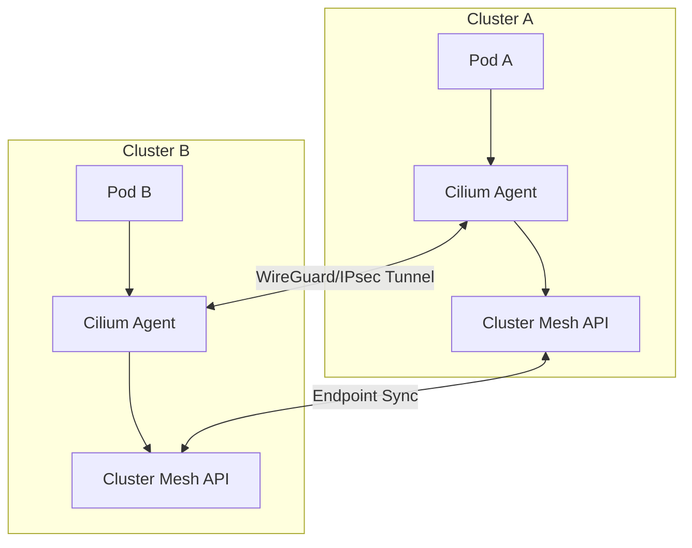

# Cross-Cluster Networking

## Learning Outcomes
- Compare Submariner, Cilium Cluster Mesh, and Liqo for bare-metal cross-cluster connectivity.
- Calculate and configure optimal MTU/MSS settings for encrypted cross-cluster tunnels.
- Implement Cilium Cluster Mesh across isolated bare-metal environments.
- Diagnose cross-cluster service discovery failures using the Multi-Cluster Services (MCS) API.
- Design overlay networks spanning disjoint Layer 2 domains using BGP and WireGuard.

## The Multi-Cluster Services (MCS) API

Before routing traffic, clusters must agree on how to discover services. The Kubernetes Multi-Cluster Services (MCS) API (KEP-1645) defines the standard for this. It introduces two Primary Custom Resource Definitions (CRDs):

1. `ServiceExport`: Created in the exporting cluster to declare a service available globally.
2. `ServiceImport`: Created automatically in importing clusters by the MCS controller to represent the remote service.

When a `ServiceExport` is created, the cross-cluster control plane synchronizes the endpoint slices to all participating clusters. A global DNS record (typically `clusterset.local`) is provisioned.

:::note
MCS does not handle the actual datapath routing. It only handles service discovery and endpoint synchronization. You still need an overlay, routing daemon, or CNI to push packets between the nodes of different clusters.
:::

## Datapath Architectures: Cilium vs Submariner vs Liqo

On bare metal, you lack cloud-provider transit gateways. You must build your own encrypted east-west tunnels between cluster nodes.

### Cilium Cluster Mesh

Cilium Cluster Mesh extends the eBPF datapath across multiple clusters. It is the de facto standard if you are already using Cilium as your CNI.

- **Datapath**: eBPF-based VXLAN, Geneve, or direct routing (BGP).
- **Encryption**: IPsec or WireGuard.
- **Service Discovery**: Implements the MCS API natively.
- **Constraint**: Requires non-overlapping Pod and Service CIDRs across all participating clusters.
- **Control Plane**: Uses an internal etcd cluster (kvstore) to synchronize endpoints, or a dedicated Cluster Mesh API server.



### Submariner

Submariner is a dedicated cross-cluster networking tool designed to work *alongside* your existing CNI (Flannel, Calico, Weave).

- **Datapath**: Deploys a Gateway Engine pod on a designated gateway node in each cluster. All cross-cluster traffic is routed through these gateways.
- **Encryption**: IPsec (via Libreswan) or WireGuard.
- **Service Discovery**: Deploys Lighthouse, its own CoreDNS plugin for cross-cluster resolution.
- **Constraint**: Gateway nodes can become bottlenecks. Active/Passive high availability is standard, meaning failover takes time.
- **Advantage**: Supports Globalnet, which dynamically translates overlapping Pod/Service CIDRs using SNAT/DNAT, allowing connection of clusters with identical IP spaces.

### Liqo

Liqo takes a peer-to-peer approach using the "Virtual Node" abstraction.

- **Datapath**: Uses a dynamically established VPN tunnel (WireGuard).
- **Architecture**: Cluster A registers Cluster B as a `VirtualNode`. Pods scheduled to this `VirtualNode` are actually executed on Cluster B, but appear to be running locally in Cluster A.
- **Use Case**: Best for multi-cluster compute offloading (bursting) rather than pure service-to-service communication.

### Comparison Matrix

| Feature | Cilium Cluster Mesh | Submariner | Liqo |
| :--- | :--- | :--- | :--- |
| **Primary Use Case** | Native eBPF multi-cluster routing | CNI-agnostic cross-cluster overlay | Compute bursting / offloading |
| **Datapath bottleneck** | None (Node-to-Node) | Gateway Node | Gateway Node |
| **Handles Overlapping CIDRs?** | No | Yes (via Globalnet) | Yes (via NAT) |
| **Encryption** | WireGuard, IPsec | WireGuard, IPsec | WireGuard |
| **Service Discovery** | Native MCS API | Lighthouse (Custom DNS) | Native Kubernetes Services |

:::caution
For bare-metal production environments operating at high throughput, **Cilium Cluster Mesh** is the recommended architecture. Gateway-based approaches (Submariner, Liqo) introduce a single point of failure and a throughput choke point at the gateway node.
:::

## MTU and MSS Considerations

Maximum Transmission Unit (MTU) misconfiguration is the leading cause of cross-cluster networking failures. When packets are routed between clusters, they are encapsulated in tunnels. This encapsulation adds overhead. If the resulting packet exceeds the physical network's MTU, it is fragmented or dropped.

When standard physical networks use an MTU of 1500 bytes, you must subtract the overhead of your encapsulation and encryption protocols.

- **VXLAN overhead**: 50 bytes
- **WireGuard overhead**: 60 bytes (IPv4) / 80 bytes (IPv6)
- **IPsec overhead**: ~50-73 bytes (depending on crypto suite)

### The Blackhole Effect
If Cluster A sends a 1500-byte packet to Cluster B over a WireGuard tunnel, the tunnel interface must add 60 bytes. The new 1560-byte packet hits the physical NIC (MTU 1500). If the "Don't Fragment" (DF) bit is set (common in modern TCP stacks), the NIC drops the packet and sends an ICMP "Fragmentation Needed" message back. If firewalls drop this ICMP message (Path MTU Discovery failure), the connection hangs indefinitely. This is the MTU Blackhole.

### Calculating the Safe MTU

To prevent MTU blackholes, configure the CNI MTU explicitly:

```yaml
# Example: Physical MTU 1500, using Cilium with VXLAN and WireGuard
# 1500 - 50 (VXLAN) - 60 (WireGuard) = 1390
cni:
  mtu: 1390
```

:::tip
Always configure TCP Maximum Segment Size (MSS) clamping on your ingress controllers or CNI if you suspect Path MTU Discovery (PMTUD) issues on intermediate bare-metal routers. MSS clamping forces TCP handshakes to negotiate a smaller segment size, bypassing ICMP blackholes entirely.
:::

## Dual-Stack Cross-Cluster Routing

Bare metal environments frequently leverage IPv6 for node addressing to avoid RFC1918 IPv4 exhaustion. When implementing cross-cluster networking in a dual-stack environment:

1. **Tunnel Endpoints**: The underlay tunnels (WireGuard/IPsec) should ideally be established over IPv6 to avoid NAT traversal complexities between data centers.
2. **Overlay Addressing**: Ensure Pod and Service CIDRs for both IPv4 and IPv6 do not overlap across clusters.
3. **MCS Resolution**: `ServiceExport` endpoints will synchronize both A and AAAA records. Ensure your applications are configured with `Happy Eyeballs` (RFC 8305) to gracefully handle cases where cross-cluster IPv4 routing fails but IPv6 succeeds.

## Hands-on Lab

In this lab, we will configure a two-cluster Cilium Cluster Mesh using `kind`. We will simulate a bare-metal environment by explicitly defining non-overlapping CIDRs and establishing a WireGuard tunnel between the clusters.

### Prerequisites
- `kind` installed.
- `cilium` CLI installed (v0.16.0+).
- Docker or Podman.

### Step 1: Create the Clusters

Create two `kind` clusters with explicitly non-overlapping Pod and Service CIDRs.

```bash
# Cluster 1 Configuration
cat <<EOF > cluster1.yaml
kind: Cluster
apiVersion: kind.x-k8s.io/v1alpha4
name: cluster1
networking:
  disableDefaultCNI: true
  podSubnet: "10.10.0.0/16"
  serviceSubnet: "10.11.0.0/16"
EOF

# Cluster 2 Configuration
cat <<EOF > cluster2.yaml
kind: Cluster
apiVersion: kind.x-k8s.io/v1alpha4
name: cluster2
networking:
  disableDefaultCNI: true
  podSubnet: "10.20.0.0/16"
  serviceSubnet: "10.21.0.0/16"
EOF

kind create cluster --config cluster1.yaml
kind create cluster --config cluster2.yaml
```

### Step 2: Install Cilium with Cluster Mesh Enabled

Install Cilium on both clusters, configuring the cluster name and ID. We enable WireGuard for encryption.

```bash
# Install on Cluster 1
cilium install \
  --context kind-cluster1 \
  --set cluster.name=cluster1 \
  --set cluster.id=1 \
  --set ipam.operator.clusterPoolIPv4PodCIDRList="10.10.0.0/16" \
  --set l7Proxy=false \
  --set encryption.enabled=true \
  --set encryption.type=wireguard \
  --set clustermesh.useAPIServer=true

# Install on Cluster 2
cilium install \
  --context kind-cluster2 \
  --set cluster.name=cluster2 \
  --set cluster.id=2 \
  --set ipam.operator.clusterPoolIPv4PodCIDRList="10.20.0.0/16" \
  --set l7Proxy=false \
  --set encryption.enabled=true \
  --set encryption.type=wireguard \
  --set clustermesh.useAPIServer=true
```

Verify Cilium is running:
```bash
cilium status --context kind-cluster1 --wait
```

### Step 3: Enable Cluster Mesh and Connect

Enable the Cluster Mesh API on both clusters and connect them.

```bash
cilium clustermesh enable --context kind-cluster1 --service-type NodePort
cilium clustermesh enable --context kind-cluster2 --service-type NodePort

cilium clustermesh status --context kind-cluster1 --wait
cilium clustermesh status --context kind-cluster2 --wait

# Connect the clusters
cilium clustermesh connect \
  --context kind-cluster1 \
  --destination-context kind-cluster2
```

Wait for the connection to establish:
```bash
cilium clustermesh status --context kind-cluster1
# Expected output includes:
# 🔌 Cluster Connections:
# - cluster2: 1/1 configured, 1/1 connected
```

### Step 4: Verify Cross-Cluster Routing

Deploy a test service in Cluster 2 and access it from Cluster 1. We use the global service annotation `io.cilium/global-service: "true"` (Cilium's legacy implementation of MCS concepts, still widely used for simple deployments).

```bash
# Deploy Nginx in Cluster 2
kubectl --context kind-cluster2 create deployment nginx --image=nginx
kubectl --context kind-cluster2 expose deployment nginx --port=80

# Annotate the service to make it global
kubectl --context kind-cluster2 annotate service nginx \
  io.cilium/global-service="true"

# Deploy a client pod in Cluster 1
kubectl --context kind-cluster1 run curl --image=curlimages/curl -- sleep infinity

# Wait for pods to be ready
kubectl --context kind-cluster1 wait --for=condition=Ready pod/curl
kubectl --context kind-cluster2 wait --for=condition=Ready pod -l app=nginx

# Access the service from Cluster 1
kubectl --context kind-cluster1 exec curl -- curl -s http://nginx.default.svc.cluster.local
```

*Troubleshooting note*: If the curl command times out, verify the WireGuard tunnel status using `kubectl --context kind-cluster1 -n kube-system exec -ti ds/cilium -- cilium-dbg node list`. You should see the nodes of `cluster2` listed with their encryption status.

## Practitioner Gotchas

### 1. The Overlapping CIDR Trap
**Context**: You inherited two bare-metal clusters built with the standard `kubeadm` defaults (`10.244.0.0/16` for pods). You attempt to link them with Cilium Cluster Mesh.
**Fix**: Cilium will silently fail to route traffic because it cannot distinguish local pods from remote pods. You must rebuild one of the clusters with a new CIDR, or pivot to Submariner and configure Globalnet to perform NAT between the clusters.

### 2. NodePort Port Exhaustion on Gateway Nodes
**Context**: When using Submariner, all cross-cluster traffic funnels through a single Gateway Node. The gateway uses SNAT to route traffic to the destination cluster.
**Fix**: The Gateway Node can quickly run out of ephemeral ports (SNAT port exhaustion) during high-throughput microservice communication. Increase the `net.ipv4.ip_local_port_range` sysctl on the gateway nodes and monitor `conntrack` limits carefully.

### 3. IPsec Key Rotation Outages
**Context**: Clusters connected via IPsec tunnels suddenly lose connectivity for 30-60 seconds during standard operations.
**Fix**: IPsec relies on ISAKMP/IKE for key exchange. If the IKE lifetimes are misaligned across clusters, or if the control plane drops packets during a phase 2 rekey, the tunnel drops. Hardcode Phase 1 and Phase 2 lifetimes in your CNI config, and prefer WireGuard for bare-metal multi-cluster; its stateless cryptokey routing avoids IKE negotiation latency.

### 4. CoreDNS Forwarding Loops
**Context**: You configure CoreDNS to forward `clusterset.local` queries to the cross-cluster DNS provider, but resolution times out, and CoreDNS CPU spikes to 100%.
**Fix**: You accidentally configured CoreDNS in Cluster A to forward to Cluster B, and Cluster B to forward to Cluster A, creating a routing loop for unknown domains. Always scope cross-cluster DNS forwarding strictly to the `.clusterset.local` domain, never to `.`.

## Quiz

**1. You are tasked with connecting two bare-metal Kubernetes clusters that were both provisioned using identical default kubeadm subnets (`10.244.0.0/16`). Which technology is most appropriate without rebuilding the clusters?**
- A) Cilium Cluster Mesh
- B) Submariner with Globalnet enabled
- C) Multi-Cluster Services (MCS) API standalone
- D) BGP Peering via Calico

**Answer: B**
*Explanation: Submariner supports Globalnet, which performs SNAT/DNAT to handle overlapping CIDRs. Cilium requires non-overlapping CIDRs, and BGP cannot resolve identical IP spaces without complex VRF configurations.*

**2. A cross-cluster WireGuard tunnel is established, but developers report that while `ping` works between pods in different clusters, database queries return timeouts. What is the most likely cause?**
- A) The `ServiceExport` resource is misconfigured.
- B) WireGuard keys are mismatched.
- C) Path MTU Discovery (PMTUD) is failing, causing an MTU blackhole for large packets.
- D) The CoreDNS forwarder is caching stale IP addresses.

**Answer: C**
*Explanation: Small packets (like ICMP ping) pass through the tunnel, but large TCP packets (database payloads) exceed the physical MTU when WireGuard overhead is added. Without PMTUD, these large packets are silently dropped.*

**3. In a Cilium Cluster Mesh architecture, how does the datapath route traffic from a Pod in Cluster A to a Pod in Cluster B?**
- A) Traffic is routed through a centralized Gateway Node in Cluster A, then to a Gateway Node in Cluster B.
- B) Traffic goes through the Cluster Mesh API server, which proxies the connection.
- C) Traffic is routed directly from the source Pod's host node in Cluster A to the destination Pod's host node in Cluster B.
- D) Traffic is encapsulated in an HTTP/2 tunnel via the Ingress Controller.

**Answer: C**
*Explanation: Cilium establishes node-to-node tunnels (VXLAN, Geneve, or WireGuard) across clusters, avoiding the bottleneck of a centralized gateway node.*

**4. When implementing the standard Multi-Cluster Services (MCS) API, what action triggers the creation of a global DNS record for a service?**
- A) Creating a `ServiceExport` resource in the cluster where the service resides.
- B) Annotating the namespace with `mcs.k8s.io/enabled: true`.
- C) Changing the `Service` type to `LoadBalancer`.
- D) Creating a `ServiceImport` resource in the destination cluster.

**Answer: A**
*Explanation: The `ServiceExport` resource signals to the multi-cluster controller that the service should be exposed globally, triggering the creation of `ServiceImport` resources elsewhere and the provisioning of DNS.*

**5. You configure MTU for your bare-metal CNI. The physical switch MTU is 1500. You are using VXLAN and IPsec. What is the maximum safe CNI MTU?**
- A) 1500
- B) 1450
- C) 1370
- D) 1200

**Answer: C**
*Explanation: You must subtract VXLAN overhead (50 bytes) and IPsec overhead (~73 bytes depending on suite). 1500 - 50 - 73 = 1377. 1370 is the safest standard conservative value provided in the options.*

## Further Reading
- [Kubernetes Multi-Cluster Services API (KEP-1645)](https://github.com/kubernetes/enhancements/tree/master/keps/sig-multicluster/1645-multi-cluster-services-api)
- [Cilium Cluster Mesh Architecture](https://docs.cilium.io/en/stable/network/clustermesh/clustermesh/)
- [Submariner Architecture](https://submariner.io/architecture/)
- [Liqo Documentation](https://doc.liqo.io/)
- [Understanding MTU in Kubernetes](https://docs.cilium.io/en/stable/network/mtu/)