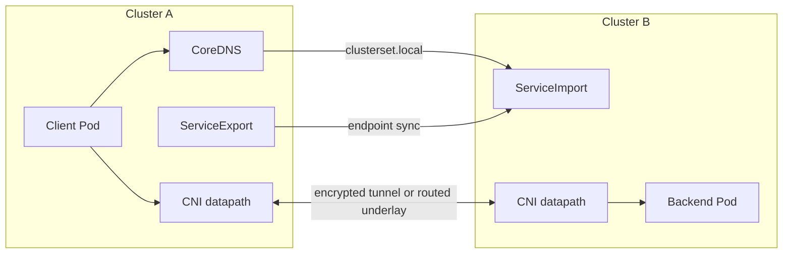
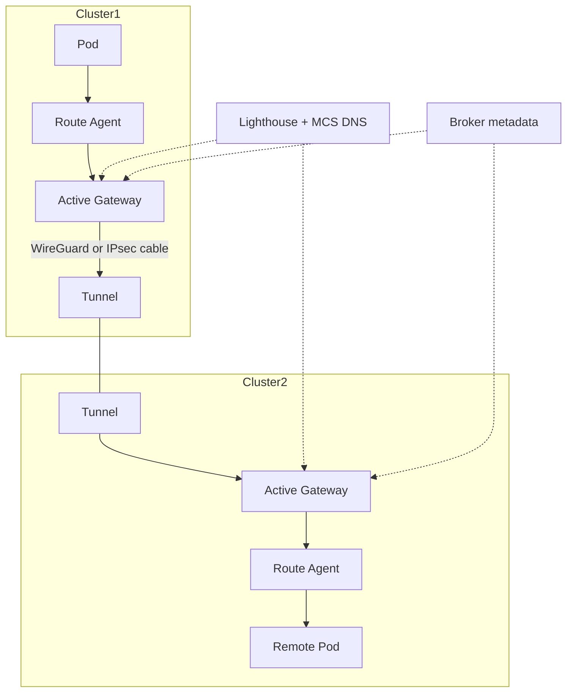

> **Complexity**: `[COMPLEX]` | Time: 120 minutes
>
> **Prerequisites**: [Module 3.2: BGP & Routing](../module-3.2-bgp-routing/), [Module 3.3: Load Balancing](../module-3.3-load-balancing/), [Module 3.4: DNS & Certificates](../module-3.4-dns-certs/)

## Learning Outcomes

After completing this module, you will be able to:

1. **Compare** Submariner Lighthouse, Cilium ClusterMesh, Istio multi-cluster, and Linkerd multicluster datapaths and discovery models on bare metal.
2. **Configure** Multi-Cluster Services (MCS) `ServiceExport` and `ServiceImport` workflows plus CoreDNS `ndots` behavior for `clusterset.local` resolution.
3. **Implement** encrypted cross-cluster tunnels with WireGuard or IPsec and validate MTU and MSS settings for overlay overhead.
4. **Design** BGP-based service exposure across clusters and diagnose split-brain, latency excursion, and asymmetric MTU failure modes.
5. **Operate** identity federation and mTLS certificate rotation across connected clusters without silent trust breaks.

## Why This Module Matters

On public cloud platforms, cross-cluster connectivity is often a managed product: cloud routers, private interconnects, and provider DNS integrations hide the datapath. On bare metal, you own every hop between racks, every tunnel endpoint, every DNS search path, and every certificate trust anchor that allows east-west traffic to flow. A platform team can deploy excellent single-cluster networking and still fail production multicluster rollouts because service discovery, encryption, and routing were designed as separate projects that never met in an integration test.

The failure pattern is predictable. Teams export a service with the MCS API, see a `ServiceImport` appear remotely, and assume packets will follow. DNS resolves `payment.default.svc.clusterset.local`, but TCP hangs on large payloads while small health checks succeed. Another team enables Istio primary-primary across two datacenters without aligning `network` IDs, and endpoints leak across clusters in ways that violate data residency. A third team mirrors Linkerd services without rotating issuer credentials together, and gateways accept connections until midnight when mTLS suddenly fails cluster-wide.

This module teaches the full stack: MCS as the Kubernetes-native discovery contract, CNIs and overlays as the datapath, service meshes as optional L7 policy planes, CoreDNS `ndots` as the resolver behavior that makes or breaks cross-cluster names, and operational discipline for MTU, BGP, identity, and certificate rotation. The goal is not to pick a single winner for every environment. The goal is to know which layer owns which failure mode before your incident bridge does.

## Did You Know

- The MCS API defines `ServiceExport` and `ServiceImport` objects but does not implement packet forwarding; you still need Submariner, Cilium ClusterMesh, or another datapath.
- MCS DNS (KEP-1645) uses `<service>.<namespace>.svc.clusterset.local` for endpoint sets; named headless endpoints use `<hostname>.<clusterid>.<service>.<namespace>.svc.clusterset.local`.
- Cilium Cluster Mesh defaults to KVStoreMesh in recent releases to scale endpoint synchronization, but every cluster in the mesh must agree on `maxConnectedClusters` at install time.
- Istio primary-primary installs require reciprocal remote secrets so each control plane can discover endpoints in peer clusters on the same `network`.

## Section 1: Kubernetes networking stops at the cluster boundary

Kubernetes assigns each pod a cluster-routable IP and expects the CNI to deliver pod-to-pod connectivity inside one cluster. `Service` objects provide stable virtual IPs and DNS names inside that cluster. CoreDNS expands short names using a search list that typically includes `namespace.svc.cluster.local` and `svc.cluster.local`, with `ndots:5` meaning names with fewer than six dots are tried as relative queries first. That behavior is correct for single-cluster operations and confusing the moment you expect `backend` in another cluster to resolve the same way as `backend` locally.

Cross-cluster networking therefore has two distinct problems. First, **reachability**: can a packet sourced from a pod IP in cluster A arrive at a pod IP in cluster B without NAT surprises or overlapping CIDR collisions? Second, **discovery**: can a client learn which IP addresses and ports represent a logical service that spans clusters? Confusing these layers produces tickets where “DNS works” but “the database connection stalls,” because DNS returned an address that is not reachable with the configured MTU or policy.

The Multi-Cluster Services (MCS) API, standardized in [KEP-1645](https://github.com/kubernetes/enhancements/tree/master/keps/sig-multicluster/1645-multi-cluster-services-api), addresses discovery. A `ServiceExport` in the source cluster signals intent to expose a `Service`. Controllers create `ServiceImport` objects in peer clusters and synchronize `EndpointSlice` data. Clients that understand MCS can consume `clusterset.local` names. Nothing in the MCS API installs tunnels, BGP sessions, or gateway pods. Treat MCS as the contract; treat your CNI, VPN, or mesh as the implementation.


```mermaid
flowchart LR
  subgraph ClusterA["Cluster A"]
    PodA[Client Pod] --> DNSA[CoreDNS]
    PodA --> CNIA[CNI datapath]
    SE[ServiceExport]
  end
  subgraph ClusterB["Cluster B"]
    SI[ServiceImport]
    PodB[Backend Pod]
    CNIB[CNI datapath]
  end
  DNSA -->|clusterset.local| SI
  SE -->|endpoint sync| SI
  CNIA <-->|encrypted tunnel or routed underlay| CNIB
  CNIB --> PodB
```

## Section 2: Submariner, Lighthouse, and gateway-centric datapaths

[Submariner](https://submariner.io/getting-started/architecture/) connects Kubernetes clusters by flattening networks so pod and service CIDRs become reachable across a cluster set. The [Gateway Engine](https://submariner.io/getting-started/architecture/gateway-engine/) runs on designated gateway nodes and terminates encrypted tunnels to peer clusters. **Route agents** on every node steer cross-cluster traffic toward the active gateway. A **broker** cluster (or dedicated broker deployment) exchanges metadata so gateways discover one another. This architecture is deliberately CNI-agnostic: Flannel, Calico, or other CNIs can remain in place while Submariner adds an overlay for inter-cluster traffic.

Encryption is handled by Submariner’s cable drivers. **IPsec** (Libreswan) and **WireGuard** are the common choices on bare metal. IPsec introduces IKE negotiation phases; misaligned lifetimes can cause brief outages during rekey that look like application instability. WireGuard is stateless at the session layer relative to IKE and is often preferred when operators want predictable failover behavior, at the cost of distributing keys through Submariner’s own control plane.

**Lighthouse** implements MCS-oriented [service discovery](https://submariner.io/getting-started/architecture/service-discovery/). When you create a `ServiceExport`, Lighthouse advertises the service to the cluster set. Imported services are reachable at `service.namespace.svc.clusterset.local` (KEP-1645 endpoint-set form). For headless services, individual pods use the named endpoint form `hostname.clusterid.service.namespace.svc.clusterset.local` when names satisfy DNS label rules. Lighthouse integrates with CoreDNS through a multicluster plugin so queries for `clusterset.local` forward to Lighthouse rather than looping inside a single cluster’s stub domains.

Submariner’s optional **Globalnet** controller matters on bare metal because many clusters were built with identical default pod CIDRs. Cilium Cluster Mesh refuses overlapping pod ranges; Submariner can NAT overlapping spaces when Globalnet is enabled. The tradeoff is gateway concentration: all cross-cluster traffic hairpins through gateway nodes, which can become throughput bottlenecks and SNAT port exhaustion points under heavy microservice chatter. Plan sysctl tuning for `net.ipv4.ip_local_port_range` and conntrack limits on gateways when you expect high connection churn.


```mermaid
graph TD
  subgraph Cluster1
    P1[Pod] --> RA1[Route Agent]
    RA1 --> GW1[Active Gateway]
    GW1 -->|WireGuard or IPsec cable| TUN1[Tunnel]
  end
  subgraph Cluster2
    TUN2[Tunnel] --> GW2[Active Gateway]
    GW2 --> RA2[Route Agent]
    RA2 --> P2[Remote Pod]
  end
  TUN1 --- TUN2
  LH[Lighthouse + MCS DNS] -.-> GW1
  LH -.-> GW2
  BR[Broker metadata] -.-> GW1
  BR -.-> GW2
```

## Section 3: Cilium ClusterMesh, eBPF identities, and service IP modes

If Cilium is already your CNI, [Cluster Mesh](https://docs.cilium.io/en/stable/network/clustermesh/clustermesh/) is the native multicluster datapath. Cilium connects clusters with pod-to-pod connectivity, propagates security identities across clusters, and can load-balance global services. Unlike Submariner’s gateway hairpin, Cilium establishes **node-to-node** tunnels (VXLAN, Geneve, or direct routing with BGP) so cross-cluster traffic does not require a central gateway choke point for every flow.

Prerequisites are strict on bare metal. All clusters must use the same datapath mode. **Pod CIDRs must be unique and non-overlapping** across the entire mesh. Nodes must have IP connectivity on their Kubernetes `InternalIP` addresses, which usually means datacenter routing, EVPN, or site-to-site VPN between facilities. Firewall rules must allow the documented Cluster Mesh ports documented in Cilium [system requirements](https://docs.cilium.io/en/stable/operations/system_requirements/#firewall-requirements).

Each cluster needs a unique `cluster.name` and numeric `cluster.id` (1–255 by default, up to 511 with `maxConnectedClusters`). Security identities embed cluster bits; changing IDs on live clusters requires workload restarts. **KVStoreMesh** is enabled by default in modern Cilium releases to reduce etcd load when synchronizing remote endpoints. All clusters must agree on `maxConnectedClusters`; changing it after installation is unsupported and can break policy enforcement.

Cilium implements MCS and also supports **global services** for cross-cluster load balancing when exports must work outside strict MCS import paths. For service IP planning, Cluster Mesh distinguishes configurations where **cluster-local service IPs may overlap** versus designs that require globally unique service CIDR planning. Overlapping service IPs are workable inside Cilium’s logical service mapping because resolution combines cluster ID with service identity in the eBPF datapath, but overlapping **pod** CIDRs remain invalid. This asymmetry trips teams migrating from Submariner Globalnet: pod overlap still requires redesign or NAT.

Identity propagation is the hidden advantage. Network policies reference numeric identities that Cilium maps to labels. When Cluster Mesh is enabled, remote endpoints receive cluster-scoped identities so policies written in cluster A can reference labels on pods in cluster B without flattening Kubernetes RBAC boundaries. The cost is operational: you must protect clustermesh API servers, rotate Cluster Mesh certificates, and monitor clustermesh connectivity with `cilium clustermesh status` during upgrades.

## Section 4: Istio multi-cluster, networks, and ServiceEntry patterns

[Istio](https://istio.io/latest/docs/setup/install/multicluster/multi-primary/) multicluster patterns split along two axes: **network** membership and **control plane** topology. A *network* is a routable L3 domain. Clusters on the same network can use pod-to-pod addresses directly if the underlay allows it. Clusters on different networks require east-west gateways that terminate Istio mTLS and re-originate traffic into the remote network. The `network` field in `IstioOperator` values must be consistent for clusters that share L3 connectivity and distinct when they do not.

**Primary-primary** topologies install a full Istio control plane in each cluster. Each primary watches remote Kubernetes APIs via `istioctl create-remote-secret` so endpoint discovery is bidirectional. This model suits active-active application footprints where both clusters schedule workloads and need mutual discovery. **Primary-remote** (not detailed in the install guide above but common in operations) centralizes configuration in one primary while remotes receive only dataplane components; it reduces control-plane overhead but creates a resilience dependency on the primary cluster’s availability.

Cross-cluster service consumption often uses **`ServiceEntry`** and **`WorkloadEntry`**. A `ServiceEntry` declares external or remote hosts and ports that should appear in the mesh routing table. A `WorkloadEntry` registers individual endpoints (VMs or pods outside the local cluster) with addresses and labels so Istio can apply the same mTLS and telemetry as in-cluster workloads. Together they let you model a remote payment API as `payment.global.svc` with explicit endpoint IPs learned from MCS imports or manual operations. Misconfigured `ServiceEntry` resolution—especially mixing DNS resolution modes—produces 503 errors where kube-proxy health looks fine.

Istio’s deployment models documentation stresses aligning `meshID`, `clusterName`, and network IDs before enabling cross-cluster secrets. Skipping [before-you-begin](https://istio.io/latest/docs/setup/install/multicluster/before-you-begin/) checks (distinct cluster names, non-overlapping service entries where required, and reachable gateway IPs) is a frequent source of primary-primary installs that appear healthy while cross-network routing blackholes.

## Section 5: Linkerd multicluster gateways and mirrored services

[Linkerd multicluster](https://linkerd.io/2.18/tasks/multicluster/) takes a service-mirroring approach. A **gateway** deployment in the `linkerd-multicluster` namespace exposes a `LoadBalancer` (or NodePort on bare metal) that accepts mTLS connections verified against a **shared trust anchor** across clusters. A **service mirror** controller in the source cluster watches exported services in the target cluster and creates mirrored `Service` objects locally. Endpoints on mirrored services point at the remote gateway IP so application code continues to use familiar `service.namespace` names.

Export is explicit: services must carry the `mirror.linkerd.io/exported=true` label (or a custom selector configured on the `Link` CR). This prevents accidental exposure of cluster-internal admin services. Linking clusters uses `linkerd multicluster link-gen` to produce credentials secrets and `Link` custom resources that include gateway address and identity. On bare metal, allocate routable gateway IPs with MetalLB or kube-vip before mirroring, because the mirror controller copies remote gateway addresses into local endpoint slices.

Linkerd extends automatic mTLS across clusters. Gateways reject connections that do not present certificates signed by the shared trust anchor. **mTLS rotation** therefore becomes a fleet operation: rotate trust anchor and issuer credentials on a documented schedule, distribute secrets to every cluster, and restart gateways before workload certificates expire. Running independent `linkerd install` commands without shared anchors yields meshes that appear linked while gateways silently reject traffic.

## Section 6: CoreDNS, ndots, and clusterset.local resolution

Kubernetes pod DNS configuration is documented in [DNS for Services and Pods](https://kubernetes.io/docs/concepts/services-networking/dns-pod-service/). Each pod receives a resolver configuration with `ndots:5` and search domains such as `default.svc.cluster.local`, `svc.cluster.local`, and `cluster.local`. When an application requests `api`, the resolver tries `api.default.svc.cluster.local` before treating the name as fully qualified. That behavior prevents accidental leakage of short names but increases query volume.

Cross-cluster names such as `payment.default.svc.clusterset.local` are fully qualified and bypass excessive search expansion when written with a trailing dot or enough dots to exceed the `ndots` threshold. Operational mistakes happen when developers use partial names like `payment.clusterset.local` without understanding search order, or when operators add a `forward . /etc/resolv.conf` stub that captures `clusterset.local` and forwards it upstream to corporate DNS that knows nothing about Kubernetes exports.

Lighthouse and MCS controllers typically install CoreDNS **stub domains** or plugins that route only `clusterset.local` to the multicluster resolver. The anti-pattern is reciprocal forwarding between two clusters’ CoreDNS deployments, which creates resolution loops and CPU spikes. Scope forwarding narrowly, log `SERVFAIL` and `NXDOMAIN` rates per zone, and teach application teams to log the exact name they requested when opening incidents.

For troubleshooting, deploy a debug pod with `nslookup` or `dig` and compare results for:

- `service.namespace.svc.cluster.local` (local cluster only)
- `service.namespace.svc.clusterset.local` (MCS global name)
- `service.namespace.svc.clusterset.local.` (FQDN with trailing dot)

If local resolution works and clusterset fails, the datapath may still be fine while discovery is broken. Fix exports and Lighthouse before touching tunnels.

## Section 7: VPN overlays with WireGuard between ingress endpoints

Not every organization adopts a full multicluster CNI. A pragmatic bare-metal pattern connects **site ingress nodes** or **border gateways** with **WireGuard** tunnels, then advertises remote pod or service CIDRs with static routes or BGP. The [WireGuard quick start](https://www.wireguard.com/quickstart/) model applies: each site has a UDP port, public keys distributed through configuration management, and `AllowedIPs` listing remote CIDRs. Kubernetes nodes do not need to terminate WireGuard individually if the underlay already routes remote pod CIDRs to a gateway pair.

This design trades automation for control. You must keep `AllowedIPs` updated when pod CIDRs expand, rotate keys without dropping all tunnels simultaneously, and ensure MSS clamping on tunnel interfaces. WireGuard adds encapsulation overhead (commonly 60 bytes for IPv4), which feeds directly into the MTU math in Section 8. When WireGuard terminates on ingress nodes rather than on every node, SNAT may still occur at the boundary; document whether return traffic is symmetric.

Combine WireGuard with **[MetalLB BGP mode](https://metallb.universe.tf/concepts/bgp/)** when you need remote clusters to attract service IPs. MetalLB speakers on cluster A can advertise a `LoadBalancer` VIP into datacenter BGP; cluster B learns the route across the WireGuard tunnel if the VIP lives in an allowed prefix. Policy must filter which communities may cross site boundaries so you do not leak internal service IPs into the public Internet routing table.

## Section 8: BGP-based service exposure across clusters

Module 3.2 established BGP fundamentals for pod and service advertisement on a single cluster. Multicluster BGP extends the idea: treat remote cluster service CIDRs or `/32` host routes as learned prefixes with explicit community tags marking origin cluster. On bare metal, this is how teams expose `LoadBalancer` VIPs from multiple clusters to a shared spine without merging Kubernetes control planes.

Design rules that survive audits:

- Tag advertisements with **BGP communities** identifying `cluster-id` and `service-type`.
- Never redistribute overlapping pod CIDRs without a NAT boundary; BGP will happily install ambiguous paths.
- Use **BFD** on inter-site links when failover must beat Kubernetes endpoint propagation delay.
- Separate **internal service VIP pools** per cluster when policy requires deterministic return paths.

When MCS exports synchronize endpoints but BGP does not advertise the correct next hop, symptoms look like asymmetric routing: SYN reaches the backend, return path exits through a different site with a firewall rule that drops established flows.

## Section 9: MTU, MSS, and asymmetric path failures

Encapsulation stacks subtract from the physical MTU. A 1500-byte Ethernet MTU with VXLAN (50 bytes) and WireGuard (60 bytes) leaves roughly 1390 bytes safe payload before fragmentation. IPsec overhead varies with cipher suites but is often similar. TCP may set DF; if ICMP “Fragmentation Needed” is filtered, you get an **MTU blackhole**: small pings succeed, large TLS or database frames hang.

Mitigations include lowering CNI interface MTU, enabling **TCP MSS clamping** on tunnel ingress, and validating end-to-end with `ping -M do -s <size>` between pod networks on both sides of the tunnel. **Asymmetric MTU** environments—jumbo frames inside one datacenter, 1500-byte Internet VPN outside—produce failures that appear only for cross-site flows. Document MTU per segment on the network diagram and test from application pods, not only from jump hosts.

Latency excursions are separate from blackholes. Gateway-based designs add extra hops; cross-country RTT dominates service SLOs once connectivity is “up.” Measure TCP connect time and TLS handshake time separately from ICMP RTT when triaging multicluster incidents.

## Section 10: Failure modes — split brain, latency, and control-plane partition

**Split brain** in multicluster networking usually means two active gateways or two brokers believe they own routing authority. Submariner gateway failover is active/passive; if both gateways forward, duplicate or asymmetric paths may appear. Istio multicluster split brain manifests as divergent endpoint sets when remote secrets stop updating but old endpoints remain cached. Linkerd mirror controllers may continue pointing to a stale gateway IP after MetalLB reallocates a VIP.

**Latency excursion** often tracks gateway CPU, tunnel reordering, or sudden cross-site traffic shifts after a failover event. Compare direct Cilium node paths versus Submariner gateway paths when deciding architecture for latency-sensitive workloads.

**Control-plane partition** separates clusters while tunnels remain partially up. MCS may stop updating `EndpointSlice` objects while connections to old IPs still work until timeouts clear. Monitor export conditions on `ServiceExport` resources and clustermesh connection health independently.

## Section 11: Identity federation and mTLS rotation across clusters

Service meshes and zero-trust designs require a **shared root of trust** or federated SPIFFE trust bundles. Linkerd explicitly requires the same trust anchor across linked clusters. Istio uses mesh-wide CA configuration; rotating Citadel or external CA credentials without rolling data plane proxies causes hard TLS failures. Cilium Cluster Mesh ships its own CA secrets for clustermesh-apiserver; copy `cilium-ca` only through controlled procedures documented upstream.

Operational checklist for rotation without outage:

1. Generate new issuer credentials before expiry.
2. Distribute secrets to all clusters in the mesh.
3. Roll data plane components (gateways first, then workloads).
4. Validate cross-cluster probes with explicit SNI and certificate inspection.
5. Remove old CA only after dual-trust windows end.

Treat **identity federation** as a fleet process, not a per-cluster ticket. The same team that owns DNS search paths should own trust bundle distribution, or exports will resolve while TLS fails with inscrutable `CERTIFICATE_VERIFY_FAILED` messages in application logs.

## Section 12: Architecture selection for bare-metal multicluster

Choosing a cross-cluster stack is an exercise in constraints, not brand preference. Start from non-negotiable inputs: Are pod CIDRs unique? Is full pod-to-pod routing required, or is gateway-based NAT acceptable? Must applications keep using plain Kubernetes `Service` DNS without sidecars? Does security mandate L7 policy and mTLS at the application layer, or is encrypted CNI transport sufficient? Answers map cleanly to component classes.

When pod CIDRs overlap because clusters were cloned from the same `kubeadm` template, **Submariner Globalnet** or full re-IP is mandatory before Cilium Cluster Mesh can work. When Cilium is already standard and CIDRs are planned, **Cluster Mesh** offers the best throughput story because it avoids gateway hairpins. When teams already run **Istio** for L7 policy, adding primary-primary multicluster may be cheaper than introducing a second overlay, provided network IDs and east-west gateways match real routing. When minimalism matters and only a few services cross clusters, **Linkerd mirroring** with explicit export labels reduces accidental exposure.

| Requirement | Strong fit | Caveat |
|-------------|------------|--------|
| Overlapping pod CIDRs | Submariner + Globalnet | Gateway throughput and SNAT limits |
| eBPF policy across clusters | Cilium Cluster Mesh | Non-overlapping CIDRs; clustermesh API HA |
| L7 policy + multicluster | Istio multi-primary or remote | Control-plane coupling; gateway IPs on bare metal |
| Minimal app changes + mTLS | Linkerd multicluster | Shared trust anchor operations |
| Standards-based discovery only | MCS + your datapath | MCS does not forward packets |
| Site-to-site without CNI swap | WireGuard + BGP (MetalLB) | Manual CIDR and key lifecycle |

Hybrid designs are common and valid. A platform team might run Cilium Cluster Mesh for pod connectivity, Istio for L7 policy on edge services, and MCS `ServiceExport` objects as the discovery contract visible to application developers. The failure mode to avoid is two unrelated overlays fighting for the same routes—document which component owns default routes to remote pod CIDRs and which owns service VIP advertisement.

## Section 13: MCS export and import lifecycle in operations

Day-two operations for MCS begin with namespace sameness decisions inside a **cluster set**. Namespaces with the same name in different clusters are treated as the same logical namespace for export semantics. If cluster B lacks `payments`, an export from cluster A may never materialize a healthy `ServiceImport` in B. Platform teams should codify namespace creation in GitOps templates so multicluster consumers do not chase missing namespaces during incidents.

Creating a `ServiceExport` is a deliberate user action—controllers do not auto-export every `Service`. After export, inspect conditions:

```bash
kubectl get serviceexport payment -n payments -o yaml
kubectl get serviceimport -A | grep payment
kubectl get endpointslice -n payments -l kubernetes.io/service-name=payment
```

A `Conflict` condition often indicates two clusters exported differently named backends that collided in the clusterset aggregate. A missing `Valid` condition with empty endpoints usually means selectors mismatch pods, not that tunnels failed. Train application on-call engineers to capture these three commands before escalating to networking.

For headless services, document per-pod DNS expectations under MCS. StatefulSets exported headlessly expose pod DNS names that include the pod name label. Clients must use those names when they need direct pod affinity; clusterIP-style virtual IPs are not in play. This matters for stateful middleware that pins to pod identity during rolling upgrades across clusters.

## Section 14: Submariner broker placement and gateway operations

The Submariner [broker](https://submariner.io/getting-started/architecture/) holds cluster metadata and credentials used by gateways. It can run on a dedicated management cluster or inside one member cluster with restricted RBAC. Broker loss does not immediately drop established tunnels, but new gateways cannot discover peers, which blocks recovery after gateway node drains. Run the broker on a stable cluster with etcd backups and monitor its API like any other control plane.

Gateway node selection should follow bare-metal constraints: nodes with stable north-south connectivity, sufficient CPU for encryption, and labels that exclude them from arbitrary batch workloads. When the active gateway fails, passive takeover introduces a brief window where conntrack entries and ARP caches on switches must converge. Schedule gateway maintenance with cordon and drain on the gateway node itself—never scale a Deployment to zero replicas on gateway nodes as a substitute for `kubectl cordon` and controlled failover.

Use `subctl` diagnostics in addition to Kubernetes events. Verify cable driver status, NAT rules when Globalnet is enabled, and Lighthouse DNS plugin health. The [kind quickstart](https://submariner.io/getting-started/quickstart/kind/) is valuable for learning broker and join semantics even when production runs on bare metal with routed underlays.

## Section 15: Istio multi-network east-west gateways

When clusters live on different L3 networks, Istio expects **east-west gateways** that terminate mesh mTLS and forward to remote networks. The gateway deployment is not the same as an ingress gateway facing users; it is a dedicated path for pod-to-pod mesh traffic crossing network boundaries. On bare metal, expose gateway Services with MetalLB or kube-vip and ensure corporate firewalls allow the Istio discovery ports and tunnel protocols you enable.

`ServiceEntry` objects represent external hosts. For multicluster, hosts may be public DNS names, private VIPs, or clusterset names depending on integration. Choose `resolution: DNS` when addresses change dynamically; choose `STATIC` endpoints when importing MCS slices into Istio manually. **`WorkloadEntry`** registers out-of-cluster endpoints with labels so policies attach consistently. A frequent mistake is creating `ServiceEntry` without matching sidecar injection labels on clients, leaving traffic on plain kube-proxy paths that bypass intended policy.

Primary-remote topologies reduce duplicated control planes but concentrate risk. If the primary cluster suffers regional loss, remotes may continue running workloads yet lose configuration updates. Document whether remotes can operate with last-known config and for how long. Primary-primary trades operational cost for resilience; both patterns are supported, but bare-metal teams often underestimate certificate and secret distribution work across all primaries.

## Section 16: Linkerd mirroring, TrafficSplit, and failover drills

After mirroring, services appear locally with suffixed names (for example `podinfo-east`). Applications must target mirrored names or use `TrafficSplit` to weight between local and remote backends. Failover drills should measure how quickly weights shift without code changes. Combine mirroring with PodDisruptionBudgets on gateway nodes so maintenance does not remove the only path to a remote cluster.

Gateway identity is embedded in `Link` resources. If MetalLB reassigns a gateway IP, regenerate links or update endpoint slices before applications time out. Run multicluster checks after every platform upgrade: `linkerd multicluster check` and gateway stat commands validate trust, not just pod readiness.

## Section 17: WireGuard operations between ingress pairs

For WireGuard between ingress pairs, maintain infrastructure-as-code for `AllowedIPs` that lists every remote pod and service CIDR. When a cluster expands, update both ends before scheduling pods in the new range. Key rotation should use overlapping validity windows: bring up tunnels with new keys, migrate traffic, retire old keys. Monitor UDP encapsulation drops on firewalls that treat long-lived UDP as idle.

Pair WireGuard with MSS clamping on the tunnel interface. Many Linux distributions do not clamp automatically. nftables or iptables rules can clamp SYN packets to `MTU - overhead - headers`. Document the exact rule set per distribution because automation that works on Ubuntu may differ on RHEL.

## Section 18: BGP propagation with MCS and MetalLB together

MetalLB speakers advertise VIPs to ToR switches. When VIPs must be reachable from remote clusters, ensure BGP sessions propagate only intended prefixes. Use separate communities for `local-preference` manipulation on backup sites. Test withdrawal timing: when a speaker stops advertising, remote clusters should not continue sending traffic to stale VIPs longer than application timeouts allow.

Combine MCS endpoint sync with BGP health checks. MCS may list backends that are unreachable if BGP on one site withdrew routes. Application health checks should span clusters for active-active designs. Keep kube-proxy or eBPF service maps in mind: BGP advertises VIPs, not necessarily every pod IP, unless you also export pod CIDRs via Calico or Cilium BGP features from Module 3.2.

## Section 19: Incident triage checklist

Use a ordered checklist during multicluster incidents to avoid thrashing:

1. **Export/import conditions** — Is the `ServiceExport` valid and do `ServiceImport` objects show endpoints?
2. **DNS** — Does a debug pod resolve the clusterset FQDN with and without search paths?
3. **Datapath** — Can pods ping remote pod IPs by IP address, bypassing DNS?
4. **MTU** — Do sized pings fail only near 1500 bytes?
5. **Mesh TLS** — Do gateways or sidecars log certificate errors after a rotation?
6. **BGP** — Do speakers advertise expected communities; are stale routes present?

Record which layer failed in the incident ticket so postmortems improve architecture docs instead of repeating the same kubectl commands.

## Section 20: Capacity, latency budgets, and SLO math

Cross-cluster calls add RTT and encryption cost. If single-cluster p99 latency is 5 ms inside a rack, the same call across a 40 ms RTT link becomes dominated by network regardless of CPU. Set SLOs per call pattern: synchronous chains that hop clusters twice per request may violate user-facing budgets even when each cluster is healthy.

Gateway designs add CPU per gigabit for encryption. Size gateway nodes with measured iperf or mesh benchmark tools after enabling WireGuard or IPsec. Cilium node-to-node designs spread load but still encrypt on every node; total CPU may be higher aggregate yet avoid a single choke point.

Plan connection table sizes on gateways when SNAT is involved. A microservice storm that opens short-lived connections can exhaust conntrack entries before bandwidth saturates. Monitor `nf_conntrack_count` and increase limits only alongside sysctl tuning reviewed by security.

## Section 21: Dual-stack and Happy Eyeballs across clusters

Dual-stack clusters export both A and AAAA records when MCS synchronizes endpoints. Clients using Happy Eyeballs ([RFC 8305](https://datatracker.ietf.org/doc/html/rfc8305)) may prefer IPv6 paths that traverse different firewalls than IPv4. Validate both address families through tunnels, not only the family your laptop uses on VPN. If IPv6 is experimental in your datacenter, consider disabling AAAA exports until path MTU and ACLs are identical for both protocols.

Tunnel endpoints on IPv6 underlays avoid NAT traversal pain between sites that only have public IPv6. WireGuard and IPsec both support UDP over IPv6; ensure DNS and MCS records your applications consume match the family you actually route. Mixed-family SNAT at gateways can break return path symmetry when one direction uses IPv4 and the other IPv6.

## Section 22: Security policy spanning clusters

NetworkPolicy and CiliumNetworkPolicy resources are cluster-local unless your CNI propagates identities across Cluster Mesh. When policies reference labels on remote pods, verify the identity import semantics for your version. A policy that allows `role=backend` in cluster A may not include remote endpoints until clustermesh identity synchronization completes after upgrades.

For service meshes, authorization policies may reference service accounts that do not exist in peer clusters. Use explicit host matchers in `ServiceEntry` and namespace-scoped trust boundaries when regulatory requirements forbid implicit trust. Document which cluster owns certificate issuance for each DNS name exposed through MCS.

Audit east-west gateways and Submariner gateways like border firewalls. They terminate encrypted traffic and re-forward plaintext inside the cluster network. Compromise of a gateway node is high impact; apply hardened images, minimal RBAC, and rapid patching SLAs comparable to control plane nodes.

## Section 23: Upgrade and rollback discipline

Upgrade order should be documented before production multicluster goes live. A conservative pattern upgrades broker and Lighthouse components first, then gateway software, then route agents, then CNI datapaths, and finally service mesh control planes. After each step, run cross-cluster synthetic probes that include DNS, TCP connect, and TLS handshake where applicable.

Rollback plans must state whether tunnels can coexist across versions. Some cable drivers cannot interop across minor versions; keep at least one maintenance window where both versions run with separate gateway pairs if required. For Cilium, snapshot clustermesh API server certificates before upgrades; restore procedures should include reconnecting clusters if secrets rotate unexpectedly.

Never patch gateway nodes with destructive merge patches that replace entire `containers` arrays on DaemonSets. Use rolling update parameters and cordon-first maintenance as taught in node operations modules. Scaling gateway Deployments to zero is not a maintenance strategy—it forces unplanned failover.

## Section 24: Observability signals that actually help

Metrics should distinguish local versus remote traffic. Cilium Hubble can mark cluster IDs on flows when Cluster Mesh is enabled. Istio telemetry should include `destination_cluster` labels when multicluster is configured. Linkerd stat commands can show mirrored service traffic separately from local services.

Logs to collect during incidents include CoreDNS query logs (with QNAME), gateway tunnel establishment logs, BGP session state from ToR switches, and MCS controller logs if you run a community implementation. Correlate timestamps across clusters using synchronized NTP; skewed clocks make split-brain investigations misleading.

Tracing across clusters requires consistent propagation headers. Without tracing, latency excursions look like application regressions. Inject OpenTelemetry context at ingress and verify spans continue on mirrored service paths through gateways.

## Section 25: Hands-on preparation for production bare metal

The kind labs in this module validate concepts on Docker networks. Production bare metal introduces LACP, ECMP, and firewall tiers kind does not simulate. Before promoting Cluster Mesh, run the same three exercises against real nodes: confirm `InternalIP` reachability between racks, verify ToR routes include remote pod CIDRs, and repeat MTU probes from application pods scheduled on worker nodes—not only from jump hosts.

Document your chosen stack in a one-page decision record: datapath owner, discovery owner, DNS owner, certificate owner, and BGP owner. When an incident arrives, the bridge assigns each owner a parallel track instead of debating fundamentals under pressure.

Run quarterly game days that combine controlled failures: broker read-only mode, gateway cordon, Istio remote secret deletion, and MetalLB speaker withdrawal. Measure time-to-detect and time-to-mitigate for each scenario. Teams that only test happy-path connectivity discover MTU, DNS, and trust-anchor failures during customer peaks instead of during practice.

Finally, align change management with application release trains. A multicluster platform change during a retail freeze window transfers risk to revenue-bearing services even when the change is “only networking.” Schedule overlay upgrades outside application blackouts, and require automated rollback artifacts (known-good Helm values, prior clustermesh secrets, prior BGP community maps) before any production edit.

Keep a living “known-good” packet capture library: successful DNS answers for `clusterset.local`, a three-way TCP handshake across clusters, and a TLS handshake through mesh gateways. During incidents, compare live captures to the library to spot extra SYN retransmits, ICMP administratively prohibited messages, or certificate issuer mismatches within minutes instead of hours. Store those captures with cluster version metadata so upgrades that change tunnel headers or DNS plugin behavior are obvious when regressions appear later in production.

## Common Mistakes

| Mistake | Problem | Fix |
|---------|---------|-----|
| Exporting MCS services without a datapath | DNS resolves `clusterset.local` but TCP never connects | Install Submariner, Cilium ClusterMesh, or routed VPN before exporting services |
| Connecting Cilium clusters with overlapping pod CIDRs | Policies and routing select wrong endpoints | Re-IP pods or adopt Submariner Globalnet for overlap at pod layer |
| Forwarding all DNS zones reciprocally between clusters | CoreDNS loops and resolver CPU spikes | Stub only `clusterset.local` to Lighthouse or MCS resolver |
| Ignoring tunnel MTU on a 1500-byte underlay | Large payloads hang while ICMP succeeds | Lower CNI MTU, clamp MSS, verify PMTUD ICMP is permitted |
| Mixing Istio `network` labels on clusters without L3 reachability | Endpoints point at unroutable pod IPs | Align `network` with actual topology; add east-west gateways |
| Linking Linkerd clusters without shared trust anchors | Gateways reject cross-cluster mTLS | Generate one anchor, distribute issuer secrets to every cluster |
| Treating MetalLB BGP advertisements as MCS | VIP routes exist but exports absent | Create `ServiceExport` or mesh mirror labels plus BGP where needed |
| Rotating mesh CA in one cluster only | Intermittent TLS failures after TTL | Coordinate rotation windows and dual-trust across the fleet |

## Quiz

### Question 1

You inherit two bare-metal clusters that both use pod CIDR `10.244.0.0/16`. Leadership wants native pod-to-pod routing with eBPF policies. Which approach fits?

<details>
<summary>Answer</summary>

Cilium Cluster Mesh requires non-overlapping pod CIDRs, so you cannot simply connect these clusters without renumbering one fleet or changing IPAM. Submariner with Globalnet exists specifically to NAT overlapping pod networks. Istio and Linkerd can carry application traffic but do not by themselves solve overlapping pod routing at the CNI layer. The correct operational choice is either re-IP a cluster or adopt Submariner Globalnet (accepting gateway hairpin tradeoffs) before expecting direct pod routing.
</details>

### Question 2

A developer reports that `curl payment.default.svc.clusterset.local` times out, but `kubectl get serviceimport` shows endpoints. ICMP between node IPs works. What should you investigate first?

<details>
<summary>Answer</summary>

Separate discovery from datapath. Endpoints on `ServiceImport` prove MCS synchronization; timeouts with working node ICMP suggest tunnel MTU blackholes, firewall rules blocking pod CIDRs, or asymmetric routing rather than DNS failure. Capture path MTU with sized pings from a client pod, verify security groups and datacenter ACLs allow pod-to-pod CIDRs (not only node `/32` routes), and confirm the active Submariner gateway or Cilium tunnel is healthy.
</details>

### Question 3

Which Submariner component publishes MCS DNS records for exported services?

<details>
<summary>Answer</summary>

Lighthouse provides MCS-oriented service discovery and integrates with CoreDNS for `clusterset.local` names. The Gateway Engine terminates encrypted cables; route agents steer traffic to gateways; the broker exchanges metadata between gateways. Confusing Lighthouse with the gateway leads teams to fix tunnels while DNS remains misconfigured.
</details>

### Question 4

In Istio primary-primary on a shared L3 network, what must exist after installing both control planes?

<details>
<summary>Answer</summary>

Each cluster needs a remote secret created with `istioctl create-remote-secret` applied on the peer so both control planes discover endpoints. Without reciprocal secrets, endpoint information stays local and multicluster routing fails even when `meshID` matches. Network IDs must reflect actual reachability: same network only when pod IPs are routable without an east-west gateway.
</details>

### Question 5

Linkerd multicluster gateways reject connections from a newly linked cluster. Local services mirror correctly. What is the most likely cause?

<details>
<summary>Answer</summary>

The remote cluster does not present a client certificate signed by the shared trust anchor configured during `linkerd install`. Mirroring can succeed while mTLS fails if issuer credentials or trust anchor files differ between clusters. Regenerate and distribute matching anchor and issuer secrets, roll gateways, then retry verified connections with `linkerd multicluster check`.
</details>

### Question 6

Applications report only large HTTP payloads failing between clusters on WireGuard overlays with 1500-byte physical MTU. Small health checks succeed. What explains the pattern?

<details>
<summary>Answer</summary>

This is classic PMTUD failure or insufficient MTU headroom after encapsulation. WireGuard adds overhead; if ICMP fragmentation messages are filtered, TCP with DF set hangs on large segments while small probes pass. Lower tunnel interface MTU, enable MSS clamping on ingress, and test with `ping -M do` using incrementing sizes from pod network namespaces.
</details>

### Question 7

When designing BGP advertisement for multicluster `LoadBalancer` VIPs, what policy reduces ambiguous routing?

<details>
<summary>Answer</summary>

Use distinct VIP pools per cluster, tag routes with BGP communities identifying origin, and avoid redistributing overlapping pod CIDRs without NAT. Combine MCS exports (logical service identity) with BGP (reachable VIP) instead of assuming one replaces the other. Filter communities at site borders so internal VIPs never leak externally.
</details>

### Question 8

CoreDNS CPU spikes after enabling cross-cluster forwarding. Logs show cyclic queries between two clusters. What misconfiguration is likely?

<details>
<summary>Answer</summary>

Reciprocal `forward` stanzas that send all unknown zones—including peer cluster DNS—to one another create resolution loops. Restrict forwarding to `clusterset.local` (or the exact MCS zone) via Lighthouse or a dedicated stub, never to `.` upstream of another cluster’s CoreDNS. Validate with `ndots`-aware FQDNs and trailing-dot queries before reopening wide forwards.
</details>

## Hands-On Exercise: Cross-Cluster Networking Labs

Complete all three exercises in order on a workstation with `kind`, `kubectl`, and the Cilium CLI installed. These labs use Kubernetes **1.35** node images to match the curriculum target version.

- [ ] Exercise 1: Build two kind clusters, enable Cilium Cluster Mesh with WireGuard, and verify pod-to-pod connectivity across clusters.
- [ ] Exercise 2: Inspect CoreDNS `ndots` and search-list behavior, then resolve local versus `clusterset.local`-style names from a debug pod.
- [ ] Exercise 3: Measure MTU limits with sized pings across the Cluster Mesh tunnel and record safe MSS/MTU values for your underlay.
- [ ] Compare Submariner gateway hairpin routing versus Cilium node-to-node tunnels in your notes for future architecture reviews.

### Exercise 1: Cilium Cluster Mesh on kind 1.35

```bash
cat <<'EOF' > /tmp/cm-cluster1.yaml
kind: Cluster
apiVersion: kind.x-k8s.io/v1alpha4
name: cm-cluster1
nodes:
  - role: control-plane
  - role: worker
networking:
  disableDefaultCNI: true
  podSubnet: 10.10.0.0/16
  serviceSubnet: 10.11.0.0/16
EOF

cat <<'EOF' > /tmp/cm-cluster2.yaml
kind: Cluster
apiVersion: kind.x-k8s.io/v1alpha4
name: cm-cluster2
nodes:
  - role: control-plane
  - role: worker
networking:
  disableDefaultCNI: true
  podSubnet: 10.20.0.0/16
  serviceSubnet: 10.21.0.0/16
EOF

kind create cluster --name cm-cluster1 --image kindest/node:v1.35.1 --config /tmp/cm-cluster1.yaml
kind create cluster --name cm-cluster2 --image kindest/node:v1.35.1 --config /tmp/cm-cluster2.yaml
```

```bash
cilium install --version 1.19.4 --context kind-cm-cluster1 \
  --set cluster.name=cm-cluster1 \
  --set cluster.id=1 \
  --set ipam.operator.clusterPoolIPv4PodCIDRList=10.10.0.0/16 \
  --set encryption.enabled=true \
  --set encryption.type=wireguard \
  --set clustermesh.useAPIServer=true

cilium install --version 1.19.4 --context kind-cm-cluster2 \
  --set cluster.name=cm-cluster2 \
  --set cluster.id=2 \
  --set ipam.operator.clusterPoolIPv4PodCIDRList=10.20.0.0/16 \
  --set encryption.enabled=true \
  --set encryption.type=wireguard \
  --set clustermesh.useAPIServer=true

cilium status --context kind-cm-cluster1 --wait
cilium status --context kind-cm-cluster2 --wait
```

```bash
cilium clustermesh enable --context kind-cm-cluster1 --service-type NodePort
cilium clustermesh enable --context kind-cm-cluster2 --service-type NodePort
cilium clustermesh status --context kind-cm-cluster1 --wait
cilium clustermesh status --context kind-cm-cluster2 --wait
cilium clustermesh connect --context kind-cm-cluster1 --destination-context kind-cm-cluster2
cilium clustermesh status --context kind-cm-cluster1 --wait
```

```bash
kubectl --context kind-cm-cluster2 create deployment nginx --image=nginx:1.27-alpine
kubectl --context kind-cm-cluster2 expose deployment nginx --port=80
kubectl --context kind-cm-cluster2 annotate service nginx service.cilium.io/global="true"

# Cluster Mesh global services require the same Service name/namespace in every
# cluster. A stub Service in cluster 1 (no matching pods) still enables DNS and
# cross-cluster load-balancing to backends in cluster 2.
kubectl --context kind-cm-cluster1 create service clusterip nginx --tcp=80:80
kubectl --context kind-cm-cluster1 annotate service nginx service.cilium.io/global="true"

kubectl --context kind-cm-cluster1 run netshoot --image=nicolaka/netshoot --restart=Never -- sleep infinity
kubectl --context kind-cm-cluster1 wait --for=condition=Ready pod/netshoot --timeout=120s
kubectl --context kind-cm-cluster2 wait --for=condition=Ready pod -l app=nginx --timeout=120s

kubectl --context kind-cm-cluster1 exec netshoot -- curl -sS --max-time 10 http://nginx.default.svc.cluster.local
```

Expected output: the curl command returns nginx HTML from cluster two while the client pod runs in cluster one. Cilium ClusterMesh global services need an identically named `Service` in each connected cluster (selector mismatches on a stub cluster are fine). Without the cluster-1 stub, CoreDNS returns NXDOMAIN for `nginx.default.svc.cluster.local` before Cilium can load-balance. If curl times out, run `cilium clustermesh status --context kind-cm-cluster1` and confirm remote nodes show connected before debugging DNS.

### Exercise 2: CoreDNS ndots and search paths

```bash
kubectl --context kind-cm-cluster1 run dns-debug --image=busybox:1.36 --restart=Never -- sleep infinity
kubectl --context kind-cm-cluster1 wait --for=condition=Ready pod/dns-debug --timeout=120s
kubectl --context kind-cm-cluster1 exec dns-debug -- cat /etc/resolv.conf
kubectl --context kind-cm-cluster1 exec dns-debug -- nslookup kubernetes.default
kubectl --context kind-cm-cluster1 exec dns-debug -- nslookup kubernetes.default.svc.cluster.local
```

```bash
kubectl --context kind-cm-cluster1 exec dns-debug -- nslookup nginx.default.svc.cluster.local
kubectl --context kind-cm-cluster1 exec dns-debug -- nslookup nginx.default.svc.clusterset.local || true
```

Expected output: `resolv.conf` lists `ndots:5` and search domains ending in `svc.cluster.local`. Short names like `kubernetes.default` resolve via search list expansion. The `clusterset.local` query may fail in this Cilium-only lab without Lighthouse; record that discovery requires MCS DNS components even when Cluster Mesh datapath works.

### Exercise 3: MTU sizing across Cluster Mesh

```bash
NGINX_POD=$(kubectl --context kind-cm-cluster2 get pod -l app=nginx -o jsonpath='{.items[0].status.podIP}')
kubectl --context kind-cm-cluster1 exec netshoot -- ping -c 2 -M do -s 1472 "${NGINX_POD}"
kubectl --context kind-cm-cluster1 exec netshoot -- ping -c 2 -M do -s 1400 "${NGINX_POD}"
kubectl --context kind-cm-cluster1 exec netshoot -- ping -c 2 -M do -s 1200 "${NGINX_POD}"
```

Expected output: the largest probe near 1500 bytes may fail when WireGuard and overlay overhead exceed path MTU, while 1200-byte probes succeed. Document the largest reliable size and subtract encapsulation overhead before setting production CNI MTU.

<details>
<summary>Expected analysis</summary>

Exercise 1 validates datapath connectivity independent of MCS controllers. Exercise 2 shows how `ndots` and search domains affect resolver behavior for cross-cluster names. Exercise 3 connects MTU theory to measurable blackhole thresholds on your lab underlay. In production, repeat measurements from application pods on both sides of site-to-site VPNs, not only from kind nodes.
</details>

## Next Module

Continue to [Module 3.6: Service Mesh on Bare Metal](../module-3.6-service-mesh-bare-metal/) to layer L7 policy, ingress gateways, and sidecar dataplanes on top of the cross-cluster foundations you built here.

## Learner Check

> **Pause and predict**: You exported a payment service with `ServiceExport`, CoreDNS returns a `clusterset.local` address, and small HTTP probes succeed while settlement batches stall. Name the two layers you would split in your incident bridge (discovery versus datapath), and which MTU test you would run first from an application pod.

## Sources

- <https://kubernetes.io/docs/concepts/services-networking/dns-pod-service/>
- <https://kubernetes.io/docs/concepts/services-networking/service/>
- <https://github.com/kubernetes/enhancements/tree/master/keps/sig-multicluster/1645-multi-cluster-services-api>
- <https://docs.cilium.io/en/stable/network/clustermesh/clustermesh/>
- <https://docs.cilium.io/en/stable/operations/troubleshooting/#troubleshooting-clustermesh>
- <https://docs.cilium.io/en/stable/operations/system_requirements/#firewall-requirements>
- <https://submariner.io/getting-started/architecture/>
- <https://submariner.io/getting-started/architecture/gateway-engine/>
- <https://submariner.io/getting-started/architecture/service-discovery/>
- <https://submariner.io/getting-started/quickstart/kind/>
- <https://istio.io/latest/docs/setup/install/multicluster/multi-primary/>
- <https://istio.io/latest/docs/setup/install/multicluster/before-you-begin/>
- <https://istio.io/latest/docs/ops/deployment/deployment-models/>
- <https://istio.io/latest/docs/reference/config/networking/service-entry/>
- <https://istio.io/latest/docs/reference/config/networking/workload-entry/>
- <https://linkerd.io/2.18/tasks/multicluster/>
- <https://linkerd.io/2.18/features/multicluster/>
- <https://metallb.universe.tf/concepts/bgp/>
- <https://www.wireguard.com/quickstart/>
- <https://datatracker.ietf.org/doc/html/rfc8305>
