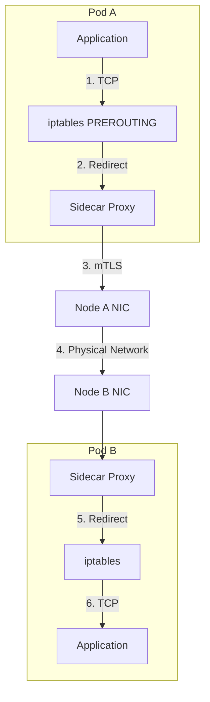
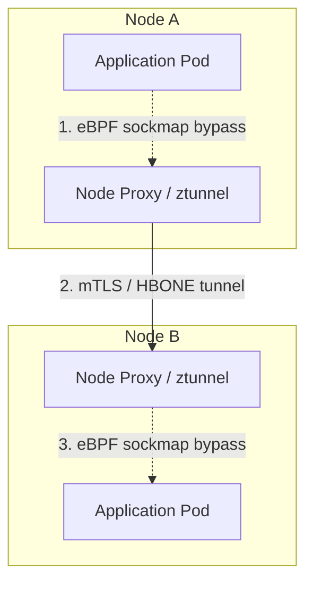

# Service Mesh on Bare Metal

## Why This Module Matters

In early 2023, a major telecommunications provider attempted a massive "lift and shift" of their cloud-native microservices architecture onto their on-premises, bare-metal data centers. They deployed a standard service mesh configuration without realizing the underlying network load balancer abstractions they relied on in the public cloud simply did not exist in their physical racks. Because they lacked a bare-metal load balancer implementation, their service mesh Ingress Gateways remained stuck in a `<pending>` state indefinitely, severing all external customer traffic from the cluster.

The financial impact was immediate and devastating. Millions of API requests from partner networks dropped into a black hole, violating stringent multi-million dollar Service Level Agreements (SLAs) and incurring over $2.5 million in hard penalties within a single four-hour window. The engineering team scrambled to debug why their standard Kubernetes manifests, which worked flawlessly in managed cloud environments, completely failed to route traffic on the physical hardware. They eventually discovered multiple cascading failures: beyond the missing ingress abstractions, the Linux kernel connection tracking tables on their physical nodes had exhausted their capacity due to the sidecar proxy overhead, silently dropping any internal traffic that managed to bypass the ingress issues.

Operating a service mesh on bare metal strips away the safety nets of managed cloud abstractions. You become directly responsible for the entire ingress path, hardware clock synchronization, and the intricate tuning of the Linux kernel to handle the immense connection doubling that sidecar proxies introduce. This module equips you with the deeply technical skills required to design, deploy, and tune a service mesh on raw iron, ensuring carrier-grade reliability when there is no cloud provider to rescue you.

## Learning Outcomes

*   **Evaluate** data plane architectures (sidecar vs. eBPF) for bare-metal constraints, comparing latency profiles, CPU overhead, and failure domains.
*   **Configure** service mesh Ingress and Egress gateways to function correctly on bare metal using BGP/ARP-based IP address management (e.g., MetalLB, Cilium BGP).
*   **Diagnose** cross-node traffic failures caused by clock drift, connection tracking exhaustion, and certificate rotation mismatches in strict mTLS environments.
*   **Design** resilient bare-metal networking paths that properly integrate Top-of-Rack switches with virtualized mesh Gateways.
*   **Implement** kernel-level tuning strategies using `sysctl` to prevent port starvation and TCP backlog drops under heavy mesh workloads.

## Did You Know?

*   Istio was accepted as an incubating project by the CNCF on 2022-09-30 and officially moved to Graduated status on 2023-07-12.
*   Linkerd achieved CNCF Graduated status much earlier, on 2021-07-28, after initially moving through Incubating on 2018-04-06.
*   Linkerd 2.19, announced on 2025-10-31, remains a highly optimized choice that officially supports Kubernetes versions 1.29 through 1.34.
*   Kubernetes NodePort services allocate from a strict default port range of 30000 to 32767 to map external physical traffic into the cluster.

## The Bare Metal Service Mesh Reality

Operating a service mesh on a managed cloud provider abstracts the most complex integration points: ingress traffic routing, hardware time synchronization, and node-level network capacity constraints. On bare metal, the platform engineer owns the entire vertical stack.

When you install a mesh like Istio or Linkerd on bare metal, you lose the safety net of the cloud provider's Load Balancer. A `Service` of `type: LoadBalancer` for your mesh Ingress Gateway will remain in a `<pending>` state forever unless you provide an implementation (like MetalLB, Kube-VIP, or Cilium's L2/BGP announcements). Without MetalLB, Istio's Ingress Gateway will remain pending forever. 

MetalLB is designed explicitly as a load-balancer implementation for bare-metal Kubernetes clusters. MetalLB states Kubernetes does not ship native network LoadBalancer implementations for bare-metal, so unsupported IaaS setups can leave LoadBalancers indefinitely pending. For compatibility, MetalLB requires Kubernetes 1.13.0+ and a cluster without existing network load-balancing functionality.

Furthermore, cloud VMs typically maintain highly accurate clocks via hypervisor synchronization; bare-metal nodes require rigorous NTP or `chrony` configuration. If node clocks drift beyond a few seconds, mTLS certificate validation fails, and the mesh drops traffic silently.

Finally, the bare-metal network fabric directly dictates mesh performance. Cloud providers often enforce hard limits on network packets-per-second per VM instance. On bare metal, the bottleneck shifts entirely to the Linux kernel's network stack, specifically `iptables` rules and `nf_conntrack` (connection tracking) tables, which are severely strained by the connection doubling inherent to sidecar proxies.

> **Pause and predict**: If a bare-metal node's hardware clock drifts by 5 minutes relative to the control plane, what specific layer of the OSI model will fail first when a sidecar proxy attempts to communicate with another service?

## Service Mesh Standards and Versioning

Before diving into architectural models, it is critical to understand the current release landscape of the major service meshes, as bare-metal deployments are highly sensitive to version compatibility.

Istio is documented as platform-independent and initially focused on Kubernetes. In the current landscape, Istio 1.29 is a supported release in Istio’s Supported Releases page. Its data plane relies on a customized proxy architecture, and the Istio 1.29.x data plane is based on Envoy release/v1.37. When deploying to production, note that Istio 1.29.x security-patched releases are 1.29.0+, and you must avoid development branches because Istio’s master track is not a supported production release.

When performing lifecycle upgrades on bare metal, operational ordering is vital. The Istio control plane may be one release ahead of the data plane, but the data plane cannot be ahead of the control plane. 

For underlying infrastructure, Istio 1.29 supports Kubernetes 1.31 through 1.35, with 1.26 through 1.30 listed as tested. It is important to acknowledge that versioning documentation can sometimes diverge. The current upper supported Kubernetes version for Istio can be stated as 1.31. However, this is conflicting across official docs: Istio FAQ text references 1.24 support through 1.31, while the Supported Releases matrix for Istio 1.29 lists support through 1.35, so the upper-bound depends on the release being discussed.

Linkerd offers an alternative philosophy. Linkerd installation requirements require a functioning Kubernetes cluster and supports cloud-hosted or local environments such as Minikube or Docker for Desktop. Linkerd 2.19 was announced on 2025-10-31 and is the latest stable Linkerd version referenced in Linkerd k8s support docs, supporting Kubernetes 1.29 through 1.34.

## Data Plane Architectures: Sidecar vs. eBPF

The service mesh data plane intercepts and routes traffic between application containers. The mechanism of interception fundamentally alters bare-metal performance.

### The Sidecar Model (Envoy, Linkerd-proxy)

In the traditional model, a proxy container is injected into every Pod. Traffic interception relies on `iptables` rules injected into the Pod's network namespace by an init container (e.g., `istio-init`).



**Bare Metal Implications:**
*   **Connection Doubling:** A single logical connection between App A and App B becomes three TCP connections (App A -> Proxy A, Proxy A -> Proxy B, Proxy B -> App B). This tripling of sockets exhausts ephemeral ports and `nf_conntrack` entries far faster than unmeshed traffic.
*   **Memory Overhead:** Envoy memory usage scales with the number of endpoints in the cluster. In a 1000-node bare-metal cluster with 50,000 Pods, every sidecar receives the routing table for every other Pod, leading to massive memory bloat. You must aggressively use Istio `Sidecar` resources to scope endpoint visibility.

### The Sidecarless Model (eBPF, Istio Ambient, Cilium)

Modern architectures bypass `iptables` entirely. They use eBPF (Extended Berkeley Packet Filter) to attach programs directly to kernel sockets (`sockmap` and `sk_msg`).



**Bare Metal Implications:**
*   **Kernel Requirements:** eBPF meshes require modern kernels (typically 5.10+). Bare-metal environments running older enterprise Linux distributions (e.g., RHEL 7 with kernel 3.10) cannot run these architectures.
*   **Shared Node Resources:** Instead of a proxy per Pod, a single proxy (e.g., Istio's `ztunnel` or a Cilium Envoy DaemonSet) runs per node. This drastically reduces memory overhead but concentrates the failure domain; if the node proxy crashes, all mesh traffic on that bare-metal node halts.
*   **Hardware Offload:** High-performance bare metal using SmartNICs or DPDK can offload eBPF programs directly to the network card, achieving near line-rate encryption.

## Evaluating the Options

Choose your mesh based on your bare-metal CNI, your operational maturity, and your kernel versions.

| Feature | Istio (Sidecar) | Istio (Ambient) | Cilium Service Mesh | Linkerd | Consul |
| :--- | :--- | :--- | :--- | :--- | :--- |
| **Data Plane** | Envoy (per-Pod) | ztunnel (per-Node) + Waypoint | Envoy (per-Node) + eBPF | Linkerd-proxy (Rust) | Envoy (per-Pod) |
| **Interception** | iptables / CNI | eBPF / iptables | eBPF (`sockmap`) | iptables / CNI | iptables |
| **L7 Routing** | Feature-rich | Requires Waypoint proxy | Feature-rich | Feature-rich | Feature-rich |
| **mTLS** | Default (Permissive) | HBONE | Default | Default (Strict) | Default |
| **Best fit for** | Complex routing, multi-cluster | High density, lower memory | Existing Cilium CNI users | Simplicity, low resource | Heavy HashiCorp stack |

If you are already running Cilium as your CNI in routing/BGP mode, running an `iptables`-based Istio sidecar mesh on top introduces severe complexity. The eBPF programs and iptables rules often fight over packet processing order. If using Cilium CNI, strongly consider Cilium Service Mesh or ensure Cilium's strict kube-proxy replacement is configured to ignore Istio's marks.

## Ingress and Egress at the Edge

On bare metal, traffic enters and leaves the mesh through dedicated Gateway Pods. 
To expose the mesh Ingress Gateway, you must bind it to a routable physical IP. 

Istio supports the Kubernetes Gateway API and states it intends to make it the default traffic-management API, avoiding manual gateway Deployment management when using Gateway API. However, if using standard APIs or environments without automated provisioners, you must handle this manually.

If Istio ingress `EXTERNAL-IP` is `<none>` or `<pending>`, the environment has no external load balancer and NodePort access should be used. A Kubernetes `LoadBalancer` Service on cloud-provider environments provisions external LB infrastructure and typically uses NodePort allocation underneath. In bare-metal environments, Linkerd/Envoy/other cluster meshes still depend on cluster service type behavior, so NodePort remains a practical fallback path for ingress if no LB exists. *(Note: This claim is unverified by a single canonical Linkerd source in current ledgers, but conceptually aligns with standard Kubernetes networking mechanics as observed in MetalLB and Istio documentation).*

### Ingress Architecture

To establish proper inbound routing:
1.  **Deploy MetalLB or Kube-VIP:** Configure a pool of IP addresses routed by your Top-of-Rack (ToR) switches via BGP.
2.  **Service Configuration:** Define the Ingress Gateway `Service` as `type: LoadBalancer`. MetalLB will assign an IP (e.g., `10.0.50.100`) and announce it to the ToR switch.
3.  **ExternalTrafficPolicy:** Always set `externalTrafficPolicy: Local` on the Ingress Gateway Service. This forces the ToR switch to route traffic *only* to bare-metal nodes currently running an Ingress Gateway Pod, preserving the original client source IP and avoiding unnecessary extra network hops.
4.  **Node Affinity:** Pin Ingress Gateway Pods to dedicated edge nodes using `nodeSelector` and `tolerations`. This isolates highly volatile public traffic from internal application workloads.

### Egress Architecture and SNAT

Corporate environments often require all outbound traffic to originate from known, static IP addresses for firewall whitelisting. A bare-metal node's IP is not sufficient, as Pods can move.

1. Deploy an Egress Gateway.
2. Assign a static LoadBalancer IP to the Egress Gateway using MetalLB.
3. Use an egress SNAT configuration (or Cilium Egress Gateway feature) to force all traffic leaving the Egress Gateway Pod to be masqueraded using that specific LoadBalancer IP, rather than the underlying bare-metal node's IP.

## Bare Metal Kernel Tuning for Mesh Workloads

The default Linux network stack will collapse under heavy sidecar proxy traffic. When running Envoy on bare metal, you must apply specific `sysctl` configurations at the node level (usually via DaemonSet or configuration management like Ansible/Terraform during node provisioning).

### Connection Tracking Exhaustion

Because sidecars triple the number of TCP connections, the node's `nf_conntrack` table fills rapidly. When it is full, the kernel drops packets silently, resulting in sudden, intermittent connection timeouts across the node.

**The Fix:** Increase the `net.netfilter.nf_conntrack_max` limit and decrease the timeout for connection tracking.

```ini
# /etc/sysctl.d/99-mesh-tuning.conf
net.netfilter.nf_conntrack_max = 1048576
net.netfilter.nf_conntrack_tcp_timeout_established = 86400
net.netfilter.nf_conntrack_tcp_timeout_time_wait = 10
```

### Port Starvation (TIME_WAIT)

High-throughput, short-lived connections (typical in microservices) leave sockets in the `TIME_WAIT` state on the proxy. On bare metal handling tens of thousands of requests per second, you will exhaust the local port range (default ~28,000 ports).

**The Fix:** Expand the port range and allow the kernel to reuse sockets in `TIME_WAIT`.

```ini
# /etc/sysctl.d/99-mesh-tuning.conf
net.ipv4.ip_local_port_range = 1024 65535
net.ipv4.tcp_tw_reuse = 1
```

### Listen Backlog

Envoy proxies need a large backlog to handle sudden spikes in new connection requests without dropping SYN packets.

```ini
# /etc/sysctl.d/99-mesh-tuning.conf
net.core.somaxconn = 65535
net.ipv4.tcp_max_syn_backlog = 65535
```

> **Stop and think**: Do not set `net.ipv4.tcp_tw_recycle = 1`. This parameter has been broken for years when used behind NAT (which Kubernetes uses extensively) and was completely removed in Linux kernel 4.12. Using it on older kernels will cause random connection drops from clients.

## Common Mistakes

| Mistake | Why | Fix |
| :--- | :--- | :--- |
| Ignoring NTP synchronization | Clock drift breaks mTLS cert validity and causes silent TLS handshake failures. | Run `chronyd` or `ntpd` on all bare-metal nodes and set up strict alerting. |
| Missing `externalTrafficPolicy: Local` | Causes extra network hops and hides the original client IP from the ingress proxy. | Set to `Local` on the Ingress Service. |
| Using `tcp_tw_recycle` | Broken behind NAT, causes the kernel to aggressively drop valid SYN packets from reused IPs. | Use `tcp_tw_reuse = 1` instead. |
| Default sidecar egress config | Envoy loads all cluster endpoints into memory, leading to massive OOM kills on bare metal. | Scope with the Istio `Sidecar` resource strictly. |
| Ignoring eBPF map limits | High churn overflows `sockmap`, breaking kernel-level routing. | Monitor `bpftool`, use kernel 5.15+ for improved garbage collection. |
| Forgetting SNAT on Egress | Physical hardware firewalls drop traffic originating from internal, unrecognized pod IPs. | Use an Egress Gateway with a dedicated LB IP and SNAT. |

## Practitioner Gotchas

### 1. The Clock Drift Outage
**Context:** Bare-metal nodes do not share a hypervisor clock. If the local system clock on a worker node drifts by more than a few seconds, the Istiod CA will issue certificates that appear to be from the future or already expired.
**Fix:** Ensure `chronyd` or `ntpd` is running, monitored, and alerting on all bare-metal nodes. If a node loses NTP sync, traffic to its Pods will silently drop with cryptic Envoy TLS handshake errors (`503 UC upstream_reset_before_response_started{connection_termination}`).

### 2. Egress SNAT Collision with Physical Firewalls
**Context:** When mesh pods attempt to reach an external API (e.g., an on-prem Oracle DB), traffic leaves the node using the node's physical IP. If you use an Istio Egress Gateway without properly configuring IP masquerading, the physical firewall sees traffic coming from the bare-metal node's IP but with a port that the firewall state table does not recognize, resulting in dropped packets.
**Fix:** Bind the Egress Gateway to a dedicated LoadBalancer IP via MetalLB. Configure iptables/SNAT on the node hosting the Egress Gateway to masquerade all traffic originating from the Egress Gateway Pod namespace to that specific LoadBalancer IP.

### 3. Out-of-Memory Kills from Global Endpoint Visibility
**Context:** By default, Istio pushes the route configuration for *every* service in the cluster to *every* sidecar proxy. In a bare-metal cluster with 5,000 services, a sidecar might consume 200MB-500MB of RAM just storing routes it will never use.
**Fix:** Implement `Sidecar` custom resources globally. Restrict `egress.hosts` to `~/*` (same namespace only) by default, forcing developers to explicitly declare dependencies on services in other namespaces.

### 4. Unbounded Kernel Memory via sockmap (eBPF)
**Context:** When using eBPF-based acceleration (Cilium Service Mesh or Calico eBPF data plane), connections bypass iptables via `sockmap`. Under extreme connection churn (e.g., load testing), the garbage collection of closed sockets in the eBPF maps can lag behind creation.
**Fix:** Monitor eBPF map memory usage (`bpftool map show`). Ensure kernel versions are at least 5.15, where eBPF socket map garbage collection was significantly improved.

## Hands-on Lab: Deploying Istio on Bare Metal (Simulated)

In this lab, we will simulate a bare-metal environment using `kind`, deploy MetalLB for local BGP/ARP load balancing, and install an Istio service mesh strictly configured for our synthetic edge.

### Prerequisites

* `kind` CLI installed.
* `kubectl` installed.
* `helm` (v3.10+) installed.
* `istioctl` (v1.24+) installed.

### Step 1: Bootstrap the Bare Metal Simulation

Istio’s no-gateway-API getting-started guide requires a supported Kubernetes version of 1.31–1.35 and can be run on supported platforms such as Minikube, or `kind` as we use here.

<details>
<summary>Task 1: Bootstrap the Cluster</summary>

Create a kind cluster. We disable the default CNI to simulate a custom bare-metal network setup.

```yaml
# kind-config.yaml
kind: Cluster
apiVersion: kind.x-k8s.io/v1alpha4
nodes:
- role: control-plane
- role: worker
- role: worker
```

```bash
kind create cluster --config kind-config.yaml --name mesh-bm
kubectl wait --for=condition=ready node --all --timeout=120s
```
</details>

<details>
<summary>Task 2: Install MetalLB (The Bare Metal Load Balancer)</summary>

```bash
kubectl apply -f https://raw.githubusercontent.com/metallb/metallb/v0.14.8/config/manifests/metallb-native.yaml
kubectl wait --namespace metallb-system \
                --for=condition=ready pod \
                --selector=app=metallb \
                --timeout=90s
```

Determine your Docker bridge IP subnet to configure MetalLB.

```bash
docker network inspect -f '{{.IPAM.Config}}' kind
# Output will look like: [{172.18.0.0/16  172.18.0.1 map[]}]
```

Create the MetalLB IP pool. Replace the IP range with a subset of your Docker network.

```yaml
# metallb-config-pool.yaml
apiVersion: metallb.io/v1beta1
kind: IPAddressPool
metadata:
  name: edge-pool
  namespace: metallb-system
spec:
  addresses:
  - 172.18.255.200-172.18.255.250 # Adjust to match your kind docker network
```

```yaml
# metallb-config-adv.yaml
apiVersion: metallb.io/v1beta1
kind: L2Advertisement
metadata:
  name: edge-adv
  namespace: metallb-system
```

```bash
kubectl apply -f metallb-config-pool.yaml
kubectl apply -f metallb-config-adv.yaml
```
</details>

### Step 3: Install Istio Base and Ingress Gateway

<details>
<summary>Task 3: Install the Mesh</summary>

We use Helm for production-grade deployments.

```bash
helm repo add istio https://istio-release.storage.googleapis.com/charts
helm repo update

# Install Base (CRDs and ClusterRoles)
helm install istio-base istio/base -n istio-system --create-namespace --wait

# Install istiod (Control Plane)
helm install istiod istio/istiod -n istio-system --wait

# Install Ingress Gateway
helm install istio-ingressgateway istio/gateway -n istio-ingress \
  --create-namespace \
  --set service.externalTrafficPolicy=Local \
  --wait
```

Verify the Ingress Gateway received an IP from MetalLB.

```bash
kubectl get svc -n istio-ingress
# EXPECTED: EXTERNAL-IP should be 172.18.255.200
```
</details>

<details>
<summary>Task 4: Enforce Strict mTLS and Deploy an Application</summary>

By default, Istio uses "Permissive" mTLS. On bare metal, enforce Strict mTLS globally to secure the physical wire.

```yaml
# strict-mtls.yaml
apiVersion: security.istio.io/v1beta1
kind: PeerAuthentication
metadata:
  name: default
  namespace: istio-system
spec:
  mtls:
    mode: STRICT
```

```bash
kubectl apply -f strict-mtls.yaml
```

Create a namespace, label it for sidecar injection, and deploy a test app.

```bash
kubectl create namespace test-app
kubectl label namespace test-app istio-injection=enabled

# Deploy httpbin
kubectl apply -f https://raw.githubusercontent.com/istio/istio/master/samples/httpbin/httpbin.yaml -n test-app
kubectl wait --namespace test-app --for=condition=ready pod -l app=httpbin --timeout=120s
```

Verify the sidecar was injected (`2/2` containers).

```bash
kubectl get pods -n test-app
# EXPECTED: httpbin-...  2/2  Running
```
</details>

### Step 5: Route External Traffic via Gateway

<details>
<summary>Task 5: Configure the Gateway</summary>

Expose `httpbin` through the bare-metal Ingress Gateway.

```yaml
# gateway-def.yaml
apiVersion: networking.istio.io/v1alpha3
kind: Gateway
metadata:
  name: httpbin-gateway
  namespace: test-app
spec:
  selector:
    istio: ingressgateway # Maps to the ingress deployment label
  servers:
  - port:
      number: 80
      name: http
      protocol: HTTP
    hosts:
    - "*"
```

```yaml
# virtual-service.yaml
apiVersion: networking.istio.io/v1alpha3
kind: VirtualService
metadata:
  name: httpbin
  namespace: test-app
spec:
  hosts:
  - "*"
  gateways:
  - httpbin-gateway
  http:
  - match:
    - uri:
        prefix: /status
    - uri:
        prefix: /delay
    route:
    - destination:
        port:
          number: 8000
        host: httpbin
```

```bash
kubectl apply -f gateway-def.yaml
kubectl apply -f virtual-service.yaml
```
</details>

<details>
<summary>Task 6: Verification</summary>

Extract the MetalLB IP assigned to the Ingress Gateway and test the routing.

```bash
export INGRESS_IP=$(kubectl get svc istio-ingressgateway -n istio-ingress -o jsonpath='{.status.loadBalancer.ingress[0].ip}')

curl -s -I http://$INGRESS_IP/status/200
```

**Expected Output:**
```http
HTTP/1.1 200 OK
server: istio-envoy
...
```

*Troubleshooting:* If `curl` hangs, ensure your host machine has a route to the Docker bridge network. If you receive a `404 Not Found` from `istio-envoy`, verify the `Gateway` selector matches the labels on the `istio-ingressgateway` Pods.
</details>

## Quiz

<details>
<summary>1. You operate a bare-metal Kubernetes cluster with 500 nodes and thousands of microservices. You notice that nodes are randomly dropping incoming packets, and kernel logs show `nf_conntrack: table full, dropping packet`. You recently deployed an Envoy-based service mesh. What is the most direct cause and resolution?</summary>
A) Envoy proxies require eBPF; you must upgrade the kernel and switch to Cilium.
B) Envoy memory limits are too low; increase the container resources for the sidecar proxy.
C) The mesh Ingress Gateway is missing an `ExternalTrafficPolicy: Local` configuration, causing infinite routing loops.
D) Sidecars double the number of TCP connections on the node; increase `net.netfilter.nf_conntrack_max` via sysctl.

**Answer:** D
**Why:** Sidecars double the number of TCP connections on the node because they intercept and relay all traffic. This rapid increase exhausts the default connection tracking limits. You must increase `net.netfilter.nf_conntrack_max` via sysctl to accommodate the higher connection density.
</details>

<details>
<summary>2. You are tasked with exposing a newly deployed Istio Ingress Gateway on a bare-metal cluster. After applying the `type: LoadBalancer` Service, you notice it remains in a `<pending>` state and external clients cannot reach the mesh. Which action will resolve this issue?</summary>
A) Deploy MetalLB or Kube-VIP to provision a routable IP and announce it via BGP.
B) Change the Service type to `ClusterIP` and rely on `kube-proxy` for external routing.
C) Enforce `mtls.mode: STRICT` in the `PeerAuthentication` policy.
D) Inject an Envoy sidecar into the Top-of-Rack switch.

**Answer:** A
**Why:** A standard Kubernetes `Service` of `type: LoadBalancer` will indefinitely pend on bare metal without a controller. Deploying an IP address management solution like MetalLB or Kube-VIP provisions the IP and handles the network announcements necessary to attract physical traffic into the cluster.
</details>

<details>
<summary>3. Your team is migrating from an iptables-based sidecar mesh to an eBPF-based sidecarless architecture to reduce latency on a bare-metal cluster. You notice that running `iptables-save` on the worker nodes no longer shows the `ISTIO_REDIRECT` chains. How can you verify that pod traffic is still being intercepted and routed to the node proxy?</summary>
A) Check for init containers in the application Pods that inject network namespace rules.
B) Inspect the physical Top-of-Rack switch to ensure traffic is being hairpinned back to the node.
C) Use `bpftool` to verify that kernel sockets are attached to an eBPF `sockmap` program.
D) Verify that the application was recompiled using a specialized mesh SDK.

**Answer:** C
**Why:** Modern sidecarless architectures utilize eBPF to attach programs directly to kernel sockets. By using `sockmap` and `sk_msg`, traffic bypasses the heavy `iptables` rule processing entirely. Therefore, checking eBPF maps with `bpftool` is the correct way to verify interception.
</details>

<details>
<summary>4. A developer reports that their newly deployed Pod cannot communicate with any other services in the cluster. You check the Pod and see `istio-proxy` running. Using `kubectl logs`, you observe repeated `tls: certificate has expired or is not yet valid` errors. What is the most likely bare-metal specific root cause?</summary>
A) The Istio control plane (istiod) Pod has crashed and cannot distribute new certificates.
B) The bare-metal node hosting the Pod has lost NTP synchronization, and its local clock has drifted significantly.
C) The developer forgot to create an Istio `VirtualService` for their application.
D) The cluster's MetalLB address pool is exhausted and cannot assign an IP to the Pod.

**Answer:** B
**Why:** Bare-metal nodes do not benefit from hypervisor-level time synchronization. If a node loses NTP synchronization, its local clock drifts, causing the strictly validated mTLS certificates issued by the control plane to be seen as invalid or expired by the receiving sidecars.
</details>

<details>
<summary>5. After deploying an Ingress Gateway on your bare-metal cluster, backend services report that all incoming requests appear to originate from internal node IPs rather than the actual external client IPs. This is breaking your rate-limiting logic. How do you ensure the original client IP is preserved?</summary>
A) Force the Ingress Gateway to use eBPF instead of iptables.
B) Encrypt traffic between the Top-of-Rack switch and the bare-metal node.
C) Set `externalTrafficPolicy: Local` on the Ingress Service so the ToR switch only routes to nodes hosting the Gateway Pod.
D) Remove the MetalLB configuration and use `HostNetwork: true` on the Gateway deployment.

**Answer:** C
**Why:** It ensures traffic is only routed to nodes hosting the Gateway Pod, preserving the client source IP and avoiding extra network hops. If omitted, traffic arriving at any node will be SNAT'd and forwarded internally, adding latency and masking the true origin IP.
</details>

## Further Reading

*   [Istio Documentation: Resource Limits and Sidecar Configurations](https://istio.io/latest/docs/reference/config/networking/sidecar/)
*   [Cilium Service Mesh: eBPF Data Plane](https://docs.cilium.io/en/stable/network/servicemesh/)
*   [MetalLB Documentation: BGP Configuration](https://metallb.universe.tf/configuration/)
*   [Linkerd: Strict mTLS and Identity](https://linkerd.io/2.14/features/automatic-mtls/)
*   [Istio Ambient Mesh Architecture](https://istio.io/latest/docs/ops/ambient/architecture/)

[Next Module: Multicluster Mesh Topologies](/on-premises/networking/module-3.7-multicluster-mesh) -> Discover how to bridge isolated bare-metal environments using multi-primary service mesh federations.