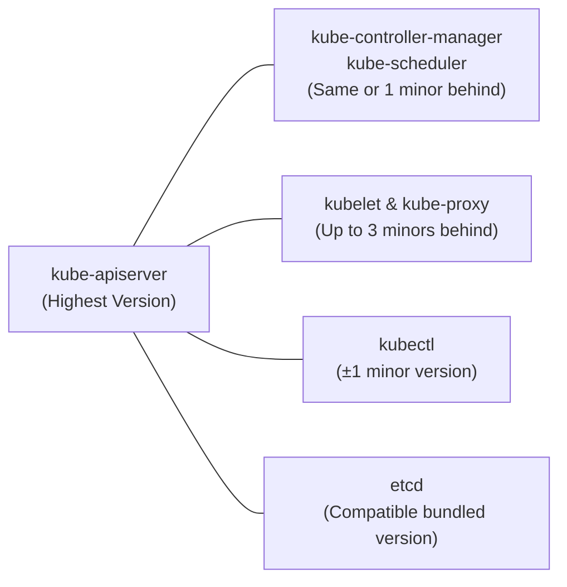
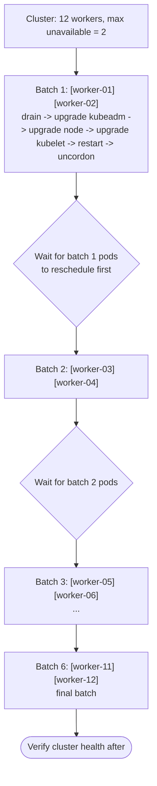

> **Complexity**: `[COMPLEX]` | Time: 60 minutes
>
> **Prerequisites**: [Module 1.3: Cluster Topology](/on-premises/planning/module-1.3-cluster-topology/), [Module 2.4: Declarative Bare Metal](/on-premises/provisioning/module-2.4-declarative-bare-metal/)

---

## Why This Module Matters

In October 2023, a financial services company running a 45-node bare metal Kubernetes cluster needed to upgrade from 1.27 to 1.28. They had been delaying upgrades for nine months because the process was manual, undocumented, and everyone who had done the last upgrade had left the company. When the security team mandated the upgrade due to a CVE in the kubelet, the remaining team attempted it on a Friday afternoon. They upgraded the control plane to 1.28, then upgraded all 45 worker nodes simultaneously. Twenty minutes in, they discovered that three nodes had a different kernel version that was incompatible with the new kubelet. Those nodes entered a crash loop. But the drain had already evicted pods from those nodes, and the cluster was running at 60% capacity. The PodDisruptionBudgets they had configured were ignored because they used `kubectl drain --force`. The result: 4 hours of degraded service, 2 hours of complete outage for stateful workloads, and a rollback that took another 3 hours because nobody had tested it.

The fix was straightforward but required discipline: a staging cluster that mirrors production, a written runbook, one-node-at-a-time rolling upgrades, and rollback procedures tested before the upgrade begins. The CTO's postmortem note: "We treated a bare metal upgrade like a cloud upgrade. It is not. Every node is a snowflake until you prove otherwise."

In the cloud, managed Kubernetes upgrades are a button click with automatic rollback. On bare metal, you are the managed service. Every upgrade is a planned operation that must account for heterogeneous hardware, limited spare capacity, and the absence of a safety net.

---

## What You'll Be Able to Do

After completing this module, you will be able to:

1. **Plan** bare-metal Kubernetes upgrades with staging validation, written runbooks, and tested rollback procedures
2. **Implement** rolling node upgrades that respect PodDisruptionBudgets, drain timeouts, and heterogeneous hardware constraints
3. **Design** a staging cluster that mirrors production hardware and workloads for pre-upgrade validation
4. **Troubleshoot** upgrade failures caused by kernel incompatibilities, deprecated APIs, and node-level configuration drift

---

## What You'll Learn

- kubeadm upgrade workflow for control plane and workers
- Version skew policy and why it matters for rolling upgrades
- Draining nodes with limited spare capacity
- Rolling through heterogeneous hardware (different NICs, kernels, BIOS)
- Rollback strategies when an upgrade goes wrong
- Testing upgrades in staging before touching production

---

## Kubernetes Version Skew Policy

Before upgrading anything, you must understand what version combinations are supported. Kubernetes enforces strict version skew limits between components.



For example, if `kube-apiserver` is at **v1.35**:
- `kube-controller-manager` and `kube-scheduler` can be at **v1.35** or **v1.34**.
- `kubelet` and `kube-proxy` can be at **v1.35**, **v1.34**, **v1.33**, or **v1.32**.
- `kubectl` can be at **v1.36**, **v1.35**, or **v1.34**.

### Why Three-Version Kubelet Skew Matters on Bare Metal

In the cloud, you upgrade all nodes within hours. On bare metal with 200 nodes and maintenance windows, the upgrade might stretch over weeks. The three-version kubelet skew means you can run apiserver at 1.35 while some workers still run kubelet 1.32 -- but 1.31 kubelets would stop working.

```bash
# Check current versions across all nodes
kubectl get nodes -o custom-columns=\
  NAME:.metadata.name,\
  KUBELET:.status.nodeInfo.kubeletVersion,\
  OS:.status.nodeInfo.osImage,\
  KERNEL:.status.nodeInfo.kernelVersion
```

---

## kubeadm Upgrade Workflow

> **Pause and predict**: Before reading the upgrade steps, think about why the first control plane node uses `kubeadm upgrade apply` while subsequent control plane nodes use `kubeadm upgrade node`. What is different about the first node?

### Step 1: Upgrade the First Control Plane Node

The first control plane upgrade is special: `kubeadm upgrade apply` upgrades the cluster-wide components (API server, controller manager, scheduler manifests) and etcd. Subsequent nodes only need to update their local kubelet and static pod manifests.

> **Note**: For Kubernetes versions released after September 13, 2023, you must use the community-owned `pkgs.k8s.io` package repositories, which use per-minor URLs. Legacy apt/yum repos are frozen and no longer receive updates.

```bash
# Check available versions
apt-cache madison kubeadm | head -5

# Unhold packages to allow upgrade
apt-mark unhold kubeadm

# Upgrade kubeadm on the first control plane node
apt-get update && apt-get install -y kubeadm=1.35.3-1.1

# Hold kubeadm to prevent accidental upgrades
apt-mark hold kubeadm

# Verify the upgrade plan
kubeadm upgrade plan

# Apply the upgrade (first control plane only)
kubeadm upgrade apply v1.35.3

# Unhold packages, upgrade kubelet and kubectl, then hold again
apt-mark unhold kubelet kubectl
apt-get install -y kubelet=1.35.3-1.1 kubectl=1.35.3-1.1
apt-mark hold kubelet kubectl
systemctl daemon-reload
systemctl restart kubelet
```

### Step 2: Upgrade Additional Control Plane Nodes

```bash
# On each additional control plane node
apt-mark unhold kubeadm
apt-get update && apt-get install -y kubeadm=1.35.3-1.1
apt-mark hold kubeadm

# Use 'node' instead of 'apply' for additional control planes
kubeadm upgrade node

apt-mark unhold kubelet kubectl
apt-get install -y kubelet=1.35.3-1.1 kubectl=1.35.3-1.1
apt-mark hold kubelet kubectl
systemctl daemon-reload
systemctl restart kubelet
```

### Step 3: Upgrade Worker Nodes (Rolling)

In-place minor kubelet upgrades are not supported. You must drain the node before upgrading the packages.



---

## Draining Nodes with Limited Spare Capacity

On bare metal, you cannot spin up temporary nodes during an upgrade. If your cluster runs at 80% CPU utilization, draining even one node might push the remaining nodes above their limits.

### Capacity Planning Before Drain

```bash
# Check current resource usage across all nodes
kubectl top nodes

# Check how much headroom you have
kubectl get nodes -o json | jq -r '
  .items[] |
  "\(.metadata.name)
    Allocatable CPU: \(.status.allocatable.cpu)
    Allocatable Mem: \(.status.allocatable.memory)"'

# Check PodDisruptionBudgets that might block drains
kubectl get pdb --all-namespaces
```

> **Stop and think**: Your cluster runs at 80% CPU utilization. You need to drain a node for upgrade. Where do those pods go? What happens if the remaining nodes cannot absorb the evicted workloads?

### Safe Drain Procedure

The drain process happens in stages: first cordon the node to prevent new pods from scheduling, then inspect what will be evicted, and finally drain with explicit safety rails. Never use `--force` unless you have a specific reason and understand the consequences.

```bash
# Step 1: Cordon the node (prevent new scheduling)
kubectl cordon worker-07

# Step 2: Check what will be evicted
kubectl get pods --field-selector spec.nodeName=worker-07 \
  --all-namespaces -o wide

# Step 3: Drain with safety rails
kubectl drain worker-07 \
  --ignore-daemonsets \
  --delete-emptydir-data \
  --timeout=300s \
  --pod-selector='app!=critical-singleton'

# NEVER use --force unless you understand the consequences
# --force skips PDB checks and deletes standalone pods
```

### Handling Pods That Refuse to Drain

```bash
# Check which PDB is blocking
kubectl get pdb -A -o wide

# Example output:
# NAMESPACE   NAME        MIN AVAILABLE   ALLOWED DISRUPTIONS
# prod        redis-pdb   2               0

# If allowed disruptions = 0, the drain will hang
# Options:
# 1. Wait for replicas to become healthy
# 2. Scale up the deployment temporarily
kubectl scale deployment redis --replicas=4 -n prod
# Now drain should proceed (3 healthy > 2 min available)
```

---

## Rolling Through Heterogeneous Hardware

On bare metal, not all nodes are identical. You might have three generations of servers with different CPUs, NICs, kernel versions, and firmware. An upgrade that works on one generation might fail on another.

### Categorize Your Hardware

```bash
# Create a hardware inventory
kubectl get nodes -o json | jq -r '
  .items[] | [
    .metadata.name,
    .metadata.labels["node.kubernetes.io/instance-type"] // "unknown",
    .status.nodeInfo.kernelVersion,
    .status.nodeInfo.containerRuntimeVersion,
    .status.nodeInfo.architecture
  ] | @tsv' | sort -k2 | column -t
```

### Upgrade Order by Hardware Generation

```mermaid
flowchart TD
    subgraph Phase 1: Canary
        C1["[dell-r640-01]"]
        C2["[dell-r740-01]"]
        C3["[hp-dl380-01]"]
        M["Monitor for 30 min after each"]
        C1 & C2 & C3 --> M
    end
    
    subgraph Phase 2: Remaining Gen 1
        G1["[dell-r640-02..08]<br>rolling, 2 at a time"]
        N1["Why oldest first?<br>- Oldest hardware is most likely to surface problems<br>- If a kernel incompatibility exists, you find it early<br>- Newest hardware has the most spare capacity as buffer"]
    end
    
    subgraph Phase 3: Gen 2
        G2["[dell-r740-02..15]<br>rolling, 3 at a time"]
    end
    
    subgraph Phase 4: Gen 3
        G3["[hp-dl380-02..20]<br>rolling, 3 at a time<br>(newest hardware last)"]
    end
    
    Phase 1 --> Phase 2 --> Phase 3 --> Phase 4
```

### Pre-flight Checks per Hardware Generation

```bash
#!/bin/bash
# pre-flight-check.sh — run on each node before upgrading
set -euo pipefail

echo "=== Pre-flight Check ==="
echo "Hostname: $(hostname) | Kernel: $(uname -r)"
echo "CPU: $(lscpu | grep 'Model name')"

# Check cgroup v2, disk space, container runtime
grep -q cgroup2 /proc/filesystems || { echo "FAIL: no cgroup v2"; exit 1; }
DISK_FREE=$(df /var/lib/kubelet --output=pcent | tail -1 | tr -d ' %')
[ "$DISK_FREE" -gt 85 ] && { echo "FAIL: disk ${DISK_FREE}%"; exit 1; }
crictl info > /dev/null 2>&1 || { echo "FAIL: runtime down"; exit 1; }
echo "=== All checks passed ==="
```

---

## Rollback Strategies

Rolling back a Kubernetes upgrade is harder than the upgrade itself. You must plan for rollback before you begin.

### Control Plane Rollback

```bash
# kubeadm does NOT have a built-in rollback command
# You must manually downgrade packages

# Step 1: Install the previous kubeadm version
apt-mark unhold kubeadm
apt-get install -y kubeadm=1.34.6-1.1
apt-mark hold kubeadm

# Step 2: Downgrade kubelet and kubectl
apt-mark unhold kubelet kubectl
apt-get install -y kubelet=1.34.6-1.1 kubectl=1.34.6-1.1
apt-mark hold kubelet kubectl
systemctl daemon-reload
systemctl restart kubelet

# Step 3: Restore etcd from backup (if schema changed)
# This is why you ALWAYS back up etcd before upgrading
ETCDCTL_API=3 etcdctl snapshot restore /backup/etcd-pre-upgrade.db \
  --data-dir /var/lib/etcd-restored \
  --name $(hostname) \
  --initial-cluster $(hostname)=https://$(hostname):2380

# Step 4: Swap the etcd data directory
mv /var/lib/etcd /var/lib/etcd-broken
mv /var/lib/etcd-restored /var/lib/etcd

# Step 5: Restore static pod manifests from pre-upgrade backup
# Without this, the control plane containers will still run the newer images
# Note: kubeadm cluster upgrades also create backups under /etc/kubernetes/tmp/kubeadm-backup-manifests-*
cp /backup/manifests-pre-upgrade/* /etc/kubernetes/manifests/
```

> **Pause and predict**: You are about to upgrade your control plane. The etcd snapshot is your safety net. If you skip this step and the upgrade corrupts etcd's WAL format, what are your options for recovery?

### The etcd Backup Rule

This is the single most important step before any control plane upgrade. etcd's Write-Ahead Log format can change between versions, making downgrades impossible without a pre-upgrade snapshot.

```bash
# ALWAYS back up etcd before ANY control plane upgrade
ETCDCTL_API=3 etcdctl snapshot save /backup/etcd-pre-upgrade.db \
  --endpoints=https://127.0.0.1:2379 \
  --cacert=/etc/kubernetes/pki/etcd/ca.crt \
  --cert=/etc/kubernetes/pki/etcd/server.crt \
  --key=/etc/kubernetes/pki/etcd/server.key

# Verify the backup
ETCDCTL_API=3 etcdctl snapshot status /backup/etcd-pre-upgrade.db \
  --write-out=table
```

---

## Testing Upgrades in Staging

On bare metal, your staging cluster should mirror production hardware as closely as possible. This means at least one node from each hardware generation.

### Staging Cluster Requirements

```mermaid
flowchart TD
    subgraph Staging Cluster For Upgrade Testing
        CP["3 control plane nodes<br>(same hardware as production)"]
        W["1 worker per hardware generation"]
        Env["Same CNI, CSI, and ingress controller versions<br>Representative workloads (not production data)"]
    end
    
    subgraph Test Matrix
        T1["kubeadm upgrade: No errors, all nodes Ready"]
        T2["Pod scheduling: Pods schedule on all generations"]
        T3["CNI networking: Pod-to-pod across nodes works"]
        T4["CSI storage: PVCs bind, data persists"]
        T5["Ingress: External traffic routes correctly"]
        T6["DNS: CoreDNS resolves internal names"]
        T7["GPU/SR-IOV: Device plugins register devices"]
        T8["Monitoring: Prometheus scrapes all targets"]
    end
    
    Staging Cluster For Upgrade Testing --> Test Matrix
```

---

## The Complete Upgrade Runbook

Here is the sequence for a production bare metal upgrade:

```mermaid
flowchart TD
    subgraph Preparation
        W2["Week -2: Test upgrade on staging cluster"]
        W1["Week -1: Back up etcd, verify backups, update runbook"]
    end
    
    subgraph Day of Upgrade
        D1["1. Notify stakeholders (email + Slack)"] --> D2["2. Verify etcd backup is fresh (< 1 hour old)"]
        D2 --> D3["3. Record current versions of all components"]
        D3 --> D4["4. Upgrade first control plane node"]
        D4 --> D5["5. Verify apiserver, scheduler, controller-manager healthy"]
        D5 --> D6["6. Upgrade remaining control plane nodes (one at a time)"]
        D6 --> D7["7. Verify control plane quorum"]
        D7 --> D8["8. Upgrade canary worker (1 per hardware generation)"]
        D8 --> D9["9. Monitor for 30 minutes"]
        D9 --> D10["10. Roll through remaining workers in batches of 2-3"]
        D10 --> D11["11. Wait 5 min between batches"]
        D11 --> D12["12. Run smoke tests after final batch"]
        D12 --> D13["13. Update monitoring dashboards for new version"]
        D13 --> D14["14. Send completion notification"]
    end
    
    subgraph Rollback Triggers
        R1["- Any control plane node fails to rejoin<br>- > 5% of pods in CrashLoopBackOff after upgrade<br>- Networking between nodes fails<br>- Storage mounts fail on upgraded nodes"]
    end
```



---

## Did You Know?

- **Kubernetes drops support for a minor version approximately 12 months after release.** On bare metal, where upgrades take longer to plan and execute, this means you should start planning the next upgrade almost immediately after completing the current one. Falling behind two versions is uncomfortable; falling behind three is an emergency.

- **For Kubernetes 1.35 on Linux, the kubelet defaults to cgroups v2 and sets `FailCgroupV1=true` by default.** This means nodes still on legacy cgroups v1 will actively fail to start the kubelet, highlighting the importance of hardware-aware OS upgrades alongside Kubernetes upgrades.

- **The kubelet's three-version skew tolerance was expanded from two in Kubernetes 1.28.** This change was specifically motivated by on-premises and air-gapped environments where upgrading all nodes quickly is impractical. The KEP (Kubernetes Enhancement Proposal) cited large bare metal deployments as the primary beneficiary.

- **etcd upgrades are the riskiest part of a control plane upgrade.** etcd uses a WAL (Write-Ahead Log) format that can change between versions. If the new etcd version migrates the WAL format, you cannot simply roll back to the old binary. This is why etcd backup before upgrade is non-negotiable.

- **Google's internal Borg system inspired Kubernetes, but Google upgrades Borg clusters cell-by-cell across thousands of nodes using a dedicated upgrade service.** On bare metal Kubernetes, you are building that upgrade service yourself with shell scripts and kubeadm.

---

## Common Mistakes

| Mistake | Problem | Solution |
|---------|---------|----------|
| Skipping minor versions | kubeadm only supports +1 minor version upgrades | Upgrade sequentially: 1.33 -> 1.34 -> 1.35 |
| No etcd backup before upgrade | Cannot roll back if etcd schema changes | Always `etcdctl snapshot save` before upgrading |
| Draining all workers at once | Insufficient capacity for running workloads | Roll in batches matching your spare capacity |
| Using `--force` on drain | Skips PDB checks, deletes standalone pods | Use `--timeout` and fix blocked drains properly |
| Not testing on staging | Hardware-specific failures discovered in production | Maintain staging with representative hardware |
| Ignoring version skew | Components stop communicating | Check all component versions before and after |
| Upgrading on Friday afternoon | No time to handle unexpected failures | Schedule upgrades Tuesday-Wednesday morning |
| Not recording pre-upgrade state | Cannot compare before/after | Script the version inventory before starting |

---

## Quiz

### Question 1
You have a 30-node cluster running Kubernetes 1.32 (which is nearing end of life). You need to get to 1.35. What is the correct upgrade path, and how long should you expect it to take on bare metal?

<details>
<summary>Answer</summary>

**Upgrade path: 1.32 -> 1.33 -> 1.34 -> 1.35 (three sequential minor version upgrades).**

kubeadm only supports upgrading one minor version at a time, so you cannot skip from 1.32 to 1.35 directly. The control plane must be upgraded sequentially through 1.33, 1.34, and 1.35. However, thanks to the kubelet's three-version skew policy, a 1.35 API server can still communicate with 1.32 kubelets. This means you have the flexibility to upgrade the control plane rapidly while rolling the worker node upgrades over a longer period. Always plan for extra time on bare metal to validate each step on a staging cluster first, anticipating 6-9 days of active work spread across 3-4 weeks.
</details>

### Question 2
During a worker upgrade cycle, you run `kubectl drain worker-12` but it hangs indefinitely. The node has plenty of spare capacity. What are the most likely causes of this hang, and how do you resolve each safely?

<details>
<summary>Answer</summary>

The most common cause is a PodDisruptionBudget (PDB) blocking eviction. If a deployment has a PDB with `minAvailable` equal to its current healthy replica count, the drain command cannot evict the pod without violating the budget, so it waits indefinitely. You can resolve this by temporarily scaling up the deployment so that evicting one pod still leaves enough replicas to satisfy the PDB. Another cause is a standalone pod without a controller, which requires manual intervention to delete. Finally, pods with stuck finalizers will remain in a Terminating state forever; you must identify the finalizer and resolve the underlying issue (like a stuck volume unmount) before the drain can complete. Never use `--force` to bypass these checks unless you explicitly accept the risk of downtime.
</details>

### Question 3
Your bare-metal cluster runs on three hardware generations: Dell R640, Dell R740, and HPE DL380. After successfully upgrading the control plane to 1.35, you upgrade the kubelet on your first R640 canary node, but it fails to start and reports `NotReady`. The R740 nodes upgrade perfectly. What should you investigate, and why did this happen?

<details>
<summary>Answer</summary>

Hardware-generation-specific failures usually stem from OS-level or kernel incompatibilities rather than Kubernetes itself. Older hardware like the R640 might be running an older OS image or kernel version that lacks support for features required by the new kubelet. For example, in Kubernetes 1.35, the kubelet strictly requires cgroups v2 and sets `FailCgroupV1=true` by default, which will cause it to crash if the node's OS still uses cgroups v1. You should inspect the kubelet logs via `journalctl -u kubelet` to identify the specific error, and verify the kernel and cgroup versions. To resolve this, you must rollback the kubelet on the R640 to the previous version, update the underlying OS to meet the new prerequisites, and then re-attempt the upgrade.
</details>

### Question 4
You have just upgraded your control plane from 1.34 to 1.35. Twenty minutes later, you discover a critical regression in your workloads that requires a rollback. Your etcd was upgraded and has already accepted writes in the 1.35 format. How do you safely roll back to 1.34?

<details>
<summary>Answer</summary>

Rolling back a control plane is complex because kubeadm does not have a built-in downgrade command, and etcd may have migrated its Write-Ahead Log to a new, incompatible format. You cannot simply downgrade the etcd binary; you must restore etcd from the snapshot you took immediately before the upgrade. First, stop the API server on all control plane nodes by moving their static pod manifests out of `/etc/kubernetes/manifests/` to prevent any further writes. Next, use `etcdctl snapshot restore` to recover the previous state, and downgrade the kubeadm, kubelet, and kubectl packages to the 1.34 version. Finally, restore the pre-upgrade static pod manifests from the `/etc/kubernetes/tmp/kubeadm-backup-manifests-*` directory or your manual backup, and restart the kubelet to bring the 1.34 control plane back online. Note that any cluster state changes made during those twenty minutes will be permanently lost.
</details>

---

## Hands-On Exercise: Practice Node Draining and PDB Enforcement

**Task**: Using a kind cluster, practice node draining with PodDisruptionBudgets. Note: kind nodes are containers with pre-baked binaries, so OS-level package upgrades (`apt-get install kubeadm`) cannot be performed. This exercise focuses on the drain/uncordon workflow that is critical during real upgrades.

### Setup

```bash
# Create a kind cluster running a supported version
cat <<'KINDEOF' > /tmp/kind-upgrade-lab.yaml
kind: Cluster
apiVersion: kind.x-k8s.io/v1alpha4
nodes:
  - role: control-plane
    image: kindest/node:v1.34.0
  - role: worker
    image: kindest/node:v1.34.0
  - role: worker
    image: kindest/node:v1.34.0
KINDEOF

kind create cluster --config /tmp/kind-upgrade-lab.yaml --name upgrade-lab
```

### Steps

1. **Record current versions:**
   ```bash
   kubectl get nodes -o wide
   ```

2. **Deploy a test workload with PDB:**
   ```bash
   kubectl create deployment nginx --image=nginx --replicas=3
   kubectl create pdb nginx-pdb --selector=app=nginx --min-available=2
   ```

3. **Practice draining a worker with PDB enforcement:**
   ```bash
   kubectl drain upgrade-lab-worker --ignore-daemonsets --delete-emptydir-data
   # Observe how PDB affects the drain
   ```

4. **Uncordon and verify pod redistribution:**
   ```bash
   kubectl uncordon upgrade-lab-worker
   kubectl get pods -o wide
   ```

5. **Document your observations:** Which pods were evicted? How long did the drain take? Did the PDB prevent disruption below the minimum?

### Success Criteria

- [ ] Recorded all node versions before starting
- [ ] Deployed workload with PDB
- [ ] Successfully drained a node while PDB was active
- [ ] Verified pods rescheduled to remaining nodes
- [ ] Uncordoned and verified cluster returned to normal
- [ ] Documented the process in a runbook format

### Cleanup

```bash
kind delete cluster --name upgrade-lab
```

---

## Next Module

Continue to [Module 7.2: Hardware Lifecycle & Firmware](/on-premises/operations/module-7.2-hardware-lifecycle/) to learn how to manage BIOS updates, disk replacements, and firmware patching without cluster downtime.