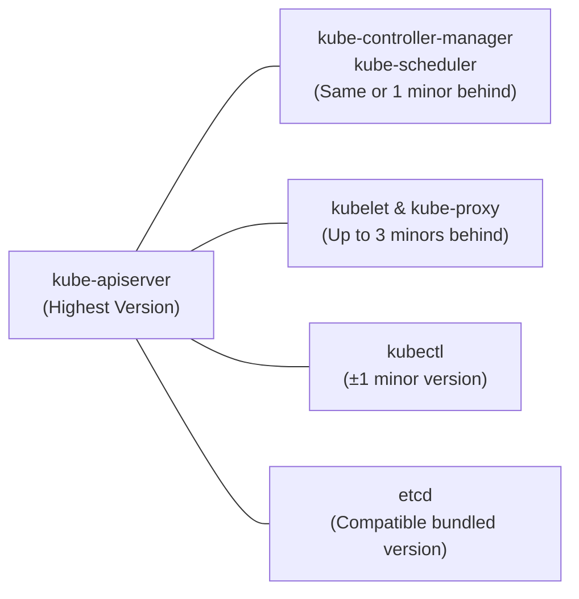
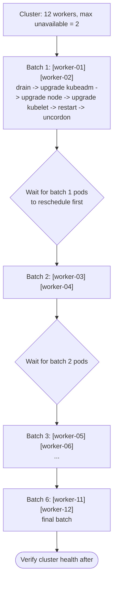
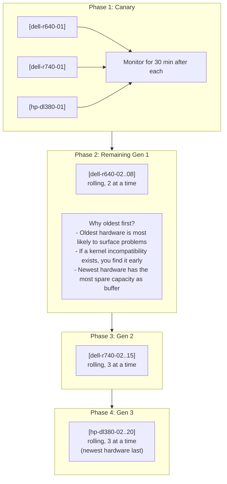
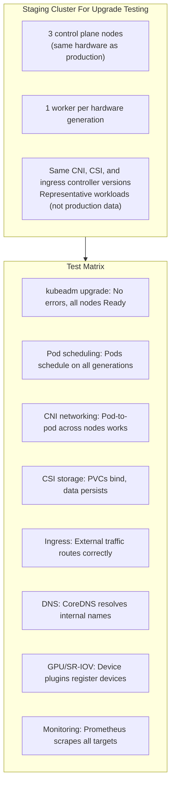
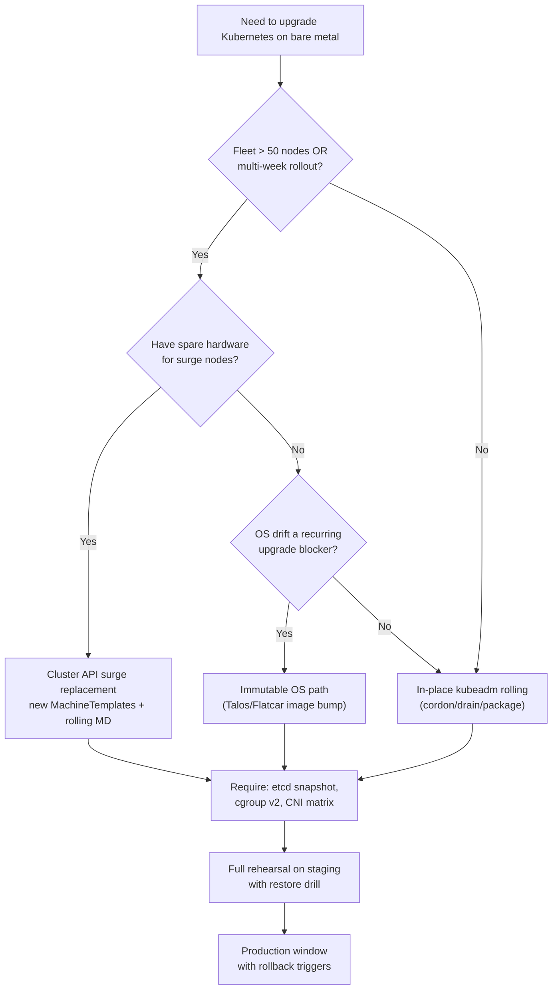

> **Complexity**: `[COMPLEX]` | Time: 60 minutes
>
> **Prerequisites**: [Module 1.3: Cluster Topology](/on-premises/planning/module-1.3-cluster-topology/), [Module 2.4: Declarative Bare Metal](/on-premises/provisioning/module-2.4-declarative-bare-metal/)

---

## What You'll Be Able to Do

After completing this module, you will be able to:

1. **Plan** bare-metal Kubernetes upgrades with staging validation, written runbooks, and tested rollback procedures
2. **Implement** rolling node upgrades that respect PodDisruptionBudgets, drain timeouts, and heterogeneous hardware constraints
3. **Design** a staging cluster that mirrors production hardware and workloads for pre-upgrade validation
4. **Troubleshoot** upgrade failures caused by kernel incompatibilities, deprecated APIs, and node-level configuration drift

---

## Why This Module Matters

**Hypothetical scenario:** A platform team schedules a Friday-evening Kubernetes minor upgrade across a 120-node bare-metal fleet. They skip the staging rehearsal, assume all nodes are identical, and roll workers in batches of ten because the change window is short. By Saturday morning, three hardware generations are running mixed kubelet versions, two control-plane members report etcd WAL errors, and a stateful workload cannot reschedule because PodDisruptionBudgets block drains on an already oversubscribed cluster. Rollback is attempted without a verified etcd snapshot, which turns a reversible software change into a multi-day recovery project.

The fix was straightforward but required discipline: a staging cluster that mirrors production, a written runbook, one-node-at-a-time rolling upgrades, and rollback procedures tested before the upgrade begins. A useful postmortem conclusion is that bare-metal upgrades need rehearsed runbooks, staged rollouts, and validation of node differences before production changes.

In managed Kubernetes services, the provider automates more of the upgrade workflow. On bare metal, you are the managed service. Every upgrade is a planned operation that must account for heterogeneous hardware, limited spare capacity, and the absence of a safety net. The economics differ too: you pay for the servers whether they are upgrading or serving traffic, and every hour of platform engineer time during a failed upgrade is OpEx you cannot invoice to a cloud provider.

---

## What You'll Learn

- kubeadm upgrade workflow for control plane and workers
- Version skew policy and why it matters for rolling upgrades
- Draining nodes with limited spare capacity
- Rolling through heterogeneous hardware (different NICs, kernels, BIOS)
- Rollback strategies when an upgrade goes wrong
- Testing upgrades in staging before touching production

---

## Kubernetes Version Skew Policy

Before upgrading anything, you must understand what version combinations are supported. Kubernetes enforces strict version skew limits between components, and on bare metal those limits interact with slow rolling programs that can stretch across multiple maintenance windows.


```mermaid
flowchart LR
    API["kube-apiserver<br/>(Highest Version)"]
    CM["kube-controller-manager<br/>kube-scheduler<br/>(Same or 1 minor behind)"]
    Kubelet["kubelet & kube-proxy<br/>(Up to 3 minors behind)"]
    Kubectl["kubectl<br/>(±1 minor version)"]
    Etcd["etcd<br/>(Compatible bundled version)"]

    API --- CM
    API --- Kubelet
    API --- Kubectl
    API --- Etcd
```

[For example, if `kube-apiserver` is at **v1.35**:](https://kubernetes.io/releases/version-skew-policy)

- In highly available (HA) control planes, all `kube-apiserver` instances must be within one minor version of each other.
- `kube-controller-manager` and `kube-scheduler` can be at **v1.35** or **v1.34**.
- `kubelet` and `kube-proxy` can be at **v1.35**, **v1.34**, **v1.33**, or **v1.32**.
- `kubectl` can be at **v1.36**, **v1.35**, or **v1.34**.

The skew policy is not merely documentation—it defines the order of operations. Control plane components upgrade first, then kubelets on workers. [Kubernetes explicitly warns that kubelet and kube-proxy instances persistently three minor versions behind the API server must be upgraded before the control plane can advance again](https://kubernetes.io/releases/version-skew-policy). On a 200-node fleet where only ten nodes fit into each maintenance window, that warning becomes a scheduling constraint you must model in the runbook.

### Why Three-Version Kubelet Skew Matters on Bare Metal

In the cloud, you upgrade all nodes within hours. On bare metal with 200 nodes and maintenance windows, the upgrade might stretch over weeks. [The three-version kubelet skew means you can run apiserver at 1.35 while some workers still run kubelet 1.32 -- but 1.31 kubelets would stop working.](https://kubernetes.io/releases/version-skew-policy) The expanded skew tolerance arrived in Kubernetes 1.28 specifically to reduce pressure on large fleets, but it does not remove the obligation to finish worker rollouts before the next control-plane bump.

HA control planes add another wrinkle: if one apiserver is still at 1.34 while another is at 1.35, the allowed kubelet range narrows to versions not newer than the oldest apiserver in the fleet. Mixed control-plane versions during rolling upgrades are normal, but they temporarily tighten what worker versions are valid. Your inventory script should capture apiserver pod images per node, not only `kubeletVersion` on Node objects.

```bash
# Check current versions across all nodes
kubectl get nodes -o custom-columns=\
  NAME:.metadata.name,\
  KUBELET:.status.nodeInfo.kubeletVersion,\
  OS:.status.nodeInfo.osImage,\
  KERNEL:.status.nodeInfo.kernelVersion
```

---

## Control Plane Upgrade Orchestration

The control plane is the blast-radius center of every Kubernetes upgrade. On kubeadm clusters, upgrading it is a sequence of package installs, static-pod manifest rewrites, and—most critically—etcd data directory migrations that you cannot undo without a snapshot taken before the change begins.

### The etcd Snapshot Rule (Non-Negotiable)

[etcd's Write-Ahead Log format can change between versions](https://etcd.io/docs/v3.6/op-guide/recovery/), and kubeadm bundles a compatible etcd version with each Kubernetes release. If you upgrade etcd and later discover a workload regression, downgrading the etcd binary alone does not rewind the on-disk state. The snapshot is your time machine.

```bash
# ALWAYS back up etcd before ANY control plane upgrade
ETCDCTL_API=3 etcdctl snapshot save /backup/etcd-pre-upgrade.db \
  --endpoints=https://127.0.0.1:2379 \
  --cacert=/etc/kubernetes/pki/etcd/ca.crt \
  --cert=/etc/kubernetes/pki/etcd/server.crt \
  --key=/etc/kubernetes/pki/etcd/server.key

# Verify the backup
etcdutl snapshot status /backup/etcd-pre-upgrade.db --write-out=table
```

Run this on a control-plane node with valid client certificates, then copy the snapshot off-node. A backup that lives only on the server you are about to reboot is not a backup. For external etcd clusters, snapshot from a member with quorum healthy and store artifacts in object storage with versioning enabled.

[kubeadm also writes automatic backups under `/etc/kubernetes/tmp/kubeadm-backup-etcd-*` and `kubeadm-backup-manifests-*` during upgrade](https://kubernetes.io/docs/tasks/administer-cluster/kubeadm/kubeadm-upgrade/), but treat those as convenience copies, not your primary recovery path. They disappear when nodes are reimaged, and they are easy to overlook after a long upgrade weekend.

### Graceful API Server Shutdown During etcd Upgrades

Because the `kube-apiserver` static pod runs even on drained control-plane nodes, [an etcd upgrade can stall in-flight requests while the new etcd pod restarts](https://kubernetes.io/docs/tasks/administer-cluster/kubeadm/kubeadm-upgrade/). On bare metal without a managed control-plane SLA, that stall is visible to every client. The upstream workaround is deliberate:

```bash
killall -s SIGTERM kube-apiserver   # graceful apiserver shutdown
sleep 20                            # let in-flight requests complete
kubeadm upgrade apply v1.35.3       # proceed with upgrade
```

Document who runs this step and from which bastion. It is easy to kill the wrong process on a host that also runs workload-adjacent monitoring agents.

### kubeadm Upgrade Workflow

> **Pause and predict**: Before reading the upgrade steps, think about why [the first control plane node uses `kubeadm upgrade apply` while subsequent control plane nodes use `kubeadm upgrade node`](https://kubernetes.io/docs/tasks/administer-cluster/kubeadm/kubeadm-upgrade/). What is different about the first node?

> **Prerequisite**: [Your bare-metal cluster must be running with either static control-plane/etcd pods or an external etcd cluster. `kubeadm upgrade` does not support other control plane topologies.](https://kubernetes.io/docs/tasks/administer-cluster/kubeadm/kubeadm-upgrade/)

The first control plane node executes cluster-wide changes: API server, controller-manager, scheduler manifests, CoreDNS/kube-proxy addon bumps (after all control-plane kubelets match), and etcd when bundled. Additional control-plane nodes only align their local static pods and kubelet configuration with the cluster's declared version.

> **Note**: For Kubernetes versions released after September 13, 2023, [you must use the community-owned `pkgs.k8s.io` package repositories](https://kubernetes.io/docs/tasks/administer-cluster/kubeadm/kubeadm-upgrade/), which use per-minor URLs. Legacy apt/yum repos are frozen and no longer receive updates.

> **Note**: If `kubeadm upgrade apply` fails partway through, it does not fully roll back automatically. You can fix the underlying issue and safely run `kubeadm upgrade apply` again — [kubeadm documents this as a re-runnable upgrade step](https://kubernetes.io/docs/tasks/administer-cluster/kubeadm/kubeadm-upgrade/), not an automatic rollback.

#### Step 1: Upgrade the First Control Plane Node

[The version-skew policy requires draining control-plane nodes before upgrading kubeadm/kubelet on them](https://kubernetes.io/releases/version-skew-policy/) — the same drain discipline as workers applies.

```bash
# Check available versions
apt-cache madison kubeadm | head -5

# Drain the control-plane node before package upgrades
kubectl drain cp-01 --ignore-daemonsets --delete-emptydir-data --timeout=300s

# Unhold packages to allow upgrade
apt-mark unhold kubeadm

# Upgrade kubeadm on the first control plane node
apt-get update && apt-get install -y kubeadm=1.35.3-1.1

# Hold kubeadm to prevent accidental upgrades
apt-mark hold kubeadm

# Verify the upgrade plan
kubeadm upgrade plan

# Apply the upgrade (first control plane only)
kubeadm upgrade apply v1.35.3

# Unhold packages, upgrade kubelet and kubectl, then hold again
apt-mark unhold kubelet kubectl
apt-get install -y kubelet=1.35.3-1.1 kubectl=1.35.3-1.1
apt-mark hold kubelet kubectl
systemctl daemon-reload
systemctl restart kubelet

kubectl uncordon cp-01
```

`kubeadm upgrade plan` is your pre-flight checklist rendered as a table: component config versions, available target releases, and whether the cluster is upgradeable. Run it from a jump host with `admin.conf` before you touch production packages. Patch within the current minor first (`1.35.x` latest), then step minors one at a time—kubeadm does not support skipping versions.

#### Step 2: Upgrade Additional Control Plane Nodes

```bash
# On each additional control plane node
kubectl drain cp-02 --ignore-daemonsets --delete-emptydir-data --timeout=300s

apt-mark unhold kubeadm
apt-get update && apt-get install -y kubeadm=1.35.3-1.1
apt-mark hold kubeadm

# Use 'node' instead of 'apply' for additional control planes
kubeadm upgrade node

apt-mark unhold kubelet kubectl
apt-get install -y kubelet=1.35.3-1.1 kubectl=1.35.3-1.1
apt-mark hold kubelet kubectl
systemctl daemon-reload
systemctl restart kubelet

kubectl uncordon cp-02
```

Since Kubernetes 1.28, kubeadm waits until all control-plane nodes reach the new version before upgrading cluster addons like CoreDNS and kube-proxy. That prevents a half-upgraded HA plane from running addon versions incompatible with older apiservers still serving traffic.

Patch versions matter even within a minor. [The Kubernetes project recommends upgrading to the latest patch before stepping minors](https://kubernetes.io/releases/version-skew-policy)—security fixes land in patches, and kubeadm’s preflight checks assume you are not jumping from an ancient patch to a distant minor. On bare metal with change-averse stakeholders, schedule two micro-windows if needed: patch bump Tuesday, minor bump the following week.

External etcd clusters shift responsibility: kubeadm’s bundled etcd backup folders may be empty when etcd runs outside the node. Your runbook must name etcd endpoints, snapshot credentials, and restore owners explicitly. Losing quorum on external etcd during a control-plane upgrade is identical in user impact to losing stacked etcd—only the file paths differ.

Windows worker nodes follow a parallel but distinct path documented upstream for kubeadm; heterogeneous fleets that mix Linux and Windows require separate batch tracks so Linux drains do not assume Windows kubelet packaging commands. Inventory scripts should tag OS image and package manager family to prevent accidental `apt-get` recipes on Windows hosts.

#### Step 3: Upgrade Worker Nodes (Rolling)

[In-place minor kubelet upgrades are not supported. You must drain the node before upgrading the packages.](https://kubernetes.io/releases/version-skew-policy)


```mermaid
flowchart TD
    Start["Cluster: 12 workers, max unavailable = 2"] --> B1
    B1["Batch 1: [worker-01] [worker-02]<br>drain -> upgrade kubeadm -> upgrade node -> upgrade kubelet -> restart -> uncordon"] --> W1
    W1{"Wait for batch 1 pods<br>to reschedule first"} --> B2
    B2["Batch 2: [worker-03] [worker-04]"] --> W2
    W2{"Wait for batch 2 pods"} --> B3
    B3["Batch 3: [worker-05] [worker-06]<br>..."] --> B6
    B6["Batch 6: [worker-11] [worker-12]<br>final batch"] --> Done
    Done(["Verify cluster health after"])
```

---

## Addon, CNI, and API Deprecation Compatibility

Kubernetes core components are only half the upgrade story. Your CNI, CSI, ingress controller, service mesh, and admission webhooks each carry their own Kubernetes version support matrix—and on bare metal nobody upgrades them for you.

[kubeadm upgrades CoreDNS and kube-proxy after the control plane, but explicitly requires you to upgrade CNI plugins manually](https://kubernetes.io/docs/tasks/administer-cluster/kubeadm/kubeadm-upgrade/). Check the [addons documentation](https://kubernetes.io/docs/concepts/cluster-administration/addons/) for your provider's release notes before scheduling production work. A CNI DaemonSet pinned to an old API version can leave new nodes `NotReady` even when kubeadm reports success.

| Layer | Typical upgrade owner | Pre-upgrade check |
|-------|----------------------|-------------------|
| CNI (Cilium, Calico, Flannel) | Platform team | DaemonSet image + CRD compatibility with target K8s minor |
| CSI (Rook-Ceph, TopoLVM, local-path) | Storage team | Snapshot controller, CSI sidecar versions |
| Ingress / Gateway | App platform | ValidatingWebhook `matchPolicy`, deprecated API versions |
| Service mesh | App platform | Sidecar injector webhook timeouts during apiserver restart |
| Monitoring agents | Observability | HostPath / privileged permissions vs new Pod Security standards |

[The deprecated API migration guide](https://kubernetes.io/docs/reference/using-api/deprecation-guide/) lists APIs removed per minor release. Before jumping to 1.35, scan manifests and Helm releases for versions removed in 1.32–1.35 (for example, flowcontrol `v1beta3` removals). Tools like `pluto` or `kubepug` help, but the authoritative list is the upstream guide—run checks against staging first.

Admission webhooks deserve special attention: validate that your validating and mutating webhooks tolerate new API fields before apiserver upgrades — a webhook that rejects unknown fields can brick `kubectl apply` cluster-wide the moment the new apiserver starts. See the [version skew policy](https://kubernetes.io/releases/version-skew-policy/) for component ordering; webhook compatibility is a separate preflight gate.

### Automating Preflight Checks

Manual spreadsheet matrices do not scale past two minors per year. Encode preflight as CI jobs that run against staging before anyone touches package mirrors:

```bash
# Example: fail CI if deprecated APIs remain (requires pluto or similar installed)
pluto detect-files -d staging-manifests/ --target-versions k8s=v1.35.0

# Verify all nodes report cgroup v2 before change window
kubectl get nodes -o json | jq -r '
  .items[] | select(.status.nodeInfo.operatingSystem == "linux") |
  "\(.metadata.name) cgroup-check-required"'

# Confirm webhook configurations accept v1 admission review versions
kubectl get validatingwebhookconfigurations,mutatingwebhookconfigurations \
  -o json | jq '.items[] | {name: .metadata.name, versions: .webhooks[].admissionReviewVersions}'
```

Treat a failed preflight as a hard gate. On bare metal, the cost of proceeding anyway is measured in hours of console access across multiple datacenters, not a single cloud support ticket.

---

## Node Upgrade Strategies: In-Place vs Surge Replacement

Bare-metal fleets usually start with in-place kubeadm upgrades—cordon, drain, package upgrade, uncordon—because there is no hypervisor to clone a fresh VM. As fleets mature, many teams adopt surge replacement via Cluster API or immutable OS images to shrink per-node toil.

### In-Place Rolling (kubeadm Default)

In-place upgrades reuse existing disks, network bonds, and BMC configurations. They are CapEx-efficient because every server stays in the fleet, but they couple OS kernel state with Kubernetes version state. A kubelet 1.35 upgrade on a host still running cgroup v1 will fail even if packages install cleanly.

[For Kubernetes 1.35, cgroup v1 is deprecated: kubelet sets `failCgroupV1=true` by default and refuses to start on v1 hierarchies](https://kubernetes.io/docs/concepts/architecture/cgroups/). Verify with `stat -fc %T /sys/fs/cgroup/` (`cgroup2fs` is required). Migrating cgroups is an OS exercise—often a reimage—not something `apt-get install kubelet` fixes.

### Surge Replacement via Cluster API

[Cluster API upgrades workload clusters by rolling MachineDeployments and KubeadmControlPlane objects](https://cluster-api.sigs.k8s.io/tasks/upgrading-clusters). You publish a new machine image with pre-baked `kubeadm`/`kubelet` versions, update `MachineTemplate` references (templates are immutable), then bump `KubeadmControlPlane.spec.version`. The controllers create replacement machines, join them, and drain old members—similar to cloud auto repair, but you own the image pipeline.

Surge capacity has a real cost on bare metal: spare servers sitting in staging, extra switch ports, and power draw. The trade is operational—failed upgrades discard a machine instead of debugging a corrupted `/var/lib/kubelet`. For heterogeneous hardware, maintain one golden image per generation and let Machine labels drive rollout order.

### Immutable OS Paths (Talos and Flatcar)

Immutable operating systems treat the node OS as disposable. [Talos provides `talosctl upgrade-k8s` to orchestrate control-plane and worker component bumps](https://www.talos.dev/v1.9/kubernetes-guides/upgrading-kubernetes/), including pre-pulling images and patching machine configuration. Worker kubelet upgrades may restart workloads; plan PDBs accordingly.

The pattern is A/B at the node level: new configuration activates atomically, and rollback means reverting machine config rather than downgrading packages on a mutable OS. This shines when your bottleneck is configuration drift across 400 hand-built servers, but it requires upfront investment in image factories and management-cluster availability.

Flatcar Container Linux and similar projects follow the same philosophy: update streams ship OS and Kubernetes components together, and nodes reboot into new versions. Evaluate whether your compliance regime permits automatic reboots during maintenance windows, and whether BMC power policies support graceful shutdown hooks that kubelet honors.

When choosing between surge replacement and in-place upgrades, estimate mean time to recovery for a failed node. In-place failures often leave corrupted state on disk; surge failures discard the Machine and reprovision from golden images. If reprovision time plus OS bootstrap is shorter than debugging a mutable node, surge wins even without cloud elasticity.

---

## Draining Nodes with Limited Spare Capacity

On bare metal, you cannot spin up temporary nodes during an upgrade. If your cluster runs at 80% CPU utilization, draining even one node might push the remaining nodes above their limits.

### Capacity Planning Before Drain

```bash
# Check current resource usage across all nodes
kubectl top nodes

# Check how much headroom you have
kubectl get nodes -o json | jq -r '
  .items[] |
  "\(.metadata.name)
    Allocatable CPU: \(.status.allocatable.cpu)
    Allocatable Mem: \(.status.allocatable.memory)"'

# Check PodDisruptionBudgets that might block drains
kubectl get pdb --all-namespaces
```

> **Stop and think**: Your cluster runs at 80% CPU utilization. You need to drain a node for upgrade. Where do those pods go? What happens if the remaining nodes cannot absorb the evicted workloads?

Translate utilization into a batch size. If losing one node raises CPU requests above 85% on the remainder, your batch size is one—even if the runbook template says three. [PodDisruptionBudgets count voluntary disruptions](https://kubernetes.io/docs/concepts/workloads/pods/disruptions/); a drain that evicts guarded pods consumes budget that the same upgrade window may need again on the next node.

### Safe Drain Procedure

The drain process happens in stages: first cordon the node to prevent new pods from scheduling, then inspect what will be evicted, and finally drain with explicit safety rails. Never use `--force` unless you have a specific reason and understand the consequences.

```bash
# Step 1: Cordon the node (prevent new scheduling)
kubectl cordon worker-07

# Step 2: Check what will be evicted
kubectl get pods --field-selector spec.nodeName=worker-07 \
  --all-namespaces -o wide

# Step 3: Drain with safety rails
kubectl drain worker-07 \
  --ignore-daemonsets \
  --delete-emptydir-data \
  --timeout=300s \
  --pod-selector='app!=critical-singleton'

# NEVER use --force unless you understand the consequences
# --force allows drain to proceed for unmanaged pods; bypassing PodDisruptionBudgets requires `--disable-eviction`, which is much riskier.
```

### Handling Pods That Refuse to Drain

```bash
# Check which PDB is blocking
kubectl get pdb -A -o wide

# Example output:
# NAMESPACE   NAME        MIN AVAILABLE   ALLOWED DISRUPTIONS
# prod        redis-pdb   2               0

# If allowed disruptions = 0, the drain will hang
# Options:
# 1. Wait for replicas to become healthy
# 2. Scale up the deployment temporarily
kubectl scale deployment redis --replicas=4 -n prod
# Now drain should proceed (3 healthy > 2 min available)
```

---

## Rolling Through Heterogeneous Hardware

On bare metal, not all nodes are identical. You might have three generations of servers with different CPUs, NICs, kernel versions, and firmware. An upgrade that works on one generation might fail on another.

### Categorize Your Hardware

```bash
# Create a hardware inventory
kubectl get nodes -o json | jq -r '
  .items[] | [
    .metadata.name,
    .metadata.labels["node.kubernetes.io/instance-type"] // "unknown",
    .status.nodeInfo.kernelVersion,
    .status.nodeInfo.containerRuntimeVersion,
    .status.nodeInfo.architecture
  ] | @tsv' | sort -k2 | column -t
```

Label nodes with `kubedojo.io/hardware-gen` or similar before upgrades begin. Canary selection should pull one node per generation, not merely the oldest serial number in the CMDB.

### Upgrade Order by Hardware Generation


```mermaid
flowchart TD
    subgraph phase1["Phase 1: Canary"]
        C1["[dell-r640-01]"]
        C2["[dell-r740-01]"]
        C3["[hp-dl380-01]"]
        M["Monitor for 30 min after each"]
        C1 & C2 & C3 --> M
    end
    
    subgraph phase2["Phase 2: Remaining Gen 1"]
        G1["[dell-r640-02..08]<br>rolling, 2 at a time"]
        N1["Why oldest first?<br>- Oldest hardware is most likely to surface problems<br>- If a kernel incompatibility exists, you find it early<br>- Newest hardware has the most spare capacity as buffer"]
    end
    
    subgraph phase3["Phase 3: Gen 2"]
        G2["[dell-r740-02..15]<br>rolling, 3 at a time"]
    end
    
    subgraph phase4["Phase 4: Gen 3"]
        G3["[hp-dl380-02..20]<br>rolling, 3 at a time<br>(newest hardware last)"]
    end
    
    phase1 --> phase2 --> phase3 --> phase4
```

### Pre-flight Checks per Hardware Generation

```bash
#!/bin/bash
# pre-flight-check.sh — run on each node before upgrading
set -euo pipefail

echo "=== Pre-flight Check ==="
echo "Hostname: $(hostname) | Kernel: $(uname -r)"
echo "CPU: $(lscpu | grep 'Model name')"

# Check cgroup v2, disk space, container runtime
grep -q cgroup2 /proc/filesystems || { echo "FAIL: no cgroup v2"; exit 1; }
DISK_FREE=$(df /var/lib/kubelet --output=pcent | tail -1 | tr -d ' %')
[ "$DISK_FREE" -gt 85 ] && { echo "FAIL: disk ${DISK_FREE}%"; exit 1; }
crictl info > /dev/null 2>&1 || { echo "FAIL: runtime down"; exit 1; }
echo "=== All checks passed ==="
```

[The kubelet and container runtime must share a cgroup driver; Kubernetes recommends `systemd` on cgroup v2 hosts](https://kubernetes.io/docs/setup/production-environment/container-runtimes/). A mismatch surfaces during kubelet restart, not during `kubeadm upgrade plan`.

---

## Rollback Strategies and etcd Restore Drills

Rolling back a Kubernetes upgrade is harder than the upgrade itself. You must plan for rollback before you begin, and you must rehearse etcd restore on staging hardware at least quarterly—reading the steps during an outage is too late.

### Control Plane Rollback

```bash
# kubeadm does NOT have a built-in rollback command
# You must manually downgrade packages

# Step 1: Install the previous kubeadm version
apt-mark unhold kubeadm
apt-get install -y kubeadm=1.34.6-1.1
apt-mark hold kubeadm

# Step 2: Downgrade kubelet and kubectl
apt-mark unhold kubelet kubectl
apt-get install -y kubelet=1.34.6-1.1 kubectl=1.34.6-1.1
apt-mark hold kubelet kubectl
systemctl daemon-reload
systemctl restart kubelet

# Step 3: Restore etcd from backup (if schema changed)
# This is why you ALWAYS back up etcd before upgrading
etcdutl snapshot restore /backup/etcd-pre-upgrade.db \
  --data-dir /var/lib/etcd-restored \
  --name $(hostname) \
  --initial-cluster $(hostname)=https://$(hostname):2380 \
  --initial-advertise-peer-urls https://$(hostname):2380

# Step 4: Swap the etcd data directory
mv /var/lib/etcd /var/lib/etcd-broken
mv /var/lib/etcd-restored /var/lib/etcd

# Step 5: Restore static pod manifests from pre-upgrade backup
# Without this, the control plane containers will still run the newer images
# Note: kubeadm cluster upgrades also create backups under /etc/kubernetes/tmp/kubeadm-backup-manifests-*
cp /backup/manifests-pre-upgrade/* /etc/kubernetes/manifests/
# Alternatively, use the automated backup:
# cp /etc/kubernetes/tmp/kubeadm-backup-manifests-*/... /etc/kubernetes/manifests/
```

> **Pause and predict**: You are about to upgrade your control plane. The etcd snapshot is your safety net. If you skip this step and the upgrade corrupts etcd's WAL format, what are your options for recovery?

[Restoring etcd rewinds cluster state](https://etcd.io/docs/v3.6/op-guide/recovery/). Any objects created after the snapshot disappear. Controllers with cached informers may behave inconsistently until watches realign; for Kubernetes workloads, consider revision bump options documented in etcd recovery guides when restoring into a live fleet.

### Quarterly etcd Restore Drill

Run this on staging, not production:

1. Take a snapshot from production (read-only operation).
2. Restore into an isolated three-node etcd cluster using `etcdutl snapshot restore`.
3. Start static-pod apiservers pointed at the restored data.
4. Verify a known Deployment still exists at the expected replica count.
5. Document wall-clock time and who must be paged.

If the drill exceeds your change-window budget, your production rollback plan is aspirational.

---

## Maintenance Windows, Canary Nodes, and Blast-Radius Control

Bare-metal upgrades are change-management exercises as much as technical ones. Define maintenance windows in local time zones where staffing is dense, publish stakeholder notifications, and tie rollback triggers to objective signals—not gut feel.

| Signal | Rollback trigger example |
|--------|-------------------------|
| Control plane | Any apiserver pod crashlooping > 10 minutes after upgrade |
| Workloads | >5% of pods `CrashLoopBackOff` cluster-wide post-batch |
| Networking | CNI health check failures between canary and control nodes |
| Storage | CSI mount failures on upgraded nodes only |
| Data plane | etcd fsync latency > 2× baseline for 15 minutes |

Canary nodes should represent each hardware generation and each rack with top-of-rack diversity. Monitor them for at least one full application SLO window before widening batch size. If your canary runs batch jobs but production runs latency-sensitive RPC, the canary lied.

For HA control planes, never upgrade two members simultaneously. etcd quorum is `(N-1)/2` tolerant; losing two of three members during a bad package mirror strands the cluster even if workers are healthy.

Change advisory boards exist in regulated industries for a reason: they force explicit approvers when blast radius exceeds a threshold. Even without formal CABs, bare-metal Kubernetes upgrades benefit from a two-person rule for control-plane changes—one executor, one verifier reading steps aloud. The verifier holds authority to call rollback without debating politeness.

Freeze non-essential deploys during the window. Application teams shipping new Helm charts while nodes drain compound risk: you cannot tell whether CrashLoopBackOff came from the image or the kubelet. Communicate a code freeze with a clear end time; platform credibility depends on finishing on schedule or escalating early.

---

## Cost Lens: Upgrade Toil vs Managed Control Planes

On bare metal, upgrade costs show up in three ledgers: CapEx, facility OpEx, and engineer OpEx.

**CapEx and facilities:** Servers you bought for production capacity cannot serve workloads while drained. If upgrades require surge machines, that is either idle inventory (depreciating on the balance sheet) or emergency hardware purchases. Power, cooling, and rack space for staging clusters that mirror production are recurring costs—budget them when comparing on-prem TCO to cloud.

**Engineer OpEx:** A managed Kubernetes control plane bundles upgrade orchestration into the provider fee. On bare metal, your platform team owns the pager for apiserver restarts, etcd snapshots, CNI bumps, and rollback drills. Model upgrade frequency: [Kubernetes maintains patch support for roughly twelve months per minor](https://kubernetes.io/releases/version-skew-policy), so falling behind two minors turns planned work into emergency work with overtime labor rates.

**When on-prem upgrades earn their cost:** Steady high utilization (you use servers you already paid for), data gravity (egress and compliance make cloud migration expensive), regulatory requirements for fixed audit trails, and predictable workload growth. **When they do not:** spiky low-utilization clusters where cloud autoscaling and managed upgrades cheaper than staffing a 24/7 platform rotation.

Document upgrade hours per minor version and divide by node count. That metric justifies automation investments—Cluster API, image factories, Talos—and informs finance whether another FTE is cheaper than another rack.

Compare TCO over a three-year hardware refresh cycle, not a single weekend. Managed Kubernetes charges recurring OpEx per control plane and per node; on-prem charges CapEx up front plus power, cooling, rack space, support contracts, and staff. Upgrades sit in the staff line item—if you defer them, security risk rises and emergency upgrades cost premium labor. Finance models that ignore upgrade labor treat on-prem as artificially cheap.

Conversely, cloud burst capacity during upgrades is seductive but expensive at scale: large stateful workloads with egress-heavy traffic may pay more in data transfer than in platform engineer time. The cost lens is not ideological; it is a spreadsheet with honest labor inputs. Platform leaders should present both models with the same availability target so executives choose consciously rather than by vendor marketing.

---

## Designing the Staging Cluster for Upgrade Validation

On bare metal, your staging cluster should mirror production hardware as closely as possible—not merely run the same Kubernetes version on generic VMs. The design goal is to surface generation-specific failures before they block a production drain window. That means at least one physical worker per hardware generation, control-plane nodes built from the same server SKU as production, and network paths that traverse the same leaf switches and VLAN layout your workloads depend on in the real datacenter.

Capacity can be smaller than production, but topology must be representative. If production spreads workers across four racks with BGP anycast services, staging with a single rack hides failover bugs until go-live. Similarly, if production mounts Ceph RBD volumes through a dedicated storage VLAN, staging that uses only local-path volumes will not exercise CSI upgrade paths. Document explicitly what staging is allowed to omit (GPU nodes, SR-IOV, air-gapped registry mirrors) and what must be present for a valid sign-off.

Workloads should be synthetic yet realistic: Deployments with PDBs, StatefulSets with persistent volumes, Jobs that restart frequently, and at least one Helm release that mirrors a production chart version. Use anonymized configuration, not production data, but keep resource requests, affinity rules, and topology spread constraints faithful. The point is to force the scheduler and eviction machinery to behave like production when nodes drain.

Ownership matters in design reviews. Platform engineering owns the staging cluster lifecycle; application teams nominate one service per critical pattern (cache, queue, SQL, gRPC mesh) to run there. Finance should see staging racks as insurance against multi-hour outages, not as “extra” hardware to defer when budgets tighten—depreciation on idle staging servers is cheaper than emergency hardware purchases during a failed upgrade.

### Staging Cluster Requirements


```mermaid
flowchart TD
    subgraph staging["Staging Cluster For Upgrade Testing"]
        CP["3 control plane nodes<br>(same hardware as production)"]
        W["1 worker per hardware generation"]
        Env["Same CNI, CSI, and ingress controller versions<br>Representative workloads (not production data)"]
    end
    
    subgraph testmatrix["Test Matrix"]
        T1["kubeadm upgrade: No errors, all nodes Ready"]
        T2["Pod scheduling: Pods schedule on all generations"]
        T3["CNI networking: Pod-to-pod across nodes works"]
        T4["CSI storage: PVCs bind, data persists"]
        T5["Ingress: External traffic routes correctly"]
        T6["DNS: CoreDNS resolves internal names"]
        T7["GPU/SR-IOV: Device plugins register devices"]
        T8["Monitoring: Prometheus scrapes all targets"]
    end
    
    staging --> testmatrix
```

Run the full production runbook on staging, including notifications (to a test channel) and etcd snapshot restore. Staging that only runs `kubeadm upgrade plan` without draining real workloads misses PDB interactions.

Sign-off criteria should be written before the rehearsal starts: all nodes Ready on the target version, zero deprecated API objects reported by preflight scanners, CNI and CSI health checks green, and a timed etcd restore drill completed within the change-window budget. Capture wall-clock duration per phase; if staging upgrade exceeds half the production window, shrink batch sizes or add surge capacity before scheduling production work.

---

## Troubleshooting Upgrade Failures

When an upgrade fails on bare metal, symptoms cluster around three layers: OS prerequisites, Kubernetes component skew, and addon/webhook incompatibility. A structured troubleshoot path saves hours of random package downgrades.

### kubelet Will Not Start After Package Upgrade

Start with `journalctl -u kubelet -b --no-pager | tail -80`. cgroup v1 rejection in 1.35 presents as fatal errors referencing `failCgroupV1`. Confirm hierarchy with `stat -fc %T /sys/fs/cgroup/` and [compare against upstream cgroup guidance](https://kubernetes.io/docs/concepts/architecture/cgroups/). If the node reports `tmpfs`, schedule an OS migration or reimage before retrying kubelet 1.35.

Runtime mismatches produce different errors: containerd not running, wrong socket path, or cgroup driver disagreement. [Verify kubelet and runtime both use the systemd driver on cgroup v2 hosts](https://kubernetes.io/docs/setup/production-environment/container-runtimes/). On nodes upgraded in-place many times, stale flags in `/var/lib/kubelet/config.yaml` survive package updates—diff against a fresh `kubeadm kubelet config` output from a known-good node.

### API Server CrashLoop After kubeadm upgrade apply

Check static pod manifests in `/etc/kubernetes/manifests/` for image tags that do not match the intended patch version. Inspect `kubectl -n kube-system logs` for the apiserver pod if it briefly starts. etcd TLS errors often indicate clock skew or expired certificates—[kubeadm renews certificates during upgrade unless disabled](https://kubernetes.io/docs/tasks/administer-cluster/kubeadm/kubeadm-certs/). Compare `kubeadm certs check-expiration` before and after.

If etcd fails to start, examine WAL corruption messages. Do not delete data directories impulsively; restore from the pre-upgrade snapshot on a isolated host first. [etcd recovery documentation](https://etcd.io/docs/v3.6/op-guide/recovery/) describes revision bump considerations when controllers must resync.

### Deprecated API Surprises Post-Upgrade

Symptoms include controllers that stop reconciling, Helm releases stuck in pending upgrade, or CRDs that disappear from discovery. Run `kubectl get --raw /metrics` and apiserver audit logs for `410 Gone` responses. Cross-reference [the deprecated API migration guide](https://kubernetes.io/docs/reference/using-api/deprecation-guide/) for the target minor. Fix manifests in Git, re-apply from staging outward—do not hand-patch production without recording the change.

### Node-Level Configuration Drift

Drift is the silent killer of heterogeneous fleets: one worker still points at a decommissioned NTP server, another mounts an old `/etc/fstab` NFS entry, a third never received the firmware bundle that enables ACS on PCIe switches. Before blaming Kubernetes, compare `/etc/kubernetes/kubelet.conf`, containerd config, and kernel cmdline against your configuration management baseline. Immutable OS fleets reduce this class of failure; mutable OS fleets need configuration audits in the upgrade runbook.

Document every troubleshoot session in the runbook appendix with node name, generation label, root cause layer (OS, core, addon), and fix. Patterns repeat across minors—your future self is the primary beneficiary.

### When to Escalate to Vendor or Hardware Support

If kubelet logs show NIC driver panics, RAID battery warnings, or machine check exceptions, software rollback will not help—the node needs hardware service. Capture `dmesg`, BMC event logs, and SMART data before reimaging. Opening a vendor case with incomplete logs wastes days during an upgrade freeze.

For software vendors (CNI, CSI, service mesh), escalate when staging reproduces a failure that blocks PDB-safe drains and no documented workaround exists. Bring etcd snapshot timestamps, apiserver audit excerpts, and exact chart versions. Bare-metal vendors appreciate precise generation labels; software vendors appreciate minimal reproduction manifests.

---

## The Complete Upgrade Runbook

Here is the sequence for a production bare metal upgrade:


```mermaid
flowchart TD
    subgraph Preparation
        W2["Week -2: Test upgrade on staging cluster"]
        W1["Week -1: Back up etcd, verify backups, update runbook"]
    end
    
    subgraph Day of Upgrade
        D1["1. Notify stakeholders (email + Slack)"] --> D2["2. Verify etcd backup is fresh (< 1 hour old)"]
        D2 --> D3["3. Record current versions of all components"]
        D3 --> D4["4. Upgrade first control plane node"]
        D4 --> D5["5. Verify apiserver, scheduler, controller-manager healthy"]
        D5 --> D6["6. Upgrade remaining control plane nodes (one at a time)"]
        D6 --> D7["7. Verify control plane quorum"]
        D7 --> D8["8. Upgrade canary worker (1 per hardware generation)"]
        D8 --> D9["9. Monitor for 30 minutes"]
        D9 --> D10["10. Roll through remaining workers in batches of 2-3"]
        D10 --> D11["11. Wait 5 min between batches"]
        D11 --> D12["12. Run smoke tests after final batch"]
        D12 --> D13["13. Update monitoring dashboards for new version"]
        D13 --> D14["14. Send completion notification"]
    end
    
    subgraph Rollback Triggers
        R1["- Any control plane node fails to rejoin<br>- > 5% of pods in CrashLoopBackOff after upgrade<br>- Networking between nodes fails<br>- Storage mounts fail on upgraded nodes"]
    end
```

---

## Patterns & Anti-Patterns

**Pattern: snapshot-first control-plane upgrades.** Take a verified etcd snapshot before any `kubeadm upgrade apply`, store it off-node, and record the revision hash. This pattern works at any fleet size because it converts an irreversible etcd migration into a reversible decision for the length of your retention policy. Scale by automating snapshot jobs with alerting on failure—not by skipping snapshots when tired.

**Pattern: generation-aware canary batches.** Upgrade one node per hardware generation before widening batch sizes. Heterogeneous bare-metal fleets hide kernel, firmware, and NIC driver differences that homogeneous cloud node pools never expose. When a canary fails, you learn which generation needs an OS reimage instead of blaming Kubernetes.

**Pattern: addon compatibility matrix as a gate.** Maintain a table of CNI, CSI, ingress, and webhook versions certified against each target Kubernetes minor. Block production upgrades until staging passes the full matrix. This pattern prevents the common failure mode where core components upgrade while DaemonSets still speak removed API versions.

**Anti-pattern: big-bang Friday upgrades.** Teams choose Friday to avoid weekday traffic, but Friday failures bleed into weekends without vendor support. The better alternative is Tuesday–Wednesday morning windows with staffed rollback coverage and a rehearsed runbook.

**Anti-pattern: skipping staging because “we only changed one minor.”** Minor releases remove APIs and change defaults (cgroup v1 rejection in 1.35 is a prime example). Staging is cheap compared to production recovery; skipping it is how deprecated webhook API versions reach production.

**Anti-pattern: drain parallelism without capacity math.** Draining three nodes simultaneously on an 80% utilized cluster evicts pods that cannot reschedule, leaving them Pending while PDBs block further drains. Match batch size to measured headroom, not optimism.

**Anti-pattern: treating worker upgrades as “optional follow-up.”** Teams celebrate a green `kubeadm upgrade apply` and defer worker kubelets for weeks. Skew limits turn that deferral into a hard blocker for the next minor, and security patches on kubelet remain unapplied. Treat worker completion as part of the same change ticket with the same rollback window.

Scaling these patterns: small fleets (under twenty nodes) can use spreadsheet runbooks and manual drains; medium fleets benefit from Ansible or Terraform wrappers around kubeadm steps; large fleets should invest in Cluster API or immutable OS tooling because human attention does not scale linearly with node count. The pattern choice is economic—if upgrade weekends happen more than twice a year, automation ROI is usually positive within one hardware generation.

---

## Decision Framework

Use this flowchart when choosing how to upgrade a bare-metal fleet. The goal is matching operational maturity to hardware constraints—not defaulting to in-place kubeadm because it was day-one tooling.


```mermaid
flowchart TD
    Start["Need to upgrade Kubernetes on bare metal"] --> Q1{"Fleet > 50 nodes OR<br>multi-week rollout?"}
    Q1 -->|Yes| Q2{"Have spare hardware<br>for surge nodes?"}
    Q1 -->|No| InPlace["In-place kubeadm rolling<br>(cordon/drain/package)"]
    Q2 -->|Yes| CAPI["Cluster API surge replacement<br>new MachineTemplates + rolling MD"]
    Q2 -->|No| Q3{"OS drift a recurring<br>upgrade blocker?"}
    Q3 -->|Yes| Immutable["Immutable OS path<br>(Talos/Flatcar image bump)"]
    Q3 -->|No| InPlace
    InPlace --> Pre["Require: etcd snapshot,<br>cgroup v2, CNI matrix"]
    CAPI --> Pre
    Immutable --> Pre
    Pre --> Staging["Full rehearsal on staging<br>with restore drill"]
    Staging --> Prod["Production window<br>with rollback triggers"]
```

| Approach | Best when | Tradeoff |
|----------|-----------|----------|
| In-place kubeadm | Small fleets, tight CapEx, homogeneous OS | Couples kernel state to kubelet; slow on drifted nodes |
| Cluster API surge | Medium/large fleets with spare racks | Needs management cluster + image pipeline |
| Immutable OS upgrade | Drift-heavy environments, declarative ops | Learning curve; management plane becomes critical |
| Managed cloud (not on-prem) | Spiky workloads, small platform team | OpEx at scale; data egress and compliance may block |

If cgroup v2 checks fail on any generation, stop and schedule OS remediation before choosing an upgrade mechanism—the mechanism does not matter if kubelet refuses to start.

### Decision Notes for Multi-Cluster and Air-Gapped Fleets

Some on-prem operators run a management cluster that hosts Cluster API controllers while workload clusters stay in isolated network zones. Upgrade decisions then split: management clusters must be upgraded first because they orchestrate Machine objects elsewhere, but management downtime does not automatically pause workload traffic. Document cross-cluster dependencies—Argo CD instances, centralized logging gateways, identity providers—before sequencing upgrades.

Air-gapped environments add mirror and signature verification steps. Package mirrors for `pkgs.k8s.io` must host the target minor before the change window; container image mirrors must contain new control-plane images and pause sandboxes. A common failure mode is upgrading kubeadm while the local registry still serves only the previous minor’s images, producing ImagePullBackOff on static pods with no obvious path to the public internet. Validate mirror completeness with a dry-run pull from a staging node that uses production firewall rules, not from an engineer laptop.

---

## Communicating Upgrades to Application Teams

Platform teams own the kubelet; application teams own availability SLOs. The interface between them is documentation and notice, not surprise drains. Publish an upgrade calendar quarterly with expected maintenance windows, batch sizes, and rollback triggers. For each window, list which namespaces contain workloads that cannot tolerate eviction (singleton Jobs, misconfigured PDBs, bare Pods) and assign owners to remediate before the window opens.

Provide application developers a “drain readiness” checklist: PDBs allow at least one disruption, probes tolerate brief kubelet restarts, graceful termination seconds fit within drain timeouts, and init containers do not block eviction indefinitely. Offer office hours the week before upgrades to review high-risk services. This is cheaper than emergency scaling during a blocked drain.

During execution, stream progress in a shared channel: control-plane phase complete, canary generation results, current batch nodes, and any rollback consideration. After completion, publish a short report with version inventory diff, anomalies encountered, and staging-to-production delta. That report becomes evidence for auditors and input for the next minor’s timeline.

---

## Certificate and Identity Continuity Across Upgrades

[kubeadm upgrade renews certificates it manages unless you pass `--certificate-renewal=false`](https://kubernetes.io/docs/tasks/administer-cluster/kubeadm/kubeadm-certs/). On long-lived bare-metal clusters, upgrades are often the moment certificates rotate—which can break automation that pinned old CA bundles. Before upgrading, export `kubeadm certs check-expiration` output and identify clients (CI pipelines, monitoring scrapers, custom operators) that embed apiserver CA material.

If you integrate with corporate PKI or external etcd, certificate choreography is more manual. Ensure etcd peer certificates trust the same CA after upgrade, and verify load balancers terminating TLS in front of apiservers still forward to healthy backends during rolling control-plane work. kube-vip or HAProxy health checks should observe `/readyz` or equivalent, not merely TCP connect to 6443—an apiserver process can accept connections while admission webhooks fail open or closed unpredictably.

Worker kubelet client certificates also rotate. Nodes with clock drift may fail TLS handshake after renewal; include NTP health in preflight alongside cgroup checks. For clusters using bootstrap tokens for new nodes, confirm token TTLs cover the upgrade weekend if you plan to replace machines.

---

## Post-Upgrade Verification and Baseline Refresh

Finishing `kubeadm upgrade apply` is not the finish line. Post-upgrade verification should be scripted and compared against a baseline captured in step three of the runbook. Minimum checks: all nodes Ready, `kube-system` pods healthy, DNS loopback test from a debug pod, a sample PVC mount, and an ingress fetch through production paths.

Re-run deprecated API scanners—upgrades can expose objects that were grandfathered but now fail controllers. Update monitoring dashboards and alert thresholds: Kubernetes 1.35 component metrics and cardinality may shift; stale alerts cause either silence during incidents or pager storms during benign restarts.

Refresh internal documentation the same day: new default flags, cgroup assumptions, addon versions, and runbook timings. File a short retro within one week capturing batch size accuracy, staging fidelity gaps, and finance-visible hours spent. That retro feeds the next minor’s capacity plan and determines whether surge hardware requests are realistic.

Long-term, build an upgrade metrics dashboard: time per phase, drains blocked by PDBs, nodes requiring OS remediation, and rollbacks invoked. Trends justify automation funding better than anecdotal war stories. When mean worker upgrade time rises release over release, investigate registry latency, image pre-pull policies, and whether hardware generations are aging past comfortable kernel support windows—those are signals to refresh CapEx planning, not just to schedule another weekend.

Keep a versioned runbook artifact in Git tagged with each completed minor (`upgrade-1.35-prod-2026-06`). Auditors and new hires should read what actually happened, not what you intended to happen. Include links to etcd snapshot object-storage paths, CNI chart versions, and the staging sign-off checklist PDF or HTML export. This habit turns upgrades from tribal knowledge into operational inventory—the same inventory finance needs when deciding whether to buy surge servers or approve another platform hire.

---

## Did You Know?

- [**Kubernetes drops support for a minor version approximately 12 months after release.**](https://kubernetes.io/releases/version-skew-policy) On bare metal, where upgrades take longer to plan and execute, this means you should start planning the next upgrade almost immediately after completing the current one. Falling behind two versions is uncomfortable; falling behind three is an emergency.

- **For Kubernetes 1.35 on Linux, the kubelet no longer starts on cgroup v1 nodes by default.** [Kubelet sets `failCgroupV1=true` unless explicitly overridden](https://kubernetes.io/docs/concepts/architecture/cgroups/), which makes cgroup v2 readiness an important prerequisite when refreshing node operating systems and runtimes.

- [**The kubelet's three-version skew tolerance was expanded from two in Kubernetes 1.28.**](https://kubernetes.io/blog/2023/08/15/kubernetes-v1-28-release/) This change reduced the pressure to upgrade every node immediately during slower rolling-upgrade programs.

- **etcd upgrades are the riskiest part of a control plane upgrade.** [etcd uses a WAL format that can change between versions](https://etcd.io/docs/v3.6/op-guide/recovery/), and restoring controllers after rewind requires disciplined drills. etcd backup before upgrade is non-negotiable.

---

## Common Mistakes

| Mistake | Problem | Solution |
|---------|---------|----------|
| Skipping minor versions | kubeadm only supports +1 minor version upgrades | Upgrade sequentially: 1.33 -> 1.34 -> 1.35 |
| No etcd backup before upgrade | Cannot roll back if etcd schema changes | Always `etcdctl snapshot save` before upgrading |
| Draining all workers at once | Insufficient capacity for running workloads | Roll in batches matching your spare capacity |
| Using `--force` or `--disable-eviction` carelessly during drain | `--force` affects unmanaged pods, while `--disable-eviction` bypasses PDB protections | Prefer normal eviction, use timeouts, and fix the blocking condition explicitly |
| Not testing on staging | Hardware-specific failures discovered in production | Maintain staging with representative hardware |
| Ignoring version skew | Components stop communicating | Check all component versions before and after |
| Upgrading on Friday afternoon | No time to handle unexpected failures | Schedule upgrades Tuesday-Wednesday morning |
| Not recording pre-upgrade state | Cannot compare before/after | Script the version inventory before starting |

Upgrade mistakes on bare metal rarely stem from ignorance of `kubeadm` subcommands—they stem from skipping gates that managed services hide: capacity, snapshots, addon matrices, and hardware diversity. Treat every mistake above as a runbook section someone already paid for with outage time.

When you review this table during a retro, mark which rows actually fired during the last minor. Clusters that repeatedly hit the same row need engineering investment, not another reminder email. Recurring PDB drain blocks mean application teams need PDB coaching; recurring cgroup failures mean OS standardization is overdue. Publish the retro summary alongside the upgraded version inventory and audited artifacts so the next minor on bare metal starts from evidence, not memory, folklore, or heroic improvisation.

---

## Quiz

<details>
<summary>1. You have a 30-node cluster running Kubernetes 1.32. The security team mandates an immediate upgrade to 1.35. What is the correct upgrade path, and how does version skew affect your timeline on bare metal?</summary>

The correct upgrade path is 1.32 → 1.33 → 1.34 → 1.35 (three sequential minor version upgrades). `kubeadm` does not support skipping minor versions in a single step. Upgrade the control plane through each minor sequentially, but leverage the three-version kubelet skew to roll workers over a longer window while apiservers advance. Plan maintenance windows per minor for the control plane, and model worker batches so no kubelet falls more than three minors behind the apiserver.
</details>

<details>
<summary>2. During a worker upgrade, `kubectl drain worker-12` hangs despite spare capacity. What are the most likely causes, and how do you resolve each safely?</summary>

The most common cause is a PodDisruptionBudget with zero allowed disruptions—often because `minAvailable` equals current healthy replicas. Temporarily scale the workload up so one eviction still satisfies the PDB. Other causes include bare pods without controllers, pods with blocking finalizers, or local storage pods that cannot reschedule. Inspect `kubectl get pdb -A` and pod events. Avoid `--disable-eviction` unless leadership accepts explicit downtime.
</details>

<details>
<summary>3. Troubleshoot scenario: After upgrading the control plane to 1.35, your first Dell R640 canary fails with `NotReady` while R740 nodes succeed. What deprecated prerequisites and kernel incompatibilities should you investigate first?</summary>

Troubleshoot OS-level prerequisites before blaming hardware age. Kubernetes 1.35 rejects cgroup v1 by default—run `stat -fc %T /sys/fs/cgroup/` on the R640. If it prints `tmpfs`, the kubelet exits by design, which is a kernel/cgroup incompatibility rather than a Kubernetes bug. Check `journalctl -u kubelet` for cgroup errors, verify container runtime cgroup driver alignment against deprecated cgroup v1 layouts, and confirm kernel and containerd versions meet upstream requirements. Roll back the kubelet package, remediate node-level configuration drift on the OS, then retry on the canary.
</details>

<details>
<summary>4. You upgraded the control plane from 1.34 to 1.35 twenty minutes ago and must roll back due to a workload regression. etcd accepted writes on 1.35. What is the safe sequence?</summary>

Stop apiservers from writing new state by moving static manifests out of `/etc/kubernetes/manifests/`. Restore etcd from the pre-upgrade snapshot with `etcdctl snapshot restore` or `etcdutl snapshot restore`, swap data directories, downgrade kubeadm/kubelet/kubectl packages to 1.34, restore manifests from `/etc/kubernetes/tmp/kubeadm-backup-manifests-*`, and restart kubelet. Accept that objects created in the last twenty minutes are lost. Rehearse this on staging quarterly.
</details>

<details>
<summary>5. Design scenario: You must design a staging cluster sign-off checklist before a 1.34→1.35 production upgrade. What hardware, workload, and validation elements are mandatory?</summary>

Design staging with one worker per hardware generation, control-plane SKUs matching production, and the same CNI/CSI/ingress versions. Workloads must include PDB-protected Deployments, StatefulSets with PVCs, and Helm charts at production versions. Mandatory validation: full kubeadm upgrade rehearsal, etcd snapshot restore drill within window budget, deprecated API scan clean, and CNI connectivity tests across racks. Sign-off is a written checklist, not verbal assent in Slack.
</details>

<details>
<summary>6. Scenario: Your CNI vendor certifies version 1.15 for Kubernetes 1.34 but has not published 1.35 support. Control plane upgrades are scheduled next week. What do you do?</summary>

Delay the production control-plane bump until the CNI matrix certifies 1.35 or you validate a newer CNI release in staging. kubeadm will upgrade apiservers regardless of CNI readiness, and new nodes may fail CNI health checks while DaemonSets run outdated hooks. This is an addon gate, not a Kubernetes gate—escalate with the vendor, test release candidates on staging hardware, and treat CNI as part of the upgrade critical path.
</details>

<details>
<summary>7. Scenario: Finance asks why you need four spare servers during upgrades when cloud would “just upgrade.” How do you explain the on-prem economics?</summary>

On bare metal, drained nodes stop earning their CapEx while still depreciating; surge machines are insurance, not optional fluff. Cloud bundles upgrade labor into OpEx; you pay platform engineers and carry pager risk. Steady high utilization and data gravity justify on-prem, but only if upgrades are rehearsed to minimize downtime. Present measured upgrade hours per minor, etcd drill results, and downtime avoided by PDB-aware rolling—not a generic “cloud is expensive” argument.
</details>

<details>
<summary>8. Scenario: Cluster API manages your workers. You bumped `KubeadmControlPlane.spec.version` but old Machines remain. What likely happened?</summary>

MachineTemplates are immutable—patching only the version field without a new template referencing an updated OS image leaves Machines unchanged. Copy the template, update the image with pre-installed kubeadm/kubelet matching the target version, update `infrastructureRef`, then let controllers roll. For workers, update `MachineDeployment` templates similarly. Verify management-cluster provider compatibility with the target Kubernetes minor before starting.
</details>

---

## Hands-On Exercise: Practice Node Draining and PDB Enforcement

**Task**: Using a kind cluster, practice node draining with PodDisruptionBudgets. Note: kind nodes are containers with pre-baked binaries, so OS-level package upgrades (`apt-get install kubeadm`) cannot be performed. This exercise focuses on the drain/uncordon workflow that is critical during real upgrades.

### Setup

```bash
# Create a kind cluster running a supported version
cat <<'KINDEOF' > /tmp/kind-upgrade-lab.yaml
kind: Cluster
apiVersion: kind.x-k8s.io/v1alpha4
nodes:
  - role: control-plane
    image: kindest/node:v1.34.0
  - role: worker
    image: kindest/node:v1.34.0
  - role: worker
    image: kindest/node:v1.34.0
KINDEOF

kind create cluster --config /tmp/kind-upgrade-lab.yaml --name upgrade-lab
```

### Steps

1. **Record current versions:**
   ```bash
   kubectl get nodes -o wide
   ```

2. **Deploy a test workload with PDB:**
   ```bash
   kubectl create deployment nginx --image=nginx --replicas=3
   kubectl create pdb nginx-pdb --selector=app=nginx --min-available=2
   ```

3. **Practice draining a worker with PDB enforcement:**
   ```bash
   kubectl drain upgrade-lab-worker --ignore-daemonsets --delete-emptydir-data
   # Observe how PDB affects the drain
   ```

4. **Uncordon and verify pod redistribution:**
   ```bash
   kubectl uncordon upgrade-lab-worker
   kubectl get pods -o wide
   ```

5. **Document your observations:** Which pods were evicted? How long did the drain take? Did the PDB prevent disruption below the minimum?

### Success Criteria

- [ ] Recorded all node versions before starting
- [ ] Deployed workload with PDB
- [ ] Successfully drained a node while PDB was active
- [ ] Verified pods rescheduled to remaining nodes
- [ ] Uncordoned and verified cluster returned to normal
- [ ] Documented the process in a runbook format

### Cleanup

```bash
kind delete cluster --name upgrade-lab
```

---

## Next Module

Continue to [Module 7.2: Hardware Lifecycle & Firmware](/on-premises/operations/module-7.2-hardware-lifecycle/) to learn how to manage BIOS updates, disk replacements, and firmware patching without cluster downtime.

## Sources

- [Kubernetes Version Skew Policy](https://kubernetes.io/releases/version-skew-policy) — Supported minor-version skew between kube-apiserver, controller-manager, scheduler, kubelet, kube-proxy, and kubectl; upgrade ordering requirements.
- [Upgrading kubeadm Clusters (v1.35)](https://v1-35.docs.kubernetes.io/docs/tasks/administer-cluster/kubeadm/kubeadm-upgrade/) — kubeadm upgrade apply/node workflow, drain expectations, pkgs.k8s.io repository guidance, etcd downtime mitigation, and recovery backups.
- [kubectl drain Reference](https://v1-35.docs.kubernetes.io/docs/reference/kubectl/generated/kubectl_drain/) — Cordon/drain/uncordon behavior, eviction semantics, daemonset handling, and PDB interaction.
- [Disruptions](https://kubernetes.io/docs/concepts/workloads/pods/disruptions/) — PodDisruptionBudget semantics and voluntary disruption behavior during node drains.
- [Deprecated API Migration Guide](https://kubernetes.io/docs/reference/using-api/deprecation-guide/) — APIs removed per minor release; pre-upgrade manifest scanning requirements.
- [About cgroup v2](https://kubernetes.io/docs/concepts/architecture/cgroups/) — cgroup v2 requirements and cgroup v1 deprecation with `failCgroupV1` default in Kubernetes 1.35.
- [Container Runtimes](https://kubernetes.io/docs/setup/production-environment/container-runtimes/) — cgroup driver alignment between kubelet and containerd/CRI-O on Linux nodes.
- [etcd Disaster Recovery](https://etcd.io/docs/v3.6/op-guide/recovery/) — Snapshot, restore, and revision considerations when rolling back control-plane state.
- [Cluster API: Upgrading Clusters](https://cluster-api.sigs.k8s.io/tasks/upgrading-clusters) — MachineTemplate immutability, KubeadmControlPlane version bumps, and MachineDeployment rolling strategies.
- [Talos: Upgrading Kubernetes](https://www.talos.dev/v1.9/kubernetes-guides/upgrading-kubernetes/) — Immutable-OS upgrade orchestration with `talosctl upgrade-k8s` and machine configuration patching.
- [Installing Addons](https://kubernetes.io/docs/concepts/cluster-administration/addons/) — CNI and cluster addon upgrade ownership outside kubeadm core components.
- [Certificate Management with kubeadm](https://kubernetes.io/docs/tasks/administer-cluster/kubeadm/kubeadm-certs/) — Certificate renewal behavior during `kubeadm upgrade` and renewal opt-out flags.
- [Kubernetes v1.28 Release Announcement](https://kubernetes.io/blog/2023/08/15/kubernetes-v1-28-release/) — kubelet/kube-proxy skew expansion from n-2 to n-3 for large rolling upgrade windows.
