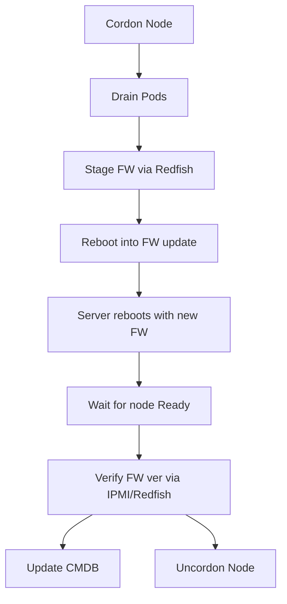

> **Complexity**: `[COMPLEX]` | Time: 60 minutes
>
> **Prerequisites**: [Module 7.1: Kubernetes Upgrades on Bare Metal](../module-7.1-upgrades/), [Module 2.1: Datacenter Fundamentals](/on-premises/provisioning/module-2.1-datacenter-fundamentals/)

---

## Why This Module Matters

In February 2024, a healthcare company running a 70-node bare metal Kubernetes cluster received a critical BIOS vulnerability advisory from Dell. The CVE allowed privilege escalation through the BMC interface, and their compliance team gave them 30 days to patch all servers. The infrastructure team's first instinct was to schedule a weekend maintenance window, power down all servers, update BIOS via USB drives, and power them back up. That would have meant 4-8 hours of complete cluster downtime -- unacceptable for a system processing patient data 24/7.

Instead, they built a rolling firmware update pipeline: cordon a node, drain its workloads, use the Redfish API to stage the BIOS update, reboot the server into the firmware update mode, wait for it to come back, verify the new BIOS version via IPMI, uncordon, and move to the next node. The process took 12 days but caused zero downtime. Three servers failed to reboot after the BIOS update due to a known bug with their specific DIMM configuration. Because they were updating one node at a time, these failures were contained. The spare capacity absorbed the missing nodes while the team worked with Dell support to recover them.

In the cloud, you never think about BIOS versions or disk firmware. The cloud provider handles it. On bare metal, hardware lifecycle management is a continuous operational responsibility that directly affects your cluster's security posture, reliability, and performance.

---

## What You'll Be Able to Do

After completing this module, you will be able to:

1. **Implement** rolling firmware update pipelines using Redfish/IPMI APIs that patch BIOS and BMC without cluster downtime
2. **Design** a hardware lifecycle management process covering procurement, deployment, maintenance, and decommissioning
3. **Configure** automated hardware health monitoring with IPMI sensors, SMART disk checks, and predictive failure alerts
4. **Plan** disk replacement and memory upgrade procedures that integrate with Kubernetes node drain and cordon workflows

---

## What You'll Learn

- BIOS and firmware update strategies without cluster downtime
- Cordon/drain workflows for hardware maintenance windows
- Disk replacement procedures for running Kubernetes nodes
- Predictive failure detection with SMART monitoring
- Using the Redfish API for out-of-band firmware management
- Building a hardware maintenance calendar

---

## Firmware Update Architecture



### Types of Firmware to Manage

| Component | Update Method | Reboot Required | Risk Level |
|-----------|--------------|-----------------|------------|
| BIOS/UEFI | Redfish/IPMI, USB, in-band tool | Yes | High |
| BMC/iDRAC/iLO | Redfish API | Usually no | Medium |
| CPU Microcode | BIOS update or OS late-loading | Yes (BIOS) / No (OS) | High |
| NIC firmware | Vendor tool (ethtool, mlxfwmanager) | Sometimes | Medium |
| Disk firmware | Vendor tool (smartctl, perccli) | Sometimes | High |
| GPU & Switch (e.g., NVIDIA DGX H100) | Vendor tool (nvfwupd for VBIOS, NVSwitch, EROT) | Yes | High |
| RAID controller | Vendor CLI (storcli, perccli) | Yes | High |

---

## Cordon and Drain for Maintenance Windows

### The Maintenance Workflow

```bash
#!/bin/bash
# maintenance-drain.sh — safe node drain for hardware maintenance
set -euo pipefail

NODE="$1"
REASON="${2:-hardware-maintenance}"

echo "=== Starting maintenance drain for ${NODE} ==="
echo "Reason: ${REASON}"
echo "Time: $(date -u +%Y-%m-%dT%H:%M:%SZ)"

# Step 1: Label the node with maintenance reason
kubectl label node "$NODE" \
  maintenance.kubedojo.io/reason="$REASON" \
  maintenance.kubedojo.io/started="$(date +%s)" \
  --overwrite

# Step 2: Cordon (prevent new pods)
kubectl cordon "$NODE"

# Step 3: Check what needs to be evicted
POD_COUNT=$(kubectl get pods --field-selector spec.nodeName="$NODE" \
  --all-namespaces --no-headers | wc -l)
echo "Pods to evict: ${POD_COUNT}"

# Step 4: Drain with timeout
kubectl drain "$NODE" \
  --ignore-daemonsets \
  --delete-emptydir-data \
  --timeout=600s \
  --grace-period=60

echo "=== Node ${NODE} drained and ready for maintenance ==="
```

### Post-Maintenance Return

```bash
#!/bin/bash
# maintenance-return.sh — return node to service after maintenance
set -euo pipefail

NODE="$1"

echo "=== Returning ${NODE} to service ==="

# Step 1: Verify the node is Ready
STATUS=$(kubectl get node "$NODE" -o jsonpath='{.status.conditions[?(@.type=="Ready")].status}')
if [ "$STATUS" != "True" ]; then
  echo "WARN: Node not Ready (status: ${STATUS}). Waiting 60s..."
  sleep 60
  STATUS=$(kubectl get node "$NODE" -o jsonpath='{.status.conditions[?(@.type=="Ready")].status}')
  if [ "$STATUS" != "True" ]; then
    echo "FAIL: Node still not Ready. Investigate before uncordoning."
    exit 1
  fi
fi

# Step 2: Verify kubelet version matches cluster
NODE_VERSION=$(kubectl get node "$NODE" -o jsonpath='{.status.nodeInfo.kubeletVersion}')
echo "Node kubelet version: ${NODE_VERSION}"

# Step 3: Uncordon
kubectl uncordon "$NODE"

# Step 4: Remove maintenance labels
kubectl label node "$NODE" \
  maintenance.kubedojo.io/reason- \
  maintenance.kubedojo.io/started-

echo "=== Node ${NODE} returned to service ==="
```

---

## BIOS and Firmware Updates via Redfish

Redfish is the modern replacement for IPMI for out-of-band server management. It provides a RESTful API for firmware updates, power control, and hardware inventory.

> **Pause and predict**: BIOS updates require a server reboot. On bare metal, a reboot means the Kubernetes node goes offline. How would you update BIOS on 40 servers without any cluster downtime?

### Querying Firmware Inventory

Before any firmware update, you need to know what versions are currently running. Redfish provides a REST API to query this information from the BMC without logging into the server's OS.

```bash
# Get current firmware versions via Redfish
curl -sk -u admin:password \
  https://bmc-worker-01.internal/redfish/v1/UpdateService/FirmwareInventory \
  | jq '.Members[] | ."@odata.id"'

# Get specific BIOS version
curl -sk -u admin:password \
  https://bmc-worker-01.internal/redfish/v1/Systems/1/Bios \
  | jq '{BiosVersion: .BiosVersion, Model: .Model}'
```

### Staging a BIOS Update

Staging a firmware update via Redfish means uploading the firmware image to the BMC, which stores it locally and applies it on the next reboot. This two-step process (stage now, apply on reboot) lets you stage firmware on all nodes in parallel without any downtime, then reboot them one at a time.

```bash
# Stage firmware via Redfish SimpleUpdate (Dell iDRAC example)
# The BMC pulls the image from an HTTP server — host the firmware file
# on an internal web server accessible from the BMC management network
curl -sk -u admin:password \
  -X POST \
  -H "Content-Type: application/json" \
  https://bmc-worker-01.internal/redfish/v1/UpdateService/Actions/UpdateService.SimpleUpdate \
  -d '{"ImageURI": "http://internal-web-server/firmware/BIOS_P4GKN_LN_2.19.1.bin",
       "TransferProtocol": "HTTP",
       "@Redfish.OperationApplyTime": "OnReset"}'

# Check update status
curl -sk -u admin:password \
  https://bmc-worker-01.internal/redfish/v1/TaskService/Tasks \
  | jq '.Members'
```

The rolling firmware update script follows the same pattern: for each node, call `maintenance-drain.sh`, stage firmware via Redfish `SimpleUpdate`, trigger a `GracefulRestart` via Redfish, wait for the node to return to `Ready`, verify the new firmware version, and call `maintenance-return.sh`. Add a 5-minute cooldown between nodes to catch issues early.

---

## Disk Replacement Procedures

Disk failures are the most common hardware event in a bare metal cluster. With Ceph or other distributed storage, disk replacement can be non-disruptive -- but the procedure must be followed precisely.

### SMART Monitoring for Predictive Failure

```bash
# Check SMART health on all disks
for DISK in /dev/sd{a..h}; do
  echo "=== ${DISK} ==="
  smartctl -H "$DISK" | grep "SMART overall-health"
  smartctl -A "$DISK" | grep -E "(Reallocated_Sector|Current_Pending|Offline_Uncorrectable)"
done
```

### Key SMART Attributes to Monitor

| Attribute | Warning Threshold | Action |
|-----------|-------------------|--------|
| Reallocated Sector Count | > 0 | Monitor |
| Reallocated Sector Count | > 100 | Replace soon |
| Current Pending Sectors | > 0 | Investigate |
| Offline Uncorrectable | > 0 | Replace soon |
| UDMA CRC Error Count | Rising | Check cable |
| Wear Leveling (SSD) | < 10% | Plan replace |
| Media Wearout (NVMe) | < 10% | Plan replace |

*For NVMe drives, use `nvme smart-log /dev/nvme0n1`. The key field is `percentage_used` (replace at > 90%).*

> **Stop and think**: The SMART data shows `Reallocated_Sector_Count = 52` and `Current_Pending_Sector = 3`. The disk is part of a Ceph OSD. Should you replace it now or wait for it to fail completely? What is the risk of waiting?

### Disk Replacement Workflow (Ceph OSD)

This procedure safely removes a failing disk from a Ceph cluster, replaces it, and re-adds the new disk. The critical step is `ceph osd set noout` -- it prevents Ceph from starting a full rebalance while you are swapping the disk, which would add unnecessary I/O load during the maintenance window.

```bash
# Step 1: Identify the failing disk
ceph osd tree  # find which OSD is on the failing disk

# Step 2: Set OSD noout to prevent rebalancing during replacement
ceph osd set noout

# Step 3: Mark the OSD down and out
ceph osd down osd.5
ceph osd out osd.5

# Step 4: Remove the OSD from the cluster
# (purge removes the OSD from CRUSH, deletes its auth keys, and removes it from the map)
ceph osd purge osd.5 --yes-i-really-mean-it

# Step 5: Physically replace the disk (or wait for datacenter hands)

# Step 6: Prepare the new disk
ceph-volume lvm create --data /dev/sdc

# Step 7: Unset noout to allow rebalancing
ceph osd unset noout

# Step 8: Monitor rebalancing
ceph -w  # watch rebalancing progress
```

### Memory Upgrade Procedure

Unlike disks in a Ceph cluster, memory replacements or upgrades require completely shutting down the node.

1. **Drain the node**: Execute `maintenance-drain.sh <node>`.
2. **Power down**: `ipmitool -I lanplus -H <bmc-ip> -U <user> -P <pass> power off` or via Redfish API.
3. **Hardware intervention**: Swap or add DIMMs. Follow vendor population rules (e.g., populating channels symmetrically to maximize memory bandwidth).
4. **Power on**: `ipmitool -I lanplus -H <bmc-ip> -U <user> -P <pass> power on`.
5. **Verify**: Use BMC/Redfish to ensure no ECC errors are detected during POST.
6. **Return to service**: Execute `maintenance-return.sh <node>`.

---

## The Full Hardware Lifecycle

A complete hardware lifecycle encompasses more than just maintenance windows:

1. **Procurement**: Standardize on fixed SKU configurations (e.g., compute-heavy vs. storage-heavy) to avoid the "snowflake" problem. Ensure hardware vendor compatibility with your Linux kernel and Kubernetes CNI/CSI choices before purchasing.
2. **Deployment**: Automate bare metal provisioning using PXE boot, Metal3 (Cluster API Provider Metal3 v1.12.2), or Tinkerbell. Servers should go from unboxing to joining the Kubernetes cluster automatically. Metal3 utilizes OpenStack Ironic (latest release 2025.2 Flamingo) running as a separate service to expose bare metal provisioning via a Kubernetes-native API.
3. **Maintenance**: See the calendar below for routine operations.
4. **Decommissioning**: Securely wipe disks using `nvme format` or `hdparm` secure erase. Remove the node from the cluster (`kubectl delete node`), revoke its certificates, and clear its BMC IP from the inventory database.

### Annual Hardware Maintenance Calendar

**Monthly:**
- SMART health check on all disks (automated)
- Review BMC event logs for warnings
- Check PSU redundancy status

**Quarterly:**
- Apply critical firmware updates (BIOS, BMC)
- Review NIC firmware versions against vendor advisories
- Test IPMI/Redfish connectivity to all BMCs
- Verify backup power (UPS battery tests)

**Annually:**
- Full hardware inventory audit
- Warranty status review (identify expiring warranties)
- Thermal audit (clean dust filters, check airflow)
- Cable audit (reseat suspect connections)
- Evaluate hardware refresh candidates

**As-needed:**
- Emergency firmware patches (CVEs)
- Disk replacements (SMART alerts)
- Memory DIMM replacements (ECC error alerts)
- PSU replacements (redundancy lost alerts)

---

> **Pause and predict**: The "bathtub curve" predicts high failure rates in the first 90 days and again in years 4-5 of a server's lifecycle. How should your spare inventory strategy differ between a brand-new hardware deployment and a fleet entering year 4?

## Prometheus Alerts for Hardware Health

These alerting rules turn SMART data and IPMI sensor readings into actionable notifications. The severity levels map to response times: critical means act within hours, warning means plan a replacement within days.

```yaml
# hardware-alerts.yaml — Prometheus alerting rules
groups:
  - name: hardware-health
    rules:
      - alert: DiskSmartPrefailure
        expr: smartmon_device_smart_healthy == 0
        for: 5m
        labels:
          severity: critical
        annotations:
          summary: "Disk SMART prefailure on {{ $labels.instance }}"
          description: "Disk {{ $labels.disk }} reports SMART health check failed."
          runbook: "Follow disk replacement procedure in ops runbook."

      - alert: DiskWearoutHigh
        expr: smartmon_wear_leveling_count_value < 20
        for: 1h
        labels:
          severity: warning
        annotations:
          summary: "SSD wear leveling low on {{ $labels.instance }}"
          description: "Disk {{ $labels.disk }} has {{ $value }}% life remaining."

      - alert: MemoryECCErrors
        expr: node_edac_correctable_errors_total > 100
        for: 10m
        labels:
          severity: warning
        annotations:
          summary: "ECC memory errors on {{ $labels.instance }}"
          description: "{{ $value }} correctable ECC errors detected. DIMM may be failing."

      - alert: PSURedundancyLost
        expr: ipmi_sensor_state{name=~".*PSU.*",state="critical"} == 1
        for: 1m
        labels:
          severity: critical
        annotations:
          summary: "PSU redundancy lost on {{ $labels.instance }}"
          description: "Server is running on a single PSU. Replace failed PSU immediately."
```

---

## Did You Know?

- **Redfish was developed by the DMTF (Distributed Management Task Force) starting in 2014** as a replacement for IPMI. IPMI 2.0 (Revision 1.1, 2004) is the final major version and is now effectively frozen. Redfish uses HTTPS with JSON payloads (current base protocol specification DSP0266 is 1.23.1, dated December 2025, and the latest schema bundle is 2025.4, released January 2026). Modern BMCs like Dell iDRAC10, HPE iLO 6/7, and Lenovo XCC3 support both during this transition period, but IPMI is being aggressively deprecated.
- **The Linux Vendor Firmware Service (LVFS)** and its client `fwupd` (latest stable 2.1.1, March 2026) have revolutionized Linux firmware management. LVFS has delivered over 100 million cumulative firmware updates from over 100 hardware vendors, allowing native in-band updates for components without requiring vendor-specific proprietary binaries.
- **Microsoft's original UEFI Secure Boot certificates (2011 vintage)** begin expiring in June 2026. This requires a fleet-wide update to new 2023-vintage Certificate Authorities to ensure nodes can continue to boot secure operating systems. Planning rolling firmware updates is essential to distribute these new KEK and DB entries seamlessly.
- **OpenBMC** (latest release 2.18, May 2025) is increasingly becoming the foundation for enterprise management controllers. For example, Lenovo's ThinkSystem V4 servers use XClarity Controller 3 (XCC3), which is fully OpenBMC-based and built on an AST2600 chip with a dual-core ARM Cortex-A7.
- **CPU microcode updates** (like Intel's August 2025 release fixing Processor Stream Cache privilege escalation, or AMD's Zen 5 microcode upstreamed in July 2025) are often required outside of regular BIOS update cycles to address critical security flaws.
- **NIST SP 800-193 Platform Firmware Resiliency Guidelines** (published May 2018) is the primary US government standard for firmware resilience, defining core properties for Protection, Detection, and Recovery.
- Foundational standards continue to evolve: the **UEFI specification 2.11** was published in December 2024, **ACPI 6.6** in May 2025, and the **TCG TPM 2.0 Library specification version 1.85** in March 2026, ensuring modern systems support new architectures, hot-plug capabilities, and up-to-date cryptographic standards.
- **The "bathtub curve" describes hardware failure rates**: high failure rate in the first 90 days (infant mortality), low and stable for years (useful life), then rising failure rate as components age (wear-out). Plan your spare inventory accordingly -- you need more spares in the first quarter after a hardware refresh and in years 4-5 of the lifecycle.

---

## Common Mistakes

| Mistake | Problem | Solution |
|---------|---------|----------|
| Updating BIOS on all nodes simultaneously | Cluster-wide outage if update fails | Rolling update, one node at a time |
| No SMART monitoring | Disk failures are surprises | Deploy smartmon_exporter, alert on prefailure |
| Ignoring ECC memory errors | Correctable errors precede uncorrectable ones | Alert on correctable errors, replace DIMMs proactively |
| Skipping BMC firmware updates | BMC vulnerabilities allow remote compromise | Include BMC in firmware update cycle |
| No spare disk inventory | Hours/days waiting for replacement parts | Keep 5-10% spare disks on-site |
| Updating NIC firmware without testing | Network driver compatibility issues | Test NIC firmware in staging first |
| Not documenting which firmware is on which node | Cannot audit compliance, cannot reproduce issues | Maintain CMDB with firmware versions |
| Forgetting to unset Ceph noout after maintenance | Ceph stops rebalancing indefinitely | Script the unset into maintenance-return workflow |

---

## Quiz

### Question 1
You need to update the BIOS on 40 bare metal Kubernetes nodes to patch a critical CVE. Your compliance deadline is 14 days. Each BIOS update requires a reboot that takes approximately 8 minutes. How do you plan this?

<details>
<summary>Answer</summary>

**Plan: Rolling BIOS update, 4 nodes per day, completing in 10 working days.**

By limiting to 4 nodes per day, you maintain spare capacity so that 90% of the cluster remains available to handle peak loads. This batch size allows the team to actively monitor the cluster between updates and catch systemic issues early. If a node fails to return, such as hitting a known boot bug, you have sufficient time to investigate and resolve it before the next batch is processed. The calculation supports this: at ~25 minutes per node (including cordon, drain, staging, and reboot), 4 nodes take roughly 2 hours of active maintenance per day, comfortably meeting the 14-day compliance deadline while leaving a safe buffer.
</details>

### Question 2
A SMART check on `/dev/sdb` shows `Reallocated_Sector_Count = 52` and `Current_Pending_Sector = 3`. The disk is part of a Ceph OSD. What do you do?

<details>
<summary>Answer</summary>

**This disk is showing signs of imminent failure and should be replaced proactively.**

The presence of pending sectors means the drive is already struggling to read data, and waiting for a complete failure significantly increases the risk of data unavailability if another drive fails simultaneously. Ceph's replication protects your data, but that protection is only effective if you act decisively before multiple disks in the same placement group fail. You must immediately set the OSD to `noout`, mark it `down` and `out`, allow the data to safely migrate, and then purge the OSD before physically replacing the drive. Proactive replacement eliminates the performance penalty of sudden failure during peak workloads and ensures the cluster maintains its fault tolerance.
</details>

### Question 3
You are managing firmware updates for a mixed fleet: 20 Dell 17th Gen (iDRAC10), 15 HPE ProLiant (iLO 6), and 10 Lenovo ThinkSystem V4 (XCC3). Each vendor has different Redfish API endpoints and authentication methods. How do you handle this?

<details>
<summary>Answer</summary>

**Build an abstraction layer that maps vendor-specific APIs to a common interface.**

You should build an abstraction layer that maps vendor-specific APIs to a common interface, usually driven by a hardware inventory database. The Redfish standard (with its latest 2025.4 schema) aims for vendor interoperability, but practical implementations often diverge slightly on authentication mechanics, image staging URLs, and task tracking polling. By utilizing an abstraction library like sushy-tools or building vendor-specific adapter scripts around a unified CMDB, you can normalize the deployment pipeline. This ensures your Kubernetes drain and cordon automation remains vendor-agnostic while the underlying adapters handle the specific quirks of iDRAC10, iLO 6/7, or XCC3.
</details>

### Question 4
After a BIOS update, a server fails to boot and sits at a blank screen. The BMC (iDRAC/iLO) is still reachable. What are your recovery options?

<details>
<summary>Answer</summary>

**Recovery options typically start with the least invasive remote methods and escalate to physical intervention.**

Your first step should be to use the BMC's Redfish API or virtual console to trigger a BIOS rollback, as modern BMCs maintain a backup ROM specifically for this scenario. If the rollback fails, resetting the BIOS to factory defaults via the BMC often clears corrupted NVRAM state that prevents POST. You have time to execute these steps safely because the node was already cordoned and drained prior to the update, meaning no Kubernetes workloads are currently impacted by the outage. Should all remote options fail, the final escalation involves physical datacenter hands to clear the CMOS or re-flash the firmware via a dedicated motherboard jumper.
</details>

---

## Hands-On Exercise: Build a Hardware Health Dashboard

**Task**: Deploy SMART monitoring and create Prometheus alerts for disk health.

### Setup

```bash
# Deploy smartmon_exporter (example using node_exporter textfile collector)
cat <<'SMARTEOF' > /tmp/smartmon-collector.sh
#!/bin/bash
# Collects SMART metrics for node_exporter textfile collector
OUTPUT="/var/lib/node_exporter/textfile/smartmon.prom"

for DISK in /dev/sd{a..z}; do
  [ -b "$DISK" ] || continue
  DEVICE=$(basename "$DISK")

  HEALTH=$(smartctl -H "$DISK" 2>/dev/null | grep -c "PASSED" || echo 0)
  echo "smartmon_device_smart_healthy{disk=\"${DEVICE}\"} ${HEALTH}"

  REALLOC=$(smartctl -A "$DISK" 2>/dev/null | awk '/Reallocated_Sector/ {print $10}' || echo 0)
  echo "smartmon_reallocated_sector_count{disk=\"${DEVICE}\"} ${REALLOC:-0}"

  PENDING=$(smartctl -A "$DISK" 2>/dev/null | awk '/Current_Pending/ {print $10}' || echo 0)
  echo "smartmon_current_pending_sector{disk=\"${DEVICE}\"} ${PENDING:-0}"

  # SSD wear leveling (Wear_Leveling_Count or Media_Wearout_Indicator)
  WEAR=$(smartctl -A "$DISK" 2>/dev/null | awk '/Wear_Leveling_Count|Media_Wearout_Indicator/ {print $4}' || echo -1)
  [ "$WEAR" != "-1" ] && echo "smartmon_wear_leveling_count_value{disk=\"${DEVICE}\"} ${WEAR}"
done > "$OUTPUT"
SMARTEOF
chmod +x /tmp/smartmon-collector.sh
```

> **Note:** For this lab, we will simulate the collector's output manually rather than configuring a cron job or node_exporter textfile directory.

### Steps

1. **Apply the Prometheus rules** for disk prefailure conditions (using `for: 0m` for immediate lab verification):
   ```bash
   cat <<'EOF' | kubectl apply -f -
   apiVersion: monitoring.coreos.com/v1
   kind: PrometheusRule
   metadata:
     name: hardware-health-alerts
     namespace: monitoring
     labels:
       prometheus: k8s
   spec:
     groups:
       - name: hardware-health
         rules:
           - alert: DiskSmartPrefailure
             expr: smartmon_device_smart_healthy == 0
             for: 0m
             labels:
               severity: critical
             annotations:
               summary: "Disk SMART prefailure"
           - alert: DiskReallocatedSectors
             expr: smartmon_reallocated_sector_count > 0
             for: 0m
             labels:
               severity: warning
             annotations:
               summary: "Disk has reallocated sectors"
           - alert: DiskPendingSectors
             expr: smartmon_current_pending_sector > 0
             for: 0m
             labels:
               severity: critical
             annotations:
               summary: "Disk has pending sectors"
   EOF
   ```
   **Checkpoint:** Verify the rule was successfully applied:
   ```bash
   kubectl get prometheusrule hardware-health-alerts -n monitoring
   ```

2. **Review the defined escalation thresholds** included in the rule above:
   - Warning: Reallocated sectors > 0
   - Critical: Current pending sectors > 0 or SMART health check failed
3. **Simulate a failure** to test the alert by injecting a false metric. *(Run this directly on a Kubernetes node running node_exporter with textfile collection enabled)*:
   ```bash
   sudo mkdir -p /var/lib/node_exporter/textfile
   echo 'smartmon_device_smart_healthy{disk="sdb"} 0' | sudo tee -a /var/lib/node_exporter/textfile/smartmon.prom
   ```
4. **Verify the alert fires**:
   ```bash
   kubectl port-forward -n monitoring svc/prometheus-k8s 9090:9090 &
   sleep 3
   # Wait for Prometheus to scrape the metric and evaluate the rule (typically 30s)
   sleep 30
   curl -s http://localhost:9090/api/v1/alerts | grep "DiskSmartPrefailure"
   kill %1
   ```
5. **Plan the disk replacement workflow** as a runbook document.

### Success Criteria

- [ ] Understand which SMART attributes indicate imminent failure
- [ ] Can explain the difference between reallocated, pending, and uncorrectable sectors
- [ ] Know the Ceph OSD replacement procedure (noout, out, purge, replace, create)
- [ ] Can use Redfish API to query firmware versions
- [ ] Understand the rolling firmware update workflow (drain, update, reboot, verify, uncordon)

---

## Next Module

Continue to [Module 7.3: Node Failure & Auto-Remediation](/on-premises/operations/module-7.3-node-remediation/) to learn how to detect and automatically recover from node failures using Machine Health Checks and node problem detector.