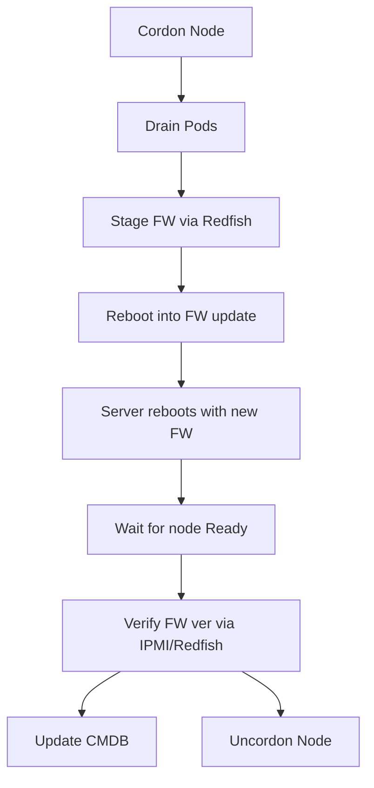
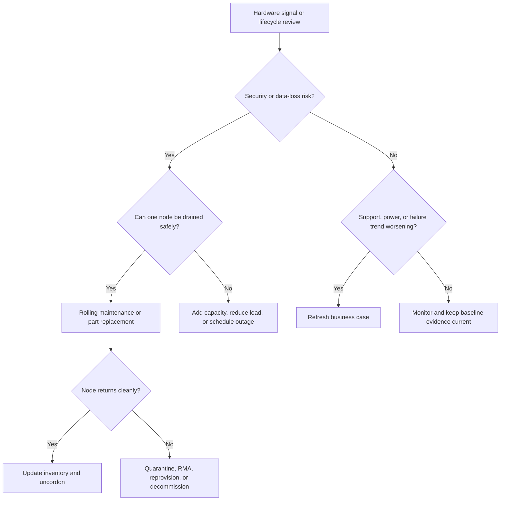

> **Complexity**: `[COMPLEX]` | Time: 60 minutes
>
> **Prerequisites**: [Module 7.1: Kubernetes Upgrades on Bare Metal](../module-7.1-upgrades/), [Module 2.1: Datacenter Fundamentals](../provisioning/module-2.1-datacenter-fundamentals/)

---

## What You'll Be Able to Do

After completing this module, you will be able to:

1. **Implement** rolling firmware update pipelines using Redfish and Kubernetes drain workflows that patch BIOS, BMC, NIC, and disk firmware without taking the cluster offline
2. **Design** a hardware lifecycle program that covers procurement, burn-in, production maintenance, refresh planning, decommissioning, and audit evidence
3. **Configure** hardware health monitoring with BMC sensors, SMART and NVMe telemetry, Prometheus alerts, and escalation thresholds that distinguish warnings from service-impacting failures
4. **Plan** capacity headroom, spare-parts inventory, RMA workflow, and MachineHealthCheck remediation so node failures are absorbed instead of becoming emergency rebuilds
5. **Evaluate** on-premises lifecycle economics, including CapEx timing, support contracts, power and cooling, depreciation, refresh cycles, and the utilization patterns where owned hardware beats cloud rental

---

## Why This Module Matters

Hypothetical scenario: a regulated organization running a 70-node bare metal Kubernetes cluster receives a critical firmware advisory for the management controller on its standard server model. The compliance clock starts immediately, the application owners still expect 24/7 service, and the infrastructure team discovers that a few nodes already drifted from the approved BIOS baseline because previous emergency repairs were performed manually. A cloud team would open a support ticket or wait for the provider's maintenance process, but an on-premises team owns the whole chain from advisory intake to physical recovery.

The right response is not a heroic weekend outage. It is a rolling hardware lifecycle workflow: cordon one node, drain its workloads, stage firmware through the out-of-band management network, reboot under controlled conditions, verify the returned firmware inventory, update the asset record, and only then uncordon the node. If three servers fail to reboot because of a bad firmware interaction with a DIMM layout, that is still a contained hardware event instead of a cluster-wide outage, provided the team planned spare capacity and stopped the rollout when the first pattern appeared.

Hardware lifecycle management is where on-premises Kubernetes stops being "Kubernetes on someone else's assumptions" and becomes an engineering discipline. You are responsible for firmware baselines, burn-in tests, spare disks, warranty status, secure disposal, rack power, cooling headroom, and the financial timing of refresh purchases. Kubernetes can move pods away from a node, but it cannot tell you whether a BMC credential is still valid, whether the server is inside the vendor support window, whether a disk was wiped before leaving the cage, or whether the fleet has enough N+ spare capacity to survive the next batch of failures.

The useful mental model is an airport ground-operations schedule. Kubernetes is the flight board that moves passengers between gates, but the airport still needs mechanics, spare parts, inspection logs, fuel planning, and retirement rules for old aircraft. If ground operations are informal, every maintenance event becomes a surprise; if ground operations are designed, even disruptive physical work becomes predictable enough that the service keeps flying.

---

## Firmware Update Architecture


```mermaid
graph TD
    A[Cordon Node] --> B[Drain Pods]
    B --> C[Stage FW via Redfish]
    C --> D[Reboot into FW update]
    D --> E[Server reboots with new FW]
    E --> F[Wait for node Ready]
    F --> G[Verify FW ver via IPMI/Redfish]
    G --> H[Update CMDB]
    G --> I[Uncordon Node]
```

### Types of Firmware to Manage

| Component | Update Method | Reboot Required | Risk Level |
|-----------|--------------|-----------------|------------|
| BIOS/UEFI | Redfish/IPMI, USB, in-band tool | Yes | High |
| BMC/iDRAC/iLO | Redfish API | Usually no | Medium |
| CPU Microcode | BIOS update or OS late-loading | Yes (BIOS) / No (OS) | High |
| NIC firmware | Vendor tool (ethtool, mlxfwmanager) | Sometimes | Medium |
| Disk firmware | Vendor tool (smartctl, perccli) | Sometimes | High |
| GPU & Switch (e.g., NVIDIA DGX H100) | Vendor tool (nvfwupd for VBIOS, NVSwitch, EROT) | Yes | High |
| RAID controller | Vendor CLI (storcli, perccli) | Yes | High |

The table looks simple, but each row has a different blast radius. A BIOS update can change CPU microcode, memory training behavior, PCIe initialization, boot ordering, and Secure Boot state. A BMC update can temporarily remove the out-of-band control channel you need for recovery. NIC firmware can change driver compatibility and link negotiation behavior, which means a failed update can isolate an otherwise healthy Kubernetes node from the fabric. Disk and RAID controller firmware touch the storage path, so a mistake can cause slow I/O, controller resets, or a rebuild storm that looks like an application problem from the outside.

The on-premises discipline is to treat firmware as a fleet state, not as an ad hoc server task. Every server should have an expected firmware profile derived from its SKU, role, rack, and lifecycle stage. Compute workers, storage workers, GPU workers, and control-plane nodes may need different profiles because their NICs, HBAs, GPUs, and boot modes differ. The inventory record should answer a plain question without logging into the server: "Is this node allowed to run production workloads today, and if not, which component is out of policy?"

That baseline record is also a security control. DMTF Redfish exposes a standard management model over HTTPS, and NIST firmware-resiliency guidance frames firmware protection around preventing unauthorized changes, detecting changes that happen, and recovering quickly. Those principles map cleanly onto Kubernetes operations: keep a desired baseline, scan the actual baseline, alert on drift, stage updates through a controlled path, and keep recovery media or rollback instructions ready before the first reboot.

### Firmware Baselines and Drift Management

Fleet firmware management starts with a version matrix that is boring enough to audit. The matrix should identify the server SKU, BIOS version, BMC version, NIC firmware, storage controller firmware, GPU firmware when present, boot mode, Secure Boot policy, TPM policy, and any known exceptions. Exceptions need an owner and an expiration date. "This node is different because it came back from RMA" is useful for one day; after a month it becomes an invisible production fork.

The baseline should be source-controlled as policy, not trapped in a spreadsheet that only one engineer trusts. A lightweight approach is a YAML file per hardware profile plus a nightly collector that reads Redfish inventory, `dmidecode`, `ethtool -i`, `smartctl`, `nvme list`, and vendor-specific tools where necessary. A larger environment can put the same data in a CMDB or asset system, but the important property is reconciliation: desired version, observed version, last checked time, and remediation status are all visible together.

Baseline drift happens for mundane reasons. A replacement motherboard arrives with newer BIOS. A vendor field engineer updates a BMC during an unrelated support case. A storage node is rebuilt from rescue media and picks up a different boot-mode default. A GPU server gets a firmware hotfix to solve one workload issue, but the record never reaches the platform team. None of those events are malicious, yet each can break future automation because rolling procedures assume nodes of the same class behave the same way.

The safest rollout cadence uses rings. Ring 0 is a lab node or recently decommissioned host that can be sacrificed. Ring 1 is a small set of low-criticality production nodes with normal hardware diversity. Ring 2 is one rack, one availability zone, or one failure domain. Ring 3 is the rest of the fleet. Each ring should have a pause condition, such as a node failing to return to `Ready`, a BMC task error, a new kernel hardware error, a storage rebuild backlog, or a support advisory that appears after the rollout begins.

Vendor tooling still matters even when Redfish is your common interface. Redfish gives you a shared model for inventory, tasks, and update actions, but vendors may package images differently, expose OEM extensions, or require different sequencing between BIOS, BMC, NIC, and storage controller updates. Your automation should hide those quirks behind adapters while keeping the audit trail normalized. The operator should see "worker-r730xd BIOS profile 2026-Q2 applied" rather than memorize which HTTP endpoint belongs to which generation of management controller.

The management network needs its own lifecycle controls. BMCs are powerful computers with power-cycle access, virtual media access, firmware update access, and sometimes remote console access. Put them on a restricted network, rotate credentials through a vault, require TLS where supported, and monitor failed login attempts. A Kubernetes node compromise should not automatically imply BMC access, and a BMC credential leak should not silently become a cluster-wide power-control incident.

Firmware baselines also affect capacity planning. A rolling update that drains one node at a time consumes headroom for hours or days, while a failed update can remove a node for the length of an RMA. If the cluster usually runs at 85-90% allocatable CPU or memory, the maintenance plan is already broken. On-premises capacity is not elastic in the cloud sense; unused headroom is an insurance premium you pay so firmware, disk, memory, and power events do not become application outages.

---

## Cordon and Drain for Maintenance Windows

### The Maintenance Workflow

```bash
#!/bin/bash
# maintenance-drain.sh — safe node drain for hardware maintenance
set -euo pipefail

NODE="$1"
REASON="${2:-hardware-maintenance}"

echo "=== Starting maintenance drain for ${NODE} ==="
echo "Reason: ${REASON}"
echo "Time: $(date -u +%Y-%m-%dT%H:%M:%SZ)"

# Step 1: Label the node with maintenance reason
kubectl label node "$NODE" \
  maintenance.kubedojo.io/reason="$REASON" \
  maintenance.kubedojo.io/started="$(date +%s)" \
  --overwrite

# Step 2: Cordon (prevent new pods)
kubectl cordon "$NODE"

# Step 3: Check what needs to be evicted
POD_COUNT=$(kubectl get pods --field-selector spec.nodeName="$NODE" \
  --all-namespaces --no-headers | wc -l)
echo "Pods to evict: ${POD_COUNT}"

# Step 4: Drain with timeout
kubectl drain "$NODE" \
  --ignore-daemonsets \
  --delete-emptydir-data \
  --timeout=600s \
  --grace-period=60

echo "=== Node ${NODE} drained and ready for maintenance ==="
```

`kubectl drain` is the bridge between physical work and workload safety. The command marks the node unschedulable, then evicts eligible pods through the Kubernetes eviction path so PodDisruptionBudgets can protect applications that declared availability requirements. That protection is only as good as the manifests. If a stateful workload has no disruption budget, no replica spread, or local storage tied to the node, the drain command exposes a design problem that should be fixed before a firmware window starts.

Before running this script against production, build a preflight check that asks whether the cluster can really afford to lose the node. Look at allocatable CPU and memory after daemonsets, storage recovery state, pending pods, node labels, local PersistentVolumes, topology spread constraints, and the number of similar nodes already under maintenance. A control-plane node with stacked etcd, a Ceph storage node with several large OSDs, and a stateless web worker all have different risk profiles even though the Kubernetes command is spelled the same way.

The most common mistake is treating `--ignore-daemonsets` and `--delete-emptydir-data` as magic safety switches. They are operational switches, not proof that the workload is safe. DaemonSets remain on the node because they are managed by their own controllers, and `emptyDir` data is intentionally disposable only when the application was designed that way. If a team stores important cache warmup data, local queue state, or temporary build artifacts in `emptyDir`, a drain can still create user-visible work even when Kubernetes reports success.

Storage nodes need extra caution because the drain is only the application-facing half of the maintenance. A Ceph or Rook cluster may need placement group health checked before the node goes offline, a maintenance flag applied to avoid unnecessary recovery, and a post-return health gate before uncordoning. For local PersistentVolumes, the safest answer may be rescheduling only after the local volume consumer is intentionally migrated or after the workload owner accepts downtime. Kubernetes can stop new pods from landing on the node, but it cannot move bytes that physically exist on one disk.

### Post-Maintenance Return

```bash
#!/bin/bash
# maintenance-return.sh — return node to service after maintenance
set -euo pipefail

NODE="$1"

echo "=== Returning ${NODE} to service ==="

# Step 1: Verify the node is Ready
STATUS=$(kubectl get node "$NODE" -o jsonpath='{.status.conditions[?(@.type=="Ready")].status}')
if [ "$STATUS" != "True" ]; then
  echo "WARN: Node not Ready (status: ${STATUS}). Waiting 60s..."
  sleep 60
  STATUS=$(kubectl get node "$NODE" -o jsonpath='{.status.conditions[?(@.type=="Ready")].status}')
  if [ "$STATUS" != "True" ]; then
    echo "FAIL: Node still not Ready. Investigate before uncordoning."
    exit 1
  fi
fi

# Step 2: Verify kubelet version matches cluster
NODE_VERSION=$(kubectl get node "$NODE" -o jsonpath='{.status.nodeInfo.kubeletVersion}')
echo "Node kubelet version: ${NODE_VERSION}"

# Step 3: Uncordon
kubectl uncordon "$NODE"

# Step 4: Remove maintenance labels
kubectl label node "$NODE" \
  maintenance.kubedojo.io/reason- \
  maintenance.kubedojo.io/started-

echo "=== Node ${NODE} returned to service ==="
```

The return path deserves as much automation as the drain path. A node that is merely `Ready` is not necessarily ready for production traffic. The script should check kubelet version, container runtime status, kernel taints, CNI readiness, storage mounts, hardware alerts, and firmware inventory before uncordoning. If the node returned with a different BIOS setting, a missing NIC, a failed PSU, or a degraded RAID controller, uncordoning simply moves the incident from the hardware team to the application teams.

Use labels and annotations as the handoff record between automation stages. A maintenance label records why the node was drained, while annotations can capture the planned firmware profile, ticket ID, operator, and expected return deadline. That metadata makes it easier for later automation, dashboards, and humans to distinguish a planned offline node from an unplanned failure. It also gives MachineHealthCheck and remediation controllers context, because planned maintenance should not be mistaken for a node that needs destructive replacement.

---

## BIOS and Firmware Updates via Redfish

Redfish is the modern replacement for IPMI for out-of-band server management. It provides a RESTful API for firmware updates, power control, and hardware inventory.

Redfish does not remove the need to understand firmware sequencing. It gives you a standard protocol surface for operations that used to require a mix of IPMI commands, vendor web consoles, virtual media, and in-band utilities. The DMTF Redfish specifications and firmware-update guidance define common concepts such as `UpdateService`, firmware inventory, task tracking, and apply-time behavior, but they do not guarantee that every server generation accepts the same package, supports the same rollback behavior, or exposes the same OEM extensions.

The safest firmware pipeline separates discovery, staging, reboot, verification, and promotion. Discovery confirms the current inventory and hardware identity. Staging transfers or references the firmware payload while the node is still serving workloads. Reboot happens only after Kubernetes and storage preflights pass. Verification reads the new inventory from the BMC and from the operating system where applicable. Promotion updates the CMDB or inventory record only after the node has returned to service without hardware alerts.

> **Pause and predict**: BIOS updates require a server reboot. On bare metal, a reboot means the Kubernetes node goes offline. How would you update BIOS on 40 servers without any cluster downtime?

### Querying Firmware Inventory

Before any firmware update, you need to know what versions are currently running. Redfish provides a REST API to query this information from the BMC without logging into the server's OS.

```bash
# Get current firmware versions via Redfish
curl -sk -u admin:password \
  https://bmc-worker-01.internal/redfish/v1/UpdateService/FirmwareInventory \
  | jq '.Members[] | ."@odata.id"'

# Get specific BIOS version
curl -sk -u admin:password \
  https://bmc-worker-01.internal/redfish/v1/Systems/1/Bios \
  | jq '{BiosVersion: .BiosVersion, Model: .Model}'
```

In production, do not put BMC credentials in shell history or CI logs. Use a short-lived token when the management controller supports sessions, or retrieve credentials from a secret manager at execution time. Also avoid letting general-purpose cluster automation talk directly to the BMC network. A small maintenance runner with audited access is easier to secure than every CI job, every administrator laptop, and every troubleshooting container having routes to out-of-band management.

Inventory collection should tolerate partial data. Older servers may expose BIOS version through `/redfish/v1/Systems/1/Bios`, while component firmware appears under `UpdateService/FirmwareInventory` or under vendor-specific resources. Your collector should record "unknown" explicitly instead of pretending the component is compliant. Unknown firmware is not the same as approved firmware, especially when the fleet is under a security advisory deadline.

### Staging a BIOS Update

Staging a firmware update via Redfish means uploading the firmware image to the BMC, which stores it locally and applies it on the next reboot. This two-step process (stage now, apply on reboot) lets you stage firmware on all nodes in parallel without any downtime, then reboot them one at a time.

```bash
# Stage firmware via Redfish SimpleUpdate (Dell iDRAC example)
# The BMC pulls the image from an HTTP server — host the firmware file
# on an internal web server accessible from the BMC management network
curl -sk -u admin:password \
  -X POST \
  -H "Content-Type: application/json" \
  https://bmc-worker-01.internal/redfish/v1/UpdateService/Actions/UpdateService.SimpleUpdate \
  -d '{"ImageURI": "http://internal-web-server/firmware/BIOS_P4GKN_LN_2.19.1.bin",
       "TransferProtocol": "HTTP",
       "@Redfish.OperationApplyTime": "OnReset"}'

# Check update status
curl -sk -u admin:password \
  https://bmc-worker-01.internal/redfish/v1/TaskService/Tasks \
  | jq '.Members'
```

The rolling firmware update script follows the same pattern: for each node, call `maintenance-drain.sh`, stage firmware via Redfish `SimpleUpdate`, trigger a `GracefulRestart` via Redfish, wait for the node to return to `Ready`, verify the new firmware version, and call `maintenance-return.sh`. Add a 5-minute cooldown between nodes to catch issues early.

Treat the Redfish task service as the authoritative progress channel for the BMC-side work, but treat Kubernetes readiness as the authoritative signal for workload scheduling. A Redfish task can report success because the firmware image was accepted, while the node still fails POST or the kubelet never rejoins. Conversely, Kubernetes can report `Ready` after a reboot while the firmware task failed to apply and the old version remains installed. You need both signals before declaring the maintenance complete.

Firmware payload hosting is another on-premises reliability dependency. The BMC management network may not have internet access, and it usually should not. Host firmware images on an internal HTTPS endpoint reachable from BMC interfaces, pin checksums in the rollout plan, and keep the previous known-good image available until the full ring completes. If the internal image server is unavailable during a rollout, stop the rollout rather than improvising with laptop-hosted files or vendor downloads from the production network.

Rollback plans should be written before the first node is touched. Some platforms support redundant firmware images, BIOS recovery modes, virtual media, or BMC-driven reset-to-default operations; others require datacenter hands and vendor support. The runbook should name the exact escalation point: retry task, reset BMC, power-cycle, roll back firmware, clear BIOS settings, boot rescue media, open RMA, or remove node from service. A rollback path that depends on "someone remembers the vendor console" is not a rollback plan at fleet scale.

Firmware update success should be promoted in stages. First, the node passes hardware checks and rejoins Kubernetes. Second, it runs a short workload smoke test or synthetic network/storage check. Third, the inventory system records the new baseline and removes the maintenance label. Fourth, the rollout controller is allowed to pick the next node. This sequencing feels slow on a ten-node lab cluster, but it is what prevents one bad image from spreading across hundreds of nodes before anyone notices the pattern.

---

## Burn-In, Acceptance Testing, and Spares

The lifecycle starts before a server ever joins Kubernetes. A new server should not move from a loading dock to production simply because it powers on and PXE boots. Burn-in is the controlled period where you try to make early hardware failures appear while the node is still outside the production failure domain. This matters because first-week problems are operationally cheap if the node is still in acceptance, but expensive if it is already carrying stateful workloads.

A practical burn-in runbook has three goals: verify the asset matches the purchase order, stress the components that fail under heat or load, and prove the provisioning path can rebuild the node repeatably. The asset check records serial number, SKU, CPU count, memory size, DIMM population, disk model, NIC model, firmware baseline, BMC MAC address, rack location, power feed, and warranty term. The stress check exercises CPU, memory, storage, network, and accelerator paths long enough to expose thermal, ECC, link, and media errors. The rebuild check wipes the node and provisions it again through the same PXE, iPXE, Metal3, Tinkerbell, or image-based OS path used for recovery.

Burn-in should be destructive by design. If a disk has latent problems, you want sustained writes and SMART or NVMe health checks to find them before Ceph receives the OSD. If a DIMM produces correctable ECC errors under load, you want that node held for investigation before kubelet ever registers. If a NIC negotiates at the wrong speed, drops link during load, or fails VLAN trunking, you want the network team involved before the node sits in a production rack with workloads that depend on it.

The acceptance report should be a gate, not a courtesy attachment. A node moves to the production inventory only when the report shows approved firmware, passing hardware stress results, correct rack and power metadata, successful automated provisioning, and no unresolved BMC events. Failed nodes should be quarantined with a clear state such as `acceptance_failed`, `awaiting_parts`, `awaiting_vendor`, or `return_to_stock`. Ambiguous states such as `maybe_bad` are how broken hardware returns to service during an outage.

Spare-parts planning is capacity planning in physical form. For cloud workloads, a failed VM can often be replaced by another VM while billing adjusts in minutes. For owned hardware, a failed PSU, disk, NIC, DIMM, HBA, fan tray, or whole server waits on your shelf stock, vendor support contract, or shipping calendar. Keep spares for the components that fail often, components that block a whole node, and components whose lead time exceeds your recovery objective.

Use N+ planning for both nodes and parts. N+1 might be enough for a small control-plane set only if every node can tolerate losing one peer and the replacement path is tested. Worker pools often need more than one spare node because firmware rollouts, storage rebuilds, and ordinary failures overlap. Storage pools need spare disks by capacity class and device model, because replacing a failed OSD with a smaller or slower drive can create a new operational problem. GPU pools may need a different spare model entirely because accelerator availability and support contracts can dominate recovery time.

Spare inventory should be rotated, not forgotten. Disks and SSDs on a shelf still need firmware tracking, anti-static handling, and periodic validation. A cold spare with old firmware may be useful in an emergency, but it should immediately enter a follow-up workflow to align with the fleet baseline. A spare server that has not booted in a year is not the same as a tested hot spare. Treat spare readiness as an SLO: when a part is consumed, the replenishment ticket is part of incident closure, not a someday purchasing task.

The RMA workflow needs the same discipline as incident management. Record the asset tag, serial number, failed component, symptoms, diagnostics, support case, data-sanitization requirement, replacement ETA, and the cluster capacity impact. If a vendor asks for logs or a firmware update before replacement, capture that request in the ticket so the next operator understands why the node is still out of service. When the replacement arrives, it goes through acceptance testing; it does not inherit trust from the failed component's old asset record.

Capacity headroom is the final spare. A shelf full of disks does not help if the cluster cannot drain a node without evicting critical workloads. Plan headroom for the worst common overlap: one node down unexpectedly, one node in maintenance, storage recovery running, and enough application surge capacity to handle normal traffic. This usually means on-premises clusters look "less utilized" than pure cost dashboards would prefer. The unused capacity is not waste when it is deliberately buying resilience, maintenance freedom, and time to repair hardware without customer impact.

Hypothetical scenario: a storage-heavy worker pool runs at 92% disk capacity because finance delayed the next expansion order by one quarter. A drive starts reporting pending sectors, but replacing it triggers backfill that would push other OSDs near full. The team waits, the disk fails completely, and now the cluster is repairing under pressure while application latency climbs. The root cause is not only the disk; it is the absence of capacity headroom, spare drive planning, and a refresh decision tied to risk rather than to the cheapest possible quarter.

---

## Disk Replacement Procedures

Disk failures are the most common hardware event in a bare metal cluster. With Ceph or other distributed storage, disk replacement can be non-disruptive -- but the procedure must be followed precisely.

Disk replacement is a good example of why on-premises operations are not just cloud operations with slower provisioning. The hardware signal, storage signal, and Kubernetes signal can disagree. SMART might show pending sectors before the operating system logs I/O errors. Ceph might mark an OSD slow or flapping before Kubernetes notices anything wrong with the node. Kubernetes might keep scheduling pods because the kubelet is healthy while the storage layer is quietly burning redundancy.

The operational goal is to replace predictable failures while the cluster still has choices. A drive with reallocated sectors and pending sectors may still be serving reads, but it has already consumed part of its internal spare capacity and may be struggling to recover data from weak media. Waiting until total failure feels efficient only if you ignore correlated risk: another disk in the same failure domain may fail during recovery, or the failing disk may slow the storage pool so much that applications time out before redundancy is actually lost.

### SMART Monitoring for Predictive Failure

```bash
# Check SMART health on all disks
for DISK in /dev/sd{a..h}; do
  echo "=== ${DISK} ==="
  smartctl -H "$DISK" | grep "SMART overall-health"
  smartctl -A "$DISK" | grep -E "(Reallocated_Sector|Current_Pending|Offline_Uncorrectable)"
done
```

### Key SMART Attributes to Monitor

| Attribute | Warning Threshold | Action |
|-----------|-------------------|--------|
| Reallocated Sector Count | > 0 | Monitor |
| Reallocated Sector Count | > 100 | Replace soon |
| Current Pending Sectors | > 0 | Investigate |
| Offline Uncorrectable | > 0 | Replace soon |
| UDMA CRC Error Count | Rising | Check cable |
| Wear Leveling (SSD) | < 10% | Plan replace |
| Media Wearout (NVMe) | < 10% | Plan replace |

*For NVMe drives, use `nvme smart-log /dev/nvme0n1`. The key field is `percentage_used` (replace at > 90%).*

Thresholds should be treated as runbook triggers, not universal laws. Different drive models expose different SMART attributes, and some vendors encode "normalized value" and "raw value" differently. The practical approach is to watch for clear failure signals, sustained worsening trends, and fleet outliers. A single correctable attribute may mean "monitor closely" on one device class and "replace now" on another, depending on workload, redundancy level, warranty terms, and how painful recovery would be during peak traffic.

NVMe devices add useful health fields such as critical warning, temperature, media errors, and percentage used. NVMe-CLI can read SMART health logs, format or sanitize devices, and perform firmware actions, so it belongs in the hardware toolkit for modern servers. The existence of a powerful command does not mean it belongs in a generic automation job. Operations that format, sanitize, or commit firmware should require explicit node identity checks, maintenance labels, and human-readable tickets because a mistyped device path can destroy useful data faster than a failed disk would.

> **Stop and think**: The SMART data shows `Reallocated_Sector_Count = 52` and `Current_Pending_Sector = 3`. The disk is part of a Ceph OSD. Should you replace it now or wait for it to fail completely? What is the risk of waiting?

### Disk Replacement Workflow (Ceph OSD)

This procedure safely removes a failing disk from a Ceph cluster, replaces it, and re-adds the new disk. Prefer scoped `noout` on the affected OSD rather than a cluster-wide flag — see the prose caveat below.

```bash
# Step 1: Identify the failing disk
ceph osd tree  # find which OSD is on the failing disk

# Step 2: Scope noout to the affected OSD (not cluster-wide)
ceph osd add-noout osd.5

# Step 3: Mark the OSD down and out
ceph osd down osd.5
ceph osd out osd.5

# Step 4: Confirm the OSD is safe to destroy before purge
ceph osd safe-to-destroy osd.5
# (purge removes the OSD from CRUSH, deletes its auth keys, and removes it from the map)
# Use --force only when redundancy is verified and safe-to-destroy still blocks
ceph osd purge osd.5 --yes-i-really-mean-it

# Step 5: Physically replace the disk (or wait for datacenter hands)

# Step 6: Prepare the new disk
ceph-volume lvm create --data /dev/sdc

# Step 7: Remove scoped noout to allow rebalancing
ceph osd rm-noout osd.5

# Step 8: Monitor rebalancing
ceph -w  # watch rebalancing progress
```

The global `noout` flag is easy to understand but easy to misuse. It suppresses automatic marking out, which is useful during a short planned intervention, but it also changes the way the cluster reacts to real failures while the flag is set. In larger Ceph environments, prefer narrower maintenance scope when the tooling and release support it, such as applying noout behavior to the affected OSD, host, or CRUSH bucket rather than the whole cluster. The runbook must include the unset step and a post-maintenance `ceph health detail` check because forgotten maintenance flags are a classic source of delayed recovery.

Rook-operated Ceph adds another layer of ownership. The Kubernetes object that represents an OSD, the Ceph map, the host device, and the operator's reconciliation loop all need to agree on what is being removed or replaced. If you manually wipe a disk while the operator still believes the old OSD exists, it may recreate resources in a surprising state. If you remove Kubernetes objects without cleaning Ceph state, the cluster may retain stale OSD metadata. The safest procedure is the one documented for your Rook and Ceph versions, rehearsed on a non-production OSD before a real failure.

After replacement, do not judge success only by the new disk appearing. Watch recovery throughput, client latency, placement group state, and node resource pressure until the cluster returns to its normal baseline. Backfill consumes network, CPU, memory, and disk I/O, and it can collide with application traffic or other maintenance. Hardware lifecycle planning should reserve a recovery budget just like it reserves maintenance windows, because the most dangerous disk replacement is often the second one that starts while the first recovery is still running.

### Memory Upgrade Procedure

Unlike disks in a Ceph cluster, memory replacements or upgrades require completely shutting down the node.

1. **Drain the node**: Execute `maintenance-drain.sh <node>`.
2. **Power down**: `ipmitool -I lanplus -H <bmc-ip> -U <user> -P <pass> power off` or via Redfish API.
3. **Hardware intervention**: Swap or add DIMMs. Follow vendor population rules (e.g., populating channels symmetrically to maximize memory bandwidth).
4. **Power on**: `ipmitool -I lanplus -H <bmc-ip> -U <user> -P <pass> power on`.
5. **Verify**: Use BMC/Redfish to ensure no ECC errors are detected during POST.
6. **Return to service**: Execute `maintenance-return.sh <node>`.

Memory work is where physical standards and automation meet. DIMM population rules affect memory bandwidth, NUMA behavior, and sometimes whether the server boots at all. The runbook should record the planned population map, compare it against the observed inventory after boot, and run enough memory stress to catch obvious installation problems before returning the node to a latency-sensitive workload. Correctable ECC errors after a DIMM change should not be waved away as harmless; they are evidence that the new hardware, slot, firmware, or thermal condition needs investigation.

---

## The Full Hardware Lifecycle

A complete hardware lifecycle encompasses more than just maintenance windows:

1. **Procurement**: Standardize on fixed SKU configurations (e.g., compute-heavy vs. storage-heavy) to avoid the "snowflake" problem. Ensure hardware vendor compatibility with your Linux kernel and Kubernetes CNI/CSI choices before purchasing.
2. **Acceptance and burn-in**: Validate asset identity, firmware baseline, BMC access, rack metadata, CPU and memory stress, storage endurance checks, network throughput, and automated rebuild before the node can join production.
3. **Deployment**: Automate bare metal provisioning using PXE or iPXE boot, Metal3, Tinkerbell, Ironic, Talos, Flatcar, or another image-based path that turns a known inventory record into a reproducible Kubernetes node.
4. **Production maintenance**: Run recurring health checks, firmware drift scans, support-contract reviews, spare inventory audits, and controlled drain/update/return workflows.
5. **Refresh decision**: Compare reliability risk, support expiry, power efficiency, performance per rack unit, migration cost, and depreciation timing before extending or replacing the hardware generation.
6. **Decommissioning**: Drain and delete the Kubernetes node, revoke credentials and certificates, sanitize storage according to the data classification, update asset records, and send hardware through an approved resale, recycling, or e-waste path.

The procurement phase sets the ceiling for future operability. Standard SKUs reduce the number of firmware baselines, spare parts, kernel driver combinations, BIOS setting profiles, and troubleshooting branches. A fleet with five carefully chosen profiles is much easier to automate than a fleet where every emergency purchase introduced a new NIC, storage controller, or power supply. Standardization is not bureaucracy; it is how small platform teams make physical infrastructure behave like a managed product.

The standard SKU still needs a compatibility review. Kernel support, CNI offload behavior, CSI driver assumptions, TPM behavior, Secure Boot policy, NUMA layout, PCIe lane allocation, rack depth, rail kits, power connectors, airflow direction, and management-controller licensing can all affect Kubernetes operations. A server that looks cheap on a quote can become expensive if it requires a special image, special cable, special support path, or a different operational runbook from the rest of the pool.

Deployment is where bare-metal automation tools earn their keep. Metal3 brings Cluster API-style management to bare metal through resources such as `BareMetalHost` and a provider implementation for Metal3 machines. OpenStack Ironic is a mature bare-metal provisioning service that can be used inside or outside a larger OpenStack cloud. Tinkerbell focuses on declarative bare-metal workflows, metadata, and network or ISO booting. Image-based operating systems such as Talos or Flatcar reduce host drift by making the node OS more declarative and replaceable. The right choice depends on your existing team skill, failure recovery model, and need to integrate hardware state with Kubernetes APIs.

Provisioning should be idempotent enough that a failed node can be rebuilt from inventory without a senior engineer at the keyboard. The inventory entry supplies the BMC endpoint, MAC address, desired image, hardware profile, rack location, and cluster role. The provisioning system performs power control, network boot, disk preparation, OS installation or image boot, kubelet bootstrap, and post-bootstrap validation. If a node can only be rebuilt by searching old chat messages for boot flags, the lifecycle process is not automated yet.

Production maintenance is a calendar plus event response. Calendar work includes planned firmware rings, hardware inventory audits, warranty review, thermal inspection, cable audit, and spare count reconciliation. Event response includes disk replacement, ECC investigation, PSU replacement, BMC credential recovery, emergency firmware advisories, and failed-node remediation. Both paths should write to the same asset record so the lifecycle story remains continuous from purchase order to decommission.

Refresh planning is a business decision with engineering inputs. Old servers may still run Kubernetes, but they can cost more in power, cooling, support contracts, failure risk, scarce spare parts, and operational exceptions than a new generation would cost over its useful life. New servers can also be the wrong answer if the workload is shrinking, utilization is spiky, migration risk is high, or the organization would be better served by reducing demand first. The lifecycle owner needs enough TCO data to have that conversation before support expires.

The decommission phase must close both technical and financial loops. Kubernetes identity should be removed, BMC credentials revoked, monitoring targets deleted, IP and DNS records released, storage sanitized, asset status updated, support inventory reconciled, and finance notified if the asset is sold, recycled, donated, or written off. A server that disappeared from the rack but remains in monitoring, backup policy, or a depreciation schedule is still operational debt.

### Lifecycle State Model

| State | Entry Criteria | Exit Criteria |
|-------|----------------|---------------|
| Ordered | Purchase approved, SKU selected, rack/power plan reserved | Hardware received, asset tag assigned, support entitlement recorded |
| Acceptance | Server installed on isolated network with BMC reachable | Burn-in passes, firmware matches baseline, provisioning succeeds twice |
| Production | Node joined cluster, labels and taints correct, monitoring active | Maintenance, failure, refresh, or decommission ticket changes state |
| Maintenance | Node cordoned, drained, and tied to a planned ticket | Firmware, parts, or inspection work verified and node returned |
| Quarantine | Hardware failed burn-in, health check, or remediation | RMA, repair, re-test, or scrap decision recorded |
| Refresh Candidate | Support, economics, reliability, or capacity review flags node | Extended support approved or migration/decommission plan scheduled |
| Decommissioned | Workloads gone, data sanitized, credentials revoked | Asset leaves operational inventory with final disposition evidence |

This state model matters because it prevents hidden half-states. A node should not be both a spare and a production worker. A returned RMA motherboard should not inherit the old firmware state until it is inspected. A decommissioned server should not have an active BMC account. The lifecycle system does not need to be fancy, but it must make invalid transitions visible enough that someone stops before a broken assumption becomes a production incident.

### Annual Hardware Maintenance Calendar

The calendar below ties recurring hardware checks to capacity planning and change windows — use it as a scheduling backbone, not a standalone checklist.

### Monthly Checks

- SMART health check on all disks (automated)
- Review BMC event logs for warnings
- Check PSU redundancy status

### Quarterly Checks

- Apply critical firmware updates (BIOS, BMC)
- Review NIC firmware versions against vendor advisories
- Test IPMI/Redfish connectivity to all BMCs
- Verify backup power (UPS battery tests)

### Annual Checks

- Full hardware inventory audit
- Warranty status review (identify expiring warranties)
- Thermal audit (clean dust filters, check airflow)
- Cable audit (reseat suspect connections)
- Evaluate hardware refresh candidates

### Event-Driven Checks

- Emergency firmware patches (CVEs)
- Disk replacements (SMART alerts)
- Memory DIMM replacements (ECC error alerts)
- PSU replacements (redundancy lost alerts)

The calendar is only useful if it is tied to capacity and change windows. A quarterly firmware review that requires draining ten percent of the fleet must be scheduled against application demand, storage recovery budget, staff availability, and spare hardware. A warranty review that identifies expiring support should create a procurement or risk-acceptance decision, not just a spreadsheet note. A thermal audit that finds blocked airflow should connect to rack layout, cable management, blanking panels, and cooling contracts because heat shortens the life of the same components you are trying to protect.

Maintenance windows should be budgeted as operational capacity. If the cluster needs one node of headroom for random failure and one node of headroom for planned work, then "full" is not 100% allocated. It may be 70%, 75%, or 80%, depending on workload burstiness and recovery time. This is a major on-premises difference from cloud elasticity: you cannot always rent an extra rack position for three hours, so you must reserve maintenance capacity in advance or accept that every hardware event competes with customer traffic.

## Refresh-Cycle Economics

On-premises Kubernetes can be cheaper than cloud when the workload is steady, utilization is high, data gravity is strong, egress would be expensive, regulatory constraints require physical control, or specialized hardware is needed for long periods. The same on-premises cluster can be more expensive than cloud when utilization is low, demand is spiky, the team is small, hardware lead times are long, or the organization underestimates the human work required to operate the fleet. Hardware lifecycle management is the place where that economic truth becomes visible.

CapEx means you pay for servers, storage, racks, network gear, cabling, optics, PDUs, and sometimes facility work before the workloads produce value. OpEx continues afterward through power, cooling, colocation fees, support contracts, spare parts, monitoring, remote-hands work, software subscriptions, and operator headcount. Cloud converts many of those costs into usage-based OpEx, but also adds provider margins, egress charges, premium managed services, and less control over physical refresh timing. Neither model is automatically cheaper; the utilization curve decides much of the answer.

A practical TCO model for a node pool should include more than server purchase price. Include rack units, watts under realistic load, power redundancy, cooling allocation, top-of-rack switch ports, optics, support term, spare ratio, expected failure rate, staff time, migration labor, and the cost of holding enough unused capacity for maintenance. For storage-heavy clusters, include drive endurance, rebuild time, replication overhead, replacement drives, and data-growth rate. For GPU or accelerator pools, include supply availability, power density, cooling constraints, and whether the accelerator generation is still useful for the target workloads.

Depreciation and refresh timing shape the finance conversation. In the United States, IRS guidance treats depreciation as recovery of capital cost over a defined period, and computer equipment commonly appears in five-year recovery discussions; your organization may also use internal three-to-five-year refresh assumptions for budgeting, support, and risk. The engineering point is not to become a tax expert. The point is to know when the book value, support expiry, reliability trend, and performance-per-watt curve start arguing against keeping the fleet.

Refreshing too early wastes capital and creates avoidable migration work. Refreshing too late increases failure risk, support cost, security exceptions, parts scarcity, and power inefficiency. The best refresh decision compares the marginal cost of one more year against the cost of replacing the generation now. If the fleet is stable, support is affordable, spare parts are available, and utilization is moderate, an extension may be rational. If the fleet is failing more often, firmware updates are risky, support is ending, or power limits block growth, a refresh may be cheaper than pretending old hardware is free.

CapEx timing also affects platform roadmap choices. If the organization wants to add AI inference, high-throughput storage, or network-intensive workloads, the hardware lifecycle owner must say whether the current rack power, cooling, PCIe slots, NIC speed, and storage endurance can support that plan. Cloud lets a team experiment with new shapes quickly; on-premises teams need purchase lead time and physical capacity. That does not make on-premises worse, but it requires roadmap honesty.

The clearest case for on-premises is steady high utilization with predictable growth. A platform that keeps servers busy for years, stores large data sets near users or instruments, and avoids repeated cloud egress can amortize CapEx efficiently. The weakest case is a small, uncertain workload that bursts for a few weeks and sits idle for months. Buying hardware for the peak and running it mostly empty is not infrastructure independence; it is prepaid waste with operational obligations attached.

Use refresh reviews to remove snowflakes. When a generation retires, do not simply replace one odd exception with another. Standardize the next SKU, reduce hardware profiles, align firmware policy, improve burn-in automation, and retire old manual paths. The refresh cycle is the rare moment when finance, datacenter operations, platform engineering, security, and application owners are already discussing the same fleet. Use that moment to buy operability, not just more cores.

### Refresh Decision Signals

| Signal | Extend Current Fleet | Refresh or Replace |
|--------|----------------------|--------------------|
| Utilization | Stable and below maintenance headroom limits | Growth blocked by CPU, memory, disk, network, power, or cooling |
| Support | Affordable support term still available | Support expires, excludes key parts, or response times miss recovery goals |
| Reliability | Failure rate is normal and spares are available | Repeated DIMM, disk, PSU, BMC, or motherboard failures consume operations time |
| Security | Firmware updates remain supported and test cleanly | Firmware advisories require unsupported or risky exceptions |
| Economics | Power, cooling, and staff cost remain competitive | Better performance per watt or reduced profile count pays back migration effort |
| Migration Risk | Workloads are stable and migration gives little benefit | Hardware limits block roadmap or old OS/firmware paths create accumulated risk |

This matrix keeps the conversation grounded. A finance-only view may treat fully depreciated hardware as free, while an operations-only view may overvalue shiny replacement projects. The lifecycle owner has to combine both. The useful answer is not "old bad" or "new good"; it is whether the next year of ownership is cheaper, safer, and more strategically useful than the replacement path.

---

> **Pause and predict**: The "bathtub curve" predicts high failure rates in the first 90 days and again in years 4-5 of a server's lifecycle. How should your spare inventory strategy differ between a brand-new hardware deployment and a fleet entering year 4?

## Health Signals and MachineHealthCheck Tie-In

Hardware health automation should distinguish detection from remediation. Detection asks whether the node is unhealthy, degraded, drifting, or at risk. Remediation decides whether to drain, reboot, reimage, replace a component, open an RMA, quarantine the node, or leave it alone because planned maintenance is already in progress. Cloud remediation often means deleting a VM and creating another one. Bare-metal remediation has a physical object behind it, so the controller must respect asset state, storage state, BMC reachability, and spare capacity.

Cluster API MachineHealthCheck defines conditions under which Machines are considered unhealthy and can trigger remediation. In a bare-metal environment, that feature is useful only when the provider and remediation strategy understand physical recovery time. Deleting a Machine object may be correct for a stateless worker backed by a ready spare, but it may be wrong for a storage node with local OSDs, a control-plane node holding etcd membership, or a server that merely needs a BMC reset after planned firmware work.

This is where Module 7.3 continues the story. Hardware lifecycle management supplies the asset truth: which node is planned for maintenance, which one is in quarantine, which spare is eligible, which disks contain data, and which RMA is open. Auto-remediation consumes that truth before taking action. A remediation controller that ignores the lifecycle state can make an outage worse by reprovisioning the wrong host, wiping a disk that still needs forensic review, or replacing nodes faster than the cluster can rebalance.

Node-problem-detector helps turn kernel, container runtime, filesystem, and hardware symptoms into Kubernetes-visible node conditions and events. It does not replace BMC monitoring, SMART checks, or storage-system health, but it gives the scheduler and higher-level controllers a better view of node-local problems. A strong on-premises signal chain often looks like this: BMC and SMART exporters collect hardware telemetry, node-problem-detector reports node-local faults, Prometheus alerts humans and automation, and lifecycle state decides which remediation action is allowed.

Do not let remediation race maintenance. Planned firmware work should add a maintenance label or lifecycle annotation before the node goes NotReady. MachineHealthCheck policies should either ignore planned maintenance or use a remediation template that checks lifecycle state first. Otherwise, a healthy rolling update can look like a node failure, and the automation may try to replace a server that is only rebooting under operator control.

The capacity question remains central. Automated remediation is only safe if the cluster can absorb the removed node and if a replacement path exists. For bare metal, that replacement path may be a warm spare, a cold spare that can be provisioned through Metal3 or Tinkerbell, or a manual repair. If none of those paths is ready, the best automation may be to cordon, alert, and hold the node in quarantine rather than starting an irreversible rebuild.

### MachineHealthCheck Example

[Cluster API MachineHealthCheck](https://cluster-api.sigs.k8s.io/tasks/automated-machine-management/healthchecking) watches Machine conditions and triggers remediation when unhealthy thresholds are exceeded. Pair it with maintenance labels so planned firmware work does not look like failure — see [Module 7.3: Node Failure & Auto-Remediation](../module-7.3-node-remediation/) for the full remediation stack.

```yaml
apiVersion: cluster.x-k8s.io/v1beta1
kind: MachineHealthCheck
metadata:
  name: worker-hardware-mhc
  namespace: default
spec:
  clusterName: production
  selector:
    matchLabels:
      cluster.x-k8s.io/deployment-name: worker-pool
    matchExpressions:
      - key: maintenance.kubedojo.io/reason
        operator: DoesNotExist
  unhealthyConditions:
    - type: Ready
      status: "False"
      timeout: 300s
    - type: HardwareHealthy
      status: "False"
      timeout: 60s
  maxUnhealthy: 40%
  nodeStartupTimeout: 600s
  # Skip machines under planned maintenance (set by maintenance-drain.sh)
  # MHC controllers honor nodeSelector/matchExpressions on the Machine;
  # exclude nodes labeled maintenance.kubedojo.io/reason during rollout windows.
```

Label nodes with `maintenance.kubedojo.io/reason` before drain (see the maintenance workflow above) and scope the MHC selector to exclude those labels during firmware rings. Without that bypass, a rolling BIOS update can trigger delete-and-reprovision on nodes that are intentionally offline.

## Prometheus Alerts for Hardware Health

These alerting rules turn SMART data and IPMI sensor readings into actionable notifications. The severity levels map to response times: critical means act within hours, warning means plan a replacement within days.

```yaml
# hardware-alerts.yaml — Prometheus alerting rules
groups:
  - name: hardware-health
    rules:
      - alert: DiskSmartPrefailure
        expr: smartmon_device_smart_healthy == 0
        for: 5m
        labels:
          severity: critical
        annotations:
          summary: "Disk SMART prefailure on {{ $labels.instance }}"
          description: "Disk {{ $labels.disk }} reports SMART health check failed."
          runbook: "Follow disk replacement procedure in ops runbook."

      - alert: DiskWearoutHigh
        expr: smartmon_wear_leveling_count_value < 10
        for: 1h
        labels:
          severity: warning
        annotations:
          summary: "SSD wear leveling low on {{ $labels.instance }}"
          description: "Disk {{ $labels.disk }} has {{ $value }}% life remaining (aligns with SMART table threshold of < 10%)."

      - alert: MemoryECCErrors
        expr: increase(node_edac_correctable_errors_total[1h]) > 50
        for: 10m
        labels:
          severity: warning
        annotations:
          summary: "ECC memory errors on {{ $labels.instance }}"
          description: "{{ $value }} correctable ECC errors in the last hour. DIMM may be failing."

      - alert: PSURedundancyLost
        expr: ipmi_sensor_state{name=~".*PSU.*"} == 2
        for: 1m
        labels:
          severity: critical
        annotations:
          summary: "PSU redundancy lost on {{ $labels.instance }}"
          description: "Server is running on a single PSU. Replace failed PSU immediately."
```

Hardware alerts should name the operational action, not only the metric. A disk SMART prefailure alert should point to the disk replacement runbook and identify whether the disk belongs to an OSD, local PV, boot mirror, or disposable cache. A PSU alert should identify rack, chassis, power feed, and spare-part location. A BMC unreachable alert should say whether the host OS is still healthy because loss of out-of-band control is a risk multiplier even when workloads are currently running.

Severity should reflect remaining choices. A warning means the team can schedule work, order a part, or watch a trend without immediate service impact. A critical alert means the next failure may remove redundancy, violate a recovery objective, or block safe maintenance. Avoid alerting every minor sensor fluctuation at critical severity. If every fan-speed wobble pages the team, the team will eventually ignore the one hardware signal that required action.

The best dashboards combine hardware, Kubernetes, and asset context. A node page should show `Ready` condition, cordon state, maintenance labels, pod count, BMC status, firmware baseline, SMART/NVMe health, ECC counts, PSU state, fan state, temperature, rack, support expiry, and open tickets. That view prevents the "two teams staring at different truths" problem. Application operators can see whether a pod eviction came from planned hardware work, and hardware operators can see whether a physical failure is already affecting workload placement.

Use burn-in and maintenance data to tune alerts. A brand-new hardware batch may produce more early component failures, while a fleet entering its fourth or fifth year may produce more wear-out alerts. If the dashboard never changes the spare plan, it is just decoration. The loop should be closed: alert, investigate, repair, update asset state, update spare inventory, and adjust procurement or refresh plans when repeated patterns appear.

---

## Decommission Runbook

Decommissioning is not the opposite of provisioning. Provisioning creates a trusted node from inventory; decommissioning proves the node is no longer trusted, no longer needed, and no longer carrying data. The order matters because a server can stop running pods long before it is safe to leave the rack. Kubernetes cleanup, identity cleanup, storage sanitization, financial disposition, and environmental handling all need explicit evidence.

Start with workload removal. Cordon and drain the node, confirm no pods remain except expected daemonsets, remove storage responsibilities, and delete the Kubernetes `Node` object when the host is no longer part of the cluster. If the node used local PersistentVolumes, Rook OSDs, or other node-bound state, follow the storage system's removal process before wiping disks. Deleting the Kubernetes node first does not erase storage obligations; it only removes one source of visibility.

Next remove identity. Revoke kubelet client certificates, bootstrap tokens, SSH keys if the OS used SSH, BMC credentials specific to the host, monitoring credentials, backup credentials, and any node-local secrets. Remove the node from DNS, IPAM, load balancer pools, inventory groups, alert routes, and automation allowlists. The goal is simple: if the server is powered on later by mistake, it should not be able to rejoin the cluster or access production control planes.

Storage sanitization must follow data classification. NIST SP 800-88 Rev. 2 frames sanitization as making access to target data infeasible for a given level of effort and ties technique selection to information sensitivity. In practice, that means selecting a documented method such as cryptographic erase, NVMe sanitize, secure erase, overwrite, purge, or physical destruction based on media type, encryption state, and policy. A quick filesystem delete is not sanitization, and a wipe command without verification is weak evidence.

Verification is part of the runbook. Record the device serial number, sanitization method, command output or tool report, operator, date, and disposition. For encrypted drives, record the key destruction or cryptographic erase evidence. For failed drives that cannot be wiped, route them to physical destruction or an approved vendor process according to policy. For reusable drives, run health checks after sanitization because a disk leaving one cluster and entering another should not carry either data or unknown reliability risk.

Asset tracking closes the loop. Update the CMDB or inventory with final rack removal, support-contract change, spare-part harvest, resale or recycle path, and finance status. If the hardware is sold or transferred, the asset record should show that data-bearing media were sanitized or removed. If the hardware is recycled, the record should identify the e-waste vendor or internal disposal path. This is unglamorous work, but it is what turns a pile of old servers into an auditable lifecycle.

E-waste and parts harvesting should be policy-driven. Pulling a PSU or DIMM from a decommissioned server can be rational if the part is compatible, tested, and recorded as spare stock. Randomly scavenging parts creates ghost inventory and unsupported combinations. Recycling should also respect local rules and contractual requirements. The platform team does not need to become an environmental compliance department, but it does need to ensure retired hardware leaves through an approved path rather than through informal favors.

### Decommission Checklist

| Step | Evidence to Keep | Failure Mode If Skipped |
|------|------------------|-------------------------|
| Drain and storage removal | Drain log, OSD/local PV removal record | Hidden state remains tied to a disappearing host |
| Kubernetes identity removal | Node deletion, certificate/token revocation | Retired host can accidentally rejoin or authenticate |
| Network and monitoring cleanup | DNS/IPAM/alert target updates | Ghost alerts, stale routes, confusing dashboards |
| Media sanitization | Serial-numbered wipe, sanitize, crypto erase, or destruction report | Data leaves the organization with the asset |
| Asset disposition | CMDB status, finance status, recycle/resale/RMA record | Hardware remains in inventory without physical control |
| Spare harvesting | Part serials, tests, firmware version, storage location | Untested parts re-enter production during an emergency |

## Patterns & Anti-Patterns

Good hardware lifecycle programs are deliberately repetitive. They reduce surprise by making every server pass through the same states, every firmware rollout pass through the same rings, and every decommission produce the same evidence. The patterns below scale because they make invisible physical differences visible to software automation and to the humans who carry pagers.

| Pattern | When to Use | Why It Works at Scale |
|---------|-------------|-----------------------|
| Standard SKU profiles | Use for every node pool that can tolerate a limited set of hardware shapes | Reduces firmware baselines, spare parts, test matrices, and recovery runbooks |
| Ring-based firmware rollout | Use for BIOS, BMC, NIC, disk, GPU, and controller updates with reboot or driver risk | Catches systemic failures before they reach every rack or failure domain |
| Acceptance gate before production | Use for new purchases, repaired servers, and returned RMA parts | Finds early hardware faults before workloads or data depend on the node |
| Lifecycle state annotations | Use when remediation, maintenance, and provisioning automation share hosts | Prevents planned maintenance from being mistaken for unplanned failure |
| N+ spare and capacity planning | Use for worker pools, storage pools, control planes, and accelerator pools | Gives the team time to repair hardware without violating application SLOs |

These patterns also help small teams. A five-person platform group cannot remember every server exception, but it can maintain a small set of profiles, dashboards, and transition rules. The system becomes easier to operate because the normal path is stronger than the emergency path. When an unusual failure happens, the team spends its attention on the abnormal symptom rather than rediscovering how the fleet is supposed to work.

| Anti-Pattern | What Goes Wrong | Better Alternative |
|--------------|-----------------|--------------------|
| Updating firmware from a laptop and vendor web console | No reproducible audit trail, credentials leak into personal workflows, and failed updates are hard to correlate | Use a controlled runner, Redfish inventory, staged images, checksums, and ring promotion |
| Treating spare capacity as waste | Drains fail, storage recovery competes with traffic, and every hardware event becomes an application incident | Reserve explicit maintenance and failure headroom in capacity planning |
| Letting RMA replacements bypass burn-in | Replacement parts introduce firmware drift or early-life failures directly into production | Route all replacement hardware through acceptance, firmware baseline, and stress tests |
| Keeping `noout` or maintenance flags set indefinitely | Storage systems stop recovering normally and future failures become harder to reason about | Scope maintenance flags narrowly and verify cleanup in return-to-service automation |
| Wiping disks without serial-number evidence | Auditors and security teams cannot prove which media were sanitized before leaving control | Record device identity, method, result, operator, and final disposition |
| Deleting the Kubernetes node before storage and asset cleanup | The cluster loses visibility while physical data, support, and inventory obligations remain | Follow a decommission sequence that removes workload, storage, identity, data, and asset state separately |

Anti-patterns usually appear because someone is trying to move fast under pressure. The answer is not to shame the operator; it is to make the safe path faster than the improvised path. If the Redfish runner is ready, the spare shelf is accurate, and the CMDB has a single maintenance button, fewer people will reach for a laptop, a USB stick, or an undocumented vendor console during an outage.

## Decision Framework

Hardware lifecycle decisions usually ask one of four questions: should we update, repair, reprovision, or retire this node? The wrong answer often comes from optimizing one dimension in isolation. Security may want the fastest firmware update, applications may want no disruption, finance may want to delay replacement, and operations may want fewer exceptions. A decision framework forces those dimensions into the same conversation.

| Situation | Prefer Rolling Maintenance | Prefer Quarantine and Repair | Prefer Reprovision or Replace | Prefer Refresh or Decommission |
|-----------|----------------------------|------------------------------|-------------------------------|-------------------------------|
| Firmware drift with supported image | Yes, after staging and ring testing | Only if update fails or hardware alerts appear | Only if the node cannot return cleanly | No, unless support or compatibility is ending |
| Predictive disk failure in replicated storage | Yes, if redundancy and recovery budget are healthy | Yes, if replacement part or hands are not ready | Replace disk or OSD after safe removal | Refresh if failures are common across the generation |
| Repeated ECC errors | Drain and inspect, but do not simply uncordon | Yes, until DIMM, slot, firmware, or thermal cause is resolved | Replace DIMM or host if errors persist | Refresh if parts are scarce or failures cluster by model |
| BMC unreachable but host healthy | Schedule maintenance before next risky change | Yes, because recovery control is degraded | Reprovision only after workload and data are safe | Refresh if BMC failures are common and unsupported |
| Support contract expiring soon | Maintenance may buy time temporarily | Quarantine risky nodes with no support path | Replace failed nodes only if parts remain available | Yes, if extension cost exceeds refresh value |
| Cluster below maintenance headroom | Delay non-critical maintenance | Quarantine only critical risks | Add capacity or move workloads first | Refresh or expand if headroom gap is structural |


```mermaid
flowchart TD
    A[Hardware signal or lifecycle review] --> B{Security or data-loss risk?}
    B -- Yes --> C{Can one node be drained safely?}
    B -- No --> D{Support, power, or failure trend worsening?}
    C -- Yes --> E[Rolling maintenance or part replacement]
    C -- No --> F[Add capacity, reduce load, or schedule outage]
    D -- Yes --> G[Refresh business case]
    D -- No --> H[Monitor and keep baseline evidence current]
    E --> I{Node returns cleanly?}
    I -- Yes --> J[Update inventory and uncordon]
    I -- No --> K[Quarantine, RMA, reprovision, or decommission]
```

Use the framework during planning, not only during incidents. If a node has unsupported firmware, a nearly expired support contract, repeated correctable memory errors, and no spare capacity for drain, the decision is already overdue. The best lifecycle programs surface that risk while there is still time to buy hardware, migrate workloads, or schedule a controlled outage instead of discovering it at 02:00 when a failed motherboard has taken the choice away.

---

## Did You Know?

- **Redfish is an active DMTF standard, not just a vendor API**: the DMTF Redfish page lists the 2026.1 release family and DSP0266 Redfish Specification 1.24.0, which is why fleet automation should prefer standard Redfish resources first and vendor extensions only where necessary.
- **NIST SP 800-88 Rev. 2 was published in September 2025** and supersedes Rev. 1 for media sanitization guidance, which makes it the right anchor for new decommission runbooks that handle disk wipe, cryptographic erase, sanitize, purge, and destruction decisions.
- **LVFS and fwupd support server-side firmware operations too**: LVFS describes itself as a service where vendors upload firmware metadata for clients such as `fwupdmgr`, while also noting that `fwupd` is usable on servers, tablets, phones, and desktops.
- **Smartmontools now has an official upstream GitHub repository** that documents `smartctl` and `smartd` for monitoring SMART data across modern ATA/SATA, SCSI/SAS, and NVMe disks, so treat disk health tooling as maintained infrastructure rather than an old one-off script.

---

## Common Mistakes

| Mistake | Problem | Solution |
|---------|---------|----------|
| Updating BIOS on all nodes simultaneously | Cluster-wide outage if update fails | Rolling update, one node at a time |
| No SMART monitoring | Disk failures are surprises | Deploy smartmon_exporter, alert on prefailure |
| Ignoring ECC memory errors | Correctable errors precede uncorrectable ones | Alert on correctable errors, replace DIMMs proactively |
| Skipping BMC firmware updates | BMC vulnerabilities allow remote compromise | Include BMC in firmware update cycle |
| No spare disk inventory | Hours/days waiting for replacement parts | Keep 5-10% spare disks on-site |
| Updating NIC firmware without testing | Network driver compatibility issues | Test NIC firmware in staging first |
| Not documenting which firmware is on which node | Cannot audit compliance, cannot reproduce issues | Maintain CMDB with firmware versions |
| Forgetting to unset Ceph noout after maintenance | Ceph stops rebalancing indefinitely | Script the unset into maintenance-return workflow |

---

## Quiz

1. You need to update the BIOS on 40 bare metal Kubernetes nodes to patch a critical firmware issue. Your compliance deadline is 14 days, each update requires a reboot, and the cluster normally runs at 72% allocatable CPU during peak traffic. How do you plan the rollout?

<details>
<summary>Answer</summary>

Use a ring-based rolling update, starting with a lab or low-risk node, then a small production ring, and only then the rest of the fleet. Drain one node at a time unless capacity modeling proves that a larger batch still leaves enough headroom for peak traffic and one unexpected failure. Verify Redfish task success, Kubernetes readiness, firmware inventory, and hardware alerts before uncordoning and promoting the next node. The compliance deadline should drive daily throughput, but a failed reboot or repeated warning must pause the rollout because spreading a bad firmware image is worse than finishing quickly.
</details>

2. A SMART check on `/dev/sdb` shows `Reallocated_Sector_Count = 52` and `Current_Pending_Sector = 3`. The disk is part of a Ceph OSD, and the cluster is otherwise healthy. What do you do?

<details>
<summary>Answer</summary>

Replace it proactively through the documented Ceph or Rook OSD workflow rather than waiting for total failure. Pending sectors mean the drive is already struggling to read some media, and a complete failure during peak load or another recovery would reduce your choices. Apply the appropriate maintenance scope, remove or replace the OSD according to your version-specific runbook, and monitor recovery until placement groups are clean. The goal is to spend redundancy while the cluster is healthy, not after it is already degraded.
</details>

3. You are managing firmware updates for a mixed fleet from several server vendors. Each vendor exposes Redfish, but package format, task polling, and authentication behavior differ slightly. How do you handle this without making every rollout a custom project?

<details>
<summary>Answer</summary>

Build a common firmware workflow with vendor adapters behind it. The shared workflow should handle inventory lookup, maintenance labeling, drain, image staging, reboot, task polling, verification, and CMDB update, while adapters handle package and endpoint differences. Keep the audit record normalized so operators see desired profile, observed profile, node state, and rollout ring rather than vendor-specific console details. This preserves Redfish as the standard control plane while still acknowledging that real server generations have implementation differences.
</details>

4. After a BIOS update, a server fails to boot and sits at a blank screen, but the BMC is still reachable. The node was drained before the update. What are your recovery options?

<details>
<summary>Answer</summary>

Start with the least invasive remote recovery path: inspect BMC logs, confirm power state, try a graceful power cycle, check whether firmware rollback or BIOS defaults are available, and use virtual console or virtual media if the platform supports it. Keep the node cordoned and in maintenance state while you troubleshoot so remediation controllers do not race the operator. If remote recovery fails, escalate to datacenter hands or vendor support with the asset tag, firmware version, and task log already attached. Because the node was drained first, the incident should consume spare capacity rather than customer availability.
</details>

5. A node-problem-detector rule starts reporting kernel hardware errors on a worker, while BMC telemetry shows a rising ECC count. MachineHealthCheck would normally remediate an unhealthy Machine after a timeout. What should the lifecycle-aware remediation policy do?

<details>
<summary>Answer</summary>

The policy should cordon or quarantine the node and require lifecycle context before destructive remediation. If the node is stateless and a tested spare exists, replacement may be appropriate, but repeated ECC errors usually need DIMM, slot, firmware, or thermal investigation first. If planned maintenance is already in progress, MachineHealthCheck should not delete or reprovision the node simply because it is rebooting. Bare-metal remediation should protect data, asset evidence, and spare capacity before it tries to imitate cloud VM replacement.
</details>

6. A storage worker needs a firmware update, but Ceph is still recovering from yesterday's disk replacement and several placement groups are not clean. The application team wants the firmware update done today because the maintenance window is already approved. What should you do?

<details>
<summary>Answer</summary>

Delay the firmware update unless the security risk is severe enough to justify a higher-level incident decision. A storage node update during active recovery can compound risk by removing more capacity, increasing backfill pressure, and making it harder to distinguish firmware problems from storage recovery problems. The safer path is to wait for Ceph health to return to normal, confirm spare capacity, and then drain and update one storage node at a time. Approved calendar time is not the same as safe operational state.
</details>

7. Finance argues that the five-year-old worker fleet is fully depreciated, so keeping it for another year is free. Operations reports rising BMC failures, expiring support, and difficulty sourcing matching spare parts, while utilization remains high and steady. How do you evaluate the decision?

<details>
<summary>Answer</summary>

Treat the next year as a marginal ownership decision, not as free capacity. Include support extension cost, failure rate, spare scarcity, operator time, power and cooling, risk of security exceptions, and the cost of maintenance headroom in the TCO model. High steady utilization favors on-premises ownership, but it does not automatically favor keeping an aging generation. If support and reliability risk exceed the cost and disruption of a planned refresh, replacing the fleet can be the cheaper operational choice.
</details>

8. You must configure hardware health monitoring for a bare-metal worker pool using BMC sensors, SMART and NVMe telemetry, Prometheus alerts, and escalation thresholds. What signals do you include, and how do you decide warning versus critical severity?

<details>
<summary>Answer</summary>

Include BMC reachability, temperature, fan, PSU, voltage, firmware baseline, SMART health, reallocated and pending sectors, NVMe critical warning, media errors, percentage used, ECC errors, and Kubernetes node readiness. Warning severity should mean the team still has time to schedule maintenance, order parts, or watch a trend without immediate service impact. Critical severity should mean redundancy is lost, a second failure could violate an SLO, data risk is rising, or the node should be drained quickly. Each alert should link to a runbook that identifies the asset, failure domain, spare-part path, and safe remediation action.
</details>

---

## Hands-On Exercise: Build a Hardware Health Dashboard

**Task**: Deploy SMART monitoring and create Prometheus alerts for disk health.

### Setup

```bash
# Deploy smartmon_exporter (example using node_exporter textfile collector)
cat <<'SMARTEOF' > /tmp/smartmon-collector.sh
#!/bin/bash
# Collects SMART metrics for node_exporter textfile collector
OUTPUT="/var/lib/node_exporter/textfile/smartmon.prom"

for DISK in /dev/sd{a..z}; do
  [ -b "$DISK" ] || continue
  DEVICE=$(basename "$DISK")

  HEALTH=$(smartctl -H "$DISK" 2>/dev/null | grep -c "PASSED" || echo 0)
  echo "smartmon_device_smart_healthy{disk=\"${DEVICE}\"} ${HEALTH}"

  REALLOC=$(smartctl -A "$DISK" 2>/dev/null | awk '/Reallocated_Sector/ {print $10}' || echo 0)
  echo "smartmon_reallocated_sector_count{disk=\"${DEVICE}\"} ${REALLOC:-0}"

  PENDING=$(smartctl -A "$DISK" 2>/dev/null | awk '/Current_Pending/ {print $10}' || echo 0)
  echo "smartmon_current_pending_sector{disk=\"${DEVICE}\"} ${PENDING:-0}"

  # SSD wear leveling (Wear_Leveling_Count or Media_Wearout_Indicator)
  WEAR=$(smartctl -A "$DISK" 2>/dev/null | awk '/Wear_Leveling_Count|Media_Wearout_Indicator/ {print $4}' || echo -1)
  [ "$WEAR" != "-1" ] && echo "smartmon_wear_leveling_count_value{disk=\"${DEVICE}\"} ${WEAR}"
done > "$OUTPUT"
SMARTEOF
chmod +x /tmp/smartmon-collector.sh
```

> **Note:** For this lab, we will simulate the collector's output manually rather than configuring a cron job or node_exporter textfile directory.

### Steps

1. **Apply the Prometheus rules** for disk prefailure conditions (using `for: 0m` for immediate lab verification):
   ```bash
   cat <<'EOF' | kubectl apply -f -
   apiVersion: monitoring.coreos.com/v1
   kind: PrometheusRule
   metadata:
     name: hardware-health-alerts
     namespace: monitoring
     labels:
       prometheus: k8s
   spec:
     groups:
       - name: hardware-health
         rules:
           - alert: DiskSmartPrefailure
             expr: smartmon_device_smart_healthy == 0
             for: 0m
             labels:
               severity: critical
             annotations:
               summary: "Disk SMART prefailure"
           - alert: DiskReallocatedSectors
             expr: smartmon_reallocated_sector_count > 0
             for: 0m
             labels:
               severity: warning
             annotations:
               summary: "Disk has reallocated sectors"
           - alert: DiskPendingSectors
             expr: smartmon_current_pending_sector > 0
             for: 0m
             labels:
               severity: critical
             annotations:
               summary: "Disk has pending sectors"
   EOF
   ```
   **Checkpoint:** Verify the rule was successfully applied:
   ```bash
   kubectl get prometheusrule hardware-health-alerts -n monitoring
   ```

2. **Review the defined escalation thresholds** included in the rule above:
   - Warning: Reallocated sectors > 0
   - Critical: Current pending sectors > 0 or SMART health check failed
3. **Simulate a failure** to test the alert by injecting a false metric. *(Run this directly on a Kubernetes node running node_exporter with textfile collection enabled)*:
   ```bash
   sudo mkdir -p /var/lib/node_exporter/textfile
   echo 'smartmon_device_smart_healthy{disk="sdb"} 0' | sudo tee -a /var/lib/node_exporter/textfile/smartmon.prom
   ```
4. **Verify the alert fires**:
   ```bash
   kubectl port-forward -n monitoring svc/prometheus-k8s 9090:9090 &
   sleep 3
   # Wait for Prometheus to scrape the metric and evaluate the rule (typically 30s)
   sleep 30
   curl -s http://localhost:9090/api/v1/alerts | grep "DiskSmartPrefailure"
   kill %1
   ```
5. **Plan the disk replacement workflow** as a runbook document.

### Success Criteria

- [ ] Understand which SMART attributes indicate imminent failure
- [ ] Can explain the difference between reallocated, pending, and uncorrectable sectors
- [ ] Know the Ceph OSD replacement procedure (noout, out, purge, replace, create)
- [ ] Can use Redfish API to query firmware versions
- [ ] Understand the rolling firmware update workflow (drain, update, reboot, verify, uncordon)

---

## Next Module

Continue to [Module 7.3: Node Failure & Auto-Remediation](/on-premises/operations/module-7.3-node-remediation/) to learn how to detect and automatically recover from node failures using Machine Health Checks and node problem detector.

## Sources

- [kubectl drain Reference](https://v1-35.docs.kubernetes.io/docs/reference/kubectl/generated/kubectl_drain/) — Covers the Kubernetes-side maintenance semantics that hardware workflows depend on.
- [DMTF Redfish Standards](https://www.dmtf.org/standards/redfish) — Official Redfish release and specification index for out-of-band management, schemas, and current standard versions.
- [DMTF Redfish Firmware Update White Paper](https://www.dmtf.org/sites/default/files/standards/documents/DSP2062_1.0.2.pdf) — Explains Redfish firmware update patterns, including SimpleUpdate and maintenance-window behavior.
- [NIST SP 800-88 Rev. 2: Guidelines for Media Sanitization](https://csrc.nist.gov/pubs/sp/800/88/r2/final) — Current NIST guidance for media sanitization programs and secure disposal decisions.
- [NIST SP 800-193 Platform Firmware Resiliency Guidelines](https://www.nist.gov/publications/platform-firmware-resiliency-guidelines) — Provides a firmware-resilience framework for protection, detection, and recovery.
- [Cluster API MachineHealthCheck](https://cluster-api.sigs.k8s.io/tasks/automated-machine-management/healthchecking) — Defines MachineHealthCheck behavior and remediation concepts used by bare-metal lifecycle automation.
- [Metal3 Project Overview](https://book.metal3.io/project-overview.html) — Describes the Cluster API provider and Kubernetes-native APIs used to manage bare-metal hosts.
- [OpenStack Ironic Documentation](https://docs.openstack.org/ironic/latest/) — Official documentation for the bare-metal provisioning service that underpins many automated provisioning workflows.
- [Tinkerbell](https://tinkerbell.org/) — Official project site for declarative bare-metal provisioning workflows, metadata, and boot automation.
- [Talos Linux Overview](https://docs.siderolabs.com/talos/v1.13/overview/what-is-talos) — Documents the immutable, API-managed Kubernetes-focused operating system model.
- [Flatcar Container Linux Documentation](https://www.flatcar.org/docs/latest/) — Documents an image-based, container-focused OS option for Kubernetes hosts.
- [Ceph OSD Troubleshooting](https://docs.ceph.com/en/reef/rados/troubleshooting/troubleshooting-osd/) — Covers OSD maintenance flags and troubleshooting behavior relevant to disk replacement.
- [Rook Ceph Common Issues](https://rook.io/docs/rook/latest-release/Troubleshooting/ceph-common-issues/) — Provides operator-specific context for Rook-managed Ceph clusters and storage cleanup.
- [Kubernetes node-problem-detector](https://github.com/kubernetes/node-problem-detector) — Upstream daemon for surfacing node-local problems to Kubernetes.
- [Prometheus IPMI Exporter](https://github.com/prometheus-community/ipmi_exporter) — Shows how to pull BMC/IPMI telemetry into Prometheus for hardware-health alerting.
- [Linux Vendor Firmware Service](https://fwupd.org/) — Official LVFS site describing firmware metadata distribution for clients such as `fwupdmgr`.
- [Smartmontools Upstream Repository](https://github.com/smartmontools/smartmontools) — Upstream project for `smartctl` and `smartd` SMART monitoring utilities.
- [NVM Express NVMe-CLI Overview](https://nvmexpress.org/open-source-nvme-management-utility-nvme-command-line-interface-nvme-cli/) — Official overview of NVMe-CLI health, firmware, format, and sanitize commands.
- [IRS Publication 946](https://www.irs.gov/forms-pubs/about-publication-946) — Official IRS entry point for depreciation guidance used when discussing capital cost recovery.
