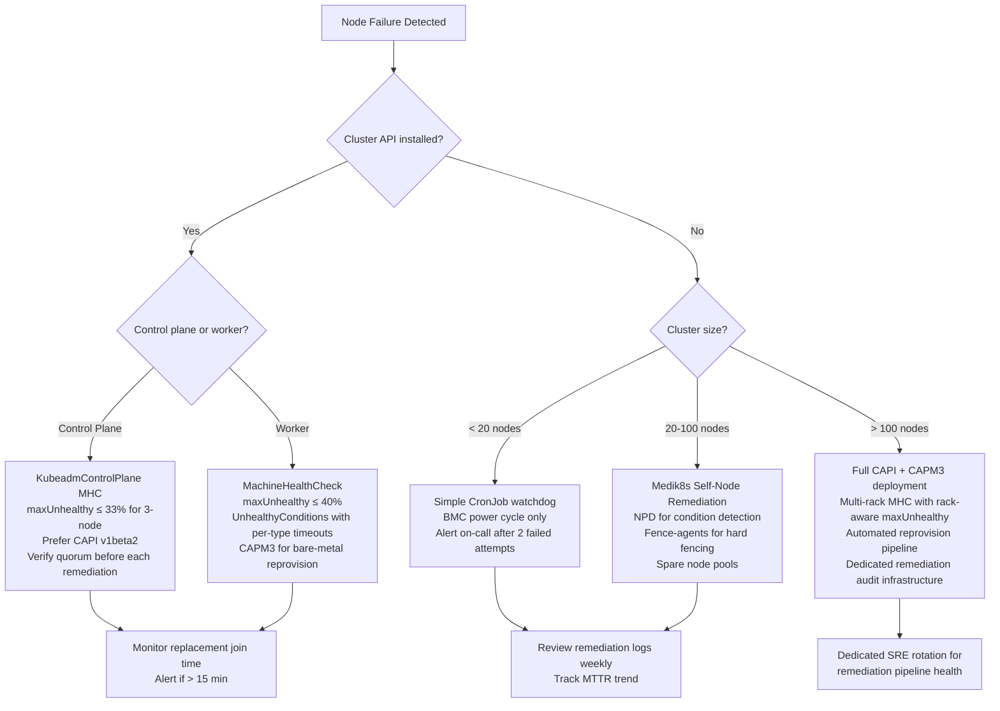

> **Complexity**: `[COMPLEX]` | Time: 60 minutes
>
> **Prerequisites**: [Module 7.2: Hardware Lifecycle & Firmware](../module-7.2-hardware-lifecycle/), [Module 1.3: Cluster Topology](/on-premises/planning/module-1.3-cluster-topology/)

---

## What You'll Be Able to Do

After completing this module, you will be able to:

1. **Implement** automated node remediation with MachineHealthChecks, BMC power cycling, and fencing for unresponsive nodes
2. **Configure** Node Problem Detector and custom health checks that detect hardware failures before they cascade
3. **Design** failure blast radius containment using rack-aware scheduling, topology spread constraints, and storage isolation
4. **Optimize** node failure recovery times by tuning taint tolerations, pod eviction timeouts, and Ceph recovery throttling

---

## Why This Module Matters

A single hardware fault can escalate quickly when there is no hardware-level alerting and workloads stay bound to a failed node until default node-failure tolerations expire.

If a failed node also hosts storage or participates in a busy replicated storage system, recovery traffic can stress the surrounding failure domain and turn one node failure into a wider availability problem.

Without automated remediation, on-call response and manual hardware recovery can stretch a node outage from minutes into a much longer incident.

With automated remediation and workload-specific eviction settings, many node failures can be handled much faster and with less manual intervention.

In cloud environments, when a virtual machine fails the cloud provider silently replaces it behind the scenes — often before an operator even notices. The replacement VM boots from a pre-built image, attaches to the same virtual network, and workloads reschedule automatically. On bare metal, none of that happens by magic. A failed physical server stays failed until something — a script, a controller, or a human — actively intervenes. The hardware does not self-heal; the automation layer must be built, tested, and continuously exercised.

This gap between cloud auto-healing and bare-metal reality is the central challenge of on-premises operations. Building automated node remediation is not just a convenience feature — it is the mechanism that closes the mean-time-to-repair (MTTR) gap between owned hardware and cloud infrastructure, and it directly determines whether a three-node control plane failure at 3 AM wakes an on-call engineer or resolves itself while they sleep.

> **Hypothetical scenario**: A ToR switch loses power at 2 AM, taking 14 worker nodes offline in rack B. The control plane detects 14 NotReady conditions within 60 seconds. If your cluster has no automated remediation, those 14 nodes sit idle until an on-call engineer is paged, wakes up, logs in, diagnoses the switch failure, and manually restores power — a 45-minute outage. If your cluster has MachineHealthChecks configured with `maxUnhealthy` safeguards **scoped to the worker pool** (80 workers cluster-wide, but the MHC selector matches only `worker-pool` Machines — 35 nodes in rack B's failure domain), the MHC controller evaluates 14/35 = 40% unhealthy against the threshold and *halts* further remediation at the boundary, preventing a destructive reprovisioning storm on nodes that are actually fine. When the switch power returns, all 14 nodes report Ready and workloads reschedule. The automated system didn't fix the switch, but it prevented the wrong fix from making the outage worse.

---

## What You'll Learn

- Machine Health Checks with Cluster API (CAPI)
- Node Problem Detector for kernel and runtime issues
- Automated reboot and reprovisioning strategies
- Spare node pools for instant replacement capacity
- Handling common hardware failures (RAM ECC, NIC flap, PSU, disk)
- Tuning eviction timeouts for bare metal

---

## Node Failure Detection Architecture

```
+---------------------------------------------------------------+
|          NODE FAILURE DETECTION & REMEDIATION STACK             |
|                                                                |
|  Layer 4: Remediation Controller (CAPI / custom)               |
|    Action: reboot, reprovision, or fence                       |
|         ^                                                      |
|         |  unhealthy signal                                    |
|  Layer 3: Machine Health Check (MHC)                           |
|    Rule: if condition X for Y minutes, remediate               |
|         ^                                                      |
|         |  node conditions                                     |
|  Layer 2: Node Problem Detector (NPD)                          |
|    Detects: kernel panics, OOM, filesystem corruption          |
|    Reports: Kubernetes node conditions                         |
|         ^                                                      |
|         |  system signals                                      |
|  Layer 1: Hardware / OS                                        |
|    Sources: dmesg, journald, SMART, IPMI sensors               |
|                                                                |
+---------------------------------------------------------------+
```

Each layer in this stack addresses a different failure visibility gap. The kubelet alone can only report that it is alive and talking to the API server — it has no insight into whether a DIMM is accumulating correctable ECC errors, whether a NIC is silently dropping every third packet, or whether a filesystem remount is imminent. Layer 1 (hardware/OS) produces the raw signals. Layer 2 (NPD) translates those signals into Kubernetes-native conditions. Layer 3 (MHC) evaluates those conditions against time thresholds and safety gates. Layer 4 (remediation controller) executes the physical action — reboot, power cycle, or full reprovision. Without any one of these layers, the chain breaks: raw signals with no Kubernetes translation are invisible to the scheduler, and Kubernetes conditions with no remediation controller are just red indicators on a dashboard that nobody is watching at 3 AM.

On bare metal, the stack must also contend with hardware that the Kubernetes control plane cannot virtualize away. A cloud provider's hypervisor can fence a VM by destroying it and creating a new one; a bare-metal cluster must physically power-cycle a server through its BMC, wait for firmware POST, wait for PXE boot, and only then begin the kubelet join sequence. Every layer of the detection-and-remediation stack must be tuned for these physical realities.

---

> **Pause and predict**: Kubernetes marks a node unhealthy only after missed heartbeats accumulate for about 50 seconds by default (`node-monitor-grace-period`, 50s since Kubernetes 1.32). During those 50 seconds, pods on the node are running but potentially broken. What types of hardware failures would be invisible to the kubelet heartbeat mechanism?

## Node Problem Detector

[Node Problem Detector (NPD) is a DaemonSet that monitors system logs and reports problems as Kubernetes node conditions.](https://github.com/kubernetes/node-problem-detector) Without NPD, Kubernetes only knows a node is unhealthy when kubelet stops reporting -- which can take minutes.

NPD runs with `hostNetwork` and `hostPID` access so it can read kernel logs (`/dev/kmsg`), system logs, and detect hardware-level issues that the kubelet cannot see. It translates these low-level signals into Kubernetes node conditions that Machine Health Checks can act on.

```yaml
# node-problem-detector.yaml
apiVersion: apps/v1
kind: DaemonSet
metadata:
  name: node-problem-detector
  namespace: kube-system
spec:
  selector:
    matchLabels:
      app: node-problem-detector
  template:
    metadata:
      labels:
        app: node-problem-detector
    spec:
      hostNetwork: true
      hostPID: true
      containers:
        - name: node-problem-detector
          image: registry.k8s.io/node-problem-detector/node-problem-detector:v0.8.19
          command:
            - /node-problem-detector
            - --logtostderr
            - --config.system-log-monitor=/config/kernel-monitor.json
            - --config.system-log-monitor=/config/containerd-monitor.json
            - --config.custom-plugin-monitor=/config/health-checker-kubelet.json
          securityContext:
            privileged: true
          volumeMounts:
            - name: log
              mountPath: /var/log
              readOnly: true
            - name: kmsg
              mountPath: /dev/kmsg
              readOnly: true
            - name: config
              mountPath: /config
      volumes:
        - name: log
          hostPath:
            path: /var/log
        - name: kmsg
          hostPath:
            path: /dev/kmsg
        - name: config
          configMap:
            name: npd-config
```

NPD supports custom health check plugins. For example, you can add a custom health-check plugin that periodically inspects EDAC counters and disk SMART health, then sets a custom node condition when those checks fail.

NPD distinguishes between two categories of problems that map to different remediation urgency levels. **Permanent conditions** represent problems that persist until an external action is taken — a kernel oops, a filesystem remount-read-only, or a stuck kernel thread. These conditions remain on the node until the issue is explicitly resolved. **Temporary events** represent transient phenomena — a single OOM kill, a brief NIC carrier loss, or a container restart. NPD reports temporary events as Kubernetes Events (visible via `kubectl describe node`) rather than persistent conditions, because MHC should not reboot a node over a single transient spike.

The default NPD configuration ships with monitors for kernel logs, containerd/docker runtime logs, and a kubelet health checker, but the monitor types you can configure include system-log monitors (scanning journald for kernel, daemon, and system log patterns), custom-plugin monitors (running an arbitrary script on a cron schedule and interpreting its exit code), and health-checker monitors (periodically probing a local endpoint such as the kubelet healthz port). For bare-metal on-premises clusters, the most valuable additions are usually a custom-plugin monitor that reads EDAC sysfs counters and a system-log monitor pattern that catches NIC firmware error messages in dmesg, neither of which is visible to the kubelet heartbeat.

The reporting cadence matters for remediation timing. NPD's kernel monitor tails `/dev/kmsg` directly; containerd and system-log monitors evaluate journald patterns as lines arrive. Custom-plugin monitors run on a configurable cron schedule — typically every 30 to 60 seconds. The health-checker plugin probes its target endpoint on the same schedule. This means the worst-case detection latency for a hardware fault is the plugin's check interval plus the MHC's condition timeout. If a custom EDAC checker runs every 60 seconds and the MHC timeout for `HardwareHealthy=False` is 60 seconds, the total time from DIMM failure to remediation trigger is between 60 and 120 seconds. Tightening the plugin interval below 30 seconds is rarely beneficial because faster-than-30-second plugin intervals increase node CPU load for marginal detection-speed gains.

---

## Machine Health Checks (Cluster API)

[Machine Health Checks (MHC) are a Cluster API resource that watches node conditions and triggers remediation when conditions are unhealthy for a specified duration.](https://cluster-api.sigs.k8s.io/tasks/automated-machine-management/healthchecking.html)

### MHC Configuration

```yaml
# machine-health-check.yaml
apiVersion: cluster.x-k8s.io/v1beta1
kind: MachineHealthCheck
metadata:
  name: worker-health-check
  namespace: default
spec:
  clusterName: production
  # Which machines to watch
  selector:
    matchLabels:
      cluster.x-k8s.io/deployment-name: worker-pool
  # Conditions that trigger remediation
  unhealthyConditions:
    - type: Ready
      status: "False"
      timeout: 300s       # 5 min of NotReady = remediate
    - type: Ready
      status: Unknown
      timeout: 300s       # 5 min of Unknown = remediate
    - type: HardwareHealthy
      status: "False"
      timeout: 60s        # hardware failure = remediate fast
  # Safety: never remediate more than 40% at once
  maxUnhealthy: 40%
  # How long to wait for a new node before considering
  # the remediation failed
  nodeStartupTimeout: 600s
```

The three critical fields in any MHC specification are `unhealthyConditions`, `maxUnhealthy`, and `nodeStartupTimeout`. `unhealthyConditions` defines the condition type and status pair that triggers remediation, plus the duration the condition must persist before action is taken. Setting different timeouts per condition type allows the cluster to respond fast to unambiguous hardware failures (60 seconds for `HardwareHealthy=False`) while allowing transient kubelet restarts time to self-resolve (300 seconds for `Ready=False`). `maxUnhealthy` is the circuit breaker — expressed as a percentage of total matched machines, it prevents the MHC from remediating machines when the cluster is already partially degraded. Without this guard, a datacenter-wide power event could trigger simultaneous remediation of every node, turning a recoverable outage into a total cluster rebuild.

`nodeStartupTimeout` defines how long the MHC waits for a replacement node's kubelet to register with the API server after the Machine object is created. On bare metal, a full reprovision cycle — power-on self-test, firmware initialization, PXE boot, OS image deployment, and kubelet join — can take 8 to 15 minutes depending on hardware generation and network speed. Setting `nodeStartupTimeout` too low causes the MHC to declare the remediation failed while the replacement node is still booting, triggering a second, unnecessary remediation cycle and wasting hardware.

Starting with Cluster API v1beta2, the `unhealthyConditions` field was restructured into `spec.checks.unhealthyNodeConditions` (conditions read from the Kubernetes Node object) and `spec.checks.unhealthyMachineConditions` (conditions read from the CAPI Machine object such as `NodeReady` and `InfrastructureReady`). The `maxUnhealthy` field was replaced by `spec.remediation.triggerIf.unhealthyLessThanOrEqualTo`. If your cluster runs CAPI v1.8 or later, prefer the v1beta2 API; the concepts are identical but the field names differ. The v1beta1 format shown above remains widely deployed and is fully functional on CAPI versions that predate the v1beta2 migration.

### How MHC Remediation Works

```
+---------------------------------------------------------------+
|              MHC REMEDIATION FLOW                              |
|                                                                |
|  1. Node condition becomes unhealthy                           |
|     (kubelet stops reporting, NPD sets condition)              |
|                                                                |
|  2. MHC controller notices condition duration > timeout        |
|                                                                |
|  3. MHC checks maxUnhealthy                                   |
|     - If > 40% nodes already unhealthy, STOP                  |
|       (prevents cascade remediation)                           |
|     - If < 40%, proceed                                        |
|                                                                |
|  4. MHC deletes the Machine object                             |
|     (this triggers the infrastructure provider)                |
|                                                                |
|  5. For bare metal (CAPM3 / Metal3):                           |
|     a. Power off server via BMC/IPMI                           |
|     b. Wipe disk (if configured)                               |
|     c. PXE boot new OS image                                   |
|     d. Join cluster as new node                                |
|                                                                |
|  6. For simpler setups (no CAPI):                              |
|     a. Custom controller attempts BMC power cycle              |
|     b. If node returns, done                                   |
|     c. If not, alert on-call for physical intervention         |
|                                                                |
+---------------------------------------------------------------+
```

### CAPM3 Reprovision Flow

When Cluster API is paired with the Metal3 infrastructure provider (CAPM3), the reprovision path follows a well-defined state machine that maps directly to physical bare-metal operations. Understanding this flow helps operators debug remediation failures and tune timeouts.

When MHC deletes the Machine object in step 4, CAPM3's Metal3Machine controller receives the deletion event and begins a sequenced teardown of the physical host. First, it calls Ironic — the OpenStack bare-metal provisioning service that CAPM3 embeds — to set the node's provisioning state to `deleting`. Ironic then issues an out-of-band power-off command via the BMC, using whichever protocol the BMC supports: Redfish (the DMTF standard, preferred for modern servers), IPMI (ubiquitous but less secure), or vendor-specific interfaces like iDRAC (Dell) or iLO (HPE). After confirming the power state is off, Ironic issues a disk-clean step — typically a secure erase or ATA sanitize command — to ensure no residual data or boot loader artifacts from the previous OS installation survive. The disk clean is critical for immutable-OS deployments: if the old boot partition remains, the new PXE boot may chain-load the old OS instead of the fresh image.

Once the host is clean, the Metal3MachineTemplate's spec determines whether a new BareMetalHost claim is created immediately. If the MachineDeployment still has a replica count that demands the node, CAPM3 finds an available BareMetalHost matching the label selector, sets its provisioning state to `available`, and begins the deployment sequence: power on via BMC, wait for the Preboot Execution Environment (PXE) DHCP offer, serve the iPXE boot script, stream the OS image, write it to disk, and reboot into the installed OS. After the OS boots and cloud-init or Ignition runs, kubelet registers with the API server and the node transitions to Ready. The entire cycle — from MHC triggering deletion to the replacement node reporting Ready — typically takes 10 to 18 minutes on bare metal, compared to 2 to 5 minutes for a cloud VM replacement. This delta is the fundamental MTTR gap that on-premises operators must design around.

---

## Automated Reboot and Reprovisioning

Not every environment uses Cluster API. Here is a lightweight auto-remediation approach using a custom controller.

> **Stop and think**: The MHC remediation flow deletes and reprovisions machines, which works with Cluster API. But many bare-metal clusters do not use CAPI. How would you build automatic remediation without CAPI? What is the simplest approach?

### Simple Node Watchdog

This lightweight script provides automatic remediation without Cluster API. It runs as a CronJob, finds nodes that have been NotReady beyond a threshold, and attempts a BMC power cycle. A cooldown timer prevents reboot loops.

```bash
#!/bin/bash
# node-watchdog.sh — run as CronJob on a management node
set -euo pipefail

NOTREADY_THRESHOLD=300  # seconds before attempting reboot

# Find nodes NotReady for > threshold
UNHEALTHY=$(kubectl get nodes -o json | jq -r --argjson t "$NOTREADY_THRESHOLD" '
  .items[] | select(.status.conditions[] |
    select(.type == "Ready" and .status != "True") |
    (now - (.lastTransitionTime | fromdateiso8601)) > $t
  ) | .metadata.name')

for NODE in $UNHEALTHY; do
  BMC_ADDR=$(kubectl get node "$NODE" \
    -o jsonpath='{.metadata.annotations.bmc\.kubedojo\.io/address}')
  [ -z "$BMC_ADDR" ] && { echo "No BMC for ${NODE}, alerting"; continue; }

  # Skip if rebooted < 30 min ago (prevent reboot loops)
  LAST=$(kubectl get node "$NODE" \
    -o jsonpath='{.metadata.annotations.remediation\.kubedojo\.io/last-reboot}' \
    2>/dev/null || echo "0")
  [ $(($(date +%s) - LAST)) -lt 1800 ] && { echo "Recent reboot, skipping"; continue; }

  # Power cycle via IPMI and record attempt
  ipmitool -I lanplus -H "$BMC_ADDR" -U admin -P "$(get_bmc_pass "$NODE")" \
    chassis power cycle
  kubectl annotate node "$NODE" \
    "remediation.kubedojo.io/last-reboot=$(date +%s)" --overwrite
done
```

### Medik8s Self-Node Remediation

For clusters that need more sophisticated remediation than a shell script but do not run Cluster API, the medik8s project provides a family of Kubernetes-native remediation operators. The flow starts with [Node Health Check (NHC)](https://github.com/medik8s/node-healthcheck-operator): NHC watches node conditions and, when a node is unhealthy, creates a `SelfNodeRemediation` custom resource. [Self-Node Remediation (SNR)](https://github.com/medik8s/self-node-remediation) runs as a DaemonSet on every node and executes the remediation defined by that CR.

The actual SNR flow ([documented in the medik8s how-it-works guide](https://www.medik8s.io/remediation/self-node-remediation/how-it-works/)) works like this:

1. **NHC detects** an unhealthy node (via NPD conditions, `Ready=False`, or other configured checks) and creates a `SelfNodeRemediation` CR.
2. **Healthy peer nodes** — not the unhealthy node itself — cordon the failed node and **delete its Node object** so the scheduler reschedules workloads elsewhere.
3. **SNR on the unhealthy node** reboots it (`isSoftwareRebootEnabled` defaults to `true`; hardware watchdog is the fallback when software reboot fails).
4. **API-server-loss handling**: when the unhealthy node cannot reach the API server, it asks **healthy peers** to verify API-server reachability on its behalf (peer checks) — this is not a default-gateway-vs-API-server heuristic run locally in isolation.
5. **Total isolation**: when peers confirm the node is unreachable, they fence it by deleting the Node object; SNR may escalate to watchdog-based reboot.

NHC's `minHealthy` field is the storm breaker for medik8s stacks without CAPI's `maxUnhealthy` — it prevents NHC from creating remediation CRs when too few nodes in the selector are healthy, analogous to the MHC circuit breaker in [Module 7.2](../module-7.2-hardware-lifecycle/).

SNR does **not** cordon-and-drain from the failing node itself — peers handle cordon and Node deletion while SNR handles the reboot. This differs from CAPI MHC (which deletes the Machine and reprovisions) and from the simple BMC watchdog (which power-cycles without scheduler-aware workload evacuation).

The reboot mechanism itself is the subtle part. When a hardware watchdog device (such as `/dev/watchdog`, backed by the BMC or a kernel softdog) is present, SNR arms it and lets the timer expire, which forces a hardware reset that cannot be blocked by a hung kernel, a stuck I/O path, or a wedged container runtime. This guarantee matters on bare metal: a node that *looks* down but is still electrically alive can keep holding a storage lock, an iSCSI session, or a floating VIP, creating a split-brain hazard the moment workloads reschedule elsewhere. Only after the watchdog (or, as a fallback, a forced software reboot) confirms the node is truly down do peers safely complete fencing. This is why medik8s strongly recommends provisioning a real watchdog device on every node rather than relying on best-effort software reboots — the timer is the hardware-level proof that the old instance of the node is gone.

### Fence-Agents Remediation and BMC Protocols

When a node is unresponsive and a simple reboot does not restore it, the next escalation step is fencing — forcibly removing the node from the cluster's shared resources (storage, network) before attempting recovery. [Fence-agents-remediation (FAR)](https://github.com/medik8s/fence-agents-remediation), also from the medik8s project, wraps the Linux cluster fencing agents (historically from the ClusterLabs fence-agents project) behind a Kubernetes operator. FAR can issue a BMC power-off (hard fence) rather than a reboot, ensuring the failed node is electrically isolated before a replacement takes over its workloads.

Bare-metal fencing relies on out-of-band management protocols that operate independently of the host OS. The two primary protocols are:

- **IPMI (Intelligent Platform Management Interface)**: The older standard, supported on nearly every server built since ~2005. Uses UDP port 623. Provides power control, sensor reading, serial-over-LAN console, and system event log access. IPMI 2.0 added encryption, but many deployments run IPMI 1.5 without encryption due to BMC firmware limitations, making credential exposure a real operational risk. The `ipmitool` CLI (used in the watchdog script above) is the standard tool.

- **Redfish**: The modern DMTF standard, designed as a RESTful HTTPS API with JSON payloads, replacing IPMI's binary UDP protocol. Redfish provides the same power, sensor, and boot-device control as IPMI but adds structured hardware inventory, firmware update endpoints, and certificate-based authentication. All major server vendors (Dell iDRAC9+, HPE iLO 5+, Supermicro X11+, Lenovo XClarity) support Redfish. For new deployments, prefer Redfish over IPMI: its HTTPS transport handles BMC certificate validation (or at least makes the absence of validation visible), and its JSON API is easier to integrate with Kubernetes controllers than parsing `ipmitool` text output.

The choice between IPMI and Redfish fencing is ultimately a hardware-generation question — if your servers are newer than ~2017, you have Redfish. If they are older, you have IPMI. The fencing logic (power off, wait, power on) is the same regardless of protocol; only the transport and authentication mechanism differ.

### Escalation Logic

```
+---------------------------------------------------------------+
|            REMEDIATION ESCALATION LADDER                       |
|                                                                |
|  Level 1: Automatic (no human needed)                         |
|  +---------+    +---------+    +----------+                   |
|  | Detect  |--->| Wait    |--->| BMC      |                   |
|  | NotReady|    | 5 min   |    | power    |                   |
|  |         |    |         |    | cycle    |                   |
|  +---------+    +---------+    +----------+                   |
|                                     |                          |
|                                     v                          |
|  Level 2: Automatic with alert      |                          |
|  +---------+    +---------+    +----+-----+                   |
|  | Node    |--->| Wait    |--->| PXE      |                   |
|  | still   |    | 10 min  |    | repro-   |                   |
|  | down    |    |         |    | vision   |                   |
|  +---------+    +---------+    +----------+                   |
|                                     |                          |
|                                     v                          |
|  Level 3: Human intervention        |                          |
|  +---------+    +---------+    +----+-----+                   |
|  | Node    |--->| Page    |--->| Physical |                   |
|  | still   |    | on-call |    | inspect  |                   |
|  | down    |    | (30min) |    | /replace |                   |
|  +---------+    +---------+    +----------+                   |
|                                                                |
+---------------------------------------------------------------+
```

The escalation ladder encodes a practical assumption: most node failures are transient and a single power cycle resolves them. Level 1 attempts that power cycle with no human involvement. Level 2 escalates to a full OS reprovision only after Level 1 fails, because a PXE reprovision takes significantly longer, wipes local state, and consumes network bandwidth. Level 3 pages a human only after two automated attempts have failed — this is the threshold where the problem is likely a physical hardware fault (dead PSU, failed motherboard, severed network cable) that software cannot fix.

The ladder's timing values are configurable and should be tuned to your hardware's actual boot times. A server with fast NVMe storage and a 10GbE provisioning network might PXE-boot and join the cluster in 5-7 minutes, allowing a shorter Level 2 wait period. A server with spinning disks and a 1GbE provisioning network might need the full 10-15 minutes. Setting the wait period too short causes unnecessary escalation to Level 3 (human intervention) for nodes that would have recovered given another 2-3 minutes; setting it too long leaves workloads stranded on a dead node longer than necessary. The only way to tune these values correctly is to measure actual reprovision times in your environment — run 10 timed reprovision cycles, take the 95th percentile, and set the Level 2 wait period to that value plus a 2-minute buffer.

Testing the remediation pipeline end-to-end is non-negotiable before enabling it in production. A remediation system that has never been exercised against a real BMC power cycle is a collection of hopeful YAML files, not an operational capability. Schedule a quarterly "node failure fire drill": select a non-critical worker, simulate a failure by stopping its kubelet (`systemctl stop kubelet`), and observe every layer of the stack — NPD condition propagation, MHC timeout evaluation, BMC power cycle or reprovision trigger, replacement node join, workload reschedule. Time each phase and compare against your MTTR targets. A pipeline that works in the fire drill works in production; a pipeline that has never been tested will fail in production at the worst possible moment.

---

## Remediation Safety: Storm Prevention and Quorum

Automated remediation creates a new failure mode that manual operations never produce: the remediation storm. When a systemic failure (power event, switch failure, network partition) affects multiple nodes simultaneously, an unguarded remediation controller will attempt to reboot or reprovision every affected node at once. On bare metal, simultaneous BMC power-cycles across a rack can trip the rack's power budget, simultaneous PXE boots can saturate the provisioning network, and simultaneous kubelet joins can overwhelm the API server. A well-designed remediation system must self-throttle.

### The maxUnhealthy Circuit Breaker

The `maxUnhealthy` field (or `unhealthyLessThanOrEqualTo` in CAPI v1beta2) is the primary circuit breaker. Its mechanics are more subtle than they appear. The MHC evaluates the unhealthy ratio *before each individual remediation decision*, not once at the start of a batch. This means that if 10 nodes go unhealthy and `maxUnhealthy` is set to 40%, the MHC will remediate node 1 (10% unhealthy, below 40%), then re-evaluate before node 2 (still ~10% unhealthy if the previous node's Machine was deleted but the replacement hasn't started), and continue up to the 4th node. By node 5, with 50% unhealthy, the MHC stops. Critically, as remediated nodes recover and rejoin the cluster, the unhealthy ratio drops below 40% again, and the MHC resumes remediation of the remaining nodes — this staggered, self-throttling recovery pattern prevents the simultaneous-everything storm while still working through the full queue of unhealthy nodes over time.

### Control Plane Quorum Safety

Control plane nodes require stricter remediation rules than workers because losing quorum renders the cluster API unavailable — and without the API, no automation can function. For an etcd-based control plane with N members, the cluster can tolerate floor((N-1)/2) simultaneous failures before losing quorum. This means:

- 3-node control plane: can lose 1 node (33%) before quorum is lost
- 5-node control plane: can lose 2 nodes (40%) before quorum is lost

The MHC for control plane nodes must respect these bounds. A `maxUnhealthy` of 33% on a 3-node control plane means only 1 node can be remediated at a time, and that remediation must *succeed* (the replacement must join and establish etcd membership) before the next unhealthy node can be remediated. If a control plane node is unhealthy but the replacement stalls, the MHC for the control plane must wait — remediating the second unhealthy node while the first replacement hasn't joined would break quorum. In practice, this means control plane MHCs should use a `maxUnhealthy` value set to floor((N-1)/N × 100)% — which for a 3-node cluster is 33%, and for a 5-node cluster is 40%.

### Stateful Workload Guardrails

A node hosting the sole replica of a StatefulSet pod or the only copy of a PersistentVolume's data must not be reprovisioned until its data is confirmed safe elsewhere. The MHC has no built-in awareness of storage topology — it can and will delete a Machine object hosting the only Ceph OSD in a failure domain, causing permanent data loss if that OSD's data was not fully replicated. Before enabling automated remediation on nodes that host stateful workloads, operators must ensure:

1. All PersistentVolumes have a reclaim policy that preserves data (Retain), not Delete.
2. `podManagementPolicy` controls **startup and scale ordering**, not blast-radius containment — `Parallel` starts or scales all pods simultaneously and can *widen* simultaneous disruption. Use `OrderedReady` unless the workload is explicitly parallel-safe. Blast-radius guardrails come from `topologySpreadConstraints`, pod anti-affinity, and PodDisruptionBudgets.
3. Storage replication (Ceph, Longhorn, Portworx) is configured to require at least `min_size` replicas before acknowledging writes, so that a single-node failure never creates a write hole.
4. Topology spread constraints ensure that no single failure domain holds all replicas of any stateful workload.
5. A pre-remediation webhook or custom controller verifies that the node about to be remediated does not host any "last replica" before allowing the MHC to proceed. This is not a built-in feature — it requires custom integration between the storage layer and the remediation controller.

---

## Spare Node Pools

On bare metal, you cannot create new nodes on demand. Spare nodes must be physically present, powered on, and ready to accept workloads.

### Spare Node Strategy

```
+---------------------------------------------------------------+
|            SPARE NODE POOL DESIGN                              |
|                                                                |
|  Cluster: 80 worker nodes across 4 racks                      |
|                                                                |
|  Spare nodes: 4 (5% of fleet)                                 |
|    spare-01 (rack-a) — cordoned, no workloads                  |
|    spare-02 (rack-b) — cordoned, no workloads                  |
|    spare-03 (rack-c) — cordoned, no workloads                  |
|    spare-04 (rack-d) — cordoned, no workloads                  |
|                                                                |
|  Why cordoned, not powered off?                                |
|  - Instant availability (no boot time)                         |
|  - Kubelet is running, node is Ready                           |
|  - Just uncordon to accept workloads                           |
|  - Hardware health is continuously monitored                   |
|                                                                |
|  Auto-failover:                                                |
|  1. Worker-27 fails                                            |
|  2. Watchdog detects NotReady > 5 min                          |
|  3. Watchdog uncordons spare-02 (same rack)                    |
|  4. Pods reschedule to spare-02                                |
|  5. Watchdog alerts on-call: "Spare used, investigate"         |
|  6. Engineer fixes worker-27, re-cordons it as new spare       |
|                                                                |
+---------------------------------------------------------------+
```

> **Pause and predict**: Why are spare nodes kept cordoned but powered on, rather than powered off? What is the trade-off in power cost versus recovery time?

### Managing Spare Nodes

```bash
# Label and cordon spare nodes
kubectl label node spare-01 node-role.kubernetes.io/spare="" kubedojo.io/rack=rack-a
kubectl cordon spare-01

# Auto-failover: find a spare in the same rack as the failed node, uncordon it
# If no same-rack spare, use any available spare
# Alert on-call: "Spare activated, investigate failed node"
# After fix: re-cordon the recovered node as the new spare
```

The spare-node model carries a real financial cost that cloud operators never face. A cordoned spare node consumes power, cooling, rack space, and switch port capacity while contributing zero workload throughput. If each spare node draws ~300 watts at idle and your electricity cost is $0.12/kWh, a single spare costs approximately $315/year in power alone — and that is before cooling overhead (typically 30-50% on top of server power draw). Four spares across four racks represents roughly $1,500-2,000/year in utility costs. The tradeoff is between that operating cost and the recovery-time reduction: uncordoning a hot spare restores capacity in under 30 seconds (the time for the scheduler to bind pods to the newly available node), while a cold spare that must be powered on, go through POST, PXE boot, and OS initialization adds 5-15 minutes. For most production clusters, the MTTR reduction justifies the operating cost. For development or staging clusters, cold spares or simply accepting longer recovery times may be the right economic choice.

---

## Handling Common Hardware Failures

### RAM ECC Errors

```bash
# Detect ECC errors
cat /sys/devices/system/edac/mc/mc*/csrow*/ch*_ce_count

# Prometheus query for ECC trend
# rate(node_edac_correctable_errors_total[1h]) > 0

# Action levels:
# < 10 correctable errors/day: monitor
# 10-100 correctable errors/day: schedule DIMM replacement
# > 100 correctable errors/day: drain and replace immediately
# Any uncorrectable error: drain IMMEDIATELY (data corruption risk)
```

### NIC Flapping

```bash
# Detect NIC flap (link up/down cycles)
dmesg | grep -i "link is down\|link is up" | tail -20

# Prometheus alert rule
# changes(node_network_carrier{device="eth0"}[10m]) > 4

# Causes:
# - Failing NIC port (replace NIC or use different port)
# - Failing cable (replace cable)
# - Failing switch port (move to different switch port)
# - Driver bug (update NIC firmware/driver)

# Immediate action: if NIC flaps > 3 times in 10 min
kubectl cordon affected-node  # prevent new pods
# Investigate root cause before draining
```

### PSU Failure

```bash
# Check PSU status via IPMI
ipmitool -I lanplus -H bmc-addr -U admin -P pass sdr type "Power Supply"

# Example output:
# PS1 Status     | ok     | Power Supply | Presence detected
# PS2 Status     | cr     | Power Supply | Failure detected

# Action:
# PSU failure with redundancy = WARN, schedule replacement
# PSU failure without redundancy = CRITICAL, drain node
```

---

## Blast Radius Containment

To prevent a single hardware failure from taking down an entire application, you must design for failure domain isolation. On bare metal, failure domains are physical: Top-of-Rack (ToR) switches, power circuits, and storage arrays.

### Topology Spread Constraints & Rack-Aware Scheduling
[Use `topologySpreadConstraints` to ensure pods are distributed across physical racks.](https://kubernetes.io/docs/concepts/scheduling-eviction/topology-spread-constraints/) If a ToR switch fails, only a fraction of the application's pods go down.

```yaml
# Example: Rack-aware scheduling
spec:
  topologySpreadConstraints:
    - maxSkew: 1
      topologyKey: kubedojo.io/rack
      whenUnsatisfiable: DoNotSchedule
      labelSelector:
        matchLabels:
          app: critical-workload
```

### Storage Isolation
Stateful workloads create data gravity. If a node with dense storage fails, rebuilding that data heavily stresses the network.
- **Dedicated Storage Networks**: Isolate storage replication traffic onto a separate VLAN to prevent it from starving kubelet heartbeats.
- **Failure Domain Mapping**: Configure your storage system (like Ceph's CRUSH map) to mirror data across racks, reducing the chance that a single rack failure results in data unavailability.

---

## Tuning Eviction Timeouts

Default Kubernetes eviction settings are tuned for cloud environments. On bare metal, you may want faster or slower eviction depending on the failure mode.

Node-failure eviction relies on taint-based eviction and per-pod `NoExecute` tolerations. [When a node becomes `NotReady`, the node lifecycle controller adds a `node.kubernetes.io/not-ready` taint. Pods are evicted when their toleration for this taint expires.](https://kubernetes.io/docs/concepts/scheduling-eviction/taint-and-toleration/)

```bash
# Default behavior (Kubernetes 1.32+):
#   kube-controller-manager:
#     --node-monitor-period=5s         (check node status every 5s)
#     --node-monitor-grace-period=50s  (mark NotReady after 50s no heartbeat)
#
#   kube-apiserver:
#     --default-not-ready-toleration-seconds=300     (evict 5 min after NotReady taint)
#     --default-unreachable-toleration-seconds=300   (evict 5 min after Unreachable taint)

# Pre-1.32 legacy: node-monitor-grace-period defaulted to 40s.

# For faster bare metal remediation:
# Edit kube-apiserver manifest (/etc/kubernetes/manifests/kube-apiserver.yaml)
#   --default-not-ready-toleration-seconds=120      (evict after 2 min instead of 5)
#   --default-unreachable-toleration-seconds=120
#
# Or set tolerationSeconds directly on pods for fine-grained control:
# spec.tolerations:
#   - key: "node.kubernetes.io/not-ready"
#     operator: "Exists"
#     effect: "NoExecute"
#     tolerationSeconds: 60   # evict after 60s for this specific workload

# Also tune node-monitor-grace-period for faster NotReady detection:
# Edit kube-controller-manager manifest
#   --node-monitor-grace-period=40s  (faster than 50s default; pre-1.32 legacy value)
```

### Tuning Storage Recovery Throttling

When a node fails, distributed storage systems like Ceph will attempt to rebuild missing data replicas on surviving nodes. Unthrottled recovery can saturate the network and cause otherwise healthy nodes to drop kubelet heartbeats, triggering cascade failures.

```bash
# Throttle Ceph recovery to prevent network saturation during node failure
# Apply these dynamically to running OSDs
ceph tell 'osd.*' injectargs '--osd-recovery-max-active 1'
ceph tell 'osd.*' injectargs '--osd-max-backfills 1'
ceph tell 'osd.*' injectargs '--osd-recovery-op-priority 1'
```

---

## Patterns & Anti-Patterns

### Proven Patterns

**Pattern 1: Layered Detection with Independent Escalation Paths**

Run Node Problem Detector on every node to surface hardware and kernel conditions as Kubernetes node conditions, a MachineHealthCheck (or custom watchdog) to act on those conditions, and a separate BMC connectivity path (IPMI/Redfish) for when the host OS is entirely unresponsive. No single layer should be the sole path to remediation. If NPD fails to detect a condition because journald is stalled, the MHC's kubelet heartbeat timeout still catches the node; if kubelet stops reporting but the BMC is reachable, the power-cycle path still works. This layered approach means any two components can fail and remediation still functions.

**Pattern 2: Same-Rack Spare Preference with Cross-Rack Fallback**

When uncordoning spare nodes to replace a failed worker, prefer a spare in the same rack as the failed node. Same-rack spares preserve the cluster's topology distribution — workloads that were spread across racks stay spread across racks. If no same-rack spare is available, fall back to any available spare, but generate an alert so the operator knows the topology is now degraded. Once the original node is repaired, re-cordon it and re-label it as the same-rack spare to restore the original topology.

**Pattern 3: Remediation Audit Logging with Weekly Review**

Log every remediation event — which node, which condition triggered it, which action was taken (power cycle, reprovision, human escalation), and the outcome (node recovered, node still down) — to a structured log. Review these logs weekly as a team to identify patterns: a node that gets remediated three times in a month likely has an intermittent hardware fault that needs physical inspection; a condition type that never triggers remediation may indicate that its timeout is too generous; a spike in remediation events may correlate with a recent firmware update and warrant a rollback. Automated remediation without audit review becomes invisible infrastructure decay.

**Pattern 4: Graduated Remediation with Increasing Invasiveness**

Start with the least destructive action (BMC power cycle), escalate to more invasive steps (disk wipe + OS reprovision) only after the first attempt fails, and involve a human only after automated steps are exhausted. This pattern minimizes the blast radius of the remediation itself — a power cycle preserves local state and takes 2-3 minutes; a reprovision destroys local state and takes 10-18 minutes. Choosing the right first step avoids turning a recoverable node blip into a data-loss incident.

### Anti-Patterns

| Anti-Pattern | Why It's Bad | Better Approach |
|--------------|--------------|-----------------|
| **Setting `maxUnhealthy` to 100%** | A systemic event (power loss, switch failure) triggers simultaneous remediation of every node, turning recoverable downtime into a total cluster rebuild | Set `maxUnhealthy` to 40% or lower; the circuit breaker exists to prevent remediation storms |
| **Remediating nodes without timeouts per condition** | A node that blips NotReady for 10 seconds gets the same treatment as one that has been down for 10 minutes, causing unnecessary reboots for transient issues | Set shorter timeouts for hardware-specific NPD conditions (60s) and longer timeouts for kubelet heartbeats (300s) — different conditions need different urgency |
| **Using automated remediation on control plane nodes without quorum-awareness** | Remediating a second control plane node while the first replacement has not yet joined etcd breaks quorum, taking down the entire API server | Set control-plane MHC `maxUnhealthy` to floor((N-1)/N × 100)% and ensure the replacement node is fully joined before allowing the next remediation |
| **Rebooting nodes without workload evacuation** | Pods are forcefully terminated without graceful shutdown, in-flight requests are dropped, and stateful workloads may lose unflushed writes | Match evacuation to the remediation layer: CAPI MHC deletes the Machine (provider reprovisions); medik8s SNR relies on **healthy peers** to cordon and delete the Node before SNR reboots; BMC watchdog scripts should cordon + drain before power-cycling when the host OS is still responsive |
| **Hard-coding BMC credentials in remediation scripts** | Credential rotation becomes impossible without updating every script; a compromised script exposes credentials for every BMC in the fleet | Store BMC credentials in a Kubernetes Secret or a vault (HashiCorp Vault, sealed secrets), mount them into the remediation controller at runtime, and rotate them on a schedule |
| **No cooldown between remediation attempts** | A node with a persistent hardware fault gets rebooted every 5 minutes indefinitely, wasting power cycles and generating noise in monitoring | Implement a minimum 30-minute cooldown between remediation attempts on the same node; after 3 failed attempts in 24 hours, escalate to a human and stop automatic remediation for that node |

---

## On-Premises Cost Lens: The Economics of Automated Remediation

> **Illustrative figures below** — order-of-magnitude examples for planning conversations, not vendor quotes or audited financial models.

Every automated remediation decision has a capital and operational cost attached to it, and the on-premises operator must account for costs that cloud users never see because the cloud provider absorbs them into the instance price.

**CapEx drivers for remediation infrastructure.** Automated remediation requires BMC-capable servers (the BMC chip, management network switch port, and VLAN are all hardware you own), a provisioning network (dedicated switch, DHCP/TFTP/HTTP server, OS image storage), spare nodes (servers that consume rack space, power, and cooling while idle), and redundant control plane hardware to survive remediation cycles without quorum loss. A minimal remediation-capable cluster with 3 control plane nodes, 10 workers, 1 spare, and a dedicated management switch might add on the order of $8,000–12,000 in hardware cost compared to a cluster with no remediation automation (illustrative), primarily from the spare node and the management network infrastructure.

**OpEx drivers.** The ongoing costs include power for cordoned spare nodes (illustratively ~$300–500/year per spare at typical datacenter rates), cooling overhead (~$150–250/year per spare), network switch port consumption on the management VLAN, and the engineering time to build, test, and maintain the remediation automation. Engineering time is the largest variable: building a production-grade remediation pipeline (NPD configuration, MHC tuning, BMC integration, alert routing, audit logging, runbooks) might take a two-person platform team several weeks of focused work. Ongoing maintenance — updating NPD configurations for new kernel versions, refreshing BMC firmware, rotating credentials, reviewing audit logs — might add a few hours per week.

**When automated remediation pays for itself.** The breakeven calculation compares the cost of building and operating the remediation system against the cost of outages it prevents. If a 60-minute manual-response outage costs on the order of $10,000 in engineering time and degraded service (illustrative for a revenue-affecting production service), and automated remediation reduces MTTR from 60 minutes to 5 minutes for most node failures, preventing a handful of outages per year can exceed the automation investment. The calculation shifts unfavorably for clusters with fewer than ~20 nodes, where the outage frequency is low enough that building full automation may cost more than simply accepting occasional manual response. For clusters above ~50 nodes, automated remediation often wins on labor alone.

**The MTTR gap vs. cloud.** On a major cloud provider, a failed VM is typically replaced in 2-5 minutes with no operator action required. On bare metal with automated remediation, a power-cycle recovery takes 2-3 minutes — comparable to cloud. A full reprovision takes 10-18 minutes — 3-6x longer than cloud. This gap is irreducible because physical hardware has POST times, firmware initialization, and PXE image transfer latencies that virtualized infrastructure does not. The on-premises operator's goal is not to match cloud MTTR exactly; it is to close the gap to the point where the difference is no longer the dominant factor in application availability. At 10-18 minutes, a reprovision is faster than the 30-60 minutes of manual response — the automation has done its job, even if it is slower than a cloud provider's hypervisor.

The cost comparison between on-premises remediation and cloud auto-healing reveals a deeper structural difference in how the two models account for failure. In the cloud model, the cost of node failure is embedded in the instance price — you pay a premium (~20-40% over raw compute cost) for the provider's infrastructure that silently handles VM replacement, and you never see the hardware, the BMC, or the provisioning network. In the on-premises model, you pay lower per-unit compute cost but you carry the capital cost of spare hardware and the operational cost of the engineering time to build and maintain the remediation pipeline. The crossover point where on-premises becomes cheaper depends on utilization. At 80% sustained utilization of a 50-node cluster over a 5-year depreciation window, on-premises typically breaks even with cloud instance pricing after accounting for hardware, power, cooling, and operations headcount. At 30% utilization — common in development and staging clusters — the cloud model is almost always cheaper because you are not paying for idle hardware. Automated remediation does not change the utilization math, but it does reduce the ops headcount component of the on-premises cost equation, shifting the break-even point slightly in favor of on-premises for medium-to-high utilization clusters.

---

## Decision Framework

How do you choose which remediation strategy to deploy? The answer depends on your cluster's scale, whether you run Cluster API, and the sophistication of your operations team.



**Decision matrix for remediation strategy selection:**

| Factor | Simple Watchdog | Medik8s SNR + FAR | Cluster API MHC + CAPM3 |
|--------|----------------|-------------------|-------------------------|
| **Cluster size** | < 20 nodes | 20-100 nodes | > 50 nodes (justifies CAPI overhead) |
| **Setup complexity** | 1-2 days | 3-5 days | 2-4 weeks |
| **Remediation action** | BMC power cycle only | Peers cordon + delete Node; SNR reboots; FAR fences on failure | Delete Machine → full reprovision via Ironic |
| **Node replacement time** | 2-3 min (power cycle) | 3-5 min (reboot) | 10-18 min (full reprovision) |
| **Requires CAPI** | No | No | Yes |
| **Requires BMC access** | Yes (IPMI/Redfish) | Yes (IPMI/Redfish) | Yes (Redfish preferred, IPMI fallback) |
| **Stateful workload aware** | No | Partial (PDB-aware drain) | Partial (PDB-aware drain, needs custom webhook for last-replica check) |
| **Remediation storm protection** | Manual (cooldown timer) | NHC `minHealthy` + cooldown timer | Built-in (`maxUnhealthy` circuit breaker) |
| **Audit trail** | Script logs | Operator logs + Events | CAPI status conditions + Events |
| **Best for** | Small clusters, dev/staging | Mid-size production without CAPI | Large production with CAPI investment |

The framework is not a ladder where you must climb from simple to complex. Many production clusters in the 30-80 node range run successfully for years with the medik8s approach and never adopt Cluster API. The decision to add CAPI should be driven by whether your organization already uses it for cluster lifecycle management — if you do, the MHC path is a natural extension. If you do not, adding CAPI solely for node remediation is over-engineering; the medik8s or watchdog approaches deliver 90% of the value at 20% of the complexity.

---

## Did You Know?

- **Large production schedulers are designed to absorb regular machine failures.** Even smaller bare-metal clusters should assume node loss is a routine event and automate remediation accordingly.

- **Machine Health Checks play a similar role to health-check-based replacement in cloud autoscaling systems**, but bare-metal recovery usually takes longer because rebooting or reprovisioning physical hardware takes time.

- **ECC memory can catch many memory faults, and recurring ECC alerts are a strong warning sign that a DIMM needs attention before it causes wider disruption.**

- **The "Pets vs Cattle" metaphor applies to bare metal nodes too.** Even though the hardware is physical and unique, your automation should treat nodes as replaceable. If a node fails, the system should automatically replace it without human intervention (at least for the first attempt). The node's identity comes from its Kubernetes registration, not from its hardware serial number.

---

## Common Mistakes

| Mistake | Problem | Solution |
|---------|---------|----------|
| No auto-remediation for NotReady nodes | 5+ min downtime waiting for human response at 3 AM | Deploy MHC or custom watchdog with BMC power cycle |
| Remediating too aggressively | Cascade failure if root cause affects multiple nodes | Set maxUnhealthy in MHC (40% is a safe default) |
| No spare nodes | Failed node reduces capacity until physically fixed | Keep 5% spare nodes cordoned and ready |
| Default taint toleration (5 min) | Pods on failed node unavailable for 5 minutes | Tune `--default-not-ready-toleration-seconds` on kube-apiserver or set `tolerationSeconds` on pods |
| Not monitoring ECC errors | DIMM failure is a surprise | Deploy edac monitoring, alert at >10 errors/day |
| NIC flap not detected | Intermittent connectivity causes random pod failures | Monitor `node_network_carrier` changes |
| No BMC connectivity | Cannot remotely power cycle failed nodes | Ensure BMC network is on a separate, reliable management VLAN |
| Reprovisioning without root cause analysis | Same failure repeats on the reprovisioned node | Log all remediation events, review weekly |

---

## Quiz

### Question 1
Your MHC is configured with `maxUnhealthy: 40%` and you have 10 worker nodes. Node-03 is `NotReady` for 6 minutes. The MHC triggers remediation. While node-03 is being rebooted, node-07 and node-09 also go `NotReady`. What happens?

<details>
<summary>Answer</summary>

**The MHC WILL remediate node-07 and node-09.**

With 10 nodes and 3 unhealthy (30%), the MHC checks: is 30% >= 40%? No, so it proceeds. The MHC checks `maxUnhealthy` before each remediation:

- Node-03: 1/10 unhealthy = 10% < 40% -> remediate
- Node-07: 3/10 unhealthy = 30% < 40% -> remediate
- Node-09: still 3/10 unhealthy (or 2/10 if node-03 recovered) -> remediate

If a 5th node fails while these are being remediated: 5/10 = 50%, which exceeds the threshold, so MHC stops further remediation until the cluster is healthier.

**The safety mechanism**: `maxUnhealthy` prevents the MHC from rebooting your entire cluster in a cascade. If 40%+ of nodes are unhealthy, the problem is systemic and needs human investigation (bad switch, power issue, control plane failure).
</details>

### Question 2
A node shows `Ready` status in Kubernetes but is experiencing intermittent packet loss due to a failing NIC. Pods on this node have random timeouts. How would you detect and remediate this?

<details>
<summary>Answer</summary>

**This is a "gray failure" -- the node appears healthy but is degraded.**

**Detection:**
1. **Node Problem Detector custom check**: Monitor NIC link state changes
   ```bash
   # NPD script: detect NIC flapping
   FLAPS=$(dmesg --time-format iso | grep -c "link is down")
   if [ "$FLAPS" -gt 3 ]; then
     echo "NIC flapping detected: ${FLAPS} link-down events"
     exit 1  # Sets node condition to unhealthy
   fi
   ```

2. **Prometheus network metrics**:
   ```
   rate(node_network_receive_errs_total{device="eth0"}[5m]) > 0
   rate(node_network_transmit_drop_total{device="eth0"}[5m]) > 0
   changes(node_network_carrier{device="eth0"}[10m]) > 2
   ```

3. **Application-level signals**: Increased error rates, latency spikes correlated with specific node.

**Remediation:**
1. NPD sets a custom condition: `NetworkHealthy = False`
2. NHC (medik8s) or MHC (CAPI) watches for `NetworkHealthy = False` with timeout 60s
3. **CAPI MHC**: deletes the Machine and reprovisions via the infrastructure provider. **medik8s SNR**: healthy peers cordon and delete the Node; SNR reboots the unhealthy host
4. If NIC flapping persists after reboot, the node stays unhealthy and gets escalated to Level 3 (physical NIC replacement)

**Workaround while waiting for fix:**
```bash
kubectl cordon affected-node
kubectl drain affected-node --ignore-daemonsets --delete-emptydir-data
```
</details>

### Question 3
You are designing a spare node strategy for a 60-node cluster across 3 racks (20 nodes per rack). How many spare nodes do you need and where do you place them?

<details>
<summary>Answer</summary>

**Recommended: 3 spare nodes, one per rack.**

**Reasoning:**
- A practical starting point is at least one spare per rack, then adjust based on utilization and recovery targets.
- One per rack usually means a same-rack spare is available
- Same-rack replacement minimizes network topology changes
- If a rack loses power, the spare in that rack is also lost -- but the other 2 racks still have spares

**Placement:**
```
Rack A: worker-01..20 + spare-a (21 servers total)
Rack B: worker-21..40 + spare-b (21 servers total)
Rack C: worker-41..60 + spare-c (21 servers total)
```

**Configuration:**
- All spares are cordoned (schedulable=false) but powered on and joined to the cluster
- Spares run the same OS, kubelet version, and configuration as production nodes
- Spares are included in firmware update rotations

**Cost justification:**
- 3 spare nodes at $10,000 each = $30,000
- One 2-hour outage costs $50,000+ in engineering time, lost revenue, SLA penalties
- Spares pay for themselves after preventing a single extended outage

**When 5% is not enough:**
- Clusters with very high utilization (>80%) may need 10% spares
- Clusters running stateful workloads with strict anti-affinity need one spare per failure domain
</details>

### Question 4
Your custom node watchdog script attempts a BMC power cycle on a failed node. The power cycle succeeds, the node boots, but it does not rejoin the Kubernetes cluster. kubelet logs show `certificate has expired`. What happened and how do you fix it?

<details>
<summary>Answer</summary>

**The node's kubelet client certificate expired while the node was down.**

**What happened:**
1. Kubernetes uses TLS certificates for kubelet-to-apiserver communication
2. These certificates are commonly issued for one year by default, and kubelet requests a replacement as expiration approaches
3. If the node was down for an extended period (or if the certificate was already near expiration), the certificate may have expired before kubelet could rotate it
4. When the node reboots, kubelet tries to connect with the expired certificate -> rejected

**Fix:**
```bash
# Option 1: Approve the new CSR (kubelet generated a new one)
kubectl get csr | grep Pending
kubectl certificate approve <csr-name>

# Option 2: If no CSR was generated, delete the old certificate
# On the node:
rm /var/lib/kubelet/pki/kubelet-client-current.pem
systemctl restart kubelet
# Then approve the CSR on the control plane

# Option 3: Bootstrap with a new token
# On a control plane node:
kubeadm token create --print-join-command
# On the failed node — remove old PKI artifacts first, or kubeadm join
# will fail pre-flight checks because existing files are detected:
rm /etc/kubernetes/kubelet.conf
rm /var/lib/kubelet/pki/kubelet-client-current.pem
kubeadm join <api-server>:6443 --token <new-token> \
  --discovery-token-ca-cert-hash sha256:<hash>
```

**Prevention:**
- Monitor certificate expiration as part of cluster health checks
- Ensure kubelet auto-rotation is enabled (default in kubeadm clusters)
- If a node is down for more than a few days, assume certificate issues and plan accordingly
- Include CSR auto-approval in your remediation pipeline for known nodes
</details>

### Question 5
Your 3-node control plane cluster has MachineHealthChecks configured for the control plane nodes with `maxUnhealthy: 40%`. Node cp-01 goes NotReady, and the MHC begins remediation. Before cp-01's replacement joins, cp-02 also goes NotReady. The MHC evaluates that 2/3 = 66% unhealthy, which exceeds 40%, so it stops. Is your cluster still operational?

<details>
<summary>Answer</summary>

**No — the cluster has already lost quorum and the API server is unavailable.**

This scenario exposes a critical design flaw: `maxUnhealthy: 40%` on a 3-node control plane allows 1 node to be unhealthy (33%) but blocks remediation of a second node because 66% > 40%. However, by the time the second node goes NotReady, etcd has already lost quorum — 1 healthy node out of 3 is not enough to form a majority. The MHC's circuit breaker worked correctly (it prevented remediation of the second node), but the cluster was already dead because the *failure itself* — not the remediation — broke quorum.

The correct `maxUnhealthy` for a 3-node control plane is 33%, which allows exactly 1 node to be unhealthy. The value the MHC needs is not "what percentage can I safely remediate" but "what percentage can the cluster lose without breaking." For etcd, that is floor((N-1)/2) / N. For 3 nodes: floor(2/2)/3 = 1/3 = 33%. For 5 nodes: floor(4/2)/5 = 2/5 = 40%. The MHC's safety gate is a ceiling on *remediation*, not a guarantee of cluster health — if 2 of 3 control plane nodes fail simultaneously, no automation can save the cluster regardless of what `maxUnhealthy` says.

The defense against this scenario is not in the MHC configuration — it is in having enough control plane nodes (5 is the practical minimum for high-availability bare-metal deployments) and ensuring control plane nodes are spread across physical failure domains so no single power circuit or switch failure takes down more than floor((N-1)/2) of them.
</details>

### Question 6
A bare-metal cluster runs Ceph for persistent storage with a replication factor of 3 and `min_size` of 2. Worker-15, which hosts OSD.7 (one of the three replicas for several RBD volumes), goes NotReady. You have automated remediation configured with MHC and CAPM3. Should the MHC be allowed to remediate worker-15 immediately?

<details>
<summary>Answer</summary>

**Yes — with confirmation that the remaining 2 replicas are healthy and the cluster can re-replicate from them.**

With replication factor 3 and min_size 2, the loss of one OSD (OSD.7 on worker-15) leaves 2 healthy replicas for every affected placement group (PG). Ceph will mark those PGs as `degraded` (they have 2 replicas instead of 3) but `active` (they are still serving I/O). The cluster immediately begins backfilling to create a third replica on surviving OSDs in other failure domains. Remediating worker-15 is safe *as long as the backfill completes before a second OSD fails in the same failure domain*.

The risk chain that makes this dangerous: if a second OSD in the same CRUSH failure domain fails while backfill is still in progress, the affected PGs would drop to 1 replica (below `min_size`), and Ceph would block I/O on those PGs rather than risk a split-brain write. To mitigate this:
1. Throttle Ceph backfill (as shown in the tuning section) so recovery does not saturate the network and cause cascading node failures.
2. Ensure CAPM3's disk-wipe step does not immediately destroy OSD.7's data — if the node comes back after a power cycle without a disk wipe, Ceph can reuse the existing OSD rather than rebuilding from scratch.
3. If possible, configure MHC to wait for Ceph HEALTH_OK before proceeding to the next remediation in the same failure domain. This requires custom integration — the built-in MHC cannot query Ceph health.
</details>

### Question 7
Your team is evaluating whether to adopt Cluster API + CAPM3 for bare-metal node remediation on a 40-node production cluster that currently uses kubeadm for cluster lifecycle management. The cluster does not currently use CAPI for anything else. What are the strongest arguments for AND against adopting CAPI solely for remediation?

<details>
<summary>Answer</summary>

**Arguments for adopting CAPI:**
1. CAPM3 provides a battle-tested bare-metal reprovision pipeline (power-off → disk-wipe → PXE-boot → rejoin) that would take weeks to build from scratch.
2. MHC's built-in `maxUnhealthy` circuit breaker prevents remediation storms — a safety guarantee that custom scripts must implement manually and are easy to get wrong.
3. CAPI's Machine object model gives you per-node provisioning state visibility — you can query whether a node is in `Provisioning`, `Provisioned`, `Running`, or `Deleting` state, which makes debugging stuck remediations much easier than tailing script logs.

**Arguments against adopting CAPI:**
1. CAPI adds significant operational complexity: a management cluster (or bootstrap cluster), multiple CRDs and controllers, provider-specific configuration, and a migration of your existing node lifecycle management to CAPI's MachineDeployment model. For a 40-node cluster, this is 2-4 weeks of engineering work and an ongoing maintenance burden.
2. If remediation is the only reason you are adopting CAPI, the cost of learning and operating CAPI likely outweighs the benefit — the medik8s NHC + SNR stack can deliver peer-coordinated Node eviction, reboot, and fencing without requiring CAPI.
3. CAPI couples your remediation strategy to your cluster provisioning strategy. If you later change how nodes are provisioned (e.g., switching from PXE to image-based provisioning with Talos or Flatcar), you may need to change both your provisioning pipeline AND your remediation pipeline because they share the same CAPM3 integration.

**The pragmatic recommendation:** For a 40-node cluster not already using CAPI, deploy medik8s SNR + NPD for remediation, invest the saved engineering time in building a solid BMC credential management and remediation audit pipeline, and revisit CAPI if and when the cluster grows beyond ~100 nodes or you need CAPI for other reasons (multi-cluster management, declarative cluster lifecycle).
</details>

### Question 8
A node has been remediated three times in the past 6 hours — each time, the watchdog script power-cycles it via IPMI, the node boots, joins the cluster, runs workloads for 30-90 minutes, and then goes NotReady again with no obvious pattern. No NPD conditions fire before the kubelet stops reporting. What is the most likely root cause, and what should your next step be?

<details>
<summary>Answer</summary>

**The most likely root cause is an intermittent hardware fault that is invisible to NPD's log-based detection — probably a failing DIMM producing silent data corruption, a power supply with intermittent voltage droop, or a thermal issue that triggers a CPU shutdown without logging to journald.**

The key clue is that NPD reports no conditions before the kubelet stops. This rules out kernel panics, OOMs, filesystem remounts, and NIC flaps — all of which NPD's default monitors would catch and report as node conditions before the kubelet went silent. A node that simply disappears suggests one of:

1. **Thermal shutdown**: The CPU hits its critical temperature threshold and the BMC forces an immediate power-off. This may not write to journald because the shutdown happens below the OS level.
2. **Power supply voltage droop**: An intermittent PSU fault causes the server to reset without logging. The BMC's system event log (SEL) would show "power supply failure" or "voltage threshold exceeded" events.
3. **Silent memory corruption**: A DIMM with marginal cells passes ECC scrubbing most of the time but occasionally produces an uncorrectable multi-bit error. The hardware may trigger a machine-check exception that halts the CPU before the kernel can write to journald.

**Next step**: Stop automatic remediation for this node (add it to a denylist in the watchdog script), check the BMC's system event log (`ipmitool sel list`) for hardware-level events that predate the kubelet's disappearance, run a full memory diagnostic (memtest86+), and inspect the BMC's sensor readings for voltage and thermal anomalies. Do not re-enable automatic remediation until a root cause is confirmed and fixed — continuing to power-cycle the node without diagnosis is just burning power cycles on a hardware fault that software cannot fix.
</details>

---

## Hands-On Exercise: Deploy Node Problem Detector

**Task**: Deploy NPD on a kind cluster and trigger a simulated node condition.

### Setup

```bash
# Create a kind cluster
kind create cluster --name npd-lab --config - <<'EOF'
kind: Cluster
apiVersion: kind.x-k8s.io/v1alpha4
nodes:
  - role: control-plane
  - role: worker
  - role: worker
EOF
```

### Steps

1. **Deploy Node Problem Detector:**
   ```bash
   kubectl apply -f https://raw.githubusercontent.com/kubernetes/node-problem-detector/master/deployment/node-problem-detector.yaml
   ```

2. **Check NPD is running:**
   ```bash
   kubectl get pods -n kube-system -l app=node-problem-detector
   ```

3. **Check node conditions added by NPD:**
   ```bash
   kubectl get nodes -o json | jq '.items[].status.conditions[] | select(.type != "Ready" and .type != "MemoryPressure" and .type != "DiskPressure" and .type != "PIDPressure" and .type != "NetworkUnavailable")'
   ```

4. **Simulate a kernel issue:**
   ```bash
   # Exec into the worker node container (kind-specific)
   # Write to /dev/kmsg — NPD's kernel monitor tails /dev/kmsg directly
   # (not via journald; /var/log/kern.log may not exist on kind nodes)
   docker exec npd-lab-worker bash -c \
     'echo "kernel: BUG: unable to handle kernel NULL pointer dereference" > /dev/kmsg'
   ```

5. **Observe NPD reporting the condition:**
   ```bash
   kubectl get node npd-lab-worker -o json | jq '.status.conditions'
   ```

### Success Criteria

- [ ] NPD DaemonSet is running on all nodes
- [ ] Can view NPD-reported conditions via `kubectl get node`
- [ ] Understand the difference between transient events and permanent conditions
- [ ] Know how MHC uses these conditions to trigger remediation
- [ ] Can explain the escalation ladder: detect -> reboot -> reprovision -> alert human

### Cleanup

```bash
kind delete cluster --name npd-lab
```

---

## Next Module

Continue to [Module 7.4: Observability Without Cloud Services](/on-premises/operations/module-7.4-observability/) to learn how to build a self-hosted monitoring stack with Prometheus, Thanos, Grafana, and Loki.

## Sources

- [kubernetes.io: taint and toleration](https://kubernetes.io/docs/concepts/scheduling-eviction/taint-and-toleration/) — Explains how the node lifecycle controller applies NotReady/unreachable taints and how pod tolerationSeconds governs eviction timing during node remediation.
- [Node Problem Detector](https://github.com/kubernetes/node-problem-detector) — Supports claims about detecting kernel, filesystem, runtime, and hardware-adjacent node problems and surfacing them to Kubernetes as Events and NodeConditions for higher-level remediation.
- [Cluster API MachineHealthCheck](https://cluster-api.sigs.k8s.io/tasks/automated-machine-management/healthchecking.html) — Supports claims about MachineHealthCheck remediation triggers, unhealthy-condition timeouts, short-circuit safeguards, remediation limits, and delete-and-recreate behavior for unhealthy machines.
- [Pod Topology Spread Constraints](https://kubernetes.io/docs/concepts/scheduling-eviction/topology-spread-constraints/) — Backs rack/zone spread behavior, topology keys, default spread behavior, and cluster scheduling policy claims when distributing workloads across mixed racks or hardware domains.
- [kubernetes.io: troubleshooting kubeadm](https://kubernetes.io/docs/setup/production-environment/tools/kubeadm/troubleshooting-kubeadm/) — The kubeadm troubleshooting docs explicitly describe expired kubelet client certificates causing authentication and rejoin problems.
- [Node Status](https://kubernetes.io/docs/reference/node/node-status) — Documents `Ready` and `Unknown` semantics and the current default node-monitor-grace-period.
- [medik8s: Node Health Check Operator](https://github.com/medik8s/node-healthcheck-operator) — Creates SelfNodeRemediation CRs when nodes are unhealthy; `minHealthy` provides storm protection for medik8s stacks.
- [medik8s: Self-Node Remediation](https://github.com/medik8s/self-node-remediation) — SNR DaemonSet executes peer-coordinated cordon, Node deletion, and software/watchdog reboot per medik8s.io/how-it-works.
- [medik8s: Fence-Agents Remediation](https://github.com/medik8s/fence-agents-remediation) — Supports claims about hard fencing via BMC, wrapping ClusterLabs fence agents behind a Kubernetes operator, and power-off isolation of unresponsive bare-metal nodes.
- [Metal3 (CAPM3) Provider](https://github.com/metal3-io/cluster-api-provider-metal3) — Supports claims about the CAPM3 bare-metal reprovision flow, Ironic integration, BMC power-off/wipe/PXE-boot sequence, and BareMetalHost provisioning state machine.
- [DMTF Redfish Standard](https://www.dmtf.org/standards/redfish) — Supports claims about Redfish as the modern RESTful HTTPS BMC management protocol replacing IPMI, covering power control, hardware inventory, and certificate-based authentication.
- [kubernetes.io: Node Problem Detector Custom Plugin Monitor](https://kubernetes.io/docs/tasks/debug/debug-cluster/node-problem-detector/) — Supports claims about NPD's custom-plugin-monitor configuration, health-checker plugin types, and per-condition timeout and reporting behavior.
- [Ceph Recovery Throttling](https://docs.ceph.com/en/latest/rados/operations/control/) — Supports claims about `osd-recovery-max-active`, `osd-max-backfills`, and `osd-recovery-op-priority` tunables and their role in preventing recovery-driven network saturation during node failures.
