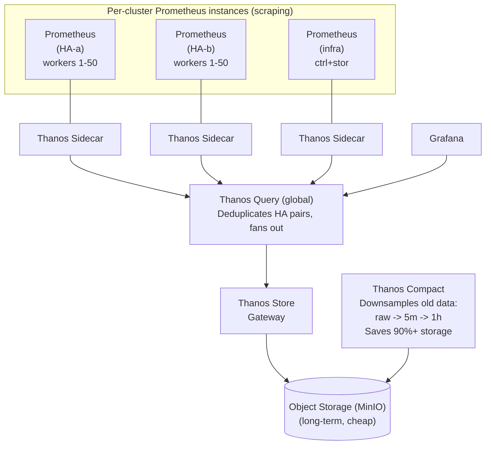
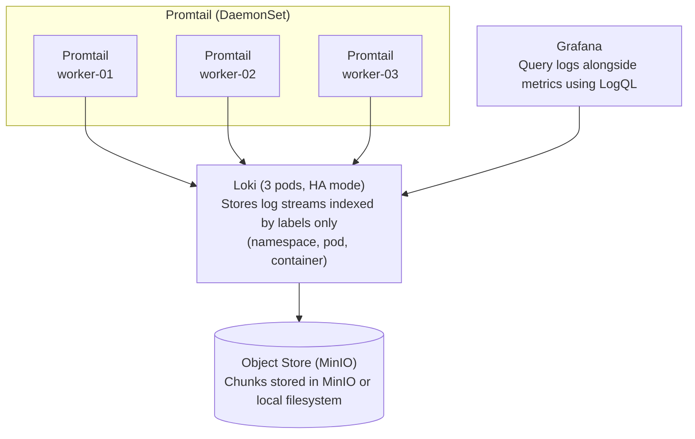
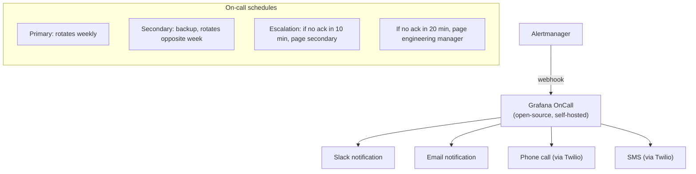

> **Complexity**: `[COMPLEX]` | Time: 60 minutes
>
> **Prerequisites**: [Module 7.3: Node Failure & Auto-Remediation](../module-7.3-node-remediation/), [Module 4.1: Storage Architecture](/on-premises/storage/module-4.1-storage-architecture/)

---

## Why This Module Matters

In November 2023, an e-commerce company migrated from AWS EKS to on-premises Kubernetes. Their cloud setup had been straightforward: CloudWatch for logs, CloudWatch Metrics for monitoring, X-Ray for tracing, and PagerDuty for alerting. One AWS bill covered everything.

When they moved to bare metal, they initially considered using Datadog. However, at roughly $23/host/month for the infrastructure plan, the cost for their 400-node fleet would exceed $110,000/year. Furthermore, SaaS monitoring required opening internet egress for telemetry, violating their strict data sovereignty and air-gapped compliance requirements.

Forced to build a self-hosted stack, the infrastructure team assumed they could replicate their cloud observability in a weekend. They deployed a single Prometheus instance, pointed Grafana at it, and called it done.

Three months later, Prometheus crashed. It had been ingesting 800,000 samples per second across 400 nodes, and its local storage had grown to 1.2TB. The default 15-day retention period consumed all available disk space on the monitoring node. When Prometheus restarted, it took 45 minutes to replay the WAL (Write-Ahead Log), during which there was zero monitoring visibility. The team later discovered that Prometheus had been silently dropping samples for a week due to memory pressure, so their dashboards had gaps nobody noticed. Meanwhile, container logs were being written to local disk and rotated away after 24 hours -- they had no centralized logging at all.

The rebuild took six weeks: Prometheus with Thanos for long-term storage and high availability, Loki for centralized logging, a proper Alertmanager cluster with on-call rotation, and IPMI exporters for hardware-level metrics. Total cost: $15,000 in additional hardware and 240 engineering hours. The lesson: observability on bare metal is not a weekend project. It is a production system that requires the same care as the workloads it monitors.

---

## What You'll Be Able to Do

After completing this module, you will be able to:

1. **Deploy** a production-grade observability stack (Prometheus/Thanos, Loki, Alertmanager) sized for bare-metal cluster scale
2. **Configure** IPMI and hardware-level exporters to monitor physical infrastructure alongside Kubernetes metrics
3. **Design** a high-availability monitoring architecture that survives the failures it is meant to detect
4. **Implement** on-call alerting pipelines with proper severity classification, escalation policies, and runbook integration

---

## What You'll Learn

- Self-hosted Prometheus architecture with Thanos for long-term storage
- Grafana deployment at scale (dashboards, provisioning, multi-tenancy)
- Loki for centralized logging (replacing CloudWatch/Stackdriver)
- Distributed tracing self-hosted architectures (OpenTelemetry, Jaeger, Tempo)
- Alertmanager configuration with on-call rotation
- IPMI exporter for hardware-level monitoring
- Capacity planning for the monitoring stack itself

---

## Prometheus + Thanos Architecture

Prometheus 3.x is the current major release line (latest stable v3.11.1) and is a CNCF graduated project. It natively supports UTF-8 characters in metric names by default and stabilized native OTLP ingestion (originally introduced experimentally in v2.47.0). Note that Prometheus LTS releases receive security and bug fixes for one year, while older 2.x versions are considered legacy.

Despite these capabilities, a single Prometheus instance cannot scale to large bare metal clusters. Thanos (a CNCF incubating project) extends Prometheus with global querying, long-term storage, and high availability.



> **Pause and predict**: A single Prometheus instance with a 15-day retention crashed under 800K samples/second. What architectural change would prevent this from happening again, and how would you handle the need for 1-year retention?

### Prometheus Configuration for Bare Metal

This configuration is optimized for bare-metal clusters: a 30-second scrape interval (15s is often used in tutorials but is overkill for most infrastructure metrics), HA labeling for Thanos deduplication, and scrape targets that include IPMI and SMART exporters unique to physical infrastructure.

```yaml
# prometheus.yaml — optimized for bare metal
global:
  scrape_interval: 30s        # 15s is overkill for most bare metal
  evaluation_interval: 30s
  external_labels:
    cluster: production
    replica: ha-a              # for Thanos deduplication

# Scrape configs for bare metal targets
scrape_configs:
  # Kubernetes service discovery
  - job_name: kubelet
    scheme: https
    tls_config:
      ca_file: /var/run/secrets/kubernetes.io/serviceaccount/ca.crt
    bearer_token_file: /var/run/secrets/kubernetes.io/serviceaccount/token
    kubernetes_sd_configs:
      - role: node
    relabel_configs:
      - action: labelmap
        regex: __meta_kubernetes_node_label_(.+)

  # Node exporter (system metrics)
  - job_name: node-exporter
    kubernetes_sd_configs:
      - role: endpoints
    relabel_configs:
      - source_labels: [__meta_kubernetes_endpoints_name]
        regex: node-exporter
        action: keep

  # IPMI exporter (hardware metrics)
  # BMCs speak IPMI, not HTTP — use the multi-target exporter pattern
  # where Prometheus scrapes the ipmi-exporter and passes the BMC address
  # as a URL parameter (similar to blackbox-exporter)
  - job_name: ipmi
    static_configs:
      - targets:
          - bmc-worker-01
          - bmc-worker-02
          # ... all BMC addresses (no port — these are IPMI targets)
    metrics_path: /ipmi
    params:
      module: [default]
    relabel_configs:
      - source_labels: [__address__]
        target_label: __param_target
      - source_labels: [__param_target]
        target_label: instance
      - target_label: __address__
        replacement: ipmi-exporter:9290   # the actual exporter service

  # SMART disk metrics (via standalone smartctl_exporter)
  # Note: if using Node Exporter's textfile collector for SMART data,
  # remove this job — the metrics are already scraped by the node-exporter job above
  - job_name: smartmon
    kubernetes_sd_configs:
      - role: node
    relabel_configs:
      - source_labels: [__address__]
        regex: (.+):(.+)
        target_label: __address__
        replacement: $1:9633
    metrics_path: /metrics
```

### Thanos Sidecar Deployment

Deploy each Prometheus as a StatefulSet with a Thanos sidecar container. Key Prometheus flags for Thanos compatibility:
- `--storage.tsdb.retention.time=48h` (short local retention, Thanos handles long-term)
- `--storage.tsdb.min-block-duration=2h` and `--storage.tsdb.max-block-duration=2h` (required for Thanos block upload)
- `--web.enable-lifecycle` (allows Thanos sidecar to trigger reloads)

The sidecar uploads completed TSDB blocks to object storage (MinIO) and serves real-time data via the Thanos StoreAPI. Configure the object store connection in a Secret with an S3-compatible endpoint, bucket name, and credentials.

*(Note: As an alternative to Thanos, many on-premises environments adopt VictoriaMetrics—latest LTS v1.136.3—as a highly efficient, drop-in replacement for Prometheus long-term storage.)*

---

## Grafana Deployment at Scale

To operate Grafana (latest stable v12.4.2) reliably for multiple teams on bare metal, avoid manual dashboard creation. Instead, manage Grafana as code.

### Provisioning and Multi-Tenancy

Use Grafana's provisioning feature to load dashboards and datasources automatically from ConfigMaps. For multi-tenancy, configure Grafana Organizations or Teams, mapping corporate OIDC/LDAP groups to specific Grafana roles. To run Grafana as a highly available pair (as recommended in the sizing guidelines), configure it to use a shared external database like PostgreSQL rather than the default local SQLite, ensuring user sessions and dashboard states survive pod restarts.

---

## Loki for Centralized Logging

Loki (latest stable v3.7.1) replaces CloudWatch Logs and Stackdriver Logging. Unlike Elasticsearch, Loki indexes only metadata (labels), not the full log text, making it dramatically cheaper to operate.



> **Stop and think**: Loki indexes only labels (namespace, pod, container), not the full log text. This makes it 10-100x cheaper than Elasticsearch. What is the trade-off? When would this design choice make troubleshooting harder?

### Loki Deployment

This configuration uses S3-compatible storage (MinIO) for log chunks and the TSDB index format for efficient queries. The `retention_period` controls how long logs are kept, and `per_stream_rate_limit` prevents a single noisy application from overwhelming the ingestion pipeline.

```yaml
# loki-config.yaml
auth_enabled: false

server:
  http_listen_port: 3100

common:
  path_prefix: /loki
  storage:
    s3:
      endpoint: minio.storage.svc.cluster.local:9000
      bucketnames: loki-chunks
      access_key_id: ${MINIO_ACCESS_KEY}
      secret_access_key: ${MINIO_SECRET_KEY}
      insecure: true
      s3forcepathstyle: true

schema_config:
  configs:
    - from: 2024-01-01
      store: tsdb
      object_store: s3
      schema: v13
      index:
        prefix: index_
        period: 24h

limits_config:
  retention_period: 30d           # keep logs for 30 days
  max_query_lookback: 30d
  ingestion_rate_mb: 10           # per-tenant ingestion rate
  per_stream_rate_limit: 3MB

storage_config:
  tsdb_shipper:
    active_index_directory: /loki/index
    cache_location: /loki/cache
```

Promtail runs as a DaemonSet, mounting `/var/log` and `/var/log/pods` as read-only host volumes. It tails container logs and ships them to Loki with labels extracted from the Kubernetes metadata. To improve query performance, configure Promtail `pipeline_stages` to extract additional high-value labels like `level` or `component`.

### Troubleshooting Loki Query Performance

If queries for older logs become extremely slow (e.g., 30+ seconds), check these common bottlenecks:
1. **Missing Chunk Cache**: Loki reads chunks from MinIO for every historical query. Deploying a Memcached cluster for chunk caching is a quick win that typically reduces query times by 5-10x.
2. **Too Few Label Indexes**: If logs only have `namespace` and `pod` labels, Loki must scan massive chunks. Add more labels in Promtail.
3. **Object Storage Latency**: If MinIO disks are shared with other workloads, I/O contention will stall Loki.
4. **Large Chunk Size**: The default `chunk_target_size` (1.5MB) may be too large for your ingestion rate; reducing it can speed up queries.
5. **Legacy Indexing**: Ensure you are using the `tsdb` index format, not the legacy BoltDB shipper.

---

## Distributed Tracing on Bare Metal

While metrics and logs cover most infrastructure issues, application performance on bare metal often requires distributed tracing. OpenTelemetry (a CNCF graduated project, latest Collector release v0.149.0) has become the standard framework for gathering traces.

For the storage and querying backend:
- **Jaeger**: A CNCF graduated project. Note that Jaeger v1 reached end-of-life on December 31, 2025. You should deploy Jaeger v2 (latest stable v2.17.0), which now natively uses the OpenTelemetry Collector framework as its core.
- **Grafana Tempo**: (Latest stable v2.10.3) An alternative that integrates deeply with Grafana and uses object storage (like MinIO) for highly cost-effective trace retention.
- **Agent Migration**: If you historically used Grafana Agent for telemetry collection, be aware that it reached end-of-life on November 1, 2025, and has been replaced by Grafana Alloy.

> **Stop and think**: If Jaeger v1 has reached end-of-life and Grafana Agent is deprecated, how should you architect a new tracing pipeline today?

---

## Alertmanager Without PagerDuty

On-premises environments often cannot use cloud-based alerting services due to network isolation or compliance requirements. Alertmanager (latest stable v0.32.0) supports direct integrations to bridge this gap.

### Alertmanager Configuration

Alertmanager routes alerts based on labels. Configure multiple receivers with escalation:

- **Hardware critical alerts** (`severity=critical, category=hardware`): webhook to on-call system + email, repeat every 15 minutes
- **Application critical alerts**: webhook + email, repeat every 30 minutes
- **Warnings**: email only, repeat every 24 hours

Group alerts by `alertname`, `cluster`, and `namespace` to reduce noise. Use `group_wait: 30s` to batch alerts that fire simultaneously (e.g., multiple nodes losing power). Ensure every alert rule includes a `runbook_url` annotation linking directly to the mitigation steps.

### Alerting Across Network Boundaries

When the Kubernetes cluster resides in a datacenter VLAN isolated from the corporate network, alerts sent to an internal SMTP server may be silently dropped by firewalls. To diagnose this, check the Alertmanager logs (`kubectl logs -n monitoring alertmanager-0`) for connection timeouts, or use a `busybox` pod with `nc -zv` to test SMTP reachability. If you cannot open the firewall, the most robust fix is to deploy a local SMTP relay (like Postfix) in the monitoring namespace that is explicitly allowed to forward mail to the corporate server.

### Self-Hosted On-Call with Grafana OnCall



---

## IPMI Exporter for Hardware Monitoring

The IPMI exporter exposes BMC sensor data as Prometheus metrics, giving you visibility into temperatures, fan speeds, voltages, and PSU status.

### Deploying IPMI Exporter

Deploy the `prometheuscommunity/ipmi-exporter` as a Deployment in the monitoring namespace. Configure it with BMC credentials stored in a Kubernetes Secret, using the `LAN_2_0` driver with `bmc`, `ipmi`, and `dcmi` collectors. Prometheus scrapes each BMC address through the exporter's `/ipmi` endpoint.

### Key IPMI Metrics to Monitor

| Metric | Alert Threshold |
|--------|-----------------|
| `ipmi_temperature_celsius{name="CPU Temp"}` | > 85 (CPU), > 45 (ambient) |
| `ipmi_fan_speed_rpm{name="Fan 1"}` | < 1000 (fan failure) |
| `ipmi_voltage_volts{name="12V"}` | +/- 10% of nominal (11.4V warning) |
| `ipmi_power_watts{name="System Power"}` | > 90% of PSU rated capacity |
| `ipmi_sensor_state{name="PSU Status"}` | != 0 (any critical state) |

---

## Capacity Planning for Monitoring

The monitoring stack itself needs resources. Undersizing it leads to the monitoring system failing when you need it most.

### Data Volume and Retention Math

Prometheus TSDB is highly optimized, compressing raw samples down to an average of 2 bytes per sample. You can calculate your storage needs using this formula: `samples_per_second * 2 bytes * 86,400 seconds`.
For example, a cluster ingesting 500,000 samples per second generates ~1 MB/s, or ~84 GB per day.
- **Local Storage (48 hours)**: Requires ~168 GB of fast NVMe storage per Prometheus replica.
- **Long-Term Storage (1 year)**: Keeping 1 year of data locally would require ~30 TB of disk, which is expensive and slows down queries. Instead, Thanos offloads this to MinIO object storage. With Thanos Compactor downsampling historical data, 1 year of metrics will consume approximately 3 TB of object storage.

### Sizing Guidelines

| Component | CPU | Memory | Disk | Notes |
|-----------|-----|--------|------|-------|
| Prometheus (x2) | 4 CPU | 16 GB | 200 GB | HA pair, 48h ret |
| Thanos Query | 2 CPU | 4 GB | - | Stateless |
| Thanos Store GW | 2 CPU | 8 GB | 50 GB | Cache for S3 |
| Thanos Compact | 2 CPU | 4 GB | 100 GB | Downsampling |
| Loki (x3) | 2 CPU | 8 GB | 50 GB | HA mode |
| Grafana (x2) | 1 CPU | 2 GB | - | HA pair |
| Alertmanager(x3) | 0.5 CPU | 1 GB | - | HA cluster |
| MinIO (x4) | 2 CPU | 8 GB | 1000 GB | Object store |
| **Total** | **~30 CPU** | **~90 GB** | **~1.6 TB** | |

> **Pause and predict**: Your monitoring stack itself needs 30 CPU and 90 GB RAM for a 100-node cluster. If monitoring runs on the same nodes as workloads and a major incident causes resource contention, what happens to your ability to diagnose the incident?

### Prometheus Cardinality Management

High cardinality (too many unique time series) is the primary cause of Prometheus OOM crashes. Each unique combination of metric name and label values creates a separate time series. On bare metal, common offenders are metrics with per-disk, per-NIC, or per-container labels.

```bash
# Find high-cardinality metrics (top 20)
curl -s http://prometheus:9090/api/v1/status/tsdb | jq '
  .data.seriesCountByMetricName |
  sort_by(-.value) |
  .[0:20] |
  .[] | "\(.name): \(.value) series"'
```

---

## Did You Know?

- **Prometheus is a CNCF graduated project**. Created at SoundCloud in 2012 and donated to the CNCF in 2016, it was the second project to graduate after Kubernetes itself. Its pull-based scraping model was inspired by Google's Borgmon.
- **Thanos was named after the Marvel villain** because it brings balance to the Prometheus universe -- specifically, it balances the trade-off between local retention (fast queries) and long-term storage (cheap, durable). The project started at Improbable in 2017.
- **Loki processes logs 10-100x cheaper than Elasticsearch** for the same volume because it indexes only labels, not the full log text. The trade-off is that full-text search requires scanning chunks -- slower for ad-hoc queries but perfectly fast for targeted queries.
- **IPMI (Intelligent Platform Management Interface) was first released in 1998**. Despite being nearly 30 years old, it remains the standard for out-of-band server management. The protocol runs on a dedicated BMC chip with its own network interface and CPU that runs even when the main system is powered off.

---

## Common Mistakes

| Mistake | Problem | Solution |
|---------|---------|----------|
| Single Prometheus instance | SPOF: crash = no monitoring | Deploy HA pair with Thanos deduplication |
| 15-day local retention | Fills disk, crashes Prometheus | Use 48h local + Thanos for long-term |
| No log aggregation | Logs lost on container restart or node failure | Deploy Loki + Promtail DaemonSet |
| Alertmanager singleton | Missed alerts if Alertmanager crashes | Deploy 3-node Alertmanager cluster |
| Monitoring on workload nodes | Resource contention during incidents | Dedicated monitoring nodes or guaranteed resources |
| No IPMI monitoring | Hardware failures are invisible | Deploy IPMI exporter for temperature, PSU, fan metrics |
| Unbounded label cardinality | Prometheus OOM from millions of series | Drop high-cardinality labels via relabeling |
| No monitoring-of-monitoring | Monitoring stack fails silently | External black-box probe (ping from outside cluster) |

---

## Quiz

### Question 1
Your Prometheus instance is ingesting 500,000 samples per second with 30-second scrape intervals across 200 bare metal nodes. You are currently mandated to retain 1 year of metrics retention to comply with auditing requirements. How do you architect this without causing continuous Out-Of-Memory (OOM) crashes?

<details>
<summary>Answer</summary>

To architect this successfully, you must split the storage responsibilities between fast local storage and long-term object storage. Increasing the Prometheus local retention to one year would require roughly 30 TB of expensive NVMe disk per instance, which is cost-prohibitive and severely degrades query performance. Instead, you should deploy a highly available Prometheus pair with 48-hour local retention and attach Thanos sidecars to continuously upload compressed metric blocks to a MinIO cluster. A Thanos Compactor then downsamples the historical data to 5-minute and 1-hour intervals, drastically reducing the required long-term storage to around 3 TB while maintaining fast query performance across the entire year.
</details>

### Question 2
Your Loki cluster is receiving logs from 200 nodes successfully, but when engineers attempt to query logs older than 2 days, the queries are timing out or taking upwards of 30 seconds to return. What is likely wrong with the ingestion or querying pipeline, and how do you fix it?

<details>
<summary>Answer</summary>

When querying historical logs, Loki must retrieve compressed chunks from the object storage backend (MinIO) because it does not keep full log text in its index. If you have not configured a chunk cache, Loki incurs massive network I/O and object storage latency for every historical query, slowing responses to a crawl. You can fix this by deploying a Memcached cluster and configuring Loki to use it, which caches frequently accessed chunks in memory. Additionally, if your log streams have too few labels, Loki is forced to download and scan excessively large chunks to find matching lines, so adding targeted labels in Promtail for high-cardinality data like `component` or `level` will reduce the scan size and speed up queries significantly.
</details>

### Question 3
Your Alertmanager is configured to send critical hardware alerts via email, but the SMTP server resides on the corporate network while your Kubernetes cluster operates in a strictly separated datacenter VLAN. Alerts are firing in the UI but are never arriving in your inbox. How do you diagnose and reliably fix this routing issue?

<details>
<summary>Answer</summary>

Alerts are likely being dropped because the datacenter VLAN firewall blocks outbound traffic on port 587 (SMTP) to the corporate network. You can diagnose this by checking the Alertmanager logs for connection timeouts or by running a diagnostic pod with `nc -zv smtp.internal 587` to confirm network unreachability. To resolve this without compromising network isolation, you should deploy a local SMTP relay, such as Postfix, directly within the monitoring namespace. Alertmanager can then route emails to this local relay without traversing the firewall, and the network team only needs to whitelist the relay pod's IP to forward mail to the corporate SMTP server.
</details>

### Question 4
You are building the monitoring stack for a new 150-node bare metal cluster. The infrastructure manager asks: "Our cloud team uses Datadog successfully. Can we just install the Datadog agent on these new servers and be done with it?" What are the core architectural and business trade-offs of using Datadog versus a self-hosted stack on bare metal?

<details>
<summary>Answer</summary>

While Datadog provides a turnkey SaaS solution with zero maintenance overhead, it becomes astronomically expensive at bare-metal scale, costing over $40,000 annually just for the infrastructure tier on 150 nodes. Additionally, SaaS monitoring requires opening outbound internet access for telemetry, which often violates strict data sovereignty and air-gapped compliance requirements common in on-premises environments. In contrast, a self-hosted stack using Prometheus, Thanos, and Loki keeps all telemetry data securely within your private network and avoids per-node licensing fees. The trade-off is that self-hosting requires significant upfront engineering time to architect correctly and ongoing operational effort to manage capacity, upgrades, and high availability.
</details>

---

## Hands-On Exercise: Deploy a Monitoring Stack

**Task**: Deploy Prometheus, Grafana, and Alertmanager on a kind cluster using the community Helm chart.

### Setup

```bash
# Create a kind cluster
kind create cluster --name monitoring-lab

# Install kube-prometheus-stack via Helm (latest version 83.4.0)
helm repo add prometheus-community https://prometheus-community.github.io/helm-charts
helm repo update

helm install monitoring prometheus-community/kube-prometheus-stack \
  --namespace monitoring \
  --create-namespace \
  --version 83.4.0 \
  --wait \
  --timeout 10m \
  --set grafana.adminPassword=admin \
  --set prometheus.prometheusSpec.retention=24h
```

### Steps

1. **Verify all components are running:**
   ```bash
   kubectl wait --for=condition=Ready pods --all -n monitoring --timeout=300s
   kubectl get pods -n monitoring
   ```

2. **Access Grafana:**
   Open a second terminal window to run the port-forward without blocking your prompt:
   ```bash
   kubectl port-forward -n monitoring svc/monitoring-grafana 3000:80
   # Open http://localhost:3000 (admin/admin)
   ```

3. **Explore the pre-built dashboards** for node metrics, pod metrics, and Kubernetes components.

4. **Create a test alert:**
   ```bash
   kubectl apply -f - <<'EOF'
   apiVersion: monitoring.coreos.com/v1
   kind: PrometheusRule
   metadata:
     name: test-alert
     namespace: monitoring
     labels:
       release: monitoring    # Required for Prometheus Operator to discover this rule
   spec:
     groups:
       - name: test
         rules:
           - alert: HighCPU
             expr: node_cpu_seconds_total > 0
             for: 1m
             labels:
               severity: warning
             annotations:
               summary: "Test alert: CPU is being used"
               runbook_url: "https://internal-wiki.example.com/runbooks/high-cpu"
   EOF
   ```

5. **Verify the alert fires in Alertmanager:**
   Open a third terminal window for this port-forward to avoid interrupting Grafana:
   ```bash
   kubectl port-forward -n monitoring svc/monitoring-kube-prometheus-alertmanager 9093:9093
   # Open http://localhost:9093
   ```

### Success Criteria

- [ ] Prometheus is scraping all cluster targets
- [ ] Grafana shows node and pod metrics on dashboards
- [ ] Alertmanager is receiving and displaying alerts
- [ ] Understand the difference between Prometheus local storage and Thanos long-term storage
- [ ] Can explain why IPMI exporter is essential for bare metal but irrelevant in the cloud

### Cleanup

```bash
kind delete cluster --name monitoring-lab
```

---

## Next Module

Continue to [Module 7.5: Capacity Expansion & Hardware Refresh](/on-premises/operations/module-7.5-capacity-expansion/) to learn how to add new racks, handle mixed CPU generations, and plan hardware refresh cycles.