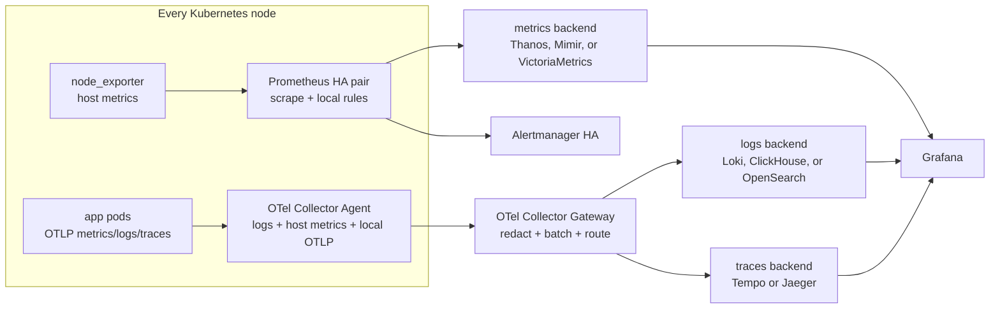
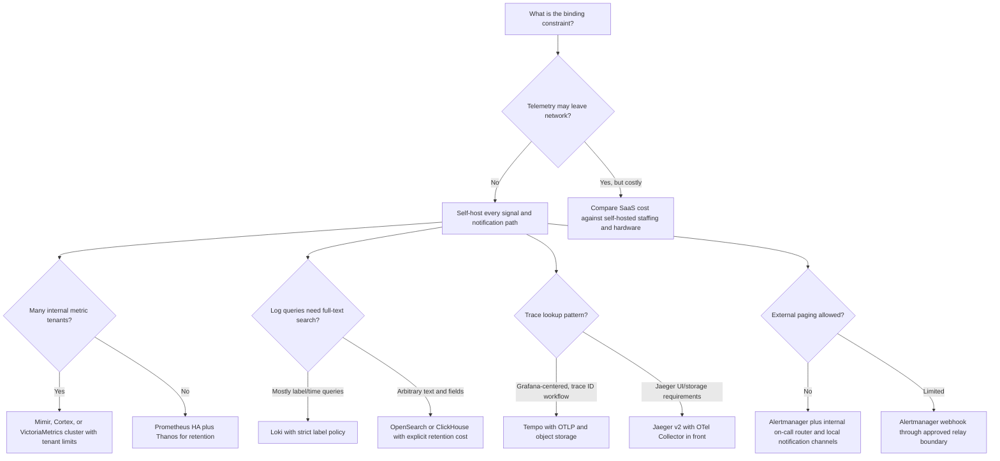

> **Complexity**: `[COMPLEX]`
>
> **Time to Complete**: 90 minutes
>
> **Prerequisites**: [Module 7.3: Node Failure & Auto-Remediation](../module-7.3-node-remediation/), [Module 4.1: Storage Architecture](/on-premises/storage/module-4.1-storage-architecture/), basic Prometheus and Kubernetes troubleshooting experience

---

## Learning Outcomes

- **Design** a no-SaaS Kubernetes observability architecture that keeps metrics, logs, traces, alerts, and dashboards inside a regulated or disconnected network.
- **Compare** self-hosted metric, log, and trace backends by matching Prometheus, Thanos, Cortex, Mimir, VictoriaMetrics, Loki, ClickHouse, OpenSearch, Tempo, and Jaeger to concrete operational constraints.
- **Implement** an OpenTelemetry Collector ingest tier that routes metrics, logs, and traces to private backends while enforcing memory, batching, metadata, and retention boundaries.
- **Evaluate** alerting and on-call patterns that replace PagerDuty-style SaaS with Alertmanager clustering, internal notification paths, and self-hosted escalation tooling.
- **Estimate** the hardware and retention cost of a three-tier observability stack, then tune retention, sampling, indexing, and HA placement to avoid losing observability during incidents.

## Why This Module Matters

Hypothetical scenario: a defense contractor has three Kubernetes clusters in a facility where outbound internet access is blocked by policy, packet captures are audited, and production telemetry is classified as operational data. The application teams have grown used to cloud observability suites in other environments, so the first migration plan says "install the agent, open egress to the vendor, and map dashboards later."

Security rejects that plan immediately because metrics can expose customer identifiers, logs can contain request payload fragments, traces can show internal service names, and alert destinations can leak incident timing.

The technical constraint is stricter than "save money by not using a SaaS tool." The platform team must collect enough signal to debug incidents, prove compliance, retain audit evidence, and page humans, while assuming that no managed log service, hosted trace backend, external notification broker, or vendor-controlled dashboard can be part of the steady-state path. In this world, observability is not a subscription you turn on. It is an internal production platform with storage, networking, identity, capacity, backup, upgrade, and incident-response responsibilities.

This module teaches that operating model. Module 7.8 later goes deeper on scaling the observability stack once volumes become very large; this module answers the earlier architectural question: what do you run when data cannot leave your perimeter at all? You will build a private signal flow, choose storage backends deliberately, route alerts without PagerDuty, and size the stack so it still works when the cluster it monitors is under stress.

## Designing for No Egress and No SaaS

The phrase "without cloud services" sounds like a tool choice, but it is really a boundary condition. A team may avoid SaaS observability because the cluster is air-gapped, because regulated telemetry cannot cross national borders, because incident metadata itself is sensitive, because per-host pricing becomes unaffordable on hundreds of bare-metal nodes, or because the organization has made a sovereignty decision that internal operations data stays under internal control.

Each reason changes the design slightly, but all of them force the same discipline: every signal path must have a private destination, every dependency must be installable from an internal registry, and every alert must reach a human without relying on a vendor API.

The first design question is therefore not "Prometheus or Mimir?" It is "where is the trust boundary?" Metrics often look harmless until labels include pod names, tenant identifiers, product names, endpoint paths, or geographic hints. Logs are riskier because developers may accidentally write request bodies, user identifiers, or stack traces with configuration values.

Traces reveal service topology and call paths, which can be just as sensitive in a classified or competitive environment as the payloads themselves. When the trust boundary is the datacenter, every collector, queue, storage bucket, dashboard, and alert relay must live inside that boundary or pass through an explicitly approved sanitization layer.

The second design question is "what must continue working while disconnected?" A cluster that cannot reach the public internet cannot rely on remote dashboards, remote schema registries, hosted container images, SaaS webhook receivers, or cloud object storage during an incident. The observability stack needs internal DNS, internal TLS certificates, internal container images, internal object storage, and internal identity integration before it can be called production.

If any component downloads plugins, dashboards, or rule packs at startup, mirror those artifacts and test the startup path with egress blocked. A no-SaaS architecture that still phones home during a pod restart is not actually no-SaaS.

The third design question is "who owns the stack when it fails?" Cloud observability vendors hide a large amount of operational work: replication, compaction, query acceleration, alert fan-out, on-call schedules, rate limits, storage lifecycle, and backend upgrades. When you self-host, that work returns to the platform team. That does not make self-hosting a bad choice; it makes it an engineering choice with an explicit runbook.

If the team has no plan for object-store saturation, Loki stream explosions, Prometheus WAL replay, Collector backpressure, or Alertmanager peer loss, then the system is not cheaper than SaaS. The cost has merely moved from an invoice to operational risk.

The operating model also includes a telemetry supply chain. Images for Prometheus, Grafana, Loki, Tempo, Jaeger, exporters, and collectors must be mirrored into the internal registry before a maintenance window begins. Helm charts, Jsonnet libraries, dashboards, alert rules, and Grafana plugins need the same treatment. If the platform team can rebuild the stack only while connected to the public internet, the disconnected design is still dependent on the public internet at the worst possible moment.

A second often-missed item is local documentation. A runbook link that resolves to a public SaaS wiki, a vendor support page, or a dashboard library is not usable in an air-gapped incident. Store runbooks, diagrams, restore steps, and escalation contacts in an internal system that is reachable from the management network. The test is simple: disconnect a laptop from the internet, connect it to the datacenter management network, and verify that an operator can still follow the incident path.

Finally, define evidence requirements before data starts flowing. Regulated teams may need proof that telemetry stayed inside the boundary, proof that retention was enforced, and proof that privileged operators did not query restricted logs without approval. That means audit logs for Grafana access, object-store access, configuration changes, and alert silences. Observability without cloud services is also observability with local accountability.

The safest pattern is to describe observability as a private utility service with three zones. The edge collection zone runs close to workloads and nodes, usually as DaemonSets and cluster-local scraping. The durable storage zone owns retention, replication, compaction, indexing, and backups. The human operations zone owns dashboards, alert routing, on-call schedules, runbooks, and audit trails.

Keeping those zones separate makes it easier to reason about blast radius: a bad application logger should not crash the on-call scheduler, a Grafana dashboard storm should not stop ingestion, and a failed object-store node should not prevent current critical alerts from firing.

```text
+-------------------+       +------------------------+       +----------------------+
| Edge Collection   |       | Durable Storage        |       | Human Operations     |
|-------------------|       |------------------------|       |----------------------|
| Prometheus scrape |-----> | Thanos / Mimir / VM    |-----> | Grafana dashboards   |
| OTel agents       |-----> | Loki / ClickHouse      |-----> | Alertmanager routes  |
| node exporters    |-----> | Tempo / Jaeger         |-----> | on-call escalation   |
| log tailing       |       | private object storage |       | runbooks and audits  |
+-------------------+       +------------------------+       +----------------------+
          |                              |                              |
          +----------- all paths remain inside the network -------------+
```

Pause and predict: if the firewall team accidentally blocks all outbound internet from the monitoring namespace, which parts of your current design would fail? A mature no-SaaS design treats that firewall rule as a routine test, not as an outage. You should expect collectors to keep sending to private services, Grafana to load dashboards without plugin downloads, alert relays to use internal notification paths, and retention jobs to continue writing to private object storage.

There is one more practical boundary: the observability stack must not depend on the same failure domain it is meant to diagnose. If every monitoring pod runs on the same worker pool as the applications, a workload CPU storm can starve Prometheus, Loki, and the Collector at the moment they are most needed. If the object store for traces shares the same disks as the application database, storage pressure can blind both the service and the diagnostic path.

The minimal production design reserves node capacity, storage classes, network policy, and disruption budgets for observability components as first-class infrastructure, not as best-effort platform add-ons.

## The Self-Hosted Signal Stack

A practical no-SaaS stack starts with the boring, composable pieces: Prometheus for scrape-based metrics and local alert rule evaluation, Grafana for dashboards, Loki for cost-conscious log aggregation, Tempo or Jaeger for traces, and the OpenTelemetry Collector as the universal ingest and routing tier. This is not the only valid stack, but it is a useful baseline because it keeps open protocols at the boundary.

Prometheus exposes PromQL and remote write, Loki exposes LogQL and OTLP log ingestion paths, Tempo and Jaeger understand OTLP traces, and the Collector can receive, enrich, sample, redact, batch, and forward all three major signals.

The reason to put the OpenTelemetry Collector in the middle is control. Without a shared ingest tier, every application and exporter chooses its own destination, retry behavior, metadata model, and failure mode. With a Collector tier, the platform team can enforce common labels, drop unsafe attributes, attach tenant and cluster identifiers, limit memory, batch efficiently, and change backends without redeploying every application.

In a disconnected environment, that control is also a security tool: the Collector can be the place where sensitive attributes are removed before traces reach a broader internal audience, while raw logs stay in a restricted namespace with a shorter retention window.

Use a two-tier Collector pattern unless your cluster is very small. The agent tier runs as a DaemonSet on every node and collects local signals: container logs from `/var/log/pods`, host metrics, kubelet-related attributes, and application telemetry sent to a node-local endpoint.

The gateway tier runs as a Deployment or StatefulSet behind an internal service and performs heavier work: tail sampling, tenant routing, cross-signal enrichment, write fan-out, and policy enforcement. The separation matters because agents should be cheap, local, and resilient, while gateways can be scaled and isolated like any other shared service.


```mermaid
flowchart LR
    subgraph Nodes["Every Kubernetes node"]
        A1["OTel Collector Agent\nlogs + host metrics + local OTLP"]
        A2["node_exporter\nhost metrics"]
        A3["app pods\nOTLP metrics/logs/traces"]
        A3 --> A1
        A2 --> P1
    end

    P1["Prometheus HA pair\nscrape + local rules"]
    A1 --> G1["OTel Collector Gateway\nredact + batch + route"]
    P1 --> M1["metrics backend\nThanos, Mimir, or VictoriaMetrics"]
    G1 --> L1["logs backend\nLoki, ClickHouse, or OpenSearch"]
    G1 --> T1["traces backend\nTempo or Jaeger"]
    M1 --> D1["Grafana"]
    L1 --> D1
    T1 --> D1
    P1 --> AM["Alertmanager HA"]
```

Prometheus remains important even if you adopt a remote metric backend. It is still the simplest reliable collector for Kubernetes control-plane metrics, node exporter metrics, and service discovery based on ServiceMonitor or PodMonitor objects. In a no-egress design, a local Prometheus HA pair can also keep evaluating critical alerts if the long-term storage backend is slow or offline. That local autonomy is the difference between "the central metrics platform is degraded" and "nobody gets paged because the central metrics platform is degraded."

Grafana is the user-facing layer, but it should not be treated as the source of truth. Dashboards, data sources, folders, teams, and alert contact points should be provisioned from version-controlled files or an internal GitOps repository. High availability also requires moving Grafana state out of the default local SQLite database into an external database such as PostgreSQL, then running multiple Grafana pods behind the same internal ingress. This is not about making dashboards pretty; it is about making sure a pod restart does not erase the interface operators use during an outage.

Logs need a stricter contract than metrics because log volume is easy to underestimate. Loki is a strong default when operators usually begin with labels such as cluster, namespace, workload, pod, container, severity, and time range. It indexes labels rather than every word in the log body, which keeps storage and index cost down, but it punishes poor label choices.

A request ID, user ID, trace ID, or raw URL path does not belong in Loki labels. Those values belong in structured log fields, where they can be parsed during a targeted query without creating a new indexed stream for every request.

Traces are the third signal, and they should enter through OTLP unless you are maintaining legacy instrumentation. Tempo is attractive in Grafana-centered environments because it stores traces in object storage and focuses on lookup by trace ID plus TraceQL search. Jaeger is attractive when teams already know its UI, need its storage options, or want a tracing platform whose v2 architecture is closely aligned with OpenTelemetry Collector components.

In both cases, the operating model should start with sampling and retention policy. Collecting every span forever is rarely useful, and in an on-premises cluster it can quietly become the largest storage consumer in the observability stack.

The following gateway configuration illustrates the contract. It accepts OTLP over gRPC and HTTP, protects itself with a memory limiter, enriches records with Kubernetes metadata, batches for throughput, and routes each signal to a private backend. The endpoints use internal service names, not vendor URLs, and the configuration is intentionally backend-neutral enough that a platform team can swap a destination by changing one exporter rather than every application.

```yaml
receivers:
  otlp:
    protocols:
      grpc:
        endpoint: 0.0.0.0:4317
      http:
        endpoint: 0.0.0.0:4318

processors:
  memory_limiter:
    check_interval: 1s
    limit_mib: 1024
    spike_limit_mib: 256
  k8sattributes:
    auth_type: serviceAccount
    extract:
      metadata:
        - k8s.cluster.uid
        - k8s.namespace.name
        - k8s.pod.name
        - k8s.container.name
  resource/no_egress_labels:
    attributes:
      - key: deployment.environment.name
        value: production
        action: upsert
      - key: telemetry.boundary
        value: internal-only
        action: upsert
  batch:
    send_batch_size: 8192
    timeout: 5s

exporters:
  prometheusremotewrite:
    endpoint: http://mimir-nginx.monitoring.svc.cluster.local/api/v1/push
    headers:
      X-Scope-OrgID: platform
  otlphttp/loki:
    endpoint: http://loki-gateway.monitoring.svc.cluster.local/otlp
  otlp/tempo:
    endpoint: tempo-distributor.monitoring.svc.cluster.local:4317
    tls:
      insecure: true

service:
  pipelines:
    metrics:
      receivers: [otlp]
      processors: [memory_limiter, k8sattributes, resource/no_egress_labels, batch]
      exporters: [prometheusremotewrite]
    logs:
      receivers: [otlp]
      processors: [memory_limiter, k8sattributes, resource/no_egress_labels, batch]
      exporters: [otlphttp/loki]
    traces:
      receivers: [otlp]
      processors: [memory_limiter, k8sattributes, resource/no_egress_labels, batch]
      exporters: [otlp/tempo]
```

Before running a Collector like this in production, decide what happens when a backend is down. The memory limiter protects the pod from OOMKills, but it does not make storage infinite. Batching increases throughput, but it can also hide a growing queue for a short time.

For disconnected and regulated environments, the right answer is explicit backpressure and visible loss accounting: alert on exporter queue growth, dropped records, backend write failures, and Collector restarts. Silent telemetry loss is worse than a noisy failure because it creates false confidence during an incident.

## Storage and Retention Choices Under Sovereignty

Long-term storage is where no-SaaS observability becomes a real platform. A single Prometheus with local disk is excellent for a small cluster and short retention, but it is not a durable audit store. Prometheus stores local samples in two-hour blocks and protects current writes with a write-ahead log, yet its own documentation is clear that local storage is not arbitrarily scalable or magically replicated.

If you need one year of retention, cross-cluster query, or survival of a monitoring node loss, you must choose a long-term metric backend and an object-storage strategy that your datacenter can operate.

For metrics, the common choices are Thanos, Cortex, Mimir, and VictoriaMetrics. Thanos extends existing Prometheus deployments by adding sidecars, a global query layer, store gateways, and compaction against object storage. It fits organizations that already trust Prometheus and want long retention without replacing the scrape path.

Cortex and Mimir use a remote-write platform model: Prometheus or agents push samples into distributors and ingesters, then query components read recent data from ingesters and older blocks from object storage. Mimir is the more modern Grafana-led continuation of that model, while Cortex remains a valid open-source system with a similar heritage.

VictoriaMetrics offers Prometheus-compatible APIs with a focus on efficiency and a different operational shape, including single-node and clustered modes.

| Metric backend | Best fit | Main trade-off | No-SaaS note |
|---|---|---|---|
| Prometheus only | Small clusters, short retention, local alerting | Simple but limited by one process and local disk | Keep retention short and back up rules, not raw TSDB |
| Thanos | Existing Prometheus estate needing global query and object storage | Recent data depends on live sidecars; tenancy is not the default model | Works well with private S3-compatible storage such as MinIO or Ceph RGW |
| Cortex | Mature remote-write platform with multi-tenant roots | More moving parts than Thanos | Use when the team already operates Cortex or needs its exact interfaces |
| Mimir | New shared metrics platform with tenant isolation and high ingest | Requires ring, cache, object store, and operational maturity | Strong fit for internal platform teams serving many teams |
| VictoriaMetrics | Efficient Prometheus-compatible storage with simpler paths for some teams | Different query and clustering semantics require testing | Attractive when hardware footprint is the binding constraint |

Do not choose these tools by feature checklist alone. In an air-gapped environment, the decisive question is often "which failure mode can this team debug at 03:00 with no vendor support chat and no public docs access?" Thanos is easier to reason about if your team already understands Prometheus blocks and sidecars. Mimir is easier to govern when tenants need hard limits and query isolation. VictoriaMetrics can be compelling where hardware cost is tight, but you should validate ingestion behavior, HA semantics, backup, and restore with your own scrape patterns before standardizing on it.

For logs, the decision is less about brand names and more about query shape. Loki is efficient when labels narrow the search space before log chunks are scanned. ClickHouse is excellent for high-volume structured events where teams want SQL, columnar compression, and explicit schema design. OpenSearch is appropriate when teams need full-text search, indexed fields, and familiar search workflows, but it usually costs more in CPU, memory, and storage than Loki for the same raw volume. A no-SaaS platform may run two log paths: Loki for Kubernetes operational logs and ClickHouse or OpenSearch for regulated application audit events that need richer query semantics.

| Log backend | Choose it when | Avoid it when | Retention implication |
|---|---|---|---|
| Loki | Operators search by labels, time, and structured fields | Teams expect arbitrary full-text search to be instant | Cheap longer retention if labels stay low cardinality |
| ClickHouse | Logs are structured events and SQL analysis matters | Schemas are uncontrolled or every team emits arbitrary text | Retention is managed with partitions and TTL policies |
| OpenSearch | Full-text search and field indexing are core workflows | Hardware budget is tight and logs are mostly operational noise | Retention often needs tiering, rollover, and index lifecycle rules |

For traces, Tempo and Jaeger cover different comfort zones. Tempo keeps the storage model simple by leaning on object storage and trace ID lookup, which is attractive when Grafana is already the primary interface. Jaeger v2 is built on OpenTelemetry Collector concepts and can be deployed with collector, query, ingester, and storage roles, which makes it a strong fit for teams that need Jaeger semantics or storage choices such as Cassandra, Elasticsearch, OpenSearch, ClickHouse, or Badger for smaller cases.

The common mistake is treating traces like logs and trying to keep everything forever. Trace retention should start from the debugging question: how long after a failed request does an engineer realistically need to retrieve its trace?

Pause and predict: a team wants to retain all application logs for one year, all traces for one year, and raw metrics for one year on the same storage system. Which signal will surprise them first, and why?

The answer depends on workload, but logs and traces usually grow with request volume and payload detail, while metrics grow with active series and scrape interval. A sensible policy gives each signal a different retention contract: short raw logs plus longer summarized audit data, short full-fidelity traces plus sampled or tail-selected traces, and metrics downsampled or compacted for historical reporting.

Retention policy is also a compliance artifact. If a regulator requires "audit events for one year," that does not automatically mean "debug logs for one year" or "all spans for one year." Translate the requirement into signal-specific classes: operational metrics, security audit logs, application debug logs, request traces, hardware sensor history, alert history, and dashboard annotations.

Each class should have an owner, retention period, storage backend, restore test, and deletion policy. This is especially important in sovereignty-focused environments because over-retention is a risk too: keeping sensitive logs longer than necessary increases the blast radius of an internal breach.

The storage backend itself deserves observability. Object storage latency can make Thanos, Mimir, Loki, and Tempo all look broken at once. A slow or unhealthy MinIO or Ceph RGW cluster can show up as delayed compaction, slow historical queries, failed block uploads, missing trace results, and log query timeouts. Monitor bucket growth, request latency, error rates, disk saturation, erasure coding health, compactor lag, and cache hit rates. In a no-SaaS design, private object storage is not a passive disk. It is the shared substrate beneath the entire observability platform.

## Alerting and On-Call Without External Paging

Alerting without PagerDuty starts with a hard truth: Alertmanager is an alert router, deduplicator, grouper, inhibitor, and notification sender, but it is not a complete incident-management organization by itself. It can send email, webhooks, chat messages, and other notifications, and it can cluster for high availability. It does not automatically give you rota ownership, escalation acknowledgements, mobile push reliability, incident timelines, or status-page communication.

A no-SaaS platform must decide which of those capabilities are mandatory and which can be implemented with simpler internal systems.

The minimum reliable pattern is a three-node Alertmanager cluster, configured as peers, with routes based on severity, team, service, and environment labels. Prometheus sends alerts to all Alertmanager peers, and the peers deduplicate notifications. Critical user-impacting alerts go to the current on-call path, warnings go to team channels or tickets, and informational alerts stay out of paging entirely.

Every paging alert should include a runbook URL that resolves inside the network, a dashboard URL that works without internet access, and labels that identify the owning team without requiring a human to infer ownership from a pod name.

```yaml
global:
  resolve_timeout: 5m

route:
  receiver: platform-email
  group_by: ["cluster", "service", "alertname"]
  group_wait: 30s
  group_interval: 5m
  repeat_interval: 4h
  routes:
    - matchers:
        - severity = "critical"
        - team = "platform"
      receiver: platform-oncall-webhook
      repeat_interval: 30m
    - matchers:
        - severity = "warning"
      receiver: platform-ticket-webhook
      repeat_interval: 12h

inhibit_rules:
  - source_matchers:
      - alertname = "ObservabilityStorageUnavailable"
    target_matchers:
      - severity = "warning"
    equal: ["cluster"]

receivers:
  - name: platform-email
    email_configs:
      - to: platform-team@example.internal
        from: alertmanager@example.internal
        smarthost: smtp-relay.monitoring.svc.cluster.local:25
        require_tls: false
  - name: platform-oncall-webhook
    webhook_configs:
      - url: http://incident-router.monitoring.svc.cluster.local/api/alertmanager
        send_resolved: true
  - name: platform-ticket-webhook
    webhook_configs:
      - url: http://ticket-router.monitoring.svc.cluster.local/api/create-ticket
        send_resolved: true
```

The on-call layer can be implemented several ways. Grafana OnCall OSS was historically a common self-hosted choice for teams already using Grafana, and its Alertmanager integration was documented. However, as of March 24, 2026, Grafana states that Grafana OnCall OSS is archived and the repository is read-only, so it is not a good greenfield default after that date.

Existing installations need an exit plan, a patch policy, and a test of what still works without Grafana Cloud connections. For new deployments, evaluate actively maintained self-hosted routing tools, a small internally owned rota service, or a conservative email/SMS/voice relay integrated through Alertmanager webhooks.

This is where organizations sometimes confuse "self-hosted" with "free." A reliable paging path may require an internal SMTP relay, a private chat system, a GSM modem or private telephony gateway, a voice provider reachable through an approved boundary, or a ticketing system with after-hours escalation. If the environment is truly air-gapped, mobile push and public SMS APIs may be impossible, and the operational model must say so. A plant-floor operations team may need wall displays, radios, shift handover, and a local network status board more than a smartphone app.

Alert quality matters more when escalation paths are harder to build. A SaaS paging tool can mask sloppy alert design with acknowledgement buttons and incident automation; an internal stack has less room for noise. Page on symptoms tied to user impact, use inhibition to suppress downstream effects, group alerts by failure domain, and route component warnings to ticket queues unless a human must act immediately.

An alert that cannot name an owner, a runbook, and a consequence of inaction should not wake someone. This principle is not softer in regulated environments; it is stricter because every unnecessary page consumes scarce operational attention.

High availability for alerting has two layers. The first is Alertmanager clustering and redundant notification paths. The second is monitoring the alerting system from outside itself.

A black-box probe from a management network should verify that Prometheus can send to Alertmanager, Alertmanager can reach the incident router, the router can create a test notification, and the test notification is acknowledged or recorded. If the only alert for "Alertmanager cannot send alerts" is an Alertmanager alert, the design has a circular dependency.

The paging path needs an out-of-band health check, even if that health check is a simple scheduled synthetic alert.

Self-hosted escalation tools should be evaluated like databases, not like optional UI plugins. Review their storage backend, backup model, authentication integration, audit logs, maintenance status, and failure behavior when a notification channel is unreachable. Then test acknowledgement, escalation, silence, and resolve flows during a network partition. The tool that looks easiest in a demo may be the wrong one if it cannot prove who was paged and when.

A thin internal router can be enough for smaller teams if its contract is explicit. Alertmanager sends a webhook, the router looks up the current primary and secondary engineer from an internal schedule, and it sends email, chat, or local voice notifications through approved channels. That design is less feature-rich than commercial incident platforms, but it can be auditable, small, and fully disconnected.

## Keeping Observability Available During Incidents

The worst time to discover that observability is under-resourced is during a cluster incident. When workloads crash-loop, logs spike. When a network partition occurs, scrape failures and remote-write retries spike. When engineers open dashboards, query load spikes. When storage slows down, compaction and query latency spike. The observability stack is therefore load-correlated with incidents: it receives more data and more human traffic precisely when the rest of the platform is unstable. That is why "best effort" resource requests are unacceptable for production observability components.

Start by assigning dedicated failure domains. At small scale, this may mean taints and tolerations that keep Prometheus, Grafana, Loki, Alertmanager, and Collector gateways on a reserved monitoring node pool. At larger scale, it means spreading replicas across racks, power domains, and storage failure domains.

The goal is not to make the stack immune to every datacenter failure. The goal is to avoid obvious shared fate: a single rack power event should not remove all Alertmanager peers, all Grafana pods, and the only Prometheus that can tell you which rack failed.

Resource guarantees should be explicit. Prometheus needs memory headroom for active series and queries, fast disk for the WAL and local blocks, and CPU for rule evaluation. Loki ingesters need memory for active streams and disk or object-store throughput for chunks. Tempo or Jaeger collectors need queue capacity and sampling controls. Grafana needs database availability more than raw CPU. Alertmanager needs little compute, but it needs stable networking and peer discovery.

The OpenTelemetry Collector needs memory limits, queue metrics, and predictable CPU because overload there can drop multiple signals at once.

The following sizing sketch is not a universal prescription, but it gives a concrete starting point for a 100-node on-premises cluster with moderate application volume and 30 days of operational log retention. The point is to budget observability as infrastructure capacity, not as leftover cluster space. For a larger fleet, Module 7.8 covers deeper scaling patterns; here the key habit is to reserve enough capacity for a complete private stack before the first production workload depends on it.

| Layer | Example components | Starting footprint | Cost lever |
|---|---|---:|---|
| Edge collection | OTel agents, node exporters, log tailing | DaemonSet overhead on every node | Keep parsing light at the edge |
| Hot metrics | Prometheus HA pair, local rules | 8 CPU, 32 GiB RAM, fast 500 GiB NVMe total | Short local retention and series limits |
| Long metrics | Thanos/Mimir/VictoriaMetrics plus object storage | 12 CPU, 48 GiB RAM before object store | Downsampling, tenant limits, query cache |
| Logs | Loki or alternative log backend | 12 CPU, 48 GiB RAM, object storage | Label discipline and retention classes |
| Traces | Tempo or Jaeger plus Collector gateways | 8 CPU, 24 GiB RAM, object storage | Sampling and shorter retention |
| Operations | Grafana, Alertmanager, incident router | 4 CPU, 12 GiB RAM, PostgreSQL | Provisioning as code and HA placement |

Cost is dominated by retention, cardinality, and log volume, not by the Grafana pods. Metrics become expensive when labels create too many active series or scrape intervals are unnecessarily short. Logs become expensive when debug logging stays enabled, high-volume components lack sampling, or teams index dynamic values. Traces become expensive when every request is retained at full fidelity without tail sampling.

Storage also has hidden costs: object-store replication, erasure coding overhead, cache disks, backup copies, and the spare capacity required to survive a disk or node loss.

Retention should therefore be tiered by signal and use case. A common starting policy is 48 hours of local Prometheus data, 30 to 90 days of high-resolution metrics in long-term storage, one year of downsampled business and capacity metrics, 14 to 30 days of operational logs, longer retention only for explicitly classified audit logs, and 3 to 14 days of full-fidelity traces with tail sampling for failed or slow requests.

Those numbers are examples, not law. The important behavior is that every retention period has a reason, owner, and cost estimate.

Pause and predict: if a bad release increases log volume by ten times, which component pages first in your design? If the answer is "the application team when Loki starts rejecting writes," you have a useful boundary. If the answer is "the whole object store fills and metrics disappear too," your storage isolation is too weak. No-SaaS observability does not mean every signal shares one giant bucket with one retention policy. It means each signal has an internal home with failure containment.

Backups and restore tests are part of availability. Grafana dashboards and data sources should be reconstructable from Git, but Grafana users, folders, annotations, and alert silences may live in a database that needs backup. Alertmanager configuration should be versioned, but notification state and silence data may need recovery depending on operating policy.

Long-term metric and log storage needs bucket-level backup or replication if audit retention is mandatory. A private observability stack that cannot be restored after object-store corruption is not compliant just because it never used a public cloud.

Finally, monitor the observability stack with its own service-level objectives. Track scrape freshness, remote-write failures, Collector dropped records, Loki rejected streams, query latency, compactor lag, object-store errors, Alertmanager notification failures, Grafana database errors, and dashboard availability. Put those indicators on a small status dashboard that loads quickly and is available from the management network.

During an incident, operators do not need a decorative wall of panels. They need to know whether the signals they are reading are current, complete, and trustworthy.

Run game days against the observability stack itself. Kill a Grafana pod, block object-storage traffic for one backend, fill a test Loki tenant with noisy logs, stop one Alertmanager peer, and break the Collector exporter route to a trace backend. The expected result is not "nothing happens." The expected result is that degradation is bounded, visible, and documented, with one clear owner for each recovery step.

Those drills also protect against institutional memory loss. In many organizations, the observability platform is built by a small group and then treated as invisible infrastructure. A quarterly failure drill turns hidden assumptions into current knowledge: which bucket matters, which database stores dashboard state, which route sends pages, and which command shows whether data is fresh. That practice is cheap compared with learning the same facts during a production outage.

## Patterns & Anti-Patterns

| Pattern | When to Use | Why It Works | Scaling Consideration |
|---|---|---|---|
| Private ingest boundary | Any regulated, sovereign, or disconnected cluster | The Collector tier becomes the control point for metadata, redaction, batching, and backend routing | Scale gateways separately from node agents and alert on dropped records |
| Local alert autonomy | Clusters where central storage may fail or WAN links are unreliable | Prometheus can keep critical alerts firing from local data even when long-term storage is degraded | Keep local retention short but sufficient for current incident response |
| Signal-specific retention classes | Any environment with audit or sovereignty requirements | Metrics, logs, and traces have different risk, cost, and diagnostic value | Tie each class to an owner, restore test, and deletion policy |
| Dedicated observability failure domain | Production clusters with shared worker pools | Monitoring avoids obvious shared fate with noisy workloads and rack failures | Use taints, topology spread, PDBs, and reserved capacity |

| Anti-Pattern | What Goes Wrong | Why Teams Fall Into It | Better Alternative |
|---|---|---|---|
| "No SaaS" but agents still phone home | Startup, plugin load, or license checks fail when egress is blocked | Teams mirror storage but forget runtime dependencies | Test with egress denied and mirror images, plugins, dashboards, and docs |
| One giant log index for every team | Storage and query costs explode, and sensitive logs become over-retained | Full-text search feels convenient during early debugging | Separate operational logs, audit events, and debug streams with different backends |
| Alertmanager singleton | A pod or node failure can suppress every page during an incident | Alertmanager looks lightweight, so teams under-design it | Run an Alertmanager peer cluster and probe the notification path externally |
| Monitoring on leftover nodes | CPU, memory, or disk contention blinds the team during outages | Observability is treated as support tooling instead of production infrastructure | Reserve node pool capacity and resource guarantees for the stack |

## Decision Framework

Start with the constraint, not the tool. If telemetry cannot leave the facility, every candidate must run fully self-hosted, accept private identity, use internal TLS, support internal object storage or block storage, and expose enough metrics for you to operate it without vendor access.

If the only reason you are avoiding SaaS is cost, you may tolerate more operational complexity for lower per-node spend. If the reason is regulation or air-gap, simplicity and auditability usually matter more than feature breadth.


```mermaid
flowchart TD
    A["What is the binding constraint?"] --> B{"Telemetry may leave network?"}
    B -->|No| C["Self-host every signal and notification path"]
    B -->|Yes, but costly| D["Compare SaaS cost against self-hosted staffing and hardware"]
    C --> E{"Many internal metric tenants?"}
    E -->|Yes| F["Mimir, Cortex, or VictoriaMetrics cluster with tenant limits"]
    E -->|No| G["Prometheus HA plus Thanos for retention"]
    C --> H{"Log queries need full-text search?"}
    H -->|Mostly label/time queries| I["Loki with strict label policy"]
    H -->|Arbitrary text and fields| J["OpenSearch or ClickHouse with explicit retention cost"]
    C --> K{"Trace lookup pattern?"}
    K -->|Grafana-centered, trace ID workflow| L["Tempo with OTLP and object storage"]
    K -->|Jaeger UI/storage requirements| M["Jaeger v2 with OTel Collector in front"]
    C --> N{"External paging allowed?"}
    N -->|No| O["Alertmanager plus internal on-call router and local notification channels"]
    N -->|Limited| P["Alertmanager webhook through approved relay boundary"]
```

For metrics, choose Prometheus plus Thanos when local alerting and incremental adoption are the priority. Choose Mimir or Cortex when the primary requirement is a central multi-tenant metric service with per-tenant limits and remote-write ingestion. Choose VictoriaMetrics when efficiency and operational simplicity look compelling, but validate failure behavior with your own workload before making it the central metric system.

The wrong decision is not "choosing the less popular tool." The wrong decision is choosing a backend whose failure modes your team cannot test, explain, or recover.

For logs, choose Loki when operators can narrow queries by stable labels and time ranges. Choose ClickHouse when logs are structured events that benefit from SQL, columnar compression, and schema-aware retention. Choose OpenSearch when full-text search and indexed field exploration are required enough to justify the heavier storage and memory footprint. If different teams need different query shapes, split the log architecture rather than forcing all logs through one backend with one retention period.

For traces, choose Tempo when object-storage economics, Grafana integration, and trace ID lookup are the main needs. Choose Jaeger when teams need the Jaeger UI, storage backend flexibility, or existing instrumentation compatibility. In both cases, put OpenTelemetry Collector in front so instrumentation exports to a stable internal OTLP endpoint. That collector boundary lets you add sampling, redaction, and routing without teaching every application about backend-specific configuration.

For alerting, choose Alertmanager as the routing core unless you have a strong reason not to. Then decide what provides the missing on-call workflow: an actively maintained self-hosted incident router, a small internal rota service, a ticketing integration, or a constrained relay to an approved external notification channel.

Grafana OnCall OSS can remain part of an existing environment only with eyes open to its archived status after March 24, 2026. For new designs, do not build your critical paging path around software that is already read-only upstream.

For cost, make a one-page bill of materials before deployment. Count reserved CPU and memory, local NVMe, object-store usable capacity after replication or erasure coding, backup capacity, management database storage, and the staff time to patch and test upgrades. Then add a data budget per signal: active metric series, samples per second, log GiB per day, trace spans per second, and retention days.

This bill of materials becomes the review artifact for every team that wants to increase debug logging, add a high-cardinality metric label, or retain traces longer.

## Did You Know?

- Prometheus local storage defaults to 15 days of retention if no time or size retention flag is set, which is a dangerous default for undersized on-premises monitoring disks.
- Thanos sidecars upload immutable Prometheus TSDB blocks to object storage, so private S3-compatible systems such as MinIO or Ceph RGW often become part of the metric platform.
- Loki indexes labels rather than full log text, which keeps the index smaller but makes label cardinality one of the most important operational controls.
- Grafana OnCall OSS was archived on March 24, 2026, so post-archive no-SaaS designs should treat it as legacy rather than a greenfield paging default.

## Common Mistakes

| Mistake | Why It Happens | How to Fix It |
|---|---|---|
| Treating no-SaaS as only a license decision | Teams focus on replacing a vendor bill and miss egress, identity, images, plugins, and notification paths | Write a trust-boundary diagram and test startup with outbound internet denied |
| Keeping one retention period for every signal | "One year of observability" sounds simpler than classifying data | Define separate retention classes for metrics, operational logs, audit logs, traces, and alert history |
| Sending all telemetry directly from apps to backends | Early pilots are simpler without a Collector tier | Use OpenTelemetry Collector agents and gateways so routing, redaction, batching, and limits are central |
| Promoting request IDs or user IDs into Loki labels | Engineers want fast search for individual requests | Keep dynamic identifiers in structured log fields and use trace IDs or parsed queries for targeted debugging |
| Running Grafana on SQLite in HA mode | The default works in a single-pod lab | Use an external database, provision dashboards as code, and run multiple Grafana pods behind internal ingress |
| Building a paging path around archived or external-only tools | The team copies an old reference architecture | Verify upstream maintenance status and prove the whole escalation path works inside the approved network |
| Sharing object storage blindly across all signals | One bucket is easy to create during a pilot | Separate buckets, quotas, retention, and alerts so log floods do not erase metrics or traces |
| Monitoring the stack only from inside itself | Self-monitoring dashboards are easy to add | Add an external synthetic alert path from the management network through Alertmanager and the on-call relay |

## Quiz

<details>
<summary>1. Your security team blocks all outbound internet from the monitoring namespace. Metrics still arrive, but Grafana fails to start after a restart. What do you investigate first?</summary>

Start with runtime dependencies that were still external: plugins, container images, dashboard downloads, authentication metadata, or license checks. A no-SaaS design is not complete if only data storage is private while Grafana still needs the public internet to boot. Mirror required plugins and images internally, provision dashboards from Git, and test the full restart path with egress denied. The fix is not to reopen the firewall permanently; it is to remove the hidden external dependency.
</details>

<details>
<summary>2. A 120-node cluster needs one year of capacity metrics, but only two days of high-resolution debugging metrics. Which metric architecture would you propose and why?</summary>

Keep a Prometheus HA pair with short local retention for current alerting and debugging, then attach a long-term backend such as Thanos, Mimir, or VictoriaMetrics for retained data. The key is separating hot local data from durable historical data instead of expanding Prometheus local retention to one year. Use compaction, downsampling, recording rules, and retention classes so capacity trends remain available without keeping every raw sample forever. The correct backend depends on tenancy and team maturity, but the architectural separation is mandatory.
</details>

<details>
<summary>3. A developer adds `request_id` as a Loki label so they can find one failing request faster. Ingestion starts rejecting streams. What is the correct response?</summary>

Remove `request_id` from the label set immediately because it creates a new stream for nearly every request. Raising stream limits only moves the failure point and increases shared cost for every tenant. Keep the request ID inside the structured log body, ensure traces carry the same ID or trace ID, and teach the debugging path to start from a metric exemplar, trace lookup, or parsed log query. Labels should describe stable infrastructure dimensions, not per-request values.
</details>

<details>
<summary>4. Your cluster is air-gapped, and critical alerts currently route from Alertmanager to a public SMS API. What makes this design fragile, and how should it change?</summary>

The paging path depends on a service the cluster cannot reliably reach, so the first network isolation event can also become an alerting outage. Move the critical path to an approved internal route: an internal incident router, SMTP relay, chat system, local telephony gateway, or operational handover process that works without public egress. If an external relay is still allowed through a boundary, monitor that relay as a production dependency and keep a local fallback. The goal is not just sending messages; it is proving that a human is reached when the network is constrained.
</details>

<details>
<summary>5. The object store backing Loki and Tempo becomes slow during a storage rebuild. Dashboards load, but historical logs and traces time out. How do you triage the observability stack itself?</summary>

Check object-store request latency, error rates, bucket growth, compactor lag, cache hit rates, and backend-specific write failures before assuming Grafana is the problem. Loki and Tempo both rely on object storage for older data, so a shared storage slowdown can appear as unrelated query failures. Current alerts should still work if Prometheus local alerting is healthy, but historical debugging will be degraded. The durable fix is storage SLOs, cache sizing, bucket isolation, and alerts on compaction and query latency.
</details>

<details>
<summary>6. A platform team wants one shared OpenTelemetry Gateway for metrics, logs, and traces. What controls must be in place before production?</summary>

The gateway needs memory limiting, batching, backend-specific exporter queues, Kubernetes metadata enrichment, and clear drop or retry behavior for each signal. It also needs alerts for dropped records, queue growth, backend write failures, and restarts because one overloaded gateway can affect multiple signals at once. If the environment is regulated, add attribute redaction and tenant routing at this boundary. A shared gateway is useful only if it is operated like critical infrastructure rather than a transparent pipe.
</details>

<details>
<summary>7. You inherit a Grafana OnCall OSS deployment in May 2026. It works today. What risk should your migration plan address?</summary>

Grafana OnCall OSS was archived on March 24, 2026, so the risk is not immediate failure but long-term dependence on read-only upstream software for critical paging. Inventory which features rely on cloud connections, verify that the Alertmanager integration still works inside your network, and define a support and patch policy for the remaining lifetime. Then evaluate an actively maintained self-hosted incident router, an internal rota service, or another approved escalation path. Critical on-call should not depend indefinitely on unmaintained software.
</details>

## Hands-On Exercise

In this exercise, you will design and validate a no-SaaS observability plan for a small on-premises Kubernetes environment. You do not need to deploy the full stack, because the important skill in this module is making the architecture and operating contract explicit before installation. The tasks build from inventory to signal routing, storage decisions, alerting, and cost review.

Use a scratch directory in the repository root or a separate workpad. The YAML snippets are intentionally small enough to run in a lab cluster later, but the primary deliverable is a design packet that another platform engineer could review. If you do run commands against a cluster, use a disposable kind cluster or a non-production namespace.

### Task 1: Draw the Trust Boundary

- [ ] List every observability signal that leaves a node: metrics, logs, traces, alerts, dashboards, annotations, and synthetic checks.
- [ ] Mark whether each signal may leave the facility, leave the cluster, or leave a restricted namespace.
- [ ] Identify every runtime dependency that would fail if outbound internet were blocked.

<details>
<summary>Solution</summary>

A good answer names both data paths and control paths. For example, metrics may flow from Prometheus to a private long-term backend, logs may flow from node agents to Loki, traces may flow from OTel gateways to Tempo, and alerts may flow from Alertmanager to an internal incident router. Runtime dependencies include container images, Helm charts, Grafana plugins, dashboard JSON, OIDC metadata, SMTP relays, object storage endpoints, and documentation links. The design is not ready until each dependency has an internal source or an approved exception.
</details>

### Task 2: Choose Backends for Each Signal

- [ ] Choose one metric backend pattern and state why it fits the environment.
- [ ] Choose one log backend pattern and state which query shape it optimizes.
- [ ] Choose one trace backend pattern and state the sampling and retention policy.

<details>
<summary>Solution</summary>

For a single regulated cluster, Prometheus HA plus Thanos may be the clearest metric design because it preserves local alerting and adds private object-storage retention. Loki is a good log default when operators query by namespace, service, severity, and time, while ClickHouse or OpenSearch may fit audit events or full-text search. Tempo is a good trace default for Grafana-centered workflows; Jaeger is a good answer where Jaeger UI or storage compatibility matters. A strong answer includes retention and sampling, not just product names.
</details>

### Task 3: Write a Collector Gateway Contract

- [ ] Define which OTLP receivers are enabled and which namespaces may send to them.
- [ ] Add memory limiting, batching, and Kubernetes metadata enrichment.
- [ ] Write one policy for dropping or redacting sensitive attributes before export.

<details>
<summary>Solution</summary>

The gateway should expose OTLP gRPC and HTTP only on an internal service, with NetworkPolicies limiting senders to approved namespaces. Processors should run in the order `memory_limiter`, metadata enrichment, redaction or resource labeling, and `batch`. A redaction rule might delete attributes such as `http.request.body`, `enduser.id`, or an internal header before traces leave a restricted namespace. The exact keys depend on your applications, so the important deliverable is the policy owner and review process.
</details>

### Task 4: Design the Alert Path

- [ ] Configure the label contract for `severity`, `team`, `service`, `cluster`, and `runbook_url`.
- [ ] Choose the internal on-call or escalation destination for critical alerts.
- [ ] Define one synthetic test that proves the paging path works without public internet.

<details>
<summary>Solution</summary>

The Alertmanager route tree should group by service and cluster, route critical platform alerts to an internal incident endpoint, and send warnings to tickets or team channels. The synthetic test can be a scheduled `Watchdog` alert that must travel from Prometheus to Alertmanager to the internal incident router and create a recorded notification. If the environment has no mobile push path, the design should say how shift operators are notified locally. A strong design tests the route from outside Alertmanager so alerting does not depend entirely on itself.
</details>

### Task 5: Build the Cost and Retention Review

- [ ] Estimate active metric series, log GiB per day, trace spans per second, and object-store usable capacity.
- [ ] Set retention for raw metrics, downsampled metrics, operational logs, audit logs, and traces.
- [ ] Identify the first limit that should reject bad telemetry before shared storage is harmed.

<details>
<summary>Solution</summary>

The review should separate hot and cold metrics, operational and audit logs, and sampled traces. For example, 48 hours of local Prometheus data, 90 days of high-resolution metric storage, one year of downsampled capacity metrics, 30 days of operational logs, one year of audit events, and 7 days of sampled traces is a defensible starting point if it matches the requirements. The first rejection point might be Prometheus scrape limits, Mimir tenant limits, Loki stream limits, or Collector memory limits. The key is rejecting bad telemetry at ingestion rather than discovering the problem after object storage fills.
</details>

### Success Criteria

- [ ] You can explain why the observability stack works when public egress is denied.
- [ ] You can justify each backend choice with a constraint, not a preference.
- [ ] You can describe the alert path from Prometheus rule to human acknowledgement.
- [ ] You can name the first metric, log, or trace limit that protects shared storage.
- [ ] You can estimate the hardware and retention cost well enough to review it with infrastructure owners.

## Sources

- [Prometheus storage](https://prometheus.io/docs/prometheus/latest/storage/)
- [Prometheus Alertmanager overview](https://prometheus.io/docs/alerting/latest/alertmanager/)
- [Grafana high availability setup](https://grafana.com/docs/grafana/latest/setup-grafana/set-up-for-high-availability/)
- [Grafana Loki architecture](https://grafana.com/docs/loki/latest/fundamentals/architecture/)
- [Grafana Loki labels](https://grafana.com/docs/loki/latest/get-started/labels/)
- [Grafana Tempo architecture](https://grafana.com/docs/tempo/latest/introduction/architecture/)
- [Thanos design](https://thanos.io/tip/thanos/design.md/)
- [Grafana Mimir architecture](https://grafana.com/docs/mimir/latest/get-started/about-grafana-mimir-architecture/)
- [Cortex architecture](https://cortexmetrics.io/docs/architecture/)
- [VictoriaMetrics cluster version](https://docs.victoriametrics.com/victoriametrics/cluster-victoriametrics/)
- [OpenTelemetry Collector configuration](https://opentelemetry.io/docs/collector/configuration/)
- [OpenTelemetry Collector deployment](https://opentelemetry.io/docs/collector/deployment/)
- [Jaeger architecture](https://www.jaegertracing.io/docs/latest/architecture/)
- [ClickHouse observability](https://clickhouse.com/resources/engineering/observability)
- [OpenSearch observability documentation](https://docs.opensearch.org/docs/observing-your-data/)
- [Grafana OnCall Alertmanager integration and archive notice](https://grafana.com/docs/oncall/latest/configure/integrations/references/alertmanager/)
- [CNCF TAG Observability whitepaper](https://github.com/cncf/tag-observability/blob/main/whitepaper.md)

## Next Module

Continue to [Module 7.5: Capacity Expansion & Hardware Refresh](/on-premises/operations/module-7.5-capacity-expansion/) to use observability data while planning new racks, mixed hardware generations, and safe decommissioning.
