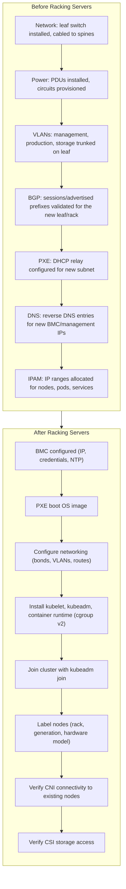
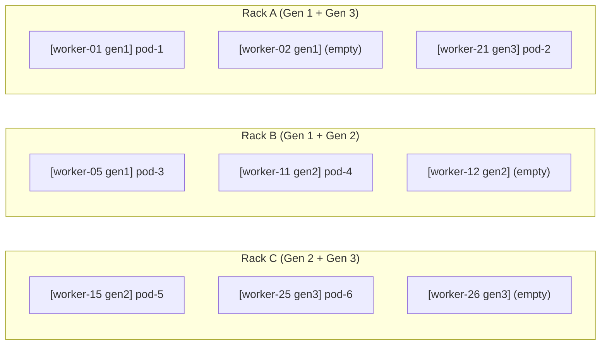
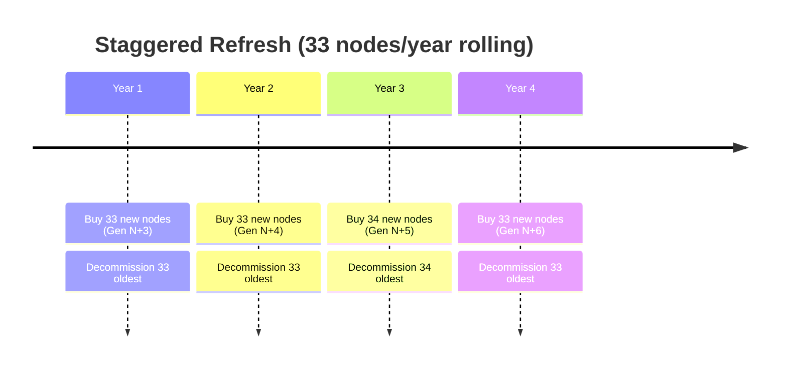
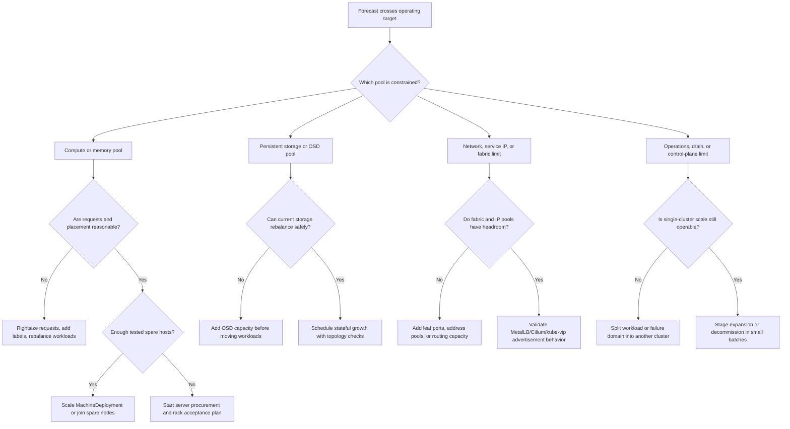

> **Complexity**: `[COMPLEX]` | Time: 60 minutes
>
> **Prerequisites**: [Module 7.4: Observability Without Cloud Services](../module-7.4-observability/), [Module 1.2: Server Sizing](/on-premises/planning/module-1.2-server-sizing/)

---

## What You'll Be Able to Do

After completing this module, you will be able to:

1. **Plan** capacity expansion that accounts for CPU generation differences, topology constraints, and scheduler behavior with heterogeneous hardware
2. **Implement** node labeling, taints, and topology spread constraints to manage mixed-generation server pools effectively
3. **Design** a hardware decommissioning process that respects capacity limits, PodDisruptionBudgets, and storage rebalancing
4. **Optimize** cluster scheduling policies to distribute workloads appropriately across nodes with different performance characteristics

---

## Why This Module Matters

When a team expands a large bare-metal Kubernetes cluster with a newer hardware generation, scheduling behavior can change in ways that are not obvious during initial bring-up.

Workloads can perform differently across CPU generations, while the default Kubernetes scheduler still reasons about requested CPU as a quantity rather than benchmarked per-core performance. If teams respond by manually pinning workloads to newer nodes, overall cluster utilization can become uneven.

Decommissioning older nodes without spread constraints and spare capacity can overload the remaining cluster, trigger evictions or OOM-related instability, and even degrade the monitoring systems you need during the change.

The lesson: adding hardware to a Kubernetes cluster is not just racking and stacking. You need to account for CPU generation differences, topology constraints, scheduling policies, and a decommission plan that respects capacity limits.

---

## What You'll Learn

- Adding new racks and nodes to existing clusters
- Managing mixed CPU generations (Intel and AMD)
- Topology spread constraints for heterogeneous hardware
- Decommissioning old nodes safely
- 3-year vs 5-year hardware refresh cycles
- Capacity planning with hardware generations

---

## Capacity Forecasting Before Procurement

On-premises capacity expansion starts months before the first server arrives. In a cloud cluster, a scale-up event can ask a provider API for more instances and discover within minutes whether the quota, instance type, and availability zone are available. In a bare-metal cluster, the same decision passes through forecasting, budget approval, vendor quoting, purchase orders, delivery windows, rack planning, cabling, firmware baselines, burn-in, operating system imaging, Kubernetes join automation, and workload migration. That lead time is why the most important capacity metric is not today's utilization; it is the date when today's growth curve consumes the last safe unit of spare capacity.

Treat capacity as several independent budgets instead of one large CPU percentage. CPU, memory, local ephemeral storage, persistent storage, network ports, BGP route capacity, rack units, power feeds, cooling headroom, and operations time can each become the first hard stop. A cluster with 35% free CPU is not actually healthy if the storage fabric has no spare OSD slots, the leaf switches have no free 25GbE ports, or the rack's A/B power feeds are already too close to their design ceiling. Capacity planning is therefore a dependency map: every proposed node must have a rack position, switch port, PDU outlet, BMC address, PXE path, storage placement answer, and support contract before it can become schedulable Kubernetes capacity.

Hypothetical scenario: A team runs a steady internal SaaS platform in a colocation cage and sees CPU requests grow by about 4% each month. The cluster still looks comfortable at 64% requested CPU, so the team delays purchasing. Two months later the finance team approves the order, but the preferred server model has a long delivery window, the network team needs another leaf pair, and the facilities team has to approve a higher-density rack layout. By the time the hardware is ready, the cluster is running above 80% requested CPU, drains are risky, and a minor maintenance event becomes a business escalation. The failure was not that Kubernetes could not schedule pods; the failure was that procurement lead time was not modeled as part of capacity.

Use three thresholds instead of one. The first threshold is the operating target, such as keeping steady-state requested CPU and memory below 65-70% for general-purpose pools so node drains, kernel updates, and rack-level failures still have room. The second threshold is the purchase trigger, usually the point where a forecast says you will hit the operating target plus procurement lead time before new capacity can be accepted. The third threshold is the emergency ceiling, such as 80%, above which expansion, upgrades, and decommissions become tightly constrained because every voluntary disruption competes with production workloads. The exact numbers should come from your workload mix and failure-domain design, but the pattern matters: buy before you are forced to choose between availability and growth.

Prometheus can turn this into a repeatable signal. The upstream Prometheus `predict_linear()` function forecasts a gauge using simple linear regression, and `deriv()` estimates the per-second slope of a gauge over a window. Those functions are useful for slow-moving capacity gauges such as requested CPU, requested memory, allocated storage, and free IP addresses, but they should not be used blindly for counter metrics or for workloads with obvious seasonal steps. Pair the forecast with calendar knowledge: a quarterly product launch, an annual enrollment period, or a migration batch can break a linear model even if the last 30 days looked smooth.

```yaml
groups:
  - name: onprem-capacity-forecasting
    interval: 5m
    rules:
      - record: cluster:cpu_requested_cores:sum
        expr: |
          sum(kube_pod_container_resource_requests{resource="cpu", unit="core"})

      - record: cluster:cpu_allocatable_cores:sum
        expr: |
          sum(kube_node_status_allocatable{resource="cpu", unit="core"})

      - record: cluster:cpu_requested_ratio
        expr: |
          cluster:cpu_requested_cores:sum / cluster:cpu_allocatable_cores:sum

      - record: cluster:cpu_requested_ratio:predicted_90d
        expr: |
          predict_linear(cluster:cpu_requested_ratio[30d], 90 * 24 * 60 * 60)

      - alert: OnPremCapacityPurchaseTrigger
        expr: cluster:cpu_requested_ratio:predicted_90d > 0.70
        for: 6h
        labels:
          severity: warning
        annotations:
          summary: "CPU request forecast crosses operating target within procurement lead time"
          description: "Start expansion planning before utilization reaches the emergency ceiling."
```

The useful refinement is to forecast by pool, not only by cluster. Separate general compute, memory-heavy nodes, GPU nodes, storage nodes, and latency-sensitive pools because each pool has a different replacement SKU and lead time. If GPU workloads are growing, spare CPU in a standard pool does not help. If Ceph OSD nodes are full, empty stateless workers do not create persistent volume capacity. If a premium CPU tier is needed for low-latency services, older nodes may be acceptable for batch work but not for that service. Capacity dashboards should answer "which pool runs out first?" before they answer "is the cluster full?"

```promql
sum by (label_kubedojo_io_performance_tier) (
  kube_pod_container_resource_requests{resource="cpu", unit="core"}
  * on (namespace, pod) group_left(node)
    kube_pod_info
  * on (node) group_left(label_kubedojo_io_performance_tier)
    kube_node_labels
)
/
sum by (label_kubedojo_io_performance_tier) (
  kube_node_status_allocatable{resource="cpu", unit="core"}
  * on (node) group_left(label_kubedojo_io_performance_tier)
    kube_node_labels
)
```

The forecasting dashboard should also show capacity that Kubernetes does not schedule directly. Track unused rack units, free leaf switch ports, PDU outlet count, metered rack power, cooling allowance, BMC subnet utilization, service LoadBalancer address pools, and storage raw-vs-usable capacity. These indicators are often managed outside the cluster, so you may need to export them from IPAM, DCIM, NetBox, a power monitoring system, or a small inventory file. The important habit is to put them on the same expansion review screen as Kubernetes requests. A node that has no power circuit, no management IP, or no fabric port is not capacity, no matter how complete its purchase order looks.

---

## Adding New Racks to Existing Clusters

### Physical and Network Prerequisites



> **Stop and think**: If you provision a new rack of older OS images (which default to cgroup v1) and try to join them to a Kubernetes 1.35+ cluster, what will happen? By default, the kubelet will refuse to start because [cgroup v1 is officially deprecated](https://kubernetes.io/docs/concepts/architecture/cgroups/). Both the kubelet and your container runtime must strictly use [cgroup v2 with the systemd cgroup driver](https://kubernetes.io/docs/setup/production-environment/container-runtimes/) to successfully register the node.

> **Pause and predict**: You are adding 40 new AMD EPYC servers to a cluster running Intel Xeon nodes. The Kubernetes scheduler sees "32 cores available" on both, but the AMD cores deliver roughly 45–55% higher per-core throughput depending on benchmark and date (verify current figures). How would you prevent latency-sensitive pods from being scheduled on slower Intel nodes without hardcoding node names?

Before a new rack becomes production capacity, run an acceptance checklist that proves every adjacent dependency is ready. The network team should confirm leaf-to-spine links, BGP sessions, VLAN trunks, MTU, and route advertisements before Kubernetes workloads depend on the rack. The platform team should confirm that PXE, iPXE, or virtual media boot paths can reach the correct image, that BMC credentials work through Redfish or the vendor's supported interface, and that the node OS image contains the same kubelet, container runtime, cgroup, kernel, storage, and CNI prerequisites as the current cluster. The storage team should confirm whether the rack hosts only stateless workers, also contributes Ceph OSDs, or needs local PV migration handling. None of this is glamorous, but every missed prerequisite turns a planned scale-up into a partial rack that cannot carry production load.

Rack expansion also needs an explicit "acceptance to schedulable" boundary. A server can be physically installed and still fail burn-in, firmware validation, NIC driver checks, BMC automation, disk health checks, or CNI reachability. Keep new nodes tainted or unschedulable until they pass the full acceptance suite, then remove the taint in a controlled batch. This prevents the scheduler from placing real workloads on nodes whose management plane is still being debugged, and it gives you a clean handoff between facilities work, provisioning work, and Kubernetes operations.

```bash
kubectl taint nodes -l kubedojo.io/rack=rack-e \
  node.kubedojo.io/acceptance=required:NoSchedule

kubectl get nodes -l kubedojo.io/rack=rack-e \
  -o custom-columns=NAME:.metadata.name,READY:.status.conditions[-1].status,TAINTS:.spec.taints

# After burn-in, CNI, CSI, monitoring, and drain tests pass:
kubectl taint nodes -l kubedojo.io/rack=rack-e \
  node.kubedojo.io/acceptance=required:NoSchedule-
```

### Node Provisioning Script for New Rack

The vanilla Kubernetes Cluster Autoscaler expects a resizable NodeGroup abstraction backed by a cloud or infrastructure API — it scales by changing a group size, not by hand-running `kubeadm join` on arbitrary servers. On bare metal, that usually means manual or scripted provisioning unless you wire Cluster API and Metal3 (or another provider) so hosts become Machines behind a resizable `MachineDeployment`; Cluster Autoscaler can then run with `--cloud-provider=clusterapi` against that declarative pool. A one-off kubeadm script without CAPI is outside what vanilla CA automates. Before running any automation, ensure that each bare-metal server has a [unique hostname, MAC address, and `product_uuid`](https://kubernetes.io/docs/setup/production-environment/tools/kubeadm/install-kubeadm/), as `kubeadm` will fail to register nodes if these are duplicated.

This script automates the most error-prone part of rack expansion: waiting for each server to PXE boot, joining it to the cluster, and applying the correct topology labels. Labels for rack, hardware generation, and CPU model enable scheduling policies that account for heterogeneous hardware.

```bash
#!/bin/bash
# provision-new-rack.sh — add a rack of servers to existing cluster
set -euo pipefail

RACK_ID="$1"             # e.g., rack-e
NODES_FILE="$2"          # hostname,bmc-ip,mgmt-ip
JOIN_TOKEN="$3"          # from kubeadm token create (default TTL is 24h)
CA_CERT_HASH="$4"        # from kubeadm
API_SERVER="$5"          # e.g., 10.0.10.10:6443

while IFS=, read -r HOSTNAME BMC_IP MGMT_IP; do
  echo "=== Provisioning ${HOSTNAME} in ${RACK_ID} ==="

  # Wait for node to be PXE booted and accessible
  echo "Waiting for ${HOSTNAME} to be reachable via SSH..."
  until ssh -o ConnectTimeout=5 root@"$MGMT_IP" true 2>/dev/null; do
    sleep 10
  done

  # Configure node labels and join cluster
  ssh root@"$MGMT_IP" bash <<REMOTE_EOF
    # Join the cluster
    kubeadm join ${API_SERVER} \
      --token ${JOIN_TOKEN} \
      --discovery-token-ca-cert-hash sha256:${CA_CERT_HASH}
REMOTE_EOF

  # Wait for the node to register with the API server
  # (kubeadm join returns before the Node object is fully created)
  echo "Waiting for ${HOSTNAME} to register..."
  until kubectl get node "$HOSTNAME" &>/dev/null; do
    sleep 5
  done
  kubectl wait --for=condition=Ready "node/$HOSTNAME" --timeout=120s

  # Label the node from a control plane
  echo "Labeling ${HOSTNAME}..."
  kubectl label node "$HOSTNAME" \
    topology.kubernetes.io/zone="${RACK_ID}" \
    kubedojo.io/rack="${RACK_ID}" \
    kubedojo.io/hardware-gen="gen4" \
    kubedojo.io/cpu-vendor="amd" \
    kubedojo.io/cpu-model="epyc-9354" \
    --overwrite

  echo "=== ${HOSTNAME} joined and labeled ==="
done < "$NODES_FILE"

echo "All nodes in ${RACK_ID} provisioned."
echo "Run: kubectl get nodes -l kubedojo.io/rack=${RACK_ID}"
```

### Declarative Scale-Up with Spare BareMetalHosts

The script above is useful when a team still provisions nodes through shell automation, but mature on-premises platforms increasingly keep spare physical hosts represented as Kubernetes objects before they are needed. Metal3's Bare Metal Operator manages physical hosts through `BareMetalHost` custom resources, and its provisioning workflow starts from hosts that are enrolled, inspected, and marked available. Cluster API then adds a higher-level model: worker capacity can be expressed through scalable resources such as `MachineDeployment`, where increasing `.spec.replicas` asks the infrastructure provider to create more Machines. That does not remove the hardware lead time; it moves the post-delivery work into a declarative control loop.

The practical pattern is to keep a small pool of powered, tested, but unscheduled spares. Those spares are not "cloud elasticity" because you already paid for them and they already occupy rack, power, network, and support capacity. They are insurance against replacement lead time. When a node fails, a rack is added, or a growth forecast crosses the purchase trigger, the platform team can bind an available host to a Machine instead of waiting for procurement. The tradeoff is economic: spare nodes improve recovery time and expansion agility, but they increase CapEx and consume depreciation time before they run business workloads.

```yaml
apiVersion: metal3.io/v1alpha1
kind: BareMetalHost
metadata:
  name: worker-rack-e-01
  namespace: metal3
  labels:
    kubedojo.io/rack: rack-e
    kubedojo.io/hardware-gen: gen4
spec:
  online: true
  bootMACAddress: "52:54:00:aa:bb:01"
  # BMC URL scheme varies by vendor — e.g. Dell iDRAC often uses idrac-virtualmedia://
  bmc:
    address: redfish-virtualmedia://bmc-rack-e-01.example.internal/redfish/v1/Systems/1
    credentialsName: worker-rack-e-01-bmc
  rootDeviceHints:
    deviceName: /dev/nvme0n1
```

In a Cluster API workflow, the actual scale-up is intentionally small because most of the complexity has moved into templates, inventory, and provider controllers. The Cluster API scaling documentation describes adding or removing worker capacity by changing MachineSet or MachineDeployment replicas, including `kubectl scale machinedeployment ... --replicas=...`. In a Metal3-backed cluster, that command only works when the lower layers already have usable hosts, images, BMC access, and network data. If the available-host pool is empty, the desired replica count will wait on the same physical constraints as any other bare-metal deployment.

```bash
# Inspect available physical hosts before asking for more workers.
kubectl get baremetalhosts -n metal3 \
  -l kubedojo.io/rack=rack-e \
  -o custom-columns=NAME:.metadata.name,STATE:.status.provisioning.state,ONLINE:.spec.online

# Scale the worker MachineDeployment only after enough hosts are available.
kubectl scale machinedeployment workers-gen4-rack-e \
  --namespace capi-workload \
  --replicas=20

kubectl get machines -n capi-workload -l cluster.x-k8s.io/cluster-name=prod
```

This is also where Tinkerbell, Metal3, Ironic, and image-based operating systems fit into the expansion conversation. They are not magic sources of capacity; they are ways to make the capacity you already own reproducible. Metal3 uses Ironic underneath to drive bare-metal provisioning flows, while Tinkerbell offers a separate bare-metal automation stack with a Cluster API provider. Immutable or image-based operating systems such as Talos and Flatcar can reduce drift between batches because the node image is replaced rather than repaired by hand. The operational question is not "which tool gives us cloud autoscaling?" The right question is "which tool lets us prove that a delivered server can become a consistent Kubernetes node without a heroic manual runbook?"

---

## Mixed CPU Generations

### The Problem with Heterogeneous Performance

When mixing CPU generations, you must account for varying hardware capabilities. In Kubernetes 1.35, advanced features like [the Topology Manager's `max-allowable-numa-nodes` reached General Availability (GA)](https://kubernetes.io/docs/tasks/administer-cluster/topology-manager/), giving you granular control over workload placement on modern multi-socket AMD and Intel systems. However, even with advanced topology management, the primary challenge remains: raw performance differences across generations.

PassMark scores as of 2026-06 — verify against [cpubenchmark.net](https://www.cpubenchmark.net/) before relying on these figures for procurement or decommission math.

| Model | Year | Cores | Single-Thread | Passmark |
|-------|------|-------|---------------|----------|
| Xeon Silver 4214 | 2019 | 12 | 1,800 | 15,200 |
| Xeon Gold 6330 | 2021 | 28 | 2,100 | 35,000 |
| EPYC 9354 | 2023 | 32 | 2,600 | 53,000 |

The EPYC 9354 substantially outperforms the 4214 in both single-threaded and multithreaded benchmark data, but the exact percentage depends on the benchmark source and snapshot date. Newer EPYC and Xeon generations offer materially higher per-core throughput; treat the integers in this table as illustrative planning inputs, not authoritative specs.

Kubernetes natively sees: "32 cores available" on both.
Reality dictates: 32 EPYC cores >> 32 Xeon Silver cores.

### Labeling Hardware Generations

```bash
# Label all nodes with their hardware generation
# This enables scheduling policies based on performance tier

# Gen 1: 2019 hardware (Cascade Lake)
kubectl label nodes -l kubedojo.io/cpu-model=xeon-4214 \
  kubedojo.io/performance-tier=standard

# Gen 2: 2021 hardware (Ice Lake)
kubectl label nodes -l kubedojo.io/cpu-model=xeon-6330 \
  kubedojo.io/performance-tier=high

# Gen 3: 2023 hardware (Genoa)
kubectl label nodes -l kubedojo.io/cpu-model=epyc-9354 \
  kubedojo.io/performance-tier=premium
```

### Scheduling Policies for Mixed Hardware

```yaml
# Option 1: Prefer newer hardware (soft preference)
apiVersion: apps/v1
kind: Deployment
metadata:
  name: latency-sensitive-app
spec:
  template:
    spec:
      affinity:
        nodeAffinity:
          preferredDuringSchedulingIgnoredDuringExecution:
            - weight: 100
              preference:
                matchExpressions:
                  - key: kubedojo.io/performance-tier
                    operator: In
                    values: [premium]
            - weight: 50
              preference:
                matchExpressions:
                  - key: kubedojo.io/performance-tier
                    operator: In
                    values: [high]
      containers:
        - name: app
          image: my-app:latest
          resources:
            requests:
              cpu: "4"
              memory: 8Gi
---
# Option 2: Require specific hardware (hard requirement)
apiVersion: apps/v1
kind: Deployment
metadata:
  name: ml-training-job
spec:
  template:
    spec:
      nodeSelector:
        kubedojo.io/cpu-feature/avx512: "true"   # validate with a feature label from node discovery
        kubedojo.io/performance-tier: premium
      containers:
        - name: training
          image: tensorflow:latest
          resources:
            requests:
              cpu: "16"
              memory: 64Gi
```

### Weighted Resource Capacity

Kubernetes sees all CPU cores as equal, but they are not. Use benchmark data to calculate normalized capacity, because removing older nodes can reduce effective compute by much less than raw node counts suggest. Always use weighted capacity calculations when planning decommissions.

The goal is not to make the scheduler understand every benchmark. The goal is to make your planning model honest enough that finance, operations, and application owners are talking about the same risk. Pick one baseline generation, assign it a weight of 1.0, and express newer or older generations relative to that baseline using a workload-relevant benchmark. A web API that spends most of its time in single-threaded request handling may care about single-thread throughput and memory latency, while a batch analytics pool may care about all-core throughput and memory bandwidth. If you use a generic public benchmark, mark it as a planning estimate and validate it with your own canary workloads before making hard decommission decisions.

| Pool | Nodes | Raw cores/node | Planning weight/core | Weighted capacity units |
|------|-------|----------------|----------------------|-------------------------|
| gen1 standard | 60 | 12 | 1.00 | 720 |
| gen2 high | 30 | 28 | 1.15 | 966 |
| gen3 premium | 20 | 32 | 1.44 | 922 |
| **Total** | **110** |  |  | **2,608** |

This table changes the decommission conversation. Removing ten gen1 nodes looks like a 120-core reduction, but in the weighted model it removes 120 units from a 2,608-unit fleet, or about 4.6% of effective compute. Removing ten gen3 nodes with the same 32 raw cores per node removes 461 weighted units, or about 17.7% of effective compute. That does not mean old nodes are free to remove; it means the capacity plan should distinguish "node count," "raw cores," and "effective units" before deciding how much replacement hardware is required.

Weighted capacity also helps avoid a common scheduling trap. If every workload requests `cpu: "4"` and every node is labeled only by rack, the scheduler may place a latency-sensitive service on gen1 nodes and a batch job on gen3 nodes even though the opposite would be more efficient. Labels, taints, node affinity, topology spread constraints, and separate node pools are how you communicate coarse performance tiers to Kubernetes. You should still keep requests realistic; labels do not fix a workload that requests one core but consistently burns four.

For memory, do not weight capacity in the same way unless the workload has been tested. A server with faster cores does not magically have more RAM, and many on-premises incidents happen when CPU looks healthy while memory requests, hugepages, local NVMe, or network bandwidth become the real constraint. Keep separate forecasts for requested memory, allocatable memory, page-cache-sensitive workloads, storage throughput, and per-node pod density. A refresh plan that replaces many small-memory nodes with fewer dense CPU nodes can still strand workloads if the total memory or pod-slot budget shrinks.

---

## Topology Spread Constraints for Heterogeneous Hardware

When you have multiple hardware generations across multiple racks, topology spread constraints ensure workloads are distributed to survive rack failures and hardware-specific issues.

> **Stop and think**: You have a critical service with 6 replicas spread across 3 racks. You add a 4th rack. New pods will not schedule on the 4th rack because `maxSkew: 1` with `DoNotSchedule` cannot be satisfied. How would you rebalance pods across all 4 racks?

### Multi-Dimensional Topology Spread

```yaml
apiVersion: apps/v1
kind: Deployment
metadata:
  name: critical-service
spec:
  replicas: 6
  template:
    metadata:
      labels:
        app: critical-service
    spec:
      topologySpreadConstraints:
        # Spread across racks (survive rack failure)
        - maxSkew: 1
          topologyKey: topology.kubernetes.io/zone
          whenUnsatisfiable: DoNotSchedule
          labelSelector:
            matchLabels:
              app: critical-service
        # Spread across hardware generations (survive generation-specific bug)
        - maxSkew: 2
          topologyKey: kubedojo.io/hardware-gen
          whenUnsatisfiable: ScheduleAnyway
          labelSelector:
            matchLabels:
              app: critical-service
      containers:
        - name: app
          image: critical-service:latest
          resources:
            requests:
              cpu: "2"
              memory: 4Gi
```

### Visualizing Topology Distribution



**Result:** 2 pods per rack (maxSkew=1 satisfied)
**Gen distribution:** gen1=2, gen2=2, gen3=2 (maxSkew=2 OK)
**Rack failure:** lose 2/6 pods = service continues
**Gen-specific bug:** affects 2/6 pods = service continues

---

## Scaling Limits Beyond the Next Rack

At small scale, expansion planning feels like a worker-node problem: buy servers, install the OS, join nodes, and rebalance workloads. At larger scale, the limits move into the control plane and the surrounding systems. Kubernetes publishes large-cluster guidance (verified through v1.36; this module targets 1.35) with tested limits such as 5,000 nodes, 110 pods per node, 150,000 total pods, and 300,000 total containers, but those numbers are not a promise that every on-premises environment can safely run at the edge. They assume disciplined resource usage, healthy control-plane infrastructure, reliable networking, and components that have been tested at similar object counts. Your practical limit may arrive earlier through API server latency, controller queue depth, CNI scale, DNS load, storage control loops, or the time it takes operators to reason about incidents.

The first question is whether you are expanding a single cluster or whether you should split capacity into multiple clusters. A single cluster gives the scheduler more placement flexibility and reduces duplicated platform services, but it also concentrates blast radius and increases API object count. Multiple clusters reduce failure scope, support staged upgrades, and let you place clusters closer to data or business boundaries, but they add fleet-management overhead and can strand capacity if workloads cannot move between clusters. The right answer is usually driven by failure-domain policy, team ownership, networking boundaries, and etcd/API server health rather than by a round-number node count.

etcd is the part of Kubernetes capacity planning that teams most often discover too late. It stores the cluster's desired and observed state, so every Pod, EndpointSlice, Lease, ConfigMap, Secret, Node, and custom resource affects it. The etcd documentation calls out sensitivity to disk write latency, recommends higher sequential IOPS for heavily loaded clusters, and documents storage-size limits and maintenance tasks such as compaction, defragmentation, and snapshots. In practice, this means control-plane nodes should use reliable low-latency storage, alerts should watch database size and fsync latency, and large expansion waves should be staged so you can observe API and etcd behavior before adding the next batch.

Pod density is a separate limit from node count. The default kubelet `--max-pods` setting and the cluster's pod CIDR allocation determine how many pods can fit on a node, while CNI mode and kube-proxy or eBPF service implementation influence how costly that pod count becomes. Very large nodes can look efficient in a purchasing spreadsheet but create operational pressure if one drain must evict hundreds of pods, one kernel issue affects a huge slice of the workload, or one node failure causes a large rescheduling surge. Smaller nodes increase management overhead but reduce per-node blast radius. Expansion planning should model pods-per-node, not only cores-per-rack.

Service density matters too. Every Service, EndpointSlice, DNS record, network policy, and LoadBalancer advertisement becomes control-plane and data-plane work. In bare-metal environments, LoadBalancer Services usually depend on systems such as MetalLB, kube-vip, or Cilium LB IPAM plus BGP or L2 advertisement to make service addresses reachable. Adding nodes may improve compute headroom while also increasing BGP peers, route advertisements, ARP behavior, or address-pool pressure. Network capacity reviews should include service IP pools, BGP session scale, route-policy limits on the fabric, and whether your leaf switches have enough TCAM and operational headroom for the planned design.

Drains are the reality check for all of these limits. A cluster that can run at 78% requested CPU on a normal day may still be too full to drain a rack, replace a kernel, or absorb a failed leaf switch. PodDisruptionBudgets limit voluntary disruptions for high-availability applications, and `kubectl drain` respects the eviction API unless an operator bypasses it with dangerous flags. Before expansion or decommission work, run a dry-run drain on representative nodes, check PDBs that would block, and estimate the rescheduling surge. If the cluster cannot drain one failure domain during a calm window, it is already overcommitted for day-2 operations even if the average utilization graph looks acceptable.

```bash
kubectl drain worker-17 \
  --ignore-daemonsets \
  --delete-emptydir-data \
  --dry-run=server

kubectl get pdb -A \
  -o custom-columns=NAMESPACE:.metadata.namespace,NAME:.metadata.name,AVAILABLE:.status.currentHealthy,DESIRED:.status.desiredHealthy,DISRUPTIONS:.status.disruptionsAllowed

kubectl get --raw /metrics | grep -E 'apiserver_request_duration_seconds|etcd_request_duration_seconds' | head
```

Use these checks to define expansion gates. For example, do not add the next 50 nodes until API server p99 write latency, etcd fsync latency, controller queue depth, CoreDNS error rate, CNI health, and drain dry-runs remain within your runbook thresholds for a full business cycle. This is slower than "rack everything and hope," but it produces a cluster that remains operable after the expansion. On-premises scaling fails most painfully when the team adds physical capacity faster than the control plane and operations model can absorb it.

---

## Decommissioning Old Nodes

Removing nodes requires careful capacity planning to avoid overloading the remaining cluster.

> **Pause and predict**: Before decommissioning 20 nodes, you need to verify the remaining cluster can handle the load. But Kubernetes reports CPU in cores -- and not all cores are equal. A 2023 AMD core can deliver roughly 45–55% more throughput than a 2019 Intel core depending on benchmark and date (verify current figures). How do you calculate the true capacity impact of removing 20 Intel nodes?

### Decommission Checklist

This script performs safety checks before removing a node: verifying remaining capacity will stay below 80%, checking for [local PersistentVolumes that would be lost](https://kubernetes.io/docs/concepts/storage/volumes/), and then draining and deleting the node.

```bash
#!/bin/bash
# decommission-node.sh — safely remove a node from the cluster
set -euo pipefail

NODE="$1"

echo "=== Pre-decommission checks for ${NODE} ==="

# Check 1: Will remaining capacity handle the load?
# Normalize CPU values to millicores — K8s returns either "4" (cores) or "3900m" (millicores)
TOTAL_CPU=$(kubectl get nodes -o json | jq '
  [.items[].status.allocatable.cpu |
    if endswith("m") then rtrimstr("m") | tonumber
    else tonumber * 1000 end
  ] | add')
NODE_CPU=$(kubectl get node "$NODE" -o json | jq '
  .status.allocatable.cpu |
    if endswith("m") then rtrimstr("m") | tonumber
    else tonumber * 1000 end')
REMAINING_CPU=$((TOTAL_CPU - NODE_CPU))
REQUESTED_CPU=$(kubectl get pods -A -o json | jq '
  [.items[].spec | (
      (.containers // []) + (.initContainers // [])
    )[].resources.requests.cpu // "0" |
    if endswith("m") then rtrimstr("m") | tonumber
    else tonumber * 1000 end
  ] | add')

echo "Total allocatable CPU: ${TOTAL_CPU}m"
echo "This node CPU: ${NODE_CPU}m"
echo "Remaining CPU after removal: ${REMAINING_CPU}m"
echo "Total requested CPU: ${REQUESTED_CPU}m"
echo "Utilization after removal: $((REQUESTED_CPU * 100 / REMAINING_CPU))%"

if [ $((REQUESTED_CPU * 100 / REMAINING_CPU)) -gt 80 ]; then
  echo "WARNING: Cluster will be at >80% CPU utilization after removing this node."
  echo "Consider adding capacity before decommissioning."
  read -p "Continue anyway? (y/N) " -n 1 -r
  echo
  [[ $REPLY =~ ^[Yy]$ ]] || exit 1
fi

# Check 2: Any local PVs on this node? (partial — review bound PVCs on local SCs too)
LOCAL_PVS=$(kubectl get pv -o json | jq -r --arg node "$NODE" '
  .items[] | select(
    .spec.nodeAffinity.required.nodeSelectorTerms[]?.matchExpressions[]?.values[]? == $node
  ) | .metadata.name')

LOCAL_SCS=$(kubectl get sc -o json | jq -r '
  .items[] | select(
    .provisioner == "kubernetes.io/no-provisioner" or
    (.provisioner | test("local-path|hostpath"; "i"))
  ) | .metadata.name')

BOUND_LOCAL_PVCS=""
for sc in $LOCAL_SCS; do
  while IFS= read -r pvc; do
    [ -n "$pvc" ] && BOUND_LOCAL_PVCS+="${pvc} (sc=${sc})"$'\n'
  done < <(kubectl get pvc -A -o json | jq -r --arg sc "$sc" --arg node "$NODE" '
    .items[] | select(.status.phase == "Bound" and .spec.storageClassName == $sc) |
    .spec.volumeName as $pv |
    .metadata.namespace + "/" + .metadata.name
  ')
done

if [ -n "$LOCAL_PVS" ] || [ -n "$BOUND_LOCAL_PVCS" ]; then
  echo "WARNING: Node may have local PVs or bound PVCs on local/hostPath storage classes:"
  [ -n "$LOCAL_PVS" ] && echo "$LOCAL_PVS"
  [ -n "$BOUND_LOCAL_PVCS" ] && echo "$BOUND_LOCAL_PVCS"
  echo "Migrate data before proceeding. This script does not catch every local-volume pattern."
  exit 1
fi

# Check 3: Drain the node
echo "Draining ${NODE}..."
kubectl drain "$NODE" \
  --ignore-daemonsets \
  --delete-emptydir-data \
  --timeout=600s

# Check 4: Remove from cluster
echo "Removing ${NODE} from cluster..."
kubectl delete node "$NODE"

# Check 5: On the node itself (via SSH or BMC):
# kubeadm reset
# Clean up iptables, IPVS rules, CNI config

echo "=== ${NODE} decommissioned ==="
echo "Remember to:"
echo "  1. Power off the server"
echo "  2. Update CMDB/inventory"
echo "  3. Reclaim rack space"
echo "  4. Update monitoring targets"
echo "  5. Update PXE/DHCP reservations"
```

When physically powering down decommissioned nodes, do not simply turn them off. While [Graceful Node Shutdown is enabled by default in Kubernetes, it is not actually activated unless you have explicitly configured `shutdownGracePeriod` to a non-zero value in your kubelet configuration](https://kubernetes.io/docs/concepts/cluster-administration/node-shutdown/). Always use the `kubectl drain` process to safely evict workloads.

When decommissioning in batches, remove 5 nodes at a time over 1-2 day phases. Monitor utilization overnight after each batch. Never exceed 80% cluster utilization during the process. After all nodes are removed, verify no orphaned PVs remain and update monitoring targets, alerting thresholds, and spare node counts.

---

## Adjacent Capacity: Storage, Network, Power, and Cooling

Compute expansion is only one slice of on-premises capacity. A new worker rack can make the cluster look larger while quietly making the storage cluster, network fabric, or power design fragile. This is why expansion reviews should include owners from platform, network, storage, facilities, security, finance, and the application teams that will consume the capacity. The Kubernetes scheduler can place pods on nodes that are `Ready`; it cannot tell you whether the rack has enough cooling margin for summer, whether the leaf pair has enough ports for next quarter, or whether the storage system can rebalance before the next maintenance window.

Storage capacity needs its own expansion plan because raw disk, usable capacity, IOPS, throughput, fault domain, and rebalance time are different numbers. In a Rook-Ceph environment, adding OSD-capable nodes can increase raw capacity, but the cluster still needs enough failure domains and time to rebalance data safely. If you add compute-only nodes without storage, stateful workloads may still be blocked by full pools. If you add OSDs and immediately schedule heavy write workloads, recovery and client IO can compete. Plan storage growth before compute growth reaches it, and stage OSD additions so recovery load, backfill limits, and alerting remain understandable.

```bash
kubectl -n rook-ceph get cephcluster
kubectl -n rook-ceph get pods -l app=rook-ceph-osd -o wide
kubectl -n rook-ceph exec deploy/rook-ceph-tools -- ceph status
kubectl -n rook-ceph exec deploy/rook-ceph-tools -- ceph osd df tree
```

Local PV designs have a different tradeoff. They can deliver excellent performance and simple failure isolation, but the capacity is tied to specific nodes and usually cannot be drained like replicated network storage. Before decommissioning or replacing local-PV nodes, identify workloads with node-affined volumes, migrate or replicate their data at the application layer, and confirm the new hardware has equivalent labels and topology. A cluster can have plenty of aggregate disk while still being unable to move a database because the only valid PV lives on the node scheduled for retirement.

Network capacity has both cabling and routing dimensions. At the cabling layer, every new server consumes production NIC ports, BMC ports, optics, DACs, patch-panel entries, and switch power. At the routing layer, BGP-based load balancing, CNI routing, and service advertisement may add peers or routes to the fabric. MetalLB can advertise service IPs in Layer 2 or BGP mode, while Cilium's BGP Control Plane can advertise pod CIDRs or service addresses depending on configuration. Those are powerful on-premises patterns, but they move Kubernetes expansion into the datacenter routing domain. The network team should review route scale, policy, failure behavior, and observability before the platform team depends on the new rack.

Control-plane access is another adjacent capacity item. If you use kube-vip for a highly available control-plane virtual IP, verify the VIP behavior, ARP or BGP mode, and leader election before changing control-plane membership or rack placement. A refresh that replaces control-plane hardware is riskier than a worker-only expansion because the API server, etcd membership, load-balancing path, certificate material, and disaster-recovery runbook all meet in the same change window. Keep worker expansion and control-plane refresh separate unless you have a strong reason and a rehearsed rollback.

Power and cooling are economic and technical constraints at the same time. A rack that can physically hold forty 1U servers may not be able to power or cool them at the intended CPU load. Use measured power from PDUs, hardware telemetry, and burn-in tests rather than nameplate-only assumptions, then include A/B feed balance, breaker limits, UPS capacity, generator capacity, hot-aisle/cold-aisle behavior, and facility cooling policies. Modern servers can draw sharply different power at idle, normal load, and turbo-heavy load. A capacity plan that ignores the power curve can pass procurement review and still fail facilities review.

Rack units and hands-on time are also capacity. Dense servers reduce rack footprint but can increase cabling complexity, heat density, and blast radius per rack. Annual refresh waves reduce big-bang risk, but they require the team to repeatedly receive hardware, validate firmware, update inventory, run burn-in, remediate failures, and manage decommission logistics. When the operations team is small, headcount can become the binding constraint before hardware budget does. Include operations labor in the plan, not as a vague overhead line but as calendar time needed to make the expansion safe.

---

## 3-Year vs 5-Year Hardware Refresh Cycles

### Cost Comparison

For a 100-node cluster, refresh-cycle cost depends heavily on hardware pricing, support terms, energy costs, and workload requirements:

| Factor | 3-Year Cycle | 5-Year Cycle |
|--------|-------------|-------------|
| Amortized CapEx/year | Higher annualized spend with faster refresh | Lower annualized spend with slower refresh |
| Support contracts | Typically lower over a shorter lifecycle | Typically higher as hardware ages |
| Power (total) | Typically lower with newer, more efficient nodes | Typically higher when older nodes stay in service longer |
| Failure rate (end of life) | Typically lower | Typically higher |
| Performance vs current gen | Closer to current-generation performance | Further behind current-generation performance |
| **Total cost** | **Depends on your hardware, power, support, and failure assumptions** | **Depends on your hardware, power, support, and failure assumptions** |

A shorter refresh cycle usually increases annualized capital spend, while a longer cycle can increase operational risk, support burden, and power costs.

Choose 3-year cycles for performance-sensitive workloads, rapid growth, or when power efficiency matters. Choose 5-year cycles for budget-constrained environments with stable, predictable loads that are not CPU-bound.

The finance conversation should separate cash timing from total cost. CapEx is the up-front purchase of servers, storage shelves, switches, optics, racks, PDUs, and support contracts. OpEx is the continuing cost of power, cooling, colocation space, network transit, spare parts, vendor support renewals, operator labor, and incident response. Depreciation spreads the accounting cost of the purchased hardware across its useful life, but it does not make old hardware free. A server in year four may be fully budgeted, yet still consume power, rack space, parts inventory, staff attention, and opportunity cost if it prevents consolidation onto a smaller newer fleet.

A practical TCO model should include at least these lines: hardware purchase price, expected support term, extended-support premium, rack units, contracted power, measured power at realistic load, cooling allocation, switch ports, optics, cabling, BMC network gear, spare disks, spare PSUs, firmware support, operating system support, hands-on datacenter time, platform engineering time, and the cost of stranded capacity. Stranded capacity matters because Kubernetes capacity is not infinitely fungible. Ten free cores on an old standard node do not satisfy a workload that needs premium CPU, GPU, high-memory nodes, local NVMe, or a specific rack for data locality.

On-premises usually wins economically when utilization is steady and high, data gravity is strong, egress is expensive, latency to local systems matters, regulatory constraints require physical control, or the organization can amortize hardware across predictable multi-year demand. A stable internal platform running at high utilization can make excellent use of owned hardware because the fleet stays busy and the marginal cost of using an already-purchased server is low. It can also avoid cloud egress charges or data-residency tradeoffs when large datasets live near the applications.

On-premises usually loses economically when demand is small, spiky, experimental, geographically scattered, or uncertain. Buying a rack for a workload that runs hot for two weeks each quarter creates idle CapEx for the rest of the year. Buying specialized hardware before demand is proven can strand expensive nodes if the product changes direction. In those cases, cloud burst capacity, managed services, or a hybrid design may be cheaper even if the hourly price looks higher, because the business is buying optionality instead of committing to a depreciation schedule.

The hard decision is how much to over-provision. Buying too early ties cash to idle assets and starts the depreciation clock before the business receives value. Buying too late forces emergency purchasing, rushed validation, risky drains, and temporary cloud escape hatches. A good plan defines a normal spare pool, a purchase trigger, an emergency cloud-burst or workload-shedding plan, and a refresh cadence. That plan should be revisited after every expansion wave using actual delivery time, burn-in failures, power draw, ticket load, and workload growth rather than the optimistic assumptions from the original spreadsheet.

| TCO Driver | Why It Matters | Planning Question |
|------------|----------------|-------------------|
| Server CapEx | Determines cash timing and depreciation base | Are we buying for measured growth or fear of scarcity? |
| Rack, power, and cooling | Can cap expansion before CPU does | Does the facility support this density under real load? |
| Network gear and optics | Leaf ports and optics can dominate small expansions | Do we need another leaf pair before the next node batch? |
| Storage growth | Stateful capacity may lag compute capacity | Are OSDs, PVs, and backup targets expanding with workers? |
| Support contracts | Older hardware can become expensive to support | Is extended support cheaper than replacing the fleet slice? |
| Operations headcount | Manual provisioning and incidents consume scarce time | Can the team safely absorb this refresh cadence? |
| Depreciation and refresh cycle | Affects financial reporting and replacement timing | Does the cycle match workload growth and hardware risk? |

### Staggered Refresh Strategy



**Benefits:**
- Smooth CapEx (illustrative: `<annual_refresh_spend>` per year instead of a large `<triennial_lump_sum>` every three years — plug your quotes into the TCO worksheet)
- Always have recent hardware in the fleet
- Never need to decommission more than 33% at once
- Team practices add/remove procedure regularly
- Each year you learn what works for the new hardware gen

**Challenges:**
- 3 hardware generations in the cluster simultaneously
- Must handle CPU/memory heterogeneity in scheduling
- Firmware update process covers multiple vendor models

---

## Capacity Planning with Hardware Generations

When forecasting long-term growth across multiple hardware refresh cycles, remember that Kubernetes large-cluster guidance (verified through v1.36; this module targets 1.35) documents tested limits of [a maximum of 5,000 nodes, 110 pods per node, 150,000 total pods, and 300,000 total containers](https://kubernetes.io/docs/setup/best-practices/cluster-large/). Your capacity plans must ensure all four constraints are met simultaneously.

### Monitoring Capacity Trends

Create Prometheus recording rules that track CPU capacity and utilization broken down by hardware generation. A useful custom metric is `cluster:capacity_days_remaining`, which projects when requested CPU will exhaust allocatable headroom at the current growth rate. Define it explicitly rather than assuming a built-in rule:

```yaml
groups:
  - name: onprem-capacity-days-remaining
    interval: 5m
    rules:
      - record: cluster:cpu_headroom_ratio
        expr: |
          1 - (
            sum(kube_pod_container_resource_requests{resource="cpu", unit="core"})
            /
            sum(kube_node_status_allocatable{resource="cpu", unit="core"})
          )

      - record: cluster:capacity_days_remaining
        expr: |
          cluster:cpu_headroom_ratio
          /
          (deriv(cluster:cpu_headroom_ratio[30d]) * 86400)
```

Alert when `cluster:capacity_days_remaining` drops below 60 days to trigger procurement. If `deriv()` is flat or negative, the rule returns empty — treat that as "no linear exhaustion signal" and fall back to pool-specific forecasts.

Capacity planning should be run as a monthly operational review, not only as an annual budgeting exercise. The review should compare forecasted consumption with actual consumption, confirm whether recent hardware performed as expected, and update lead-time assumptions from real procurement data. If a vendor quote took two weeks longer than expected or a burn-in batch produced several failed DIMMs, that evidence belongs in the next capacity forecast. The value of the review is not the dashboard; it is the decision record that says when to buy, what to buy, which risks were accepted, and which workloads will be moved first.

Use workload classes to keep the model readable. A typical on-premises platform might track standard stateless compute, premium low-latency compute, memory-heavy compute, storage nodes, GPU nodes, and control-plane nodes separately. Each class should have an owner, a refresh SKU, a normal utilization target, a purchase trigger, and a minimum spare count. This prevents a misleading all-cluster average from hiding the fact that one pool is full. It also gives finance a more precise story: "we do not need more servers in general; we need six high-memory nodes before the analytics migration and four OSD nodes before the next database onboarding wave."

```text
Capacity review packet:

1. Current requested and allocatable CPU by pool
2. Current requested and allocatable memory by pool
3. Pod count, Service count, and API object growth
4. Persistent storage raw, usable, and projected-full dates
5. Free rack units, PDU outlets, and measured power by rack
6. Leaf switch port utilization and service address pool utilization
7. Spare BareMetalHosts and failed/burn-in inventory
8. Procurement lead time from the last three orders
9. Drain dry-run results for representative nodes and racks
10. Decisions: buy, defer, rebalance, decommission, or split cluster
```

### Buy, Rebalance, Split, or Retire

Not every growth signal means "buy more servers." Sometimes the right move is to rebalance workloads away from premium nodes, fix oversized resource requests, move stateful workloads to a better storage tier, split a busy shared cluster into clearer failure domains, or retire older nodes whose power and support cost exceed their useful capacity. Capacity expansion is therefore a portfolio decision. Adding hardware is one lever, but rightsizing, scheduling policy, storage topology, network design, and refresh timing are also levers.

The safest on-premises expansions combine two loops. The fast loop uses existing spare hosts, workload rebalancing, and request tuning to buy time. The slow loop starts procurement, validates rack dependencies, and prepares the next hardware generation. If the fast loop is missing, every growth event becomes urgent. If the slow loop is missing, the team lives forever on temporary mitigations and eventually hits a physical limit. Healthy operators keep both loops visible.

---

## Patterns & Anti-Patterns

### Proven Patterns

| Pattern | When to Use | Why It Works | Scaling Consideration |
|---------|-------------|--------------|-----------------------|
| Forecast by capacity pool | Use when hardware generations, GPU nodes, storage nodes, or latency pools differ | It prevents a healthy cluster average from hiding an exhausted specialized pool | Add labels and dashboards before the fleet becomes too heterogeneous |
| Keep tested spare BareMetalHosts | Use when procurement or repair lead time exceeds your recovery objective | It converts delivered hardware into ready-to-bind inventory rather than emergency manual work | Size the spare pool by failure rate, replacement lead time, and acceptable idle CapEx |
| Stage rack acceptance | Use when adding a new rack, leaf pair, or hardware generation | It catches network, BMC, firmware, CNI, CSI, and monitoring defects before production scheduling | Keep nodes tainted until acceptance gates pass, then release in batches |
| Use weighted capacity planning | Use when retiring older CPU generations or mixing vendor families | It makes decommission math reflect effective throughput instead of raw cores only | Validate weights with representative workloads before relying on them for hard limits |
| Refresh in rolling waves | Use when replacing a large fleet over several years | It smooths CapEx, keeps procedures practiced, and reduces big-bang migration risk | Expect three or more hardware generations to coexist and plan labels accordingly |

### Anti-Patterns

| Anti-Pattern | What Goes Wrong | Why Teams Fall Into It | Better Alternative |
|--------------|-----------------|------------------------|--------------------|
| Treating bare metal like instant cloud scale | Capacity arrives weeks or months after the alert, so growth becomes an emergency | Dashboards show current free CPU but hide procurement, rack, and validation lead time | Trigger purchases from forecasted exhaustion dates, not only today's utilization |
| Buying only compute nodes | Stateless workloads grow while PVs, OSDs, switch ports, or service IP pools become the real bottleneck | Server quotes are easier to approve than cross-team capacity reviews | Review storage, network, power, cooling, IPAM, and operations capacity with every node order |
| Letting new nodes schedule immediately | Workloads land on hosts before burn-in, firmware, CNI, CSI, and monitoring are proven | Operators want to show progress as soon as nodes become `Ready` | Taint new racks for acceptance and remove the taint only after explicit validation |
| Draining old nodes by calendar date | PDBs block, local PVs trap data, and the remaining fleet exceeds safe utilization | Hardware support deadlines create pressure to remove nodes quickly | Decommission in small batches with weighted capacity math and drain dry-runs |
| Using one refresh spreadsheet for all pools | Premium, memory-heavy, GPU, and storage pools run out at different times | A single cluster-wide utilization number is easier to present | Maintain pool-specific TCO, lead-time, and spare-capacity models |
| Extending refresh cycles without measuring TCO | Old hardware appears cheap while power, support, failure, and labor costs rise | Depreciated assets look free in a narrow finance view | Compare replacement timing against measured power, support quotes, failure rates, and operator toil |

---

## Decision Framework

Use the decision framework when a forecast says a pool will cross its operating target inside the procurement window. The point is to avoid a reflexive "buy more nodes" response when the real issue may be scheduling, storage, network, or cluster-boundary design. Work through the questions in order, because an early "no" usually changes the purchase request.



| Option | Best Fit | Tradeoff | On-Prem Cost Lens |
|--------|----------|----------|-------------------|
| Add nodes to existing cluster | The control plane is healthy and adjacent capacity exists | Simple for users, but increases cluster object count and blast radius | Uses existing platform services but consumes rack, power, switch ports, and support budget |
| Scale from spare BareMetalHosts | Hardware is already purchased, tested, and available | Fast operationally, but spare nodes are idle CapEx until used | Improves recovery and expansion speed at the cost of depreciation on standby assets |
| Rebalance or rightsize workloads | Requests are inflated or premium pools host non-premium work | Requires application-owner coordination and careful rollout | Avoids premature hardware spend and improves utilization of existing assets |
| Add storage or network first | The bottleneck is PV capacity, OSD health, service IPs, or fabric scale | Does not immediately increase CPU headroom | Prevents compute purchases from being stranded behind adjacent constraints |
| Split into another cluster | API, etcd, failure-domain, or ownership limits dominate | Adds fleet-management, upgrade, and observability overhead | May duplicate baseline services but reduces blast radius and operational coupling |
| Burst to cloud temporarily | Demand is short-lived, uncertain, or waiting on procurement | Adds data movement, identity, networking, and egress considerations | Buys optionality when owned hardware would sit idle after the spike |

The key economics question is whether the demand is durable enough to justify owned capacity. For steady high utilization, on-premises often wins because the purchased servers stay busy and depreciation is spread across real workload value. For short-lived spikes, cloud burst may be cheaper even at a higher unit price because it avoids idle hardware after the event. For regulated, data-heavy, or egress-heavy workloads, owned capacity may be preferred even when a pure server-price comparison is close, because data locality and control reduce other costs. For small or uncertain workloads, delaying CapEx is often the better business decision.

---

## Did You Know?

- [**Kubernetes large-cluster guidance is multi-dimensional, not node-count-only.**](https://kubernetes.io/docs/setup/best-practices/cluster-large/) A plan can satisfy the node limit while still exceeding pod, container, service, API-object, or operations limits, so every expansion review should check the whole envelope.

- [**`minDomains` for topology spread constraints is stable in Kubernetes 1.30 and later.**](https://kubernetes.io/docs/concepts/scheduling-eviction/topology-spread-constraints/) During a rack expansion, this can help express that replicas should span a minimum number of racks or hardware generations instead of merely preferring a balanced layout after the fact.

- [**Graceful Node Shutdown has configuration requirements beyond the feature being available.**](https://kubernetes.io/docs/concepts/cluster-administration/node-shutdown/) If `shutdownGracePeriod` remains at the zero default, operators should still rely on controlled drains rather than assuming a power action will gracefully evict workloads.

- [**Kubernetes cgroup v1 support is deprecated, and the kubelet/runtime cgroup driver must be aligned.**](https://kubernetes.io/docs/concepts/architecture/cgroups/) Hardware refreshes are a natural point to standardize on a current node image rather than carrying forward older cgroup and runtime defaults.

---

## Common Mistakes

| Mistake | Problem | Solution |
|---------|---------|----------|
| No node labels for hardware generation | Cannot schedule based on performance tier | Label all nodes with generation, CPU model, and tier |
| Assuming all CPU cores are equal | Uneven performance across hardware generations | Use weighted capacity calculations for planning |
| Decommissioning without capacity check | Cluster overloaded after removing nodes | Calculate post-removal utilization before draining |
| No topology spread across generations | Generation-specific bug (BIOS, kernel) affects all replicas | Use topologySpreadConstraints with hardware-gen key |
| Big-bang hardware refresh | All 100 nodes replaced at once = massive risk | Stagger refreshes: 33 nodes/year rolling |
| Ignoring power efficiency in refresh math | Old servers cost more to power | Include power costs in TCO comparison |
| Not updating monitoring after adding rack | New nodes invisible to alerting | Add new BMC addresses to IPMI exporter, update Prometheus targets |
| Mixing Intel and AMD without testing | Application-level differences (AVX, memory model) | Test workloads on new architecture in staging first |

---

## Quiz

### Question 1
Hypothetical scenario: You have a 100-node cluster: 60 nodes with Intel Xeon Silver 4214 (12 cores, 2019) and 40 nodes with AMD EPYC 9354 (32 cores, 2023). You need to decommission 20 of the oldest Intel nodes. What is the actual capacity impact, and how do you validate that the cluster can handle it?

<details>
<summary>Answer</summary>

You must normalize the CPU capacity using performance benchmarks because Kubernetes scheduling is naive and treats all CPU millicores as identical. By calculating the weighted capacity, you reveal that removing 20 older nodes only impacts overall performance by 9.3%, rather than the 12% that raw core counts suggest. This prevents you from over-provisioning replacement hardware or accidentally starving workloads during the decommission phase. Validating the cluster can handle it involves checking the actual allocated resources against this newly calculated baseline, ensuring you stay below the 80% safety threshold.

**Capacity impact analysis:**

**Before decommission:**
- Intel nodes: 60 x 12 cores = 720 cores
- AMD nodes: 40 x 32 cores = 1,280 cores
- Total: 2,000 cores

**After decommission (remove 20 Intel):**
- Intel nodes: 40 x 12 cores = 480 cores
- AMD nodes: 40 x 32 cores = 1,280 cores
- Total: 1,760 cores
- Reduction: 240 cores = **12% of total core count**

**However, performance-adjusted capacity:**
- Intel 4214 passmark per core: ~1,800
- AMD 9354 passmark per core: ~2,600
- Before: (720 x 1,800) + (1,280 x 2,600) = 1,296,000 + 3,328,000 = 4,624,000 units
- After: (480 x 1,800) + (1,280 x 2,600) = 864,000 + 3,328,000 = 4,192,000 units
- Actual performance reduction: **9.3%** (less than the 12% core count suggests)

**Validation steps:**
1. Check current cluster-wide CPU utilization:
   ```bash
   kubectl top nodes --sort-by=cpu
   ```
2. Calculate requested vs allocatable:
   ```bash
   kubectl describe nodes | grep -A 5 "Allocated resources"
   ```
3. Verify no workloads are pinned to the Intel nodes being removed
4. Check PDBs and topology constraints will still be satisfiable with 80 nodes
5. Run the decommission in batches (5 nodes at a time) with monitoring
</details>

### Question 2
Hypothetical scenario: Your cluster runs on 3 racks with 20 nodes each. You are adding a 4th rack with 20 new nodes (newer hardware generation). Your critical service has a topology spread constraint of `maxSkew: 1` on `topology.kubernetes.io/zone`. After adding the new rack, new pods are not scheduling on the 4th rack. Why?

<details>
<summary>Answer</summary>

This scheduling failure happens because the topology spread constraint evaluates where scheduling the new pod would produce the lowest skew across all domains. With the `DoNotSchedule` strict constraint, no placement satisfies the maximum skew of 1 because the new rack starts completely empty at zero pods, meaning the skew would immediately jump to 2 or 3. To fix this in modern Kubernetes (1.27+), you should use `matchLabelKeys` targeting the pod template hash. This scopes the skew calculation only to the new ReplicaSet being rolled out, allowing a standard rollout restart to rebalance the pods seamlessly across all four racks without violating the constraint during the transition.

**The math:**
- Existing: 3 racks, each with some pods of the critical service
- Say the service has 9 replicas: 3 per rack (skew = 0, within maxSkew=1)
- New rack-d has 0 replicas

When a new pod needs to be scheduled:
- rack-a: 3, rack-b: 3, rack-c: 3, rack-d: 0
- Minimum count: 0 (rack-d), maximum count: 3 (any existing rack)
- Skew = 3 - 0 = 3, which exceeds maxSkew=1
- **Result**: Pod CANNOT schedule on rack-d

**Fix options:**
1. **Use `matchLabelKeys` (recommended, K8s 1.27+):** Add `matchLabelKeys: ["pod-template-hash"]` to the topology spread constraint:
   ```yaml
   topologySpreadConstraints:
     - maxSkew: 1
       topologyKey: topology.kubernetes.io/zone
       whenUnsatisfiable: DoNotSchedule
       matchLabelKeys:
         - pod-template-hash
       labelSelector:
         matchLabels:
           app: critical-service
   ```
   Then run `kubectl rollout restart deployment critical-service` to rebalance across all 4 racks.
2. Temporarily relax the constraint:
   ```yaml
   maxSkew: 2  # allow wider skew during expansion
   ```
3. Use `whenUnsatisfiable: ScheduleAnyway` (soft constraint)
4. Scale up the deployment so pods can be placed on rack-d, then scale back down

**Note:** A plain `rollout restart` without `matchLabelKeys` will NOT fix this. The default `labelSelector` matches pods from both old and new ReplicaSets, so the skew calculation still sees the old pod distribution and new pods cannot schedule on the new rack.
</details>

### Question 3
Hypothetical scenario: Your company uses a 5-year refresh cycle. It is now year 4 and disk failure rates have increased from 1% to 6% annually. The CFO asks whether to extend to 7 years to save money. How do you argue against this?

<details>
<summary>Answer</summary>

Extending the hardware lifecycle to seven years can defer capital expenditure, but the decision should be argued with a TCO worksheet your finance team owns — not with invented failure-rate or dollar totals. Build the case from measured inputs and label every projection as illustrative until vendor quotes and meter readings back it.

**TCO worksheet template (fill with your fleet data):**

| Line item | Variable | Your value | Notes |
|-----------|----------|------------|-------|
| Disk failures/year | `<disk_annual_failure_rate>` × `<disk_count>` | | Use SMART telemetry or RMA history, not a generic curve |
| Disk replacement cost | `<disk_unit_cost>` + `<labor_hours>` × `<hourly_rate>` | | Include data-loss risk for unc replicated local disks |
| Extended support premium | `<support_year5>` vs `<support_year7>` | | Vendor quotes vary widely by SKU |
| Power per compute unit | `<kWh_price>` × `<server_watts>` × `<hours_per_year>` | | Measure at realistic load, not nameplate only |
| Performance gap | `<benchmark_ratio_old_vs_new>` | | Validate with your workloads, not a public benchmark alone |
| Correlated failure risk | `<spare_host_count>` vs `<batch_size>` | | Aging batches often fail together |

**Argument structure for the CFO:**

1. **Disk and component costs rise non-linearly** as drives and PSUs age — model `<disk_annual_failure_rate>` from your CMDB, not a hypothetical escalation table.
2. **Support contracts** often jump after year five; get a written quote for years six and seven before assuming savings.
3. **Power efficiency** gaps are real but fleet-specific — multiply `<server_watts>` by `<kWh_price>` for old vs replacement SKUs at the same throughput tier.
4. **Performance opportunity cost** matters when the same request volume needs more nodes on older silicon — express it as additional `<nodes_required>` or longer batch windows, not a fixed multiplier.
5. **Operational risk** includes correlated failures, drain constraints, and firmware end-of-support — quantify spare capacity, not just dollars.

**Summary framing:** "Deferring refresh saves `<deferred_capex>` on paper, but measured OpEx from disks, power, support, and spare-host risk may erase that gap. The decision is whether we accept higher operational risk for `<deferred_capex>` — not whether a generic spreadsheet says seven years is cheaper."
</details>

### Question 4
Hypothetical scenario: You are planning a staggered refresh, replacing 33 nodes per year in a 100-node cluster. You currently have Intel Xeon Gold 6330 nodes. Next year's refresh will use AMD EPYC 9554. What testing should you do before deploying the AMD nodes into your production cluster?

<details>
<summary>Answer</summary>

Migrating workloads between different CPU vendors introduces subtle architectural differences that can unexpectedly impact application performance or stability. Because AMD and Intel processors handle NUMA topologies, memory models, and advanced vector extensions (like AVX-512) differently, workloads heavily reliant on specific instruction sets or memory bandwidth may behave unpredictably. Comprehensive testing ensures that the container runtime, CNI plugins, and underlying storage drivers interact correctly with the new hardware architecture before entering production. Gradually rolling out the new nodes as a canary deployment allows you to observe these architectural nuances under real-world traffic patterns without risking widespread outages.

**Testing plan for cross-vendor CPU migration:**

**Phase 1: Hardware validation (1 week)**
- Boot the AMD servers, verify BIOS settings (SR-IOV, VT-x/AMD-V, NUMA, power management)
- Run hardware stress tests: `stress-ng`, `memtester`, `fio`
- Verify NIC driver compatibility (especially if using Mellanox/Broadcom with RDMA)
- Confirm container runtime works (containerd, kernel cgroup v2)
- Test storage: Ceph OSD performance, CSI driver compatibility

**Phase 2: Kubernetes integration (1 week)**
- Join 3 AMD nodes to a staging cluster alongside Intel nodes
- Verify kubelet starts correctly
- Test CNI (Calico/Cilium) BGP peering from AMD nodes
- Verify pod scheduling, inter-node networking (pod-to-pod across architectures)
- Run the standard networking test suite (iperf3, curl, DNS resolution)

**Phase 3: Application testing (2 weeks)**
- Deploy representative workloads on AMD nodes
- Compare performance metrics: latency, throughput, CPU utilization
- Test language-specific behavior:
  - **Java**: JVM may select different JIT optimizations on AMD vs Intel
  - **Go**: Should work identically (portable assembly)
  - **Python/NumPy**: May use different BLAS/LAPACK optimizations
  - **TensorFlow**: Check AVX-512 compatibility
- Run load tests comparing AMD vs Intel node behavior

**Phase 4: Production canary (1 week)**
- Add 3 AMD nodes to production with the same rack and hardware-gen labels as the eventual fleet, but do not create a separate experimental performance-tier label until validation passes
- Let the scheduler place normal workloads only after Phase 3 metrics are clean
- Monitor for 7 days: error rates, latency distributions, resource usage
- If stable, proceed with full 33-node deployment

**Key risk areas:**
- Memory model differences (AMD uses a different NUMA topology)
- `numactl` and CPU pinning may need reconfiguration
- BIOS power management settings affect performance under load
- Some monitoring tools report different CPU metrics on AMD vs Intel
</details>

### Question 5
Hypothetical scenario: A Prometheus forecast says the standard worker pool will cross 70% requested CPU in 75 days. Your last three hardware orders took 92, 104, and 97 days from approval to accepted Kubernetes capacity. The cloud team suggests waiting until the cluster reaches 80% before doing anything because "there is still room." What should you recommend?

<details>
<summary>Answer</summary>

You should recommend starting the on-premises purchase and rack-readiness workflow now, because the forecasted exhaustion date is inside the measured procurement and acceptance lead time. The 80% ceiling is an emergency operating limit, not a purchase trigger, and waiting for it removes the time needed for quotes, delivery, burn-in, network readiness, and staged scheduling. You should also look for short-term mitigations such as request rightsizing, workload rebalancing, and spare BareMetalHosts, but those buy time rather than replacing the durable capacity plan. The decision record should state the expected delivery date, the pool being expanded, the risks of delay, and the temporary controls used until the new hardware is schedulable.
</details>

### Question 6
Hypothetical scenario: You add 24 new compute nodes to a rack and the cluster CPU forecast improves, but stateful teams still cannot onboard new databases. Rook-Ceph shows high pool utilization, the leaf switches are nearly out of free ports, and the service LoadBalancer address pool has only a few addresses left. What did the capacity plan miss?

<details>
<summary>Answer</summary>

The plan treated compute as the only bottleneck and missed adjacent capacity. Stateful growth needs usable replicated storage, network fabric headroom, service address space, and operational time for safe rebalancing, not just more kubelet capacity. The better plan is to expand or rebalance Ceph OSD capacity, reserve switch ports and address pools, and stage workload onboarding after storage health is stable. This is a classic on-premises tradeoff: a server order can be complete while the platform still lacks the surrounding rack, network, and storage capacity needed to make that order useful.
</details>

---

## Hands-On Exercise: Plan a Hardware Expansion

### The Scenario
You manage a 60-node bare metal Kubernetes cluster spread across 3 racks (20 nodes each). The cluster is currently running at 65% CPU utilization. The business is forecasting a 40% growth in traffic next quarter, so you have just racked and powered on 20 new servers (a newer hardware generation) in a 4th rack. The new servers have a Passmark score roughly 45–55% higher per core than the old servers (verify current figures on cpubenchmark.net).

### The Objective
Design a safe capacity expansion and decommission plan that successfully integrates the new hardware, spreads workloads across all 4 racks, and safely retires 10 of the oldest nodes without exceeding an 80% cluster-wide utilization ceiling.

### The Challenge
Use your understanding of Kubernetes scheduling, topology spread constraints, and normalized CPU capacity to document the necessary node labels, workload constraints, and the mathematical justification for your decommission strategy. Do not rely on naive core counts.

### Success Criteria

- [ ] Your plan defines rack, hardware generation, CPU vendor, CPU model, and performance-tier labels for both old and new nodes.
- [ ] Your topology plan explains how workloads will spread across four racks without blocking new pods on an empty rack.
- [ ] Your decommission math uses weighted capacity and proves the remaining cluster stays below the 80% emergency ceiling.
- [ ] Your adjacent-capacity review covers storage, network ports, service IPs, power, cooling, and operations lead time.

### Tiered Hints
<details>
<summary>Hint 1: The Concept</summary>
Because the new servers are roughly 45–55% faster per core depending on benchmark and date (verify current figures), a simple sum of CPU cores will underestimate your new total capacity. You need to calculate "performance-adjusted units" to accurately predict post-expansion and post-decommission utilization.
</details>

<details>
<summary>Hint 2: The Component</summary>
To ensure high availability across the heterogeneous hardware, your workloads need `topologySpreadConstraints`. Since you are adding a 4th rack that starts empty, remember how `maxSkew: 1` behaves when a new topology domain is introduced.
</details>

<details>
<summary>Hint 3: The Command</summary>
When decommissioning the 10 oldest nodes, use `kubectl drain <node> --ignore-daemonsets --delete-emptydir-data --timeout=600s`. Before running this, you must calculate: (Current Requested CPU) / (Total CPU - Removed Node CPU) using weighted capacity to ensure it stays below 80%.
</details>

### Verification
Review your expansion plan against these checks:
1. Did you define specific labels for hardware generation and performance tier?
2. Did you include `matchLabelKeys: ["pod-template-hash"]` in your topology spread constraints to allow pods to schedule on the new rack?
3. Does your decommission math prove that removing 10 old nodes will leave the cluster below 80% utilization?

### Reflection
Why is it dangerous to treat all CPU cores as identical when combining servers from 2019 and 2024 in the same cluster? How would naive pod scheduling impact latency-sensitive microservices?

---

## Next Module

This concludes the Day-2 Operations section. Return to the [Operations index](/on-premises/operations/) to review all modules, or continue to the next section in the on-premises track.

## Sources

- [kubernetes.io: cgroups](https://kubernetes.io/docs/concepts/architecture/cgroups/) — The upstream cgroups documentation explicitly documents the v1.35 deprecation and default kubelet behavior.
- [kubernetes.io: container runtimes](https://kubernetes.io/docs/setup/production-environment/container-runtimes/) — The container runtime documentation covers the shared-driver requirement and the cgroup v2/systemd recommendation.
- [github.com: FAQ.md](https://github.com/kubernetes/autoscaler/blob/master/cluster-autoscaler/FAQ.md) — Upstream Cluster Autoscaler docs describe node groups and external provisioning; bare-metal scale-out is typically wired through Cluster API (`--cloud-provider=clusterapi`) rather than manual kubeadm joins.
- [kubernetes.io: install kubeadm](https://kubernetes.io/docs/setup/production-environment/tools/kubeadm/install-kubeadm/) — The kubeadm install guide explicitly requires these identifiers to be unique and warns that installation may fail otherwise.
- [kubernetes.io: topology manager](https://kubernetes.io/docs/tasks/administer-cluster/topology-manager/) — The Topology Manager task page states that `max-allowable-numa-nodes` is GA in Kubernetes 1.35.
- [kubernetes.io: volumes](https://kubernetes.io/docs/concepts/storage/volumes/) — The volumes documentation explains local PV node affinity and the reduced availability/data-loss risk tied to the underlying node.
- [kubernetes.io: node shutdown](https://kubernetes.io/docs/concepts/cluster-administration/node-shutdown/) — The upstream node shutdown docs explicitly describe the default-enabled gate and the zero-value configuration caveat.
- [kubernetes.io: cluster large](https://kubernetes.io/docs/setup/best-practices/cluster-large/) — These exact scalability limits are documented in the upstream large-cluster guidance.
- [kubernetes.io: topology spread constraints](https://kubernetes.io/docs/concepts/scheduling-eviction/topology-spread-constraints/) — The topology spread documentation states the pre-1.30 gate requirement and the stable availability from 1.30 onward.
- [cluster-api.sigs.k8s.io: scaling nodes](https://cluster-api.sigs.k8s.io/tasks/automated-machine-management/scaling) — Cluster API documents scaling MachineSets and MachineDeployments through `.spec.replicas` or the scale subresource.
- [book.metal3.io: Bare Metal Operator](https://book.metal3.io/bmo/introduction) — Metal3 documents `BareMetalHost` resources, host inspection, image provisioning, BMC protocols, and the Ironic integration.
- [book.metal3.io: provisioning and deprovisioning](https://book.metal3.io/bmo/provisioning) — Metal3's provisioning guide describes the available-state and image requirements for bare-metal host provisioning.
- [docs.openstack.org: Ironic](https://docs.openstack.org/ironic/latest/) — OpenStack Ironic is the upstream bare-metal provisioning service used underneath Metal3 BMO.
- [tinkerbell.org: Cluster API Provider Tinkerbell](https://tinkerbell.org/docs/v0.22/services/cluster-api-provider-tinkerbell/) — Tinkerbell documents its Cluster API infrastructure provider for bare-metal Kubernetes provisioning.
- [prometheus.io: query functions](https://prometheus.io/docs/prometheus/latest/querying/functions/) — Prometheus documents `predict_linear()` and `deriv()` for forecasting slow-moving gauges.
- [etcd.io: hardware recommendations](https://etcd.io/docs/v3.6/op-guide/hardware/) — etcd documents hardware sensitivity, especially around disk performance for heavily loaded clusters.
- [rook.io: CephCluster CRD](https://rook.io/docs/rook/latest/CRDs/Cluster/ceph-cluster-crd/) — Rook documents OSD-related cluster settings, storage selection, and rebalance-impact considerations.
- [metallb.io: configuration](https://metallb.io/configuration/) — MetalLB documents IP address pools and service advertisement through Layer 2 and BGP configuration.
- [docs.cilium.io: BGP Control Plane](https://docs.cilium.io/en/stable/network/bgp-control-plane/bgp-control-plane/) — Cilium documents BGP Control Plane behavior for advertising routes to connected routers.
- [kube-vip.io: DaemonSet installation](https://kube-vip.io/docs/installation/daemonset/) — kube-vip documents deployment patterns for control-plane and service virtual IP behavior.
- [kubernetes.io: PodDisruptionBudget](https://kubernetes.io/docs/tasks/run-application/configure-pdb/) — Kubernetes documents disruption budgets used by safe drain and maintenance workflows.
- [kubernetes.io: kubectl drain](https://kubernetes.io/docs/reference/kubectl/generated/kubectl_drain/) — The generated kubectl reference documents drain behavior and options used in decommission checks.
- [talos.dev: What is Talos Linux?](https://www.talos.dev/latest/introduction/what-is-talos/) — Talos documentation describes the image-based Kubernetes-focused operating system referenced in provisioning choices.
- [flatcar.org: Flatcar docs](https://www.flatcar.org/docs/latest/) — Flatcar documentation describes the container-focused operating system referenced in immutable node image discussions.
