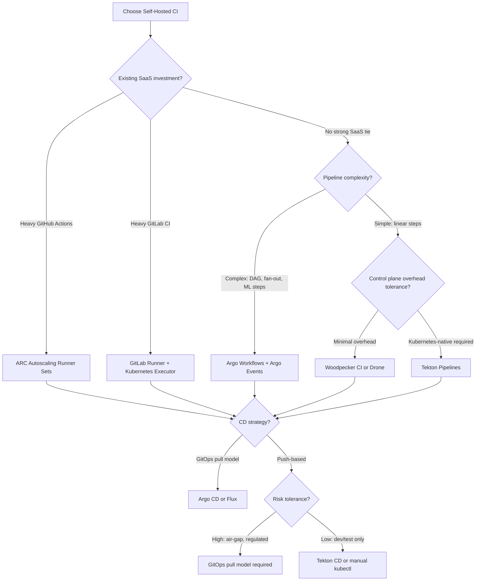

## Learning Outcomes

* Compare self-hosted CI/CD platforms on architecture, resource overhead, and Kubernetes-native integration, and diagnose common scheduling and volume-attachment failures in dynamic CI environments.
* Implement rootless, unprivileged container image builds using Kaniko or Buildah on bare-metal clusters.
* Configure distributed build caching and artifact storage using internal S3-compatible endpoints (MinIO) and local OCI registries.
* Design secret injection workflows that decouple credentials from pipeline definitions using External Secrets Operator.
* Route multi-architecture builds to dedicated hardware nodes using node labels and tolerations.

## Why This Module Matters

Compromising CI/CD tooling is one of the fastest ways for an attacker to reach production. A CI pipeline holds secrets for registries, cloud providers, and deployment targets in a single execution context. When that context runs on infrastructure you own, on bare metal inside your datacenter, the blast radius expands: the runner does not merely leak a cloud credential — it sits on the same physical network as your storage clusters, your databases, and your hypervisors. The downstream costs of a CI/CD compromise can include incident response, remediation, customer communication, and lost business. CI/CD infrastructure is not merely an operational convenience or a background development tool; it is the most critical attack surface in a modern software engineering organization. When attackers compromise your CI/CD pipeline, they implicitly gain the keys to your entire production environment and your entire software supply chain.

As organizations scale on-premises Kubernetes architectures, the default approach of relying on managed SaaS runners breaks down rapidly due to strict data sovereignty requirements, exorbitant outbound bandwidth costs, and the need for specialized hardware such as GPUs or custom ARM silicon. Operating a self-hosted CI/CD ecosystem — whether using GitHub Actions runners, GitLab CI, Jenkins, or Kubernetes-native tools like Tekton and Argo Workflows — demands a rigorous understanding of pod lifecycles, unprivileged container execution, and dynamic volume provisioning. A misconfigured self-hosted runner does not just fail a software build; it provides a direct, privileged vector into your core bare-metal infrastructure.

This module is grounded in a single, non-negotiable principle: every CI job must be treated as potentially hostile code. On shared bare-metal hardware, a build that escapes its container can compromise not just the CI namespace but every tenant on the node. The architecture, isolation, and operational patterns covered here are designed to contain that risk while still delivering the throughput your teams need.

## Did You Know?

* **Argo CD Graduation:** [The Argo project moved from CNCF incubation to CNCF graduation on December 6, 2022](https://www.cncf.io/announcements/2022/12/06/the-cloud-native-computing-foundation-announces-argo-has-graduated/), cementing its status as a mature GitOps standard.
* **Flux Graduation:** [Flux moved to CNCF graduation on November 30, 2022 after earlier incubation](https://www.cncf.io/announcements/2022/11/30/flux-graduates-from-cncf-incubator/), providing a strong declarative alternative to Argo CD.
* **Tekton Incubation:** [Tekton became a CNCF incubating project and publicly announced that status on March 24, 2026.](https://www.cncf.io/blog/2026/03/24/tekton-becomes-a-cncf-incubating-project/)
* **Runner Expirations:** If automatic updates are disabled, GitHub requires self-hosted runner software updates within 30 days, and jobs are not queued after that.

## The Landscape of Self-Hosted CI/CD

Running CI/CD on bare-metal Kubernetes requires shifting from managed, infinite-scale runner pools to finite, cluster-bound compute resources. The primary architectural divide lies between systems designed natively for Kubernetes (where pipelines are Custom Resource Definitions) and systems that use Kubernetes merely as an execution backend for ephemeral workers.

| Platform | Architecture | Pipeline Definition | Memory Footprint (Control Plane) | Best For |
| :--- | :--- | :--- | :--- | :--- |
| **Tekton** | Kubernetes-native (CRDs) | YAML (Custom CRDs) | Low relative controller overhead (exact usage depends on workload and configuration) | Highly customized, container-native delivery chains. |
| **Gitea Actions** | Server + Polling Agents | YAML (GitHub Actions format) | Low-Medium | Teams migrating from GitHub seeking syntax compatibility. |
| **Jenkins** | Monolithic Master + Ephemeral Pods | Groovy (Jenkinsfile) | High relative controller overhead | Legacy enterprise pipelines requiring massive plugin ecosystems. |
| **Woodpecker CI** | Server + RPC Agents | YAML (Drone-like) | Very low relative control-plane overhead | Lightweight, container-first workflows tightly coupled to Git events. |
| **Drone** | Server + RPC Agents | YAML (Drone format) | Very low relative control-plane overhead | Similar agent-based workflows for teams already standardized on Drone. |

Here is a visual representation of how the Kubernetes-native architecture (specifically Tekton) differs from legacy polling mechanisms. Tekton leverages the Kubernetes control plane directly:

```mermaid
graph TD
    A[Git Webhook] --> B[Tekton Triggers (EventListener)]
    B --> C[TriggerBinding / TriggerTemplate]
    C --> D[PipelineRun CRD Created]
    D --> E[Tekton Controller]
    E --> F[TaskRun CRDs Created]
    F --> G[Pod 1 Created]
    F --> H[Pod N Created]
```

## Deep Dive: GitHub Actions Self-Hosted Runners

For teams heavily invested in the GitHub ecosystem, self-hosting runners provides a way to bring execution inside the corporate firewall. A self-hosted GitHub runner is a system that the user deploys and manages. Unlike the ephemeral workers hosted by GitHub, self-hosted GitHub runners are free to use, while infrastructure and maintenance are paid by the runner owner.

These runners are highly adaptable. Self-hosted GitHub runners can run on physical machines, virtual machines, in containers, on-premises, or in the cloud. The GitHub self-hosted runner OS support includes specific supported Linux, Windows, and macOS versions. At the hardware level, GitHub self-hosted runners support `x64`, preview `ARM64`, and `ARM32` architectures.

To function correctly, they have strict network requirements. Self-hosted GitHub runners need at least ~70 Kbps throughput, outbound HTTPS/443, and domain access required by the workflow type. The core agent powering this, the GitHub Actions runner application, is open source.

Maintenance of these runners is critical. Self-hosted runner software updates occur on job assignment or within a week if unused. Security is enforced aggressively: if automatic updates are disabled, GitHub requires self-hosted runner software updates within 30 days, and jobs are not queued after that.

When a workflow is triggered, GitHub routes self-hosted jobs by `runs-on` labels/groups, re-queues after 60 seconds, and fails queued jobs after 24 hours. For advanced container workloads, GitHub container actions and service containers on self-hosted runners require a Linux runner with Docker installed.

To run these efficiently in Kubernetes, administrators use the Actions Runner Controller (ARC). GitHub supports ARC legacy and Autoscaling Runner Sets, but only the latest Autoscaling Runner Sets are supported by GitHub. Currently, GitHub states ARC is for OpenShift public preview and requires GitHub Enterprise Server 3.9+. Overall, GitHub positions Actions Runner Controller as the reference implementation for autoscaling self-hosted runners in Kubernetes.

### ARC Ephemeral Runners and Scale-to-Zero

ARC's Autoscaling Runner Sets mode represents a fundamental shift in how self-hosted runners consume cluster resources. Instead of maintaining a pool of always-on runner pods that sit idle polling for work, ARC uses a Listener pod that maintains a single long-poll HTTPS connection to the GitHub Actions service. The Listener consumes negligible resources until a workflow is triggered. When a job arrives, the Listener receives a message from GitHub, then patches the Ephemeral RunnerSet resource to create runners on demand using Just-in-Time (JIT) configuration tokens. Each runner pod is created for exactly one job and destroyed immediately upon completion.

This architecture delivers scale-to-zero behavior: when no workflows are running, the only resources consumed are the ARC controller manager pod and one Listener pod per runner scale set. A typical installation with three scale sets (for different runner profiles) idles at under 200 MiB of memory and negligible CPU. When a build surge arrives — say, ten developers push to different branches simultaneously — the Listener scales up rapidly, creating ephemeral runner pods in parallel. The JIT token mechanism ensures each runner registers with GitHub only for the specific job it was created to handle, eliminating the stale-runner problem that plagued earlier polling-based approaches where idle runners would accumulate and drift from their registered configuration.

The ephemeral, single-job lifecycle is the key security property of ARC. Because each runner pod handles exactly one workflow job and is then destroyed, there is no persistent state across jobs. A compromised build step cannot leave a backdoor in the runner filesystem for the next job to inherit. Similarly, secrets injected into the runner's environment are scoped to a single job execution; they cannot leak into a subsequent job through a shared filesystem or lingering process. This per-job isolation is not an optional feature — it is the default behavior of the Autoscaling Runner Sets mode, and it should be treated as a hard requirement for any production deployment where the CI runner has network access to internal systems.

Configuration of ARC is done through Helm, and the operational model is familiar to anyone who has managed a Kubernetes operator. The controller manager watches AutoScalingRunnerSet and EphemeralRunnerSet CRDs, reconciles desired state, and handles the lifecycle of Listener and runner pods. Resource limits on the runner pods are set at the scale-set level, and you can define multiple scale sets with different resource profiles — for example, a `large-build` scale set with 8 CPU / 16 GiB pods for compilation-heavy jobs, and a `small-test` scale set with 2 CPU / 4 GiB pods for lightweight test suites. GitHub routes jobs to the appropriate scale set based on the `runs-on` label in the workflow definition.

> **Pause and predict**: If a self-hosted GitHub runner relies on outbound HTTPS/443 polling to fetch jobs, what happens to the runner agent if your cluster's NAT gateway IP changes unexpectedly during a workflow execution?

### Gitea Actions: The Compatibility Layer

Gitea Actions implements a GitHub Actions-compatible engine using `act_runner`. Runners connect to Gitea via gRPC, poll for jobs, and spawn Docker containers or Kubernetes pods.

**Operational Characteristics:**
* **Pros:** Reuses existing GitHub Actions community steps (`uses: actions/checkout@v4`). Familiar syntax.
* **Cons:** GitHub-Actions-style workflows can become harder to debug when complex multi-container networking patterns are adapted to self-hosted runners. The translation layer occasionally fails on complex container networking setups (e.g., service containers communicating with the build container).
* **Configuration:** Require configuring `container` contexts explicitly. `act_runner` daemon must have appropriate RBAC to spawn pods in the target namespace.

## Deep Dive: GitLab Runner on Kubernetes

GitLab offers a highly robust runner architecture. GitLab Runner executes CI/CD jobs from GitLab pipelines and is managed/owned operationally by the administrator. GitLab distinguishes self-managed runners from GitLab-hosted runners and says self-managed gives full administrative control.

The agent itself is lightweight. GitLab Runner is a single binary application and has no language-specific requirements. Because of this, GitLab Runner supports installation on Linux, FreeBSD, macOS, Windows, and z/OS; plus Docker or Kubernetes-based deployment methods. It also spans various hardware profiles, as GitLab Runner supports architectures including x86, AMD64, ARM64, ARM, s390x, ppc64le, riscv64, and loong64.

Administrators have vast flexibility in how jobs are executed. GitLab Runner supports multiple execution models including shell, Docker, Docker+SSH, Docker-based autoscaling, and remote SSH. In a cluster environment, the GitLab Kubernetes executor creates a Kubernetes pod per CI job and runs builds inside that pod.

To do this securely, the GitLab Kubernetes executor requires Kubernetes API permissions and service account access to create/list/watch pods and related actions. To avoid strange API mismatches or missing features, GitLab recommends keeping GitLab Runner major.minor versions in sync with GitLab major.minor for compatibility.

### GitLab Runner Autoscaling on Kubernetes

The GitLab Kubernetes executor does not include a native autoscaler, which means that a static set of runner pods will either sit idle and waste resources or become a bottleneck during build surges. Two common patterns address this. The first uses the Kubernetes `HorizontalPodAutoscaler` (HPA) on the runner Deployment, scaling based on CPU or memory utilization. This is straightforward but reactive — it takes a full metric collection cycle plus pod startup time before new capacity arrives, and the runner pods themselves must be configured to pick up multiple concurrent jobs (via the `concurrent` setting) for the HPA to have meaningful utilization signals.

The second and more robust pattern uses the GitLab Runner's `docker+machine` or `docker-autoscaler` executor with a Kubernetes driver, which provisions VMs or containers on demand and deregisters them after idle timeout. On bare-metal Kubernetes, the `fleeting` plugin framework is the modern path: it allows GitLab Runner to dynamically create and destroy runner instances via a cloud-provider or Kubernetes API, with each instance handling a configurable number of jobs before being recycled. The key operational consideration is the `IdleCount` and `IdleTime` settings: `IdleCount` controls how many idle runners are kept warm (trading resource waste for job-start latency), while `IdleTime` determines how long an idle runner survives before the autoscaler removes it. For on-premises deployments where every node-hour has a direct CapEx cost, set `IdleCount` to zero so that capacity scales fully to demand, accepting the ~30-60 second cold-start penalty for new runner pods.

## Deep Dive: Argo Workflows (CRD Native CI)

Argo Workflows is a CNCF graduated project and the most widely adopted container-native workflow engine for Kubernetes. Unlike Tekton, which is purpose-built for CI/CD pipelines with a Task/Pipeline model, Argo Workflows provides a general-purpose DAG (directed acyclic graph) and steps-based workflow execution framework implemented entirely as Kubernetes CRDs. Each step in an Argo workflow runs as a container in a pod, and the workflow engine handles artifact passing, retry logic, and conditional branching natively.

Argo Workflows is particularly well-suited to CI/CD pipelines that mix build steps with data processing, machine learning training, or infrastructure provisioning — any scenario where the workflow graph contains non-trivial branching, fan-out/fan-in, or long-running compute steps. Its artifact repository (which defaults to S3-compatible storage like MinIO) decouples data passing from POSIX filesystem semantics entirely: steps exchange artifacts through S3 objects rather than shared volumes, eliminating the PVC attach/detach latency that plagues multi-node Tekton pipelines. This is a decisive architectural advantage on bare-metal clusters where `ReadWriteOnce` block storage forces all tasks onto the same node.

The tradeoff is that Argo Workflows is not a dedicated CI tool — it does not include built-in Git webhook handling, pull-request status reporting, or a CI dashboard. These concerns are handled by Argo Events (for event-driven triggering) and Argo CD (for GitOps delivery), forming the broader Argo ecosystem. Teams that adopt Argo Workflows for CI typically pair it with Argo Events to trigger workflows from Git webhooks and Argo CD Notifications to report build status back to the Git provider.

## Deep Dive: Jenkins on Kubernetes

When migrating from virtual machines to Kubernetes, teams often attempt to lift-and-shift legacy CI tools like Jenkins. Jenkins uses a distributed architecture of controller, nodes, agents, and executors. The workers themselves, known as Jenkins agents, are Java-based processes that can use any operating system that supports Java.

Modern deployments avoid static nodes. Jenkins can dynamically allocate agents through systems including Kubernetes. When configured correctly, the Jenkins Kubernetes plugin provisions pods for agents, creating a pod per agent and supporting shared/extra containers via pod templates. Interestingly, Jenkins agents are not required to run inside Kubernetes even when using the Kubernetes plugin — they can communicate with external controllers.

**Operational Characteristics:**
* **Pros:** Handles extreme edge cases via Groovy scripting.
* **Configuration:** Running Jenkins on Kubernetes effectively requires abandoning UI-based configuration; Jenkins Configuration as Code (JCasC) should define the master state.
* **Architecture:** The agent pod definition often requires multiple containers (a JNLP agent container to communicate with the master, and specific tool containers like `maven` or `node`).

However, running a monolithic Jenkins controller inside Kubernetes presents significant operational challenges:
* **Cons:** The JVM master is a single point of failure and memory hog. Long JVM pauses or an undersized Jenkins controller can destabilize webhook handling and agent connectivity under load.

To mitigate this, you must explicitly configure `-Xmx` and `-Xms` JVM flags to match your Kubernetes Pod resource limits, preventing the Linux kernel OOM killer from terminating the controller during high load.

## Deep Dive: Tekton Pipelines (CRD Native)

Tekton operates without a central CI server. [Tekton is a cloud-native CI/CD framework that runs as an extension on Kubernetes and is defined by Kubernetes Custom Resources. The pipeline state is literally the Kubernetes etcd state. Tekton's `TaskRun` model is pod-based; by design each TaskRun executes inside a Kubernetes Pod.](https://tekton.dev/docs/pipelines/)

**Operational Characteristics:**
* **Pros:** Complete Kubernetes API integration. RBAC applies directly to pipelines. Highly scalable; controller bottlenecks are extremely rare.
* **Cons:** Extremely verbose YAML syntax. Sharing data between tasks requires `Workspaces` (PersistentVolumeClaims), which can introduce attach/detach latency on bare-metal block storage like Ceph.
* **Production Gotcha:** PVC attach limits. If a `PipelineRun` spins up 10 parallel tasks [sharing the same `ReadWriteOnce` Workspace, the pods must be scheduled on the same node](https://tekton.dev/docs/pipelines/).

> **Stop and think**: If Tekton stores pipeline state entirely in `etcd`, what is the risk of [retaining 100,000 completed `PipelineRun` objects](https://tekton.dev/docs/pipelines/) in a production cluster?

## Deep Dive: GitOps with Argo CD and Flux

CI builds the artifact, but CD deploys it. In modern Kubernetes environments, Continuous Delivery is managed via GitOps.

Argo CD is a declarative, GitOps continuous delivery tool for Kubernetes. Instead of a CI pipeline pushing changes to the cluster using static credentials, [Argo CD uses Git as the source of truth and can track updates from branches, tags, and commits. The tool pulls the desired state and reconciles it against the live cluster state.](https://argoproj.github.io/cd/)

Both Argo CD and Flux have become industry standards for CD. The Argo project moved from CNCF incubation to CNCF graduation on December 6, 2022. Similarly, Flux moved to CNCF graduation on November 30, 2022 after earlier incubation.

### GitOps Pull Model for On-Premises and Air-Gap

The fundamental architectural distinction between CI push and CD pull becomes critically important in on-premises and air-gapped environments. In a push-based CD model, the CI pipeline authenticates to the target cluster and applies manifests directly, typically using a static ServiceAccount token or kubeconfig credential that must be stored inside the CI system. On a shared on-premises cluster, that credential represents an attack vector: if the CI runner is compromised, the attacker gains direct push access to your production cluster.

The GitOps pull model inverts this relationship entirely. With Argo CD or Flux, the CD agent runs inside the target cluster and pulls the desired state from a Git repository on a polling interval (default 3 minutes for Argo CD, configurable down to seconds). The CD agent authenticates to the Git server using its own read-only credentials. The CI pipeline never needs direct cluster access — it only needs permission to push to a Git branch. This inversion has profound security implications for bare-metal deployments. If a CI runner is compromised, the attacker can push to a Git branch, but the GitOps operator will reconcile that change through the normal diff-and-sync path, which should include required reviewers on the deployment branch, automated policy checks via OPA or Kyverno, and the normal Git audit trail. The attacker does not get a raw `kubectl apply` against the cluster.

For air-gapped environments with no outbound internet access, both Argo CD and Flux support fully offline operation with internal Git servers (Gitea, GitLab CE). The CD agent polls the internal Git repository over the cluster-internal network. Container images referenced in the manifests must come from an internal registry (see Module 7.7), and Helm charts must be sourced from an internal chart repository or stored directly in the Git repository. Flux's OCIRepository source is particularly useful here: it can pull Helm charts packaged as OCI artifacts from your internal Harbor instance, and its `verify` field supports cosign signature verification against an air-gapped cosign deployment with an internal Rekor transparency log.

## Runner Security and Isolation

Every CI build is a code execution environment. On a SaaS platform, that execution happens in a provider-managed sandbox that you do not control but also do not need to secure. On your own bare metal, you are the provider, and you must build the sandbox yourself. The following isolation layers form the minimum viable security posture for a self-hosted CI deployment.

### Ephemeral Runner Isolation

The single most effective security control for self-hosted CI runners is ensuring that every build runs in a fresh, ephemeral environment with no persistent state. Both ARC (GitHub Actions) and the GitLab Kubernetes executor achieve this by creating a new pod for each job and deleting it upon completion. This eliminates the entire class of attacks that depend on state persistence across builds — a compromised test suite cannot plant a backdoor in the runner filesystem that a subsequent privileged build will execute, because there is no subsequent build in that pod.

The corollary is that you must never, under any circumstances, bind-mount a persistent volume into a CI runner pod at a writable path. If a build needs to cache dependencies (and it will — cold builds are slow), the cache must be accessed through a dedicated cache service that enforces per-branch namespacing and lifecycle management, not through a shared filesystem mount that spans jobs.

### Privileged Build Risks and Rootless Alternatives

Building OCI container images inherently involves operations that, in a traditional Docker-based CI setup, require the Docker daemon — which runs as root. Mounting the Docker socket (`/var/run/docker.sock`) into a CI pod gives that pod root-equivalent access to the host node's container runtime. An attacker who controls a Dockerfile can trivially escape the container by running a privileged container from inside the build, or by manipulating the host filesystem through volume mounts.

The rootless build tools covered in the Unprivileged Container Builds section below — Kaniko, BuildKit (rootless), and Buildah — solve this by executing Dockerfile instructions entirely in user space, without any daemon. Kaniko runs as a non-root user inside its container and parses each Dockerfile instruction, executing the equivalent filesystem operations directly. BuildKit in rootless mode uses user namespaces to map the root user inside the build container to an unprivileged UID on the host. Neither requires the Docker socket, neither requires `privileged: true`, and neither can escape their pod's security context.

### Supply Chain Integrity with Cosign and Sigstore

Building an image without a daemon is only the first step — you must also prove that the image pushed to your registry was built by your CI pipeline and has not been tampered with since. [Cosign, part of the Sigstore project, provides keyless signing of OCI artifacts using short-lived certificates issued through an OpenID Connect (OIDC) identity provider.](https://docs.sigstore.dev/cosign/overview/) In a CI pipeline, the OIDC token is automatically generated by the CI platform and scoped to the specific workflow run, repository, and branch. Cosign exchanges this token for a certificate from Fulcio (Sigstore's certificate authority), signs the image with an ephemeral key, and records the signature in a Rekor transparency log. The private key is never stored or distributed — it is generated in memory and discarded after signing.

For on-premises and air-gapped deployments where the public Fulcio and Rekor instances are unreachable, Sigstore supports running the entire stack internally. A self-hosted Fulcio instance issues certificates against your internal OIDC provider, and a self-hosted Rekor instance maintains the transparency log. The cosign client can be configured to use these internal endpoints. On the verification side, an admission controller like Kyverno or a policy engine like OPA can be configured to reject any pod that references an unsigned image, enforced at the Kubernetes API level before the image is ever pulled.

### Network Egress Control

A CI runner that can make arbitrary outbound network connections can exfiltrate secrets, download unvetted dependencies, or establish a command-and-control channel. On bare-metal clusters, network egress control is enforced through Kubernetes `NetworkPolicy` resources, provided your CNI plugin supports them (Cilium and Calico both provide full NetworkPolicy enforcement). A production CI namespace should have a default-deny egress policy, with explicit allows only for destinations the build genuinely needs: the internal Git server, the internal OCI registry, the internal cache service, and any approved external package registries that are explicitly allowlisted. Egress to arbitrary public IP addresses should be blocked by default.

## Air-Gap CI: Building Without the Internet

An air-gapped environment — one with no outbound internet connectivity at all — presents the ultimate test of self-hosted CI/CD maturity. Every dependency, every base image, every Helm chart, and every tool binary must be sourced from internal mirrors that were populated from the internet at a controlled ingress point. This section covers the infrastructure components and operational patterns required to make CI functional in a fully disconnected environment.

### Internal Mirrors and Dependency Proxying

The foundation of air-gap CI is a set of internal mirrors that serve the same content your builds would normally download from the public internet. The critical mirrors are:

A container registry mirror (Harbor or Docker Registry) configured as a pull-through cache for the registries your builds reference: `docker.io`, `gcr.io`, `ghcr.io`, `quay.io`, and any language-specific registries. When a build requests `python:3.12-slim`, the internal registry checks its cache and either serves the image directly or (if permitted at the ingress point) pulls it from the upstream. In a hard air-gap, the mirror is populated during periodic "import windows" when connectivity is temporarily established, or through a one-way data diode.

Package registry mirrors for each language ecosystem your teams use: PyPI (via devpi or Nexus), npm (via Verdaccio or Nexus), Maven (via Nexus or Artifactory), Go modules (via Athens or a simple Git-based vendor directory), and Cargo (via Panamax or a filesystem mirror). Each mirror must be populated with the specific package versions and their transitive dependencies before they can be used in a build. This is not a one-time setup — it requires an ongoing process that maps the dependency graphs of your applications and pre-seeds new versions before developers need them.

Git repository mirrors: your CI pipelines clone source code during builds. In an air gap, they clone from an internal Gitea or GitLab CE instance rather than from a SaaS provider. This internal Git server must be kept in sync with whatever external repositories your teams collaborate through, typically via a periodic `git fetch --all` through the ingress point or via a manual `git bundle` transfer.

### Offline Dependency Management Patterns

Beyond the infrastructure, air-gap CI requires changes to how developers declare and manage dependencies. The most robust pattern is dependency vendoring: every dependency is committed to the source repository, and builds reference only local paths. Go modules support this natively with the `vendor/` directory and `-mod=vendor`. Node.js projects can use `npm pack` or `yarn offline` to create tarballs committed alongside the source. Python projects require more care — a `requirements.txt` with pinned hashes combined with a pre-populated pip cache directory works, but the cache must be rebuilt whenever dependencies change.

A lighter-weight pattern uses a lockfile-and-proxy approach: the lockfile pins exact versions and content hashes for every dependency, and the build tool is configured to fetch from the internal mirror exclusively, using the lockfile's integrity hashes to verify that the mirror is serving the expected content. If the mirror is missing a dependency, the build fails cleanly rather than attempting to reach the internet.

### CI Runner Configuration for Air-Gap

CI runner pods in an air-gapped cluster must be configured to use internal endpoints for every network call. This means setting the container runtime's registry mirrors in the containerd configuration on every worker node, pointing `registry-mirrors` for `docker.io` and other registries to the internal Harbor instance. For builds that use language-specific package managers, the runner pod's environment must include the mirror URLs: `PIP_INDEX_URL`, `NPM_CONFIG_REGISTRY`, `GOPROXY`, and equivalent variables for every ecosystem in use. These can be set globally via a ConfigMap mounted into every runner pod, or injected per-job via the CI platform's variable mechanism.

## The Cost Lens: On-Premises CI Economics

Running CI/CD on owned hardware is not free just because there is no per-minute SaaS bill. The costs shift from a pure OpEx model (pay-as-you-go SaaS minutes) to a mixed CapEx and OpEx model, and understanding when that shift is economically favorable — or ruinous — is essential to making the right architectural decision.

### CapEx vs. OpEx: What You Actually Pay For

In the SaaS model, you pay a predictable per-minute rate for CI execution. GitHub Actions charges per minute on a per-runner-tier basis; GitLab.com charges per CI minute based on your subscription tier. For a team of 20 developers running an average of 5 CI builds per day at 8 minutes per build, that is roughly 16,000 minutes per month — a predictable, linear cost that scales directly with usage. If you have a quiet month, you pay less. If you launch a crunch sprint, you pay more, but you never need to provision capacity in advance.

On-premises CI shifts the bulk of the cost to CapEx: you buy servers, network gear, and rack space upfront, and those assets depreciate over a 3-5 year lifecycle. A modest CI cluster — three 1U servers with 32 cores and 128 GiB of RAM each, plus a 10 GbE switch, installed in an existing rack — might cost $25,000–$45,000 in hardware. Amortized over 3 years, that is $700–$1,250 per month, plus power and cooling (roughly $150–$300/month for three servers at typical datacenter rates), plus the ops headcount to maintain them. A fraction of one FTE — say, 10% of a platform engineer — adds another $1,000–$1,500/month in fully loaded cost. Total monthly cost for the on-prem CI cluster: roughly $2,000–$3,000.

At a list price of $0.008/minute for GitHub Actions (typical Linux runner), 16,000 SaaS minutes cost $128/month. The SaaS is dramatically cheaper at this scale. The crossover point — where on-premises becomes cost-competitive — depends on your build volume, but a rough heuristic is around 200,000–400,000 CI minutes per month. Below that volume, SaaS CI is almost always cheaper. Above it, and especially when builds require specialized hardware (GPUs, large memory, ARM) that SaaS providers charge a premium for or simply do not offer, on-premises CI can deliver net savings.

### The Hidden Costs

The total cost of ownership includes factors that are easy to overlook. Depreciation and refresh cycles: servers have a finite useful life, typically 3-5 years for CI workloads that run near-continuously. You must budget for replacement hardware on that cycle, or accept increasing failure rates and performance degradation. Support contracts: enterprise-grade server hardware requires vendor support contracts that typically cost 10-20% of the hardware purchase price annually. Spare parts: running CI on owned hardware means you need spare drives, power supplies, and network cables on hand — or you accept multi-day downtime waiting for a replacement part.

There is also an opportunity cost. The platform engineers who maintain the on-prem CI cluster are not building developer platforms, improving observability, or hardening security. Every hour spent debugging a failed CI node is an hour not spent on higher-leverage work. The SaaS model eliminates this opportunity cost entirely — GitHub or GitLab's SRE team handles the hardware, and your team never thinks about it.

### When On-Prem CI Wins

On-premises self-hosted CI becomes the correct choice when one or more of the following conditions holds. First, data sovereignty or regulatory requirements (ITAR, FedRAMP, GDPR with strict data localization) demand that build artifacts, source code, and secrets never leave a controlled physical environment. No amount of SaaS cost savings can overcome a compliance violation. Second, steady-state high utilization: if your CI cluster runs at 60%+ utilization 24/7, the amortized CapEx model beats the linear OpEx model, and you are not paying for idle SaaS capacity. Third, specialized hardware requirements: if your builds need GPUs, large-memory instances (256 GiB+), or ARM-native execution that SaaS providers either do not offer or charge a significant premium for. Fourth, egress-heavy pipelines: if your builds push large artifacts (multi-gigabyte Docker images, ML model weights) and you are being charged per-gigabyte egress by a cloud provider, keeping that data transfer local to your datacenter eliminates an enormous and unpredictable cost line.

Conversely, if your utilization is spiky and unpredictable, your team is small, and your builds run fine on standard SaaS runners, self-hosting CI is almost certainly a net-negative investment. The operational burden will consume more engineering time than the SaaS bill consumes budget, and the risk of a misconfigured runner exposing your internal network far outweighs any theoretical cost savings.

## Patterns and Anti-Patterns

### Proven Patterns

**Pattern 1: Ephemeral Everywhere.** Every CI job runs in a freshly created pod with no persistent volumes, no shared state, and no residual filesystem from previous runs. This is the default behavior of ARC Autoscaling Runner Sets and the GitLab Kubernetes executor, but it must be actively preserved — never add a persistent volume claim to a runner pod template for convenience. Cache data lives in an external service (MinIO or a registry) with per-branch namespacing and automatic lifecycle expiration. This pattern eliminates state-based attack persistence and ensures that every build starts from a known, clean state. It scales horizontally without limit because there is no shared state to coordinate.

**Pattern 2: GitOps Pull for Cluster Delivery.** The CI pipeline never authenticates to the production cluster. It pushes artifacts to a registry, updates a Git repository with the new image tags, and stops. A GitOps operator (Argo CD or Flux) running inside the target cluster detects the Git change, pulls the manifests, verifies signatures, and applies them. This pattern eliminates the CI-to-cluster credential that is the single highest-value target in a push-based deployment model. It also provides a complete audit trail: every cluster change is a Git commit, and the reconciler's diff output shows exactly what changed and why.

**Pattern 3: Architecture-Native Routing.** Multi-architecture builds use Kubernetes node affinity and taints to route builds to the correct hardware, rather than relying on QEMU emulation. AMD64 builds land on AMD64 nodes, ARM64 builds on ARM64 nodes, and a final manifest-combining job runs anywhere. This pattern eliminates the 10-20x performance penalty of emulated cross-architecture builds and ensures that CI throughput is not bottlenecked by a small number of exotic-architecture nodes handling both native and emulated workloads.

**Pattern 4: Declarative CI with CRD-Native Pipelines.** Pipeline definitions are Kubernetes CRDs, not opaque YAML stored in a CI server's database. Tekton `Pipeline` and `Task` resources, and Argo `Workflow` resources, are first-class Kubernetes objects that can be managed with `kubectl`, versioned in Git, and subjected to the same RBAC, admission control, and audit logging as every other Kubernetes resource. This pattern eliminates the CI-server-as-snowflake problem: the CI configuration is self-documenting, version-controlled, and recoverable from a bare cluster by reapplying the CRDs.

### Anti-Patterns

**Anti-Pattern 1: The Docker Socket Escape Hatch.** Mounting `/var/run/docker.sock` into CI pods is the most common and most dangerous shortcut in self-hosted CI. It appears to solve the container-build problem with a single line in a pod spec, but it gives every build root-equivalent access to the host node. Why teams fall into it: Docker-based CI is familiar, and the socket mount is well-documented in legacy tutorials. Better approach: use Kaniko, rootless BuildKit, or Buildah for every image build. These tools have been production-stable for years and are supported by all major CI platforms covered in this module. If you absolutely cannot avoid the Docker socket — for example, because a legacy build tool requires `docker-compose` — run that specific CI job on a dedicated, network-isolated node with no access to internal services, and dismantle it the moment the migration is complete.

**Anti-Pattern 2: Monolithic CI Controller as a Pet.** Running a single Jenkins controller or a single GitLab instance in a pod with a manually attached persistent volume, no automated backup, and configuration applied through the UI creates a fragile single point of failure. Teams fall into this pattern because it mirrors the VM-based CI setup they are migrating from. The better approach is to treat the CI controller as cattle: deploy it from a Helm chart with Configuration as Code (JCasC for Jenkins, the GitLab Helm chart for GitLab), store its state in an external database (not an embedded SQLite file), and ensure it can be recreated from scratch by reapplying the Helm release and restoring the database.

**Anti-Pattern 3: Shared Persistent Cache Volumes.** Mounting an NFS or CephFS volume at `/cache` across all runner pods to share dependency caches creates a single point of failure and a security boundary violation: any build can poison the cache for every other build. Teams adopt this because cold builds are slow and a shared cache seems like the obvious fix. Better approach: use a cache-as-a-service model where the CI platform pushes and pulls cache layers through an S3-compatible API, with content-addressed keys that prevent cache poisoning. Kaniko supports this natively with `--cache=true --cache-repo=<registry>`, and GitHub Actions supports caching backends that can be pointed at an internal MinIO instance.

**Anti-Pattern 4: Hardcoded Credentials in Pipeline Definitions.** Embedding registry passwords, cloud provider keys, or deployment tokens directly in CI configuration files (`.gitlab-ci.yml`, Tekton `Pipeline` resources, GitHub Actions workflow files) means that anyone with read access to the repository can extract them. Teams do this because it works immediately and the CI platform's secret management feature requires additional setup. Better approach: use External Secrets Operator to synchronize secrets from a central vault (HashiCorp Vault, AWS Secrets Manager, or Azure Key Vault) into the CI namespace, and reference them by name in pipeline definitions. For air-gapped environments, run a self-hosted Vault instance and inject secrets via the Vault Agent Injector sidecar.

## Decision Framework

Choosing a self-hosted CI/CD stack for bare-metal Kubernetes is not a one-size-fits-all decision. The following flowchart captures the primary tradeoffs, and the decision matrix below provides quantitative comparisons to anchor your evaluation.



**Decision Matrix**

| Criterion | ARC + GitHub Actions | GitLab Runner | Tekton | Argo Workflows | Woodpecker/Drone |
| :--- | :--- | :--- | :--- | :--- | :--- |
| Kubernetes-native (CRDs) | Partial (operator CRDs) | No (external runner) | Yes (full CRD lifecycle) | Yes (full CRD lifecycle) | No (server + agents) |
| Ephemeral per-job isolation | Yes (Autoscaling Runner Sets) | Yes (Kubernetes executor, pod per job) | Yes (TaskRun = pod) | Yes (step = pod) | Configurable |
| Scale-to-zero | Yes | With autoscaler | Yes (no idle runners) | Yes (no idle workers) | No (agents poll) |
| Control plane overhead | Low | Low-Medium | Low | Low | Very Low |
| Learning curve | Low (GitHub Actions syntax) | Low-Medium | High (verbose CRDs) | High (DAG authoring) | Low |
| Air-gap support | Partial (ARC + internal GHES) | Full (GitLab CE self-hosted) | Full | Full | Full |
| Supply-chain signing | Via cosign in workflow | Via cosign in job | Via cosign Task | Via cosign step | Via cosign in step |
| Best for | GitHub-ecosystem teams | GitLab-ecosystem teams | Custom CI/CD with K8s integration | Complex DAGs, ML pipelines, batch | Lightweight, low-overhead teams |

## Core CI/CD Challenges on Bare Metal

### Unprivileged Container Builds

Without the Docker daemon, building OCI images inside Kubernetes pods requires user-space build tools.

1. **Kaniko:** Executes Dockerfile instructions completely in userspace. Ideal for standard Dockerfiles.
2. **BuildKit (rootless):** Can be run as a rootless daemon inside a pod or deployed as a shared service (`buildkitd`) within the cluster.
3. **Buildah:** Red Hat's daemonless build tool. Containerized Buildah often needs host and security-context tuning to work cleanly in Kubernetes, especially when rootless user-namespace support is unavailable.

**Kaniko Implementation Detail:**
[Kaniko requires the `DOCKER_CONFIG` environment variable to point to a mounted secret containing registry credentials.](https://github.com/osscontainertools/kaniko)

```yaml
volumeMounts:
  - name: docker-config
    mountPath: /kaniko/.docker/
```

### Build Caching

Ephemeral CI pods start with cold caches. Downloading dependencies (npm, maven, go modules) and base images for every run destroys pipeline velocity.

* **Distributed Cache Storage:** Deploy an internal S3-compatible object store (MinIO) exclusively for CI caches.
* **Registry Pull-Through Cache:** Configure a local Harbor or Docker Registry instance as a pull-through mirror for `docker.io`, `gcr.io`, and `ghcr.io`. Point containerd on the worker nodes to this mirror to avoid rate limits.
* **Kaniko Cache:** Kaniko can cache image layers to a remote registry using the `--cache=true` and `--cache-repo=internal-registry:5000/cache` flags.

### Secret Injection

Hardcoding secrets in CI definitions or relying on the CI tool's native secret manager leads to security fragmentation. Synchronize secrets into the CI namespace using External Secrets Operator (ESO), or [inject them at runtime using Vault Agent sidecars](https://developer.hashicorp.com/vault/docs/deploy/kubernetes/injector).

For Tekton, you can bind secrets directly to the ServiceAccount executing the `TaskRun`.

```yaml
apiVersion: v1
kind: ServiceAccount
metadata:
  name: build-bot
secrets:
  - name: registry-credentials
```

### Multi-Architecture Builds

Building `arm64` images on `amd64` nodes via emulation can be much slower than routing work to native `arm64` hardware. Bare-metal clusters should utilize native hardware routing.

1. Tag physical `arm64` nodes with `kubernetes.io/arch=arm64`.
2. Apply nodeSelectors or tolerations to the pipeline agents.
3. Build the architecture-specific images natively, push them with unique tags (e.g., `v1.0.0-amd64`, `v1.0.0-arm64`).
4. Execute a final, lightweight manifest-tool job to create and push the multi-arch OCI index (manifest list).

## Common Mistakes

| Mistake | Why | Fix |
|---|---|---|
| Mounting `/var/run/docker.sock` | Gives the CI pod broad control over the host container runtime and breaks normal isolation boundaries. | Use rootless Buildah or Kaniko. |
| Ignoring PVC Attach Latency | Cloud storage takes 10-30s to detach/attach between tasks. | Use Node affinity or object storage for artifacts. |
| Unbounded Build Caches | Ephemeral caches fill up local disks and cause node evictions. | Apply S3 lifecycle policies to prune caches older than 7 days. |
| Hardcoding Secrets in CI | Exposes credentials in logs and YAML definitions. | Use External Secrets Operator to inject secrets via ServiceAccounts. |
| Single-arch builds for ARM | QEMU emulation is over 10x slower for compiled languages. | Route ARM builds to physical ARM nodes via `nodeSelector`. |
| Running Jenkins Masters in pods without tuning | JVM heap limits cause OOMKills during garbage collection. | Set explicit `-Xmx` and `-Xms` flags matching pod limits. |
| Embedded SQLite in production CI | Woodpecker and Drone default to SQLite, which corrupts under concurrent write load. | Configure an external PostgreSQL database before entering production. |

## Quiz

<details>
<summary>Question 1: Your bare-metal Kubernetes cluster uses a Ceph block storage backend. You design a Tekton `Pipeline` with 5 sequential `Tasks`. You define a `Workspace` backed by a `ReadWriteOnce` PVC to share the compiled binary between tasks. You observe that the pipeline takes significantly longer than expected, with pods spending minutes in the `ContainerCreating` state. What is the most likely architectural cause?</summary>

A) The Ceph cluster is out of IOPS and throttling the container creation.
B) Tekton is waiting for the previous Task's Pod to be garbage collected before scheduling the next.
C) The PVC must be unmounted from the previous Node and mounted to the new Node for each Task, causing attach/detach latency.
D) The `ReadWriteOnce` access mode requires manual approval from the CSI driver for sequential pod usage.

**Answer:** C) The PVC must be unmounted from the previous Node and mounted to the new Node for each Task, causing attach/detach latency.

**Explanation:** In a multi-node bare metal cluster using block storage, a `ReadWriteOnce` volume can only be attached to a single node at a time. Tekton creates a new Pod for every Task execution. If the new Task is scheduled on a different node than the previous Task, the storage orchestrator must forcefully detach the volume from Node A and attach it to Node B. This CSI orchestration inevitably introduces significant delay compared to local volume mounts. It is highly unlikely that B) Tekton is waiting for the previous Task's Pod to be garbage collected before scheduling the next.
</details>

<details>
<summary>Question 2: You are migrating an existing Jenkins pipeline to Kubernetes using the Jenkins Kubernetes plugin. The legacy pipeline executed `docker build` and `docker push`. To replicate this on your unprivileged bare-metal cluster, which approach maintains cluster security boundaries while accomplishing the goal?</summary>

A) Mount `/var/run/docker.sock` from the host node into the Jenkins agent pod and use the Docker CLI.
B) Set `securityContext.privileged: true` on the agent pod and run Docker-in-Docker (DinD).
C) Replace the Docker CLI steps with a Kaniko container execution, providing the registry credentials via a mounted Secret.
D) Expose the kubelet's internal containerd socket to the agent pod via a HostPath volume.

**Answer:** C) Replace the Docker CLI steps with a Kaniko container execution, providing the registry credentials via a mounted Secret.

**Explanation:** Mounting the host's Docker socket into a pod gives that pod root-level access to the underlying Kubernetes node, entirely bypassing container isolation. Privileged containers running Docker-in-Docker present similar critical security risks. Kaniko solves this by executing Dockerfile build instructions entirely in user space without requiring a daemon, ensuring that your CI workloads remain unprivileged and isolated from the host operating system.
</details>

<details>
<summary>Question 3: A developer complains that their CI pipeline running on Gitea Actions fails intermittently with `No space left on device` during the `npm install` phase. The worker node has 500GB of free disk space. The pod is scheduled successfully but terminates mid-execution. What is the most likely cause?</summary>

A) The Node's container runtime has exhausted the allocated ephemeral-storage limit for the pod.
B) The Gitea `act_runner` process has a hardcoded 5GB volume limit for all executions.
C) The Git repository contains too many branches, exceeding the allowed inode count for the clone operation.
D) Kubernetes does not support temporary disk space allocation for CI workloads without a mounted PVC.

**Answer:** A) The Node's container runtime has exhausted the allocated ephemeral-storage limit for the pod.

**Explanation:** Kubernetes limits the amount of local ephemeral storage a pod can use based on its resource requests and limits. Even if the underlying physical node has hundreds of gigabytes of free disk space, if the pod exceeds its defined `ephemeral-storage` limit while downloading heavy `node_modules`, the kubelet will aggressively evict and terminate the pod to protect the node's disk integrity.
</details>

<details>
<summary>Question 4: You need to compile an application for both `amd64` and `arm64` architectures. Your bare-metal cluster consists of 10 `amd64` servers and 2 `arm64` servers. What is the most efficient pattern to produce the multi-architecture OCI image?</summary>

A) Run QEMU emulation inside a Kaniko pod on an `amd64` node to build both architectures sequentially, then push the manifest.
B) Deploy separate CI agents constrained by `nodeSelector` to specific architectures, build architecture-specific images natively, and combine them with a final manifest-tool job.
C) Configure the Kubernetes control plane to automatically translate `amd64` container instructions to `arm64` using the MutatingAdmissionWebhook.
D) Use Buildah on the `arm64` nodes to cross-compile the binary, copy it via SCP to the `amd64` node, and run `docker build`.

**Answer:** B) Deploy separate CI agents constrained by `nodeSelector` to specific architectures, build architecture-specific images natively, and combine them with a final manifest-tool job.

**Explanation:** While you technically could run QEMU emulation on an `amd64` machine to build an `arm64` image, the translation overhead makes it prohibitively slow for compiled languages. The most efficient and scalable approach is to route the workloads directly to their native hardware using Kubernetes scheduling primitives like `nodeSelector`. It is not feasible to C) Configure the Kubernetes control plane to automatically translate `amd64` container instructions to `arm64` using the MutatingAdmissionWebhook.
</details>

<details>
<summary>Question 5: You deploy an internal S3-compatible storage cluster (MinIO) to serve as a distributed build cache for your CI pipelines. After three months, the MinIO nodes crash due to full disks. You verify that the current active projects only consume 50GB of cache data, but MinIO shows 2TB of utilization. What operational control is missing?</summary>

A) The CI pipelines are not running the `minio prune` command at the end of every run.
B) The MinIO bucket lacks a lifecycle management policy to automatically expire and delete old objects.
C) The CI runners are writing to the root filesystem instead of the mounted MinIO volume.
D) Kubernetes PV reclaim policy was set to `Retain` instead of `Delete`.

**Answer:** B) The MinIO bucket lacks a lifecycle management policy to automatically expire and delete old objects.

**Explanation:** Build caches generate massive amounts of ephemeral data as branches are created, built, and merged. Without an aggressive object lifecycle policy (e.g., deleting objects older than 7 days) configured at the S3 bucket level, orphaned caches from deleted branches will accumulate indefinitely until the storage cluster is entirely exhausted.
</details>

<details>
<summary>Question 6: Your team is deploying self-hosted CI runners in an air-gapped datacenter with no outbound internet access. The build pipelines use `python:3.12-slim` as a base image and install dependencies via `pip`. What infrastructure must exist before the first build can succeed?</summary>

A) A Kubernetes CronJob that periodically runs `docker pull python:3.12-slim` to refresh the node's image cache.
B) An internal container registry mirror pre-seeded with the required base images, and an internal PyPI mirror populated with the required Python packages and their transitive dependencies.
C) A proxy server that whitelists only `docker.io` and `pypi.org` for outbound traffic from the CI namespace.
D) A sidecar container in every CI pod that downloads dependencies during the pod's init phase using a one-time network token.

**Answer:** B) An internal container registry mirror pre-seeded with the required base images, and an internal PyPI mirror populated with the required Python packages and their transitive dependencies.

**Explanation:** In a true air-gapped environment, no outbound connection is possible — not even to specific allowlisted registries. Every artifact the build needs must already exist inside the environment. This requires an internal registry mirror (populated during controlled import windows or via physical media transfer) and language-specific package mirrors for every ecosystem used by the builds. A proxy-based approach (option C) still requires outbound connectivity and does not satisfy the air-gap requirement.
</details>

<details>
<summary>Question 7: You configure ARC Autoscaling Runner Sets for your GitHub Actions workflows. During a surge of 50 simultaneous workflow runs, you observe that only 10 runner pods are created, and the remaining 40 jobs queue with a `waiting for a runner` status for over 10 minutes. The Kubernetes cluster has ample free CPU and memory. What configuration is most likely limiting the scale-up?</summary>

A) The GitHub Actions service has a hard limit of 10 concurrent jobs per repository.
B) The AutoScalingRunnerSet resource has a `maxReplicas` field that caps the number of concurrent runner pods, and it is set to 10.
C) The ARC Listener pod's long-poll connection to GitHub can only receive one job message per second.
D) The Kubernetes scheduler cannot place more than 10 pods on the same node due to pod anti-affinity rules.

**Answer:** B) The AutoScalingRunnerSet resource has a `maxReplicas` field that caps the number of concurrent runner pods, and it is set to 10.

**Explanation:** ARC's Autoscaling Runner Sets scale within bounds defined by `minReplicas` and `maxReplicas` on the AutoScalingRunnerSet resource. If `maxReplicas` is set to 10, the controller will not create more than 10 runner pods regardless of how many jobs are queued. This is a deliberate safety mechanism to prevent a CI surge from consuming all available cluster resources, and it should be tuned based on your cluster's capacity and the resource profile of your runner pods. GitHub Actions itself supports far more than 10 concurrent jobs per repository (the limit is in the hundreds for paid plans).
</details>

## Hands-On Lab: Tekton Unprivileged Builds with Kaniko

This lab deploys Tekton Pipelines and executes an unprivileged Kaniko build that pushes to a local in-cluster registry at `registry.registry.svc.cluster.local`.

### Prerequisites

To begin, ensure you have these prerequisites configured and verified before proceeding with any of the lab tasks:
* A running, recent Kubernetes cluster compatible with the installed Tekton release.
* `kubectl` configured.
* A local unsecured registry running in the cluster.

### Success Criteria

- [ ] Tekton Pipelines controller is running and healthy in the `tekton-pipelines` namespace.
- [ ] A local container registry is deployed and reachable at `registry.registry.svc.cluster.local:5000`.
- [ ] The Kaniko `Task` is created and validated (`kubectl get task kaniko-build` returns the resource).
- [ ] A `TaskRun` executes successfully and pushes an image to the local registry.
- [ ] Logs from the build step confirm that the image was pushed with a valid digest.

<details>
<summary>Task 1: Deploy a local registry</summary>

We need a target for our Kaniko build. Deploy a simple Docker registry.

```bash
kubectl create namespace registry
kubectl apply -n registry -f - <<EOF
apiVersion: apps/v1
kind: Deployment
metadata:
  name: registry
spec:
  selector:
    matchLabels:
      app: registry
  template:
    metadata:
      labels:
        app: registry
    spec:
      containers:
      - name: registry
        image: registry:2.8.3
        ports:
        - containerPort: 5000
---
apiVersion: v1
kind: Service
metadata:
  name: registry
spec:
  selector:
    app: registry
  ports:
  - port: 5000
    targetPort: 5000
EOF
```

Verify the registry is running:
```bash
kubectl get pods -n registry -l app=registry
```
</details>

<details>
<summary>Task 2: Install Tekton Pipelines</summary>

Apply the current Tekton Pipelines release directly from the release artifact.

```bash
kubectl apply --filename https://storage.googleapis.com/tekton-releases/pipeline/latest/release.yaml
```

Wait for the controllers to become ready:
```bash
kubectl wait --for=condition=ready pods -l app.kubernetes.io/part-of=tekton-pipelines -n tekton-pipelines --timeout=90s
```
</details>

<details>
<summary>Task 3: Create the Kaniko Task</summary>

Define a reusable `Task` that accepts a Git repository URL, clones it, and runs Kaniko. Note we are using `v1.22.0` of Kaniko in this specific example.

```bash
cat <<EOF | kubectl apply -f -
apiVersion: tekton.dev/v1beta1
kind: Task
metadata:
  name: kaniko-build
spec:
  params:
    - name: git-url
      type: string
      description: URL of the Git repository
    - name: image
      type: string
      description: Target image reference
  workspaces:
    - name: source
  steps:
    - name: clone
      image: alpine/git:v2.43.0
      script: |
        rm -rf \$(workspaces.source.path)/*
        git clone \$(params.git-url) \$(workspaces.source.path)
    - name: build-and-push
      image: gcr.io/kaniko-project/executor:v1.22.0
      workingDir: \$(workspaces.source.path)
      command:
        - /kaniko/executor
      args:
        - --dockerfile=Dockerfile
        - --context=\$(workspaces.source.path)
        - --destination=\$(params.image)
        - --insecure=true
        - --skip-tls-verify=true
EOF
```
</details>

<details>
<summary>Task 4: Execute the TaskRun</summary>

Trigger the build. We will use an EmptyDir workspace for this simple test, avoiding PVC provisioning latency. We will build a sample application from a public repository.

```bash
cat <<EOF | kubectl apply -f -
apiVersion: tekton.dev/v1beta1
kind: TaskRun
metadata:
  generateName: kaniko-run-
spec:
  taskRef:
    name: kaniko-build
  params:
    - name: git-url
      value: https://github.com/GoogleCloudPlatform/microservices-demo.git
    - name: image
      value: registry.registry.svc.cluster.local:5000/email-service:latest
  workspaces:
    - name: source
      emptyDir: {}
EOF
```
</details>

<details>
<summary>Task 5: Verify Execution</summary>

Find the generated TaskRun name and tail the logs.

```bash
TASKRUN=$(kubectl get taskrun -o jsonpath='{.items[0].metadata.name}')
kubectl get taskrun $TASKRUN
```

Look for the underlying pod created by Tekton:
```bash
POD=$(kubectl get pod -l tekton.dev/taskRun=$TASKRUN -o jsonpath='{.items[0].metadata.name}')
kubectl logs $POD -c step-build-and-push -f
```

Expected output:
```text
INFO[0000] Retrieving image manifest golang:1.22.1-alpine
...
INFO[0012] Pushing image to registry.registry.svc.cluster.local:5000/email-service:latest
INFO[0012] Pushed registry.registry.svc.cluster.local:5000/email-service@sha256:...
```
</details>

**Troubleshooting:** When builds fail, the following diagnostic steps address the most common failure modes encountered during Kaniko and Tekton pipeline execution:
* If the `clone` step fails with DNS resolution errors, verify your cluster's CoreDNS is functioning.
* If Kaniko fails to push with `connection refused`, ensure the registry Service `registry.registry.svc.cluster.local` is resolving and the registry Pod is `READY`.

**Practitioner Gotchas:** Beyond the basic troubleshooting steps above, experienced operators should watch for these deeper failure modes that surface under sustained production load with complex multi-step pipelines:
1. **PVC Attach/Detach Latency on Workspaces:** When pipelines pass state between tasks via a shared PVC, volume detach/attach delays can add noticeable overhead if successive tasks land on different nodes. This adds massive overhead to multi-step pipelines. *Fix:* Use Node affinity to force all Pods for a specific `PipelineRun` onto the same Node, or switch to S3/GCS API-based artifact passing instead of POSIX mounts. If `ReadWriteMany` is used via NFS to bypass this, I/O bottlenecks will quickly degrade build performance.
2. **Dangling Pipeline Resources:** Tekton and Jenkins Kubernetes agents can leave stale pods behind when cleanup paths fail, so operators should monitor CI namespaces and prune abandoned resources. *Fix:* Configure aggressive Pod GC thresholds on the kubelet, and deploy a CronJob to prune CI namespaces of pods older than 24 hours. For Tekton, configure the `tekton-config-observability` ConfigMap to limit history.
3. **Kaniko Memory Spikes:** Large image builds can exhaust Kaniko pod memory, so resource sizing and Kaniko snapshot and caching settings should be tested against the real build context.
4. **Woodpecker/Drone Server SQLite Corruption:** Some lightweight CI servers default to embedded SQLite databases, which is convenient for evaluation but a poor fit for a production CI control plane; use an external database for serious deployments.

## Next Module

Now that you have established a secure, unprivileged CI pipeline capable of building OCI images natively in Kubernetes, the next step is securely storing and distributing those artifacts. Proceed to [Module 7.7: Self-Hosted Registry](/on-premises/operations/module-7.7-self-hosted-registry/) to learn how to deploy and secure Harbor on bare metal, implement vulnerability scanning, and configure pull-through caches for your worker nodes.

## Sources

- [cncf.io: the cloud native computing foundation announces argo has graduated](https://www.cncf.io/announcements/2022/12/06/the-cloud-native-computing-foundation-announces-argo-has-graduated/) — The CNCF announcement directly states Argo graduated on December 6, 2022.
- [cncf.io: flux graduates from cncf incubator](https://www.cncf.io/announcements/2022/11/30/flux-graduates-from-cncf-incubator/) — The CNCF announcement directly states Flux graduated on November 30, 2022.
- [cncf.io: tekton becomes a cncf incubating project](https://www.cncf.io/blog/2026/03/24/tekton-becomes-a-cncf-incubating-project/) — The CNCF post directly announces Tekton's incubation on March 24, 2026.
- [Tekton Pipelines](https://tekton.dev/docs/pipelines/) — Backs Kubernetes-native CI/CD architecture claims about Tekton CRDs, Task/TaskRun/Pipeline/PipelineRun objects, and per-task pod execution on cluster.
- [argoproj.github.io: cd](https://argoproj.github.io/cd/) — Argo CD's official docs directly describe it as a declarative GitOps continuous delivery tool for Kubernetes.
- [github.com: kaniko](https://github.com/osscontainertools/kaniko) — The Kaniko project README directly documents daemonless userspace execution and `/kaniko/.docker` auth configuration.
- [developer.hashicorp.com: injector](https://developer.hashicorp.com/vault/docs/deploy/kubernetes/injector) — HashiCorp's Vault Injector docs directly describe sidecar-based pod mutation and shared-volume secret rendering.
- [OCI Distribution Spec](https://specs.opencontainers.org/distribution-spec/?v=v1.1.1) — Defines the standard registry API underlying self-hosted OCI image distribution workflows.
- [Assigning Pods to Nodes](https://kubernetes.io/docs/concepts/scheduling-eviction/assign-pod-node/) — Covers the node labels and scheduling primitives used to route CI jobs to architecture-specific hardware.
- [GitHub Actions Runner Controller](https://docs.github.com/en/actions/hosting-your-own-runners/managing-self-hosted-runners-with-actions-runner-controller/about-actions-runner-controller) — GitHub's official documentation for ARC, covering Autoscaling Runner Sets, ephemeral runners, and JIT token registration.
- [Argo Workflows](https://argoproj.github.io/argo-workflows/) — The official Argo Workflows documentation confirms it is a CNCF graduated, container-native workflow engine implemented as Kubernetes CRDs.
- [Sigstore Cosign Overview](https://docs.sigstore.dev/cosign/overview/) — Documents keyless signing of OCI artifacts using OIDC-backed short-lived certificates and the Rekor transparency log.

## Further Reading

* [Tekton Architecture Overview](https://tekton.dev/docs/concepts/overview/)
* [Building Images with Kaniko](https://github.com/GoogleContainerTools/kaniko)
* [Jenkins Kubernetes Plugin Documentation](https://plugins.jenkins.io/kubernetes/)
* [Woodpecker CI Architecture](https://woodpecker-ci.org/docs/architecture)
* [act_runner Configuration](https://docs.gitea.com/usage/actions/act-runner)
* [Argo Workflows Overview](https://argoproj.github.io/argo-workflows/)
* [Sigstore Cosign Overview](https://docs.sigstore.dev/cosign/overview/)
