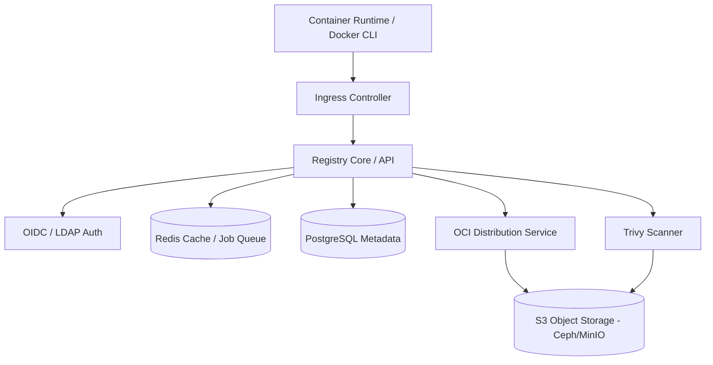

# Self-Hosted Container Registry

## Learning Outcomes

* Configure a production-grade OCI-compliant container registry on bare metal Kubernetes.
* Compare the architectural trade-offs between Harbor, Quay, Zot, and GitLab Container Registry.
* Implement pull-through caching to mitigate upstream rate limits and reduce external bandwidth consumption.
* Design a storage architecture utilizing S3-compatible object storage (e.g., Ceph RGW, MinIO) to back the registry.
* Integrate image signing (Cosign) and vulnerability scanning (Trivy) into the registry lifecycle.
* Diagnose common garbage collection and storage state inconsistencies in distributed registry deployments.

## The Operational Reality of Bare Metal Registries

Running the upstream `distribution/distribution` (formerly Docker Registry) as a standalone pod is insufficient for production. With the release of [Docker Registry v3.0.0, the project marked its first stable v3 release and notably removed support for older storage drivers like `oss` and `swift`](https://github.com/distribution/distribution/releases), solidifying the need for modern object storage. A practitioner-grade registry requires Role-Based Access Control (RBAC), automated vulnerability scanning, artifact signing, replication, and high availability.

The OCI Distribution Specification ([marked as Standards Track with a published metadata date of November 2025](https://specs.opencontainers.org/distribution-spec/?v=v1.1.1)) defines a standardized API protocol for distributing OCI content, closely related to the OCI image format and runtime specifications. On bare metal, you do not have AWS ECR or GCP Artifact Registry abstracting this away. You are responsible for the metadata database, the caching layer, the storage backend, and the ingress routing for potentially gigabytes of concurrent image layer pulls during a cluster-wide horizontal pod autoscaling (HPA) event.

### Platform Comparisons

When selecting a registry for on-premises deployment, the choice dictates your maintenance burden regarding databases, caching layers, and scanning integrations.

| Feature | Harbor | Quay | Zot | GitLab Registry |
| :--- | :--- | :--- | :--- | :--- |
| **Origin / Backer** | [CNCF Graduated (Accepted 2018-07-31, Graduated 2020-06-15)](https://www.cncf.io/projects/harbor/) | Red Hat | CNCF Sandbox project | GitLab |
| **Architecture** | Microservices (Registry, Core, Jobservice, Database, Redis) | Microservices (Quay, Clair, Postgres, Redis) | Minimal service footprint | Integrated with GitLab monolith |
| **Scanning** | Pluggable (Trivy default, Clair optional) | Clair (tightly integrated) | Trivy (built-in via extensions) | Trivy / GitLab Secure |
| **Storage Backend** | S3, GCS, Azure, Swift, OSS, local | S3, GCS, Azure, Swift, RadosGW, local | Local filesystem, S3 | S3, GCS, Azure, local |
| **OIDC / SSO** | Yes (OIDC, LDAP, Active Directory) | [Yes (OIDC, LDAP, Keystone)](https://github.com/quay/quay) | Yes (OIDC, LDAP) | Yes (via GitLab instance) |
| **Resource Footprint**| Heavy (~6-8 pods, requires DB/Redis) | Heavy (requires DB/Redis) | Extremely Lightweight | Bound to GitLab footprint |
| **Best For** | Enterprise standard, policy enforcement | Red Hat ecosystems, OpenShift | Edge deployments, minimal operational overhead | Teams already using GitLab CI/CD heavily |

### Architecture of a Modern Registry

Most enterprise registries (Harbor, Quay) wrap the core OCI distribution specification with additional services.



1.  **Registry Core / UI:** Handles API requests, serves the web interface, and coordinates webhooks.
2.  **Auth Service:** Generates bearer tokens for clients after authenticating them against the local DB or an OIDC provider.
3.  **OCI Distribution:** The actual `distribution/distribution` or equivalent daemon that streams layer blobs to/from the storage backend.
4.  **Database (PostgreSQL):** Stores metadata: users, projects, repository names, tags, RBAC policies, and replication rules. *It does not store image layers.*
5.  **Cache/Queue (Redis):** Caches layer metadata and coordinates asynchronous jobs like replication, garbage collection, and scanning.
6.  **Storage Backend:** Stores the immutable blobs (layers) and manifests. On bare metal, this should strictly be an S3-compatible endpoint (Ceph RadosGW or MinIO). Prefer object storage or a storage backend explicitly documented as supported by your registry; shared filesystems need careful validation before you rely on them for blob storage.

### Authentication and Image Pulling Behavior

When integrating your self-hosted registry with Kubernetes, you must handle authentication securely and understand how the kubelet caches and requests images. 

[Starting with Kubernetes v1.26, the legacy image credential mechanism was removed. You must now use kubelet credential provider configuration or attach `imagePullSecrets` to your Pods or ServiceAccounts.](https://kubernetes.io/docs/concepts/containers/images/) Registry authentication is stored as a Kubernetes Secret. You should use `kubectl create secret docker-registry`, which creates the recommended `kubernetes.io/dockerconfigjson` secret type (superseding the legacy `kubernetes.io/dockercfg`).

> **Stop and think**: If you define an `imagePullSecret` in the `default` namespace, can a Pod in the `production` namespace use it to pull an image?

Crucially, [`imagePullSecrets` entries must reference Secrets in the *same namespace* as the Pod](https://kubernetes.io/docs/concepts/containers/images/), and they are used directly by the kubelet to authenticate to private registries. To reduce operational toil, these credentials can be attached via a ServiceAccount-level `imagePullSecrets`, which are then automatically inherited by any Pods created with that ServiceAccount. Even for edge workloads or control plane components running as static Pods, `imagePullSecrets` and pre-pulled image approaches are fully supported for private registry access.

Understanding the kubelet's image pulling behavior is equally important:
* When `imagePullPolicy` is omitted, [Kubernetes defaults it to `Always` for `:latest` tags or untagged images. It sets it to `IfNotPresent` for digest-based or tagged non-latest images. Once set, this policy is immutable for the life of the Pod](https://kubernetes.io/docs/concepts/containers/images/), even if the tag changes in the registry.
* With a policy of `IfNotPresent` or `Never`, the kubelet prefers local cached images. If you use cache-based strategies for private registry-driven pods, you must ensure all nodes share identical pre-pulled images.
* To secure this caching layer, [Kubernetes v1.35 introduces the `KubeletEnsureSecretPulledImages` feature (beta, enabled by default)](https://kubernetes.io/docs/concepts/containers/images/), which strictly validates credentials when pre-pulled images are used, preventing unauthorized pods from accessing cached images originating from a private registry.

### Pull-Through Caching (Proxy Cache)

> **Pause and predict**: If your bare metal cluster scales out from 10 to 100 nodes, and every node attempts to pull the exact same 1GB image from Docker Hub simultaneously, what happens to your corporate firewall and external IP reputation?

Upstream rate limits (e.g., [Docker Hub's 100 pulls per 6 hours per IP](https://docs.docker.com/docker-hub/usage/pulls/)) will break bare metal clusters where all egress traffic NATs through a single IP address. 

A proxy cache intercepts pull requests. If the layer exists locally, it serves it. If not, it pulls from the upstream, caches it locally, and serves it to the client.

In Harbor, a Proxy Cache is configured as a specific "Project" type. 
If you create a proxy cache project named `dockerhub-proxy` linked to `https://hub.docker.com`, container runtimes must be configured to pull from `harbor.internal.corp/dockerhub-proxy/library/nginx:latest` instead of `nginx:latest`.

Alternatively, configure `containerd` on your bare metal nodes to transparently mirror requests:

```toml
# /etc/containerd/config.toml
[plugins."io.containerd.grpc.v1.cri".registry.mirrors."docker.io"]
  endpoint = ["https://harbor.internal.corp/v2/dockerhub-proxy"]
```
*Note: Depending on the containerd version (1.5+ vs 1.7+), [registry configuration is moving to the `/etc/containerd/certs.d/` directory structure](https://github.com/containerd/containerd/blob/main/docs/hosts.md). Always verify your specific containerd version's configuration path.*

### Vulnerability Scanning and Policy Enforcement

Storing images is only half the requirement. You must ensure images deployed to the cluster are free of critical CVEs.

Harbor uses Trivy by default. Scanning can be configured to run:
*   **On Push:** Synchronously or asynchronously scans the image the moment the manifest is uploaded.
*   **Scheduled:** Periodically scans the entire registry to catch newly published CVEs for existing, dormant images.

**Deployment Prevention:** Harbor allows configuring a project-level policy: "Prevent images with vulnerability severity of `CRITICAL` or higher from running." Harbor enforces this by refusing the layer pull request at the API level if the threshold is breached.

### Artifact Signing with Cosign

Image tags are mutable; `v1.0.0` can be overwritten. Digests (`sha256:...`) are immutable but difficult for humans to verify. Cosign (part of the Sigstore project) solves this by attaching cryptographic signatures to OCI artifacts.

Cosign stores signatures in the registry alongside the image. If you sign `alpine:3.18`, [Cosign pushes an object named `sha256-<image-digest>.sig` to the same repository](https://github.com/sigstore/cosign).

Registries that understand OCI referrers can surface signatures alongside their subject artifacts, but deletion and garbage-collection behavior remains registry-specific and should be verified in product documentation.

## Hands-on Lab

In this lab, we will deploy a lightweight instance of Harbor on a local `kind` cluster, configure a project, push an image, scan it with Trivy, and sign it with Cosign.

### Prerequisites
*   `kind` CLI installed.
*   `kubectl` and `helm` installed.
*   `docker` CLI installed.
*   `cosign` CLI installed (`brew install cosign` or download binary).

According to official installation guidance, Harbor can be deployed via Docker Compose or Kubernetes using Helm. The documented minimum resource and platform requirements include at least 2 CPU, 4 GB RAM, and a 40 GB disk. The host must run Docker Engine >20.10 and Docker Compose >2.3, and requires ports 80 and 443 to be open for registry and API access.

*Note: Check Harbor's current documentation branch and release page for the latest stable and prerelease versions before you deploy.*

### Step 1: Provision the Cluster

Create a local cluster with Ingress ports mapped to your host.

```bash
cat <<EOF > kind-config.yaml
kind: Cluster
apiVersion: kind.x-k8s.io/v1alpha4
nodes:
- role: control-plane
  kubeadmConfigPatches:
  - |
    kind: InitConfiguration
    nodeRegistration:
      kubeletExtraArgs:
        node-labels: "ingress-ready=true"
  extraPortMappings:
  - containerPort: 80
    hostPort: 80
    protocol: TCP
  - containerPort: 443
    hostPort: 443
    protocol: TCP
EOF

kind create cluster --config kind-config.yaml --name registry-lab
```

Install the NGINX Ingress Controller:

```bash
kubectl apply -f https://raw.githubusercontent.com/kubernetes/ingress-nginx/main/deploy/static/provider/kind/deploy.yaml
kubectl wait --namespace ingress-nginx \
  --for=condition=ready pod \
  --selector=app.kubernetes.io/component=controller \
  --timeout=90s
```

### Step 2: Deploy Harbor via Helm

For this lab, we will use internal persistent volumes instead of an external S3 bucket, disable HTTPS to avoid certificate trust issues in a local environment, and set a simple admin password.

```bash
helm repo add harbor https://helm.goharbor.io
helm repo update

cat <<EOF > harbor-values.yaml
expose:
  type: ingress
  tls:
    enabled: false
  ingress:
    hosts:
      core: core.harbor.domain
      notary: notary.harbor.domain
    className: nginx
externalURL: http://core.harbor.domain
harborAdminPassword: "Harbor12345"
persistence:
  persistentVolumeClaim:
    registry:
      size: 5Gi
    chartmuseum:
      size: 1Gi
    jobservice:
      size: 1Gi
    database:
      size: 1Gi
    redis:
      size: 1Gi
    trivy:
      size: 5Gi
trivy:
  enabled: true
notary:
  enabled: false
EOF

helm install harbor harbor/harbor -n harbor --create-namespace -f harbor-values.yaml

# Wait for all pods to be ready (this can take 3-5 minutes)
kubectl wait --namespace harbor \
  --for=condition=ready pod \
  --all \
  --timeout=300s
```

Map the local DNS. Add this to your `/etc/hosts`:
```text
127.0.0.1 core.harbor.domain
```

### Step 3: Push an Image

Because we disabled TLS, tell the Docker daemon to treat our Harbor instance as an insecure registry.
*   **Linux:** Add `{"insecure-registries" : ["core.harbor.domain"]}` to `/etc/docker/daemon.json` and restart Docker.
*   **Docker Desktop (Mac/Windows):** Add `core.harbor.domain` to the "Insecure registries" list in the Docker Engine settings UI and click Apply & Restart.

Login to Harbor using the Docker CLI:
```bash
docker login core.harbor.domain -u admin -p Harbor12345
```

Pull a public image, tag it for our local registry, and push it:
```bash
docker pull alpine:3.18.0
docker tag alpine:3.18.0 core.harbor.domain/library/alpine:3.18.0
docker push core.harbor.domain/library/alpine:3.18.0
```
*Expected Output:* The push completes successfully, and layers are written to the `library` project.

### Step 4: Vulnerability Scanning

Harbor includes Trivy. We can trigger a scan via the API (or through the UI).

1.  Navigate to `http://core.harbor.domain` in your browser.
2.  Log in with `admin` / `Harbor12345`.
3.  Click on the `library` project, then click on the `alpine` repository.
4.  Select the checkbox next to `3.18.0` and click the "Scan" button.
5.  Wait a few moments, and the vulnerabilities column will populate with a status (e.g., "Critical" or "None").

### Step 5: Sign the Image with Cosign

Generate a Cosign keypair:
```bash
cosign generate-key-pair
# Enter a password when prompted. This creates cosign.key and cosign.pub.
```

Sign the image we just pushed. We must use the image digest, not just the tag, to ensure immutable cryptographic verification.

First, get the digest:
```bash
DIGEST=$(docker inspect --format='{{index .RepoDigests 0}}' core.harbor.domain/library/alpine:3.18.0 | awk -F'@' '{print $2}')
echo $DIGEST
```

Sign the digest:
```bash
cosign sign --key cosign.key core.harbor.domain/library/alpine@${DIGEST}
# Provide the password you used to generate the key.
# Type 'y' if prompted to upload the signature to the registry.
```

Verify the signature was pushed:
```bash
cosign verify --key cosign.pub core.harbor.domain/library/alpine@${DIGEST}
```
*Expected Output:* A JSON payload proving the signature is valid and cryptographically linked to the specific image digest.

If you refresh the Harbor UI for the `alpine` repository, you will see a green checkmark indicating the artifact is signed.

### Teardown

```bash
kind delete cluster --name registry-lab
```

## Practitioner Gotchas

### 1. The Garbage Collection Locking Nightmare
Unlike a local filesystem, removing an image tag in a registry API only deletes the metadata mapping. The underlying blobs (layers) remain in the storage backend to support layer sharing across different images. Reclaiming storage requires running Garbage Collection (GC). 

**The Gotcha:** Garbage-collection behavior has changed across Harbor releases, so verify the documented online-GC semantics for the exact version you run before scheduling cleanup jobs.
**The Fix:** Test garbage collection under representative load on your chosen object-storage backend, because cleanup traffic can contend with normal pulls and pushes if the storage layer is undersized.

### 2. Orphaned Signatures After Tag Deletion
When a user deletes an image tag from the registry UI, the associated Cosign signature (`sha256-...sig`) [may be left behind as an orphaned artifact](https://github.com/sigstore/cosign) if the registry does not strictly enforce OCI referential integrity.
**The Fix:** Prefer registries that document how they present and clean up signature accessories, and validate that behavior in a test repository before you rely on automatic cleanup.

### 3. Untrusted Custom CAs and Containerd
You deploy Harbor with an internal enterprise CA certificate. You can pull images perfectly via `docker pull` on your laptop, but Kubernetes pods remain stuck in `ErrImagePull` / `ImagePullBackOff`.
**The Gotcha:** The `containerd` daemon running on the Kubernetes nodes does not trust the enterprise CA by default, so the TLS handshake with the registry fails.
**The Fix:** [You must distribute the CA certificate to every bare metal node.](https://github.com/containerd/containerd/blob/main/docs/hosts.md) Copy the `ca.crt` to `/usr/local/share/ca-certificates/` and run `update-ca-certificates` (Debian/Ubuntu) or `/etc/pki/ca-trust/source/anchors/` and run `update-ca-trust` (RHEL), then restart the `containerd` service on all nodes.

### 4. Redis Persistence Failures Blocking Scans
Harbor uses Redis heavily for job queueing (scans, replications, GC). If Redis restarts and its persistence (RDB/AOF) is corrupted or disabled, jobs silently disappear.
**The Gotcha:** Users trigger Trivy scans, but the UI remains stuck in "Scanning..." indefinitely. The Core service dispatched the job to Redis, but the Jobservice pod died, Redis evicted the queue, and the state machine is permanently deadlocked waiting for a completion webhook.
**The Fix:** Back Harbor job-service state with supported persistence settings and follow Harbor's documented recovery workflow if scan jobs become stuck; avoid recommending direct database edits without vendor documentation.

### 5. Disk Exhaustion in the Scanner Pod
Trivy operates by downloading the image layers from the registry core into the Trivy pod's local filesystem to perform static analysis. 
**The Gotcha:** Scanner workloads need enough ephemeral or persistent storage for image analysis; oversized artifacts can exhaust node-local storage and disrupt scans if you underprovision the scanner.
**The Fix:** Allocate a dedicated PersistentVolumeClaim (PVC) for the Trivy pod's cache and working directory, and enforce strict layer size limits at the Ingress controller level (e.g., `nginx.ingress.kubernetes.io/proxy-body-size: "0"` to allow large pushes, but rely on registry quotas to restrict total size).

## Quiz

**Question 1**
Your organization restricts all bare metal nodes from communicating directly with the internet. You need to allow deployments to specify `postgres:15` and pull it successfully. Which architecture natively solves this without altering the image tags in the deployment manifests?
*   A) Deploy an NGINX reverse proxy in front of the cluster to tunnel TCP port 443 directly to Docker Hub.
*   B) Configure a Proxy Cache project in Harbor and instruct developers to prefix their manifests with `harbor.internal/dockerhub-proxy/postgres:15`.
*   C) Configure registry mirrors in `/etc/containerd/config.toml` on all cluster nodes to intercept pulls for `docker.io` and route them to your internal Harbor Proxy Cache.
*   D) Set `imagePullPolicy: Always` and configure the kubelet with a global HTTP_PROXY environment variable pointing to Harbor.

*Correct Answer: C* (Configuring the containerd mirror allows the runtime to transparently rewrite `docker.io` requests to the internal cache without modifying the deployment YAML. This means the deployment manifests remain clean and portable across different environments. The container runtime seamlessly handles the interception and routing to your internal Harbor Proxy Cache. Consequently, this fully satisfies the air-gapped node requirements while ensuring developers do not have to rewrite their deployment manifests to include internal registry URLs.)

**Question 2**
During a routine operational check, you notice that your Harbor S3 bucket (MinIO) is consuming 5TB of data, but querying the Harbor API shows total project quotas utilizing only 1TB. You have recently deleted hundreds of old image tags via the Harbor UI. What is the most likely cause?
*   A) Trivy is storing its vulnerability database updates in the S3 bucket.
*   B) You deleted the tags, but Garbage Collection has not been executed to prune the unreferenced layer blobs from the storage backend.
*   C) Cosign signatures are taking up 4TB of space because they are not compressed.
*   D) The PostgreSQL database transaction logs have expanded and are writing backups to the S3 bucket automatically.

*Correct Answer: B* (Deleting an image tag in a container registry only removes the metadata pointer stored within the registry database. The actual layer blobs remain securely in the underlying S3 storage backend to support efficient layer sharing across different images. Because layers can be shared by multiple images, the registry does not immediately delete them to prevent breaking other active images. Reclaiming this physical storage capacity requires explicitly executing a Garbage Collection (GC) job, which scans for and permanently deletes unreferenced blobs from the S3 bucket.)

**Question 3**
You are designing a high-availability registry for a bare-metal edge environment with extreme resource constraints. The available hardware only provides 2 CPU cores and 4GB RAM for the entire registry infrastructure. You require OCI artifact support and basic pull-through caching, but do not need a web UI or complex RBAC. Which registry is the most appropriate choice?
*   A) Harbor
*   B) GitLab Container Registry
*   C) Quay
*   D) Zot

*Correct Answer: D* (Zot is intentionally designed as a single Go binary to function as an OCI-native, extremely lightweight registry. This minimal architectural footprint makes it the ideal solution for edge environments where hardware is severely constrained. Because it does not rely on external databases or caching tiers, it avoids the memory penalties associated with traditional enterprise registries. In contrast, microservice-based architectures like Harbor or Quay require significant operational overhead, including separate PostgreSQL databases and Redis instances, which would likely strain a strict 2 CPU and 4GB RAM allocation.)

**Question 4**
A developer pushes `app:v1.0.0`, signs it using Cosign, and verifies the signature exists in Harbor. The next day, a compromised pipeline overwrites the `app:v1.0.0` tag with a new, malicious image containing cryptominers. What happens to the cryptographic signature?
*   A) The signature remains valid because it is linked to the text tag `v1.0.0`.
*   B) The signature is automatically transferred to the new image because Cosign trusts the Harbor admin account.
*   C) The signature becomes invalid for the new image because the signature is cryptographically bound to the immutable digest (`sha256:...`) of the original image, not the mutable tag.
*   D) Harbor will natively reject the push of the malicious image because the tag `v1.0.0` is permanently locked once signed.

*Correct Answer: C* (Cosign cryptographic signatures are intrinsically bound to the immutable digest of the specific image layer configuration, rather than the mutable string tag. When the tag is overwritten with malicious layers, the underlying computed digest fundamentally changes. Because the original cryptographic signature does not match this new digest, the malicious image will fail verification when signature checks are enforced. This immutable binding ensures that even if a registry allows tag mutability, the deployment environment remains protected from the compromised pipeline.)

**Question 5**
You have configured Harbor with a project-level policy to prevent pulling images with `CRITICAL` vulnerabilities. A pod scaling event triggers, and the kubelet attempts to pull an image that was pushed and scanned clean 6 months ago. The pull is rejected by Harbor at the API level, citing a critical vulnerability. Why did this happen?
*   A) The original Trivy scan results expired after 90 days and defaulted to a failed state.
*   B) A scheduled Trivy scan ran recently, utilizing an updated vulnerability database, and identified a newly disclosed CVE in the dormant image.
*   C) The containerd runtime on the node has its own vulnerability scanner that rejected the layer extraction.
*   D) The Harbor database lost connection to Redis, causing the policy engine to fail open and reject all pulls.

*Correct Answer: B* (Vulnerability databases are continuously updated by security researchers as new exploits are discovered in existing software packages. Scheduled periodic scans in Harbor re-evaluate all stored images against the latest CVE definitions, regardless of when they were originally pushed. An image that was perfectly clean six months ago likely contains software packages that have since been identified as vulnerable. Consequently, when the cluster scales and attempts to pull the image, Harbor's policy engine correctly blocks the deployment based on the newly discovered critical vulnerability.)

## Further Reading

*   [Harbor Architecture Overview (Official Docs)](https://goharbor.io/docs/edge/architecture/)
*   [Zot Project GitHub Repository](https://github.com/project-zot/zot)
*   [Sigstore Cosign Documentation](https://docs.sigstore.dev/cosign/system_config/overview/)
*   [Trivy Vulnerability Scanner (Aqua Security)](https://aquasecurity.github.io/trivy/)
*   [OCI Distribution Specification](https://github.com/opencontainers/distribution-spec)

## Sources

- [github.com: releases](https://github.com/distribution/distribution/releases) — The upstream release notes directly state both the first stable v3 release status and the removal of the `oss` and `swift` drivers.
- [The OpenContainers Distribution Spec](https://specs.opencontainers.org/distribution-spec/?v=v1.1.1) — Backs OCI registry protocol and API standardization claims for self-hosted registries and image distribution workflows.
- [cncf.io: harbor](https://www.cncf.io/projects/harbor/) — The CNCF project page lists the acceptance, incubation, and graduation dates explicitly.
- [github.com: quay](https://github.com/quay/quay) — The Project Quay upstream README directly lists these authentication, storage, and Clair capabilities.
- [kubernetes.io: images](https://kubernetes.io/docs/concepts/containers/images/) — The Kubernetes images documentation explicitly states that the legacy built-in mechanism was removed starting with v1.26.
- [docs.docker.com: pulls](https://docs.docker.com/docker-hub/usage/pulls/) — Docker's own usage page publishes the 100-per-6-hours unauthenticated limit.
- [github.com: hosts.md](https://github.com/containerd/containerd/blob/main/docs/hosts.md) — The upstream containerd registry configuration docs explicitly deprecate the old CRI mirror/config style and point to `config_path` and `hosts.toml`.
- [github.com: cosign](https://github.com/sigstore/cosign) — The Cosign upstream README explicitly recommends digest-based signing and documents the registry storage naming convention.
