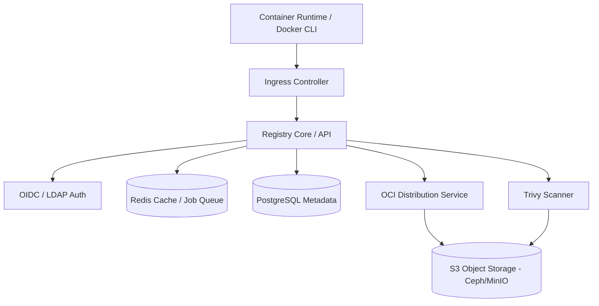

# Self-Hosted Container Registry

## Learning Outcomes

* Configure a production-grade OCI-compliant container registry on bare metal Kubernetes.
* Compare the architectural trade-offs between Harbor, Quay, Zot, and GitLab Container Registry.
* Implement pull-through caching to mitigate upstream rate limits and reduce external bandwidth consumption.
* Design a storage architecture utilizing S3-compatible object storage (e.g., Ceph RGW, MinIO) to back the registry.
* Integrate image signing (Cosign) and vulnerability scanning (Trivy) into the registry lifecycle.
* Diagnose common garbage collection and storage state inconsistencies in distributed registry deployments.

## The Operational Reality of Bare Metal Registries

Running the upstream `distribution/distribution` (formerly Docker Registry `v2`) as a standalone pod is insufficient for production. A practitioner-grade registry requires Role-Based Access Control (RBAC), automated vulnerability scanning, artifact signing, replication, and high availability. 

On bare metal, you do not have AWS ECR or GCP Artifact Registry. You are responsible for the metadata database, the caching layer, the storage backend, and the ingress routing for potentially gigabytes of concurrent image layer pulls during a cluster-wide horizontal pod autoscaling (HPA) event.

### Platform Comparisons

When selecting a registry for on-premises deployment, the choice dictates your maintenance burden regarding databases, caching layers, and scanning integrations.

| Feature | Harbor | Quay | Zot | GitLab Registry |
| :--- | :--- | :--- | :--- | :--- |
| **Origin / Backer** | CNCF Graduated (VMware/Broadcom) | Red Hat | CNCF Incubating (Cisco) | GitLab |
| **Architecture** | Microservices (Registry, Core, Jobservice, Database, Redis) | Microservices (Quay, Clair, Postgres, Redis) | Single Go Binary | Integrated with GitLab monolith |
| **Scanning** | Pluggable (Trivy default, Clair optional) | Clair (tightly integrated) | Trivy (built-in via extensions) | Trivy / GitLab Secure |
| **Storage Backend** | S3, GCS, Azure, Swift, OSS, local | S3, GCS, Azure, Swift, RadosGW, local | Local filesystem, S3 | S3, GCS, Azure, local |
| **OIDC / SSO** | Yes (OIDC, LDAP, Active Directory) | Yes (OIDC, LDAP, Keystone) | Yes (OIDC, LDAP) | Yes (via GitLab instance) |
| **Resource Footprint**| Heavy (~6-8 pods, requires DB/Redis) | Heavy (requires DB/Redis) | Extremely Lightweight | Bound to GitLab footprint |
| **Best For** | Enterprise standard, policy enforcement | Red Hat ecosystems, OpenShift | Edge deployments, minimal operational overhead | Teams already using GitLab CI/CD heavily |

### Architecture of a Modern Registry

Most enterprise registries (Harbor, Quay) wrap the core OCI distribution specification with additional services.



1.  **Registry Core / UI:** Handles API requests, serves the web interface, and coordinates webhooks.
2.  **Auth Service:** Generates bearer tokens for clients after authenticating them against the local DB or an OIDC provider.
3.  **OCI Distribution:** The actual `distribution/distribution` or equivalent daemon that streams layer blobs to/from the storage backend.
4.  **Database (PostgreSQL):** Stores metadata: users, projects, repository names, tags, RBAC policies, and replication rules. *It does not store image layers.*
5.  **Cache/Queue (Redis):** Caches layer metadata and coordinates asynchronous jobs like replication, garbage collection, and scanning.
6.  **Storage Backend:** Stores the immutable blobs (layers) and manifests. On bare metal, this should strictly be an S3-compatible endpoint (Ceph RadosGW or MinIO). **Do not use NFS for registry storage**; concurrent read/write locking issues on NFS will corrupt your registry state or cause severe latency spikes during layer pulls.

### Pull-Through Caching (Proxy Cache)

Upstream rate limits (e.g., Docker Hub's 100 pulls per 6 hours per IP) will break bare metal clusters where all egress traffic NATs through a single IP address. 

A proxy cache intercepts pull requests. If the layer exists locally, it serves it. If not, it pulls from the upstream, caches it locally, and serves it to the client.

In Harbor, a Proxy Cache is configured as a specific "Project" type. 
If you create a proxy cache project named `dockerhub-proxy` linked to `https://hub.docker.com`, container runtimes must be configured to pull from `harbor.internal.corp/dockerhub-proxy/library/nginx:latest` instead of `nginx:latest`.

Alternatively, configure `containerd` on your bare metal nodes to transparently mirror requests:

```toml
# /etc/containerd/config.toml
[plugins."io.containerd.grpc.v1.cri".registry.mirrors."docker.io"]
  endpoint = ["https://harbor.internal.corp/v2/dockerhub-proxy"]
```
*Note: Depending on the containerd version (1.5+ vs 1.7+), registry configuration is moving to the `/etc/containerd/certs.d/` directory structure. Always verify your specific containerd version's configuration path.*

### Vulnerability Scanning and Policy Enforcement

Storing images is only half the requirement. You must ensure images deployed to the cluster are free of critical CVEs.

Harbor uses Trivy by default. Scanning can be configured to run:
*   **On Push:** Synchronously or asynchronously scans the image the moment the manifest is uploaded.
*   **Scheduled:** Periodically scans the entire registry to catch newly published CVEs for existing, dormant images.

**Deployment Prevention:** Harbor allows configuring a project-level policy: "Prevent images with vulnerability severity of `CRITICAL` or higher from running." Harbor enforces this by refusing the layer pull request at the API level if the threshold is breached.

### Artifact Signing with Cosign

Image tags are mutable; `v1.0.0` can be overwritten. Digests (`sha256:...`) are immutable but difficult for humans to verify. Cosign (part of the Sigstore project) solves this by attaching cryptographic signatures to OCI artifacts.

Cosign stores signatures in the registry alongside the image. If you sign `alpine:3.18`, Cosign pushes an object named `sha256-<image-digest>.sig` to the same repository.

Registries must support OCI artifact specifications to handle these `.sig` files properly. Harbor and Zot have native support for grouping signatures with their target images in the UI and preventing deletion of an image if its signature is required.

## Hands-on Lab

In this lab, we will deploy a lightweight instance of Harbor on a local `kind` cluster, configure a project, push an image, scan it with Trivy, and sign it with Cosign.

### Prerequisites
*   `kind` CLI installed.
*   `kubectl` and `helm` installed.
*   `docker` CLI installed.
*   `cosign` CLI installed (`brew install cosign` or download binary).

### Step 1: Provision the Cluster

Create a local cluster with Ingress ports mapped to your host.

```bash
cat <<EOF > kind-config.yaml
kind: Cluster
apiVersion: kind.x-k8s.io/v1alpha4
nodes:
- role: control-plane
  kubeadmConfigPatches:
  - |
    kind: InitConfiguration
    nodeRegistration:
      kubeletExtraArgs:
        node-labels: "ingress-ready=true"
  extraPortMappings:
  - containerPort: 80
    hostPort: 80
    protocol: TCP
  - containerPort: 443
    hostPort: 443
    protocol: TCP
EOF

kind create cluster --config kind-config.yaml --name registry-lab
```

Install the NGINX Ingress Controller:

```bash
kubectl apply -f https://raw.githubusercontent.com/kubernetes/ingress-nginx/main/deploy/static/provider/kind/deploy.yaml
kubectl wait --namespace ingress-nginx \
  --for=condition=ready pod \
  --selector=app.kubernetes.io/component=controller \
  --timeout=90s
```

### Step 2: Deploy Harbor via Helm

For this lab, we will use internal persistent volumes instead of an external S3 bucket, disable HTTPS to avoid certificate trust issues in a local environment, and set a simple admin password.

```bash
helm repo add harbor https://helm.goharbor.io
helm repo update

cat <<EOF > harbor-values.yaml
expose:
  type: ingress
  tls:
    enabled: false
  ingress:
    hosts:
      core: core.harbor.domain
      notary: notary.harbor.domain
    className: nginx
externalURL: http://core.harbor.domain
harborAdminPassword: "Harbor12345"
persistence:
  persistentVolumeClaim:
    registry:
      size: 5Gi
    chartmuseum:
      size: 1Gi
    jobservice:
      size: 1Gi
    database:
      size: 1Gi
    redis:
      size: 1Gi
    trivy:
      size: 5Gi
trivy:
  enabled: true
notary:
  enabled: false
EOF

helm install harbor harbor/harbor -n harbor --create-namespace -f harbor-values.yaml

# Wait for all pods to be ready (this can take 3-5 minutes)
kubectl wait --namespace harbor \
  --for=condition=ready pod \
  --all \
  --timeout=300s
```

Map the local DNS. Add this to your `/etc/hosts`:
```text
127.0.0.1 core.harbor.domain
```

### Step 3: Push an Image

Because we disabled TLS, tell the Docker daemon to treat our Harbor instance as an insecure registry.
*   **Linux:** Add `{"insecure-registries" : ["core.harbor.domain"]}` to `/etc/docker/daemon.json` and restart Docker.
*   **Docker Desktop (Mac/Windows):** Add `core.harbor.domain` to the "Insecure registries" list in the Docker Engine settings UI and click Apply & Restart.

Login to Harbor using the Docker CLI:
```bash
docker login core.harbor.domain -u admin -p Harbor12345
```

Pull a public image, tag it for our local registry, and push it:
```bash
docker pull alpine:3.18.0
docker tag alpine:3.18.0 core.harbor.domain/library/alpine:3.18.0
docker push core.harbor.domain/library/alpine:3.18.0
```
*Expected Output:* The push completes successfully, and layers are written to the `library` project.

### Step 4: Vulnerability Scanning

Harbor includes Trivy. We can trigger a scan via the API (or through the UI).

1.  Navigate to `http://core.harbor.domain` in your browser.
2.  Log in with `admin` / `Harbor12345`.
3.  Click on the `library` project, then click on the `alpine` repository.
4.  Select the checkbox next to `3.18.0` and click the "Scan" button.
5.  Wait a few moments, and the vulnerabilities column will populate with a status (e.g., "Critical" or "None").

### Step 5: Sign the Image with Cosign

Generate a Cosign keypair:
```bash
cosign generate-key-pair
# Enter a password when prompted. This creates cosign.key and cosign.pub.
```

Sign the image we just pushed. We must use the image digest, not just the tag, to ensure immutable cryptographic verification.

First, get the digest:
```bash
DIGEST=$(docker inspect --format='{{index .RepoDigests 0}}' core.harbor.domain/library/alpine:3.18.0 | awk -F'@' '{print $2}')
echo $DIGEST
```

Sign the digest:
```bash
cosign sign --key cosign.key core.harbor.domain/library/alpine@${DIGEST}
# Provide the password you used to generate the key.
# Type 'y' if prompted to upload the signature to the registry.
```

Verify the signature was pushed:
```bash
cosign verify --key cosign.pub core.harbor.domain/library/alpine@${DIGEST}
```
*Expected Output:* A JSON payload proving the signature is valid and cryptographically linked to the specific image digest.

If you refresh the Harbor UI for the `alpine` repository, you will see a green checkmark indicating the artifact is signed.

### Teardown

```bash
kind delete cluster --name registry-lab
```

## Practitioner Gotchas

### 1. The Garbage Collection Locking Nightmare
Unlike a local filesystem, removing an image tag in a registry API only deletes the metadata mapping. The underlying blobs (layers) remain in the storage backend to support layer sharing across different images. Reclaiming storage requires running Garbage Collection (GC). 

**The Gotcha:** In older versions of Distribution and Harbor, GC required placing the registry in read-only mode to prevent race conditions where a concurrent push references a blob right as GC deletes it.
**The Fix:** Modern Harbor supports non-blocking GC, but you must ensure your underlying S3 storage supports standard consistency. If using Ceph RGW or MinIO, monitor the IOPS during GC runs; heavy GC against spinning disks behind S3 gateways will saturate the disk controllers and cause pull timeouts for the entire cluster.

### 2. Orphaned Signatures After Tag Deletion
When a user deletes an image tag from the registry UI, the associated Cosign signature (`sha256-...sig`) may be left behind as an orphaned artifact if the registry does not strictly enforce OCI referential integrity.
**The Fix:** Use registries that explicitly support OCI `1.1.0` referential metadata (like Harbor v2.8+ or Zot). These versions understand that the `.sig` object is a child of the main image digest and will automatically prune the signature when the parent manifest is garbage collected.

### 3. Untrusted Custom CAs and Containerd
You deploy Harbor with an internal enterprise CA certificate. You can pull images perfectly via `docker pull` on your laptop, but Kubernetes pods remain stuck in `ErrImagePull` / `ImagePullBackOff`.
**The Gotcha:** The `containerd` daemon running on the Kubernetes nodes does not trust the enterprise CA by default, so the TLS handshake with the registry fails.
**The Fix:** You must distribute the CA certificate to every bare metal node. Copy the `ca.crt` to `/usr/local/share/ca-certificates/` and run `update-ca-certificates` (Debian/Ubuntu) or `/etc/pki/ca-trust/source/anchors/` and run `update-ca-trust` (RHEL), then restart the `containerd` service on all nodes.

### 4. Redis Persistence Failures Blocking Scans
Harbor uses Redis heavily for job queueing (scans, replications, GC). If Redis restarts and its persistence (RDB/AOF) is corrupted or disabled, jobs silently disappear.
**The Gotcha:** Users trigger Trivy scans, but the UI remains stuck in "Scanning..." indefinitely. The Core service dispatched the job to Redis, but the Jobservice pod died, Redis evicted the queue, and the state machine is permanently deadlocked waiting for a completion webhook.
**The Fix:** Ensure Redis is backed by a reliable Persistent Volume with `appendonly yes` configured. If a deadlock occurs, you often have to manually update the PostgreSQL `artifact` table to reset the scan status from `Scanning` back to `Pending` or `Unscanned`.

### 5. Disk Exhaustion in the Scanner Pod
Trivy operates by downloading the image layers from the registry core into the Trivy pod's local filesystem to perform static analysis. 
**The Gotcha:** If you configure the Trivy pod with emptyDir (ephemeral storage) and users push massive images (e.g., 15GB machine learning models), the Trivy pod will exhaust node disk space, hit an `Evicted` state, and crash loop.
**The Fix:** Allocate a dedicated PersistentVolumeClaim (PVC) for the Trivy pod's cache and working directory, and enforce strict layer size limits at the Ingress controller level (e.g., `nginx.ingress.kubernetes.io/proxy-body-size: "0"` to allow large pushes, but rely on registry quotas to restrict total size).

## Quiz

**Question 1**
Your organization restricts all bare metal nodes from communicating directly with the internet. You need to allow deployments to specify `postgres:15` and pull it successfully. Which architecture natively solves this without altering the image tags in the deployment manifests?
*   A) Deploy an NGINX reverse proxy in front of the cluster to tunnel TCP port 443 directly to Docker Hub.
*   B) Configure a Proxy Cache project in Harbor and instruct developers to prefix their manifests with `harbor.internal/dockerhub-proxy/postgres:15`.
*   C) Configure registry mirrors in `/etc/containerd/config.toml` on all cluster nodes to intercept pulls for `docker.io` and route them to your internal Harbor Proxy Cache.
*   D) Set `imagePullPolicy: Always` and configure the kubelet with a global HTTP_PROXY environment variable pointing to Harbor.

*Correct Answer: C* (Configuring the containerd mirror allows the runtime to transparently rewrite `docker.io` requests to the internal cache without modifying the deployment YAML.)

**Question 2**
During a routine operational check, you notice that your Harbor S3 bucket (MinIO) is consuming 5TB of data, but querying the Harbor API shows total project quotas utilizing only 1TB. You have recently deleted hundreds of old image tags. What is the most likely cause?
*   A) Trivy is storing its vulnerability database updates in the S3 bucket.
*   B) You deleted the tags, but Garbage Collection has not been executed to prune the unreferenced layer blobs from the storage backend.
*   C) Cosign signatures are taking up 4TB of space because they are not compressed.
*   D) The PostgreSQL database transaction logs have expanded and are writing backups to the S3 bucket automatically.

*Correct Answer: B* (Deleting a tag only removes the metadata pointer. The actual layer blobs remain in storage until the registry runs a Garbage Collection job to identify and delete unreferenced blobs.)

**Question 3**
You are designing a high-availability registry for a bare-metal edge environment with extreme resource constraints (only 2 CPU cores and 4GB RAM available for the registry). You require OCI artifact support and basic pull-through caching, but do not need a web UI or complex RBAC. Which registry is the most appropriate choice?
*   A) Harbor
*   B) GitLab Container Registry
*   C) Quay
*   D) Zot

*Correct Answer: D* (Zot is a single Go binary designed specifically to be an OCI-native, extremely lightweight registry, making it ideal for edge environments where microservice architectures like Harbor or Quay are too heavy.)

**Question 4**
A developer pushes `app:v1.0.0`, signs it using Cosign, and verifies the signature exists in Harbor. The next day, another developer overwrites `app:v1.0.0` with a new, malicious image containing cryptominers. What happens to the signature?
*   A) The signature remains valid because it is linked to the tag `v1.0.0`.
*   B) The signature is automatically transferred to the new image because Cosign trusts the Harbor admin account.
*   C) The signature becomes invalid for the new image because the signature is cryptographically bound to the immutable digest (`sha256:...`) of the original image, not the mutable tag.
*   D) Harbor will reject the push of the malicious image because the tag `v1.0.0` is permanently locked once signed.

*Correct Answer: C* (Cosign signs the specific digest of the image layer configuration. If the tag is overwritten with new layers, the digest changes, and the original signature no longer matches the new image.)

**Question 5**
You have configured Harbor to prevent pulling images with `CRITICAL` vulnerabilities. A pod scaling event triggers, and the kubelet attempts to pull an image that was pushed 6 months ago. The pull is rejected by Harbor, citing a critical vulnerability, even though the image passed its scan when it was originally pushed. Why did this happen?
*   A) The original Trivy scan results expired after 90 days and defaulted to a failed state.
*   B) A scheduled Trivy scan ran recently, utilizing an updated vulnerability database, and identified a newly disclosed CVE in the dormant image.
*   C) The containerd runtime on the node has its own vulnerability scanner that rejected the layer extraction.
*   D) The Harbor database lost connection to Redis, causing the policy engine to fail open and reject all pulls.

*Correct Answer: B* (Vulnerability databases update daily. Scheduled scans re-evaluate existing images against the latest CVE definitions. An image clean 6 months ago may contain software that has since been discovered as vulnerable.)

## Further Reading

*   [Harbor Architecture Overview (Official Docs)](https://goharbor.io/docs/edge/architecture/)
*   [Zot Project GitHub Repository](https://github.com/project-zot/zot)
*   [Sigstore Cosign Documentation](https://docs.sigstore.dev/cosign/system_config/overview/)
*   [Trivy Vulnerability Scanner (Aqua Security)](https://aquasecurity.github.io/trivy/)
*   [OCI Distribution Specification](https://github.com/opencontainers/distribution-spec)