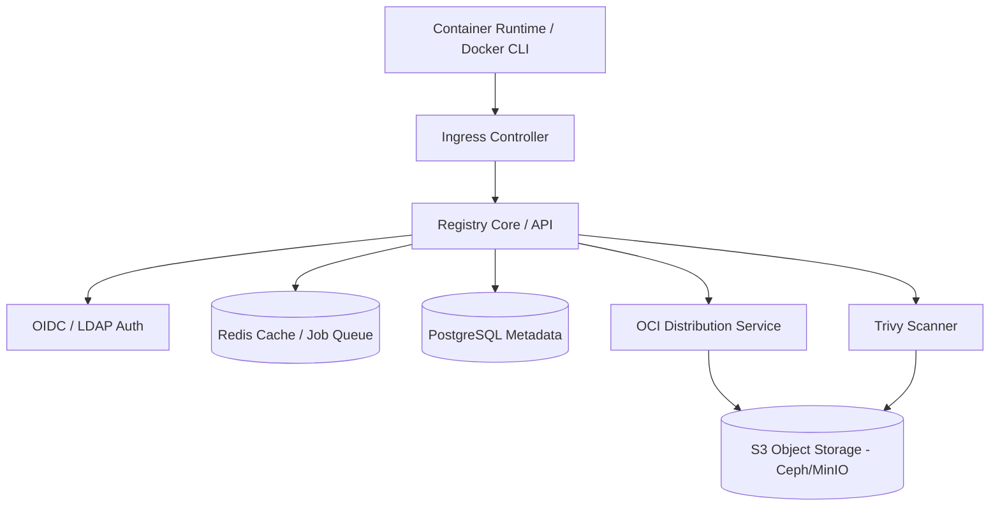
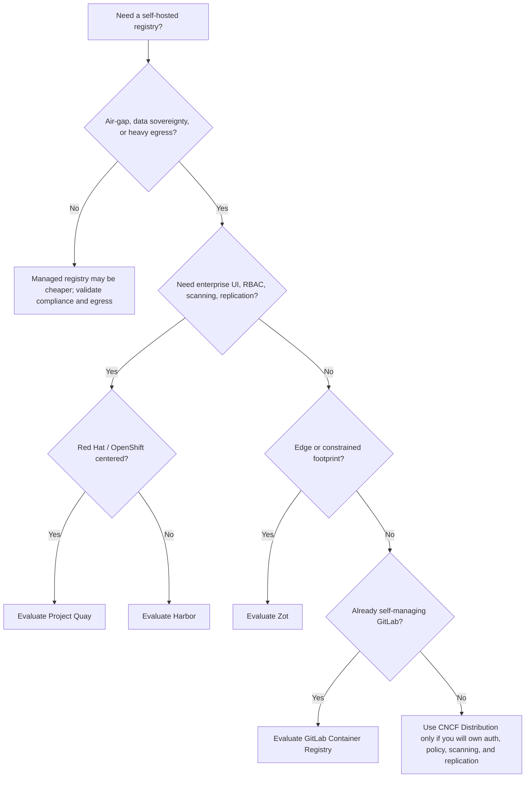

## What You'll Be Able to Do

After completing this module, you will be able to:

1. **Compare** Harbor, Project Quay, Zot, GitLab Container Registry, and CNCF Distribution for on-premises registry use cases where hardware, staffing, and compliance constraints matter.
2. **Explain** OCI manifests, blobs, tags, digests, and digest pinning so air-gapped Kubernetes releases remain reproducible after upstream registries change.
3. **Design** storage, high availability, replication, and garbage-collection operations around filesystem or S3-compatible backends such as Ceph RGW and MinIO.
4. **Configure** pull-through caching, containerd `hosts.toml` mirrors, custom CA trust, and Kubernetes image credentials without relying on deprecated runtime mirror stanzas.
5. **Enforce** supply-chain controls with Cosign signatures, vulnerability scanning, robot accounts, and admission policy so only trusted images run on owned hardware.

## Why This Module Matters

Hypothetical scenario: a regulated manufacturer runs a Kubernetes platform in two company-owned datacenters, keeps production nodes behind an egress firewall, and discovers during a release freeze that dozens of workloads still pull base images directly from Docker Hub. The manifests passed tests in a connected staging lab, but production nodes cannot reach the public registry, the NAT egress address is shared by build workers, and the security team has no local record of which digest was approved. The immediate failure looks like an `ImagePullBackOff`, but the real problem is architectural: the organization does not control the place where its clusters fetch executable software.

On-premises Kubernetes makes the container registry a tier-zero service. A cloud-managed registry hides storage durability, TLS renewal, scanner updates, regional replication, pull throttling, and garbage collection behind a provider API. In your own datacenter, every one of those concerns becomes a platform responsibility. The registry has to survive node drains, storage maintenance, expired internal certificates, upstream rate limits, and bursty deployment events without becoming the bottleneck that prevents workloads from starting.

The cost tradeoff is not simply "self-hosting is cheaper" or "cloud is easier." A self-hosted registry consumes CapEx for storage nodes, NVMe or HDD capacity, network ports, rack space, power, cooling, backup media, and hardware refresh cycles. It also consumes OpEx through patching, certificate management, vulnerability database updates, pager coverage, and incident response. Self-hosting wins when utilization is steady, CI pulls are egress-heavy, data sovereignty matters, air-gap requirements are strict, or image layers are large enough that WAN bandwidth dominates the bill. Managed registries often win when the team is small, workload volume is spiky, compliance allows external control planes, and the operational headcount needed to run Postgres, Redis, object storage, scanners, and admission policy would exceed the storage savings.

The practical goal of this module is to make registry design boring. A boring registry has explicit ownership, predictable storage growth, tested garbage collection, digest-based release inputs, signed artifacts, and a mirror strategy that keeps nodes working even when the public internet is unavailable. It does not surprise you during a cluster-wide rollout, a datacenter link failure, or a security audit.

## Did You Know?

* **Harbor is CNCF Graduated:** The CNCF project page lists Harbor as accepted on July 31, 2018, incubating on November 14, 2018, and graduated on June 15, 2020, which is why many enterprises treat it as the default full-featured open source registry choice for trusted content.
* **Zot is CNCF Sandbox:** The CNCF project page lists zot as an OCI-native registry accepted at Sandbox maturity on December 13, 2022, making it useful for lightweight and edge-oriented deployments without implying the same maturity level as Harbor.
* **Docker Hub limits are operational inputs:** Docker's current pull usage page lists unauthenticated pulls as limited per IPv4 address or IPv6 `/64` over a six-hour window, so a whole datacenter NAT can exhaust the allowance even when individual developers behave reasonably.
* **Distribution garbage collection is stop-the-world:** The CNCF Distribution documentation explains that garbage collection marks live digests, sweeps unreferenced blobs, and should run while the registry is read-only or stopped to avoid corrupting images uploaded during the sweep.

## The Operational Reality of Bare Metal Registries

Running the upstream `distribution/distribution` (formerly Docker Registry) as a standalone pod is insufficient for production. With the release of [Docker Registry v3.0.0, the project marked its first stable v3 release and notably removed support for older storage drivers like `oss` and `swift`](https://github.com/distribution/distribution/releases), solidifying the need for modern object storage. A practitioner-grade registry requires Role-Based Access Control (RBAC), automated vulnerability scanning, artifact signing, replication, and high availability.

The OCI Distribution Specification ([marked as Standards Track with a published metadata date of November 2025](https://specs.opencontainers.org/distribution-spec/?v=v1.1.1)) defines a standardized API protocol for distributing OCI content, closely related to the OCI image format and runtime specifications. On bare metal, you do not have AWS ECR or GCP Artifact Registry abstracting this away. You are responsible for the metadata database, the caching layer, the storage backend, and the ingress routing for potentially gigabytes of concurrent image layer pulls during a cluster-wide horizontal pod autoscaling (HPA) event.

The best analogy is a warehouse with a parts catalog. The blobs are the sealed boxes on shelves, the manifest is the packing slip that says which boxes make up a release, the tag is a human-friendly shelf label, and the digest is the tamper-evident serial number burned into the contents. Teams get into trouble when they treat the shelf label as the identity. A label can be moved, but a digest changes when the underlying bytes change.

### OCI Fundamentals: Blobs, Manifests, Tags, and Digests

An OCI registry is content-addressable. Image layers, configuration objects, manifests, indexes, signatures, and related artifacts are stored by digest, usually shown as a `sha256:` value. The digest is calculated from the content bytes, so two identical layers can be stored once and referenced by many images, while any byte-level change produces a different digest. This is the reason registries scale better than a naive tarball store: one common base layer can serve hundreds of application images without being duplicated for every tag.

The manifest is the object that binds those pieces together. For a single-platform image, the manifest points to one configuration object and a list of layer blobs. For a multi-platform image, an image index points to manifests for different operating systems and architectures. The OCI 1.1 work also matters for modern supply-chain metadata because referrers allow artifacts such as signatures, SBOMs, and attestations to be associated with a subject image rather than hidden in a parallel naming convention.

```text
human tag              immutable identity             stored content
---------              ------------------             --------------
app:1.4.2       ->     manifest sha256:aaa...   ->     config sha256:bbb...
                                                   ->   layer  sha256:ccc...
                                                   ->   layer  sha256:ddd...
signature       ->     referrer to sha256:aaa...
sbom            ->     referrer to sha256:aaa...
```

Tags are mutable pointers. They are useful for humans, CI systems, and release notes, but they are weak release inputs because `registry.internal/platform/api:stable` can point to different manifests over time. Digests are immutable release inputs. A Kubernetes manifest can use `image: registry.internal/platform/api@sha256:...`, and the kubelet will pull the exact manifest digest that was approved, assuming the registry still stores it and the node can authenticate. In an air-gapped environment, digest pinning is what lets you prove that the image promoted into the disconnected site is the same image scanned and signed in the connected build site.

This is also why tag deletion does not immediately reclaim storage. If two application images share a base layer and one tag is deleted, the shared layer must stay until no remaining manifest references it. The registry cannot safely delete by "what seems old"; it has to walk the graph of manifests and blobs. That graph is simple in concept, but it becomes expensive when the registry has many repositories, millions of tags, object storage latency, and signatures or SBOMs attached as related artifacts.

### Platform Comparisons

When selecting a registry for on-premises deployment, the choice dictates your maintenance burden regarding databases, caching layers, and scanning integrations. Harbor and Quay are platform products, Zot and Distribution are registry engines, and GitLab Container Registry is usually chosen because the organization already runs GitLab. A fair comparison starts with failure domains, not feature checkboxes: ask what must be backed up, what must be highly available, and which team gets paged when a pull fails during a node replacement.

| Feature | Harbor | Project Quay | Zot | GitLab Registry | CNCF Distribution |
| :--- | :--- | :--- | :--- | :--- | :--- |
| **Origin / Backer** | [CNCF Graduated (Accepted 2018-07-31, Graduated 2020-06-15)](https://www.cncf.io/projects/harbor/) | Red Hat / Project Quay | [CNCF Sandbox project](https://www.cncf.io/projects/zot/) | GitLab | [CNCF Sandbox project](https://www.cncf.io/projects/distribution/) |
| **Architecture** | Microservices (Registry, Core, Jobservice, Database, Redis) | Microservices (Quay, Clair, Postgres, Redis) | Minimal OCI-native service footprint | Integrated with GitLab application and registry services | Registry daemon with external auth, storage, and policy wrapped by you |
| **Scanning** | Pluggable scanners, commonly Trivy in current deployments | Clair integration is a major Quay pattern | Extension-based scanning and metadata features | GitLab security features and CI-driven scanning | No built-in enterprise scanner; integrate externally |
| **Storage Backend** | S3-compatible object storage, shared PVCs, and other supported backends depending on deployment mode | S3-compatible object stores including RadosGW and local options documented by Quay | Local filesystem and object storage patterns documented by zot | Object storage configuration is recommended for larger GitLab self-managed setups | Filesystem for small deployments and S3-compatible storage for scalable production |
| **OIDC / SSO** | Yes, through Harbor authentication integrations | [Yes (OIDC, LDAP, Keystone)](https://github.com/quay/quay) | Authn/authz options including local, LDAP, bearer, and related mechanisms | Yes, through the GitLab instance | External auth service or htpasswd/token integration configured by the operator |
| **Resource Footprint** | Heavy relative footprint because Postgres, Redis, Jobservice, scanner, portal, and registry components matter | Heavy relative footprint because Quay, Clair, database, and cache tiers matter | Lightweight relative footprint, especially for edge and cache-oriented registry roles | Bound to the GitLab footprint and its backup/upgrade cadence | Lightweight daemon, but you must build the missing enterprise control plane |
| **Best For** | Enterprise registry standard, RBAC, replication, proxy cache, scanning, and signed artifact workflows | Red Hat and OpenShift ecosystems, geo-replication, and teams aligned to Quay operations | Edge deployments, cache sites, constrained clusters, and simple OCI artifact serving | Teams already standardized on GitLab CI/CD and self-managed GitLab operations | Custom platforms that need a small registry core and are willing to own surrounding policy |

Choose Harbor when you need a broad registry product and have the operational maturity to run its dependencies. Choose Quay when your platform already centers on Red Hat tooling or when Quay-specific replication and Clair workflows fit the organization. Choose Zot when the registry is a small, close-to-the-edge component and a full enterprise portal would be operational weight. Choose GitLab Container Registry when registry lifecycle is intentionally coupled to GitLab projects, runners, permissions, and backups. Choose raw Distribution when you want a composable registry primitive and are ready to provide auth, UI, scanning, signing visibility, replication, and cleanup policy yourself.

### Architecture of a Modern Registry

Most enterprise registries (Harbor, Quay) wrap the core OCI distribution specification with additional services.


```mermaid
graph TD
    Client[Container Runtime / Docker CLI] --> Ingress[Ingress Controller]
    Ingress --> Core[Registry Core / API]
    Core --> Auth[OIDC / LDAP Auth]
    Core --> Redis[(Redis Cache / Job Queue)]
    Core --> DB[(PostgreSQL Metadata)]
    Core --> Dist[OCI Distribution Service]
    Core --> Scanner[Trivy Scanner]
    Dist --> Storage[(S3 Object Storage - Ceph/MinIO)]
    Scanner --> Storage
```

1. **Registry Core / UI:** Handles API requests, serves the web interface, and coordinates webhooks, robot accounts, project configuration, audit views, and policy checks that are not part of the bare OCI distribution protocol.
2. **Auth Service:** Generates bearer tokens for clients after authenticating them against the local DB or an OIDC provider, and it must advertise an external URL that container clients can resolve from every datacenter site.
3. **OCI Distribution:** The actual `distribution/distribution` or equivalent daemon streams layer blobs to and from the storage backend, and it is the hot path for node pulls during scale-out events.
4. **Database (PostgreSQL):** Stores metadata such as users, projects, repository names, tags, RBAC policies, audit references, and replication rules. It does not store image layers, but losing it can still make stored blobs unreachable through the registry.
5. **Cache/Queue (Redis):** Caches layer metadata and coordinates asynchronous jobs like replication, garbage collection, scanning, and notification workflows, so persistence and eviction settings become day-2 operational concerns.
6. **Storage Backend:** Stores the immutable blobs, manifests, signatures, SBOMs, and related OCI artifacts. On bare metal, this should usually be an S3-compatible endpoint such as Ceph RadosGW or MinIO, or a storage backend explicitly documented as supported by the registry.

The split between metadata and content explains many registry outages. A Postgres failure may leave object storage intact but prevent users from authenticating, listing repositories, or applying policy. A Redis failure may not delete blobs, but it can strand scan jobs, replication jobs, and GC coordination. A storage failure may make the registry UI look healthy while every kubelet pull fails after token exchange. A production runbook has to check all three layers separately.

### Authentication and Image Pulling Behavior

When integrating your self-hosted registry with Kubernetes, you must handle authentication securely and understand how the kubelet caches and requests images. [Starting with Kubernetes v1.26, the built-in (in-tree) cloud image-credential providers were removed; you now use a kubelet credential-provider plugin or attach `imagePullSecrets` to your Pods or ServiceAccounts (`imagePullSecrets` has always been available).](https://kubernetes.io/docs/concepts/containers/images/) Registry authentication is stored as a Kubernetes Secret. You should use `kubectl create secret docker-registry`, which creates the recommended `kubernetes.io/dockerconfigjson` secret type, superseding the legacy `kubernetes.io/dockercfg`.

Stop and think about namespace scope before you automate secret injection. If you define an `imagePullSecret` in the `default` namespace, a Pod in the `production` namespace cannot use it directly, because [`imagePullSecrets` entries must reference Secrets in the same namespace as the Pod](https://kubernetes.io/docs/concepts/containers/images/). The usual operational pattern is to attach pull credentials to a namespace-local ServiceAccount, then let Pods inherit that ServiceAccount unless a workload needs a narrower credential.

Understanding the kubelet's image pulling behavior is equally important. When `imagePullPolicy` is omitted, [Kubernetes defaults it to `Always` for `:latest` tags or untagged images and to `IfNotPresent` for digest-based or tagged non-latest images](https://kubernetes.io/docs/concepts/containers/images/). Once set, the policy is not recomputed for the life of the Pod, so changing a tag in the registry does not change the image already selected by an existing Pod spec. With `IfNotPresent` or `Never`, the kubelet can reuse local cached images, which is helpful for resilience but dangerous if your authorization model assumes every Pod revalidates against the registry.

Kubernetes 1.35 is the curriculum target for this track, and the image pulling documentation includes the `KubeletEnsureSecretPulledImages` feature as beta and enabled by default. The lesson for on-premises operators is not merely to memorize a feature gate. The lesson is that cached private images are part of your authorization surface, especially in clusters with pre-pulled golden images, edge nodes, or static control-plane Pods that cannot always reach the registry during bootstrap.

### Storage Backend Design and Garbage Collection

Filesystem storage is simple and attractive for a lab, but it becomes risky when operators stretch it into production by mounting a shared filesystem under multiple registry replicas. Registry data is content-addressed and heavily concurrent. If the registry product documents a shared filesystem mode, follow those requirements exactly; otherwise treat local filesystem storage as a single-node or small-scale pattern. For highly available on-premises service, prefer an object store with documented S3-compatible behavior, lifecycle monitoring, backups, and capacity alerts.

S3-compatible storage does not mean "any bucket-shaped API works equally well." Ceph RGW and MinIO can both expose S3-compatible APIs, but your registry workload cares about latency, consistency behavior, multipart uploads, object listing performance, retry behavior, and operational ownership. A registry pull storm creates many small metadata reads and a smaller number of large blob transfers. A GC job creates wide listings and deletes. A replication job creates sustained cross-site writes. Size the object-storage cluster for those access patterns instead of sizing only by total terabytes.

```yaml
version: 0.1
storage:
  s3:
    region: us-east-1
    regionendpoint: https://rgw.registry-storage.internal
    bucket: oci-registry
    secure: true
    v4auth: true
    rootdirectory: /harbor-primary
  delete:
    enabled: true
  maintenance:
    readonly:
      enabled: false
```

The garbage-collection locking nightmare is a consequence of the registry's mark-and-sweep model. A tag delete removes a reference; it does not prove that every blob beneath that tag is safe to delete. The collector first marks every digest still reachable from live manifests, then sweeps blobs not in the mark set. If a push is accepted while that scan is running, the collector can miss the newly referenced layers and delete data that a just-uploaded manifest expects to use. CNCF Distribution therefore documents read-only mode or stopping the registry for GC, and Harbor operators must verify the exact online-GC semantics for their Harbor release before treating cleanup as safe under load.

Capacity planning should model dead bytes explicitly. Retention policies, tag immutability, signatures, SBOMs, failed uploads, scanner caches, and replication lag all affect storage use. A registry that accepts a steady 200 GB of new layers each week but only runs GC once per quarter needs storage for the live set plus the deleted-but-not-yet-collected set plus object-store replication overhead plus backup retention. If that margin is missing, the failure mode is ugly: pushes fail, scanners cannot download layers, garbage collection needs free space to work, and a rushed manual bucket cleanup can orphan manifests permanently.

### Pull-Through Caching and Container Runtime Mirrors

Pull-through caching solves two different problems. First, it saves WAN bandwidth by serving repeat pulls from inside the datacenter. Second, it reduces dependency on public registry availability and documented pull-rate limits. [Docker's current pull usage page](https://docs.docker.com/docker-hub/usage/pulls/) still makes rate limits an operational concern for unauthenticated and Personal-account traffic, and a bare-metal cluster often hides many nodes behind one egress address. If every node pulls the same large base image during a rollout, the registry rate limit sees the shared address, not your internal node count.

In Harbor, a Proxy Cache is configured as a specific project type. If you create a proxy cache project named `dockerhub-proxy` linked to Docker Hub, developers can explicitly pull `harbor.internal.corp/dockerhub-proxy/library/nginx:latest` instead of `nginx:latest`. Harbor's current proxy-cache documentation also states that supported upstream targets include Harbor, Docker Hub, Docker registry, AWS ECR, Azure Container Registry, Google Container Registry, Quay, GitHub Container Registry, and JFrog Artifactory Registry. That breadth is useful, but it also means credentials used for upstream endpoints must be least-privilege and inside your trust boundary.

For node-transparent behavior, configure containerd to read registry host configuration from `/etc/containerd/certs.d` and place a `hosts.toml` under the registry namespace. Do not use the old CRI `registry.mirrors` and `registry.configs` stanzas for new work; containerd documents those as deprecated when `config_path` is available. The exact path behavior for a Harbor proxy project must be tested with your containerd and Harbor versions, because path-aware mirrors need `override_path` when the mirror's API root is not the normal registry host root.

```toml
# /etc/containerd/config.toml for containerd 2.x
version = 3

[plugins."io.containerd.cri.v1.images".registry]
  config_path = "/etc/containerd/certs.d"
```

```toml
# /etc/containerd/certs.d/docker.io/hosts.toml
server = "https://registry-1.docker.io"

[host."https://harbor.internal.corp/v2/dockerhub-proxy"]
  capabilities = ["pull", "resolve"]
  ca = "/etc/containerd/certs.d/harbor.internal.corp/ca.crt"
  override_path = true
```

Treat this as node configuration, not application configuration. Roll it with your bare-metal provisioning system, Talos or Flatcar machine configuration, Ansible, image-based OS pipeline, or whatever owns node bootstrap. Then verify from the node runtime, not from a laptop Docker daemon. A good rollout test is `crictl pull docker.io/library/busybox:latest` on one canary node, followed by registry access-log inspection to prove the pull was served through the internal cache. If your trust policy forbids fallback to the public registry, set the mirror as the authoritative `server` and test outage behavior before broad rollout.

### High Availability, Replication, and Site Boundaries

Harbor's HA documentation is blunt about the hidden dependencies: the chart can scale stateless components, but the operator must provide highly available ingress, PostgreSQL, Redis, and shared storage or external object storage. That matters because the registry's availability is the minimum of its dependencies. A three-replica Harbor core deployment still fails if the only Redis instance is evicted, if the ingress certificate expires, or if the object store endpoint is reachable from one rack but not another.

Replication is not the same as backup. Harbor replication rules can push or pull artifacts between registries based on endpoints, filters, trigger modes, and bandwidth settings. Replication helps multi-site clusters pull from a nearby registry and helps air-gapped environments receive approved artifacts through a controlled promotion path. Backup protects you from accidental deletion, database corruption, failed upgrades, or ransomware inside the registry tier. You usually need both, and they have different recovery tests.

Multi-site on-premises design should decide which registry is authoritative for each class of artifact. For example, the build site may be authoritative for application images, the disconnected production site may be authoritative only for the promoted release set, and edge sites may run Zot or Distribution as local caches that can be rebuilt from the regional Harbor instance. If every site is allowed to push the same repository and tag independently, conflict resolution becomes a policy problem that the OCI API will not solve for you.

Redis and Postgres deserve special attention because they do not store the image blobs but they define the control plane around those blobs. Harbor uses database state for projects, users, policies, replication rules, and repository metadata, while Redis participates in job queues and cache behavior. A failed Redis persistence configuration can leave scans or replications stuck in confusing states. A failed Postgres backup can leave terabytes of valid blobs in object storage with no trustworthy metadata path back to users. Test dependency failure modes before a real outage teaches them to you.

### Vulnerability Scanning, Signing, and Admission Enforcement

Storing images is only half the requirement. You must ensure images deployed to the cluster are allowed, scanned, signed, and traceable to an approved source. Harbor commonly integrates Trivy for vulnerability scanning, Quay commonly integrates Clair, and GitLab often ties registry scanning to the GitLab security workflow. Scanning can run on push, on schedule, or in CI before promotion. The important on-premises detail is that vulnerability databases also need egress, mirroring, or preloading; an air-gapped scanner with a stale database gives you a false sense of coverage.

Image tags are mutable; `v1.0.0` can be overwritten. Digests (`sha256:...`) are immutable but difficult for humans to verify. Cosign, part of the Sigstore project, solves this by attaching cryptographic signatures to OCI artifacts. Cosign supports keyless signing through OIDC-backed identities and traditional key-based signing with local keys, KMS, or other key sources. In a connected enterprise environment, keyless signing can tie a signature to a CI identity. In a disconnected environment, key-based signing or private Sigstore infrastructure may be simpler to operate.

Cosign stores signatures in the registry alongside the image. If you sign `alpine:3.18`, Cosign attaches the signature to the image: on registries that implement the OCI 1.1 referrers API it is stored as a referrer to the subject digest, while on older registries [Cosign falls back to pushing a separate tag named `sha256-<image-digest>.sig`](https://github.com/sigstore/cosign) in the same repository. Either way, deletion and garbage-collection behavior remains registry-specific and should be verified in product documentation. This is one of the reasons registry cleanup has to account for signatures, SBOMs, and attestations rather than treating tags as the whole state.

Admission policy closes the loop. A registry policy that blocks vulnerable image pulls is useful, but it only fires when the cluster asks that registry for the image. Kyverno `verifyImages`, Sigstore policy-controller, Connaisseur, or a comparable admission controller can reject workloads before scheduling if the image is unsigned, signed by the wrong identity, or referenced only by a mutable tag. In on-premises environments, admission policy also helps prove to auditors that the cluster enforces the same trust boundary the registry UI describes.

Robot accounts should replace human credentials in CI and node automation. A robot account scoped to one project and limited to push or pull is easier to rotate, audit, and revoke than a shared admin password hidden in a build variable. Combine that with tag immutability for release repositories, separate projects for cache and production images, and admission policies that require digest references for production namespaces. The result is a registry workflow where a compromised developer token cannot silently overwrite the artifact a production cluster will run.

## Cost Lens: When Self-Hosting Wins

The CapEx side of a self-hosted registry includes storage media, storage nodes, controller nodes if the registry runs outside the workload cluster, network switch ports, rack units, power distribution, cooling load, backup hardware, and refresh-cycle planning. The OpEx side includes patching the registry, patching Postgres and Redis, upgrading Helm charts, testing restore procedures, renewing internal certificates, maintaining vulnerability feeds, triaging failed scans, rotating robot tokens, and responding to image-pull incidents. The storage bytes are only one line item.

Self-hosting usually wins when image traffic is steady and local. CI systems that rebuild many services from the same base layers can create huge repeated pull volume. A local proxy cache turns those repeated WAN pulls into local object-store reads. Production clusters with data-gravity constraints also benefit because images, SBOMs, and signatures remain in the same regulatory boundary as workloads and logs. Air-gapped sites have no real managed-cloud alternative unless the cloud provider's offline appliance satisfies the same compliance requirement, which is uncommon and still operationally heavy.

Managed registries often win at small scale. If a team runs a few clusters, has no air-gap requirement, pulls modest image volume, and already trusts a cloud provider, the managed service may be cheaper than buying redundant storage and assigning operators. It may also reduce risk because the provider handles control-plane upgrades, storage durability, and regional endpoints. The crossover point is not a universal dollar number; it is the point where egress, latency, compliance, and release reliability cost more than the on-premises operations required to run the registry well.

Depreciation changes the decision over time. Registry storage purchased for a three-to-five-year hardware cycle may look expensive in year one and cheap in year four if utilization remains high. The same equipment becomes a liability if image growth outpaces the plan, power costs rise, or the team has to refresh before depreciation completes. Mature platform teams track cost per stored TB, cost per million pulls, storage growth after GC, cache hit ratio, and operational incidents alongside normal infrastructure budgets. Those measurements keep self-hosting honest.

## Patterns & Anti-Patterns

**Pattern: Treat the registry as a platform dependency, not an application add-on.** Run it with its own SLO, backups, alerting, certificate ownership, capacity dashboard, and incident runbook. This pattern scales because every cluster and CI system depends on image availability, and because a registry outage blocks both new deployments and recovery from unrelated node failures.

**Pattern: Use object storage and external dependencies for HA.** For Harbor, provide HA ingress, HA PostgreSQL, HA Redis, and S3-compatible object storage or a documented shared storage option before raising replica counts. This pattern scales because stateless registry pods can move across nodes while image content survives node loss and metadata services have their own recovery plan.

**Pattern: Promote by digest through controlled registries.** Build in one project, scan and sign the digest, then promote the same digest into production or disconnected sites through replication or an explicit copy job. This pattern scales because audit evidence follows immutable content, not mutable tag names, and because rollback can target a known digest even after tags move.

**Pattern: Put pull-through caches close to nodes.** Use Harbor proxy projects, Zot sync, Distribution pull-through cache, or another documented mirror near the clusters that consume the images. This pattern scales because cache hit ratio improves with repeated base layers, WAN dependence drops, and deployment storms stop looking like abuse to public registries.

**Anti-pattern: Running production registry storage on an untested shared filesystem.** Teams fall into this because a RWX volume is easy to request and looks like ordinary persistence. The better approach is to use a registry-supported object store or prove the filesystem's locking, latency, backup, and failure semantics under concurrent push, pull, replication, and GC load.

**Anti-pattern: Letting production manifests reference mutable tags.** Teams fall into this because tags are readable and CI examples often end with `latest` or a semantic version tag. The better approach is to deploy immutable digests, keep tags as metadata, and use admission policy to reject production workloads that are not pinned to approved digests.

**Anti-pattern: Running garbage collection casually during business hours.** Teams fall into this because deleted tags make the UI look clean while object storage keeps growing. The better approach is to schedule GC with read-only mode or documented online-GC semantics, run dry runs, monitor object-store latency, and keep enough free space for cleanup to complete.

**Anti-pattern: Sharing one admin credential across CI, nodes, and humans.** Teams fall into this because it works during bootstrap and avoids early RBAC design. The better approach is to create scoped robot accounts, namespace-local `imagePullSecrets`, separate pull and push credentials, and rotation procedures that do not require redeploying every workload.

## Decision Framework

Use this decision path when choosing a registry pattern for an on-premises Kubernetes environment. The decision is intentionally biased toward operations: pick the smallest system that meets compliance and reliability requirements, but do not choose a small registry if the missing control-plane features will be rebuilt poorly by every application team.


```mermaid
flowchart TD
    A[Need a self-hosted registry?] --> B{Air-gap, data sovereignty, or heavy egress?}
    B -- No --> C[Managed registry may be cheaper; validate compliance and egress]
    B -- Yes --> D{Need enterprise UI, RBAC, scanning, replication?}
    D -- Yes --> E{Red Hat / OpenShift centered?}
    E -- Yes --> F[Evaluate Project Quay]
    E -- No --> G[Evaluate Harbor]
    D -- No --> H{Edge or constrained footprint?}
    H -- Yes --> I[Evaluate Zot]
    H -- No --> J{Already self-managing GitLab?}
    J -- Yes --> K[Evaluate GitLab Container Registry]
    J -- No --> L[Use CNCF Distribution only if you will own auth, policy, scanning, and replication]
```

| Decision pressure | Prefer Harbor or Quay | Prefer Zot or Distribution | Prefer GitLab Container Registry | Prefer managed cloud registry |
| :--- | :--- | :--- | :--- | :--- |
| Air-gapped promotion | Strong when replication, RBAC, and audit are needed | Strong for simple mirrors and edge caches | Good if GitLab already owns release promotion | Weak unless an approved offline option exists |
| Small edge footprint | Often too heavy unless policy features are mandatory | Strong because fewer moving parts are required | Usually too coupled to GitLab services | Possible if edge has reliable cloud connectivity |
| Enterprise policy | Strong for RBAC, scanning, replication, and UI workflows | Requires external policy and integration work | Strong inside GitLab-centered organizations | Strong if compliance allows provider control |
| Operational headcount | Requires registry, DB, cache, storage, and scanner ownership | Requires fewer services but more custom integration | Requires GitLab operations maturity | Lowest local operations burden |
| Cost driver | Wins with high local utilization and egress-heavy CI | Wins for local caches with modest feature needs | Wins when GitLab is already paid for and operated | Wins with low volume, spiky demand, and limited staff |

## Common Mistakes

| Mistake | Why it happens | Better approach |
| :--- | :--- | :--- |
| Treating the registry as a single Deployment with a PVC | The first lab install works, so teams assume production is just a bigger replica count | Design HA around ingress, Postgres, Redis, object storage, backups, and restore tests before scaling registry pods |
| Depending on public registries from production nodes | Developers test from connected laptops, while production nodes sit behind shared NAT or strict egress policy | Use pull-through caches, internal mirrors, and pre-promoted digests so production pulls stay inside the datacenter |
| Deploying by mutable tag only | Tags are easy to read and match human release names, but they do not identify immutable content | Pin production workloads to digests and keep tags as labels for humans, dashboards, and retention policy |
| Running GC without read-only planning | Storage pressure creates urgency, and the UI hides the fact that blobs can still be referenced by manifests | Use dry runs, documented read-only or online-GC semantics, monitoring, and a rollback plan for the exact registry version |
| Ignoring scanner and signature artifacts during cleanup | Operators think only image tags consume storage, while SBOMs, signatures, indexes, and failed uploads also occupy objects | Track all OCI artifact classes, verify referrer cleanup behavior, and include supply-chain metadata in capacity models |
| Reusing a human admin token in CI and nodes | Bootstrap scripts often use the first credential that works and never revisit credential boundaries | Use scoped robot accounts, namespace-local pull secrets, rotation schedules, and separate credentials for push and pull paths |
| Trusting Docker daemon tests for Kubernetes pulls | A laptop or build node may trust a CA that containerd on worker nodes has never seen | Configure `hosts.toml`, CA files, and credentials on the node runtime, then verify with `crictl` from a Kubernetes worker |

## Quiz

<details>
<summary>Q1: Scenario: your organization blocks direct internet egress from bare metal nodes, but deployment manifests still reference `postgres:15`. Which architecture preserves those manifests while routing pulls internally?</summary>

**Answer:** Configure containerd registry host configuration on every node so `docker.io` pulls are resolved through an internal mirror or proxy cache. A Harbor proxy cache project can work, but path handling must be tested with `hosts.toml` and `override_path` before rollout. Rewriting every manifest to an internal prefix is operationally valid, but it does not preserve the original manifests. A generic HTTP proxy is not enough because OCI clients still need registry authentication, digest resolution, and TLS trust to behave correctly.
</details>

<details>
<summary>Q2: Scenario: Harbor project quotas show roughly 1 TB of active images, but the backing MinIO bucket consumes several times more storage after hundreds of tags were deleted. What should you investigate first?</summary>

**Answer:** Investigate deleted manifests, unreferenced blobs, and whether garbage collection has actually reclaimed storage. Deleting a tag removes a metadata reference, while shared layers remain until no live manifest needs them. A registry GC pass must identify which digests are still reachable before deleting blobs. On Distribution-style registries, that is why read-only mode or documented online-GC behavior matters so strongly during cleanup.
</details>

<details>
<summary>Q3: Scenario: an edge site has very limited CPU and memory, needs OCI image serving and simple mirroring, but does not need a full enterprise portal. Which registry family should you evaluate first?</summary>

**Answer:** Evaluate Zot or a carefully wrapped CNCF Distribution deployment before choosing a heavier platform registry. Zot is designed as an OCI-native registry with a smaller operational footprint, while raw Distribution can be appropriate when you only need the registry primitive. Harbor and Quay provide richer enterprise features, but they bring database, cache, scanner, and job-service dependencies. The right answer changes if the edge site also needs RBAC workflows, audit-heavy operations, or built-in replication policy.
</details>

<details>
<summary>Q4: Scenario: a pipeline signs `app:v1.0.0`, then another compromised job overwrites the same tag with different bytes. What happens when admission verifies the new image by digest?</summary>

**Answer:** The original signature does not validate the new digest because Cosign signs the immutable content identity, not the mutable tag string. If admission policy resolves the tag to the new digest, it must find a valid signature for that digest and trusted identity. This is exactly why digest pinning and signature verification belong together. Tag immutability in the registry can reduce the risk, but cryptographic verification is what proves the bytes are the approved bytes.
</details>

<details>
<summary>Q5: Scenario: a registry is fronted by a trusted internal CA, Docker pulls work from an engineer laptop, but Kubernetes Pods fail with `ImagePullBackOff` on every worker node. Where should you debug?</summary>

**Answer:** Debug the node runtime trust store and containerd registry host configuration, not the laptop Docker configuration. Kubernetes image pulls are performed by the kubelet through the node's container runtime, so the worker must trust the registry CA and have the correct `hosts.toml` or credential configuration. A successful laptop pull only proves the laptop trusts the registry. Verify from a worker with `crictl pull` and inspect containerd logs before changing application manifests.
</details>

<details>
<summary>Q6: Scenario: a team wants to run Harbor HA by setting every pod replica count to three while keeping the bundled single Postgres and Redis instances. What is the flaw in the design?</summary>

**Answer:** The design scales stateless pods while leaving stateful dependencies as single points of failure. Harbor's HA model expects highly available ingress, PostgreSQL, Redis, and shared storage or external object storage. If Redis or Postgres fails, extra core or portal replicas do not preserve registry behavior. A production plan must define dependency HA, backup, restore, and monitoring before declaring the registry highly available.
</details>

<details>
<summary>Q7: Scenario: finance asks whether the team should keep running an on-premises registry or move to a managed cloud registry. Which cost drivers should the platform team present?</summary>

**Answer:** Present both CapEx and OpEx drivers: storage hardware, rack space, power, cooling, network gear, support contracts, depreciation, object-store growth, operator time, backup media, and incident response. Also present cloud storage, request volume, egress, support tier, and the operational savings of not running database, cache, scanner, and certificate workflows yourself. Self-hosting tends to win with steady high utilization, egress-heavy CI, data gravity, and strict air-gap needs. Managed registries tend to win for small scale, low utilization, spiky demand, and teams without registry operations headcount.
</details>

## Hands-on Lab

In this lab, we will deploy a lightweight instance of Harbor on a local `kind` cluster, configure a project, push an image, scan it with Trivy, and sign it with Cosign. The lab deliberately uses a small, local setup rather than an HA object-storage design so you can practice the registry workflow without provisioning Ceph, MinIO, external Postgres, or external Redis. Treat it as a functional exercise, not as a production reference architecture.

### Prerequisites

* `kind` CLI installed on a workstation that can create a local Kubernetes cluster and map host ports for an ingress controller.
* `kubectl` and `helm` installed with access to the local `kind` context that this exercise creates.
* `docker` CLI installed and configured so it can push to a local insecure registry for this isolated lab.
* `cosign` CLI installed with either Homebrew, a package manager, or the upstream binary release for your operating system.

According to official installation guidance, Harbor can be deployed via Docker Compose or Kubernetes using Helm. The documented minimum resource and platform requirements include at least 2 CPU, 4 GB RAM, and a 40 GB disk. Those Docker Engine >20.10 and Docker Compose >2.3 host requirements apply to the **Docker Compose** install path; the Helm-on-Kubernetes path used in this lab instead needs a running cluster with `kubectl` and `helm` (see the lab prerequisites below). Both serve registry and API traffic over ports 80/443. Check Harbor's current documentation branch and release page for the latest stable and prerelease versions before you deploy outside a lab.

### Success Criteria

- [ ] Compare registry platforms by documenting why this lab's Harbor choice would or would not fit a second on-premises site with stricter availability requirements.
- [ ] Explain the image digest you signed, record why the tag alone is not reproducible, and verify that Cosign binds the signature to immutable content.
- [ ] Design a storage and garbage-collection runbook for promoting this lab registry to S3-compatible object storage backed by Ceph RGW or MinIO.
- [ ] Configure a pull-through caching or containerd `hosts.toml` extension plan that would let Kubernetes nodes pull common upstream images through an internal mirror.
- [ ] Enforce supply-chain controls by verifying the Cosign signature and describing how scanner policy or admission policy would block unsigned or high-risk images.

### Step 1: Provision the Cluster

Create a local cluster with Ingress ports mapped to your host. These host port mappings let the Harbor ingress answer on ordinary HTTP and HTTPS ports, which keeps the registry URL close to the shape you would use in a real datacenter.

```bash
cat <<EOF > kind-config.yaml
kind: Cluster
apiVersion: kind.x-k8s.io/v1alpha4
nodes:
- role: control-plane
  kubeadmConfigPatches:
  - |
    kind: InitConfiguration
    nodeRegistration:
      kubeletExtraArgs:
        node-labels: "ingress-ready=true"
  extraPortMappings:
  - containerPort: 80
    hostPort: 80
    protocol: TCP
  - containerPort: 443
    hostPort: 443
    protocol: TCP
EOF

kind create cluster --config kind-config.yaml --name registry-lab
```

Install the NGINX Ingress Controller so Harbor can expose its portal and registry API through a Kubernetes Ingress instead of a node-local port-forward.

```bash
kubectl apply -f https://raw.githubusercontent.com/kubernetes/ingress-nginx/main/deploy/static/provider/kind/deploy.yaml
kubectl wait --namespace ingress-nginx \
  --for=condition=ready pod \
  --selector=app.kubernetes.io/component=controller \
  --timeout=90s
```

### Step 2: Deploy Harbor via Helm

For this lab, we will use internal persistent volumes instead of an external S3 bucket, disable HTTPS to avoid certificate trust issues in a local environment, and set a simple admin password. A production deployment should use TLS, external object storage or a supported shared storage mode, externalized HA dependencies, and credentials managed by your secret-management process.

```bash
helm repo add harbor https://helm.goharbor.io
helm repo update

cat <<EOF > harbor-values.yaml
# ChartMuseum was removed in Harbor v2.8.0 and Notary deprecated in v2.8 (later removed);
# current harbor/harbor charts ship neither — do not add chartmuseum/notary stanzas.
expose:
  type: ingress
  tls:
    enabled: false
  ingress:
    hosts:
      core: core.harbor.domain
    className: nginx
externalURL: http://core.harbor.domain
harborAdminPassword: "Harbor12345"
persistence:
  persistentVolumeClaim:
    registry:
      size: 5Gi
    jobservice:
      size: 1Gi
    database:
      size: 1Gi
    redis:
      size: 1Gi
    trivy:
      size: 5Gi
trivy:
  enabled: true
EOF

helm install harbor harbor/harbor -n harbor --create-namespace -f harbor-values.yaml

# Wait for all pods to be ready (this can take 3-5 minutes)
kubectl wait --namespace harbor \
  --for=condition=ready pod \
  --all \
  --timeout=300s
```

Map the local DNS so the Docker client and your browser resolve the ingress host exactly as Harbor advertises it in login and push instructions. Add this to your `/etc/hosts` file with administrator privileges:

```text
127.0.0.1 core.harbor.domain
```

### Step 3: Push an Image

Because we disabled TLS for this isolated lab, tell the Docker daemon to treat our Harbor instance as an insecure registry. Do not copy this exception into production; production registries should use a trusted internal CA and node-level runtime trust configuration.

* **Linux:** Add `{"insecure-registries" : ["core.harbor.domain"]}` to `/etc/docker/daemon.json` and restart Docker so the daemon accepts the local HTTP registry.
* **Docker Desktop (Mac/Windows):** Add `core.harbor.domain` to the "Insecure registries" list in the Docker Engine settings UI and click Apply & Restart so the desktop daemon accepts the lab endpoint.

Login to Harbor using the Docker CLI, using the temporary lab password created in the Helm values file. In production, this step should use a project-scoped robot account rather than the administrator account.

```bash
docker login core.harbor.domain -u admin -p Harbor12345
```

Pull a public image, tag it for our local registry, and push it into Harbor. This reproduces the same core flow a CI system would perform after building an application image.

```bash
docker pull alpine:3.18.0
docker tag alpine:3.18.0 core.harbor.domain/library/alpine:3.18.0
docker push core.harbor.domain/library/alpine:3.18.0
```

Expected output: the push completes successfully, layers are written to the `library` project, and the Harbor UI shows the `alpine` repository with the pushed tag.

### Step 4: Vulnerability Scanning

Harbor includes Trivy integration in this lab configuration. We can trigger a scan via the UI, which is the clearest way to see how a registry connects stored artifacts to vulnerability metadata.

1. Navigate to `http://core.harbor.domain` in your browser and confirm the portal loads through the ingress.
2. Log in with `admin` / `Harbor12345`, using the lab credential rather than any real production password.
3. Click on the `library` project, then click on the `alpine` repository to inspect the pushed artifact.
4. Select the checkbox next to `3.18.0` and click the "Scan" button to start analysis through the configured scanner.
5. Wait a few moments, and the vulnerabilities column will populate with a status such as "Critical", "High", "Low", or "None" depending on scanner data and image contents.

### Step 5: Sign the Image with Cosign

Generate a Cosign keypair for a local key-based signing workflow. Keyless signing is often better for connected CI systems with OIDC identities, but key-based signing is easier to demonstrate in a local lab and remains relevant for disconnected sites.

```bash
cosign generate-key-pair
# Enter a password when prompted. This creates cosign.key and cosign.pub.
```

Sign the image we just pushed. We must use the image digest, not just the tag, to ensure immutable cryptographic verification.

First, inspect the local image metadata and extract the digest that Docker recorded after the push to Harbor:

```bash
DIGEST=$(docker inspect --format='{{index .RepoDigests 0}}' core.harbor.domain/library/alpine:3.18.0 | awk -F'@' '{print $2}')
echo $DIGEST
```

Sign the immutable digest rather than the mutable tag so the signature stays attached to the exact bytes you approved:

```bash
cosign sign --allow-http-registry --key cosign.key core.harbor.domain/library/alpine@${DIGEST}
# Provide the password you used to generate the key.
# Type 'y' if prompted to upload the signature to the registry.
```

Verify the uploaded signature from the registry so the lab proves both signing and registry-side signature retrieval:

```bash
cosign verify --allow-http-registry --key cosign.pub core.harbor.domain/library/alpine@${DIGEST}
```

Expected output: a JSON payload proves the signature is valid and cryptographically linked to the specific image digest rather than only to the human-readable tag.

If you refresh the Harbor UI for the `alpine` repository, you will see a signature indicator in the Cosign/Notation panel (the exact badge is version- and UI-dependent). Record the digest, scan status, and signature verification result in your lab notes; those three facts form the minimum evidence chain for a promoted production image.

### Teardown

Delete the local cluster when you are done so the lab registry, local persistent volumes, and insecure registry exception do not linger longer than necessary.

```bash
kind delete cluster --name registry-lab
```

## Practitioner Gotchas

### 1. The Garbage Collection Locking Nightmare

Unlike a local filesystem, removing an image tag in a registry API only deletes the metadata mapping. The underlying blobs remain in the storage backend to support layer sharing across different images. Reclaiming storage requires running garbage collection, and the collector has to prove which blobs are no longer referenced before deleting them.

**The Gotcha:** Garbage-collection behavior has changed across Harbor releases, so verify the documented online-GC semantics for the exact version you run before scheduling cleanup jobs. Even when a registry offers online GC, object-storage latency and registry load still affect how safely cleanup can run.

**The Fix:** Test garbage collection under representative load on your chosen object-storage backend, because cleanup traffic can contend with normal pulls and pushes if the storage layer is undersized. Keep enough spare capacity for the cleanup process itself, and rehearse read-only mode before storage pressure makes the maintenance window urgent.

### 2. Orphaned Signatures After Tag Deletion

When a user deletes an image tag from the registry UI, the associated Cosign signature (`sha256-...sig`) [may be left behind as an orphaned artifact](https://github.com/sigstore/cosign) if the registry does not strictly enforce OCI referential integrity. The visible tag list may look tidy while the repository still contains referrers, SBOMs, attestations, or older signature objects.

**The Fix:** Prefer registries that document how they present and clean up signature accessories, and validate that behavior in a test repository before you rely on automatic cleanup. Include signatures and SBOMs in retention planning so security metadata does not become invisible storage drift.

### 3. Untrusted Custom CAs and Containerd

You deploy Harbor with an internal enterprise CA certificate. You can pull images perfectly via `docker pull` on your laptop, but Kubernetes pods remain stuck in `ErrImagePull` or `ImagePullBackOff` because the worker node runtime does not trust the same CA chain.

**The Gotcha:** The `containerd` daemon running on the Kubernetes nodes does not trust the enterprise CA by default, so the TLS handshake with the registry fails before image authentication succeeds. Laptop success does not prove node success because Docker Desktop and containerd have different trust paths.

**The Fix:** Distribute the CA certificate to every bare-metal node through your node bootstrap process, configure containerd `hosts.toml` with the CA path, and verify with `crictl pull` from a worker. Avoid `skip_verify` except for isolated testing because it removes the protection TLS is supposed to provide.

### 4. Redis Persistence Failures Blocking Scans

Harbor uses Redis heavily for job queueing, including scans, replications, and garbage collection coordination. If Redis restarts and its persistence settings are wrong for your deployment, jobs can disappear or become stuck in states that confuse users and automation.

**The Gotcha:** Users trigger Trivy scans, but the UI remains stuck in "Scanning..." indefinitely. The Core service dispatched the job to Redis, the Jobservice pod died, Redis lost the queue entry, and the state machine is now waiting for completion that will never arrive.

**The Fix:** Back Harbor job-service state with supported persistence settings and follow Harbor's documented recovery workflow if scan jobs become stuck. Avoid direct database edits unless vendor documentation tells you exactly which state transition is safe.

### 5. Disk Exhaustion in the Scanner Pod

Trivy operates by downloading or inspecting image contents and vulnerability databases during analysis. Scanner workloads need enough ephemeral or persistent storage for image analysis, cache data, and database updates, especially when images contain large language runtimes, package managers, or many filesystem layers.

**The Gotcha:** Oversized artifacts can exhaust node-local storage and disrupt scans if you underprovision the scanner. The registry may still accept pushes while scans fail, which creates a policy gap between "stored" and "approved."

**The Fix:** Allocate a dedicated PersistentVolumeClaim for the Trivy cache and working directory where your Harbor deployment supports it, monitor scanner storage separately from registry blob storage, and enforce image-size governance through registry quotas or admission policy rather than only through ingress request limits.

## Next Module

Next, continue with [Observability at Scale](module-7.8-observability-at-scale/), where you will design monitoring, logging, and tracing systems that keep on-premises platforms debuggable under real operational load.

## Sources

* [Harbor Architecture Overview (Official Docs)](https://goharbor.io/docs/edge/architecture/) explains Harbor's component model and is useful when mapping the diagram in this module to a real deployment.
* [Zot Project GitHub Repository](https://github.com/project-zot/zot) is the upstream project home for the lightweight OCI-native registry discussed in the platform comparison.
* [Sigstore Cosign Documentation](https://docs.sigstore.dev/cosign/system_config/overview/) provides the broader Cosign configuration context beyond the local keypair used in the lab.
* [Trivy Vulnerability Scanner (Aqua Security)](https://aquasecurity.github.io/trivy/) links to the scanner documentation and project material behind Harbor's common scanning workflow.
* [OCI Distribution Specification](https://github.com/opencontainers/distribution-spec) is the upstream specification repository for the API behavior used by OCI registries.

- [CNCF Harbor project page](https://www.cncf.io/projects/harbor/) — Verifies Harbor's CNCF maturity history and trusted registry positioning.
- [CNCF zot project page](https://www.cncf.io/projects/zot/) — Verifies zot's CNCF Sandbox maturity and OCI-native registry description.
- [CNCF Distribution project page](https://www.cncf.io/projects/distribution/) — Verifies Distribution's CNCF Sandbox maturity and registry toolkit role.
- [Harbor installation prerequisites](https://goharbor.io/docs/main/install-config/installation-prereqs/) — Verifies Harbor's documented minimum and recommended CPU, memory, disk, Docker Engine, Docker Compose, and port requirements.
- [Harbor HA with Helm](https://goharbor.io/docs/main/install-config/harbor-ha-helm/) — Verifies Harbor's HA dependency model for ingress, PostgreSQL, Redis, shared storage, object storage, and replica settings.
- [Harbor proxy cache documentation](https://goharbor.io/docs/main/administration/configure-proxy-cache/) — Verifies proxy-cache behavior, supported upstream registries, and Docker Hub rate-limit alignment notes.
- [Harbor replication rule documentation](https://goharbor.io/docs/main/administration/configuring-replication/create-replication-rules/) — Verifies push and pull replication rule behavior, filtering, trigger modes, and bandwidth controls.
- [Harbor pulling and pushing documentation](https://goharbor.io/docs/main/working-with-projects/working-with-images/pulling-pushing-images/) — Verifies Harbor's Docker client flow, V2 API requirement, insecure-registry behavior, and content-trust pull behavior.
- [goharbor/harbor-helm releases](https://github.com/goharbor/harbor-helm/releases) — Verifies the current Harbor Helm chart repository and recent chart release stream.
- [Project Quay HA deployment documentation](https://docs.projectquay.io/deploy_quay_ha.html) — Verifies Quay's HA, geo-replication, repository mirroring, Clair scanning, and enterprise registry positioning.
- [Project Quay upstream repository](https://github.com/quay/quay) — Preserves the upstream Quay source link and backs authentication and component capability checks.
- [GitLab container registry administration](https://docs.gitlab.com/administration/packages/container_registry/) — Verifies GitLab self-managed registry administration and storage-driver configuration.
- [Zot getting-started documentation](https://zotregistry.dev/v2.1.16/admin-guide/admin-getting-started/) — Verifies zot container images, extensions, and lightweight OCI registry deployment details.
- [OCI Distribution Specification](https://specs.opencontainers.org/distribution-spec/?v=v1.1.1) — Verifies OCI registry protocol and API standardization claims for image distribution workflows.
- [OCI image media types specification](https://specs.opencontainers.org/image-spec/media-types/) — Verifies OCI image artifact media type references used in manifest, blob, and referrer discussion.
- [CNCF Distribution configuration documentation](https://distribution.github.io/distribution/about/configuration/) — Verifies storage drivers, S3-compatible storage support, read-only maintenance mode, Redis cache, and deprecated configuration details.
- [CNCF Distribution garbage collection documentation](https://distribution.github.io/distribution/about/garbage-collection/) — Verifies mark-and-sweep GC behavior, shared-layer references, dry-run mode, and read-only safety warning.
- [containerd hosts documentation](https://containerd.io/docs/2.1/hosts/) — Verifies `hosts.toml`, `config_path`, mirror capabilities, CA fields, `override_path`, and deprecated old CRI mirror patterns.
- [containerd CRI config documentation](https://containerd.io/docs/2.1/cri/config/) — Verifies current registry configuration paths for containerd 1.x and 2.x.
- [Kubernetes image documentation](https://kubernetes.io/docs/concepts/containers/images/) — Verifies `imagePullSecrets`, image pull policy behavior, removed legacy credential mechanism, and Kubernetes 1.35 image credential behavior.
- [Docker Hub pull usage and limits](https://docs.docker.com/docker-hub/usage/pulls/) — Verifies current Docker Hub pull-rate-limit categories and the need to soften exact numbers over time.
- [Ceph Object Gateway S3 API](https://docs.ceph.com/en/latest/radosgw/s3/) — Verifies that Ceph RGW exposes an S3-compatible API for object-storage-backed registry designs.
- [Cosign signing containers documentation](https://docs.sigstore.dev/cosign/signing/signing_with_containers/) — Verifies keyless signing, key-based signing, registry requirements, annotations, attestations, and signature location behavior.
- [Cosign verifying signatures documentation](https://docs.sigstore.dev/cosign/verifying/verify/) — Verifies Cosign verification command patterns and key-based verification flow.
- [Sigstore Cosign system configuration overview](https://docs.sigstore.dev/cosign/system_config/overview/) — Preserves the existing Cosign documentation source link for broader system configuration context.
- [Trivy container-image target documentation](https://trivy.dev/docs/latest/guide/target/container_image/) — Verifies Trivy container image scanning behavior and SBOM-aware scanning notes.
- [Trivy database documentation](https://trivy.dev/docs/latest/configuration/db/) — Verifies Trivy vulnerability database behavior and why scanner data freshness matters.
- [Aqua Security Trivy documentation](https://aquasecurity.github.io/trivy/) — Preserves the existing Trivy documentation source link.
- [Kyverno verifyImages overview](https://kyverno.io/docs/policy-types/cluster-policy/verify-images/overview/) — Verifies admission-time image signature and attestation verification concepts.
- [Distribution release notes](https://github.com/distribution/distribution/releases) — Verifies the upstream release notes referenced for Registry v3 and storage-driver changes.
